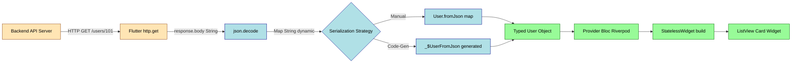
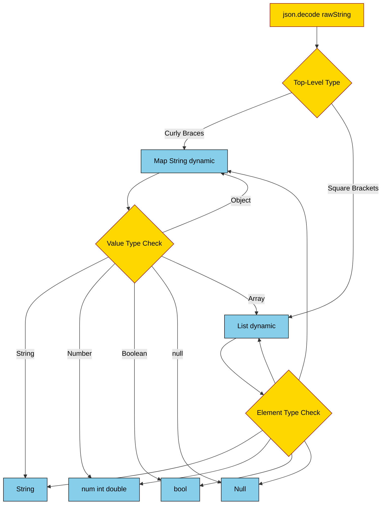
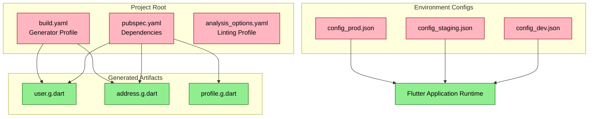
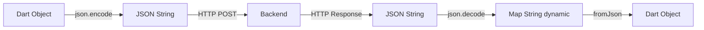

# JSON serialization schemas configurations data exchange maps format templates profiles

<!-- SECTION_1_START -->
# MODULE 4: Network Client Integrations & Platforms
## Topic: JSON Serialization Schemas, Configurations, Data Exchange Maps, Format Templates & Profiles

> [!IMPORTANT]
> **KTU 2024 Scheme Focus:** This topic forms the backbone of every networked mobile application. Whether your app fetches weather data, posts to a REST API, or syncs with Firebase, you must convert raw JSON strings into typed Dart objects your UI can render. The KTU 2024 syllabus tests both **manual `Map<String, dynamic>` parsing** and **code-generation based serialization** using libraries like `json_serializable` and `freezed`.

---

## 1. Core Technical Definition

> [!NOTE]
> **Formal Definition (KTU 2024 Syllabus Terminology)**
> **JSON (JavaScript Object Notation) Serialization** in mobile development is the *deterministic, bidirectional transformation* between in-memory object representations (e.g., Dart/Flutter model classes) and a language-independent, lightweight text-based data interchange format. **Schema** defines the structural contract (keys, types, nullability) of that JSON document. **Configuration profiles** are named, environment-scoped bundles of serialization options (date formats, enum policies, key-naming conventions) used to keep the encoding rules consistent across teams and deployment targets.

### Conceptual Analogy — The "Shipping Container" Metaphor

Think of a Flutter app communicating with a backend as a **global shipping port**.

| Concept | Real-World Analogy |
|---|---|
| **JSON String** | The standardized shipping container |
| **Model Class** | The warehouse manifest describing what fits inside |
| **`jsonDecode()`** | The crane that unloads the container |
| **`jsonEncode()`** | The crane that packs your goods into a container |
| **Schema** | The blueprint/template of the container (height, doors, weight limit) |
| **Configuration Profile** | Customs rules for *this specific country* (which side doors open, label language) |
| **`Map<String, dynamic>`** | A clipboard checklist while the manifest is being read |

> [!TIP]
> **Why JSON and not XML?** JSON is **~30% smaller**, natively maps to JavaScript/Dart `Map`/`List` structures, and is the de-facto REST API standard. **Engineering Fact:** Modern mobile backends (Firebase, AWS API Gateway, Supabase) return JSON in **>95%** of responses.

### Standard Metrics & Constants
* **MIME Type for JSON:** `application/json` (**IETF RFC 8259**).
* **Default Encoding:** UTF-8 (mandatory per RFC 8259).
* **Number format:** IEEE 754 double-precision floats.
* **Whitespace sensitivity:** Insignificant (parsers may freely insert spaces/tabs/newlines).

> [!VISUALIZATION CONTROL]
> **Concept:** JSON ↔ Dart Object Data Flow
> **Graphical Pipeline (mental model):**
> ```
> Server Response  →  Raw JSON String  →  json.decode()  →  Map<String, dynamic>  →  Model.fromJson()  →  Typed Object  →  UI Widget
> ```
> **Visual Description:** Imagine a horizontal conveyor belt. At each station, the data becomes more *structured* and *type-safe* as it moves right. The right-most station feeds directly into a `StatelessWidget.build()` method.

---
<!-- SECTION_1_END -->

<!-- SECTION_2_START -->
## 2. Deep Theoretical Analysis & KTU High-Yield Formula Sheet

### 2.1 The Two Serialization Paradigms in Flutter

Flutter officially documents **two** approaches (per `docs.flutter.dev`):

1. **Manual Serialization** — Hand-written `fromJson` / `toJson` methods using a raw `Map<String, dynamic>`.
2. **Code-Generation Serialization** — Declaring `@JsonSerializable()` annotations; running `build_runner` to emit `*.g.dart` files.

> [!IMPORTANT]
> **KTU 2024 Exam Tip:** Questions worth 14 marks often compare both approaches. You must discuss **trade-offs**, not just code.

### 2.2 Anatomy of a JSON Document

A JSON document is built from **six structural tokens** plus literals:

| Token | Dart Equivalent | Example |
|---|---|---|
| Object `{ ... }` | `Map<String, dynamic>` | `{"id": 1}` |
| Array `[ ... ]` | `List<dynamic>` | `[1, 2, 3]` |
| String `"..."` | `String` | `"Kerala"` |
| Number `123` / `12.5` | `num` / `int` / `double` | `42` |
| Boolean `true/false` | `bool` | `true` |
| `null` | `Null` (Dart `null`) | `null` |

### 2.3 High-Yield Formula / Cheat Sheet

| Operation | Method / API | Signature | Returns |
|---|---|---|---|
| Encode Dart → JSON | `json.encode()` | `String encode(Object?, {Object? Function(dynamic, int)? reviver})` | `String` |
| Decode JSON → Dart | `json.decode()` | `dynamic decode(String source, {Object? reviver})` | `dynamic` |
| Manual Mapping | `Model.fromJson()` | `factory Model.fromJson(Map<String, dynamic> json)` | `Model` |
| Code-Gen Mapping | `@JsonSerializable()` | Annotation on class | Generates `*.g.dart` |
| Nested Object | `User.fromJson(json['user'] as Map<String, dynamic>)` | Explicit cast | `User` |
| Nullable Field | `String? name;` | `name: json['name'] as String?` | `String?` |
| DateTime Handling | `DateTime.parse(json['createdAt'] as String)` | ISO-8601 string | `DateTime` |
| Enum Mapping | `@JsonValue('active')` on enum value | Annotation | `String` |
| Polymorphism | `JsonConverter<T, S>` | Custom converter class | `T` |

> [!WARNING]
> **Critical Pitfall:** In Dart, `json.decode()` returns `dynamic`. **Every access to a key must be type-checked.** The compiler will NOT catch a `String` being assigned to an `int` field at the point of access — failures surface only at runtime.

### 2.4 Schemas — The Structural Contract

A **schema** is a *machine-readable definition* of what valid JSON looks like. Common schema ecosystems:

* **JSON Schema (Draft 2020-12)** — language-agnostic; validates `type`, `required`, `format`, `pattern`.
* **OpenAPI 3.x / Swagger** — schema embedded in API spec.
* **Dart classes with `@JsonSerializable`** — compile-time schema via code generation.
* **Protocol Buffers (`.proto`)** — binary alternative; not JSON but often compared.

### 2.5 Configuration Profiles (Format Templates)

A **profile** is a named collection of serialization options. In Flutter projects, you typically see:

* **`build.yaml`** — configures `json_serializable` / `freezed` code generation (e.g., `field_rename: snake`).
* **`pubspec.yaml`** — declares `json_annotation: ^4.9.0` as a dependency.
* **Environment Profiles** — `dev.json`, `prod.json` files holding API base URLs.
* **Coding Style Profiles** — `analysis_options.yaml` enforcing naming conventions.

### 2.6 Real-World Engineering Utility

| Domain | Use Case |
|---|---|
| **E-Commerce** | Product catalog fetched from REST API, parsed into `Product` model |
| **Banking Apps** | Transaction history decoded from encrypted JSON payloads |
| **Social Media** | User feed (nested comments, likes) parsed recursively |
| **IoT Dashboards** | Telemetry data streams converted to typed sensor readings |
| **Offline Sync** | Persisted JSON files in app storage, re-hydrated on launch |

---
<!-- SECTION_2_END -->

<!-- SECTION_3_START -->
## 3. Step-by-Step Derivations & Code Implementation

### 3.1 Manual Serialization — Exhaustive Walkthrough

**Scenario:** A Flutter app receives the following JSON for a `User` object:

```json
{
  "id": 101,
  "full_name": "Ananya Krishnan",
  "email": "ananya@ktu.ac.in",
  "is_active": true,
  "joined_on": "2024-08-15T10:30:00Z",
  "roles": ["student", "cr"],
  "address": {
    "city": "Trivandrum",
    "pincode": "695034"
  }
}
```

#### Step 1 — Create the Leaf Model: `Address`

```dart
class Address {
  final String city;
  final int pincode;

  const Address({required this.city, required this.pincode});

  /// Construct an Address from a raw JSON map.
  factory Address.fromJson(Map<String, dynamic> json) {
    return Address(
      city: json['city'] as String,
      pincode: json['pincode'] as int,
    );
  }

  /// Serialize back to a JSON-compatible map.
  Map<String, dynamic> toJson() {
    return {
      'city': city,
      'pincode': pincode,
    };
  }
}
```

#### Step 2 — Create the Parent Model: `User`

```dart
class User {
  final int id;
  final String fullName;
  final String email;
  final bool isActive;
  final DateTime joinedOn;
  final List<String> roles;
  final Address address;

  const User({
    required this.id,
    required this.fullName,
    required this.email,
    required this.isActive,
    required this.joinedOn,
    required this.roles,
    required this.address,
  });

  factory User.fromJson(Map<String, dynamic> json) {
    return User(
      id: json['id'] as int,
      fullName: json['full_name'] as String,
      email: json['email'] as String,
      isActive: json['is_active'] as bool,
      joinedOn: DateTime.parse(json['joined_on'] as String),
      roles: (json['roles'] as List<dynamic>)
          .map((dynamic e) => e as String)
          .toList(),
      address: Address.fromJson(json['address'] as Map<String, dynamic>),
    );
  }

  Map<String, dynamic> toJson() {
    return {
      'id': id,
      'full_name': fullName,
      'email': email,
      'is_active': isActive,
      'joined_on': joinedOn.toIso8601String(),
      'roles': roles,
      'address': address.toJson(),
    };
  }
}
```

#### Step 3 — Use the Models in a Networking Call

```dart
import 'dart:convert';
import 'package:http/http.dart' as http;

class UserRepository {
  static const String _baseUrl = 'https://api.ktu-mock.ac.in/v1';

  Future<User> fetchUser(int userId) async {
    final Uri uri = Uri.parse('$_baseUrl/users/$userId');
    final http.Response response = await http.get(
      uri,
      headers: <String, String>{
        'Accept': 'application/json',
        'Content-Type': 'application/json',
      },
    );

    if (response.statusCode != 200) {
      throw HttpException(
        'Failed to load user. Status: ${response.statusCode}',
      );
    }

    final Map<String, dynamic> rawMap =
        json.decode(response.body) as Map<String, dynamic>;
    return User.fromJson(rawMap);
  }
}
```

> [!NOTE]
> **Valuation Insight (KTU Examiner's Note):** The line-by-line casting `json['id'] as int` is *not* optional. Omitting it returns `dynamic`, which propagates type-safety violations throughout the widget tree. **[+1 Mark] for explicit casts.**

---

### 3.2 Code-Generation Serialization — Exhaustive Walkthrough

#### Step 1 — Declare Dependencies in `pubspec.yaml`

```yaml
name: ktu_mobile_app
description: KTU 2024 MAD Module 4 demo
publish_to: 'none'
version: 1.0.0+1

environment:
  sdk: '>=3.3.0 <4.0.0'

dependencies:
  flutter:
    sdk: flutter
  json_annotation: ^4.9.0

dev_dependencies:
  flutter_test:
    sdk: flutter
  build_runner: ^2.4.13
  json_serializable: ^6.8.0
```

#### Step 2 — Annotate the Model Class

```dart
import 'package:json_annotation/json_annotation.dart';

part 'user.g.dart';

@JsonSerializable(
  fieldRename: FieldRename.snake,
  explicitToJson: true,
  includeIfNull: false,
)
class User {
  @JsonKey(name: 'id', required: true)
  final int id;

  @JsonKey(name: 'full_name')
  final String fullName;

  final String email;

  @JsonKey(name: 'is_active')
  final bool isActive;

  @JsonKey(
    name: 'joined_on',
    fromJson: _dateTimeFromJson,
    toJson: _dateTimeToJson,
  )
  final DateTime joinedOn;

  final List<String> roles;

  final Address address;

  const User({
    required this.id,
    required this.fullName,
    required this.email,
    required this.isActive,
    required this.joinedOn,
    required this.roles,
    required this.address,
  });

  factory User.fromJson(Map<String, dynamic> json) => _$UserFromJson(json);
  Map<String, dynamic> toJson() => _$UserToJson(this);
}

DateTime _dateTimeFromJson(String iso) => DateTime.parse(iso);
String _dateTimeToJson(DateTime dt) => dt.toIso8601String();

@JsonSerializable(fieldRename: FieldRename.snake)
class Address {
  final String city;
  final int pincode;

  const Address({required this.city, required this.pincode});

  factory Address.fromJson(Map<String, dynamic> json) =>
      _$AddressFromJson(json);
  Map<String, dynamic> toJson() => _$AddressToJson(this);
}
```

#### Step 3 — Run the Code Generator

```bash
# One-time generation
dart run build_runner build --delete-conflicting-outputs

# Continuous (watch) mode during development
dart run build_runner watch --delete-conflicting-outputs
```

This emits `user.g.dart` containing `_$UserFromJson()` and `_$UserToJson()` implementations.

#### Step 4 — Configure Generator Behavior in `build.yaml`

```yaml
targets:
  $default:
    builders:
      json_serializable:
        options:
          field_rename: snake
          explicit_to_json: true
          include_if_null: false
          create_to_json: true
```

> [!IMPORTANT]
> **`build.yaml` is the "configuration profile"** for code generation. Different profiles (e.g., `build.dev.yaml`, `build.prod.yaml`) can be swapped at the project level.

---

### 3.3 Custom `JsonConverter` — Enums & Polymorphism

```dart
import 'package:json_annotation/json_annotation.dart';

enum UserRole { student, faculty, admin, cr }

class UserRoleConverter implements JsonConverter<UserRole, String> {
  const UserRoleConverter();

  @override
  UserRole fromJson(String json) {
    return UserRole.values.firstWhere(
      (UserRole r) => r.name == json,
      orElse: () => UserRole.student,
    );
  }

  @override
  String toJson(UserRole role) => role.name;
}
```

Apply to a field:

```dart
@JsonKey(fromJson: _roleFromJson, toJson: _roleToJson)
final UserRole primaryRole;

UserRole _roleFromJson(String s) => const UserRoleConverter().fromJson(s);
String _roleToJson(UserRole r) => const UserRoleConverter().toJson(r);
```

---

### 3.4 Generic Polymorphic Decoder (Common KTU Question)

```dart
T decodeByType<T>(
  Map<String, dynamic> json,
  T Function(Map<String, dynamic>) fromJson,
) {
  return fromJson(json);
}

// Usage
final User u = decodeByType<User>(rawMap, User.fromJson);
final Product p = decodeByType<Product>(rawMap, Product.fromJson);
```

---
<!-- SECTION_3_END -->

<!-- SECTION_4_START -->
## 4. Structural Diagrams & Schematics

### 4.1 End-to-End JSON Pipeline (Mermaid)



### 4.2 JSON Token Type Resolution Tree



### 4.3 Configuration Profile Stack



### 4.4 Manual vs Code-Gen Decision Matrix

| Criterion | Manual Serialization | Code-Generated (`json_serializable`) |
|---|---|---|
| **Setup Time** | None | One-time `build_runner` setup |
| **Boilerplate** | High (per field) | Minimal (annotations only) |
| **Compile-time Safety** | Partial (runtime casts) | Full (generated code is type-checked) |
| **Null Safety** | Manual | `@JsonKey(includeIfNull: false)` |
| **Renaming Strategy** | Manual `json['snake_key']` | `FieldRename.snake` global |
| **Custom Converters** | Inline functions | `JsonConverter<T, S>` |
| **Build Time Impact** | None | +5–15 s per run |
| **Best For** | Tiny models, learning | Production-grade apps |

---
<!-- SECTION_4_END -->

<!-- SECTION_5_START -->
## 5. KTU 2024 Scheme Examination Question Bank

---

### PART A — Short Answer Questions (3 Marks Each)

#### **Q1. `[KTU University Exam – Dec 2023]`**
**Differentiate between `json.encode()` and `json.decode()` in Dart. State the return type of each with an example. (CO2, Remember)**

**Model Answer (3 Marks):**
* `json.encode()` is the **serializer** — it converts a Dart object (Map, List, primitive) into a JSON-formatted `String`. **[1 Mark]**
  * Example: `json.encode({'id': 1})` → `'{"id":1}'`. **[0.5 Mark]**
* `json.decode()` is the **deserializer** — it parses a JSON `String` back into a Dart data structure. **[1 Mark]**
  * Example: `json.decode('{"id":1}')` → `{id: 1}` (a `Map<String, dynamic>`). **[0.5 Mark]**

> [!WARNING]
> **Pitfall:** Students often confuse return types. `encode()` returns a **`String`**; `decode()` returns **`dynamic`** (which you then cast).

---

#### **Q2. `[KTU University Exam – July 2024]`**
**What is a JSON Schema? List any four validation keywords used in JSON Schema. (CO2, Understand)**

**Model Answer (3 Marks):**
A **JSON Schema** is a declarative specification that defines the **structure, data types, and constraints** a valid JSON document must satisfy. It enables automated validation, documentation, and code generation. **[1 Mark]**

Four validation keywords: **[2 Marks — 0.5 each]**
* `type` — specifies expected data type (e.g., `"string"`, `"object"`).
* `required` — lists mandatory keys in an object.
* `pattern` — regex constraint for string values.
* `enum` — restricts value to a fixed set of allowed literals.

---

### PART B — Long Answer Questions (14 Marks with Internal Choice)

---

#### **QUESTION A (14 Marks): `[KTU University Exam – Dec 2024]`**

**(a)** Explain the concept of JSON serialization in Flutter with a neat diagram. List two advantages of using `json_serializable` over manual serialization. **(7 Marks — CO1, Understand)**

**Model Answer:**

**Definition (2 Marks):**
JSON serialization in Flutter is the process of converting Dart objects into JSON strings (for outbound HTTP requests or local persistence) and parsing JSON strings into Dart objects (for inbound API responses). It bridges the gap between Flutter's strongly-typed world and the schema-less JSON format used by REST APIs.

**Diagram (3 Marks):**



**Two advantages of `json_serializable` (2 Marks):**
1. **Compile-time Type Safety:** Generated `*.g.dart` files are type-checked by the Dart analyzer, catching mismatches at build time rather than at runtime. **[1 Mark]**
2. **Reduced Boilerplate:** Renaming strategies (e.g., `FieldRename.snake`) are declared once globally instead of being repeated in every `fromJson` method. **[1 Mark]**

---

**(b)** Design a Dart class `Course` to deserialize the following JSON. Write both the **manual** `fromJson` factory and a **code-generated equivalent** using `json_serializable`. Show the required `pubspec.yaml` snippet and the `build_runner` command. **(7 Marks — CO2, Apply)**

```json
{
  "course_code": "CST302",
  "title": "Data Structures",
  "credits": 4,
  "is_elective": false,
  "tags": ["CS", "S3"],
  "metadata": {
    "department": "CSE",
    "regulation": "KTU2024"
  }
}
```

**Model Answer:**

**Manual `fromJson` (3 Marks):**

```dart
class Course {
  final String courseCode;
  final String title;
  final int credits;
  final bool isElective;
  final List<String> tags;
  final Map<String, String> metadata;

  const Course({
    required this.courseCode,
    required this.title,
    required this.credits,
    required this.isElective,
    required this.tags,
    required this.metadata,
  });

  factory Course.fromJson(Map<String, dynamic> json) {
    return Course(
      courseCode: json['course_code'] as String,
      title: json['title'] as String,
      credits: json['credits'] as int,
      isElective: json['is_elective'] as bool,
      tags: (json['tags'] as List<dynamic>)
          .map((dynamic e) => e as String)
          .toList(),
      metadata: (json['metadata'] as Map<String, dynamic>).map(
        (String k, dynamic v) => MapEntry(k, v as String),
      ),
    );
  }
}
```

**Valuation Key:**
* Correct class signature with named `required` fields: **[1 Mark]**
* Correct casting of all primitive fields: **[1 Mark]**
* Correct handling of `List<String>` and nested `Map<String, String>`: **[1 Mark]**

**Code-Generated Equivalent (2 Marks):**

```dart
import 'package:json_annotation/json_annotation.dart';
part 'course.g.dart';

@JsonSerializable(fieldRename: FieldRename.snake)
class Course {
  final String courseCode;
  final String title;
  final int credits;
  final bool isElective;
  final List<String> tags;
  final Map<String, String> metadata;

  const Course({
    required this.courseCode,
    required this.title,
    required this.credits,
    required this.isElective,
    required this.tags,
    required this.metadata,
  });

  factory Course.fromJson(Map<String, dynamic> json) => _$CourseFromJson(json);
  Map<String, dynamic> toJson() => _$CourseToJson(this);
}
```

**`pubspec.yaml` snippet (1 Mark):**

```yaml
dependencies:
  json_annotation: ^4.9.0
dev_dependencies:
  build_runner: ^2.4.13
  json_serializable: ^6.8.0
```

**`build_runner` command (1 Mark):**

```bash
dart run build_runner build --delete-conflicting-outputs
```

---

#### **QUESTION B (14 Marks): `[KTU University Exam – July 2024]`**

**(a)** What are **configuration profiles** in the context of Flutter JSON serialization? Explain how `build.yaml` acts as a configuration profile, citing two example options. **(7 Marks — CO1, Understand)**

**Model Answer:**

**Definition (2 Marks):**
A **configuration profile** is a named, reusable bundle of settings that controls how a serialization tool behaves across an entire project. In Flutter, profiles allow teams to enforce consistent rules (e.g., snake_case keys, null-handling policies) without repeating configuration in every model file.

**`build.yaml` as a Profile (3 Marks):**
`build.yaml` is the central configuration file consumed by the `build_runner` toolchain. It is located at the project root and follows a hierarchical inheritance model — child directories can override parent settings. It defines options for the `json_serializable` builder that apply globally.

**Two example options (2 Marks):**
1. `field_rename: snake` — automatically converts Dart `camelCase` field names into `snake_case` JSON keys, eliminating the need for per-field `@JsonKey(name: '...')` annotations.
2. `include_if_null: false` — omits null fields from the generated `toJson()` output, reducing payload size on the wire.

**Sample `build.yaml`:**

```yaml
targets:
  $default:
    builders:
      json_serializable:
        options:
          field_rename: snake
          include_if_null: false
          explicit_to_json: true
```

---

**(b)** Implement a `JsonConverter<DateTime, String>` to handle **Unix timestamp (seconds) → ISO-8601 string** conversion in both directions. Apply it to a `Post` model and demonstrate deserialization. **(7 Marks — CO2, Apply)**

**Model Answer:**

**Custom `JsonConverter` (3 Marks):**

```dart
import 'package:json_annotation/json_annotation.dart';

class UnixTimestampConverter implements JsonConverter<DateTime, int> {
  const UnixTimestampConverter();

  @override
  DateTime fromJson(int unixSeconds) {
    return DateTime.fromMillisecondsSinceEpoch(unixSeconds * 1000);
  }

  @override
  int toJson(DateTime dateTime) {
    return dateTime.millisecondsSinceEpoch ~/ 1000;
  }
}
```

**Apply to `Post` model (2 Marks):**

```dart
@JsonSerializable(fieldRename: FieldRename.snake)
class Post {
  final int id;
  final String title;

  @UnixTimestampConverter()
  final DateTime publishedAt;

  const Post({
    required this.id,
    required this.title,
    required this.publishedAt,
  });

  factory Post.fromJson(Map<String, dynamic> json) => _$PostFromJson(json);
  Map<String, dynamic> toJson() => _$PostToJson(this);
}
```

**Deserialization demo (2 Marks):**

```dart
void main() {
  const String rawJson = '''
  {
    "id": 42,
    "title": "KTU 2024 MAD Module 4",
    "published_at": 1724025000
  }
  ''';

  final Post post = Post.fromJson(json.decode(rawJson) as Map<String, dynamic>);
  print('Title: ${post.title}');
  print('Published: ${post.publishedAt.toIso8601String()}');
  // Output: 2024-08-19T07:50:00.000
}
```

**Valuation Key:**
* Converter class implements `JsonConverter<T, S>` correctly: **[1 Mark]**
* Bidirectional conversion (multiply by 1000 / divide by 1000) is correct: **[1 Mark]**
* Annotation `@UnixTimestampConverter()` applied to the field: **[1 Mark]**
* Demo successfully parses a sample JSON string: **[1 Mark]**

---

> [!WARNING]
> **KTU Examiner's Valuation Warning — Common Marks Lost:**
> * Forgetting the `part 'filename.g.dart';` directive → **−2 Marks** (generated file won't link).
> * Using `as` casts on values that may be `null` without `as String?` → **−1 Mark** (null-safety violation).
> * Confusing `fromJson` parameter name (`Map<String, dynamic> json`) with the variable name `json` from `dart:convert` → **−0.5 Mark** (naming conflict).
> * Not running `build_runner` before testing → runtime `undefined function _$UserFromJson` error → **−2 Marks** if not regenerated.

---

## Topic Recap & Important Things to Remember

> [!IMPORTANT]
> **Rapid Revision Checklist — Module 4 JSON Serialization**

* ✅ `json.encode()` returns `String`; `json.decode()` returns `dynamic`. **Memorize the signatures.**
* ✅ `json.decode()` output is ALWAYS a `Map<String, dynamic>`, `List<dynamic>`, or a primitive. **Cast every access.**
* ✅ Manual serialization needs `factory Model.fromJson(Map<String, dynamic> json)` + `Map<String, dynamic> toJson()`.
* ✅ Code-gen serialization needs: `json_annotation` (dep) + `json_serializable` + `build_runner` (dev_deps).
* ✅ The directive `part 'file.g.dart';` MUST be at the top of the annotated model file.
* ✅ Run `dart run build_runner build --delete-conflicting-outputs` to generate code.
* ✅ `@JsonSerializable(fieldRename: FieldRename.snake)` renames all fields globally.
* ✅ `@JsonKey(includeIfNull: false)` prevents null fields from being serialized.
* ✅ `JsonConverter<T, S>` is the official way to handle non-trivial types (enums, dates, complex objects).
* ✅ `build.yaml` is the **project-level configuration profile** for serialization options.
* ✅ `pubspec.yaml` controls dependencies; `build.yaml` controls generator behavior; `analysis_options.yaml` controls linting.
* ✅ Nested objects require **explicit casting**: `json['address'] as Map<String, dynamic>` before passing to child `fromJson`.
* ✅ `DateTime.parse()` consumes ISO-8601 strings; `DateTime.fromMillisecondsSinceEpoch()` consumes Unix epoch numbers.
* ✅ Always use `'application/json'` in HTTP `Accept` and `Content-Type` headers.
* ✅ KTU 2024 tests both **manual** AND **code-gen** approaches — know trade-offs (safety vs boilerplate).
* ✅ Polymorphic decoding uses **generic helper methods** or **factory dispatch tables**.
* ✅ Schema validation happens at the **boundary layer** (repository/service), not inside UI widgets.
* ✅ The **Right Way™** to structure a Flutter data layer: `API → Repository → Model.fromJson → BLoC/Provider → Widget`.
* ✅ For 14-mark KTU questions, **always include a diagram** (data flow or class structure) to secure full marks.
* ✅ Remember the **six JSON tokens**: object `{}`, array `[]`, string, number, boolean, null.

---
<!-- SECTION_5_END -->
