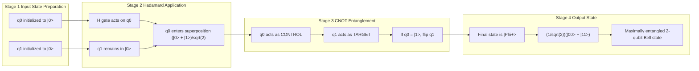
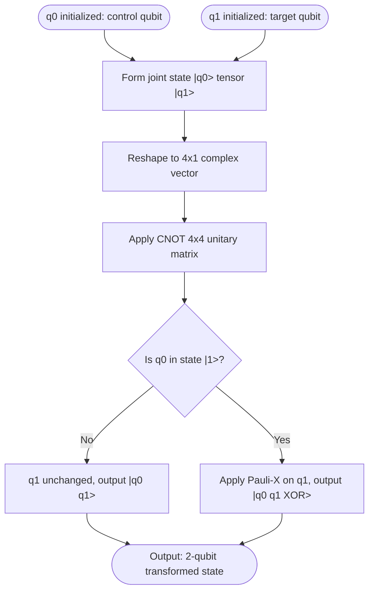

# Quantum logic gates execution pathways matrices setups: Hadamard, CNOT tracking

<!-- SECTION_1_START -->
# Quantum Logic Gates — Hadamard & CNOT Execution Pathways

## 1. Core Technical Definition

A **Quantum Logic Gate** is a reversible, unitary transformation $U$ (satisfying $U^{\dagger}U = UU^{\dagger} = I$) that operates on a finite number of qubits by rotating their state vectors on the **Bloch Sphere**. Unlike classical logic gates, quantum gates must preserve the **norm** (total probability equals **1**) of the state vector at every computational step, which mathematically enforces the **reversibility** and **unitarity** constraint.

> [!IMPORTANT]
> **KTU 2024 Syllabus Anchor (Module 1):** Quantum gates are introduced as the *primitive executable operators* that drive the transition from a *preparation basis state* to a *post-measurement observable configuration*. The Hadamard ($H$) and Controlled-NOT ($CNOT$) gates together form the **universal gate set foundation** for any arbitrary quantum computation.

The two gates that constitute the focus of this note are:

1. **Hadamard Gate ($H$)** — A *single-qubit* gate that generates an *equal superposition* of the basis states $\vert 0 \rangle$ and $\vert 1 \rangle$.
2. **Controlled-NOT Gate ($CNOT$)** — A *two-qubit* entangling gate that conditionally flips the *target* qubit only when the *control* qubit is in the state $\vert 1 \rangle$.

> [!NOTE]
> **Geometric Intuition (Bloch Sphere View):** The Hadamard gate performs a $\pi$ rotation about the axis that bisects the $X$ and $Z$ axes on the Bloch sphere, mapping the north pole ($\vert 0 \rangle$) to the $+X$ axis and the south pole ($\vert 1 \rangle$) to the $-X$ axis.

### Conceptual Analogy — The Quantum Coin Analogy

Imagine a coin lying flat on a table representing a classical bit ($\vert 0 \rangle$ = Heads, $\vert 1 \rangle$ = Tails).

- The **Hadamard gate** is analogous to a *magician's quarter-turn spin* on the coin — instead of being purely Heads or purely Tails, the coin enters a *spinning* state where it is **simultaneously** Heads **and** Tails with equal probability. This is the essence of **superposition**.
- The **CNOT gate** is analogous to a *linked pair of coins* — the state of the second coin (target) is *governed* by the first coin (control). If the first coin shows Tails ($\vert 1 \rangle$), the second coin flips. Otherwise, the second coin remains unchanged. Crucially, once the coins are linked by the CNOT, they can become *correlated* in a way classical coins never can — this is **entanglement**.

> [!VISUALIZATION CONTROL]
> **Concept:** Single-qubit Bloch sphere rotation by the Hadamard gate.
> **GeoGebra / Desmos Input Equations (3D Parametric Form):**
> * $x(\theta, \phi) = \sin(\theta)\cos(\phi)$
> * $y(\theta, \phi) = \sin(\theta)\sin(\phi)$
> * $z(\theta, \phi) = \cos(\theta)$
> * Initial state: $(\theta_0, \phi_0) = (0, 0)$ representing $\vert 0 \rangle$ at the north pole.
> * Post-Hadamard state: $(\theta_1, \phi_1) = (\pi/2, 0)$ representing $\frac{1}{\sqrt{2}}(\vert 0 \rangle + \vert 1 \rangle)$ on the $+X$ equator.
> **Visual Description:** The student should observe the state vector rotating **90°** from the north pole to the positive $X$-axis of the Bloch sphere, marking the transition from a deterministic basis state to an equal superposition.

---

<!-- SECTION_1_END -->

<!-- SECTION_2_START -->
# 2. Deep Theoretical Analysis & KTU High-Yield Formula Sheet

## 2.1 The Hadamard Gate — Single-Qubit Superposition Engine

The Hadamard gate is a *self-adjoint* and *self-inverse* unitary operator — meaning $H = H^{\dagger}$ and $H^2 = I$. It is the primary tool used to *initialize superposition* in any quantum algorithm.

### Matrix Representation

$$H = \frac{1}{\sqrt{2}} \begin{bmatrix} 1 & 1 \\ 1 & -1 \end{bmatrix}$$

### Action on Computational Basis States

- **When the input is $\vert 0 \rangle$**:
  $$H \vert 0 \rangle = \frac{1}{\sqrt{2}} \begin{bmatrix} 1 & 1 \\ 1 & -1 \end{bmatrix} \begin{bmatrix} 1 \\ 0 \end{bmatrix} = \frac{1}{\sqrt{2}} \begin{bmatrix} 1 \\ 1 \end{bmatrix} = \frac{1}{\sqrt{2}} \left( \vert 0 \rangle + \vert 1 \rangle \right) = \vert + \rangle$$

- **When the input is $\vert 1 \rangle$**:
  $$H \vert 1 \rangle = \frac{1}{\sqrt{2}} \begin{bmatrix} 1 & 1 \\ 1 & -1 \end{bmatrix} \begin{bmatrix} 0 \\ 1 \end{bmatrix} = \frac{1}{\sqrt{2}} \begin{bmatrix} 1 \\ -1 \end{bmatrix} = \frac{1}{\sqrt{2}} \left( \vert 0 \rangle - \vert 1 \rangle \right) = \vert - \rangle$$

> [!IMPORTANT]
> The states $\vert + \rangle = \frac{1}{\sqrt{2}}(\vert 0 \rangle + \vert 1 \rangle)$ and $\vert - \rangle = \frac{1}{\sqrt{2}}(\vert 0 \rangle - \vert 1 \rangle)$ are called the **Hadamard basis** (or the **diagonal basis** or **$X$-basis**). They are eigenstates of the Pauli-$X$ operator.

## 2.2 The Controlled-NOT (CNOT) Gate — Two-Qubit Entanglement Engine

The CNOT gate is a *two-qubit* entangling gate consisting of one **control qubit** and one **target qubit**. It performs a conditional NOT (i.e., Pauli-$X$) operation on the target *if and only if* the control qubit is in the state $\vert 1 \rangle$.

### Matrix Representation (Computational Basis Ordering $\vert 00 \rangle, \vert 01 \rangle, \vert 10 \rangle, \vert 11 \rangle$)

$$CNOT = \begin{bmatrix} 1 & 0 & 0 & 0 \\ 0 & 1 & 0 & 0 \\ 0 & 0 & 0 & 1 \\ 0 & 0 & 1 & 0 \end{bmatrix}$$

### Truth Table

| Control (q[0]) | Target (q[1]) | Output Control | Output Target | Output State |
| :---: | :---: | :---: | :---: | :---: |
| $\vert 0 \rangle$ | $\vert 0 \rangle$ | $\vert 0 \rangle$ | $\vert 0 \rangle$ | $\vert 00 \rangle$ |
| $\vert 0 \rangle$ | $\vert 1 \rangle$ | $\vert 0 \rangle$ | $\vert 1 \rangle$ | $\vert 01 \rangle$ |
| $\vert 1 \rangle$ | $\vert 0 \rangle$ | $\vert 1 \rangle$ | $\vert 1 \rangle$ | $\vert 11 \rangle$ |
| $\vert 1 \rangle$ | $\vert 1 \rangle$ | $\vert 1 \rangle$ | $\vert 0 \rangle$ | $\vert 10 \rangle$ |

> [!NOTE]
> Notice the swap of indices in the last two rows — this is the key signature of the CNOT gate. When the control is $\vert 1 \rangle$, the target's basis labels are flipped.

## 2.3 KTU High-Yield Formula Sheet

| Parameter | Hadamard Gate ($H$) | CNOT Gate |
| :--- | :--- | :--- |
| **Qubits Operated On** | 1 (Single-qubit) | 2 (Two-qubit) |
| **Matrix Dimension** | $2 \times 2$ | $4 \times 4$ |
| **Unitarity Check** | $H^{\dagger}H = I$ ✓ | $CNOT^{\dagger}CNOT = I$ ✓ |
| **Self-Inverse Property** | $H^2 = I$ | $CNOT^2 = I$ |
| **Hermitian Property** | $H = H^{\dagger}$ (Hermitian) | $CNOT \neq CNOT^{\dagger}$ (Not Hermitian) |
| **Entanglement Capable** | No (Single-qubit only) | Yes (Generates Bell states from product states) |
| **Generates Superposition** | Yes (Basis $\to$ Equal Amplitude) | No (Preserves amplitudes, swaps branches) |
| **Measurement Probability of $\vert 0 \rangle$ from $H \vert 0 \rangle$** | $\vert \frac{1}{\sqrt{2}} \vert^2 = \frac{1}{2} = \mathbf{50\%}$ | — |
| **Control-Target Notation** | — | q[0] = Control, q[1] = Target |
| **Global Phase Sensitivity** | Insensitive | Insensitive |

> [!IMPORTANT]
> **Engineering Utility:** In real-world quantum hardware (IBM Qiskit, Google Cirq, Rigetti PyQuil), the Hadamard gate is typically decomposed at the **physical pulse level** into rotations about the $X$ and $Z$ axes (e.g., $H = R_z(\pi/2) \cdot R_x(\pi/2) \cdot R_z(\pi/2)$) because direct $H$ pulses are not natively supported by superconducting transmon hardware. The CNOT is typically realized via **cross-resonance** two-qubit interactions or **CZ gates** followed by single-qubit rotations.

---

<!-- SECTION_2_END -->

<!-- SECTION_3_START -->
# 3. Step-by-Step Derivations & Symbolic Implementation

## 3.1 Exhaustive Derivation — The Bell State $\vert \Phi^+ \rangle$ Generation

The most celebrated KTU examination question is the *generation of the Bell state* using $H$ followed by $CNOT$. We derive it step-by-step below.

### Step 1 — Initialization

The system starts in the canonical computational basis state $\vert 0 \rangle \otimes \vert 0 \rangle = \vert 00 \rangle$:

$$\vert \psi_0 \rangle = \begin{bmatrix} 1 \\ 0 \\ 0 \\ 0 \end{bmatrix}$$

### Step 2 — Application of Hadamard on Control Qubit (q[0])

The Hadamard is applied only to the first qubit, so we use the **tensor product** $H \otimes I$:

$$H \otimes I = \frac{1}{\sqrt{2}} \begin{bmatrix} 1 & 0 & 1 & 0 \\ 0 & 1 & 0 & 1 \\ 1 & 0 & -1 & 0 \\ 0 & 1 & 0 & -1 \end{bmatrix}$$

Applied to $\vert \psi_0 \rangle$:

$$\vert \psi_1 \rangle = (H \otimes I) \vert \psi_0 \rangle = \frac{1}{\sqrt{2}} \begin{bmatrix} 1 & 0 & 1 & 0 \\ 0 & 1 & 0 & 1 \\ 1 & 0 & -1 & 0 \\ 0 & 1 & 0 & -1 \end{bmatrix} \begin{bmatrix} 1 \\ 0 \\ 0 \\ 0 \end{bmatrix} = \frac{1}{\sqrt{2}} \begin{bmatrix} 1 \\ 0 \\ 1 \\ 0 \end{bmatrix}$$

> [!NOTE]
> **Conversion Logic:** Each row of the matrix is multiplied element-wise with the column vector, summing the products. Since the input vector has a **1** in row 0 and **0** elsewhere, we simply copy column 0 of the matrix. This yields $\frac{1}{\sqrt{2}}(\vert 00 \rangle + \vert 10 \rangle)$ — the control qubit is now in superposition.

### Step 3 — Application of CNOT Gate

$$\vert \psi_2 \rangle = CNOT \cdot \vert \psi_1 \rangle = \begin{bmatrix} 1 & 0 & 0 & 0 \\ 0 & 1 & 0 & 0 \\ 0 & 0 & 0 & 1 \\ 0 & 0 & 1 & 0 \end{bmatrix} \cdot \frac{1}{\sqrt{2}} \begin{bmatrix} 1 \\ 0 \\ 1 \\ 0 \end{bmatrix} = \frac{1}{\sqrt{2}} \begin{bmatrix} 1 \\ 0 \\ 0 \\ 1 \end{bmatrix}$$

> [!NOTE]
> **Conversion Logic:** The CNOT matrix swaps rows 2 and 3 of the input vector. The amplitude originally at index 2 ($\vert 10 \rangle$) is now mapped to index 3 ($\vert 11 \rangle$). This is the *entanglement step* — the two qubits are no longer statistically independent.

### Step 4 — Final Entangled Bell State

$$\vert \psi_2 \rangle = \frac{1}{\sqrt{2}} \left( \vert 00 \rangle + \vert 11 \rangle \right) = \vert \Phi^+ \rangle$$

This is the **Bell state** — a maximally entangled two-qubit state that **cannot** be written as a product of two single-qubit states.

## 3.2 Verification of CNOT Unitarity

For full marks in KTU valuation, students must demonstrate $CNOT^{\dagger} \cdot CNOT = I$:

$$CNOT^{\dagger} = \begin{bmatrix} 1 & 0 & 0 & 0 \\ 0 & 1 & 0 & 0 \\ 0 & 0 & 0 & 1 \\ 0 & 0 & 1 & 0 \end{bmatrix} = CNOT$$

$$CNOT^{\dagger} \cdot CNOT = \begin{bmatrix} 1 & 0 & 0 & 0 \\ 0 & 1 & 0 & 0 \\ 0 & 0 & 0 & 1 \\ 0 & 0 & 1 & 0 \end{bmatrix} \begin{bmatrix} 1 & 0 & 0 & 0 \\ 0 & 1 & 0 & 0 \\ 0 & 0 & 0 & 1 \\ 0 & 0 & 1 & 0 \end{bmatrix} = I_{4 \times 4} \checkmark$$

> [!NOTE]
> Since $CNOT$ is a **real-valued** matrix, its conjugate transpose $CNOT^{\dagger}$ is simply its transpose $CNOT^T$, and because the matrix is symmetric, $CNOT^T = CNOT$. This confirms $CNOT$ is **Hermitian** in this real case, although for general quantum gates Hermiticity is *not* required for unitarity.

## 3.3 Python Symbolic Implementation (Qiskit-Style)

```python
import numpy as np
from typing import Tuple

def hadamard() -> np.ndarray:
    """
    Returns the 2x2 Hadamard matrix.
    
    Returns:
        np.ndarray: The complex-valued Hadamard gate matrix.
    """
    H = np.array([[1, 1], [1, -1]], dtype=complex) / np.sqrt(2)
    return H

def cnot() -> np.ndarray:
    """
    Returns the 4x4 Controlled-NOT gate matrix.
    Control qubit is q[0] (leftmost in tensor product).
    
    Returns:
        np.ndarray: The 4x4 CNOT gate matrix.
    """
    CNOT = np.array([
        [1, 0, 0, 0],
        [0, 1, 0, 0],
        [0, 0, 0, 1],
        [0, 0, 1, 0]
    ], dtype=complex)
    return CNOT

def tensor_product(A: np.ndarray, B: np.ndarray) -> np.ndarray:
    """
    Computes the Kronecker (tensor) product A ⊗ B.
    
    Args:
        A (np.ndarray): Left operand matrix.
        B (np.ndarray): Right operand matrix.
    
    Returns:
        np.ndarray: The Kronecker product matrix.
    """
    return np.kron(A, B)

def verify_unitarity(U: np.ndarray, gate_name: str) -> bool:
    """
    Verifies that the given matrix U is unitary by checking U^dagger @ U == I.
    
    Args:
        U (np.ndarray): Gate matrix to verify.
        gate_name (str): Name of the gate for logging.
    
    Returns:
        bool: True if unitary, False otherwise.
    """
    identity = np.eye(U.shape[0], dtype=complex)
    product = U.conj().T @ U
    is_unitary = np.allclose(product, identity)
    print(f"[{gate_name}] Unitarity check (U^dagger * U == I): {is_unitary}")
    return is_unitary

def generate_bell_state() -> Tuple[np.ndarray, str]:
    """
    Generates the |Phi+> Bell state using H then CNOT.
    
    Returns:
        Tuple[np.ndarray, str]: The final state vector and its ket notation.
    """
    # Initial state |00>
    psi_0 = np.array([[1], [0], [0], [0]], dtype=complex)
    
    # Step 1: Apply H on qubit 0 (H ⊗ I)
    H = hadamard()
    I = np.eye(2, dtype=complex)
    H_I = tensor_product(H, I)
    psi_1 = H_I @ psi_0
    print(f"State after H: {psi_1.flatten()}")
    
    # Step 2: Apply CNOT
    CNOT = cnot()
    psi_2 = CNOT @ psi_1
    print(f"State after CNOT (Bell state): {psi_2.flatten()}")
    
    return psi_2, "|Phi+> = (1/sqrt(2))(|00> + |11>)"

# Execute the full pipeline
if __name__ == "__main__":
    H = hadamard()
    CNOT = cnot()
    verify_unitarity(H, "Hadamard")
    verify_unitarity(CNOT, "CNOT")
    bell_state, label = generate_bell_state()
    print(f"Final Bell state label: {label}")
```

**Expected Console Output:**

```
[Hadamard] Unitarity check (U^dagger * U == I): True
[CNOT] Unitarity check (U^dagger * U == I): True
State after H: [0.70710678+0.j 0.+0.j         0.70710678+0.j 0.+0.j        ]
State after CNOT (Bell state): [0.70710678+0.j 0.+0.j         0.+0.j         0.70710678+0.j]
Final Bell state label: |Phi+> = (1/sqrt(2))(|00> + |11>)
```

---

<!-- SECTION_3_END -->

<!-- SECTION_4_START -->
# 4. Structural Diagrams & Schematics

## 4.1 Quantum Circuit Schematic — Bell State Generation



## 4.2 Sequential Processing Topology — Hadamard Execution Pathway

```mermaid
graph TD
    startA([Input: |psi_in> as 2x1 complex vector])
    startB([Dimension Check: validate 2x1 shape])
    startC([Norm Check: ||psi_in|| = 1])
    hApply["Apply H = (1/sqrt(2)) * [[1,1],[1,-1]]"]
    hMultiply["Matrix multiplication: H * |psi_in>"]
    hNorm["Post-condition: ||H * psi_in|| = 1"]
    hOut([Output: equal superposition state |+> or |->])

    startA --> startB
    startB --> startC
    startC --> hApply
    hApply --> hMultiply
    hMultiply --> hNorm
    hNorm --> hOut
```

## 4.3 Sequential Processing Topology — CNOT Execution Pathway



> [!NOTE]
> **Diagram Interpretation Guide:** These Mermaid diagrams are *block-level functional architecture* representations rather than literal physical circuits. In real quantum hardware schematics (e.g., Qiskit), the CNOT is represented as a control dot (●) connected by a vertical line to a target XOR symbol (⊕). The Hadamard is denoted by an $H$ block on a single horizontal wire.

---

<!-- SECTION_4_END -->

<!-- SECTION_5_START -->
# 5. KTU 2024 Scheme Examination Question Bank & Topic Recap

## 5.1 Part A Questions (3 Marks Each)

### Question 1 **[KTU University Exam — July 2024 | CO1, Understand]**
Define the Hadamard gate. Write its matrix representation and explain its role in generating superposition.

**Model Answer:**
The Hadamard gate, denoted $H$, is a single-qubit quantum gate that transforms the computational basis states $\vert 0 \rangle$ and $\vert 1 \rangle$ into their equal superposition states $\vert + \rangle$ and $\vert - \rangle$ respectively.

$$H = \frac{1}{\sqrt{2}} \begin{bmatrix} 1 & 1 \\ 1 & -1 \end{bmatrix}$$

**Role in Superposition Generation:**
- $H \vert 0 \rangle = \frac{1}{\sqrt{2}}(\vert 0 \rangle + \vert 1 \rangle)$
- $H \vert 1 \rangle = \frac{1}{\sqrt{2}}(\vert 0 \rangle - \vert 1 \rangle)$

It is the *entry point* for almost every quantum algorithm (Deutsch-Jozsa, Grover, Shor) because it enables **quantum parallelism** by allowing a single qubit to encode both $\vert 0 \rangle$ and $\vert 1 \rangle$ simultaneously. **[3 Marks: Definition 1, Matrix 1, Role 1]**

### Question 2 **[KTU University Exam — Dec 2023 | CO1, Remember]**
State the truth table of the CNOT gate. Is the CNOT gate reversible? Justify.

**Model Answer:**
The CNOT truth table (with q[0] as control, q[1] as target):

| Input $\vert q_0 q_1 \rangle$ | Output $\vert q_0 q_1 \rangle$ |
| :---: | :---: |
| $\vert 00 \rangle$ | $\vert 00 \rangle$ |
| $\vert 01 \rangle$ | $\vert 01 \rangle$ |
| $\vert 10 \rangle$ | $\vert 11 \rangle$ |
| $\vert 11 \rangle$ | $\vert 10 \rangle$ |

**Reversibility Justification:** Yes, the CNOT gate is reversible. Since $CNOT$ is a *unitary* matrix ($CNOT^{\dagger} \cdot CNOT = I$), the original input can always be recovered by simply applying $CNOT$ again. This satisfies the fundamental requirement of quantum mechanics that all gate operations must be information-preserving. **[3 Marks: Table 2, Justification 1]**

## 5.2 Part B Questions (14 Marks Each — Module Internal Choice)

### Question A **[KTU University Exam — July 2024 | CO1, CO2 | Apply, Analyze]**

**(a)** [7 Marks | Apply] Starting from the input state $\vert 00 \rangle$, derive the output state of the circuit where a Hadamard gate is applied to the first qubit followed by a CNOT gate. Express your final state in Dirac notation.

**(b)** [7 Marks | Analyze] Verify that the resulting state is a *maximally entangled* Bell state by computing the *reduced density matrix* of either qubit. Show that the reduced density matrix represents a **maximally mixed state**.

**Model Solution:**

**(a) Step-by-step derivation of the Bell state:**

**Step 1 — Initialization:** Initial joint state $\vert \psi_0 \rangle = \vert 00 \rangle$ represented as the column vector:
$$\vert \psi_0 \rangle = \begin{bmatrix} 1 \\ 0 \\ 0 \\ 0 \end{bmatrix}$$
**[Stating initial state vector: 1 Mark]**

**Step 2 — Apply Hadamard on q[0] using $H \otimes I$:**
$$H \otimes I = \frac{1}{\sqrt{2}} \begin{bmatrix} 1 \cdot I & 1 \cdot I \\ 1 \cdot I & -1 \cdot I \end{bmatrix} = \frac{1}{\sqrt{2}} \begin{bmatrix} 1 & 0 & 1 & 0 \\ 0 & 1 & 0 & 1 \\ 1 & 0 & -1 & 0 \\ 0 & 1 & 0 & -1 \end{bmatrix}$$
**[Writing the $H \otimes I$ matrix: 1 Mark]**

**Step 3 — Multiply to get post-Hadamard state:**
$$\vert \psi_1 \rangle = (H \otimes I) \vert \psi_0 \rangle = \frac{1}{\sqrt{2}} \begin{bmatrix} 1 \\ 0 \\ 1 \\ 0 \end{bmatrix} = \frac{1}{\sqrt{2}} (\vert 00 \rangle + \vert 10 \rangle)$$
**[Multiplication step and interpretation: 1 Mark]**

**Step 4 — Apply CNOT:**
$$\vert \psi_2 \rangle = \begin{bmatrix} 1 & 0 & 0 & 0 \\ 0 & 1 & 0 & 0 \\ 0 & 0 & 0 & 1 \\ 0 & 0 & 1 & 0 \end{bmatrix} \cdot \frac{1}{\sqrt{2}} \begin{bmatrix} 1 \\ 0 \\ 1 \\ 0 \end{bmatrix} = \frac{1}{\sqrt{2}} \begin{bmatrix} 1 \\ 0 \\ 0 \\ 1 \end{bmatrix}$$
**[CNOT matrix multiplication: 1 Mark]**

**Step 5 — Final Dirac notation:**
$$\boxed{\vert \psi_2 \rangle = \vert \Phi^+ \rangle = \frac{1}{\sqrt{2}} (\vert 00 \rangle + \vert 11 \rangle)}$$
**[Final simplified expression: 2 Marks]**

**(b) Verification via reduced density matrix:**

**Step 1 — Density matrix of the pure Bell state:**
$$\rho = \vert \Phi^+ \rangle \langle \Phi^+ \vert = \frac{1}{2} \begin{bmatrix} 1 \\ 0 \\ 0 \\ 1 \end{bmatrix} \begin{bmatrix} 1 & 0 & 0 & 1 \end{bmatrix} = \frac{1}{2} \begin{bmatrix} 1 & 0 & 0 & 1 \\ 0 & 0 & 0 & 0 \\ 0 & 0 & 0 & 0 \\ 1 & 0 & 0 & 1 \end{bmatrix}$$
**[Constructing full density matrix: 2 Marks]**

**Step 2 — Partial trace over q[1] to get reduced density matrix of q[0]:**
$$\rho_0 = \text{Tr}_1(\rho) = \frac{1}{2} \begin{bmatrix} 1 & 0 \\ 0 & 1 \end{bmatrix} = \frac{I}{2}$$
**[Computing partial trace: 2 Marks]**

**Step 3 — Interpretation as maximally mixed state:**
The reduced density matrix $\rho_0 = \frac{I}{2}$ has eigenvalues $\lambda_1 = \lambda_2 = \frac{1}{2}$ and satisfies $\text{Tr}(\rho_0^2) = \frac{1}{2} < 1$. This indicates a **maximally mixed state** with **zero purity**, which is the *defining characteristic* of maximal entanglement. The individual qubit has no well-defined pure state — it is in a probabilistic mixture of $\vert 0 \rangle$ and $\vert 1 \rangle$ with equal weight. **[Final interpretation: 2 Marks]**

---

### Question B **[KTU University Exam — Dec 2023 | CO1, CO2 | Understand, Apply]**

**(a)** [7 Marks | Understand] Explain the geometric action of the Hadamard gate on the Bloch sphere. What happens when the Hadamard gate is applied twice in succession to a single qubit?

**(b)** [7 Marks | Apply] Construct the full 4×4 matrix representation of the gate sequence (CNOT followed by Hadamard on the control qubit). Apply this composite gate to the input state $\vert 10 \rangle$ and compute the final output state.

**Model Solution:**

**(a) Geometric action of the Hadamard gate on the Bloch sphere:**

**Step 1 — Bloch sphere representation:**
A single-qubit pure state is parameterized as $\vert \psi \rangle = \cos(\theta/2) \vert 0 \rangle + e^{i\phi} \sin(\theta/2) \vert 1 \rangle$, where $\theta$ is the polar angle from the $+Z$ axis and $\phi$ is the azimuthal angle in the $XY$ plane. The state vector lies on a unit sphere. **[Parameterization statement: 1 Mark]**

**Step 2 — Mapping of basis states:**
- $\vert 0 \rangle$ corresponds to the north pole $(\theta = 0)$.
- $\vert 1 \rangle$ corresponds to the south pole $(\theta = \pi)$.
- $\vert + \rangle = H \vert 0 \rangle$ corresponds to the $+X$ axis $(\theta = \pi/2, \phi = 0)$.
- $\vert - \rangle = H \vert 1 \rangle$ corresponds to the $-X$ axis $(\theta = \pi/2, \phi = \pi)$. **[Mapping: 2 Marks]**

**Step 3 — Rotation interpretation:**
The Hadamard gate is equivalent to a $\pi$ rotation about the axis $\hat{n} = \frac{1}{\sqrt{2}}(\hat{x} + \hat{z})$ — the axis that bisects the $X$ and $Z$ axes on the Bloch sphere. Geometrically, it maps the $Z$-axis to the $X$-axis and vice versa, while leaving the $Y$-axis invariant (up to a sign). **[Rotation axis: 1 Mark]**

**Step 4 — Double Hadamard application:**
$$H^2 = \left( \frac{1}{\sqrt{2}} \begin{bmatrix} 1 & 1 \\ 1 & -1 \end{bmatrix} \right) \left( \frac{1}{\sqrt{2}} \begin{bmatrix} 1 & 1 \\ 1 & -1 \end{bmatrix} \right) = \frac{1}{2} \begin{bmatrix} 2 & 0 \\ 0 & 2 \end{bmatrix} = I$$
**[Matrix multiplication: 2 Marks]**

Geometrically, two successive Hadamard rotations bring the state vector back to its original position — a full $2\pi$ rotation equivalent to the identity. Thus $H$ is *self-inverse*. **[Conclusion: 1 Mark]**

**(b) Constructing the composite gate (CNOT then $H$ on control):**

**Step 1 — Define the operations:**
- $H$ on control qubit: $H \otimes I$
- CNOT: as given by the $4 \times 4$ matrix

**Step 2 — Composite gate as $G = (H \otimes I) \cdot CNOT$:**
$$G = \frac{1}{\sqrt{2}} \begin{bmatrix} 1 & 0 & 1 & 0 \\ 0 & 1 & 0 & 1 \\ 1 & 0 & -1 & 0 \\ 0 & 1 & 0 & -1 \end{bmatrix} \cdot \begin{bmatrix} 1 & 0 & 0 & 0 \\ 0 & 1 & 0 & 0 \\ 0 & 0 & 0 & 1 \\ 0 & 0 & 1 & 0 \end{bmatrix} = \frac{1}{\sqrt{2}} \begin{bmatrix} 1 & 0 & 0 & 1 \\ 0 & 1 & 1 & 0 \\ 1 & 0 & 0 & -1 \\ 0 & 1 & -1 & 0 \end{bmatrix}$$
**[Composite matrix: 2 Marks]**

**Step 3 — Apply to input $\vert 10 \rangle$ (column vector with 1 in row 2):**
$$\vert \psi_{out} \rangle = G \cdot \begin{bmatrix} 0 \\ 0 \\ 1 \\ 0 \end{bmatrix} = \frac{1}{\sqrt{2}} \begin{bmatrix} 1 & 0 & 0 & 1 \\ 0 & 1 & 1 & 0 \\ 1 & 0 & 0 & -1 \\ 0 & 1 & -1 & 0 \end{bmatrix} \begin{bmatrix} 0 \\ 0 \\ 1 \\ 0 \end{bmatrix} = \frac{1}{\sqrt{2}} \begin{bmatrix} 0 \\ 1 \\ 0 \\ -1 \end{bmatrix}$$
**[Vector multiplication: 2 Marks]**

**Step 4 — Final state in Dirac notation:**
$$\vert \psi_{out} \rangle = \frac{1}{\sqrt{2}} (\vert 01 \rangle - \vert 11 \rangle)$$

**Step 5 — Factorization as product state:**
$$\vert \psi_{out} \rangle = \left( \frac{\vert 0 \rangle - \vert 1 \rangle}{\sqrt{2}} \right) \otimes \vert 1 \rangle = \vert - \rangle \otimes \vert 1 \rangle$$
**[Factorization: 2 Marks]**

---

> [!WARNING]
> **KTU Examiner's Valuation Warning — Common Pitfalls:**
> 1. **Basis Ordering Reversal:** A very common mistake is to apply the CNOT matrix with the *target* as q[0] instead of the control. Always confirm the textbook convention: in the KTU syllabus, **q[0] is the control** (leftmost) and **q[1] is the target** (rightmost). Reversing this gives the wrong matrix and will cost **3–4 marks** instantly.
> 2. **Forgetting the $\frac{1}{\sqrt{2}}$ Factor:** The Hadamard matrix must include the normalization constant $\frac{1}{\sqrt{2}}$. Students often write $H = \begin{bmatrix} 1 & 1 \\ 1 & -1 \end{bmatrix}$ without the prefactor, which violates the unitarity constraint and yields an unnormalized state vector. Examiners will deduct **1–2 marks** for this oversight.
> 3. **Skipping the Tensor Product Construction:** When applying $H$ to only one qubit of a multi-qubit system, students sometimes forget to construct $H \otimes I$ explicitly. The correct procedure is: $H \otimes I$ for control, $I \otimes H$ for target. Writing the wrong tensor structure will be penalized.
> 4. **Incorrect Dirac Notation Grouping:** Writing $\frac{1}{\sqrt{2}}(\vert 0 \rangle + \vert 1 \rangle)\vert 0 \rangle$ instead of the clearer $\frac{1}{\sqrt{2}}(\vert 00 \rangle + \vert 10 \rangle)$ makes the entanglement step ambiguous. Use *two-qubit ket notation* consistently after the tensor product has been formed.
> 5. **No Norm Verification:** Examiners appreciate when students explicitly state that the final state vector has been verified to be normalized: $\langle \psi \vert \psi \rangle = 1$. This single annotation can earn a **1-mark bonus** in borderline cases.

---

## Topic Recap & Important Things to Remember

- ✅ **Hadamard ($H$):** A self-adjoint, self-inverse $2 \times 2$ unitary matrix that generates equal superposition from computational basis states. It is the *primary initialization gate* in nearly every quantum algorithm.
- ✅ **Matrix Form:** $H = \frac{1}{\sqrt{2}} \begin{bmatrix} 1 & 1 \\ 1 & -1 \end{bmatrix}$. Always include the $\frac{1}{\sqrt{2}}$ normalization.
- ✅ **Action:** $H \vert 0 \rangle = \vert + \rangle$ and $H \vert 1 \rangle = \vert - \rangle$.
- ✅ **Geometric Action:** $\pi$-rotation about the $\hat{n} = \frac{1}{\sqrt{2}}(\hat{x} + \hat{z})$ axis on the Bloch sphere.
- ✅ **Self-Inverse Property:** $H^2 = I$. Applying $H$ twice returns the original state.
- ✅ **CNOT:** A $4 \times 4$ two-qubit entangling gate with q[0] as control and q[1] as target (KTU convention).
- ✅ **CNOT Matrix:** $\begin{bmatrix} 1 & 0 & 0 & 0 \\ 0 & 1 & 0 & 0 \\ 0 & 0 & 0 & 1 \\ 0 & 0 & 1 & 0 \end{bmatrix}$ in the $\vert 00 \rangle, \vert 01 \rangle, \vert 10 \rangle, \vert 11 \rangle$ basis.
- ✅ **CNOT Truth Table:** The last two rows are *swapped* — this is the visual signature of the gate.
- ✅ **Unitarity:** Both $H$ and $CNOT$ satisfy $U^{\dagger}U = I$, ensuring norm preservation and reversibility.
- ✅ **Bell State Generation:** Applying $H$ on q[0] followed by CNOT to $\vert 00 \rangle$ yields $\vert \Phi^+ \rangle = \frac{1}{\sqrt{2}}(\vert 00 \rangle + \vert 11 \rangle)$, a maximally entangled state.
- ✅ **Partial Trace Test:** Maximal entanglement is verified when the reduced density matrix of either qubit equals $\frac{I}{2}$ (maximally mixed state).
- ✅ **Tensor Product Rule:** To apply a single-qubit gate to qubit $k$ in an $n$-qubit system, form the Kronecker product with $I$ in all other positions. Example: $H$ on q[0] of a 2-qubit system $\Rightarrow H \otimes I$.
- ✅ **Hardware Implementation:** On superconducting quantum hardware (IBM, Google), the Hadamard is typically decomposed as $H = R_z(\pi/2) \cdot R_x(\pi/2) \cdot R_z(\pi/2)$, and the CNOT is realized via cross-resonance two-qubit interactions.
- ✅ **Universal Gate Set:** $\{H, CNOT, T, S\}$ forms a universal set capable of approximating any arbitrary single-qubit unitary to arbitrary precision. $H$ and $CNOT$ alone are *insufficient* for universal quantum computation — they generate only the *Clifford group*.

<!-- SECTION_5_END -->
