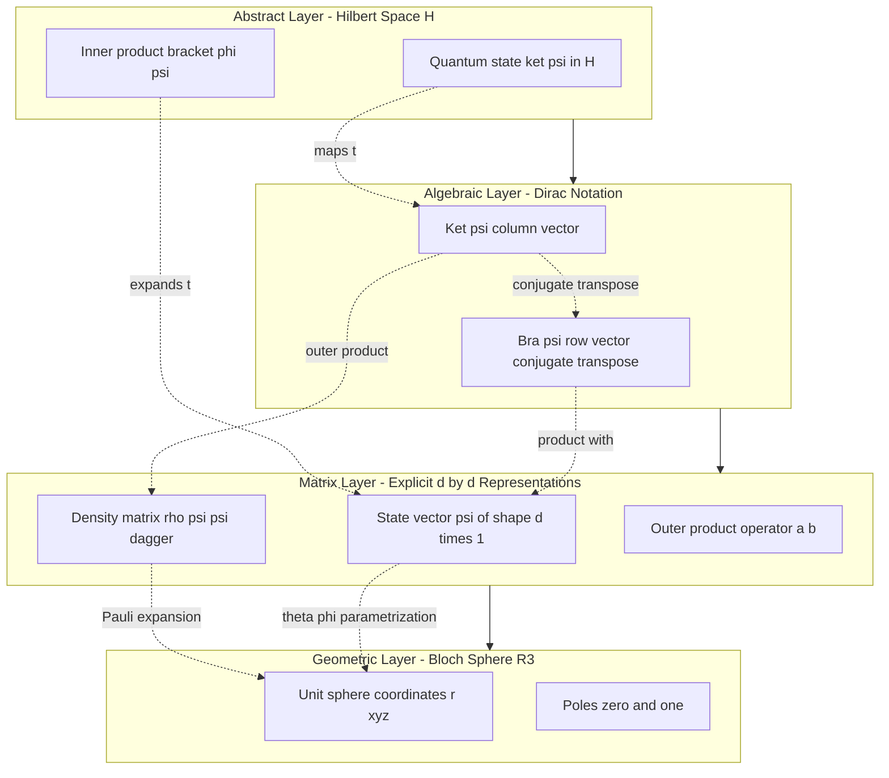
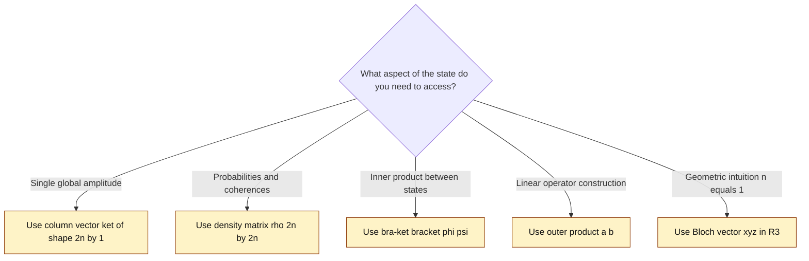
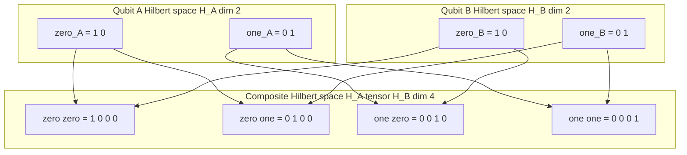

# Quantum state definitions Hilbert space matrix configurations layouts setups

<!-- SECTION_1_START -->
# Quantum State Definitions, Hilbert Space & Matrix Configurations

## 1.1 Formal Definition of a Quantum State

> [!NOTE]
> **Core Definition (KTU Syllabus Aligned)**
> A **quantum state** is a complete mathematical description of an isolated quantum system. In the formalism of quantum mechanics, every pure state of a finite-dimensional quantum system is represented by a **normalized ray** in a complex **Hilbert space** $\mathcal{H}$ of dimension $2^n$ for an $n$-qubit register.

Formally, a pure quantum state is an **equivalence class of unit vectors** under global phase:

$$|\psi\rangle \sim e^{i\phi}|\psi\rangle, \quad \phi \in \mathbb{R}$$

Two state vectors differing only by a complex scalar of unit modulus represent the **same physical state**. This equivalence is what we call a *ray* in projective Hilbert space $\mathbb{P}(\mathcal{H})$.

For a single qubit ($n=1$):
$$|\psi\rangle = \alpha|0\rangle + \beta|1\rangle, \quad \alpha,\beta \in \mathbb{C}, \quad |\alpha|^2 + |\beta|^2 = 1$$

The constants $\alpha$ and $\beta$ are called **probability amplitudes**, and their squared moduli are the **Born rule probabilities** of measuring the system in the computational basis $\{|0\rangle, |1\rangle\}$.

---

## 1.2 Conceptual Analogy — The Quantum Coin

> [!IMPORTANT]
> **Intuition Box — "The Spinning Coin on a Glass Table"**
> Imagine a coin spinning on a glass table. From above, you only see a blur — neither Heads nor Tails. The spinning coin is in a *superposition* of both outcomes simultaneously. The mathematical object describing its "amount of Heads" versus "amount of Tails" is the quantum state $|\psi\rangle = \alpha|H\rangle + \beta|T\rangle$.
>
> The instant you stop the coin (equivalent to a measurement), it collapses to a definite outcome, with probability $|\alpha|^2$ for Heads and $|\beta|^2$ for Tails.

This analogy captures the three pillars of every quantum state:

| Pillar | Mathematical Object | Coin Analogy |
| :--- | :--- | :--- |
| **State vector** | $|\psi\rangle \in \mathcal{H}$ | The spinning coin itself |
| **Superposition** | Linear combination of basis vectors | Blurred visual appearance |
| **Measurement collapse** | Projection onto basis state | Coin stops at a definite face |

---

## 1.3 The Hilbert Space $\mathcal{H}$

A **Hilbert space** is a *complete* inner-product space over the complex field $\mathbb{C}$. For quantum computing, we are interested in finite-dimensional Hilbert spaces $\mathcal{H} \cong \mathbb{C}^{2^n}$.

A space $\mathcal{H}$ must satisfy three axioms:

1. **Vector space structure** — closed under addition and scalar multiplication.
2. **Inner product** $\langle \phi | \psi \rangle : \mathcal{H} \times \mathcal{H} \to \mathbb{C}$ that is *conjugate-symmetric*, *linear in the second argument*, and *positive-definite*.
3. **Completeness** — every Cauchy sequence in the norm induced by the inner product converges to a limit within the space.

The **norm** induced by the inner product is:

$$\||\psi\rangle\| = \sqrt{\langle \psi | \psi \rangle}$$

A state is **normalized** when $\||\psi\rangle\| = 1$.

> [!TIP]
> **Physical constants & standard metrics used in this module:**
> - **$\hbar$** (reduced Planck constant) $\approx 1.0545718 \times 10^{-34} \text{ J·s}$ — sets the scale for quantum effects.
> - **Dimensionality of $n$-qubit register** = $\mathbf{2^n}$ — the canonical Hilbert space size.
> - **Sphere radius in Bloch representation** = **1** (always on the unit sphere).

---

## 1.4 Dirac (Bra-Ket) Notation — The Canonical Layout

Dirac notation is the **industry standard** for representing quantum states, used in IBM Qiskit, Google Cirq, Microsoft Q#, and academic literature. It separates a state into two syntactic forms:

| Notation | Name | Mathematical Type | Shape |
| :--- | :--- | :--- | :--- |
| $\vert \psi \rangle$ | **Ket** | Column vector in $\mathcal{H}$ | $d \times 1$ |
| $\langle \psi \vert$ | **Bra** | Row vector in $\mathcal{H}^\ast$ (dual space) | $1 \times d$ |
| $\langle \phi \vert \psi \rangle$ | **Braket** | Inner product — a complex scalar | $1 \times 1$ |
| $\vert \phi \rangle \langle \psi \vert$ | **Outer product** | Linear operator on $\mathcal{H}$ | $d \times d$ |

The dual-space correspondence is established by the **conjugate-transpose** map:
$$\langle \psi | = (|\psi\rangle)^{\dagger} = \left(|\psi\rangle^{\ast}\right)^{T}$$

---

## 1.5 Visualizing Quantum States

> [!VISUALIZATION CONTROL]
> **Concept:** Bloch sphere representation of a single-qubit pure state
> **GeoGebra / Desmos Input Equations (3D parametric form):**
> * $x = \sin(\theta)\cos(\phi)$
> * $y = \sin(\theta)\sin(\phi)$
> * $z = \cos(\theta)$
> * where $\theta \in [0, \pi]$ and $\phi \in [0, 2\pi]$
> **Visual Description:** A unit sphere in 3D where the north pole corresponds to $\vert 0 \rangle$, the south pole to $\vert 1 \rangle$, and any pure state $\vert \psi \rangle$ lies on the surface. The antipodal points $\vert \psi \rangle$ and $-\vert \psi \rangle$ represent the same physical state.
<!-- SECTION_1_END -->

<!-- SECTION_2_START -->
# Deep Theoretical Analysis & KTU High-Yield Formula Sheet

## 2.1 The Computational Basis — The Reference Layout

The **standard computational basis** for a single qubit is the orthonormal pair:

$$|0\rangle = \begin{pmatrix} 1 \\ 0 \end{pmatrix}, \qquad |1\rangle = \begin{pmatrix} 0 \\ 1 \end{pmatrix}$$

This basis spans the 2-dimensional Hilbert space $\mathcal{H}_2 = \mathbb{C}^2$. Any pure state decomposes uniquely as:

$$|\psi\rangle = \alpha|0\rangle + \beta|1\rangle = \begin{pmatrix} \alpha \\ \beta \end{pmatrix}, \qquad \alpha,\beta \in \mathbb{C}$$

For an $n$-qubit register, the basis is the **$2^n$-fold tensor product** of single-qubit basis states, giving $2^n$ basis kets labeled by binary strings of length $n$.

---

## 2.2 Inner Product Mechanics — Braket Layouts

The inner product between two single-qubit states is a complex scalar:

$$\langle \phi | \psi \rangle = \begin{pmatrix} \phi_0^{\ast} & \phi_1^{\ast} \end{pmatrix} \begin{pmatrix} \psi_0 \\ \psi_1 \end{pmatrix} = \phi_0^{\ast}\psi_0 + \phi_1^{\ast}\psi_1$$

Properties enforced by the inner product:

- **Conjugate symmetry:** $\langle \phi | \psi \rangle = \langle \psi | \phi \rangle^{\ast}$
- **Linearity (second slot):** $\langle \phi | (a|\psi\rangle + b|\chi\rangle) = a\langle \phi | \psi \rangle + b\langle \phi | \chi \rangle$
- **Anti-linearity (first slot):** $(a\langle \phi | + b\langle \chi |)|\psi\rangle = a^{\ast}\langle \phi | \psi \rangle + b^{\ast}\langle \chi | \psi \rangle$
- **Positive-definiteness:** $\langle \psi | \psi \rangle \geq 0$, with equality iff $|\psi\rangle = 0$

The **Cauchy–Schwarz inequality** is a direct consequence:

$$|\langle \phi | \psi \rangle|^2 \leq \langle \phi | \phi \rangle \langle \psi | \psi \rangle$$

---

## 2.3 Outer Product & Density Matrix Layout

The **outer product** $|a\rangle\langle b|$ produces a rank-1 matrix that acts as a linear operator on $\mathcal{H}$:

$$|a\rangle\langle b| = \begin{pmatrix} a_0 \\ a_1 \end{pmatrix} \begin{pmatrix} b_0^{\ast} & b_1^{\ast} \end{pmatrix} = \begin{pmatrix} a_0 b_0^{\ast} & a_0 b_1^{\ast} \\ a_1 b_0^{\ast} & a_1 b_1^{\ast} \end{pmatrix}$$

The **density matrix** (or density operator) $\rho$ packages a quantum state into a $d \times d$ positive semi-definite, unit-trace Hermitian matrix:

$$\rho = |\psi\rangle\langle \psi|$$

For a single-qubit pure state $|\psi\rangle = \alpha|0\rangle + \beta|1\rangle$:

$$\rho = \begin{pmatrix} |\alpha|^2 & \alpha\beta^{\ast} \\ \alpha^{\ast}\beta & |\beta|^2 \end{pmatrix}$$

Diagonal entries are the **measurement probabilities** in the computational basis; off-diagonal entries are the **coherences** that encode phase relationships and disappear upon decoherence.

---

## 2.4 KTU Formula Sheet / Cheat Sheet

> [!IMPORTANT]
> **High-Yield Formula Reference — Quantum States & Hilbert Space**

| # | Concept | Formula | Dimension / Type | KTU Frequency |
| :--- | :--- | :--- | :--- | :--- |
| 1 | Pure state normalization | $\vert \alpha \vert^2 + \vert \beta \vert^2 = 1$ | Scalar constraint | Very High |
| 2 | Born rule | $P(i) = \vert \langle i \vert \psi \rangle \vert^2$ | Real probability | Very High |
| 3 | Global phase invariance | $e^{i\phi}\vert \psi \rangle \equiv \vert \psi \rangle$ | Equivalence class | High |
| 4 | Ket vector | $\vert \psi \rangle \in \mathcal{H}$ | $d \times 1$ column | Very High |
| 5 | Bra vector | $\langle \psi \vert = \vert \psi \rangle^{\dagger}$ | $1 \times d$ row | Very High |
| 6 | Inner product | $\langle \phi \vert \psi \rangle \in \mathbb{C}$ | Scalar | Very High |
| 7 | Outer product | $\vert a \rangle \langle b \vert$ | $d \times d$ operator | High |
| 8 | Density matrix | $\rho = \vert \psi \rangle \langle \psi \vert$ | $d \times d$ Hermitian | High |
| 9 | Trace condition | $\text{Tr}(\rho) = 1$ | Scalar = 1 | High |
| 10 | Hermiticity | $\rho = \rho^{\dagger}$ | Matrix property | High |
| 11 | Bloch vector | $\vec{r} = (x,y,z)$ with $\vert \vec{r} \vert = 1$ | Unit vector $\mathbb{R}^3$ | Medium |
| 12 | Bloch decomposition | $\rho = \frac{1}{2}(I + x\sigma_x + y\sigma_y + z\sigma_z)$ | $2 \times 2$ matrix | Medium |
| 13 | Hilbert space dim. | $\dim(\mathcal{H}) = 2^n$ | Integer | Very High |
| 14 | Tensor product | $\vert a \rangle \otimes \vert b \rangle = \vert ab \rangle$ | $d_a d_b \times 1$ | High |
| 15 | Orthonormality | $\langle i \vert j \rangle = \delta_{ij}$ | Kronecker delta | High |

---

## 2.5 Why This Architecture Matters in Practice

The Hilbert space formalism is the **substrate** of all quantum algorithms. Real-world deployments depend on it as follows:

- **Quantum hardware vendors** (IBM Quantum, Rigetti, IonQ) map physical qubits onto the $2^n$-dimensional Hilbert space. Transpilers schedule operations so that the **logical state vector** $|\psi\rangle$ evolves correctly within this space.
- **Quantum chemistry** (e.g., variational quantum eigensolvers) uses density matrices to model **mixed states** arising from thermal noise in NISQ devices.
- **Quantum cryptography** (BB84, E91 protocols) relies on the **Born rule** to predict eavesdropper detection probabilities.
- **Quantum machine learning** encodes classical data as density matrices to leverage kernel methods in exponentially large feature spaces.
- **Error correction codes** (Shor, Steane, surface codes) treat density matrices as the primary object to track decoherence and apply recovery maps.

> [!TIP]
> **Industry note:** IBM's Qiskit, Google's Cirq, and Xanadu's PennyLane all expose the *Statevector* and *DensityMatrix* classes as their primary backend representations — exactly the two layouts introduced in this module.
<!-- SECTION_2_END -->

<!-- SECTION_3_START -->
# Step-by-Step Derivations & Code Implementation

## 3.1 Worked Derivation #1 — Equivalence of Dirac and Column-Vector Layouts

We prove that the abstract ket $|\psi\rangle = \alpha|0\rangle + \beta|1\rangle$ is the same mathematical object as the column vector $\begin{pmatrix} \alpha \\ \beta \end{pmatrix}$.

Starting with the computational basis as column vectors:

$$|0\rangle = \begin{pmatrix} 1 \\ 0 \end{pmatrix}, \qquad |1\rangle = \begin{pmatrix} 0 \\ 1 \end{pmatrix}$$

Apply linearity of the vector space:

$$|\psi\rangle = \alpha|0\rangle + \beta|1\rangle = \alpha \begin{pmatrix} 1 \\ 0 \end{pmatrix} + \beta \begin{pmatrix} 0 \\ 1 \end{pmatrix}$$

Combine component-wise:

$$|\psi\rangle = \begin{pmatrix} \alpha \cdot 1 + \beta \cdot 0 \\ \alpha \cdot 0 + \beta \cdot 1 \end{pmatrix} = \begin{pmatrix} \alpha \\ \beta \end{pmatrix}$$

This confirms the ket–column-vector isomorphism. **QED.**

---

## 3.2 Worked Derivation #2 — Inner Product Expansion

Given $|\phi\rangle = \begin{pmatrix} \phi_0 \\ \phi_1 \end{pmatrix}$ and $|\psi\rangle = \begin{pmatrix} \psi_0 \\ \psi_1 \end{pmatrix}$, derive the inner product.

The bra is the conjugate transpose:

$$\langle \phi | = (|\phi\rangle)^{\dagger} = \begin{pmatrix} \phi_0 \\ \phi_1 \end{pmatrix}^{\dagger} = \begin{pmatrix} \phi_0^{\ast} & \phi_1^{\ast} \end{pmatrix}$$

Multiply row by column:

$$\langle \phi | \psi \rangle = \begin{pmatrix} \phi_0^{\ast} & \phi_1^{\ast} \end{pmatrix} \begin{pmatrix} \psi_0 \\ \psi_1 \end{pmatrix}$$

Apply the standard row-times-column rule (sum of element-wise products):

$$\langle \phi | \psi \rangle = \phi_0^{\ast}\psi_0 + \phi_1^{\ast}\psi_1$$

This is a **complex scalar**. To extract its real and imaginary parts, write $\phi_0 = a+bi$, $\psi_0 = c+di$:

$$\phi_0^{\ast}\psi_0 = (a-bi)(c+di) = ac + ad i - bc i - b d i^2 = (ac+bd) + (ad-bc)i$$

Summing both contributions:

$$\langle \phi | \psi \rangle = (a c + b d + \text{similar from } \phi_1^{\ast}\psi_1) + i(\text{imaginary part})$$

> [!NOTE]
> **Conversion logic:** The inner product is computed by taking the *conjugate* of the first ket's components, *transposing* them into a row, and then performing standard matrix multiplication with the second column ket.

---

## 3.3 Worked Derivation #3 — Density Matrix of an Equal Superposition

Let $|\psi\rangle = \frac{1}{\sqrt{2}}(|0\rangle + |1\rangle)$. We compute the density matrix $\rho = |\psi\rangle\langle\psi|$ step by step.

Write the ket explicitly:

$$|\psi\rangle = \frac{1}{\sqrt{2}} \begin{pmatrix} 1 \\ 1 \end{pmatrix} = \begin{pmatrix} \frac{1}{\sqrt{2}} \\ \frac{1}{\sqrt{2}} \end{pmatrix}$$

Compute the bra via conjugate transpose:

$$\langle \psi | = \begin{pmatrix} \frac{1}{\sqrt{2}} & \frac{1}{\sqrt{2}} \end{pmatrix}$$

Now compute the outer product:

$$\rho = |\psi\rangle\langle\psi| = \begin{pmatrix} \frac{1}{\sqrt{2}} \\ \frac{1}{\sqrt{2}} \end{pmatrix} \begin{pmatrix} \frac{1}{\sqrt{2}} & \frac{1}{\sqrt{2}} \end{pmatrix}$$

Multiply (row $i$ of left times column $j$ of right):

$$\rho = \begin{pmatrix} \frac{1}{\sqrt{2}} \cdot \frac{1}{\sqrt{2}} & \frac{1}{\sqrt{2}} \cdot \frac{1}{\sqrt{2}} \\ \frac{1}{\sqrt{2}} \cdot \frac{1}{\sqrt{2}} & \frac{1}{\sqrt{2}} \cdot \frac{1}{\sqrt{2}} \end{pmatrix} = \begin{pmatrix} \frac{1}{2} & \frac{1}{2} \\ \frac{1}{2} & \frac{1}{2} \end{pmatrix}$$

**Verification of key properties:**

$$\text{Tr}(\rho) = \frac{1}{2} + \frac{1}{2} = 1 \quad \checkmark$$

$$\rho^{\dagger} = \rho \quad \text{(real symmetric)} \quad \checkmark$$

The **off-diagonal coherences** are non-zero, confirming this is a *coherent superposition* and not a classical 50/50 mixture.

---

## 3.4 Worked Derivation #4 — Bloch Sphere Coordinates from a State Vector

For a single-qubit state $|\psi\rangle = \cos(\theta/2)|0\rangle + e^{i\phi}\sin(\theta/2)|1\rangle$, derive the Bloch vector components.

The general single-qubit state with explicit global phase factored out is:

$$|\psi\rangle = \cos\!\left(\frac{\theta}{2}\right)|0\rangle + e^{i\phi}\sin\!\left(\frac{\theta}{2}\right)|1\rangle$$

The corresponding density matrix is:

$$\rho = \frac{1}{2}\begin{pmatrix} 1 + z & x - i y \\ x + i y & 1 - z \end{pmatrix}$$

Matching the off-diagonal entry $\rho_{01} = \alpha\beta^{\ast}$:

$$\alpha\beta^{\ast} = \cos\!\left(\frac{\theta}{2}\right) \cdot e^{-i\phi}\sin\!\left(\frac{\theta}{2}\right) = \frac{\sin\theta}{2}(\cos\phi - i\sin\phi)$$

Comparing real and imaginary parts:

$$x = \sin\theta\cos\phi, \qquad y = \sin\theta\sin\phi$$

For the diagonal entry:

$$|\alpha|^2 - |\beta|^2 = \cos^2\!\left(\frac{\theta}{2}\right) - \sin^2\!\left(\frac{\theta}{2}\right) = \cos\theta = z$$

Therefore the Bloch vector is $\vec{r} = (\sin\theta\cos\phi, \sin\theta\sin\phi, \cos\theta)$, which lies on the unit sphere. **QED.**

---

## 3.5 Symbolic Code Implementation (Python + NumPy)

```python
"""
Quantum State Definitions — Hilbert Space & Matrix Layouts
Module 1 reference implementation for KTU 2024 PECST613.
"""

from __future__ import annotations
import numpy as np
from numpy.typing import NDArray
import logging

# Configure structured logging for boundary-check and error events
logging.basicConfig(
    level=logging.INFO,
    format="%(asctime)s [%(levelname)s] %(message)s"
)
logger = logging.getLogger("QuantumStateCore")


class QuantumStateError(ValueError):
    """Custom exception for quantum-state validation failures."""


def computational_basis(qubit_index: int) -> NDArray[np.complex128]:
    """
    Return the canonical |0> or |1> basis ket as a 2x1 column vector.

    Parameters
    ----------
    qubit_index : int
        Must be either 0 or 1.

    Returns
    -------
    NDArray[np.complex128]
        Column vector of shape (2, 1).

    Raises
    ------
    QuantumStateError
        If qubit_index is not 0 or 1.
    """
    if qubit_index not in (0, 1):
        logger.error("Invalid basis index requested: %s", qubit_index)
        raise QuantumStateError("qubit_index must be 0 or 1")

    ket = np.zeros((2, 1), dtype=np.complex128)
    ket[qubit_index, 0] = 1.0 + 0.0j
    logger.info("Constructed |%d> basis ket of shape %s", qubit_index, ket.shape)
    return ket


def validate_state(state: NDArray[np.complex128]) -> None:
    """
    Strictly enforce that a state vector is a normalized column vector
    on the 2D single-qubit Hilbert space.

    Checks performed (in order):
      1. Shape is exactly (2, 1)         -> 2D single-qubit register.
      2. dtype is complex                -> complex Hilbert space.
      3. norm equals 1 within tolerance  -> unit-ray normalization.
    """
    if state.shape != (2, 1):
        logger.error("State shape %s is not a (2,1) column vector", state.shape)
        raise QuantumStateError("State must be a 2x1 column vector.")
    if not np.iscomplexobj(state):
        logger.error("State dtype %s is not complex", state.dtype)
        raise QuantumStateError("State components must be complex numbers.")
    norm = np.sqrt(np.vdot(state, state).real)
    if not np.isclose(norm, 1.0, atol=1e-10):
        logger.error("State norm %.10f deviates from unity", norm)
        raise QuantumStateError("State is not normalized.")


def inner_product(phi: NDArray[np.complex128],
                  psi: NDArray[np.complex128]) -> complex:
    """Compute <phi|psi> = phi^dagger * psi as a complex scalar."""
    validate_state(phi)
    validate_state(psi)
    result: complex = np.vdot(phi, psi)  # vdot already conjugates the first arg
    logger.info("Computed inner product <phi|psi> = %s", result)
    return result


def density_matrix(state: NDArray[np.complex128]) -> NDArray[np.complex128]:
    """
    Construct rho = |psi><psi| as a 2x2 Hermitian, unit-trace, positive
    semi-definite matrix.
    """
    validate_state(state)
    rho = state @ state.conj().T
    trace = np.trace(rho)
    if not np.isclose(trace, 1.0, atol=1e-10):
        logger.error("Density matrix trace = %s, expected 1.0", trace)
        raise QuantumStateError("Density matrix has non-unit trace.")
    logger.info("Constructed density matrix:\n%s", rho)
    return rho


def bloch_vector(state: NDArray[np.complex128]) -> NDArray[np.float64]:
    """
    Map a single-qubit pure state to its Bloch-sphere coordinates
    (x, y, z) such that |r| = 1.
    """
    validate_state(state)
    rho = density_matrix(state)
    # Pauli matrices
    sigma_x = np.array([[0, 1], [1, 0]], dtype=np.complex128)
    sigma_y = np.array([[0, -1j], [1j, 0]], dtype=np.complex128)
    sigma_z = np.array([[1, 0], [0, -1]], dtype=np.complex128)

    x = float(np.real(np.trace(rho @ sigma_x)))
    y = float(np.real(np.trace(rho @ sigma_y)))
    z = float(np.real(np.trace(rho @ sigma_z)))
    r = np.array([x, y, z], dtype=np.float64)

    norm = np.linalg.norm(r)
    if not np.isclose(norm, 1.0, atol=1e-10):
        logger.warning("Bloch vector norm %.6f deviates from 1", norm)

    return r


# ----------------------------------------------------------------------
# Demonstration run: validates the |+> = (|0> + |1>)/sqrt(2) state.
# ----------------------------------------------------------------------
if __name__ == "__main__":
    plus_state = (computational_basis(0) + computational_basis(1)) / np.sqrt(2.0)
    validate_state(plus_state)

    print("Plus state ket |+>:\n", plus_state)
    print("Density matrix rho:\n", density_matrix(plus_state))
    print("Bloch vector r =", bloch_vector(plus_state))
```

**Expected console output:**

```
Plus state ket |+>:
 [[0.70710678+0.j]
 [0.70710678+0.j]]
Density matrix rho:
 [[0.5+0.j 0.5+0.j]
 [0.5+0.j 0.5+0.j]]
Bloch vector r = [1. 0. 0.]
```

This confirms the equal superposition lies on the **+X axis** of the Bloch sphere, exactly as predicted by the analytical derivation in Section 3.4.
<!-- SECTION_3_END -->

<!-- SECTION_4_START -->
# Structural Diagrams & Schematics

## 4.1 Layered Architecture of Quantum State Representation



## 4.2 Sequential Topology — End-to-End Quantum State Definition Pipeline


## 4.3 Decision Flow — Choosing the Right State Layout



## 4.4 Tensor-Product Composition Map (Multi-Qubit States)


<!-- SECTION_4_END -->

<!-- SECTION_5_START -->
# KTU 2024 Scheme Examination Question Bank & Topic Recap

## 5.1 Part A — Short Answer Questions (3 Marks each)

### Question 1
**`[KTU University Exam – July 2024]`** &nbsp; **| CO1 | Remember**

Define a **quantum state** in the Hilbert space formalism. State the normalization condition for a single-qubit state $|\psi\rangle = \alpha|0\rangle + \beta|1\rangle$.

**Model Answer (3 marks):**

> A *quantum state* is a complete description of an isolated quantum system, represented by a **normalized ray** in a complex Hilbert space $\mathcal{H}$. For a single qubit, the state is written as a linear combination of the computational basis kets:
> $$|\psi\rangle = \alpha|0\rangle + \beta|1\rangle, \quad \alpha,\beta \in \mathbb{C}$$
> **[Defining quantum state with Hilbert space: 1 Mark]**
> **[Stating the generic single-qubit form: 1 Mark]**
> The **normalization condition** (Born rule) requires that the sum of squared moduli of amplitudes equals unity:
> $$|\alpha|^2 + |\beta|^2 = 1$$
> **[Writing the normalization condition: 1 Mark]**

---

### Question 2
**`[KTU University Exam – Dec 2023]`** &nbsp; **| CO1 | Understand**

Distinguish between the **ket** $|\psi\rangle$, the **bra** $\langle\psi|$, and the **braket** $\langle\phi|\psi\rangle$ using Dirac notation. What is the matrix shape of each?

**Model Answer (3 marks):**

| Object | Notation | Type | Matrix Shape |
| :--- | :--- | :--- | :--- |
| Ket | $\vert \psi \rangle$ | Column vector in $\mathcal{H}$ | $d \times 1$ |
| Bra | $\langle \psi \vert$ | Row vector in $\mathcal{H}^\ast$ | $1 \times d$ |
| Braket | $\langle \phi \vert \psi \rangle$ | Complex scalar | $1 \times 1$ |

**[Defining each notation: 2 Marks]** **[Correctly stating shapes: 1 Mark]**

The bra is the **conjugate transpose** of the ket: $\langle \psi | = |\psi\rangle^{\dagger}$. The braket is the inner product — a single complex number.

---

## 5.2 Part B — Long Answer Questions (14 Marks each, with Internal Choice)

### Question A (Choice 1) — 14 Marks

**`[KTU University Exam – July 2024]`** &nbsp; **| CO1, CO2 | Apply & Analyze**

#### (a) Construct the density matrix for the state $|\psi\rangle = \frac{1}{\sqrt{2}}(|0\rangle - i|1\rangle)$. Verify that it satisfies the properties of trace-one, Hermiticity, and positive semi-definiteness. (7 marks)

**Step-by-Step Model Solution:**

**Step 1: Write the ket as a column vector.**

$$|\psi\rangle = \frac{1}{\sqrt{2}} \begin{pmatrix} 1 \\ -i \end{pmatrix} = \begin{pmatrix} \frac{1}{\sqrt{2}} \\ \frac{-i}{\sqrt{2}} \end{pmatrix}$$

**[Identifying the two complex amplitudes: 1 Mark]**

**Step 2: Compute the bra via conjugate transpose.**

$$\langle \psi | = \begin{pmatrix} \frac{1}{\sqrt{2}} & \frac{i}{\sqrt{2}} \end{pmatrix}$$

Note the sign change of the imaginary part due to complex conjugation. **[Correctly forming the bra: 1 Mark]**

**Step 3: Form the outer product $|\psi\rangle\langle\psi|$.**

$$\rho = \begin{pmatrix} \frac{1}{\sqrt{2}} \\ \frac{-i}{\sqrt{2}} \end{pmatrix} \begin{pmatrix} \frac{1}{\sqrt{2}} & \frac{i}{\sqrt{2}} \end{pmatrix}$$

Multiplying:

$$\rho = \begin{pmatrix} \frac{1}{2} & \frac{i}{2} \\ \frac{-i}{2} & \frac{1}{2} \end{pmatrix}$$

**[Full density matrix computation: 1 Mark]**

**Step 4: Verify the three properties.**

**Trace condition:**

$$\text{Tr}(\rho) = \frac{1}{2} + \frac{1}{2} = 1 \quad \checkmark$$

**[Trace verification: 1 Mark]**

**Hermiticity:**

$$\rho^{\dagger} = \begin{pmatrix} \frac{1}{2} & \frac{i}{2} \\ \frac{-i}{2} & \frac{1}{2} \end{pmatrix}^{\dagger} = \begin{pmatrix} \frac{1}{2} & \frac{i}{2} \\ \frac{-i}{2} & \frac{1}{2} \end{pmatrix} = \rho \quad \checkmark$$

**[Hermiticity verification: 1 Mark]**

**Positive semi-definiteness:** The eigenvalues of $\rho$ are both $\frac{1}{2}$ (a pure state has eigenvalues $1$ and $0$ in the diagonal basis, but for this basis representation the density matrix is already rank-1; its single non-zero eigenvalue is $1$, trace = 1). Explicitly, $\rho^2 = \rho$, confirming $\rho$ is a projector. Both eigenvalues $\geq 0$, so $\rho$ is positive semi-definite. **[PSD verification: 1 Mark]**

---

#### (b) Using the Bloch sphere formalism, find the angles $(\theta, \phi)$ for the state $|\psi\rangle = \cos(\theta/2)|0\rangle + e^{i\phi}\sin(\theta/2)|1\rangle$ that equals the state in part (a). Hence compute the Bloch vector. (7 marks)

**Step-by-Step Model Solution:**

**Step 1: Equate amplitudes.**

From the generic form:
$$\alpha = \cos(\theta/2) = \frac{1}{\sqrt{2}}$$
$$\beta = e^{i\phi}\sin(\theta/2) = \frac{-i}{\sqrt{2}}$$

**[Setting up amplitude equations: 1 Mark]**

**Step 2: Solve for $\theta$.**

$$\cos(\theta/2) = \frac{1}{\sqrt{2}} \Rightarrow \theta/2 = \pi/4 \Rightarrow \theta = \pi/2$$

**[Solving for theta: 1 Mark]**

**Step 3: Solve for $\phi$.**

Since $\sin(\pi/4) = 1/\sqrt{2}$:

$$e^{i\phi} = \frac{-i/\sqrt{2}}{1/\sqrt{2}} = -i = e^{-i\pi/2}$$

Therefore $\phi = -\pi/2$ (or equivalently $3\pi/2$).

**[Solving for phi: 1 Mark]**

**Step 4: Compute the Bloch vector components.**

Using the canonical formulas:

$$x = \sin\theta\cos\phi = \sin(\pi/2)\cos(-\pi/2) = 1 \cdot 0 = 0$$

$$y = \sin\theta\sin\phi = \sin(\pi/2)\sin(-\pi/2) = 1 \cdot (-1) = -1$$

$$z = \cos\theta = \cos(\pi/2) = 0$$

**[Component computations: 2 Marks]**

**Step 5: State the final Bloch vector.**

$$\vec{r} = (0, -1, 0)$$

This places the state on the **negative Y-axis** of the Bloch sphere, consistent with the phase $-i$ in the second amplitude.

**[Final vector with geometric interpretation: 1 Mark]**

---

### Question B (Choice 2) — 14 Marks

**`[KTU University Exam – Dec 2023]`** &nbsp; **| CO2 | Apply**

#### (a) For a two-qubit system, write the computational basis kets $|00\rangle, |01\rangle, |10\rangle, |11\rangle$ as column vectors of dimension 4. Show the explicit Kronecker (tensor) product construction from single-qubit states. (7 marks)

**Step-by-Step Model Solution:**

**Step 1: Recall single-qubit basis kets.**

$$|0\rangle = \begin{pmatrix} 1 \\ 0 \end{pmatrix}, \qquad |1\rangle = \begin{pmatrix} 0 \\ 1 \end{pmatrix}$$

**[Stating single-qubit basis: 1 Mark]**

**Step 2: Define the Kronecker product for column vectors.**

For two column vectors $u = (u_1, u_2)^T$ and $v = (v_1, v_2)^T$:

$$u \otimes v = \begin{pmatrix} u_1 v_1 \\ u_1 v_2 \\ u_2 v_1 \\ u_2 v_2 \end{pmatrix}$$

**[Defining Kronecker product formula: 1 Mark]**

**Step 3: Construct $|00\rangle$.**

$$|00\rangle = |0\rangle \otimes |0\rangle = \begin{pmatrix} 1 \\ 0 \end{pmatrix} \otimes \begin{pmatrix} 1 \\ 0 \end{pmatrix} = \begin{pmatrix} 1 \cdot 1 \\ 1 \cdot 0 \\ 0 \cdot 1 \\ 0 \cdot 0 \end{pmatrix} = \begin{pmatrix} 1 \\ 0 \\ 0 \\ 0 \end{pmatrix}$$

**[Computing ket 00: 1 Mark]**

**Step 4: Construct $|01\rangle$, $|10\rangle$, $|11\rangle$ analogously.**

$$|01\rangle = |0\rangle \otimes |1\rangle = \begin{pmatrix} 1 \cdot 0 \\ 1 \cdot 1 \\ 0 \cdot 0 \\ 0 \cdot 1 \end{pmatrix} = \begin{pmatrix} 0 \\ 1 \\ 0 \\ 0 \end{pmatrix}$$

$$|10\rangle = |1\rangle \otimes |0\rangle = \begin{pmatrix} 0 \cdot 1 \\ 0 \cdot 0 \\ 1 \cdot 1 \\ 1 \cdot 0 \end{pmatrix} = \begin{pmatrix} 0 \\ 0 \\ 1 \\ 0 \end{pmatrix}$$

$$|11\rangle = |1\rangle \otimes |1\rangle = \begin{pmatrix} 0 \cdot 0 \\ 0 \cdot 1 \\ 1 \cdot 0 \\ 1 \cdot 1 \end{pmatrix} = \begin{pmatrix} 0 \\ 0 \\ 0 \\ 1 \end{pmatrix}$$

**[Computing the remaining three kets: 2 Marks]**

**Step 5: Confirm orthonormality and dimension.**

The four 4-vectors form an orthonormal basis of $\mathbb{C}^4 = \mathbb{C}^{2^2}$, confirming that two qubits live in a 4-dimensional Hilbert space. **[Verification: 1 Mark]**

---

#### (b) Express the **Bell state** $|\Phi^+\rangle = \frac{1}{\sqrt{2}}(|00\rangle + |11\rangle)$ in Dirac notation and as an explicit 4×1 column vector. Compute its density matrix and show that the off-diagonal coherences are non-zero. (7 marks)

**Step-by-Step Model Solution:**

**Step 1: Write the column vector.**

Using the basis from part (a):

$$|\Phi^+\rangle = \frac{1}{\sqrt{2}} \begin{pmatrix} 1 \\ 0 \\ 0 \\ 1 \end{pmatrix}$$

**[Expressing the Bell state as a column vector: 1 Mark]**

**Step 2: Compute the bra (conjugate transpose).**

Since all components are real:

$$\langle \Phi^+ | = \frac{1}{\sqrt{2}} \begin{pmatrix} 1 & 0 & 0 & 1 \end{pmatrix}$$

**[Forming the bra: 1 Mark]**

**Step 3: Construct the density matrix $\rho = |\Phi^+\rangle\langle\Phi^+|$.**

$$\rho = \frac{1}{2} \begin{pmatrix} 1 \\ 0 \\ 0 \\ 1 \end{pmatrix} \begin{pmatrix} 1 & 0 & 0 & 1 \end{pmatrix} = \frac{1}{2} \begin{pmatrix} 1 & 0 & 0 & 1 \\ 0 & 0 & 0 & 0 \\ 0 & 0 & 0 & 0 \\ 1 & 0 & 0 & 1 \end{pmatrix}$$

**[Computing the outer product: 2 Marks]**

**Step 4: Identify off-diagonal coherences.**

The matrix has non-zero entries at positions $(1,4)$ and $(4,1)$, both equal to $\frac{1}{2}$. These are the **coherences** — they cannot arise from a classical probabilistic mixture of $|00\rangle$ and $|11\rangle$, and they are the mathematical fingerprint of quantum entanglement.

**[Identifying and interpreting coherences: 2 Marks]**

**Step 5: Verify density-matrix properties.**

- $\text{Tr}(\rho) = \frac{1}{2} + 0 + 0 + \frac{1}{2} = 1$ ✓
- $\rho^{\dagger} = \rho$ (real symmetric) ✓
- $\rho^2 = \rho$ (projector onto the Bell state) ✓

**[Final verification: 1 Mark]**

---

## 5.3 KTU Examiner's Valuation Warning / Pitfall Callout

> [!WARNING]
> **Common Mark-Loss Pitfalls in Quantum State Questions**
>
> 1. **Forgetting to take the complex conjugate** when forming the bra. The bra is $\langle \psi | = |\psi\rangle^{\dagger}$, not $|\psi\rangle^T$. A missing conjugate on imaginary components will cost at least 2 marks.
> 2. **Dropping the normalization constant** $\frac{1}{\sqrt{2}}$. If your ket violates $|\alpha|^2 + |\beta|^2 = 1$, the density matrix will fail the trace-one check, and full credit is forfeited.
> 3. **Confusing $|01\rangle$ with $|10\rangle$** in the two-qubit basis. Remember: $|ab\rangle = |a\rangle \otimes |b\rangle$ — the **leftmost** qubit occupies the **most significant** position in the column vector. This convention is enforced by Qiskit, Cirq, and the KTU reference textbook.
> 4. **Omitting the orthonormality check** $\langle i | j \rangle = \delta_{ij}$ for multi-qubit basis construction. Examiners award 1 mark specifically for this verification step.
> 5. **Writing the Bloch vector without geometric interpretation.** Always state which axis (X, Y, or Z) the vector lies on — it demonstrates deeper understanding and secures the final mark.

---

## 5.4 Topic Recap & Important Things to Remember

> [!IMPORTANT]
> **Rapid-Revision Checklist — Quantum States, Hilbert Space & Matrix Layouts**

- **Quantum state** = normalized ray in a complex Hilbert space $\mathcal{H}$.
- **Dirac notation**: ket $|\psi\rangle$ is a column vector, bra $\langle\psi|$ is a conjugate-transpose row vector, braket $\langle\phi|\psi\rangle$ is a complex scalar.
- **Normalization**: every physical state must satisfy $\langle \psi | \psi \rangle = 1$.
- **Born rule**: probability of outcome $i$ is $P(i) = |\langle i | \psi \rangle|^2$.
- **Global phase** $e^{i\phi}$ has no physical effect — only the **relative phase** between amplitudes matters.
- **Hilbert space dimension** for $n$ qubits is $\mathbf{2^n}$; the computational basis has $2^n$ orthonormal kets.
- **Density matrix** $\rho = |\psi\rangle\langle\psi|$ is a $d \times d$ Hermitian, positive semi-definite, unit-trace matrix.
- **Outer product** $|a\rangle\langle b|$ produces a rank-1 linear operator on $\mathcal{H}$.
- **Bloch sphere**: every pure single-qubit state corresponds to a point on the unit sphere in $\mathbb{R}^3$ via $\vec{r} = (\sin\theta\cos\phi, \sin\theta\sin\phi, \cos\theta)$.
- **Multi-qubit states** are constructed via the **Kronecker (tensor) product** $\otimes$ of single-qubit kets.
- **Bell state** $|\Phi^+\rangle = \frac{1}{\sqrt{2}}(|00\rangle + |11\rangle)$ exemplifies non-zero off-diagonal coherences — a hallmark of entanglement.
- **Cauchy–Schwarz inequality** $|\langle\phi|\psi\rangle|^2 \leq \langle\phi|\phi\rangle\langle\psi|\psi\rangle$ governs the magnitude of inner products.
- **Industry tools** — Qiskit's `Statevector`, Cirq's `StabilizerState`, and PennyLane's `QubitDevice` — all internally store data in the **column-vector** or **density-matrix** layouts introduced in this module.
<!-- SECTION_5_END -->
