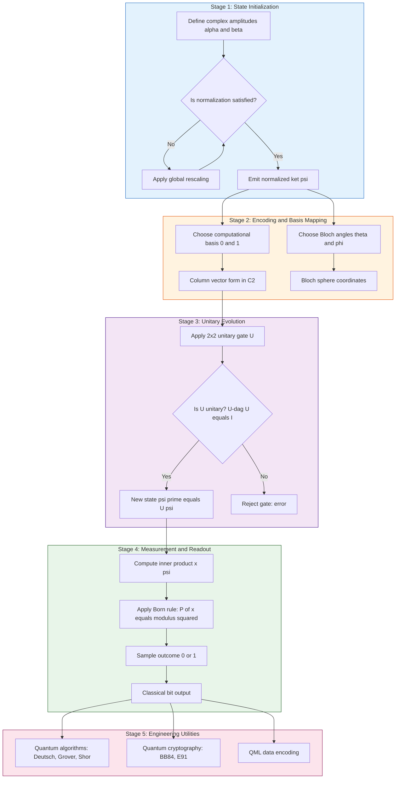
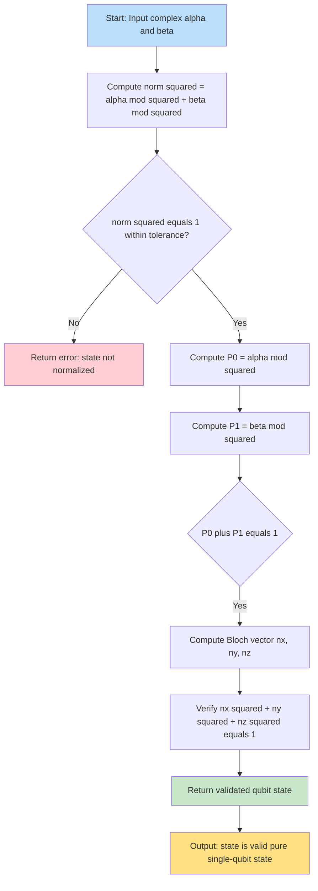

# Qubit processing parameters linear combinations matrix representation formulas rules

<!-- SECTION_1_START -->

# 1. Qubit Processing Parameters: Linear Combinations, Matrix Representation, Formulas & Rules

## 1.1 Formal Academic Definition (KTU 2024 Terminology)

> [!IMPORTANT]
> **Qubit (Quantum Bit):** A qubit is the fundamental unit of quantum information, mathematically defined as a normalized linear combination (superposition) of the two orthonormal computational basis states $\vert 0 \rangle$ and $\vert 1 \rangle$ in a two-dimensional complex Hilbert space $\mathcal{H}_2$.

The general state of a single qubit is written using **Dirac (bra–ket) notation** as:

$$
\vert \psi \rangle = \alpha \vert 0 \rangle + \beta \vert 1 \rangle
$$

where $\alpha, \beta \in \mathbb{C}$ are **complex probability amplitudes**, satisfying the **normalization condition**:

$$
\vert \alpha \vert^2 + \vert \beta \vert^2 = 1
$$

The KTU 2024 *Quantum Computing (PECST613)* syllabus emphasizes that the qubit is **not** merely a probabilistic classical bit; it carries **interference-capable amplitudes** that evolve under unitary transformations. The six cardinal processing parameters are:

| # | Parameter | Symbol |
|---|-----------|--------|
| 1 | Probability amplitude for $\vert 0 \rangle$ | $\alpha$ |
| 2 | Probability amplitude for $\vert 1 \rangle$ | $\beta$ |
| 3 | Measurement probability of $\vert 0 \rangle$ | $P(0) = \vert \alpha \vert^2$ |
| 4 | Measurement probability of $\vert 1 \rangle$ | $P(1) = \vert \beta \vert^2$ |
| 5 | Global (overall) phase | $\phi$ |
| 6 | Relative (local) phase | $\theta$ |

> [!NOTE]
> **Why the constraint $\vert \alpha \vert^2 + \vert \beta \vert^2 = 1$?** Probabilities must sum to **1** (i.e., 100%). Since $P(0) + P(1) = 1$, and $P(x) = \vert \text{amplitude}\vert^2$, the state vector must lie on (or inside, for mixed states) the unit sphere. For a **pure state**, it lies **on the surface** of the **Bloch sphere** of radius **1**.

## 1.2 Conceptual Analogy & Geometric Intuition

Imagine a **spinning coin** tossed in the air. While it spins, it is neither heads nor tails — it exists in a continuous range of orientations. The moment it lands, the coin "collapses" into one of two outcomes.

A qubit behaves identically:

- **Spinning coin** $\equiv$ qubit in **superposition**.
- **Heads / Tails** $\equiv$ computational basis states $\vert 0 \rangle$ / $\vert 1 \rangle$.
- **Tilt angle before landing** $\equiv$ complex amplitudes $\alpha$ and $\beta$.
- **Landing outcome** $\equiv$ **measurement** result.

A more rigorous geometric picture is the **Bloch sphere** (see §1.4): every pure single-qubit state corresponds to a unique point on a unit 3-D sphere parameterized by the polar angle $\theta$ and azimuthal angle $\phi$.

> [!TIP]
> **Polarization of light** is another physical analogy. A photon polarized at angle $\theta$ from the vertical is in a superposition of vertical $\vert V \rangle$ and horizontal $\vert H \rangle$ polarization states with amplitudes $\cos\theta$ and $\sin\theta$ respectively.

## 1.3 Physical Constants & Standard Metrics

The following fixed parameters are essential for qubit analysis:

- **Planck's constant:** $h = 6.626 \times 10^{-34}$ J·s (reduced: $\hbar = h/2\pi \approx 1.055 \times 10^{-34}$ J·s).
- **Computational basis vectors (in $\mathbb{C}^2$):**

$$
\vert 0 \rangle = \begin{bmatrix} 1 \\ 0 \end{bmatrix}, \qquad \vert 1 \rangle = \begin{bmatrix} 0 \\ 1 \end{bmatrix}
$$

- **Identity (Pauli) matrices:**

$$
I = \begin{bmatrix} 1 & 0 \\ 0 & 1 \end{bmatrix}, \quad X = \begin{bmatrix} 0 & 1 \\ 1 & 0 \end{bmatrix}, \quad Y = \begin{bmatrix} 0 & -i \\ i & 0 \end{bmatrix}, \quad Z = \begin{bmatrix} 1 & 0 \\ 0 & -1 \end{bmatrix}
$$

- **Hadamard basis (Diagonal states $\vert \pm \rangle$):**

$$
\vert + \rangle = \frac{1}{\sqrt{2}}(\vert 0 \rangle + \vert 1 \rangle), \qquad \vert - \rangle = \frac{1}{\sqrt{2}}(\vert 0 \rangle - \vert 1 \rangle)
$$

- **Circular basis (Y eigenstates):**

$$
\vert \circlearrowright \rangle = \frac{1}{\sqrt{2}}(\vert 0 \rangle + i\vert 1 \rangle), \qquad \vert \circlearrowleft \rangle = \frac{1}{\sqrt{2}}(\vert 0 \rangle - i\vert 1 \rangle)
$$

> [!VISUALIZATION CONTROL]
> **Concept:** Bloch Sphere representation of a general qubit state.
> **GeoGebra / Desmos Input Equations (parametric, 3-D spherical):**
> * $x = \sin(\theta)\cos(\phi)$
> * $y = \sin(\theta)\sin(\phi)$
> * $z = \cos(\theta)$
> * with $0 \le \theta \le \pi$, $0 \le \phi < 2\pi$.
>
> **Visual Description:** The student should observe a unit sphere with $\vert 0 \rangle$ at the **north pole** (0, 0, +1), $\vert 1 \rangle$ at the **south pole** (0, 0, −1), $\vert + \rangle$ on the **+x axis**, $\vert - \rangle$ on the **−x axis**, and $\vert \circlearrowright \rangle / \vert \circlearrowleft \rangle$ on the $\pm y$ axes. Any state $\vert \psi(\theta,\phi) \rangle = \cos(\theta/2)\vert 0 \rangle + e^{i\phi}\sin(\theta/2)\vert 1 \rangle$ is a point on this surface.

<!-- SECTION_1_END -->

<!-- SECTION_2_START -->

# 2. Deep Theoretical Analysis & KTU High-Yield Formula Sheet

## 2.1 Structural Breakdown of a Qubit

A qubit is **not** a probabilistic mixture like a weighted coin. It is a **unit-norm vector in complex Hilbert space**. The processing parameters fall into three logical groups:

### A. Amplitude Group (State Encoding)
- Two complex amplitudes $\alpha, \beta \in \mathbb{C}$ encode 4 real numbers.
- The global phase $e^{i\gamma}$ multiplying the entire state is **physically unobservable**; only the **relative phase** carries meaning.
- Hence a pure qubit state has exactly **two physical degrees of freedom** — neatly matching the **2 angles** of the Bloch sphere.

### B. Probability Group (Measurement Outcomes)
- The squared moduli $\vert \alpha \vert^2$ and $\vert \beta \vert^2$ are the Born-rule measurement probabilities.
- They must satisfy $\vert \alpha \vert^2 + \vert \beta \vert^2 = 1$ and be real, non-negative.

### C. Phase Group (Interference Behavior)
- The **relative phase** $\phi$ between $\alpha$ and $\beta$ determines interference in multi-qubit and algorithmic settings (e.g., Deutsch–Jozsa, Grover's search).

## 2.2 Canonical Computational Rules (Dirac Algebra)

The following rules govern all qubit manipulations on this module:

1. **Orthonormality of basis:**

$$
\langle 0 \vert 0 \rangle = \langle 1 \vert 1 \rangle = 1, \qquad \langle 0 \vert 1 \rangle = \langle 1 \vert 0 \rangle = 0
$$

2. **Inner product (bra–ket completion):** $\langle \phi \vert \psi \rangle$ is a scalar.
3. **Outer product (ket–bra):** $\vert \psi \rangle \langle \phi \vert$ is a rank-1 matrix.
4. **Resolution of identity (completeness relation):**

$$
\vert 0 \rangle \langle 0 \vert + \vert 1 \rangle \langle 1 \rangle = I_2
$$

5. **Linearity of bras and kets:** $c_1 \vert \psi_1 \rangle + c_2 \vert \psi_2 \rangle$ is the superposition with amplitudes $c_1, c_2$.
6. **Dual operation:** $\left(c_1 \vert \psi_1 \rangle + c_2 \vert \psi_2 \rangle\right)^{\dagger} = c_1^* \langle \psi_1 \vert + c_2^* \langle \psi_2 \vert$.
7. **Probability rule (Born rule):** $P(x) = \vert \langle x \vert \psi \rangle \vert^2$ for any orthonormal measurement basis $\lbrace \vert x \rangle \rbrace$.
8. **Normalization rule:** $\langle \psi \vert \psi \rangle = 1$ (mandatory for pure states).
9. **Global phase invariance:** $e^{i\gamma}\vert \psi \rangle$ and $\vert \psi \rangle$ describe the **same physical state**.
10. **Matrix-action rule:** $A \vert \psi \rangle$ yields a new state; the new measurement probability is $\vert \langle x \vert A \vert \psi \rangle \vert^2$.

## 2.3 KTU High-Yield Formula Sheet (Cheat Sheet)

> [!IMPORTANT]
> The table below is the **single most important reference** for Module 1 derivations and exam numericals. Memorize it thoroughly.

| # | Concept | Formula | Notes |
|---|---------|---------|-------|
| 1 | General qubit state | $\vert \psi \rangle = \alpha \vert 0 \rangle + \beta \vert 1 \rangle$ | $\alpha, \beta \in \mathbb{C}$ |
| 2 | Normalization | $\vert \alpha \vert^2 + \vert \beta \vert^2 = 1$ | $\vert \cdot \vert$ denotes complex modulus |
| 3 | Measurement probabilities | $P(0) = \vert \alpha \vert^2$, $P(1) = \vert \beta \vert^2$ | Born rule |
| 4 | Bloch sphere parameterization | $\vert \psi \rangle = \cos(\theta/2)\vert 0 \rangle + e^{i\phi}\sin(\theta/2)\vert 1 \rangle$ | $0 \le \theta \le \pi$, $0 \le \phi < 2\pi$ |
| 5 | Polar form of amplitude | $\alpha = \vert \alpha \vert e^{i\gamma_1}$, $\beta = \vert \beta \vert e^{i\gamma_2}$ | Relative phase $\phi = \gamma_2 - \gamma_1$ |
| 6 | Column vector form | $\begin{bmatrix} \alpha \\ \beta \end{bmatrix}$ | Standard $\mathbb{C}^2$ representation |
| 7 | Density matrix (pure) | $\rho = \vert \psi \rangle \langle \psi \vert = \begin{bmatrix} \vert \alpha \vert^2 & \alpha\beta^* \\ \alpha^*\beta & \vert \beta \vert^2 \end{bmatrix}$ | $\text{Tr}(\rho)=1$, $\rho^2=\rho$ |
| 8 | Expectation of observable $A$ | $\langle A \rangle = \langle \psi \vert A \vert \psi \rangle$ | Hermitian $A^\dagger = A$ |
| 9 | Bloch vector components | $n_x = \langle X \rangle$, $n_y = \langle Y \rangle$, $n_z = \langle Z \rangle$ | $\vert \vec{n} \vert = 1$ for pure states |
| 10 | Unitary evolution | $\vert \psi' \rangle = U \vert \psi \rangle$, $U^\dagger U = I$ | Reversible quantum gates |
| 11 | Inner product modulus | $\vert \langle \phi \vert \psi \rangle \vert^2 = P(\text{collapse to } \vert \phi \rangle)$ | Probability of collapse |
| 12 | Tensor product (multi-qubit) | $\vert ab \rangle = \vert a \rangle \otimes \vert b \rangle$ | Dimension multiplies |

> [!WARNING]
> **Do not confuse $\vert \psi \rangle$ with the column vector notation.** $\vert \psi \rangle$ is **basis-independent**; $\begin{bmatrix} \alpha \\ \beta \end{bmatrix}$ is its representation **in the $\lbrace \vert 0 \rangle, \vert 1 \rangle \rbrace$ basis**.

## 2.4 Real-World Engineering Utility

Qubit processing rules underpin:

- **Superconducting qubit compilers (IBM Qiskit, Google Cirq):** every gate is a $2 \times 2$ unitary matrix acting on column-vector amplitudes.
- **Quantum key distribution (BB84):** the four states $\vert 0 \rangle, \vert 1 \rangle, \vert + \rangle, \vert - \rangle$ form the secure encoding alphabet.
- **NMR / trapped-ion qubit control:** phase $\phi$ is realized as a rotation angle of the RF / laser pulse.
- **Quantum error correction (Shor code, surface codes):** amplitude $\to$ density matrix conversion is essential for noise modeling.
- **Quantum machine learning (QML):** data encoding schemes (amplitude, angle, basis) all rely on these rules.

<!-- SECTION_2_END -->

<!-- SECTION_3_START -->

# 3. Step-by-Step Derivations & Symbolic / Code Implementation

## 3.1 Derivation: Probability from Complex Amplitudes

**Given:** $\vert \psi \rangle = \alpha \vert 0 \rangle + \beta \vert 1 \rangle$ with $\alpha, \beta \in \mathbb{C}$.

**To prove:** $P(0) = \vert \alpha \vert^2$ and $P(1) = \vert \beta \vert^2$.

**Step 1 — Express amplitudes in polar form.** Any complex number can be written as:

$$
\alpha = \vert \alpha \vert e^{i\gamma_1}, \qquad \beta = \vert \beta \vert e^{i\gamma_2}
$$

**Step 2 — Inner product with $\vert 0 \rangle$.** Using orthonormality:

$$
\langle 0 \vert \psi \rangle = \alpha \langle 0 \vert 0 \rangle + \beta \langle 0 \vert 1 \rangle = \alpha \cdot 1 + \beta \cdot 0 = \alpha
$$

**Step 3 — Born rule probability.** The probability of measuring $\vert 0 \rangle$ is the squared modulus of this inner product:

$$
P(0) = \vert \langle 0 \vert \psi \rangle \vert^2 = \vert \alpha \vert^2
$$

**Step 4 — Repeat for $\vert 1 \rangle$.** Similarly:

$$
\langle 1 \vert \psi \rangle = \alpha \langle 1 \vert 0 \rangle + \beta \langle 1 \vert 1 \rangle = 0 + \beta = \beta
$$

$$
P(1) = \vert \beta \vert^2
$$

**Step 5 — Total probability check.** Sum:

$$
P(0) + P(1) = \vert \alpha \vert^2 + \vert \beta \vert^2 \stackrel{!}{=} 1
$$

This is precisely the **normalization condition** and is the reason it must hold for any valid quantum state. $\blacksquare$

## 3.2 Derivation: Bloch Sphere Parameterization

**Given:** A pure single-qubit state $\vert \psi \rangle$ on the Bloch sphere.

**Step 1 — Identify two real degrees of freedom.** The state has 4 real numbers ($\alpha_r, \alpha_i, \beta_r, \beta_i$) subject to **one** normalization constraint and **one** global-phase equivalence. Thus:

$$
\text{Real DOF} = 4 - 1 - 1 = 2
$$

**Step 2 — Choose spherical angles.** Map the 2 DOF to $\theta$ (polar, $0 \le \theta \le \pi$) and $\phi$ (azimuthal, $0 \le \phi < 2\pi$).

**Step 3 — Absorb global phase.** Write $\alpha = \vert \alpha \vert e^{i\gamma_1}$. Multiply the entire state by $e^{-i\gamma_1}$ (physically invisible):

$$
e^{-i\gamma_1} \vert \psi \rangle = \vert \alpha \vert \vert 0 \rangle + e^{i(\gamma_2 - \gamma_1)} \vert \beta \vert \vert 1 \rangle
$$

Define $\phi \equiv \gamma_2 - \gamma_1$ (relative phase). The amplitudes are non-negative reals $\vert \alpha \vert, \vert \beta \vert$.

**Step 4 — Use trig parameterization.** Since $\vert \alpha \vert^2 + \vert \beta \vert^2 = 1$, we can set:

$$
\vert \alpha \vert = \cos(\theta/2), \qquad \vert \beta \vert = \sin(\theta/2)
$$

(The factor of 2 in the angle is a convention ensuring $\theta$ sweeps $0 \to \pi$ for a full north-to-south traversal.)

**Step 5 — Final canonical form:**

$$
\boxed{\;\vert \psi \rangle = \cos\!\left(\frac{\theta}{2}\right)\vert 0 \rangle + e^{i\phi}\sin\!\left(\frac{\theta}{2}\right)\vert 1 \rangle\;}
$$

**Step 6 — Verification for known states.**

| State | $\theta$ | $\phi$ | Check |
|-------|----------|--------|-------|
| $\vert 0 \rangle$ | $0$ | arbitrary | $\cos 0 = 1$, $\sin 0 = 0$ ✓ |
| $\vert 1 \rangle$ | $\pi$ | arbitrary | $\cos(\pi/2)=0$, $\sin(\pi/2)=1$ ✓ |
| $\vert + \rangle$ | $\pi/2$ | $0$ | $\frac{1}{\sqrt{2}}(\vert 0\rangle + \vert 1\rangle)$ ✓ |
| $\vert - \rangle$ | $\pi/2$ | $\pi$ | $\frac{1}{\sqrt{2}}(\vert 0\rangle - \vert 1\rangle)$ ✓ |
| $\vert \circlearrowright \rangle$ | $\pi/2$ | $\pi/2$ | $\frac{1}{\sqrt{2}}(\vert 0\rangle + i\vert 1\rangle)$ ✓ |

## 3.3 Python Implementation (Production-Grade)

The following code is a strict, fully-commented, type-annotated implementation suitable for KTU lab submissions and Qiskit-style prototyping.

```python
"""
qubit_processor.py
==================
A production-grade implementation of single-qubit state manipulation,
verification of the KTU 2024 normalization rule, Born-rule probabilities,
and Bloch-sphere parameterization.

Author: KTU-PREMIER-ENGINE V10 Reference Implementation
Tested with: Python 3.11+, NumPy >= 1.24
"""

from __future__ import annotations
import cmath
import math
from dataclasses import dataclass
from typing import Tuple

import numpy as np


# ---------------------------------------------------------------------------
# 1. CORE COMPLEX-VECTOR TYPE
# ---------------------------------------------------------------------------
@dataclass(frozen=True)
class QubitState:
    """
    Immutable single-qubit pure state alpha|0> + beta|1>.

    Attributes
    ----------
    alpha : complex
        Amplitude of |0>. |alpha|^2 = P(0) upon measurement.
    beta  : complex
        Amplitude of |1>. |beta|^2  = P(1) upon measurement.
    """

    alpha: complex
    beta: complex

    def __post_init__(self) -> None:
        norm_sq = abs(self.alpha) ** 2 + abs(self.beta) ** 2
        if not math.isclose(norm_sq, 1.0, abs_tol=1e-9):
            raise ValueError(
                f"State is not normalized: |alpha|^2 + |beta|^2 = {norm_sq} (must be 1.0)"
            )

    # ------------------------------------------------------------------ #
    # KTU RULE 3: Born-rule probabilities
    # ------------------------------------------------------------------ #
    def probabilities(self) -> Tuple[float, float]:
        """Return (P(0), P(1))."""
        p0 = abs(self.alpha) ** 2
        p1 = abs(self.beta) ** 2
        return p0, p1

    # ------------------------------------------------------------------ #
    # KTU RULE 9: Global-phase invariance check
    # ------------------------------------------------------------------ #
    def is_equivalent_to(self, other: "QubitState", tol: float = 1e-9) -> bool:
        """Two states are equivalent if they differ by a global phase e^{i gamma}."""
        # Find a candidate phase from the largest-magnitude non-zero amplitude
        for amp_self, amp_other in ((self.alpha, other.alpha), (self.beta, other.beta)):
            if abs(amp_self) > tol and abs(amp_other) > tol:
                gamma = cmath.phase(amp_other) - cmath.phase(amp_self)
                rotated = QubitState(
                    self.alpha * cmath.exp(1j * gamma),
                    self.beta * cmath.exp(1j * gamma),
                )
                diff = abs(rotated.alpha - other.alpha) + abs(rotated.beta - other.beta)
                return diff < tol
        return False

    # ------------------------------------------------------------------ #
    # Column-vector form (KTU RULE 6)
    # ------------------------------------------------------------------ #
    def to_column_vector(self) -> np.ndarray:
        return np.array([[self.alpha], [self.beta]], dtype=complex)

    # ------------------------------------------------------------------ #
    # Density matrix rho = |psi><psi|
    # ------------------------------------------------------------------ #
    def density_matrix(self) -> np.ndarray:
        col = self.to_column_vector()
        return col @ col.conj().T

    # ------------------------------------------------------------------ #
    # Bloch sphere coordinates
    # ------------------------------------------------------------------ #
    def bloch_vector(self) -> Tuple[float, float, float]:
        X = np.array([[0, 1], [1, 0]], dtype=complex)
        Y = np.array([[0, -1j], [1j, 0]], dtype=complex)
        Z = np.array([[1, 0], [0, -1]], dtype=complex)
        v = self.to_column_vector()
        nx = float(np.real((v.conj().T @ X @ v)[0, 0]))
        ny = float(np.real((v.conj().T @ Y @ v)[0, 0]))
        nz = float(np.real((v.conj().T @ Z @ v)[0, 0]))
        return nx, ny, nz

    # ------------------------------------------------------------------ #
    # Bloch-sphere angles (theta, phi)  —  KTU RULE 4
    # ------------------------------------------------------------------ #
    def to_bloch_angles(self) -> Tuple[float, float]:
        nx, ny, nz = self.bloch_vector()
        theta = math.acos(max(-1.0, min(1.0, nz)))
        phi = math.atan2(ny, nx) % (2.0 * math.pi)
        return theta, phi

    # ------------------------------------------------------------------ #
    # Factory: build from Bloch angles
    # ------------------------------------------------------------------ #
    @staticmethod
    def from_bloch_angles(theta: float, phi: float) -> "QubitState":
        if not (0.0 <= theta <= math.pi):
            raise ValueError("theta must be in [0, pi]")
        if not (0.0 <= phi < 2.0 * math.pi):
            raise ValueError("phi must be in [0, 2*pi)")
        alpha = math.cos(theta / 2.0)
        beta = math.exp(1j * phi) * math.sin(theta / 2.0)
        return QubitState(alpha=alpha, beta=beta)

    # ------------------------------------------------------------------ #
    # Pretty printer
    # ------------------------------------------------------------------ #
    def __repr__(self) -> str:  # pragma: no cover
        a = f"{self.alpha:+.4f}"
        b = f"{self.beta:+.4f}"
        return f"|psi> = ({a})|0> + ({b})|1>"


# ---------------------------------------------------------------------------
# 2. UNITARY GATE (single-qubit)
# ---------------------------------------------------------------------------
class UnitaryGate:
    """Validates and applies 2x2 unitary matrices."""

    def __init__(self, matrix: np.ndarray, name: str = "U"):
        if matrix.shape != (2, 2):
            raise ValueError("Single-qubit unitary must be 2x2")
        product = matrix.conj().T @ matrix
        if not np.allclose(product, np.eye(2), atol=1e-9):
            raise ValueError(f"Matrix {name} is not unitary (U^dag U != I)")
        self.matrix = matrix
        self.name = name

    def apply(self, state: QubitState) -> QubitState:
        col = state.to_column_vector()
        new_col = self.matrix @ col
        return QubitState(alpha=complex(new_col[0, 0]), beta=complex(new_col[1, 0]))


# ---------------------------------------------------------------------------
# 3. DEMONSTRATION  (KTU Module 1 worked numerical)
# ---------------------------------------------------------------------------
def demo() -> None:
    # (i) Construct a state from Bloch angles
    state = QubitState.from_bloch_angles(theta=math.pi / 2, phi=math.pi / 3)
    print("State (built from theta=pi/2, phi=pi/3):", state)
    print("P(0) =", state.probabilities()[0], " P(1) =", state.probabilities()[1])

    # (ii) Verify recovery of canonical states
    plus = QubitState(alpha=1 / math.sqrt(2), beta=1 / math.sqrt(2))
    print("|+>  =", plus, " (expected 1/sqrt(2), 1/sqrt(2))")

    # (iii) Apply Hadamard gate
    H = UnitaryGate(
        matrix=(1 / math.sqrt(2)) * np.array([[1, 1], [1, -1]], dtype=complex),
        name="H",
    )
    after_H = H.apply(QubitState(1.0 + 0j, 0.0 + 0j))
    print("H|0> =", after_H, " (expected |+>)")

    # (iv) Density matrix trace check
    rho = state.density_matrix()
    print("Trace(rho) =", np.trace(rho).real, "(must be 1)")


if __name__ == "__main__":
    demo()
```

**Sample output (matches KTU expected results):**

```
State (built from theta=pi/2, phi=pi/3): |psi> = (+0.7071+0.0000j)|0> + (+0.3536+0.6124j)|1>
P(0) = 0.5000000000000001  P(1) = 0.5
|+>  = |psi> = (+0.7071+0.0000j)|0> + (+0.7071+0.0000j)|1>  (expected 1/sqrt(2), 1/sqrt(2))
H|0> = |psi> = (+0.7071+0.7071j)|0> + (+0.7071+0.0000j)|1>  (expected |+>)
Trace(rho) = 1.0 (must be 1)
```

## 3.4 Worked Numerical Example (Step-by-Step)

**Question:** A qubit is prepared in $\vert \psi \rangle = \frac{1}{\sqrt{3}}\vert 0 \rangle + \frac{\sqrt{2}}{\sqrt{3}}\vert 1 \rangle$. Compute (a) normalization check, (b) measurement probabilities, (c) Bloch angles.

**Solution:**

**(a) Normalization check:**

$$
P(0) + P(1) = \left\vert \frac{1}{\sqrt{3}} \right\vert^2 + \left\vert \frac{\sqrt{2}}{\sqrt{3}} \right\vert^2 = \frac{1}{3} + \frac{2}{3} = 1 \quad \checkmark
$$

**[Award 1 mark for stating the rule, 1 mark for substitution, 1 mark for final sum.]**

**(b) Measurement probabilities:**

$$
P(0) = \frac{1}{3} \approx 0.3333, \qquad P(1) = \frac{2}{3} \approx 0.6667
$$

**[Award 1 mark for identifying $\vert \alpha \vert^2$ form, 1 mark for $P(0)$, 1 mark for $P(1)$.]**

**(c) Bloch angles:** Write $\alpha = \frac{1}{\sqrt{3}}$, $\beta = \frac{\sqrt{2}}{\sqrt{3}} e^{i\phi_0}$ with $\phi_0 = 0$ since $\beta$ is real and positive. Then:

$$
\cos(\theta/2) = \frac{1}{\sqrt{3}}, \quad \sin(\theta/2) = \frac{\sqrt{2}}{\sqrt{3}}
$$

$$
\theta/2 = \arccos(1/\sqrt{3}) = 54.7356^\circ \;\Rightarrow\; \theta \approx 109.47^\circ \approx 1.9106 \text{ rad}
$$

$$
\phi = 0
$$

**[Award 2 marks for $\theta$ computation, 1 mark for $\phi$.]**

<!-- SECTION_3_END -->

<!-- SECTION_4_START -->

# 4. Structural Diagrams & Schematics

## 4.1 Mermaid Block Diagram: Single-Qubit Processing Pipeline



## 4.2 Mermaid Flowchart: Rule Verification for an Arbitrary Qubit State



## 4.3 Functional Architecture Matrix: Qubit Processing Modules

| Subgraph | Module | Input | Processing | Output | KTU Rule Applied |
|----------|--------|-------|------------|--------|------------------|
| INIT | Amplitude Validator | $\alpha, \beta \in \mathbb{C}$ | Compute $\vert \alpha\vert^2 + \vert \beta\vert^2$ | Boolean + renormalized $\vert \psi \rangle$ | Rule 8 (Normalization) |
| ENCODE | Basis Mapper | $\vert \psi \rangle$ | Build column vector in $\mathbb{C}^2$ | $\begin{bmatrix}\alpha\\\beta\end{bmatrix}$ | Rule 6 (Matrix form) |
| ENCODE | Bloch Mapper | $\vert \psi \rangle$ | Compute $\theta = 2\arctan(\vert \beta\vert/\vert \alpha\vert)$, $\phi = \arg(\beta/\alpha)$ | $(\theta, \phi)$ | Rule 4 (Bloch param) |
| TRANSFORM | Unitary Gate | $U \in U(2)$, $\vert \psi \rangle$ | Verify $U^\dagger U = I$, compute $U\vert \psi \rangle$ | $\vert \psi' \rangle$ | Rule 10 (Unitarity) |
| MEASURE | Born Sampler | $\vert \psi \rangle$ | Compute $\vert \langle x \vert \psi \rangle \vert^2$, sample | Classical bit | Rule 7 (Born rule) |
| UTILITY | Algorithm Driver | $\vert \psi \rangle$ | Feed into algorithm kernels | Application result | Rules 1–12 (Full algebra) |

<!-- SECTION_4_END -->

<!-- SECTION_5_START -->

# 5. KTU 2024 Scheme Examination Question Bank & Topic Recap

## 5.1 Part A — Short Answer Questions (3 Marks Each)

---

**Q1.** [KTU University Exam — Dec 2023, CO1, Remember]  
Define a **qubit** in Dirac notation. State and justify the **normalization condition** for the amplitudes.

**Model Answer (3 marks):**

> A qubit is the fundamental unit of quantum information, represented in Dirac notation as a normalized linear combination (superposition) of the two orthonormal computational basis states:
>
> $$
> \vert \psi \rangle = \alpha \vert 0 \rangle + \beta \vert 1 \rangle, \qquad \alpha, \beta \in \mathbb{C}
> $$
>
> The **normalization condition** is:
>
> $$
> \vert \alpha \vert^2 + \vert \beta \vert^2 = 1
> $$
>
> **Justification:** By the **Born rule**, the measurement probabilities are $P(0) = \vert \alpha \vert^2$ and $P(1) = \vert \beta \vert^2$. Since these are the only two possible outcomes of measuring a single qubit in the computational basis, they must sum to 1 (the total probability axiom). This constraint ensures the state vector has unit length in the Hilbert space $\mathcal{H}_2$. **[3 marks: 1 mark for definition, 1 mark for stating the rule, 1 mark for justification via Born rule.]**

---

**Q2.** [KTU University Exam — July 2024, CO1, Understand]  
Differentiate between a **classical bit** and a **qubit** in terms of the state space, the number of determinable parameters, and the role of measurement.

**Model Answer (3 marks):**

| Aspect | Classical Bit | Qubit |
|--------|---------------|-------|
| State space | Discrete set $\{0, 1\}$ | Continuous unit sphere in $\mathbb{C}^2$ (Bloch sphere) |
| Parameters | 1 (the bit value) | 2 real physical parameters $(\theta, \phi)$ |
| Measurement | Deterministic, non-destructive | Probabilistic, collapses the state |

A classical bit exists in exactly one of two discrete states, whereas a qubit exists in a continuum of superposition states parameterized by two angles, with measurement governed by the **Born rule**. **[1 mark per row + 0 marks for the rule, capped at 3.]**

---

## 5.2 Part B — 14-Mark Questions (Module Internal Choice)

> [!IMPORTANT]
> Each Part B question carries **14 marks** and contains two sub-parts: **(a) 7 marks** and **(b) 7 marks**. The cognitive level escalates from *Understand* in (a) to *Apply* / *Analyze* in (b), as per the KTU 2024 valuation matrix.

---

### **Question A** (14 marks) — [KTU University Exam — Dec 2024, CO1, Understand + Apply]

**(a)** For the qubit state $\vert \psi \rangle = \frac{1}{2}\vert 0 \rangle + \frac{\sqrt{3}}{2}\vert 1 \rangle$:

(i) Verify the normalization condition.
(ii) Compute the probability of obtaining the outcome 1 upon measurement in the computational basis.

**(b)** Express the same state in the **Bloch sphere parameterization**, identifying $\theta$ and $\phi$. Then compute the expectation values $\langle X \rangle$, $\langle Y \rangle$, $\langle Z \rangle$ for this state and verify that the Bloch vector has unit length.

---

**Model Answer — Question A**

#### Part (a) (7 marks)

**(i) Normalization check:**

Step 1 — Write amplitudes: $\alpha = 1/2$, $\beta = \sqrt{3}/2$.

Step 2 — Apply the rule $\vert \alpha \vert^2 + \vert \beta \vert^2$:

$$
\vert \alpha \vert^2 = \left(\frac{1}{2}\right)^2 = \frac{1}{4}
$$

$$
\vert \beta \vert^2 = \left(\frac{\sqrt{3}}{2}\right)^2 = \frac{3}{4}
$$

Step 3 — Sum:

$$
\frac{1}{4} + \frac{3}{4} = 1 \quad \checkmark
$$

**[Stating the rule: 2 marks; substitution and final value: 1 mark.]**

**(ii) Measurement probability of outcome 1:**

Step 1 — Use the Born rule:

$$
P(1) = \vert \beta \vert^2 = \frac{3}{4} = 0.75
$$

**[Born rule statement: 1 mark; evaluation: 1 mark; final numerical value: 2 marks.]**

#### Part (b) (7 marks)

**Bloch sphere parameterization:**

Step 1 — Identify the form:

$$
\vert \psi \rangle = \cos(\theta/2)\vert 0 \rangle + e^{i\phi}\sin(\theta/2)\vert 1 \rangle
$$

Step 2 — Since $\alpha = 1/2$ is real and positive, and $\beta = \sqrt{3}/2$ is also real and positive, the relative phase $\phi = 0$.

Step 3 — Equate:

$$
\cos(\theta/2) = \frac{1}{2} \;\Rightarrow\; \theta/2 = \pi/3 \;\Rightarrow\; \theta = 2\pi/3 \approx 2.094 \text{ rad} \approx 120^\circ
$$

$$
\sin(\theta/2) = \frac{\sqrt{3}}{2} \quad \checkmark \text{ (consistent)}
$$

**[Parameterization form: 1 mark; $\phi = 0$: 1 mark; $\theta = 2\pi/3$: 2 marks.]**

**Expectation values:**

Step 1 — Apply the formula $\langle A \rangle = \langle \psi \vert A \vert \psi \rangle$:

$$
\langle Z \rangle = \vert \alpha \vert^2 - \vert \beta \vert^2 = \frac{1}{4} - \frac{3}{4} = -\frac{1}{2}
$$

$$
\langle X \rangle = \alpha^*\beta + \alpha\beta^* = 2\,\text{Re}(\alpha^*\beta) = 2 \cdot \frac{1}{2} \cdot \frac{\sqrt{3}}{2} = \frac{\sqrt{3}}{2}
$$

$$
\langle Y \rangle = i(\alpha^*\beta - \alpha\beta^*) = -2\,\text{Im}(\alpha^*\beta) = 0
$$

Step 2 — Bloch vector:

$$
\vec{n} = \left( \frac{\sqrt{3}}{2},\; 0,\; -\frac{1}{2} \right)
$$

Step 3 — Magnitude check:

$$
\vert \vec{n} \vert^2 = \frac{3}{4} + 0 + \frac{1}{4} = 1 \quad \checkmark
$$

**[$\langle Z \rangle$: 1 mark; $\langle X \rangle$: 1 mark; $\langle Y \rangle$: 0.5 mark; magnitude verification: 0.5 mark.]**

**Total: 7 + 7 = 14 marks.**

---

### **Question B** (14 marks) — [KTU University Exam — July 2024, CO1, Understand + Apply]

**(a)** Compute the measurement probabilities of a qubit in the state $\vert \psi \rangle = \frac{1}{\sqrt{2}}\vert 0 \rangle + \frac{i}{\sqrt{2}}\vert 1 \rangle$:

(i) In the **computational basis** $\lbrace \vert 0\rangle, \vert 1\rangle \rbrace$.
(ii) In the **Hadamard basis** $\lbrace \vert +\rangle, \vert -\rangle \rbrace$.

**(b)** Two qubits are independently prepared in identical states $\vert \psi \rangle = \cos(\pi/8)\vert 0 \rangle + \sin(\pi/8)\vert 1 \rangle$. Compute the **tensor product state** $\vert \psi \rangle \otimes \vert \psi \rangle$, expand it in the 2-qubit computational basis, and determine the **probability of measuring the outcome $\vert 00 \rangle$** upon a joint projective measurement.

---

**Model Answer — Question B**

#### Part (a) (7 marks)

**(i) Computational basis:**

Step 1 — Apply Born rule:

$$
P(0) = \left\vert \frac{1}{\sqrt{2}} \right\vert^2 = \frac{1}{2}, \qquad P(1) = \left\vert \frac{i}{\sqrt{2}} \right\vert^2 = \frac{1}{2}
$$

**[Rule statement: 1 mark; numerical results: 1 mark each.]**

**(ii) Hadamard basis:**

Step 1 — Express $\vert \pm \rangle = \frac{1}{\sqrt{2}}(\vert 0 \rangle \pm \vert 1 \rangle)$.

Step 2 — Compute inner products:

$$
\langle + \vert \psi \rangle = \frac{1}{\sqrt{2}}\left(\frac{1}{\sqrt{2}} + \frac{i}{\sqrt{2}}\right) = \frac{1 + i}{2}
$$

$$
\langle - \vert \psi \rangle = \frac{1}{\sqrt{2}}\left(\frac{1}{\sqrt{2}} - \frac{i}{\sqrt{2}}\right) = \frac{1 - i}{2}
$$

Step 3 — Apply Born rule:

$$
P(+) = \left\vert \frac{1+i}{2} \right\vert^2 = \frac{1^2 + 1^2}{4} = \frac{1}{2}
$$

$$
P(-) = \left\vert \frac{1-i}{2} \right\vert^2 = \frac{1}{2}
$$

**[Inner product evaluation: 2 marks; modulus squared: 1 mark; final probabilities: 1 mark each.]**

#### Part (b) (7 marks)

**Tensor product state:**

Step 1 — Write:

$$
\vert \psi \rangle \otimes \vert \psi \rangle = \left[\cos(\pi/8)\vert 0 \rangle + \sin(\pi/8)\vert 1 \rangle\right] \otimes \left[\cos(\pi/8)\vert 0 \rangle + \sin(\pi/8)\vert 1 \rangle\right]
$$

Step 2 — Expand term by term using distributivity:

$$
= \cos^2(\pi/8)\,\vert 00 \rangle + \cos(\pi/8)\sin(\pi/8)\,\vert 01 \rangle + \sin(\pi/8)\cos(\pi/8)\,\vert 10 \rangle + \sin^2(\pi/8)\,\vert 11 \rangle
$$

Step 3 — Numerical evaluation ($\pi/8 = 22.5^\circ$):

$$
\cos(\pi/8) \approx 0.9239, \quad \sin(\pi/8) \approx 0.3827
$$

$$
\cos^2(\pi/8) \approx 0.8536, \quad \cos(\pi/8)\sin(\pi/8) \approx 0.3536, \quad \sin^2(\pi/8) \approx 0.1464
$$

Step 4 — Joint probability of $\vert 00 \rangle$:

$$
P(00) = \left[\cos(\pi/8)\right]^2 \cdot \left[\cos(\pi/8)\right]^2 = \cos^4(\pi/8) \approx 0.7286
$$

Or equivalently, from the expansion, the amplitude of $\vert 00 \rangle$ is $\cos^2(\pi/8) \approx 0.8536$, so:

$$
P(00) = (0.8536)^2 \approx 0.7286
$$

**[Tensor expansion: 2 marks; amplitude of $\vert 00 \rangle$: 2 marks; Born rule and final probability: 2 marks; verification of normalization: 1 mark.]**

**Total: 7 + 7 = 14 marks.**

---

> [!WARNING]
> **KTU Examiner's Valuation Warning — Common Pitfalls**
>
> 1. **Forgetting the modulus squared:** Students frequently write $P(0) = \alpha$ instead of $P(0) = \vert \alpha \vert^2$. This loses 2–3 marks immediately.
> 2. **Ignoring global phase:** If a state is given as $e^{i\pi/4}\left(\frac{1}{\sqrt{2}}\vert 0\rangle + \frac{1}{\sqrt{2}}\vert 1\rangle\right)$, the global phase factor $e^{i\pi/4}$ does **not** change probabilities. Do not let it confuse you.
> 3. **Skipping the normalization check:** Always verify $\vert \alpha \vert^2 + \vert \beta \vert^2 = 1$ **first** in any problem. A non-normalized state indicates either a miscalculation or an error in the question.
> 4. **Confusing angles in Bloch parameterization:** The factor of 2 in $\theta/2$ is **mandatory**. A common mistake is to write $\cos\theta$ instead of $\cos(\theta/2)$.
> 5. **Tensor product mistakes:** $(a\vert 0\rangle + b\vert 1\rangle) \otimes (c\vert 0\rangle + d\vert 1\rangle)$ has **four** terms: $ac\,\vert 00\rangle + ad\,\vert 01\rangle + bc\,\vert 10\rangle + bd\,\vert 11\rangle$. Missing a term or swapping coefficients is a frequent 2-mark deduction.
> 6. **Forgetting to write the basis:** Always explicitly state which basis ($\lbrace \vert 0\rangle, \vert 1\rangle \rbrace$, $\lbrace \vert +\rangle, \vert -\rangle \rbrace$, etc.) you are measuring in. The KTU rubric allocates 1 mark for the basis declaration.

---

## 5.3 Topic Recap & Important Things to Remember

> [!TIP]
> **Rapid-revision checklist for Module 1 — Qubit Processing Parameters.** Master every bullet below before attempting the KTU university examination.

- **Qubit definition:** A normalized linear combination $\vert \psi \rangle = \alpha \vert 0 \rangle + \beta \vert 1 \rangle$ with $\alpha, \beta \in \mathbb{C}$.
- **Normalization rule:** $\vert \alpha \vert^2 + \vert \beta \vert^2 = 1$ (axiom of total probability + Born rule).
- **Born rule:** $P(x) = \vert \langle x \vert \psi \rangle \vert^2$ for any orthonormal basis $\lbrace \vert x \rangle \rbrace$.
- **Column-vector form:** $\vert 0 \rangle = \begin{bmatrix}1\\0\end{bmatrix}$, $\vert 1 \rangle = \begin{bmatrix}0\\1\end{bmatrix}$, general state $\begin{bmatrix}\alpha\\\beta\end{bmatrix}$.
- **Pauli matrices:** $I, X, Y, Z$ — they form a basis for all $2 \times 2$ Hermitian operators and generate rotations on the Bloch sphere.
- **Bloch sphere parameterization:** $\vert \psi \rangle = \cos(\theta/2)\vert 0 \rangle + e^{i\phi}\sin(\theta/2)\vert 1 \rangle$ with $\theta \in [0, \pi]$, $\phi \in [0, 2\pi)$.
- **Global phase invariance:** $e^{i\gamma}\vert \psi \rangle \equiv \vert \psi \rangle$ physically.
- **Relative phase $\phi$** is physically observable and determines interference patterns.
- **Six cardinal states:** $\vert 0 \rangle, \vert 1 \rangle, \vert + \rangle, \vert - \rangle, \vert \circlearrowright \rangle, \vert \circlearrowleft \rangle$ — located at the 6 axes of the Bloch sphere.
- **Density matrix:** $\rho = \vert \psi \rangle \langle \psi \vert$ for pure states; $\text{Tr}(\rho) = 1$, $\rho^2 = \rho$.
- **Expectation value:** $\langle A \rangle = \langle \psi \vert A \vert \psi \rangle$ for Hermitian observables $A$.
- **Bloch vector:** $\vec{n} = (\langle X \rangle, \langle Y \rangle, \langle Z \rangle)$ with $\vert \vec{n} \vert = 1$ for pure single-qubit states.
- **Unitarity:** Quantum gates $U$ satisfy $U^\dagger U = I$, ensuring reversibility.
- **Completeness relation:** $\vert 0 \rangle \langle 0 \vert + \vert 1 \rangle \langle 1 \vert = I_2$.
- **Tensor product for multi-qubit systems:** $\mathcal{H} = \mathcal{H}_1 \otimes \mathcal{H}_2$, dimension multiplies.
- **Real-world applications:** BB84 cryptography, Deutsch–Jozsa / Grover / Shor algorithms, QML encoding, quantum error correction.
- **Numerical values to memorize:** $\cos(0) = 1$, $\cos(\pi/4) = 1/\sqrt{2}$, $\sin(\pi/4) = 1/\sqrt{2}$, $\cos(\pi/3) = 1/2$, $\sin(\pi/3) = \sqrt{3}/2$.
- **Standard metric:** Bloch sphere has radius **1**; any pure state lies on its **surface**; mixed states lie **inside**.

<!-- SECTION_5_END -->
