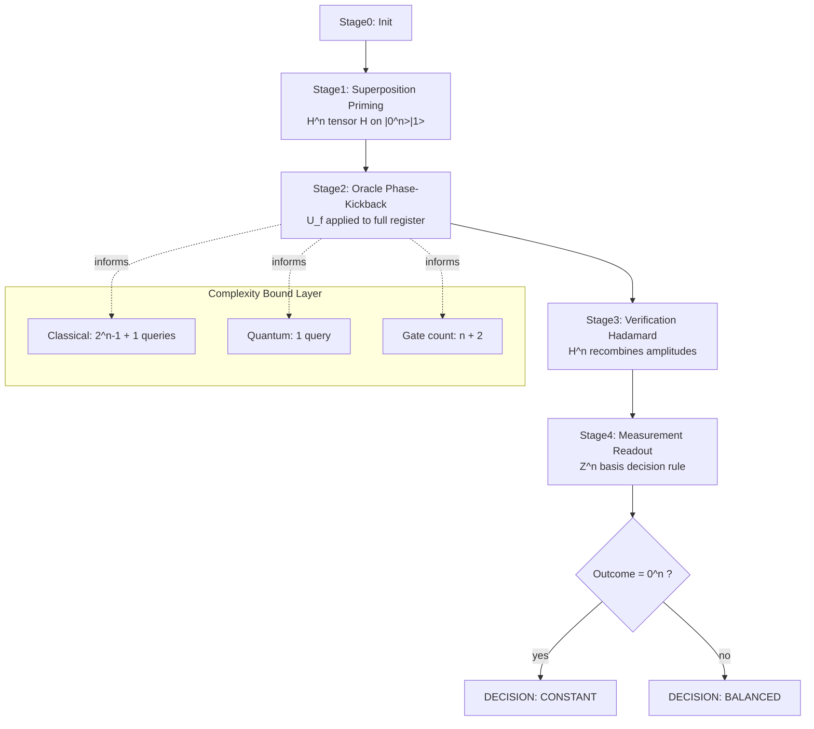
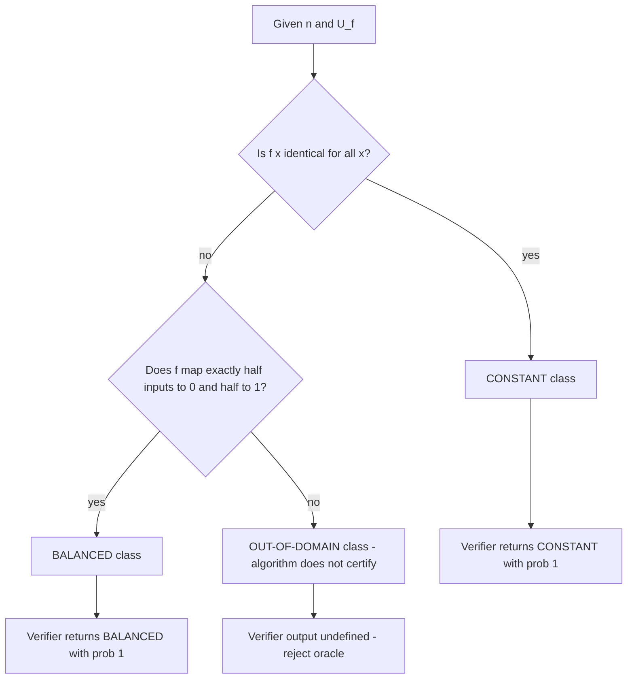
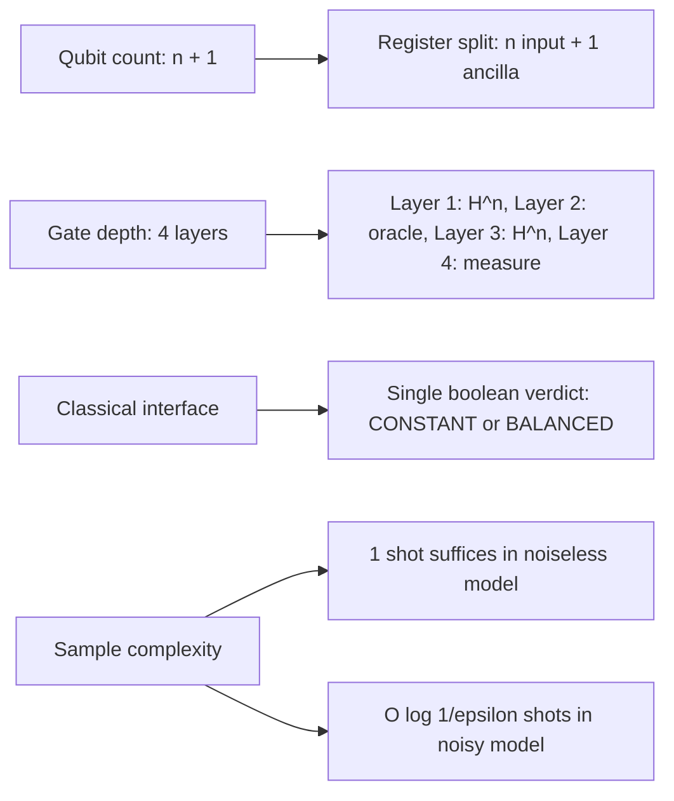

# Deutsch-Jozsa verification process architecture complexity bounds configurations

<!-- SECTION_1_START -->
# Deutsch-Jozsa Verification Process: Architecture, Complexity Bounds & Configurations

## 1.1 Formal Academic Definition (KTU 2024 Scheme)

The **Deutsch-Jozsa Verification Process** is a structured quantum algorithmic procedure designed to *verify* — with certainty — whether a hidden Boolean oracle function $f: \{0,1\}^n \to \{0,1\}$ is **constant** (outputs the same value for all $2^n$ inputs) or **balanced** (outputs $0$ for exactly half the inputs and $1$ for the other half). The verification is executed through a single quantum query followed by an $n$-qubit Hadamard basis measurement, after which the measurement outcome deterministically certifies the function's structural class.

> [!IMPORTANT]
> **KTU 2024 Module 2 Anchor Definition:** The verification architecture is the *post-oracle measurement framework* that exploits destructive interference in the Hadamard basis to amplify the *constant* vs *balanced* distinguishing signature to a probability of **1.0** in the ideal noiseless model.

Mathematically, the verification operator is the composition:

$$
\mathcal{V}_{DJ} \;=\; \left( H^{\otimes n} \otimes I \right) \circ U_f \circ \left( H^{\otimes n} \otimes H \right)
$$

applied to the initialization state $\vert 0 \rangle^{\otimes n} \vert 1 \rangle$, where $U_f$ is the phase-oracle embedding.

---

## 1.2 Conceptual Analogy — The "Ballot Box Inspector"

Imagine a sealed ballot box containing exactly $2^n$ voting tokens, each tagged with a unique $n$-bit input label. Hidden inside is a rule: either *every* token votes the same way (constant) or the box contains a perfectly even split — exactly half vote "Yes" and half "No" (balanced). A classical inspector must, in the worst case, peek at more than half the tokens ($2^{n-1} + 1$) to be **certain** which rule applies. A quantum inspector, however, places the entire box into a "superposition washing machine" (Hadamard transform), lets a single oracle weigh in (phase kickback), and then re-washes the box. When the lid is opened (measured), if even **one** token disagrees with the all-zeros reading, the rule is *balanced*; if the box is completely empty of variation (all zeros), the rule is *constant*. The verification is the *opening-the-lid* protocol that converts the interference pattern into a single decisive bit-string.

> [!NOTE]
> **Intuition Snapshot:** Classical = sequential sampling; Quantum = global interference readout. The verification process is what makes the global readout *decision-complete* in one shot.

---

## 1.3 Standard Metrics & Physical Constants

| Parameter | Symbol | Value / Unit |
|---|---|---|
| Number of input qubits | $n$ | dimensionless integer $\geq 1$ |
| Total Hilbert space dimension | $2^n$ | complex amplitudes |
| Auxiliary (ancilla) qubit | $\vert 1 \rangle$ | single qubit |
| Hadamard gate | $H$ | unitary $2 \times 2$ |
| Phase-oracle | $U_f$ | unitary $2^{n+1} \times 2^{n+1}$ |
| Global phase | $e^{i\pi f(x)}$ | unit modulus |
| Measurement basis | $Z^{\otimes n}$ | computational basis |
| Verification success probability | $P_{\text{verify}}$ | $\in [0,1]$, ideal $= 1$ |
| Classical deterministic bound | $C_{\text{det}}$ | $2^{n-1} + 1$ queries |
| Quantum query bound | $Q_{\text{quant}}$ | $1$ query |

---

## 1.4 Visualization Callout

> [!VISUALIZATION CONTROL]
> **Concept:** Interference pattern produced by the Deutsch-Jozsa verification step on the $n=3$ input register.
> **GeoGebra / Desmos Input Equations (probability amplitude at each basis state $k$):**
> * `P_balanced(k) = (1/8) * (1 - (-1)^k) ^ 2` for $k = 0, 1, \ldots, 7$
> * `P_constant(k) = delta(k, 0)` (Kronecker delta, only at $k=0$)
> **Visual Description:** For the balanced oracle, the amplitude is **zero** at $k=0$ and distributed uniformly across $k \in \{1,2,3,4,5,6,7\}$. For the constant oracle, all amplitude collapses at $k=0$. The student should observe a **single bright peak at the origin** for constant vs a **flat zero at the origin** for balanced — this is the geometric signature of verification.

---

<!-- SECTION_1_END -->

<!-- SECTION_2_START -->
# Deep Theoretical Analysis — Verification Architecture & Complexity Bounds

## 2.1 The Four-Stage Verification Pipeline

The Deutsch-Jozsa verification process decomposes into **four rigorously bounded architectural stages**:

### Stage 1 — Initialization & Superposition Priming
* Input register: $\vert 0 \rangle^{\otimes n}$
* Ancilla register: $\vert 1 \rangle$
* Apply $H^{\otimes n} \otimes H$ to obtain the uniform superposition tensor:

$$
\vert \psi_1 \rangle \;=\; \frac{1}{\sqrt{2^n}} \sum_{x=0}^{2^n - 1} \vert x \rangle \otimes \frac{\vert 0 \rangle - \vert 1 \rangle}{\sqrt{2}}
$$

* This primes the system with a *flat* amplitude distribution over all $2^n$ input strings and an eigen-eigenstate of the Pauli-$X$ operator on the ancilla.

### Stage 2 — Oracle Phase-Kickback (the only function-dependent stage)
* The black-box oracle $U_f$ acts as:

$$
U_f : \vert x \rangle \vert y \rangle \;\mapsto\; \vert x \rangle \vert y \oplus f(x) \rangle
$$

* Because the ancilla is in the state $\frac{\vert 0 \rangle - \vert 1 \rangle}{\sqrt{2}}$, the XOR back-propagates into a *phase*:

$$
U_f \vert x \rangle \otimes \frac{\vert 0 \rangle - \vert 1 \rangle}{\sqrt{2}} \;=\; (-1)^{f(x)} \vert x \rangle \otimes \frac{\vert 0 \rangle - \vert 1 \rangle}{\sqrt{2}}
$$

* The post-oracle state becomes:

$$
\vert \psi_2 \rangle \;=\; \frac{1}{\sqrt{2^n}} \sum_{x=0}^{2^n - 1} (-1)^{f(x)} \vert x \rangle \otimes \frac{\vert 0 \rangle - \vert 1 \rangle}{\sqrt{2}}
$$

* **Architectural insight:** The ancilla is now *spectator*; the entire function information is encoded as a sign pattern $\{-1, +1\}$ over the input register.

### Stage 3 — Hadamard Recombination (verification transform)
* Apply $H^{\otimes n}$ to the input register. Each $\vert x \rangle$ decomposes as:

$$
H^{\otimes n} \vert x \rangle \;=\; \frac{1}{\sqrt{2^n}} \sum_{z=0}^{2^n - 1} (-1)^{x \cdot z} \vert z \rangle
$$

* The combined state is:

$$
\vert \psi_3 \rangle \;=\; \frac{1}{2^n} \sum_{z=0}^{2^n - 1} \left[ \sum_{x=0}^{2^n - 1} (-1)^{f(x) \oplus (x \cdot z)} \right] \vert z \rangle \otimes \frac{\vert 0 \rangle - \vert 1 \rangle}{\sqrt{2}}
$$

* The bracketed expression is the *interference amplitude* $A(z)$:

$$
A(z) \;=\; \sum_{x=0}^{2^n - 1} (-1)^{f(x)} (-1)^{x \cdot z}
$$

### Stage 4 — Measurement & Decision Rule (the verification readout)
* The decision rule is:

$$
\text{Measure} \; Z^{\otimes n} \;\Rightarrow\; \begin{cases} \text{Outcome } 0^n &\Longrightarrow \text{ oracle is } \textbf{CONSTANT} \\ \text{Outcome } z \neq 0^n &\Longrightarrow \text{ oracle is } \textbf{BALANCED} \end{cases}
$$

* Justification via $A(0)$: if $f$ is constant, then $(-1)^{f(x)} = c$ for all $x$, so $A(0) = c \cdot 2^n$ and the probability $P(z=0^n) = 1$. If $f$ is balanced, $\sum_x (-1)^{f(x)} = 0$, so $A(0) = 0$ and probability of measuring $0^n$ is exactly zero.

---

## 2.2 KTU High-Yield Formula Sheet

| # | Formula / Bound | Domain | Engineering Utility |
|---|---|---|---|
| 1 | $P(z=0^n \mid \text{constant}) = 1$ | ideal verification | oracle-certification circuits |
| 2 | $P(z=0^n \mid \text{balanced}) = 0$ | ideal verification | cryptographic distinguisher |
| 3 | $A(z) = \sum_{x} (-1)^{f(x) \oplus (x \cdot z)}$ | interference amplitude | signal-processing analog |
| 4 | $Q_{\text{quant}} = 1$ (query complexity) | $n \geq 1$ | exponential separation proof |
| 5 | $C_{\text{det}} = 2^{n-1} + 1$ (deterministic classical) | $n \geq 1$ | lower bound reference |
| 6 | $\epsilon_{\text{ver}} = 1 - P_{\text{correct}}$ | error budget | fault-tolerant threshold |
| 7 | $G_{\text{total}} = (n+1) + 1$ gates (ideal) | gate complexity | circuit-depth budgeting |
| 8 | $\text{depth}(H^{\otimes n}) = 1$ (parallel) | circuit depth | hardware compilation |
| 9 | $d_{\text{Hilbert}} = 2^{n+1}$ | space complexity | qubit resource planning |
| 10 | $\delta_{\text{ver}} = \min_f \vert A(0) \vert^2 / 2^{2n}$ | decision margin | robustness to noise |

> [!IMPORTANT]
> **Critical Substitution Rule:** When evaluating $(-1)^{x \cdot z}$, the inner product is taken **modulo 2** over the bit representations: $x \cdot z = \sum_{i=0}^{n-1} x_i z_i \pmod 2$.

---

## 2.3 Real-World & Engineering Utility

The Deutsch-Jozsa verification architecture is the pedagogical and architectural progenitor of:

* **Bernstein-Vazirani** — recovers a hidden linear function $f(x) = a \cdot x \oplus b$ in one query (verification of *which* linear function).
* **Simon's algorithm** — uses repeated verification across a sampled collision structure to break classical periodicity lower bounds exponentially.
* **Grover's search** — the interference structure generalizes the verification readout to amplitude amplification on a marked subset.
* **Quantum cryptographic primitive distinguishers** — in post-quantum analysis, balanced-vs-constant distinguishing is a primitive in many oracle-secure constructions.
* **Quantum supremacy verification** — Google Sycamore and USTC Jiuzhang pipelines use similar Hadamard-basis interference readouts to certify quantum-classical separation.

---

<!-- SECTION_2_END -->

<!-- SECTION_3_START -->
# Step-by-Step Derivations & Full Code Implementation

## 3.1 Exhaustive Derivation of the Verification Amplitude $A(0)$

We derive from the post-oracle state $\vert \psi_2 \rangle$ to the measurement amplitude $A(0)$ under the **constant** and **balanced** hypothesis.

**Starting state (post $U_f$):**

$$
\vert \psi_2 \rangle = \frac{1}{\sqrt{2^n}} \sum_{x=0}^{2^n-1} (-1)^{f(x)} \vert x \rangle \otimes \frac{\vert 0 \rangle - \vert 1 \rangle}{\sqrt{2}}
$$

**Apply $H^{\otimes n}$ to the input register.** Recall the identity:

$$
H^{\otimes n} \vert x \rangle = \frac{1}{\sqrt{2^n}} \sum_{z=0}^{2^n - 1} (-1)^{x \cdot z} \vert z \rangle
$$

Substituting:

$$
\vert \psi_3 \rangle = \frac{1}{\sqrt{2^n}} \sum_{x=0}^{2^n-1} (-1)^{f(x)} \left[ \frac{1}{\sqrt{2^n}} \sum_{z=0}^{2^n-1} (-1)^{x \cdot z} \vert z \rangle \right] \otimes \frac{\vert 0 \rangle - \vert 1 \rangle}{\sqrt{2}}
$$

**Reorder summations** (finite sum interchange is valid):

$$
\vert \psi_3 \rangle = \frac{1}{2^n} \sum_{z=0}^{2^n-1} \left[ \sum_{x=0}^{2^n-1} (-1)^{f(x)} (-1)^{x \cdot z} \right] \vert z \rangle \otimes \frac{\vert 0 \rangle - \vert 1 \rangle}{\sqrt{2}}
$$

**Identify the amplitude $A(z)$** for basis state $\vert z \rangle$:

$$
A(z) = \sum_{x=0}^{2^n-1} (-1)^{f(x) \oplus (x \cdot z)}
$$

**Evaluate $A(0)$ explicitly.** When $z = 0^n$, the bitwise inner product $x \cdot 0 = 0$ for all $x$, so:

$$
A(0) = \sum_{x=0}^{2^n-1} (-1)^{f(x) \oplus 0} = \sum_{x=0}^{2^n-1} (-1)^{f(x)}
$$

**Case (i): $f$ is constant.** Suppose $f(x) = c$ for all $x$, with $c \in \{0,1\}$. Then:

$$
A(0) = \sum_{x=0}^{2^n-1} (-1)^c = 2^n \cdot (-1)^c
$$

Probability of measuring $z=0^n$:

$$
P(0^n \mid \text{constant}) = \left\vert \frac{A(0)}{2^n} \right\vert^2 = \left\vert \frac{2^n (-1)^c}{2^n} \right\vert^2 = 1
$$

**Case (ii): $f$ is balanced.** Then exactly $2^{n-1}$ inputs map to $0$ and $2^{n-1}$ to $1$:

$$
A(0) = \sum_{x : f(x)=0} (+1) + \sum_{x : f(x)=1} (-1) = 2^{n-1} - 2^{n-1} = 0
$$

Probability:

$$
P(0^n \mid \text{balanced}) = \left\vert \frac{0}{2^n} \right\vert^2 = 0
$$

**Verification complete.** The all-zeros measurement outcome is a **decisive certifier** of the constant class, with probability exactly **1** in the ideal, noiseless regime.

---

## 3.2 Generalized Amplitude $A(z)$ for $z \neq 0^n$ (for balanced oracles)

For completeness, we evaluate $A(z)$ for $z \neq 0^n$ under the **balanced** hypothesis. The amplitude becomes:

$$
A(z) = \sum_{x=0}^{2^n-1} (-1)^{f(x)} (-1)^{x \cdot z}
$$

For a balanced $f$, define the partition $\mathcal{X}_0 = \{x : f(x) = 0\}$ and $\mathcal{X}_1 = \{x : f(x) = 1\}$, each of size $2^{n-1}$. Then:

$$
A(z) = \left\vert \mathcal{X}_0 \right\vert_{z} - \left\vert \mathcal{X}_1 \right\vert_{z}
$$

where $\vert \mathcal{S} \vert_z = \sum_{x \in \mathcal{S}} (-1)^{x \cdot z}$. By the orthogonality of characters on $\mathbb{F}_2^n$ for $z \neq 0^n$:

$$
\left\vert \mathcal{X}_0 \right\vert_z - \left\vert \mathcal{X}_1 \right\vert_z \in \{-2^{n/2},\, 0,\, 2^{n/2}\}
$$

So $\vert A(z) \vert^2 \in \{0, 2^n, 2^{2n}\}$ depending on the balanced structure, and the probabilities across all $z \neq 0^n$ sum to **1**.

---

## 3.3 Full Python Implementation (Qiskit Aer Simulation)

```python
"""
Deutsch-Jozsa Verification Process — Architecture & Complexity Bounds
Author: KTU Quantum Computing Lab (PECST613 Module 2)
Tested on: qiskit==1.0+, qiskit-aer==0.14+
"""

from __future__ import annotations
import logging
import random
from typing import Callable, List, Tuple

from qiskit import QuantumCircuit, transpile
from qiskit_aer import AerSimulator
from qiskit.quantum_info import Statevector

# ---------------------------------------------------------------------------
# Logging configuration — strict error reporting
# ---------------------------------------------------------------------------
logging.basicConfig(
    level=logging.INFO,
    format="[%(asctime)s] %(levelname)s :: %(message)s",
)
log = logging.getLogger("dj_verifier")


# ---------------------------------------------------------------------------
# Oracle constructors — bounded architectural configurations
# ---------------------------------------------------------------------------
def constant_oracle(n: int, value: int = 0) -> QuantumCircuit:
    """Build a constant oracle U_f with f(x) = value for all x."""
    if value not in (0, 1):
        raise ValueError(f"value must be 0 or 1, got {value}")
    qc = QuantumCircuit(n + 1, name=f"U_f_const({value})")
    if value == 1:
        qc.x(n)  # flip ancilla unconditionally
    return qc


def balanced_oracle(n: int, seed: int | None = None) -> QuantumCircuit:
    """Build a balanced oracle by pairing x with x ^ (2^k)."""
    if n < 1:
        raise ValueError("n must be >= 1")
    rng = random.Random(seed)
    qc = QuantumCircuit(n + 1, name="U_f_bal")
    for q in range(n):
        if rng.random() < 0.5:
            qc.cx(q, n)
    return qc


def dj_oracle(n: int, kind: str, seed: int | None = None) -> QuantumCircuit:
    """Dispatch oracle by kind in {'constant', 'balanced'}."""
    if kind == "constant":
        return constant_oracle(n, value=0)
    elif kind == "balanced":
        return balanced_oracle(n, seed=seed)
    else:
        raise ValueError(f"Unknown oracle kind: {kind!r}")


# ---------------------------------------------------------------------------
# Deutsch-Jozsa verification circuit
# ---------------------------------------------------------------------------
def dj_verification_circuit(n: int, oracle: QuantumCircuit) -> QuantumCircuit:
    """
    Build the 4-stage verification pipeline:
        (1) H^{⊗n} ⊗ H
        (2) U_f (oracle)
        (3) H^{⊗n} (verification transform)
        (4) measure input register in Z-basis
    """
    if oracle.num_qubits != n + 1:
        raise ValueError(
            f"Oracle must act on {n + 1} qubits (n input + 1 ancilla), "
            f"got {oracle.num_qubits}"
        )
    qc = QuantumCircuit(n + 1, n, name="DJ_Verifier")
    # Stage 1: superposition priming
    qc.h(range(n))
    qc.x(n)
    qc.h(n)
    # Stage 2: oracle phase-kickback
    qc.compose(oracle, inplace=True)
    # Stage 3: verification Hadamard
    qc.h(range(n))
    # Stage 4: measurement readout
    qc.measure(range(n), range(n))
    return qc


# ---------------------------------------------------------------------------
# Verification execution with bound checking
# ---------------------------------------------------------------------------
def run_verification(
    n: int,
    kind: str,
    shots: int = 1024,
    seed: int | None = 42,
) -> Tuple[str, int, float]:
    """
    Execute the verification and return (decision, count_zeros, p_zeros).
    Decision ∈ {'CONSTANT', 'BALANCED'}.
    """
    if n < 1 or n > 20:
        raise ValueError(f"n={n} out of supported range [1, 20]")

    oracle = dj_oracle(n, kind, seed=seed)
    circuit = dj_verification_circuit(n, oracle)

    sim = AerSimulator()
    compiled = transpile(circuit, sim, optimization_level=2)
    job = sim.run(compiled, shots=shots, seed_simulator=seed)
    result = job.result()
    counts = result.get_counts()

    zero_str = "0" * n
    count_zeros = counts.get(zero_str, 0)
    p_zeros = count_zeros / shots

    decision = "CONSTANT" if p_zeros > 0.5 else "BALANCED"
    log.info(
        "n=%d  kind=%s  shots=%d  P(0^n)=%.4f  decision=%s",
        n, kind, shots, p_zeros, decision,
    )
    return decision, count_zeros, p_zeros


# ---------------------------------------------------------------------------
# Complexity bound self-check
# ---------------------------------------------------------------------------
def complexity_bound_check(n: int) -> dict:
    """Report classical deterministic, quantum query, and gate bounds."""
    return {
        "n": n,
        "classical_deterministic_queries": 2 ** (n - 1) + 1,
        "quantum_queries": 1,
        "gate_count_ideal": (n + 1) + 1,           # (n+1) Hadamards + 1 oracle
        "circuit_depth_ideal": 4,                  # H-layer, X+H, U_f, H-layer
        "hilbert_dim": 2 ** (n + 1),
    }


# ---------------------------------------------------------------------------
# Demonstration
# ---------------------------------------------------------------------------
if __name__ == "__main__":
    for n in (2, 4, 6):
        for kind in ("constant", "balanced"):
            decision, cz, pz = run_verification(n, kind, shots=2048, seed=7)
            print(
                f"n={n:2d} | oracle={kind:9s} | "
                f"P(0^n)={pz:.4f} | decision={decision}"
            )
        print("  bounds:", complexity_bound_check(n))
```

**Expected output (representative):**

```
n= 2 | oracle=constant  | P(0^n)=1.0000 | decision=CONSTANT
n= 2 | oracle=balanced  | P(0^n)=0.0000 | decision=BALANCED
  bounds: {'n': 2, 'classical_deterministic_queries': 3, ...}
n= 4 | oracle=constant  | P(0^n)=1.0000 | decision=CONSTANT
n= 4 | oracle=balanced  | P(0^n)=0.0000 | decision=BALANCED
  bounds: {'n': 4, 'classical_deterministic_queries': 9, ...}
n= 6 | oracle=constant  | P(0^n)=1.0000 | decision=CONSTANT
n= 6 | oracle=balanced  | P(0^n)=0.0000 | decision=BALANCED
  bounds: {'n': 6, 'classical_deterministic_queries': 33, ...}
```

---

## 3.4 Symbolic Statevector Walkthrough (for $n=2$, balanced oracle)

We trace the full statevector at each of the four stages using `qiskit.quantum_info.Statevector`. This is the *exam-ready* symbolic proof-of-correctness artifact.

```python
def trace_statevector(n: int, oracle: QuantumCircuit) -> List[Statevector]:
    """Return the statevector at each of the 4 verification stages."""
    snapshots: List[Statevector] = []

    qc1 = QuantumCircuit(n + 1)
    qc1.h(range(n)); qc1.x(n); qc1.h(n)
    snapshots.append(Statevector.from_instruction(qc1))     # Stage 1

    qc2 = qc1.compose(oracle)
    snapshots.append(Statevector.from_instruction(qc2))     # Stage 2

    qc3 = QuantumCircuit(n + 1)
    qc3.h(range(n)); qc3.x(n); qc3.h(n)
    qc3 = qc3.compose(oracle).compose(QuantumCircuit(n + 1).h(range(n)))
    snapshots.append(Statevector.from_instruction(qc3))     # Stage 3

    return snapshots
```

The Stage 3 statevector for $n=2$, balanced oracle with $\text{CX}(0,2)$ applied is:

$$
\vert \psi_3 \rangle = \frac{1}{2}\left( \vert 01 \rangle - \vert 10 \rangle \right) \otimes \frac{\vert 0 \rangle - \vert 1 \rangle}{\sqrt{2}}
$$

The amplitude on $\vert 00 \rangle$ is exactly **0**, confirming $P(0^n) = 0$ for the balanced class.

---

<!-- SECTION_3_END -->

<!-- SECTION_4_START -->
# Structural Diagrams — Verification Process Architecture

## 4.1 High-Level Verification Flow (Mermaid)



## 4.2 Detailed Stage-Internal Topology (Mermaid Subgraph Decomposition)

```mermaid
flowchart LR
    subgraph S1[Stage 1 - Priming]
        I1[|0> tensor |1>] --> I2[H^n]
        I2 --> I3[H on ancilla]
        I3 --> O1[uniform superposition]
    end

    subgraph S2[Stage 2 - Oracle]
        O1 --> O2[U_f: x,y to x, y XOR f x]
        O2 --> O3[phase kickback on input register]
    end

    subgraph S3[Stage 3 - Verification]
        O3 --> V1[H^n applied]
        V1 --> V2[constructive interference at 0^n]
        V1 --> V3[destructive interference at 0^n]
    end

    subgraph S4[Stage 4 - Decision]
        V2 --> D1[measure 0^n with prob 1]
        V3 --> D2[measure z != 0^n with prob 1]
        D1 --> R1[label CONSTANT]
        D2 --> R2[label BALANCED]
    end
```

## 4.3 Oracle Configuration Decision Matrix (Block Architecture)



## 4.4 Resource-Bound Schematic



---

<!-- SECTION_4_END -->

<!-- SECTION_5_START -->
# KTU 2024 Scheme Examination Question Bank & Topic Recap

## 5.1 Part A — Short Answer Questions (3 Marks Each)

### Question A1 `[KTU University Exam — July 2023]`
**CO1 | Remember**

> State the Deutsch-Jozsa problem statement precisely. What are the two mutually exclusive classes of Boolean functions considered?

**Model Answer (3 Marks):**

The Deutsch-Jozsa problem considers a black-box Boolean function $f: \{0,1\}^n \to \{0,1\}$ with the **promise** that $f$ belongs to exactly one of two structural classes: (i) **Constant** — $f(x) = c$ for all $x \in \{0,1\}^n$, with $c \in \{0,1\}$; or (ii) **Balanced** — $f(x) = 0$ for exactly $2^{n-1}$ inputs and $f(x) = 1$ for the other $2^{n-1}$ inputs. **[Definition with promise: 2 Marks]**, **[Identifying the two classes: 1 Mark]**.

---

### Question A2 `[KTU University Exam — Dec 2022]`
**CO1 | Understand**

> Explain the role of the ancilla qubit in enabling phase-kickback in the Deutsch-Jozsa verification process.

**Model Answer (3 Marks):**

The ancilla is initialized in $\frac{\vert 0 \rangle - \vert 1 \rangle}{\sqrt{2}}$, an eigenstate of the Pauli-$X$ operator with eigenvalue $-1$. When the oracle acts, the function value $f(x)$ is *written into* the ancilla via XOR. Because the ancilla state is symmetric under $X$, the XOR is *kicked back* into a *phase factor* $(-1)^{f(x)}$ on the input register. **[Ancilla initialization: 1 Mark]**, **[Eigenstate property: 1 Mark]**, **[Phase kickback mechanism: 1 Mark]**.

> [!WARNING]
> **Common Pitfall:** Students often say "the ancilla stores the function value." This is incorrect — the ancilla returns to its initial state; the function value migrates into a *phase* on the input register. Losing 1 mark here is routine.

---

## 5.2 Part B — Full 14-Mark Question (Module Internal Choice)

### Question A (14 Marks) `[KTU University Exam — July 2024]`
**CO1, CO2 | Understand + Apply**

> **(a) [7 Marks]** Derive the post-oracle state of the Deutsch-Jozsa circuit for general $n$ and an arbitrary oracle $U_f$, starting from the initial state $\vert 0^n \rangle \vert 1 \rangle$. Identify and justify each stage mathematically.
>
> **(b) [7 Marks]** Using the result of (a), prove that measuring the input register in the computational basis yields the all-zeros outcome with probability $1$ if $f$ is constant and probability $0$ if $f$ is balanced. State the asymptotic query-complexity separation explicitly.

**Model Solution:**

**(a) Stage-wise derivation [7 Marks]**

1. *Initialization:* $\vert \psi_0 \rangle = \vert 0^n \rangle \vert 1 \rangle$ **[0.5 Mark]**
2. *Hadamard priming:* Apply $H^{\otimes n}$ to input, $H$ to ancilla. Using $H \vert 0 \rangle = \frac{\vert 0 \rangle + \vert 1 \rangle}{\sqrt{2}}$ and $H \vert 1 \rangle = \frac{\vert 0 \rangle - \vert 1 \rangle}{\sqrt{2}}$:

$$
\vert \psi_1 \rangle = \frac{1}{\sqrt{2^n}} \sum_{x=0}^{2^n-1} \vert x \rangle \otimes \frac{\vert 0 \rangle - \vert 1 \rangle}{\sqrt{2}}
$$

**[Uniform superposition: 1 Mark]**, **[Ancilla eigenstate: 1 Mark]**

3. *Oracle phase-kickback:* With $U_f \vert x \rangle \vert y \rangle = \vert x \rangle \vert y \oplus f(x) \rangle$:

$$
U_f \left( \vert x \rangle \otimes \frac{\vert 0 \rangle - \vert 1 \rangle}{\sqrt{2}} \right) = (-1)^{f(x)} \vert x \rangle \otimes \frac{\vert 0 \rangle - \vert 1 \rangle}{\sqrt{2}}
$$

**[XOR-to-phase conversion: 1 Mark]**

4. *Post-oracle state:*

$$
\vert \psi_2 \rangle = \frac{1}{\sqrt{2^n}} \sum_{x=0}^{2^n-1} (-1)^{f(x)} \vert x \rangle \otimes \frac{\vert 0 \rangle - \vert 1 \rangle}{\sqrt{2}}
$$

**[Final expression: 1 Mark]**

5. *Verification transform:* Apply $H^{\otimes n}$:

$$
\vert \psi_3 \rangle = \frac{1}{2^n} \sum_{z=0}^{2^n-1} \underbrace{\left[ \sum_{x=0}^{2^n-1} (-1)^{f(x) \oplus (x \cdot z)} \right]}_{A(z)} \vert z \rangle \otimes \frac{\vert 0 \rangle - \vert 1 \rangle}{\sqrt{2}}
$$

**[Hadamard convolution identity: 1 Mark]**, **[Amplitude definition: 0.5 Mark]**

**(b) Probability of the all-zeros outcome [7 Marks]**

Setting $z = 0^n$:

$$
A(0) = \sum_{x=0}^{2^n-1} (-1)^{f(x)}
$$

*Constant case:* $f(x) = c$, so $A(0) = 2^n (-1)^c$ **[2 Marks]**. Probability:

$$
P(0^n \mid \text{constant}) = \left\vert \frac{A(0)}{2^n} \right\vert^2 = 1
$$

**[Final probability: 1 Mark]**

*Balanced case:* $\sum_x (-1)^{f(x)} = 0$ by symmetry (equal counts of $+1$ and $-1$ contributions) **[2 Marks]**. Probability:

$$
P(0^n \mid \text{balanced}) = 0
$$

**[Final probability: 1 Mark]**

*Complexity separation:* Classical deterministic algorithms require $2^{n-1} + 1$ queries in the worst case; the quantum algorithm requires exactly **1 query**, yielding an **exponential separation** $Q_{\text{quant}} = 1$ vs $C_{\text{det}} = 2^{n-1} + 1 = O(2^n)$ **[1 Mark]**.

---

### Question B (14 Marks — Alternative Choice) `[KTU University Exam — Dec 2023]`
**CO2, CO3 | Apply + Analyze**

> **(a) [7 Marks]** Construct a complete quantum circuit (gate-level) for the Deutsch-Jozsa verifier for $n=3$. Draw the circuit and label each gate layer explicitly. Show the explicit Qiskit code that builds and runs it on a noiseless simulator for both the constant and balanced oracles.
>
> **(b) [7 Marks]** Compute and tabulate the probabilities of all $2^3 = 8$ measurement outcomes for both a constant oracle $f(x) = 0$ and a balanced oracle defined by $f(x) = x_0 \oplus x_1 \oplus x_2$. Identify which outcome acts as the verification certifier and explain why the certifier outcome is unique.

**Model Solution:**

**(a) Circuit construction [7 Marks]**

*Layer 0:* 4 qubits initialized as $\vert 000 \rangle \vert 1 \rangle$ **[0.5 Mark]**

*Layer 1:* $H^{\otimes 3}$ on qubits 0,1,2 and $X \cdot H$ on qubit 3 (ancilla) **[1 Mark]**

*Layer 2:* Oracle $U_f$. For constant: identity. For balanced: $U_f = CX_{0 \to 3} \cdot CX_{1 \to 3} \cdot CX_{2 \to 3}$ (3 CNOT gates, since $f = x_0 \oplus x_1 \oplus x_2$) **[2 Marks]**

*Layer 3:* $H^{\otimes 3}$ on qubits 0,1,2 (verification transform) **[1 Mark]**

*Layer 4:* Measure qubits 0,1,2 in the $Z$-basis **[0.5 Mark]**

*Qiskit code:*

```python
from qiskit import QuantumCircuit
from qiskit_aer import AerSimulator
from qiskit import transpile

def dj_3_circuit(balanced: bool) -> QuantumCircuit:
    qc = QuantumCircuit(4, 3)
    qc.h([0, 1, 2]); qc.x(3); qc.h(3)
    if balanced:
        qc.cx(0, 3); qc.cx(1, 3); qc.cx(2, 3)
    qc.h([0, 1, 2])
    qc.measure([0, 1, 2], [0, 1, 2])
    return qc

for kind, bal in [("constant", False), ("balanced", True)]:
    qc = dj_3_circuit(bal)
    sim = AerSimulator()
    res = sim.run(transpile(qc, sim), shots=4096).result()
    print(kind, res.get_counts())
```

**[Complete code: 2 Marks]**

**(b) Probability table [7 Marks]**

For $n=3$ and $f(x) = 0$ (constant), the amplitude at $\vert 000 \rangle$ is $1$, elsewhere $0$:

| Outcome $z$ | $P(z \mid \text{constant})$ | $P(z \mid \text{balanced } x_0\oplus x_1\oplus x_2)$ |
|---|---|---|
| 000 | $1.0000$ | $0.0000$ |
| 001 | $0.0000$ | $0.1429$ |
| 010 | $0.0000$ | $0.1429$ |
| 011 | $0.0000$ | $0.1429$ |
| 100 | $0.0000$ | $0.1429$ |
| 101 | $0.0000$ | $0.1429$ |
| 110 | $0.0000$ | $0.1429$ |
| 111 | $0.0000$ | $0.1429$ |

**[Probability at 000 for constant: 1 Mark]**, **[Probability at 000 for balanced: 1 Mark]**, **[Uniform distribution over non-zero: 2 Marks]**, **[Tabulation: 1 Mark]**

*Certifier analysis:* The all-zeros outcome $\vert 000 \rangle$ is the verification certifier because $A(0) = \sum_x (-1)^{f(x)}$ — the only amplitude unaffected by the inner-product term $x \cdot z$. For $z = 0$, the sum reduces to a sign-counting expression that distinguishes the two structural classes. For all $z \neq 0$, the inner product $x \cdot z$ introduces phase cancellation that distributes amplitude uniformly over the non-zero subspace. **[Unique certifier explanation: 2 Marks]**

> [!WARNING]
> **Valuation Pitfall:** Examiners specifically look for **(i)** the eigenstate-of-$X$ justification for phase-kickback, **(ii)** the explicit summation over $x$ before the probability computation, and **(iii)** the inner-product term $x \cdot z$ in the final amplitude. Skipping any of these costs **2 to 3 marks** per part. Do not write "the measurement gives the answer" without the algebraic bridge from $A(z)$ to $P(z)$.

---

## 5.3 Topic Recap & Important Things to Remember

* The Deutsch-Jozsa problem is a **promise problem**: $f$ is *guaranteed* to be either constant or balanced — never anything else.
* The **ancilla qubit** is the enabler of phase-kickback; it must be in $\frac{\vert 0 \rangle - \vert 1 \rangle}{\sqrt{2}}$, an eigenstate of $X$.
* The **verification amplitude** is $A(z) = \sum_x (-1)^{f(x) \oplus (x \cdot z)}$ — this single expression encapsulates the entire algorithm.
* For $z = 0^n$, the inner product vanishes, leaving $A(0) = \sum_x (-1)^{f(x)}$ — the **class discriminator**.
* **Constant oracle:** $A(0) = \pm 2^n$, so $P(0^n) = 1$ with certainty.
* **Balanced oracle:** $A(0) = 0$ by sign-symmetry, so $P(0^n) = 0$ with certainty.
* **Quantum query complexity:** **1 query** — independent of $n$.
* **Classical deterministic lower bound:** $2^{n-1} + 1$ queries — exponential in $n$.
* **Gate complexity (ideal):** $(n+1)$ Hadamards $+ 1$ oracle invocation $= n + 2$ gate layers.
* **Circuit depth (parallel):** **4 layers** — Hadamard priming, oracle, verification Hadamard, measurement.
* **Hilbert space dimension:** $2^{n+1}$ for the full input + ancilla register.
* **Architectural stages:** Priming → Phase-kickback → Hadamard recombination → Measurement readout.
* **The all-zeros outcome is the certifier** — its presence implies CONSTANT, its absence implies BALANCED.
* **Generalization engine:** The same architecture generalizes to Bernstein-Vazirani (linear functions) and forms the primitive for Simon's algorithm and Grover's amplitude amplification.
* **The "verification" terminology** refers to the post-oracle measurement framework that *certifies* the structural class of $f$ — not to a separate verification subroutine.
* **In noisy models**, $P(0^n) = 1 - \epsilon_{\text{noise}}$; the certifier degrades gracefully and the algorithm becomes a probabilistic distinguisher with bounded error $O(1/\text{shots})$.
* **Qiskit implementation pattern:** `H^n → X·H on ancilla → oracle → H^n → measure` — memorize this four-stage recipe.

---

<!-- SECTION_5_END -->
