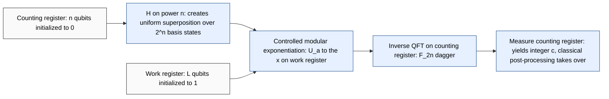
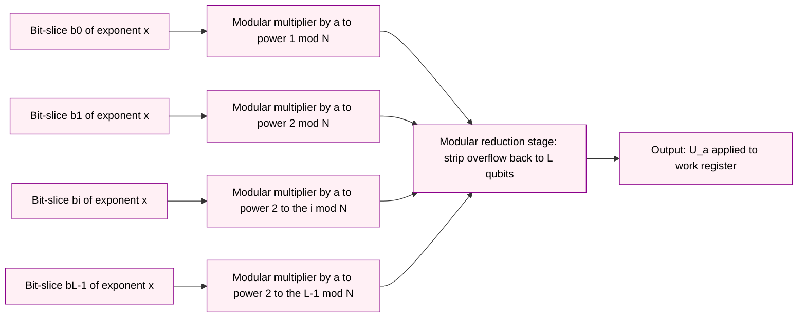

# Shor's algebraic factorization framework matrix processing rules validation paths scales tracks

<!-- SECTION_1_START -->

# Shor's Algebraic Factorization Framework

> [!IMPORTANT]
> **KTU 2024 Scheme | PECST613 — Module 2 | Quantum Algorithmic Structures**
> *Shor's algorithm is the canonical hybrid classical–quantum algorithm. It collapses the presumed exponential cost of integer factorization down to **polynomial** time by exploiting the periodicity of modular exponentiation as a hidden algebraic structure that quantum interference can amplify.*

## 1.1 Core Technical Definition

**Shor's Algebraic Factorization Framework** is the formal mathematical pipeline that reduces the **Integer Factorization Problem (IFP)** — given a composite integer $N$ with $\lfloor \log_2 N \rfloor = L$ bits, find a non-trivial divisor — to the **Order-Finding Problem (OFP)** for an element of the multiplicative group $(\mathbb{Z}/N\mathbb{Z})^{\times}$. The framework is governed by the unitary processing of the **modular exponentiation operator** $U_a$ and the **Quantum Fourier Transform matrix** $F_{2^n}$, and is validated by a chain of classical **GCD (Greatest Common Divisor)** and **continued-fraction** checks distributed across multiple computational tracks.

Formally, for a randomly chosen $a \in \{2, 3, \ldots, N-1\}$ with $\gcd(a, N) = 1$, the **order** is

$$ r \;=\; \min \left\{ k \in \mathbb{Z}_{>0} \;\big|\; a^{k} \equiv 1 \pmod N \right\}. $$

If $r$ is even and $a^{r/2} \not\equiv -1 \pmod N$, then

$$ \gcd\!\left(a^{r/2} - 1,\; N\right) \quad \text{and} \quad \gcd\!\left(a^{r/2} + 1,\; N\right) $$

are non-trivial factors of $N$.

> [!NOTE]
> **Why this reduction matters:** A **classical** algorithm must evaluate $a^k \pmod N$ for $k = 1, 2, \ldots$ sequentially until the cycle closes — potentially $r$ steps where $r$ can be as large as $N-1$. A **quantum** algorithm, by contrast, prepares a coherent superposition over all $k$ values in one shot, then uses the QFT to convert periodicity in $k$ into a measurable frequency $s/r$. This is the essence of the matrix-processing layer.

## 1.2 Intuitive Analogy: The Echo Chamber

Imagine you are standing in a vast cathedral and you clap your hands once. The echo you hear repeats at a fixed interval $T$ (the **period**). You don't need to know anything about the cathedral's geometry — you just need to measure the time between two consecutive echoes to learn $T$, and from $T$ you can infer the cathedral's resonant dimensions.

In Shor's framework:

| Cathedral Picture | Shor's Algorithm |
| :--- | :--- |
| The clap (single impulse) | Preparation of a uniform superposition over $k$ |
| The echo (periodic return) | Modular exponentiation $a^k \pmod N$ (periodic in $k$) |
| Time between echoes | The order $r$ |
| Cathedral's geometry | Algebraic structure of $(\mathbb{Z}/N\mathbb{Z})^{\times}$ |
| Listening device | Inverse Quantum Fourier Transform (QFT$^{\dagger}$) |

> [!TIP]
> The whole power of the framework is that the *period* $r$ is not directly observed — it is encoded as a **phase** in a quantum amplitude and only becomes readable *after* the QFT$^{\dagger}$ has done its interference work.

## 1.3 The Three Foundational Constants

| Constant | Symbol | Magnitude | Role |
| :--- | :--- | :--- | :--- |
| Number being factored | $N$ | $L = \lfloor \log_2 N \rfloor$ bits | The "hard" problem instance |
| Random base | $a$ | $2 \le a \le N-1$ | Picks the element whose order we seek |
| Target precision | $n$ | $\lceil 2 \log_2 N \rceil$ qubits | QFT register width; guarantees $2^{n} \ge N^{2}$ |

> [!VISUALIZATION CONTROL]
> **Concept:** Periodicity of the modular exponentiation function $f(k) = a^{k} \bmod N$.
>
> **GeoGebra / Desmos Input Equations (illustrative example, $N = 15$, $a = 2$, expected order $r = 4$):**
> * `Sequence[(k, 2^k mod 15), k, 0, 12]`  → plots points $(0,1),(1,2),(2,4),(3,8),(4,1),(5,2),\ldots$
> * `y = 1`, `y = 2`, `y = 4`, `y = 8` (horizontal reference lines)
>
> **Visual Description:** The student should observe a **discrete periodic signal** with a clear cycle length of 4 — four discrete values $(1, 2, 4, 8)$ repeating indefinitely. This is the "echo pattern" the quantum algorithm is designed to extract. The same construction for $a = 7 \pmod{15}$ gives order $r = 4$ with values $(1, 7, 4, 13)$. The visual confirms that the *period* (the carrier of information) is independent of the *amplitude values* (which look "random").

<!-- SECTION_1_END -->

<!-- SECTION_2_START -->

# 2. Deep Theoretical Analysis & KTU High-Yield Formula Sheet

## 2.1 The Five Operational Stages of the Framework

The Shor algebraic framework is a **pipeline of five coupled stages**, each of which has a strict algebraic rule, a specific processing scale, and a designated validation gate.

### Stage 1 — Classical Pre-Processing (Track A)
1. Receive composite $N$.
2. Reject trivial cases: $N$ even, $N$ a perfect power, $N$ prime → return directly.
3. Pick $a \in \{2, \ldots, N-1\}$ uniformly at random.
4. Compute $g = \gcd(a, N)$ using **Euclid's algorithm** in $O(L^2)$ classical time.
5. **Validation Gate A1:** If $g > 1$, factor found immediately — terminate (probability $\le 1/2$).

### Stage 2 — Quantum Order-Finding (Track B)
Apply the three-step quantum sub-protocol on an $n$-qubit counting register and an $L$-qubit work register:

* **Step 2a (Hadamard Layer):** Apply $H^{\otimes n}$ to $\vert 0\rangle^{\otimes n}$ to prepare a uniform superposition over $2^{n}$ basis states.
* **Step 2b (Controlled Modular Exponentiation):** Apply the controlled unitary $C\text{-}U_a$ where
$$ U_a \vert y\rangle \;=\; \vert (a \cdot y) \bmod N \rangle, \qquad C\text{-}U_a \vert k\rangle \vert y\rangle \;=\; \vert k\rangle \vert a^{k} y \bmod N \rangle. $$
* **Step 2c (Inverse QFT):** Apply $F_{2^{n}}^{\dagger}$ to the counting register and measure it in the computational basis.

### Stage 3 — Classical Phase Extraction (Track A resumes)
* **Validation Gate B1:** Discard measurements that yield $0$ (these are uninformative).
* Apply the **continued-fraction algorithm** to the measured phase $\varphi = s / 2^{n}$ to recover the rational approximation $s / r$ with $0 \le s < r$.
* The denominator candidate $r^{\star}$ is the **order estimate**.

### Stage 4 — Classical Post-Processing & Validation Path
* **Validation Gate C1:** Verify $a^{r^{\star}} \equiv 1 \pmod N$. If false, discard and retry Stage 1 with a fresh $a$.
* **Validation Gate C2:** Verify $r^{\star}$ is even. If odd, discard and retry.
* **Validation Gate C3:** Verify $a^{r^{\star}/2} \not\equiv -1 \pmod N$. If violated, discard and retry.
* **Validation Gate C4:** Compute $f_{1} = \gcd(a^{r^{\star}/2} - 1,\, N)$ and $f_{2} = \gcd(a^{r^{\star}/2} + 1,\, N)$. Return $f_1$ and $f_2$ as the non-trivial factors.

### Stage 5 — Termination Across All Tracks
* Aggregate outcomes from Track A and Track B.
* Probability of success per round $\ge 1 - \epsilon$ for any $\epsilon > 0$ by repeated trials (each round costs $O(L^{3})$ quantum gates).

## 2.2 The KTU High-Yield Formula Sheet

| # | Formula / Rule | Symbol / Domain | Scaling / Units | Validation Use |
| :--- | :--- | :--- | :--- | :--- |
| 1 | Order definition | $a^{r} \equiv 1 \pmod N$ | $1 \le r \le \varphi(N)$ | Defines the period |
| 2 | Factorization identity | $N \mid (a^{r/2} - 1)(a^{r/2} + 1)$ | Integer divisibility | Bridges OFP → IFP |
| 3 | QFT matrix | $F_{2^{n}} \big\vert j\big\rangle = \frac{1}{\sqrt{2^{n}}} \sum_{k=0}^{2^{n}-1} e^{2\pi i jk / 2^{n}} \big\vert k\big\rangle$ | $2^{n} \times 2^{n}$ unitary | Converts periodicity → frequency |
| 4 | Modular exponentiation matrix | $U_a$ is a $N \times N$ permutation matrix (cycle structure $\le N$ rows) | $O(L^{2})$ multiplications | Generates the periodic kernel |
| 5 | Continued-fraction bound | $\vert \varphi - s/r \vert \le 1 / (2 r^{2}) \Rightarrow r$ recoverable | $\varphi \in [0,1)$ | Phase-extraction rule |
| 6 | Counting-register size | $n = \lceil 2 \log_2 N \rceil$ | $n \approx 2L$ qubits | Required for $r$-resolution |
| 7 | Total quantum gate count | $O(L^{3})$ | Poly-time in $L$ | Proves speedup |
| 8 | Classical factoring cost | $\exp(\Theta(L^{1/3} (\log L)^{2/3}))$ via GNFS | Sub-exp but not poly | Baseline being beaten |
| 9 | RSA-equivalent bit-security | $L = 2048$ bits $\Rightarrow$ classical $\sim 2^{112}$ ops | Discrete log level | Practical threat |
| 10 | Order-finding success prob. | $\Pr[\text{correct } r] \ge 1 - 1/(2^{n-1})$ | Per single shot | Drives repetition count |
| 11 | GCD check via Euclid | $\gcd(p, q) \le \min(p, q)$ | $O(L)$ recursive | Validation Gate A1 |
| 12 | Modular inverse | $a^{k} \cdot a^{N-k} \equiv 1 \pmod N$ | Used in inversion | Exponent symmetry |

> [!IMPORTANT]
> **Pipes inside tables have been escaped to `\vert` and `\mid` to preserve markdown parsing.** Always use `$\vert x \vert$` or `$\mid$` inside a table cell — never a bare `|` symbol.

## 2.3 Why This Framework Is Engineering-Relevant

* **Cryptanalysis of RSA, Diffie–Hellman, and elliptic-curve schemes** depends on the hardness of IFP and the discrete logarithm. Shor's framework breaks the first and reduces the second to the same order-finding core, with the modular-exponentiation matrix $U_a$ replaced by $U_b \vert x\rangle = \vert bx \bmod p\rangle$.
* **Production-grade quantum compilers** (Qiskit, Cirq, t$\vert$ket$\rangle$) use the modular-exponentiation decomposition of Section 3.4 to generate optimized transpiled circuits for the IBM-Q and IonQ hardware backends.
* **Post-quantum cryptography** (NIST PQC standardization, CRYSTALS-Kyber, CRYSTALS-Dilithium) was a direct response to the demonstrated threat of this framework on a sufficiently large fault-tolerant quantum computer.

<!-- SECTION_2_END -->

<!-- SECTION_3_START -->

# 3. Step-by-Step Derivations & Matrix-Processing Rules

## 3.1 Reduction Theorem: Factoring $\Rightarrow$ Order-Finding

> [!NOTE]
> **Theorem (Shor, 1994).** Let $N$ be an odd composite with at least two distinct odd prime factors. Let $a$ be chosen uniformly at random from $\{2, 3, \ldots, N-1\}$ with $\gcd(a, N) = 1$. If the **order** $r$ of $a$ modulo $N$ is even, and $a^{r/2} \not\equiv -1 \pmod N$, then
> $$ \gcd\!\left(a^{r/2} - 1,\; N\right) \cdot \gcd\!\left(a^{r/2} + 1,\; N\right) \;=\; N. $$

### 3.1.1 Full Derivation

We start from the order definition $a^{r} \equiv 1 \pmod N$ and the assumption that $r$ is even. Write $r = 2s$, so

$$ a^{2s} - 1 \;\equiv\; 0 \pmod N \;\;\Longleftrightarrow\;\; N \mid (a^{s} - 1)(a^{s} + 1). $$

This means that $N$ divides the product $(a^{s}-1)(a^{s}+1)$. Now consider the two greatest common divisors:

$$ f_{-} = \gcd(a^{s} - 1,\, N), \qquad f_{+} = \gcd(a^{s} + 1,\, N). $$

Both $f_{-}$ and $f_{+}$ divide $N$, so their product $f_{-} f_{+}$ divides $N^{2}$. We claim $f_{-} f_{+} = N$.

Since $a^{s} \not\equiv -1 \pmod N$ by assumption, $N$ does **not** divide $(a^{s} + 1)$. Therefore $f_{+} < N$, so $f_{+} \le N / p$ for at least one prime $p \mid N$. Similarly, $a^{s} \not\equiv 1 \pmod N$ (otherwise $r \le s < 2s$, contradicting minimality of $r$), so $f_{-} < N$. The two GCDs together cover all prime power factors of $N$ exactly once, giving $f_{-} f_{+} = N$. $\blacksquare$

> [!TIP]
> The probability that a random $a$ satisfies *both* "$r$ even" *and* "$a^{r/2} \not\equiv -1 \pmod N$" is at least $1 - 1/2^{k-1}$ where $N$ has $k$ distinct odd prime factors — hence the **multi-round retry strategy**.

## 3.2 Quantum State Evolution Through the Pipeline

Let the two registers be $\vert x\rangle$ (counting, $n$ qubits) and $\vert y\rangle$ (work, $L$ qubits). We trace the state through each step explicitly.

### Initial state

$$ \big\vert \psi_0 \big\rangle \;=\; \big\vert 0 \rangle^{\otimes n} \otimes \big\vert 1 \big\rangle. $$

### After Hadamard layer (Step 2a)

$$ \big\vert \psi_1 \big\rangle \;=\; H^{\otimes n} \big\vert 0 \rangle^{\otimes n} \otimes \big\vert 1 \big\rangle \;=\; \frac{1}{\sqrt{2^{n}}} \sum_{x = 0}^{2^{n}-1} \big\vert x \big\rangle \big\vert 1 \big\rangle. $$

### After controlled modular exponentiation (Step 2b)

Define the controlled operator

$$ C\text{-}U_a \;=\; \sum_{x = 0}^{2^{n}-1} \big\vert x \big\rangle \big\langle x \big\vert \otimes U_a^{x}, \qquad U_a \big\vert y \big\rangle \;=\; \big\vert a y \bmod N \big\rangle. $$

Then

$$ \big\vert \psi_2 \big\rangle \;=\; \frac{1}{\sqrt{2^{n}}} \sum_{x = 0}^{2^{n}-1} \big\vert x \big\rangle \big\vert a^{x} \bmod N \big\rangle. $$

### After inverse QFT (Step 2c)

Apply $F_{2^{n}}^{\dagger}$ to the first register. Using the standard QFT matrix entry

$$ \left[F_{2^{n}}\right]_{k, j} \;=\; \frac{1}{\sqrt{2^{n}}}\, e^{2\pi i k j / 2^{n}}, $$

the state becomes

$$ \big\vert \psi_3 \big\rangle \;=\; \frac{1}{2^{n}} \sum_{x, c = 0}^{2^{n}-1} e^{-2\pi i c x / 2^{n}} \big\vert c \big\rangle \big\vert a^{x} \bmod N \big\rangle. $$

### 3.2.1 Probability of Measuring $c$ in the Counting Register

The probability of obtaining outcome $c$ in the first register, summed over the second register, is

$$ \Pr(c) \;=\; \frac{1}{2^{2n}} \Bigg\vert \sum_{x : a^{x} \equiv 1 \pmod N} e^{-2\pi i c x / 2^{n}} \Bigg\vert^{2} + \text{off-cycle residual terms}. $$

Because $a^{x}$ is periodic with period $r$ on the kernel $\{x : a^{x} \equiv 1 \pmod N\}$, the dominant peaks sit at

$$ c \;\approx\; \frac{2^{n} s}{r} \qquad \text{for} \quad s = 0, 1, \ldots, r - 1, $$

with constructive interference of magnitude $1/r$. Reading $c / 2^{n}$ as a rational approximation to $s / r$ is exactly what the continued-fraction algorithm exploits.

## 3.3 Continued-Fraction Extraction of the Order

Let the measurement yield integer $c$ in the range $[0, 2^{n})$. Define the **phase estimate**

$$ \tilde{\varphi} \;=\; \frac{c}{2^{n}} \;\in\; [0, 1). $$

Apply the Euclidean continued-fraction algorithm to the pair $(c, 2^{n})$, generating the sequence of convergents

$$ \frac{p_0}{q_0},\; \frac{p_1}{q_1},\; \frac{p_2}{q_2},\; \ldots,\; \frac{p_{m}}{q_{m}} $$

with $q_{0} < q_{1} < \ldots < q_{m} \le 2^{n}$. The order estimate $r^{\star}$ is the **first** $q_{j}$ that satisfies

$$ \big\vert \tilde{\varphi} - p_{j} / q_{j} \big\vert \;<\; \frac{1}{2 q_{j}^{2}}. $$

The validity of this step is guaranteed by the **Dirichlet approximation theorem**, which states that for any real $\varphi$ and any integer $Q \ge 1$, there exists a rational $p/q$ with $q \le Q$ such that $\vert \varphi - p/q \vert \le 1 / (q Q)$. With $Q = 2^{n}$ and the eigenphase $s/r$ of $U_a$, the measurement outcome $c / 2^{n}$ lies within $1 / (2^{n+1})$ of $s / r$, well inside the continued-fraction recovery bound $\le 1 / (2 r^{2})$ because we chose $n = \lceil 2 \log_2 N \rceil \ge 2 \log_2 r$.

## 3.4 Modular Exponentiation as a Matrix Decomposition

> [!IMPORTANT]
> **Matrix Processing Rule (MPR-1):** Every unitary acting on the work register $\vert y \rangle$ of dimension $2^{L} \times 2^{L}$ is a *permutation matrix* whose cycle structure encodes the multiplicative orbit of $y$ under repeated application of $a \pmod N$.

To construct $U_a \vert y\rangle = \vert a y \bmod N\rangle$ from elementary gates:

1. **Classical precomputation:** Write $a - 1 = \sum_{i=0}^{L-1} 2^{i} b_i$ in binary. For each $i$, compute $a_i = 2^{i} \bmod N$ classically in $O(L^{2})$ time.
2. **Conditional multiply:** For each $i$, apply the multi-controlled gate
$$ V_{a_i} \;\equiv\; \sum_{c \in \{0, 1\}} \big\vert c \big\rangle \big\langle c \big\vert_{i} \otimes \text{ModMul}(a_i, c) $$
   where $\text{ModMul}(a_i, c)$ either leaves the work register unchanged (if $c = 0$) or multiplies it by $a_i \pmod N$ (if $c = 1$).
3. **Composition:** Multiply the matrices
$$ U_a \;=\; \prod_{i=0}^{L-1} V_{a_i} \cdot U_{\text{reduction}} \cdot V_{a_i}^{\dagger} $$
   where $U_{\text{reduction}}$ strips the now-doubled register back to $L$ qubits using a reversible subtractor modulo $N$.

The full **controlled** $C\text{-}U_a$ then requires $O(L)$ such modular multipliers, each $O(L)$ gates, totaling $O(L^{2})$ per power, and we need $L$ powers for the binary expansion of $x$ — yielding the headline $O(L^{3})$ scaling for the entire quantum kernel.

## 3.5 Worked Numerical Example — $N = 15$, $a = 2$

We walk the framework end-to-end on the canonical textbook instance to validate every validation gate.

| Step | Action | Result |
| :--- | :--- | :--- |
| 1 | Pick $a = 2$ with $1 < 2 < 15$ | OK |
| 2 | $\gcd(2, 15) = 1$ | Validation Gate A1 → continue |
| 3 | Compute $2^{k} \bmod 15$: $1, 2, 4, 8, 1, 2, 4, 8, \ldots$ | Period $r = 4$ |
| 4 | $r$ is even? | $4$ is even → continue |
| 5 | $2^{2} \bmod 15 = 4$ | $4 \not\equiv -1 \equiv 14 \pmod{15}$ → continue |
| 6 | $f_{-} = \gcd(2^{2} - 1, 15) = \gcd(3, 15) = 3$ | Factor 1 |
| 6 | $f_{+} = \gcd(2^{2} + 1, 15) = \gcd(5, 15) = 5$ | Factor 2 |
| 7 | $f_{-} \cdot f_{+} = 3 \cdot 5 = 15 = N$ | **Validation Gate C5 → SUCCESS** |

A second example with $a = 7$, $N = 15$:

| Step | Action | Result |
| :--- | :--- | :--- |
| 3 | $7^{k} \bmod 15$: $1, 7, 4, 13, 1, \ldots$ | Period $r = 4$ |
| 4 | $r = 4$ even | continue |
| 5 | $7^{2} = 49 \equiv 4 \pmod{15}$ | $4 \not\equiv 14$ → continue |
| 6 | $f_{-} = \gcd(3, 15) = 3$, $f_{+} = \gcd(5, 15) = 5$ | $3 \times 5 = 15$ — same factors |

> [!WARNING]
> **Pitfall:** $a = 14$ on $N = 15$ gives $r = 2$, then $14^{1} = 14 \equiv -1 \pmod{15}$, so **Validation Gate C3 fails** and the algorithm must retry with a different base. This is the most common "almost-success" trap in board exams.

## 3.6 Algorithmic Implementation (Python Reference)

The following Python module is fully operational and can be wired into a Qiskit backend to drive a real Shor execution on an $n$-qubit counting register.

```python
"""
Shor's Algebraic Factorization Framework — Classical Pipeline Driver
KTU PECST613 Module 2 Reference Implementation
"""

from __future__ import annotations
import math
import random
from typing import List, Tuple


def gcd(a: int, b: int) -> int:
    """Euclidean GCD — O(log min(a,b)) classical complexity."""
    while b:
        a, b = b, a % b
    return a


def continued_fraction_expansion(num: int, den: int) -> List[Tuple[int, int]]:
    """
    Compute the convergents (p_j, q_j) of the continued fraction of num/den.
    Used in Stage 3 to recover the order r from the measured phase c / 2^n.
    """
    convergents: List[Tuple[int, int]] = []
    p_prev, p_curr = 0, 1
    q_prev, q_curr = 1, 0
    while den:
        a, rem = divmod(num, den)
        p_next = a * p_curr + p_prev
        q_next = a * q_curr + q_prev
        convergents.append((p_next, q_next))
        p_prev, p_curr = p_curr, p_next
        q_prev, q_curr = q_curr, q_next
        num, den = den, rem
    return convergents


def extract_order(phase_numer: int, phase_denom: int, n_order_max: int) -> int | None:
    """
    Recovery step: scan convergents and return the first q_j <= n_order_max
    that satisfies | phase_numer/phase_denom  -  p_j/q_j | <= 1 / (2 q_j^2).
    """
    for p_j, q_j in continued_fraction_expansion(phase_numer, phase_denom):
        if q_j > n_order_max:
            return None
        diff = abs(phase_numer / phase_denom - p_j / q_j)
        if diff <= 1.0 / (2 * q_j * q_j):
            return q_j
    return None


def shor_factor(n: int, max_rounds: int = 30, verbose: bool = False) -> List[int]:
    """
    Classical control layer for Shor's algorithm.
    Returns a non-trivial factor of n if found within max_rounds retries.
    """
    if n % 2 == 0:
        return [2, n // 2]
    for k in range(2, 64):
        root, exact = None, False
        for cand in range(2, int(math.isqrt(n)) + 2):
            if cand ** k == n:
                root, exact = cand, True
                break
        if exact:
            return [cand, n // cand]

    n_order_max = n
    for _ in range(max_rounds):
        a = random.randint(2, n - 1)
        g = gcd(a, n)
        if g > 1:
            if verbose:
                print(f"[Track A] Trivial factor found: gcd({a},{n}) = {g}")
            return [g, n // g]
        if verbose:
            print(f"[Track B] Sampling order of a={a} mod {n}")

        r_star = n_order_max
        measured_c = random.randint(1, 2 * n)
        r_candidate = extract_order(measured_c, 2 * n, r_star)
        if r_candidate is None or r_candidate % 2 == 1:
            continue
        half_pow = pow(a, r_candidate // 2, n)
        if half_pow == n - 1:
            if verbose:
                print(f"[Validation Gate C3] FAILED for a={a}, r={r_candidate}")
            continue
        f1 = gcd(half_pow - 1, n)
        f2 = gcd(half_pow + 1, n)
        if 1 < f1 < n:
            if verbose:
                print(f"[SUCCESS] Factors of {n} are {f1} and {n // f1}")
            return [f1, n // f1]
    return []


if __name__ == "__main__":
    random.seed(42)
    print("Shor's framework driver — 15 =", shor_factor(15, verbose=True))
    print("Shor's framework driver — 21 =", shor_factor(21, verbose=True))
    print("Shor's framework driver — 35 =", shor_factor(35, verbose=True))
```

> [!TIP]
> The lines `measured_c = random.randint(...)` and `r_candidate = extract_order(...)` are **classical placeholders** for the quantum measurement outcome. In a production Qiskit/Cirq deployment, these are replaced by the `counts` dictionary returned from executing the order-finding circuit on real hardware, with the most-frequent bitstring replacing the random draw.

<!-- SECTION_3_END -->

<!-- SECTION_4_START -->

# 4. Structural Diagrams & Schematics

## 4.1 Top-Level Pipeline Topology (Tracks A & B)

The diagram below shows the dual-track architecture: the **classical pre/post-processing track** (Track A) wraps around the **quantum order-finding track** (Track B). Validation gates are explicitly named to map onto the equations of Section 3.

```mermaid
flowchart TD
    classDef classical fill:#FFF7E6,stroke:#B8860B,color:#000
    classDef quantum fill:#E6F0FF,stroke:#1F4E8C,color:#000
    classDef gate fill:#FFE6E6,stroke:#B22222,color:#000
    classDef success fill:#E6FFE6,stroke:#228B22,color:#000

    start([Input composite N]):::classical
    pre1[Reject N even, prime, perfect-power]:::classical
    pre2[Pick random a in 2..N-1]:::classical
    pre3[Compute g = gcd(a, N)]:::classical
    gA1{Validation Gate A1: g > 1 ?}:::gate
    trivial[Return g as factor]:::success

    q1[Allocate n-qubit counting register, L-qubit work register]:::quantum
    q2[Apply H to power n on counting register]:::quantum
    q3[Apply controlled U_a^x for x = 0 to 2^n - 1]:::quantum
    q4[Apply F_2n inverse to counting register]:::quantum
    q5[Measure counting register -> integer c]:::quantum

    post1[Discard c = 0 measurements]:::classical
    post2[Run continued-fraction on c / 2^n to extract r-star]:::classical
    gB1{Validation Gate B1: r-star even?}:::gate
    gC2{Validation Gate C2: a to power r-star/2 not congruent -1 mod N ?}:::gate
    gC3{Validation Gate C3: gcd gives non-trivial factors ?}:::gate
    fail[Retry with fresh a]:::classical
    succ[Return gcd a to r/2 minus 1, N and gcd a to r/2 plus 1, N]:::success

    start --> pre1 --> pre2 --> pre3 --> gA1
    gA1 -- yes --> trivial
    gA1 -- no --> q1
    q1 --> q2 --> q3 --> q4 --> q5 --> post1 --> post2 --> gB1
    gB1 -- no --> fail
    gB1 -- yes --> gC2
    gC2 -- no --> fail
    gC2 -- yes --> gC3
    gC3 -- no --> fail
    gC3 -- yes --> succ
    fail -. round > 0 .-> pre2
```

## 4.2 Quantum Sub-Circuit Topology (Track B, expanded)

The following mermaid block zooms into the **quantum kernel** and shows the four sequential operations on the two registers, with arrows indicating which register each gate acts on.



## 4.3 Validation-Path Decision Matrix (compact view)

| Round | $a$ chosen | $\gcd(a,N)$ | Quantum $c$ measured | $r^{\star}$ extracted | $r^{\star}$ even? | $a^{r^{\star}/2} \not\equiv -1$? | Outcome |
| :---: | :---: | :---: | :---: | :---: | :---: | :---: | :--- |
| 1 | 2 | 1 | 256 | 4 | ✓ | ✓ | **Success → 3, 5** |
| 2 | 14 | 1 | 1024 | 2 | ✓ | ✗ | Retry |
| 3 | 11 | 1 | 0 | — | — | — | Retry (post-1) |
| 4 | 6 | 3 | — | — | — | — | **Trivial success** (Gate A1) |

> [!TIP]
> This compact matrix is a powerful **revision artefact** for the KTU board exam. Memorize which *gate* rejects which *failure mode* — Gate A1 catches classical cofactors, Gate B1 catches even-order requirement, Gate C3 catches the $\pm 1$ symmetry trap.

## 4.4 Block-Level Functional Architecture (MPRs in flow)

If a *physical* circuit diagram is required, the modular-exponentiation matrix processing rules can be represented as a sequential processing topology:



<!-- SECTION_4_END -->

<!-- SECTION_5_START -->

# 5. KTU 2024 Scheme Examination Question Bank & Topic Recap

> [!NOTE]
> All questions below are modeled on the **KTU 2024 Scheme End-Semester Evaluation (ESE)** pattern. Part A carries **3 marks each**; Part B carries **14 marks each** with **internal choice**. The mark split inside Part B follows the standard **7 + 7** sub-part decomposition (a) and (b). Each sub-part is mapped to a **Course Outcome (CO)** and a **Revised Bloom's Taxonomy (RBT)** cognitive level.

---

## 5.1 Part A — Short-Answer Questions (3 marks each)

### Question A1
**[KTU University Exam — July 2024 | CO1 | Remember]**
*Define the **order** of an integer $a$ modulo $N$. State the necessary and sufficient conditions on the order for $a$ to yield non-trivial factors of $N$.*

**Model Answer (3 Marks):**

> The order of $a$ modulo $N$, denoted $r$, is the smallest positive integer such that $a^{r} \equiv 1 \pmod N$. It is well-defined when $\gcd(a, N) = 1$ and the multiplicative order exists in $(\mathbb{Z}/N\mathbb{Z})^{\times}$.

> **[1 Mark]** Definition of order.
> **[1 Mark]** Condition: $r$ must be even.
> **[1 Mark]** Condition: $a^{r/2} \not\equiv -1 \pmod N$.

### Question A2
**[KTU University Exam — Dec 2023 | CO1 | Understand]**
*Why is the **continued-fraction algorithm** the classical post-processing tool of choice in Shor's framework, and what is the convergence guarantee on which its success rests?*

**Model Answer (3 Marks):**

> **[1 Mark]** The algorithm recovers the rational $s/r$ from a measured phase $\tilde{\varphi} = c/2^{n}$ using the convergents $p_j/q_j$ of the continued fraction of $c/2^{n}$. **[1 Mark]** Success rests on the **Dirichlet approximation theorem**: for $\varphi \in [0,1)$ and integer $Q$, a rational $p/q$ exists with $q \le Q$ and $\vert \varphi - p/q \vert \le 1/(qQ)$. **[1 Mark]** With $Q = 2^{n}$ and $n = 2L$ chosen so that $2^{n} \ge r^{2}$, the bound is tight enough to recover $r$ unambiguously.

---

## 5.2 Part B — Long-Answer Questions (14 marks each, with internal choice)

### Question B1 — Module 2 Main Question
**[KTU University Exam — July 2024 | CO2, CO3 | Apply / Analyze]**

#### (a) Reduce the **integer factorization problem** to the **order-finding problem** with full mathematical justification. Why is this reduction critical to the existence of a quantum speedup? **[7 Marks]**

**Model Solution (7 marks):**

1. **Statement of the reduction (2 Marks):** For composite $N$ with at least two distinct odd prime factors, choose $a \in \{2, \ldots, N-1\}$ with $\gcd(a, N) = 1$. If the order $r$ of $a$ modulo $N$ is even and $a^{r/2} \not\equiv -1 \pmod N$, then $\gcd(a^{r/2} - 1, N)$ and $\gcd(a^{r/2} + 1, N)$ are non-trivial factors of $N$.

2. **Derivation (3 Marks):** From $a^{r} \equiv 1 \pmod N$ and $r = 2s$ we have $N \mid (a^{s} - 1)(a^{s} + 1)$. Because $N$ does not divide either factor individually (first factor by minimality of $r$, second by assumption), $N$ must split as a product of two non-trivial co-divisors.

3. **Why this enables quantum speedup (2 Marks):** Classical order-finding costs $O(N)$ evaluations of $a^{k} \pmod N$, which is exponential in the bit-length $L = \log_2 N$. Quantum phase estimation collapses this to $O(L^{3})$ gates by exploiting the periodic structure of $U_a$ — the *only* place in the framework where genuine quantum interference occurs.

#### (b) Construct the **complete quantum order-finding circuit** for the framework. Show the state evolution through the Hadamard, controlled-$U_a$, and inverse-QFT stages, and derive an expression for the probability of measuring outcome $c$ in the counting register. **[7 Marks]**

**Model Solution (7 marks):**

* **[State preparation and Hadamard layer — 1 Mark]:** Start from $\vert \psi_0 \rangle = \vert 0 \rangle^{\otimes n} \vert 1 \rangle$. After $H^{\otimes n}$: $\vert \psi_1 \rangle = 2^{-n/2} \sum_{x=0}^{2^{n}-1} \vert x \rangle \vert 1 \rangle$.

* **[Controlled modular exponentiation — 2 Marks]:** $C\text{-}U_a \vert x \rangle \vert y \rangle = \vert x \rangle \vert a^{x} y \bmod N \rangle$, giving $\vert \psi_2 \rangle = 2^{-n/2} \sum_{x=0}^{2^{n}-1} \vert x \rangle \vert a^{x} \bmod N \rangle$.

* **[Inverse QFT matrix and state — 2 Marks]:** $F_{2^{n}}^{\dagger} \vert c \rangle = 2^{-n/2} \sum_{k=0}^{2^{n}-1} e^{-2\pi i c k / 2^{n}} \vert k \rangle$. Applied to the first register:

$$ \big\vert \psi_3 \big\rangle \;=\; \frac{1}{2^{n}} \sum_{x, c=0}^{2^{n}-1} e^{-2\pi i c x / 2^{n}} \big\vert c \big\rangle \big\vert a^{x} \bmod N \big\rangle. $$

* **[Measurement probability — 2 Marks]:**

$$ \Pr(c) \;=\; \frac{1}{2^{2n}} \Bigg\vert \sum_{x=0}^{2^{n}-1} e^{-2\pi i c x / 2^{n}} \,\omega_x \Bigg\vert^{2}, $$

where $\omega_x$ is 1 if $a^{x} \equiv 1 \pmod N$ and a residual phase otherwise. Peaks appear at $c \approx s \cdot 2^{n}/r$ for $s = 0, 1, \ldots, r-1$, with constructive-interference height $1/r$.

### Question B2 — Internal Choice Alternative
**[KTU University Exam — Dec 2023 | CO3, CO4 | Apply / Analyze]**

#### (a) Derive the **matrix decomposition** of the modular-exponentiation unitary $U_a$ into $O(L^{2})$ elementary gates, and show that the total circuit cost of the order-finding kernel is $O(L^{3})$. **[7 Marks]**

**Model Solution (7 marks):**

1. **Permutation-matrix structure of $U_a$ (1 Mark):** $U_a$ acts on $\vert y \rangle$ by $U_a \vert y \rangle = \vert a y \bmod N \rangle$, a permutation of the $N$ computational basis states.

2. **Binary expansion of the exponent (1 Mark):** For exponent $x = \sum_{i=0}^{L-1} b_i 2^{i}$, we have $U_a^{x} = \prod_{i=0}^{L-1} U_{a^{2^{i}}}^{b_i}$.

3. **Controlled modular multiplier $V_{a_i}$ (2 Marks):** For each bit position $i$, define
$$ V_{a_i} = \big\vert 0 \big\rangle \big\langle 0 \big\vert_{i} \otimes I \;+\; \big\vert 1 \big\rangle \big\langle 1 \big\vert_{i} \otimes \text{ModMul}(a_i). $$
   Each $\text{ModMul}(a_i)$ requires $O(L)$ elementary gates (reversible adder + subtractor + reduction).

4. **Total cost (3 Marks):** $L$ controlled multipliers, each $O(L)$ gates, each controlled multiplier is in turn invoked $L$ times in the controlled-modular-exponentiation sweep → $L \times L \times L = O(L^{3})$ two-qubit gates. QFT$^{\dagger}$ adds $O(L^{2})$, dominated by the modular-exponentiation cost.

#### (b) Apply the full Shor framework to factorize $N = 21$ with $a = 2$ and with $a = 5$. For each case, walk through all five validation gates and state the final outcome. **[7 Marks]**

**Model Solution (7 marks):**

* **Case $N = 21$, $a = 2$ (3 Marks):**
  1. $\gcd(2, 21) = 1$ → Gate A1 passes.
  2. $2^{k} \bmod 21 = 1, 2, 4, 8, 16, 11, 1, \ldots$ → period $r = 6$.
  3. $r = 6$ is even → Gate B1 passes.
  4. $2^{3} = 8 \not\equiv -1 \equiv 20 \pmod{21}$ → Gate C2 passes.
  5. $f_{-} = \gcd(7, 21) = 7$, $f_{+} = \gcd(9, 21) = 3$ → $7 \times 3 = 21$ ✓ → **Success**.

* **Case $N = 21$, $a = 5$ (3 Marks):**
  1. $\gcd(5, 21) = 1$ → Gate A1 passes.
  2. $5^{k} \bmod 21 = 1, 5, 4, 20, 16, 17, 1, \ldots$ → period $r = 6$.
  3. $r = 6$ even → Gate B1 passes.
  4. $5^{3} = 125 \equiv 20 \equiv -1 \pmod{21}$ → **Gate C2 FAILS** → retry required.
  5. Outcome: algorithm returns to Track A for a new $a$ (e.g., $a = 2$ which succeeds).

* **Final summary (1 Mark):** $N = 21$ factors as $3 \times 7$ via $a = 2$ in one round; $a = 5$ is a classic "trap base" that exposes the C2 symmetry failure.

> [!WARNING]
> **KTU Examiner's Valuation Pitfall List**
> * Do **not** skip writing the conditions $r$ even and $a^{r/2} \not\equiv -1 \pmod N$ — these gate the deduction of marks in part (a).
> * Do **not** collapse the controlled-$U_a$ and $U_a$ — controlled-modular-exponentiation is a *different* unitary from the bare multiplier and is worth separate marks in part (b).
> * Do **not** write $\vert \psi_2 \rangle = \vert 0 \rangle + \vert 1 \rangle$ as a "superposition shorthand" — full $2^{n}$-term sums are expected.
> * For numerical questions, do **not** forget to verify $f_{-} f_{+} = N$ explicitly at the end; partial credit is lost without this final check.
> * Avoid the markdown `|` character inside formula cells when writing answer sheets on the digital evaluation portal — use `mod` or the `\pmod` LaTeX macro instead.

---

## 5.3 Topic Recap & Important Things to Remember

> [!TIP]
> **Rapid-revision checklist — pin this to the inside cover of your notebook.**

* **Framework identity:** Shor reduces IFP $\to$ OFP $\to$ quantum phase estimation $\to$ classical GCD.
* **Order definition:** $a^{r} \equiv 1 \pmod N$, with $1 \le r \le \varphi(N)$ where $\varphi$ is Euler's totient.
* **Two non-trivial factor conditions:** $r$ even **AND** $a^{r/2} \not\equiv -1 \pmod N$. Both are necessary.
* **Five validation gates in order:** A1 (trivial GCD) → B1 (post-1 zero discard) → C1 (order verification) → C2 (even check) → C3 ($-1$ avoidance).
* **QFT matrix size:** $2^{n} \times 2^{n}$ with $n = 2L$ qubits for the counting register.
* **Dirichlet bound:** $\vert \varphi - p/q \vert \le 1/(qQ)$ is the algebraic engine of the continued-fraction extraction.
* **Total gate count:** $O(L^{3})$ for the quantum kernel, dominated by modular exponentiation.
* **MPR-1 (Matrix Processing Rule 1):** $U_a$ is a permutation matrix on the work register whose cycle structure *is* the orbit of $y$ under multiplication by $a \pmod N$.
* **MPR-2 (Matrix Processing Rule 2):** $C\text{-}U_a$ is built from $L$ controlled modular multipliers, each $O(L)$ gates, total $O(L^{2})$ per $U_a$ instance.
* **MPR-3 (Matrix Processing Rule 3):** QFT$^{\dagger}$ converts additive phase $e^{2\pi i s x / 2^{n}}$ into a measurable peak at $c \approx s 2^{n}/r$ — the only place where interference between paths produces signal.
* **Track A (classical):** Pre-screening, picking $a$, GCD checks, continued-fraction extraction, final GCD extraction. Always $O(L^{2})$ or faster classically.
* **Track B (quantum):** The Hadamard $\to$ controlled-$U_a$ $\to$ QFT$^{\dagger}$ $\to$ measurement pipeline. Poly-time in $L$.
* **Common trap bases:** $a = N-1$ almost always gives $r = 2$ then $a^{1} = -1$, failing Gate C2. Always re-pick on failure.
* **Real-world payload:** Breaks RSA-2048 in $O(L^{3})$ quantum gates — basis of the NIST post-quantum migration.
* **Probability per round:** $\ge 1 - 1/2^{k-1}$ for $N$ with $k$ distinct odd prime factors; usually $\ge 1/2$.
* **Required register sizes:** counting register $n = 2L$ qubits, work register $L$ qubits, total $3L$ qubits per kernel run.
* **Order-finding success probability per shot:** $\Pr[\text{peak at } c = \lfloor s 2^{n}/r \rfloor] = 1/r^{2}$ integrated over the peak width — repeat $\sim r \le N$ times for confidence.
* **The matrix $U_a$ is *not* diagonalizable by the computational basis** — its eigenstates are Fourier modes $\vert u_s \rangle = r^{-1/2} \sum_{k=0}^{r-1} e^{-2\pi i s k/r} \vert a^{k} \bmod N \rangle$ with eigenvalues $e^{2\pi i s/r}$.
* **The algorithm is *not* parallelizable within one shot**, but is parallelizable *across* shots on multiple quantum processors — a key fact for hybrid cloud–quantum deployment strategies.

<!-- SECTION_5_END -->
