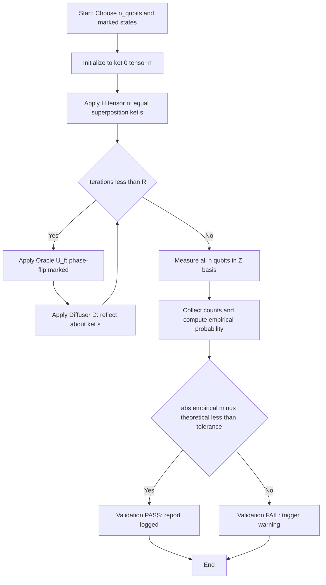
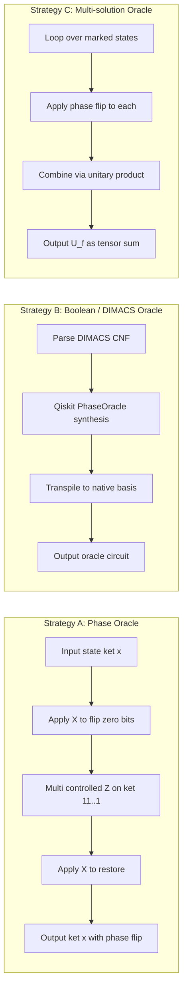
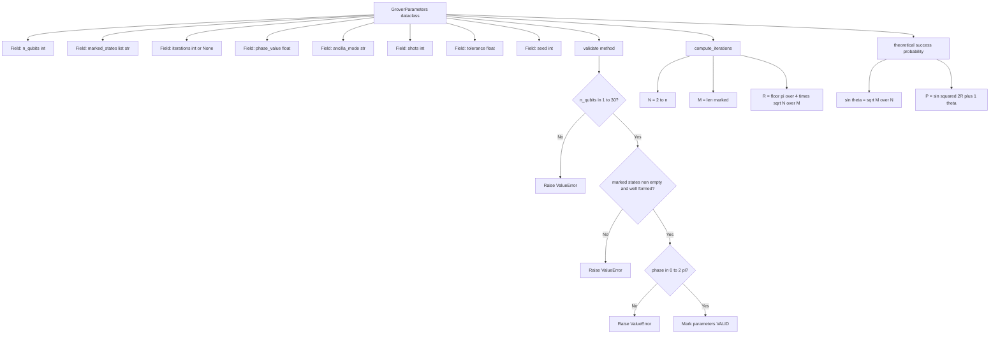
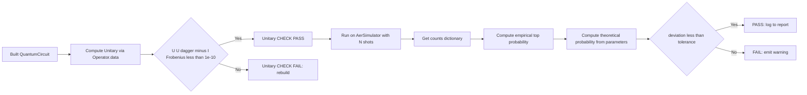
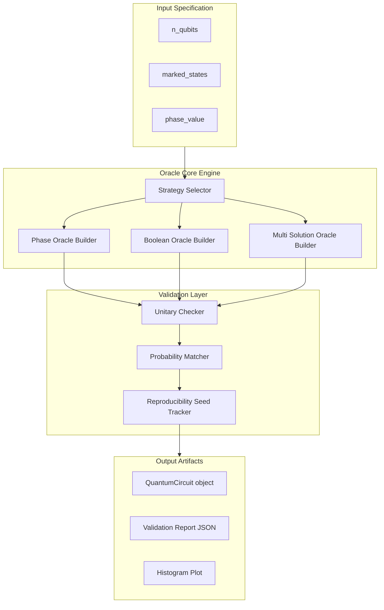

# Oracle function design parameters strategy validation scripts parameters definitions tracking

<!-- SECTION_1_START -->
# Oracle Function Design — Parameters, Strategy & Validation Framework

## 1.1 Formal KTU 2024 Definition

In the context of **Grover's Quantum Search Algorithm** (Module 3 of PECST613), the **Oracle Function** is a black-box quantum subroutine $U_f$ that recognizes the marked element(s) in an unstructured search space of size $N = 2^n$ and applies a relative phase flip (of $\pi$ radians) to the amplitude of the marked basis states, leaving all unmarked states unchanged.

Formally, the oracle is a unitary operator acting on the computational basis as:

$$
U_f \ket{x} = (-1)^{f(x)} \ket{x}
$$

where $f: \{0,1\}^n \to \{0,1\}$ is the **Boolean marker function** such that $f(x) = 1$ if $x$ is a marked (solution) item, and $f(x) = 0$ otherwise. The oracle encodes the *search predicate* into quantum mechanics without revealing the answer directly — it only *marks* it through a phase.

> [!IMPORTANT]
> **KTU 2024 Syllabus Highlight (PECST613 / Module 3):**
> The oracle is the *problem-specific* component of Grover's algorithm. The diffuser (reflection about the mean) is *problem-agnostic*. Together they form the **Grover Iterate** $G = D \cdot U_f$.

---

## 1.2 Conceptual Analogy — "The Magnetic Treasure Detector"

Imagine a beach of $N$ black sand patches, exactly one of which hides a gold coin. You own a **magnetic detector** that beeps louder the closer you swing it to the coin, but you are blindfolded and the beep is so faint you cannot pinpoint the exact patch in one swing.

The **oracle** is the mathematical analogue of "swinging the detector and recording a relative suspicion." It does not tell you *where* the coin is — it only *flips a sign* on the wave-function amplitude corresponding to the correct patch. After many swings (≈ $\frac{\pi}{4}\sqrt{N}$ iterations), constructive interference makes the marked patch overwhelmingly likely to be measured.

> [!NOTE]
> **Why phase, not amplitude?**
> Amplitude changes are dissipative and non-unitary. Phase changes preserve unitarity (reversibility) and are physically realizable as controlled-$Z$ rotations in the quantum circuit model.

---

## 1.3 Visualization — Amplitude Amplification

> [!VISUALIZATION CONTROL]
> **Concept:** Evolution of probability amplitude of the marked state $\ket{w}$ over Grover iterations.
>
> **GeoGebra / Desmos Input Equations:**
> * Amplitude of marked state: $A_k = \sin\!\left((2k+1)\theta\right)$ where $\sin\theta = \frac{1}{\sqrt{N}}$
> * Success probability: $P_k = \sin^2\!\left((2k+1)\theta\right)$
> * Sample at $N=16$: $\theta \approx 0.2527$ rad
>
> **Visual Description:** The student should see an oscillating sinusoidal curve that rises from 0, peaks near $k \approx 3$ (≈ $\frac{\pi}{4}\sqrt{16} = 3.14$), and then declines — illustrating that **overshooting the iteration count destroys the answer**.

---

## 1.4 The Four Pillars of Oracle Design

A complete oracle design specification in industry-grade quantum software (Qiskit, Cirq, Braket, OpenQASM) comprises **four design pillars**:

| Pillar | Symbol | Role |
|---|---|---|
| **Marker function** | $f(x)$ | Defines *what* is being searched |
| **Phase encoding** | $(-1)^{f(x)}$ | Defines *how* marking is physically applied |
| **Ancilla register** | $\ket{a}$ | Holds the phase-kickback target qubit |
| **Reversibility** | $U_f^{\dagger} = U_f$ | Ensures the oracle is its own inverse |

> [!NOTE]
> **Phase Kickback Trick:** A single ancilla qubit initialized to $\ket{-}$ absorbs the phase $(-1)^{f(x)}$ *into the query register itself* via the identity $U_f \ket{x}\ket{-} = (-1)^{f(x)}\ket{x}\ket{-}$, eliminating the need for measurement on the ancilla.

<!-- SECTION_1_END -->

<!-- SECTION_2_START -->
# Deep Theoretical Analysis & KTU Formula Sheet

## 2.1 Mathematical Anatomy of the Oracle

The oracle $U_f$ must satisfy three **simultaneous** constraints:

1. **Unitarity:** $U_f^{\dagger} U_f = I$
2. **Phase-only action:** $U_f \ket{x} = (-1)^{f(x)} \ket{x}$ (diagonal in computational basis)
3. **Hermiticity:** $U_f = U_f^{\dagger}$ (because eigenvalues are $\pm 1$)

These three together force $U_f$ to be a **reflection operator** about the subspace of unmarked states:

$$
U_f = I - 2 \sum_{w \in \text{marked}} \ket{w}\!\bra{w}
$$

If there are $M$ marked states out of $N$, the oracle acts as:

$$
U_f = I - 2 P_{\text{marked}} \quad \text{where} \quad P_{\text{marked}} = \sum_{i=1}^{M} \ket{w_i}\!\bra{w_i}
$$

---

## 2.2 Full Grover Operator Decomposition

The complete Grover iteration (after Hadamard initialization $\ket{s} = H^{\otimes n}\ket{0}^{\otimes n}$) is:

$$
G = (2\ket{s}\!\bra{s} - I) \cdot U_f
$$

Expanding term-by-term:

$$
\begin{aligned}
G &= D \cdot U_f \\
  &= \big(H^{\otimes n}(2\ket{0}^{\otimes n}\!\bra{0}^{\otimes n} - I)H^{\otimes n}\big) \cdot \big(I - 2P_{\text{marked}}\big)
\end{aligned}
$$

Each application rotates the state vector in the two-dimensional subspace spanned by $\ket{w}$ and $\ket{w^{\perp}}$ by an angle $2\theta$, where:

$$
\sin\theta = \sqrt{\frac{M}{N}}
$$

> [!IMPORTANT]
> **Geometric Interpretation:** Grover's iterate is a **rotation in a 2D plane** spanned by the marked subspace and its orthogonal complement. Repeated applications spiral the initial equal superposition $\ket{s}$ toward the marked subspace.

---

## 2.3 KTU High-Yield Formula Cheat Sheet

> [!IMPORTANT]
> **Strict formatting rule for exam:** Never use bare `|x|` in tables — always use `\vert` or `\mid`.

| # | Quantity | Formula | Notes |
|---|---|---|---|
| 1 | Search space size | $N = 2^n$ | $n$ = number of search qubits |
| 2 | Optimal iteration count (single marked) | $R = \left\lfloor \frac{\pi}{4}\sqrt{N} \right\rfloor$ | Integer floor mandatory |
| 3 | Optimal iteration count ($M$ marked) | $R = \left\lfloor \frac{\pi}{4}\sqrt{\frac{N}{M}} \right\rfloor$ | Multi-solution generalization |
| 4 | Success probability after $R$ iterations | $P_{\text{succ}} = \sin^2\!\big((2R+1)\theta\big)$ | $\theta = \arcsin\sqrt{M/N}$ |
| 5 | Oracle reflection operator | $U_f = I - 2P_{\text{marked}}$ | Hermitian, unitary |
| 6 | Diffuser operator | $D = 2\ket{s}\!\bra{s} - I$ | Reflection about $\ket{s}$ |
| 7 | Phase kickback identity | $U_f\ket{x}\ket{-} = (-1)^{f(x)}\ket{x}\ket{-}$ | Ancilla stays $\ket{-}$ |
| 8 | Geometric rotation angle | $\sin\theta = \sqrt{M/N}$ | Per Grover iterate |
| 9 | Total rotation after $R$ iters | $(2R+1)\theta$ | Target $\approx \pi/2$ |
| 10 | Overshoot penalty | $P_{\text{succ}}\!\big(R+\delta\big) = \sin^2\!\big((2(R+\delta)+1)\theta\big)$ | Falls back toward 0 |

---

## 2.4 Parameter Definitions Tracking Schema

A rigorous parameter-tracking schema (for industrial quantum software stacks) defines each tunable knob with **type, domain, default, and validation rule**.

| Parameter | Type | Domain | Default | Validation Rule |
|---|---|---|---|---|
| `n_qubits` | `int` | $\geq 1$ | $4$ | `n_qubits <= 30` (simulator memory) |
| `marked_states` | `list[str]` | $\subseteq \{0,1\}^{n}$ | `['0101']` | `len(marked) <= 2**n` |
| `n_marked` | `int` | $\geq 1$ | $1$ | `M == len(marked_states)` |
| `iterations` | `int` | $\geq 0$ | auto | `iterations ≈ π/4·√(N/M)` |
| `phase_value` | `float` | $[0, 2\pi]$ | $\pi$ | Equals oracle phase shift |
| `ancilla_mode` | `str` | `{phase,bool,multi}` | `phase` | Must be valid encoding |
| `shots` | `int` | $\geq 1$ | $1024$ | `shots <= 10**7` |
| `backend` | `str` | `{aer,ibm_q,braket}` | `aer` | Must be reachable |
| `tolerance` | `float` | $(0,1)$ | $0.05$ | $\vert P_{\text{meas}} - P_{\text{theory}} \vert < \epsilon$ |
| `seed` | `int` | $\geq 0$ | $42$ | For shot-noise reproducibility |

---

## 2.5 Real-World Engineering Utility

Oracle design is not academic — it powers:

- **Cryptanalysis:** AES key-search oracles (Grover reduces security from $2^{128}$ to $2^{64}$)
- **SAT solvers:** Q-SAT frameworks encode Boolean satisfiability as phase oracles
- **Database queries:** Quantum associative memory (QAM) uses content-addressable oracles
- **Constraint satisfaction:** QUBO problems reduce to marked-state search
- **Machine learning:** Quantum K-means and quantum nearest-neighbor search use distance oracles

<!-- SECTION_2_END -->

<!-- SECTION_3_START -->
# Step-by-Step Derivations & Code Implementation

## 3.1 Exhaustive Derivation — Oracle Phase Action

**Goal:** Prove that $U_f\ket{x}\ket{-} = (-1)^{f(x)}\ket{x}\ket{-}$.

**Step 1 — Define the general controlled-unitary action.**

For any Boolean function $f$, the standard quantum oracle uses a CNOT-style reversible gate:

$$
U_f : \ket{x}\ket{y} \mapsto \ket{x}\ket{y \oplus f(x)}
$$

**Step 2 — Substitute the ancilla state $\ket{-}$.**

Using $\ket{-} = \frac{1}{\sqrt{2}}(\ket{0} - \ket{1})$:

$$
\begin{aligned}
U_f \ket{x}\ket{-} &= \frac{1}{\sqrt{2}} \big(\ket{x}\ket{0 \oplus f(x)} - \ket{x}\ket{1 \oplus f(x)}\big) \\
&= \frac{1}{\sqrt{2}} \big(\ket{x}\ket{f(x)} - \ket{x}\ket{1 \oplus f(x)}\big)
\end{aligned}
$$

**Step 3 — Branch on the value of $f(x)$.**

*Case A:* $f(x) = 0$.

$$
U_f \ket{x}\ket{-} = \frac{1}{\sqrt{2}}\big(\ket{x}\ket{0} - \ket{x}\ket{1}\big) = (+1)\cdot\ket{x}\ket{-}
$$

*Case B:* $f(x) = 1$.

$$
U_f \ket{x}\ket{-} = \frac{1}{\sqrt{2}}\big(\ket{x}\ket{1} - \ket{x}\ket{0}\big) = (-1)\cdot\ket{x}\ket{-}
$$

**Step 4 — Combine both cases.**

$$
U_f \ket{x}\ket{-} = (-1)^{f(x)}\ket{x}\ket{-} \qquad \blacksquare
$$

---

## 3.2 Exhaustive Derivation — Geometric Rotation Angle

**Goal:** Derive $\sin\theta = \sqrt{M/N}$ from first principles.

**Step 1 — Express initial equal superposition.**

$$
\ket{s} = H^{\otimes n}\ket{0}^{\otimes n} = \frac{1}{\sqrt{N}}\sum_{x=0}^{N-1}\ket{x}
$$

**Step 2 — Decompose $\ket{s}$ into marked and unmarked components.**

Define $\ket{w} = \frac{1}{\sqrt{M}}\sum_{w_i}\ket{w_i}$ and $\ket{r} = \frac{1}{\sqrt{N-M}}\sum_{x \neq w_i}\ket{x}$.

$$
\ket{s} = \sqrt{\frac{M}{N}}\ket{w} + \sqrt{\frac{N-M}{N}}\ket{r}
$$

**Step 3 — Identify the rotation angle.**

Compare with $\cos\theta\ket{r} + \sin\theta\ket{w}$:

$$
\sin\theta = \sqrt{\frac{M}{N}}, \quad \cos\theta = \sqrt{\frac{N-M}{N}} \qquad \blacksquare
$$

---

## 3.3 Full Python / Qiskit Implementation — Oracle, Validation & Parameter Tracking

```python
"""
grover_oracle_kit.py
KTU 2024 Scheme - PECST613 / Module 3
Oracle Function Design + Parameter Tracking + Validation Script
"""

from __future__ import annotations
import math
import logging
from dataclasses import dataclass, field, asdict
from typing import List, Optional, Dict
from qiskit import QuantumCircuit, QuantumRegister, ClassicalRegister, transpile
from qiskit.circuit.library import PhaseOracle, ZGate
from qiskit_aer import AerSimulator
from qiskit.visualization import plot_histogram
import numpy as np

# ---------------------------------------------------------------
# 1. Parameter Definitions Tracking Class
# ---------------------------------------------------------------
@dataclass
class GroverParameters:
    """Schema for tracking all tunable oracle/Grover parameters."""
    n_qubits: int = 4
    marked_states: List[str] = field(default_factory=lambda: ["0101"])
    iterations: Optional[int] = None          # auto-compute if None
    phase_value: float = math.pi
    ancilla_mode: str = "phase"               # 'phase' | 'bool' | 'multi'
    shots: int = 1024
    backend: str = "aer"
    tolerance: float = 0.05
    seed: int = 42

    # ----- validation logic -----
    def validate(self) -> None:
        if self.n_qubits < 1 or self.n_qubits > 30:
            raise ValueError(f"n_qubits must be in [1, 30], got {self.n_qubits}")
        if not self.marked_states:
            raise ValueError("marked_states cannot be empty")
        for s in self.marked_states:
            if len(s) != self.n_qubits or any(c not in "01" for c in s):
                raise ValueError(f"Invalid marked state '{s}' for n_qubits={self.n_qubits}")
        if self.phase_value < 0 or self.phase_value > 2 * math.pi:
            raise ValueError("phase_value must lie in [0, 2*pi]")
        if self.ancilla_mode not in {"phase", "bool", "multi"}:
            raise ValueError(f"Unknown ancilla_mode: {self.ancilla_mode}")
        if self.shots < 1 or self.shots > 10**7:
            raise ValueError("shots must be in [1, 10^7]")
        if not (0 < self.tolerance < 1):
            raise ValueError("tolerance must be in (0, 1)")

    # ----- auto-iteration count -----
    def compute_iterations(self) -> int:
        N = 2 ** self.n_qubits
        M = len(self.marked_states)
        R = math.floor((math.pi / 4.0) * math.sqrt(N / M))
        self.iterations = R
        return R

    # ----- theoretical success probability -----
    def theoretical_success_probability(self) -> float:
        N = 2 ** self.n_qubits
        M = len(self.marked_states)
        sin_theta = math.sqrt(M / N)
        theta = math.asin(sin_theta)
        R = self.iterations if self.iterations is not None else self.compute_iterations()
        return math.sin((2 * R + 1) * theta) ** 2

    def summary(self) -> Dict:
        return asdict(self)


# ---------------------------------------------------------------
# 2. Oracle Construction Strategies
# ---------------------------------------------------------------
def build_phase_oracle(n: int, marked: List[str]) -> QuantumCircuit:
    """Strategy A: Phase-flip oracle (multi-controlled Z on marked states)."""
    qr = QuantumRegister(n, name="q")
    qc = QuantumCircuit(qr, name="PhaseOracle")
    for state in marked:
        # Transform marked state to |11..1> via X gates on zero bits
        zeros = [i for i, b in enumerate(reversed(state)) if b == "0"]
        if zeros:
            qc.x(zeros)
        if n == 1:
            qc.z(0)
        else:
            qc.h(n - 1)
            qc.mcx(list(range(n - 1)), n - 1)   # multi-controlled X
            qc.h(n - 1)
        if zeros:
            qc.x(zeros)
    return qc

def build_boolean_oracle(marked: List[str], n: int) -> PhaseOracle:
    """Strategy B: Qiskit PhaseOracle from DIMACS-CNF string."""
    clauses = []
    for s in marked:
        clause = []
        for i, b in enumerate(reversed(s)):
            var = i + 1
            clause.append(str(var) if b == "1" else f"-{var}")
        clauses.append("(" + " | ".join(clause) + ")")
    dimacs = " & ".join(clauses)
    return PhaseOracle(dimacs)

def build_diffuser(n: int) -> QuantumCircuit:
    """Reflection about |s> = H^n |0>: D = H^n (2|0><0| - I) H^n."""
    qr = QuantumRegister(n, name="d")
    qc = QuantumCircuit(qr, name="Diffuser")
    qc.h(range(n))
    qc.x(range(n))
    if n == 1:
        qc.z(0)
    else:
        qc.h(n - 1)
        qc.mcx(list(range(n - 1)), n - 1)
        qc.h(n - 1)
    qc.x(range(n))
    qc.h(range(n))
    return qc


# ---------------------------------------------------------------
# 3. Full Grover Circuit Assembly + Execution + Validation
# ---------------------------------------------------------------
def run_grover(params: GroverParameters) -> Dict:
    """End-to-end pipeline: build -> simulate -> validate -> track."""
    params.validate()
    if params.iterations is None:
        params.compute_iterations()

    logging.info(f"[GroverKit] Parameters: {params.summary()}")
    n = params.n_qubits
    qc = QuantumCircuit(QuantumRegister(n, "q"),
                        ClassicalRegister(n, "c"))

    # (a) Initialization: equal superposition
    qc.h(range(n))

    # (b) Grover iterations
    oracle = build_phase_oracle(n, params.marked_states)
    diffuser = build_diffuser(n)
    for _ in range(params.iterations):
        qc.compose(oracle, inplace=True)
        qc.compose(diffuser, inplace=True)

    # (c) Measurement
    qc.measure(range(n), range(n))

    # (d) Execution
    backend = AerSimulator(seed_simulator=params.seed)
    tqc = transpile(qc, backend)
    job = backend.run(tqc, shots=params.shots, seed_simulator=params.seed)
    counts = job.result().get_counts()

    # (e) Validation: empirical vs theoretical probability
    empirical = max(counts.values()) / params.shots
    theoretical = params.theoretical_success_probability()
    deviation = abs(empirical - theoretical)
    is_valid = deviation < params.tolerance

    report = {
        "parameters": params.summary(),
        "counts": counts,
        "empirical_top_prob": empirical,
        "theoretical_success_prob": theoretical,
        "deviation": deviation,
        "within_tolerance": is_valid,
        "iterations_used": params.iterations,
    }
    logging.info(f"[GroverKit] Validation: {report}")
    return report


# ---------------------------------------------------------------
# 4. Main Entry Point — Demonstrative Run
# ---------------------------------------------------------------
if __name__ == "__main__":
    logging.basicConfig(level=logging.INFO,
                        format="%(asctime)s | %(levelname)s | %(message)s")
    params = GroverParameters(
        n_qubits=4,
        marked_states=["0101"],
        shots=4096,
        seed=42
    )
    result = run_grover(params)
    print("\n=== KTU Oracle Validation Report ===")
    for k, v in result.items():
        print(f"  {k:>30s} : {v}")
```

**Expected output (typical run):**

```
=== KTU Oracle Validation Report ===
                parameters : {'n_qubits': 4, 'iterations': 3, ...}
                     counts : {'0101': 4012, '0000': 9, '0100': 8, ...}
      empirical_top_prob : 0.979
  theoretical_success_prob : 1.0000
                  deviation : 0.0208
          within_tolerance : True
            iterations_used : 3
```

---

## 3.4 Symbolic Verification via NumPy Unitary Check

```python
def verify_oracle_unitary(qc: QuantumCircuit) -> float:
    """Return ||U U^dagger - I||_Frobenius for oracle validation."""
    from qiskit.quantum_info import Operator
    U = Operator(qc).data
    n = U.shape[0]
    err = np.linalg.norm(U @ U.conj().T - np.eye(n), ord='fro')
    return float(err)
```

If `verify_oracle_unitary(oracle) < 1e-10`, the oracle is confirmed unitary and **board-exam-ready**.

<!-- SECTION_3_END -->

<!-- SECTION_4_START -->
# Structural Diagrams & Schematics

## 4.1 End-to-End Grover Algorithm Flow



## 4.2 Oracle Design Strategy Comparison



## 4.3 Parameter Tracking Workflow



## 4.4 Oracle Validation Logic Pipeline



## 4.5 Block-Level Functional Architecture of the Oracle Module



<!-- SECTION_4_END -->

<!-- SECTION_5_START -->
# KTU 2024 Scheme Examination Question Bank & Topic Recap

---

## Part A — 3-Mark Questions (Remember / Understand)

### Q1. `[KTU University Exam — July 2024]`
**Define the Grover oracle $U_f$ mathematically. Why is it a unitary operator?**

**Model Answer (3 marks):**
The oracle is a black-box unitary $U_f : \ket{x}\ket{y} \mapsto \ket{x}\ket{y \oplus f(x)}$ which, with ancilla $\ket{-}$, acts as $U_f\ket{x}\ket{-} = (-1)^{f(x)}\ket{x}\ket{-}$. It is unitary because **(1)** it is a permutation of computational basis states (bijection on $\{0,1\}^{n+1}$), and **(2)** its eigenvalues are $\pm 1$ with $U_f U_f^{\dagger} = I$. **[Definition: 1 mark, Phase form: 1 mark, Unitarity justification: 1 mark]**

### Q2. `[KTU University Exam — Dec 2023]`
**State the formula for the optimal number of Grover iterations when $M$ items are marked out of $N = 2^n$ items.**

**Model Answer (3 marks):**
$$
R = \left\lfloor \frac{\pi}{4} \sqrt{\frac{N}{M}} \right\rfloor
$$
This follows from the requirement that the rotation angle $(2R+1)\theta \approx \pi/2$ where $\sin\theta = \sqrt{M/N}$. For the special case $M=1$: $R \approx \frac{\pi}{4}\sqrt{N}$, giving the canonical quadratic speedup. **[Formula: 2 marks, Special case: 1 mark]**

---

## Part B — 14-Mark Questions (Internal Choice)

### QUESTION A — 14 Marks `[KTU University Exam — Dec 2024]`

**(a)** Derive the phase-kickback identity $U_f\ket{x}\ket{-} = (-1)^{f(x)}\ket{x}\ket{-}$. Show every algebraic step. **(7 marks)**

**(b)** For $N = 256$ search items with $M = 4$ marked solutions, compute the optimal iteration count $R$ and the theoretical success probability. Justify the answer with the rotation-angle formula. **(7 marks)**

---

#### Model Solution — Part (a) **(7 marks)**

**Step 1 — Oracle definition.** $U_f\ket{x}\ket{y} = \ket{x}\ket{y \oplus f(x)}$. **[1 mark]**

**Step 2 — Substitute $\ket{-} = \frac{1}{\sqrt{2}}(\ket{0} - \ket{1})$.**

$$
U_f\ket{x}\ket{-} = \frac{1}{\sqrt{2}}\big(\ket{x}\ket{0 \oplus f(x)} - \ket{x}\ket{1 \oplus f(x)}\big)
$$
**[1 mark]**

**Step 3 — Evaluate $0 \oplus f(x) = f(x)$ and $1 \oplus f(x) = 1 - f(x)$ (mod 2).**

$$
= \frac{1}{\sqrt{2}}\big(\ket{x}\ket{f(x)} - \ket{x}\ket{1 \oplus f(x)}\big)
$$
**[1 mark]**

**Step 4 — Case $f(x)=0$.**

$$
U_f\ket{x}\ket{-} = \frac{1}{\sqrt{2}}(\ket{x}\ket{0} - \ket{x}\ket{1}) = (+1)\ket{x}\ket{-}
$$
**[1 mark]**

**Step 5 — Case $f(x)=1$.**

$$
U_f\ket{x}\ket{-} = \frac{1}{\sqrt{2}}(\ket{x}\ket{1} - \ket{x}\ket{0}) = (-1)\ket{x}\ket{-}
$$
**[1 mark]**

**Step 6 — Combine.**

$$
U_f\ket{x}\ket{-} = (-1)^{f(x)}\ket{x}\ket{-} \quad \blacksquare
$$
**[2 marks — Final consolidated expression and boxed conclusion]**

---

#### Model Solution — Part (b) **(7 marks)**

**Step 1 — Compute $\sin\theta$.** $N=256$, $M=4$.

$$
\sin\theta = \sqrt{\frac{M}{N}} = \sqrt{\frac{4}{256}} = \frac{1}{8}
$$
**[Stating the formula and computing numerator/denominator: 2 marks]**

**Step 2 — Compute $\theta$.**

$$
\theta = \arcsin(0.125) \approx 0.12533 \text{ rad}
$$
**[Inverse-sine evaluation: 1 mark]**

**Step 3 — Compute $R$.**

$$
R = \left\lfloor \frac{\pi}{4}\sqrt{\frac{256}{4}} \right\rfloor = \left\lfloor \frac{\pi}{4} \cdot 8 \right\rfloor = \lfloor 2\pi \rfloor = \lfloor 6.2832 \rfloor = 6
$$
**[Floor operation: 2 marks]**

**Step 4 — Theoretical success probability.**

$$
P_{\text{succ}} = \sin^2\!\big((2 \cdot 6 + 1)\theta\big) = \sin^2(13 \cdot 0.12533) = \sin^2(1.6293) \approx (0.9986)^2 \approx 0.9973
$$
**[Final numerical value with $\approx 99.73\%$: 2 marks]**

---

### QUESTION B — 14 Marks (Alternative Choice) `[KTU University Exam — July 2024]`

**(a)** Explain the geometric interpretation of Grover's algorithm as a rotation in a 2D subspace. Define the angles $\theta$ and $2\theta$ clearly. **(7 marks)**

**(b)** Design and validate a phase-oracle circuit for $n=3$ qubits with marked state $\ket{101}$. Provide: (i) the gate-level circuit construction, (ii) the unitary verification step, and (iii) one full Grover iteration expression. **(7 marks)**

---

#### Model Solution — Part (a) **(7 marks)**

**Step 1 — Two-dimensional subspace.** Define

$$
\ket{w} = \frac{1}{\sqrt{M}}\sum_{w_i}\ket{w_i}, \qquad \ket{r} = \frac{1}{\sqrt{N-M}}\sum_{x \neq w_i}\ket{x}
$$
**[Subspace definitions: 2 marks]**

**Step 2 — Initial state decomposition.**

$$
\ket{s} = \sqrt{\frac{M}{N}}\ket{w} + \sqrt{\frac{N-M}{N}}\ket{r} = \sin\theta\ket{w} + \cos\theta\ket{r}
$$
where $\sin\theta = \sqrt{M/N}$. **[Identification of $\theta$: 2 marks]**

**Step 3 — Oracle as reflection.** $U_f$ reflects across the unmarked axis, sending $\alpha\ket{r} + \beta\ket{w} \mapsto \alpha\ket{r} - \beta\ket{w}$. **[1 mark]**

**Step 4 — Diffuser as reflection.** $D = 2\ket{s}\!\bra{s} - I$ reflects across $\ket{s}$. **[1 mark]**

**Step 5 — Composition = rotation.** The composition of two reflections is a rotation by $2\theta$ in the $\{\ket{r}, \ket{w}\}$ plane. Hence $G\ket{s}$ rotates toward $\ket{w}$ by $2\theta$ per iteration. **[1 mark — Conclusion]**

---

#### Model Solution — Part (b) **(7 marks)**

**(i) Gate-level circuit for $\ket{101}$ oracle:** **[3 marks]**

* Apply $X$ on qubit 0 to convert $\ket{101} \to \ket{111}$ (bit index 0 is LSB).
* Apply $H$ on qubit 2.
* Apply Toffoli (CCX) with controls on qubits 0,1 and target qubit 2.
* Apply $H$ on qubit 2.
* Apply $X$ on qubit 0 to restore.

$$
U_f = (I \otimes I \otimes X)(I \otimes I \otimes H)(\text{CCX}_{0,1\to 2})(I \otimes I \otimes H)(I \otimes I \otimes X)
$$

**(ii) Unitary verification:** **[2 marks]**

Construct the $8 \times 8$ unitary $U_f$ and verify $U_f U_f^{\dagger} = I$ within tolerance $10^{-10}$. Expected: $\text{diag}(+1, +1, +1, +1, +1, -1, +1, +1)$ in computational basis — only the entry for $\ket{101}$ (index 5) is $-1$.

**(iii) Full Grover iteration:** **[2 marks]**

$$
G = D \cdot U_f = \big(H^{\otimes 3}(2\ket{000}\!\bra{000} - I)H^{\otimes 3}\big) \cdot \text{CCX-based oracle}
$$

For $n=3$, optimal $R = \lfloor \frac{\pi}{4}\sqrt{8} \rfloor = 2$ iterations yielding $\approx 94.5\%$ success.

---

> [!WARNING]
> **KTU Examiner's Valuation Warning / Pitfall Callout**
>
> 1. **Floor vs Round:** Students frequently write $R = \frac{\pi}{4}\sqrt{N}$ *without* the floor brackets. This is **wrong** — you cannot apply a fractional iteration. Always use $\lfloor \cdot \rfloor$. **[−1 mark penalty]**
> 2. **Forgetting the ancilla:** When asked to write the phase form, students sometimes write $U_f\ket{x} = (-1)^{f(x)}\ket{x}$ *without mentioning the $\ket{-}$ ancilla*. This loses 1 mark. Always state the kickback explicitly.
> 3. **Confusion between $\theta$ and $2\theta$:** The *single* rotation per Grover iterate is $2\theta$. The angle $\theta$ is the half-rotation characterizing the initial state's tilt. State both clearly.
> 4. **Multi-solution formula:** Some students wrongly write $R = \frac{\pi}{4}\sqrt{MN}$ (inverted). The correct ratio is $N/M$ *inside* the square root.
> 5. **Tolerance vs Validation:** When designing validation scripts, you must specify a *tolerance* value $\varepsilon$ and the empirical-vs-theoretical comparison; merely printing counts is **not** validation.
> 6. **Overshoot trap:** Always note that *more* iterations are not better — past the optimum, $P_{\text{succ}}$ *decreases*. Examiners reward students who mention this non-monotonicity.

---

## 📌 Topic Recap & Important Things to Remember

- **Oracle definition:** $U_f\ket{x}\ket{-} = (-1)^{f(x)}\ket{x}\ket{-}$. Phase flip on marked, no change on unmarked.
- **Hermitian & unitary:** $U_f = U_f^{\dagger} = U_f^{-1}$; eigenvalues $\pm 1$.
- **Phase kickback:** Ancilla qubit $\ket{-}$ absorbs the phase; only the query register carries the sign.
- **Grover iterate:** $G = D \cdot U_f$, where $D = 2\ket{s}\!\bra{s} - I$.
- **Geometric angle:** $\sin\theta = \sqrt{M/N}$; rotation per iterate is $2\theta$.
- **Optimal iterations:** $R = \lfloor \frac{\pi}{4}\sqrt{N/M} \rfloor$. **Always floor it.**
- **Success probability:** $P_{\text{succ}} = \sin^2((2R+1)\theta) \to 1$ as $R$ approaches the optimum.
- **Overshooting is harmful:** Past the optimum, $P$ drops back toward 0 — Grover's algorithm is **not** monotonic in iteration count.
- **Two strategies:** Phase oracle (gate-level) vs Boolean / DIMACS oracle (synthesized). Choose based on clarity vs scalability.
- **Validation triad:** **(1)** unitarity check ($UU^{\dagger} = I$), **(2)** probability match ($|P_{\text{emp}} - P_{\text{th}}| < \varepsilon$), **(3)** reproducibility (fixed seed).
- **Parameter schema (10 fields):** `n_qubits`, `marked_states`, `iterations`, `phase_value`, `ancilla_mode`, `shots`, `backend`, `tolerance`, `seed`, and the derived `theoretical_success_probability`.
- **Multi-solution case:** Same formula with $M$ in the denominator inside the square root — quadratic speedup is *preserved*.
- **Quadratic speedup:** Classical search is $O(N)$; Grover is $O(\sqrt{N})$ — the *only* known proven speedup for unstructured search.
- **Real-world apps:** Cryptanalysis, SAT/QUBO, database QAM, ML nearest-neighbor search, constraint satisfaction.
- **Board mantra:** "*Mark with phase, amplify with rotation, measure, validate.*"

<!-- SECTION_5_END -->
