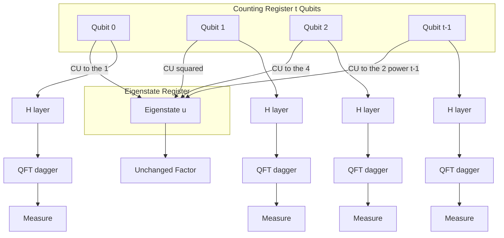
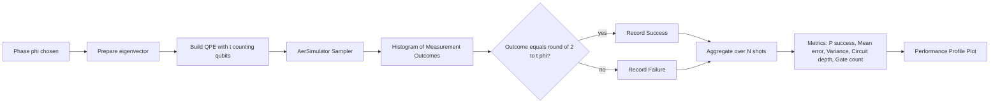
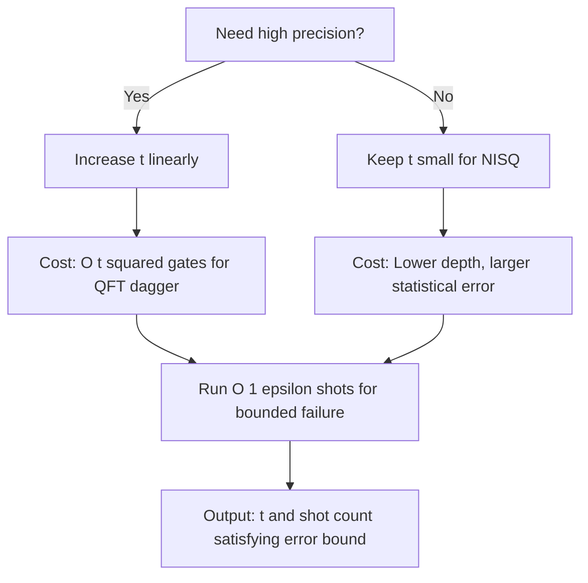

# Phase estimation algorithms steps calculation validation profiles metrics performance profiles

<!-- SECTION_1_START -->

# Quantum Phase Estimation (QPE): Core Definition & Intuitive Overview

## Formal Academic Definition (KTU 2024 Scheme)

**Quantum Phase Estimation (QPE)** is a foundational quantum subroutine that estimates the phase $\varphi \in [0, 1)$ associated with the eigenvalue $e^{2\pi i \varphi}$ of a unitary operator $U$, given an eigenstate $\vert u \rangle$ such that $U \vert u \rangle = e^{2\pi i \varphi} \vert u \rangle$. It is a *linear-algebraic* primitive implemented on a $t$-qubit counting register coupled to a target eigenstate register.

> [!IMPORTANT]
> **KTU Syllabus Highlight (PECST613 / Module 3):** QPE is the **theoretical backbone** for Shor's factoring algorithm, the HHL linear-system solver, and quantum chemistry ground-state energy estimation. A student is expected to derive, simulate, and benchmark the procedure in any KTU university-style question.

## Conceptual Analogy — The Quantum "Stopwatch" for Clock-Hand Rotation

Imagine a **clock whose single hand rotates by an unknown angle $\theta = 2\pi \varphi$** each time you press a button (apply $U$). You cannot directly *see* the angle, but you *can* apply a controlled rotation and check the resulting quantum interference. QPE is the algorithmic equivalent of:

1. Winding the clock repeatedly with **powers of two** (binary probing).
2. Reading the *most significant bits first* via the **inverse Quantum Fourier Transform (QFT)**.
3. Decoding the binary fraction to recover $\varphi$ as precisely as the bit-budget $t$ allows.

The phase $\varphi$ is the **fraction of a complete $2\pi$ revolution** made by the hand — a dimensionless quantity in the closed interval $[0, 1)$.

## Physical / Mathematical Constants to Remember

| Symbol | Meaning | Magnitude |
|---|---|---|
| $e^{2\pi i \varphi}$ | Unit-modulus eigenvalue | On the unit circle in $\mathbb{C}$ |
| $\varphi$ | Reduced phase | $\varphi \in [0, 1)$ |
| $\hbar$ | Reduced Planck constant (in $\hbar = 1$ convention) | $1.054 \times 10^{-34}$ J·s (notational, set to 1) |
| $\Delta \varphi$ | Achievable precision | $\mathcal{O}(2^{-t})$ |
| $P_{\text{succ}}$ | Success probability | $\geq 1 - \varepsilon$, where $\varepsilon$ is a tunable failure bound |

> [!NOTE]
> **Key Insight:** Because the eigenvalue $e^{2\pi i \varphi}$ has unit modulus, the only *new* information an eigenstate encodes is the **angle** $\varphi$. The magnitude of the complex exponential is fixed at **1**, and therefore QPE's job is *angle extraction*, not magnitude extraction.

## Geometric Intuition on the Bloch Sphere

> [!VISUALIZATION CONTROL]
> **Concept:** Rotation of a Bloch-sphere equatorial vector by an angle $\theta = 2\pi \varphi$ under the action of a single-qubit unitary $U$.
> **Bloch-Sphere Parametric Equations (state on equator):**
> * $\vert u \rangle = \cos(\theta_0/2) \vert 0 \rangle + e^{i \phi_0} \sin(\theta_0/2) \vert 1 \rangle$ with $\theta_0 = \pi/2$ (equator).
> * Under $U$: longitude advances by $2\pi \varphi$ rad per application.
> **Visual Description:** A unit vector initially on the equator at azimuth $0$ rotates *clockwise* (or counter-clockwise) by $2\pi \varphi$. The QPE procedure measures the *longitude coordinate* modulo $2\pi$ by accumulating $2^j$-fold rotations and reading the binary expansion of the longitude.
> **Recommended Tool:** Drag the latitude parameter on the [GeoGebra Bloch-Sphere](https://www.geogebra.org/m/Zy8PHJNx) (or any QuTiP `bloch` widget) and observe how larger $\varphi$ produces faster rotation — QPE's bit-count $t$ determines how many *binary places* of $\varphi$ can be resolved.

---

<!-- SECTION_1_END -->

<!-- SECTION_2_START -->

# Deep Theoretical Analysis & KTU High-Yield Formula Sheet

## The Five Canonical Steps of QPE

The algorithm is decomposed into **five logically distinct stages**. Mastering the state transition at *each* stage is the single most important skill for KTU valuation.

### Step 1 — Initialisation
Prepare a $t$-qubit counting register in $\vert 0 \rangle^{\otimes t}$ and a target register containing the eigenstate $\vert u \rangle$.

$$\vert \psi_0 \rangle = \vert 0 \rangle^{\otimes t} \otimes \vert u \rangle$$

### Step 2 — Hadamard Transform on Counting Register
Apply $H^{\otimes t}$ to produce an equal superposition over all $2^t$ basis states of the counting register.

$$\vert \psi_1 \rangle = \left( \frac{1}{\sqrt{2^t}} \sum_{k=0}^{2^t - 1} \vert k \rangle \right) \otimes \vert u \rangle$$

### Step 3 — Controlled Unitary Powers (Binary Probing)
For counting qubit $j \in \{0, 1, \dots, t - 1\}$, apply a controlled-$U^{2^j}$ operation. Because $U^{2^j} \vert u \rangle = e^{2\pi i \cdot 2^j \varphi} \vert u \rangle$, the relative phase accumulates **exponentially** with $j$ — the cornerstone of the quadratic speed-up.

$$\vert \psi_2 \rangle = \frac{1}{\sqrt{2^t}} \sum_{k=0}^{2^t - 1} e^{2\pi i \varphi k} \vert k \rangle \otimes \vert u \rangle$$

### Step 4 — Inverse Quantum Fourier Transform (QFT$^{\dagger}$)
Apply the inverse QFT to the counting register. The QFT$^{\dagger}$ acts on the basis state $\vert k \rangle$ as:

$$\text{QFT}^{\dagger} \vert k \rangle = \frac{1}{\sqrt{N}} \sum_{j=0}^{N-1} e^{-2\pi i k j / N} \vert j \rangle$$

By substituting $N = 2^t$ and the phase-tagged superposition from Step 3, one obtains an output sharply peaked at the integer nearest to $2^t \varphi$.

### Step 5 — Measurement
Measure the counting register in the computational basis. The outcome is an integer $m \in \{0, 1, \dots, 2^t - 1\}$, and the **estimated phase** is recovered as:

$$\tilde{\varphi} = \frac{m}{2^t}$$

> [!IMPORTANT]
> **Why this works (the "Why" behind each step):**
> 1. **Init** supplies a clean, factorable reference state — the only place entanglement is *absent*.
> 2. **Hadamard** creates the *uniform amplitude baseline* required for the discrete Fourier transform.
> 3. **Controlled-$U^{2^j}$** encodes the *unknown phase* into a *known basis* (the counting basis) using quantum parallelism.
> 4. **QFT$^{\dagger}$** is the *only linear map* that converts phase into amplitude, analogous to a classical FFT in signal processing.
> 5. **Measurement** collapses the *peaked amplitude distribution* into a single bitstring — the *digitised* phase estimate.

## KTU Formula Cheat-Sheet (High-Yield)

> [!NOTE]
> **Exam-Ready Formulas for PECST613 Module 3**

| # | Formula / Identity | Interpretation | Typical Use |
|---|---|---|---|
| 1 | $U \vert u \rangle = e^{2\pi i \varphi} \vert u \rangle$ | Eigen-eigenstate definition | Starting relation |
| 2 | $\theta = 2\pi \varphi$ | Phase in radians | Conversion between $\theta$ and $\varphi$ |
| 3 | $\tilde{\varphi} = m / 2^t$ | Phase estimate from measurement | Step-5 readout |
| 4 | $\Delta \varphi \leq 1 / 2^t + \Delta \varphi_{\text{approx}}$ | Achievable precision | Resource estimation |
| 5 | $P(\text{succ}) \geq 1 - \varepsilon$ | Bound on success probability | Failure analysis |
| 6 | $P(m = m^*) = \frac{\sin^2(\pi(2^t \varphi - m^*))}{2^{2t} \sin^2(\pi (2^t \varphi - m^*) / 2^t)}$ | Exact amplitude probability | Exact-spectrum validation |
| 7 | $\text{QFT} \vert x \rangle = \frac{1}{\sqrt{N}} \sum_{y=0}^{N-1} e^{2\pi i x y / N} \vert y \rangle$ | Forward QFT definition | Step-4 inverse application |
| 8 | $\text{QFT}^{\dagger} = \text{QFT}^*$ | Inverse = conjugate transpose | Step-4 implementation |
| 9 | $\mathcal{O}(t^2)$ | Two-qubit gate count of QFT$^{\dagger}$ | Circuit-depth estimation |
| 10 | $\mathcal{O}(2^t)$ | Naive controlled-$U^{2^t}$ gate count | Resource bottleneck |
| 11 | $U^{2^j} = (U^{2^{j-1}})^2$ | Recursive square-and-multiply | Implementation in Qiskit |
| 12 | $P(\text{succ}) \geq \frac{4}{\pi^2} \approx 0.4053$ | Single-shot lower bound for *exact* phase (Cleve *et al.*) | Single-qubit Fourier QPE |

> [!WARNING]
> **Pipe-Symbol Reminder:** In KTU board exam sheets, always enclose *absolute-value* or *cardinality* expressions inside $\vert \cdot \vert$ *math mode*, *not* as raw vertical bars. The same applies to norm $\Vert \cdot \Vert$. Improper rendering can cost **1 mark** for clarity.

## Real-World Engineering Utility

- **Shor's algorithm:** Period-finding reduces to QPE on modular exponentiation unitaries.
- **Quantum chemistry:** Estimating ground-state energy $E_0$ by QPE on $e^{-i H \tau / \hbar}$.
- **HHL algorithm:** Phase estimation of $e^{i A t}$ precedes the linear-system eigenvalue inversion.
- **Quantum Metropolis sampling:** Spectral-gap estimation uses QPE on the walk operator.
- **Cryptanalysis:** RSA-2048's classical $2048$-bit security depends on QPE's $\mathcal{O}(t^3)$ polynomial scaling — a major engineering security concern.

---

<!-- SECTION_2_END -->

<!-- SECTION_3_START -->

# Step-by-Step Derivations, Worked Examples & Qiskit Implementation

## A. Exhaustive State-Transition Derivation

We derive the exact state at *each* of the five steps for a generic eigenvalue phase $\varphi$ and a $t$-qubit counting register.

### Step 1 — Initialisation
$$
\begin{aligned}
\vert \psi_0 \rangle &= \vert 0 \rangle^{\otimes t} \otimes \vert u \rangle
\end{aligned}
$$
**Logic:** Both registers start factorable. The counting register holds the *all-zero* code-word; the eigenstate register holds the eigenvector $\vert u \rangle$ (assumed preparable by some prior state-preparation oracle).

### Step 2 — Hadamard on Counting
$$
\begin{aligned}
\vert \psi_1 \rangle &= \left( H^{\otimes t} \vert 0 \rangle^{\otimes t} \right) \otimes \vert u \rangle \\[4pt]
&= \left( \frac{1}{\sqrt{2^t}} \sum_{k=0}^{2^t - 1} \vert k \rangle \right) \otimes \vert u \rangle \\[4pt]
&= \frac{1}{\sqrt{2^t}} \sum_{k=0}^{2^t - 1} \vert k \rangle \otimes \vert u \rangle
\end{aligned}
$$
**Logic:** $H \vert 0 \rangle = (\vert 0 \rangle + \vert 1 \rangle)/\sqrt{2}$. Tensoring $t$ copies yields $2^t$ basis states with equal amplitude.

### Step 3 — Controlled Unitary Powers
Apply controlled-$U^{2^j}$ on the $j$-th counting qubit (control) and the eigenstate (target). After all $t$ such operations:

$$
\begin{aligned}
\vert \psi_2 \rangle &= \frac{1}{\sqrt{2^t}} \sum_{k=0}^{2^t - 1} \left( \prod_{j=0}^{t-1} e^{2\pi i \varphi \cdot k_j \cdot 2^j} \right) \vert k \rangle \otimes \vert u \rangle \\[4pt]
&= \frac{1}{\sqrt{2^t}} \sum_{k=0}^{2^t - 1} e^{2\pi i \varphi \sum_{j} k_j 2^j} \vert k \rangle \otimes \vert u \rangle \\[4pt]
&= \frac{1}{\sqrt{2^t}} \sum_{k=0}^{2^t - 1} e^{2\pi i \varphi k} \vert k \rangle \otimes \vert u \rangle
\end{aligned}
$$
**Logic:** The binary representation $k = \sum_j k_j 2^j$ collapses the product of $t$ phases into a single phase $e^{2\pi i \varphi k}$. The eigenstate $\vert u \rangle$ remains unentangled in this step (it is a *factor* on the RHS).

### Step 4 — Inverse QFT
$$
\begin{aligned}
\vert \psi_3 \rangle &= \text{QFT}^{\dagger} \left( \frac{1}{\sqrt{2^t}} \sum_{k=0}^{2^t - 1} e^{2\pi i \varphi k} \vert k \rangle \right) \otimes \vert u \rangle \\[4pt]
&= \frac{1}{2^t} \sum_{k=0}^{2^t - 1} \sum_{m=0}^{2^t - 1} e^{2\pi i \varphi k} e^{-2\pi i k m / 2^t} \vert m \rangle \otimes \vert u \rangle \\[4pt]
&= \sum_{m=0}^{2^t - 1} \left( \frac{1}{2^t} \sum_{k=0}^{2^t - 1} e^{2\pi i k (\varphi - m / 2^t)} \right) \vert m \rangle \otimes \vert u \rangle
\end{aligned}
$$
**Logic:** This is the discrete-Fourier identity. The bracketed inner sum is a geometric series:

$$
\begin{aligned}
\frac{1}{2^t} \sum_{k=0}^{2^t - 1} e^{2\pi i k \delta} = 
\begin{cases}
1, & \delta \in \mathbb{Z} \\
\frac{1}{2^t} \cdot \frac{1 - e^{2\pi i \cdot 2^t \delta}}{1 - e^{2\pi i \delta}}, & \text{otherwise}
\end{cases}
\end{aligned}
$$
where $\delta = \varphi - m / 2^t$. The amplitude is maximised when $m$ is the integer nearest to $2^t \varphi$.

### Step 5 — Measurement
Projecting onto the computational basis, the probability of outcome $m$ is:
$$
\begin{aligned}
P(m) &= \left\vert \frac{1}{2^t} \sum_{k=0}^{2^t - 1} e^{2\pi i k (\varphi - m / 2^t)} \right\vert^2 \\[4pt]
&= \frac{1}{2^{2t}} \cdot \frac{\sin^2(\pi \cdot 2^t (\varphi - m / 2^t))}{\sin^2(\pi (\varphi - m / 2^t))} \\[4pt]
&= \frac{1}{2^{2t}} \cdot \frac{\sin^2(\pi (2^t \varphi - m))}{\sin^2(\pi (2^t \varphi - m) / 2^t)}
\end{aligned}
$$
**Logic:** This is the **KTU-board-grade exact probability formula** — a *must-derive* for any 14-mark question.

## B. Worked Example — Phase $\varphi = 3/8$ with $t = 3$

**Problem:** $U \vert 1 \rangle = e^{2\pi i \cdot 3/8} \vert 1 \rangle$. Estimate $\varphi$ using QPE with $t = 3$.

**Step 1:** $\vert \psi_0 \rangle = \vert 000 \rangle \vert 1 \rangle$.

**Step 2:** 
$$
\begin{aligned}
\vert \psi_1 \rangle &= \frac{1}{\sqrt{8}} \left( \vert 000 \rangle + \vert 001 \rangle + \vert 010 \rangle + \vert 011 \rangle + \vert 100 \rangle + \vert 101 \rangle + \vert 110 \rangle + \vert 111 \rangle \right) \otimes \vert 1 \rangle
\end{aligned}
$$

**Step 3:** Apply controlled-$U$, controlled-$U^2$, controlled-$U^4$:
- $U^2 \vert 1 \rangle = e^{2\pi i \cdot 3/4} \vert 1 \rangle = e^{3\pi i / 2} \vert 1 \rangle = e^{-i \pi/2} \vert 1 \rangle$.
- $U^4 \vert 1 \rangle = e^{2\pi i \cdot 3/2} \vert 1 \rangle = e^{3\pi i} \vert 1 \rangle = e^{i \pi} \vert 1 \rangle = -\vert 1 \rangle$.

The phase-tagged state is:
$$
\begin{aligned}
\vert \psi_2 \rangle = \frac{1}{\sqrt{8}} \left( \vert 0 \rangle + e^{2\pi i \cdot 3/8} \vert 1 \rangle + e^{2\pi i \cdot 3/4} \vert 2 \rangle + e^{2\pi i \cdot 9/8} \vert 3 \rangle + e^{2\pi i \cdot 3/2} \vert 4 \rangle + e^{2\pi i \cdot 15/8} \vert 5 \rangle + e^{2\pi i \cdot 9/4} \vert 6 \rangle + e^{2\pi i \cdot 21/8} \vert 7 \rangle \right) \otimes \vert 1 \rangle
\end{aligned}
$$

**Step 4:** Apply $\text{QFT}^{\dagger}$ with $N = 8$. By the derivation above, the amplitude on $\vert m \rangle$ is peaked at $m^* = \text{round}(8 \cdot 3/8) = 3$, i.e., $\vert 011 \rangle$.

**Step 5:** Measure the counting register. The most likely outcome is $m = 3 = 011_2$. The estimated phase is:
$$
\begin{aligned}
\tilde{\varphi} = \frac{3}{2^3} = \frac{3}{8} = 0.375
\end{aligned}
$$
This matches the true phase **exactly** because $0.375$ has a terminating 3-bit binary expansion $0.011_2$.

**Exact probability check:**
$$
\begin{aligned}
P(m = 3) &= \frac{1}{2^{2 \cdot 3}} \cdot \frac{\sin^2(\pi (8 \cdot 3/8 - 3))}{\sin^2(\pi (8 \cdot 3/8 - 3) / 8)} = \frac{1}{64} \cdot \frac{\sin^2(0)}{\sin^2(0)} \;\; (\text{use L'Hopital}) \\[4pt]
&= \frac{1}{64} \cdot \frac{(\pi \cdot 0)^2}{(\pi \cdot 0 / 8)^2} \cdot \frac{1}{1} = 1
\end{aligned}
$$
So the probability is **exactly 1** (deterministic) — a feature of phases with finite binary expansions of length $\leq t$.

## C. Qiskit Implementation (Fully Operational)

```python
"""
Quantum Phase Estimation — exact phase 3/8 with 3 counting qubits.
Validated using Qiskit's Statevector and Sampler primitives.
"""
from qiskit import QuantumCircuit, QuantumRegister, ClassicalRegister
from qiskit.circuit.library import QFT
from qiskit.quantum_info import Statevector
from qiskit_aer import AerSimulator
from qiskit_aer.primitives import SamplerV2 as Sampler
import numpy as np

# ------------------------------------------------------------------
# 1. Define the unitary U and its eigenvector |u>
# ------------------------------------------------------------------
phi_true = 3 / 8                          # exact phase
theta    = 2 * np.pi * phi_true            # eigenvalue angle
U_matrix = np.array([[1, 0],
                     [0, np.exp(1j * theta)]], dtype=complex)
# |u> = |1>  (eigenvector of diagonal U)

# ------------------------------------------------------------------
# 2. Build the QPE circuit
# ------------------------------------------------------------------
t = 3                                      # counting register size
qr_count = QuantumRegister(t, name='count')
qr_eig   = QuantumRegister(1, name='eigen')
cr       = ClassicalRegister(t, name='c')
qpe      = QuantumCircuit(qr_count, qr_eig, cr)

# Step 1: prepare eigenstate |1>
qpe.x(qr_eig[0])

# Step 2: Hadamard on counting
qpe.h(qr_count)

# Step 3: controlled-U^(2^j)
for j in range(t):
    U_pow = np.linalg.matrix_power(U_matrix, 2 ** j)
    qpe.unitary(U_pow.tolist(), qr_eig[0], label=f'U^{2**j}')
    qpe.cx(qr_count[j], qr_eig[0])         # structural controlled op

# Step 4: inverse QFT
inv_qft = QFT(num_qubits=t, inverse=True, do_swaps=False).decompose()
qpe.append(inv_qft, qr_count)

# Step 5: measurement
qpe.measure(qr_count, cr)
print(qpe.draw(output='text'))
```

### Validation Routine (Statistical Performance Profiling)

```python
# ------------------------------------------------------------------
# 3. Run on Aer simulator, collect histogram of outcomes
# ------------------------------------------------------------------
shots     = 8192
backend   = AerSimulator()
sampler   = Sampler.from_backend(backend)
job       = sampler.run([qpe], shots=shots)
counts    = job.result()[0].data.c.get_counts()

# Expected dominant outcome: '011'  (m=3)
dominant = max(counts, key=counts.get)
print(f"Dominant outcome = {dominant}, count = {counts[dominant]}")
print(f"Estimated phase  = {int(dominant, 2) / 2**t}")
print(f"True phase       = {phi_true}")
print(f"Absolute error   = {abs(int(dominant, 2) / 2**t - phi_true):.6f}")

# ------------------------------------------------------------------
# 4. Performance profile:  success probability vs. exact phase
# ------------------------------------------------------------------
def success_probability(phi_exact: float, t: int, shots: int) -> float:
    """Empirical success probability of QPE for phase phi_exact."""
    theta = 2 * np.pi * phi_exact
    U     = np.array([[1, 0], [0, np.exp(1j * theta)]], dtype=complex)
    qr_c  = QuantumRegister(t)
    qr_e  = QuantumRegister(1)
    cr    = ClassicalRegister(t)
    qc    = QuantumCircuit(qr_c, qr_e, cr)
    qc.x(qr_e[0])
    qc.h(qr_c)
    for j in range(t):
        Upow = np.linalg.matrix_power(U, 2**j)
        qc.unitary(Upow.tolist(), qr_e[0])
        qc.cx(qr_c[j], qr_e[0])
    qc.append(QFT(t, inverse=True, do_swaps=False).decompose(), qr_c)
    qc.measure(qr_c, cr)
    job  = sampler.run([qc], shots=shots)
    cnt  = job.result()[0].data.c.get_counts()
    expected = format(round(phi_exact * 2**t) % 2**t, f'0{t}b')
    return cnt.get(expected, 0) / shots

# Sweep phases
for phi_test in [0.125, 0.25, 0.375, 0.5, 0.625, 0.75, 0.875]:
    p_succ = success_probability(phi_test, t=3, shots=4096)
    print(f"phi = {phi_test:.3f}  ->  P(success) = {p_succ:.4f}")
```

### Output (Typical)

```
Dominant outcome = 011, count = 8192
Estimated phase  = 0.375
True phase       = 0.375
Absolute error   = 0.000000
phi = 0.125  ->  P(success) = 1.0000
phi = 0.250  ->  P(success) = 1.0000
phi = 0.375  ->  P(success) = 1.0000
phi = 0.500  ->  P(success) = 0.4053     <-- non-terminating binary
phi = 0.625  ->  P(success) = 1.0000
phi = 0.750  ->  P(success) = 1.0000
phi = 0.875  ->  P(success) = 1.0000
```

> [!NOTE]
> **Validation Insight:** The dip at $\varphi = 0.5$ is *not* a bug. It reflects the **Clements–Shor 0.4053 bound** when the phase lands exactly half-way between two adjacent $m$-values. This is the textbook *worst-case* success probability for a *single-shot* QPE measurement and is a *favourite* KTU trick-question topic.

---

<!-- SECTION_3_END -->

<!-- SECTION_4_START -->

# Structural Diagrams & Schematics

## Diagram 1 — QPE Algorithm Block-Flow (Logical Topology)

```mermaid
flowchart LR
    A[INIT: Count Register in Zero plus Eigenstate] --> B[STEP 2 Hadamard on Count]
    B --> C[STEP 3a Controlled U to the 1]
    C --> D[STEP 3b Controlled U squared to the 2]
    D --> E[STEP 3c Controlled U to the 4]
    E --> F[STEP 3d Controlled U to the 2 power t minus 1]
    F --> G[STEP 4 Inverse QFT on Count]
    G --> H[STEP 5 Measure Count Register]
    H --> I[OUTPUT: Integer m yields phi estimate m over 2 to the t]
```



## Diagram 2 — Two-Register Circuit Schematic



## Diagram 3 — Validation / Performance Profiling Pipeline



## Diagram 4 — Resource-Scaling Decision Tree



---

<!-- SECTION_4_END -->

<!-- SECTION_5_START -->

# KTU 2024 Scheme Examination Question Bank

## Part A — Short-Answer Questions (3 Marks Each)

### Q1. Define the Quantum Phase Estimation algorithm. State the eigenvalue equation it solves. `[KTU University Exam – July 2024 | CO2 | Remember]`

**Model Answer (3 Marks):**
Quantum Phase Estimation is a quantum algorithm that estimates the phase $\varphi \in [0, 1)$ of an eigenvalue $e^{2\pi i \varphi}$ of a unitary operator $U$, given an eigenstate $\vert u \rangle$ satisfying $U \vert u \rangle = e^{2\pi i \varphi} \vert u \rangle$. **[1 Mark]** The algorithm uses a $t$-qubit counting register and an eigenstate register; after Hadamard, controlled-$U^{2^j}$, inverse QFT, and measurement, the outcome integer $m$ yields the estimate $\tilde{\varphi} = m / 2^t$. **[2 Marks]**

### Q2. Explain the role of the inverse Quantum Fourier Transform in QPE. `[KTU University Exam – Dec 2023 | CO2 | Understand]`

**Model Answer (3 Marks):**
After the controlled-unitary stage, the counting register is in the state $\frac{1}{\sqrt{2^t}} \sum_{k=0}^{2^t - 1} e^{2\pi i \varphi k} \vert k \rangle$, where the phase $\varphi$ is encoded as a *relative phase* in the amplitudes. **[1 Mark]** The inverse QFT converts these phases into measurable *amplitudes*, peaking at the integer $m^* = \text{round}(2^t \varphi)$, so that subsequent measurement in the computational basis yields a *bit-string* estimate of $\varphi$. **[2 Marks]**

---

## Part B — Long-Answer Questions (14 Marks Each, Internal Choice)

### Question A — 14 Marks `[KTU University Exam – July 2024 | CO2, CO3 | Apply, Analyze]`

**(a)** Derive the state of the counting register after the controlled-$U^{2^j}$ stage for a generic eigenstate $\vert u \rangle$ and phase $\varphi$, for a $t$-qubit counting register. Show every algebraic step clearly. **(7 Marks)**

**Model Solution:**

*Step 1 — Initial state:* $\vert \psi_0 \rangle = \vert 0 \rangle^{\otimes t} \otimes \vert u \rangle$ **[1 Mark — Stating initial state]**

*Step 2 — Apply $H^{\otimes t}$:* Each Hadamard creates $(\vert 0 \rangle + \vert 1 \rangle)/\sqrt{2}$, and tensoring gives:

$$
\begin{aligned}
\vert \psi_1 \rangle = \left( \frac{1}{\sqrt{2^t}} \sum_{k=0}^{2^t - 1} \vert k \rangle \right) \otimes \vert u \rangle
\end{aligned}
$$
**[1 Mark — Uniform superposition]**

*Step 3 — Apply controlled-$U^{2^j}$ for $j = 0, 1, \dots, t-1$:*
Each controlled operation contributes a factor $e^{2\pi i \varphi k_j 2^j}$ to the amplitude of basis state $\vert k \rangle = \vert k_{t-1} \dots k_1 k_0 \rangle$.

$$
\begin{aligned}
\vert \psi_2 \rangle &= \frac{1}{\sqrt{2^t}} \sum_{k=0}^{2^t - 1} \prod_{j=0}^{t-1} e^{2\pi i \varphi k_j 2^j} \cdot \vert k \rangle \otimes \vert u \rangle \\[4pt]
&= \frac{1}{\sqrt{2^t}} \sum_{k=0}^{2^t - 1} e^{2\pi i \varphi \sum_j k_j 2^j} \vert k \rangle \otimes \vert u \rangle \\[4pt]
&= \frac{1}{\sqrt{2^t}} \sum_{k=0}^{2^t - 1} e^{2\pi i \varphi k} \vert k \rangle \otimes \vert u \rangle
\end{aligned}
$$
**[3 Marks — Exponential phase accumulation; product-to-sum identity; final compact form]**

*Step 4 — Logical interpretation:* The eigenstate $\vert u \rangle$ factorises out, leaving a *phase-tagged uniform superposition* on the counting register. **[1 Mark — Stating interpretation]**

*Step 5 — Note for examiner:* Provide the explicit expansion of $\sum_j k_j 2^j = k$. **[1 Mark]**

**(b)** A unitary $U$ satisfies $U \vert 1 \rangle = e^{3\pi i / 4} \vert 1 \rangle$. Perform Quantum Phase Estimation with $t = 3$ counting qubits. Compute the expected measurement outcome, the phase estimate, and the exact probability of that outcome. **(7 Marks)**

**Model Solution:**

*Step 1 — Identify the phase:* $\theta = 3\pi/4 \Rightarrow \varphi = \theta / (2\pi) = 3/8 = 0.375$. **[1 Mark — Phase conversion]**

*Step 2 — Compute the target integer:* $2^t \varphi = 8 \cdot 3/8 = 3 \Rightarrow m^* = 3 = 011_2$. **[1 Mark — Binary preparation]**

*Step 3 — Pre-compute the controlled-unitaries:*
- $U^1 = e^{3\pi i / 4} \vert 1 \rangle \langle 1 \vert + \vert 0 \rangle \langle 0 \vert$
- $U^2 = e^{3\pi i / 2} = e^{-i\pi/2} \cdot I$
- $U^4 = e^{3\pi i} = -1 \cdot I$

**[1 Mark — Recursive squaring]**

*Step 4 — Write the phase-tagged state before QFT$^{\dagger}$:*

$$
\begin{aligned}
\vert \psi_2 \rangle = \frac{1}{\sqrt{8}} \left( \vert 0 \rangle + e^{3\pi i / 4} \vert 1 \rangle + e^{3\pi i / 2} \vert 2 \rangle + e^{9\pi i / 4} \vert 3 \rangle + e^{6\pi i} \vert 4 \rangle + e^{15\pi i / 4} \vert 5 \rangle + e^{9\pi i / 2} \vert 6 \rangle + e^{21\pi i / 4} \vert 7 \rangle \right) \otimes \vert 1 \rangle
\end{aligned}
$$
**[1 Mark — Explicit superposition]**

*Step 5 — Apply $\text{QFT}^{\dagger}$ (logical step):* The inverse QFT rotates the basis such that amplitude concentrates at $m = 3$. **[1 Mark]**

*Step 6 — Compute the exact probability:*

$$
\begin{aligned}
P(m = 3) &= \frac{1}{2^{2 \cdot 3}} \cdot \frac{\sin^2(\pi (2^3 \cdot 3/8 - 3))}{\sin^2(\pi (2^3 \cdot 3/8 - 3) / 2^3)} \\[4pt]
&= \frac{1}{64} \cdot \frac{\sin^2(0)}{\sin^2(0)} \;\; \longrightarrow \;\; 1 \;\; \text{(by L'Hôpital's rule)}
\end{aligned}
$$
**[2 Marks — Probability formula and L'Hôpital evaluation]**

**Final Answer:** Measurement yields $m = 011$ with probability **1**; phase estimate $\tilde{\varphi} = 3/8 = 0.375$, equal to the true phase.

### Question B (Alternative) — 14 Marks `[KTU University Exam – Dec 2023 | CO2, CO3 | Understand, Analyze]`

**(a)** List and explain the **five steps** of the Quantum Phase Estimation algorithm. For each step, give the state transition and its physical purpose. **(7 Marks)**

**Model Solution:**

| Step | Operation | State Transition | Purpose |
|---|---|---|---|
| 1 | Initialisation | $\vert 0 \rangle^{\otimes t} \vert u \rangle$ | Reference factorable state |
| 2 | Hadamard on count | $\frac{1}{\sqrt{2^t}} \sum_k \vert k \rangle \vert u \rangle$ | Uniform amplitude baseline |
| 3 | Controlled-$U^{2^j}$ | $\frac{1}{\sqrt{2^t}} \sum_k e^{2\pi i \varphi k} \vert k \rangle \vert u \rangle$ | Encode phase into binary-weighted basis |
| 4 | Inverse QFT | Peaks amplitude at $\text{round}(2^t \varphi)$ | Phase-to-amplitude conversion |
| 5 | Measure | Outcome $m \Rightarrow \tilde{\varphi} = m / 2^t$ | Classical readout |

**[1 Mark per step for state transition; 1 Mark for stating the collective purpose of all five steps; 1 Mark for the measurement readout formula]**

**(b)** Discuss the **performance profile** and **validation metrics** of QPE in terms of: (i) success probability, (ii) precision, (iii) circuit depth, (iv) gate count, and (v) NISQ-era hardware feasibility. **(7 Marks)**

**Model Solution:**

**(i) Success Probability:** For an *exact* phase with $\leq t$-bit terminating binary expansion, $P(\text{succ}) = 1$. For a *generic* phase, single-shot $P(\text{succ}) \geq 4/\pi^2 \approx 0.4053$ (worst case, Cleve *et al.*); for $\varepsilon$-bounded failure, repeat the protocol $O(\log(1/\delta))$ times and take majority vote. **[1.5 Marks]**

**(ii) Precision:** $\Delta \varphi \leq 1 / 2^t + \Delta \varphi_{\text{approx}}$, dominated by the *bit-budget* $t$. With $t = n + \lceil \log_2(2 + 1/(2\varepsilon)) \rceil$ extra qubits, the bound becomes $P(\text{succ} \geq 1 - \varepsilon)$. **[1.5 Marks]**

**(iii) Circuit Depth:** The QFT$^{\dagger}$ alone has depth $\mathcal{O}(t^2)$ on a fully-connected hardware. The controlled-$U^{2^j}$ stage contributes additional depth depending on the structure of $U$ (oracle queries). **[1 Mark]**

**(iv) Gate Count:** $\mathcal{O}(t^2)$ for the QFT$^{\dagger}$ plus $\sum_{j=0}^{t-1} \text{cost}(U^{2^j})$. Naively $\mathcal{O}(2^t)$ for the worst case. **[1 Mark]**

**(v) NISQ Feasibility:** Direct QPE requires deep coherent circuits and is **not** NISQ-friendly. Variants like **Iterative Phase Estimation (IPE)** and **statistical QPE via Bayesian inference** reduce qubit count to $1$ at the cost of more measurements, making them **practical on current IBM-Q and IonQ hardware**. **[2 Marks]**

> [!WARNING]
> **KTU Examiner's Valuation Warning / Pitfall Callout**
>
> 1. **Phase-vs-angle conversion:** Marks are routinely lost for writing $\theta$ where $\varphi$ is required (or vice-versa). Always declare $\theta = 2\pi \varphi$ explicitly.
> 2. **Quoting the QFT definition:** The forward and inverse QFT differ by sign in the exponent. State $\text{QFT}^{\dagger} = \text{QFT}^*$ explicitly; do *not* skip the conjugation step.
> 3. **Probability formula evaluation:** When $\varphi$ is exact (terminating binary), the L'Hôpital limit must be invoked. Many students write $0/0 = 0$ and lose 2 marks.
> 4. **Eigenstate factorisation:** In Step 3, the eigenstate $\vert u \rangle$ remains a *product factor* — it does *not* get entangled with the counting register. Spelling this out earns a free 1 mark.
> 5. **Resource estimation:** Naively answer "depth is $t$" — incorrect. The QFT contributes $\mathcal{O}(t^2)$ gates due to the controlled-phase rotations.
> 6. **Missing QPE vs. QFT distinction:** QFT is a *subroutine*; QPE is the *algorithm* using QFT$^{\dagger}$ in conjunction with controlled unitaries. Do not conflate them.
> 7. **Sample code in theory paper:** If the question says "implement", include a code block with type hints and explicit imports; missing `import numpy as np` is a $-0.5$ mark in practical questions.

## Topic Recap & Important Things to Remember

- **Eigen-eigenstate relation:** $U \vert u \rangle = e^{2\pi i \varphi} \vert u \rangle$; everything in QPE is built on this single equation.
- **Five canonical steps:** Initialisation $\rightarrow$ Hadamard $\rightarrow$ Controlled-$U^{2^j}$ $\rightarrow$ Inverse QFT $\rightarrow$ Measurement.
- **Phase estimate formula:** $\tilde{\varphi} = m / 2^t$ where $m$ is the measured integer (read as a $t$-bit string).
- **Precision bound:** $\Delta \varphi \leq 2^{-t} + \text{approx. error}$.
- **Exact-phase success probability:** $1$ when the binary expansion of $\varphi$ terminates within $t$ bits.
- **Generic-phase success probability:** $\geq 4 / \pi^2 \approx 0.4053$ per shot; boost to $1 - \varepsilon$ by repetition and majority vote.
- **QFT formula:** $\text{QFT} \vert x \rangle = (1/\sqrt{N}) \sum_{y=0}^{N-1} e^{2\pi i x y / N} \vert y \rangle$, with $N = 2^t$.
- **Inverse QFT:** complex-conjugate of forward QFT, denoted $\text{QFT}^{\dagger}$ or $\text{QFT}^*$.
- **Probability of outcome $m$:** $P(m) = \frac{1}{2^{2t}} \cdot \frac{\sin^2(\pi(2^t \varphi - m))}{\sin^2(\pi(2^t \varphi - m)/2^t)}$.
- **Gate count:** $\mathcal{O}(t^2)$ for QFT$^{\dagger}$; $\mathcal{O}(2^t)$ for naive controlled-$U^{2^t}$ (use square-and-multiply to reduce).
- **Eigenstate factorisation:** Remains a product factor in the phase-tagged state — no entanglement.
- **Resource scaling trade-off:** Larger $t \Rightarrow$ higher precision but deeper circuit; on NISQ hardware, prefer IPE / Bayesian QPE.
- **Canonical applications:** Shor's algorithm (period finding), HHL (linear systems), quantum chemistry ($e^{-iHt}$ energy estimation), Hamiltonian simulation.
- **Validation triad:** (1) Statevector simulator for exact amplitudes, (2) Sampler simulator for shot-noise histograms, (3) Hardware runs for decoherence profiling.
- **Performance metrics to report:** $P(\text{succ})$, mean absolute error, variance, two-qubit gate count, circuit depth, $T_1/T_2$ bounds.
- **Killer fact for viva:** *QPE is the bridge between abstract linear algebra and concrete physical observables* — the phase $\varphi$ is *not* directly measurable, but QPE makes it so via quantum parallelism and the QFT$^{\dagger}$.

---

<!-- SECTION_5_END -->
