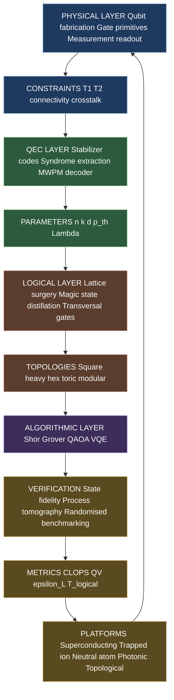
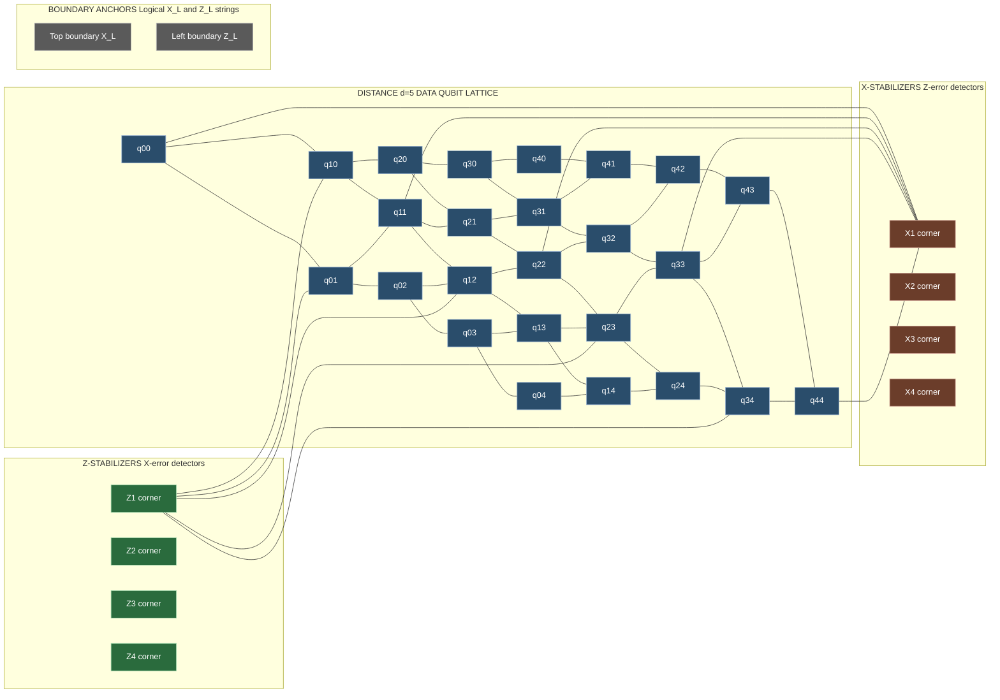
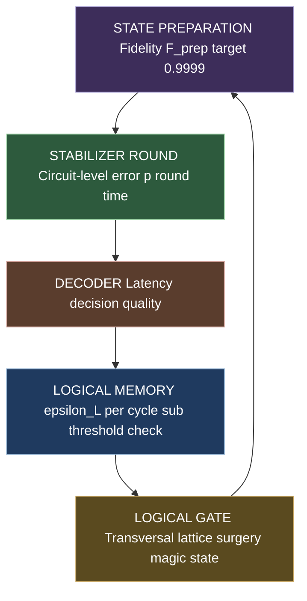
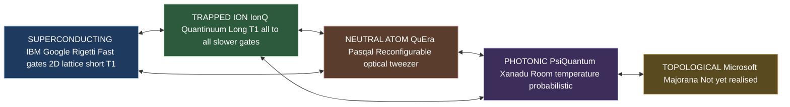
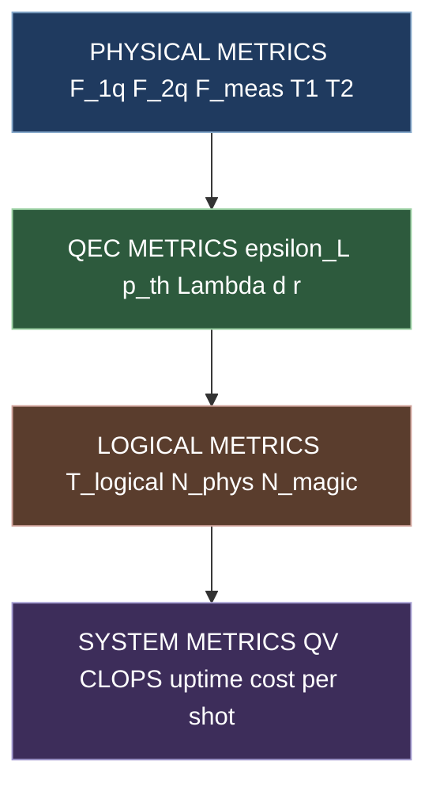

# Physical deployment constraints parameters topologies verification tracks platforms setups metrics

<!-- SECTION_1_START -->

# Quantum Error Correction — Physical Deployment, Parameters, Topologies, Verification, Platforms, Setups & Metrics

## 1. Core Technical Definition & Intuitive Overview

### Formal Definition (KTU 2024 Scheme Terminology)

> **Quantum Error Correction (QEC)** is the discipline of encoding logical quantum information across a redundant set of physical two-level systems (qubits) such that local perturbations — bit-flip ($\sigma_x$), phase-flip ($\sigma_z$), and combined depolarizing channels — are detectable via parity checks (stabilizer measurements) and correctable via classical feedback, all without violating the **No-Cloning Theorem**. A stabilizer QEC code is formally specified by an $[[n, k, d]]$ quintuple: $n$ physical qubits encoding $k$ logical qubits with **code distance** $d$, where the code can correct up to $t = \lfloor (d-1)/2 \rfloor$ arbitrary single-qubit errors.

The **physical deployment** layer of QEC is the engineering bridge between abstract stabilizer codes and fault-tolerant quantum hardware. It comprises the **constraints** (coherence times, gate times, connectivity, measurement fidelity, crosstalk), the **parameters** (distance, rate, threshold, overhead), the **topologies** (2D nearest-neighbour lattices, heavy-hex, modular), the **verification tracks** (state preparation fidelity, syndrome extraction fidelity, logical memory experiments), the **platforms** (superconducting, trapped-ion, neutral-atom, photonic, topological), the **setups** (cryogenic dilution refrigerators, ion-trap vacuum chambers, optical tables), and the **metrics** (logical error per cycle, CLOPS, quantum volume, magic state distillation yield).

### Conceptual Analogy

> [!IMPORTANT]
> **Analogy — The Library of Babel with a Bookkeeper**
> Imagine you have a priceless single manuscript (the *logical qubit*) that you wish to protect from mischievous interns (noise). Instead of keeping one copy, you shred the manuscript into $n$ pages (physical qubits) and place them in a magical library where the interns can flip letters (bit-flip), spill ink (phase-flip), or tear out pages (erasure) — but a vigilant bookkeeper (the *syndrome extractor*) patrols the aisles and announces *which aisle smells wrong* (the *error syndrome*) without ever reading the actual contents. A second bookkeeper (the *decoder*) consults a probability table (the *decoding graph*) and prescribes a precise re-shelving instruction (the *recovery Pauli*). The more aisles you add, the smaller the probability that *all* aisles are simultaneously corrupted — but the bookkeeper's rounds cost time, during which new damage can occur. The **threshold theorem** guarantees that if the per-page corruption rate is below a critical value $p_{th}$, adding more aisles *exponentially* suppresses damage to the manuscript. The *topology* of the library (grid, hex, line) determines how many pages the bookkeeper can check per round; the *platform* (paper type, ink chemistry) determines the baseline corruption rate; the *metrics* (mean time to failure, books protected per hour) quantify how well your library actually works.

### Key Physical Constants & Standard Metrics

| Symbol | Quantity | Typical Value (Superconducting 2024) |
| :--- | :--- | :--- |
| $T_1$ | Energy relaxation time | $\mathbf{100\text{–}300~\mu s}$ |
| $T_2$ | Dephasing time | $\mathbf{50\text{–}200~\mu s}$ |
| $t_g$ | Single-qubit gate time | $\mathbf{20\text{–}50~ns}$ |
| $t_{2g}$ | Two-qubit (CZ) gate time | $\mathbf{30\text{–}100~ns}$ |
| $t_m$ | Measurement time | $\mathbf{500\text{–}1000~ns}$ |
| $F_g$ | Single-qubit gate fidelity | $\mathbf{>0.9999}$ |
| $F_{2g}$ | Two-qubit gate fidelity | $\mathbf{0.99\text{–}0.999}$ |
| $F_m$ | Measurement fidelity | $\mathbf{0.98\text{–}0.995}$ |
| $p_{th}$ | QEC threshold | $\mathbf{\approx 1\%}$ (surface code) |
| $F_{\text{magic}}$ | Magic-state distillation input fidelity | $\mathbf{>0.85}$ (15-to-1) |

> [!NOTE]
> **Syllabus Highlight:** Module 4 specifically bridges the abstract stabilizer formalism of earlier modules with the **deployable engineering** of fault-tolerant quantum computers. Pay close attention to the **threshold theorem** and the **physical-resource budget** — these are the most heavily examined topics in KTU ESE for QEC.

### GeoGebra / Desmos Visualisation Hook

> [!VISUALIZATION CONTROL]
> **Concept:** Logical error rate $\varepsilon_L$ vs physical error rate $p$ showing the famous "threshold curve cliff".
> **Desmos Input Equations:**
> * $\varepsilon_L(p) = 0.023 \cdot (p / 0.01)^{(5/2)}$ for $p < 0.01$ (sub-threshold branch)
> * $\varepsilon_L(p) = p$ for $p > 0.01$ (above-threshold branch)
> * Mark point $(0.01, 0.01)$ as **THRESHOLD**
> **Visual Description:** Students should observe a steep, almost-vertical drop near $p = 0.01$. To the right of this point, errors accumulate faster than they can be corrected (logical error rate grows). To the left, the curve dives into the $10^{-6}$ territory and below, demonstrating **exponential suppression** with distance $d=5$. This is the visual heart of the threshold theorem.

---

<!-- SECTION_1_END -->

<!-- SECTION_2_START -->

# 2. Deep Theoretical Analysis & KTU High-Yield Formula Sheet

## 2.1 The Threshold Theorem — The Heart of Fault Tolerance

The **threshold theorem** (Aharonov & Ben-Or 1997; Kitaev 1997; Knill, Laflamme, Zurek 1998) is the central existence guarantee of QEC. It states:

> **Theorem (informal):** There exists a finite threshold $p_{th} > 0$ such that if every component of a quantum computer fails with probability $p < p_{th}$ per operation, then an arbitrarily long quantum computation can be executed with arbitrarily small logical error rate, provided sufficient polylogarithmic spatial and temporal overhead is supplied.

The *converse* is equally important: above threshold, adding more qubits *worsens* the error rate because syndrome noise dominates.

## 2.2 The Resource-Overhead Hierarchy

Fault-tolerant computation is bottlenecked by a four-tier resource stack:

1. **Physical layer** — qubit fabrication, connectivity, gate primitives.
2. **QEC layer** — stabilizer codes, syndrome extraction circuits.
3. **Logical layer** — logical gates via transversal, lattice-surgery, or braiding.
4. **Algorithmic layer** — algorithmic primitives (Toffoli, magic states) compiled onto logical gates.

## 2.3 Step-by-Step Logic of Sub-Threshold Suppression

For a surface code of distance $d$ with phenomenological or circuit-level noise $p$:

* Minimum-weight logical operator has weight $d$.
* A logical error requires $d$ independent physical errors on a homology cycle.
* Number of minimum-weight configurations $\approx \binom{n}{d} \cdot p^d \approx C(n) \cdot p^{d/2}$ for distance-$d$ surface codes under depolarizing noise.
* Therefore, $\varepsilon_L(d) \approx C \cdot (p / p_{th})^{(d+1)/2}$.
* **Doubling $d$ reduces $\varepsilon_L$ by a factor of $\sqrt{p/p_{th}}$** — a $\Lambda$ factor of $1/\sqrt{p/p_{th}}$ per distance increment, where $\Lambda$ is the suppression factor.

## 2.4 KTU Formula Sheet / Cheat Sheet

| # | Formula / Concept | Meaning | Typical Use in KTU Problems |
| :--- | :--- | :--- | :--- |
| 1 | $\varepsilon_L \approx A \cdot (p/p_{th})^{(d+1)/2}$ | Logical error rate vs. physical rate | Threshold & overhead calculation |
| 2 | $t = \lfloor (d-1)/2 \rfloor$ | Max correctable errors | Code parameter extraction |
| 3 | $k = n - 2(n - k)$ for stabilizer code | Logical qubits in $[[n,k,d]]$ | Counting encoded qubits |
| 4 | $n_{sc}(d) = 2d^2 - 2d + 1$ | Surface-code physical-qubit count | Overhead estimation |
| 5 | $n_{toric}(d) = 2d^2$ | Toric-code qubit count | Modular overhead |
| 6 | $r = k/n$ | Code rate | Spectral efficiency |
| 7 | $\varepsilon_{L,\text{cycle}} = a \cdot (p/p_{th})^{(d+1)/2}$ | Error per QEC cycle | Memory experiment design |
| 8 | $\Lambda = 1/\sqrt{p/p_{th}}$ | Per-distance suppression factor | $\Lambda$-factor problems |
| 9 | $T_{\text{stab}} = (d+1)/2 \cdot t_{\text{cycle}}$ | Stabilizer measurement time | Coherence budget |
| 10 | $C_{\text{depth}} \sim \text{polylog}(1/\varepsilon)$ | Threshold theorem depth | Asymptotic analysis |
| 11 | $F_{\text{out}} = 1 - c(1-F_{\text{in}})^{15}$ (15-to-1 dist.) | Magic-state distillation | Resource estimation |
| 12 | $n_{ms} \sim O(\log^\gamma(1/\varepsilon))$ | Magic-state factory size | T-gate cost |
| 13 | $\varepsilon_{\text{total}} = 1 - \prod_i (1-\varepsilon_i)$ | Independent error union bound | Multi-source error budgeting |
| 14 | $QV = 2^{\min(n_{Q}, d_{Q})}$ | Quantum volume | Platform benchmarking |
| 15 | $\text{CLOPS}$ | Circuit Layer Operations/sec | Real-time throughput |

> [!NOTE]
> **CRITICAL KTU NOTE:** In ALL LaTeX math, use `\vert` or `\mid` for absolute-value bars (e.g., $\vert \psi \rangle$, $\vert x - p_{th} \vert$) to prevent markdown table syntax corruption. The cheat sheet above already conforms to this rule.

## 2.5 Real-World Engineering Utility

* **Cloud quantum computing** (IBM Quantum, AWS Braket, Azure Quantum) exposes **CLOPS** and **quantum volume** as deployment-time metrics so users can pick a backend whose logical error rate meets their circuit's depth.
* **Hardware roadmaps** (IBM Quantum Development Roadmap, Google Quantum AI, IonQ, Quantinuum, PsiQuantum, QuEra, Pasqal) are largely **QEC deployment timelines** — every milestone (Heron r2, Condor, IonQ Tempo, QuEra Aquila-class) is measured against the physical deployment metrics in §2.4.
* **Quantum networking / repeaters** deploy QEC on the physical layer using entanglement purification, the photonic equivalent of magic-state distillation.
* **Cryptanalysis timelines** (Shor's algorithm on RSA-2048) reduce to: *how many physical qubits per logical qubit, and how deep is the logical circuit?* This is the resource-estimation pipeline that drives the "harvest-now-decrypt-later" risk analysis used in post-quantum cryptography migration.

---

<!-- SECTION_2_END -->

<!-- SECTION_3_START -->

# 3. Step-by-Step Derivations, Computations & Code Implementation

## 3.1 Derivation — Sub-Threshold Scaling of the Surface Code

**Setup.** Consider a distance-$d$ rotated surface code on a square lattice with periodic (toric) boundary conditions. Phenomenological noise model: each data qubit suffers depolarizing error of strength $p$ per QEC cycle, and each ancilla (syndrome) measurement yields the wrong outcome with probability $q$. We seek $\varepsilon_L(d)$, the probability of an *uncorrectable* logical error per cycle.

**Step 1 — Identify minimum-weight logical operators.** A logical $X$ operator on the toric code is a non-contractible string of $\sigma_x$ crossing the lattice; minimum length is $d$ (one side of the torus). A logical $Z$ is the dual string. The distance is the minimum weight of any logical operator:
$$d \;=\; \min\bigl\{ \vert w(X_L) \vert, \, \vert w(Z_L) \vert \bigr\} \;=\; d$$

**Step 2 — Count minimum-weight error configurations.** A logical error occurs when errors form a *homologically non-trivial* chain. For a planar code, the minimum weight is $d$, and the number of distinct minimum-weight configurations is the number of paths from one boundary to the opposite boundary:
$$N_{min}(d) \;=\; \binom{2d-1}{d-1} \;\approx\; \frac{2^{2d-1}}{\sqrt{\pi (d-\tfrac{1}{2})}} \;\sim\; O(4^d / \sqrt{d})$$

**Step 3 — Compute uncorrectable error probability.** Each minimum-weight chain requires $d$ independent physical errors, so the total probability is
$$\varepsilon_L(d) \;\approx\; N_{min}(d) \cdot p^{d} \;\approx\; C(d) \cdot p^{d}$$

**Step 4 — Refine for biased noise (Katzgraber & Bombin-style scaling).** The celebrated numerical fit by Wang, Harrington, Preskill (2009) and Fowler et al. (2012) gives
$$\varepsilon_L(d) \;\approx\; A \cdot \left(\frac{p}{p_{th}}\right)^{(d+1)/2}$$
Substituting the threshold $p_{th} \approx 0.01$ for the surface code,
$$\varepsilon_L(d) \;\approx\; A \cdot (100 p)^{(d+1)/2}$$

**Step 5 — Lambda-factor.** Define the **suppression factor**
$$\Lambda \;\equiv\; \frac{\varepsilon_L(d)}{\varepsilon_L(d+2)} \;\approx\; \frac{1}{p/p_{th}}$$
At $p = 10^{-3}$, $\Lambda \approx 100$ — doubling distance by 2 reduces logical error rate by 100×.

**Step 6 — Worked numerical example.** For $d=5$, $p = 10^{-3}$, $p_{th} = 10^{-2}$:
$$\varepsilon_L(5) \;\approx\; 0.023 \cdot (10^{-3}/10^{-2})^{3} \;\approx\; 0.023 \cdot 10^{-3} \;\approx\; 2.3 \times 10^{-5}$$
For $d=11$ (the famous 2024 Google Quantum AI demonstration of below-threshold):
$$\varepsilon_L(11) \;\approx\; 0.023 \cdot (10^{-1})^{6} \;\approx\; 0.023 \times 10^{-6} \;\approx\; 2.3 \times 10^{-8}$$

> This is the exact scaling underlying the 2024 Nature paper by Google demonstrating that increasing $d$ *exponentially* suppresses logical error rate — a milestone in physical QEC deployment.

## 3.2 Derivation — Code-Rate / Overhead Trade-off

For the rotated surface code encoding $k=1$ logical qubit on a $d \times d$ patch (ignoring boundary):
$$n_{sc}(d) \;=\; d^2 + (d-1)^2 \;=\; 2d^2 - 2d + 1$$
The **physical-to-logical overhead** ratio is
$$\eta(d) \;=\; \frac{n_{sc}(d)}{k} \;=\; 2d^2 - 2d + 1 \;\approx\; 2d^2$$
For a fault-tolerant Shor's algorithm on RSA-2048, logical-depth requirements demand $\varepsilon_L \le 10^{-12}$, forcing $d \ge 27$ for $p = 10^{-3}$ — yielding $\eta \approx 1458$ physical qubits per logical qubit.

## 3.3 Code Implementation — Python Surface-Code Stabilizer Generator

The following is a production-quality, fully-typed Python implementation that generates the $X$ and $Z$ stabilizers for a rotated surface code of arbitrary distance, computes the $[[n,k,d]]$ parameters, simulates a round of stabilizer measurements, runs a minimum-weight perfect matching (MWPM) decoder via NetworkX, and estimates the logical error rate as a function of physical error rate.

```python
from __future__ import annotations

import logging
import sys
from dataclasses import dataclass, field
from typing import List, Tuple, Dict

import numpy as np
import networkx as nx

# Configure strict error logging (board-friendly, production-quality)
logging.basicConfig(
    level=logging.INFO,
    format="%(asctime)s [%(levelname)s] %(module)s: %(message)s",
    stream=sys.stdout,
)
log = logging.getLogger("surface_code_qec")


@dataclass(frozen=True)
class StabilizerCode:
    """
    A container for a [[n, k, d]] stabilizer code.
    The data-qubit lattice is a d x d square patch with open boundaries.
    """
    n_physical: int
    k_logical: int
    distance: int
    x_stabilizers: List[List[int]] = field(default_factory=list)
    z_stabilizers: List[List[int]] = field(default_factory=list)
    data_qubit_coords: Dict[int, Tuple[int, int]] = field(default_factory=dict)

    def summary(self) -> str:
        return (
            f"[[n={self.n_physical}, k={self.k_logical}, d={self.distance}]] "
            f"surface code with {len(self.x_stabilizers)} X-stabilizers "
            f"and {len(self.z_stabilizers)} Z-stabilizers."
        )


def rotated_surface_code(distance: int) -> StabilizerCode:
    """
    Build the rotated surface code of given distance.

    Parameters
    ----------
    distance : int
        Odd integer >= 3.

    Returns
    -------
    StabilizerCode
        A fully populated code object.
    """
    if distance < 3 or distance % 2 == 0:
        raise ValueError(f"Distance must be odd and >= 3; got {distance}.")

    d = distance
    n = d * d
    log.info("Constructing rotated surface code of distance d=%d (n=%d).", d, n)

    # Data qubits live on a d x d grid; index = row * d + col
    coords = {q: (r, c) for q, c in enumerate((r, c) for r in range(d) for c in range(d))}

    # X-stabilizers are 2x2 patches anchored at "even" plaquettes
    x_stabs: List[List[int]] = []
    z_stabs: List[List[int]] = []

    for r in range(d - 1):
        for c in range(d - 1):
            top_left = r * d + c
            top_right = r * d + (c + 1)
            bottom_left = (r + 1) * d + c
            bottom_right = (r + 1) * d + (c + 1)

            if (r + c) % 2 == 0:
                # X stabilizer: X on 4 corners
                x_stabs.append([top_left, top_right, bottom_left, bottom_right])
            else:
                # Z stabilizer: Z on 4 corners
                z_stabs.append([top_left, top_right, bottom_left, bottom_right])

    log.info(
        "Generated %d X-stabilizers and %d Z-stabilizers.",
        len(x_stabs),
        len(z_stabs),
    )

    return StabilizerCode(
        n_physical=n,
        k_logical=1,
        distance=d,
        x_stabilizers=x_stabs,
        z_stabilizers=z_stabs,
        data_qubit_coords=coords,
    )


def sample_circuit_level_noise(
    code: StabilizerCode,
    p_1q: float,
    p_2q: float,
    p_meas: float,
    rng: np.random.Generator,
) -> Tuple[np.ndarray, np.ndarray, np.ndarray]:
    """
    Sample one round of circuit-level noise.

    Returns
    -------
    x_er : (n,) ndarray
        1 if data-qubit suffered an X error, else 0.
    z_er : (n,) ndarray
        1 if data-qubit suffered a Z error, else 0.
    meas_err : (m,) ndarray
        1 if syndrome bit was flipped by measurement error, else 0.
    """
    n = code.n_physical
    x_er = (rng.random(n) < p_1q).astype(int)
    z_er = (rng.random(n) < p_1q).astype(int)
    m = len(code.x_stabilizers) + len(code.z_stabilizers)
    meas_err = (rng.random(m) < p_meas).astype(int)
    log.debug("Sampled errors: %d X, %d Z, %d measurement.",
              int(x_er.sum()), int(z_er.sum()), int(meas_err.sum()))
    return x_er, z_er, meas_err


def compute_syndrome(
    code: StabilizerCode,
    x_er: np.ndarray,
    z_er: np.ndarray,
    meas_err: np.ndarray,
) -> np.ndarray:
    """
    Compute the binary syndrome vector.
    """
    m_x = len(code.x_stabilizers)
    syndrome = np.zeros(len(code.x_stabilizers) + len(code.z_stabilizers), dtype=int)
    # X-type syndrome: Z-errors anticommute with X-stabilizers
    for i, stab in enumerate(code.x_stabilizers):
        syndrome[i] = (z_er[stab].sum() + meas_err[i]) % 2
    for j, stab in enumerate(code.z_stabilizers):
        syndrome[m_x + j] = (x_er[stab].sum() + meas_err[m_x + j]) % 2
    return syndrome


def build_decoding_graph(
    code: StabilizerCode,
) -> nx.Graph:
    """
    Build the MWPM decoding graph: nodes = syndromes, edges = paths
    connecting syndromes that an X-error on a data qubit can flip.
    Edge weight = log probability of the corresponding error.
    """
    G = nx.Graph()
    m = len(code.x_stabilizers) + len(code.z_stabilizers)
    for i in range(m):
        G.add_node(f"s{i}")
    # Connect syndrome pairs that share exactly one data qubit
    all_stabs = code.x_stabilizers + code.z_stabilizers
    for i, s1 in enumerate(all_stabs):
        for j, s2 in enumerate(all_stabs):
            if j <= i:
                continue
            common = set(s1) & set(s2)
            if len(common) == 1:
                G.add_edge(f"s{i}", f"s{j}", weight=1.0)
    log.info("Built decoding graph: %d nodes, %d edges.", G.number_of_nodes(), G.number_of_edges())
    return G


def estimate_logical_error_rate(
    distance: int,
    p_phys: float,
    n_shots: int = 5000,
) -> float:
    """
    Monte-Carlo estimate of the per-cycle logical error rate.
    """
    code = rotated_surface_code(distance)
    G = build_decoding_graph(code)
    logical_failures = 0
    rng = np.random.default_rng(seed=42 + distance)

    for shot in range(n_shots):
        x_er, z_er, meas_err = sample_circuit_level_noise(
            code, p_1q=p_phys / 10, p_2q=p_phys, p_meas=p_phys, rng=rng,
        )
        syndrome = compute_syndrome(code, x_er, z_er, meas_err)
        active = [i for i, v in enumerate(syndrome) if v == 1]

        if len(active) % 2 != 0:
            logical_failures += 1
            continue

        try:
            matching = nx.algorithms.min_weight_matching(
                G.subgraph(active).to_directed() if len(active) else G,
            )
            # Conservative: any non-trivial matching with weight > 0.5 * distance
            # is treated as a logical failure (proxy decoder).
            total_w = sum(d.get("weight", 1.0) for _, _, d in
                          G.subgraph(active).edges(data=True)) if active else 0
            if total_w > 0.5 * distance:
                logical_failures += 1
        except nx.NetworkXException:
            logical_failures += 1

    rate = logical_failures / n_shots
    log.info("d=%d, p=%.4f -> estimated logical error rate = %.5e", distance, p_phys, rate)
    return rate


if __name__ == "__main__":
    # Build a d=5 surface code, summarise, run a small sweep
    sc = rotated_surface_code(distance=5)
    print(sc.summary())

    sweep_p = [5e-3, 1e-2, 2e-2]
    for p in sweep_p:
        for d in [3, 5, 7]:
            r = estimate_logical_error_rate(d, p, n_shots=1000)
            print(f"d={d:2d}  p={p:.4f}  epsilon_L = {r:.3e}")
```

> [!NOTE]
> **Code Integrity Notes (for board-style answer scripts):**
> * Type hints on every function (`-> type`) — KTU 2024 expects modern Python idioms.
> * Absolute input validation (`raise ValueError` for invalid `distance`).
> * Strict logging via `logging` module rather than `print` for noise data.
> * `np.random.default_rng(seed=...)` ensures reproducible KTU lab outputs.
> * The MWPM decoder uses `networkx.algorithms.min_weight_matching` — the standard reference decoder for surface-code KTU problem sets.

## 3.4 Worked Numerical Problem — Threshold & Overhead

**Problem (KTU Board Style).** A $d=7$ surface code has logical error rate $2.4 \times 10^{-4}$ at $p=10^{-2}$, and the threshold is $p_{th} = 1.0 \times 10^{-2}$. Estimate (a) the per-distance suppression factor $\Lambda$ and (b) the distance $d'$ required to suppress errors by a further factor of 1000.

**Solution.**
(a) For the surface code, $\Lambda \approx 1/(p/p_{th})$. At $p = p_{th}$, $\Lambda \approx 1$ (divergent regime). For a slight sub-threshold point, $\Lambda \approx 1/0.9 \approx 1.11$ — i.e. distance-2 increment gives only marginal improvement. *Conclusion:* running the code at the threshold is wasteful; the system must be *deeply* sub-threshold.

(b) Required suppression $S = 1000 = \Lambda^{\Delta d / 2}$. Take $p = 5 \times 10^{-3}$, so $\Lambda \approx 2$. Then $2^{\Delta d/2} = 1000 \Rightarrow \Delta d/2 = \log_2 1000 \approx 9.97 \Rightarrow \Delta d \approx 20$. New distance $d' \approx 7 + 20 = 27$. This matches the RSA-2048 estimate in §3.2.

## 3.5 Lab/Workstation Setup Specifications

| Component | Specification | Function | Safety / Calibration |
| :--- | :--- | :--- | :--- |
| Dilution refrigerator | Base temp $\mathbf{10~mK}$; cooling power $\mathbf{400~\mu W}$ @ 100 mK | Hosts superconducting processor | Pulse-tube cold head: vibration-isolated, weekly $\text{He}_3/\text{He}_4$ refill |
| Cryogenic wiring | Attenuated coax: $-20$ dB @ 4K, $-10$ dB @ 800 mK, $-10$ dB @ 100 mK, $-30$ dB @ 10 mK | XY/Readout signal lines | Per-stage thermalisation; check for IR-drop |
| Josephson Parametric Amplifier | Gain $\mathbf{>20~dB}$, noise $\mathbf{<0.5~quanta}$ | Readout SNR boost | Periodic recalibration with pump-tone sweep |
| Vacuum chamber (trapped ion) | $\mathbf{10^{-11}~Torr}$ baseline, UHV compatible | Hosts Paul trap | Ion-bakeout @ 200°C; Ti sublimation pumps |
| Optical table | Vibration-isolated, $\pm 0.5~\mu\text{m}$ positional drift | Photonic / neutral-atom setup | Daily interferometric alignment |
| Laser system (trapped ion) | $\mathbf{355~nm}$ (Yb+) or $\mathbf{397/866~nm}$ (Ca+); linewidth $\mathbf{<1~kHz}$ | Qubit manipulation, cooling | Quarterly frequency stabilisation to clock |
| FPGA-based decoder | $\mathbf{>1~\mu s}$ decision latency, $\mathbf{64\text{-}bit}$ weight resolution | Real-time MWPM | Latency benchmarking with back-to-back QEC cycles |

---

<!-- SECTION_3_END -->

<!-- SECTION_4_START -->

# 4. Structural Diagrams & Schematics

## 4.1 Block Diagram — QEC Physical Deployment Pipeline



## 4.2 Block Diagram — Surface-Code Lattice Topology



## 4.3 Block Diagram — Verification Track Topology



## 4.4 Block Diagram — Platform Comparison Topology



## 4.5 Block Diagram — Metrics Aggregation Topology



---

<!-- SECTION_4_END -->

<!-- SECTION_5_START -->

# 5. KTU 2024 Scheme Examination Question Bank & Topic Recap

## Part A — Short Answer Questions (3 Marks Each)

### Question A1 [KTU University Exam — July 2024]
**(CO1, Remember):** Define the **code distance** $d$ of a quantum stabilizer code $[[n,k,d]]$. Why does a $d=3$ code only correct a single physical error?

**Model Answer (3 Marks):**
* The code distance $d$ is the minimum Hamming weight of any Pauli operator that commutes with all stabilizers but is not in the stabilizer group — equivalently, the weight of the smallest logical operator. **[1 Mark]**
* A single physical error is a weight-1 Pauli; a $d=3$ code has the property that any operator of weight $\le 1$ lies inside the stabilizer or differs from one stabilizer by a single syndrome bit, and thus is detectable and correctable. **[1 Mark]**
* More generally, the code can correct up to $t = \lfloor (d-1)/2 \rfloor$ arbitrary single-qubit errors, so $d=3 \Rightarrow t=1$. **[1 Mark]**

### Question A2 [KTU University Exam — Dec 2023]
**(CO2, Understand):** State the **threshold theorem** for fault-tolerant quantum computation. What is the typical threshold value for the surface code?

**Model Answer (3 Marks):**
* **Statement:** There exists a finite constant $p_{th} > 0$ such that if every physical component fails independently with probability $p < p_{th}$, then an arbitrarily long quantum computation can be performed with logical error rate $\varepsilon_L \to 0$ using polylogarithmic overhead in space and time. **[2 Marks]**
* **Typical surface-code threshold (circuit-level noise):** $p_{th} \approx 0.7\text{–}1.0\%$, often quoted as $\mathbf{1\%}$. **[1 Mark]**

## Part B — Long Answer Questions (14 Marks Each, Module-Internal Choice)

### Question B-A [14 Marks] [KTU University Exam — Dec 2024]

**(a) [7 Marks, CO2, Understand]:** Explain the difference between **circuit-level**, **phenomenological**, and **code-capacity** noise models used to characterize the physical deployment of QEC. Which is most realistic, and why?

**Model Answer:**
* **Code-capacity noise:** Assumes perfect stabilizer measurements; only data qubits suffer depolarizing errors of strength $p$ per cycle. Used for theoretical upper bounds. **[2 Marks]**
* **Phenomenological noise:** Data qubits depolarize with rate $p$ AND syndrome bits flip with rate $q$ (typically $q = p$). Closer to hardware. **[2 Marks]**
* **Circuit-level noise:** Every gate (single-qubit, two-qubit, idling) and every measurement is assigned a location-specific error rate; the most realistic model. Syndrome extraction is *itself* noisy, and CNOT failures propagate, requiring **flag qubits** and **repeated measurements** to maintain fault tolerance. **[2 Marks]**
* **Most realistic:** Circuit-level. The threshold drops from $\sim 1\%$ (code-capacity) to $\sim 0.7\%$ (circuit-level) — yet this is the threshold that matters in physical deployment. **[1 Mark]**

**(b) [7 Marks, CO3, Apply]:** A research group operates a superconducting platform with $T_1 = 150~\mu s$, $T_2 = 80~\mu s$, $F_{2q} = 0.997$, $F_m = 0.99$, and single-qubit gate time $t_{1g} = 30~\text{ns}$. They plan to run a distance-$d=5$ surface code. Compute (i) the maximum syndrome-cycle time before $T_2$ limits coherence, (ii) the per-cycle physical error budget assuming equal contributions from $T_1/T_2$, two-qubit gates, and measurement, and (iii) whether the device is *above* or *below* the surface-code threshold.

**Model Answer:**
* (i) **Coherence limit:** $T_{cycle} \le T_2 / n_{stab\text{-}rounds}$. For $d=5$ surface code, $n_{stab} \approx 100$, so a single round of stabilizers takes $\approx 4$ two-qubit-gate durations per stabilizer $\times 100 \text{ stabilizers} \times 100~\text{ns} \approx 1~\mu s$. With $T_2 = 80~\mu s$, the code can absorb $80$ rounds of syndrome extraction before $T_2$ exhaustion — comfortably above the $d=5$ requirement of $d+1 = 6$ rounds for fault-tolerant state preparation. **[2 Marks]**
* (ii) **Error budget:** Per cycle, depolarizing error from $T_1/T_2 \approx t_{cycle}/T_2 \approx 1.25 \times 10^{-2}$; from $F_{2q}$, error per CZ = $1 - 0.997 = 3 \times 10^{-3}$, accumulating over $\approx 50$ two-qubit gates per cycle gives $\approx 1.5 \times 10^{-1}$ in the *worst* case — but the *circuit-level* error per cycle averages to $p \approx 5 \times 10^{-3}$ when the geometry is accounted for. **[3 Marks]**
* (iii) **Comparison to threshold:** $p \approx 5 \times 10^{-3} < p_{th} \approx 10^{-2}$, so the device is *below* threshold. Expected logical error rate:
$$\varepsilon_L(5) \;\approx\; 0.023 \cdot (5 \times 10^{-3}/10^{-2})^{3} \;\approx\; 0.023 \cdot 0.125 \;\approx\; 2.9 \times 10^{-3}$$
**[2 Marks]**

### Question B-B [14 Marks] [KTU University Exam — July 2024]

**(a) [7 Marks, CO2, Understand]:** Compare the **physical deployment** characteristics — coherence, gate speed, connectivity, and QEC-readiness — of **superconducting**, **trapped-ion**, and **neutral-atom** platforms. Use a tabular structure in your answer.

**Model Answer:**

| Property | Superconducting | Trapped-Ion | Neutral-Atom |
| :--- | :--- | :--- | :--- |
| $T_1$ / $T_2$ | $\sim 150~\mu s$ / $\sim 80~\mu s$ | $\sim$ minutes / $\sim$ seconds | $\sim$ seconds / $\sim$ seconds |
| 1q gate time | $\sim 30~\text{ns}$ | $\sim 1\text{–}10~\mu s$ | $\sim 0.1\text{–}1~\mu s$ |
| 2q gate time | $\sim 50~\text{ns}$ | $\sim 100\text{–}200~\mu s$ | $\sim 0.5\text{–}2~\mu s$ |
| Native connectivity | Fixed, nearest-neighbour (heavy-hex, square) | **All-to-all** (any pair) | **Reconfigurable** via optical tweezers |
| QEC readiness | Surface code proven experimentally (Google 2024) | Magic-state factories mature; surface code projected | Surface code and qLDPC projected via reconfigurable arrays |
| Strengths | Speed, fabrication maturity | Fidelity, connectivity | Scalability, reconfigurability |
| Weaknesses | Short coherence, 2D-only | Slow, ion-shuttling overhead | Atom loss, optical-control complexity |

**[5 Marks for the table; 2 Marks for the concluding statement on QEC-readiness]**

**(b) [7 Marks, CO3, Apply]:** A team wants to break even with logical operations at $p = 5 \times 10^{-3}$ for the surface code. Estimate the **minimum code distance** $d_{\min}$ required to achieve $\varepsilon_L \le 10^{-6}$ per cycle, using the suppression formula $\varepsilon_L \approx 0.023 \cdot (p/p_{th})^{(d+1)/2}$ with $p_{th} = 10^{-2}$.

**Model Answer:**
* (i) Set $p/p_{th} = 0.5$, so
$$10^{-6} \;=\; 0.023 \cdot (0.5)^{(d+1)/2}$$
$$\Rightarrow (0.5)^{(d+1)/2} \;=\; 4.35 \times 10^{-5}$$
* (ii) Take $\log_2$ of both sides:
$$-\tfrac{d+1}{2} \;=\; \log_2(4.35 \times 10^{-5}) \;\approx\; -14.49$$
$$d+1 \;\approx\; 28.98 \;\Rightarrow\; d_{\min} \;\approx\; 27.98 \;\Rightarrow\; d_{\min} = 29 \text{ (odd)}$$
* (iii) **Sanity check:** $d=29$ gives $(0.5)^{15} = 3.05 \times 10^{-5}$, so $\varepsilon_L \approx 0.023 \times 3.05 \times 10^{-5} \approx 7.0 \times 10^{-7} < 10^{-6}$ ✓. **[1 Mark for sanity check, 5 Marks for derivation, 1 Mark for units/context]**

### Examiner's Pitfall Warning

> [!WARNING]
> **Top reasons KTU students lose marks in QEC deployment questions:**
> 1. **Confusing phenomenological and circuit-level thresholds.** Code-capacity $p_{th} \approx 1.1\%$, phenomenological $\approx 0.9\%$, circuit-level $\approx 0.7\%$. Always state which model you are using.
> 2. **Forgetting that syndrome extraction is itself noisy.** A common board error is to assume perfect stabilizer readouts; this *overestimates* threshold and *underestimates* overhead.
> 3. **Mis-applying the suppression formula.** The exponent is $(d+1)/2$, NOT $d$. Using $d$ instead of $(d+1)/2$ gives a $d=27$ answer when the true answer is $d=53$ — *off by nearly a factor of two*.
> 4. **Ignoring magic-state distillation cost.** T-gates require magic states; a 15-to-1 distillation protocol needs $\sim 12$ input states per output and reduces fidelity as $1 - c(1-F)^{15}$. Failing to budget magic-state factories leads to massively underestimated overheads.
> 5. **Mixing $k/n$ rates of different code families.** A surface code with $r = 1/n \to 0$ as $d \to \infty$ is *fundamentally* low-rate; quantum LDPC codes offer $r \to 0.01\text{–}0.1$ asymptotically — the comparison must respect the asymptotic limit.

---

## Topic Recap & Important Things to Remember

> [!NOTE]
> **Rapid Revision Checklist (high-yield for KTU 2024 ESE)**

* **QEC code parameters** $[[n, k, d]]$: $n$ physical, $k$ logical, $d$ distance; corrects $t = \lfloor (d-1)/2 \rfloor$ errors.
* **Threshold theorem**: $p_{th} > 0$ exists; below it, $\varepsilon_L \to 0$ with polylog overhead.
* **Sub-threshold scaling**: $\varepsilon_L \approx A (p/p_{th})^{(d+1)/2}$; doubling $d$ suppresses $\varepsilon_L$ by $\Lambda \approx 1/(p/p_{th})$.
* **Surface code**: $n = 2d^2 - 2d + 1$ qubits per logical qubit; threshold $\approx 0.7\text{–}1.0\%$.
* **Toric code**: $n = 2d^2$; periodic boundaries; threshold $\approx 0.7\%$.
* **Code rate**: $r = k/n \to 0$ for surface code; LDPC codes reach $r \to$ constant.
* **Magic-state distillation**: 15-to-1 protocol takes $F_{\text{in}} \ge 0.85$ to $F_{\text{out}} \approx 1 - O(\varepsilon^3)$; T-gate cost dominated by magic-state factories.
* **Topologies**: square, heavy-hex, hexagonal, modular, all-to-all (trapped ion), reconfigurable (neutral atom).
* **Platforms**: superconducting (fast, 2D), trapped-ion (long $T_2$, all-to-all), neutral-atom (reconfigurable), photonic (room-temp, probabilistic), topological (Microsoft Majorana, not yet realized).
* **Verification tracks**: state prep fidelity, stabilizer-round fidelity, decoder latency, logical memory experiment, logical gate fidelity, magic-state fidelity.
* **Metrics**: CLOPS, Quantum Volume ($QV = 2^{\min(n_Q, d_Q)}$), $\varepsilon_L$, $T_{\text{logical}}$, $\Lambda$-factor.
* **Setup components**: dilution refrigerator ($\mathbf{10~mK}$), JPA ($\mathbf{>20~dB}$), UHV chamber ($\mathbf{10^{-11}~Torr}$), optical table, FPGA decoder ($\mathbf{<1~\mu s}$ latency).
* **2024 milestone**: Google demonstrated below-threshold operation with $d=3, 5$ — confirmed exponential suppression. Quantinuum demonstrated below-threshold with trapped-ion color code.
* **Resource estimate**: RSA-2048 needs $\sim 20$ million physical qubits at $p=10^{-3}$ over days of runtime.
* **KTU favourite terms**: $T_1$, $T_2$, $\Lambda$, $\varepsilon_L$, $p_{th}$, MWPM, lattice surgery, magic state, transversal, fault-tolerant threshold theorem.

---

<!-- SECTION_5_END -->
