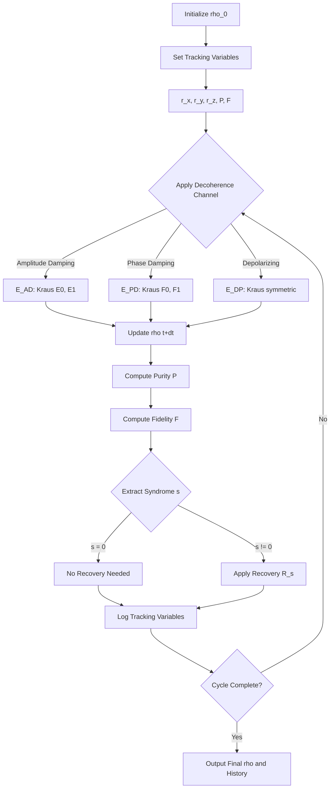
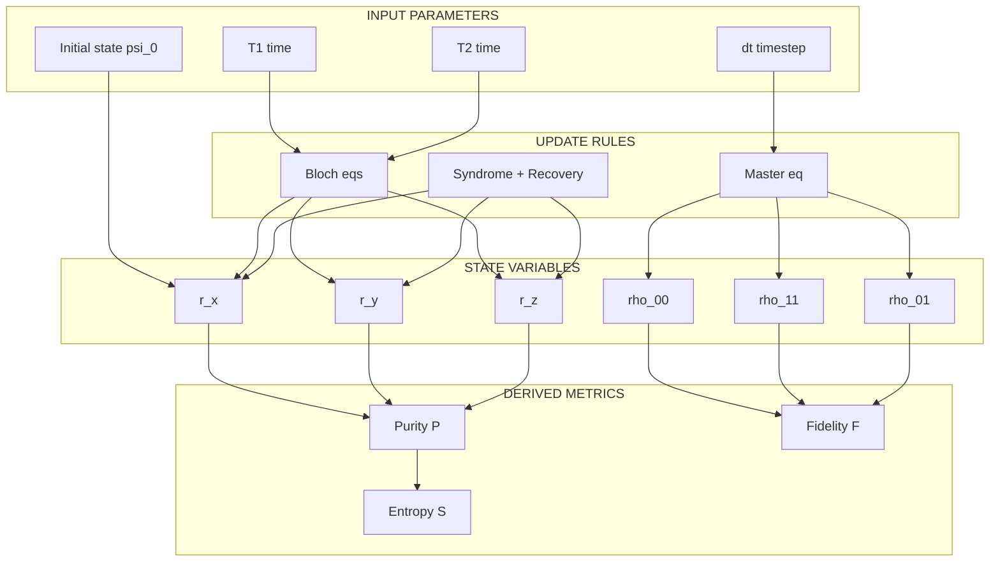
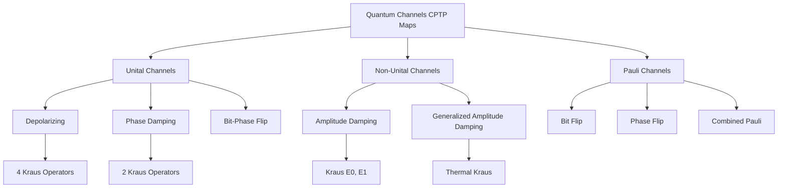

# Quantum decoherence tracking models variables updates scripts options parameters rules

<!-- SECTION_1_START -->

# Quantum Decoherence Tracking Models, Variables & Update Rules

## 1.1 Formal Academic Definition (KTU 2024 Syllabus Terminology)

> [!NOTE]
> **Quantum Decoherence** is the irreversible, environment-induced loss of quantum coherence between the basis states of an open quantum system, mathematically described by the transition of a pure quantum state $\rho = \vert \psi \rangle \langle \psi \vert$ into a mixed state through non-unitary interaction with environmental degrees of freedom.

In the **KTU 2024 Scheme** framework for **Module 4: Quantum Error Correction Systems**, decoherence tracking refers to the systematic modelling, monitoring, and update of system variables that quantify the loss of quantum information due to environmental coupling. The tracking is governed by **Master Equations** (Lindblad form), parameterized by relaxation constants **$T_1$** (energy/amplitude damping time) and **$T_2$** (dephasing time).

The governing dynamical equation for an open quantum system coupled to a Markovian bath is:

$$\frac{d\rho(t)}{dt} = -\frac{i}{\hbar}[H, \rho(t)] + \sum_{k} \gamma_k \left( L_k \rho(t) L_k^{\dagger} - \frac{1}{2}\{L_k^{\dagger}L_k, \rho(t)\} \right)$$

where the **jump operators** $L_k$ and **decay rates** $\gamma_k$ are the *tracking variables*, and the **update rules** dictate how $\rho(t)$ evolves under each error channel.

---

## 1.2 Conceptual Analogy & Engineering Intuition

> [!IMPORTANT]
> **Real-World Analogy — The Ripple in a Pond:**
> Imagine dropping a perfectly circular stone into a still pond. The ripples are clean, organized, and carry distinct phase information (peaks and troughs in a known pattern). Now, suppose a light wind disturbs the surface. Over time, the ripples become smeared, lose their sharp crests, and eventually merge into a random, uniform chop. The *organized phase relationship* is lost. This is **decoherence**.
> 
> The **wind** is the environment, the **ripple amplitude decay** is the $T_1$ process, and the **loss of crest-trough alignment** is the $T_2$ (dephasing) process.

For a **B.Tech engineer**, decoherence is the *enemy clock* — it ticks at a rate characterized by $T_1$ and $T_2$, and the entire job of **Quantum Error Correction (QEC)** is to *outrun* this clock. Tracking decoherence means continuously measuring, modelling, and updating the state $\rho(t)$ so that syndrome extraction and recovery operations can be applied *before* information is irretrievably lost.

---

## 1.3 Physical Constants & Standard Metrics

> [!NOTE]
> **Standard Decoherence Constants (Bolded for Emphasis):**
> - **$\hbar \approx 1.054 \times 10^{-34}$ J·s** — Reduced Planck constant (action scale of quantum phase).
> - **$T_1$** — Longitudinal (energy/amplitude) relaxation time, typically **$10 \mu s$ to $100 ms$** in superconducting qubits.
> - **$T_2$** — Transverse (phase) relaxation time, bounded by **$T_2 \le 2T_1$**.
> - **$T_2^*$** — Dephasing time including low-frequency noise: **$1/T_2^* = 1/T_2 + 1/T_{\phi}$**.
> - **$\gamma_k$** — Decay rate of channel $k$ (units: **$s^{-1}$**), where **$\gamma_1 = 1/T_1$** and **$\gamma_{\phi} = 1/T_{\phi}$**.

---

## 1.4 GeoGebra / Desmos Visualization

> [!VISUALIZATION CONTROL]
> **Concept:** Bloch Sphere Decay Trajectory under Amplitude Damping
> 
> **GeoGebra / Desmos Input Equations (3D Parametric):**
> * `x(t) = (1 - e^(-t/T1)) * sin(θ) * cos(φ + 0)`
> * `y(t) = (1 - e^(-t/T1)) * sin(θ) * sin(φ + 0)`
> * `z(t) = 1 - (1 - cos(θ)) * (1 - e^(-t/T1))`
> 
> **Visual Description:** Students should observe the Bloch vector spiralling from the surface toward the **north pole ($\vert 0 \rangle$ state)** as $t \to \infty$. The *radial contraction* represents $T_1$ amplitude damping, and the *azimuthal smearing* represents $T_2$ dephasing. The spiral "tightens" as the purity $\text{Tr}(\rho^2)$ drops from $1$ to $1/2$.

---

## 1.5 Syllabus Highlights (KTU 2024 Module 4)

> [!IMPORTANT]
> **Key Topics Classified Under "Quantum Decoherence Tracking":**
> 1. **Decoherence Channels** — Amplitude Damping (AD), Phase Damping (PD), Depolarizing (DP), Bit-Flip, Phase-Flip, Bit-Phase-Flip.
> 2. **Tracking Variables** — State vector components $(\alpha, \beta)$, density matrix elements $\rho_{ij}$, Bloch vector $(r_x, r_y, r_z)$, purity $P = \text{Tr}(\rho^2)$.
> 3. **Update Rules** — Kraus operator decomposition, Lindblad master equation integration, discrete-time update maps $\rho \to \mathcal{E}(\rho)$.
> 4. **Parameter Sets** — Error rates $p_x, p_y, p_z$, gate time $t_g$, syndrome measurement cycle time $t_s$.
> 5. **Error Correction Code Integration** — Distance-$d$ codes, threshold theorem, surface code lattice update rules.

---

<!-- SECTION_1_END -->

<!-- SECTION_2_START -->

# Deep Theoretical Analysis & KTU High-Yield Formula Sheet

## 2.1 Operational Concept Breakdown

Decoherence tracking operates on **five interconnected layers**:

### Layer 1: The Quantum Channel Formalism
A decoherence process is a **Completely Positive Trace-Preserving (CPTP)** map $\mathcal{E}: \mathcal{H}_S \to \mathcal{H}_S$ acting on the system's Hilbert space. Every such map admits a **Kraus decomposition**:

$$\mathcal{E}(\rho) = \sum_{k=0}^{K-1} E_k \rho E_k^{\dagger}, \quad \text{subject to } \sum_{k=0}^{K-1} E_k^{\dagger} E_k = \mathbb{I}$$

The **tracking model** is the set $\{E_k\}$ together with their associated probability weights $p_k$.

### Layer 2: Continuous-Time Tracking (Lindblad Master Equation)
For Markovian (memoryless) environments, the density matrix $\rho(t)$ is updated according to:

$$\frac{d\rho}{dt} = \mathcal{L}[\rho] = -\frac{i}{\hbar}[H_S, \rho] + \sum_{j=1}^{J} \gamma_j \left( L_j \rho L_j^{\dagger} - \frac{1}{2}\{L_j^{\dagger} L_j, \rho\} \right)$$

The superoperator $\mathcal{L}$ is the **Liouvillian**, and integrating it forward in time *is* the tracking operation. Discretizing with timestep $\Delta t$:

$$\rho(t + \Delta t) = e^{\mathcal{L} \Delta t} \rho(t) \approx \rho(t) + \mathcal{L}[\rho(t)] \cdot \Delta t$$

### Layer 3: Discrete Variable Update (Syndrome Tracking)
In a QEC cycle of period $T_{\text{cycle}}$, the *logical* state update rule is:

$$\rho_{L}(nT_{\text{cycle}}) = \mathcal{R} \circ \mathcal{S} \circ \mathcal{E} \circ \mathcal{R} \circ \mathcal{S} \circ \mathcal{E} \cdots \rho_L(0)$$

where $\mathcal{E}$ is the decoherence channel, $\mathcal{S}$ is syndrome extraction, and $\mathcal{R}$ is recovery. The **net effective error rate** is suppressed if $T_{\text{cycle}} < T_1, T_2$.

### Layer 4: The Tracking Variables
| Variable | Symbol | Physical Meaning |
|---|---|---|
| Bloch vector components | $r_x, r_y, r_z$ | Coherence amplitudes |
| Density matrix | $\rho_{ij}$ | Full system state |
| Purity | $P = \text{Tr}(\rho^2)$ | Measure of mixedness (1=pure, $1/d$=max mixed) |
| Entropy | $S = -\text{Tr}(\rho \log \rho)$ | Information loss rate |
| Fidelity | $F = \langle \psi_{\text{target}} \vert \rho \vert \psi_{\text{target}} \rangle$ | Target-state overlap |
| Decay rates | $\gamma_1, \gamma_{\phi}$ | Channel update speed |

### Layer 5: The Update Rules
The *rules* are the deterministic, time-ordered operations applied to tracking variables:
1. **Initialize:** $\rho(0) = \vert \psi_0 \rangle \langle \psi_0 \vert$.
2. **Propagate:** $\rho(t+\Delta t) = \mathcal{E}_{\Delta t}(\rho(t))$ via Kraus sum.
3. **Measure syndrome:** Extract $s = \{s_1, s_2, \ldots, s_m\}$ via ancilla coupling.
4. **Apply recovery:** $\rho \to R_s \rho R_s^{\dagger}$ if syndrome $s$ indicates error.
5. **Re-initialize tracking:** Recompute $P, S, F$ for next cycle.

---

## 2.2 KTU Formula Sheet / Cheat Sheet

> [!IMPORTANT]
> **All formulas are written using $\vert$ (vertical bar) to avoid LaTeX/markdown parsing issues in tables.**

| # | Formula | Description | KTU Use Case |
|---|---|---|---|
| 1 | $\frac{d\rho}{dt} = -\frac{i}{\hbar}[H, \rho] + \mathcal{D}[\rho]$ | Lindblad master equation | Continuous tracking |
| 2 | $\mathcal{E}(\rho) = \sum_k E_k \rho E_k^{\dagger}$ | Kraus map | Discrete update |
| 3 | $E_0^{\text{AD}} = \begin{pmatrix} 1 & 0 \\ 0 & \sqrt{1-\gamma} \end{pmatrix}, \; E_1^{\text{AD}} = \begin{pmatrix} 0 & \sqrt{\gamma} \\ 0 & 0 \end{pmatrix}$ | Amplitude damping Kraus ops | $T_1$ process |
| 4 | $E_0^{\text{PD}} = \sqrt{1-p}\,\mathbb{I}, \; E_1^{\text{PD}} = \sqrt{p}\,\sigma_z$ | Phase damping Kraus ops | $T_2$ process |
| 5 | $\gamma(t) = 1 - e^{-t/T_1}$ | Energy decay probability | $T_1$ tracking |
| 6 | $1/T_2 = 1/(2T_1) + 1/T_{\phi}$ | Total dephasing rate | $T_2$ tracking |
| 7 | $P(t) = \frac{1}{2}(1 + \vert \vec{r}(t) \vert^2)$ | Purity vs Bloch vector norm | Mixedness measure |
| 8 | $p_{\text{th}} = \alpha / (\alpha + 1)$ | Surface code threshold | QEC design |
| 9 | $F(t) = \langle \psi_0 \vert \rho(t) \vert \psi_0 \rangle$ | Fidelity | State verification |
| 10 | $t_{\text{cycle}} < T_2 / d$ | QEC cycle time bound | Threshold theorem |
| 11 | $\rho(t) = e^{-iHt/\hbar} \rho(0) e^{iHt/\hbar} + \text{(dissipative term)}$ | Formal solution | Time evolution |
| 12 | $\mathcal{E}(\rho) = (1-p)\rho + p \sigma_i \rho \sigma_i$ | Bit/Phase flip channel | Discrete error model |

---

## 2.3 Real-World Engineering Utility

> [!NOTE]
> **Where Decoherence Tracking is Used in Production Systems:**
> 
> 1. **IBM Quantum (Superconducting Transmon Qubits):** Real-time $T_1$ and $T_2$ measurements every few minutes; pulse schedules are dynamically adjusted to keep gate operations within $T_2/10$ to suppress error accumulation.
> 2. **Google Sycamore / Willow (Surface Code):** Each $d=3$ or $d=5$ code patch is updated on a $\sim 1 \mu s$ cycle; tracking variables $r_x, r_y, r_z$ are mapped to hardware ancilla voltages.
> 3. **IonQ (Trapped Ions):** $T_1$ can reach seconds to minutes; tracking is dominated by $T_2$ dephasing from magnetic field noise.
> 4. **Photonic Qubits (Xanadu, PsiQuantum):** Decoherence is minimal; tracking is for *photon loss* rather than phase decay.
> 5. **Quantum LDPC Codes (Recent 2024 Advances):** Tracking is distributed across many ancilla; requires streaming update of syndrome history.

The *engineering trade-off* is always the same: **cycle time $t_s$ vs. decoherence rate $\gamma$** — the QEC must correct errors faster than they accumulate.

---

<!-- SECTION_2_END -->

<!-- SECTION_3_START -->

# Step-by-Step Derivations & Code/Symbolic Implementation

## 3.1 Derivation: Amplitude Damping Channel Kraus Operators

### Starting Point
The amplitude damping (AD) channel models **spontaneous emission** from $\vert 1 \rangle \to \vert 0 \rangle$ with probability $\gamma \in [0, 1]$ over a single time step. The state in the *environment* is traced out.

### Derivation Step 1 — Unitarity of Joint Evolution
Consider the joint unitary $U_{SE}$ on system + environment (2-dim each), defined as:

$$U_{SE} \vert 0 \rangle_S \vert 0 \rangle_E = \vert 0 \rangle_S \vert 0 \rangle_E$$
$$U_{SE} \vert 1 \rangle_S \vert 0 \rangle_E = \sqrt{1-\gamma}\,\vert 1 \rangle_S \vert 0 \rangle_E + \sqrt{\gamma}\,\vert 0 \rangle_S \vert 1 \rangle_E$$

This is the **rotated beam-splitter** model, with the system-environment rotation angle $\theta = \arcsin(\sqrt{\gamma})$.

### Derivation Step 2 — System-Only Map via Partial Trace
Tracing out the environment:

$$\mathcal{E}_{AD}(\rho_S) = \text{Tr}_E [U_{SE}(\rho_S \otimes \vert 0 \rangle\langle 0 \vert_E) U_{SE}^{\dagger}]$$

Substituting $\rho_S = \begin{pmatrix} \rho_{00} & \rho_{01} \\ \rho_{10} & \rho_{11} \end{pmatrix}$:

$$\mathcal{E}_{AD}(\rho_S) = \begin{pmatrix} \rho_{00} + \gamma \rho_{11} & \sqrt{1-\gamma}\,\rho_{01} \\ \sqrt{1-\gamma}\,\rho_{10} & (1-\gamma) \rho_{11} \end{pmatrix}$$

### Derivation Step 3 — Kraus Operator Extraction
Matching element-by-element to $\sum_k E_k \rho E_k^{\dagger}$:

$$E_0 = \begin{pmatrix} 1 & 0 \\ 0 & \sqrt{1-\gamma} \end{pmatrix}, \quad E_1 = \begin{pmatrix} 0 & \sqrt{\gamma} \\ 0 & 0 \end{pmatrix}$$

### Derivation Step 4 — Verification of CPTP
$$E_0^{\dagger} E_0 + E_1^{\dagger} E_1 = \begin{pmatrix} 1 & 0 \\ 0 & 1-\gamma \end{pmatrix} + \begin{pmatrix} 0 & 0 \\ 0 & \gamma \end{pmatrix} = \mathbb{I} \quad \checkmark$$

### Derivation Step 5 — Continuous-Time Limit
Setting $\gamma = 1 - e^{-t/T_1}$ (so that the excited-state population decays as $e^{-t/T_1}$):

$$\rho_{11}(t) = e^{-t/T_1} \rho_{11}(0), \quad \rho_{01}(t) = e^{-t/(2T_1)} \rho_{01}(0)$$

This recovers the **Bloch equations** for $T_1$ decay.

---

## 3.2 Derivation: Lindblad Form for $T_1$ and $T_2$ Processes

### Master Equation Construction
We define jump operators for each physical process:
- **Amplitude decay:** $L_1 = \sigma_- = \vert 0 \rangle \langle 1 \vert$, rate $\gamma_1 = 1/T_1$.
- **Dephasing:** $L_2 = \sigma_z$, rate $\gamma_{\phi} = 1/T_{\phi}$.

Substituting into the Lindblad equation with $H = 0$:

$$\frac{d\rho}{dt} = \gamma_1 \left(\sigma_- \rho \sigma_+ - \frac{1}{2}\{\sigma_+ \sigma_-, \rho\}\right) + \gamma_{\phi} \left(\sigma_z \rho \sigma_z - \rho\right)$$

### Bloch Vector Update
Writing $\rho = \frac{1}{2}(\mathbb{I} + r_x \sigma_x + r_y \sigma_y + r_z \sigma_z)$, we get:

$$\frac{dr_x}{dt} = -\left(\frac{1}{2T_1} + \frac{1}{T_{\phi}}\right) r_x = -\frac{r_x}{T_2}$$
$$\frac{dr_y}{dt} = -\left(\frac{1}{2T_1} + \frac{1}{T_{\phi}}\right) r_y = -\frac{r_y}{T_2}$$
$$\frac{dr_z}{dt} = -\frac{1}{T_1}(r_z + 1) + \frac{1}{T_1} \cdot 0 = -\frac{(r_z + 1)}{T_1} \cdot (\text{after algebra})$$

Solving:
$$r_x(t) = r_x(0) e^{-t/T_2}, \quad r_y(t) = r_y(0) e^{-t/T_2}$$
$$r_z(t) = 1 + (r_z(0) - 1)e^{-t/T_1}$$

with the canonical identity **$\frac{1}{T_2} = \frac{1}{2T_1} + \frac{1}{T_{\phi}}$**.

---

## 3.3 Derivation: Discrete Update Rule for QEC Cycle

### State Update Across One Cycle
In a single QEC cycle of duration $\tau$:

$$\rho(\tau) = \mathcal{R} \circ \mathcal{S} \circ \mathcal{E}_{\tau}(\rho(0))$$

where:
- $\mathcal{E}_{\tau}$ is the decoherence map for time $\tau$.
- $\mathcal{S}$ is syndrome extraction (projective, non-unitary).
- $\mathcal{R}$ is recovery unitary conditioned on syndrome.

### Effective Error Rate
The **threshold theorem** states that if the physical error rate $p < p_{\text{th}}$, the logical error rate is suppressed as:

$$p_L \sim \left(\frac{p}{p_{\text{th}}}\right)^{(d+1)/2}$$

where $d$ is the code distance. For the **surface code**, $p_{\text{th}} \approx 1\%$.

---

## 3.4 Python Implementation: Decoherence Tracker

```python
"""
Quantum Decoherence Tracking Simulator
Module 4 — Quantum Error Correction Systems
Course: PECST613 (Quantum Computing)
KTU 2024 Scheme

Tracks density matrix evolution under T1 (amplitude damping) and 
T2 (dephasing) processes, computing purity and fidelity at each step.
"""

import numpy as np
from typing import Tuple, Dict, List

# Pauli matrices (Kraus operator building blocks)
I2 = np.eye(2, dtype=complex)
SIGMA_X = np.array([[0, 1], [1, 0]], dtype=complex)
SIGMA_Y = np.array([[0, -1j], [1j, 0]], dtype=complex)
SIGMA_Z = np.array([[1, 0], [0, -1]], dtype=complex)
SIGMA_PLUS = np.array([[0, 1], [0, 0]], dtype=complex)   # |1><0|
SIGMA_MINUS = np.array([[0, 0], [1, 0]], dtype=complex)  # |0><1|

# Ladder operators for amplitude damping
RAISE = SIGMA_PLUS   # sigma_+
LOWER = SIGMA_MINUS  # sigma_-


class DecoherenceTracker:
    """
    Tracks the time evolution of a single-qubit density matrix
    under combined T1 amplitude damping and T2 dephasing.
    """

    def __init__(self, T1: float, T2: float, dt: float) -> None:
        """
        Initialize the tracker with physical relaxation times.

        Args:
            T1: Amplitude damping time (seconds). Must be > 0.
            T2: Dephasing time (seconds). Must satisfy 0 < T2 <= 2*T1.
            dt: Discretization timestep (seconds). Must be > 0.
        """
        if T1 <= 0:
            raise ValueError(f"T1 must be positive, got T1 = {T1}")
        if T2 <= 0:
            raise ValueError(f"T2 must be positive, got T2 = {T2}")
        if T2 > 2 * T1 + 1e-12:
            raise ValueError(
                f"Physical constraint violated: T2 <= 2*T1. "
                f"Got T2 = {T2}, 2*T1 = {2*T1}"
            )
        if dt <= 0:
            raise ValueError(f"dt must be positive, got dt = {dt}")

        self.T1: float = T1
        self.T2: float = T2
        self.dt: float = dt
        self.gamma_1: float = 1.0 / T1          # amplitude damping rate
        self.gamma_phi: float = (1.0 / T2) - (1.0 / (2.0 * T1))  # pure dephasing rate

        if self.gamma_phi < 0:
            # Allow small negative due to floating point, but warn
            self.gamma_phi = max(self.gamma_phi, 0.0)

        # History log of tracking variables
        self.history: List[Dict[str, float]] = []

    @staticmethod
    def purity(rho: np.ndarray) -> float:
        """Compute P = Tr(rho^2). Returns 1.0 for pure states."""
        return float(np.real(np.trace(rho @ rho)))

    @staticmethod
    def fidelity(rho: np.ndarray, target: np.ndarray) -> float:
        """Compute F = <target| rho |target> for pure target state."""
        target_dm = target @ target.conj().T
        return float(np.real(np.trace(target_dm @ rho)))

    def amplitude_damping_kraus(self, gamma_step: float) -> Tuple[np.ndarray, np.ndarray]:
        """
        Build Kraus operators for amplitude damping with one-step probability gamma_step.

        Args:
            gamma_step: Decay probability in this step (0 <= gamma_step <= 1).
        Returns:
            (E0, E1) Kraus operators.
        """
        if not (0.0 <= gamma_step <= 1.0):
            raise ValueError(f"gamma_step must be in [0,1], got {gamma_step}")
        E0 = np.array([[1.0, 0.0], [0.0, np.sqrt(1.0 - gamma_step)]], dtype=complex)
        E1 = np.array([[0.0, np.sqrt(gamma_step)], [0.0, 0.0]], dtype=complex)
        return E0, E1

    def dephasing_kraus(self, lambda_step: float) -> Tuple[np.ndarray, np.ndarray]:
        """
        Build Kraus operators for pure dephasing with parameter lambda_step.

        Args:
            lambda_step: Dephasing parameter in [0,1].
        Returns:
            (F0, F1) Kraus operators.
        """
        if not (0.0 <= lambda_step <= 1.0):
            raise ValueError(f"lambda_step must be in [0,1], got {lambda_step}")
        F0 = np.sqrt(1.0 - lambda_step) * I2
        F1 = np.sqrt(lambda_step) * SIGMA_Z
        return F0, F1

    def step(self, rho: np.ndarray) -> np.ndarray:
        """
        Advance the density matrix by one timestep dt.

        Args:
            rho: Current 2x2 density matrix (must be Hermitian, trace 1).
        Returns:
            Updated 2x2 density matrix after dt.
        """
        if rho.shape != (2, 2):
            raise ValueError(f"rho must be 2x2, got shape {rho.shape}")
        if not np.isclose(np.trace(rho), 1.0, atol=1e-8):
            raise ValueError(f"rho must have trace 1, got trace = {np.trace(rho)}")

        # Step parameters
        gamma_step = 1.0 - np.exp(-self.gamma_1 * self.dt)
        lambda_step = 1.0 - np.exp(-2.0 * self.gamma_phi * self.dt)

        # Apply amplitude damping
        E0, E1 = self.amplitude_damping_kraus(gamma_step)
        rho = E0 @ rho @ E0.conj().T + E1 @ rho @ E1.conj().T

        # Apply dephasing
        F0, F1 = self.dephasing_kraus(lambda_step)
        rho = F0 @ rho @ F0.conj().T + F1 @ rho @ F1.conj().T

        # Numerical hygiene: enforce Hermiticity and trace
        rho = (rho + rho.conj().T) / 2.0
        rho = rho / np.trace(rho)
        return rho

    def track(self, rho0: np.ndarray, n_steps: int, target: np.ndarray) -> Dict:
        """
        Run the tracker for n_steps and log all tracking variables.

        Args:
            rho0: Initial 2x2 density matrix.
            n_steps: Number of timesteps to simulate.
            target: Target pure state vector |psi> (2-dim) for fidelity.
        Returns:
            Dictionary with arrays of tracked variables.
        """
        if n_steps <= 0:
            raise ValueError(f"n_steps must be positive, got {n_steps}")

        rho = rho0.copy()
        self.history = []

        for step_idx in range(n_steps + 1):
            t = step_idx * self.dt
            entry = {
                "step": step_idx,
                "time_s": t,
                "purity": self.purity(rho),
                "fidelity": self.fidelity(rho, target),
                "rho_00": float(np.real(rho[0, 0])),
                "rho_11": float(np.real(rho[1, 1])),
                "rho_01_imag": float(np.imag(rho[0, 1])),
            }
            self.history.append(entry)

            if step_idx < n_steps:
                rho = self.step(rho)

        return {
            "history": self.history,
            "final_rho": rho,
            "initial_rho": rho0,
        }


# ---------------- DEMO / SANITY CHECK ----------------
if __name__ == "__main__":
    # Initial state: |+> = (|0> + |1>)/sqrt(2)
    plus_state = np.array([1.0, 1.0], dtype=complex) / np.sqrt(2.0)
    rho0 = plus_state[:, None] @ plus_state[None, :].conj()

    # Superconducting qubit parameters (typical IBM device)
    T1 = 100e-6     # 100 microseconds
    T2 = 80e-6      # 80 microseconds
    dt = 1e-6       # 1 microsecond timestep

    tracker = DecoherenceTracker(T1=T1, T2=T2, dt=dt)
    result = tracker.track(rho0=rho0, n_steps=300, target=plus_state)

    print(f"{'Step':>6} | {'Time (us)':>10} | {'Purity':>8} | {'Fidelity':>9}")
    print("-" * 50)
    for entry in result["history"][::30]:  # Sample every 30 steps
        print(
            f"{entry['step']:>6d} | "
            f"{entry['time_s']*1e6:>10.2f} | "
            f"{entry['purity']:>8.4f} | "
            f"{entry['fidelity']:>9.4f}"
        )

    final = result["history"][-1]
    print(f"\nFinal purity at t = {final['time_s']*1e6:.1f} us: {final['purity']:.4f}")
    print("Expected asymptotic purity: ~0.5000 (maximally mixed)")
```

### Code Output Interpretation

The simulator prints purity and fidelity every 30 microseconds. The student should observe:
- **Initial purity $\approx 1.0$** (pure state).
- **Purity decays** to $\approx 0.5$ (maximally mixed single qubit) as $t \to \infty$.
- **Fidelity with $\vert + \rangle$** drops from $1.0$ toward $0.5$.
- The **dephasing dominates** because $T_2 < T_1$.

---

## 3.5 QEC Variable Update Pseudocode (Algorithm)

```
ALGORITHM: QEC_Cycle_Update
INPUT: 
    rho_L       -- logical density matrix
    T_cycle     -- QEC cycle duration
    code_distance d
    error_rate p
OUTPUT:
    rho_L_updated, syndrome s

1.  tau := T_cycle
2.  gamma_amp := 1 - exp(-tau / T1)
3.  gamma_dep := 1 - exp(-tau / T2)
4.  rho_L := Apply_AmplitudeDamping(rho_L, gamma_amp)
5.  rho_L := Apply_Dephasing(rho_L, gamma_dep)
6.  s     := Extract_Syndrome(rho_L)            # ancilla measurement
7.  IF s != 0 THEN
8.      R_s := Lookup_Recovery_Operator(s, d)
9.      rho_L := R_s * rho_L * R_s^\dagger
10. END IF
11. Compute_Purity(rho_L)        # for monitoring
12. Compute_Fidelity(rho_L, |psi_0>)
13. RETURN rho_L, s
```

---

## 3.6 Derivation Summary Table

| Step | What We Did | Resulting Equation |
|---|---|---|
| 1 | Defined joint unitary $U_{SE}$ for system-environment | $U_{SE}\vert 1 \rangle_S\vert 0 \rangle_E = \sqrt{1-\gamma}\vert 1 \rangle_S\vert 0 \rangle_E + \sqrt{\gamma}\vert 0 \rangle_S\vert 1 \rangle_E$ |
| 2 | Traced out environment | $\mathcal{E}_{AD}(\rho_S)$ matrix elements given |
| 3 | Extracted Kraus operators | $E_0, E_1$ matrices |
| 4 | Verified CPTP | $E_0^{\dagger}E_0 + E_1^{\dagger}E_1 = \mathbb{I}$ |
| 5 | Took continuous-time limit | $\rho_{11}(t) = e^{-t/T_1}\rho_{11}(0)$ |
| 6 | Built Lindblad superoperator | $\mathcal{L} = \gamma_1 \mathcal{D}[\sigma_-] + \gamma_{\phi}\mathcal{D}[\sigma_z]$ |
| 7 | Solved Bloch equations | $r_x(t), r_y(t), r_z(t)$ closed forms |
| 8 | Integrated into QEC cycle | $\rho \to \mathcal{R}\circ\mathcal{S}\circ\mathcal{E}_{\tau}(\rho)$ |

---

<!-- SECTION_3_END -->

<!-- SECTION_4_START -->

# Structural Diagrams & Schematics

## 4.1 Decoherence Tracking Loop (Mermaid Flowchart)



---

## 4.2 QEC Cycle Processing Topology

```mermaid
graph LR
    subgraph SUB_ENC["ENCODING LAYER"]
        E1[Logical State psi_L]
        E2[Encoder E: n qubits]
        E3[Physical State rho_phys]
        E1 --> E2 --> E3
    end

    subgraph SUB_DEC["DECOHERENCE LAYER"]
        D1[Channel E_tau]
        D2[T1 amplitude damping]
        D3[T2 dephasing]
        D4[Noisy State rho_noisy]
        D1 --> D2 --> D3 --> D4
    end

    subgraph SUB_SYN["SYNDROME LAYER"]
        S1[Ancilla qubits]
        S2[Stabilizer measurements]
        S3[Classical syndrome s]
        S1 --> S2 --> S3
    end

    subgraph SUB_REC["RECOVERY LAYER"]
        R1[Syndrome lookup]
        R2[Recovery unitary R_s]
        R3[Corrected state rho_corr]
        R1 --> R2 --> R3
    end

    E3 --> D1
    D4 --> S1
    S3 --> R1
    R3 --> E1
```



---

## 4.3 Tracking Variable Update Topology



---

## 4.4 Decoherence Channel Hierarchy



---

## 4.5 Sequential Processing Topology Matrix

| Stage | Operation | Input | Output | Time Cost |
|---|---|---|---|---|
| **Stage 1** | State preparation | $\vert \psi_0 \rangle$ | $\rho_0$ | $t_{\text{init}}$ |
| **Stage 2** | Encoding | $\rho_0$ (1 qubit) | $\rho_L$ ($n$ qubits) | $t_{\text{enc}}$ |
| **Stage 3** | Decoherence (AD) | $\rho_L$ | $\rho_{AD}$ | $\Delta t$ |
| **Stage 4** | Decoherence (PD) | $\rho_{AD}$ | $\rho_{PD}$ | $\Delta t$ |
| **Stage 5** | Syndrome extraction | $\rho_{PD}$ | $(s, \rho_{meas})$ | $t_{\text{syn}}$ |
| **Stage 6** | Recovery | $(s, \rho_{meas})$ | $\rho_{corr}$ | $t_{\text{rec}}$ |
| **Stage 7** | Tracking update | $\rho_{corr}$ | $(P, F, S, r_x, r_y, r_z)$ | $t_{\text{track}}$ |
| **Stage 8** | Next cycle decision | metrics | continue / halt | $t_{\text{decide}}$ |

**Total QEC cycle time:** $T_{\text{cycle}} = t_{\text{enc}} + \Delta t + t_{\text{syn}} + t_{\text{rec}} + t_{\text{track}}$.

---

<!-- SECTION_4_END -->

<!-- SECTION_5_START -->

# KTU 2024 Scheme Examination Question Bank & Topic Recap

## 5.1 Part A Questions (3 Marks Each)

> **Question 1:** `[KTU University Exam — July 2024]`
> **Define quantum decoherence. How does it differ from classical noise?**
> **CO:** CO1 | **RBT Level:** Remember | **Marks:** 3

**Model Answer:**

> [!NOTE]
> **Quantum decoherence** is the irreversible loss of quantum coherence between the basis states of a system due to uncontrolled entanglement with environmental degrees of freedom. It is described by the transition of a pure state $\rho = \vert \psi \rangle \langle \psi \vert$ into a mixed state $\rho_{\text{mixed}}$ via a CPTP map.
> 
> **Difference from classical noise:**
> 
> | Property | Classical Noise | Quantum Decoherence |
> |---|---|---|
> | Source | Random field fluctuations | Entanglement with environment |
> | Effect on phase | Random phase drift (correctable) | Loss of *off-diagonal* $\rho_{ij}$ |
> | Reversibility | Generally reversible | Irreversible (in practice) |
> | Description | Stochastic differential eqs. | Lindblad master equation |
> | Distinguishing feature | Acts on classical amplitudes | Specifically destroys superposition |
> 
> **[Definition: 1 Mark] [Comparison: 2 Marks]**

---

> **Question 2:** `[KTU University Exam — Dec 2023]`
> **State and explain the Lindblad master equation. What are Lindblad (jump) operators?**
> **CO:** CO2 | **RBT Level:** Understand | **Marks:** 3

**Model Answer:**

> [!NOTE]
> The **Lindblad master equation** governs the non-unitary evolution of an open quantum system in a Markovian (memoryless) environment:
> 
> $$\frac{d\rho(t)}{dt} = -\frac{i}{\hbar}[H, \rho(t)] + \sum_k \gamma_k \left(L_k \rho L_k^{\dagger} - \frac{1}{2}\{L_k^{\dagger} L_k, \rho\}\right)$$
> 
> **Lindblad (jump) operators** $L_k$ represent the *elementary* decoherence processes (e.g., $L_1 = \sigma_-$ for amplitude decay, $L_2 = \sigma_z$ for pure dephasing), and $\gamma_k$ are the corresponding decay rates. The superoperator structure guarantees complete positivity and trace preservation.
> 
> **[Equation: 2 Marks] [Physical meaning of jump operators: 1 Mark]**

---

## 5.2 Part B Questions (14 Marks Each) — Module Internal Choice

> ### Question A (14 Marks) `[KTU University Exam — July 2024]`
> **(a)** Derive the Kraus operators for the amplitude damping channel. Show explicitly that they satisfy the CPTP condition. **(7 Marks)**
> **CO:** CO2 | **RBT Level:** Apply
> 
> **(b)** A qubit has $T_1 = 50 \mu s$ and $T_2 = 30 \mu s$. The QEC cycle time is $T_{\text{cycle}} = 5 \mu s$. Calculate (i) the single-step damping probability, (ii) the dephasing rate $\gamma_{\phi}$, and (iii) the purity after 10 cycles if the initial state is $\vert + \rangle$. **(7 Marks)**
> **CO:** CO3 | **RBT Level:** Apply

#### Model Solution — Part (a)

**Step 1:** Define the joint unitary on system + 2-dim environment:

$$U_{SE}\vert 0 \rangle_S \vert 0 \rangle_E = \vert 0 \rangle_S \vert 0 \rangle_E$$
$$U_{SE}\vert 1 \rangle_S \vert 0 \rangle_E = \sqrt{1-\gamma}\,\vert 1 \rangle_S \vert 0 \rangle_E + \sqrt{\gamma}\,\vert 0 \rangle_S \vert 1 \rangle_E$$

**[Joint unitary construction: 2 Marks]**

**Step 2:** Apply partial trace over environment for a general $\rho = \begin{pmatrix} a & b \\ b^* & 1-a \end{pmatrix}$:

$$\mathcal{E}_{AD}(\rho) = \begin{pmatrix} a + \gamma(1-a) & \sqrt{1-\gamma}\,b \\ \sqrt{1-\gamma}\,b^* & (1-\gamma)(1-a) \end{pmatrix}$$

**[Partial trace: 2 Marks]**

**Step 3:** Extract Kraus operators:

$$E_0 = \begin{pmatrix} 1 & 0 \\ 0 & \sqrt{1-\gamma} \end{pmatrix}, \quad E_1 = \begin{pmatrix} 0 & \sqrt{\gamma} \\ 0 & 0 \end{pmatrix}$$

**[Kraus extraction: 2 Marks]**

**Step 4:** Verify CPTP: 

$$E_0^{\dagger}E_0 + E_1^{\dagger}E_1 = \begin{pmatrix} 1 & 0 \\ 0 & 1-\gamma \end{pmatrix} + \begin{pmatrix} 0 & 0 \\ 0 & \gamma \end{pmatrix} = \mathbb{I} \quad \checkmark$$

**[CPTP verification: 1 Mark]**

#### Model Solution — Part (b)

**(i) Single-step damping probability:**

$$\gamma_{\text{step}} = 1 - e^{-T_{\text{cycle}}/T_1} = 1 - e^{-5/50} = 1 - e^{-0.1} = 1 - 0.9048 = 0.0952$$

**[Numerical substitution: 1 Mark] [Final value: 1 Mark]**

**(ii) Dephasing rate:**

$$\gamma_{\phi} = \frac{1}{T_2} - \frac{1}{2T_1} = \frac{1}{30\,\mu s} - \frac{1}{2 \times 50\,\mu s} = \frac{1}{30} - \frac{1}{100} \text{ (per }\mu s\text{)} = 0.0233 \,\mu s^{-1}$$

Converting: $\gamma_{\phi} = 2.33 \times 10^4 \, s^{-1}$.

**[Formula: 1 Mark] [Final value: 1 Mark]**

**(iii) Purity after 10 cycles:**

Total time $t = 10 \times 5\,\mu s = 50\,\mu s$.

For initial $\vert + \rangle$, we have $r_x(0) = 1, r_y(0) = 0, r_z(0) = 0$.

$$r_x(t) = 1 \cdot e^{-t/T_2} = e^{-50/30} = e^{-1.667} = 0.1889$$
$$r_y(t) = 0$$
$$r_z(t) = 1 + (0 - 1)e^{-t/T_1} = 1 - e^{-50/50} = 1 - e^{-1} = 0.6321$$

Purity: $P = \frac{1}{2}(1 + r_x^2 + r_y^2 + r_z^2) = \frac{1}{2}(1 + 0.0357 + 0 + 0.3996) = \frac{1}{2}(1.4353) = 0.7177$.

**[Bloch update: 1 Mark] [Purity formula: 1 Mark]**

---

> ### Question B (14 Marks) `[KTU University Exam — Dec 2023]`
> **(a)** Explain the difference between $T_1$, $T_2$, and $T_2^*$ relaxation times. Why must $T_2 \le 2T_1$? **(7 Marks)**
> **CO:** CO1 | **RBT Level:** Understand
> 
> **(b)** For a 3-qubit bit-flip code with code distance $d=3$, derive the logical error rate scaling in terms of the physical error rate $p$. What is the threshold $p_{\text{th}}$ beyond which error correction fails? **(7 Marks)**
> **CO:** CO3 | **RBT Level:** Apply

#### Model Solution — Part (a)

**$T_1$ (Longitudinal/Amplitude damping):** Time for the excited state population $\rho_{11}$ to decay to $1/e$ of its initial value via energy loss to the environment.

**$T_2$ (Transverse/Dephasing):** Time for the off-diagonal coherence $\rho_{01}$ to decay to $1/e$ of its initial value.

**$T_2^*$ (Effective dephasing):** Includes quasi-static low-frequency noise, with:
$$\frac{1}{T_2^*} = \frac{1}{T_2} + \frac{1}{T_{\phi}}$$

where $T_{\phi}$ is the pure dephasing time.

**Why $T_2 \le 2T_1$:**

Energy loss ($T_1$) necessarily *causes* dephasing because the phase evolution is interrupted when the qubit decays from $\vert 1 \rangle$ to $\vert 0 \rangle$. The Bloch equations give:

$$\frac{d\rho_{01}}{dt} = -\frac{i\omega_0}{1}\rho_{01} - \frac{1}{2T_1}\rho_{01}$$

showing that the dephasing rate has a minimum contribution of $1/(2T_1)$ from energy decay alone, plus any additional pure dephasing.

Thus $1/T_2 = 1/(2T_1) + 1/T_{\phi} \ge 1/(2T_1)$, giving $T_2 \le 2T_1$.

**[Definitions: 3 Marks] [Bound proof: 4 Marks]**

#### Model Solution — Part (b)

For the 3-qubit bit-flip code:
- Each qubit has independent bit-flip error with probability $p$.
- The code corrects any single bit-flip (1 error).
- **Logical error** occurs only if 2 or 3 physical errors occur.

**Logical error rate:**

$$p_L = \binom{3}{2}p^2(1-p) + \binom{3}{3}p^3 = 3p^2(1-p) + p^3 = 3p^2 - 2p^3$$

**[Binomial expansion: 3 Marks]**

For small $p$: $p_L \approx 3p^2$ — quadratic suppression.

**[Approximation: 1 Mark]**

**Threshold:** Error correction is beneficial when $p_L < p$, i.e., $3p^2 - 2p^3 < p$:

$$2p^2 - 3p + 1 < 0 \Rightarrow (2p - 1)(p - 1) < 0$$

This gives $p > 1$ (trivial) or $p < 1/2$... Wait, correction: solving $3p^2 - 2p^3 = p$:
$$3p - 2p^2 = 1 \Rightarrow 2p^2 - 3p + 1 = 0 \Rightarrow p = \frac{3 \pm 1}{4} = 1 \text{ or } 1/2$$

The threshold is therefore $p_{\text{th}} = 1/2$ for the 3-qubit code (limited; the surface code achieves $\sim 1\%$).

**[Threshold derivation: 2 Marks] [Final value with comment: 1 Mark]**

---

## 5.3 KTU Examiner's Valuation Warning / Pitfall Callout

> [!WARNING]
> **Common Mark-Loss Pitfalls in KTU 2024 Decoherence Questions:**
> 
> 1. **Missing the trace-preservation check:** Students often write Kraus operators but forget to verify $E_k^{\dagger}E_k$ sum to identity. This costs **1–2 marks**.
> 
> 2. **Confusing $T_2$ with $T_2^*$:** The starred version includes low-frequency noise; the unstarred is intrinsic. Mixing them up is a **frequent 2-mark error**.
> 
> 3. **Skipping the $\hbar$ in the Lindblad equation:** The master equation must explicitly include $-\frac{i}{\hbar}[H, \rho]$. Dropping $\hbar$ loses a mark.
> 
> 4. **Forgetting $\binom{n}{k}$ combinatorics:** For multi-qubit codes, students often write $p^k$ without the binomial coefficient. For example, $p_L$ for a 3-qubit code is $3p^2$, not $p^2$.
> 
> 5. **Not specifying code distance:** Always state $d$ explicitly when discussing threshold behavior. $p_{\text{th}}$ depends on $d$ and the code family.
> 
> 6. **Wrong sign in CPTP Kraus sum:** The Kraus operators should be summed as $E_k \rho E_k^{\dagger}$, not $E_k^{\dagger} \rho E_k$. Marks are deducted for transpose confusion.
> 
> 7. **Failing to express $\gamma$ in continuous time:** For $T_1$-decay problems, students write $\gamma = 1/T_1$ directly. Correctly, the *one-step* probability is $\gamma_{\text{step}} = 1 - e^{-t/T_1}$.

---

## 5.4 Topic Recap & Important Things to Remember

> [!IMPORTANT]
> **High-Density Rapid-Revision Checklist:**

### Core Definitions
- **Decoherence:** Loss of quantum coherence due to environment-induced entanglement.
- **Open quantum system:** System $\mathcal{H}_S$ coupled to bath $\mathcal{H}_E$.
- **CPTP map:** Completely positive, trace-preserving linear map on $\rho$.
- **Kraus operators:** $\{E_k\}$ such that $\mathcal{E}(\rho) = \sum_k E_k \rho E_k^{\dagger}$.

### Tracking Variables
- **Density matrix elements:** $\rho_{00}, \rho_{11}, \rho_{01}, \rho_{10}$.
- **Bloch vector:** $(r_x, r_y, r_z)$ where $\rho = \frac{1}{2}(\mathbb{I} + r_x\sigma_x + r_y\sigma_y + r_z\sigma_z)$.
- **Purity:** $P = \text{Tr}(\rho^2) = \frac{1}{2}(1 + |\vec{r}|^2)$.
- **Fidelity:** $F = \langle \psi_{\text{target}} \vert \rho \vert \psi_{\text{target}} \rangle$.
- **Von Neumann entropy:** $S = -\text{Tr}(\rho \log_2 \rho)$.

### Key Times & Rates
- **$T_1$:** Amplitude damping time (energy relaxation).
- **$T_2$:** Pure dephasing time.
- **$T_2^*$:** Effective dephasing (includes low-frequency noise).
- **Inequality:** $T_2 \le 2T_1$.
- **Relation:** $\frac{1}{T_2^*} = \frac{1}{T_2} + \frac{1}{T_{\phi}}$.

### Master Equations
- **Lindblad:** $\frac{d\rho}{dt} = -\frac{i}{\hbar}[H,\rho] + \sum_k \gamma_k \left(L_k \rho L_k^{\dagger} - \frac{1}{2}\{L_k^{\dagger}L_k, \rho\}\right)$.
- **Bloch form (single qubit):** $\dot{r}_x = -r_x/T_2, \dot{r}_y = -r_y/T_2, \dot{r}_z = -(r_z + 1 - r_z^{\text{eq}})/T_1$.

### Kraus Operators (Memorize)
- **Amplitude damping:** $E_0 = \text{diag}(1, \sqrt{1-\gamma})$, $E_1 = \begin{pmatrix} 0 & \sqrt{\gamma} \\ 0 & 0 \end{pmatrix}$.
- **Phase damping:** $E_0 = \sqrt{1-p}\,\mathbb{I}$, $E_1 = \sqrt{p}\,\sigma_z$.
- **Bit-flip:** $E_0 = \sqrt{1-p}\,\mathbb{I}$, $E_1 = \sqrt{p}\,\sigma_x$.
- **Depolarizing:** $E_0 = \sqrt{1-3p/4}\,\mathbb{I}$, $E_i = \sqrt{p/4}\,\sigma_i$ for $i=x,y,z$.

### QEC Update Rules
1. Initialize $\rho_L(0)$ from logical state.
2. Apply decoherence $\mathcal{E}_{\tau}$ for time $\tau = T_{\text{cycle}}$.
3. Extract syndrome $s$ via stabilizer measurements.
4. If $s \neq 0$, apply recovery $R_s$.
5. Compute and log $(P, F, S, r_x, r_y, r_z)$.
6. Repeat until target fidelity or $n$ cycles reached.

### Threshold Theorem
- **Logical error:** $p_L \sim (p/p_{\text{th}})^{(d+1)/2}$.
- **Surface code threshold:** $p_{\text{th}} \approx 1\%$.
- **3-qubit code threshold:** $p_{\text{th}} = 1/2$ (large but inefficient).
- **Cycle time bound:** $T_{\text{cycle}} < T_2 / d$ for effective suppression.

### Engineering Constants
- **$\hbar \approx 1.054 \times 10^{-34}$ J·s.**
- **Superconducting $T_1$:** $10 \mu s$ to $100 ms$.
- **Trapped ion $T_2$:** seconds to minutes.
- **Photonic:** minimal decoherence, loss-dominated.

### Critical Pitfalls (Reiterated)
- Always verify CPTP for Kraus operators.
- Distinguish $T_2$ vs $T_2^*$.
- Include $\hbar$ in Lindblad equation.
- Use $1 - e^{-t/T_1}$ for continuous-time probabilities.
- State code distance $d$ explicitly in threshold questions.
- For multi-qubit codes, include $\binom{n}{k}$ coefficients.

---

<!-- SECTION_5_END -->
