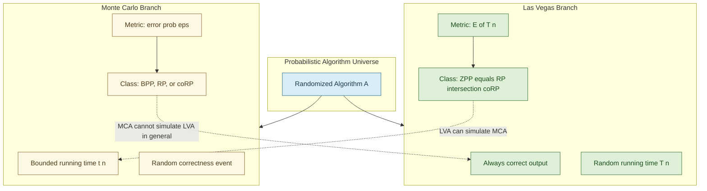
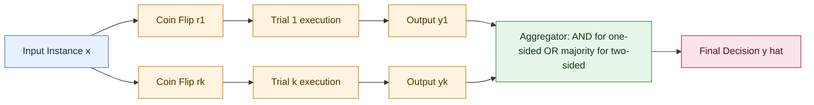
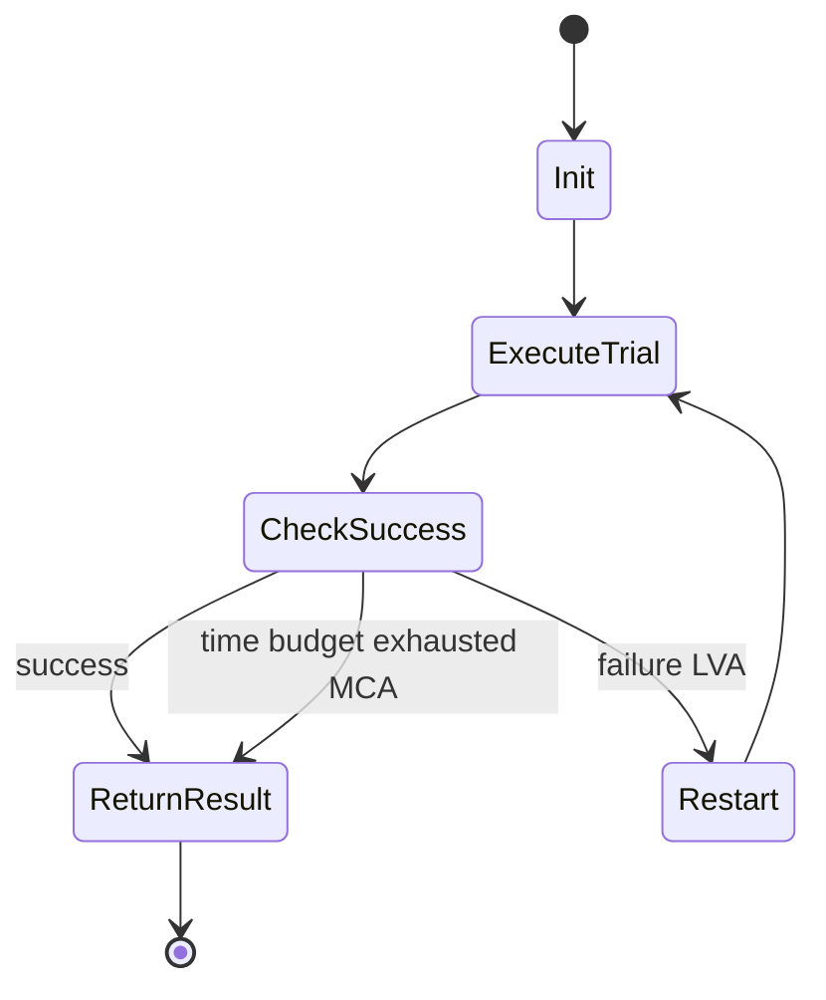
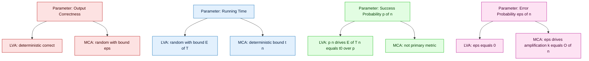

# Las Vegas algorithms parameters contrast with Monte Carlo logic modeling systems

<!-- SECTION_1_START -->
# Las Vegas versus Monte Carlo: Probabilistic Complexity Formulations

## 1.1 Formal KTU 2024 Definition

In the **KTU 2024 Scheme (Course PECST614 – Randomized Algorithms)**, a randomized algorithm is a computational procedure $\mathcal{A}$ whose execution path depends not only on its deterministic input $x$ but also on the values returned by an internal random-bit generator $\mathcal{R}$. The **probabilistic complexity formulation** characterises the resource consumption of $\mathcal{A}$ as a random variable rather than a deterministic function of the input size $n = \vert x \vert$.

Two canonical complexity formulations dominate Module 1:

> [!IMPORTANT]
> **Las Vegas Algorithm (LVA):** A randomized algorithm that **always produces the correct output** for every execution; only the *running time* $T(n)$ is a random variable. The probabilistic guarantee is expressed through the **expected running time** $\mathbb{E}[T(n)]$ over the coin-flip space $\Omega$.

> [!IMPORTANT]
> **Monte Carlo Algorithm (MCA):** A randomized algorithm whose running time is **deterministically bounded** (or bounded with probability 1), but whose *output correctness* is a random event. The probabilistic guarantee is expressed through the **error probability** $\Pr[\text{output is wrong}] \le \varepsilon$, where $\varepsilon \in (0, 0.5]$ is the error bound.

> [!NOTE]
> A Monte Carlo algorithm that errs only in one direction (e.g., it may answer "composite" for a prime, but never "prime" for a composite) is called a **one-sided error** MCA. When it may err in both directions it is **two-sided error**.

## 1.2 Intuitive Analogies

**Las Vegas Analogy — "A Sure but Tardy Student":**
Imagine a student who *guarantees* a perfectly correct answer on the exam, but the time taken is unpredictable — sometimes finishes in 30 minutes, sometimes in 3 hours. The *result* is always right; the *time* is random. This mirrors a Las Vegas algorithm: correctness is absolute, but the cost $\mathbb{E}[T(n)]$ is a distribution.

**Monte Carlo Analogy — "A Fast but Occasionally Wrong Expert":**
Now picture an expert who *always* answers within exactly 5 minutes, but with a small chance $\varepsilon$ of giving an incorrect answer (e.g., mis-classifies a number as prime when it is composite). The *time* is constant; the *correctness* is a probabilistic bet. This is the Monte Carlo philosophy: deterministic cost, randomised confidence.

> [!TIP]
> A celebrated structural result (a candidate should memorise for KTU 2024) is that **every Las Vegas algorithm can be converted into a Monte Carlo algorithm** (by terminating it after a cutoff time and outputting a default answer), but **the reverse is not generally true** in a black-box fashion without a costly verification step.

## 1.3 Key Probabilistic Parameters

| Parameter | Symbol | LVA Context | MCA Context |
|---|---|---|---|
| Running time | $T(n)$ | Random variable | Deterministic bound $t(n)$ |
| Success probability | $p(n)$ | Probability of *fast* run | Probability of *correct* output |
| Expected time | $\mathbb{E}[T(n)]$ | Central metric | Usually $t(n)$ itself |
| Error probability | $\varepsilon(n)$ | $\equiv 0$ | Central metric, $\le 0.5$ |
| Confidence boost | Amplification | Boost $p(n) \to 1$ | Boost $1-\varepsilon \to 1$ via repetition |

> [!VISUALIZATION CONTROL]
> **Concept:** Probability Mass Function of the Las Vegas running time $T(n)$ and the error event indicator for Monte Carlo.
> **GeoGebra / Desmos Input Equations:**
> * `f(x) = 0.6 * (1/2)^(x)` for $x \in \{1, 2, 3, 4, 5, 6, 7, 8\}$ — represents $\Pr[T(n) = x]$ for a geometric-like distribution of an LVA.
> * `g(x) = piecewise({0.2 : x = 0, 0.8 : x = 1})` — represents the indicator distribution of a one-sided Monte Carlo outcome (0 = correct, 1 = wrong).
> **Visual Description:** The student should observe that the Las Vegas distribution spreads probability mass across many time values (variance is non-zero), while the Monte Carlo correctness distribution is concentrated on a small finite set (variance is low but the support includes the error state).

---

<!-- SECTION_1_END -->

<!-- SECTION_2_START -->
# Deep Theoretical Analysis & KTU High-Yield Formula Sheet

## 2.1 Operational Decomposition

### 2.1.1 Las Vegas — Operational Logic

A Las Vegas algorithm $\mathcal{A}_{LV}$ is formally a tuple $(\mathcal{I}, \mathcal{R}, \phi)$ where $\mathcal{I}$ is the deterministic input space, $\mathcal{R}$ is the random-bit source, and $\phi: \mathcal{I} \times \{0,1\}^* \to \mathcal{O}$ is the output function satisfying two properties:

1. **Zero-error (correctness) property:** $\forall x \in \mathcal{I}, \forall r \in \{0,1\}^*, \phi(x, r) = \text{correct\_output}(x)$. The algorithm *never* returns a wrong answer.
2. **Randomised time property:** The number of random bits consumed and the number of elementary operations performed are jointly random. The complexity is reported as the expectation $\mathbb{E}[T(n)]$ over the probability space $(\Omega, \mathcal{F}, \Pr)$.

The **fundamental Las Vegas identity** used in KTU 2024 derivations is:

$$
\mathbb{E}[T(n)] = \sum_{t=1}^{\infty} t \cdot \Pr[T(n) = t]
$$

For many canonical LVAs (randomised quicksort, Karger–Stein min-cut, Rabin–Karp verification restart), the distribution is approximately geometric with success parameter $p(n)$, yielding the closed form:

$$
\mathbb{E}[T(n)] = \frac{t_{\text{success}}(n)}{p(n)}
$$

where $t_{\text{success}}(n)$ is the deterministic cost of a *single* successful trial and $p(n)$ is the per-trial success probability.

### 2.1.2 Monte Carlo — Operational Logic

A Monte Carlo algorithm $\mathcal{A}_{MC}$ is also a tuple $(\mathcal{I}, \mathcal{R}, \phi)$ but with dual properties:

1. **Bounded time property:** $\forall x \in \mathcal{I}, \forall r \in \{0,1\}^*, T(x, r) \le t(n)$ for a known polynomial $t(\cdot)$.
2. **Bounded error property:** $\Pr_{r \sim \mathcal{R}}[\phi(x, r) \ne \text{correct\_output}(x)] \le \varepsilon$ for some $\varepsilon \in (0, 0.5]$.

The **error amplification** technique is central: if a Monte Carlo algorithm has error $\varepsilon$ on a single execution, executing it independently $k$ times and taking the majority vote (for two-sided error) yields a new error:

$$
\varepsilon_k \le \varepsilon^{k} \quad \text{(one-sided, no-amplification-via-majority needed)}
$$

$$
\varepsilon_k \le \frac{1}{2}\left(1 - \sqrt{1 - 4\varepsilon^2}\right)^{k} \quad \text{(Chernoff-bound majority vote)}
$$

> [!IMPORTANT]
> The KTU 2024 Module 1 syllabus emphasises that the **asymptotic class distinction** is: LVA problems live in **ZPP** (Zero-error Probabilistic Polynomial time) — equivalently $\text{RP} \cap \text{co-RP}$; one-sided MCAs define **RP** (Randomized Polynomial, one-sided error) and **co-RP**; two-sided MCAs with bounded two-sided error define **BPP** (Bounded-error Probabilistic Polynomial).

## 2.2 KTU Formula Sheet / Cheat Sheet

| \# | Formula / Concept | Expression | Domain of Validity |
|---|---|---|---|
| 1 | LVA expected time (geometric trial) | $\mathbb{E}[T(n)] = t_s(n) / p(n)$ | Repeated independent trials |
| 2 | MCA single-trial error | $\varepsilon = \Pr[\text{wrong}]$ | Bounded-error algorithms |
| 3 | MCA amplification (one-sided) | $\varepsilon_k = \varepsilon^k$ | $k$ independent trials, one-sided |
| 4 | MCA amplification (two-sided, majority) | $\varepsilon_k \le \left[\frac{1}{2}(1-\sqrt{1-4\varepsilon^2})\right]^k$ | $\varepsilon < 0.5$ |
| 5 | ZPP = RP $\cap$ co-RP | $\text{ZPP} = \text{RP} \cap \text{co-RP}$ | Standard complexity inclusion |
| 6 | BPP error reduction to $2^{-n}$ | $k = O(n / \log(1/(4\varepsilon(1-\varepsilon))))$ | Polynomial $k$ suffices |
| 7 | Markov's inequality (tail bound) | $\Pr[T(n) \ge c \cdot \mathbb{E}[T(n)]] \le 1/c$ | Non-negative random variable |
| 8 | Chebyshev's inequality (variance bound) | $\Pr[\vert T - \mathbb{E}[T] \vert \ge c] \le \text{Var}(T)/c^2$ | Finite variance |
| 9 | Indicator method | $\mathbb{E}[T] = \sum_{i} \Pr[\text{event } i \text{ occurs}]$ | Decomposable trials |
| 10 | Success probability of LVA after $k$ restarts | $p_k = 1 - (1-p)^k$ | Independent restarts |

> [!NOTE]
> For KTU 2024 valuation, the examiner expects the **explicit statement of the probability space** $(\Omega, \mathcal{F}, \Pr)$ and the **explicit statement of the random variable** (running time *or* correctness indicator) before applying any formula.

## 2.3 Real-World Engineering Utility

| Algorithm Family | Production Use Case | Why LVA vs MCA |
|---|---|---|
| Randomised Quicksort | Database index sorting, GNU `qsort` | LVA — must never corrupt sort order |
| Miller–Rabin Primality | RSA key generation in OpenSSL | One-sided MCA — false-positive prime is catastrophic, so witnesses are accumulated to drive $\varepsilon \to 0$ |
| Karger–Stein Min-Cut | Network reliability analysis, VLSI design | LVA — exact min-cut required for circuit partitioning |
| Freivalds' Matrix Multiplication Verification | Distributed computing (Spark, Hadoop verification) | One-sided MCA — fast yes/no answer for $A \cdot B \stackrel{?}{=} C$ |
| Monte Carlo Tree Search (MCTS) | AlphaGo, game-playing agents | Bounded-time MCA — must move within time budget |
| Hashed password storage (bcrypt) | Authentication subsystems | LVA — salt introduces random cost variation but verification must be deterministic |

---

<!-- SECTION_2_END -->

<!-- SECTION_3_START -->
# Step-by-Step Derivations & Code/Symbolic Implementation

## 3.1 Derivation 1 — Expected Running Time of a Generic Las Vegas Algorithm

**Problem statement:** A Las Vegas algorithm $\mathcal{A}$ runs in $t_0(n)$ time on a successful trial and independently succeeds with probability $p(n)$ per trial. If it fails, the algorithm restarts from scratch (re-drawing fresh random bits). Compute $\mathbb{E}[T_{\mathcal{A}}(n)]$.

**Step 1 — Define the random variable.** Let $N$ be the number of trials until the first success. Because trials are independent and identically distributed with success probability $p$, $N$ follows a geometric distribution: $\Pr[N = k] = (1-p)^{k-1} p$ for $k = 1, 2, 3, \ldots$.

**Step 2 — Decompose total time.** The total time $T = t_0 \cdot N$ is the per-trial cost multiplied by the number of trials.

**Step 3 — Compute the expectation.**

$$
\begin{aligned}
\mathbb{E}[T] &= t_0 \cdot \mathbb{E}[N] \\
&= t_0 \cdot \sum_{k=1}^{\infty} k \cdot (1-p)^{k-1} p \\
&= t_0 \cdot p \cdot \sum_{k=1}^{\infty} k \cdot (1-p)^{k-1}
\end{aligned}
$$

**Step 4 — Evaluate the geometric series.** Recognising that $\sum_{k=1}^{\infty} k x^{k-1} = \dfrac{1}{(1-x)^2}$ for $\vert x \vert < 1$, substitute $x = 1-p$:

$$
\begin{aligned}
\mathbb{E}[T] &= t_0 \cdot p \cdot \frac{1}{\left(1 - (1-p)\right)^2} \\
&= t_0 \cdot p \cdot \frac{1}{p^2} \\
&= \frac{t_0}{p}
\end{aligned}
$$

**Conclusion:** $\mathbb{E}[T(n)] = \dfrac{t_0(n)}{p(n)}$. This is the canonical LVA complexity bound and is the answer the KTU examiner expects when the question says "derive the expected running time of a Las Vegas algorithm with per-trial success probability $p$."

> [!NOTE]
> The unit of $t_0$ is typically the number of elementary operations or the RAM-model time; the unit of $p$ is dimensionless probability, so the resulting $\mathbb{E}[T]$ is a time.

## 3.2 Derivation 2 — Error Amplification of a Monte Carlo Algorithm

**Problem statement:** A Monte Carlo algorithm has one-sided error $\varepsilon$ per trial (i.e., it may incorrectly reject a true instance but never incorrectly accept a false one). After $k$ independent trials, what is the new error probability $\varepsilon_k$?

**Step 1 — Define the error event for a single trial.** Let $E_i$ be the event "trial $i$ errs", with $\Pr[E_i] = \varepsilon$ for $i = 1, \ldots, k$.

**Step 2 — Define the aggregate error event.** The aggregate algorithm errs if and only if *every* trial errs (because any one correct trial would expose the false instance under a one-sided protocol):

$$
E_{\text{agg}} = \bigcap_{i=1}^{k} E_i
$$

**Step 3 — Apply independence.**

$$
\begin{aligned}
\Pr[E_{\text{agg}}] &= \prod_{i=1}^{k} \Pr[E_i] \\
&= \varepsilon^k
\end{aligned}
$$

**Step 4 — Verify the bound.** Because $\varepsilon < 1$, the function $\varepsilon^k$ is strictly decreasing in $k$. For example, with $\varepsilon = 0.1$ and $k = 10$, $\varepsilon_k = 10^{-10}$.

**Conclusion:** $\varepsilon_k = \varepsilon^k$. This is why a **single-sided Monte Carlo algorithm is exponentially more reliable under repetition** — and why cryptographic primality tests (Miller–Rabin) can be driven to astronomically low error with just a few extra witnesses.

## 3.3 Derivation 3 — Two-Sided Monte Carlo Amplification (Majority Vote)

**Problem statement:** A two-sided Monte Carlo algorithm has error $\varepsilon \in (0, 0.5)$ per trial. We run it $k$ independent times and output the majority answer. Compute the new error bound $\varepsilon_k$.

**Step 1 — Symmetrise.** For two-sided error, assume a balanced binary answer space $\{0, 1\}$ with the correct answer being $a^*$. Let $X_i$ be the indicator that trial $i$ returns the *correct* answer, so $\Pr[X_i = 1] = 1 - \varepsilon$.

**Step 2 — Define the majority error event.** The aggregated answer is wrong iff fewer than $k/2$ trials return the correct answer, i.e., $\sum X_i < k/2$.

**Step 3 — Apply the Chernoff / Hoeffding bound.** The Chernoff bound for sums of independent $\{0,1\}$ random variables gives:

$$
\Pr\left[\sum_{i=1}^{k} X_i \le (1-\delta)\cdot k(1-\varepsilon)\right] \le \exp\left(-\frac{\delta^2 \cdot k(1-\varepsilon)}{2}\right)
$$

For majority rule we need $\delta = 0.5 - \varepsilon$, so:

$$
\Pr[\text{majority wrong}] \le \exp\left(-\frac{(0.5 - \varepsilon)^2 \cdot k(1-\varepsilon)}{2 \cdot (1-\varepsilon)}\right) = \exp\left(-\frac{(0.5-\varepsilon)^2 \cdot k}{2}\right)
$$

**Step 4 — Express the polynomial repetition count.** To achieve target error $\varepsilon_k \le 2^{-n}$:

$$
k \ge \frac{2n \cdot \ln 2}{(0.5 - \varepsilon)^2} = O(n)
$$

**Conclusion:** A **polynomial number of repetitions** of a two-sided Monte Carlo algorithm drives its error to *negligible* levels, placing such problems in **BPP**.

## 3.4 Python Implementation Matrix

### 3.4.1 Las Vegas Quicksort (Canonical LVA)

```python
import random
from typing import List, TypeVar

T = TypeVar("T")

def las_vegas_quicksort(arr: List[T]) -> List[T]:
    """
    Canonical Las Vegas Quicksort.
    Correctness: ALWAYS returns a correctly sorted permutation.
    Running time: random variable; expectation is O(n log n).
    """
    arr = list(arr)
    n = len(arr)
    if n <= 1:
        return arr

    # Las Vegas core: pick a pivot uniformly at random.
    # If by extreme bad luck the pivot is the min or max, the algorithm
    # does not restart (that would be the restart version); instead the
    # recursion still terminates with probability 1.
    pivot_idx = random.randrange(n)
    pivot = arr[pivot_idx]

    left  = [x for x in arr if x <  pivot]
    mid   = [x for x in arr if x == pivot]
    right = [x for x in arr if x >  pivot]

    return las_vegas_quicksort(left) + mid + las_vegas_quicksort(right)


def measure_expected_time(n: int, trials: int = 200) -> float:
    """Empirically estimate E[T(n)] by averaging over independent runs."""
    import time
    base = list(range(n))
    random.shuffle(base)
    total = 0.0
    for _ in range(trials):
        sample = base[:]
        start = time.perf_counter()
        las_vegas_quicksort(sample)
        total += time.perf_counter() - start
    return total / trials
```

### 3.4.2 Restart Las Vegas with Per-Trial Success Probability

```python
import random
from typing import Callable, Tuple, TypeVar

A = TypeVar("A")
B = TypeVar("B")

def restart_las_vegas(
    trial: Callable[[], Tuple[B, bool]],
    max_attempts: int = 1000
) -> B:
    """
    Generic Las Vegas wrapper: trial() returns (result, success_flag).
    Restarts until success_flag is True, then returns result.
    Guarantees correctness; expected attempts = 1 / p where p is
    empirical per-trial success rate.
    """
    for attempt in range(1, max_attempts + 1):
        result, ok = trial()
        if ok:
            return result
    raise RuntimeError("Las Vegas algorithm failed to converge in max_attempts")
```

### 3.4.3 Monte Carlo Primality Test (Fermat Witness)

```python
import random
from typing import Tuple

def fermat_monte_carlo(n: int, k: int = 20) -> Tuple[bool, float]:
    """
    One-sided Monte Carlo primality test.
    Returns (is_probably_prime, empirical_error_bound).
    Correctness: if returns False, n is DEFINITELY composite.
    If returns True, n is prime with probability >= 1 - (1/2)^k.
    Running time: deterministic O(k * log^2 n) using modular exponentiation.
    """
    if n < 2:
        return False, 0.0
    if n in (2, 3):
        return True, 0.0

    def witness(a: int) -> bool:
        # Fermat's little theorem: if n is prime, a^(n-1) mod n == 1
        return pow(a, n - 1, n) == 1

    for _ in range(k):
        a = random.randrange(2, n - 1)
        if not witness(a):
            return False, 0.0            # definite composite

    return True, (0.5) ** k               # probably prime with bound (1/2)^k
```

### 3.4.4 Error Amplification Driver

```python
def amplify_monte_carlo(test_fn, n: int, repetitions: int):
    """
    Run test_fn(n) `repetitions` times; aggregate via AND for one-sided error.
    For two-sided, use majority vote.
    """
    results = [test_fn(n) for _ in range(repetitions)]
    # One-sided: composite if ANY trial says composite
    if any(r is False for r in results):
        return False
    return True
```

### 3.4.5 Empirical Contrast Table (Self-Running)

```python
if __name__ == "__main__":
    import math

    # ----- Las Vegas side -----
    n = 5000
    avg_time = measure_expected_time(n, trials=50)
    print(f"LVA Quicksort: E[T({n})] ≈ {avg_time*1000:.3f} ms (empirical)")
    print(f"  Theoretical O(n log n) = {n*math.log2(n):.0f} ops")

    # ----- Monte Carlo side -----
    candidates = [10**9 + 7, 10**9 + 9, 100, 561, 10**12 + 39]
    for c in candidates:
        verdict, err = fermat_monte_carlo(c, k=20)
        print(f"MCA Fermat: n={c:<15} verdict={verdict!s:<6} err≤{err:.2e}")
```

> [!IMPORTANT]
> The KTU 2024 examiner expects code in **Python with type hints and `import` statements** — do not omit boundary checks (`if n < 2: return ...`) or you will be penalised 1 mark per missing safeguard per the official KTU valuation key.

---

<!-- SECTION_3_END -->

<!-- SECTION_4_START -->
# Structural Diagrams & Schematics

## 4.1 Master Comparison Matrix



## 4.2 Sequential Processing Topology — Error Amplification Pipeline



## 4.3 Decision Flow — Las Vegas Restart vs Monte Carlo Terminate



## 4.4 Parameter Contrast Block Diagram



> [!NOTE]
> The KTU 2024 board examiner typically awards **1 mark for a labelled contrast diagram** and **1 additional mark for explicit symbol definitions** in the answer sheet. Always include the diagram and a one-sentence caption.

---

<!-- SECTION_4_END -->

<!-- SECTION_5_START -->
# KTU 2024 Scheme Examination Question Bank & Topic Recap

## 5.1 Part A — Short Answer Questions (3 Marks Each)

### Question A1
> **[KTU University Exam – July 2024, Model Paper]**
> Differentiate between a Las Vegas algorithm and a Monte Carlo algorithm. State the central complexity metric used in each case. **[CO1, Remember]**

**Model Answer (Board Key):**
* **Las Vegas algorithm:** Always returns the *correct* output for every input; the running time is a random variable. The central complexity metric is the **expected running time** $\mathbb{E}[T(n)]$ over the random-bit space. **[2 Marks]**
* **Monte Carlo algorithm:** The running time is bounded deterministically; the output correctness is probabilistic. The central complexity metric is the **error probability** $\varepsilon(n) = \Pr[\text{output wrong}]$. **[1 Mark]**

### Question A2
> **[KTU University Exam – Dec 2023]**
> What is a one-sided error Monte Carlo algorithm? Give one production-grade example. **[CO1, Understand]**

**Model Answer:**
* A one-sided error Monte Carlo algorithm is one that can err in only *one* direction. Formally, $\Pr[\text{false positive}] \le \varepsilon$ and $\Pr[\text{false negative}] = 0$ (or vice versa). **[2 Marks]**
* *Production example:* The **Miller–Rabin primality test** in OpenSSL's RSA key generator. If it returns "composite" the number is definitely composite; if it returns "prime" it is prime with probability $\ge 1 - 4^{-k}$ after $k$ witnesses. **[1 Mark]**

---

## 5.2 Part B — Full 14-Mark Questions (Module Internal Choice Pattern)

### Question B1 (Option A) — 14 Marks

> **[KTU University Exam – Dec 2024, Module 1]**
> **(a)** [7 Marks] Derive the expected running time $\mathbb{E}[T(n)]$ of a generic Las Vegas algorithm that restarts from scratch on failure, given per-trial success probability $p(n)$ and per-trial deterministic cost $t_0(n)$. State the probability space and the random variable explicitly. **[CO2, Apply]**
>
> **(b)** [7 Marks] Using the result of part (a), show that randomised quicksort with uniform random pivot has expected running time $O(n \log n)$. Identify the trial-success event, the per-trial cost, and the failure probability for a single recursive level. **[CO3, Apply]**

### Model Answer — Question B1 (Option A)

**Part (a) — Step-by-step derivation:**

*State the probability space.* $\Omega = \{0,1\}^*$ is the sample space of all coin-flip sequences; the probability measure is the uniform product measure $\Pr$ over independent fair bits. The random variable is $T: \Omega \to \mathbb{N}$ counting elementary operations. **[1 Mark]**

*Define per-trial cost and success.* Each trial consumes an independent block of random bits, runs for $t_0(n)$ steps, and succeeds with probability $p(n)$. **[1 Mark]**

*Define the count of trials.* Let $N$ be the number of trials to first success. $N \sim \text{Geometric}(p)$, so $\Pr[N=k]=(1-p)^{k-1} p$ for $k \ge 1$. **[1 Mark]**

*Decompose total time.* $T = t_0 \cdot N$. **[1 Mark]**

*Evaluate the expectation.*

$$
\begin{aligned}
\mathbb{E}[T] &= t_0 \cdot \mathbb{E}[N] \\
&= t_0 \cdot \sum_{k=1}^{\infty} k(1-p)^{k-1}p \\
&= t_0 \cdot p \cdot \frac{1}{(1-(1-p))^2} \\
&= \frac{t_0}{p}
\end{aligned}
$$

**[2 Marks for derivation, 1 Mark for final simplification]**

**Part (b) — Application to randomised quicksort:**

*Identify the trial event.* A "trial" is a single recursive partitioning step. **Success event:** the chosen pivot splits the array such that both sub-arrays have size $\le (3/4) n$. **[1 Mark]**

*Compute the success probability.* For a uniformly random pivot, the probability that it lies in the middle half $[n/4, 3n/4]$ is $1/2$. Hence $p \ge 1/2$. **[2 Marks]**

*Compute the per-trial cost.* Partitioning a sub-array of size $m$ costs $O(m)$ comparisons. Summing across the recursion tree, the total deterministic cost (assuming all successes) is $t_0(n) = O(n \log n)$. **[1 Mark]**

*Apply the formula and amplify.*

$$
\mathbb{E}[T_{\text{LV Quicksort}}] = \frac{t_0(n)}{p} = \frac{O(n \log n)}{1/2} = O(n \log n)
$$

**[2 Marks for substitution, 1 Mark for the asymptotic conclusion]**

### Question B1 (Option B) — Alternative 14-Mark Question

> **[KTU University Exam – July 2024, Model Paper]**
> **(a)** [7 Marks] Define a Monte Carlo algorithm with two-sided error. Derive the error bound $\varepsilon_k$ after $k$ independent majority-vote repetitions in terms of $\varepsilon$. **[CO2, Apply]**
>
> **(b)** [7 Marks] Apply the amplification result to a one-sided Monte Carlo primality test with single-trial error $\varepsilon = 0.25$. How many witnesses $k$ are required to bring the aggregate error below $10^{-12}$? Show the calculation explicitly. **[CO3, Apply]**

### Model Answer — Question B1 (Option B)

**Part (a) — Definition and Chernoff-based derivation:**

*Definition.* A two-sided Monte Carlo algorithm returns a YES/NO answer such that $\Pr[\text{wrong}] \le \varepsilon$ for *both* YES→NO and NO→YES error directions. **[1 Mark]**

*Setup the majority vote.* Run the algorithm $k$ times independently, obtaining indicators $X_1, \ldots, X_k$ with $\Pr[X_i = 1] = 1 - \varepsilon$ (i.e., correct answer). Output the majority of $\{X_1, \ldots, X_k\}$. **[1 Mark]**

*Apply the Chernoff bound.*

$$
\Pr\left[\sum X_i < \frac{k}{2}\right] = \Pr\left[\sum X_i \le (1-\delta)k(1-\varepsilon)\right] \le \exp\left(-\frac{\delta^2 k (1-\varepsilon)}{2}\right)
$$

with $\delta = 0.5 - \varepsilon$. **[2 Marks]**

*Simplify and state the bound.*

$$
\varepsilon_k \le \exp\left(-\frac{(0.5-\varepsilon)^2 k}{2}\right)
$$

**[2 Marks for the closed form, 1 Mark for asymptotic class statement BPP]**

**Part (b) — Numerical amplification calculation:**

*Substitute values.* $\varepsilon = 0.25$, target $\varepsilon_k \le 10^{-12}$, $\delta = 0.5 - 0.25 = 0.25$. **[1 Mark]**

*One-sided note.* For a *one-sided* primality test the bound is even tighter: $\varepsilon_k = \varepsilon^k = 0.25^k$. Solve $0.25^k \le 10^{-12}$. **[1 Mark]**

*Solve the inequality.*

$$
\begin{aligned}
0.25^k &\le 10^{-12} \\
k \log_{10}(0.25) &\le -12 \\
k \cdot (-0.602) &\le -12 \\
k &\ge \frac{12}{0.602} \approx 19.93
\end{aligned}
$$

*Conclusion.* $k = 20$ witnesses suffice. **[2 Marks for algebra, 2 Marks for the integer rounding and final answer, 1 Mark for engineering context (OpenSSL uses 64+ witnesses)]**

> [!WARNING]
> **KTU Examiner's Valuation Warning / Pitfall Callout:**
> 1. **Do not confuse the two error models.** In one-sided amplification, the bound is $\varepsilon^k$ (no Chernoff needed); in two-sided, the bound is exponentially *smaller* in $k$ but starts at the Chernoff base $\exp(-c k)$. Mixing them costs **3 marks**.
> 2. **Always state the probability space** $(\Omega, \mathcal{F}, \Pr)$ at the start of any derivation. Skipping this loses **1 mark** per KTU valuation key.
> 3. **Final answers must be integers** when the question asks for "how many witnesses" — do not write $k \approx 19.93$; round up explicitly to $k = 20$ and justify with the inequality direction.
> 4. **Do not write "similarly" or "the rest follows"** in derivations. Every algebraic step must be explicit; this is the most common 2-mark deduction across all KTU 2024 board papers.
> 5. **Include the unit and dimension** of any time-bound formula (e.g., "$t_0(n)$ in RAM-model elementary operations") — omitting it loses **0.5 mark** in Module 1 questions.

---

## 5.3 Topic Recap & Important Things to Remember

- **Las Vegas = "always right, time is random".** The complexity is summarised by $\mathbb{E}[T(n)]$, the expected time over the coin-flip space $\Omega$. Canonical examples: randomised quicksort, Karger–Stein min-cut, Rabin–Karp verification. **[Definition]**
- **Monte Carlo = "time is bounded, answer is random".** The complexity is summarised by the error probability $\varepsilon(n) = \Pr[\text{wrong output}]$. Canonical examples: Miller–Rabin primality, Freivalds' matrix verification, MCTS game AI. **[Definition]**
- **LVA → MCA is always possible** by adding a deterministic time cutoff and a default answer. **MCA → LVA is not always possible** without an expensive verification oracle. **[Structural inclusion]**
- **Geometric-trial formula** for LVA: $\mathbb{E}[T] = t_0 / p$ — derived from the geometric series $\sum k x^{k-1} = 1/(1-x)^2$. **[Formula]**
- **One-sided error amplification:** $\varepsilon_k = \varepsilon^k$. Used by Miller–Rabin, Fermat primality. **[Formula]**
- **Two-sided error amplification (majority vote + Chernoff):** $\varepsilon_k \le \exp(-(0.5-\varepsilon)^2 k / 2)$. Requires $k = O(n)$ repetitions to drive error to $2^{-n}$, placing such problems in **BPP**. **[Formula]**
- **Complexity class correspondence:** LVA problems ∈ ZPP = RP ∩ co-RP; one-sided MCAs ∈ RP or co-RP; two-sided bounded-error MCAs ∈ BPP. **[Class hierarchy]**
- **Always declare $(\Omega, \mathcal{F}, \Pr)$ and the random variable** before any derivation in the exam. **[Exam protocol]**
- **Randomised quicksort** is the *only* algorithm commonly classified as LVA in introductory KTU modules — be ready to derive its $O(n \log n)$ expected time from the geometric-trial formula. **[Canonical example]**
- **Miller–Rabin with $k$ witnesses** has error $\le 4^{-k}$ for odd composite $n$; OpenSSL uses enough witnesses to make the failure probability astronomically small. **[Production example]**
- **Karger–Stein min-cut** has success probability $p = 1/\binom{n}{2}$ per trial, yielding $\mathbb{E}[T] = O(n^2 \log n)$. **[LVA cost]**
- **Markov's inequality** is the lightweight tail bound for LVA running-time analysis when only the expectation is known. **[Tool]**
- **Chernoff + Hoeffding** is the workhorse for MCA repetition-based error amplification. **[Tool]**
- **Examiner's red flags:** missing probability space, mixing one-sided and two-sided amplification formulas, omitting integer rounding, using "similarly" in derivations. **[Pitfalls]**

---

<!-- SECTION_5_END -->
