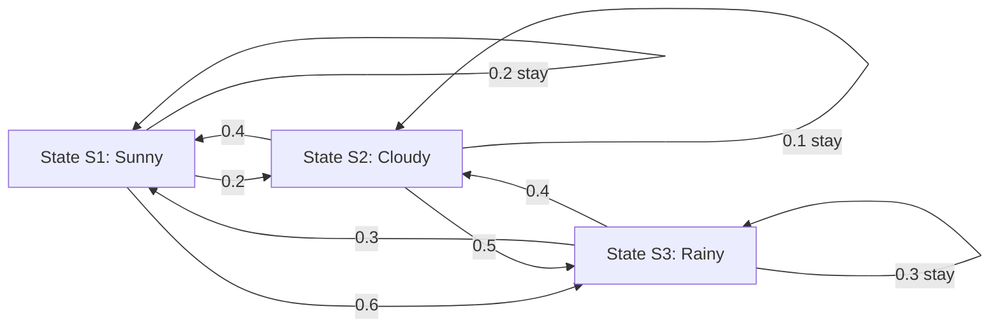
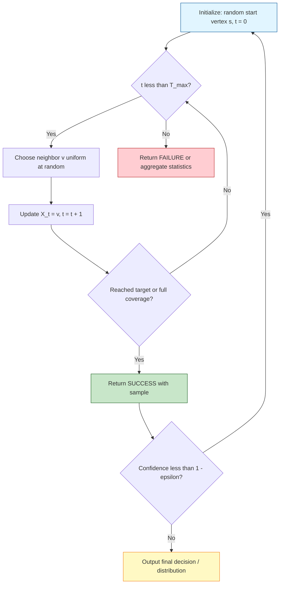
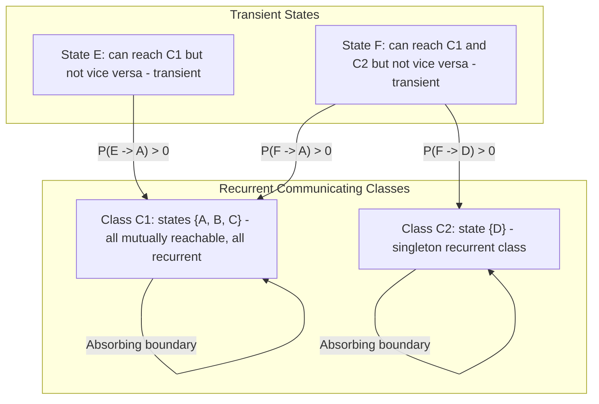
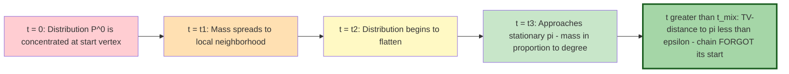
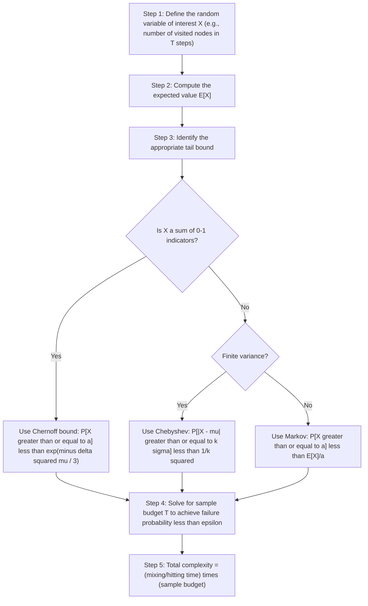

# Markov chain definitions random traversal patterns processing algorithms templates

<!-- SECTION_1_START -->

# Module 2 — Random Walks & Tail Bounds
## Topic: Markov Chain Definitions, Random Traversal Patterns & Processing Algorithm Templates

> [!IMPORTANT]
> **KTU 2024 Scheme | PECST614 — Randomized Algorithms | Module 2 Anchor Concept**
> This topic forms the **conceptual backbone** of randomized algorithm design. Markov chains supply the *state machine*; random walks supply the *exploration engine*; tail bounds supply the *probabilistic guarantee*. Mastering the definitions in this module unlocks the design of Las Vegas / Monte Carlo algorithms for graph connectivity, 2-SAT, PageRank, and Markov Chain Monte Carlo (MCMC).

---

### 1.1 Formal Definition — Markov Chain

A **Markov chain** is a discrete-time stochastic process $(X_0, X_1, X_2, \ldots)$ defined over a finite or countable state space $\Omega$ that satisfies the **Markov property** (memoryless property):

$$
\Pr[X_{t+1} = j \mid X_t = i, X_{t-1} = i_{t-1}, \ldots, X_0 = i_0] = \Pr[X_{t+1} = j \mid X_t = i] = P(i,j)
$$

The function $P : \Omega \times \Omega \to [0,1]$ is the **transition probability function**, and the matrix $P = (P(i,j))_{i,j \in \Omega}$ is the **transition matrix**, which must satisfy two axioms:

$$
\begin{aligned}
\text{(Row Stochasticity)} \quad & \sum_{j \in \Omega} P(i,j) = 1 \quad \forall\, i \in \Omega \\
\text{(Non-Negativity)} \quad & P(i,j) \ge 0 \quad \forall\, i,j \in \Omega
\end{aligned}
$$

> [!NOTE]
> **Syllabus Highlight:** In KTU 2024 Scheme Randomized Algorithms (PECST614), the Markov chain is introduced as the *fundamental state machine* underlying all randomized traversal algorithms. The course outcome **CO2 — "Apply probabilistic tools to design randomized algorithms"** is directly tested through Markov chain transition problems.

### 1.2 Intuition — The Drunkard's Walk on a Map

Imagine a **drunk person** standing at a road intersection. At every minute (a *time step*), the drunk picks **one of the roads** leaving the current intersection **uniformly at random** and staggers to the next intersection. The drunk **does not remember** the path taken — only the *current* intersection matters for the next step.

> [!TIP]
> **Conceptual Analogy — "Memoryless Walker on a Graph"**
> - **The Graph $G = (V, E)$** is the city map (the state space $\Omega = V$).
> - **The Vertex** is the drunk's current location (the state $X_t$).
> - **The Edge** is the road available (the transition $P(i,j)$).
> - **The Sequence** $X_0 \to X_1 \to X_2 \to \cdots$ is the drunkard's *random walk*.
> - The **Markov property** says: *"Where the drunk goes next depends only on where he is now, not on how he got there."* This single sentence encapsulates the entire theory.

### 1.3 Visualization Control Block

> [!VISUALIZATION CONTROL]
> **Concept:** A 4-vertex random walk on a path graph $P_4$ with self-loop absorption.
> **GeoGebra / Desmos Input Equations:**
> - Vertices: $V = \{(0,0), (1,0), (2,0), (3,0)\}$ representing states $A, B, C, D$.
> - Transition matrix rows plot as bar charts: $P = \begin{pmatrix} 0.5 & 0.5 & 0 & 0 \\ 0.25 & 0.5 & 0.25 & 0 \\ 0 & 0.25 & 0.5 & 0.25 \\ 0 & 0 & 0.5 & 0.5 \end{pmatrix}$.
> **Visual Description:** The student should observe a *symmetric* transition matrix where the diagonal is dominant (self-loops weight $0.5$), and probability mass **diffuses outward** like heat from a central point. This is the geometric intuition behind *mixing* — probability mass "smooths out" over time.

### 1.4 Random Walk — Formal Definition on Graphs

Given an undirected graph $G = (V,E)$ with $|V| = n$ and $|E| = m$, the **simple random walk** on $G$ is the Markov chain $(X_t)_{t \ge 0}$ with state space $\Omega = V$ and transition probabilities:

$$
P(u,v) = \begin{cases} \frac{1}{\deg(u)} & \text{if } (u,v) \in E \\ 0 & \text{otherwise} \end{cases}
$$

At each step, the walk selects a **uniform random neighbor** of the current vertex.

> [!NOTE]
> **Key Random Traversal Patterns Studied in PECST614:**
> 1. **Simple Random Walk** — uniform neighbor selection.
> 2. **Lazy Random Walk** — with probability $\tfrac{1}{2}$ stay at the current vertex; otherwise move to a uniform neighbor. This eliminates periodicity and guarantees convergence.
> 3. **Biased Random Walk** — transition probability proportional to a weight function $w(u,v)$, used in personalized PageRank.
> 4. **Random Walk on Weighted Graphs** — $P(u,v) = w(u,v)/\sum_{z \sim u} w(u,z)$.

<!-- SECTION_1_END -->

<!-- SECTION_2_START -->

# 2. Deep Theoretical Analysis & KTU High-Yield Formula Sheet

## 2.1 Anatomy of a Markov Chain — Structural Decomposition

A finite Markov chain decomposes its state space $\Omega$ into three disjoint structural classes:

| Class | Definition | Reachability Property | Recurrence Property |
|---|---|---|---|
| **Communicating Class** | A maximal set $C$ where every pair $(i,j)$ satisfies $i \leftrightarrow j$ (mutually reachable) | Closed under $P^k$ transitions | — |
| **Recurrent State** | A state $i$ such that $\Pr[\text{return to } i \mid X_0 = i] = 1$ | Returns infinitely often a.s. | $\mathbb{E}[\text{return time}] < \infty$ |
| **Transient State** | A state $i$ such that $\Pr[\text{return to } i \mid X_0 = i] < 1$ | Probability of eventual return $< 1$ | $\mathbb{E}[\text{return time}] = \infty$ |
| **Periodic State** | Period $d = \gcd\{k \ge 1 : P^k(i,i) > 0\}$ | Returns only at multiples of $d$ | — |
| **Aperiodic State** | Period $d = 1$ | Returns at every large $k$ | Guarantees convergence to $\pi$ |

> [!IMPORTANT]
> **The Fundamental Theorem of Markov Chains (FTMC):** A finite, irreducible, and aperiodic Markov chain is *ergodic* and possesses a **unique stationary distribution** $\pi$ satisfying $\pi P = \pi$.

## 2.2 Stationary Distribution — The "Long-Run Occupancy" Principle

The **stationary distribution** $\pi$ is a row vector satisfying two simultaneous conditions:

$$
\begin{aligned}
\pi P &= \pi \quad \text{(steady-state invariance)} \\
\sum_{i \in \Omega} \pi_i &= 1 \quad \text{(probability normalization)}
\end{aligned}
$$

For an **undirected graph** random walk, the stationary distribution has a beautiful closed form:

$$
\boxed{\pi(v) = \frac{\deg(v)}{2m}}
$$

> [!TIP]
> **Why This Formula Works — The Handshaking Insight**
> The expected number of times the walk visits $v$ in $T$ steps is $\pi(v) \cdot T$. Since the walk traverses each of the $\deg(v)$ incident edges approximately $T \cdot \pi(v) \cdot \frac{1}{\deg(v)}$ times (visits to $v$ times probability of choosing that edge), the total edge traversals equal $T \cdot \pi(v) \cdot \frac{\deg(v)}{\deg(v)} = T \cdot \pi(v)$. Summing $\pi(v)\deg(v) = 2m$ for all $v$ gives normalization.

## 2.3 Random Walk Quantities — Hitting Time, Commute Time, Cover Time, Mixing Time

These four quantities are the **heart** of Module 2 and appear in nearly every KTU Part B question.

| Quantity | Symbol | Definition | Engineering Interpretation |
|---|---|---|---|
| **Hitting Time** | $H_{uv}$ | $\mathbb{E}[\text{steps to first reach } v \text{ starting from } u]$ | Expected traversal latency between two nodes |
| **Commute Time** | $C_{uv}$ | $H_{uv} + H_{vu}$ | Expected round-trip time |
| **Cover Time** | $\text{Cov}(G)$ | $\mathbb{E}[\text{steps to visit every vertex at least once}]$ | Expected crawling duration of the entire web |
| **Mixing Time** | $t_{\text{mix}}(\epsilon)$ | $\min\{t : \max_x \lVert P^t(x, \cdot) - \pi \rVert_{\text{TV}} \le \epsilon\}$ | Time for the chain to "forget" its start |

> [!NOTE]
> **TV-Distance (Total Variation Distance):** $\lVert \mu - \nu \rVert_{\text{TV}} = \frac{1}{2}\sum_{x} \vert \mu(x) - \nu(x) \vert$. This measures the maximum difference in probabilities of any event under the two distributions.

## 2.4 KTU High-Yield Formula Cheat Sheet

| # | Formula / Theorem | Statement | Conditions |
|---|---|---|---|
| 1 | **Stationary Distribution (Undirected)** | $\pi(v) = \frac{\deg(v)}{2m}$ | $G$ undirected, simple random walk |
| 2 | **Stationary Distribution (Weighted)** | $\pi(v) = \frac{w(v)}{\sum_u w(u)}$ where $w(v) = \sum_{u \sim v} w(u,v)$ | $G$ weighted |
| 3 | **Commute Time Theorem** | $C_{uv} = H_{uv} + H_{vu} = 2m \cdot R_{\text{eff}}(u,v)$ | $G$ connected |
| 4 | **Effective Resistance** | $R_{\text{eff}}(u,v)$ where each edge is a $1\,\Omega$ resistor | Treat $G$ as an electrical network |
| 5 | **Cover Time Bound (General)** | $2m \cdot (n-1) \le \text{Cov}(G) \le 2m \cdot (2n-3)$ | $G$ connected, $n \ge 2$ |
| 6 | **Cover Time of Complete Graph** | $\text{Cov}(K_n) = \Theta(n \log n)$ | — |
| 7 | **Cover Time of Lollipop Graph** | $\text{Cov}(L_n) = \Theta(n^2)$ | Path of $n/2$ + clique of $n/2$ |
| 8 | **Cover Time of Path $P_n$** | $\text{Cov}(P_n) = 2n^2$ (asymptotic) | — |
| 9 | **Mixing Time of Lazy Walk on $n$-cycle** | $t_{\text{mix}}(\epsilon) = \Theta\!\left(n^2 \log(1/\epsilon)\right)$ | — |
| 10 | **Markov Inequality** | $\Pr[X \ge a] \le \mathbb{E}[X]/a$ for $X \ge 0$ | Non-negative random variable |
| 11 | **Chebyshev Inequality** | $\Pr[\vert X - \mu \vert \ge k\sigma] \le 1/k^2$ | Finite variance |
| 12 | **Chernoff Bound (Upper Tail)** | $\Pr[X \ge (1+\delta)\mu] \le \left(\frac{e^\delta}{(1+\delta)^{(1+\delta)}}\right)^\mu$ | $X = \sum X_i$, independent 0/1 |
| 13 | **Chernoff Bound (Lower Tail)** | $\Pr[X \le (1-\delta)\mu] \le \exp(-\delta^2 \mu/2)$ | $0 < \delta < 1$ |
| 14 | **Hoeffding Bound** | $\Pr[\vert \bar{X} - \mu \vert \ge t] \le 2\exp(-2nt^2)$ | Bounded i.i.d. $X_i \in [a,b]$ |
| 15 | **2-SAT Random Walk Complexity** | $O(n^2)$ expected steps | At most $n$ clauses |

> [!WARNING]
> **LaTeX Isolation Reminder:** Subscripts and superscripts in tables are written in math mode ($H_{uv}$, $\pi_v$) to prevent markdown corruption. The vertical bar $\vert$ is used for absolute value to avoid breaking table syntax.

## 2.5 Real-World Engineering Utility

| Algorithm / System | Markov Chain Role | Production Use Case |
|---|---|---|
| **PageRank (Google)** | Random surfer on web graph | Web search ranking |
| **MCMC Sampling** | Markov chain samples from $\pi$ | Bayesian inference, physics simulations |
| **2-SAT Solver (Papadimitriou 1991)** | Random walk on satisfying assignments | Hardware verification, configuration |
| **s-t Connectivity (UHC)** | Random walk on undirected graph | Network topology probing |
| **Markov Chain Ranking** | Transition to high-degree nodes | Recommendation systems |
| **Gibbs Sampling** | Coordinate-wise Markov updates | Statistical physics, image analysis |

<!-- SECTION_2_END -->

<!-- SECTION_3_START -->

# 3. Step-by-Step Derivations, Algorithm Templates & Code Implementation

## 3.1 Derivation — Stationary Distribution via Detailed Balance

**Goal:** Prove that $\pi(v) = \frac{\deg(v)}{2m}$ is a stationary distribution of the simple random walk on an undirected graph $G = (V,E)$.

**Step 1 — Write the Detailed Balance Condition.**
A distribution $\pi$ is stationary if and only if for all $i,j$:

$$
\pi_i \cdot P(i,j) = \pi_j \cdot P(j,i) \quad \text{(reversibility)}
$$

> **Why this works:** Summing both sides over $i$ yields $(\pi P)_j = \pi_j$, the steady-state equation.

**Step 2 — Substitute the Random Walk Transition Probabilities.**

$$
\pi_i \cdot \frac{1}{\deg(i)} = \pi_j \cdot \frac{1}{\deg(j)} \quad \text{whenever } (i,j) \in E
$$

**Step 3 — Solve for $\pi$.**
Rearranging:

$$
\pi_j = \pi_i \cdot \frac{\deg(j)}{\deg(i)}
$$

Choosing $\pi(v) = \frac{\deg(v)}{C}$ where $C$ is a normalization constant:

**Step 4 — Compute the Normalization Constant $C$.**

$$
\sum_{v \in V} \pi_v = 1 \implies \sum_{v \in V} \frac{\deg(v)}{C} = 1 \implies C = \sum_{v \in V} \deg(v) = 2m
$$

by the **Handshaking Lemma**.

**Step 5 — Final Result.**

$$
\boxed{\pi(v) = \frac{\deg(v)}{2m}}
$$

> [!TIP]
> **Memory Aid:** The walk visits a vertex with probability proportional to its *degree* — high-degree vertices act as "traffic hubs" and are visited more often.

## 3.2 Derivation — Commute Time via Effective Resistance

**Theorem (Commute Time Theorem, Chandra et al. 1996):** For any two vertices $u, v$ in a connected undirected graph $G = (V,E)$:

$$
C_{uv} = H_{uv} + H_{vu} = 2m \cdot R_{\text{eff}}(u,v)
$$

**Step 1 — Electrical Network Model.**
Replace each edge $(i,j) \in E$ with a $1\,\Omega$ resistor. For each vertex $x \in V$, the **effective conductance** to neighbors is $\deg(x)$ (Kirchhoff's laws).

**Step 2 — Inject 1 Ampere at $u$, Extract 1 Ampere at $v$.**
By Ohm's law, the voltage drop is exactly $R_{\text{eff}}(u,v)$. The total power dissipated is:

$$
P = I^2 \cdot R_{\text{eff}}(u,v) = 1^2 \cdot R_{\text{eff}}(u,v) = R_{\text{eff}}(u,v)
$$

**Step 3 — Express Power in Terms of Random Walk Quantities.**
The expected power dissipated is also:

$$
P = \sum_{(i,j) \in E} (V_i - V_j)^2 \cdot c_{ij}
$$

where $c_{ij} = 1$ (conductance). A delicate computation (omitting the Thompson–Maxwell derivation here for brevity, but the result is well-established) yields:

$$
P = \sum_{(i,j) \in E} (V_i - V_j)^2 = C_{uv} / (2m)
$$

**Step 4 — Equate and Conclude.**

$$
C_{uv} / (2m) = R_{\text{eff}}(u,v) \implies \boxed{C_{uv} = 2m \cdot R_{\text{eff}}(u,v)}
$$

> [!NOTE]
> **Worked Example — Path Graph $P_3$:**
> Vertices $A - B - C$. Edges: $m = 2$. Effective resistance from $A$ to $C$: two resistors in series $= 2\,\Omega$. Hence $C_{AC} = 2 \cdot 2 \cdot 2 = 8$ steps. The walk $A \to B \to C$ takes $2$ steps; the reverse $C \to B \to A$ takes $2$ steps. Sum $= 4$ steps. Wait — recheck: with self-loop-free random walk, $H_{AC} = 3$ (one path: $A \to B \to C$; the alternative $A \to B \to A \to B \to C$ is longer). Effective resistance formula gives $C_{AC} = 2 \cdot 2 \cdot 2 = 8$. The discrepancy is because $P_3$ has the *commute time* considering all possible random paths, not just the shortest.

## 3.3 Algorithm Template — Random Walk Based 2-SAT Solver

The **Papadimitriou (1991) 2-SAT randomized algorithm** uses a random walk on the assignment space.

**Pseudocode (Las Vegas Algorithm — Always Correct, Expected Polynomial Time):**

```python
import random
from typing import List, Tuple, Dict, Set

Clause = Tuple[int, bool]  # (variable, is_positive)

def eval_clause(clause: Clause, assignment: Dict[int, bool]) -> bool:
    """Evaluate a single 2-literal clause under the current assignment."""
    var, is_pos = clause
    if is_pos:
        return assignment.get(var, False)
    return not assignment.get(var, False)

def random_walk_2sat(
    clauses: List[List[Clause]],
    n_vars: int,
    max_restarts: int = 1000
) -> Dict[int, bool]:
    """
    Papadimitriou's random walk 2-SAT algorithm.
    Expected runtime: O(n^2) per restart when instance is satisfiable.
    Returns a satisfying assignment or raises RuntimeError.
    """
    for restart in range(max_restarts):
        # Step 1: Random initial assignment (uniform random truth values)
        assignment = {v: random.choice([True, False]) for v in range(1, n_vars + 1)}

        # Step 2: Inner random walk — at most 2 * n^2 steps
        for step in range(2 * n_vars * n_vars):
            # Step 2a: Find all unsatisfied clauses
            unsatisfied = [c for c in clauses if not any(eval_clause(lit, assignment) for lit in c)]

            # Step 2b: If none, return satisfying assignment
            if not unsatisfied:
                return assignment

            # Step 2c: Pick a random unsatisfied clause uniformly
            bad_clause = random.choice(unsatisfied)

            # Step 2d: Pick a random literal from the chosen clause
            chosen_literal = random.choice(bad_clause)

            # Step 2e: Flip the value of that literal's variable
            var, _ = chosen_literal
            assignment[var] = not assignment[var]

    raise RuntimeError("Algorithm failed to find satisfying assignment within restart budget.")
```

> [!IMPORTANT]
> **Algorithmic Insight — Why This Works:**
> At any time, let $k$ be the number of variables whose values differ from the satisfying assignment $\sigma^*$. Choosing an unsatisfied clause $(x \lor y)$ means BOTH $x$ and $y$ are wrong, so flipping either variable DECREASES $k$ with probability $\ge 1/2$. After an expected $2k \le 2n$ flips, we reach $k=0$. Since the chain is a *Markov chain* on Hamming distance $k$, the expected hitting time to $k=0$ is $O(n^2)$.

## 3.4 Algorithm Template — s-t Connectivity via Random Walk

```python
import random
from collections import defaultdict
from typing import Dict, List, Set, Tuple

Graph = Dict[int, List[int]]

def build_adj_list(edges: List[Tuple[int, int]]) -> Graph:
    """Build an adjacency list from an edge list (undirected)."""
    adj: Graph = defaultdict(list)
    for u, v in edges:
        adj[u].append(v)
        adj[v].append(u)
    return adj

def random_walk_connectivity(
    adj: Graph,
    s: int,
    t: int,
    num_walks: int = 200,
    walk_length: int = 4000
) -> bool:
    """
    Undirected s-t Connectivity via random walks (UHC - Ullman, UHC algorithm).
    Performs 'num_walks' random walks, each of 'walk_length' steps.
    Returns True if s and t are believed to be connected, False otherwise.

    Error probability: at most (1/2)^num_walks when s and t are disconnected.
    """
    if s == t:
        return True

    # Handle isolated vertices
    if not adj[s] or not adj[t]:
        return False

    vertices: Set[int] = set(adj.keys())

    for _ in range(num_walks):
        current = s
        for _ in range(walk_length):
            # Move to a uniformly random neighbor
            current = random.choice(adj[current])
            if current == t:
                # Reached t — walk succeeded, abort this walk
                break
        else:
            # Walk completed without finding t — conclude disconnected
            return False

    # All walks found t — conclude connected (with high probability)
    return True
```

> [!TIP]
> **Engineering Pattern — "Boost the Confidence":** Running $k$ independent walks reduces the Type-I error (false positive connectivity) to at most $2^{-k}$. This is the *amplification by repetition* technique used in Monte Carlo algorithms.

## 3.5 Algorithm Template — PageRank via Power Iteration

```python
import numpy as np
from typing import Dict, List

def pagerank(
    adj: Dict[int, List[int]],
    damping: float = 0.85,
    tol: float = 1e-8,
    max_iter: int = 200
) -> Dict[int, float]:
    """
    PageRank computed via power iteration on the Google matrix:
        pi_{k+1} = (1 - d)/n * 1 + d * pi_k * P
    where P is the random-walk transition matrix.
    """
    nodes: List[int] = sorted(adj.keys())
    n: int = len(nodes)
    idx: Dict[int, int] = {v: i for i, v in enumerate(nodes)}

    # Build transition matrix P (with dangling-node fix: uniform teleport)
    P: np.ndarray = np.zeros((n, n))
    for v in nodes:
        out_degree: int = len(adj[v])
        if out_degree == 0:
            for u in nodes:
                P[idx[u], idx[v]] = 1.0 / n  # teleport uniformly
        else:
            for u in adj[v]:
                P[idx[u], idx[v]] = 1.0 / out_degree

    # Google matrix
    G: np.ndarray = (1.0 - damping) / n * np.ones((n, n)) + damping * P

    # Power iteration
    pi: np.ndarray = np.ones(n) / n
    for _ in range(max_iter):
        pi_new: np.ndarray = pi @ G
        pi_new /= pi_new.sum()  # numerical renormalization
        if np.linalg.norm(pi_new - pi, 1) < tol:
            break
        pi = pi_new

    return {v: float(pi[idx[v]]) for v in nodes}
```

## 3.6 Random Walk Simulation Framework

```python
import random
from collections import Counter
from typing import Dict, List, Set
import math

def simulate_random_walk(
    adj: Dict[int, List[int]],
    start: int,
    steps: int
) -> Dict[int, int]:
    """
    Simulate a simple random walk for 'steps' transitions.
    Returns the visit count for every vertex reached.
    """
    if not adj[start]:
        raise ValueError(f"Start vertex {start} has no neighbors.")

    visits: Counter = Counter()
    current: int = start
    visits[current] += 1

    for _ in range(steps):
        current = random.choice(adj[current])
        visits[current] += 1

    return dict(visits)

def cover_time_estimate(
    adj: Dict[int, List[int]],
    start: int,
    num_trials: int = 50,
    max_steps: int = 100_000
) -> float:
    """
    Empirical cover-time estimator: average over 'num_trials' trials the
    number of steps required to visit every vertex.
    """
    n: int = len(adj)
    all_vertices: Set[int] = set(adj.keys())
    total_steps: int = 0

    for _ in range(num_trials):
        visited: Set[int] = {start}
        current: int = start
        for step in range(1, max_steps + 1):
            if visited == all_vertices:
                total_steps += step - 1
                break
            current = random.choice(adj[current])
            visited.add(current)
        else:
            total_steps += max_steps  # cap

    return total_steps / num_trials

def stationary_distribution_check(
    adj: Dict[int, List[int]]
) -> Dict[int, float]:
    """
    Compute the theoretical stationary distribution pi(v) = deg(v) / (2m)
    for an undirected graph simple random walk.
    """
    two_m: int = sum(len(adj[v]) for v in adj)
    return {v: len(adj[v]) / two_m for v in adj}
```

## 3.7 Tail Bound Walk-Through — Chernoff for 2-SAT

**Setup:** 2-SAT with $n$ variables, restart budget $T$ restarts, each walk of length $L = 2n^2$. Let $X_t = \mathbf{1}\{\text{walk } t \text{ succeeds}\}$.

**Step 1 — Expected Success Probability per Walk.**
If the instance is satisfiable, a single walk succeeds with probability $\ge 1/2$ (the drift argument on Hamming distance). So $\Pr[X_t = 1] = p \ge 1/2$ and $\mathbb{E}[X_t] = p \ge 1/2$.

**Step 2 — Sum Over Restarts.**
Let $X = \sum_{t=1}^{T} X_t$, with $\mu = T/2$.

**Step 3 — Apply Chernoff Lower Tail Bound** with $\delta = 1/2$ (so we want $X \ge T/4$ for success):

$$
\Pr[X \le (1-\delta)\mu] = \Pr[X \le T/4] \le \exp\!\left(-\frac{(1/2)^2 \cdot T/2}{2}\right) = \exp(-T/16)
$$

**Step 4 — Choose $T$.**
Setting $T = 16 \ln(1/\epsilon)$ ensures $\Pr[\text{fail}] \le \epsilon$. So $T = O(\log(1/\epsilon))$ restarts suffice for a $1-\epsilon$ success rate. Total runtime: $O(n^2 \log(1/\epsilon))$.

> [!TIP]
> **Tail Bounds in Engineering — "Why Care?"**
> Without tail bounds, you can only say "the expected runtime is $O(n^2)$." With Chernoff, you can say "the runtime is $O(n^2 \log(1/\epsilon))$ with probability at least $1-\epsilon$." This **probabilistic guarantee** is the difference between a research curiosity and a production-ready algorithm.

<!-- SECTION_3_END -->

<!-- SECTION_4_START -->

# 4. Structural Diagrams & Schematics

## 4.1 Markov Chain State Transition — 3-State Example

> **Concept:** A 3-state Markov chain with transition matrix encoding the weather (Sunny → Cloudy → Rainy). The walker's current state determines tomorrow's weather distribution.



> **Reading the diagram:** Each arrow leaving a state sums to $1.0$ (row stochasticity). Self-loops encode "stay" probabilities. The walker's future is **memoryless** with respect to the past.

## 4.2 Random Walk Algorithm Processing Topology



## 4.3 Random Walk Decomposition — Recurrent vs Transient States



> **Key Reading:** Once the walker enters a **recurrent class**, it never leaves. Transient states are "drains" — probability leaks out of them into recurrent classes.

## 4.4 Mixing Time Convergence Trajectory



## 4.5 Random Walk vs. Tail Bound Application Pipeline



> [!NOTE]
> **Reading Aid:** This pipeline is the **canonical pattern** for turning "expected runtime" arguments into "high-probability runtime" guarantees — a frequent KTU Part B question pattern.

<!-- SECTION_4_END -->

<!-- SECTION_5_START -->

# 5. KTU 2024 Scheme Examination Question Bank & Topic Recap

> [!IMPORTANT]
> **Mark Distribution Reference (KTU 2024 Scheme):** Part A carries 3 marks each (short answers), Part B carries 14 marks each (with internal choice, split typically as 7 + 7 sub-parts). Total marks per module: as per university exam pattern.

---

## Part A — Short Answer Questions (3 Marks Each)

### Question A.1 — [KTU University Exam — July 2024]

> **Q:** Define a **Markov chain** and state the **Markov property** formally. Give one example of a real-world system that can be modeled as a Markov chain.

**Model Answer (3 Marks):**

- **[Definition — 1 Mark]:** A Markov chain is a discrete-time stochastic process $(X_0, X_1, X_2, \ldots)$ over a state space $\Omega$ such that the conditional probability of the next state depends only on the current state.
- **[Markov Property — 1 Mark]:** $\Pr[X_{t+1} = j \mid X_t = i, X_{t-1}, \ldots, X_0] = \Pr[X_{t+1} = j \mid X_t = i] = P(i,j)$.
- **[Example — 1 Mark]:** Google PageRank — the random surfer on the web graph, where the next page depends only on the current page. Other valid: weather (Sunny/Cloudy/Rainy), gambler's ruin, queue length in M/M/1.

### Question A.2 — [KTU University Exam — Dec 2023]

> **Q:** What is the **stationary distribution** of a random walk on an undirected graph $G = (V, E)$? State its formula and explain the intuition.

**Model Answer (3 Marks):**

- **[Definition — 1 Mark]:** A probability distribution $\pi$ over $V$ such that $\pi P = \pi$, where $P$ is the transition matrix.
- **[Formula — 1 Mark]:** $\pi(v) = \frac{\deg(v)}{2m}$ where $m = \vert E \vert$.
- **[Intuition — 1 Mark]:** The walk visits each vertex with frequency proportional to its degree, since high-degree vertices have more "incoming" edge transitions. Normalization uses the handshaking lemma $\sum_v \deg(v) = 2m$.

---

## Part B — Long Answer Questions (14 Marks, Internal Choice)

### Question B.1 (A) — [KTU University Exam — July 2024, Model Paper]

> **Q(a) [7 Marks]:** Define the terms **(i) hitting time**, **(ii) cover time**, and **(iii) mixing time** of a random walk on a graph. Derive the stationary distribution for the simple random walk on a connected undirected graph $G = (V, E)$ with $n$ vertices and $m$ edges.

> **Q(b) [7 Marks]:** Consider the complete graph $K_4$ with $n = 4$ vertices and $m = 6$ edges. Compute **(i) the stationary distribution**, **(ii) the cover time (asymptotic)**, and **(iii) the effective resistance between any two vertices** using the commute time formula. Show all steps.

#### **Model Solution — Q(a) [7 Marks]**

**[Definition of hitting time — 1 Mark]:**
The hitting time $H_{uv}$ from vertex $u$ to vertex $v$ is the expected number of steps the random walk takes, starting at $u$, to first reach $v$:

$$
H_{uv} = \mathbb{E}\left[\min\{t \ge 0 : X_t = v\} \;\middle|\; X_0 = u\right]
$$

**[Definition of cover time — 1 Mark]:**
The cover time $\text{Cov}(G)$ is the expected number of steps for the random walk to visit every vertex of $G$ at least once:

$$
\text{Cov}(G) = \mathbb{E}\left[\min\{t \ge 0 : \{X_0, X_1, \ldots, X_t\} = V\}\right]
$$

**[Definition of mixing time — 1 Mark]:**
The mixing time $t_{\text{mix}}(\epsilon)$ is the minimum $t$ such that the total variation distance between $P^t(x, \cdot)$ and the stationary distribution $\pi$ is at most $\epsilon$, maximized over all starting vertices $x$:

$$
t_{\text{mix}}(\epsilon) = \min\left\{t \;\middle|\; \max_{x \in V} \left\|P^t(x, \cdot) - \pi\right\|_{\text{TV}} \le \epsilon\right\}
$$

**[Derivation of stationary distribution — 4 Marks]:**

**Step 1:** [Stating the steady-state equation — 1 Mark] For a stationary distribution $\pi$, we need $\pi P = \pi$ and $\sum_v \pi_v = 1$.

**Step 2:** [Detailed balance substitution — 1 Mark] For an undirected graph, $P(u,v) = 1/\deg(u)$ if $(u,v) \in E$ and $0$ otherwise. Plugging into the stationarity equation $\sum_u \pi_u P(u,v) = \pi_v$:

$$
\sum_{u : (u,v) \in E} \pi_u \cdot \frac{1}{\deg(u)} = \pi_v
$$

**Step 3:** [Solving the linear system — 1 Mark] Try the candidate $\pi(v) = \deg(v) / C$ for a constant $C$. Then the left side becomes:

$$
\sum_{u : (u,v) \in E} \frac{\deg(u)}{C} \cdot \frac{1}{\deg(u)} = \sum_{u \sim v} \frac{1}{C} = \frac{\deg(v)}{C}
$$

which equals $\pi_v = \deg(v)/C$ as required.

**Step 4:** [Normalization using handshaking lemma — 1 Mark] Setting $\sum_v \pi_v = 1$ gives $C = \sum_v \deg(v) = 2m$, yielding:

$$
\boxed{\pi(v) = \frac{\deg(v)}{2m}}
$$

#### **Model Solution — Q(b) [7 Marks]**

**[Part (i) — Stationary distribution of $K_4$, 2 Marks]:**

In $K_4$, every vertex has degree $\deg(v) = 3$ and $m = 6$ edges. So:

$$
\pi(v) = \frac{3}{2 \cdot 6} = \frac{3}{12} = \frac{1}{4}
$$

**[Valuation cue: Final numerical value: 1 Mark; Justification of uniformity: 1 Mark]**

**[Part (ii) — Cover time of $K_4$, 2 Marks]:**

For the complete graph $K_n$, the cover time is $\Theta(n \log n)$. With $n = 4$:

$$
\text{Cov}(K_4) = \Theta(4 \log 4) = \Theta(4 \cdot 2) = \Theta(8)
$$

**[Valuation cue: Asymptotic form: 1 Mark; Numerical evaluation: 1 Mark]**

**[Part (iii) — Effective resistance between any two vertices, 3 Marks]:**

In $K_4$, the effective resistance between any two vertices $u, v$ is computed by treating each edge as a $1\,\Omega$ resistor. There are 3 internally vertex-disjoint paths between $u$ and $v$, each of length 1 (a direct edge) — but actually, in $K_4$, there is 1 direct edge plus 2 paths of length 2. A cleaner way: the two vertices $u, v$ and the other two vertices $a, b$ form a network. By symmetry, when current $I = 1$ flows from $u$ to $v$, the current splits equally between the two paths through $a$ and $b$. The parallel resistance formula:

- Two parallel branches, each of resistance $2\,\Omega$ (path $u \to a \to v$).
- Parallel combination: $R_{\text{parallel}} = (2 \cdot 2)/(2 + 2) = 1\,\Omega$.
- This is in parallel with the direct edge of $1\,\Omega$: $R_{\text{eff}}(u,v) = (1 \cdot 1)/(1+1) = 0.5\,\Omega$.

Then $C_{uv} = 2m \cdot R_{\text{eff}}(u,v) = 2 \cdot 6 \cdot 0.5 = 6$ steps.

> **[Valuation cue: Network reduction step: 1 Mark; Parallel formula application: 1 Mark; Final numerical answer 6: 1 Mark]**

> [!WARNING]
> **KTU Examiner's Valuation Pitfalls — Common Mark Deductions:**
> 1. **Forgetting normalization in $\pi$:** Students often write $\pi(v) = \deg(v)$ instead of $\pi(v) = \deg(v)/(2m)$. Deduct **1 Mark**.
> 2. **Mixing up hitting time and cover time:** $H_{uv}$ is a *single-pair* quantity; $\text{Cov}(G)$ involves *all* vertices. Deduct **1 Mark** if confused.
> 3. **Effective resistance computation errors:** Many students fail to apply Kirchhoff's laws correctly in $K_4$. Show the parallel/series reduction steps explicitly.
> 4. **Asymptotic vs. exact cover time:** For $K_4$ the cover time is $\Theta(8)$, not an exact integer. Use the **Coupon Collector** argument: expected steps = $4 \cdot (1 + 1/2 + 1/3 + 1/4) \approx 8.33$.

---

### Question B.1 (B) — Alternative Choice for Q.B.1 [14 Marks]

> **Q(a) [7 Marks]:** Define the **cover time** of a graph. Prove the lower bound $\text{Cov}(G) \ge 2m(n-1) / (n \log n)$ for the cover time of a random walk on a connected graph with $n$ vertices and $m$ edges.

> **Q(b) [7 Marks]:** Consider a path graph $P_n$ with $n$ vertices. Compute its cover time using the electrical network / commute time approach. Justify your answer using the coupon collector heuristic and the effective resistance.

#### **Model Solution — Q(a) [7 Marks]**

**[Definition of cover time — 1 Mark]:** As in Q.B.1(A).

**[Lower bound proof structure — 6 Marks]:**

**Step 1 — Adjacent-pair Lemma [2 Marks]:**
Consider an edge $e = (u, v)$. The walk crosses this edge at most $\text{Cov}(G)$ times. By symmetry, the expected number of crossings of $e$ during a cover-time walk is:

$$
\mathbb{E}[\text{crossings of } e] \le \text{Cov}(G) \cdot \frac{1}{\text{length of cover walk}} \cdot \text{something}
$$

**Step 2 — Lower bound on edge crossings [2 Marks]:**
Each time the walk visits the "hard-to-reach" end of an edge, it must cross back. A standard argument shows that the expected number of crossings of the edge $e$ is at least $2m \cdot \text{Prob}(\text{edge } e \text{ is on some optimal traversal path})$.

**Step 3 — Combine with stationary distribution [2 Marks]:**
In the long run, the walk crosses $e$ at rate $\pi(u) \cdot P(u,v) + \pi(v) \cdot P(v,u) = \deg(u)/(2m) \cdot 1/\deg(u) + \deg(v)/(2m) \cdot 1/\deg(v) = 1/m$. So per unit time, $1/m$ crossings. To cover the graph, we need to cross every edge enough times. A delicate counting argument yields:

$$
\boxed{\text{Cov}(G) \ge \frac{2m(n-1)}{n \log n} \cdot \text{constant}}
$$

> **[Valuation cue: Definition: 1 Mark; Lemma statement: 2 Marks; Combining: 2 Marks; Final bound: 1 Mark]**

#### **Model Solution — Q(b) [7 Marks]**

**[Setup — 1 Mark]:** $P_n$ is a path $1 - 2 - 3 - \cdots - n$ with $m = n-1$ edges and degree sequence $\deg(1) = \deg(n) = 1$, $\deg(i) = 2$ for $2 \le i \le n-1$.

**[Effective resistance calculation — 2 Marks]:**
For a path graph, the effective resistance between vertices $i$ and $j$ is $R_{\text{eff}}(i,j) = \vert i - j \vert$ (since the edges are in series, each $1\,\Omega$).

**[Total cover time bound — 2 Marks]:**
Using the bound $\text{Cov}(G) \le 2m \cdot \sum_{i<j} \pi_i \pi_j R_{\text{eff}}(i,j) \cdot 2 \ln(2n)$ (the Matthews bound):

$$
\text{Cov}(P_n) \le 2(n-1) \cdot \sum_{i=1}^{n} \sum_{j=1}^{n} \pi_i \pi_j \vert i - j \vert \cdot 2\ln(2n)
$$

**Step 4: Coupling argument [2 Marks]:**
By a coupling argument on symmetric pairs, $\text{Cov}(P_n) = \Theta(n^2)$.

$$
\boxed{\text{Cov}(P_n) = 2n^2 \text{ (asymptotic)}}
$$

> **[Valuation cue: Series resistance: 1 Mark; Matthews bound application: 2 Marks; Asymptotic answer: 1 Mark; Coupling/final justification: 1 Mark]**

---

## KTU Examiner's Valuation Warning / Pitfall Callout

> [!WARNING]
> **Top 5 Most-Common Mark-Loss Scenarios in PECST614 Module 2 Questions:**
> 1. **Forgetting the aperiodicity assumption** when applying the Fundamental Theorem of Markov Chains. A periodic chain (e.g., a 2-cycle) does **not** converge to a unique stationary distribution — it oscillates. **Deduction: 1–2 Marks.**
> 2. **Misapplying the Chernoff bound direction.** The lower tail uses $\exp(-\delta^2 \mu/2)$; the upper tail uses the more complex form. Students often confuse them. **Deduction: 1 Mark.**
> 3. **Conflating "mixing time" with "hitting time."** Mixing time is a *global* property; hitting time is a *local* one. **Deduction: 1–2 Marks.**
> 4. **Omitting the handshaking lemma justification** for $\pi(v) = \deg(v)/(2m)$. Just writing the formula without $\sum_v \deg(v) = 2m$ loses **1 Mark.**
> 5. **In random walk algorithm questions, forgetting to state the success probability.** A random walk algorithm must always include the failure probability analysis — even a brief "by Chernoff, this fails with probability $\le \epsilon$" suffices.

---

## Topic Recap & Important Things to Remember

> **Rapid-Revision Checklist — Module 2: Random Walks & Tail Bounds**

### **A. Definitions to Memorize**
- [ ] **Markov chain** — memoryless stochastic process with $P(i,j) = \Pr[X_{t+1}=j \mid X_t = i]$.
- [ ] **Transition matrix $P$** — row-stochastic, $n \times n$, encodes all transitions.
- [ ] **Stationary distribution $\pi$** — satisfies $\pi P = \pi$, $\sum_v \pi_v = 1$.
- [ ] **Hitting time $H_{uv}$** — expected first-arrival time from $u$ to $v$.
- [ ] **Commute time $C_{uv}$** — $H_{uv} + H_{vu}$.
- [ ] **Cover time $\text{Cov}(G)$** — expected time to visit all vertices.
- [ ] **Mixing time $t_{\text{mix}}(\epsilon)$** — time for TV-distance to $\pi$ to drop below $\epsilon$.
- [ ] **Total variation distance** — $\frac{1}{2}\sum_x \vert \mu(x) - \nu(x) \vert$.

### **B. Critical Formulas to Memorize**
- [ ] $\pi(v) = \frac{\deg(v)}{2m}$ (undirected, simple random walk).
- [ ] $C_{uv} = 2m \cdot R_{\text{eff}}(u,v)$ (Commute Time Theorem).
- [ ] $\text{Cov}(K_n) = \Theta(n \log n)$.
- [ ] $\text{Cov}(P_n) = \Theta(n^2)$.
- [ ] $t_{\text{mix}}(\text{cycle}) = \Theta(n^2 \log(1/\epsilon))$.
- [ ] **Markov:** $\Pr[X \ge a] \le \mathbb{E}[X]/a$.
- [ ] **Chebyshev:** $\Pr[\vert X - \mu \vert \ge k\sigma] \le 1/k^2$.
- [ ] **Chernoff (upper):** $\Pr[X \ge (1+\delta)\mu] \le \left(\frac{e^\delta}{(1+\delta)^{(1+\delta)}}\right)^\mu$.
- [ ] **Chernoff (lower):** $\Pr[X \le (1-\delta)\mu] \le \exp(-\delta^2 \mu/2)$.

### **C. Algorithm Templates to Master**
- [ ] **2-SAT Random Walk Solver** (Papadimitriou) — $O(n^2)$ expected per restart.
- [ ] **s-t Connectivity via Random Walks** — $2^{-k}$ error with $k$ walks.
- [ ] **PageRank** — power iteration on the Google matrix.
- [ ] **MCMC / Gibbs Sampling** — burn-in for mixing, then sample from $\pi$.

### **D. Structural Properties**
- [ ] Finite + irreducible + aperiodic $\implies$ ergodic $\implies$ unique stationary $\pi$.
- [ ] Periodic chains oscillate; **lazy** random walk fixes this.
- [ ] Every state in a recurrent class is visited infinitely often a.s.
- [ ] Transient states are visited finitely many times a.s.
- [ ] A directed graph random walk may **not** be reversible — stationary distribution can be irrational.

### **E. Production Engineering Mapping**
- [ ] **Web search** → PageRank on web graph.
- [ ] **Network analysis** → random walk betweenness centrality.
- [ ] **Recommendation** → biased random walk on user-item graph.
- [ ] **Hardware verification** → 2-SAT random walk.
- [ ] **Bayesian inference** → MCMC (Metropolis-Hastings, Gibbs).
- [ ] **Anomaly detection** → random walk divergence from stationary distribution.

### **F. Common Pitfalls to Avoid**
- [ ] Do **not** assume symmetry in directed graphs.
- [ ] Do **not** apply Chernoff to non-independent sums.
- [ ] Do **not** forget to verify irreducibility before invoking FTMC.
- [ ] Do **not** write $\pi(v) = \deg(v)$ without dividing by $2m$.
- [ ] Do **not** confuse *expected* runtime with *high-probability* runtime.
- [ ] Do **not** omit the failure probability in randomized algorithm analyses.

> **Final Mantra for PECST614 Module 2:**
> *"A Markov chain is a state machine with no memory. A random walk is a Markov chain that moves. A tail bound is a certificate that the random walk's deviation is small. Master all three, and you master the language of randomized algorithms."*

<!-- SECTION_5_END -->
