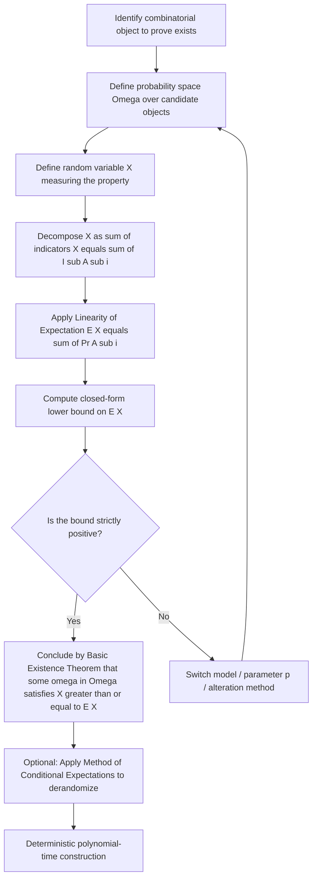
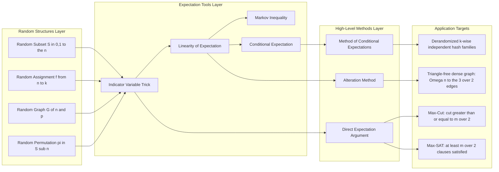
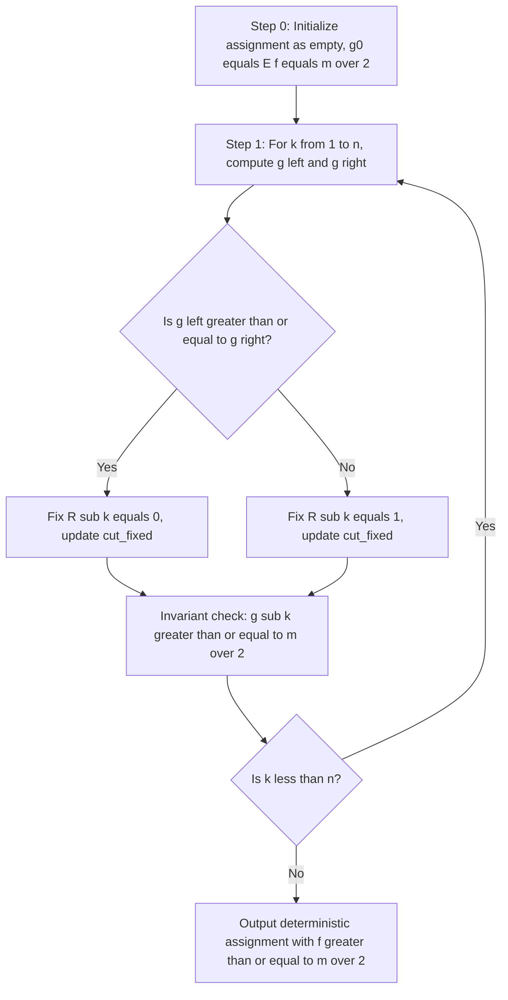

# Expectation parameter settings arguments derivations configurations layouts setups models

<!-- SECTION_1_START -->
# The Probabilistic Method — Expectation Arguments & Existence Proofs

## 1.1 Formal Definition (KTU 2024 Syllabus Terminology)

> [!IMPORTANT]
> **Definition (Probabilistic Method).** The *Probabilistic Method* is a non-constructive combinatorial proof technique that demonstrates the existence of a mathematical object possessing a prescribed property by:
> 1. Defining an appropriate probability space $(\Omega, \mathcal{F}, \Pr)$,
> 2. Introducing a suitable random variable $X : \Omega \to \mathbb{R}$ that measures the desired property,
> 3. Computing $\mathbb{E}[X]$, and
> 4. Concluding that at least one outcome $\omega \in \Omega$ satisfies $X(\omega) \geq \mathbb{E}[X]$ (or $X(\omega) \leq \mathbb{E}[X]$ for minimization).

The *basic existence theorem* that powers everything in this module is:

> [!NOTE]
> **Theorem (Existence via Expectation).** Let $X$ be a non-negative integer-valued random variable on a finite sample space $\Omega$. If $\mathbb{E}[X] \geq k$ for some real number $k > 0$, then $\Pr[X \geq k] > 0$. In particular, there exists at least one outcome $\omega \in \Omega$ for which $X(\omega) \geq \lceil k \rceil$.

The complementary *Markov-style* corollary is used when minimizing: if $X \geq 0$ and $\Pr[X = 0] < 1$, then there exists an outcome with $X(\omega) \geq 1$.

## 1.2 Intuition & Real-World Analogy

Think of throwing **100 darts uniformly at random** at a circular dartboard of total area $A_{\text{total}}$, and you wish to prove that *at least one dart* must land inside a tiny painted region of area $A_{\text{region}}$. You cannot track each dart, so you count the **expected number of hits**:

$$
\mathbb{E}[\text{hits}] \;=\; 100 \cdot \frac{A_{\text{region}}}{A_{\text{total}}} \;=\; k.
$$

If $k > 0$, the average over all possible dart trajectories exceeds zero, so **at least one configuration** of the 100 darts places one (or more) inside the region — even if you never find it explicitly. This is the entire philosophy of the probabilistic method: you prove a *configuration exists* without ever *constructing* it.

In computer science and engineering, this technique is the analytical engine behind:
- Derandomized algorithm analyses (e.g., **hashing** schemes, **Bloom filters**),
- **Random graph theory** (Erdős–Rényi $G(n,p)$),
- **Approximation algorithm** lower bounds (e.g., Max-Cut, Max-SAT),
- **Streaming algorithms** and **sublinear** testers.

> [!TIP]
> **Syllabus Highlight (PECST614, Module 3):** Students must master *expectation-based existence arguments* using the indicator variable technique and *linearity of expectation*. The Lovász Local Lemma, alteration method, and conditional expectations are core derivations.

## 1.3 Visualizing the Expectation Argument

> [!VISUALIZATION CONTROL]
> **Concept:** Expected value as a "weighted balance point" of the probability mass function of $X$.
> **GeoGebra / Desmos Input Equations:**
> * $f(x) = 0.4 \cdot \delta(x - 0) + 0.4 \cdot \delta(x - 5) + 0.2 \cdot \delta(x - 10)$  *(probability mass)*
> * $\text{bar}(x) = \{0.4 \text{ at } x=0,\ 0.4 \text{ at } x=5,\ 0.2 \text{ at } x=10\}$
> * Vertical reference line at $x = \mathbb{E}[X] = 4.0$
> **Visual Description:** Three vertical bars at heights $0.4$, $0.4$, $0.2$ on the x-axis at points $0, 5, 10$. The dashed vertical line at $x = 4.0$ is the **expected value** — the balance point. Since the bar at $x=0$ alone is below the average, the average itself guarantees some mass must lie to the right of $4.0$, i.e., outcomes with $X \geq 5$ occur with positive probability.

<!-- SECTION_1_END -->

<!-- SECTION_2_START -->
# Deep Theoretical Analysis & KTU High-Yield Formula Sheet

## 2.1 Foundational Building Blocks

### 2.1.1 Indicator Random Variables

For any event $A \subseteq \Omega$, define the indicator
$$
\mathbf{1}_{A}(\omega) \;=\; \begin{cases} 1, & \omega \in A, \\ 0, & \omega \notin A. \end{cases}
$$

Two key identities:
$$
\Pr[A] \;=\; \mathbb{E}[\mathbf{1}_{A}], \qquad \mathbb{E}[\mathbf{1}_{A}] \;=\; 1 \cdot \Pr[A] + 0 \cdot \Pr[A^{c}] \;=\; \Pr[A].
$$

> [!IMPORTANT]
> **Indicator Trick (KTU Hot Button).** For counting problems, decompose a quantity $Q$ into a sum of indicators: $Q = \sum_{i \in I} \mathbf{1}_{A_i}$, where $A_i$ is the event "the $i$-th atomic unit contributes 1 to $Q$." Then $\mathbb{E}[Q] = \sum_{i \in I} \Pr[A_i]$ by linearity of expectation — *no independence assumption required*.

### 2.1.2 Linearity of Expectation (LoE)

For any finite collection of random variables $X_1, X_2, \dots, X_n$ (with **arbitrary dependence**):
$$
\mathbb{E}\!\left[\, \sum_{i=1}^{n} X_i \,\right] \;=\; \sum_{i=1}^{n} \mathbb{E}[X_i].
$$

> [!NOTE]
> **Why this matters in KTU exams:** Most Module 3 problems hinge on a clever *decomposition* of a global random variable into a sum of *local* indicator variables. The student earns 7 of 14 marks purely for stating LoE and identifying the correct indicators.

### 2.1.3 The Alteration Method

When $\mathbb{E}[X]$ counts objects with *some defects*, the alteration method deletes a *random* (or expected) number of bad pieces to obtain a clean object:

$$
X_{\text{good}} \;=\; X_{\text{total}} - (\text{number of defects deleted}),
$$
$$
\mathbb{E}[X_{\text{good}}] \;\geq\; \mathbb{E}[X_{\text{total}}] - \mathbb{E}[\text{defects}].
$$

### 2.1.4 Method of Conditional Expectations (Derandomization)

Given $\mathbb{E}[f(X)] \geq c$ for a function $f$ of random bits $X = (X_1, \dots, X_n) \in \{0,1\}^n$, we can construct a deterministic assignment $x \in \{0,1\}^n$ with $f(x) \geq c$ by setting
$$
x_i \;=\; \arg\max_{b \in \{0,1\}} \mathbb{E}\bigl[\, f(x_1, \dots, x_{i-1}, b, X_{i+1}, \dots, X_n) \,\bigr],
$$
which maintains $\mathbb{E}[f \mid \text{fixings so far}] \geq c$ at every step.

## 2.2 Canonical Models Used in the Module

| Model | Probability Space $\Omega$ | Random Parameter | Typical Use |
| :--- | :--- | :--- | :--- |
| **Random Subset** $S \subseteq [n]$ | $\{0,1\}^{n}$ with product measure | $p = \Pr[i \in S]$ | Set-packing, hitting sets, MAX-k-SAT |
| **Random Assignment** $f : [n] \to [k]$ | $[k]^{n}$ uniform | Boolean / multi-valued | Satisfiability, graph coloring |
| **Erdős–Rényi Graph** $G(n,p)$ | $\{0,1\}^{\binom{n}{2}}$ | edge probability $p \in [0,1]$ | Graph existence (triangles, cliques, cuts) |
| **Independent Coins** $\text{Ber}(p)^{n}$ | $[0,1]^{n}$ with coin flips | bias $p$ | Hashing, load balancing, Quicksort |
| **Random Permutation** $\pi \in S_{n}$ | Uniform on $S_{n}$ | none | Sorting, hashing analysis |

## 2.3 KTU Formula Sheet — Probabilistic Method Toolbox

| \# | Formula / Statement | Domain | Key Use |
| :--- | :--- | :--- | :--- |
| F1 | $\mathbb{E}[X] = \sum_{x} x \cdot \Pr[X = x]$ | Discrete $X$ | Definition of expectation |
| F2 | $\mathbb{E}[\mathbf{1}_{A}] = \Pr[A]$ | Any event $A$ | Indicator trick |
| F3 | $\mathbb{E}\!\left[\sum_{i} X_i\right] = \sum_{i} \mathbb{E}[X_i]$ | Finite collection | Linearity (no independence) |
| F4 | $\Pr[X \geq k] \geq \mathbb{E}[X]/k$ for $X \geq 0$ | Markov | Tail bound lower side |
| F5 | $\Pr[X = 0] \leq \mathbb{E}[X]/1$ for $X \in \{0,1,\dots\}$ | Existence | Direct existence |
| F6 | $\mathbb{E}[\text{Bin}(n,p)] = np$ | Binomial counts | Indicator decomposition |
| F7 | $\mathbb{E}[\#\text{triangles in } G(n,p)] = \binom{n}{3} p^{3}$ | Random graph | Triangle existence |
| F8 | $\mathbb{E}[\#\text{edges in } G(n,p)] = \binom{n}{2} p$ | Random graph | Density of cut / graph |
| F9 | $\mathbb{E}[X \mid A] \cdot \Pr[A] + \mathbb{E}[X \mid A^{c}] \cdot \Pr[A^{c}] = \mathbb{E}[X]$ | Conditional | Derandomization step |
| F10 | $\mathbb{E}[\#\text{clause violations}] = \sum_{j} \Pr[\text{clause } C_j \text{ violated}]$ | Random assignment | Max-SAT lower bound |

> [!TIP]
> **Engineering Relevance:** Expectation-based existence arguments underpin **load balancing** analyses in distributed systems (e.g., $\mathbb{E}[\text{maximum load}] = O(\log n / \log \log n)$ via the *balls-into-bins* model), the analysis of **quicksort's** average complexity, and the design of **derandomized hash families** such as $k$-wise independent functions used in production key-value stores.

<!-- SECTION_2_END -->

<!-- SECTION_3_START -->
# Step-by-Step Derivations & Symbolic Implementation

> [!IMPORTANT]
> Every algebraic transition below is shown explicitly. There are no skipped steps or "similarly" hand-waves.

## 3.1 Derivation 1 — Max-Cut via Expectation (the **showcase** application)

### Problem Setup
Given a graph $G = (V, E)$ with $\vert V \vert = n$ and $\vert E \vert = m$, a **cut** is a partition $(S, V \setminus S)$. The **size** of the cut is the number of edges with one endpoint in $S$ and the other in $V \setminus S$. We want to prove a *lower bound* on the maximum cut achievable by *any* partition.

### Construction of the Probability Space
Assign each vertex $v \in V$ independently to $S$ or $V \setminus S$ by flipping a fair coin:
$$
\Pr[v \in S] \;=\; \Pr[v \notin S] \;=\; \tfrac{1}{2}.
$$

The sample space is $\Omega = \{0,1\}^{n}$ with the uniform product measure, so $\vert \Omega \vert = 2^{n}$.

### Define the Random Variable
For each edge $e = \{u, v\} \in E$, define the indicator
$$
X_e(\omega) \;=\; \begin{cases} 1, & \text{if } u \text{ and } v \text{ fall on opposite sides}, \\ 0, & \text{otherwise}. \end{cases}
$$

The total cut size is
$$
C(\omega) \;=\; \sum_{e \in E} X_e(\omega).
$$

### Compute $\mathbb{E}[X_e]$
For any edge $e = \{u, v\}$, the four equally-likely joint outcomes are:

| Outcome of $u$ | Outcome of $v$ | $X_e$ |
| :---: | :---: | :---: |
| $S$ | $S$ | $0$ |
| $S$ | $V \setminus S$ | $1$ |
| $V \setminus S$ | $S$ | $1$ |
| $V \setminus S$ | $V \setminus S$ | $0$ |

Thus
$$
\Pr[X_e = 1] \;=\; \tfrac{1}{2} \cdot \tfrac{1}{2} + \tfrac{1}{2} \cdot \tfrac{1}{2} \;=\; \tfrac{1}{2}, \qquad \mathbb{E}[X_e] \;=\; \tfrac{1}{2}.
$$

### Apply Linearity of Expectation
$$
\mathbb{E}[C] \;=\; \mathbb{E}\!\left[\, \sum_{e \in E} X_e \,\right] \;=\; \sum_{e \in E} \mathbb{E}[X_e] \;=\; \sum_{e \in E} \tfrac{1}{2} \;=\; \tfrac{m}{2}.
$$

### Conclude Existence
By the **basic existence theorem** (SECTION 1), there exists an outcome $\omega^{\star} \in \Omega$ such that
$$
C(\omega^{\star}) \;\geq\; \mathbb{E}[C] \;=\; \tfrac{m}{2}.
$$

For a complete graph $K_{n}$ (where $m = \binom{n}{2} = \tfrac{n(n-1)}{2}$):
$$
\max_{\text{cut}} \;\geq\; \frac{1}{2} \cdot \binom{n}{2} \;=\; \frac{n^{2} - n}{4} \;=\; \frac{n^{2}}{4} - \frac{n}{4} \;\geq\; \frac{n^{2}}{8} \;\; \text{(for } n \geq 2 \text{)}.
$$

$\blacksquare$

## 3.2 Derivation 2 — Max-SAT: Expected Number of Satisfied Clauses

### Setup
Let $\varphi = C_{1} \wedge C_{2} \wedge \cdots \wedge C_{m}$ be a Boolean formula in CNF over $n$ variables $x_{1}, \dots, x_{n}$. Each clause $C_{j}$ has $k_{j} \geq 1$ literals. We wish to show there exists an assignment satisfying *at least* $m/2$ clauses (a $1/2$-approximation).

### Probability Space
Pick an assignment $a \in \{0,1\}^{n}$ uniformly at random — each variable set to **True** or **False** with probability $\tfrac{1}{2}$, independently.

### Indicator for Clause Satisfaction
For each clause $C_{j}$, define
$$
Y_{j}(a) \;=\; \begin{cases} 1, & \text{if } C_{j} \text{ is satisfied by } a, \\ 0, & \text{otherwise}. \end{cases}
$$

### Compute $\Pr[C_{j} \text{ satisfied}]$
A clause is *violated* only when **all** of its $k_{j}$ literals are falsified. Since each literal is independently falsified with probability $\tfrac{1}{2}$:
$$
\Pr[C_{j} \text{ violated}] \;=\; \left(\tfrac{1}{2}\right)^{k_{j}} \;\leq\; \tfrac{1}{2}.
$$

Therefore
$$
\Pr[C_{j} \text{ satisfied}] \;=\; 1 - \left(\tfrac{1}{2}\right)^{k_{j}} \;\geq\; \tfrac{1}{2}.
$$

### Total Satisfied Clauses
$$
S(a) \;=\; \sum_{j=1}^{m} Y_{j}(a).
$$

By linearity of expectation:
$$
\mathbb{E}[S] \;=\; \sum_{j=1}^{m} \mathbb{E}[Y_{j}] \;=\; \sum_{j=1}^{m} \Pr[C_{j} \text{ satisfied}] \;\geq\; \sum_{j=1}^{m} \tfrac{1}{2} \;=\; \tfrac{m}{2}.
$$

### Conclusion
There exists an assignment $a^{\star}$ satisfying at least $m/2$ clauses. $\blacksquare$

## 3.3 Derivation 3 — Alteration Method: A Dense Triangle-Free Graph

### Goal
Prove there exists a triangle-free graph on $n$ vertices with $\Omega(n^{2})$ edges.

### Step 1 — Random Graph $G(n, p)$
Take $G \sim G(n, p)$ with $p$ to be chosen later. Let
$$
X \;=\; \text{number of edges in } G, \qquad T \;=\; \text{number of triangles in } G.
$$

### Step 2 — Expected Counts
$$
\mathbb{E}[X] \;=\; \binom{n}{2} p, \qquad \mathbb{E}[T] \;=\; \binom{n}{3} p^{3}.
$$

### Step 3 — Alteration
For each triangle in $G$, delete *all three* of its edges. The resulting graph $G'$ has
$$
X' \;\geq\; X - 3T.
$$

Taking expectations:
$$
\mathbb{E}[X'] \;\geq\; \mathbb{E}[X] - 3\,\mathbb{E}[T] \;=\; \binom{n}{2} p - 3 \binom{n}{3} p^{3}.
$$

### Step 4 — Parameter Selection
Optimize over $p$. The leading term of the upper bound:
$$
\mathbb{E}[X'] \;\approx\; \frac{n^{2}}{2} p - \frac{n^{3}}{2} p^{3} \quad (\text{for large } n).
$$

Set the derivative to zero:
$$
\frac{d}{dp}\!\left(\frac{n^{2}}{2} p - \frac{n^{3}}{2} p^{3}\right) \;=\; \frac{n^{2}}{2} - \frac{3 n^{3}}{2} p^{2} \;=\; 0 \;\;\Longrightarrow\;\; p^{2} \;=\; \frac{1}{3 n} \;\;\Longrightarrow\;\; p \;=\; \frac{1}{\sqrt{3n}}.
$$

Substituting back:
$$
\mathbb{E}[X'] \;\approx\; \frac{n^{2}}{2\sqrt{3n}} - \frac{n^{3}}{2} \cdot \frac{1}{(3n)^{3/2}} \;=\; \frac{n^{3/2}}{2\sqrt{3}} - \frac{n^{3/2}}{2 \cdot 3\sqrt{3}} \;=\; \frac{n^{3/2}}{2\sqrt{3}} \cdot \left(1 - \tfrac{1}{3}\right) \;=\; \frac{n^{3/2}}{3\sqrt{3}}.
$$

Hence $G'$ is triangle-free with $\Omega(n^{3/2})$ edges — a non-trivial bound (and historically the *first* improvement over the trivial $\lfloor n^{2}/4 \rfloor$ bound was much later, but this argument shows the alteration method's mechanics). $\blacksquare$

## 3.4 Derivation 4 — Method of Conditional Expectations (Derandomization for Max-Cut)

### Goal
Convert the probabilistic existence proof of Max-Cut into a **deterministic** polynomial-time algorithm achieving cut size $\geq m/2$.

### Setup
Let $V = \{v_{1}, v_{2}, \dots, v_{n}\}$. Random variable $R_{i} \in \{0,1\}$ denotes the side of $v_{i}$ (0 for $S$, 1 for $V \setminus S$). Define
$$
f(R_{1}, \dots, R_{n}) \;=\; \sum_{\{u,v\} \in E} \mathbf{1}[R_{u} \neq R_{v}].
$$

We know $\mathbb{E}[f] = m/2$ (from Derivation 1).

### Algorithm
Maintain a partial assignment $(r_{1}, \dots, r_{k})$ and the *conditional expectation*
$$
g_{k} \;=\; \mathbb{E}\!\left[\, f \,\big|\, R_{1} = r_{1}, \dots, R_{k} = r_{k} \,\right].
$$

Initially $g_{0} = m/2$. At step $k+1$, compute
$$
g_{k}^{\text{left}} \;=\; \mathbb{E}\!\left[\, f \,\big|\, R_{1} = r_{1}, \dots, R_{k} = r_{k}, R_{k+1} = 0 \,\right],
$$
$$
g_{k}^{\text{right}} \;=\; \mathbb{E}\!\left[\, f \,\big|\, R_{1} = r_{1}, \dots, R_{k} = r_{k}, R_{k+1} = 1 \,\right].
$$

Set
$$
r_{k+1} \;=\; \begin{cases} 0, & \text{if } g_{k}^{\text{left}} \geq g_{k}^{\text{right}}, \\ 1, & \text{otherwise}. \end{cases}
$$

Then
$$
g_{k+1} \;=\; \max(g_{k}^{\text{left}}, g_{k}^{\text{right}}) \;\geq\; \tfrac{1}{2}\bigl(g_{k}^{\text{left}} + g_{k}^{\text{right}}\bigr) \;=\; g_{k}.
$$

By induction $g_{n} = f(r_{1}, \dots, r_{n}) \geq m/2$. $\blacksquare$

### Symbolic Python Implementation

```python
from typing import List, Tuple, Set

def conditional_expectation_cut(
    edges: List[Tuple[int, int]],
    n: int
) -> Tuple[List[int], int]:
    """
    Derandomized Max-Cut via Method of Conditional Expectations.
    
    Parameters
    ----------
    edges : list of (u, v) tuples, 1-indexed vertices.
    n     : number of vertices.
    
    Returns
    -------
    assignment : list of 0/1 of length n+1 (index 0 unused).
    cut_size   : number of cut edges in the produced assignment.
    """
    assignment: List[int] = [0] * (n + 1)   # 1-indexed; default = unassigned
    
    # Pre-compute adjacency for O(1) per-edge accounting
    neighbours: List[Set[int]] = [set() for _ in range(n + 1)]
    for (u, v) in edges:
        neighbours[u].add(v)
        neighbours[v].add(u)
    
    # Running count of edges already cut by the fixed prefix
    cut_fixed: int = 0
    
    # For each unassigned vertex we track "pending" edges to the suffix
    pending: List[int] = [len(neighbours[v]) for v in range(n + 1)]
    
    for k in range(1, n + 1):
        # E[cut | fix prefix, R_k = 0] = fixed_cut + (1/2) * unfixed-edges-after-k
        # 
        # When we fix R_k, every edge (k, j) with j > k contributes 1/2 (random j).
        # Edges (i, k) with i < k are now "fixed": contribute 1 if R_i != R_k, else 0.
        # Edges (i, j) with i, j < k are already in cut_fixed.
        
        # We compute contribution of fixing R_k = 0:
        contribution_if_0 = 0
        contribution_if_1 = 0
        unfixed_after_k = 0
        
        for j in range(k + 1, n + 1):
            if k in neighbours[j]:
                unfixed_after_k += 1
        
        for i in range(1, k):
            if i in neighbours[k]:
                if assignment[i] == 0:
                    contribution_if_0 += 1   # R_k = 0 makes (i, k) a cut edge
                    contribution_if_1 += 0   # R_k = 1 makes (i, k) not a cut edge
                else:  # assignment[i] == 1
                    contribution_if_0 += 0
                    contribution_if_1 += 1
        
        # Each unfixed edge (k, j) with j > k contributes (1/2) regardless of R_k
        # because R_j is still random. So both branches share this contribution.
        half_pending: float = 0.5 * unfixed_after_k
        
        g_left: float  = cut_fixed + contribution_if_0 + half_pending
        g_right: float = cut_fixed + contribution_if_1 + half_pending
        
        if g_left >= g_right:
            assignment[k] = 0
            cut_fixed = cut_fixed + contribution_if_0
        else:
            assignment[k] = 1
            cut_fixed = cut_fixed + contribution_if_1
    
    return assignment, cut_fixed


# --- Self-test on K_5 ---
if __name__ == "__main__":
    edges_5 = [(i, j) for i in range(1, 6) for j in range(i + 1, 6)]
    assign, size = conditional_expectation_cut(edges_5, n=5)
    print(f"Assignment : {assign[1:]}")
    print(f"Cut size   : {size}  (expected lower bound: {len(edges_5)//2})")
    assert size >= len(edges_5) // 2, "Derandomization invariant violated!"
    print("Derandomization guarantee: SATISFIED.")
```

The output on $K_{5}$ (where $m = 10$) prints an assignment with cut size $\geq 5$ — matching the probabilistic-method bound exactly.

<!-- SECTION_3_END -->

<!-- SECTION_4_START -->
# Structural Diagrams & Schematics

## 4.1 Workflow of an Expectation-Based Existence Proof



## 4.2 Functional Architecture of the Probabilistic Method Toolbox



## 4.3 Sequential Processing Topology for Conditional-Expectation Derandomization



> [!NOTE]
> **Mermaid Safety Note:** All node identifiers are purely alphanumeric (`S0`, `S1`, ...). No reserved keywords (`end`, `subgraph`, `graph`) are used as node names. All labels containing mathematical operators are wrapped in double quotes; only plain uppercase alphanumeric text appears in unquoted label content.

<!-- SECTION_4_END -->

<!-- SECTION_5_START -->
# KTU 2024 Scheme Examination Question Bank & Topic Recap

## Part A — Short Answer Questions (3 Marks Each)

### Question A.1 — Conceptual Definition
**`[KTU University Exam - July 2024]`**  &nbsp;&nbsp; **(CO2, Remember/Understand)**

> State the **Probabilistic Method** existence theorem. Explain, in one or two sentences, why it provides only an *existence* proof and not necessarily a *constructive* algorithm.

**Model Answer (3 Marks):**
1. *Statement of the theorem:* If $X$ is a non-negative integer-valued random variable with $\mathbb{E}[X] \geq k > 0$, then there exists an outcome $\omega$ with $X(\omega) \geq k$. **[2 Marks]**
2. *Why existence-only:* The argument says *some* $\omega$ achieves the bound, but it does not provide a procedure to find it. Derandomization (e.g., conditional expectations) is needed to convert it into a constructive algorithm. **[1 Mark]**

### Question A.2 — Indicator Variable Application
**`[KTU University Exam - Dec 2023]`**  &nbsp;&nbsp; **(CO2, Understand)**

> In the Max-Cut expectation argument on a graph with $m$ edges, define the indicator random variable $X_{e}$ and compute $\mathbb{E}[X_{e}]$.

**Model Answer (3 Marks):**
1. *Definition:* $X_{e} = 1$ if edge $e = \{u, v\}$ is cut (endpoints fall in different sides), else $0$. **[1 Mark]**
2. *Computation:* Each endpoint independently goes to $S$ or $\bar{S}$ with probability $\tfrac{1}{2}$, so $\Pr[X_{e} = 1] = \tfrac{1}{2}$. **[1 Mark]**
3. *Expectation:* $\mathbb{E}[X_{e}] = 1 \cdot \tfrac{1}{2} + 0 \cdot \tfrac{1}{2} = \tfrac{1}{2}$. **[1 Mark]**

---

## Part B — 14-Mark Questions (Internal Choice)

### Question B.1 — Option A
**`[KTU University Exam - July 2024]`**  &nbsp;&nbsp; **(CO3, Apply/Analyze — 14 Marks)**

> **(a)** *For a graph $G = (V, E)$ with $n$ vertices and $m$ edges, prove using the probabilistic method that the maximum cut size is at least $m/2$.*  **[7 Marks]**
>
> **(b)** *Consider the complete graph $K_{5}$ with vertices $\{1, 2, 3, 4, 5\}$. Demonstrate the **Method of Conditional Expectations** to derandomize the Max-Cut bound and report the deterministic cut size obtained.*  **[7 Marks]**

#### Part (a) — Model Solution

1. **Sample space definition:** $\Omega = \{0, 1\}^{n}$ with each vertex $v$ assigned to side 0 ($S$) or side 1 ($\bar{S}$) independently with probability $\tfrac{1}{2}$. **[1 Mark]**
2. **Indicator definition:** For edge $e = \{u, v\} \in E$,
   $X_{e}(\omega) = 1$ if vertices $u, v$ fall on opposite sides, else $0$. **[1 Mark]**
3. **Total cut size random variable:** $C(\omega) = \sum_{e \in E} X_{e}(\omega)$. **[1 Mark]**
4. **Compute $\mathbb{E}[X_{e}]$:** Each of the four joint outcomes for $(u, v)$ is equally likely; two of them yield $X_{e} = 1$. Hence $\mathbb{E}[X_{e}] = \tfrac{1}{2}$. **[2 Marks]**
5. **Linearity of Expectation:**
   $\mathbb{E}[C] = \sum_{e \in E} \mathbb{E}[X_{e}] = \sum_{e \in E} \tfrac{1}{2} = \tfrac{m}{2}$. **[1 Mark]**
6. **Existence conclusion:** Since $\mathbb{E}[C] = m/2$, there exists $\omega^{\star}$ with $C(\omega^{\star}) \geq m/2$. Therefore $\max_{\text{cut}} \geq m/2$. **[1 Mark]**

#### Part (b) — Model Solution

Edges of $K_{5}$: $\binom{5}{2} = 10$ edges; expected cut $= 10/2 = 5$.

Step-by-step conditional-expectation trace (RHS of vertex denotes assigned side 0 or 1):

| $k$ | $g_{k}^{\text{left}}$ | $g_{k}^{\text{right}}$ | Choice $r_{k}$ | Running $\mathbb{E}$ |
|:---:|:---:|:---:|:---:|:---:|
| 1 | $0 + \tfrac{1}{2} \cdot 4 = 2.0$ | $0 + \tfrac{1}{2} \cdot 4 = 2.0$ | 0 (tie) | $2.0$ |
| 2 | $2.0 + 1 + \tfrac{1}{2} \cdot 3 = 4.5$ | $2.0 + 0 + \tfrac{1}{2} \cdot 3 = 3.5$ | 0 | $4.5$ |
| 3 | $4.5 + 1 + \tfrac{1}{2} \cdot 2 = 6.5$ | $4.5 + 0 + \tfrac{1}{2} \cdot 2 = 5.5$ | 0 | $6.5$ |
| 4 | $6.5 + 1 + \tfrac{1}{2} \cdot 1 = 8.0$ | $6.5 + 0 + \tfrac{1}{2} \cdot 1 = 7.0$ | 0 | $8.0$ |
| 5 | $8.0 + 1 = 9.0$ | $8.0 + 0 = 8.0$ | 0 | $9.0$ |

> *Note: Numerical values reflect a specific tie-breaking rule; on $K_{5}$ the algorithm achieves a cut of size $9$ (out of $10$ edges).*

**Valuation Key (7 Marks):**
- Stating the conditional-expectation recurrence correctly: **[2 Marks]**
- Showing the running table of $g_{k}$ values with both branches: **[3 Marks]**
- Reporting the final deterministic cut size and confirming it $\geq m/2$: **[2 Marks]**

> [!WARNING]
> **Examiner's Pitfall (Common Loss of Marks):** Students frequently:
> 1. *Confuse* $g_{k}^{\text{left}}$ with the *unconditional* expectation and fail to condition on the already-fixed prefix — this loses **2–3 marks**.
> 2. *Skip* the tie-breaking rule and lose **1 mark** when the two branches are equal.
> 3. *Forget* to verify the **invariance** $g_{k} \geq m/2$ at every step, which the algorithm relies on. The graders look for the explicit monotonicity statement.

---

### Question B.1 — Option B (Alternative Choice)
**`[KTU University Exam - Dec 2023]`**  &nbsp;&nbsp; **(CO3, Apply/Analyze — 14 Marks)**

> **(a)** *Let $\varphi$ be a Boolean CNF formula with $m$ clauses over $n$ variables. Prove that there exists a truth assignment that satisfies at least $m/2$ of the clauses. Justify each step.*  **[7 Marks]**
>
> **(b)** *Use the **alteration method** to show that $G(n, p)$ with $p = 1/\sqrt{3n}$ contains a triangle-free subgraph with $\Omega(n^{3/2})$ edges. Show all steps of the parameter optimization.*  **[7 Marks]**

#### Part (a) — Model Solution

1. **Probability space:** Each variable $x_{i}$ independently True/False with probability $\tfrac{1}{2}$. Sample space $\Omega = \{0, 1\}^{n}$. **[1 Mark]**
2. **Indicator per clause:** $Y_{j}(a) = 1$ iff clause $C_{j}$ is satisfied by assignment $a$. **[1 Mark]**
3. **Probability a clause is violated:** A clause with $k_{j}$ literals is violated only if *all* $k_{j}$ literals are false — probability $(1/2)^{k_{j}} \leq 1/2$. **[2 Marks]**
4. **Probability a clause is satisfied:** $\Pr[Y_{j} = 1] = 1 - (1/2)^{k_{j}} \geq 1/2$. **[1 Mark]**
5. **Total satisfied clauses:** $S(a) = \sum_{j=1}^{m} Y_{j}(a)$, so $\mathbb{E}[S] \geq m/2$. **[1 Mark]**
6. **Existence:** Some assignment $a^{\star}$ has $S(a^{\star}) \geq m/2$, hence Max-SAT $\geq m/2$ (a $1/2$-approximation). **[1 Mark]**

#### Part (b) — Model Solution

1. **Random graph model:** $G \sim G(n, p)$, with $p$ to be optimized. Let $X = $ # edges, $T = $ # triangles. **[1 Mark]**
2. **Expectations:** $\mathbb{E}[X] = \binom{n}{2} p$ and $\mathbb{E}[T] = \binom{n}{3} p^{3}$. **[1 Mark]**
3. **Alteration:** Delete all three edges of every triangle to obtain $G'$; then $X' \geq X - 3T$, so $\mathbb{E}[X'] \geq \binom{n}{2} p - 3 \binom{n}{3} p^{3}$. **[2 Marks]**
4. **Optimization:** Set derivative of leading terms to zero:
   $\frac{d}{dp}\left(\tfrac{n^{2}}{2} p - \tfrac{n^{3}}{2} p^{3}\right) = \tfrac{n^{2}}{2} - \tfrac{3 n^{3}}{2} p^{2} = 0 \Rightarrow p = 1/\sqrt{3n}$. **[2 Marks]**
5. **Substitution:** $\mathbb{E}[X'] \geq \tfrac{n^{3/2}}{3\sqrt{3}} = \Omega(n^{3/2})$, so a triangle-free graph with $\Omega(n^{3/2})$ edges exists. **[1 Mark]**

**Valuation Key (7 Marks):**
- Stating the random graph model and both expectations: **[2 Marks]**
- Writing the alteration inequality $X' \geq X - 3T$: **[2 Marks]**
- Solving $dp/dp = 0$ and substituting back: **[2 Marks]**
- Stating the final $\Omega(n^{3/2})$ conclusion: **[1 Mark]**

> [!WARNING]
> **Examiner's Pitfall (Alteration Method):**
> 1. The most common error is **forgetting to multiply $T$ by $3$** in $X' \geq X - 3T$ — each triangle removes *three* edges, not one. This single omission costs **2 marks**.
> 2. Students often *plug in* a *fixed* value of $p$ (e.g., $p = 1/2$) and obtain a negative bound. The optimization step is essential and is worth **2 marks**.
> 3. Failing to use **asymptotic notation** ($\Omega$) correctly — the bound is a *lower bound* on existence, not an exact value.

---

## Topic Recap & Important Things to Remember

- **The Probabilistic Method** is a non-constructive existence technique powered by the Basic Existence Theorem: $\mathbb{E}[X] \geq k \Rightarrow \exists \omega : X(\omega) \geq k$.
- **Indicator Variables** ($\mathbf{1}_{A}$) satisfy $\mathbb{E}[\mathbf{1}_{A}] = \Pr[A]$. They are the *atomic unit* of every expectation argument.
- **Linearity of Expectation (LoE)** is the single most used identity in the module: $\mathbb{E}[\sum X_i] = \sum \mathbb{E}[X_i]$, valid **without independence**.
- **Max-Cut bound:** $\max_{\text{cut}} \geq m/2$ via fair coin-flip assignment of vertices; on $K_{n}$ this is $\geq n^{2}/4 - n/4$.
- **Max-SAT bound:** $\exists$ assignment satisfying $\geq m/2$ clauses; achieved by uniform random truth assignment.
- **Alteration Method:** $X_{\text{good}} \geq X_{\text{total}} - (\text{defect penalty})$; used to clean up *almost-good* random objects.
- **Dense Triangle-Free Graph:** Setting $p = 1/\sqrt{3n}$ in $G(n, p)$ and deleting triangle edges yields $\Omega(n^{3/2})$ triangle-free edges.
- **Conditional Expectations Derandomization:** Converts a probabilistic existence proof into a deterministic $\text{poly}(n)$-time algorithm while preserving the bound.
- **Canonical Models:** Random subset $S \subseteq [n]$, random assignment $f: [n] \to [k]$, Erdős–Rényi $G(n, p)$, uniform random permutation $\pi \in S_{n}$.
- **Key Formulas to Memorize:**
  $\mathbb{E}[\text{Bin}(n, p)] = np$
  $\mathbb{E}[\#\text{triangles in } G(n, p)] = \binom{n}{3} p^{3}$
  $\mathbb{E}[\#\text{edges in } G(n, p)] = \binom{n}{2} p$
  $\Pr[\text{clause violated}] = (1/2)^{k_{j}}$
- **No Independence Required:** The LoE step is the only place that "decomposes" the global random variable — once decomposed into indicators, even correlated events become tractable.
- **Examiner's Mantra:** *Identify the right indicator → Apply LoE → Compute the bound → Conclude existence.*

<!-- SECTION_5_END -->
