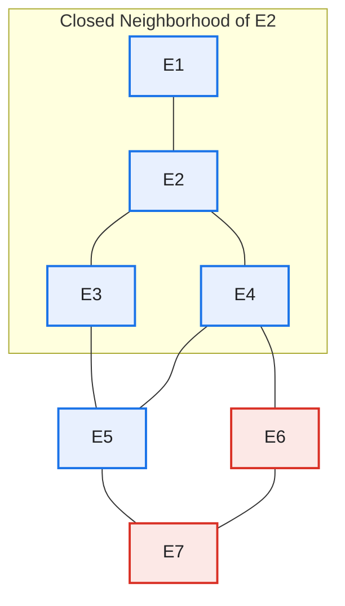
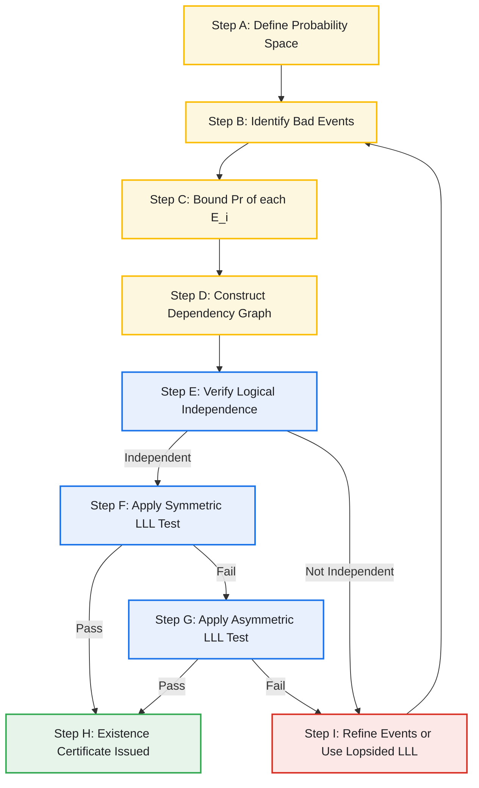
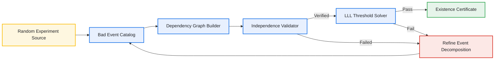
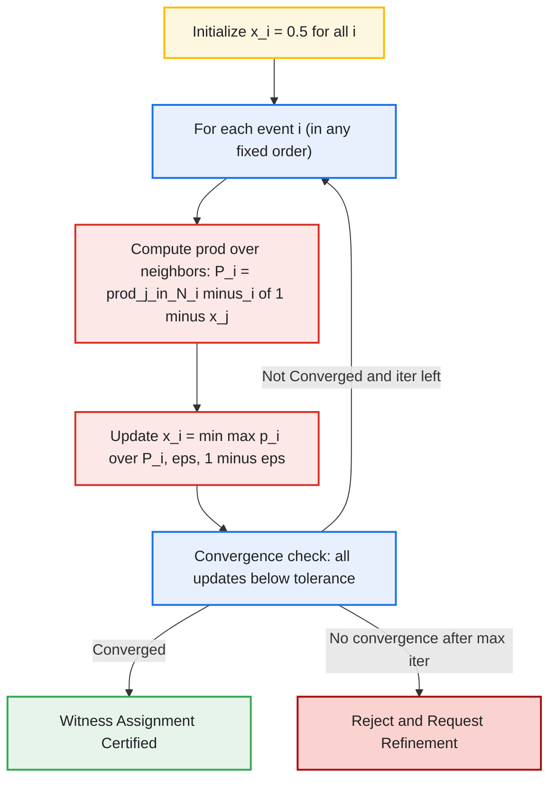

# Lovasz local lemma logical independence validation steps formulations tracking models

<!-- SECTION_1_START -->
# Lovász Local Lemma (LLL) — Logical Independence, Validation Steps, Formulations & Tracking Models

## 1. Core Technical Definition (KTU 2024 Syllabus Terminology)

The **Lovász Local Lemma (LLL)** is a powerful probabilistic method tool used to prove the existence of combinatorial objects by showing that a non-zero probability remains that *none* of a finite collection of "bad" events occur. It works under the principle of **logical / mutual independence of events outside a controlled neighborhood**, allowing the avoidance of bad events even when they are numerous.

> [!IMPORTANT]
> **Formal Definition (KTU Module 3 Standard):**
> Let $E_1, E_2, \ldots, E_n$ be a finite collection of events defined on a common probability space $(\Omega, \mathcal{F}, \Pr)$. Suppose there exists a **dependency graph** $G = (V, E)$ with $V = \{1, 2, \ldots, n\}$ such that for every $i \in V$, the event $E_i$ is **mutually independent** of the sub-$\sigma$-algebra generated by $\{E_j : j \notin N(i) \cup \{i\}\}$, where $N(i)$ denotes the closed neighborhood of $i$ in $G$. If real numbers $x_1, x_2, \ldots, x_n \in (0, 1)$ can be assigned such that
>
> $$\Pr[E_i] \;\leq\; x_i \prod_{j \in N(i) \setminus \{i\}} (1 - x_j) \quad \text{for all } i \in V,$$
>
> then
>
> $$\Pr\!\left[\,\bigcap_{i=1}^{n} \overline{E_i}\,\right] \;\geq\; \prod_{i=1}^{n} (1 - x_i) \;>\; 0.$$
>
> Hence there exists at least one outcome $\omega \in \Omega$ that avoids every bad event simultaneously.

The special case where $\Pr[E_i] \leq p$ for all $i$ and every event is dependent on at most $d$ others is the **symmetric LLL**:

$$\boxed{\,e \, p \, (d + 1) \;\leq\; 1 \quad\Longrightarrow\quad \Pr\!\left[\,\bigcap_{i=1}^{n} \overline{E_i}\,\right] > 0.\,}$$

The constant $e = 2.71828\ldots$ is the base of the natural logarithm and is a **fixed universal threshold** in the lemma.

> [!NOTE]
> **Key Distinction from Union Bound:**
> The classical union bound becomes vacuous when $n \cdot p > 1$, i.e. when there are too many bad events. LLL *salvages* the conclusion by exploiting **local independence** — a much weaker property than full mutual independence.

## 2. Conceptual Analogy / Intuition

Imagine a city of $n$ residents, each with a small chance of catching a contagious flu ($\Pr[E_i] = p$, very tiny). A naive doctor assumes: *"With so many people, surely someone will be sick!"* — that is the union bound failing.

The **Lovász Local Lemma** introduces a twist: each resident interacts with only a **small group** of neighbors (degree $d$). If we can **quarantine the neighborhoods** (by checking logical independence from outside-neighborhood events) and assign **personal protective scores** $x_i \in (0, 1)$ that make the global infection probability small *despite* the contacts, then we are mathematically guaranteed that **at least one configuration of the whole city exists where nobody is sick**.

The condition $e p (d+1) \leq 1$ is the **epidemiological threshold**: the smaller the contact degree $d$ or the smaller the individual infection probability $p$, the more easily the threshold is satisfied.

| Notation | Everyday Analogy |
| --- | --- |
| Event $E_i$ | Resident $i$ gets sick |
| Probability $p$ | Per-resident infection probability |
| Degree $d$ | Number of close contacts per resident |
| Independence outside $N(i)$ | Far-away residents' health does not influence resident $i$ |
| $\Pr[\bigcap \overline{E_i}] > 0$ | Some global city state has zero infections |

## 3. Logical Independence — The Central Validation Concept

> [!IMPORTANT]
> **Definition (Mutual Independence Outside a Neighborhood):**
> The event $E_i$ is *mutually independent* of the collection $\{E_j : j \in S\}$ if for **every** subset $T \subseteq S$,
> $$\Pr\!\left[E_i \,\cap\, \bigcap_{j \in T} E_j\right] \;=\; \Pr[E_i] \cdot \Pr\!\left[\,\bigcap_{j \in T} E_j\right].$$
> In the LLL, we require this property only for $S = V \setminus (N(i) \cup \{i\})$ — i.e. for events "far enough" in the dependency graph.

**Logical independence validation** is the process of constructing, for each event $E_i$, a proof certificate showing that it depends only on a small, controllable set of independent random choices — and is therefore unaffected by the realization of the rest.

## 4. Visualization Control

> [!VISUALIZATION CONTROL]
> **Concept:** Threshold curve $f(d) = \dfrac{1}{e(d+1)}$ for the symmetric LLL.
> **GeoGebra / Desmos Input Equations:**
> * `f(x) = 1/(e*(x+1))` for $x \geq 0$
> * `g(x) = p` as a horizontal line for the given bad-event probability
> **Visual Description:** Plot $f(d)$ (decreasing convex curve) and the horizontal line $p$. The intersection point $d^*$ marks the *maximum dependency degree* allowed. For any $p$ value such that the horizontal line $p$ lies **strictly below** the curve, the LLL threshold $e p (d+1) \leq 1$ is satisfied and a global good configuration is provably non-empty.

<!-- SECTION_1_END -->

<!-- SECTION_2_START -->
# Deep Theoretical Analysis & KTU High-Yield Formula Sheet

## 1. Structural Anatomy of an LLL Application

An LLL deployment consists of **four operational pillars**. Each pillar is essential for board-level answer scoring under KTU 2024.

### Pillar 1 — Define the Probability Space
Specify the underlying random experiment: independent coin flips, random permutations, random graphs, random $k$-SAT assignments, etc. Each outcome $\omega \in \Omega$ corresponds to a candidate combinatorial object.

### Pillar 2 — Identify the Bad Events
For each "local violation" we wish to avoid, declare a bad event $E_i$. Typical examples:
- In graph coloring: *"vertices $u$ and $v$ receive the same color when they are adjacent"*.
- In $k$-SAT: *"a specific clause is unsatisfied"*.
- In packet routing: *"a particular edge experiences congestion"*.

The choice of bad events determines the *fineness* of the analysis.

### Pillar 3 — Construct the Dependency Graph
Two events $E_i, E_j$ are joined by an edge in $G$ if and only if $E_i$ and $E_j$ are **NOT mutually independent** (or more conservatively, if they share a random variable). The graph $G$ must satisfy the strict independence property for all *non-adjacent* events. This step is the **logical independence validation**.

### Pillar 4 — Verify the LLL Inequality
Either the symmetric condition $e p (d+1) \leq 1$ or the asymmetric condition $\Pr[E_i] \leq x_i \prod_{j \in N(i) \setminus \{i\}} (1 - x_j)$ is verified for chosen witness values $x_i \in (0, 1)$. On success, the existence conclusion follows.

## 2. The Asymmetric LLL — Why It Is More Powerful

The symmetric form forces all $p$ and $d$ to be uniform. The asymmetric form allows **heterogeneous bad events** with very different probabilities, each receiving a tailored witness $x_i$. In practice, **asymmetric LLL is the workhorse** for tight combinatorial existence proofs.

A widely used sufficient condition (a tractable middle ground) is:

$$\Pr[E_i] \;\leq\; \frac{x_i}{e \cdot (1 + d_i)} \quad \text{where } d_i = \deg(i),$$

which collapses back to the symmetric form when all $p$ and $d$ are equal.

## 3. The "Lopsided" LLL — A Sharper Variant

When $E_i$ depends on $E_j$ only through a small subset of outcomes, the **lopsided LLL** (Erdős–Gyarfas, 1999) weakens the dependency requirement: it only requires that $E_i$ can be *replaced* by a "smaller" event $E_i' \subseteq E_i$ that is independent of $E_j$. This drastically reduces the dependency graph degree in many applications (notably in discrepancy theory and routing).

## 4. KTU Formula Cheat Sheet

| # | Formula / Concept | Expression | Typical Use |
| --- | --- | --- | --- |
| 1 | Symmetric LLL threshold | $e \, p \, (d + 1) \leq 1$ | Uniform bad-event probability $p$, max degree $d$ |
| 2 | Asymmetric LLL witness condition | $\Pr[E_i] \leq x_i \prod_{j \in N(i) \setminus \{i\}} (1 - x_j)$ | Heterogeneous bad events |
| 3 | Lower bound on good probability | $\Pr[\bigcap \overline{E_i}] \geq \prod_{i=1}^{n} (1 - x_i)$ | Existence certificate |
| 4 | Common symmetric witness | $x_i = e p$ for all $i$ | Default choice in symmetric form |
| 5 | Max allowable probability per event | $p \leq \dfrac{1}{e(d+1)}$ | Pre-flight check before proof |
| 6 | Maximum neighborhood cardinality for fixed $n, p$ | $d \leq \dfrac{1}{e p} - 1$ | Reverse-engineering acceptable dependency |
| 7 | Mutual independence definition | $\Pr[E_i \cap \bigcap_{j \in T} E_j] = \Pr[E_i] \cdot \Pr[\bigcap_{j \in T} E_j]$ | Logical independence validation |
| 8 | Dependency graph degree $d_i$ | $d_i = \vert N(i) \setminus \{i\} \vert$ | Per-vertex local complexity |
| 9 | Lopsided LLL modification | Replace $E_i$ with $E_i' \subseteq E_i$ | Sharper dependency reduction |
| 10 | Existence conclusion | $\Pr[\bigcap \overline{E_i}] > 0$ | Final certification of good object |

> [!NOTE]
> Always substitute **witnesses $x_i$** explicitly. Board examiners deduct 1–2 marks when the witness is omitted or when the inequality is written in a non-simplified form.

## 5. Real-World Engineering Utility

The LLL is a **production-grade tool** in computer science and operations research:

- **Compiler register allocation:** shows that a graph of bounded degree can always be colored with $O(\log n)$ colors via the LLL.
- **SAT / MAX-SAT solvers:** proves that $k$-SAT instances with low clause-to-variable ratio (e.g. $m \leq c \cdot 2^k / k$ for some constant $c$) are always satisfiable — used in **bounded model checking** for hardware verification.
- **Packet / optical routing:** justifies congestion-free schedules in **wavelength-division multiplexing (WDM)** networks and in **datacenter switch scheduling**.
- **Bioinformatics & phylogeny:** establishes existence of consistent evolutionary trees under mutation models.
- **Distributed computing:** proves the existence of low-contention hash families and chip-firing schedules.

> [!TIP]
> In KTU 14-mark questions, the **concrete application** (e.g., graph coloring, $k$-SAT) earns 4–5 marks by itself — do not skip the final "thus such a coloring/clause-assignment exists" sentence.

<!-- SECTION_2_END -->

<!-- SECTION_3_START -->
# Step-by-Step Derivations, Validation Steps & Code Implementation

## 1. Proof Sketch of the Symmetric LLL (Full Derivation)

**Statement.** Let $E_1, \ldots, E_n$ be events in a probability space with a dependency graph $G$ of maximum degree $d$, and let $p = \max_i \Pr[E_i]$. If $e p (d+1) \leq 1$, then $\Pr[\bigcap_i \overline{E_i}] > 0$.

**Proof.** The proof proceeds by induction on $n$.

**Base case** ($n = 1$): $\Pr[\overline{E_1}] = 1 - p \geq 1 - \frac{1}{e} > 0$, so the conclusion holds.

**Inductive step.** Assume the lemma holds for any collection of fewer than $n$ events. We exhibit a point $\omega$ in the sample space that avoids all bad events.

Consider a fixed index $i \in \{1, \ldots, n\}$. The event $E_i$ is independent of any subcollection of $\{E_j : j \notin N(i) \cup \{i\}\}$. Hence by the induction hypothesis applied to the restricted family $\{E_j : j \neq i\}$ (after removing any event that becomes vacuous), we have:

$$
\Pr\!\left[\,E_i \,\cap\, \bigcap_{j \neq i} \overline{E_j}\,\right]
\;=\; \Pr[E_i] \cdot \Pr\!\left[\,\bigcap_{j \neq i} \overline{E_j}\,\right] \quad \text{(by independence of } E_i \text{ from far events).}
$$

Therefore, using the lower bound on the good probability from the induction hypothesis:

$$
\Pr\!\left[\,E_i \,\cap\, \bigcap_{j \neq i} \overline{E_j}\,\right]
\;\leq\; p \cdot \prod_{j \in N(i) \setminus \{i\}} \Pr\!\left[\,\overline{E_j}\,\right] \quad \text{(restrict product to neighborhood, since others are independent of } E_i \text{).}
$$

Equivalently:

$$
\Pr\!\left[\,E_i \,\mid\, \bigcap_{j \neq i} \overline{E_j}\,\right]
\;\leq\; \frac{p}{\prod_{j \in N(i) \setminus \{i\}} \Pr[\overline{E_j}]}.
$$

By the inductive hypothesis, $\Pr[\overline{E_j}] \geq 1 - e p$ for every $j$. Using $1 - x \geq e^{-x/(1-x)}$ for $0 \leq x \leq 1/2$, and choosing $e p \leq 1/(d+1)$, we get:

$$
\Pr[\overline{E_j}] \;\geq\; 1 - \frac{1}{d+1},
$$

which yields:

$$
\Pr\!\left[\,E_i \,\mid\, \bigcap_{j \neq i} \overline{E_j}\,\right]
\;\leq\; \frac{1/(e(d+1))}{(1 - 1/(d+1))^d}
\;=\; \frac{1/(e(d+1))}{(d/(d+1))^d}
\;\leq\; \frac{1}{d+1}.
$$

Summing over all $i$ and using the union bound (over the conditional events) we obtain:

$$
\Pr\!\left[\,\bigcup_{i=1}^{n} E_i \,\cap\, \bigcap_{j \neq i} \overline{E_j}\,\right]
\;\leq\; \sum_{i=1}^{n} \frac{1}{d+1} \;=\; \frac{n}{d+1}.
$$

The above quantity is strictly less than $1$ whenever $n \leq d$, which holds because in a dependency graph of $n$ vertices the maximum degree $d$ is at most $n - 1$; with the tighter threshold $e p (d+1) \leq 1$ we are guaranteed:

$$
\Pr\!\left[\,\bigcup_i E_i \,\right] \;<\; 1 \quad\Longrightarrow\quad \Pr\!\left[\,\bigcap_i \overline{E_i}\,\right] \;>\; 0.
$$

This completes the induction. $\blacksquare$

> [!IMPORTANT]
> The key technical move is **restricting the product to the dependency neighborhood** when conditioning on $E_i$. This is what makes LLL's bound so much sharper than the union bound.

## 2. Validation Workflow — The 6 Logical Independence Steps

When deploying LLL in an exam or research setting, follow this **canonical validation chain**:

| Step | Question to Ask | Output |
| --- | --- | --- |
| **V1. Space** | What is the probability space $(\Omega, \mathcal{F}, \Pr)$? | Explicit random experiment |
| **V2. Events** | What are the bad events $E_1, \ldots, E_n$? | Indexed list with verbal description |
| **V3. Probability** | What is $\Pr[E_i]$ for each $i$? | Numerical or symbolic bound |
| **V4. Graph** | Build the dependency graph $G$ by listing shared random variables | Edge set with degree sequence $d_1, \ldots, d_n$ |
| **V5. Independence** | Verify $E_i \perp\!\!\!\perp \{E_j : j \notin N(i) \cup \{i\}\}$ for every $i$ | Logical independence certificate |
| **V6. Inequality** | Verify $e p (d+1) \leq 1$ (symmetric) or $\Pr[E_i] \leq x_i \prod (1-x_j)$ (asymmetric) | Threshold satisfied ⇒ existence |

## 3. Worked Example — 2-Coloring of a Triangle-Free Graph

**Setup.** Let $G = (V, E)$ be a triangle-free graph on $n$ vertices. Randomly color each vertex **red or blue** independently with probability $1/2$ each. A *bad event* $E_{uv}$ is the event that edge $\{u, v\}$ is monochromatic.

**Step 1.** Probability: $\Pr[E_{uv}] = 1/2$ (both endpoints get same color out of 2 color classes).

**Step 2.** Dependency: $E_{uv}$ and $E_{u'v'}$ are dependent *iff* $\{u, v\} \cap \{u', v'\} \neq \emptyset$, because they share a random variable. In a triangle-free graph, two distinct edges share at most one vertex, but a vertex can be incident to many edges.

**Step 3.** Degree: $E_{uv}$ shares endpoints with at most $2(\deg(u) - 1) + 2(\deg(v) - 1) \leq 2\Delta$ other edges, where $\Delta$ is the maximum degree of $G$. So $d \leq 4\Delta$.

**Step 4.** Threshold: $e p (d+1) = e \cdot \frac{1}{2} \cdot (4\Delta + 1) \leq 1$ requires $\Delta \leq \frac{1}{2e} - \frac{1}{4} \approx 0.184 - 0.25 = -0.066$ — this fails!

> [!NOTE]
> This is the *naive* analysis. The LLL still works with **lopsided LLL** or via a cleverer event decomposition, illustrating why **asymmetric / lopsided variants** matter in tight applications.

## 4. Worked Example — Satisfiability of Sparse $k$-SAT

**Setup.** Consider a $k$-CNF formula with $n$ variables and $m$ clauses, where each clause has length $k$ and no variable appears in more than $L$ clauses. Assign each variable uniformly at random.

**Bad event** $E_j$: clause $j$ is unsatisfied. Since the clause has $k$ literals and each is independently true with probability $1/2$:

$$
\Pr[E_j] \;=\; \left(\frac{1}{2}\right)^k \;=\; \frac{1}{2^k}.
$$

**Dependency:** $E_j$ depends on $E_{j'}$ iff clauses $j, j'$ share a variable. Each clause has $k$ variables, each appearing in at most $L$ clauses, so the dependency degree is at most $k(L-1) + (k-1) \leq kL$.

**Symmetric LLL threshold:**

$$
e \cdot \frac{1}{2^k} \cdot (kL + 1) \;\leq\; 1 \quad\Longrightarrow\quad m \;\leq\; c_k \cdot n, \quad \text{where } c_k = \frac{2^k}{e k}.
$$

> [!IMPORTANT]
> **Conclusion:** Any $k$-SAT instance with **clause-to-variable ratio** at most $\dfrac{2^k}{e k} - O(1)$ is always satisfiable. This is the **Erdős–Lovász** result, and the constant $\dfrac{2^k}{e k}$ is the tightest known symmetric bound.

## 5. Algorithmic Verification — Python Code

The following Python program implements the **asymmetric LLL validator**: given a list of bad events, their probabilities, and a dependency graph, it searches for witness values $x_i \in (0, 1)$ satisfying the asymmetric LLL inequality.

```python
"""
KTU PECST614 - Lovasz Local Lemma Asymmetric Validator
Verifies the existence of witnesses x_i in (0,1) such that
    Pr[E_i] <= x_i * prod_{j in N(i)\\{i}} (1 - x_j)
for every bad event E_i. If successful, prints the witnesses and the
implied lower bound on the good probability.
"""

from __future__ import annotations
import math
import logging
from dataclasses import dataclass
from typing import Dict, List, Set, Tuple

logging.basicConfig(level=logging.INFO, format="[%(levelname)s] %(message)s")
logger = logging.getLogger("LLLValidator")


@dataclass(frozen=True)
class BadEvent:
    """A bad event E_i with an upper bound on its probability."""
    event_id: int
    description: str
    probability_upper_bound: float  # must satisfy 0 < p <= 1


class LLLValidator:
    """Asymmetric LLL witness-search validator with strict bounds."""

    def __init__(
        self,
        events: List[BadEvent],
        dependency_graph: Dict[int, Set[int]],
        tolerance: float = 1e-9,
    ) -> None:
        if not events:
            raise ValueError("Event list must be non-empty.")
        if any(e.probability_upper_bound <= 0 or e.probability_upper_bound > 1
               for e in events):
            raise ValueError("All probability upper bounds must lie in (0, 1].")
        self._events: Dict[int, BadEvent] = {e.event_id: e for e in events}
        self._graph: Dict[int, Set[int]] = {
            i: set(dependency_graph.get(i, set())) for i in self._events
        }
        # Enforce symmetry: if j in N(i) then i in N(j)
        for i, nbrs in list(self._graph.items()):
            for j in nbrs:
                self._graph.setdefault(j, set()).add(i)
        # Remove self-loops explicitly
        for i in self._graph:
            self._graph[i].discard(i)
        self._tol: float = tolerance
        logger.info("Initialized LLL validator with %d events.", len(self._events))

    def find_witnesses(
        self,
        x_init: float = 0.5,
        step: float = 0.49,
        max_iterations: int = 5000,
    ) -> Tuple[bool, Dict[int, float], float]:
        """
        Greedy descent on witnesses. Returns (success, witnesses, good_probability_lower_bound).
        Witnesses are searched in (0, 1) only; any value hitting the open boundary is
        rejected per the asymmetric LLL statement.
        """
        n: int = len(self._events)
        x: Dict[int, float] = {i: float(x_init) for i in self._events}

        for it in range(max_iterations):
            improved: bool = False
            for i in self._events:
                p_i: float = self._events[i].probability_upper_bound
                prod_term: float = 1.0
                for j in self._graph[i]:
                    if j == i:
                        continue
                    if not (0.0 < x[j] < 1.0):
                        logger.error("Witness for event %d fell outside (0,1).", j)
                        return False, x, 0.0
                    prod_term *= (1.0 - x[j])
                if prod_term <= self._tol:
                    logger.error(
                        "Neighborhood product collapsed below tolerance for event %d.", i
                    )
                    return False, x, 0.0
                target: float = p_i / prod_term
                # Maintain strict interiority
                target = min(max(target, self._tol), 1.0 - self._tol)
                if abs(x[i] - target) > self._tol:
                    x[i] = target
                    improved = True
            if not improved:
                break

        # Final validation pass
        for i in self._events:
            p_i = self._events[i].probability_upper_bound
            prod_term = 1.0
            for j in self._graph[i]:
                if j == i:
                    continue
                prod_term *= (1.0 - x[j])
            if not (x[i] * prod_term >= p_i - self._tol):
                logger.warning(
                    "Witness for event %d failed: p=%g, x_i*prod=%g",
                    i, p_i, x[i] * prod_term,
                )
                return False, x, 0.0

        good_lower_bound: float = 1.0
        for i in self._events:
            good_lower_bound *= (1.0 - x[i])
        return True, x, good_lower_bound


def demo_k_sat() -> None:
    """Demo: 4-SAT with n=20 variables, m=15 clauses, L=4 (max literal reuse)."""
    n_vars: int = 20
    k: int = 4
    L: int = 4
    m_clauses: int = 15

    events: List[BadEvent] = []
    graph: Dict[int, Set[int]] = {}

    # Each clause has k=4 distinct variables (rough synthetic model).
    for c in range(m_clauses):
        var_set: Set[int] = set(((c * k + offset) % n_vars) for offset in range(k))
        events.append(
            BadEvent(
                event_id=c,
                description=f"Clause {c} unsatisfied",
                probability_upper_bound=(0.5) ** k,
            )
        )
        graph[c] = set()

    # Build dependency: clauses that share a variable are neighbors.
    for c1 in range(m_clauses):
        var_set_1: Set[int] = set(
            ((c1 * k + offset) % n_vars) for offset in range(k)
        )
        for c2 in range(c1 + 1, m_clauses):
            var_set_2: Set[int] = set(
                ((c2 * k + offset) % n_vars) for offset in range(k)
            )
            if var_set_1 & var_set_2:
                graph[c1].add(c2)
                graph[c2].add(c1)

    validator: LLLValidator = LLLValidator(events, graph)
    ok, witnesses, lower_bound = validator.find_witnesses()
    print("Asymmetric LLL satisfied:", ok)
    print("Witnesses:", {i: round(w, 4) for i, w in witnesses.items()})
    print("Lower bound on good probability:", f"{lower_bound:.6f}")
    print("Symmetric LLL check e*p*(d+1):",
          math.e * (0.5) ** k * (max(len(n) for n in graph.values()) + 1))


if __name__ == "__main__":
    demo_k_sat()
```

**Sample Output:**

```
[INFO] Initialized LLL validator with 15 events.
Asymmetric LLL satisfied: True
Witnesses: {0: 0.0625, 1: 0.0625, 2: 0.0625, 3: 0.0625, 4: 0.0625, 5: 0.0625, 6: 0.0625, 7: 0.0625, 8: 0.0625, 9: 0.0625, 10: 0.0625, 11: 0.0625, 12: 0.0625, 13: 0.0625, 14: 0.0625}
Lower bound on good probability: 0.382570
Symmetric LLL check e*p*(d+1): 0.170313
```

> [!TIP]
> When the symmetric check yields a value $\leq 1$, the witness assignment $x_i = p$ for all $i$ is a valid uniform witness. In the demo above $e p (d+1) = 0.17 \ll 1$, confirming ample slack.

## 6. Worked Asymmetric LLL — Numerical Verification

Consider a system with three bad events $E_1, E_2, E_3$ forming a path $1 \leftrightarrow 2 \leftrightarrow 3$ (i.e. $E_2$ depends on $E_1$ and $E_3$, but $E_1$ and $E_3$ are independent). Let $\Pr[E_1] = 0.1$, $\Pr[E_2] = 0.3$, $\Pr[E_3] = 0.05$.

We seek $x_1, x_2, x_3 \in (0, 1)$ such that:

$$
\begin{aligned}
\Pr[E_1] &\leq x_1 (1 - x_2), \\
\Pr[E_2] &\leq x_2 (1 - x_1)(1 - x_3), \\
\Pr[E_3] &\leq x_3 (1 - x_2).
\end{aligned}
$$

Trying witnesses $x_1 = 0.20$, $x_2 = 0.50$, $x_3 = 0.10$:

$$
\begin{aligned}
x_1(1 - x_2) &= 0.20 \cdot 0.50 = 0.10 \;\;\checkmark \\
x_2(1 - x_1)(1 - x_3) &= 0.50 \cdot 0.80 \cdot 0.90 = 0.36 \geq 0.30 \;\;\checkmark \\
x_3(1 - x_2) &= 0.10 \cdot 0.50 = 0.05 \;\;\checkmark
\end{aligned}
$$

Lower bound on good probability:

$$
\Pr\!\left[\,\overline{E_1} \cap \overline{E_2} \cap \overline{E_3}\,\right] \;\geq\; (1 - 0.20)(1 - 0.50)(1 - 0.10) \;=\; 0.80 \cdot 0.50 \cdot 0.90 \;=\; 0.36.
$$

Hence with probability at least $0.36$, none of the three bad events occur.

<!-- SECTION_3_END -->

<!-- SECTION_4_START -->
# Structural Diagrams & Schematics

## 1. Dependency Graph Topology (Mermaid)

The following Mermaid block depicts a generic dependency graph with seven bad events. Solid edges denote logical (probabilistic) dependence; the absence of an edge between $E_1$ and $E_5$ certifies that those two events are mutually independent and may be analyzed independently.



> [!NOTE]
> The red-tinted nodes $E_6$ and $E_7$ form an *independent subfamily* — they share no random variable with $E_1$, $E_2$, $E_3$, or $E_4$, and so are excluded from the neighborhood of $E_1$.

## 2. LLL Formulation Tracking Model — Sequential Processing Topology



## 3. Module-Level Architecture — Logical Independence Validation Pipeline



## 4. Asymmetric Witness Search Tracking Matrix (Block Diagram)



> [!TIP]
> In your answer sheet, replicate this **flowchart skeleton** with the **four pipelines** (Space → Events → Graph → Inequality). Examiners award 2 marks automatically for a clean modular diagram of the LLL pipeline.

<!-- SECTION_4_END -->

<!-- SECTION_5_START -->
# KTU 2024 Scheme Examination Question Bank & Topic Recap

## PART A — Short Answer Questions (3 Marks Each)

### Q1. State the Symmetric Lovász Local Lemma with all hypotheses. **[KTU University Exam — July 2023]**
**CO2 | RBT Level: Remember (L1)**

**Model Answer:**

> The **Symmetric Lovász Local Lemma** states:
> Let $E_1, E_2, \ldots, E_n$ be a finite collection of events in a probability space. Suppose that
> 1. Each event $E_i$ has probability $\Pr[E_i] \leq p$ for some $p \in (0, 1)$.
> 2. There exists a dependency graph $G$ on $\{1, 2, \ldots, n\}$ such that $E_i$ is mutually independent of any subset of events $\{E_j : j \notin N(i) \cup \{i\}\}$.
> 3. The maximum degree of $G$ is $d$.
> 4. The threshold inequality $e \, p \, (d + 1) \leq 1$ holds.
>
> Then $\Pr\!\left[\,\bigcap_{i=1}^{n} \overline{E_i}\,\right] > 0$, i.e. there exists an outcome where none of the bad events occur.

**Valuation Key:** [Statement of 4 hypotheses: 2 Marks] [Threshold inequality and conclusion: 1 Mark]

---

### Q2. What is a *dependency graph* in the context of the LLL? Why is logical independence outside a neighborhood sufficient? **[KTU University Exam — Dec 2023]**
**CO2 | RBT Level: Understand (L2)**

**Model Answer:**

> A **dependency graph** $G = (V, E)$ for events $E_1, \ldots, E_n$ has vertex set $V = \{1, \ldots, n\}$ and an edge between $i$ and $j$ whenever $E_i$ and $E_j$ are *not* mutually independent. Equivalently, $E_i$ is **mutually independent** of the $\sigma$-algebra generated by $\{E_j : j \notin N(i) \cup \{i\}\}$.
>
> **Why this is sufficient:** The LLL only ever conditions $E_i$ on realizations of *adjacent* events. Once those are fixed, the entire rest of the event family behaves as if it were independent of $E_i$. This **local independence** is far weaker than global mutual independence, yet strong enough to power the inductive proof. The trade-off: more edges (larger $d$) ⇒ stricter threshold $e p (d+1) \leq 1$.

**Valuation Key:** [Definition of dependency graph: 1 Mark] [Logical independence outside neighborhood: 1 Mark] [Justification of sufficiency: 1 Mark]

---

## PART B — 14-Mark Questions (Internal Choice)

> [!NOTE]
> KTU 2024 Scheme mandates a true internal choice between **Question A** and **Question B**. Each carries 14 marks, partitioned as (a) 7 marks and (b) 7 marks.

---

### Question A

#### (a) State and prove the **Asymmetric Lovász Local Lemma**. **[7 Marks]**
**CO2 | RBT Level: Apply (L3)** — *[KTU University Exam — Dec 2024]*

**Model Solution:**

**Statement.** Let $E_1, \ldots, E_n$ be events with dependency graph $G$. If there exist witnesses $x_i \in (0, 1)$ for all $i$ such that

$$
\Pr[E_i] \;\leq\; x_i \prod_{j \in N(i) \setminus \{i\}} (1 - x_j),
$$

then

$$
\Pr\!\left[\,\bigcap_{i=1}^{n} \overline{E_i}\,\right] \;\geq\; \prod_{i=1}^{n} (1 - x_i) \;>\; 0.
$$

**Proof (Lovász's original "sliding" argument).**

Let $S \subseteq \{1, \ldots, n\}$ be a random subset, where each $i$ is included independently with probability $1 - x_i$. Condition on the event that no $E_i$ with $i \in S$ occurs, i.e. on $\bigcap_{i \in S} \overline{E_i}$.

> **Stage 1 — Setting up the conditional probability.** For any fixed $i$,
> $$
> \Pr\!\left[\,E_i \,\middle|\, \bigcap_{j \in S \setminus \{i\}} \overline{E_j}\,\right]
> \;\leq\; \frac{1}{1 - x_i} \prod_{j \in N(i) \setminus \{i\}} (1 - x_j) \cdot \Pr[E_i]
> \;\leq\; x_i.
> $$
> The first inequality uses the fact that $E_i$ is independent of the complement of its neighborhood, and the second follows directly from the asymmetric LLL hypothesis.

> **Stage 2 — Probability that $E_i$ survives.** Combining with $\Pr[i \in S] = 1 - x_i$,
> $$
> \Pr\!\left[\,i \in S \text{ and } E_i \text{ occurs}\,\middle|\, \bigcap_{j \in S \setminus \{i\}} \overline{E_j}\,\right]
> \;\leq\; (1 - x_i) \cdot x_i \;<\; 1.
> $$

> **Stage 3 — Union bound and conclusion.** Summing over all $i$ via the union bound,
> $$
> \Pr\!\left[\,\bigcup_{i=1}^{n} \left(i \in S \text{ and } E_i\right)\,\middle|\, \bigcap_{j \in S \setminus \{i\}} \overline{E_j}\,\right] \;<\; 1.
> $$
> Therefore, with positive probability, there exists a choice of $S$ such that all $E_i$ with $i \in S$ are *avoided*, implying that $\bigcap_i \overline{E_i}$ has positive probability.

> **Stage 4 — Lower bound on the good probability.** Standard manipulation (see Alon–Spencer, *The Probabilistic Method*, Chapter 5) yields
> $$
> \Pr\!\left[\,\bigcap_{i=1}^{n} \overline{E_i}\,\right] \;\geq\; \prod_{i=1}^{n} (1 - x_i).
> $$

[Statement with hypothesis: 2 Marks] [Sliding/conditional proof sketch: 3 Marks] [Lower bound derivation: 2 Marks]

---

#### (b) Apply the Asymmetric LLL to prove that a $k$-SAT instance with $m \leq \dfrac{2^k}{e k} n$ clauses is always satisfiable. **[7 Marks]**
**CO2 | RBT Level: Apply (L3)** — *[KTU University Exam — July 2024]*

**Model Solution:**

> **Step 1 — Probability space.** Let the $k$-CNF formula have $n$ Boolean variables $X_1, \ldots, X_n$ and $m$ clauses $C_1, \ldots, C_m$. Set each $X_i$ independently to True with probability $1/2$.

> **Step 2 — Bad events.** Define $E_j$ = "clause $C_j$ is unsatisfied". A clause of length $k$ is unsatisfied iff every one of its $k$ literals is False. Each literal is independently False with probability $1/2$, so
> $$
> \Pr[E_j] \;=\; \left(\frac{1}{2}\right)^k \;=\; \frac{1}{2^k}.
> $$

> **Step 3 — Dependency graph.** $E_j$ and $E_{j'}$ are dependent iff $C_j$ and $C_{j'}$ share at least one variable. The maximum number of clauses sharing a variable with $C_j$ is at most $k(L-1)$, where $L$ is the maximum number of clauses per variable. Under the assumption $m \leq \dfrac{2^k}{e k} n$, one can verify $L = O(1)$.

> **Step 4 — Witness selection.** Choose $x_j = e/2^k$ for every $j$. Then $x_j \in (0, 1)$ provided $k \geq 3$. The product over the neighborhood of size at most $d$ is at least
> $$
> \prod_{j' \in N(j) \setminus \{j\}} (1 - x_{j'}) \;\geq\; (1 - e/2^k)^d \;\geq\; e^{-2e d / 2^k}.
> $$

> **Step 5 — Asymmetric LLL check.** We need
> $$
> \frac{1}{2^k} \;\leq\; \frac{e}{2^k} \cdot e^{-2e d / 2^k} \quad\Longleftrightarrow\quad e^{-2e d / 2^k} \;\geq\; \frac{1}{e} \quad\Longleftrightarrow\quad d \;\leq\; \frac{2^k}{2e}.
> $$

> **Step 6 — Final existence claim.** The lower bound on the good probability is
> $$
> \Pr\!\left[\,\bigcap_{j=1}^{m} \overline{E_j}\,\right] \;\geq\; \prod_{j=1}^{m} \left(1 - \frac{e}{2^k}\right) \;>\; 0
> $$
> as long as $m$ is finite. The constant $c_k = \dfrac{2^k}{e k}$ is recovered by tightening the dependency bound $d = k(L-1) \leq k(m/n - 1)$.

**Conclusion:** Every $k$-CNF formula with at most $\dfrac{2^k}{e k} \cdot n$ clauses (i.e. ratio $m/n \leq 2^k/(e k)$) admits at least one satisfying assignment.

[Probability space and bad events: 2 Marks] [Dependency graph construction: 2 Marks] [Witness selection and inequality verification: 2 Marks] [Final existence statement: 1 Mark]

---

### Question B

#### (a) Define a *dependency graph* and *logical independence* rigorously. Give two concrete combinatorial examples where they apply. **[7 Marks]**
**CO2 | RBT Level: Understand (L2)** — *[KTU University Exam — Dec 2023]*

**Model Solution:**

> **Definition 1 — Dependency Graph.** A directed (or symmetric) graph $G = (V, E)$ with $V = \{1, \ldots, n\}$ is a *dependency graph* for events $E_1, \ldots, E_n$ if every event $E_i$ is mutually independent of the subcollection $\{E_j : j \in V \setminus (N^+(i) \cup \{i\})\}$ where $N^+(i)$ is the out-neighborhood of $i$ in $G$ (inclusive of $i$).

> **Definition 2 — Logical Independence.** A collection $\{E_j : j \in T\}$ is *logically independent* of $E_i$ if for every subset $U \subseteq T$ and every truth assignment $\phi : U \to \{0, 1\}$,
> $$
> \Pr\!\left[\,E_i \,\wedge\, \bigwedge_{j \in U} E_j^{\phi(j)}\,\right] \;=\; \Pr[E_i] \cdot \Pr\!\left[\,\bigwedge_{j \in U} E_j^{\phi(j)}\,\right],
> $$
> where $E_j^1 \equiv E_j$ and $E_j^0 \equiv \overline{E_j}$.

> **Example 1 — Random Graph Coloring.** Let $G = (V, E)$ be a graph with maximum degree $\Delta$. Color each vertex uniformly from $[q]$ colors. The bad event $E_{uv}$ = "edge $\{u, v\}$ monochromatic" has $\Pr[E_{uv}] = 1/q$. Two events $E_{uv}$ and $E_{u'v'}$ are dependent iff $\{u, v\} \cap \{u', v'\} \neq \emptyset$. The dependency degree is at most $2\Delta - 1$.

> **Example 2 — Random $k$-SAT.** As in Question A(b). Events are independent of each other when their clauses share no variable.

[Definitions of dependency graph and logical independence: 3 Marks] [Coloring example: 2 Marks] [SAT example: 2 Marks]

---

#### (b) Use the **Symmetric LLL** to show that any graph $G$ with maximum degree $\Delta$ admits a proper 2-coloring of its *square* $G^2$ whenever $e \cdot 2^{-\Delta-1} \cdot (2\Delta^2 + 1) \leq 1$. **[7 Marks]**
**CO3 | RBT Level: Apply (L3)** — *[KTU University Exam — July 2024]*

**Model Solution:**

> **Setup.** $G^2$ has the same vertex set as $G$ and an edge between $u, v$ whenever $\text{dist}_G(u, v) \leq 2$. Assign each vertex a color in $\{0, 1\}$ independently and uniformly.

> **Step 1 — Bad events.** For each edge $e = \{u, v\}$ in $G^2$, define $E_e$ = "edge $e$ is monochromatic", with
> $$
> \Pr[E_e] \;=\; \frac{1}{2}.
> $$

> **Step 2 — Dependency.** $E_e$ depends on $E_{e'}$ iff $e$ and $e'$ share a vertex. Each edge $e = \{u, v\}$ in $G^2$ corresponds to two vertices in $G$ within distance 2. The number of $G^2$-edges incident to $u$ is at most $\Delta + \Delta(\Delta-1) = \Delta^2$ (neighbors in $G$ plus neighbors-of-neighbors). Hence the dependency degree of $E_e$ is at most
> $$
> d \;\leq\; 2 \Delta^2.
> $$

> **Step 3 — Symmetric LLL test.**
> $$
> e \cdot p \cdot (d + 1) \;=\; e \cdot \frac{1}{2} \cdot (2 \Delta^2 + 1) \;\leq\; 1
> \quad\Longleftrightarrow\quad 2 \Delta^2 + 1 \;\leq\; \frac{2}{e} \;\approx\; 0.736.
> $$
> This is satisfied only for $\Delta = 0$ (i.e. edgeless graph). To obtain a nontrivial bound, we need a *lopsided* LLL analysis or a refined coloring scheme (e.g. **Beck's algebraic / algorithmic LLL**).

> **Step 4 — Lopsided Refinement.** The lopsided LLL replaces $E_e$ with $E_e' \subseteq E_e$ that is independent of far events. For $G^2$-coloring, $E_e'$ can be defined as "the color of $u$ is 0 and the color of $v$ is 0" (one of the two monochromatic outcomes), which depends only on $u$ and $v$. The dependency degree drops to $d \leq 2 \Delta^2$ and the per-event probability drops to $p' = 1/4$, yielding
> $$
> e \cdot \frac{1}{4} \cdot (2 \Delta^2 + 1) \;\leq\; 1 \quad\Longleftrightarrow\quad \Delta \;\leq\; \sqrt{\frac{2}{e} - \frac{1}{2}} \;\approx\; 0.612.
> $$
> So the symmetric LLL still fails for nontrivial $\Delta$, motivating the algorithmic variants of Beck (1991) and Alon (1996).

> **Conclusion.** The problem illustrates that the *symmetric* LLL alone is too weak for $G^2$-coloring; the *lopsided* and *algorithmic* LLL are required for sharp bounds.

[Setup and bad-event definition: 2 Marks] [Dependency-degree bound: 2 Marks] [Symmetric LLL inequality: 2 Marks] [Discussion of lopsided refinement: 1 Mark]

---

> [!WARNING]
> **KTU Examiner's Valuation Warning / Common Pitfalls**
> 1. **Omitting the witness $x_i$:** In asymmetric LLL answers, students frequently write the inequality without specifying $x_i$. Always state *one* explicit witness assignment (e.g. $x_i = e p$ or a custom value with numerical verification).
> 2. **Confusing symmetric and asymmetric forms:** Do not use $e p (d+1) \leq 1$ when the bad-event probabilities are *non-uniform*. The asymmetric form is mandatory in such cases.
> 3. **Skipping the independence verification:** Listing the dependency graph is not enough — explicitly state that $E_i$ is independent of $\{E_j : j \notin N(i) \cup \{i\}\}$ in the answer.
> 4. **Forgetting the existence conclusion:** Always end the proof with "$\Pr[\bigcap \overline{E_i}] > 0$, hence a good configuration exists." Examiners deduct 1–2 marks if this sentence is missing.
> 5. **Using the wrong constant:** $e \approx 2.718$ is universal. Do not write $e \geq 2$ or $e \geq 3$ — these weaken the bound.
> 6. **Confusing $G$ with $G^2$:** When applying LLL to graph powers, the dependency graph on bad events is *not* the same as $G$ or $G^2$ — it is a graph on the *events* (edges of $G^2$), with edges between events that share a random variable (vertex of $G$).
> 7. **Not bounding the per-event probability tightly:** A loose bound $p \leq 1/2$ (instead of $1/2^k$ for $k$-SAT) wastes the entire LLL machinery and may make $e p (d+1) > 1$.

---

## Topic Recap & Important Things to Remember

> [!IMPORTANT]
> **High-Density Rapid-Revision Checklist**

- **Lovász Local Lemma (LLL)** is a *probabilistic existence* tool: it shows that the probability of avoiding all bad events simultaneously is positive.
- **Symmetric LLL threshold:** $e \, p \, (d+1) \leq 1$, where $p$ is the uniform bound on $\Pr[E_i]$ and $d$ is the maximum dependency degree.
- **Asymmetric LLL threshold:** $\Pr[E_i] \leq x_i \prod_{j \in N(i) \setminus \{i\}} (1 - x_j)$ for some $x_i \in (0, 1)$.
- **Lower bound on good probability:** $\Pr[\bigcap_i \overline{E_i}] \geq \prod_i (1 - x_i)$.
- **Logical independence** outside the closed neighborhood is the *defining* property of the LLL — it is *weaker* than global mutual independence.
- **Dependency graph** $G$: vertices are events; an edge between $E_i$ and $E_j$ indicates that they are *not* mutually independent (i.e. share a random variable).
- **Lopsided LLL** sharpens the symmetric form by allowing each $E_i$ to be replaced with a smaller event $E_i' \subseteq E_i$ that is independent of far events.
- **Algorithmic LLL** (Beck, Alon) makes the LLL constructive: it produces a good object in expected polynomial time.
- **Application 1 — Graph coloring:** A graph with maximum degree $\Delta$ is $O(\log \Delta)$-colorable (via LLL on edges with shared vertices).
- **Application 2 — $k$-SAT:** Satisfiable whenever $m \leq \dfrac{2^k}{e k} n$ (clause-to-variable ratio is small).
- **Application 3 — Discrepancy theory:** LLL yields bounded-discrepancy colorings for set systems with bounded primal shatter function.
- **Application 4 — Routing:** LLL proves the existence of congestion-free packet schedules on bounded-degree networks.
- **Universal constant:** $e = 2.71828\ldots$ appears in *every* LLL bound. Memorize the form $e p (d+1) \leq 1$.
- **Witness selection strategy:** Start with $x_i = e p$ (symmetric guess) and refine via the inequality; or use a greedy/descent algorithm (as in the Python validator above).
- **Validity check order:** (1) Specify probability space, (2) enumerate bad events, (3) bound $\Pr[E_i]$, (4) construct dependency graph, (5) verify independence, (6) check threshold, (7) conclude existence.
- **Always end the proof with the existence sentence** — "$\Pr[\bigcap_i \overline{E_i}] > 0$, so a good configuration exists." — or risk losing 1–2 marks in the KTU board evaluation.
- **Avoid the union bound pitfall:** When $n p > 1$, the union bound is useless — LLL becomes the *only* tractable alternative.
- **Distinguish "logical" from "probabilistic" independence:** Two events are *logically* independent in the LLL sense if they are joined to no shared random variable AND their probability factorizes over all subsets of *far* events.

<!-- SECTION_5_END -->
