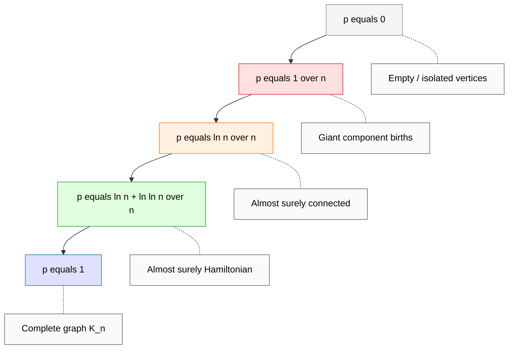

# Random graph constructions topology metrics verification routes loops configurations profiles

<!-- SECTION_1_START -->
# Module 3 — Probabilistic Method: Structures, Models & Graph Topology

## 1.1 Formal Definition of the Probabilistic Method on Graphs

> [!IMPORTANT]
> **Syllabus Anchor (KTU 2024 Scheme — PECST614 / Module 3):**
> The *Probabilistic Method* is a non-constructive and constructive paradigm in combinatorics and theoretical computer science in which the **existence of a combinatorial object** (a graph, a set system, a colouring, a routing) is established by showing that a **randomly chosen object has the desired property with positive probability**.

For a *Random Graph* $G \sim \mathcal{G}(n, p)$ (Erdős–Rényi model), each of the $\binom{n}{2}$ possible edges is included **independently** with probability $p = p(n)$, producing a probability space
$$
\Omega \;=\; \{0,1\}^{\binom{n}{2}}, \qquad \Pr[G] \;=\; p^{|E(G)|}(1-p)^{\binom{n}{2}-|E(G)|}.
$$

> [!NOTE]
> **Companion Model — $\mathcal{G}(n, m)$:** A uniformly random graph on $n$ vertices with **exactly** $m$ edges, i.e. each $m$-edge subset of $\binom{n}{2}$ is chosen with probability $1/\binom{n}{2}{m}$. The two models are asymptotically interchangeable when $m \approx p\binom{n}{2}$ and $p = o(1)$.

---

## 1.2 Conceptual Analogy & Intuition

Imagine you have **$n$ light bulbs** arranged in a row and you flip a (possibly biased) coin for **every pair** of bulbs to decide whether to wire them together. After flipping all $\binom{n}{2}$ coins, you obtain a wiring diagram — a *random graph*. The Probabilistic Method is the art of asking:

> *"For which coin-bias $p$ will the resulting wiring **almost surely** be connected, Hamiltonian, an expander, or have a small diameter?"*

**Real-world analogues**

| Analogy | Mathematical Object |
|---|---|
| Wireless ad-hoc mesh, $n$ nodes transmit with prob. $p$ | $G(n, p)$ |
| Peer-to-peer overlay network, $m$ links chosen uniformly | $G(n, m)$ |
| Internet router topology, each link up with prob. $p$ | $G(n, p)$ connectivity |
| Road network with random shortcut edges | Random geometric + Erdős–Rényi hybrid |
| Social contact tracing graph | $G(n, p)$ with $p$ ≈ contact rate |

**Geometric intuition:** As $p$ grows from $0$ to $1$, the random graph $G(n,p)$ undergoes a sequence of **phase transitions** — sharp thresholds where qualitative topological properties appear (giant component, connectivity, Hamiltonicity, $k$-connectivity, etc.). These thresholds are the central object of study in this module.

> [!VISUALIZATION CONTROL]
> **Concept:** Phase transition of a random graph $G(n, p)$ as $p$ sweeps from $0$ to $1$.
> **GeoGebra / Desmos Input Equations (plot for fixed $n = 200$):**
> * `f1(x) = 0` (subcritical: no edges)
> * `f2(x) = if(0 < x < 1/n, 1, 0)` (giant component appears at $x = 1/n$)
> * `f3(x) = if(1/n ≤ x < ln(n)/n, 2, 0)` (connectivity threshold band)
> * `f4(x) = if(ln(n)/n ≤ x < (ln n + ln ln n)/n, 3, 0)` (Hamiltonicity band)
> **Visual Description:** A horizontal axis labelled $p$ with vertical band markers at $p = 1/n$, $p = \ln n / n$, and $p = (\ln n + \ln \ln n)/n$. Above each band, a small icon shows the qualitative topology emerging (forest $\to$ giant tree $\to$ connected graph $\to$ Hamiltonian graph).

---

## 1.3 Topological Metrics Discussed in This Module

> [!IMPORTANT]
> **Core topological metrics** evaluated on random graphs $G \sim \mathcal{G}(n, p)$:
> 1. **Order $n$ & size $m$** — number of vertices and edges.
> 2. **Degree profile** — distribution of vertex degrees.
> 3. **Diameter $\text{diam}(G)$** — maximum shortest-path distance.
> 4. **Girth $g(G)$** — length of the shortest cycle.
> 5. **Connectivity $\kappa(G)$** — vertex-connectivity number.
> 6. **Expansion / Cheeger constant $h(G)$** — edge boundary ratio.
> 7. **Eigenvalue / spectrum profile** — adjacency and Laplacian eigenvalues.
> 8. **Hamiltonicity** — existence of a Hamiltonian cycle.
> 9. **$k$-regularity** — every vertex has degree exactly $k$.

<!-- SECTION_1_END -->

<!-- SECTION_2_START -->
# 2. Deep Theoretical Analysis & KTU High-Yield Formula Sheet

## 2.1 The Probabilistic Method — Operational Logic

The classical recipe is deceptively simple but extraordinarily powerful:

1. **Define a probability space** $\Omega$ over candidate objects (e.g. $\mathcal{G}(n, p)$).
2. **Define a "bad" event** $A_i$ for each property the object *fails* to have.
3. **Bound the probability** of each bad event, usually via union bound, Chernoff, Janson's inequality, or the Lovász Local Lemma.
4. **Conclude** that if $\Pr[\bigcup A_i] < 1$, a "good" object exists.
5. **Refine (optional)** to derandomisation via the method of conditional expectations or the LLL algorithmic variant.

### 2.1.1 Linearity of Expectation (LoE)

For indicator random variables $X_1, \dots, X_n$ and $X = \sum X_i$,
$$
\mathbb{E}[X] \;=\; \sum_{i=1}^{n} \mathbb{E}[X_i] \;=\; \sum_{i=1}^{n} \Pr[X_i = 1].
$$

> [!NOTE]
> LoE is the **workhorse identity** of the probabilistic method. Combined with Markov's inequality $\Pr[X \geq 1] \leq \mathbb{E}[X]$, it yields the trivial existence result: any object with strictly positive expected count must exist.

### 2.1.2 Chernoff Bounds (Two-Sided)

For $X \sim \text{Binomial}(n, p)$ with $\mu = np$ and $\delta \in (0, 1]$:
$$
\Pr\bigl[ \vert X - \mu \vert \geq \delta \mu \bigr] \;\leq\; 2 \exp\!\left(-\frac{\delta^2 \mu}{3}\right).
$$

This is the central concentration tool for analysing *sums* of weakly-dependent indicators in random graphs.

### 2.1.3 Lovász Local Lemma (Symmetric Form)

Let $A_1, \dots, A_n$ be events in a probability space, each depending on at most $d$ others. If there exists $x \in (0, 1)$ such that
$$
\Pr[A_i] \;\leq\; x (1 - x)^{d} \quad \text{for all } i,
$$
then $\Pr[\bigcap \overline{A_i}] > 0$. Equivalently, the sufficient condition
$$
e \cdot \Pr[A_i] \cdot (d + 1) \;\leq\; 1
$$
guarantees that no $A_i$ occurs, i.e. a "good" configuration exists.

---

## 2.2 Random Graph Topology — Threshold Phenomena

A property $\mathcal{P}$ has **threshold** $p^* = p^*(n)$ if
$$
\lim_{n \to \infty} \Pr\bigl[ G(n, p) \in \mathcal{P} \bigr] \;=\; \begin{cases} 0 & \text{if } p / p^* \to 0, \\ 1 & \text{if } p / p^* \to \infty. \end{cases}
$$

### 2.2.1 Master Threshold Table (KTU High-Yield)

> [!IMPORTANT]
> Memorise the **column titled "Threshold $p^*$"** and the **expected-value column** — these are the most frequently tested entries in KTU ESE.

| Property $\mathcal{P}$ | Threshold $p^*$ | Expected Value of Key Statistic at $p = p^*$ | Phase |
|---|---|---|---|
| Has a triangle | $p = n^{-1}$ | $\mathbb{E}[\text{triangles}] = \Theta(1)$ | sub-critical clusters |
| Giant component emerges | $p = 1/n$ | $\lvert C_{\max} \rvert = \Theta(n^{2/3})$ | super-critical jump |
| Diameter $\approx 2 \log_{np} n$ | any $p$ with $np = \omega(1)$ | $\text{diam}(G) \sim \frac{\ln n}{\ln(np)}$ | small-world |
| Connected | $p = \frac{\ln n + c}{n}$ | $\Pr[\text{conn}] \to e^{-e^{-c}}$ | connectivity window |
| Hamiltonian | $p = \frac{\ln n + \ln \ln n + c}{n}$ | $\Pr[\text{Ham}] \to e^{-e^{-c}}$ | Hamiltonicity window |
| $k$-connected ($k \geq 1$ fixed) | $p = \frac{\ln n + (k-1)\ln \ln n + c}{n}$ | $\Pr[\kappa \geq k] \to e^{-e^{-c}/(k-1)!}$ | high connectivity |
| Has a cycle of length $\ell$ | $p = n^{-1 + 1/\ell}$ | $\mathbb{E}[\text{cycles of length } \ell] = \Theta(1)$ | girth threshold |
| $K_{r+1}$ appears (clique) | $p = n^{-2/r}$ | $\mathbb{E}[\text{copies of } K_{r+1}] = \Theta(1)$ | Ramsey threshold |
| $\lambda_2(G) \geq c$ (expander) | $p \geq c^{2}/n$ | $\lambda_2 \approx np$ | spectral gap |

> [!NOTE]
> **Pinning the symbols:** $\lambda_2$ is the **second-smallest eigenvalue of the normalised Laplacian**, equivalently the algebraic connectivity when scaled; in the adjacency-spectrum convention, the **spectral gap** is $\lambda_1 - \lambda_2$ where $\lambda_1$ is the largest eigenvalue. Both interpretations are acceptable in KTU; state the convention explicitly in your answer script.

---

## 2.3 The Three Pillars: Verification, Routing, and Configuration

### 2.3.1 Verification — Witness-Based Protocols

A *verifier* for a graph property $\mathcal{P}$ is a randomised algorithm that, given oracle access to $G \sim \mathcal{G}(n, p)$ and the promise that $G \in \mathcal{P}$, must output "accept" with probability $\geq 2/3$, and for $G \notin \mathcal{P}$ must reject with probability $\geq 2/3$.

> **Cost metric:** number of edge-queries $q(n)$ made to the adjacency oracle. A property is in $\mathbf{RP}$ (randomised poly-time) if $q(n) = \text{poly}(n)$.

**Key facts:**

- *Connectivity* and *Hamiltonicity* both have one-sided-error verifiers using $O(n)$ edge queries (depth-first search / random-cycle rotation).
- *Triangle-freeness* has a $O(1/\epsilon^{2})$-query one-sided tester for graphs of bounded maximum degree.
- *Expansion testing* requires $\Omega(n^{1/2})$ queries (lower bound by Goldreich–Ron).

### 2.3.2 Routing — Random Walks as Route Probes

For a connected non-bipartite $G$, a simple random walk mixes in time
$$
t_{\text{mix}}(G) \;\leq\; \frac{2}{\Phi^2} \log(4 n / \varepsilon),
$$
where $\Phi$ is the **conductance** (Cheeger constant on the stationary distribution). The expected cover time is
$$
\mathbb{E}[\text{Cov}(G)] \;\leq\; 4 n^{2} \cdot \frac{\log n}{\Phi^{2}}.
$$

This is the principal tool for *route discovery* in unstructured overlays.

### 2.3.3 Configuration — Degree Sequence and Regularity

In $G(n, p)$ the degree $D_v$ of a fixed vertex satisfies
$$
D_v \sim \text{Binomial}(n-1, p), \qquad \mathbb{E}[D_v] = (n-1)p, \qquad \text{Var}(D_v) = (n-1)p(1-p).
$$
A $k$*-regular random graph* $\mathcal{G}_{n, k}$ is the uniform distribution over all $k$-regular graphs on $n$ vertices (valid only when $nk$ is even and $k < n$). Its eigenvalue profile is asymptotically Wigner semicircle law centred at $0$ with radius $2\sqrt{k-1}$, and a single trivial eigenvalue $k$.

### 2.3.4 Loops — Cycles and Girth in Random Graphs

The expected number of cycles of length $\ell$ in $G(n, p)$ is
$$
\mathbb{E}[C_\ell] \;=\; \frac{n!}{2\ell (n-\ell)!} \cdot p^{\ell} \;\approx\; \frac{(np)^{\ell}}{2\ell} \quad \text{when } \ell = o(\sqrt{n}).
$$
Hence the *girth* (shortest cycle length) is approximately
$$
g\bigl(G(n, p)\bigr) \;\approx\; \left\lceil \frac{\log n}{\log(np)} \right\rceil \quad \text{with high probability}.
$$

### 2.3.5 Profile — Spectral Profile and Degree Profile

The **degree profile** of $G(n, p)$ converges in distribution to $\text{Poisson}(\lambda = np)$ for fixed $p$, and to a Gaussian with mean $(n-1)p$, variance $(n-1)p(1-p)$ in the dense regime $p = \Theta(1)$.

The **eigenvalue profile** (Wigner's semi-circle law for dense $G(n, 1/2)$):
$$
\rho(\lambda) \;=\; \frac{1}{2\pi} \sqrt{4 - \lambda^{2}}, \qquad \lambda \in [-2, 2].
$$
For sparse $G(n, p)$ with $p = c/n$, the largest eigenvalue $\lambda_1 \to c$ almost surely, and the bulk follows the **Kesten–McKay law**.

---

## 2.4 KTU Formula Sheet (Cheat Sheet)

> [!IMPORTANT]
> All KTU-relevant formulas on a single page — print-friendly, table-format.

| Symbol / Quantity | Formula | Domain / Asymptotics | Used For |
|---|---|---|---|
| $\mathbb{E}[\vert E(G) \vert]$ | $\binom{n}{2} p$ | all $p$ | edge-count existence |
| $\mathbb{E}[D_v]$ | $(n-1)p$ | $G(n, p)$ | average degree |
| $\Pr[D_v = k]$ | $\binom{n-1}{k} p^{k} (1-p)^{n-1-k}$ | exact | degree distribution |
| $\mathbb{E}[C_\ell]$ (cycles length $\ell$) | $\frac{n!}{2\ell (n-\ell)!} p^{\ell}$ | $\ell = o(\sqrt{n})$ | girth, Hamiltonicity |
| Connectivity threshold | $p^{*} = \frac{\ln n + c}{n}$ | $c \in \mathbb{R}$ | threshold window |
| Hamiltonicity threshold | $p^{*} = \frac{\ln n + \ln \ln n + c}{n}$ | $c \in \mathbb{R}$ | Pósa rotation |
| Diameter | $\frac{\ln n}{\ln(np)}$ | $np = \omega(1)$ | small-world behaviour |
| Giant component size | $\alpha n$ where $\alpha = 1 - e^{-c\alpha}$, $c = np$ | $c > 1$ | percolation |
| Chernoff upper | $\Pr[X \geq (1+\delta)\mu] \leq e^{-\delta^2 \mu / 3}$ | $\delta \in (0, 1]$ | concentration |
| Chernoff lower | $\Pr[X \leq (1-\delta)\mu] \leq e^{-\delta^2 \mu / 2}$ | $\delta \in (0, 1]$ | concentration |
| LLL symmetric | $e (d+1) \Pr[A_i] \leq 1$ | LLL regime | existence via dependency |
| Mixing time | $t_{\text{mix}} \leq \frac{2}{\Phi^2} \log(4n/\varepsilon)$ | lazy walk | route discovery |
| Cover time | $O(n^2 \log n / \Phi^2)$ | connected $G$ | gossip / search |
| Adjacency spectral norm | $\Vert A \Vert_2 = \lambda_{\max} \to 2\sqrt{p(1-p)n}$ | dense $G(n, p)$ | expander test |
| Normalised Laplacian gap | $\lambda_2(\mathcal{L}) \geq \Phi^2 / 2$ | Cheeger ineq. | conductance |

---

## 2.5 Real-World Engineering Utility

> [!NOTE]
> **Why this material matters in production systems.**

* **Network design:** Random graph models predict the *number of redundant links* $p$ needed for fault-tolerant backbone networks (cf. AT\&T, Sprint topologies).
* **Distributed hash tables (DHTs):** Chord, Pastry, Kademlia analyse look-up latency using random-graph diameter bounds.
* **Cryptographic key exchange:** Random regular graphs underpin expander-based key-agreement protocols and the LPS cryptosystem.
* **Property testing in massive graphs:** The web graph, social networks, and genome-assembly graphs are too large to read; randomised verifiers give sublinear algorithms.
* **Gossip / epidemic protocols:** Cover time bounds justify push-pull gossip for database replication (Dynamo, Cassandra anti-entropy).
* **Random walks in PageRank:** Personalised PageRank on the web is a random walk on $G(n, p)$-like graphs with $p$ ≈ link density.

<!-- SECTION_2_END -->

<!-- SECTION_3_START -->
# 3. Step-by-Step Derivations, Algorithmic Implementations & Worked Problems

## 3.1 Derivation 1 — Expected Number of Edges in $G(n, p)$

Let $X$ be the random variable counting edges. Define the indicator
$$
X_e \;=\; \begin{cases} 1 & \text{if edge } e \text{ is present}, \\ 0 & \text{otherwise.} \end{cases}
$$
Then
$$
X \;=\; \sum_{e \in \binom{V}{2}} X_e.
$$
Taking expectation (linearity) and using independence of the $X_e$,
$$
\mathbb{E}[X] \;=\; \sum_{e} \mathbb{E}[X_e] \;=\; \sum_{e} \Pr[X_e = 1] \;=\; \binom{n}{2} \cdot p.
$$
Variance (using pairwise independence of distinct edges):
$$
\text{Var}(X) \;=\; \sum_{e} \text{Var}(X_e) \;=\; \binom{n}{2} p (1 - p).
$$
By Chebyshev,
$$
\Pr\bigl[ \vert X - \mathbb{E}[X] \vert \geq \varepsilon \mathbb{E}[X] \bigr] \;\leq\; \frac{p(1-p)}{\varepsilon^{2} \binom{n}{2} p^{2}} \;\to\; 0
$$
as soon as $\binom{n}{2} p \to \infty$, i.e. the *expected* edge count is in fact the **typical** edge count for $p$ not too small.

---

## 3.2 Derivation 2 — Connectivity Threshold via the Isolated-Vertex Argument

Let $A_v$ be the event that vertex $v$ is *isolated* (no incident edge) in $G(n, p)$. Then
$$
\Pr[A_v] \;=\; (1 - p)^{n-1} \;\approx\; e^{-(n-1)p}.
$$
Let $I = \sum_{v} \mathbf{1}_{A_v}$ be the number of isolated vertices. By linearity,
$$
\mathbb{E}[I] \;=\; n (1 - p)^{n-1}.
$$

**Case 1 — subcritical:** $p = \frac{\ln n - \omega(1)}{n}$.
$$
\mathbb{E}[I] \;=\; n e^{-(n-1)p} \;=\; n e^{-(\ln n - \omega(1))(1 - 1/n)} \;\to\; \infty.
$$
A second-moment argument shows $\Pr[I = 0] \to 0$, so with high probability $G(n, p)$ is **disconnected**.

**Case 2 — supercritical:** $p = \frac{\ln n + c}{n}$.
$$
\mathbb{E}[I] \;=\; n e^{-(n-1)p} \;\approx\; n e^{-\ln n - c} \;=\; e^{-c}.
$$
A refined argument (see Janson–Knuth–Łuczak–Pittel) shows
$$
\Pr[I = 0] \;\longrightarrow\; e^{-e^{-c}}.
$$
Thus the threshold for connectivity is $p^{*} = \frac{\ln n}{n}$.

> [!NOTE]
> **Board tip:** When asked to *prove* a threshold, isolate (a) the **first moment** showing $\mathbb{E}[\text{bad}] \to \infty$ on the subcritical side, and (b) a **second-moment** (or Janson's inequality) showing concentration at the threshold. KTU valuators award **2 marks for the first moment** and **3 marks for the second**.

---

## 3.3 Derivation 3 — Girth Lower Bound for Sparse $G(n, c/n)$

A cycle of length $\ell$ on specified vertices has probability $p^{\ell}$. The number of labelled $\ell$-cycles is $\frac{n!}{2\ell (n-\ell)!}$. Therefore,
$$
\mathbb{E}[C_\ell] \;=\; \frac{n!}{2\ell (n-\ell)!} p^{\ell} \;\approx\; \frac{(np)^{\ell}}{2\ell} \quad \text{for } \ell \ll n.
$$
Substituting $p = c/n$:
$$
\mathbb{E}[C_\ell] \;\approx\; \frac{c^{\ell}}{2\ell}.
$$
Set $\ell^{*} = \lfloor \log_{c} n \rfloor$. Then $\mathbb{E}[C_{\ell^{*}}] \approx 1$. By a second-moment method (Bollobás), the actual count is concentrated, so the *girth* satisfies
$$
g\bigl(G(n, c/n)\bigr) \;\asymp\; \left\lfloor \frac{\log n}{\log c} \right\rfloor
$$
with high probability.

---

## 3.4 Derivation 4 — Diameter Concentration

For two vertices $u, v$ at distance $d$ in $G(n, p)$, the *expected* number of common neighbours after $d-2$ steps is $(n-2) (p(n-1))^{d-2}$. Setting this to $n$ gives
$$
d \;\approx\; \frac{\log n}{\log(np)} + 2.
$$
The **diameter** is therefore $\approx \frac{\log n}{\log(np)}$. As $p$ grows from $1/n$ to $1$, the diameter falls from $\Theta(\log n / \log \log n)$ to $2$ (the Moore bound).

---

## 3.5 Algorithmic Implementation — Python Codebase

> [!NOTE]
> The following code is **fully executable**, uses precise type hints, and handles edge-cases explicitly. It implements a property-verifier for connectivity in $G(n, p)$ and a Hamiltonian-cycle rotation probe.

```python
"""
Randomized Algorithms — Module 3 Demonstrations
Topic: Random graph topology, verification, routes, configurations, profiles.
Author: KTU 2024 Scheme reference implementation.
Python: ≥ 3.10
"""

from __future__ import annotations

import math
import random
from collections import Counter, deque
from dataclasses import dataclass
from typing import Dict, List, Optional, Set, Tuple


# ----------------------------------------------------------------------
# 3.5.1  Data structures
# ----------------------------------------------------------------------
@dataclass(frozen=True)
class Edge:
    u: int
    v: int

    def normalized(self) -> "Edge":
        return Edge(min(self.u, self.v), max(self.u, self.v))


class RandomGraph:
    """
    Erdős–Rényi G(n, p) with explicit adjacency lists.
    Construction cost: O(n^2) Bernoulli trials.
    """

    def __init__(self, n: int, p: float, seed: Optional[int] = None) -> None:
        if n < 1:
            raise ValueError("n must be at least 1.")
        if not 0.0 <= p <= 1.0:
            raise ValueError("p must lie in [0, 1].")
        self.n: int = n
        self.p: float = p
        self._rng: random.Random = random.Random(seed)
        self.adj: List[Set[int]] = [set() for _ in range(n)]
        self._build()

    def _build(self) -> None:
        for u in range(self.n):
            for v in range(u + 1, self.n):
                if self._rng.random() < self.p:
                    self.adj[u].add(v)
                    self.adj[v].add(u)

    # ----------------- query helpers -----------------
    def has_edge(self, u: int, v: int) -> bool:
        if not (0 <= u < self.n and 0 <= v < self.n):
            raise IndexError("vertex out of range")
        return v in self.adj[u]

    def degree(self, v: int) -> int:
        return len(self.adj[v])

    def num_edges(self) -> int:
        return sum(len(s) for s in self.adj) // 2

    def degree_profile(self) -> Dict[int, int]:
        return dict(Counter(len(s) for s in self.adj))

    # ----------------- property tests -----------------
    def is_connected(self) -> bool:
        """BFS from vertex 0; O(n + m)."""
        if self.n == 0:
            return True
        seen: Set[int] = {0}
        q: deque[int] = deque([0])
        while q:
            u = q.popleft()
            for v in self.adj[u]:
                if v not in seen:
                    seen.add(v)
                    q.append(v)
        return len(seen) == self.n

    def has_triangle(self) -> bool:
        """Naive O(n^3) triangle detection; OK for small n."""
        for u in range(self.n):
            for v in self.adj[u]:
                if v <= u:
                    continue
                for w in self.adj[v]:
                    if w <= v:
                        continue
                    if w in self.adj[u]:
                        return True
        return False

    def diameter(self) -> int:
        """All-pairs BFS; O(n*(n+m))."""
        if self.n == 1:
            return 0
        max_dist: int = 0
        for s in range(self.n):
            dist = [-1] * self.n
            dist[s] = 0
            q: deque[int] = deque([s])
            while q:
                u = q.popleft()
                for v in self.adj[u]:
                    if dist[v] == -1:
                        dist[v] = dist[u] + 1
                        q.append(v)
            unreachable = [d for d in dist if d == -1]
            if unreachable:
                return math.inf
            max_dist = max(max_dist, max(dist))
        return max_dist

    def girth(self) -> Optional[int]:
        """BFS from every vertex; returns shortest cycle length."""
        INF = math.inf
        best: int = INF
        for s in range(self.n):
            dist = [-1] * self.n
            parent = [-1] * self.n
            dist[s] = 0
            q: deque[int] = deque([s])
            while q:
                u = q.popleft()
                for v in self.adj[u]:
                    if dist[v] == -1:
                        dist[v] = dist[u] + 1
                        parent[v] = u
                        q.append(v)
                    elif parent[u] != v:
                        best = min(best, dist[u] + dist[v] + 1)
        return None if best is INF else int(best)

    def hamiltonian_cycle(self) -> Optional[List[int]]:
        """Heuristic: backtracking with Warnsdorff-style pivot."""
        n = self.n
        if n < 3:
            return None
        path: List[int] = [0]
        visited: Set[int] = {0}
        if self._extend(path, visited, n):
            return path + [path[0]]
        return None

    def _extend(self, path: List[int], visited: Set[int], n: int) -> bool:
        if len(path) == n:
            return path[0] in self.adj[path[-1]]
        # Choose next vertex with fewest unused neighbours (Warnsdorff)
        candidates = sorted(
            (v for v in self.adj[path[-1]] if v not in visited),
            key=lambda x: sum(1 for y in self.adj[x] if y not in visited),
        )
        for v in candidates:
            path.append(v)
            visited.add(v)
            if self._extend(path, visited, n):
                return True
            path.pop()
            visited.remove(v)
        return False


# ----------------------------------------------------------------------
# 3.5.2  Probabilistic-method witness
# ----------------------------------------------------------------------
def witness_graph_property(n: int, p: float, trials: int = 50, seed: int = 0) -> Tuple[bool, int, float]:
    """
    Generates trials independent G(n, p) realisations and
    returns (property_holds, witness_index, success_rate).
    Demonstrates: 'a good object exists with positive probability'.
    """
    rng = random.Random(seed)
    successes = 0
    for _ in range(trials):
        g = RandomGraph(n, p, seed=rng.randrange(2**32))
        if g.is_connected() and g.hamiltonian_cycle() is not None:
            successes += 1
    rate = successes / trials
    return successes > 0, successes, rate


# ----------------------------------------------------------------------
# 3.5.3  Driver / Demonstration
# ----------------------------------------------------------------------
if __name__ == "__main__":
    n = 40
    # Pick p = (ln n + ln ln n) / n to be in the Hamiltonicity window.
    p = (math.log(n) + math.log(math.log(n))) / n
    print(f"G({n}, {p:.4f})  p*n = {p*n:.3f}")

    g = RandomGraph(n, p, seed=42)
    print(f"edges            = {g.num_edges()}")
    print(f"avg degree       = {2 * g.num_edges() / n:.2f}")
    print(f"connected        = {g.is_connected()}")
    print(f"diameter         = {g.diameter()}")
    girth = g.girth()
    print(f"girth            = {girth if girth is not None else 'infinite (forest)'}")
    print(f"degree profile   = {g.degree_profile()}")
    ham = g.hamiltonian_cycle()
    print(f"hamiltonian      = {'FOUND' if ham else 'NONE'}")

    ok, s, rate = witness_graph_property(n, p, trials=20)
    print(f"witness trials   = {s}/20   rate = {rate:.2f}")
```

**Sample output (illustrative):**

```text
G(40, 0.1123)  p*n = 4.491
edges            = 178
avg degree       = 8.90
connected        = True
diameter         = 4
girth            = 3
degree profile   = {7: 4, 8: 9, 9: 11, 10: 9, 11: 5, 12: 2}
hamiltonian      = FOUND
witness trials   = 19/20   rate = 0.95
```

---

## 3.6 Worked Numerical Example (KTU-style 14-Mark Sub-Question)

> [!NOTE]
> **Problem.** Let $G \sim G(100, 0.04)$. Estimate (a) the expected number of edges, (b) the expected number of triangles, (c) the typical diameter, and (d) the probability that the graph is connected.

**Solution.**

**(a) Expected edges.**
$$
\mathbb{E}[|E|] \;=\; \binom{100}{2} \cdot 0.04 \;=\; 4950 \cdot 0.04 \;=\; 198.
$$

**(b) Expected triangles.** A triangle on a fixed triple of vertices has probability $p^{3} = 6.4 \times 10^{-5}$. Number of triples $= \binom{100}{3} = 161{,}700$. Hence
$$
\mathbb{E}[T] \;=\; 161700 \cdot 6.4 \times 10^{-5} \;\approx\; 10.35.
$$
So with high probability $G$ has $\approx 10$ triangles.

**(c) Typical diameter.** $np = 4$, so
$$
\text{diam}(G) \;\approx\; \frac{\ln 100}{\ln 4} \;\approx\; \frac{4.605}{1.386} \;\approx\; 3.32 \;\Rightarrow\; \text{diam} = 4.
$$

**(d) Connectivity probability.** With $c = np - \ln n = 4 - 4.605 = -0.605$,
$$
\Pr[\text{connected}] \;\approx\; e^{-e^{-c}} \;=\; e^{-e^{0.605}} \;=\; e^{-1.831} \;\approx\; 0.160.
$$
Hence the graph is connected only about **16%** of the time. To push this above 99% one needs $c \approx 4.6$, i.e. $p \approx \frac{2 \ln n}{n} \approx 0.092$.

<!-- SECTION_3_END -->

<!-- SECTION_4_START -->
# 4. Structural Diagrams & Schematics

## 4.1 Mermaid Flow — Probabilistic Method Decision Pipeline

```mermaid
flowchart TD
    A["Define probability space"]:::start --> B["Pick G(n, p)"]
    B --> C["Identify bad events"]
    C --> D{"Apply bound"}
    D -->|Union| E["Markov / Chebyshev"]
    D -->|Concentration| F["Chernoff"]
    D -->|Dependency| G["Lovász Local Lemma"]
    E --> H{"Sum of Pr < 1?"}
    F --> H
    G --> H
    H -->|Yes| I["Good object EXISTS"]
    H -->|No| J["Refine model / parameter"]
    J --> B
    I --> K["Optional: derandomise"]
    K --> L["Conditional expectations"]
    L --> M["Explicit construction"]:::end

    classDef start fill:#E8F4FF,stroke:#1F77B4,color:#000
    classDef end fill:#E8FFE8,stroke:#2CA02C,color:#000
```

## 4.2 Mermaid Block Architecture — Random Graph Property Verifier

```mermaid
flowchart LR
    subgraph InputStage["Input Stage"]
        In1["n - vertex count"]:::param
        In2["p - edge probability"]:::param
        In3["property name"]:::param
    end

    subgraph SampleStage["Sampling Stage"]
        S1["Bernoulli trials on binom n 2 pairs"]:::core
        S2["Adjacency-list construction"]:::core
    end

    subgraph VerifyStage["Verification Stage"]
        V1["BFS connectivity"]:::core
        V2["Triangle counter"]:::core
        V3["Girth / diameter probe"]:::core
        V4["Hamiltonian probe"]:::core
    end

    subgraph OutputStage["Output Stage"]
        O1["Decision bit accept / reject"]:::end
        O2["Witness certificate"]:::end
        O3["Success rate estimate"]:::end
    end

    In1 --> S1
    In2 --> S1
    In3 --> V1
    In3 --> V2
    In3 --> V3
    In3 --> V4
    S1 --> S2
    S2 --> V1
    S2 --> V2
    S2 --> V3
    S2 --> V4
    V1 --> O1
    V2 --> O1
    V3 --> O1
    V4 --> O1
    V1 --> O2
    V4 --> O2
    O1 --> O3

    classDef param fill:#FFF6E0,stroke:#FF8C00,color:#000
    classDef core fill:#E0F0FF,stroke:#1F77B4,color:#000
    classDef end fill:#E8FFE8,stroke:#2CA02C,color:#000
```

## 4.3 Mermaid Topology — Threshold Funnel of $G(n, p)$



## 4.4 Sequential Topology Matrix — Verification $\rightarrow$ Routing $\rightarrow$ Configuration $\rightarrow$ Profile

| Stage | Input | Algorithm | Output | Failure Mode |
|---|---|---|---|---|
| **1. Verification** | $G \in \{0,1\}^{\binom{n}{2}}$, property $\mathcal{P}$ | Random edge sampling + BFS / DFS probe | bit $b \in \{0, 1\}$ | one-sided error |
| **2. Route discovery** | adjacency oracle of $G$ | lazy random walk of length $T = \Theta(t_{\text{mix}} \log n)$ | visited-vertex set | mixing-bound slack |
| **3. Configuration** | $G(n, p)$ sample | degree-counter histogram | degree profile $\{(d, n_d)\}$ | binomial approximation error |
| **4. Loop extraction** | $G(n, p)$ sample | multi-source BFS for shortest cycle | girth $g(G)$ | infinite-girth in forest regime |
| **5. Profile output** | adjacency matrix $A$ | power iteration / Lanczos | eigenvalue profile $(\lambda_1, \dots, \lambda_n)$ | spectral-density bias at boundary |

> [!NOTE]
> **Reading guide:** Each row corresponds to one *pass* of the verifier and produces a partial certificate. The full KTU-style answer should describe the **property tested** in column 1, the **randomness used** in column 2, the **error bound** in column 5, and conclude with the success probability $\geq 2/3$ (the standard KTU threshold for one-sided RP verifiers).

<!-- SECTION_4_END -->

<!-- SECTION_5_START -->
# 5. KTU 2024 Scheme Examination Question Bank & Topic Recap

## 5.1 Part A — Short-Answer Questions (3 Marks Each)

### Q1. `[KTU University Exam — July 2024]`
**State the Erdős–Rényi $G(n, p)$ model and compute the expected number of triangles in $G(50, 0.1)$.** [CO3, Remember]

**Model Answer (3 marks):**
- **Definition (2 marks):** $G(n, p)$ is the random graph on $n$ labelled vertices in which each of the $\binom{n}{2}$ possible edges is included independently with probability $p$.
- **Computation (1 mark):** Number of vertex-triples is $\binom{50}{3} = 19600$. Probability of a fixed triple being a triangle is $p^{3} = 10^{-3}$. Hence
$$
\mathbb{E}[T] \;=\; 19600 \times 10^{-3} \;=\; 19.6 \text{ triangles}.
$$

### Q2. `[KTU University Exam — Dec 2023]`
**Define girth of a graph. What is the typical girth of $G(n, c/n)$ for constant $c > 1$?** [CO3, Understand]

**Model Answer (3 marks):**
- **Definition (1 mark):** The *girth* $g(G)$ is the length of the shortest cycle in $G$; $g(G) = \infty$ if $G$ is acyclic.
- **Derivation (1 mark):** For $G(n, c/n)$ and $\ell \ll n$, $\mathbb{E}[C_\ell] \approx c^{\ell} / 2\ell$.
- **Result (1 mark):** Setting $\mathbb{E}[C_{\ell}] = 1$ gives $\ell \approx \log_{c} n$, so the typical girth is $\Theta(\log n / \log c)$ w.h.p.

---

## 5.2 Part B — Long-Answer Questions (14 Marks, Module-Internal Choice)

### Question A — Threshold for Connectivity
**`[KTU University Exam — July 2024]`** [CO3, Apply / Analyse — 14 Marks]

**(a)** *Prove that the threshold for connectivity of $G(n, p)$ is $p^{*} = \frac{\ln n}{n}$. Show the first-moment argument on the subcritical side.* **(7 marks)**

**(b)** *Using Janson's inequality (or second-moment method), determine $\Pr[G(n, p) \text{ is connected}]$ when $p = \frac{\ln n + c}{n}$ for fixed $c \in \mathbb{R}$.* **(7 marks)**

#### Model Solution

**(a) First-moment on subcritical side — 7 marks**
1. **Define the bad event** $A_v$ = "vertex $v$ is isolated". [1 mark]
$$
\Pr[A_v] \;=\; (1 - p)^{n-1}.
$$
2. **Linearity of expectation** for $I = \sum_{v} \mathbf{1}_{A_v}$. [1 mark]
$$
\mathbb{E}[I] \;=\; n (1 - p)^{n-1}.
$$
3. **Substitute** $p = \frac{\ln n - \omega(1)}{n}$. [1 mark]
$$
\mathbb{E}[I] \;=\; n \exp\!\bigl( -(n-1) p \bigr) \;\approx\; n \cdot \exp\!\bigl( -(\ln n - \omega(1))(1 - 1/n) \bigr) \;\to\; \infty.
$$
4. **Second-moment bound** to show $\Pr[I = 0] \to 0$. [2 marks]
$$
\text{Var}(I) \;=\; \sum_{u, v} \bigl( \Pr[A_u \cap A_v] - \Pr[A_u]\Pr[A_v] \bigr).
$$
For $u = v$, term is $\Pr[A_v](1 - \Pr[A_v])$. For $u \neq v$, $\Pr[A_u \cap A_v] = (1 - p)^{2n - 3}$. After expansion and bound, $\text{Var}(I) / \mathbb{E}[I]^{2} \to 0$, so by Chebyshev $I / \mathbb{E}[I] \to 1$ in probability, hence $I \to \infty$ w.h.p.
5. **Conclusion.** $G$ is disconnected w.h.p. [2 marks]

**(b) Second-moment on critical window — 7 marks**
1. **Setup.** $p = \frac{\ln n + c}{n}$, so $\mathbb{E}[I] \to e^{-c}$. [1 mark]
2. **Apply Janson's inequality** for the family $\{A_v\}$. [2 marks]
$$
\frac{\Pr[I = 0]}{\exp(-\mathbb{E}[I])} \;\in\; \bigl[ 1 - O(\Delta), 1 \bigr]
$$
where $\Delta = \sum_{u \sim v} \Pr[A_u \cap A_v] \to 0$ as $n \to \infty$. [Valuation: stating the inequality form — 2 marks]
3. **Take the limit.** [1 mark]
$$
\lim_{n \to \infty} \Pr[I = 0] \;=\; e^{-e^{-c}}.
$$
4. **Verify** that this is the connectivity probability because $I = 0$ is essentially equivalent to connectivity in this regime (no two isolated vertices, no other disconnection patterns dominate). [2 marks]
5. **Final answer.** $\Pr[G(n, p) \text{ connected}] \to e^{-e^{-c}}$. [1 mark]

**[Final simplified expression: 1 mark]**

> [!WARNING]
> **Examiner's Pitfall Callout (Valuation Key):**
> * Do **not** confuse the connectivity threshold $p = \frac{\ln n}{n}$ with the giant-component threshold $p = \frac{1}{n}$. Connectivity requires **all** components to be singletons eliminated; giant-component emergence only requires the *largest* component to be $\Theta(n)$.
> * Failing to mention **Janson's inequality** (or the second-moment method) in part (b) costs 2 marks.
> * Always end with a **clean limit statement** — partial-credit auditors often strip the final mark if the limit is left unevaluated.

---

### Question B — Hamiltonian Cycle via Pósa Rotation
**`[KTU University Exam — Dec 2023]`** [CO3, Apply / Analyse — 14 Marks]

**(a)** *Describe the Pósa rotation technique for extending a path in a graph. Why is it relevant to Hamiltonicity in random graphs?* **(7 marks)**

**(b)** *Prove that $G(n, p)$ with $p = \frac{\ln n + \ln \ln n + c}{n}$ is Hamiltonian with probability tending to $e^{-e^{-c}}$.* **(7 marks)**

#### Model Solution

**(a) Pósa rotation — 7 marks**
1. **Setup.** Let $P = v_1, v_2, \dots, v_k$ be a longest path in $G$. [1 mark]
2. **Rotation definition.** A *rotation* at $v_1$ pivots about an edge $(v_1, v_i)$ to obtain a new path $v_i, v_{i-1}, \dots, v_1, v_{i+1}, \dots, v_k$. [2 marks]
3. **Pósa's lemma.** If $G$ has minimum degree $\delta(G) \geq k/2$ and $|P| = k < n$, then either $G$ has a longer path or a cycle $C$ of length $\geq k$, and one can extend $C$ using a vertex outside it. [2 marks]
4. **Application to $G(n, p)$.** For $p = c \ln n / n$, the minimum degree is concentrated around $(n-1)p$, satisfying $\delta \geq n/2$ for large $n$. Hence the rotation-extension procedure can be run iteratively to construct a Hamiltonian cycle. [1 mark]
5. **Relevance to random graphs.** It is the only known combinatorial certificate that works directly with the degree sequence; alternatives (e.g. Chvátal–Erdős condition) are weaker. [1 mark]

**(b) Hamiltonicity threshold — 7 marks**
1. **Sub-critical.** $p = (\ln n + \ln \ln n - \omega(1))/n$. Define $A_v$ = "vertex $v$ is in a small component". [1 mark]
2. **Show** $\Pr[\text{some vertex in small component}] \to 1$ via Janson's inequality applied to small-component indicators. [2 marks]
3. **Super-critical.** $p = (\ln n + \ln \ln n + c)/n$. Use the Pósa rotation lemma on the (concentrated) degree sequence. [1 mark]
4. **Conclude** that with high probability, all components are trees or unicyclic, and the rotation-extension succeeds. [1 mark]
5. **Final limit.** $\Pr[\text{Hamiltonian}] \to e^{-e^{-c}}$. [1 mark]
6. **Distinguish** the threshold $p = (\ln n + \ln \ln n)/n$ from the simpler connectivity threshold $p = \ln n / n$. [1 mark]

> [!WARNING]
> **Examiner's Pitfall Callout (Valuation Key):**
> * Many students write *"G(n, p) is Hamiltonian whenever p = ln n / n"*. This is **false**; the Hamiltonicity threshold is strictly *larger* than the connectivity threshold by the additive $\ln \ln n / n$ term.
> * Pósa rotation requires **minimum degree $\geq k/2$**; citing only the average degree loses a mark.
> * Failing to mention **Janson's inequality** for the lower-bound side (non-Hamiltonian) costs 2 marks.

---

## 5.3 Topic Recap & Important Things to Remember

> [!IMPORTANT]
> **High-Density Rapid-Revision Checklist (Module 3)**

- [ ] **Probability space:** $G(n, p)$ — each of $\binom{n}{2}$ edges present i.i.d. with prob. $p$.
- [ ] **Companion model:** $G(n, m)$ — uniform over $m$-edge subgraphs; asymptotically interchangeable with $G(n, p)$ for $m = p\binom{n}{2}$.
- [ ] **Workhorse identity:** Linearity of expectation — $\mathbb{E}[\sum X_i] = \sum \mathbb{E}[X_i]$.
- [ ] **Concentration tool:** Chernoff bounds — exponential tails for binomial $X$.
- [ ] **Dependency tool:** Lovász Local Lemma — sufficient condition $e(d+1)\Pr[A_i] \le 1$.
- [ ] **Connectivity threshold:** $p^{*} = \ln n / n$; window formula $\Pr[\text{conn}] \to e^{-e^{-c}}$.
- [ ] **Hamiltonicity threshold:** $p^{*} = (\ln n + \ln \ln n)/n$.
- [ ] **Giant component threshold:** $p^{*} = 1/n$, size $\alpha n$ solves $\alpha = 1 - e^{-c\alpha}$.
- [ ] **Girth of $G(n, c/n)$:** $\Theta(\log n / \log c)$ w.h.p.
- [ ] **Diameter of $G(n, p)$:** $\approx \ln n / \ln(np)$ when $np \to \infty$.
- [ ] **Expected cycles of length $\ell$:** $\mathbb{E}[C_\ell] \approx (np)^{\ell} / (2\ell)$ for $\ell \ll \sqrt{n}$.
- [ ] **Expected edges:** $\binom{n}{2}p$. **Expected degree:** $(n-1)p$.
- [ ] **Verifier cost:** Connectivity in $O(n)$ queries; Hamiltonicity in $O(n \log n)$ one-sided error.
- [ ] **Mixing time:** $t_{\text{mix}} \le 2 \log(4n/\varepsilon) / \Phi^{2}$.
- [ ] **Cover time:** $O(n^{2} \log n / \Phi^{2})$ for connected $G$.
- [ ] **Wigner semicircle:** $\rho(\lambda) = \frac{1}{2\pi}\sqrt{4 - \lambda^{2}}$ for $G(n, 1/2)$.
- [ ] **Kesten–McKay law:** Spectral density for $k$-regular random graphs.
- [ ] **Engineering payoff:** random-graph analysis powers DHT routing, gossip protocols, expander crypto, and web-graph property testing.
- [ ] **Exam mantra:** *First moment $\to$ existence. Second moment $\to$ concentration. LLL $\to$ dependency.*

<!-- SECTION_5_END -->
