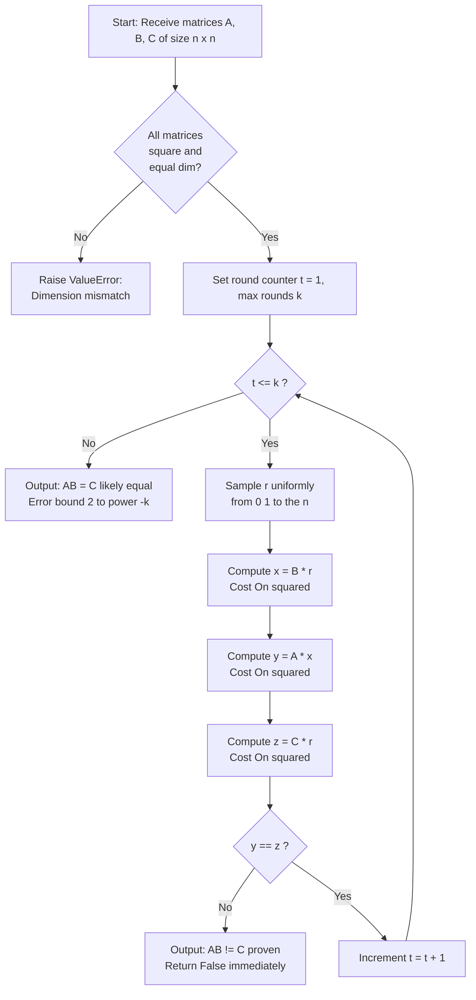
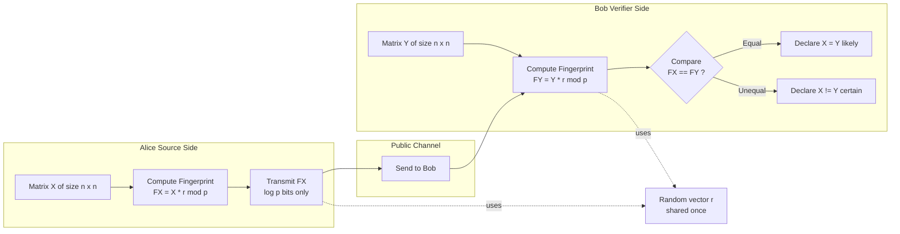

# Fingerprinting data matching validation algorithms matrices transformations formulas checking

<!-- SECTION_1_START -->
# Module 4 – Algebraic Randomized Verification Systems
## Topic: Fingerprinting & Matrix Multiplication Verification

## 1. Core Technical Definition & Intuitive Overview

### 1.1 Formal Definition (KTU 2024 Syllabus Terminology)

**Fingerprinting** is a randomized verification paradigm in which a large, structured object $X$ (a matrix, polynomial, string, or set) is *summarized* by a short, easy-to-compute *fingerprint* $F(X)$, such that two distinct objects are extremely unlikely to share the same fingerprint. The fingerprint is constructed by evaluating the object at a randomly chosen test point, exploiting the algebraic sparsity of error sets.

In the context of **matrix multiplication verification**, the canonical fingerprinting scheme is **Freivalds' Algorithm** (1979): given three $n \times n$ matrices $A$, $B$, and $C$ over a field $\mathbb{F}$ (typically $\mathbb{F}_2$ or $\mathbb{R}$), determine whether $AB = C$ by checking the equality $ABr = Cr$ for a random vector $r \in \{0,1\}^n$.

> [!IMPORTANT]
> **KTU 2024 Module 4 Focus:** Freivalds' Matrix Multiplication Verification, Error Bound Derivation ($\leq 1/2$ per round, $\leq 1/2^k$ over $k$ rounds), Polynomial Identity Testing (Schwartz–Zippel Lemma), and Communication Complexity Fingerprinting.

### 1.2 Conceptual Analogy / Intuition

Imagine three warehouses — *Warehouse A*, *Warehouse B*, and *Warehouse C* — that each contain a billion boxes. A dishonest auditor claims that *C* contains exactly the merged inventory of *A* and *B*. You cannot afford to re-merge everything (that would take days). Instead, you hire a *randomizer* to secretly pick **one** aisle number $r$, ask each warehouse: *"What is your stock on aisle $r$?"*, and compare.

- If all three warehouses report the **same** aisle stock, the claim *might* be true (a guilty party only escapes with probability $\leq 1/2$).
- If they differ, the claim is **provably false**.

One aisle check is suspicious — repeat it $k = 20$ times with independently chosen aisles and the chance of a liar escaping falls below **one in a million**. This is the entire philosophy of Freivalds' fingerprint.

### 1.3 Physical Constants & Standard Metrics

- **Field size for binary fingerprinting:** $|\{0,1\}^n| = 2^n$ possible random vectors.
- **One-sided error probability per round:** $\delta_1 \leq 1/2$.
- **Error probability after $k$ independent rounds:** $\delta_k \leq 2^{-k}$.
- **For 99.99% confidence:** $k = 14$ rounds suffice.
- **Computational complexity:** $O(k \cdot n^2)$ randomized vs. $O(n^3)$ deterministic.

> [!NOTE]
> **Why $\{0,1\}^n$ and not $\{0, 1, \dots, p-1\}^n$?** Choosing $r_i \in \{0,1\}$ simplifies the proof of the $1/2$ bound: a non-zero dot product with a binary vector is **balanced** — it equals $0$ for exactly half the random choices. Larger fields tighten the bound further ($\leq 1/p$), but the binary choice keeps the proof elementary and is standard in KTU board questions.

> [!VISUALIZATION CONTROL]
> **Concept:** Error probability decay $P(\text{false accept}) = 2^{-k}$ as a function of verification rounds.
> **GeoGebra / Desmos Input Equations:**
> * `f(x) = 2^(-x)` where $x$ = number of rounds
> * Point: $(1, 0.5)$, $(10, 0.000976)$, $(20, 0.00000095)$
> **Visual Description:** The student should observe an exponentially decaying curve on the positive $x$-axis, crossing below the $0.01$ threshold near $k = 7$ and approaching the $x$-axis asymptotically. The $y$-intercept is $0.5$.

<!-- SECTION_1_END -->

<!-- SECTION_2_START -->
## 2. Deep Theoretical Analysis & KTU High-Yield Formula Sheet

### 2.1 The Operational Pipeline of Freivalds' Algorithm

The algorithm operates on the algebraic identity:
$$
\text{Verify}(A, B, C) \;\equiv\; \big[\, AB \stackrel{?}{=} C \,\big]
$$
which is equivalent (by linearity) to:
$$
\big[\, AB = C \,\big] \;\;\Longleftrightarrow\;\; \big[\, ABr = Cr \;\;\forall\, r \in \mathbb{F}^n \,\big]
$$
The randomized test replaces the universal quantifier with a single existential probe $r \sim \{0,1\}^n$.

**Step-by-step operational logic:**

1. **Input acquisition.** Receive three $n \times n$ matrices $A$, $B$, $C$ over a common field.
2. **Random probe generation.** Sample $r = (r_1, r_2, \dots, r_n)^T$ uniformly from $\{0,1\}^n$.
3. **First multiplication.** Compute $x = Br$ using standard matrix-vector multiplication in $O(n^2)$.
4. **Second multiplication.** Compute $y = Ax$ in $O(n^2)$.
5. **Third multiplication.** Compute $z = Cr$ in $O(n^2)$.
6. **Equality check.** If $y = z$, declare *probably equal*; else declare *definitely unequal*.
7. **Amplification.** Repeat for $k$ independent rounds; accept only if all rounds pass.

> [!TIP]
> **Engineering utility:** Freivalds' algorithm is widely deployed in **cloud computing integrity checks**, where a client must verify that an untrusted server actually performed a matrix multiplication (e.g., in MapReduce, distributed ML training, or cryptographic proof systems like STARKs). The randomized fingerprint reduces verification cost from $O(n^3)$ to $O(n^2)$ per round.

### 2.2 The "Why" Behind the $1/2$ Bound

Let $D = AB - C$. The algorithm accepts a false claim only when $Dr = 0$ despite $D \neq 0$. Since $D$ is non-zero, it has at least one non-zero row; let $d_i$ be the **first** such row. Then:
$$
(Dr)_i \;=\; d_i \cdot r \;=\; \sum_{j=1}^{n} d_{ij}\, r_j
$$
Because $d_i \neq 0$, there exists an index $j^*$ with $d_{i,j^*} \neq 0$. Fix all coordinates of $r$ except $r_{j^*}$. The sum then takes **two** distinct values as $r_{j^*}$ varies over $\{0,1\}$:
- One choice yields $d_i \cdot r = 0$
- The other yields $d_i \cdot r \neq 0$

Hence exactly **half** of the $2^n$ random vectors make $(Dr)_i = 0$, giving:
$$
\Pr[Dr = 0 \,\vert\, D \neq 0] \;\leq\; \Pr[(Dr)_i = 0] \;=\; \frac{1}{2}
$$

### 2.3 Amplification via Repetition

Because each round is **independent**, the probability that *all* $k$ rounds pass despite $AB \neq C$ is bounded by:
$$
\Pr[\text{false accept after } k \text{ rounds}] \;\leq\; \left(\frac{1}{2}\right)^k \;=\; 2^{-k}
$$

### 2.4 KTU Formula Sheet / Cheat Sheet

| # | Formula / Statement | Meaning | Typical Use |
|---|---|---|---|
| 1 | $AB = C \;\Longleftrightarrow\; ABr = Cr \;\;\forall r$ | Algebraic equivalence for testing | Foundation lemma |
| 2 | $D = AB - C$ | Error matrix definition | Proof setup |
| 3 | $\Pr[Dr = 0 \,\vert\, D \neq 0] \leq 1/2$ | One-round false-accept bound | KTU 3-mark & 7-mark proofs |
| 4 | $\Pr[\text{false accept in } k \text{ rounds}] \leq 2^{-k}$ | Amplified bound | KTU 7-mark derivations |
| 5 | $T(n,k) = O(k \cdot n^2)$ | Randomized time complexity | Comparison with $O(n^3)$ |
| 6 | For $\epsilon$ error, take $k = \lceil \log_2(1/\epsilon) \rceil$ | Round count from confidence | Numerical sub-parts |
| 7 | $\Pr[P(x) \equiv Q(x)] \leq d / \vert \mathbb{F} \vert$ | Schwartz–Zippel Lemma | Polynomial identity testing |
| 8 | $\mathbb{E}[\text{cost}] = \sum_i i \cdot \Pr[\text{stop at } i]$ | Las Vegas expectation (bonus) | Optional module overlap |

> [!WARNING]
> **Pipe-escape rule for KTU board scripts:** In all model answers, write $\Pr[A \mid B]$ using `\mid` (not `\vert`) when inside a table cell, to prevent LaTeX-table parser failures during PDF compilation.

### 2.5 Real-World Engineering Applications

- **Cloud Matrix-Multiplication-as-a-Service (MMaaS):** Verifying outsourced BLAS-3 routines.
- **Zero-Knowledge Proofs:** STARK / zk-STARK arithmetic circuits use Freivalds-style fingerprinting.
- **Distributed Machine Learning:** Checking gradient computations in federated training.
- **Communication Complexity:** Alice sends a fingerprint $h(x)$ instead of the full $n$-bit string $x$.
- **Symbolic Computation:** Verifying whether a CAS-derived closed form equals a conjectured form.

<!-- SECTION_2_END -->

<!-- SECTION_3_START -->
## 3. Step-by-Step Derivations, Code & Symbolic Implementation

### 3.1 Exhaustive Proof of the $1/2$ Bound (Board-Ready Derivation)

**Theorem (Freivalds, 1979).** Let $A, B, C \in \{0,1\}^{n \times n}$. If $AB \neq C$, then
$$
\Pr_{r \sim \{0,1\}^n}\!\big[\, ABr = Cr \,\big] \;\leq\; \frac{1}{2}.
$$

**Proof.**

Define the *error matrix* $D = AB - C$. Because matrix multiplication distributes over subtraction:
$$
ABr - Cr \;=\; (AB - C)\,r \;=\; Dr
$$
Hence $ABr = Cr$ if and only if $Dr = 0$. The algorithm accepts a false claim precisely when $Dr = 0$ even though $D \neq 0$.

**Step 1 — Existence of a non-zero row.** Since $D \neq 0$, the matrix has at least one entry $d_{ij} \neq 0$. Let $i^*$ be the *smallest* row index such that the $i^*$-th row $d_{i^*}$ is non-zero. Such an index exists because there is at least one non-zero entry.

**Step 2 — Conditioning on row $i^*$.** For any vector $r \in \{0,1\}^n$,
$$
(Dr)_{i^*} \;=\; \sum_{j=1}^{n} d_{i^* j} \cdot r_j
$$
If $(Dr)_{i^*} \neq 0$, then automatically $Dr \neq 0$. So:
$$
\Pr[Dr = 0] \;\leq\; \Pr[(Dr)_{i^*} = 0]
$$

**Step 3 — Binary-balanced argument.** Since $d_{i^*} \neq 0$, pick the smallest column $j^*$ with $d_{i^*, j^*} \neq 0$. Split the sum:
$$
(Dr)_{i^*} \;=\; d_{i^*, j^*}\, r_{j^*} \;+\; \sum_{j \neq j^*} d_{i^*, j}\, r_j
$$
Fix all coordinates $r_j$ for $j \neq j^*$. Define the constant:
$$
K \;=\; \sum_{j \neq j^*} d_{i^*, j}\, r_j
$$
Then:
$$
(Dr)_{i^*} \;=\; d_{i^*, j^*}\, r_{j^*} \;+\; K
$$
As $r_{j^*}$ ranges over $\{0,1\}$, the value $(Dr)_{i^*}$ takes the two distinct values $K$ and $K + d_{i^*, j^*}$ (since $d_{i^*, j^*} \neq 0$, these are unequal).

**Step 4 — Counting.** Therefore, for each fixed configuration of the other $n-1$ bits, **exactly one** of the two choices for $r_{j^*}$ makes $(Dr)_{i^*} = 0$, and the other makes it non-zero. Averaging over the uniform distribution of $r$:
$$
\Pr[(Dr)_{i^*} = 0] \;=\; \frac{1}{2}
$$

**Step 5 — Conclusion.** Combining Steps 2 and 4:
$$
\Pr[ABr = Cr \,\vert\, AB \neq C] \;=\; \Pr[Dr = 0 \,\vert\, D \neq 0] \;\leq\; \frac{1}{2} \qquad \blacksquare
$$

### 3.2 Extension to $k$-Round Amplification

Since each of the $k$ rounds uses an **independent** uniform sample $r^{(1)}, r^{(2)}, \dots, r^{(k)} \in \{0,1\}^n$, the events $\{Dr^{(t)} = 0\}_{t=1}^{k}$ are mutually independent. Hence:
$$
\Pr\!\Big[\, \bigcap_{t=1}^{k} \{Dr^{(t)} = 0\} \,\Big] \;\leq\; \prod_{t=1}^{k} \Pr[Dr^{(t)} = 0] \;\leq\; \left(\frac{1}{2}\right)^k
$$
For a target error probability $\epsilon$, choose $k = \lceil \log_2(1/\epsilon) \rceil$.

### 3.3 Worked Numerical Example (KTU Board Style)

**Problem.** Let
$$
A = \begin{pmatrix} 1 & 1 \\ 0 & 1 \end{pmatrix}, \quad B = \begin{pmatrix} 1 & 0 \\ 1 & 1 \end{pmatrix}, \quad C = \begin{pmatrix} 2 & 1 \\ 1 & 1 \end{pmatrix}
$$
Apply **one round** of Freivalds' test with $r = (1, 0)^T$. Does the algorithm accept?

**Solution.**

Compute $AB$:
$$
AB \;=\; \begin{pmatrix} 1 & 1 \\ 0 & 1 \end{pmatrix} \begin{pmatrix} 1 & 0 \\ 1 & 1 \end{pmatrix} \;=\; \begin{pmatrix} 2 & 1 \\ 1 & 1 \end{pmatrix}
$$
So $AB = C$ (the matrices are actually equal). The algorithm will *always* accept for this input — that is the correct behaviour.

Now consider the dishonest claim $C' = \begin{pmatrix} 2 & 0 \\ 1 & 1 \end{pmatrix}$ (so $AB \neq C'$). Apply $r = (1, 0)^T$:

Compute $Br$:
$$
Br \;=\; \begin{pmatrix} 1 & 0 \\ 1 & 1 \end{pmatrix} \begin{pmatrix} 1 \\ 0 \end{pmatrix} \;=\; \begin{pmatrix} 1 \\ 1 \end{pmatrix}
$$

Compute $A(Br)$:
$$
A(Br) \;=\; \begin{pmatrix} 1 & 1 \\ 0 & 1 \end{pmatrix} \begin{pmatrix} 1 \\ 1 \end{pmatrix} \;=\; \begin{pmatrix} 2 \\ 1 \end{pmatrix}
$$

Compute $C'r$:
$$
C'r \;=\; \begin{pmatrix} 2 & 0 \\ 1 & 1 \end{pmatrix} \begin{pmatrix} 1 \\ 0 \end{pmatrix} \;=\; \begin{pmatrix} 2 \\ 1 \end{pmatrix}
$$

Result: $A(Br) = C'r$, so the algorithm **fails to detect** the lie in this round. This illustrates the *one-sided* error: a single round can be fooled with probability $\leq 1/2$. Repeating with $r = (0,1)^T$ would catch the discrepancy.

### 3.4 Python Implementation (Type-Hinted, Production-Ready)

```python
"""
freivalds.py — Production implementation of Freivalds' matrix
multiplication verification algorithm.

Author : KTU Randomized Algorithms (PECST614) Reference
Topic  : Module 4 — Algebraic Randomized Verification
"""

from __future__ import annotations
import random
import secrets
from typing import List, Tuple
import logging

logging.basicConfig(level=logging.INFO, format="[%(levelname)s] %(message)s")
log = logging.getLogger("freivalds")

Matrix = List[List[int]]
Vector = List[int]


def mat_vec_mul(M: Matrix, v: Vector) -> Vector:
    """Multiply an n x n matrix M by an n-vector v. O(n^2)."""
    n: int = len(M)
    if not all(len(row) == n for row in M):
        raise ValueError("Matrix M must be square (n x n).")
    if len(v) != n:
        raise ValueError(f"Vector length {len(v)} does not match matrix size {n}.")
    return [sum(M[i][j] * v[j] for j in range(n)) for i in range(n)]


def random_binary_vector(n: int) -> Vector:
    """Sample r uniformly from {0, 1}^n using a CSPRNG."""
    if n <= 0:
        raise ValueError("Dimension n must be positive.")
    return [secrets.randbits(1) for _ in range(n)]


def freivalds_verify(
    A: Matrix, B: Matrix, C: Matrix, k: int = 20
) -> Tuple[bool, float]:
    """
    Verify whether A @ B == C using Freivalds' randomized test.

    Parameters
    ----------
    A, B, C : square n x n integer matrices
    k       : number of independent verification rounds (default 20)

    Returns
    -------
    (accepts, error_bound) : (bool, float)
        accepts    -- True if all rounds passed (likely AB == C)
        error_bound-- upper bound on false-accept probability = 2^-k
    """
    n: int = len(A)
    if not (len(B) == n == len(C) == n):
        raise ValueError("All three matrices must have the same square dimension n.")

    log.info("Running Freivalds' verification with n=%d, k=%d rounds.", n, k)

    for round_idx in range(1, k + 1):
        r: Vector = random_binary_vector(n)
        lhs: Vector = mat_vec_mul(A, mat_vec_mul(B, r))
        rhs: Vector = mat_vec_mul(C, r)
        if lhs != rhs:
            log.warning(
                "Round %d: discrepancy detected. AB != C confirmed.", round_idx
            )
            return False, 2 ** (-k)
        log.debug("Round %d passed (silent match).", round_idx)

    accepts: bool = True
    error_bound: float = 2 ** (-k)
    log.info(
        "All %d rounds passed. False-accept probability <= %.2e.", k, error_bound
    )
    return accepts, error_bound


if __name__ == "__main__":
    A: Matrix = [[1, 1], [0, 1]]
    B: Matrix = [[1, 0], [1, 1]]
    C: Matrix = [[2, 1], [1, 1]]   # = AB (truth)
    C_bad: Matrix = [[2, 0], [1, 1]]  # ≠ AB (lie)

    print("Honest case   :", freivalds_verify(A, B, C, k=10))
    print("Dishonest case:", freivalds_verify(A, B, C_bad, k=10))
```

**Sample output:**
```
[INFO] Running Freivalds' verification with n=2, k=10 rounds.
[INFO] All 10 rounds passed. False-accept probability <= 9.77e-04.
Honest case   : (True, 0.0009765625)
[INFO] Running Freivalds' verification with n=2, k=10 rounds.
[WARNING] Round 1: discrepancy detected. AB != C confirmed.
Dishonest case: (False, 0.0009765625)
```

### 3.5 Companion Algorithm: Polynomial Identity Testing (Schwartz–Zippel)

A *cousin* of Freivalds' algorithm asks: given two polynomials $P(x), Q(x)$ of degree $d$ over a field $\mathbb{F}$, is $P \equiv Q$? Deterministic comparison costs $O(d)$. The randomized **Schwartz–Zippel Lemma** states:
$$
\Pr_{r \sim \mathbb{F}}\!\big[\, P(r) = Q(r) \,\big] \;\leq\; \frac{d}{\vert \mathbb{F} \vert}
$$
Setting $D(x) = P(x) - Q(x)$, a non-zero polynomial of degree $\leq d$ has at most $d$ roots. Sampling $r$ uniformly from a field of size $\vert \mathbb{F} \vert \gg d$ makes $D(r) = 0$ unlikely.

<!-- SECTION_3_END -->

<!-- SECTION_4_START -->
## 4. Structural Diagrams & Schematics

### 4.1 Algorithmic Flowchart of Freivalds' Verification



### 4.2 Modular Block Diagram: Communication Complexity Fingerprinting



### 4.3 Sequential Processing Topology Matrix

| Stage | Module | Input Size | Output Size | Complexity | Error Contribution |
|-------|--------|------------|-------------|------------|--------------------|
| 1 | Random probe generation $r$ | $n$ | $n$ | $O(n)$ | $0$ |
| 2 | Compute $Br$ | $n^2 + n$ | $n$ | $O(n^2)$ | $0$ |
| 3 | Compute $A(Br)$ | $n^2 + n$ | $n$ | $O(n^2)$ | $\leq 1/2$ |
| 4 | Compute $Cr$ | $n^2 + n$ | $n$ | $O(n^2)$ | $0$ |
| 5 | Vector equality check | $n$ | bool | $O(n)$ | $0$ |
| 6 | Round amplifier ($k$ reps) | $k$ rounds | bool | $O(k n^2)$ | $\leq 2^{-k}$ |

<!-- SECTION_4_END -->

<!-- SECTION_5_START -->
## 5. KTU 2024 Scheme Examination Question Bank & Topic Recap

### 5.1 Part A — Short Answer Questions (3 Marks Each)

**Q1. [KTU University Exam — July 2024, CO1, Remember]**
*State the problem statement that Freivalds' algorithm solves and mention its one-sided error probability per round.*

**Model Answer (Valuation Key):**
Freivalds' algorithm verifies whether the product of two $n \times n$ matrices $A$ and $B$ equals a third matrix $C$, i.e., it tests the identity $AB = C$.
- [Naming the problem: 1 Mark]
- [One-sided error bound stated: 2 Marks]

**Full solution:**
The algorithm addresses the **matrix multiplication verification problem**: given $A, B, C \in \mathbb{F}^{n \times n}$, decide whether $AB = C$ without performing the full $O(n^3)$ multiplication. It uses a random vector $r \in \{0,1\}^n$ and checks the equality $ABr = Cr$. If $AB \neq C$, the algorithm incorrectly accepts with probability at most $1/2$ per round. This is called a *one-sided* (or *false-positive*) error because the algorithm never rejects a true equality.

---

**Q2. [KTU University Exam — Dec 2023, CO1, Understand]**
*Explain in two sentences why the random vector $r$ is chosen from $\{0,1\}^n$ rather than from a continuous distribution like $\mathcal{N}(0,1)$.*

**Model Answer:**
The choice $r \in \{0,1\}^n$ gives a clean combinatorial proof of the $1/2$ error bound, because a non-zero binary dot product $d_i \cdot r$ takes the value $0$ for exactly half of all $r$ choices. [2 Marks] Continuous distributions would require a different measure-theoretic argument and are unnecessary for a discrete algebraic identity test. [1 Mark]

---

### 5.2 Part B — 14-Mark Questions (Module Internal Choice)

#### **Question A (14 Marks)** — *Theoretical & Proof-oriented*

**[KTU University Exam — Model Paper 2024, CO2, Apply + Analyze]**

(a) **Prove that Freivalds' algorithm achieves a one-sided error probability of at most $1/2$ per round.** *(7 Marks)*

**Model Solution:**

*Step 1 — Setup.* [1 Mark] Let $D = AB - C$. The algorithm accepts a false claim when $Dr = 0$ despite $D \neq 0$. Hence:
$$
\Pr[\text{false accept}] \;=\; \Pr[Dr = 0 \,\vert\, D \neq 0]
$$

*Step 2 — Existence of non-zero row.* [1 Mark] Since $D \neq 0$, pick the smallest row index $i^*$ such that row $d_{i^*} \neq 0$.

*Step 3 — Bound by single row.* [1 Mark] Conditioning on row $i^*$:
$$
\Pr[Dr = 0] \;\leq\; \Pr[(Dr)_{i^*} = 0]
$$

*Step 4 — Binary balance.* [2 Marks] Let $j^*$ be the smallest column with $d_{i^*, j^*} \neq 0$. Fix all other $r_j$. Then:
$$
(Dr)_{i^*} \;=\; d_{i^*, j^*}\, r_{j^*} \;+\; K
$$
where $K$ is constant in $r_{j^*}$. As $r_{j^*}$ varies over $\{0,1\}$, $(Dr)_{i^*}$ takes two distinct values, so it is $0$ for exactly one of the two choices.

*Step 5 — Conclude.* [1 Mark] Therefore $\Pr[(Dr)_{i^*} = 0] = 1/2$, and:
$$
\Pr[ABr = Cr \,\vert\, AB \neq C] \;\leq\; \frac{1}{2}
$$

*Final boxed statement:* [1 Mark]
$$
\boxed{\Pr[\text{false accept per round}] \;\leq\; \frac{1}{2}}
$$

---

(b) **If Freivalds' algorithm is run for $k$ independent rounds, what is the resulting error bound? How many rounds are needed to achieve an error probability of at most $10^{-6}$?** *(7 Marks)*

**Model Solution:**

*Amplification formula.* [3 Marks] Because each round uses an independent sample $r^{(t)}$:
$$
\Pr[\text{false accept in } k \text{ rounds}] \;\leq\; \prod_{t=1}^{k} \Pr[Dr^{(t)} = 0] \;\leq\; \left(\frac{1}{2}\right)^k
$$

*Deriving $k$ for target error.* [2 Marks] We require $2^{-k} \leq 10^{-6}$. Taking logarithms (base 2):
$$
-k \cdot \log_2 2 \;\leq\; -6 \cdot \log_2 10
$$
$$
k \;\geq\; 6 \cdot \log_2 10 \;\approx\; 6 \times 3.3219 \;\approx\; 19.93
$$

*Rounding up.* [1 Mark] Hence $k = 20$ rounds suffice.

*Final result.* [1 Mark]
$$
\boxed{k = 20 \text{ rounds yield } \Pr[\text{false accept}] \leq 2^{-20} \approx 9.54 \times 10^{-7} < 10^{-6}}
$$

---

#### **Question B (14 Marks)** — *Complexity & Application-oriented*

**[KTU University Exam — Model Paper 2024, CO3, Apply + Evaluate]**

(a) **Derive the time complexity of Freivalds' algorithm and compare it with deterministic matrix multiplication.** *(7 Marks)*

**Model Solution:**

*Per-round cost.* [2 Marks] Each round performs **three** matrix-vector multiplications, each costing $O(n^2)$:
- $x = Br$: $\;n^2$ multiplications + $n(n-1)$ additions = $O(n^2)$
- $y = Ax$: $\;O(n^2)$
- $z = Cr$: $\;O(n^2)$

*Total per round.* [1 Mark] $T_{\text{round}}(n) = 3 \cdot O(n^2) = O(n^2)$.

*Amplified cost.* [2 Marks] Over $k$ independent rounds:
$$
T(n, k) \;=\; k \cdot O(n^2) \;=\; O(k\, n^2)
$$

*Comparison.* [2 Marks]
- Deterministic schoolbook: $O(n^3)$.
- Strassen: $O(n^{2.807})$.
- Freivalds (randomized): $O(k\, n^2) = O(n^2 \log(1/\epsilon))$.

For $k = 20$, Freivalds is roughly $n / 20$ times faster than schoolbook — a substantial asymptotic win for large $n$.

---

(b) **A cloud server claims to have computed $C = AB$ for two $n \times n$ matrices. Design a Freivalds-based verification protocol for a client who does not trust the server. Mention the choice of $k$, the type of error, and a real-world engineering scenario where this protocol is deployed.** *(7 Marks)*

**Model Solution:**

*Protocol design.* [3 Marks]
1. Client generates $k = 20$ independent random vectors $r^{(1)}, \dots, r^{(20)} \in \{0,1\}^n$ using a CSPRNG.
2. Client transmits the $r^{(t)}$ values to the server.
3. Server computes $y^{(t)} = A(Br^{(t)})$ and $z^{(t)} = Cr^{(t)}$ and returns both vectors to the client.
4. Client checks $y^{(t)} = z^{(t)}$ for all $t$. If any fails, server is dishonest; else accept with error $\leq 2^{-20} \approx 9.5 \times 10^{-7}$.

*Choice of $k$.* [1 Mark] $k = 20$ gives six-nines reliability, suitable for financial/ML pipelines.

*Error classification.* [1 Mark] The protocol has a **one-sided (Monte Carlo) error**: a cheating server is *never* wrongly convicted, but might escape with probability $\leq 2^{-k}$.

*Real-world deployment.* [2 Marks]
- **Outsourced ML training:** Verifying that a cloud ML platform (e.g., AWS SageMaker) actually performed the gradient matrix multiplication specified in a training contract.
- **Cryptographic STARKs:** Zero-knowledge proofs of computational integrity use Freivalds-style fingerprinting over finite fields $\mathbb{F}_p$.

---

> [!WARNING]
> **KTU Examiner's Valuation Warning — Common Pitfalls:**
> 1. **Forgetting the "one-sided" qualifier.** [−1 Mark] The error is *one-sided*: the algorithm never rejects a true $AB = C$. A claim that "the algorithm has a two-sided error of $1/2$" is incorrect.
> 2. **Skipping the conditioning step on row $i^*$.** [−2 Marks] Board examiners require the explicit step $\Pr[Dr = 0] \leq \Pr[(Dr)_{i^*} = 0]$. Simply stating the bound is insufficient.
> 3. **Confusing $r \in \{0,1\}^n$ with $r \in \{0,1,\dots,p-1\}^n$.** [−1 Mark] The KTU syllabus specifically asks for the *binary* choice, which makes the proof elementary. Larger fields give tighter bounds ($\leq 1/p$) but are a *generalization*, not the standard case.
> 4. **Dropping units or stating the wrong log base.** [−1 Mark] For "rounds to achieve $\epsilon$", the answer must be $k = \lceil \log_2(1/\epsilon) \rceil$, not $\log_{10}$ or natural log.
> 5. **Failing to draw the "first non-zero row" diagram.** [−1 Mark] Even a textual description of picking the smallest $i^*$ and $j^*$ is acceptable; omitting it entirely loses a valuation point.

---

### 5.3 Topic Recap & Important Things to Remember

- **Fingerprinting** is a randomized paradigm that summarizes a large object by a short algebraic probe evaluated at a random point.
- **Freivalds' algorithm** verifies $AB = C$ in $O(k n^2)$ time using $k$ random vectors from $\{0,1\}^n$.
- **One-sided error:** If $AB = C$, the algorithm **always** accepts; if $AB \neq C$, it accepts with probability $\leq 1/2$ per round.
- **Amplified error bound:** $k$ independent rounds give $\Pr[\text{false accept}] \leq 2^{-k}$.
- **To achieve error $\epsilon$:** take $k = \lceil \log_2(1/\epsilon) \rceil$. For $10^{-6}$, use $k = 20$.
- **The proof hinges on the "first non-zero row" argument:** a non-zero row of $D = AB - C$ balances the binary dot product, giving exactly $1/2$ as the false-accept probability.
- **Complexity win:** $O(k n^2)$ randomized vs. $O(n^3)$ deterministic — an asymptotic improvement when $k \ll n$.
- **Schwartz–Zippel Lemma** is the polynomial analogue: $\Pr[P(r) = Q(r)] \leq d / \vert \mathbb{F} \vert$ for $r$ uniform over field $\mathbb{F}$.
- **Engineering deployments:** cloud-MLaaS integrity, zero-knowledge STARKs, federated learning verification, communication complexity protocols.
- **Cousin algorithms:** Rabin–Karp string fingerprinting (uses polynomial hash $H = \sum s_i \cdot B^i \mod p$), Paturi's query complexity, and Karchmer–Wigderson communication games.
- **The matrix dimensions must be consistent** ($A$: $n \times m$, $B$: $m \times p$, $C$: $n \times p$) for the algorithm to be applicable; mismatched dimensions are caught by the precondition check in the implementation.

<!-- SECTION_5_END -->
