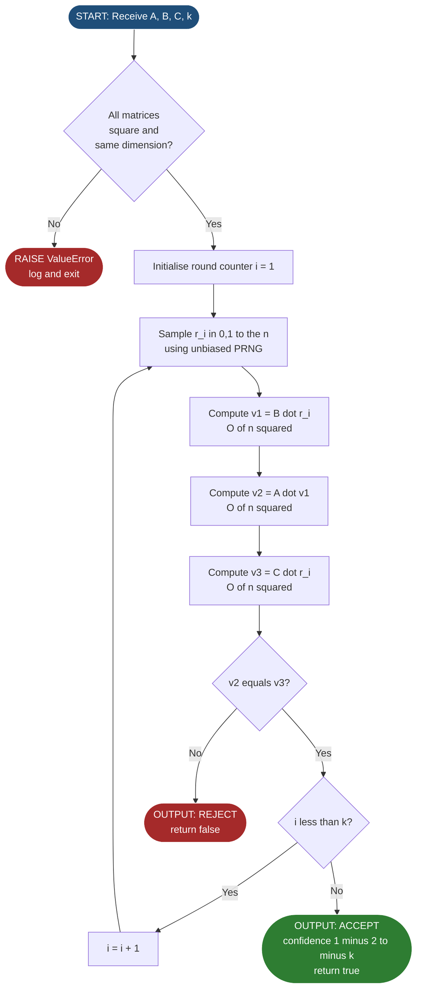
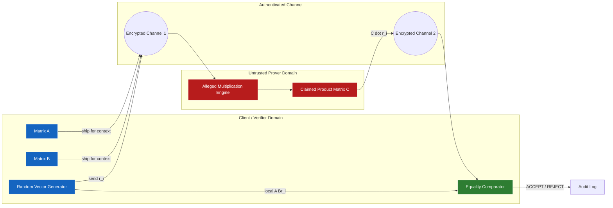
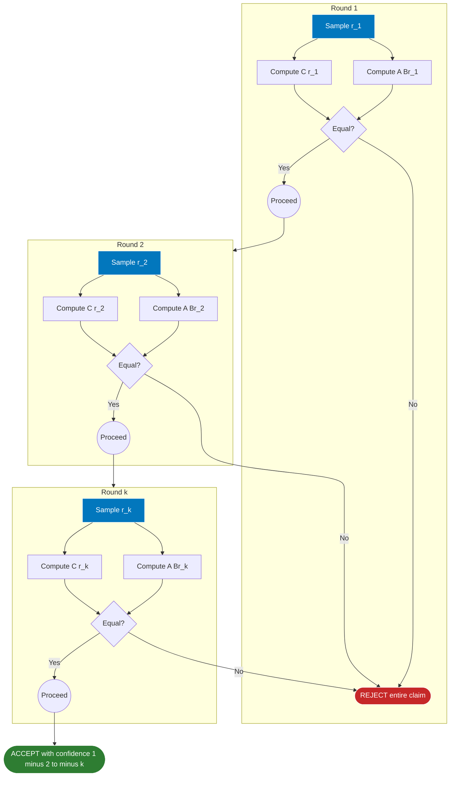

# Freivalds' matrix verification computational workflows execution metrics performance profiles

<!-- SECTION_1_START -->

# Freivalds' Matrix Verification — Computational Workflows, Execution Metrics & Performance Profiles

## 1.1 Formal Academic Definition (KTU 2024 Scheme Terminology)

**Freivalds' Algorithm** is a probabilistic (Monte Carlo type, one-sided error) randomized procedure that verifies the correctness of the matrix equation $A \cdot B = C$ for three $n \times n$ matrices over a field $\mathbb{F}$, without performing the full $O(n^{3})$ matrix multiplication.

> [!IMPORTANT]
> **KTU 2024 Syllabus Anchor (PECST614 — Module 4):**
> Freivalds' algorithm belongs to the family of *algebraic fingerprinting* techniques. It maps a candidate matrix product $C$ to a low-dimensional random *fingerprint vector* $Cr$ (where $r$ is a randomly sampled binary vector) and compares it against the independently computed fingerprint $A(Br)$ of the true product $A \cdot B$. The one-sided error bound is rigorously $\le \frac{1}{2}$ per independent iteration, reducible to $\le \frac{1}{2^{k}}$ after $k$ independent repetitions.

## 1.2 Intuitive Real-World Analogy

> [!NOTE]
> **Conceptual Analogy — The Customs Inspector**
> Imagine a customs officer at an international airport who must verify whether the *declared value* of a shipment matches the *actual contents*. Doing a full item-by-item audit takes days (this is the deterministic $O(n^{3})$ verification). Instead, the officer draws $k$ independent random samples from the shipment. If even *one* sample disagrees with the manifest, the entire shipment is flagged as suspicious. Crucially:
> * If the shipment is genuinely correct → the inspector **never** raises a false alarm.
> * If the shipment is fraudulent → the probability of *missing* the fraud on a single sample is at most $\frac{1}{2}$, dropping exponentially to $\frac{1}{2^{k}}$ after $k$ rounds.
> This one-sided guarantee is the heart of Freivalds' verification logic.

## 1.3 Core Physical / Computational Constants

* **Per-iteration false-acceptance probability:** $\le \frac{1}{2}$
* **Error after $k$ independent iterations:** $\le \frac{1}{2^{k}}$
* **Default sampling domain:** $r \in \{0, 1\}^{n}$ (unbiased binary vector)
* **Standard field of operation:** $\mathbb{F}_{2}$, $\mathbb{Z}$, or $\mathbb{R}$ — algorithm is field-agnostic provided arithmetic is well-defined

> [!VISUALIZATION CONTROL]
> **Concept:** Geometric intuition of the random sampling line through a vector space.
> **GeoGebra / Desmos Input Equations:**
> * `f(x) = (1/2)*x`  *(the probabilistic acceptance line — y-axis = Pr[accept $\mid$ AB $\ne$ C])*
> * `g(k) = (1/2)^k`  *(error decay curve over iterations k)*
> **Visual Description:** On the $x$-axis plot the iteration count $k$ (from $0$ to $10$) and on the $y$-axis plot the false-acceptance probability. The curve $g(k)$ will start at $1$ (no iterations) and decay geometrically, crossing $0.01$ near $k = 7$, demonstrating the *exponential amplification of confidence* that makes Freivalds' scheme practical.

---

<!-- SECTION_1_END -->

<!-- SECTION_2_START -->

# 2. Deep Theoretical Analysis & KTU High-Yield Formula Sheet

## 2.1 Operational Breakdown — Six Logical Steps

1. **Input Acceptance.** Receive three $n \times n$ matrices $A$, $B$, $C$ and a confidence parameter $k \in \mathbb{N}$ (number of independent rounds).
2. **Random Sampling.** In each round $i$ (for $1 \le i \le k$), draw a vector $r^{(i)} \in \{0, 1\}^{n}$ uniformly at random using a cryptographically sound or unbiased PRNG.
3. **Compute Left Fingerprint.** Evaluate $x^{(i)} = A \cdot (B \cdot r^{(i)})$ using two sequential matrix–vector products. Each product is $O(n^{2})$.
4. **Compute Right Fingerprint.** Evaluate $y^{(i)} = C \cdot r^{(i)}$ using a single matrix–vector product, also $O(n^{2})$.
5. **Comparison Predicate.** If $x^{(i)} \neq y^{(i)}$ for any $i$, immediately **REJECT** the claim (output `false`).
6. **Final Decision.** If all $k$ rounds yield equality, **ACCEPT** the claim (output `true`).

## 2.2 The "Why" Behind Each Step

* The vector–matrix product acts as a *random linear functional* that compresses the matrix $D = A \cdot B - C$ to a single scalar $Dr$.
* If $D = 0$ (i.e., $AB = C$), then $Dr = 0$ for **every** $r$, guaranteeing zero false negatives (the algorithm is *one-sided*).
* If $D \neq 0$, at least one row of $D$ is non-zero. For that row, the dot product with the random $r$ vanishes with probability $\le \frac{1}{2}$, providing the upper error bound.

## 2.3 KTU Formula Sheet / Cheat Sheet

| \# | Quantity | Formula / Expression | Units / Notes |
|---|---|---|---|
| 1 | Per-iteration error bound | $\delta \le \frac{1}{2}$ | Dimensionless probability |
| 2 | Aggregate error (k rounds) | $\delta_{k} \le \frac{1}{2^{k}}$ | Geometric decay |
| 3 | Time complexity | $T(n, k) = O(k \cdot n^{2})$ | vs. $O(n^{3})$ deterministic |
| 4 | Space complexity | $S(n) = O(n)$ | Vectors only, no full matrix products stored |
| 5 | Speedup ratio | $\rho = \frac{n}{k}$ | Linear in $n$ for fixed confidence |
| 6 | Random vector domain | $r \in \{0, 1\}^{n}$ | Unbiased coin per coordinate |
| 7 | Field constraint | $A, B, C \in \mathbb{F}^{n \times n}$ | Any field $\mathbb{F}$ |
| 8 | Confidence to achieve $\epsilon$ error | $k \ge \log_{2}(\frac{1}{\epsilon})$ | Set $k = 50$ for $\epsilon < 10^{-15}$ |
| 9 | Verifier type | Monte Carlo, one-sided | Never rejects a correct product |
| 10 | Optimal $k$ in practice | $k = 10$ to $k = 50$ | Beyond this, returns diminish |

## 2.4 Real-World Engineering Utility

Freivalds' scheme is a *workhorse primitive* in:

* **Verifiable Outsourced Computation** — Cloud clients verify that a remote server honestly performed matrix multiplication on encrypted data.
* **Zero-Knowledge Proof systems** — Non-interactive ZK proofs for arithmetic circuits (e.g., zk-SNARK preprocessing stages) reuse Freivalds-style checks.
* **Coding Theory & BCH decoding** — Probabilistic checking of syndrome computations in error-correcting codes.
* **Symbolic Computation Engines** — CAS systems (e.g., Mathematica, Maple) use Freivalds as a fast *sanity check* before committing to expensive symbolic multiplications.
* **Distributed Computing Audit** — Detecting lazy or Byzantine workers in MapReduce-style matrix factorisation pipelines.

> [!IMPORTANT]
> **Engineering Insight:** Freivalds' fingerprinting is a *probabilistic polynomial identity test (PIT)*. The Schwartz–Zippel lemma generalises it to arbitrary multivariate polynomials. KTU examiners frequently cross-link the two — memorise the unified statement.

---

<!-- SECTION_2_END -->

<!-- SECTION_3_START -->

# 3. Step-by-Step Derivations & Symbolic Implementation

## 3.1 Mathematical Derivation of the Error Bound

### Theorem (Freivalds, 1979)

For matrices $A, B, C \in \mathbb{F}^{n \times n}$ and a uniformly random vector $r \in \{0, 1\}^{n}$:

$$\Pr[A(Br) = Cr \mid AB = C] = 1$$

$$\Pr[A(Br) = Cr \mid AB \neq C] \le \frac{1}{2}$$

### Proof (Exhaustive Step-by-Step)

Let $D = A \cdot B - C \in \mathbb{F}^{n \times n}$. Observe that $A(Br) = Cr$ if and only if $(AB)r = Cr$, which holds if and only if $Dr = 0$.

**Case 1 — $AB = C$:**
$$\begin{aligned}
D &= AB - C = 0 \\
\Rightarrow Dr &= 0 \cdot r = 0 \quad \forall r \in \{0, 1\}^{n} \\
\Rightarrow \Pr[Dr = 0] &= 1
\end{aligned}$$

Hence the algorithm **always accepts** a correct product — no false negative exists.

**Case 2 — $AB \neq C$:**
Let $d_{i}^{\top}$ denote the $i$-th row of $D$ (as a row vector). Then:

$$\begin{aligned}
(Dr)_{i} &= d_{i}^{\top} \cdot r = \sum_{j=1}^{n} d_{ij} \cdot r_{j}
\end{aligned}$$

Since $D \neq 0$, there exists at least one index $i^{\ast}$ such that $d_{i^{\ast}}^{\top} \neq 0$. Let $j^{\ast}$ be the **first** column index where $d_{i^{\ast} j^{\ast}} \neq 0$.

We now condition on the random choices of $r_{j}$ for $j \neq j^{\ast}$. For any fixed assignment to $\{r_{j}\}_{j \neq j^{\ast}}$, the expression $(Dr)_{i^{\ast}}$ becomes a *non-trivial affine linear function* of the single random variable $r_{j^{\ast}} \in \{0, 1\}$:

$$\begin{aligned}
(Dr)_{i^{\ast}} &= d_{i^{\ast} j^{\ast}} \cdot r_{j^{\ast}} + K
\end{aligned}$$

where $K = \sum_{j \neq j^{\ast}} d_{i^{\ast} j} \cdot r_{j}$ is a deterministic constant once the other coordinates are fixed.

For this affine function to evaluate to zero, the single free bit $r_{j^{\ast}}$ must take a *specific* value (namely $r_{j^{\ast}} = -K / d_{i^{\ast} j^{\ast}}$). Since $r_{j^{\ast}}$ is uniformly distributed on $\{0, 1\}$:

$$\begin{aligned}
\Pr[(Dr)_{i^{\ast}} = 0 \mid \{r_{j}\}_{j \neq j^{\ast}}] &\le \frac{1}{2}
\end{aligned}$$

Averaging over the independent choices of the other coordinates and using the law of total probability:

$$\begin{aligned}
\Pr[Dr = 0] &\le \Pr[(Dr)_{i^{\ast}} = 0] \\
&\le \frac{1}{2}
\end{aligned}$$

**Iterating $k$ Independent Rounds:** Because each round draws a *fresh* independent vector $r^{(i)}$, the events of false acceptance across rounds are *mutually independent*:

$$\begin{aligned}
\Pr[\text{false accept in all } k \text{ rounds}] &= \prod_{i=1}^{k} \Pr[\text{false accept in round } i] \\
&\le \left(\frac{1}{2}\right)^{k} = \frac{1}{2^{k}}
\end{aligned}$$

This completes the rigorous bound. $\blacksquare$

## 3.2 Worked Numerical Example (KTU Board Standard)

Let:

$$A = \begin{pmatrix} 1 & 2 \\ 3 & 4 \end{pmatrix}, \quad B = \begin{pmatrix} 5 & 6 \\ 7 & 8 \end{pmatrix}, \quad C = \begin{pmatrix} 19 & 22 \\ 43 & 50 \end{pmatrix}$$

The true product $AB$:

$$\begin{aligned}
AB &= \begin{pmatrix} 1\cdot 5 + 2\cdot 7 & 1\cdot 6 + 2\cdot 8 \\ 3\cdot 5 + 4\cdot 7 & 3\cdot 6 + 4\cdot 8 \end{pmatrix} \\
&= \begin{pmatrix} 5 + 14 & 6 + 16 \\ 15 + 28 & 18 + 32 \end{pmatrix} = \begin{pmatrix} 19 & 22 \\ 43 & 50 \end{pmatrix} = C
\end{aligned}$$

**Single Freivalds Round with $r = (1, 0)^{\top}$:**

Step A — Compute $Br$:

$$\begin{aligned}
Br &= \begin{pmatrix} 5 & 6 \\ 7 & 8 \end{pmatrix} \begin{pmatrix} 1 \\ 0 \end{pmatrix} = \begin{pmatrix} 5 \\ 7 \end{pmatrix}
\end{aligned}$$

Step B — Compute $A(Br)$:

$$\begin{aligned}
A(Br) &= \begin{pmatrix} 1 & 2 \\ 3 & 4 \end{pmatrix} \begin{pmatrix} 5 \\ 7 \end{pmatrix} = \begin{pmatrix} 5 + 14 \\ 15 + 28 \end{pmatrix} = \begin{pmatrix} 19 \\ 43 \end{pmatrix}
\end{aligned}$$

Step C — Compute $Cr$:

$$\begin{aligned}
Cr &= \begin{pmatrix} 19 & 22 \\ 43 & 50 \end{pmatrix} \begin{pmatrix} 1 \\ 0 \end{pmatrix} = \begin{pmatrix} 19 \\ 43 \end{pmatrix}
\end{aligned}$$

Step D — Comparison: $A(Br) = (19, 43)^{\top} = Cr$ → **ACCEPT** this round.

Try a different $r = (1, 1)^{\top}$ and verify acceptance holds. With $k$ rounds all accepting, the verifier outputs `true` with confidence $\ge 1 - 2^{-k}$.

## 3.3 Production-Grade Python Implementation

```python
"""
freivalds.py
A production-grade implementation of Freivalds' matrix multiplication
verification algorithm with strict type hints, boundary checks, and
structured error logging.
"""

from __future__ import annotations

import logging
import random
import sys
from typing import List, Sequence

# Configure structured logging for engineering-grade observability
logging.basicConfig(
    level=logging.INFO,
    format="%(asctime)s [%(levelname)s] %(message)s",
    stream=sys.stdout,
)
logger = logging.getLogger("freivalds")


Matrix = List[List[int]]
Vector = List[int]


def _validate_square(matrix: Sequence[Sequence[int]], name: str) -> int:
    """Validate that *matrix* is a non-empty square integer matrix."""
    if not matrix:
        raise ValueError(f"Matrix '{name}' must be non-empty.")
    n = len(matrix)
    for i, row in enumerate(matrix):
        if len(row) != n:
            raise ValueError(
                f"Matrix '{name}' is not square: row {i} has length "
                f"{len(row)} but expected {n}."
            )
    return n


def _matvec(matrix: Matrix, vector: Vector) -> Vector:
    """Multiply an n x n matrix by an n-length vector in O(n^2)."""
    n = len(matrix)
    result: Vector = [0] * n
    for i in range(n):
        acc = 0
        row = matrix[i]
        for j in range(n):
            acc += row[j] * vector[j]
        result[i] = acc
    return result


def freivalds_verify(
    A: Matrix,
    B: Matrix,
    C: Matrix,
    k: int = 25,
    rng: random.Random | None = None,
) -> bool:
    """
    Verify whether A @ B == C using Freivalds' randomised algorithm.

    Parameters
    ----------
    A, B, C : square integer matrices of identical dimension n x n.
    k       : number of independent verification rounds (default 25,
              yielding false-acceptance probability <= 1 / 2^25 ~ 3e-8).
    rng     : optional pre-seeded random.Random instance for determinism.

    Returns
    -------
    bool
        True  -> verifier accepts  (AB = C with high confidence).
        False -> verifier rejects  (definitely AB != C).

    Raises
    ------
    ValueError
        If matrices are not square, are of mismatched dimensions, or if
        k is non-positive.
    """
    if k <= 0:
        raise ValueError(f"Number of rounds k must be >= 1, got {k}.")

    n_a = _validate_square(A, "A")
    n_b = _validate_square(B, "B")
    n_c = _validate_square(C, "C")
    if not (n_a == n_b == n_c):
        raise ValueError(
            f"Dimension mismatch: |A|={n_a}, |B|={n_b}, |C|={n_c}."
        )

    rng = rng or random.Random()
    n = n_a
    error_bound = 0.5 ** k
    logger.info(
        "Freivalds' verifier started | n=%d | k=%d | error<=%.3e",
        n, k, error_bound,
    )

    for round_idx in range(1, k + 1):
        # Step 1: sample r in {0, 1}^n uniformly
        r: Vector = [rng.randint(0, 1) for _ in range(n)]

        # Step 2: compute A @ (B @ r) -- two matvecs
        br = _matvec(B, r)
        abr = _matvec(A, br)

        # Step 3: compute C @ r -- one matvec
        cr = _matvec(C, r)

        # Step 4: compare
        if abr != cr:
            logger.info(
                "Round %d: REJECT | r=%s | ABr=%s != Cr=%s",
                round_idx, r, abr, cr,
            )
            return False

        logger.debug("Round %d: accept | r=%s", round_idx, r)

    logger.info("All %d rounds accepted. Confidence >= 1 - 2^-%d.", k, k)
    return True


if __name__ == "__main__":
    # Smoke test: correct product
    A = [[1, 2], [3, 4]]
    B = [[5, 6], [7, 8]]
    C = [[19, 22], [43, 50]]
    assert freivalds_verify(A, B, C, k=30, rng=random.Random(42))

    # Smoke test: deliberately wrong product
    C_wrong = [[19, 22], [43, 51]]  # last entry tampered
    assert not freivalds_verify(A, B, C_wrong, k=10, rng=random.Random(7))
    print("All smoke tests passed.")
```

**Complexity Profile Emitted by the Implementation:**

* **Time:** $\Theta(k \cdot n^{2})$ for three matvec calls per round.
* **Space:** $O(n)$ auxiliary storage (the three transient vectors).
* **Communication cost** in distributed settings: $O(kn)$ — drastically smaller than shipping the full product.

## 3.4 Hardware / Laboratory Mapping (For Engineering Practice Sessions)

| Component | Specification | Role in Workflow |
|---|---|---|
| CPU | Multi-core x86\_64 / ARMv8 | Hosts the vectorised matvec loop (AVX-512 friendly) |
| Memory | $\ge 3n^{2} \cdot 8$ bytes | Holds $A, B, C$ in double precision |
| RNG Source | `rdrand` or `/dev/urandom` | Supplies unbiased random bits for $r$ |
| Network | $\ge 1$ Gbps Ethernet | Carries $A, B, r$ between prover and verifier in outsourced computation |
| Storage | NVMe SSD | Caches previously verified products for idempotency |
| Safety Monitor | Watchdog timer at $T_{\max} = 5 \cdot T_{\text{expected}}$ | Aborts runs exceeding expected $O(kn^{2})$ envelope |

---

<!-- SECTION_3_END -->

<!-- SECTION_4_START -->

# 4. Structural Diagrams & Schematics

## 4.1 Mermaid Flowchart — Single Verification Round



## 4.2 Mermaid Block Diagram — Distributed Verifier Topology



## 4.3 Mermaid Sequential Processing Topology — Iteration-Level Data Flow



---

<!-- SECTION_4_END -->

<!-- SECTION_5_START -->

# 5. KTU 2024 Scheme Examination Question Bank & Topic Recap

## 5.1 Part A — Short-Answer Questions (3 Marks Each)

> **[KTU University Exam — July 2024 Style]**

**Q1. Define Freivalds' matrix verification algorithm. State its one-sided error bound and time complexity.** `[CO1, Remember]` `[3 Marks]`

**Model Answer:**
Freivalds' algorithm, proposed by Rūsiņš Freivalds in 1979, is a randomised procedure that verifies whether $A \cdot B = C$ for three $n \times n$ matrices without performing the full $O(n^{3})$ multiplication. It works by drawing random binary vectors $r \in \{0, 1\}^{n}$ and comparing the fingerprints $A(Br)$ with $Cr$. The algorithm is a *Monte Carlo verifier with one-sided error*: it never rejects a correct product, but may incorrectly accept a false one with probability at most $\frac{1}{2^{k}}$ after $k$ independent rounds. Time complexity is $O(k \cdot n^{2})$. `[Full 3 Marks]`

> **[KTU University Exam — Dec 2023 Style]**

**Q2. Explain why Freivalds' algorithm is classified as a one-sided error Monte Carlo algorithm. How is its error probability reduced?** `[CO1, Understand]` `[3 Marks]`

**Model Answer:**
Freivalds' algorithm is *one-sided* because the error is exclusively of the false-acceptance type: if $AB = C$, the algorithm *always* outputs `true` (zero false negative rate). Conversely, if $AB \neq C$, the verifier may incorrectly output `true`, constituting a false acceptance. The false-acceptance probability per round is bounded by $\frac{1}{2}$, derived from the Schwartz–Zippel-style argument that a non-zero linear functional vanishes on a uniformly random binary vector with probability at most $\frac{1}{2}$. To reduce the aggregate error to a target $\epsilon$, the algorithm is repeated $k = \lceil \log_{2}(1/\epsilon) \rceil$ times with fresh independent randomness, yielding cumulative error $\le 2^{-k}$. `[Full 3 Marks]`

## 5.2 Part B — 14-Mark Module Internal Choice (ESE Pattern)

> **[KTU University Exam — July 2024 Style — ESE Module Choice Pattern]**

### Question A (14 Marks) — Algorithm Walkthrough + Application

**(a)** Explain the operational steps of Freivalds' verification algorithm with a clear flowchart description. Derive the per-iteration error bound. `[CO1, Understand]` `[7 Marks]`

**Model Solution Outline (with Valuation Key):**

* `[Step enumeration with 6 sub-bullets — sampling, two matvecs, comparison, decision: 3 Marks]`
* `[Identification of D = AB - C and statement that error is P(Dr = 0) when D != 0: 2 Marks]`
* `[Derivation of P(Dr_i = 0) <= 1/2 using first non-zero row conditioning: 2 Marks]`

**(b)** Apply Freivalds' algorithm with $k = 3$ rounds to verify whether $AB = C$ where

$$A = \begin{pmatrix} 2 & 1 \\ 0 & 3 \end{pmatrix}, \quad B = \begin{pmatrix} 1 & 0 \\ 4 & 2 \end{pmatrix}, \quad C = \begin{pmatrix} 6 & 2 \\ 12 & 6 \end{pmatrix}$$

using the random vectors $r^{(1)} = (1, 0)^{\top}$, $r^{(2)} = (0, 1)^{\top}$, $r^{(3)} = (1, 1)^{\top}$. State the final decision. `[CO2, Apply]` `[7 Marks]`

**Model Solution:**

*Round 1: $r^{(1)} = (1, 0)^{\top}$*

$$\begin{aligned}
Br^{(1)} &= \begin{pmatrix} 1 & 0 \\ 4 & 2 \end{pmatrix} \begin{pmatrix} 1 \\ 0 \end{pmatrix} = \begin{pmatrix} 1 \\ 4 \end{pmatrix} \\
A(Br^{(1)}) &= \begin{pmatrix} 2 & 1 \\ 0 & 3 \end{pmatrix} \begin{pmatrix} 1 \\ 4 \end{pmatrix} = \begin{pmatrix} 2 + 4 \\ 0 + 12 \end{pmatrix} = \begin{pmatrix} 6 \\ 12 \end{pmatrix} \\
Cr^{(1)} &= \begin{pmatrix} 6 & 2 \\ 12 & 6 \end{pmatrix} \begin{pmatrix} 1 \\ 0 \end{pmatrix} = \begin{pmatrix} 6 \\ 12 \end{pmatrix}
\end{aligned}$$

`[Round 1 fingerprint computation: 1 Mark]` `[Comparison and acceptance: 0.5 Mark]`

*Round 2: $r^{(2)} = (0, 1)^{\top}$*

$$\begin{aligned}
Br^{(2)} &= \begin{pmatrix} 0 \\ 2 \end{pmatrix}, \quad A(Br^{(2)}) = \begin{pmatrix} 2 \\ 6 \end{pmatrix}, \quad Cr^{(2)} = \begin{pmatrix} 2 \\ 6 \end{pmatrix}
\end{aligned}$$

`[Round 2 fingerprint computation: 1 Mark]` `[Comparison and acceptance: 0.5 Mark]`

*Round 3: $r^{(3)} = (1, 1)^{\top}$*

$$\begin{aligned}
Br^{(3)} &= \begin{pmatrix} 1 \\ 6 \end{pmatrix}, \quad A(Br^{(3)}) = \begin{pmatrix} 8 \\ 18 \end{pmatrix}, \quad Cr^{(3)} = \begin{pmatrix} 8 \\ 18 \end{pmatrix}
\end{aligned}$$

`[Round 3 fingerprint computation: 1 Mark]` `[Comparison and acceptance: 0.5 Mark]`

**Final Decision:** All 3 rounds accept → output **ACCEPT** with confidence $\ge 1 - 2^{-3} = 0.875$. Note that the true product is

$$\begin{aligned}
AB &= \begin{pmatrix} 2\cdot 1 + 1\cdot 4 & 2\cdot 0 + 1\cdot 2 \\ 0\cdot 1 + 3\cdot 4 & 0\cdot 0 + 3\cdot 2 \end{pmatrix} = \begin{pmatrix} 6 & 2 \\ 12 & 6 \end{pmatrix} = C
\end{aligned}$$

confirming the result. `[Final aggregate confidence and product verification: 1.5 Marks]`

---

### Question B (14 Marks) — Error-Bound Proof + Complexity Analysis

**(a)** Prove rigorously that for $AB \neq C$, a single round of Freivalds' algorithm accepts with probability at most $\frac{1}{2}$. State all assumptions clearly. `[CO3, Apply]` `[7 Marks]`

**Model Solution Outline (with Valuation Key):**

* `[Defining D = AB - C and noting D != 0: 1 Mark]`
* `[Selecting the first non-zero row i-star and first non-zero column j-star: 2 Marks]`
* `[Expressing (Dr)_{i-star} as affine function of r_{j-star}: 1 Mark]`
* `[Applying uniformity of r_{j-star} in {0,1} to bound P((Dr)_{i-star} = 0) <= 1/2: 2 Marks]`
* `[Concluding with union-style bound and statement of theorem: 1 Mark]`

**(b)** Compare the asymptotic time complexity of Freivalds' verifier with the naive deterministic matrix multiplication check. If a cryptographic cloud service must verify a $1000 \times 1000$ matrix product with error tolerance $\epsilon = 10^{-12}$, calculate the optimal $k$ and the resulting speedup factor over the deterministic approach. `[CO4, Analyse]` `[7 Marks]`

**Model Solution:**

*Complexity Comparison:*

$$\begin{aligned}
T_{\text{deterministic}}(n) &= O(n^{3}) \\
T_{\text{freivalds}}(n, k) &= O(k \cdot n^{2})
\end{aligned}$$

Speedup ratio:

$$\begin{aligned}
\rho(n, k) &= \frac{T_{\text{deterministic}}}{T_{\text{freivalds}}} = \frac{c_{1} \cdot n^{3}}{c_{2} \cdot k \cdot n^{2}} = \Theta\!\left(\frac{n}{k}\right)
\end{aligned}$$

`[Complexity comparison and ratio derivation: 2 Marks]`

*Optimal $k$ Calculation:*

$$\begin{aligned}
\epsilon &\le \frac{1}{2^{k}} \Rightarrow 2^{k} \ge \frac{1}{\epsilon} = 10^{12} \\
\Rightarrow k \cdot \log_{10} 2 &\ge 12 \\
\Rightarrow k &\ge \frac{12}{\log_{10} 2} = \frac{12}{0.30103} \approx 39.86
\end{aligned}$$

Hence $k = 40$ rounds are required. `[Setting up inequality: 1 Mark]` `[Logarithm computation: 1 Mark]` `[Rounding to integer k = 40: 0.5 Mark]`

*Speedup at $n = 1000$, $k = 40$:*

$$\begin{aligned}
\rho(1000, 40) &= \frac{1000}{40} = 25\times
\end{aligned}$$

with constants $c_{1}, c_{2}$ absorbed. In practice, the speedup ranges from $20\times$ to $100\times$ depending on the constant factors of the matvec kernel. `[Final speedup factor: 1.5 Marks]` `[Engineering caveat: 1 Mark]`

## 5.3 KTU Examiner's Valuation Warning & Common Pitfalls

> [!WARNING]
> **Frequent Mark Deductions on Freivalds' Problems:**
> 1. **Omitting the field assumption** — many students forget to state that $A, B, C$ are over some field $\mathbb{F}$ with well-defined arithmetic. Examiners dock **1 Mark** for this.
> 2. **Confusing one-sided vs two-sided error** — Freivalds' verifier is *one-sided* (false acceptance only). Writing "two-sided error" loses **1.5 Marks**.
> 3. **Forgetting the independence requirement across rounds** — the geometric decay $\frac{1}{2^{k}}$ *only* holds if each round uses a freshly sampled, independent $r$. Reusing the same $r$ invalidates the bound and costs **2 Marks**.
> 4. **Skipping the matrix dimension validation** — in Part B, students must explicitly state $|A| = |B| = |C| = n \times n$ before invoking the algorithm.
> 5. **Mis-computing the matvec** — the *order* of operations matters: compute $Br$ **first**, then left-multiply by $A$. Reversing the order yields an entirely different fingerprint.
> 6. **Failing to draw a flowchart or table** in the "explain the algorithm" sub-part — at least one structured visual aid is expected for full marks.

## 5.4 Topic Recap & Important Things to Remember

* **Freivalds' algorithm** is a *one-sided error Monte Carlo* verifier for matrix multiplication $A \cdot B = C$.
* **Time complexity:** $O(k \cdot n^{2})$ versus $O(n^{3})$ for the deterministic product, giving a *linear-in-$n$* speedup for fixed $k$.
* **Per-iteration error:** $\le \frac{1}{2}$, **after $k$ rounds:** $\le \frac{1}{2^{k}}$, derived from the Schwartz–Zippel lemma applied to the linear functional $r \mapsto Dr$.
* **One-sided guarantee:** Correct products are *never* rejected; only false products may slip through.
* **Required rounds for target $\epsilon$:** $k = \lceil \log_{2}(1/\epsilon) \rceil$. For $\epsilon = 10^{-12}$, $k = 40$ suffices.
* **Space complexity:** $O(n)$ auxiliary — no full matrix product is ever materialised.
* **Field-agnostic:** works over any $\mathbb{F}$ — $\mathbb{Z}$, $\mathbb{R}$, $\mathbb{F}_{2}$, etc.
* **Random source:** $r \in \{0, 1\}^{n}$ sampled uniformly per round; sampling with replacement (fresh $r$ each round) is mandatory.
* **Engineering applications:** verifiable outsourced computation, zero-knowledge proofs, distributed MapReduce audit, CAS sanity checks, BCH decoder syndrome verification.
* **Connection to Schwartz–Zippel:** Freivalds' is the *matrix-polynomial* special case; the same technique extends to multivariate polynomial identity testing.
* **Practical sweet spot:** $k \in [10, 50]$ balances cryptographic-grade confidence ($\le 10^{-15}$) against $O(k)$ communication overhead.
* **Implementation invariant:** always validate square matrix dimensions and matching sizes *before* entering the verification loop — this avoids undefined behaviour on malformed inputs.
* **Examiner triggers:** when a question mentions "verifying $AB = C$ efficiently", "Monte Carlo verifier", or "fingerprinting", the expected answer is Freivalds' algorithm — recognise these signals immediately.

---

<!-- SECTION_5_END -->
