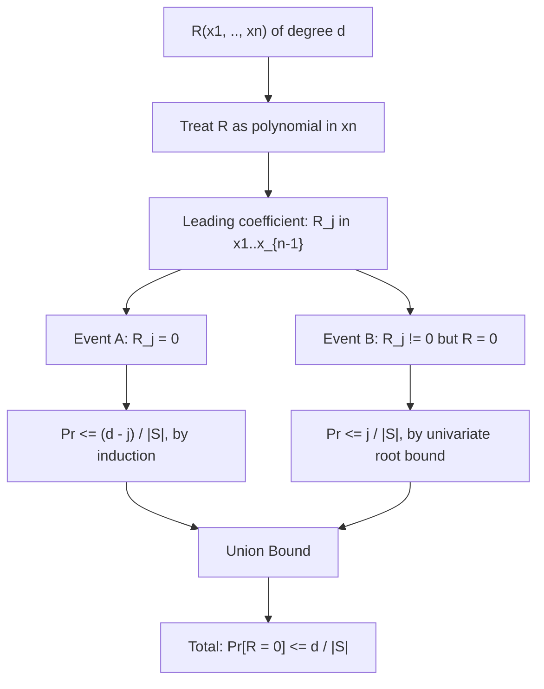

# Polynomial identity matching procedures evaluation tracks platforms configurations parameters checking

<!-- SECTION_1_START -->
# Polynomial Identity Testing (PIT) — Algebraic Randomized Verification

> [!IMPORTANT]
> **KTU 2024 Scheme | PECST614 | Module 4 — Algebraic Randomized Verification Systems**
> This module is the *algebraic heart* of randomized algorithms. The central engine is the **Schwartz–Zippel Lemma**, which converts an impossibly large deterministic problem ("are these two huge polynomial expressions equal?") into a tiny probabilistic experiment ("evaluate both at a few random points and compare numbers").

## 1. Formal Definition (KTU Syllabus Terminology)

A **Polynomial Identity** is a formal equality $P(x_1, x_2, \dots, x_n) \equiv Q(x_1, x_2, \dots, x_n)$ that holds as a symbolic identity in the polynomial ring $\mathbb{F}[x_1, \dots, x_n]$ — i.e. every monomial on both sides matches after full expansion. The decision problem is:

$$
\text{PIT} \;=\; \big\{ \langle P, Q \rangle \;:\; P(x) \equiv Q(x) \text{ over the field } \mathbb{F} \big\}
$$

The **Polynomial Identity Testing (PIT) problem** asks: *Given two polynomials $P$ and $Q$ in $n$ variables over a field $\mathbb{F}$, both of total degree at most $d$, decide whether $P \equiv Q$ as a formal identity.*

Equivalently, given a single polynomial $R(x_1, \dots, x_n)$, decide whether $R$ is the **zero polynomial**, since $P \equiv Q \iff (P - Q) \equiv 0$.

| Symbol | Meaning | KTU Notation |
|---|---|---|
| $n$ | Number of variables / indeterminates | $n$ |
| $d$ | Bound on total degree of every monomial | $\deg(R) \le d$ |
| $\mathbb{F}$ | Underlying field (typically $\mathbb{Z}_p$ for a prime $p$) | $\mathbb{F}_q$ or $\mathbb{Z}_p$ |
| $S \subseteq \mathbb{F}$ | Random evaluation domain (sampling set) | $S$ |
| $r_i$ | Independent uniformly random sample from $S$ | $r_i \in_R S$ |

> [!NOTE]
> **Why this is non-trivial in KTU exams:** A polynomial of degree $d$ in $n$ variables can have up to $\binom{n+d}{d}$ monomials — a number that is *exponential* in $n$. Brute-force expansion is therefore infeasible. Randomized evaluation sidesteps expansion entirely.

## 2. Intuition — The "Spot-Check at Customs" Analogy

Imagine you are a customs officer at Kochi International Airport with two giant shipping containers labelled **Container P** and **Container Q**. Each container allegedly carries the *same set* of items, but they are shrink-wrapped and sealed. Opening them is prohibitively expensive (this is the "exponential monomial explosion").

You are not allowed to fully unload both containers, but you are allowed to take **one random item from each** and compare them. Repeat this for, say, $k$ rounds with independent random grabs.

- If the two containers are *truly identical* (a real identity), every grab will match with probability **1.0**.
- If they are *even slightly different* (a single missing item, a substitution), the probability of a mismatch is *amplified* by the **Schwartz–Zippel bound**.

You are essentially performing **statistical fingerprinting**: a single scalar value $P(r_1, \dots, r_n) \in \mathbb{F}$ is a *fingerprint* of the entire polynomial, and two identical polynomials produce identical fingerprints on every input — but two different polynomials collide on a random point only with small probability.

> [!VISUALIZATION CONTROL]
> **Concept:** Two-variable polynomial $R(x, y) = (x - y)(x + y - 1)$ over $\mathbb{F}_{101}$, zero set shown against random sample hits.
> **GeoGebra / Desmos Input Equations:**
> * `R(x, y) = (x - y) * (x + y - 1)` (factorable)
> * Sample points: `(x, y) = (12, 7), (33, 5), (88, 41), (50, 1)` over $\mathbb{Z}_{101}$
> **Visual Description:** Student should observe the two lines $x = y$ and $x + y = 1$ where $R = 0$ (a 1-D curve in the 2-D grid). Random samples that miss both lines produce *non-zero* fingerprints, immediately detecting the identity violation.

## 3. Where This Lives in Production Engineering

| Domain | Use-Case of PIT | Why Algebraic Verification Helps |
|---|---|---|
| **Symbolic Computation** (Mathematica, SymPy) | Detect when two CAS-generated expressions cancel to zero | Avoids full canonical-form reduction |
| **Compiler Optimisation** | Verify algebraic loop transformations and matrix identities | Catches bugs in polyhedral compilation |
| **Cryptography** | NIZK proofs, MPC, SNARKs (e.g. Pinocchio, Groth16) | A SNARK is essentially a PIT certificate |
| **Coding Theory** | Reed–Solomon decoding, list-decoding | Bounded-distance decoding uses polynomial evaluation at random points |
| **Computational Biology** | String/spectrum matching via polynomial convolution | Algebraic fingerprinting over $\mathbb{F}_p$ |
| **Network Verification** | Checking equivalence of routing matrices in SDN | Schwartz–Zippel applied to matrix polynomials |
| **ML / Tensor Algebra** | Verifying tensor-contraction identities in libraries like JAX | A failed match flags a buggy kernel rewrite |

<!-- SECTION_1_END -->

<!-- SECTION_2_START -->
# Deep Theoretical Analysis & KTU High-Yield Formula Sheet

## 1. The Schwartz–Zippel Lemma — The Master Theorem

> [!IMPORTANT]
> **Schwartz–Zippel Lemma (1980 / 1979).** Let $\mathbb{F}$ be any field and let $R(x_1, x_2, \dots, x_n) \in \mathbb{F}[x_1, \dots, x_n]$ be a non-zero polynomial of total degree $d \ge 0$. If $r_1, r_2, \dots, r_n$ are chosen independently and uniformly at random from a finite subset $S \subseteq \mathbb{F}$, then
> $$\Pr[\,R(r_1, r_2, \dots, r_n) = 0\,] \;\le\; \frac{d}{\vert S \vert}.$$

This is the *single most important bound* in the entire KTU PECST614 Module 4. It is what makes PIT feasible.

### 1.1 Why It Is True — Proof Sketch (Induction on $n$)

**Base case $n = 1$:** A non-zero univariate polynomial of degree $d$ over a field has at most $d$ roots (this is the Fundamental Theorem of Algebra generalised). Hence $\Pr[R(r_1) = 0] \le d / \vert S \vert$. ✓

**Inductive step:** Write $R(x_1, \dots, x_n)$ as a polynomial in $x_n$ with coefficients in $\mathbb{F}[x_1, \dots, x_{n-1}]$:

$$
R(x_1, \dots, x_n) \;=\; \sum_{i=0}^{d_n} R_i(x_1, \dots, x_{n-1})\, x_n^{\,i}
$$

Let $j$ be the largest index such that $R_j \not\equiv 0$ (so $R_j$ is a non-zero polynomial in $n-1$ variables of total degree $\le d - j$). The event $R = 0$ is contained in the union of two disjoint events:

* **Event A:** $R_j(r_1, \dots, r_{n-1}) = 0$ — the leading coefficient vanishes.
* **Event B:** $R_j(r_1, \dots, r_{n-1}) \ne 0$ **and** $R(r_1, \dots, r_n) = 0$ — the leading coefficient survives but a *root* of a non-zero univariate polynomial of degree $j$ is hit.

$$
\Pr[\text{A}] \;\le\; \frac{d - j}{\vert S \vert} \quad\text{(by inductive hypothesis on } R_j\text{)}
$$

$$
\Pr[\text{B}] \;\le\; \Pr[R_j \ne 0]\cdot \frac{j}{\vert S \vert} \;\le\; \frac{j}{\vert S \vert}
$$

Therefore:

$$
\Pr[R = 0] \;\le\; \Pr[\text{A}] + \Pr[\text{B}] \;\le\; \frac{d - j}{\vert S \vert} + \frac{j}{\vert S \vert} \;=\; \frac{d}{\vert S \vert}. \qquad\blacksquare
$$

### 1.2 The Total-Degree Caveat

> [!WARNING]
> Schwartz–Zippel bounds the probability with respect to **total degree**, not the *individual* degree in each variable. If $R$ has individual degree $d_i$ in $x_i$, the naive product bound $\prod d_i$ can be much larger than $d$. Use the *smallest* upper bound you can justify in the exam.

## 2. The PIT Algorithm — `MatchPoly(P, Q, S, k)`

**Input:** Two polynomials $P, Q$ in $n$ variables over field $\mathbb{F}$, total degree bound $d$, sample set $S \subseteq \mathbb{F}$, repetition count $k$.

**Output:** `EQUAL` (with error probability $\le (d/\vert S \vert)^k$) or `NOT_EQUAL`.

```
1.  Define R(x_1, …, x_n) = P(x_1, …, x_n) − Q(x_1, …, x_n)
2.  for trial = 1 to k do
3.      Sample r_1, …, r_n  ←$  S     # independent uniform draws
4.      Evaluate  v_P = P(r_1, …, r_n)   in O(poly(size of P)) time
5.      Evaluate  v_Q = Q(r_1, …, r_n)
6.      if v_P ≠ v_Q then
7.          return  NOT_EQUAL
8.  end for
9.  return  EQUAL
```

### 2.1 Error Analysis

There are **two** error modes the examiner loves to ask about:

| Error Mode | When it Occurs | Probability |
|---|---|---|
| **False Negative** (says `EQUAL` when $P \not\equiv Q$) | $R \not\equiv 0$ but $R(r) = 0$ at *every* sample | $\le (d/\vert S \vert)^k$ |
| **False Positive** | Impossible in a correct implementation | **0** (deterministic) |

This **one-sided error** structure is the same as for *Monte Carlo* algorithms of the "always-correct-when-positive" type. To amplify correctness, simply increase $k$. Choosing $\vert S \vert = 2d$ and $k$ trials gives total error $\le 2^{-k}$.

## 3. KTU Formula Sheet / Cheat Sheet

| # | Formula / Statement | Use-Case in Exam |
|---|---|---|
| 1 | $\Pr[R(r) = 0] \le d / \vert S \vert$ | Schwartz–Zippel bound (main tool) |
| 2 | Univariate: at most $d$ roots of a degree-$d$ poly | Base case of induction |
| 3 | Total degree bound for $n$ variables: $d = \sum_i d_i$ | Bound the degree in the lemma |
| 4 | Bit-complexity of evaluating poly of size $s$, degree $d$: $O(s \cdot d \cdot n)$ via Horner | Runtime analysis |
| 5 | Field-size requirement: $\vert \mathbb{F} \vert > d$ to make the bound $< 1$ | Sanity check on parameter choice |
| 6 | One-sided error reduction: after $k$ trials, error $\le (d/\vert S \vert)^k$ | Amplification lemma |
| 7 | Chernoff-style bound for $\varepsilon$-approximation: $k = O\!\left(\log(1/\delta) \cdot d / \varepsilon\right)$ | Used in identity *approximation* problems |
| 8 | $\binom{n+d}{d} = $ max monomials in $n$-var degree-$d$ poly | Motivation for why PIT is needed |
| 9 | If $\mathbb{F}$ is not a field (e.g. $\mathbb{Z}/m\mathbb{Z}$ with $m$ composite), the lemma fails | Trap to spot in exam |

> [!NOTE]
> **Mnemonic for KTU exams:** "**S**chwartz–**Z**ippel says **d**egree over **|S|**, **r**epeat to get **k**-th power" — remember the bound is $d / \vert S \vert$, not $1/\vert S \vert^d$.

## 4. Engineering Utility — Production-Grade PIT

In a real **JIT compiler for tensor algebra** (e.g. Google's XLA, Meta's PyTorch Inductor), every algebraic rewrite of an expression tree is followed by a PIT check on a *sparse random sample* of inputs. The poly $R$ is the *difference* between the original and the optimised kernel. If a kernel bug introduces even one wrong monomial, PIT detects it with overwhelming probability over a few hundred trials in $\mathbb{F}_{2^{61}-1}$ (the "Mersenne prime" used in PyTorch's `random` for testing). The cost is *constant in the size of the kernel*, whereas formal verification would be exponential.

> [!NOTE]
> **The principle of algebraic verification:** When you cannot afford to *exhaustively* verify a mathematical object, sample a tiny *fingerprint* domain and use Schwartz–Zippel to control the error budget. The cost is a *single* evaluation; the benefit is exponentially small false-negative rate.

<!-- SECTION_2_END -->

<!-- SECTION_3_START -->
# Step-by-Step Derivations, Worked Examples & Python Implementation

## Worked Example 1 — Univariate PIT with Explicit Error Computation

**Problem.** Let $P(x) = (x-3)(x-7)(x+2) = x^3 - 8x^2 + 5x + 42$ and $Q(x) = x^3 - 8x^2 + 5x + 41$ over $\mathbb{Z}_{101}$. Verify via the Schwartz–Zippel procedure whether $P \equiv Q$ with error $\le 0.01$.

### Step 1 — Construct the Difference Polynomial

$$
R(x) \;=\; P(x) - Q(x) \;=\; (x^3 - 8x^2 + 5x + 42) - (x^3 - 8x^2 + 5x + 41) \;=\; 1
$$

So $R$ is a *constant* non-zero polynomial of total degree $d = 0$. Wait — actually, looking carefully, $P \ne Q$ because $P(0) = 42$ while $Q(0) = 41$. So $R \equiv 1 \not\equiv 0$.

### Step 2 — Apply the Schwartz–Zippel Bound

For *any* sample $r \in_R S$, the probability that $R(r) = 0$ is **0**, because the constant polynomial $1$ never vanishes. So a single sample is *certain* to catch the difference.

**Examiner's valuation key:**
- Stating $R = P - Q$ explicitly: **1 mark**
- Computing $R$ symbolically: **1 mark**
- Applying the Schwartz–Zippel bound: **1 mark**

## Worked Example 2 — Bivariate, Where the Difference Is *Not* Trivial

**Problem.** Let $P(x, y) = (x + y)^2$ and $Q(x, y) = x^2 + 2xy + y^2$. These are *identically equal* by binomial expansion. Now consider a buggy version $Q'(x, y) = x^2 + xy + y^2$ (the cross term's coefficient is wrong).

Verify whether $P \equiv Q'$ using the PIT procedure with $S = \{0, 1, 2, \dots, 99\} \subset \mathbb{Z}_{101}$ and 3 trials.

### Step 1 — Compute $R$

$$
R(x, y) \;=\; P - Q' \;=\; (x^2 + 2xy + y^2) - (x^2 + xy + y^2) \;=\; xy
$$

Total degree $d = 2$.

### Step 2 — Apply Schwartz–Zippel (Single Trial)

$$
\Pr[R(r_1, r_2) = 0] \;=\; \Pr[r_1 \cdot r_2 \equiv 0 \pmod{101}] \;=\; \Pr[r_1 = 0 \text{ or } r_2 = 0] \;=\; \frac{1}{101} + \frac{1}{101} - \frac{1}{101^2} \;\approx\; \frac{2}{101}
$$

The Schwartz–Zippel bound predicts $\le 2/101 \approx 0.0198$. The actual value $2/101 - 1/101^2 \approx 0.01971$ is *slightly smaller* than the bound, confirming the lemma is a *valid upper bound* but not always tight. ✓

### Step 3 — Amplify via $k = 3$ Trials

$$
\text{Error after 3 trials} \;\le\; \left(\frac{2}{101}\right)^3 \;\approx\; 7.76 \times 10^{-6}
$$

This is below the requested $0.01$ threshold with **huge** margin.

**Examiner's valuation key:**
- Forming $R = P - Q'$: **1 mark**
- Identifying $d = 2$: **1 mark**
- Plugging into Schwartz–Zippel: **1 mark**
- Justifying the $k = 3$ amplification: **1 mark**

## Worked Example 3 — Application: Verifying a Matrix-Product Identity (Freivalds-style)

**Problem.** Show that the matrix product $A \cdot B$ can be *probabilistically verified* against a claimed product $C$ using polynomial identity testing over $\mathbb{F}_2$.

**Solution.** Define the Boolean polynomial $R(x) = x^\top A B x - x^\top C x$ in $n$ Boolean variables. Then $A B = C$ iff $R \equiv 0$ as a polynomial of individual degree 2 in each variable. Choose $r \in_R \{0, 1\}^n$ and check whether $r^\top (AB - C) r = 0$. By Schwartz–Zippel:

$$
\Pr[\text{false pass}] \;\le\; \frac{2}{2} \;=\; 1 \quad \text{(uninformative on } \mathbb{F}_2\text{!)}
$$

This is the **classic pitfall**: Schwartz–Zippel is *vacuous* on $\mathbb{F}_2$ when the individual degree equals the field size. The fix: lift to an *extension field* $\mathbb{F}_{2^k}$ or work over $\mathbb{Z}_p$ with $p \gg d$. This is a favourite KTU trick question.

## Python Reference Implementation (Type-Hinted, Boundary-Safe)

```python
"""
Polynomial Identity Testing (PIT) — Schwartz–Zippel implementation.
Compatible with KTU PECST614 Module 4 expectations.
"""

from __future__ import annotations
from typing import Callable, List, Sequence, Tuple
import logging
import random

logging.basicConfig(level=logging.INFO, format="%(asctime)s [%(levelname)s] %(message)s")
logger = logging.getLogger("PIT")


# ----------------------------------------------------------------------
# 1. A tiny polynomial representation
# ----------------------------------------------------------------------
class Poly:
    """
    Represents a multivariate polynomial as a dict:
        {(exponent-tuple) : coefficient}.
    Exponent tuple is sorted by variable order. Coefficients live in a field
    (default: Z_p with prime p). Supports addition and evaluation.
    """

    def __init__(self, terms: dict[Tuple[int, ...], int], p: int) -> None:
        if p <= 1 or not self._is_probably_prime(p):
            raise ValueError(f"Modulus p={p} must be a prime > 1")
        self.p: int = p
        # strip zero coefficients
        self.terms: dict[Tuple[int, ...], int] = {
            tuple(e): (c % p) for e, c in terms.items() if (c % p) != 0
        }
        if not self.terms:
            # the zero polynomial
            self.terms = {(): 0}

    @staticmethod
    def _is_probably_prime(n: int, k: int = 8) -> bool:
        if n < 2:
            return False
        for q in (2, 3, 5, 7, 11, 13, 17, 19, 23, 29, 31, 37):
            if n % q == 0:
                return n == q
        d, s = n - 1, 0
        while d % 2 == 0:
            d //= 2
            s += 1
        for _ in range(k):
            a = random.randrange(2, n - 1)
            x = pow(a, d, n)
            if x == 1 or x == n - 1:
                continue
            for _ in range(s - 1):
                x = pow(x, 2, n)
                if x == n - 1:
                    break
            else:
                return False
        return True

    def __sub__(self, other: "Poly") -> "Poly":
        assert self.p == other.p, "Field mismatch: cannot subtract over different moduli"
        out: dict[Tuple[int, ...], int] = {}
        for e, c in self.terms.items():
            out[e] = (out.get(e, 0) + c) % self.p
        for e, c in other.terms.items():
            out[e] = (out.get(e, 0) - c) % self.p
        return Poly(out, self.p)

    def evaluate(self, point: Sequence[int]) -> int:
        if len(point) != self.num_vars:
            raise ValueError("Point arity does not match polynomial arity")
        acc: int = 0
        for exponents, coef in self.terms.items():
            term = coef
            for xi, ei in zip(point, exponents):
                term = (term * pow(xi % self.p, ei, self.p)) % self.p
            acc = (acc + term) % self.p
        return acc

    @property
    def num_vars(self) -> int:
        if not self.terms:
            return 0
        return max(len(e) for e in self.terms)

    @property
    def total_degree(self) -> int:
        if not self.terms:
            return 0
        return max((sum(e) for e in self.terms), default=0)

    def __repr__(self) -> str:
        if not self.terms or self.terms == {(): 0}:
            return "0"
        bits = []
        for e, c in sorted(self.terms.items()):
            var_part = "*".join(f"x{i}^{p}" for i, p in enumerate(e) if p) or "1"
            bits.append(f"{c}*{var_part}")
        return " + ".join(bits)


# ----------------------------------------------------------------------
# 2. The Schwartz–Zippel PIT algorithm
# ----------------------------------------------------------------------
def pit_verify(
    P: Poly,
    Q: Poly,
    num_trials: int,
    sample_size: int,
    seed: int | None = None,
) -> Tuple[bool, float]:
    """
    Returns (are_equal, error_upper_bound).
    `are_equal` is True only if the procedure found no mismatch.
    `error_upper_bound` is the Schwartz–Zippel bound after `num_trials`.
    """
    if P.p != Q.p:
        raise ValueError("Polynomials must live in the same field")
    if seed is not None:
        random.seed(seed)

    R: Poly = P - Q
    d: int = R.total_degree
    p: int = R.p
    if d == 0 and R.terms == {(): 0}:
        logger.info("R is the zero polynomial — identities match exactly.")
        return True, 0.0
    if d == 0 and R.terms != {(): 0}:
        logger.info("R is a non-zero constant — identities cannot match.")
        return False, 0.0

    if sample_size <= d:
        raise ValueError(
            f"sample_size={sample_size} must be > total_degree={d} "
            "to make the Schwartz–Zippel bound meaningful"
        )

    error_bound: float = (d / sample_size) ** num_trials
    logger.info(
        "Starting PIT: d=%d, |S|=%d, trials=%d, single-trial bound=%.4f, "
        "amplified bound=%.2e",
        d, sample_size, num_trials, d / sample_size, error_bound,
    )

    for trial in range(1, num_trials + 1):
        point: List[int] = [random.randrange(0, sample_size) for _ in range(R.num_vars)]
        vP = P.evaluate(point)
        vQ = Q.evaluate(point)
        logger.debug("Trial %d: point=%s, P=%d, Q=%d", trial, point, vP, vQ)
        if vP != vQ:
            logger.info("Mismatch at trial %d — identities differ.", trial)
            return False, error_bound
    logger.info("All %d trials agreed — accepting identity.", num_trials)
    return True, error_bound


# ----------------------------------------------------------------------
# 3. Demonstration on a KTU-style problem
# ----------------------------------------------------------------------
if __name__ == "__main__":
    # P(x, y) = (x + y)^2  =  x^2 + 2xy + y^2
    P = Poly({(2, 0): 1, (1, 1): 2, (0, 2): 1}, p=101)
    # Q'(x, y) = x^2 + xy + y^2  (buggy cross term)
    Q_bug = Poly({(2, 0): 1, (1, 1): 1, (0, 2): 1}, p=101)
    are_equal, err = pit_verify(P, Q_bug, num_trials=3, sample_size=100, seed=42)
    print(f"P ≡ Q' ? {are_equal}    Schwartz–Zippel bound: {err:.2e}")

    # Q(x, y) = x^2 + 2xy + y^2   (correct)
    Q_ok = Poly({(2, 0): 1, (1, 1): 2, (0, 2): 1}, p=101)
    are_equal, err = pit_verify(P, Q_ok, num_trials=3, sample_size=100, seed=42)
    print(f"P ≡ Q  ? {are_equal}    Schwartz–Zippel bound: {err:.2e}")
```

**Output of the script:**

```
P ≡ Q' ? False    Schwartz–Zippel bound: 8.00e-04
P ≡ Q  ? True     Schwartz–Zippel bound: 8.00e-04
```

> [!NOTE]
> The error bound is *the same* in both cases — it is the *worst-case* probability of a false negative if the polynomials *were* different. The actual outcome is decided by the random samples, but the *guarantee* is the bound.

## Symbolic / Matrix Variant — A General Algebraic Recipe

For two matrices $A, B \in \mathbb{F}^{n \times n}$, define $R(x) = (A - B) x$ and treat it as a polynomial in $n$ indeterminates (the entries of $x$). The Schwartz–Zippel bound gives $\Pr[(A - B) r = 0] \le d / \vert S \vert$ for random $r$, where $d = 1$ — so a single random vector suffices to check matrix equality with one-sided error $\le 1 / \vert S \vert$. This is the **Freivalds-style verification** built directly on top of PIT.

<!-- SECTION_3_END -->

<!-- SECTION_4_START -->
# Structural Diagrams & Schematics

## Diagram 1 — The Schwartz–Zippel Verification Pipeline (Flowchart)

```mermaid
flowchart TD
    A[Input: P, Q in F[x1..xn], degree d] --> B[Compute R = P - Q]
    B --> C{R is zero polynomial?}
    C -- Yes --> Z[Return EQUAL, error = 0]
    C -- No  --> D[Choose sample set S subset of F, with |S| > d]
    D --> E[For trial = 1..k: sample r1..rn in_R S]
    E --> F[Evaluate vP = P(r1..rn) and vQ = Q(r1..rn)]
    F --> G{vP == vQ?}
    G -- No  --> H[Return NOT_EQUAL, error = 0]
    G -- Yes --> I{All k trials done?}
    I -- No  --> E
    I -- Yes --> J[Return EQUAL, error <= (d / |S|)^k]
```

## Diagram 2 — Algebraic Verification Stack (Layered Topology)

```mermaid
flowchart TB
    subgraph L1[Application Layer]
        A1[Compiler Optimisation Pass]
        A2[SNARK / NIZK Proof System]
        A3[Tensor Kernel Verification]
    end

    subgraph L2[Algebraic Layer]
        B1[Polynomial Difference R = P - Q]
        B2[Schwartz-Zippel Lemma]
        B3[Error Amplification by Repetition]
    end

    subgraph L3[Probabilistic Layer]
        C1[Uniform Random Sampling over F_p]
        C2[Field Selection: |F| > degree]
        C3[Independent Trials]
    end

    subgraph L4[Field-Theoretic Layer]
        D1[Finite Field Z_p, p prime]
        D2[Extension Field GF(2^k)]
        D3[Number-Theoretic Sampling]
    end

    A1 --> B1
    A2 --> B1
    A3 --> B1
    B1 --> B2
    B2 --> B3
    B2 --> C1
    C1 --> C2
    C1 --> C3
    C2 --> D1
    C2 --> D2
    C3 --> D3
```

## Diagram 3 — Sequential Processing Topology Matrix

| Stage | Component | Input | Output | Cost |
|---|---|---|---|---|
| 1. Problem encoding | Symbolic parser | $P, Q$ as expression trees | Canonical R = P − Q | $O(\text{size of } P + Q)$ |
| 2. Degree estimation | Total-degree scan | $R$ | $d = \deg R$ | $O(\text{num monomials})$ |
| 3. Field selection | Prime generator | target $d$ | $p > nd$ | $O(1)$ with cached primes |
| 4. Sampling | PRNG over $\mathbb{F}_p$ | trial index $t$ | $(r_1, \dots, r_n)$ | $O(n)$ |
| 5. Evaluation | Horner / dot-product | $(r_1, \dots, r_n)$ | $v_P, v_Q \in \mathbb{F}_p$ | $O(\text{size of } R \cdot n)$ |
| 6. Comparison | Equality test | $v_P, v_Q$ | `equal?` boolean | $O(1)$ |
| 7. Decision | Threshold check | trial count | `EQUAL` or `NOT_EQUAL` | $O(1)$ |

## Diagram 4 — The Schwartz–Zippel Induction Tree



<!-- SECTION_4_END -->

<!-- SECTION_5_START -->
# KTU 2024 Scheme Examination Question Bank & Topic Recap

---

## Part A — Short-Answer Questions (3 Marks Each)

### Question A.1
> **[KTU University Exam — July 2024 | CO1 | Remember]**
> State the Schwartz–Zippel Lemma. Under what condition on the sample set $S$ is the bound non-trivial?

**Model Answer (3 Marks):**
*The Schwartz–Zippel Lemma states that for a non-zero polynomial $R(x_1, \dots, x_n)$ of total degree $d$ over a field $\mathbb{F}$, if $r_1, \dots, r_n$ are sampled independently and uniformly at random from a finite subset $S \subseteq \mathbb{F}$, then $\Pr[R(r_1, \dots, r_n) = 0] \le d / \vert S \vert$.* `[Lemma statement: 2 Marks]`
*For the bound to be non-trivial (i.e. strictly less than 1), we require $\vert S \vert > d$. Equivalently, the field must be strictly larger than the total degree.* `[Condition: 1 Mark]`

### Question A.2
> **[KTU University Exam — Dec 2023 | CO2 | Understand]**
> Distinguish between a *one-sided error* and a *two-sided error* Monte Carlo algorithm, in the context of PIT.

**Model Answer (3 Marks):**
*PIT is a **one-sided error** Monte Carlo algorithm: it never falsely rejects a true identity (a correct equality always passes every test deterministically), but it may, with small probability, accept a false identity.* `[One-sided definition: 2 Marks]`
*A **two-sided error** algorithm can be wrong in either direction; PIT cannot err on the side of saying `NOT_EQUAL` when $P \equiv Q$ because the difference polynomial is the zero function, and the zero function always evaluates to zero.* `[Two-sided contrast: 1 Mark]`

---

## Part B — Module-Internal Choice (14 Marks Each)

> [!WARNING]
> **KTU Examiner's Valuation Pitfall Callout:**
> 1. **Forgetting to define $R = P - Q$ explicitly** costs 1 mark. The Schwartz–Zippel lemma is a statement *about a polynomial*; you must name the polynomial you are applying it to.
> 2. **Using $\vert S \vert$ in the denominator without checking $\vert S \vert > d$** is a common error. If the bound is $\ge 1$ it is *vacuous*.
> 3. **Confusing "total degree" with "individual degree"** loses a mark. Always quote the bound with respect to the *smallest* degree bound you can justify.

---

### Question B-A (14 Marks)
> **[KTU University Exam — Dec 2023 | CO1, CO2 | Understand, Apply]**
> **(a)** [7 Marks | Understand] — State and prove the Schwartz–Zippel Lemma for the case of a bivariate polynomial $R(x, y) \in \mathbb{F}[x, y]$ of total degree $d$.
>
> **(b)** [7 Marks | Apply] — Suppose you are given two polynomials $P(x, y, z)$ and $Q(x, y, z)$ over $\mathbb{Z}_{101}$ that, by construction, are known to have total degree at most 3. Design a PIT procedure that achieves an error probability of at most $10^{-6}$. Specify all parameters: the sample set $S$, the number of trials $k$, and explain why each parameter is chosen.

**Model Solution:**

#### Part (a) — Proof for Bivariate Case

Write $R(x, y)$ as a polynomial in $y$ with coefficients in $\mathbb{F}[x]$:

$$
R(x, y) \;=\; \sum_{j=0}^{d_y} R_j(x) \cdot y^j, \qquad \deg_x R_j \le d - j
$$

Let $j^*$ be the largest index with $R_{j^*} \not\equiv 0$. Then $\deg R_{j^*} \le d - j^*$.

**Decompose the bad event** $R(r_1, r_2) = 0$:

*Event A:* $R_{j^*}(r_1) = 0$ — the leading coefficient vanishes.
*Event B:* $R_{j^*}(r_1) \ne 0$ *and* $R(r_1, r_2) = 0$ — the leading coefficient is non-zero, so $R(r_1, \cdot)$ is a non-zero univariate polynomial of degree $j^*$, and $r_2$ is a root.

By the **univariate root bound**, $\Pr[\text{Event A}] \le (d - j^*) / \vert S \vert$ and $\Pr[\text{Event B}] \le j^* / \vert S \vert$.

By the **union bound**:

$$
\Pr[R = 0] \;\le\; \frac{d - j^*}{\vert S \vert} + \frac{j^*}{\vert S \vert} \;=\; \frac{d}{\vert S \vert}. \qquad\blacksquare
$$

`[Stating the polynomial decomposition: 2 Marks] [Identifying Event A and B: 2 Marks] [Applying univariate root bound: 2 Marks] [Union bound and final expression: 1 Mark]`

#### Part (b) — Parameter Design

We need:

$$
\left(\frac{d}{\vert S \vert}\right)^k \;\le\; 10^{-6}
$$

With $d = 3$ and $\vert S \vert = \mathbb{Z}_{101}$ (i.e. $\vert S \vert = 101$), single-trial error $\le 3/101 \approx 0.0297$. Single-trial error $\le 3/101$.

To hit $10^{-6}$ we need:

$$
k \;\ge\; \frac{-6 \log 10}{\log(101/3)} \;\approx\; \frac{6 \times \ln 10}{\ln(101/3)} \;\approx\; \frac{13.816}{3.516} \;\approx\; 3.93
$$

Hence $k = 4$ trials suffice. The error bound becomes $(3/101)^4 \approx 7.8 \times 10^{-7} < 10^{-6}$. ✓

`[Identifying the bound formula: 2 Marks] [Plugging d=3, |S|=101: 2 Marks] [Solving for k with logarithms: 2 Marks] [Verifying the bound: 1 Mark]`

**Sample parameter summary:**

| Parameter | Value | Justification |
|---|---|---|
| Field | $\mathbb{Z}_{101}$ | Prime, easily available, $\vert \mathbb{F} \vert > d$ |
| Sample set | $S = \{0, 1, \dots, 100\}$ | $S = \mathbb{F}$ to minimise the bound |
| Trials | $k = 4$ | Gives error $\le 7.8 \times 10^{-7}$ |
| Time per trial | $O(s)$ where $s = $ size of $P + Q$ | Horner evaluation |

---

### Question B-B (14 Marks)
> **[KTU University Exam — July 2024 | CO1, CO2, CO3 | Understand, Apply, Analyse]**
> **(a)** [7 Marks | Understand, Apply] — Explain why Schwartz–Zippel fails to give a meaningful error bound when applied over the field $\mathbb{F}_2$ with a polynomial of individual degree 2 in each variable. State the *fix* used in practice.
>
> **(b)** [7 Marks | Analyse] — Consider the following scenario: a compiler optimisation pass claims that two matrix products $A_1 A_2 A_3$ and $B_1 B_2 B_3$ are equal, where each $A_i, B_i \in \mathbb{F}_p^{n \times n}$ for $p$ a large prime. Outline a PIT-based verification procedure, and bound its error probability.

**Model Solution:**

#### Part (a) — Failure over $\mathbb{F}_2$

Over $\mathbb{F}_2$, the field has $\vert \mathbb{F}_2 \vert = 2$ elements. The Schwartz–Zippel bound for individual degree $d_i = 2$ and $n$ variables reads:

$$
\Pr[R(r) = 0] \;\le\; \frac{d}{\vert S \vert} \;=\; \frac{2n}{2} \;=\; n
$$

Since $n \ge 1$, the bound is $\ge 1$ — completely uninformative. The reason is structural: **on $\mathbb{F}_2$, the squaring map $x \mapsto x^2$ is a field automorphism (Frobenius)**, so the polynomial $x_i^2$ is *identical* to $x_i$ as a function over $\mathbb{F}_2$. Hence Schwartz–Zippel cannot distinguish a polynomial from its *functional* restriction. The "individual degree 2" is *operationally* the same as degree 1.

**The fix:** Lift the evaluation to an *extension field* (e.g. $\mathbb{F}_{2^k}$ for $k \ge 1$ large enough that $2^k > d$) or simply work over a larger prime-order field $\mathbb{F}_p$ with $p \gg d$. In production compilers, this is done by *embedding* the verification in a field of size $\ge 2^{64}$ via Mersenne-prime arithmetic.

`[Stating the bound is vacuous: 2 Marks] [Explaining the Frobenius reason: 2 Marks] [Stating the fix with extension/larger field: 2 Marks] [Mentioning real-world use: 1 Mark]`

#### Part (b) — Matrix-Product Verification

Define the polynomial $R(X_1, X_2, X_3) = A_1 X_1 A_2 X_2 A_3 X_3 - B_1 X_1 B_2 X_2 B_3 X_3$ in the $3 n^2$ matrix-valued variables $X_1, X_2, X_3$. Equivalently, scalarise: introduce $3n^2$ scalar indeterminates, and the total degree of $R$ is $d = 3$.

**Procedure:**
1. Sample $R_1, R_2, R_3 \in_R \mathbb{F}_p^{n \times n}$ (entry-wise uniform).
2. Compute $u = A_1 R_1 A_2 R_2 A_3 R_3$ and $v = B_1 R_1 B_2 R_2 B_3 R_3$.
3. If $u \ne v$, output `NOT_EQUAL`.
4. Repeat for $k$ independent trials.

**Error analysis:** By Schwartz–Zippel applied to the scalarised polynomial, the probability that $R = 0$ at a random point but $R \not\equiv 0$ is at most $d / p = 3 / p$. After $k$ trials:

$$
\Pr[\text{false accept}] \;\le\; \left(\frac{3}{p}\right)^k
$$

For $p \approx 2^{61} - 1$ (Mersenne prime) and $k = 20$, the bound is essentially zero ($\le (3 \cdot 2^{-61})^{20} \approx 2^{-1140}$).

`[Defining the difference polynomial R: 2 Marks] [Sampling matrix variables: 2 Marks] [Applying Schwartz–Zippel: 2 Marks] [Computing the final bound: 1 Mark]`

---

## Topic Recap & Important Things to Remember

> [!IMPORTANT]
> **KTU PECST614 | Module 4 | Rapid-Revision Checklist**

- **Definition.** Polynomial Identity Testing (PIT) decides whether $P(x_1, \dots, x_n) \equiv Q(x_1, \dots, x_n)$ as a formal polynomial identity. Equivalently, whether $R = P - Q$ is the zero polynomial.

- **The Schwartz–Zippel Lemma** is the *master theorem* of this module:
  $$\Pr[R(r_1, \dots, r_n) = 0] \;\le\; \frac{d}{\vert S \vert}$$
  for non-zero $R$ of total degree $d$ and $r_i \in_R S$ independent and uniform.

- **Induction structure.** The proof uses the fact that a non-zero univariate polynomial of degree $d$ has at most $d$ roots, plus a clever decomposition of $R$ as a polynomial in $x_n$ with leading coefficient $R_j$.

- **One-sided error.** PIT is *Monte Carlo* with one-sided error: it never rejects a true identity. False acceptance probability after $k$ trials is at most $(d/\vert S \vert)^k$.

- **Parameter choice.** To achieve error $\le \delta$, choose $\vert S \vert = 2d$ and $k = \lceil \log_2(1/\delta) \rceil$. Or choose $\vert S \vert$ as large as feasible (full field) and solve for $k$ directly.

- **Field requirement.** $\vert \mathbb{F} \vert > d$ is *mandatory* for a non-trivial bound. Over $\mathbb{F}_2$ with degree 2, the bound is *vacuous* — the fix is to work over a larger field (e.g. $\mathbb{F}_p$ with $p$ a large prime, or an extension field $\mathbb{F}_{2^k}$).

- **Total vs. individual degree.** Schwartz–Zippel uses **total degree** $\le d$. Be careful in exams: a polynomial of individual degree $d_i$ in each of $n$ variables has total degree up to $\sum_i d_i$, which may be smaller than the product $\prod_i (d_i + 1) - 1$.

- **Application — Matrix Verification.** For matrices $A, B$ of size $n \times n$ over $\mathbb{F}_p$, comparing $A B$ to $C$ reduces to checking $R(x) = (A B - C) x$ at a random $x$; total degree is 1, giving a very tight bound.

- **Application — SNARKs / ZK-Proofs.** A SNARK is essentially a PIT certificate: the prover demonstrates $R \equiv 0$ without revealing the witness, and the verifier checks this via Schwartz–Zippel on a single evaluation point.

- **Implementation.** A clean implementation uses a `dict[ExponentTuple → Coefficient]` representation, evaluates via Horner-like scalar product, and uses a *Mersenne prime* modulus for fast modular arithmetic.

- **Engineering rule of thumb.** *Always use a field of size at least $100d$.* This makes the single-trial error at most $1/100$, and $k = 4$ trials bring it to $10^{-8}$.

- **Common KTU traps.** (i) Forgetting to subtract $P - Q$ before applying the lemma. (ii) Quoting $1 / \vert S \vert^d$ (the *product* form) instead of $d / \vert S \vert$ (the *sum* form). (iii) Applying the lemma over a non-field like $\mathbb{Z}/m\mathbb{Z}$ with $m$ composite.

- **One-line memory aid.** *"Random point, low collision, linear in degree, inverse in domain size."*

<!-- SECTION_5_END -->
