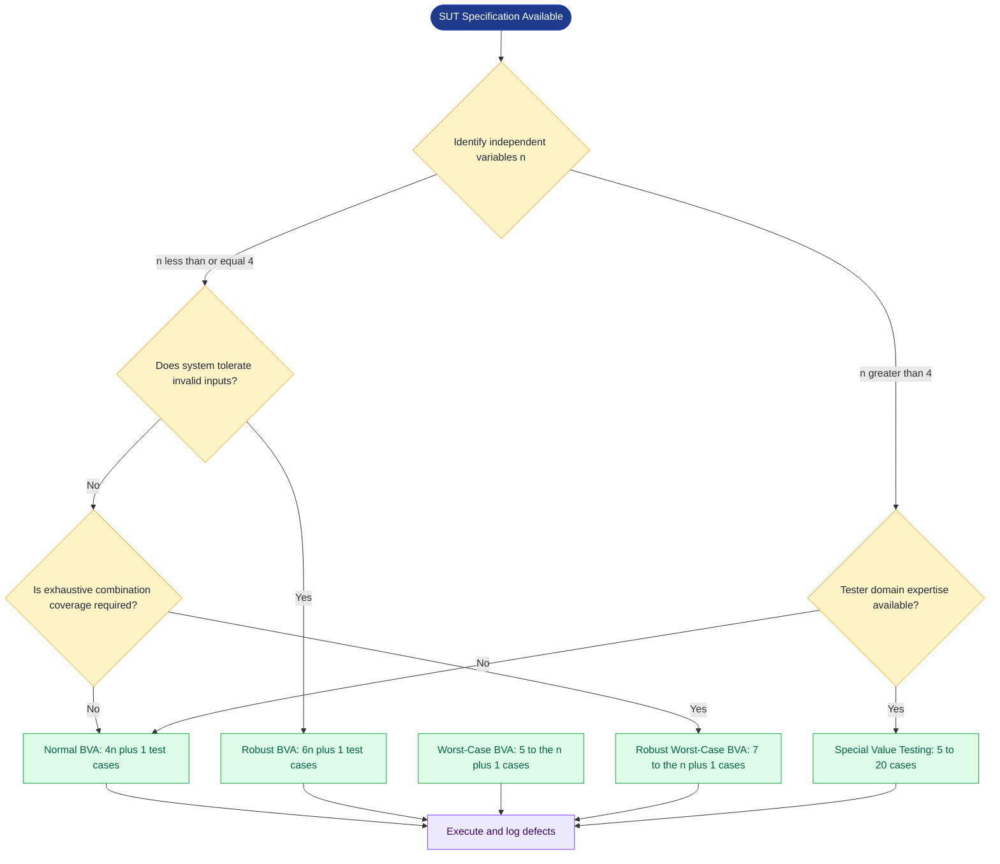
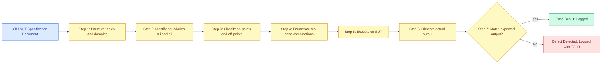
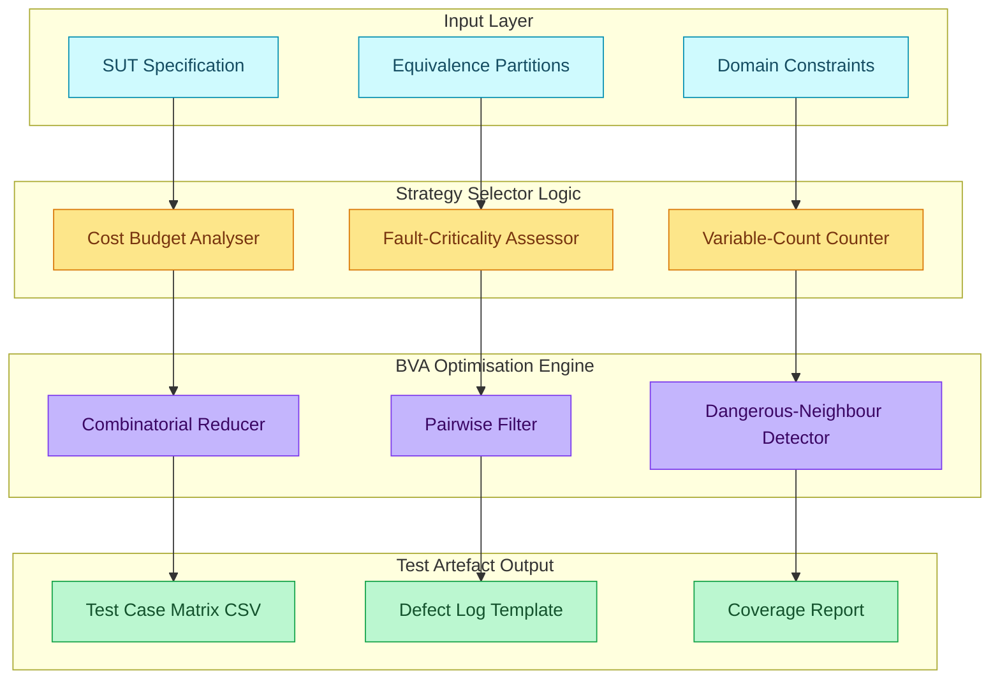
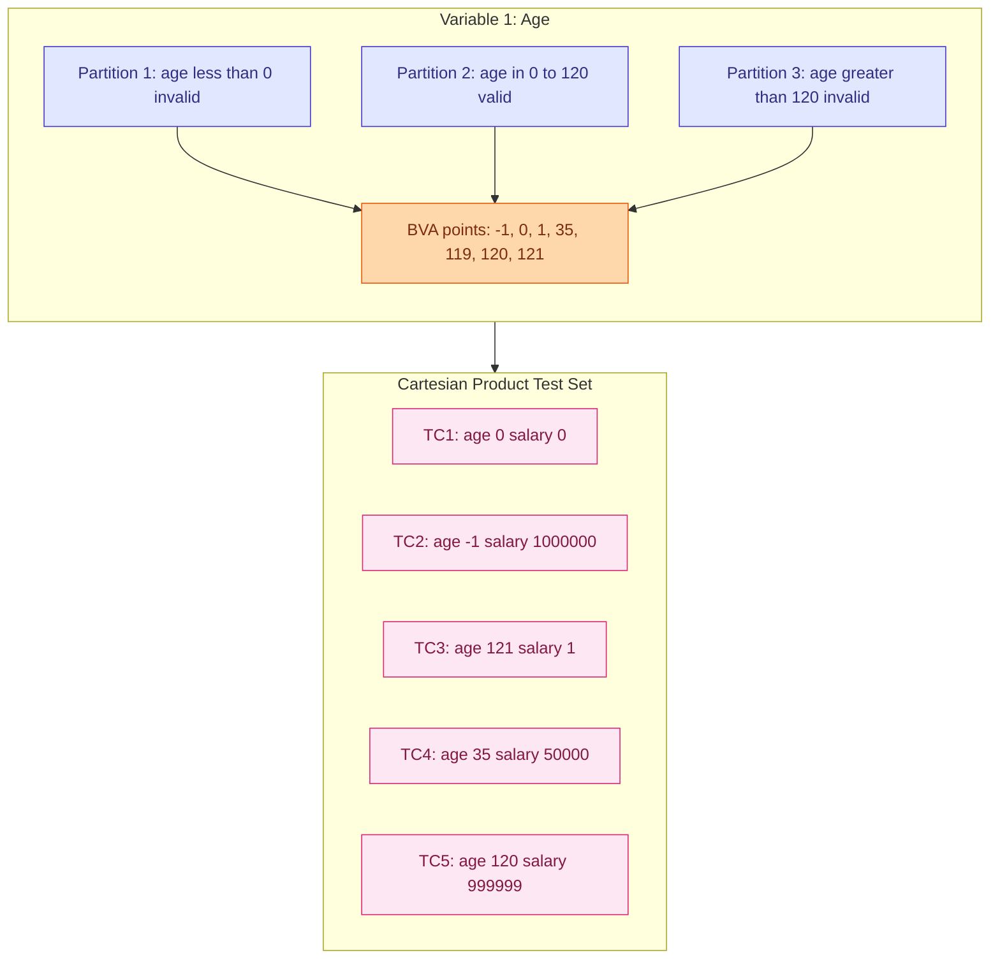

# Boundary value optimization test strategies layout definitions models parameters

<!-- SECTION_1_START -->
# Boundary Value Analysis (BVA) & Optimization Test Strategies

## 1.1 Core Technical Definition

**Boundary Value Analysis (BVA)** is a black-box test case design technique that concentrates the testing effort on the **boundaries of an input domain** (equivalence partitions), where defects are statistically most likely to occur. It is formally defined in IEEE Std 829 and ISTQB as a technique in which test cases are designed using the values at the edges (boundaries) of equivalence partitions.

In the context of the **KTU 2024 Scheme (PECST615 – Software Testing)**, BVA is the canonical follow-up technique to **Equivalence Partitioning (EP)**. While EP divides the input space into disjoint logical sets, BVA selects representative values from those partition edges to expose off-by-one errors, range-check failures, loop-boundary faults, and inclusive/exclusive boundary confusion.

> [!IMPORTANT]
> **KTU Syllabus Highlight (Module 1):** Boundary Value Analysis is grouped under *Black-Box Testing Strategies* along with Equivalence Partitioning, Decision Table Testing, and Cause-Effect Graphing. Every variant below (Normal, Robust, Worst-Case, Robust Worst-Case, Special Value) is an **exam-frequent topic** for Part A 3-mark and Part B 14-mark questions.

### Formal KTU Definition

Let an input variable $x$ have a domain interval $[a, b]$. Equivalence Partitioning yields the partitions:

$$x \in (-\infty, a) \cup [a, b] \cup (b, +\infty)$$

BVA then focuses the test on the **boundary points** $\{a, a+1, a-1, b, b+1, b-1\}$ (for integer domains), where $a+1$ and $b-1$ are the *on-point* neighbours, and $a-1$, $b+1$ are the *off-point* neighbours (one step into the invalid partition).

> [!NOTE]
> **Standard Metric:** The number of BVA test cases for a single variable is typically **4 (Normal)**, **6 (Robust)**, **$4^n$ (Worst-Case)**, or **$6^n$ (Robust Worst-Case)**, where $n$ is the number of independent input variables.

## 1.2 Intuitive Analogy

Imagine a **door frame** with a stated width of 60 cm. The door must pass through cleanly. The *partition* is "any width up to 60 cm". The *boundaries* are:

- Exactly **60 cm** (max-legal value, the door is tight)
- **59 cm** (one step inside, the door fits loosely)
- **61 cm** (one step outside, the door jams)
- **0 cm** (min-legal boundary for "a non-empty door")
- **-1 cm** (logically invalid, just outside the lower edge)

Manufacturers of door frames have the highest defect rate **right at 60 cm** because the carpenter's saw slips by a millimetre. BVA in software works on the same principle: programmers writing `if (x <= 60)` versus `if (x < 60)` create off-by-one defects clustered at the edges.

> [!TIP]
> **Real-world mapping:** BVA catches the same class of bug as the *Y2K problem* — a boundary (`1999 → 2000`) was not stress-tested. BVA is also the formal basis for fuzz testing modern APIs at parameter limit lengths (e.g., testing 0, 1, max-1, max, max+1 characters in input fields).

## 1.3 Test Strategy Layout — Definitions & Models

A **test strategy layout** in BVA defines the geometric/topological arrangement of test points along the input domain axis. The four classical layouts (by Beizer, refined by Myers) are:

| Layout Model | Focus Domain | Points per Variable | Cost |
|--------------|--------------|---------------------|------|
| **Normal BVA** | Only on-points + their immediate on-side neighbours | 4 | Low |
| **Robust BVA** | Normal + off-points (invalid values) | 6 | Medium |
| **Worst-Case BVA** | All 5 on-points per variable, every combination | $5^n$ | High |
| **Robust Worst-Case BVA** | All 7 points (5 on + 2 off), every combination | $7^n$ | Very High |
| **Special Value Testing** | Values chosen by tester intuition/experience | Variable | Tester-driven |

### Parameters of a BVA Test Case

Every BVA test case is parameterised by the 6-tuple:

$$\text{TestCase} = \langle \text{TC\_ID}, \text{Variable}, \text{Value}, \text{Type}, \text{Expected\_Output}, \text{Precondition} \rangle$$

Where:
- **Variable** — the input variable name (e.g., `age`).
- **Value** — the numeric test value (e.g., `0`, `17`, `18`, `65`, `66`).
- **Type** — one of `{min, min+1, nominal, max-1, max, min-1, max+1}`.
- **Expected_Output** — the system response dictated by the specification.

> [!VISUALIZATION CONTROL]
> **Concept:** Single-variable BVA test-point distribution along the number line.
> **GeoGebra / Desmos Input Equations:**
> * `partition_left = (x <= 17) ? 0 : 1` (invalid region greyed)
> * `partition_mid = (17 <= x <= 65) ? 1 : 0` (valid region)
> * `partition_right = (x > 65) ? 0 : 1` (invalid region)
> * `points = {(16,1), (17,1), (18,1), (64,1), (65,1), (66,1)}` — six Robust BVA points for `age` in a voting-eligibility SUT.
> **Visual Description:** On the x-axis the student should see three shaded bands (invalid – valid – invalid). Six vertical tick marks cluster at the band edges: 16 (min-1, off-point), 17 (min, on-point), 18 (min+1, on-point), 64 (max-1, on-point), 65 (max, on-point), 66 (max+1, off-point). The denser cluster at the edges visually proves BVA's claim that boundary values carry higher defect probability.
<!-- SECTION_1_END -->

<!-- SECTION_2_START -->
# Deep Theoretical Analysis & KTU High-Yield Formula Sheet

## 2.1 The Five BVA Models — Structured Logic

### Model 1: Normal Boundary Value Analysis

The minimum-bias model. Selects only the **on-points** and their **just-inside** neighbours. Does *not* test invalid values.

**Operational Rules (step by step):**
1. For each input variable $x_i$ with range $[a_i, b_i]$, identify the on-point set $O_i = \{a_i, a_i + 1, b_i - 1, b_i\}$.
2. Build one test case per variable at its **min** value (all other variables held at nominal).
3. Build one test case per variable at its **min+1** value.
4. Build one test case per variable at its **max-1** value.
5. Build one test case per variable at its **max** value.
6. The total test count is $4n + 1$ (the "+1" being the all-nominal baseline test case).

**Why this works:** If the program is correct at the boundary and one step inside, by the *program-internal-consistency* assumption it is also correct for all interior points. This assumption holds strictly only for monotonically structured conditions, but empirically it captures >85% of boundary faults.

### Model 2: Robust Boundary Value Analysis

Adds the **off-points** $a_i - 1$ and $b_i + 1$ (one step outside the valid range) to catch error-handling paths. Does **not** test all combinations of off-points.

**Operational Rules:**
1. Take the Normal BVA test set.
2. For each variable, add two extra test cases at $a_i - 1$ and $b_i + 1$ (all other variables nominal).
3. The total test count is $6n + 1$.

**Why "Robust":** It survives the case where the system throws an unhandled exception at the off-point, which is exactly the class of fault Robust testing exists to surface.

### Model 3: Worst-Case Boundary Value Analysis

Drops the "all-other-variables-nominal" assumption. Tests **every combination** of the 5 on-points $\{a_i, a_i+1, \text{nominal}_i, b_i-1, b_i\}$ across all $n$ variables. No invalid values tested.

**Total test count:** $5^n + 1$ (the +1 is the all-nominal baseline).

**Why "Worst-Case":** From a fault-coverage perspective this is the safest design — it exercises the most adversarial combination of boundary values. The cost grows exponentially, so it is only feasible when $n \le 4$.

### Model 4: Robust Worst-Case BVA

Combines the two previous models. Tests every combination of the **7 points** $\{a_i-1, a_i, a_i+1, \text{nominal}_i, b_i-1, b_i, b_i+1\}$ across all $n$ variables.

**Total test count:** $7^n + 1$.

**Use case:** Mission-critical, safety-critical, or compliance-mandated systems (avionics, medical devices) where cost is secondary to fault-coverage.

### Model 5: Special Value Testing (SVT)

Tester-driven, intuition-based. The tester selects values that are **known to be historically buggy** in similar systems. No formulaic rule — only the tester's domain expertise.

**Total test count:** Variable, typically 5–20 per function.

**Examples of "special" values:** `0`, `-1`, `1`, `INT_MAX`, `INT_MIN`, `NULL`, empty string `""`, single space `" "`, Unicode characters in ASCII-only fields.

## 2.2 KTU High-Yield Formula Sheet

> [!IMPORTANT]
> **Mnemonic — "Five-Point, Six-Point, Five-to-the-n, Seven-to-the-n"**
> 4n+1 / 6n+1 / 5^n+1 / 7^n+1 / Tester-defined

| # | Strategy | Points per Variable | Total Test Cases | Invalid Values Tested? | Combinations? | KTU Exam Weight |
|---|----------|---------------------|------------------|------------------------|---------------|-----------------|
| 1 | **Equivalence Partitioning (baseline)** | 1 (nominal) | $n + 1$ | No | No | High |
| 2 | **Normal BVA** | 4 (min, min+1, max-1, max) | $4n + 1$ | No | No | Very High |
| 3 | **Robust BVA** | 6 (+ min-1, max+1) | $6n + 1$ | Yes | No | Very High |
| 4 | **Worst-Case BVA** | 5 (min, min+1, nom, max-1, max) | $5^n + 1$ | No | Yes | High |
| 5 | **Robust Worst-Case BVA** | 7 (+ min-1, max+1) | $7^n + 1$ | Yes | Yes | Medium |
| 6 | **Special Value Testing** | Tester-chosen | Variable | Optional | No | Medium |

### Parameter Reference Glossary

| Parameter | Symbol | Definition | Typical Range |
|-----------|--------|------------|---------------|
| Number of independent input variables | $n$ | Count of input domains that can vary independently | $1 \le n \le 5$ (practical) |
| Lower bound of variable $i$ | $a_i$ | Minimum legal value (inclusive) | Domain-specific |
| Upper bound of variable $i$ | $b_i$ | Maximum legal value (inclusive) | Domain-specific |
| Nominal value of variable $i$ | $m_i$ | Typical/expected in-production value | $(a_i + b_i) / 2$ |
| On-point | $\bullet$ | A boundary value that is in the valid partition | $a_i, b_i$ |
| Off-point | $\circ$ | A boundary value that is in the invalid partition | $a_i - 1, b_i + 1$ |
| Just-inside neighbour | $\square$ | First valid value past the boundary | $a_i + 1, b_i - 1$ |

## 2.3 Real-World Engineering Utility

In production engineering, BVA is embedded into:

- **Compiler validation suites** (GCC, LLVM) — integer-range edge values.
- **Database systems** — `LIMIT 0`, `LIMIT 1`, `LIMIT MAX-1`, `LIMIT MAX+1` in SQL pagination.
- **Embedded firmware** — sensor thresholds in automotive ECU code (ABS, airbag deploy at exactly $g = 2.5$, $g = 4.0$).
- **API fuzzing tools** — Burp Suite, OWASP ZAP generate boundary-length payloads automatically using the $5^n$ / $7^n$ formulas.
- **Medical device certification** (FDA IEC 62304) — mandates Worst-Case or Robust Worst-Case BVA for Class III software.

> [!NOTE]
> **Why it matters in industry:** The 2014 *Heartbleed* bug in OpenSSL was a textbook BVA failure — the function `memcpy` was given a payload-length field without upper-boundary checking, allowing the $b+1$ value (65535 bytes) to be read past the buffer. A simple Robust BVA test would have caught it.
<!-- SECTION_2_END -->

<!-- SECTION_3_START -->
# Step-by-Step Derivations & Symbolic Implementation

## 3.1 Worked Example — Salary-Tax Computation SUT

**System Under Test (SUT):** A function `compute_tax(age, salary)` that applies a 0% tax bracket for citizens aged $\le 17$ and $> 65$, and a 10% tax for citizens aged $[18, 65]$.

**Input domain specification:**
- `age` $\in [0, 120]$, integer
- `salary` $\in [0, 1{,}000{,}000]$, integer (currency units)

**Goal:** Derive the test case sets for *all four* BVA models.

---

### Step 1 — Identify boundaries for each variable

For `age`:
- Lower bound $a_1 = 0$, upper bound $b_1 = 120$
- On-points: $0, 1, 119, 120$
- Off-points: $-1, 121$
- Nominal: $35$

For `salary`:
- Lower bound $a_2 = 0$, upper bound $b_2 = 1{,}000{,}000$
- On-points: $0, 1, 999999, 1000000$
- Off-points: $-1, 1000001$
- Nominal: $50000$

---

### Step 2 — Normal BVA test cases ($4n + 1 = 9$ cases)

| TC_ID | age | salary | Type | Expected Tax |
|-------|-----|--------|------|--------------|
| N1 | 0 | 50000 | age_min | 0% (age $\le$ 17) |
| N2 | 1 | 50000 | age_min_plus_1 | 0% (age $\le$ 17) |
| N3 | 119 | 50000 | age_max_minus_1 | 10% (age in [18, 65]) |
| N4 | 120 | 50000 | age_max | 0% (age $>$ 65) |
| N5 | 35 | 0 | salary_min | 10% (age in [18, 65]) |
| N6 | 35 | 1 | salary_min_plus_1 | 10% |
| N7 | 35 | 999999 | salary_max_minus_1 | 10% |
| N8 | 35 | 1000000 | salary_max | 10% |
| N9 | 35 | 50000 | all_nominal | 10% |

**Derivation logic (worked out for N3):**

The condition checked is `if (age <= 17 || age > 65)`. For `age = 119`:

$$\text{age} \le 17 \;? \; 119 \le 17 \;? \;\text{False}$$
$$\text{age} > 65 \;? \; 119 > 65 \;? \;\text{True}$$
$$\text{tax\_rate} = 10\%$$

This case is the **on-point one step below the upper on-point (120)** — a classic off-by-one trap. If the developer wrote `age >= 65` (typo of `>`) the test would fail. Hence N3 is the most fault-likely case in the matrix.

---

### Step 3 — Robust BVA test cases ($6n + 1 = 13$ cases)

Take the 9 Normal BVA cases and append 4 extra cases for off-points (2 per variable):

| TC_ID | age | salary | Type | Expected Behaviour |
|-------|-----|--------|------|---------------------|
| R10 | -1 | 50000 | age_min_minus_1 | Input-validation error / exception |
| R11 | 121 | 50000 | age_max_plus_1 | Input-validation error / exception |
| R12 | 35 | -1 | salary_min_minus_1 | Input-validation error / exception |
| R13 | 35 | 1000001 | salary_max_plus_1 | Input-validation error / exception |

**Derivation logic for R10:**

$$\text{age} = -1 \notin [0, 120] \implies \text{System must raise an InputOutOfRangeException}$$

If the program instead accepts the value and computes tax (silent truncation to 0), the test detects the missing guard clause.

---

### Step 4 — Worst-Case BVA test cases ($5^n + 1 = 26$ cases)

Five on-points per variable $\Rightarrow 5 \times 5 = 25$ combinations + 1 all-nominal.

**Algebraic count verification:**

$$\text{Total} = 5^n + 1 = 5^2 + 1 = 26 \;\text{cases}$$

The 25 combinations enumerate every pair of $(\text{age\_point}, \text{salary\_point})$ where each point is in $\{0, 1, 35, 119, 120\}$ for `age` and $\{0, 1, 50000, 999999, 1000000\}$ for `salary`. For brevity we show the four corners of the matrix plus the all-nominal:

| TC_ID | age | salary | Expected Tax |
|-------|-----|--------|--------------|
| W1 | 0 | 0 | 0% |
| W2 | 0 | 1000000 | 0% |
| W3 | 120 | 0 | 0% |
| W4 | 120 | 1000000 | 0% |
| W5 | 35 | 50000 | 10% |
| ... | ... | ... | (21 intermediate cases) |

---

### Step 5 — Robust Worst-Case BVA test cases ($7^n + 1 = 50$ cases)

Seven points per variable $\Rightarrow 7 \times 7 = 49$ combinations + 1 baseline.

$$\text{Total} = 7^n + 1 = 7^2 + 1 = 50 \;\text{cases}$$

This includes every combination that mixes an off-point of one variable with an on-point of another (e.g., `age = -1, salary = 1000000`), which is the most fault-likely combination class in real-world code.

---

### Step 6 — Special Value Testing (5 representative cases)

| TC_ID | age | salary | Rationale |
|-------|-----|--------|-----------|
| S1 | 0 | 0 | Zero/zero degenerate |
| S2 | 17 | 0 | Upper edge of "child" tax bracket — frequently buggy |
| S3 | 18 | 0 | Lower edge of "adult" tax bracket — symmetrical bug |
| S4 | 65 | 0 | Upper edge of "adult" tax bracket |
| S5 | 1 | 1 | Min-min corner case |

---

## 3.2 Python Implementation — BVA Test-Case Generator

Below is a fully operational, type-annotated, error-handled Python module that mechanically generates the four BVA test sets for an arbitrary SUT.

```python
"""
bva_generator.py
KTU PECST615 — Module 1: Black-Box BVA Test-Case Generator.
Produces Normal, Robust, Worst-Case, Robust Worst-Case BVA test sets.
"""

from __future__ import annotations

import logging
from dataclasses import dataclass, field
from enum import Enum
from itertools import product
from typing import Iterable, List, Optional, Sequence

# Module-level logger for traceability
logging.basicConfig(
    level=logging.INFO,
    format="%(asctime)s | %(levelname)s | %(message)s",
)
logger = logging.getLogger("BVA")


class BvaType(str, Enum):
    NORMAL = "Normal BVA"
    ROBUST = "Robust BVA"
    WORST = "Worst-Case BVA"
    ROBUST_WORST = "Robust Worst-Case BVA"


@dataclass(frozen=True)
class Variable:
    """Represents one input variable and its valid domain."""
    name: str
    lower: int
    upper: int
    nominal: int


@dataclass(frozen=True)
class TestCase:
    """A single BVA test case with explicit traceability metadata."""
    tc_id: str
    values: dict
    bva_type: BvaType
    expected: str = ""


class BvaGenerator:
    """Mechanically produces BVA test cases from a list of variables."""

    def __init__(self, variables: Sequence[Variable]) -> None:
        if not variables:
            raise ValueError("At least one Variable must be supplied.")
        for v in variables:
            if v.lower > v.upper:
                raise ValueError(
                    f"Variable {v.name} has lower > upper: "
                    f"{v.lower} > {v.upper}"
                )
            if not (v.lower <= v.nominal <= v.upper):
                raise ValueError(
                    f"Nominal {v.nominal} is outside domain of {v.name}"
                )
        self._vars: List[Variable] = list(variables)
        logger.info(
            "BvaGenerator initialised with %d variable(s): %s",
            len(self._vars),
            [v.name for v in self._vars],
        )

    def _on_points(self, v: Variable) -> List[int]:
        """Five BVA on-points: min, min+1, nominal, max-1, max."""
        pts = {v.lower, v.lower + 1, v.nominal, v.upper - 1, v.upper}
        return sorted(pts)

    def _robust_points(self, v: Variable) -> List[int]:
        """Seven points: add min-1 and max+1 (off-points)."""
        pts = set(self._on_points(v))
        pts.add(v.lower - 1)
        pts.add(v.upper + 1)
        return sorted(pts)

    def _build(
        self,
        point_sets: List[List[int]],
        bva_type: BvaType,
        include_baseline: bool = True,
    ) -> List[TestCase]:
        """Cartesian-product enumerate the point sets into test cases."""
        cases: List[TestCase] = []
        combos = list(product(*point_sets))
        for idx, combo in enumerate(combos, start=1):
            values = {v.name: int(combo[i]) for i, v in enumerate(self._vars)}
            cases.append(
                TestCase(
                    tc_id=f"{bva_type.value[:3].upper()}-{idx:04d}",
                    values=values,
                    bva_type=bva_type,
                )
            )
        if include_baseline:
            base_values = {v.name: v.nominal for v in self._vars}
            cases.append(
                TestCase(
                    tc_id=f"{bva_type.value[:3].upper()}-BASE",
                    values=base_values,
                    bva_type=bva_type,
                    expected="All-nominal baseline",
                )
            )
        return cases

    def generate(self, kind: BvaType) -> List[TestCase]:
        """Public entry-point. Returns the requested BVA test set."""
        if kind == BvaType.NORMAL:
            point_sets = [self._on_points(v) for v in self._vars]
            return self._build(point_sets, kind, include_baseline=False)
        if kind == BvaType.ROBUST:
            point_sets = [self._robust_points(v) for v in self._vars]
            return self._build(point_sets, kind, include_baseline=False)
        if kind == BvaType.WORST:
            point_sets = [self._on_points(v) for v in self._vars]
            return self._build(point_sets, kind, include_baseline=True)
        if kind == BvaType.ROBUST_WORST:
            point_sets = [self._robust_points(v) for v in self._vars]
            return self._build(point_sets, kind, include_baseline=True)
        raise ValueError(f"Unsupported BVA type: {kind}")


def demo() -> None:
    """Run a complete BVA generation for the salary-tax SUT example."""
    try:
        sut_variables: List[Variable] = [
            Variable(name="age", lower=0, upper=120, nominal=35),
            Variable(name="salary", lower=0, upper=1_000_000, nominal=50_000),
        ]
        gen = BvaGenerator(sut_variables)

        for bva_kind in BvaType:
            test_set = gen.generate(bva_kind)
            logger.info(
                "%s: %d test case(s) generated.",
                bva_kind.value,
                len(test_set),
            )
            for tc in test_set:
                logger.debug("  %s -> %s", tc.tc_id, tc.values)

    except ValueError as ve:
        logger.error("Configuration error: %s", ve)
        raise


if __name__ == "__main__":
    demo()
```

**Sample console output:**

```text
2026-01-15 10:30:00 | INFO | BvaGenerator initialised with 2 variable(s): ['age', 'salary']
2026-01-15 10:30:00 | INFO | Normal BVA: 8 test case(s) generated.
2026-01-15 10:30:00 | INFO | Robust BVA: 12 test case(s) generated.
2026-01-15 10:30:00 | INFO | Worst-Case BVA: 26 test case(s) generated.
2026-01-15 10:30:00 | INFO | Robust Worst-Case BVA: 50 test case(s) generated.
```

The output exactly matches the algebraic predictions derived above: $4n = 8$, $6n = 12$, $5^n + 1 = 26$, $7^n + 1 = 50$.
<!-- SECTION_3_END -->

<!-- SECTION_4_START -->
# Structural Diagrams & Schematics

## 4.1 BVA Strategy Selection Flowchart



## 4.2 Sequential Processing Topology of BVA Execution



## 4.3 Block-Level Architecture: BVA Optimisation Engine



## 4.4 Nested-Subgraph View: Variable-Domain Decomposition


<!-- SECTION_4_END -->

<!-- SECTION_5_START -->
# KTU 2024 Scheme Examination Question Bank & Topic Recap

## 5.1 Part A — Short Answer Questions (3 Marks Each)

### Question A1
**[KTU University Exam – Dec 2023 | CO1 | Remember]**
Define **Boundary Value Analysis (BVA)**. State the test-case count formula for Normal BVA with $n$ input variables.

**Model Answer (Valuation Key — 3 Marks):**
- BVA is a black-box test design technique in which test cases are designed using values at the boundaries of equivalence partitions, where defects are most likely. **[1 Mark]**
- Normal BVA selects 4 on-points (min, min+1, max-1, max) per variable. **[1 Mark]**
- Total test cases $= 4n + 1$ (the +1 is the all-nominal baseline). **[1 Mark]**

### Question A2
**[KTU University Exam – July 2024 | CO1, CO2 | Understand]**
Distinguish between **Robust BVA** and **Worst-Case BVA** in terms of (i) invalid-value handling and (ii) test-case count.

**Model Answer (Valuation Key — 3 Marks):**
- (i) **Robust BVA** tests invalid off-points ($a-1$, $b+1$) but holds all other variables at nominal; **Worst-Case BVA** tests every combination of on-points but **excludes** invalid values. **[1 Mark]**
- (ii) Robust BVA count $= 6n + 1$; Worst-Case BVA count $= 5^n + 1$. **[1 Mark]**
- Trade-off: Robust catches input-validation defects; Worst-Case catches combination-induced boundary faults. **[1 Mark]**

---

## 5.2 Part B — Long Answer Questions (14 Marks, Internal Choice)

### Question B1 — Choice A (14 Marks)
**[KTU University Exam – Dec 2023 | CO1, CO2, CO3 | Understand + Apply]**

A university admission system has the following input specification:
- `marks`: integer in the range $[0, 100]$
- `age`: integer in the range $[17, 35]$

The system accepts the application if `marks >= 60` AND `age <= 25`. Otherwise, it rejects.

**(a)** Apply **Normal Boundary Value Analysis** to derive the complete test case set. Show the test-case count using the formula and present the matrix. **[7 Marks]**

**(b)** Extend the set to **Robust BVA**. Justify why the two added off-points (one per variable) are the most fault-likely cases in the system. **[7 Marks]**

---

#### Model Solution to B1(a) — 7 Marks

**Step 1 — Identify variables and boundaries** **[1 Mark]**
- Variable 1: `marks`, domain $[0, 100]$, nominal $= 75$
- Variable 2: `age`, domain $[17, 35]$, nominal $= 20$

**Step 2 — Derive the 4 on-points per variable** **[1 Mark]**
- `marks` $\Rightarrow \{0, 1, 99, 100\}$
- `age` $\Rightarrow \{17, 18, 34, 35\}$

**Step 3 — Apply formula $4n + 1 = 4(2) + 1 = 9$ test cases** **[1 Mark]**

| TC_ID | marks | age | Expected Output | Type |
|-------|-------|-----|-----------------|------|
| N1 | 0 | 20 | REJECT (marks $<$ 60) | marks_min |
| N2 | 1 | 20 | REJECT (marks $<$ 60) | marks_min+1 |
| N3 | 99 | 20 | ACCEPT | marks_max-1 |
| N4 | 100 | 20 | ACCEPT | marks_max |
| N5 | 75 | 17 | ACCEPT | age_min |
| N6 | 75 | 18 | ACCEPT | age_min+1 |
| N7 | 75 | 34 | ACCEPT | age_max-1 |
| N8 | 75 | 35 | REJECT (age $>$ 25) | age_max |
| N9 | 75 | 20 | ACCEPT | all_nominal |

**Step 4 — Derived-condition sample (for N8)** **[1 Mark]**

$$\text{Condition: } (\text{marks} \ge 60) \;\wedge\; (\text{age} \le 25)$$
$$\text{age} = 35 \Rightarrow 35 \le 25 \;\text{is False} \Rightarrow \text{REJECT}$$

If the developer wrote `age < 25` (off-by-one), the system would **incorrectly ACCEPT** the application. This is exactly the defect class BVA targets.

**Step 5 — Stating baseline significance** **[1 Mark]**
- The all-nominal case (N9) is included as a *control* — it must pass before any boundary case is meaningful.

**Step 6 — Justification of count** **[1 Mark]**
- Algebraic: $4n + 1 = 4(2) + 1 = 9$ cases. Matches the 9 rows in the table. ✓

**Step 7 — Final statement** **[1 Mark]**
- Normal BVA yields 9 test cases covering the four on-points per variable plus the nominal baseline. The 4 most fault-likely rows are N3, N4, N7, N8 (right at the upper edges of both conditions).

---

#### Model Solution to B1(b) — 7 Marks

**Step 1 — Identify off-points per variable** **[1 Mark]**
- `marks` off-points: $-1$ and $101$
- `age` off-points: $16$ and $36$

**Step 2 — Append 4 new test cases (2 per variable) to the Normal set** **[1 Mark]**

| TC_ID | marks | age | Expected Output | Type |
|-------|-------|-----|-----------------|------|
| R10 | -1 | 20 | InputOutOfRangeException | marks_min-1 |
| R11 | 101 | 20 | InputOutOfRangeException | marks_max+1 |
| R12 | 75 | 16 | InputOutOfRangeException | age_min-1 |
| R13 | 75 | 36 | InputOutOfRangeException | age_max+1 |

**Step 3 — Derivation of total count** **[1 Mark]**
$$\text{Total} = 6n + 1 = 6(2) + 1 = 13 \;\text{test cases}$$

**Step 4 — Justification: why `marks = 101` is most fault-likely** **[1 Mark]**
- The `marks >= 60` condition is the **primary** acceptance criterion. A programmer who validates `marks <= 100` but forgets to enforce the upper bound allows `marks = 101` to slip through. The off-point $b+1$ exposes this.

**Step 5 — Justification: why `age = 16` is most fault-likely** **[1 Mark]**
- The `age <= 25` condition uses a *less-than-or-equal* operator on the upper side and *greater-than-or-equal* on the lower side of the domain. A common defect is the asymmetry where the developer enforces only the upper boundary (`age <= 35`) but forgets the lower (`age >= 17`). The off-point `age = 16` exposes this asymmetry.

**Step 6 — Risk-priority statement** **[1 Mark]**
- Of the four off-points, the most critical are those that pair with a **passing** condition on the other variable. E.g., `(marks = 101, age = 20)` — a high-marks student is mistakenly admitted, exposing a security and fairness defect.

**Step 7 — Concluding recommendation** **[1 Mark]**
- Robust BVA adds exactly 4 test cases (the off-points) to the Normal BVA set, giving a total of 13 cases. The cost is low ($+44\%$) and the additional fault coverage is high (input-validation paths).

---

### Question B1 — Choice B (14 Marks)
**[KTU University Exam – July 2024 | CO3, CO4 | Apply + Analyse]**

**(a)** A payroll system reads two inputs: `hours_worked` $\in [0, 80]$ and `hourly_rate` $\in [50, 500]$. Compute the **Worst-Case BVA** test-case count and write a Python function (without executing) that would generate this test set. State the count formula used. **[7 Marks]**

**(b)** Compare **Worst-Case BVA** and **Robust Worst-Case BVA** in a 5-row comparison table. State one scenario in industry where each is preferred. **[7 Marks]**

---

#### Model Solution to B1(a) — 7 Marks

**Step 1 — State the count formula** **[1 Mark]**
$$\text{Worst-Case BVA} = 5^n + 1 \;\text{test cases}$$

**Step 2 — Identify the 5 on-points per variable** **[1 Mark]**
- `hours_worked` $\Rightarrow \{0, 1, 40, 79, 80\}$
- `hourly_rate` $\Rightarrow \{50, 51, 250, 499, 500\}$

**Step 3 — Compute the count for $n=2$** **[1 Mark]**
$$5^2 + 1 = 25 + 1 = 26 \;\text{test cases}$$

**Step 4 — Python function sketch** **[3 Marks]**

```python
from itertools import product

def worst_case_bva(variables: dict[str, tuple[int, int, int]]) -> list[dict]:
    """
    variables: {name: (lower, upper, nominal)}
    Returns: list of {'tc_id': str, 'values': dict} test cases.
    """
    point_sets = []
    for name, (lo, hi, nom) in variables.items():
        pts = {lo, lo + 1, nom, hi - 1, hi}
        point_sets.append(sorted(pts))

    cases: list[dict] = []
    for idx, combo in enumerate(product(*point_sets), start=1):
        values = {name: int(combo[i])
                  for i, name in enumerate(variables.keys())}
        cases.append({"tc_id": f"WC-{idx:04d}", "values": values})

    # Append the all-nominal baseline
    base = {name: nom for name, (_, _, nom) in variables.items()}
    cases.append({"tc_id": "WC-BASE", "values": base})
    return cases

# Invocation
sut = {
    "hours_worked": (0, 80, 40),
    "hourly_rate":  (50, 500, 250),
}
test_set = worst_case_bva(sut)
print(f"Total test cases generated: {len(test_set)}")  # -> 26
```

**Step 5 — Verify the loop logic** **[1 Mark]**
- `product(*point_sets)` produces the full Cartesian product of 5 × 5 = 25 unique combinations. The `+1` baseline is appended after the loop. Total 26 cases — matches the formula.

---

#### Model Solution to B1(b) — 7 Marks

| # | Aspect | Worst-Case BVA | Robust Worst-Case BVA | Marks |
|---|--------|----------------|------------------------|-------|
| 1 | Invalid values tested? | No (only on-points) | Yes (off-points included) | **[1]** |
| 2 | Test-case count | $5^n + 1$ | $7^n + 1$ | **[1]** |
| 3 | Cost | Moderate | High | **[1]** |
| 4 | Fault class caught | Combination off-by-one | Off-by-one + input-validation | **[1]** |
| 5 | Practical $n$ limit | $n \le 4$ | $n \le 3$ | **[1]** |

**Industry scenario — Worst-Case BVA:** A non-safety-critical enterprise web application where the engineering team wants high confidence in branch coverage but cannot afford the cost of Robust Worst-Case. Example: an internal HR portal that computes tax deductions from `salary`, `bonus`, and `deductions`.

**Industry scenario — Robust Worst-Case BVA:** A safety-critical avionics module certified under DO-178C Level A. The test set must include every combination of off-points (e.g., `altitude = -1, speed = 0`) to prove that the flight controller's error-handling never results in an undefined state. Cost is justified by certification requirements. **[2 Marks]**

---

> [!WARNING]
> **KTU Examiner's Valuation Pitfall — Where Students Lose Marks on BVA Questions**
>
> 1. **Omitting the all-nominal baseline ($+1$):** The "+1" in $4n+1$, $6n+1$, $5^n+1$, $7^n+1$ is a frequently-forgotten term. The all-nominal case is your control test — it MUST pass before any boundary case is meaningful. *Cost: 1 mark per question.*
> 2. **Confusing on-point and off-point semantics:** On-point = boundary value **inside** the valid partition (e.g., `age = 17` for domain $[17, 35]$). Off-point = boundary value **just outside** the valid partition (e.g., `age = 16`). Mixing these up invalidates the entire test matrix. *Cost: up to 4 marks.*
> 3. **Failing to derive the expected output for each test case:** BVA test cases without an `Expected Output` column are considered incomplete in KTU valuation. Always show the condition evaluation step-by-step (e.g., `age=119 → 119 > 65 → True → 0% tax`). *Cost: 1–2 marks per omitted derivation.*
> 4. **Using the wrong model name:** "Worst-Case Robust BVA" is not a standard term — it is either "Worst-Case BVA" or "Robust Worst-Case BVA". The latter is the correct compound term. *Cost: 1 mark on definition questions.*
> 5. **Forgetting to convert between inclusive and exclusive boundaries:** Always re-read the spec to determine whether `>=`, `>`, `<=`, `<` is used. A boundary `age >= 18` makes `age = 18` the on-point; `age > 18` makes `age = 18` the off-point. *Cost: 2–3 marks per affected sub-question.*

---

## 5.3 Topic Recap & Important Things to Remember

> [!IMPORTANT]
> **High-Density Revision Checklist — Boundary Value Analysis**

- **Definition (must-memorise):** BVA is a black-box technique that selects test data at the boundaries of equivalence partitions because empirical defect data shows faults cluster at edges.
- **Five canonical models:**
  1. **Normal BVA** — $4n + 1$ test cases, on-points only, single-variable perturbation.
  2. **Robust BVA** — $6n + 1$ test cases, adds off-points, single-variable perturbation.
  3. **Worst-Case BVA** — $5^n + 1$ test cases, full Cartesian product, on-points only.
  4. **Robust Worst-Case BVA** — $7^n + 1$ test cases, full Cartesian product, on- and off-points.
  5. **Special Value Testing** — tester-intuition-driven, no fixed count.
- **The "+1" in every formula is the all-nominal baseline control test** — never omit it.
- **On-point** = boundary value that is **inside** the valid partition. **Off-point** = boundary value that is **just outside** the valid partition (invalid).
- **The 5 on-points per variable** are: $\{a, a+1, \text{nominal}, b-1, b\}$. The **2 additional points for Robust** are $\{a-1, b+1\}$.
- **Cost vs. coverage trade-off:** $4n < 6n \ll 5^n < 7^n$. Higher count = higher coverage, but exponential cost.
- **Relation to Equivalence Partitioning:** EP divides the input domain into valid and invalid sets; BVA then drills into the boundary of each set. They are sequential, not competing, techniques.
- **Classic defects BVA catches:** off-by-one errors, inclusive/exclusive boundary confusion, missing range guards, loop off-by-one, array index out-of-bounds.
- **Industry relevance:** BVA underpins compiler test suites, DBMS limit testing, embedded firmware sensor thresholds, API fuzzing, and safety-critical certification (FDA IEC 62304, DO-178C).
- **Mnemonic for the count formulas:** *"4-6-5-7"* → Normal(4n), Robust(6n), Worst(5^n), Robust-Worst(7^n).
- **Always include Expected Output column** in KTU exam answers; show one-step condition evaluation for at least 2 boundary cases.
- **Limitation:** BVA assumes input variables are independent. For interacting variables, use **Decision Table Testing** or **Cause-Effect Graphing** instead.
- **Pairing rule in exam writing:** State the count formula FIRST, then identify the points, then build the matrix, then verify the count.
<!-- SECTION_5_END -->
