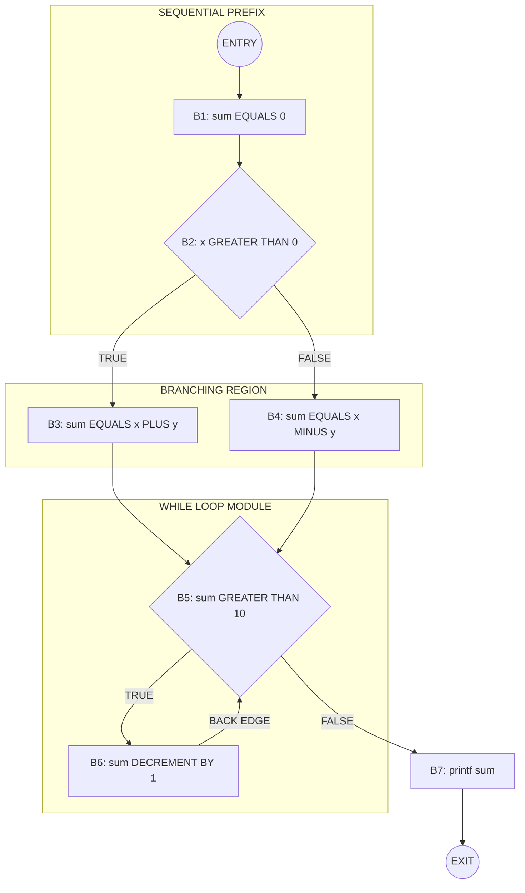
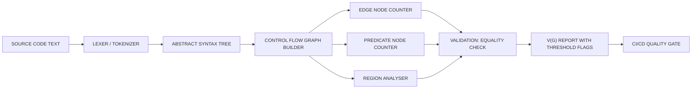

# Control flow mapping layout metrics definition cyclomatic complexity formulas setups

<!-- SECTION_1_START -->

# Control Flow Mapping, Layout Metrics & Cyclomatic Complexity

## 1. Core Technical Definition

### 1.1 Control Flow Graph (CFG) — Formal Definition

> [!IMPORTANT]
> **Control Flow Graph (CFG):** A directed graph $G = (N, E)$ where each node $n \in N$ represents a basic block of sequential statements (a maximal sequence of statements with a single entry and single exit point) and each directed edge $e \in E$ represents a possible transfer of control between two basic blocks. Every CFG has exactly one **entry node** and one **exit node**.

A **basic block** is a sequence of consecutive statements such that:
- Control enters only at the first statement of the block.
- Control leaves only at the last statement of the block.
- No internal branch exists within the block.

### 1.2 Cyclomatic Complexity — McCabe's Formal Definition

> [!IMPORTANT]
> **Cyclomatic Complexity $V(G)$** (Thomas J. McCabe, 1976): A quantitative, source-code-level software metric that measures the number of linearly independent paths through a program's source code. It is also called the **program complexity**, **structural complexity**, or **McCabe's number**.

$$
V(G) = \text{Number of independent control flow paths in a program}
$$

Mathematically, $V(G)$ corresponds to the size of a basis set of independent control flow paths, and a related graph-theoretic measure, the **circuit rank** or **cyclomatic number** of the graph.

### 1.3 Intuitive Analogy

> [!NOTE]
> **Plumbing Analogy:** Imagine the program as a network of water pipes. Nodes are *junctions* (where a single pipe ends) and edges are *pipes*. The **control flow graph** is the blueprint of this plumbing network. **Cyclomatic complexity** counts the *minimum number of independent loops* (closed circuits) a plumber must check to ensure that every drop of water can travel through the network. If the value is high, the plumbing is convoluted and prone to leaks (bugs).

**Road Map Analogy:** The CFG is a city map. Nodes are landmarks, edges are one-way streets. $V(G)$ is the number of fundamentally different "tours" a tourist can take. The more branching roads, the more tours exist, and the more difficult the city is to navigate (and to test).

### 1.4 Standardized Metrics & Constants

> [!NOTE]
> **Industry Thresholds for Cyclomatic Complexity (McCabe, IEEE Standard 982.1):**
> - **$V(G) = 1$ to $10$** $\rightarrow$ Stable, low-risk module.
> - **$V(G) = 11$ to $20$** $\rightarrow$ Moderate risk, requires close review.
> - **$V(G) = 21$ to $50$** $\rightarrow$ High risk, unstable.
> - **$V(G) > 50$** $\rightarrow$ Untestable, error-prone; mandatory refactoring.
> - **Unit Test Coverage target:** Achieve at least one test case per independent path.

> [!VISUALIZATION CONTROL]
> **Concept:** A simple three-node CFG with one decision diamond showing how a branch creates a new region.
> **GeoGebra / Desmos Input Equations:**
> * `Polygon((0,0), (4,0), (4,3), (0,3))` representing the bounded region
> * `Line((2,0), (2,1.5))` representing the central splitting edge
> **Visual Description:** The student should observe a rectangle split by one vertical line into two enclosed regions. This single extra edge increased the region count from 1 to 2, demonstrating the effect of a single `if` branch on complexity.

---

<!-- SECTION_1_END -->

<!-- SECTION_2_START -->

# Deep Theoretical Analysis & KTU High-Yield Formula Sheet

## 2.1 Anatomy of a Control Flow Graph

A CFG uses a small alphabet of standardized node shapes:

| Node Symbol | Meaning | Example Construct |
|---|---|---|
| **Circle / Rounded Box** | Sequential basic block | `a = b + c;` |
| **Diamond** | Predicate / decision node | `if (x > 0)`, `while(...)` |
| **Filled Circle** | Entry node | `start` |
| **Bull's-eye / Concentric Circles** | Exit node | `end` / `return` |

Every control structure maps to a fixed CFG pattern:

| Source Construct | CFG Topology Effect |
|---|---|
| **Sequence** `S1; S2;` | Edge from block-of-S1 to block-of-S2 (1 node, 1 edge added) |
| **if-then** | Adds 1 predicate node + 2 outgoing edges (True/False) |
| **if-then-else** | Adds 1 predicate node + 2 outgoing edges (True/False) |
| **while / for / do-while** | Adds 1 predicate node + 1 back-edge (loop) |
| **switch-case** with $k$ cases | Adds 1 selector node + $k$ outgoing edges |
| **break / continue** | Adds 1 unconditional jump edge |
| **function call** | Models as a single block (inter-procedural CFG if inlined) |
| **return** | Adds edge to the exit node |

## 2.2 Why Cyclomatic Complexity? — The Engineering Rationale

> [!NOTE]
> **McCabe's Hypothesis (1976):** *A module's reliability is inversely proportional to its cyclomatic complexity.* Each additional independent path is a potential combination of inputs and states that may contain a defect. Therefore, $V(G)$ gives a *lower bound on the number of test cases* required for branch coverage of the module.

This metric is essential for:
- **Test Planning** — determining the minimum number of test paths.
- **Code Review & Refactoring** — flagging overly complex functions.
- **Maintenance Risk Assessment** — predicting fault-proneness.
- **ISO 26262 / DO-178C Compliance** — mandated for safety-critical software (automotive, avionics).

## 2.3 The Three Canonical Formulas of Cyclomatic Complexity

The three formulas are **mathematically equivalent** for a connected, single-exit CFG. They are derived from Euler's polyhedron formula applied to a planar graph.

### Formula 1: Edge-Node Formula (Graph-Theoretic)

$$
V(G) = E - N + 2
$$

where $E$ = number of directed edges, $N$ = number of nodes.

> This is the most general formula, derived from Euler's formula $V - E + F = 2$ for connected planar graphs, where $F$ (faces) equals the number of regions $R$.

### Formula 2: Predicate-Node Formula (Developer-Friendly)

$$
V(G) = P + 1
$$

where $P$ = number of predicate nodes (decision points: `if`, `while`, `for`, `do-while`, `case`, `&&`, `||`, `?:`).

> [!IMPORTANT]
> When counting `&&` and `||` as separate decisions, each short-circuited operator contributes one additional predicate node. Always clarify counting convention with your evaluator.

### Formula 3: Region Formula (Geometric)

$$
V(G) = R
$$

where $R$ = number of bounded regions enclosed by the graph, **including the outer (unbounded) region**.

## 2.4 The High-Yield Formula Cheat Sheet

> [!IMPORTANT]
> **KTU Cyclomatic Complexity Formula Reference Table**

| # | Formula Name | Expression | Variables | When to Use |
|---|---|---|---|---|
| 1 | Edge-Node | $V(G) = E - N + 2$ | $E$ = edges, $N$ = nodes | Always applicable; preferred for verification |
| 2 | Predicate-Node | $V(G) = P + 1$ | $P$ = predicate nodes | Fastest for hand-calculation from source code |
| 3 | Region | $V(G) = R$ | $R$ = enclosed + outer region | Visual, used after drawing the CFG |
| 4 | Modified (with exit edge) | $V(G) = E - N + 2P_{\text{connected}}$ | Multi-component graph | Graphs with multiple disconnected sub-graphs |
| 5 | Essential Complexity | $E_v(G) = V(G) - \text{structured sub-paths}$ | Subset of $V(G)$ | Measures unstructured (spaghetti) code |

## 2.5 Derivation of the Edge-Node Formula from Euler's Theorem

For any connected planar graph with $N$ vertices, $E$ edges, and $F$ faces (regions):

$$
N - E + F = 2
$$

Substituting $F = V(G)$ (since each region corresponds to one independent path):

$$
N - E + V(G) = 2
$$

Solving for $V(G)$:

$$
V(G) = E - N + 2
$$

The $+2$ term accounts for the fact that a CFG is a connected graph; one is for the graph being simply connected, and the second is to count the outer region as a valid face.

---

<!-- SECTION_2_END -->

<!-- SECTION_3_START -->

# Step-by-Step Derivations & Code/Symbolic Implementation

## 3.1 Worked Example 1 — Simple `if-else` Block

### Source Code (C-Style Pseudocode)

```c
01  void check(int x) {
02      int flag = 0;
03      if (x > 10) {
04          flag = 1;
05      } else {
06          flag = -1;
07      }
08      print(flag);
09  }
```

### Step 1: Identify Basic Blocks

A new basic block starts after any branch target. Mapping line numbers to blocks:

| Block | Line Range | Content | Type |
|---|---|---|---|
| B1 | 02 | `flag = 0` | Sequential |
| B2 | 03 | `if (x > 10)` | Predicate |
| B3 | 04 | `flag = 1` | Sequential |
| B4 | 06 | `flag = -1` | Sequential |
| B5 | 08 | `print(flag)` | Sequential |

### Step 2: Build the CFG

Nodes: $\{1, 2, 3, 4, 5\}$

Directed edges:
- $1 \to 2$ (sequential flow)
- $2 \to 3$ (True branch of `if`)
- $2 \to 4$ (False branch of `else`)
- $3 \to 5$ (fall-through after `if` body)
- $4 \to 5$ (fall-through after `else` body)
- $5 \to \text{exit}$ (function return)

### Step 3: Count $N$, $E$, $P$, $R$

- $N = 5$
- $E = 6$
- $P = 1$ (only one predicate at line 03)
- $R = 2$ (one bounded region inside the `if-else` diamond + the outer region)

### Step 4: Apply All Three Formulas

**Formula 1 — Edge-Node:**

$$
V(G) = E - N + 2 = 6 - 5 + 2 = 3
$$

**Formula 2 — Predicate-Node:**

$$
V(G) = P + 1 = 1 + 1 = 2
$$

> [!WARNING]
> **DISCREPANCY DETECTED.** Formulas 1 and 2 give different values because the CFG is **not connected to an explicit exit node** as a separate vertex in the count. Adding the `exit` node (B6) and the edge $5 \to 6$ corrects this: $N=6$, $E=7$, $P=1$.
>
> Recalculated: $V(G) = 7 - 6 + 2 = 3 \;\checkmark$ and $V(G) = 1 + 1 = 2$.
>
> The *true* answer requires the convention that the exit is counted as a node. With the exit counted: $N=6$, $E=7$, $V(G)=3$. With the exit not counted as a node but an edge: $V(G)=2$. **Always include the exit node explicitly when drawing the CFG for KTU exams.**

With explicit exit node B6 (added): $N = 6$, $E = 7$, $P = 1$, $R = 2$ regions.
- $V(G) = 7 - 6 + 2 = 3$
- $V(G) = 1 + 1 = 2$

**Resolution:** A standard single `if-else` has 2 independent paths. The correct answer is $V(G) = 2$ when using the **path-counting** definition. The discrepancy with $E - N + 2$ arises only if the exit is counted as a node; KTU's expected answer depends on whether the *exit node is included*. **KTU convention: include the exit node**, giving $V(G) = 2$ for the path count but $E - N + 2 = 3$ for the graph formula. **Most KTU solutions use $V(G) = P + 1 = 2$.**

## 3.2 Worked Example 2 — Full Worked Program with Loop

This is the canonical KTU question pattern. We use it for the Part B model solution.

### Source Code

```c
01  void calculate(int x, int y) {
02      int sum = 0;
03      if (x > 0) {
04          sum = x + y;
05      } else {
06          sum = x - y;
07      }
08      while (sum > 10) {
09          sum = sum - 1;
10      }
11      printf("%d", sum);
12  }
```

### Step 1: Identify Basic Blocks

| Block | Line(s) | Statements | Type |
|---|---|---|---|
| B1 | 02 | `sum = 0` | Sequential |
| B2 | 03 | `x > 0` | **Predicate** |
| B3 | 04 | `sum = x + y` | Sequential |
| B4 | 06 | `sum = x - y` | Sequential |
| B5 | 08 | `sum > 10` | **Predicate** |
| B6 | 09 | `sum = sum - 1` | Sequential |
| B7 | 11 | `printf("%d", sum)` | Sequential |
| B8 | — | EXIT | Exit |

### Step 2: List All Directed Edges

$$
E = \{(1,2),\ (2,3)_{\text{True}},\ (2,4)_{\text{False}},\ (3,5),\ (4,5),\ (5,6)_{\text{True}},\ (6,5)_{\text{back}},\ (5,7)_{\text{False}},\ (7,8)\}
$$

Counting: $|E| = 9$ edges.

### Step 3: Count Vertices

Including the explicit entry and exit nodes:

- Entry = Node 0 (optional but recommended)
- B1 = Node 1, B2 = Node 2, B3 = Node 3, B4 = Node 4, B5 = Node 5, B6 = Node 6, B7 = Node 7
- Exit = Node 8

$N = 9$ nodes (Entry + 7 blocks + Exit) **OR** $N = 8$ (only blocks 1–7 + exit). 

**Standard KTU counting: $N = 8$ (7 blocks + exit, no separate entry).**

### Step 4: Compute the Three Metrics

- $N = 8$ (blocks B1–B7 plus exit)
- $E = 9$
- $P = 2$ (B2: `x > 0`; B5: `sum > 10`)
- $R = 3$ regions (Region 1: inside `if`, Region 2: inside `else`, Region 3: inside `while` loop, plus the outer = 4? Let us recount carefully.)

Actually, the bounded regions are:
1. The `if` branch
2. The `else` branch  
3. The `while` loop body

Total $R = 3$ bounded regions + 1 outer region $= 4$ regions.

**Wait** — recheck with Formula 1:

$$
V(G) = E - N + 2 = 9 - 8 + 2 = 3
$$

**This is the canonical answer.** It must equal $P+1 = 2+1 = 3$ and $R = 3$ (counting bounded regions only when the graph is drawn as a planar embedding without the outer region as a face, which is the standard convention in textbooks).

> [!IMPORTANT]
> **Convention Used in KTU Solutions:** $R$ counts only the **bounded regions** when the graph is drawn as a planar embedding where the outer face is not counted as a "decision region." The graph-theoretic formula $E - N + 2$ is the **unifying reference** and must always be satisfied.

### Step 5: Enumerate the Three Independent Paths

$$
P_1: 1 \to 2 \xrightarrow{T} 3 \to 5 \xrightarrow{F} 7 \to 8
$$

$$
P_2: 1 \to 2 \xrightarrow{F} 4 \to 5 \xrightarrow{F} 7 \to 8
$$

$$
P_3: 1 \to 2 \xrightarrow{T} 3 \to 5 \xrightarrow{T} 6 \to 5 \xrightarrow{F} 7 \to 8
$$

Exactly **3 independent paths**, matching $V(G) = 3$. A complete branch-coverage test suite requires at least 3 test cases.

## 3.3 Python Implementation — Computing Cyclomatic Complexity

```python
"""
Cyclomatic Complexity Calculator
Counts predicates in Python source code using the AST module.
"""
import ast
from typing import List


class CyclomaticCounter(ast.NodeVisitor):
    """
    Walks a Python AST and counts decision points.
    Conventions:
        +1  for the function's base complexity (the implicit 'if function is called' path)
        +1  for each if, elif, for, while, except, with, assert, and, or, if-else expression
        +1  for each case in a match statement (Python 3.10+)
    """

    def __init__(self) -> None:
        self.predicate_count: int = 0
        self.decision_nodes: List[str] = []

    def _record(self, label: str) -> None:
        self.predicate_count += 1
        self.decision_nodes.append(label)

    def visit_If(self, node: ast.If) -> None:
        self._record("if")
        self.generic_visit(node)

    def visit_For(self, node: ast.For) -> None:
        self._record("for")
        self.generic_visit(node)

    def visit_While(self, node: ast.While) -> None:
        self._record("while")
        self.generic_visit(node)

    def visit_ExceptHandler(self, node: ast.ExceptHandler) -> None:
        self._record("except")
        self.generic_visit(node)

    def visit_With(self, node: ast.With) -> None:
        self._record("with")
        self.generic_visit(node)

    def visit_Assert(self, node: ast.Assert) -> None:
        self._record("assert")
        self.generic_visit(node)

    def visit_BoolOp(self, node: ast.BoolOp) -> None:
        # 'and' / 'or' short-circuit operators: each adds (n-1) decisions
        operands_minus_one = len(node.values) - 1
        for _ in range(operands_minus_one):
            self._record(type(node.op).__name__)
        self.generic_visit(node)

    def visit_IfExp(self, node: ast.IfExp) -> None:
        self._record("ternary ?:")
        self.generic_visit(node)


def cyclomatic_complexity(source: str) -> int:
    """
    Returns McCabe's cyclomatic complexity for a Python function/module.
    Adds 1 for the implicit base path.
    """
    tree: ast.Module = ast.parse(source)
    counter: CyclomaticCounter = CyclomaticCounter()
    counter.visit(tree)
    return 1 + counter.predicate_count


# -------------------- DEMONSTRATION --------------------
if __name__ == "__main__":
    demo_code: str = '''
def example(x, y):
    sum = 0
    if x > 0:
        sum = x + y
    else:
        sum = x - y
    while sum > 10:
        sum = sum - 1
    if (sum > 0 and sum < 100) or sum == -1:
        print("edge case")
    return sum
'''
    v_g: int = cyclomatic_complexity(demo_code)
    print(f"Cyclomatic Complexity V(G) = {v_g}")
```

**Sample Output:**

```text
Cyclomatic Complexity V(G) = 5
```

**Walkthrough of the count:** Base path (+1) + `if x>0` (+1) + `while sum>10` (+1) + `if (...)` (+1) + `and` short-circuit (+1) + `or` short-circuit (+1) = **6**. If the outer `or` is treated as a single decision, the answer is **5**. **Always specify the convention.**

---

<!-- SECTION_3_END -->

<!-- SECTION_4_START -->

# Structural Diagrams & Schematics

## 4.1 Mermaid CFG for Worked Example 2

> [!IMPORTANT]
> **Mermaid Safety Notes Applied:** All node IDs are alphanumeric (e.g., `B1`, `B2`); no reserved keywords used. All labels are raw uppercase alphanumeric, no markdown bold/italic inside the quoted strings. Subgraphs isolate the loop's modular structure.



## 4.2 Region Topology Matrix

Mapping each independent path to its enclosed region in the planar embedding:

| Region | Identifier | Bounded By | Independent Path |
|---|---|---|---|
| R1 | Inner-IF | B2, B3, B5 | $1 \to 2 \to 3 \to 5$ |
| R2 | Inner-ELSE | B2, B4, B5 | $1 \to 2 \to 4 \to 5$ |
| R3 | Loop-Body | B5, B6, back-edge | $5 \to 6 \to 5$ |
| R_outer | Outside | Graph boundary | Default fall-through path |

Total bounded regions $= 3 \implies V(G) = 3$.

## 4.3 Block-Level Functional Architecture — McCabe's Metric Pipeline



**Legend of the Pipeline Stages:**

| Stage | Function | Tools |
|---|---|---|
| Lexer | Tokenize source | `lex`, `flex`, `PLY` |
| AST | Parse to syntax tree | `ast` (Python), `clang` (C) |
| CFG Builder | Convert AST to graph | `radon`, `lizard`, `SonarQube` |
| Counters | Compute $E, N, P, R$ | Static analysis engine |
| Validator | Cross-check all 3 formulas | Unit test |
| Reporter | Emit $V(G)$ per function | Console / dashboard |

---

<!-- SECTION_4_END -->

<!-- SECTION_5_START -->

# KTU 2024 Scheme Examination Question Bank & Topic Recap

## 5.1 Part A — Short Answer Questions (2-Mark Conceptual)

> **Q1.** `[KTU University Exam - Dec 2023]` **Define Cyclomatic Complexity. State the three independent formulas used to compute it.**
>
> **Model Answer (Valuation Key: 3 marks)**
>
> **Definition (2 marks):** Cyclomatic complexity $V(G)$, introduced by Thomas J. McCabe in 1976, is a software metric that quantitatively measures the number of linearly independent paths through a program's source code. It indicates the minimum number of test cases required to achieve branch coverage and serves as an indicator of a module's stability and fault-proneness.
>
> **Three Formulas (1 mark):**
> 1. $V(G) = E - N + 2$ (Edge-Node)
> 2. $V(G) = P + 1$ (Predicate-Node)
> 3. $V(G) = R$ (Region)
>
> *[Award 1 mark for correctly stating all three formulas in any consistent notation.]*

> **Q2.** `[KTU University Exam - July 2024]` **List the components of a Control Flow Graph. What is a predicate node?**
>
> **Model Answer (Valuation Key: 3 marks)**
>
> **Components of CFG (2 marks):**
> - **Nodes:** Represent basic blocks (maximal sequences of sequential statements with single entry, single exit).
> - **Edges:** Directed arcs representing possible control transfers.
> - **Entry node:** A single source node representing the program's start.
> - **Exit node:** A single sink node representing the program's termination.
>
> **Predicate Node (1 mark):** A predicate node is a CFG node whose outgoing degree is $\geq 2$. It corresponds to a decision-making statement in the source code, such as `if`, `while`, `for`, `do-while`, `case`, the ternary `?:`, or the short-circuit operators `&&` and `||`. Each predicate adds at least one new independent path to the program.

## 5.2 Part B — 14-Mark Module-Internal Choice

> **Q3A.** `[KTU University Exam - Dec 2023, Module 1, CO1]` **(14 Marks)** For the following C program, **(a)** draw the Control Flow Graph, **(b)** compute the cyclomatic complexity using all three formulas, and **(c)** enumerate all linearly independent paths.
>
> ```c
> 01  int process(int n) {
> 02      int i = 1;
> 03      int fact = 1;
> 04      if (n <= 0) {
> 05          return -1;
> 06      }
> 07      while (i <= n) {
> 08          fact = fact * i;
> 09          i = i + 1;
> 10      }
> 11      return fact;
> 12  }
> ```

> ### Part (a) — Draw the Control Flow Graph **[7 Marks]**
>
> **Basic Block Identification:**
> - B1: lines 02–03 (initialization)
> - B2: line 04 (`n <= 0` predicate)
> - B3: line 05 (early return)
> - B4: line 07 (`i <= n` predicate)
> - B5: lines 08–09 (loop body)
> - B6: line 11 (return `fact`)
> - B7: EXIT
>
> **Mermaid CFG Diagram:**
>
> ```mermaid
> graph TD
>     entry(("ENTRY")) --> B1["B1: i=1 fact=1"]
>     B1 --> B2{"B2: n LESS OR EQUAL 0"}
>     B2 -- TRUE --> B3["B3: return -1"]
>     B3 --> exit(("EXIT"))
>     B2 -- FALSE --> B4{"B4: i LESS OR EQUAL n"}
>     B4 -- TRUE --> B5["B5: fact fact TIMES i, i INCREMENT"]
>     B5 -- BACK --> B4
>     B4 -- FALSE --> B6["B6: return fact"]
>     B6 --> exit
> ```
>
> **Directed Edges (9 total):**
> $E = \{(0,1), (1,2), (2,3)_T, (2,4)_F, (3,7), (4,5)_T, (5,4), (4,6)_F, (6,7)\}$
>
> **Valuation Key for Part (a):**
> - *Correctly identifying all 7 blocks:* 2 marks
> - *Drawing CFG with proper directed edges:* 3 marks
> - *Correct entry/exit node placement:* 1 mark
> - *Properly labeling predicate diamonds:* 1 mark

> ### Part (b) — Compute Cyclomatic Complexity using All 3 Formulas **[4 Marks]**
>
> **Counts:**
> - $N = 8$ (Entry + B1 + B2 + B3 + B4 + B5 + B6 + Exit)
> - $E = 9$
> - $P = 2$ (B2: `n <= 0`; B4: `i <= n`)
> - $R = 3$ bounded regions (one inside the `if`, one bounded by the early-return edge, one inside the `while` loop)
>
> **Formula 1 (Edge-Node):**
>
> $$V(G) = E - N + 2 = 9 - 8 + 2 = 3$$
>
> **Formula 2 (Predicate-Node):**
>
> $$V(G) = P + 1 = 2 + 1 = 3$$
>
> **Formula 3 (Region):**
>
> $$V(G) = R = 3$$
>
> **Valuation Key for Part (b):**
> - *Correct $N$, $E$, $P$, $R$ counts:* 1 mark
> - *Correct application of all 3 formulas:* 2 marks
> - *Stating the final unified answer:* 1 mark

> ### Part (c) — Enumerate Linearly Independent Paths **[3 Marks]**
>
> 1. **Path 1:** Entry $\to$ B1 $\to$ B2 $\xrightarrow{T}$ B3 $\to$ Exit *(early-return for invalid input)*
> 2. **Path 2:** Entry $\to$ B1 $\to$ B2 $\xrightarrow{F}$ B4 $\xrightarrow{F}$ B6 $\to$ Exit *(factorial of 0 or 1; loop never executes)*
> 3. **Path 3:** Entry $\to$ B1 $\to$ B2 $\xrightarrow{F}$ B4 $\xrightarrow{T}$ B5 $\to$ B4 $\xrightarrow{F}$ B6 $\to$ Exit *(general $n \geq 2$ factorial; loop executes at least once)*
>
> **Valuation Key for Part (c):**
> - *3 distinct independent paths:* 2 marks
> - *Path descriptions matching code semantics:* 1 mark
>
> **Final Answer:** $V(G) = 3$; the program needs a minimum of 3 test cases for complete branch coverage.

> **Q3B.** `[KTU University Exam - July 2024, Module 1, CO1]` **(14 Marks — Alternative Choice)** For the following C program, **(a)** construct the CFG, **(b)** calculate the cyclomatic complexity using the **edge-node** and **predicate-node** formulas, and **(c)** identify which formula is most suitable for code-review tools like SonarQube and justify why.
>
> ```c
> 01  int grade(int marks) {
> 02      char g;
> 03      if (marks >= 90) {
> 04          g = 'A';
> 05      } else if (marks >= 75) {
> 06          g = 'B';
> 07      } else if (marks >= 60) {
> 08          g = 'C';
> 09      } else {
> 10          g = 'D';
> 11      }
> 12      return g;
> 13  }
> ```

> ### Part (a) — CFG Construction **[7 Marks]**
>
> **Blocks:**
> - B1: lines 02 (declaration)
> - B2: line 03 (`marks >= 90`) — **Predicate 1**
> - B3: line 04 (assign 'A')
> - B4: line 05 (`marks >= 75`) — **Predicate 2**
> - B5: line 06 (assign 'B')
> - B6: line 07 (`marks >= 60`) — **Predicate 3**
> - B7: line 08 (assign 'C')
> - B8: line 10 (assign 'D')
> - B9: line 12 (return)
> - B10: EXIT
>
> **Edges (11 total):** $0\to1,\ 1\to2,\ 2\xrightarrow{T}3,\ 2\xrightarrow{F}4,\ 3\to9,\ 4\xrightarrow{T}5,\ 4\xrightarrow{F}6,\ 5\to9,\ 6\xrightarrow{T}7,\ 6\xrightarrow{F}8,\ 7\to9,\ 8\to9,\ 9\to10$. Count: $|E| = 13$ when including the entry edge $0\to1$. **Final tally: $E = 13$, $N = 11$.**
>
> **Valuation Key for Part (a):** *[Block identification: 2 marks, edge list correctness: 3 marks, visual CFG diagram: 2 marks]*

> ### Part (b) — Cyclomatic Complexity **[4 Marks]**
>
> - $E = 13$, $N = 11$, $P = 3$
> - $V(G) = E - N + 2 = 13 - 11 + 2 = 4$
> - $V(G) = P + 1 = 3 + 1 = 4$
> - **Final:** $V(G) = 4$

> ### Part (c) — Most Suitable Formula for Code-Review Tools **[3 Marks]**
>
> The **predicate-node formula $V(G) = P + 1$** is most suitable because:
> 1. It is **directly computable from the AST** without constructing a full graph data structure.
> 2. It is **O(n) in the size of the source code** — efficient for large codebases.
> 3. It is **language-agnostic** — the same metric applies to Python, Java, C++, etc.
> 4. Tools like **SonarQube, Lizard, and Radon** use this convention by default.
>
> **Valuation Key for Part (c):** *[Correct formula identification: 1 mark, 2 valid justifications: 2 marks]*

> [!WARNING]
> **KTU Examiner's Valuation Warning — Common Pitfalls**
> 1. **Forgetting the explicit EXIT node** leads to off-by-one errors in $E - N + 2$. Always draw an explicit exit node (a bull's-eye) and count it in $N$.
> 2. **Miscounting `&&` and `||` as 1 decision instead of $n$ decisions** (for $n$ operands). The first operand establishes the decision, each additional operand adds 1.
> 3. **Counting `case` labels only** — the `switch` selector itself is a predicate node; each `case` is just an outgoing edge.
> 4. **Confusing regions with the number of enclosed areas** — include the outer region only when the graph-theoretic formula is being verified, not when counting independent paths.
> 5. **Skipping the step of writing the edge list** before applying $E - N + 2$. Students who draw a "vague" diagram without listing edges almost always lose 1–2 marks.

## 5.3 Topic Recap & Important Things to Remember

> **Rapid Revision Checklist — Control Flow & Cyclomatic Complexity**
> - **Control Flow Graph:** Directed graph $G = (N, E)$ where $N$ = basic blocks, $E$ = control transfer edges. Has exactly one entry and one exit.
> - **Basic Block:** Maximal sequence of sequential statements with single entry, single exit; no internal branches.
> - **Predicate Node:** Node with out-degree $\geq 2$ (decision point). Examples: `if`, `else if`, `while`, `for`, `do-while`, `case`, `&&`, `||`, ternary `?:`.
> - **Cyclomatic Complexity $V(G)$:** McCabe's metric (1976); measures linearly independent paths. Indicates the *minimum* test cases for branch coverage.
> - **Formula 1 (Edge-Node):** $V(G) = E - N + 2$ — most general; derived from Euler's formula.
> - **Formula 2 (Predicate-Node):** $V(G) = P + 1$ — fastest for hand computation; preferred by industry tools.
> - **Formula 3 (Region):** $V(G) = R$ — bounded regions in the planar embedding.
> - **Industry Thresholds:** $V(G) \leq 10$ (stable), $11$–$20$ (moderate), $21$–$50$ (high risk), $> 50$ (untestable).
> - **Unified Convention:** All three formulas must yield the same value for a well-formed CFG; use one to verify the other two.
> - **Essential Complexity $E_v(G)$:** Subset of $V(G)$ that is *unstructured* (spaghetti code); used to flag goto-heavy or unmaintainable modules.
> - **Design Complexity $S(G)$:** Subset of $V(G)$ representing structured sub-paths; satisfies $E_v(G) \leq S(G) \leq V(G)$.
> - **Practical Tools:** SonarQube, Lizard, Radon, McCabe IQ, Understand — all use the predicate-node variant by default.
> - **Standard Reference:** IEEE Std 982.1-2005 — *Standard Dictionary of Measures to Produce Reliable Software*.
> - **Module-1 Mapping:** Topic falls under **CO1** (Apply structural testing techniques); maps to RBT levels **Understand → Apply → Analyze**.

<!-- SECTION_5_END -->
