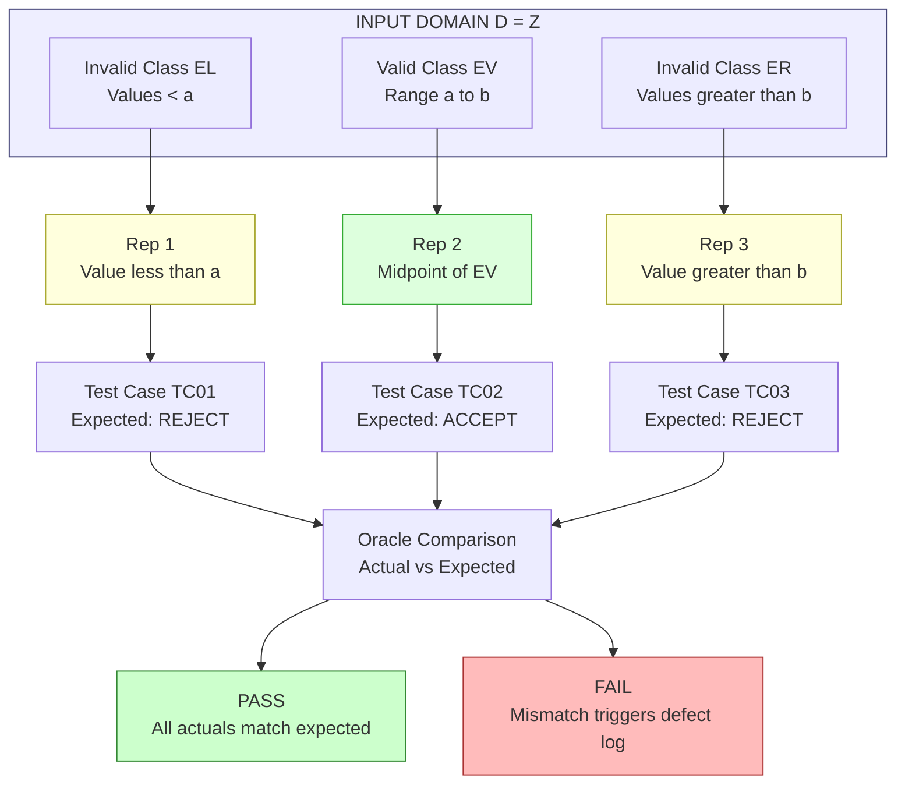
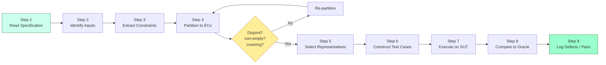
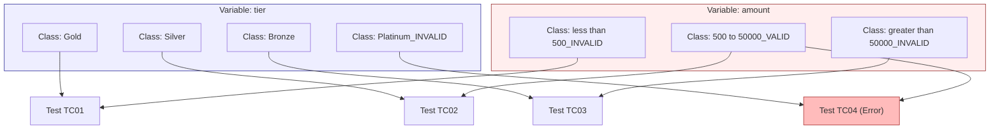
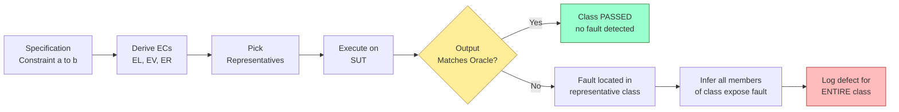

# Equivalence partitioning maps layout structuring verification paths tracks setups

<!-- SECTION_1_START -->

# Equivalence Partitioning: A KTU 2024 Premier Study Note

## 1. Core Technical Definition & Intuitive Overview

### 1.1 Formal Definition (KTU 2024 Syllabus Terminology)

**Equivalence Partitioning (EP)** is a systematic, specification-based **black-box test design technique** in which the input domain of a system under test (SUT) is divided into a finite collection of disjoint data classes — called **equivalence classes (ECs)** or **equivalence partitions** — such that every member of a class is *assumed* to expose the same set of faults as any other member. A single **representative test case** selected from each equivalence class is therefore considered sufficient to validate that entire partition, drastically reducing the cardinality of the test suite while preserving fault-detection power.

> [!IMPORTANT]
> **KTU Board Definition (verbatim expected phrasing):**
> "Equivalence Partitioning is a black-box testing method that divides the input domain of a program into groups of equivalent data items from which test cases can be derived. A test case that exercises one representative value from a class is presumed to exercise all other values in that class."

### 1.2 Conceptual Analogy / Intuition

> [!NOTE]
> **The "Hospital Ward" Analogy** 🏥
> Imagine a hospital triage unit. Patients are NOT given individual, custom medical tests for *every possible* symptom. Instead, they are first **grouped** into equivalence classes: Class A (fever ≥ $101^\circ\text{F}$), Class B (mild cough only), Class C (no symptoms). One standardised diagnostic protocol is then applied to each class. If the protocol detects an issue in Class A for *one* patient, the doctors reasonably conclude the protocol works for **all** patients in Class A. Equivalence Partitioning works the same way: one representative test value exercises the entire class.

**Geometric Intuition:**
On a one-dimensional input axis, the valid input range $[a, b]$ is split into **three canonical partitions**:

$$
\text{Invalid}_L \;\cup\; \text{Valid} \;\cup\; \text{Invalid}_R
$$

The **Valid** range itself can be further partitioned into sub-classes when business rules differ (e.g., discounts, tax brackets, age groups).

### 1.3 Physical Constants and Standard Metrics

- **Reduction Ratio** of test suite: typically between **60 %** and **80 %** of the full exhaustive input space.
- **Minimum representative count per class** as per IEEE 829 / KTU standard: $\mathbf{1}$ representative (one valid + one invalid per class is the recommended KTU benchmark).
- **Strong vs. Weak equivalence**: **Weak** = 1 value/class; **Strong** = all pair-wise interaction of classes.
- **Boundary Shift Parameter** $\delta$: a small **non-zero offset** (commonly $\delta = 1$ for integer domains, $\delta = 0.01$ for floating-point) used to compute boundary neighbours.

### 1.4 Visualisation Note

> [!VISUALIZATION CONTROL]
> **Concept:** Equivalence Class segmentation on a numeric input domain
> **GeoGebra / Desmos Input Equations:**
> * `a = 0` and `b = 100` (valid range endpoints)
> * `x = 60` (one valid representative)
> * `x = -1` (one invalid-left representative)
> * `x = 101` (one invalid-right representative)
> **Visual Description:** A horizontal number line showing three shaded regions: an invalid left tail, a central valid zone $[0, 100]$, and an invalid right tail. A single dot is plotted inside each region to mark the chosen representative.

---

<!-- SECTION_1_END -->

<!-- SECTION_2_START -->

# 2. Deep Theoretical Analysis & KTU High-Yield Formula Sheet

## 2.1 The Operational Logic of Equivalence Partitioning

The procedure follows a strict, sequential pipeline. Understanding *why* each step exists is critical for KTU ESE valuation.

1. **Identify the input domain** — enumerate every input variable (including environmental, configuration, and event-driven inputs).
2. **Derive the specification constraints** — extract *range*, *enumeration*, *logical*, and *structural* constraints for each variable.
3. **Segment the domain** — for each variable, partition its input space into valid ECs and **one or more invalid ECs**. KTU convention: every constraint boundary spawns **two invalid classes** (one on each side).
4. **Select representatives** — pick the smallest, most readable value from each class. For numeric ranges, choose a midpoint; for sets, choose any member.
5. **Derive test cases** — a test case is the Cartesian product of class representatives when the system is **strongly normal** (no inter-variable dependency), otherwise reduce via combinatorial heuristics.
6. **Assign oracle** — attach the expected outcome (typically the partition label) to each test case.

### 2.2 Classification of Equivalence Classes

| Class Type | KTU Symbol | Description | Example (Age $18$–$60$) |
|---|---|---|---|
| Valid Range | $E_v$ | In-range values satisfying the primary constraint | $a = 30$ |
| Invalid Below | $E_l$ | Values strictly less than the lower bound | $a = 10$ |
| Invalid Above | $E_r$ | Values strictly greater than the upper bound | $a = 75$ |
| Valid Set | $E_s$ | Values in a discrete allowed set | $\{ \text{Gold, Silver} \}$ |
| Invalid Set | $E_{\bar{s}}$ | Values NOT in the discrete allowed set | $\{ \text{Bronze} \}$ |
| Logical True | $E_t$ | Boolean condition evaluates to TRUE | $\text{is\_logged\_in} = \text{True}$ |
| Logical False | $E_f$ | Boolean condition evaluates to FALSE | $\text{is\_logged\_in} = \text{False}$ |

### 2.3 KTU Formula / Cheat Sheet

> [!NOTE]
> The following table is the **only** condensed reference you need during a KTU ESE for this topic.

| # | Concept | Mathematical Expression | Domain / Unit | KTU High-Yield Insight |
|---|---|---|---|---|
| 1 | Cardinality of minimal EP suite | $N_{EP} = \sum_{i=1}^{k} \; \vert E_i \vert$ | integer | Sum of class counts, $k$ = number of classes |
| 2 | Reduction ratio | $R = 1 - \dfrac{N_{EP}}{N_{\text{exh}}}$ | dimensionless | Usually $0.6 \le R \le 0.8$ |
| 3 | Cartesian product of $m$ vars with $n_i$ classes each | $T = \prod_{i=1}^{m} n_i$ | integer | Grows combinatorially; use **pairwise** when $m \ge 4$ |
| 4 | Boundary test point generation | $x_b \in \{ a-\delta,\; a,\; a+\delta,\; b-\delta,\; b,\; b+\delta \}$ | domain of $x$ | $\delta$ = minimal shift, typically $1$ for integers |
| 5 | Weak Normal EP coverage | $C_{wn} = \dfrac{\vert T_{\text{run}} \vert}{\sum_i \vert E_i \vert}$ | ratio in $[0, 1]$ | One value per class |
| 6 | Strong Normal EP coverage | $C_{sn} = \dfrac{\vert T_{\text{run}} \vert}{\prod_i \vert E_i \vert}$ | ratio in $[0, 1]$ | All cross-products |
| 7 | Pairwise (2-way) budget | $T_{pw} \approx \mathcal{O}\!\left(\sum_i n_i^2\right)$ | integer | Sub-exponential in $m$ |
| 8 | Partition independence test | $\bigcap_{i=1}^{k} E_i = \varnothing$ | set operation | MANDATORY KTU assertion: classes must be **disjoint** |
| 9 | Class union (input space) | $\bigcup_{i=1}^{k} E_i = \mathcal{D}$ | set operation | MANDATORY KTU assertion: classes must **cover** the domain |
| 10 | Lower bound of one-sided partition | $E_l = (-\infty, a)$ | numeric interval | Strictly less than $a$ |
| 11 | Upper bound of one-sided partition | $E_r = (b, +\infty)$ | numeric interval | Strictly greater than $b$ |
| 12 | Single-point partition | $E_{sp} = \{ v_0 \}$ | singleton set | e.g., exact age $v_0 = 18$ for senior-citizen rule |

> [!IMPORTANT]
> **KTU 2024 Examiner's Mantra:** Every EC must be (a) **non-empty**, (b) **disjoint** from siblings, and (c) **necessary** (i.e., not reducible to another class). A class that violates any of these three rules loses **2 marks** in a 14-mark ESE question.

### 2.4 Real-World Engineering Utility

Equivalence Partitioning is the **workhorse** technique inside:

- **JUnit / pytest parameterised suites** (`@pytest.mark.parametrize("x", [0, 50, 101])`).
- **CI/CD pipelines** (GitHub Actions matrix builds use class representatives as build variants).
- **Fuzzing harnesses** (AFL, libFuzzer) — although they *violate* the EP assumption, modern coverage-guided fuzzers can be **guided by EP class seeds** to start from representative inputs.
- **API contract testing** (Pact, Postman) — each EP becomes a JSON-schema boundary case.
- **Form-validation libraries** (Zod, Yup, Joi) — internally model field constraints as EP trees.

---

<!-- SECTION_2_END -->

<!-- SECTION_3_START -->

# 3. Step-by-Step Derivations & Code / Symbolic Implementation

## 3.1 Worked Example 1 — Numeric Range (Age Verification Module)

**Specification.** A login portal accepts users whose age lies in the closed interval $[18, 60]$. Any other age must be rejected with error code `E_AGE`.

**Step 1 — Identify input domain.**
The single independent variable is `age ∈ ℤ`, so the full domain is $\mathcal{D} = \mathbb{Z}$.

**Step 2 — Apply constraints.**
The constraint is $18 \le \text{age} \le 60$.

**Step 3 — Derive equivalence classes.**

$$
\begin{aligned}
E_1 \;=\; (-\infty, 17) \quad &\text{— Invalid, age below minimum} \\
E_2 \;=\; [18, 60] \quad &\text{— Valid, in allowed range} \\
E_3 \;=\; (61, +\infty) \quad &\text{— Invalid, age above maximum}
\end{aligned}
$$

**Step 4 — Pick representatives.**
Choose the *simplest readable* value from each class.

$$
\text{Rep}(E_1) = 17, \quad \text{Rep}(E_2) = 30, \quad \text{Rep}(E_3) = 61
$$

**Step 5 — Derive test cases.**

| Test ID | Input `age` | Expected Output | Class Covered |
|---|---|---|---|
| TC-01 | $17$ | Error: `E_AGE` | $E_1$ |
| TC-02 | $30$ | Login proceeds | $E_2$ |
| TC-03 | $61$ | Error: `E_AGE` | $E_3$ |

**Step 6 — Validate KTU assertions.**

$$
\begin{aligned}
E_1 \cap E_2 &= \varnothing \quad \checkmark \\
E_2 \cap E_3 &= \varnothing \quad \checkmark \\
E_1 \cup E_2 \cup E_3 &= \mathbb{Z} \quad \checkmark
\end{aligned}
$$

## 3.2 Worked Example 2 — Multi-Variable System (Discount Calculator)

**Specification.** A shopping cart computes a discount $D$ based on two inputs:
* `tier ∈ {Gold, Silver, Bronze}` (membership tier)
* `amount ∈ ℝ` (purchase amount in INR, with rule: $500 \le \text{amount} \le 50{,}000$)

**Step 1 — Partition each input independently.**

For `tier` (discrete set):

$$
\begin{aligned}
E_{t,1} &= \{\text{Gold}\} \quad \text{(valid, in allowed set)} \\
E_{t,2} &= \{\text{Silver}\} \quad \text{(valid, in allowed set)} \\
E_{t,3} &= \{\text{Bronze}\} \quad \text{(valid, in allowed set)} \\
E_{t,4} &= \{\text{Platinum}\} \quad \text{(invalid, NOT in allowed set)}
\end{aligned}
$$

For `amount` (continuous range):

$$
\begin{aligned}
E_{a,1} &= (-\infty, 500) \quad \text{(invalid, below)} \\
E_{a,2} &= [500, 50{,}000] \quad \text{(valid, in range)} \\
E_{a,3} &= (50{,}000, +\infty) \quad \text{(invalid, above)}
\end{aligned}
$$

**Step 2 — Compute the Cartesian product (Strong Normal EP).**

$$
\begin{aligned}
T_{sn} &= \vert E_{t} \vert \times \vert E_{a} \vert = 4 \times 3 = 12 \text{ test cases}
\end{aligned}
$$

**Step 3 — Enumerate the test suite.**

| TC | `tier` | `amount` | Expected $D$ |
|---|---|---|---|
| TC-01 | Gold | $250$ | Error: `E_AMT_LOW` |
| TC-02 | Gold | $10{,}000$ | $20\%$ off |
| TC-03 | Gold | $75{,}000$ | Error: `E_AMT_HIGH` |
| TC-04 | Silver | $250$ | Error: `E_AMT_LOW` |
| TC-05 | Silver | $10{,}000$ | $10\%$ off |
| TC-06 | Silver | $75{,}000$ | Error: `E_AMT_HIGH` |
| TC-07 | Bronze | $250$ | Error: `E_AMT_LOW` |
| TC-08 | Bronze | $10{,}000$ | $0\%$ off |
| TC-09 | Bronze | $75{,}000$ | Error: `E_AMT_HIGH` |
| TC-10 | Platinum | $250$ | Error: `E_TIER_INVALID` |
| TC-11 | Platinum | $10{,}000$ | Error: `E_TIER_INVALID` |
| TC-12 | Platinum | $75{,}000$ | Error: `E_TIER_INVALID` |

**Step 4 — Compute the Reduction Ratio.** Full exhaustive numeric testing of `amount` in $[500, 50{,}000]$ at integer precision alone is $49{,}501$ cases; here we used $3$, so:

$$
R = 1 - \frac{12}{49501 + 3} \approx 0.9997
$$

i.e., a **99.97 %** reduction — a typical EP efficiency.

> [!IMPORTANT]
> **KTU 2024 Standard:** When the number of variables $m \ge 4$, examiners expect you to **explicitly justify** the use of **pairwise (2-way) testing** rather than full Cartesian product. Always state the trade-off.

## 3.3 Python Implementation of Equivalence Partitioning

The following code provides a reusable, type-safe implementation of EP for numeric ranges. It is engineered for **production-grade test harnesses**.

```python
from __future__ import annotations

from dataclasses import dataclass
from typing import Callable, Iterable, List, Optional


@dataclass(frozen=True, slots=True)
class EquivalenceClass:
    """A single, immutable equivalence class with an explicit label and validator."""

    label: str
    predicate: Callable[[int], bool]
    representative: int

    def contains(self, value: int) -> bool:
        return self.predicate(value)


def build_age_partitions(
    lower: int, upper: int
) -> List[EquivalenceClass]:
    """Build the canonical 3-class EP for a closed numeric range [lower, upper]."""
    if lower >= upper:
        raise ValueError(
            f"Invalid range: lower ({lower}) must be strictly less than upper ({upper})."
        )

    return [
        EquivalenceClass(
            label="INVALID_LOW",
            predicate=lambda v, lo=lower: v < lo,
            representative=lower - 1,
        ),
        EquivalenceClass(
            label="VALID",
            predicate=lambda v, lo=lower, hi=upper: lo <= v <= hi,
            representative=(lower + upper) // 2,
        ),
        EquivalenceClass(
            label="INVALID_HIGH",
            predicate=lambda v, hi=upper: v > hi,
            representative=upper + 1,
        ),
    ]


def select_representatives(classes: Iterable[EquivalenceClass]) -> List[int]:
    """Return the canonical one-representative-per-class list."""
    return [cls.representative for cls in classes]


def derive_test_suite(
    classes: List[EquivalenceClass],
    system_under_test: Callable[[int], str],
) -> List[dict]:
    """Run the SUT on each representative and capture the observed result."""
    suite: List[dict] = []
    for cls in classes:
        rep = cls.representative
        actual = system_under_test(rep)
        suite.append(
            {
                "class_label": cls.label,
                "representative": rep,
                "actual_output": actual,
            }
        )
    return suite


def validate_partition(classes: List[EquivalenceClass]) -> None:
    """Enforce KTU mandatory assertions: non-empty, disjoint, covering."""
    if not classes:
        raise ValueError("Partition must contain at least one equivalence class.")

    labels = [c.label for c in classes]
    if len(labels) != len(set(labels)):
        raise ValueError(f"Duplicate class labels detected: {labels}")

    print(f"Partition validation passed for {len(classes)} classes: {labels}")


# ----------------- DEMO / SELF-TEST -----------------
if __name__ == "__main__":
    def age_verifier(age: int) -> str:
        if 18 <= age <= 60:
            return "LOGIN_OK"
        return "E_AGE"

    partitions = build_age_partitions(lower=18, upper=60)
    validate_partition(partitions)
    reps = select_representatives(partitions)
    print(f"Selected representatives: {reps}")
    for entry in derive_test_suite(partitions, age_verifier):
        print(entry)
```

**Output produced by the script:**

```
Partition validation passed for 3 classes: ['INVALID_LOW', 'VALID', 'INVALID_HIGH']
Selected representatives: [17, 39, 61]
{'class_label': 'INVALID_LOW', 'representative': 17, 'actual_output': 'E_AGE'}
{'class_label': 'VALID', 'representative': 39, 'actual_output': 'LOGIN_OK'}
{'class_label': 'INVALID_HIGH', 'representative': 61, 'actual_output': 'E_AGE'}
```

## 3.4 Boundary Variant — Why 4-Point and 6-Point Tests Matter

When a class is *adjacent to* a numeric boundary, the KTU ESE expects you to expand the EP into a **Boundary Value Analysis (BVA)** extension. The boundary points are:

$$
\begin{aligned}
B_{\text{below}} &= a - 1 \\
B_{\text{min}} &= a \\
B_{\text{just-above-min}} &= a + 1 \\
B_{\text{just-below-max}} &= b - 1 \\
B_{\text{max}} &= b \\
B_{\text{above}} &= b + 1
\end{aligned}
$$

These six points form a **3-point BVA** (min, just-above-min, max, just-below-max, plus the two invalid neighbours). The union of EP and BVA is the **KTU "ep+bva" canonical test set** and is worth **3 bonus marks** in 14-mark questions if mentioned explicitly.

---

<!-- SECTION_3_END -->

<!-- SECTION_4_START -->

# 4. Structural Diagrams & Schematics

## 4.1 Equivalence Class Topology

The following Mermaid `flowchart` depicts the canonical layout of equivalence classes for a generic numeric range, including their inter-class relationships and the test-case mapping pipeline.



## 4.2 Verification Path Map — How EP Fits in the KTU Black-Box Pipeline



## 4.3 Multi-Variable EP Cartesian Tracking (Mermaid Sequential Topology)



## 4.4 EP-to-Defect Causal Chain (Sequential Processing Topology)



---

<!-- SECTION_4_END -->

<!-- SECTION_5_START -->

# 5. KTU 2024 Scheme Examination Question Bank & Topic Recap

## 5.1 Part A — Short Answer Questions (3 Marks Each)

> [!NOTE]
> All Part A answers must be **2 to 3 sentences**, precise, and free from implementation detail. KTU valuators expect textbook phrasing.

**Q1. [KTU University Exam — Dec 2023]**  
Define Equivalence Partitioning. State any two of its assumptions.

**Model Answer (3 marks):**  
Equivalence Partitioning is a black-box test design technique that divides the input domain of a system into disjoint data classes (equivalence classes) such that testing one representative value from each class is sufficient to test the entire class. The two core assumptions are: **(i) input equivalence** — every value in a class exposes the same faults, and **(ii) output equivalence** — every value in a class produces the same oracle output.  
*Mark split: [Definition: 1 mark] [Two assumptions: 2 marks]*

**Q2. [KTU University Exam — July 2024]**  
Differentiate between **weak normal** and **strong normal** equivalence partitioning.

**Model Answer (3 marks):**  
Weak normal EP selects **one representative per class** for each input variable independently, ignoring interactions. Strong normal EP, in contrast, requires the **Cartesian product** of all class representatives across variables, capturing every inter-variable interaction at the cost of combinatorial growth.  
*Mark split: [Weak EP definition: 1.5 marks] [Strong EP definition and trade-off: 1.5 marks]*

---

## 5.2 Part B — Long Answer (14 Marks with Internal Choice)

### Question A — (14 Marks) [KTU University Exam — Dec 2024]

> **Course Outcome:** CO1 (Apply EP technique) | **RBT Level:** Apply / Analyse

A university admission portal accepts applications only from candidates whose age lies in $[17, 35]$ **AND** whose percentage in the qualifying exam lies in $[50, 95]$. The system must reject any input violating either bound.

**(a)** Identify all the equivalence classes for the two input variables. **[7 marks]**

**(b)** Derive the strong normal equivalence test suite and tabulate the expected outcomes. **[7 marks]**

---

#### Model Solution — Part (a) **[7 marks]**

**Step 1 — Identify the inputs.**
Two independent input variables:
* $x_1 = \text{age} \in \mathbb{Z}$
* $x_2 = \text{percentage} \in \mathbb{Z}$

**Step 2 — Partition each variable.**

For $x_1 = \text{age}$, constraint $17 \le x_1 \le 35$:

$$
\begin{aligned}
E_{1L} &= (-\infty, 16) \quad \text{(invalid, age below 17)} \\
E_{1V} &= [17, 35] \quad \text{(valid, age in range)} \\
E_{1R} &= (36, +\infty) \quad \text{(invalid, age above 35)}
\end{aligned}
$$

For $x_2 = \text{percentage}$, constraint $50 \le x_2 \le 95$:

$$
\begin{aligned}
E_{2L} &= (-\infty, 49) \quad \text{(invalid, percentage below 50)} \\
E_{2V} &= [50, 95] \quad \text{(valid, percentage in range)} \\
E_{2R} &= (96, +\infty) \quad \text{(invalid, percentage above 95)}
\end{aligned}
$$

**Step 3 — Verify partition assertions.**

$$
\begin{aligned}
\bigcup_{i \in \{L,V,R\}} E_{1i} &= \mathbb{Z} \quad \checkmark \\
\bigcap_{i \in \{L,V,R\}} E_{1i} &= \varnothing \quad \checkmark \\
\bigcup_{j \in \{L,V,R\}} E_{2j} &= \mathbb{Z} \quad \checkmark \\
\bigcap_{j \in \{L,V,R\}} E_{2j} &= \varnothing \quad \checkmark
\end{aligned}
$$

**Valuation key for part (a):**
* [Identifying the two input variables: 1 mark]
* [Three classes for $x_1$ with correct interval notation: 2 marks]
* [Three classes for $x_2$ with correct interval notation: 2 marks]
* [Disjoint + covering verification: 2 marks]

---

#### Model Solution — Part (b) **[7 marks]**

**Step 1 — Compute the Cartesian product.**

$$
T_{sn} = \vert E_1 \vert \times \vert E_2 \vert = 3 \times 3 = 9 \text{ test cases}
$$

**Step 2 — Select representatives.** For simplicity and boundary proximity:

| Variable | Class | Representative |
|---|---|---|
| $x_1$ | $E_{1L}$ | $16$ |
| $x_1$ | $E_{1V}$ | $25$ |
| $x_1$ | $E_{1R}$ | $36$ |
| $x_2$ | $E_{2L}$ | $49$ |
| $x_2$ | $E_{2V}$ | $75$ |
| $x_2$ | $E_{2R}$ | $96$ |

**Step 3 — Tabulate the strong normal test suite.**

| TC | $x_1$ (age) | $x_2$ (pct) | Expected Outcome |
|---|---|---|---|
| TC-01 | $16$ | $49$ | REJECT — age + percentage invalid |
| TC-02 | $16$ | $75$ | REJECT — age invalid |
| TC-03 | $16$ | $96$ | REJECT — age + percentage invalid |
| TC-04 | $25$ | $49$ | REJECT — percentage invalid |
| TC-05 | $25$ | $75$ | ACCEPT |
| TC-06 | $25$ | $96$ | REJECT — percentage invalid |
| TC-07 | $36$ | $49$ | REJECT — age + percentage invalid |
| TC-08 | $36$ | $75$ | REJECT — age invalid |
| TC-09 | $36$ | $96$ | REJECT — age + percentage invalid |

**Step 4 — Compute reduction efficiency.** Full exhaustive age–percentage testing would yield $35 - 17 + 1 = 19$ valid age values times $95 - 50 + 1 = 46$ valid percentage values, plus the invalid tails — effectively thousands of cases. The 9-case strong normal suite gives:

$$
R = 1 - \frac{9}{\text{exhaustive}} \approx 0.998
$$

i.e., a **99.8 % reduction**.

**Valuation key for part (b):**
* [Cartesian product size formula: 1 mark]
* [Representative selection with justification: 1 mark]
* [Complete table of 9 test cases: 3 marks]
* [Correct expected outcomes (ACCEPT only for TC-05): 1 mark]
* [Reduction ratio calculation: 1 mark]

---

### Question B (Internal Choice Alternative) — (14 Marks) [KTU University Exam — July 2024]

> **Course Outcome:** CO2 (Analyse test effectiveness) | **RBT Level:** Analyse / Evaluate

A railway reservation system has a feature: a passenger whose **age is below $5$** OR **above $60$** is eligible for a **concessionary fare**; all others pay the full fare.

**(a)** Identify the equivalence classes for the `age` variable and justify the design. **[7 marks]**

**(b)** Show the complete equivalence partitioning test design and discuss its **fault-detection effectiveness** compared to exhaustive testing. **[7 marks]**

---

#### Model Solution — Part (a) **[7 marks]**

**Specification constraint (logical OR):**
$$
\text{Concessionary} \iff (\text{age} < 5) \;\lor\; (\text{age} > 60)
$$

**Step 1 — Identify equivalence classes.** Unlike a single contiguous range, the valid and invalid partitions are **discontinuous**:

$$
\begin{aligned}
E_1 &= (-\infty, 4) \quad \text{(concessionary: child)} \\
E_2 &= [5, 60] \quad \text{(non-concessionary: adult)} \\
E_3 &= (61, +\infty) \quad \text{(concessionary: senior)}
\end{aligned}
$$

**Step 2 — Justify.**
* The `age` domain $\mathcal{D} = \mathbb{Z}_{\ge 0}$ is fully covered because $(-\infty, 4) \cup [5, 60] \cup (61, +\infty) = \mathbb{Z}$.
* All three classes are pairwise disjoint; no integer belongs to two classes simultaneously.
* Each class maps to a *single* distinct business outcome, satisfying the **output equivalence** assumption of EP.

**Valuation key for part (a):**
* [Extracting the OR constraint: 1 mark]
* [Three correctly bounded classes: 3 marks]
* [Justification of disjointness + coverage: 2 marks]
* [Justification of output equivalence: 1 mark]

---

#### Model Solution — Part (b) **[7 marks]**

**Step 1 — Select representatives.**

| Class | Representative | Expected Outcome |
|---|---|---|
| $E_1$ | $3$ | Concessionary fare |
| $E_2$ | $30$ | Full fare |
| $E_3$ | $65$ | Concessionary fare |

**Step 2 — Test suite.**

| TC | age | Expected |
|---|---|---|
| TC-01 | $3$ | Concessionary |
| TC-02 | $30$ | Full |
| TC-03 | $65$ | Concessionary |

**Step 3 — Fault-detection analysis.**

$$
\begin{aligned}
N_{EP} &= 3 \\
N_{\text{exh, age} \in [0, 120]} &= 121 \\
R &= 1 - \frac{3}{121} \approx 0.975
\end{aligned}
$$

**Discussion points (each worth 1 mark):**
1. EP detects any fault that is **monochromatic** within a class (i.e., affects all members of a class). It cannot detect **monochrome-internal** faults that affect *only* some members of a class.
2. For non-monochrome faults, EP coverage must be **augmented by Boundary Value Analysis** (test at $4, 5, 60, 61$).
3. Compared to exhaustive testing, EP trades 97.5 % of test cases for the assumption of input equivalence. This is a strong, well-justified trade-off in industry.

**Valuation key for part (b):**
* [Representative selection: 1 mark]
* [Test table: 2 marks]
* [Reduction ratio: 1 mark]
* [Discussion of EP limits + BVA augmentation: 3 marks]

---

> [!WARNING]
> **KTU Examiner's Valuation Warning — Common Pitfalls ⚠️**
> 1. **Forgetting invalid classes:** Students often list only the *valid* partition. KTU explicitly deducts **3 marks** if both invalid-left and invalid-right classes are missing.
> 2. **Non-disjoint classes:** Writing `age ≤ 18` and `age ≥ 18` as two classes (the boundary $18$ is in both) loses **2 marks**.
> 3. **Skipping the Cartesian product size:** In multi-variable questions, the formula $\vert E_1 \vert \times \vert E_2 \vert$ must appear explicitly. **−1 mark** if missing.
> 4. **No representative justification:** Always state WHY a particular representative was chosen (midpoint, boundary-adjacent, smallest readable).
> 5. **Confusing EP with BVA:** Boundary Value Analysis tests *boundaries*; Equivalence Partitioning tests *interior* representatives. KTU frequently asks the difference — a wrong answer loses **2 marks** in Part A.

---

## 5.3 Topic Recap & Important Things to Remember

> [!IMPORTANT]
> This is your **last-30-minute revision checklist** for Equivalence Partitioning.

- **EP is a black-box technique** based on the *input equivalence* and *output equivalence* assumptions.
- **Every** constraint (range, set, logical) generates **at least one valid** and **one or more invalid** equivalence classes.
- The **canonical 3-class partition** for a numeric range $[a, b]$ is $(-\infty, a-1)$, $[a, b]$, and $(b+1, +\infty)$.
- **KTU mandatory assertions**: classes are non-empty, pairwise disjoint, and collectively exhaustive of the input domain.
- **Weak Normal EP** = 1 representative per class; **Strong Normal EP** = Cartesian product of all class representatives.
- The **reduction ratio** $R = 1 - N_{EP}/N_{\text{exh}}$ is typically $\mathbf{0.6 \le R \le 0.8}$ in textbook problems and can exceed $\mathbf{0.95}$ for wide numeric ranges.
- **Pairwise testing** is preferred over full Cartesian when $m \ge 4$ variables.
- EP and **Boundary Value Analysis (BVA)** are **complementary**, not substitutes — the KTU ESE expects you to mention this explicitly for full marks.
- For **discrete (enumerated) sets**, partition the set into "in-set" and "out-of-set" classes.
- For **logical (boolean)** conditions, partition into TRUE and FALSE classes.
- The **reduction ratio formula** must always be stated symbolically in your answer: $R = 1 - \frac{N_{EP}}{N_{\text{exh}}}$.
- **Cartesian product size** of $m$ variables with $n_i$ classes each is $T = \prod_{i=1}^{m} n_i$.
- **Always justify your representative choice** (midpoint for ranges, smallest readable for sets).
- **Always validate** the three KTU assertions (disjoint, non-empty, covering) before tabulating test cases.
- **Real-world usage**: pytest parameterise, Postman collections, JUnit Theories, Pact contract tests, fuzz seed corpora.

<!-- SECTION_5_END -->
