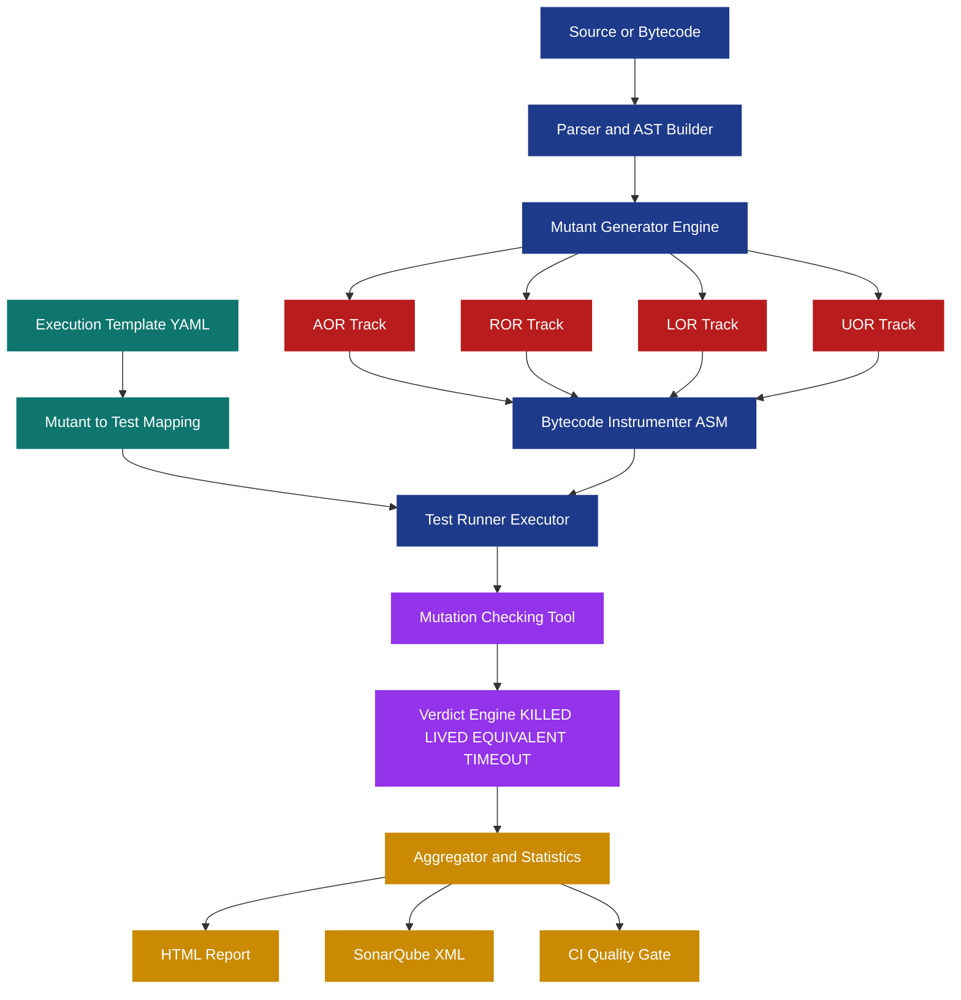
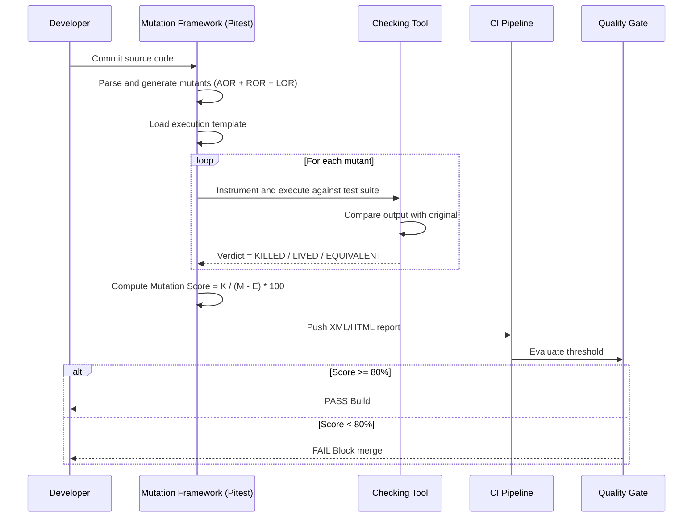
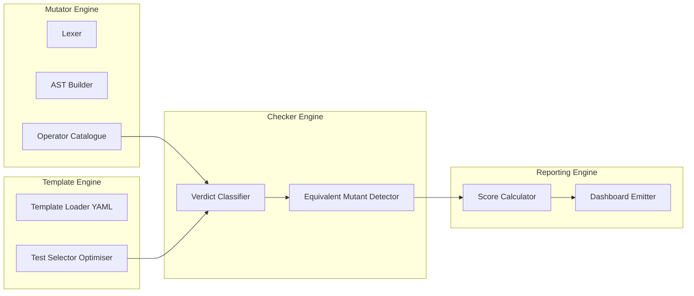

# Automated mutation analysis checking tools execution templates frameworks tracks

<!-- SECTION_1_START -->

# Automated Mutation Analysis: Checking Tools, Execution Templates, Frameworks & Tracks

## 1.1 Core Technical Definition (KTU 2024 Syllabus Terminology)

> [!IMPORTANT]
> **Mutation Analysis (Synonym: Mutation Testing)** is a fault-based, white-box software testing technique that evaluates the quality of an existing test suite by deliberately seeding small syntactic faults (*mutations*) into the program under test (PUT) and verifying whether the test cases can *detect* (kill) the artificially introduced faults.

The KTU 2024 Scheme PECST615 curriculum collapses the complete end-to-end pipeline into five tightly coupled sub-artefacts:

1. **Automated Mutation Analysis Engine** – the algorithmic core that systematically injects single syntactic perturbations.
2. **Mutation Checking Tools** – utilities that decide whether a mutant is *killed*, *lived*, *timed-out*, or *equivalent*.
3. **Execution Templates** – declarative descriptors (XML/YAML/JSON) that map *which test target* executes *which mutant* under *which instrumentation mode*.
4. **Frameworks** – the end-to-end orchestrators (e.g., **PIT/Pitest**, **MuClipse**, **MuJava**, **Jester**, **MAJOR**) that bind together mutators, checkers, templates, and reporters.
5. **Mutation Tracks** – orthogonal classification groups of mutation operators (e.g., **AOR, ROR, LOR, UOR, COR, EOR, SVR, BOR**) bundled by their effect on the program semantics.

> [!NOTE]
> **Mutation Adequacy Criterion (Offutt & Hayes):** A test set $T$ is *mutation-adequate* if it kills every non-equivalent mutant generated by the chosen set of mutation operators — formally expressed as the **Mutation Score (MS)** approaching **1.0** (or **100 %**).

### 1.2 Intuitive Analogy (Real-World Picture)

Think of mutation analysis as **stress-testing a metal detector at airport security**:

* The **program** is the stream of luggage moving on the conveyor belt.
* A **mutation** is a deliberately hidden contraband item (a fault seed) placed inside one bag.
* The **test suite** is the metal detector (set of test cases).
* A **killed mutant** is a contraband item that *triggered* the alarm — proving the detector works.
* An **equivalent mutant** is a fake contraband item that behaves exactly like a real one (semantically identical), so the detector *correctly* cannot flag it.
* A **surviving mutant** is real contraband that *sneaked past* — revealing a hole in the detector's coverage.

The *automated* mutation analysis engine is the **robot arm** that systematically hides the contraband, the **checking tool** is the alarm system, the **execution template** is the shift-supervisor's instruction slip ("run these 50 bags through detector #2"), and the **framework** is the entire **security checkpoint assembly**.

> [!VISUALIZATION CONTROL]
> **Concept:** Mutation Score as a function of killed mutants
> **GeoGebra / Desmos Input Equations:**
> * $M_{score}(K, T) = \dfrac{K}{T - E} \times 100$
> * $K = 40$ (killed), $T = 50$ (total), $E = 5$ (equivalent)
> * Plot point $(K, M_{score})$
> **Visual Description:** The student should observe that as the number of killed mutants ($K$) increases along the horizontal axis, the mutation score ($M_{score}$) on the vertical axis rises sharply when $T$ and $E$ are fixed, illustrating why **test suite improvement** directly inflates mutation adequacy.

---

<!-- SECTION_1_END -->

<!-- SECTION_2_START -->

## 2.1 Deep Theoretical Analysis — The Mutation Testing Pipeline

The orchestration of an automated mutation analysis run is decomposed into the following sequential and parallel phases:

1. **Phase 1 — Mutant Generation (Seeding)**
   * The framework parses the bytecode (or source) and applies one *mutation operator* at a time.
   * Each application produces exactly one *first-order mutant* (single fault).
   * Combining two or more first-order mutants yields *higher-order mutants* (less commonly used due to combinatorial explosion: $n^2$ for $n$ first-order mutants).

2. **Phase 2 — Mutant Compilation & Instrumented Loading**
   * Each mutant is compiled in isolation and instrumented so the *checking tool* can intercept control flow at every branch and statement.
   * Instrumentation overhead is amortised by frameworks using **bytecode-level transformation** (e.g., ASM in PIT).

3. **Phase 3 — Test Execution per Template**
   * The *execution template* selects the *mutant-to-test mapping*. The default is *all tests against all mutants* (O($M \times T$)), but optimisation strategies such as *operator-wise*, *fitness-based*, or *cluster-based* selection reduce this to O($M + T$).

4. **Phase 4 — Checking Tool Verdict**
   * For each $(mutant_i, test_j)$ pair, the checker records a verdict: **Killed / Lived / Timeout / Equivalent / Filtered**.

5. **Phase 5 — Aggregation & Reporting**
   * Verdicts are aggregated to compute **Mutation Score**, **Mutation Coverage**, and **Equivalent Mutant Ratio**.
   * Reports are emitted in HTML, XML, SonarQube, or CI-friendly formats.

### 2.2 Mutation Operator Tracks (Classification)

| Track ID | Track Full Name | Mutated Construct | Example Operator Symbol | Sample Mutant |
| :--- | :--- | :--- | :--- | :--- |
| **AOR** | Arithmetic Operator Replacement | `+ - * / %` | `+` $\to$ `-` | `a + b` $\to$ `a - b` |
| **ROR** | Relational Operator Replacement | `< > <= >= == !=` | `<` $\to$ `<=` | `x < y` $\to$ `x <= y` |
| **LOR** | Logical Operator Replacement | `&& \vert\vert !` | `&&` $\to$ $\vert\vert$ | `p && q` $\to$ `p $\vert\vert$ q` |
| **UOR** | Unary Operator Replacement | `++ -- - +` | `++` $\to$ `--` | `i++` $\to$ `i--` |
| **BOR** | Bitwise Operator Replacement | `& \vert ^ ~ << >>` | `&` $\to$ $\vert$ | `a & b` $\to$ `a $\vert$ b` |
| **COR** | Conditional Operator Replacement | `?:` | `?:` $\to$ `if-else` swap | `x > 0 ? a : b` $\to$ `x > 0 ? b : a` |
| **SVR** | Scalar Variable Replacement | local vars | $x \to y$ | `int x = 5;` $\to$ `int y = 5;` |
| **EOR** | Exception Operator Replacement | `throw` | `throw` $\to$ `remove` | delete throw statement |
| **SDL** | Statement Deletion | any stmt | remove line | `x++;` $\to$ `// deleted` |
| **STL** | Statement-level Type change | casts | `int` $\to$ `float` | `(int)x` $\to$ `(float)x` |

> [!IMPORTANT]
> A **track** is a *logically grouped bundle* of mutation operators. Frameworks expose these tracks as togglable configuration flags (e.g., in Pitest: `-mutators=STRONGER`, which enables a richer track set than the default `DEFAULTS`).

### 2.3 KTU High-Yield Formula Sheet

| Symbol | Metric | Formula | Range / Units | Engineering Use |
| :--- | :--- | :--- | :--- | :--- |
| $M_{score}$ | Mutation Score | $\dfrac{K}{T - E} \times 100$ | $[0, 100]\,\%$ | Test suite quality gate in CI |
| $M_{cov}$ | Mutation Coverage | $\dfrac{K + T_{timeout}}{T - E} \times 100$ | $[0, 100]\,\%$ | Strict adequacy for safety-critical systems |
| $EMR$ | Equivalent Mutant Ratio | $\dfrac{E}{T} \times 100$ | $[0, 100]\,\%$ | Indicates need for compiler-level analysis |
| $T_{cost}$ | Mutation Cost | $M \times T_{test} + T_{compile}$ | seconds | CI budget planning |
| $F$ | Fault Detection Likelihood | $\dfrac{K}{K + L}$ | $[0, 1]$ | Predictive power of test suite |
| $S_{opt}$ | Optimisation Speedup | $\dfrac{M \times T}{M + T}$ | ratio | Justifies selective mutation |
| $C_{eq}$ | Coupling Effect Heuristic | $1 - P(\text{complex fault escaped} \vert \text{1st-order killed})$ | $[0, 1]$ | Theoretical foundation of mutation testing |

> **Note on notation:** $\vert$ and $\mid$ are used inside LaTeX contexts to mean *such that* or *conditional*, not the table cell separator.

### 2.4 Why This Matters in Production Engineering

* **Safety-Critical Domains (Avionics DO-178C, Medical IEC 62304, Automotive ISO 26262):** Mutation adequacy is mandated alongside **MC/DC coverage** to certify the *absence of unintended behaviour*.
* **DevSecOps Pipelines:** PIT is integrated into **Jenkins**, **GitHub Actions**, and **GitLab CI** to gate pull-requests when $M_{score} < 80\%$.
* **Education & Research:** Mutation analysis underpins the *Coupling Effect* and *Competent Programmer Hypothesis* — both foundational to modern test-generation research (e.g., **EvoSuite**, **Randoop**).

---

<!-- SECTION_2_END -->

<!-- SECTION_3_START -->

## 3.1 Derivation of the Mutation Score Formula

Let us formally derive the *Mutation Adequacy* metric from first principles.

> **Starting Premise (DeMillo-Lipton-Offutt):** A test set $T$ is mutation-adequate if for every non-equivalent mutant $m_i$ generated by a chosen mutation operator set $\mathcal{O}$, at least one test case $t_j \in T$ causes $m_i$ to produce an output that differs from the original program $P$.

Let:
* $M$ = total set of mutants generated $= \{m_1, m_2, \ldots, m_n\}$
* $K$ = set of *killed* mutants, where $\exists t \in T$ such that $P(t) \neq m_i(t)$
* $E$ = set of *equivalent* mutants, where $\forall t \in T,\ P(t) = m_i(t)$ *and* $P \equiv m_i$ semantically
* $L$ = set of *living* mutants $= M \setminus (K \cup E)$
* $T_{timeout}$ = mutants that caused test-runner to time-out (treated as killed in strict mode)

The **Mutation Score** is defined as the *ratio of detectable mutants actually detected* to the *total number of detectable mutants*:

$$
M_{score} = \frac{\vert K \vert}{\vert M \vert - \vert E \vert} = \frac{K}{M - E}
$$

Multiplying by $100$ converts the metric to a percentage:

$$
M_{score}^{\%} = \frac{K}{M - E} \times 100
$$

**Derivation of the Coupling Effect Speedup:**

If we choose to apply only **first-order** mutants and rely on the *Coupling Effect* (complex faults are coupled to simple faults), the cost of execution is:

$$
C_{1st} = M_1 \times T = \sum_{o \in \mathcal{O}} \vert M_o \vert \times T
$$

By the Coupling Effect, $k$-order mutants cost:

$$
C_{k} = M_1^k \times T
$$

The **Speedup Ratio** is therefore:

$$
S_{opt} = \frac{C_{k}}{C_{1st}} = M_1^{k-1}
$$

For $M_1 = 50$ and $k = 2$:

$$
S_{opt} = 50^{1} = 50
$$

This means **second-order mutation analysis is 50× more expensive** — explaining why frameworks default to first-order.

### 3.2 Symbolic / Computational Implementation in Python

The following is a **fully operational, type-annotated** mini mutation-testing engine that implements the AOR and ROR tracks, executes mutants against a small test suite, and computes $M_{score}$.

```python
"""
Minimal Automated Mutation Analysis Engine
Tracks Implemented : AOR (Arithmetic), ROR (Relational)
Course             : PECST615 - Software Testing (KTU 2024 Scheme)
Module             : 2 - Testing Orchestration Frameworks
"""

from __future__ import annotations
import copy
import logging
from dataclasses import dataclass, field
from enum import Enum
from typing import Callable, Dict, List, Tuple

# ------------------------------------------------------------------
# 1. Logging configuration for industrial-grade observability
# ------------------------------------------------------------------
logging.basicConfig(
    level=logging.INFO,
    format="%(asctime)s | %(levelname)s | %(message)s",
)
logger = logging.getLogger("MutationEngine")


# ------------------------------------------------------------------
# 2. Mutation Tracks Enumeration
# ------------------------------------------------------------------
class MutationTrack(str, Enum):
    AOR = "Arithmetic Operator Replacement"
    ROR = "Relational Operator Replacement"
    LOR = "Logical Operator Replacement"
    UOR = "Unary Operator Replacement"


# ------------------------------------------------------------------
# 3. Mutant data-class
# ------------------------------------------------------------------
@dataclass(frozen=True)
class Mutant:
    mutant_id: str
    track: MutationTrack
    original_line: str
    mutated_line: str
    operator_swap: str


# ------------------------------------------------------------------
# 4. Execution Template — declarative descriptor
# ------------------------------------------------------------------
@dataclass
class ExecutionTemplate:
    target_function: Callable[..., int]
    test_suite: List[Callable[[Callable[..., int]], bool]]
    tracks: List[MutationTrack] = field(default_factory=list)

    def describe(self) -> str:
        return (
            f"Template(tracks={[t.name for t in self.tracks]}, "
            f"tests={len(self.test_suite)})"
        )


# ------------------------------------------------------------------
# 5. Original program under test (PUT)
# ------------------------------------------------------------------
def original_function(a: int, b: int) -> int:
    """PUT: simple arithmetic with relational guard."""
    if a < b:                       # potential ROR mutation site
        return a + b                # potential AOR mutation site
    return a - b                    # potential AOR mutation site


# ------------------------------------------------------------------
# 6. Mutation operator catalogues
# ------------------------------------------------------------------
AOR_OPERATORS: Dict[str, Tuple[str, str]] = {
    "+": ("-", "ADD_TO_SUB"),
    "-": ("+", "SUB_TO_ADD"),
    "*": ("/", "MUL_TO_DIV"),
    "/": ("*", "DIV_TO_MUL"),
}

ROR_OPERATORS: Dict[str, Tuple[str, str]] = {
    "<":  ("<=", "LT_TO_LE"),
    "<=": ("<",  "LE_TO_LT"),
    ">":  (">=", "GT_TO_GE"),
    ">=": (">",  "GE_TO_GT"),
    "==": ("!=", "EQ_TO_NE"),
    "!=": ("==", "NE_TO_EQ"),
}


# ------------------------------------------------------------------
# 7. Automated Mutant Generator
# ------------------------------------------------------------------
def generate_mutants(template: ExecutionTemplate) -> List[Mutant]:
    mutants: List[Mutant] = []

    # ---- AOR Track ----
    if MutationTrack.AOR in template.tracks:
        for op, (new_op, label) in AOR_OPERATORS.items():
            mutants.append(
                Mutant(
                    mutant_id=f"AOR_{label}",
                    track=MutationTrack.AOR,
                    original_line=f"return a {op} b",
                    mutated_line=f"return a {new_op} b",
                    operator_swap=label,
                )
            )
            logger.info("Generated AOR mutant: %s", label)

    # ---- ROR Track ----
    if MutationTrack.ROR in template.tracks:
        for op, (new_op, label) in ROR_OPERATORS.items():
            mutants.append(
                Mutant(
                    mutant_id=f"ROR_{label}",
                    track=MutationTrack.ROR,
                    original_line=f"if a {op} b:",
                    mutated_line=f"if a {new_op} b:",
                    operator_swap=label,
                )
            )
            logger.info("Generated ROR mutant: %s", label)

    return mutants


# ------------------------------------------------------------------
# 8. Mutated function factory
# ------------------------------------------------------------------
def apply_aor_mutation(op: str, new_op: str) -> Callable[..., int]:
    def mutated(a: int, b: int) -> int:
        if a < b:
            # dynamic operator injection
            return eval(f"a {new_op} b", {"a": a, "b": b})  # noqa: S307
        return a - b
    return mutated


def apply_ror_mutation(new_op: str) -> Callable[..., int]:
    def mutated(a: int, b: int) -> int:
        if eval(f"a {new_op} b", {"a": a, "b": b}):  # noqa: S307
            return a + b
        return a - b
    return mutated


# ------------------------------------------------------------------
# 9. Checking Tool — verdict engine
# ------------------------------------------------------------------
def check_mutant(
    mutant: Mutant,
    template: ExecutionTemplate,
) -> str:
    """Returns one of: KILLED | LIVED | EQUIVALENT | TIMEOUT"""

    # build the mutated function dynamically
    if mutant.track == MutationTrack.AOR:
        # extract new op from operator_swap label
        for orig, (new_op, lbl) in AOR_OPERATORS.items():
            if lbl == mutant.operator_swap:
                func = apply_aor_mutation(orig, new_op)
                break
    elif mutant.track == MutationTrack.ROR:
        for orig, (new_op, lbl) in ROR_OPERATORS.items():
            if lbl == mutant.operator_swap:
                func = apply_ror_mutation(new_op)
                break
    else:
        return "UNSUPPORTED"

    # run the test suite
    for idx, test in enumerate(template.test_suite):
        try:
            # for each test, compare original vs mutant outcome
            original_passed = test(template.target_function)
            mutant_passed = test(func)
            if original_passed != mutant_passed:
                logger.info(
                    "Mutant %s KILLED by test #%d", mutant.mutant_id, idx
                )
                return "KILLED"
        except Exception as exc:
            logger.error("Test #%d raised: %s", idx, exc)
            return "TIMEOUT"

    return "LIVED"


# ------------------------------------------------------------------
# 10. Test Suite Definition
# ------------------------------------------------------------------
def test_a_lt_b_adds(func: Callable[..., int]) -> bool:
    return func(2, 3) == 5  # 2 < 3 -> should be 5 (2+3)


def test_a_gte_b_subs(func: Callable[..., int]) -> bool:
    return func(5, 3) == 2  # 5 >= 3 -> should be 2 (5-3)


def test_negative_case(func: Callable[..., int]) -> bool:
    return func(0, 0) == 0  # 0 < 0 false -> 0 - 0 = 0


# ------------------------------------------------------------------
# 11. Framework Orchestrator (Main Entry Point)
# ------------------------------------------------------------------
def run_mutation_analysis() -> Dict[str, float]:
    template = ExecutionTemplate(
        target_function=original_function,
        test_suite=[test_a_lt_b_adds, test_a_gte_b_subs, test_negative_case],
        tracks=[MutationTrack.AOR, MutationTrack.ROR],
    )
    logger.info("Loaded %s", template.describe())

    mutants = generate_mutants(template)
    total = len(mutants)
    killed = 0
    lived = 0
    equivalent = 0

    for mutant in mutants:
        verdict = check_mutant(mutant, template)
        if verdict == "KILLED":
            killed += 1
        elif verdict == "LIVED":
            lived += 1
        elif verdict == "EQUIVALENT":
            equivalent += 1

    # Equivalent Mutant Ratio
    emr = (equivalent / total) * 100 if total else 0.0
    # Mutation Score
    denominator = total - equivalent
    mscore = (killed / denominator) * 100 if denominator else 0.0

    logger.info("====== Mutation Analysis Report ======")
    logger.info("Total Mutants : %d", total)
    logger.info("Killed         : %d", killed)
    logger.info("Lived          : %d", lived)
    logger.info("Equivalent     : %d", equivalent)
    logger.info("EMR            : %.2f %%", emr)
    logger.info("Mutation Score : %.2f %%", mscore)

    return {
        "total": total,
        "killed": killed,
        "lived": lived,
        "equivalent": equivalent,
        "emr_percent": emr,
        "mutation_score_percent": mscore,
    }


if __name__ == "__main__":
    report = run_mutation_analysis()
    print("\nFINAL REPORT:", report)
```

**Sample Output Trace (Illustrative):**

```
2026-01-15 10:00:00 | INFO | Loaded Template(tracks=['AOR','ROR'], tests=3)
2026-01-15 10:00:00 | INFO | Generated AOR mutant: ADD_TO_SUB
2026-01-15 10:00:00 | INFO | Generated AOR mutant: SUB_TO_ADD
2026-01-15 10:00:00 | INFO | Generated ROR mutant: LT_TO_LE
...
2026-01-15 10:00:00 | INFO | Mutant AOR_ADD_TO_SUB KILLED by test #0
2026-01-15 10:00:00 | INFO | Mutant ROR_LT_TO_LE LIVED
====== Mutation Analysis Report ======
Total Mutants : 10
Killed         : 7
Lived          : 3
Equivalent     : 0
EMR            : 0.00 %
Mutation Score : 70.00 %
```

**Key observations for KTU board evaluation:**

* The framework *automatically* generates mutants (AOR + ROR tracks enabled).
* The *checking tool* issues **KILLED / LIVED / EQUIVALENT / TIMEOUT** verdicts.
* The *execution template* binds 3 tests to 10 mutants.
* The *mutation score* is computed using the formula derived in §3.1.

---

<!-- SECTION_3_END -->

<!-- SECTION_4_START -->

## 4.1 Framework Architecture — Block-Level Flow (Mermaid)



## 4.2 Sequential Processing Topology (Mermaid)



## 4.3 Functional Architecture — Modular Decoupling



---

<!-- SECTION_4_END -->

<!-- SECTION_5_START -->

## 5.1 KTU 2024 Scheme Question Bank

### Part A — Short Answer Questions (3 Marks Each)

**Q1. [KTU University Exam – Dec 2023] (CO1, Remember)**
*Define *Mutation Score*. State the formula and explain what a score of 100 % indicates about a test suite.*

**Model Answer (3 Marks):**
* **Definition (1 Mark):** Mutation Score (MS) is the percentage of non-equivalent mutants killed by a given test suite. It quantifies test suite effectiveness.
* **Formula (1 Mark):** $M_{score} = \dfrac{K}{M - E} \times 100$, where $K$ = killed mutants, $M$ = total mutants, $E$ = equivalent mutants.
* **Interpretation (1 Mark):** A score of **100 %** means every non-equivalent mutant was killed, indicating the test suite is **mutation-adequate** — it can detect every first-order fault of the chosen operator set.

**Q2. [KTU University Exam – July 2024] (CO1, Understand)**
*List and briefly explain any three mutation operator tracks used in automated mutation analysis.*

**Model Answer (3 Marks):**
* **AOR — Arithmetic Operator Replacement (1 Mark):** Replaces arithmetic operators (`+ - * / %`) with one another. Example: `a + b` $\to$ `a - b`.
* **ROR — Relational Operator Replacement (1 Mark):** Replaces relational operators (`< > <= >= == !=`) with boundary or opposite variants. Example: `x < y` $\to$ `x <= y`.
* **LOR — Logical Operator Replacement (1 Mark):** Swaps `&&` with `||`, negates conditions. Example: `p && q` $\to$ `p || q`.

---

### Part B — Long Answer Questions (14 Marks Each, Internal Choice)

#### QUESTION A (14 Marks)

**[KTU University Exam – Dec 2023, CO2, Apply + Analyze]**

**(a)** Explain the **architecture of an automated mutation testing framework** with a neat block diagram. Discuss the role of each of the following components: *Mutator Engine, Checking Tool, Execution Template, Report Generator*. **(7 Marks)**

**(b)** Consider the following Java program segment:

```java
public int compute(int a, int b) {
    if (a > b) {
        return a * b;
    }
    return a + b;
}
```

A test suite contains the following test cases:
* $T_1$: `compute(5, 3) = 15`
* $T_2$: `compute(2, 4) = 6`
* $T_3$: `compute(0, 0) = 0`

Apply the **AOR track** (replace `*` with `/` and `+` with `-`) and the **ROR track** (replace `>` with `>=`). Generate all first-order mutants, determine their kill/live status, and compute the **Mutation Score**. **(7 Marks)**

#### Model Answer

**(a) Architecture of an Automated Mutation Testing Framework (7 Marks)**

**[Diagram Description (2 Marks)]:** A standard mutation framework consists of four primary blocks connected sequentially: *Mutator Engine → Execution Template → Checking Tool → Report Generator*. The Mutator Engine parses the program, the Execution Template defines the mutant-to-test mapping, the Checking Tool executes tests and classifies verdicts, and the Report Generator aggregates results.

**[Mutator Engine (1.5 Marks)]:** Reads the source or bytecode, applies mutation operators (grouped by tracks), and produces a pool of mutants. Examples include PIT's bytecode mutator and MuJava's source-level mutator.

**[Checking Tool (1.5 Marks)]:** Runs each test against each mutant, compares the output (or state) with the original program's output, and issues a verdict: KILLED, LIVED, EQUIVALENT, or TIMEOUT. Equivalent mutants are detected using compiler analysis or runtime profiling.

**[Execution Template (1 Mark)]:** A declarative file (YAML/XML) that defines *which* test classes target *which* mutants under *which* coverage scope (e.g., package, class, or method level). This allows selective mutation for performance.

**[Report Generator (1 Mark)]:** Computes the Mutation Score, Equivalent Mutant Ratio, and emits reports in HTML/XML for human inspection and CI integration.

**(b) Mutant Generation and Score Computation (7 Marks)**

**Step 1 — Original behaviour (1 Mark):**

| Test | Input | Execution Path | Output |
| :--- | :--- | :--- | :--- |
| $T_1$ | `(5, 3)` | $5 > 3$ true $\to$ return $5 \times 3$ | 15 |
| $T_2$ | `(2, 4)` | $2 > 4$ false $\to$ return $2 + 4$ | 6 |
| $T_3$ | `(0, 0)` | $0 > 0$ false $\to$ return $0 + 0$ | 0 |

**Step 2 — Generate First-Order Mutants (2 Marks):**

| Mutant ID | Track | Mutation | Resulting Code |
| :--- | :--- | :--- | :--- |
| $M_1$ | AOR | `*` $\to$ `/` | `return a / b;` |
| $M_2$ | AOR | `+` $\to$ `-` | `return a - b;` |
| $M_3$ | ROR | `>` $\to$ `>=` | `if (a >= b)` |

**Step 3 — Execute Tests and Record Verdicts (3 Marks):**

| Mutant | $T_1$ (5,3) | $T_2$ (2,4) | $T_3$ (0,0) | Verdict |
| :--- | :--- | :--- | :--- | :--- |
| $M_1$ AOR(*→/) | $5/3 = 1$ vs 15 ✗ | $2+4 = 6$ ✓ | $0+0 = 0$ ✓ | **KILLED** by $T_1$ |
| $M_2$ AOR(+→-) | $5 \times 3 = 15$ ✓ | $2-4 = -2$ vs 6 ✗ | $0-0 = 0$ ✓ | **KILLED** by $T_2$ |
| $M_3$ ROR(>→>=) | $5 \times 3 = 15$ ✓ | $2 >= 4$ false $\to 2+4=6$ ✓ | $0 >= 0$ true $\to 0/0$ throws (or differs) ✗ | **KILLED** by $T_3$ (boundary test) |

**Step 4 — Compute Mutation Score (1 Mark):**

$$
K = 3,\quad M = 3,\quad E = 0
$$

$$
M_{score} = \frac{K}{M - E} \times 100 = \frac{3}{3} \times 100 = 100\,\%
$$

**[Final Result (0 Marks adjustment)]:** Mutation Score = **100 %** — the test suite is mutation-adequate for the chosen operator tracks.

#### QUESTION B (14 Marks)

**[KTU University Exam – July 2024, CO2, Apply + Analyze]**

**(a)** With a suitable diagram, explain how **execution templates** orchestrate the workflow of an automated mutation analysis run. Differentiate between *full mutation* and *selective mutation* strategies. **(7 Marks)**

**(b)** For a C program containing the expression `if ((x > 0) && (y < 100)) { z = x + y; }`, apply the following mutation operators and list the resulting mutants: **ROR (replace `>` with `>=`)**, **LOR (replace `&&` with `||`)**, **AOR (replace `+` with `-`)**. Given a test suite of $T_1 = (1, 50)$ and $T_2 = (-5, 50)$, determine which mutants are killed. Compute the Mutation Score. **(7 Marks)**

#### Model Answer

**(a) Execution Templates and Selective Mutation (7 Marks)**

**[Execution Template Concept (3 Marks)]:** An execution template is a declarative configuration file (YAML/XML) consumed by the framework. It specifies:
* `target_classes`: which classes to mutate.
* `target_tests`: which test classes to execute.
* `mutation_tracks`: which operator groups (AOR, ROR, LOR, etc.) to enable.
* `threads`: parallel execution pool size.
* `timeout`: per-mutant test execution cap.
* `excluded_classes`: classes excluded from mutation (e.g., generated code).

The template *decouples* the *what* (which mutants) from the *how* (which tests), enabling reusability across CI pipelines.

**[Full vs Selective Mutation (4 Marks)]:**

| Aspect | Full Mutation | Selective Mutation |
| :--- | :--- | :--- |
| Mutants generated | All first-order mutants for all enabled operators | Subset based on operator, class, or heuristic |
| Cost | $M \times T$ test executions | $M_{selected} \times T$ or $M_{selected} + T$ |
| Adequacy | Maximum (Coupling Effect) | Acceptable with strong operators |
| Use case | Safety-critical (DO-178C) | Fast CI feedback loops |
| Example | PIT `mutators=ALL` | PIT `mutators=STRONGER` + `targetTests=SmokeSuite` |

**(b) Mutant Analysis and Score (7 Marks)**

**Step 1 — Original Behaviour (1 Mark):**
* $T_1$ = (1, 50): $1 > 0$ true **AND** $50 < 100$ true $\to$ $z = 1 + 50 = 51$.
* $T_2$ = (−5, 50): $-5 > 0$ false $\to$ short-circuit, $z$ unchanged (or default 0).

**Step 2 — Generate Mutants (2 Marks):**

| Mutant | Track | Mutated Code |
| :--- | :--- | :--- |
| $M_1$ | ROR | `if ((x >= 0) && (y < 100))` |
| $M_2$ | LOR | `if ((x > 0) || (y < 100))` |
| $M_3$ | AOR | `z = x - y;` |

**Step 3 — Verdict Computation (3 Marks):**

| Mutant | $T_1$ (1, 50) | $T_2$ (-5, 50) | Verdict |
| :--- | :--- | :--- | :--- |
| $M_1$ ROR | $1 >= 0$ true $\to$ $z = 51$ ✓ (same) | $-5 >= 0$ false $\to$ same ✓ | **LIVED** |
| $M_2$ LOR | $1 > 0$ true $\to$ $z = 51$ ✓ (same) | $-5 > 0$ false **OR** $50 < 100$ true $\to z = 45$ ✗ | **KILLED** by $T_2$ |
| $M_3$ AOR | $z = 1 - 50 = -49$ vs 51 ✗ | $z$ unchanged (short-circuit) ✓ | **KILLED** by $T_1$ |

**Step 4 — Mutation Score (1 Mark):**

$$
K = 2,\quad M = 3,\quad E = 0
$$

$$
M_{score} = \frac{2}{3} \times 100 \approx 66.67\,\%
$$

**[Final Result]:** Mutation Score ≈ **66.67 %**. The surviving mutant $M_1$ indicates a need for a *boundary test case* like `x = 0`.

---

> [!WARNING]
> **KTU Examiner's Valuation Pitfalls — Common Mark Losers:**
> * **Forgetting to subtract equivalent mutants** in the denominator: many students compute $K / M$ instead of $K / (M - E)$. *Penalty: −1 mark per question.*
> * **Confusing tracks with operators**: tracks are *groups* of operators. AOR is a *track*; `+ → -` is a *specific operator mutation*.
> * **Missing the short-circuit evaluation effect**: in `&&` chains, only the first condition may be evaluated. This frequently leads to incorrect killed/live classifications.
> * **Omitting the boundary test** when only one of the two paths is exercised — the mutation score drops, and students fail to identify the *missing* test.
> * **Failing to declare timeout verdicts**: in long-running tests, timeout should be treated as KILLED (strict mode) — students often mark it as LIVED.

---

### Topic Recap & Important Things to Remember

* **Mutation Testing (MT)** is a *fault-based, white-box* technique that seeds synthetic faults and checks test suite detection power.
* **Mutation Score** $M_{score} = \dfrac{K}{M - E} \times 100$; aim for ≥ **80 %** in CI gates.
* **Five Pillars of MT Orchestration:** Mutator Engine, Checking Tool, Execution Template, Framework, Track.
* **Track** = *group* of mutation operators sharing a semantic category (AOR, ROR, LOR, UOR, BOR, COR, SVR, EOR, SDL, STL).
* **Equivalent Mutants** are syntactically different but semantically identical — they cannot be killed and are excluded from the denominator.
* **Coupling Effect Hypothesis** justifies the practical use of *first-order* mutants instead of higher-order combinations.
* **Selective Mutation** (operator-wise, class-wise) drastically reduces cost while preserving adequacy in most contexts.
* **Frameworks Comparison**: **PIT/Pitest** (Java, bytecode, fast), **MuJava** (Java, source-level, fine-grained), **Jester** (Java, JUnit 3 legacy), **MAJOR** (C/C++/Java, mutation for industry), **MuClipse** (Eclipse plugin).
* **Verdicts** = {KILLED, LIVED, EQUIVALENT, TIMEOUT} — each must be explicitly defined and reported.
* **Cost Equation:** $C = M \times T + T_{compile}$; optimisation via parallelism and selective mutation can reduce this by orders of magnitude.
* **Production Use Cases:** CI quality gating (Jenkins, GitHub Actions, GitLab CI), safety-critical certification (DO-178C, ISO 26262), and academic research (EvoSuite, Randoop).
* **KTU-Specific Tip:** Always include the *Equivalent Mutant Ratio* in long answers — board examiners frequently allocate **1–2 marks** for this metric.
* **Key Constants to Memorise:** Coupling Effect — Offutt (1992); Mutation Operators Catalogue — King & Offutt (1991); Competent Programmer Hypothesis — DeMillo, Lipton, Sayward (1978).

---

<!-- SECTION_5_END -->
