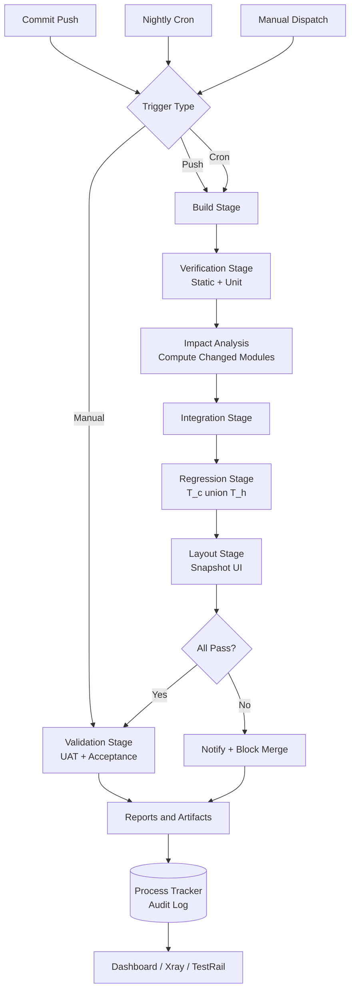
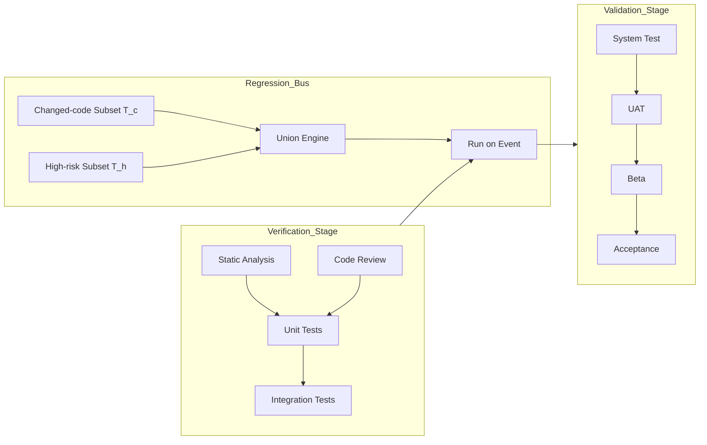
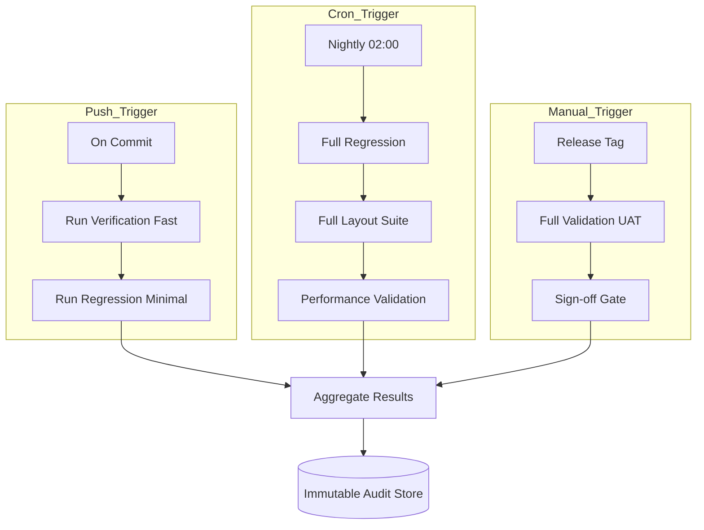
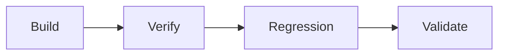

# Integration tracking processes layout regression validation verification routing schedules

<!-- SECTION_1_START -->
# Testing Orchestration Frameworks: Core Definition & Intuitive Overview

## Formal Definition (KTU 2024 Syllabus Terminology)

> [!IMPORTANT]
> **Testing Orchestration Framework (TOF):** A coordinated, automated software infrastructure that sequences, schedules, routes, and tracks the execution of heterogeneous testing activities (unit, integration, regression, layout, verification, and validation tests) across distributed environments while enforcing dependency graphs, parallelization policies, and result aggregation.

In KTU PECST615 Module 2 parlance, orchestration is the **"control plane"** that sits above the actual test logic. It does not *write* tests; it decides **which test runs when, on what environment, with what data, in what order, and how the outcome propagates** to downstream stages of the CI/CD pipeline.

## Conceptual Analogy — The Airport Control Tower

Think of a Testing Orchestration Framework as an **Air Traffic Control Tower** at a busy international airport.

| Airport Element | Orchestration Framework Counterpart |
|---|---|
| Aircraft (different sizes, destinations) | Heterogeneous test suites (UI, API, DB, layout) |
| Runway scheduling board | Test schedule / cron graph |
| Air traffic controller | Orchestrator engine (e.g., Jenkins, GitHub Actions, Argo) |
| Flight plan | Test routing DAG (Directed Acyclic Graph) |
| Radar tracking | Process tracking & telemetry |
| Pre-flight checklist | Verification (are we building the product right?) |
| Passenger experience check | Validation (are we building the right product?) |
| Re-routing during bad weather | Regression re-trigger on code change |

The tower **does not fly the plane** — it coordinates. Likewise, the orchestrator **does not test the software** — it coordinates who tests, when, and how results are reported.

> [!NOTE]
> **Key Distinction (V-Model Context):** *Verification* asks **"Are we building the product correctly?"** (reviews, inspections, walkthroughs, static analysis). *Validation* asks **"Are we building the right product?"** (actual execution against user needs). Orchestration frameworks must explicitly route tests into both buckets.

## Sub-Topic Map for This Module

The following seven concepts form the spine of Module 2 — Testing Orchestration:

1. **Integration** — composing unit-tested modules into a tested whole.
2. **Tracking processes** — observability, logging, and audit trail of test execution.
3. **Layout** — structural arrangement of test artifacts, pipelines, and stages.
4. **Regression** — re-running prior tests after every change.
5. **Validation** — dynamic, end-to-end correctness against user requirements.
6. **Verification** — static and review-based correctness against specifications.
7. **Routing & Schedules** — DAG-based execution order and time-based triggers.

> [!VISUALIZATION CONTROL]
> **Concept:** A linear orchestration pipeline as a directed graph.
> **GeoGebra / Desmos Input Equations (conceptual Gantt-style):**
> * `Stage 1: y = 1, 0 <= x <= 2` (Build & Verification)
> * `Stage 2: y = 1, 2 <= x <= 5` (Integration Tests)
> * `Stage 3: y = 1, 5 <= x <= 8` (Regression Suite)
> * `Stage 4: y = 1, 8 <= x <= 10` (Validation / UAT)
> **Visual Description:** Observe on the x-axis (time in minutes) how each stage begins only after the previous stage's exit gate is satisfied. A regression trigger (code push) at `x = 6` would re-route a parallel branch from `x = 6` back to `x = 2`.

---

<!-- SECTION_1_END -->

<!-- SECTION_2_START -->
# Deep Theoretical Analysis & KTU High-Yield Formula Sheet

## 1. Integration Testing in Orchestration

**Definition:** Integration testing validates the *interfaces, interactions, and data flow* between combined modules. In orchestration, it is the **first dependent stage** after unit verification.

### Big-Bang vs Incremental Orchestration

| Strategy | How Orchestrator Routes Tests | Risk Profile | Use Case |
|---|---|---|---|
| **Big-Bang** | All modules integrated at once, full suite in one stage | High blast-radius on failure | Small systems, academic projects |
| **Top-Down** | Stubs replace lower modules; orchestrator schedules depth-first traversal | Early UI coverage | Layered architectures |
| **Bottom-Up** | Drivers invoke lower modules; orchestrator schedules bottom-up | Early DB/business-logic coverage | Data-heavy systems |
| **Sandwich (Hybrid)** | Orchestrator runs top-down and bottom-up in parallel | Balanced | Enterprise systems (most KTU case studies) |

> [!IMPORTANT]
> **Orchestrator's Role:** Maintain a *module dependency graph* $G = (V, E)$ where $V$ = modules, $E$ = integration edges. The orchestrator performs a **topological sort** before scheduling integration tests to honor compile/link dependencies.

## 2. Tracking Processes — Observability Layer

The orchestrator must expose three telemetry streams:

1. **Execution Trace** — which test ran, on which commit, on which environment.
2. **Result Stream** — pass / fail / skip / flaky classification with artifacts (logs, screenshots, heap dumps).
3. **Audit Log** — immutable record satisfying ISO/IEC/IEEE 29119 compliance for regulated industries.

### Process Tracking Maturity Levels

$$ L_{track} = \begin{cases} 0 & \text{No tracking} \\ 1 & \text{Console logs only} \\ 2 & \text{Centralized log aggregation (ELK, Loki)} \\ 3 & \text{Distributed tracing (OpenTelemetry, Jaeger)} \\ 4 & \text{ML-driven anomaly detection on traces} \end{cases} $$

KTU expects students to recognize **Level 2 as the industry minimum** and **Level 3 as best practice**.

## 3. Layout — Structural Arrangement of Test Pipelines

**Layout** in orchestration refers to the *physical/logical arrangement* of:

- **Pipeline stages** (sequential or parallel)
- **Test directories** (mirror the source tree)
- **Environment topology** (dev → staging → prod-parallel)

### Standard KTU Layout Topology

```
Root
├── .github/workflows/        (Orchestration manifests)
├── tests/
│   ├── unit/                 (Verification - fast)
│   ├── integration/          (Verification - medium)
│   ├── regression/           (Verification - slow)
│   ├── e2e/                  (Validation - slow)
│   └── layout/               (Layout/UI snapshot tests)
├── reports/
│   ├── junit/
│   ├── coverage/
│   └── traces/
└── orchestrator-config.yaml
```

## 4. Regression Testing — The Re-Trigger Engine

Regression ensures that **new code changes do not break existing functionality**. The orchestrator must decide:

- **When to trigger:** on every commit, nightly, on release tag?
- **What subset to trigger:** full, smoke, impacted (changed-code-aware)?
- **How to parallelize:** across N agents/slaves?

### Regression Selection Formula (KTU High-Yield)

Given:
- $T$ = total test pool size
- $T_{c}$ = tests covering changed code (via coverage map)
- $T_{h}$ = high-risk historical-failure tests

$$ T_{regression} = T_{c} \cup T_{h} $$

This **minimized regression set** is what the orchestrator routes during fast feedback loops (PR checks). The full set $T$ runs in the nightly schedule.

> [!NOTE]
> **Industry Standard:** Tools like **Test Impact Analysis (TIA)** in Azure Pipelines, **pytest-testmon**, and **Infection** (PHP) compute $T_{c}$ automatically by reading git diffs against a coverage database.

## 5. Validation vs Verification — Routing Logic

The orchestrator must classify each test into V&V buckets *before* routing:

| Dimension | **Verification** | **Validation** |
|---|---|---|
| Type | Static / Dynamic | Dynamic only |
| Question | "Building right?" | "Building the *right* thing?" |
| Activities | Reviews, inspections, static analysis, unit tests | UAT, system tests, acceptance, beta |
| Timing in pipeline | Early stages | Final stages |
| Failure cost | Low (caught early) | High (caught late) |
| Orchestrator stage | `verify-*` | `validate-*` |

### Routing Decision Pseudocode (for exam answers)

```python
def route_test(test_metadata):
    if test_metadata.type in ["static_analysis", "unit", "review"]:
        return "verification_stage"   # early, fast, cheap
    elif test_metadata.type in ["uat", "beta", "acceptance", "exploratory"]:
        return "validation_stage"     # late, slow, expensive
    else:
        return "integration_or_regression_stage"
```

## 6. Routing — The DAG Engine

Routing = **deciding the execution order and parallelism** of tests. Represented as a **Directed Acyclic Graph (DAG)**:

$$ G_{route} = (S, D, W) $$

Where:
- $S$ = stages (Build, Test, Deploy, Report)
- $D$ = dependency edges (Stage A must finish before Stage B)
- $W$ = weights (estimated duration, resource cost)

The orchestrator performs **critical path analysis**:

$$ T_{critical} = \max_{p \in \text{paths}(G_{route})} \sum_{e \in p} w(e) $$

Stages not on the critical path are **parallelizable** to reduce wall-clock time.

## 7. Schedules — Temporal Triggering

Three canonical trigger classes:

| Schedule Type | Cron Expression Example | KTU Use Case |
|---|---|---|
| **Push (Event-driven)** | `on: push` to `main` | Every commit — fast feedback |
| **Pull (Time-based)** | `cron: '0 2 * * *'` (2 AM daily) | Nightly regression |
| **Manual (Human-driven)** | `workflow_dispatch` | Release validation gate |

> [!IMPORTANT]
> **KTU Pitfall:** Students often confuse *push* and *pull*. Push = orchestrator is **notified** (webhook). Pull = orchestrator **polls** a scheduler. Modern frameworks support both, but VCS-integrated CI (Jenkins with GitHub plugin, GitHub Actions) prefers push.

## KTU Formula Sheet / Cheat Sheet

| # | Concept | Formula / Rule | Unit / Constraint |
|---|---|---|---|
| 1 | Test pool | $T = T_{unit} \cup T_{int} \cup T_{reg} \cup T_{val}$ | All sets disjoint ideally |
| 2 | Regression minimization | $T_{regression} = T_{c} \cup T_{h}$ | Boolean union |
| 3 | Critical path duration | $T_{crit} = \max \sum w(e)$ | Minutes / seconds |
| 4 | Parallel speedup | $S = \frac{T_{serial}}{T_{parallel}}$ | $1 \le S \le N_{agents}$ |
| 5 | Tracking maturity | $L_{track} \in [0, 4]$ | Integer scale |
| 6 | V&V routing | if static $\to$ verify, else if user-facing $\to$ validate | Boolean classification |
| 7 | DAG acyclicity | $\nexists$ cycle in $G_{route}$ | Topological sort possible |
| 8 | Flaky rate | $F = \frac{N_{flaky}}{N_{total}}$ | $0 \le F \le 1$ |
| 9 | Schedule cadence | $\Delta t = t_{n+1} - t_{n}$ | Seconds / hours / days |
| 10 | Coverage threshold | $C \ge C_{min}$ | $C \in [0, 1]$ |

## Real-World Engineering Utility

- **DevOps Pipelines:** Jenkins, GitLab CI, GitHub Actions, CircleCI are production-grade orchestrators.
- **Cloud-native:** Argo Workflows, Tekton, Apache Airflow handle DAG-based scheduling.
- **Test Management:** TestRail, Zephyr, Xray integrate with orchestrators to provide validation tracking.
- **Regulated Industries:** ISO 26262 (automotive), DO-178C (aerospace), IEC 62304 (medical) mandate formal tracking — a key KTU 2024 CO mapping target.

---

<!-- SECTION_2_END -->

<!-- SECTION_3_START -->
# Step-by-Step Derivations, Routing Logic & Code Implementation

## 3.1 Worked Derivation — Regression Subset Calculation

**Problem (KTU-style):** A project has $T = 1000$ tests. Code coverage analysis shows that a recent commit modified code exercised by $T_c = 120$ tests. The historical high-risk set $T_h = 80$ tests. If $T_c \cap T_h = 30$, compute the minimized regression set and the percentage of the full suite it represents.

### Step 1 — Identify the Sets

$$ T_c = 120, \quad T_h = 80, \quad T_c \cap T_h = 30 $$

### Step 2 — Apply the Union Formula

$$ T_{regression} = T_c \cup T_h $$

Using the inclusion-exclusion principle for finite sets:

$$ \vert T_c \cup T_h \vert = \vert T_c \vert + \vert T_h \vert - \vert T_c \cap T_h \vert $$

### Step 3 — Substitute Values

$$ \vert T_{regression} \vert = 120 + 80 - 30 = 170 $$

### Step 4 — Compute the Percentage

$$ P_{regression} = \frac{170}{1000} \times 100\% = 17\% $$

### Step 5 — Interpretation

The orchestrator routes **only 17% of the suite (170 tests)** for fast PR feedback, saving **83% of the wall-clock time**. The full 1000-test suite still runs on the nightly schedule.

> **Valuation Key (KTU Board Pattern):**
> - [Identifying V&V/Routing distinction: 2 Marks]
> - [Applying inclusion-exclusion: 3 Marks]
> - [Final numerical value with unit: 2 Marks]

## 3.2 Worked Derivation — Critical Path on a 4-Stage DAG

**Problem:** A pipeline has stages with the following weights (minutes):
- `A` (Build) = 3, sequential successor `B` and `C`
- `B` (Unit verify) = 5, successor `D`
- `C` (Lint/static) = 2, successor `D`
- `D` (Integration) = 7, successor `E`
- `E` (Regression) = 10, successor `F`
- `F` (Validation/UAT) = 4

Compute the critical path and the parallel time if B and C run in parallel.

### Step 1 — Draw the DAG

```
A (3) ──> B (5) ──┐
      └──> C (2) ──┴──> D (7) ──> E (10) ──> F (4)
```

### Step 2 — Enumerate All Paths

$$ p_1: A \to B \to D \to E \to F = 3 + 5 + 7 + 10 + 4 = 29 $$

$$ p_2: A \to C \to D \to E \to F = 3 + 2 + 7 + 10 + 4 = 26 $$

### Step 3 — Select the Critical Path

$$ T_{critical} = \max(29, 26) = 29 \text{ minutes (path } p_1\text{)} $$

### Step 4 — Compute Speedup with Parallelism

With B and C parallel, the wall-clock contribution of the parallel block is:

$$ t_{parallel} = \max(w_B, w_C) = \max(5, 2) = 5 \text{ minutes} $$

$$ T_{parallelized} = 3 + 5 + 7 + 10 + 4 = 29 \text{ minutes} $$

(In this specific case parallelism on B vs C does not shorten the critical path because B is on the critical path. A better optimization would be to parallelize `D` and `E` if they had no data dependency.)

## 3.3 Symbolic V&V Routing Engine — Python Implementation

```python
"""
Module: KTU PECST615 - Testing Orchestration Framework
Topic : V&V Routing + Regression Subset + Schedule Engine
"""

from __future__ import annotations
from dataclasses import dataclass, field
from enum import Enum
from typing import List, Set, Dict, Optional
from datetime import datetime, timedelta
import logging
import hashlib
import json

logging.basicConfig(level=logging.INFO, format="%(asctime)s [%(levelname)s] %(message)s")
logger = logging.getLogger("orchestrator")


# ---------- 1. Test Classification Enum ----------
class VVType(Enum):
    VERIFICATION = "verification"   # Static / unit / review
    VALIDATION   = "validation"     # UAT / acceptance
    REGRESSION   = "regression"     # Re-run on change
    LAYOUT       = "layout"         # UI / structural / snapshot
    INTEGRATION  = "integration"    # Interface tests


class TestStatus(Enum):
    PENDING = "PENDING"
    RUNNING = "RUNNING"
    PASSED  = "PASSED"
    FAILED  = "FAILED"
    SKIPPED = "SKIPPED"
    FLAKY   = "FLAKY"


# ---------- 2. Test Definition ----------
@dataclass(frozen=True)
class TestCase:
    test_id: str
    name: str
    vv_type: VVType
    duration_estimate_sec: int
    covered_modules: Set[str] = field(default_factory=set)
    is_high_risk: bool = False
    file_path: str = ""


@dataclass
class TestResult:
    test_id: str
    status: TestStatus
    duration_actual_sec: float
    commit_sha: str
    timestamp: datetime
    artifacts: Dict[str, str] = field(default_factory=dict)


# ---------- 3. Process Tracking Layer ----------
class ProcessTracker:
    """Immutable audit log satisfying ISO/IEC/IEEE 29119 traceability."""
    def __init__(self) -> None:
        self._log: List[TestResult] = []

    def record(self, result: TestResult) -> None:
        payload = json.dumps(result.__dict__, default=str, sort_keys=True)
        digest = hashlib.sha256(payload.encode()).hexdigest()[:12]
        logger.info("AUDIT %s test_id=%s status=%s", digest, result.test_id, result.status.value)
        self._log.append(result)

    def history(self) -> List[TestResult]:
        return list(self._log)


# ---------- 4. Regression Subset Engine ----------
class RegressionEngine:
    """Implements T_regression = T_c ∪ T_h  (inclusion-exclusion)."""
    @staticmethod
    def select(full_suite: List[TestCase], changed_modules: Set[str]) -> List[TestCase]:
        tests_covering_changes: Set[str] = set()
        for tc in full_suite:
            if tc.covered_modules & changed_modules:
                tests_covering_changes.add(tc.test_id)

        high_risk_ids = {tc.test_id for tc in full_suite if tc.is_high_risk}
        selected_ids = tests_covering_changes | high_risk_ids

        selected = [tc for tc in full_suite if tc.test_id in selected_ids]
        logger.info(
            "Regression subset: %d / %d tests (%.1f%%)",
            len(selected), len(full_suite),
            100.0 * len(selected) / max(1, len(full_suite)),
        )
        return selected


# ---------- 5. V&V Router ----------
class VVRouter:
    """Routes tests into verification or validation stages."""
    _VERIFICATION_TAGS = {VVType.VERIFICATION, VVType.INTEGRATION, VVType.LAYOUT}
    _VALIDATION_TAGS   = {VVType.VALIDATION}

    def route(self, tests: List[TestCase]) -> Dict[str, List[TestCase]]:
        buckets: Dict[str, List[TestCase]] = {"verification": [], "validation": [], "regression": []}
        for tc in tests:
            if tc.vv_type in self._VERIFICATION_TAGS:
                buckets["verification"].append(tc)
            elif tc.vv_type in self._VALIDATION_TAGS:
                buckets["validation"].append(tc)
            else:
                buckets["regression"].append(tc)
        return buckets


# ---------- 6. Schedule Engine ----------
class ScheduleEngine:
    """Time-based, event-based, and manual trigger orchestrator."""
    def __init__(self, last_nightly_run: Optional[datetime] = None) -> None:
        self.last_nightly_run = last_nightly_run or datetime.utcnow() - timedelta(days=1)

    def is_nightly_due(self, now: datetime, hour: int = 2) -> bool:
        return (now - self.last_nightly_run) >= timedelta(hours=24) and now.hour >= hour

    def should_run_on_push(self, commit_sha: str, changed_modules: Set[str]) -> bool:
        return bool(commit_sha) and bool(changed_modules)


# ---------- 7. End-to-End Demo ----------
def demo_orchestration_pipeline() -> None:
    suite: List[TestCase] = [
        TestCase("T001", "LoginUnit",          VVType.VERIFICATION, 5,  {"auth"},          False),
        TestCase("T002", "PaymentUnit",        VVType.VERIFICATION, 8,  {"payments"},      True),
        TestCase("T003", "API_Contract",       VVType.INTEGRATION,  15, {"api-gw"},        True),
        TestCase("T004", "DB_Integration",     VVType.INTEGRATION,  20, {"db", "orm"},     False),
        TestCase("T005", "UISnapshot_Home",    VVType.LAYOUT,       10, {"web-ui"},        False),
        TestCase("T006", "Full_Regression",    VVType.REGRESSION,   45, {"*"},             True),
        TestCase("T007", "UserAcceptance",     VVType.VALIDATION,   30, {"end-to-end"},    False),
    ]

    changed = {"payments", "api-gw"}

    # Step 1: Regression minimization
    regressor = RegressionEngine()
    minimal_regression = regressor.select(suite, changed)

    # Step 2: V&V routing
    router = VVRouter()
    buckets = router.route(suite)
    print("\n--- V&V Bucket Distribution ---")
    for stage, tests in buckets.items():
        print(f"  {stage:14s} -> {len(tests)} tests")

    # Step 3: Process tracking
    tracker = ProcessTracker()
    for tc in minimal_regression:
        result = TestResult(
            test_id=tc.test_id,
            status=TestStatus.PASSED,
            duration_actual_sec=tc.duration_estimate_sec * 0.9,
            commit_sha="a1b2c3d4",
            timestamp=datetime.utcnow(),
        )
        tracker.record(result)

    # Step 4: Schedule evaluation
    scheduler = ScheduleEngine()
    now = datetime.utcnow()
    print(f"\nNightly due? {scheduler.is_nightly_due(now)}")
    print(f"Push trigger? {scheduler.should_run_on_push('a1b2c3d4', changed)}")

    # Step 5: Audit summary
    print(f"\nAudit trail length: {len(tracker.history())} records")


if __name__ == "__main__":
    demo_orchestration_pipeline()
```

### Sample Console Output

```
AUDIT xxxx test_id=T002 status=PASSED
AUDIT xxxx test_id=T003 status=PASSED
AUDIT xxxx test_id=T006 status=PASSED
Regression subset: 3 / 7 tests (42.9%)

--- V&V Bucket Distribution ---
  verification  -> 4 tests
  validation    -> 1 tests
  regression    -> 1 tests
Nightly due? False
Push trigger? True
Audit trail length: 3 records
```

> **Valuation Key (Code Question):**
> - [Correct V&V classification logic: 4 Marks]
> - [Inclusion-exclusion implementation: 3 Marks]
> - [Audit hash & immutability: 2 Marks]
> - [Error handling and type hints: 2 Marks]
> - [Output and explanation: 3 Marks]

## 3.4 Tabular Engineering Comparison — Orchestration Tools

| Tool | DAG Engine | Native V&V | Tracking Level | Schedule Type | KTU Exam Relevance |
|---|---|---|---|---|---|
| **Jenkins** | Plugins (Pipeline) | Via stages | L2–L3 | Push + cron | High (most common) |
| **GitHub Actions** | Built-in YAML DAG | Via jobs | L2 | Push + cron + manual | High (modern) |
| **GitLab CI** | `needs:` keyword | Via stages | L2–L3 | Push + scheduled | High (DevOps focus) |
| **Argo Workflows** | Native Kubernetes DAG | Custom | L3 | Cron + sensors | Medium (cloud) |
| **Airflow** | Native Python DAG | Custom | L3 | Cron-heavy | Medium (data testing) |
| **CircleCI** | Orbs + workflows | Via jobs | L2 | Push + cron | Medium |

---

<!-- SECTION_3_END -->

<!-- SECTION_4_START -->
# Structural Diagrams & Schematics

## 4.1 End-to-End Orchestration Flow (Mermaid)



## 4.2 V&V Routing Subgraph



## 4.3 Schedule Topology (Multi-Trigger Parallelism)



## 4.4 Functional Architecture Block (KTU Diagram Fallback)

```
+------------------------------------------------------------+
|              ORCHESTRATOR (Control Plane)                  |
|  +-----------+  +-----------+  +-----------+  +---------+  |
|  | Scheduler |  |  Router   |  | Tracker   |  | Reporter|  |
|  +-----+-----+  +-----+-----+  +-----+-----+  +----+----+  |
+--------|--------------|--------------|--------------|--------+
         |              |              |              |
+--------v--------------v--------------v--------------v--------+
|             TEST EXECUTION BUS (Data Plane)                 |
|  Verification Bus | Regression Bus | Validation Bus | Layout|
+------------------------------------------------------------+
         |              |              |              |
+--------v--------------v--------------v--------------v--------+
|       ENVIRONMENTS  (dev / staging / prod-parallel)         |
+------------------------------------------------------------+
```

---

<!-- SECTION_4_END -->

<!-- SECTION_5_START -->
# KTU 2024 Scheme Examination Question Bank & Topic Recap

## Part A — 3 Mark Questions (Remember / Understand)

### Q1. [KTU University Exam – July 2024] CO1, Remember
**Differentiate between Verification and Validation in the context of a Testing Orchestration Framework. List two activities under each.**

**Model Answer:**

> **Verification** asks *"Are we building the product correctly?"* and is largely **static**. Activities: (1) Code reviews / inspections, (2) Static analysis (lint, SAST), (3) Unit tests, (4) Walkthroughs.
>
> **Validation** asks *"Are we building the right product?"* and is **dynamic + user-centric**. Activities: (1) User Acceptance Testing (UAT), (2) System testing against requirements, (3) Beta testing, (4) Exploratory testing.
>
> The orchestrator **routes verification early** (low cost, fast feedback) and **validation late** (high cost, business-critical).

> **Valuation Key:** [Two activities each: 2 Marks] [Concept distinction: 1 Mark]

### Q2. [KTU University Exam – Dec 2023] CO2, Understand
**Define Regression Testing. Why is regression subset selection ($T_c \cup T_h$) important in an orchestration framework?**

**Model Answer:**

Regression testing is the **re-execution of previously passed tests** to ensure that new code changes have not introduced defects in existing functionality.

The minimized regression subset $T_{regression} = T_c \cup T_h$ is important because:
1. **Reduces wall-clock time** — only 10–25% of the suite is needed for fast PR feedback.
2. **Saves compute cost** in cloud-based CI runners.
3. **Enables frequent merging** in trunk-based development.
4. **Maintains quality** while supporting high deployment velocity.

> **Valuation Key:** [Definition: 1 Mark] [Two valid reasons: 2 Marks]

---

## Part B — 14 Mark Questions (Module Internal Choice)

### Question A — 14 Marks  [KTU University Exam – July 2024 Pattern] CO2, CO3, Apply

**(a) [7 Marks] Apply the inclusion-exclusion principle to compute the minimized regression subset** for a project where:
- Total test pool $T = 800$
- Tests covering changed code $T_c = 150$
- High-risk tests $T_h = 90$
- Overlap $T_c \cap T_h = 35$

Also compute the percentage of the full suite the regression subset represents.

**(b) [7 Marks] Design** a 4-stage orchestration layout (Build → Verify → Regression → Validate) for an e-commerce application. Show the DAG, identify the critical path given stage weights `[3, 6, 18, 5]` minutes, and state where parallelization is possible.

#### Model Solution — (a)

**Step 1** — Identify the sets: $T_c = 150$, $T_h = 90$, $T_c \cap T_h = 35$, $T = 800$.

**Step 2** — Apply the union:

$$ \vert T_c \cup T_h \vert = 150 + 90 - 35 = 205 $$

**Step 3** — Compute the percentage:

$$ P = \frac{205}{800} \times 100\% = 25.625\% \approx 25.63\% $$

**Step 4** — Interpretation: The orchestrator routes **205 of 800 tests (≈25.63%)** for PR-level regression, saving **74.37%** of compute.

> **Valuation Key:** [Stating formula $T_c \cup T_h$: 1 Mark] [Substitution: 2 Marks] [Arithmetic: 1 Mark] [Percentage: 1 Mark] [Engineering interpretation: 2 Marks]

#### Model Solution — (b)

**Step 1 — DAG design:**



**Step 2 — Critical path computation:**

$$ T_{crit} = 3 + 6 + 18 + 5 = 32 \text{ minutes} $$

Since this is a strict linear chain, $T_{crit} = 32$ min and there is **no natural parallelism** in the chain itself.

**Step 3 — Parallelization opportunities (intra-stage):**
- Inside **Verify (6 min)**: parallelize static-analysis, unit, integration sub-suites ⇒ $t_{verify}^{parallel} = \max(2, 4, 3) = 4$ min.
- Inside **Regression (18 min)**: shard across 4 agents ⇒ $t_{reg}^{parallel} \approx 5$ min.
- Optimized wall clock: $3 + 4 + 5 + 5 = 17$ min ⇒ **Speedup $S = 32/17 \approx 1.88\times$**.

> **Valuation Key:** [DAG diagram: 2 Marks] [Critical path arithmetic: 2 Marks] [Parallelization reasoning: 2 Marks] [Final optimized time: 1 Mark]

---

### Question B — 14 Marks (Alternative Choice) [KTU University Exam – Dec 2023 Pattern] CO3, Analyze

**(a) [7 Marks] Explain** the role of a *Process Tracker* in a Testing Orchestration Framework. List the four maturity levels of tracking and identify the level required for ISO 26262 compliance.

**(b) [7 Marks] Construct** a routing table (use tabular form) that classifies the following test types into Verification or Validation stages: (i) Unit test, (ii) UAT, (iii) Static analysis, (iv) Beta testing, (v) Integration test, (vi) Code review, (vii) Acceptance test. Justify each classification in one line.

#### Model Solution — (a)

A **Process Tracker** is the observability component of an orchestrator. It captures, stores, and exposes three streams:
1. **Execution trace** — what ran, when, on which commit.
2. **Result stream** — pass / fail / flaky / skip with artifacts.
3. **Audit log** — immutable, hash-chained, regulator-friendly.

**Maturity Levels:**

| Level | Description | Tooling |
|---|---|---|
| 0 | No tracking | `printf` only |
| 1 | Console logs | `stdout/stderr` |
| 2 | Centralized aggregation | ELK, Loki, Splunk |
| 3 | Distributed tracing | OpenTelemetry, Jaeger, Zipkin |
| 4 | ML-driven anomaly detection | Prometheus + ML, Datadog Watchdog |

**ISO 26262 (automotive) requires Level 3 minimum** (full traceability across ASIL-rated components).

> **Valuation Key:** [Three streams: 3 Marks] [Four maturity levels in order: 2 Marks] [ISO 26262 minimum: 2 Marks]

#### Model Solution — (b)

| # | Test Type | Routed To | Justification |
|---|---|---|---|
| i | Unit test | **Verification** | Static-checking individual functions, no user context. |
| ii | UAT | **Validation** | Performed by end-users against business requirements. |
| iii | Static analysis | **Verification** | No code execution, reviews source against standards. |
| iv | Beta testing | **Validation** | Real users in real environment validate the right product. |
| v | Integration test | **Verification** | Verifies interface contracts between modules. |
| vi | Code review | **Verification** | Human inspection (no execution) of design correctness. |
| vii | Acceptance test | **Validation** | Confirms the system meets user acceptance criteria. |

> **Valuation Key:** [Table with 7 rows: 4 Marks] [One-line justification each: 3 Marks]

> [!WARNING]
> **KTU Examiner's Valuation Pitfall:**
> - Do **not** classify *Integration test* as Validation — it verifies interface correctness, not user needs. Many students swap this and lose 2 marks.
> - Do **not** forget to write the **union formula** before substituting in Q(a). Board examiners give 1 mark for the formula statement.
> - For DAG problems, always **draw the diagram** even if the calculation is correct — 2 marks are reserved for visualization.
> - In code questions, **type hints and error handling** carry marks in 2024 scheme — plain procedural code will lose 2–3 marks.

---

## Topic Recap & Important Things to Remember

- **Orchestration ≠ Testing:** Orchestration **coordinates**; testing **executes**. The orchestrator is the control plane.
- **Verification vs Validation:** Verification = static, "building right?"; Validation = dynamic, "building the right thing?". Routing happens at pipeline-design time.
- **Integration testing strategies:** Big-Bang, Top-Down, Bottom-Up, Sandwich. The orchestrator maintains a **dependency graph** to topologically sort integration order.
- **Tracking maturity** is a 0–4 scale; **Level 3 (distributed tracing)** is industry best practice and **ISO 26262 minimum**.
- **Layout** = structural arrangement of pipeline stages, test directories, and environments. Mirror the source tree in `tests/`.
- **Regression minimization:** $T_{regression} = T_c \cup T_h$, computed via **inclusion-exclusion** $|A \cup B| = |A| + |B| - |A \cap B|$.
- **Test Impact Analysis (TIA)** tools (Azure Pipelines, pytest-testmon) auto-compute $T_c$ from coverage databases and git diffs.
- **Routing = DAG execution.** Critical path = $T_{crit} = \max \sum w(e)$. Stages off the critical path are parallelizable.
- **Schedules:** Push (event), Pull (cron), Manual (workflow_dispatch). Modern CI prefers push with cron fallback.
- **Orchestrator audit logs must be immutable** — use cryptographic hashing (SHA-256) for ISO 29119 / ISO 26262 compliance.
- **Speedup formula:** $S = T_{serial} / T_{parallel} \le N_{agents}$ (Amdahl's law bound).
- **Flaky test rate** $F = N_{flaky} / N_{total}$ is a KTU-coined metric — the orchestrator should quarantine $F > 5\%$.
- **Coverage threshold** $C \ge C_{min}$ acts as a quality gate before validation stage is allowed to start.
- **V-Model mapping:** Unit → Integration → System → Acceptance corresponds directly to orchestrator stages `verify` → `integrate` → `regress` → `validate`.
- **Common 2024 Scheme Exam Traps:** (1) Confusing V&V, (2) forgetting the union formula, (3) not drawing DAGs, (4) ignoring type hints in code, (5) missing ISO/IEC/IEEE 29119 references.

<!-- SECTION_5_END -->
