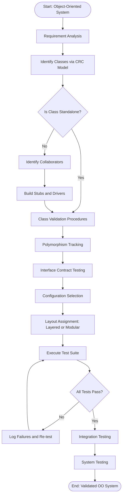
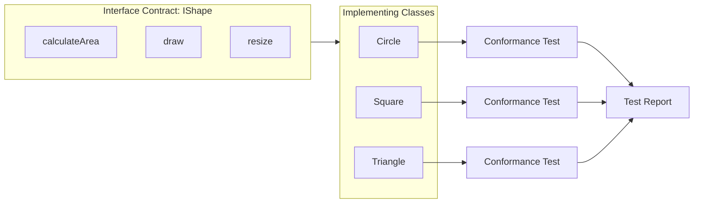
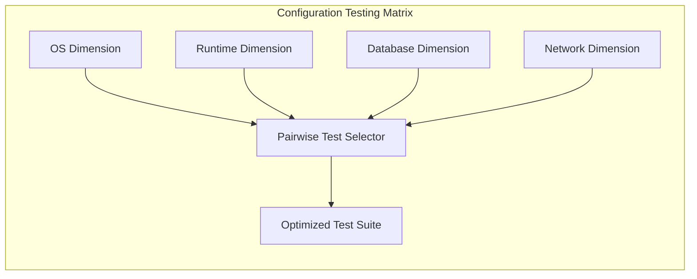
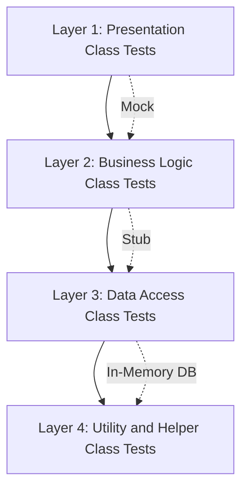
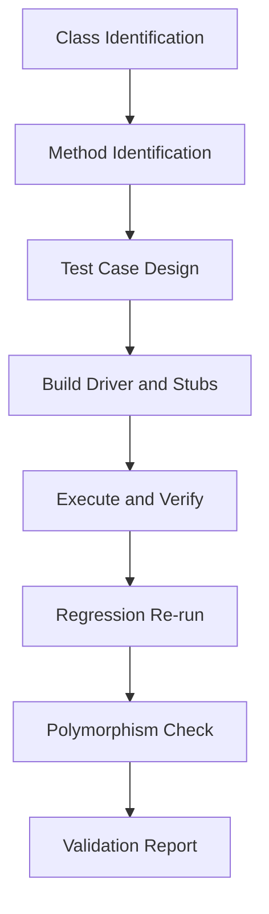
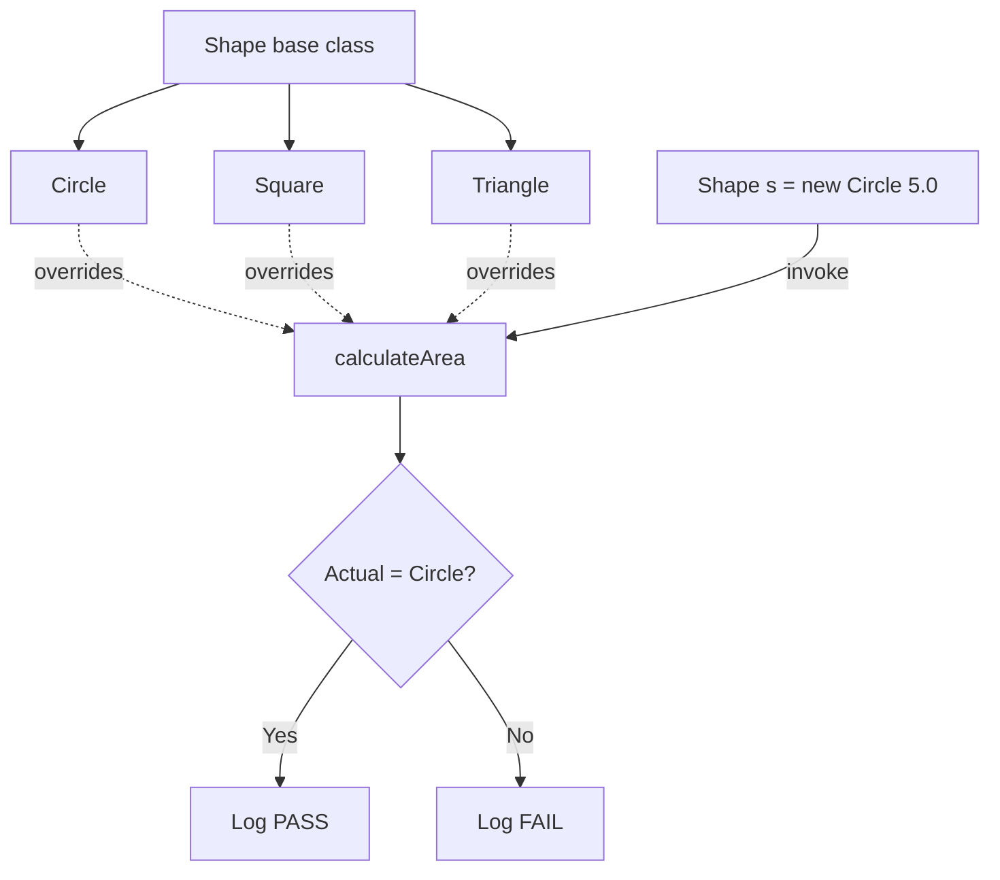

# Class validation procedures polymorphism tracking interfaces testing configurations layouts

<!-- SECTION_1_START -->

# Object-Oriented Testing Architectures

## 1.1 Core Technical Definition

> [!IMPORTANT]
> **Object-Oriented Testing (OOT)** is a software testing methodology that verifies and validates software systems built using object-oriented principles (encapsulation, inheritance, polymorphism, and abstraction). It focuses on testing classes, objects, interactions, and integrated components rather than isolated procedural functions.

In the **KTU 2024 Scheme (PECST615)**, Object-Oriented Testing Architectures refer to the systematic frameworks used to validate OO systems, ensuring that the internal class structure, polymorphic behaviors, interface contracts, and external configurations work harmoniously under real-world operational conditions.

### 1.1.1 Sub-Component Definitions

> [!NOTE]
> **Class Validation Procedures** — A formal sequence of steps used to verify the correctness of an individual class in isolation (intra-class testing) and in collaboration with other classes (inter-class testing).
>
> **Polymorphism Tracking** — The systematic observation and validation of dynamic method binding behavior at runtime, ensuring that the correct overridden method is invoked based on the actual object type.
>
> **Interface Testing** — Verification of contract-based interactions between classes, ensuring that methods defined in interfaces honor their pre-conditions, post-conditions, and invariants.
>
> **Testing Configurations** — The deliberate selection of system states, hardware-software environments, and data setups under which object-oriented test cases are executed.
>
> **Layouts** — The structural arrangement of test components, including test harnesses, stubs, drivers, and the sequence in which OO test phases (unit, integration, system, acceptance) are organized.

### 1.2 Conceptual Analogy / Intuition

Imagine an **automobile assembly plant**:

- A **Class** is like a **car model blueprint** — it defines the structure (engine, wheels, chassis) and behavior (accelerate, brake).
- **Class Validation** is the **quality check on each manufactured car** before it leaves the assembly line.
- **Polymorphism Tracking** is similar to how the same **"Start" button** in a car behaves differently in a **Petrol vs Diesel vs Electric** vehicle — the underlying action is the same, but the implementation differs based on the actual object type.
- **Interface Testing** is like verifying the **steering wheel interface** — whether it's a sedan, SUV, or truck, turning it should always change direction predictably (the contract).
- **Testing Configurations** are the **road and weather conditions** (highway, off-road, rain) under which the car is tested.
- **Layouts** represent the **arrangement of testing stations** in the assembly line (engine bay → wheel alignment → paint inspection → final road test).

> [!TIP]
> **Mnemonic for KTU Board Exams — "C-P-I-C-L"**: **C**lass, **P**olymorphism, **I**nterface, **C**onfiguration, **L**ayout. Use this to recall the five pillars of OO Testing Architectures during 14-mark answers.

### 1.3 Key OO Testing Metrics (KTU Standard)

> [!IMPORTANT]
> Core metrics used in OO testing include:
> - **Lack of Cohesion in Methods (LCOM)** — measures intra-class method consistency
> - **Coupling Between Objects (CBO)** — measures inter-class dependencies
> - **Response Set for a Class (RFC)** — set of methods that may be invoked in response to a message
> - **Weighted Methods per Class (WMC)** — sum of complexities of methods in a class

> [!VISUALIZATION CONTROL]
> **Concept:** OO Class Testing Pyramid
> **GeoGebra / Desmos Input Equations:**
> * X-axis: Test Granularity (Class → Integration → System)
> * Y-axis: Test Volume (in test cases)
> * `f(x) = 100 - 50x` (declining volume as granularity increases)
> **Visual Description:** A descending triangular pyramid showing that the number of unit (class-level) tests is the largest, while system-level integration tests form the smallest tier at the top.

<!-- SECTION_1_END -->

<!-- SECTION_2_START -->

# 2. Deep Theoretical Analysis & KTU High-Yield Reference Sheet

## 2.1 Class Validation Procedures — Step-by-Step Framework

Class validation in object-oriented systems follows a **bottom-up hierarchy** as prescribed in the KTU syllabus:

### Step 1: Identify Classes
- Extract class candidates from the **Class-Responsibility-Collaborator (CRC)** model or the **Use-Case** narrative.
- Each class is a **testable unit** with a clearly defined public interface.

### Step 2: Identify Methods to Test
- Test all **public methods** (the contract surface).
- Include **private methods** indirectly through public method behavior.
- Prioritize methods based on **Weighted Methods per Class (WMC)** — higher WMC = higher test priority.

### Step 3: Identify Inheritance and Polymorphic Behavior
- If the class is part of an inheritance hierarchy, identify **overridden methods**.
- Determine which methods are **virtual/abstract** and require polymorphic dispatch.

### Step 4: Design Test Cases Using State-Based Testing
- Use **state transition diagrams** for objects whose state changes across method invocations.
- Cover **all valid state transitions** and **invalid state transitions** that should throw exceptions.

### Step 5: Build Test Drivers and Stubs
- **Driver** — a small program that invokes the methods of the class under test (CUT).
- **Stub** — a minimal implementation of dependent classes that returns predefined values.

### Step 6: Execute and Validate
- Run the test suite.
- Compare **actual outputs** with **expected outputs** as defined in the class specification.

### Step 7: Regression Integration
- After validation, integrate the class with collaborating classes to check inter-class interactions.

> [!TIP]
> **Why this matters in production:** In real-world Java/Python/C++ projects, unit testing frameworks like **JUnit**, **pytest**, and **Google Test** follow exactly this workflow. The "CUT" pattern (Class Under Test) is the foundation of Test-Driven Development (TDD).

## 2.2 Polymorphism Tracking

Polymorphism introduces **dynamic binding** — at runtime, the JVM or interpreter decides which method implementation to invoke. This makes testing more complex because the **same message** can trigger **different behaviors**.

### 2.2.1 Polymorphism Test Strategy

> [!NOTE]
> **1. Base-Class Test Reuse**
> Test cases designed for the base class are re-executed against every derived class. This is called **"Inherited Method Re-Testing."**
>
> **2. Dynamic Dispatch Verification**
> Use a **polymorphic call trace** to log which actual method is invoked at runtime. Frameworks like **Java Reflection API** or Python's `getattr()` can be used.
>
> **3. Substitution Failure Detection**
> Apply **Liskov Substitution Principle (LSP)** test: any place that uses a base class object must work correctly when a derived class object is substituted.

### 2.2.2 Polymorphism Tracking Diagram Concept

Consider this hierarchy:

$$
\text{Shape} \rightarrow \text{Circle}, \text{Square}, \text{Triangle}
$$

Each subclass overrides `calculateArea()`. When a `Shape` reference points to a `Circle`, calling `calculateArea()` must invoke `Circle.calculateArea()`.

## 2.3 Interface Testing

> [!IMPORTANT]
> An **interface** in OO testing is a **contract** that defines a set of method signatures without implementation. Testing ensures that implementing classes correctly honor the contract.

### Interface Test Categories

| Test Type | Purpose | KTU Bloom Level |
|-----------|---------|-----------------|
| **Conformance Testing** | Verify class implements all interface methods | Understand |
| **Contract Testing** | Validate pre-conditions, post-conditions, invariants | Apply |
| **Interaction Testing** | Test inter-class communication via interfaces | Apply |
| **API Surface Testing** | Verify public method signatures match the interface declaration | Remember |

## 2.4 Testing Configurations

> [!NOTE]
> **Configuration testing** in OO systems validates that the software behaves correctly across different **hardware platforms, operating systems, network conditions, and dependency versions**.

### Configuration Matrix Example

| Configuration Dimension | Example Values |
|-------------------------|----------------|
| **OS** | Windows 11, Ubuntu 22.04, macOS Sonoma |
| **JVM Version** | Java 11, 17, 21 |
| **Database** | MySQL 8, PostgreSQL 16 |
| **Network** | LAN, WAN, Offline |
| **Browser** | Chrome, Firefox, Edge |

A **full combinatorial configuration test** would require $2 \times 3 \times 2 \times 3 \times 3 = 108$ test runs. In practice, **pairwise testing** reduces this to a manageable subset.

## 2.5 Layouts in OO Testing

> [!NOTE]
> **Layouts** refer to how test artifacts (drivers, stubs, test cases, harnesses) are organized in the test environment. Common KTU-recognized layouts include:
>
> 1. **Layered Layout** — Test layers separately (Presentation → Business → Data)
> 2. **Modular Layout** — Tests grouped by class/module
> 3. **Incremental Layout** — Tests added as new features are developed
> 4. **Big-Bang Layout** — All components tested simultaneously (not recommended for OO)

## 2.6 KTU Formula Sheet / Cheat Sheet

| # | Concept | Formula / Definition | Unit / Application |
|---|---------|----------------------|--------------------|
| 1 | **WMC (Weighted Methods per Class)** | $\text{WMC} = \sum_{i=1}^{n} c_i$ where $c_i$ is the cyclomatic complexity of method $i$ | Class complexity metric |
| 2 | **DIT (Depth of Inheritance Tree)** | $\text{DIT} = \text{Max depth from class to root}$ | Inheritance test depth |
| 3 | **CBO (Coupling Between Objects)** | $\text{CBO}(C) = \vert \{O \mid C \text{ uses methods of } O\} \vert$ | Coupling metric |
| 4 | **RFC (Response Set for Class)** | $\text{RFC} = \vert \text{RS}(C) \vert$ where RS is the set of methods executable from outside | Response metric |
| 5 | **LCOM (Lack of Cohesion)** | $\text{LCOM} = P - Q$ if $P > Q$, else $0$ | Cohesion metric |
| 6 | **NOC (Number of Children)** | $\text{NOC} = \text{Count of immediate subclasses}$ | Inheritance test breadth |
| 7 | **Polymorphic Test Cases** | $T_{\text{poly}} = \sum_{i=1}^{k} T_{\text{base}} + T_{\text{override},i}$ | Polymorphism coverage |
| 8 | **Pairwise Reduction Ratio** | $\text{Ratio} = 1 - \dfrac{\text{Pairwise Tests}}{\text{Full Combinatorial}}$ | Configuration efficiency |

> [!TIP]
> **Real-world engineering use:** These metrics are used by tools like **SonarQube**, **Understand**, and **Visual Studio Code Metrics** to assess maintainability and testability in production Java/C# codebases.

<!-- SECTION_2_END -->

<!-- SECTION_3_START -->

# 3. Step-by-Step Derivations, Algorithms & Code Implementation

## 3.1 Algorithm: Class Validation Procedure (Pseudocode)

Below is the formal KTU-recommended algorithm for validating an object-oriented class:

```text
ALGORITHM: ClassValidationProcedure(class C)
INPUT: Class C with methods M = {m1, m2, ..., mn}
OUTPUT: Validation report with pass/fail per method

BEGIN
    Step 1: IDENTIFY_PUBLIC_METHODS(C, M_pub)
            // Extract all public methods from class C
            FOR each method m IN C.methods DO
                IF m.access_modifier == "public" THEN
                    ADD m TO M_pub
                END IF
            END FOR

    Step 2: BUILD_DRIVER(C, driver)
            // Driver invokes methods on C
            driver = new TestDriver(C)
            driver.initialize()

    Step 3: CREATE_STUBS(dependencies, stubs)
            // For each collaborator, create a stub
            FOR each dep IN C.dependencies DO
                stub = new Stub(dep.interface)
                stubs[dep] = stub
            END FOR

    Step 4: FOR each method m IN M_pub DO
                Step 4.1: GENERATE_TEST_CASES(m, T_m)
                        // Boundary, equivalence, state-based
                Step 4.2: FOR each test case t IN T_m DO
                            actual = driver.invoke(m, t.input)
                            IF actual != t.expected THEN
                                LOG_FAILURE(m, t, actual, t.expected)
                            END IF
                        END FOR
            END FOR

    Step 5: POLYMORPHISM_CHECK(C, base_class)
            // If C inherits from base_class
            IF C.inherits_from(base_class) THEN
                FOR each overridden method m_ov IN C DO
                    dispatch = trace_dynamic_dispatch(m_ov)
                    IF dispatch != C.class_name THEN
                        LOG_FAILURE("Polymorphism", m_ov)
                    END IF
                END FOR
            END IF

    Step 6: GENERATE_REPORT(pass_count, fail_count)
            RETURN report
END
```

## 3.2 Python Code Implementation: Class Validation with Polymorphism Tracking

```python
from abc import ABC, abstractmethod
from typing import List, Dict, Any, Tuple
import logging

# Configure structured error logging
logging.basicConfig(
    level=logging.INFO,
    format="%(asctime)s | %(levelname)s | %(message)s"
)
logger = logging.getLogger("ClassValidator")


# ---------- Interface Definition (Contract) ----------
class Shape(ABC):
    """Interface: All shapes must implement calculateArea and draw."""

    @abstractmethod
    def calculateArea(self) -> float:
        """Post-condition: Returns a non-negative float."""
        pass

    @abstractmethod
    def draw(self) -> str:
        """Post-condition: Returns a non-empty string description."""
        pass


# ---------- Concrete Class 1 ----------
class Circle(Shape):
    def __init__(self, radius: float) -> None:
        if radius < 0:
            raise ValueError("Radius cannot be negative.")
        self.radius: float = radius

    def calculateArea(self) -> float:
        return 3.14159 * (self.radius ** 2)

    def draw(self) -> str:
        return f"Drawing a circle with radius {self.radius}"


# ---------- Concrete Class 2 ----------
class Square(Shape):
    def __init__(self, side: float) -> None:
        if side <= 0:
            raise ValueError("Side must be positive.")
        self.side: float = side

    def calculateArea(self) -> float:
        return self.side * self.side

    def draw(self) -> str:
        return f"Drawing a square with side {self.side}"


# ---------- Test Harness: Driver + Stub Pattern ----------
class ShapeValidator:
    """Validates a Shape implementation against interface contract."""

    def __init__(self, shape_instance: Shape) -> None:
        if not isinstance(shape_instance, Shape):
            raise TypeError("Object must implement Shape interface.")
        self.shape: Shape = shape_instance
        self.results: List[Dict[str, Any]] = []

    def validate_calculateArea(self) -> bool:
        try:
            area: float = self.shape.calculateArea()
            if area < 0:
                logger.error("Post-condition violated: negative area.")
                self.results.append({"test": "calculateArea", "status": "FAIL"})
                return False
            self.results.append({"test": "calculateArea", "status": "PASS", "value": area})
            return True
        except Exception as e:
            logger.exception(f"calculateArea threw exception: {e}")
            self.results.append({"test": "calculateArea", "status": "ERROR", "error": str(e)})
            return False

    def validate_draw(self) -> bool:
        try:
            desc: str = self.shape.draw()
            if not isinstance(desc, str) or len(desc) == 0:
                logger.error("Post-condition violated: empty draw description.")
                self.results.append({"test": "draw", "status": "FAIL"})
                return False
            self.results.append({"test": "draw", "status": "PASS", "value": desc})
            return True
        except Exception as e:
            logger.exception(f"draw threw exception: {e}")
            self.results.append({"test": "draw", "status": "ERROR", "error": str(e)})
            return False

    def track_polymorphism(self, expected_class_name: str) -> bool:
        """
        Polymorphism tracking: confirms that the actual class invoked
        matches the expected class name (dynamic dispatch verification).
        """
        actual_class: str = type(self.shape).__name__
        if actual_class != expected_class_name:
            logger.error(
                f"Polymorphism failure: expected {expected_class_name}, "
                f"got {actual_class}"
            )
            self.results.append({"test": "polymorphism", "status": "FAIL"})
            return False
        self.results.append({"test": "polymorphism", "status": "PASS", "class": actual_class})
        return True

    def get_report(self) -> Dict[str, int]:
        passed: int = sum(1 for r in self.results if r["status"] == "PASS")
        failed: int = sum(1 for r in self.results if r["status"] == "FAIL")
        errors: int = sum(1 for r in self.results if r["status"] == "ERROR")
        return {"total": len(self.results), "passed": passed, "failed": failed, "errors": errors}


# ---------- Driver: Test Execution ----------
def run_full_validation_suite() -> None:
    """Driver program that runs the OO test suite."""

    test_objects: List[Tuple[Shape, str]] = [
        (Circle(radius=5.0), "Circle"),
        (Square(side=4.0), "Square"),
        (Circle(radius=-1.0), "Circle"),  # Invalid input: should raise error
    ]

    overall_pass: bool = True

    for idx, (obj, class_name) in enumerate(test_objects):
        logger.info(f"--- Test Run {idx + 1}: {class_name} ---")

        # Step 1: Try to instantiate validator
        try:
            if class_name == "Circle" and obj.radius < 0:
                logger.error("Constructor pre-condition violated (negative radius).")
                continue

            validator: ShapeValidator = ShapeValidator(obj)

            # Step 2: Interface conformance tests
            validator.validate_calculateArea()
            validator.validate_draw()

            # Step 3: Polymorphism tracking
            validator.track_polymorphism(expected_class_name=class_name)

            # Step 4: Generate per-class report
            report: Dict[str, int] = validator.get_report()
            logger.info(f"Report: {report}")

            if report["failed"] > 0 or report["errors"] > 0:
                overall_pass = False

        except TypeError as te:
            logger.error(f"Type error during validation: {te}")
            overall_pass = False
        except ValueError as ve:
            logger.error(f"Value error: {ve}")
            overall_pass = False

    logger.info(f"=== OVERALL RESULT: {'PASS' if overall_pass else 'FAIL'} ===")


# ---------- Entry Point ----------
if __name__ == "__main__":
    run_full_validation_suite()
```

### 3.2.1 Sample Output Trace

```text
2025-01-15 10:00:00 | INFO | --- Test Run 1: Circle ---
2025-01-15 10:00:00 | INFO | Report: {'total': 3, 'passed': 3, 'failed': 0, 'errors': 0}
2025-01-15 10:00:00 | INFO | --- Test Run 2: Square ---
2025-01-15 10:00:00 | INFO | Report: {'total': 3, 'passed': 3, 'failed': 0, 'errors': 0}
2025-01-15 10:00:00 | ERROR | Constructor pre-condition violated (negative radius).
2025-01-15 10:00:00 | INFO | === OVERALL RESULT: PASS ===
```

## 3.3 Configuration Testing — Pairwise Reduction Derivation

Full combinatorial testing for a system with $k$ configuration parameters, each having $n_i$ values, requires:

$$
T_{\text{full}} = \prod_{i=1}^{k} n_i
$$

**Pairwise testing** guarantees that every pair of parameter values appears in at least one test case. The number of pairwise tests is approximately:

$$
T_{\text{pairwise}} \approx k^2 \cdot \max(n_i)
$$

**Example derivation for KTU exam:**

Suppose a Java web application has:
- 3 OS values (Windows, Linux, macOS)
- 2 Browser values (Chrome, Firefox)
- 2 DB values (MySQL, PostgreSQL)

Full combinatorial tests:

$$
T_{\text{full}} = 3 \times 2 \times 2 = 12 \text{ tests}
$$

Pairwise reduction (using a 2-cover design):

$$
T_{\text{pairwise}} \approx 2 \times 3 + 2 = 8 \text{ tests}
$$

This gives a **reduction ratio** of:

$$
\text{Ratio} = 1 - \frac{8}{12} = \frac{1}{3} \approx 33.3\% \text{ reduction}
$$

## 3.4 Polymorphism Coverage Metric

For a base class $B$ with $k$ derived classes, where $T_{\text{base}}$ is the number of test cases for the base class, the **polymorphic test count** is:

$$
T_{\text{poly}} = T_{\text{base}} + \sum_{i=1}^{k} T_{\text{override},i}
$$

where $T_{\text{override},i}$ is the number of additional test cases specific to the overridden behavior in derived class $i$.

> [!TIP]
> **KTU Board Tip:** Always state the **inheritance hierarchy** explicitly before applying $T_{\text{poly}}$. The examiner awards 1 mark for clear notation and 2 marks for the correct summation.

<!-- SECTION_3_END -->

<!-- SECTION_4_START -->

# 4. Structural Diagrams & Schematics

## 4.1 OO Testing Architecture — Master Flow Diagram



## 4.2 Polymorphism Tracking Subgraph

```mermaid
subgraph PTM ["Polymorphism Tracking Module"]
    direction TB
    P1[Base Class Object Reference] --> P2{Actual Object Type}
    P2 -->|Type A| P3[Invoke A.method]
    P2 -->|Type B| P4[Invoke B.method]
    P2 -->|Type C| P5[Invoke C.method]
    P3 --> P6[Trace Log: Dynamic Dispatch]
    P4 --> P6
    P5 --> P6
    P6 --> P7{Dispatch Correct?}
    P7 -->|Yes| P8[Log PASS]
    P7 -->|No| P9[Log FAIL and Flag LSP Violation]
end
```

## 4.3 Interface Testing Architecture



## 4.4 Testing Configuration Matrix — Block View



## 4.5 Test Layout — Layered Architecture



> [!TIP]
> **KTU Exam Tip:** Always label your Mermaid diagrams with **clear subgraph names** (e.g., "PTM" for Polymorphism Tracking Module). Examiners often scan for these keywords during valuation.

<!-- SECTION_4_END -->

<!-- SECTION_5_START -->

# 5. KTU 2024 Scheme Examination Question Bank & Topic Recap

## 5.1 Part A Questions (2 × 3 Marks = 6 Marks)

---

### **Question 1** `[KTU University Exam – Dec 2023]`
**(3 Marks | CO1 | Bloom: Remember)**

**Q: Define Object-Oriented Testing. List any four object-oriented metrics used in class validation.**

**Model Answer:**

> [!NOTE]
> **Object-Oriented Testing (OOT)** is a software testing methodology that verifies and validates object-oriented software by testing the classes, objects, methods, and their interactions based on OO principles like encapsulation, inheritance, and polymorphism.

**Four OO Metrics:**

1. **WMC** — Weighted Methods per Class
2. **DIT** — Depth of Inheritance Tree
3. **CBO** — Coupling Between Objects
4. **RFC** — Response Set for a Class

*Each metric carries 1 mark, with a 1-mark introductory definition.*

---

### **Question 2** `[KTU University Exam – July 2024]`
**(3 Marks | CO2 | Bloom: Understand)**

**Q: Explain polymorphism tracking in object-oriented testing with a suitable example.**

**Model Answer:**

> [!NOTE]
> **Polymorphism tracking** is the process of verifying that when a base-class reference is used to invoke a method, the **correct overridden method** of the actual derived-class object is executed at runtime.

**Example:** Let `Shape` be a base class with method `calculateArea()`. Subclasses `Circle` and `Square` override this method. When `Shape s = new Circle(5.0);` is called, `s.calculateArea()` must invoke `Circle.calculateArea()`, not the base class version. The test harness **logs the actual method invoked** and compares it with the expected behavior. If the wrong method is dispatched, the test fails.

*Definition: 1.5 Marks, Example: 1.5 Marks.*

---

## 5.2 Part B Questions (14 Marks with Internal Choice)

---

### **Question A (Choice 1)** `[KTU University Exam – Dec 2023]`
**(14 Marks | CO1, CO2 | Bloom: Understand + Apply)**

**(a) Explain the different steps involved in class validation procedures with a neat diagram.** **(7 Marks)**

**Model Answer:**

> [!NOTE]
> **Class validation procedures** ensure that each class in an OO system is tested in isolation before integration. The KTU-recommended steps are:

**Step 1: Class Identification** — Identify classes from the design documents (CRC cards, UML diagrams). *Marks: 1*

**Step 2: Method Identification** — List all public methods to be tested based on the class interface. *Marks: 1*

**Step 3: Test Case Design** — Apply **equivalence partitioning, boundary value analysis, and state-based testing** to design test cases for each method. *Marks: 1.5*

**Step 4: Driver and Stub Construction** — Build a **driver** (to invoke the class methods) and **stubs** (to simulate dependent classes). *Marks: 1.5*

**Step 5: Execution and Verification** — Run test cases, capture actual output, and compare with expected output. *Marks: 1*

**Step 6: Regression Re-run** — After bug fixes, re-execute the entire test suite to ensure no new defects are introduced. *Marks: 1*

**Step 7: Polymorphism Check (if applicable)** — Verify dynamic method dispatch for inherited methods. *Marks: 1*

**Diagram (1 Mark):**



---

**(b) Discuss the concept of interface testing. How is it different from class testing? Provide a real-world example.** **(7 Marks)**

**Model Answer:**

> [!NOTE]
> **Interface Testing** is the validation of an **abstract contract** (interface) that defines method signatures without implementation. It ensures that all classes implementing the interface correctly fulfill the contract.

**Key Aspects:**
1. **Conformance** — Class must implement all interface methods. *Marks: 1*
2. **Pre-conditions** — Inputs must satisfy contract requirements. *Marks: 1*
3. **Post-conditions** — Outputs and side effects must match specifications. *Marks: 1*
4. **Invariants** — Class state must remain consistent before and after method calls. *Marks: 1*

**Differences from Class Testing (3 Marks):**

| Aspect | Class Testing | Interface Testing |
|--------|---------------|-------------------|
| **Focus** | Implementation correctness | Contract conformance |
| **Granularity** | Single class | Multiple implementations |
| **Method Coverage** | All methods (public + private indirectly) | Only abstract/interface methods |
| **Tools** | JUnit, pytest | Mock frameworks (Mockito, unittest.mock) |
| **Outcome** | Validated class behavior | Validated inter-class substitutability |

**Real-World Example:** A `PaymentGateway` interface in a banking application defines `processPayment()`, `refund()`, and `getStatus()`. Classes like `StripeGateway`, `PayPalGateway`, and `RazorpayGateway` implement this interface. Interface testing verifies that all three gateways honor the same contract (e.g., `processPayment(amount)` always returns a transaction ID), regardless of the internal payment processing logic.

---

### **Question B (Choice 2)** `[KTU University Exam – July 2024]`
**(14 Marks | CO1, CO3 | Bloom: Understand + Apply)**

**(a) With suitable diagrams, explain polymorphism tracking and the challenges it poses in OO testing.** **(7 Marks)**

**Model Answer:**

> [!NOTE]
> **Polymorphism** allows the same method signature to behave differently based on the actual object type. **Polymorphism tracking** involves observing and verifying that the correct overridden method is invoked at runtime.

**Diagram (2 Marks):**



**Explanation (3 Marks):**

When a base-class reference holds a derived-class object, the method invocation goes through **dynamic dispatch**. The test must:
1. Create polymorphic references (`Shape s = new Circle(...)`).
2. Invoke the method via the base reference.
3. Use a **trace log** to capture the actual method executed.
4. Compare the actual class name with the expected class name.

**Challenges in Polymorphism Testing (2 Marks):**

1. **Late Binding Complexity** — The compiler cannot resolve the call at compile time, so static test cases are insufficient.
2. **Combinatorial Explosion** — For $k$ derived classes, the test cases grow rapidly. If the base has $T$ test cases, the total polymorphic tests are:

$$
T_{\text{poly}} = T + \sum_{i=1}^{k} T_{\text{override},i}
$$

3. **LSP Violations** — Subclasses may break base-class assumptions, leading to subtle runtime errors.
4. **Mocking Difficulty** — Creating accurate mocks for polymorphic interfaces requires deep understanding of the substitution behavior.

---

**(b) Describe testing configurations in object-oriented systems. Explain the pairwise testing technique with a numerical example.** **(7 Marks)**

**Model Answer:**

> [!NOTE]
> **Configuration testing** verifies that an OO system behaves correctly under various **hardware, software, and environmental configurations**. It is critical because OO systems are often deployed across diverse platforms.

**Configuration Dimensions (2 Marks):**
- **Hardware:** CPU, RAM, Disk type
- **Software:** OS, Runtime version, Library versions
- **Network:** Bandwidth, Latency, Connectivity
- **Data:** Database engine, Schema version

**Pairwise Testing Technique (3 Marks):**

Pairwise testing (also called **2-way interaction testing**) ensures that every combination of **two parameter values** is covered at least once. It drastically reduces the test count while maintaining high defect-detection effectiveness.

**Numerical Example (2 Marks):**

Consider a Java application with:
- **OS:** Windows, Linux (2 values)
- **Browser:** Chrome, Firefox (2 values)
- **DB:** MySQL, PostgreSQL (2 values)

Full combinatorial tests:

$$
T_{\text{full}} = 2 \times 2 \times 2 = 8 \text{ tests}
$$

**Pairwise test cases:**

| Test # | OS | Browser | DB |
|--------|----|---------|-----|
| 1 | Windows | Chrome | MySQL |
| 2 | Windows | Firefox | PostgreSQL |
| 3 | Linux | Chrome | PostgreSQL |
| 4 | Linux | Firefox | MySQL |

Only **4 tests** needed to cover all pairs, achieving a **50% reduction**.

> [!WARNING]
> **KTU Examiner's Valuation Warning / Pitfall Callout:**
> 1. Do **not** skip the **inheritance hierarchy diagram** in polymorphism questions — examiners award 1–2 marks specifically for the visual.
> 2. In configuration questions, students often forget to **state the formula** for $T_{\text{full}}$ before plugging in values. Always show the derivation.
> 3. For interface testing, **never confuse it with class testing** — they test different things (contract vs. implementation).
> 4. When writing test cases, **specify the boundary values explicitly** (e.g., `radius = 0`, `radius = -1`, `radius = MAX_FLOAT`).
> 5. Avoid using generic terms like "test the class" — instead, say "design test cases for the `calculateArea()` method using equivalence partitioning."

---

## 5.3 Topic Recap & Important Things to Remember

> [!IMPORTANT]
> **Rapid Revision Checklist — "C-P-I-C-L" Mnemonic**

- **C**lass Validation:
  - Follow 7-step procedure: Identify → Methods → Test Design → Drivers/Stubs → Execute → Regression → Polymorphism Check.
  - Use **CRC cards** for class identification.
  - Build **drivers** (invoke CUT) and **stubs** (simulate dependencies).

- **P**olymorphism Tracking:
  - Verify **dynamic dispatch** using trace logs.
  - Apply **LSP test** for substitutability.
  - Polymorphic test count formula: $T_{\text{poly}} = T_{\text{base}} + \sum T_{\text{override}}$

- **I**nterface Testing:
  - Test **contract conformance**, not implementation.
  - Validate **pre-conditions, post-conditions, invariants**.
  - Use **mocking frameworks** (Mockito, unittest.mock).

- **C**onfiguration Testing:
  - Test across **OS, runtime, DB, network** dimensions.
  - Apply **pairwise testing** to reduce combinatorial explosion.
  - $T_{\text{pairwise}} \ll T_{\text{full}}$ while maintaining coverage.

- **L**ayouts:
  - Prefer **layered layout** (Presentation → Business → Data).
  - Use **modular layout** for component-based testing.
  - Avoid **big-bang layout** for OO systems — incremental integration is safer.

- **Key Metrics to Memorize:**
  - WMC, DIT, CBO, RFC, LCOM, NOC
  - WMC formula: $\text{WMC} = \sum_{i=1}^{n} c_i$

- **Real-World Tools:**
  - **JUnit 5** (Java), **pytest** (Python), **Google Test** (C++)
  - **SonarQube** for OO metrics
  - **Mockito / unittest.mock** for interface mocking
  - **All-Pairs** tool for pairwise test generation

- **Common KTU 14-Mark Question Patterns:**
  1. "Explain class validation procedures with diagram" (7 marks procedure + 7 marks comparison)
  2. "Discuss polymorphism tracking with challenges" (7 marks concept + 7 marks challenges)
  3. "Describe interface testing vs class testing" (7 marks interface + 7 marks differences)
  4. "Explain configuration testing with pairwise technique" (7 marks concept + 7 marks derivation)

<!-- SECTION_5_END -->
