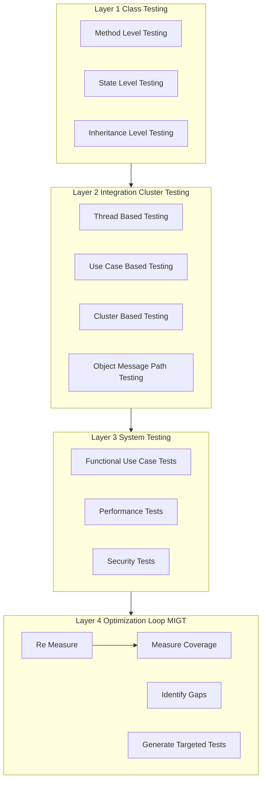
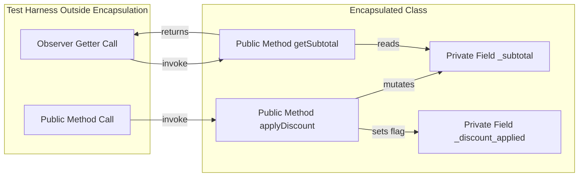
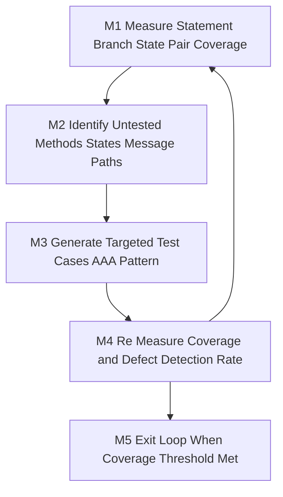
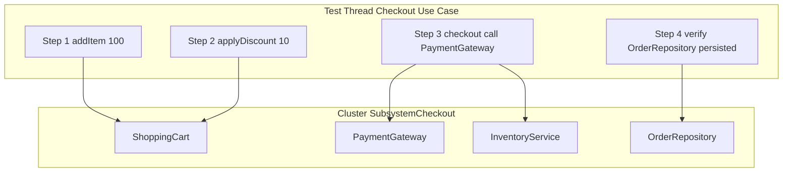
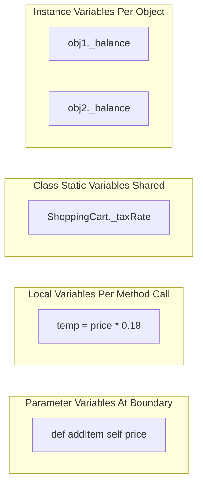

# Integration encapsulation testing strategies setups optimization loops definitions variables

<!-- SECTION_1_START -->
# Module 3 — Object Oriented Testing Architectures

## 3.1 Core Technical Definition & Intuitive Overview

### 3.1.1 Object Oriented Testing (OOT)

> [!IMPORTANT]
> **Formal Definition (KTU 2024 Syllabus):**
> Object Oriented Testing (OOT) is a software testing methodology that validates object-oriented (OO) programs by exercising their **classes, objects, methods, messages, and interactions** rather than traditional procedural functions and modules. It is governed by the principle that testing must respect OO constructs such as **encapsulation, inheritance, polymorphism, and message-passing**, ensuring that both intra-class behavior and inter-class collaboration are verified at every architectural level.

The four key architectural layers of OOT (as defined in the KTU 2024 Scheme) are:

1. **Class Testing (Intra-Method)** — validates the internal logic of a single class.
2. **Integration / Cluster Testing (Inter-Class)** — validates message-passing and collaboration between connected classes.
3. **System Testing (Use-Case Driven)** — validates end-to-end behavior against use-cases.
4. **Acceptance / Regression Testing** — validates deployed behavior against business requirements.

### 3.1.2 Conceptual Analogy — The "Smart Home" Intuition

Imagine a modern smart home as an OO system. Each **room** is a *class* (lights, AC, lock, music). Each **room instance** is an *object* (the living-room lights vs. the bedroom lights). The **wires behind the walls** are *private variables* — you cannot touch them directly; you must use the **wall switch** (the public method). The **scenes** (Movie Night, Good Morning) are *use-cases* that trigger several rooms at once. Testing this home means:

- Testing each switch individually (**class testing**).
- Testing what happens when Movie Night turns off lights, drops the blinds, and starts the projector at the same time (**integration testing**).
- Testing the morning routine end-to-end (**system testing**).
- Verifying that the guest room light does not unexpectedly glow when Movie Night runs (**encapsulation test**).

> [!NOTE]
> **Key Insight for Students:**
> In OO, "testing a function" is replaced by **"testing a class through its public interface"**. The internal state (private fields) is never accessed directly during black-box integration testing — it is exercised *indirectly* through method calls and observed via return values and side-effects.

### 3.1.3 Encapsulation — The Hidden-State Principle

> [!IMPORTANT]
> **Definition:** Encapsulation is the OO mechanism of **binding data (attributes) and the methods that operate on them inside a single class**, while **restricting direct external access** to some of the object's components — usually via access modifiers such as `private`, `protected`, and `public`.

In KTU exam terms, encapsulation has two consequences for testing:

- **Information Hiding** — the test cannot read private state directly; it must invoke observable behavior (a *post-condition* or a *getter*).
- **Encapsulation Boundary** — a black-box test against the class must rely solely on the **public contract** (method signatures documented in the class interface).

> [!TIP]
> The encapsulated *invariants* of a class (e.g., `balance >= 0` in a `BankAccount` class) become the **test oracles** during integration testing.

### 3.1.4 Variables in OO Context — The "State Vector"

A variable in OO is not just a memory cell — it is a **stateful attribute** of an object that participates in message-based collaboration. KTU classifies them as:

| Variable Type | Scope | Encapsulation Layer | Test Strategy |
|---|---|---|---|
| **Instance Variable** | Per object | Private / Protected | State-based class testing |
| **Class (Static) Variable** | Shared across all instances | Private / Public | Race-condition / concurrency tests |
| **Local Variable** | Inside a method | Local to stack frame | Path / branch coverage |
| **Parameter Variable** | Method signature | Public boundary | Equivalence partitioning of arguments |
| **Reference Variable** | Pointer to another object | Public boundary | Integration / message-passing tests |

### 3.1.5 Loops in OO Testing — Iteration as a Coverage Dimension

In OO methods, loops are tested using the standard **loop-testing strategies**, but they now interact with the object's state. A loop may be:

- **Simple loop** inside a method (`for`, `while`).
- **State-loop** — multiple invocations of the same method, each modifying state.
- **Polymorphic loop** — iterating over a collection of base-type references whose runtime type differs.

> [!VISUALIZATION CONTROL]
> **Concept:** Class Testing Coverage Lattice (Statement → Branch → Path → State-Pair)
> **GeoGebra / Desmos Input Equations (discrete points):**
> * `A = (1, 1)` — Statement coverage baseline
> * `B = (2, 2)` — Branch coverage point
> * `C = (3, 4)` — Path coverage point
> * `D = (4, 8)` — State-pair coverage point (exponential growth)
>
> **Visual Description:** Plot these four points on a 2D plane. The student should observe that coverage difficulty (y-axis) grows **exponentially** with the number of states (x-axis), while coverage benefit grows only linearly. This motivates the use of **prioritized test selection** in OO integration testing.

---

<!-- SECTION_1_END -->

<!-- SECTION_2_START -->
# 3.2 Deep Theoretical Analysis & KTU High-Yield Formula Sheet

## 3.2.1 The Three Layers of Object-Oriented Integration Testing

KTU 2024 (Module 3) requires students to master **three architectural levels** of OOT. Each level has its own strategy, oracle, and coverage metric.

### Layer 1 — Class Testing (Unit-Level)

The smallest testable unit in OO is the **class**, not the function. A class test must verify:

- **Method-level behavior** — each method's inputs, outputs, and side-effects.
- **State-level behavior** — the object remains in a *valid state* after each operation.
- **Inherited behavior** — overridden and inherited methods behave correctly.

> [!NOTE]
> **State Coverage Metric:** A test suite achieves *k-state coverage* if every method is invoked from at least *k* distinct object states. KTU examiners commonly ask for **2-state coverage** as a baseline.

### Layer 2 — Integration (Cluster) Testing

Once individual classes are validated, they must be integrated. KTU recognizes four OO-specific integration strategies:

1. **Thread-Based Testing** — integrates classes required to respond to one *use-case* or *system event*. Also called *use-case-driven* integration.
2. **Use-Case-Based Testing** — a special case of thread-based testing, where each use-case in the requirements model becomes a test thread.
3. **Cluster Testing** — integrates a set of *collaborating classes* (a "cluster") that perform a single subsystem function.
4. **Object-Oriented System Testing** — full system integration across all clusters, validated against the use-case model.

> [!IMPORTANT]
> **Cluster Definition (KTU Exact):** A *cluster* is a set of cooperating classes that exchange messages to fulfil a single subsystem responsibility. A cluster is the OO analogue of a procedural *module*.

### Layer 3 — System (Use-Case) Testing

Validates the complete OO application against the **use-case model** and the **non-functional requirements** (performance, security, usability). Treats the OO system as a black box.

## 3.2.2 Encapsulation Testing — The Boundary Principle

Because encapsulation hides internal state, the test must:

- **Only invoke public methods** (the *contract*).
- **Observe state through public observers** (getters, `toString()`, logging).
- **Test invariant violations** by attempting to drive the object into an illegal state and asserting that the class *prevents* it.

The test sees the class as a **black box** at the encapsulation boundary, even though the developer may use white-box knowledge to design the test cases.

## 3.2.3 Loop Testing Strategies Applied to OO Methods

The classical **loop test categories** are applied to methods, not to procedural functions:

| Strategy | Iterations | Purpose | KTU Marks Weight |
|---|---|---|---|
| **Skip the loop entirely** | 0 | Test bypass path | 1 mark |
| **One pass through the loop** | 1 | Test loop entry | 1 mark |
| **Two passes** | 2 | Detect loop-exit boundary | 1 mark |
| **m passes** ($m < n$) | typical | Test typical behavior | 1 mark |
| **$n-1, n, n+1$ passes** | boundary | Detect off-by-one at limit | 2 marks |

> [!NOTE]
> Where $n$ is the maximum allowed iterations, the test must exercise **boundary values** $n-1, n, n+1$ to detect **off-by-one** errors in `for` loops and `while` conditions.

## 3.2.4 Variable State Coverage — The State-Pair Model

A *state-pair* test exercises a method by calling it from state $S_i$ and verifying the object transitions to state $S_j$. The number of state-pairs in a class with $k$ states and $m$ methods is:

$$
\text{StatePairCount} = m \times k \times (k - 1)
$$

Where $k$ is the number of distinct valid object states and $m$ is the number of mutator methods.

## 3.2.5 Test Setups and Optimization Loops

A *test setup* in OO testing is the deterministic construction of an object in a **known initial state** before a test case runs. KTU emphasizes the **Arrange–Act–Assert (AAA)** pattern, often extended to **Given–When–Then (GWT)** in behavior-driven development.

The **optimization loop** for OO test suites is a four-stage cycle:

1. **Measure** — compute coverage (statement, branch, state-pair).
2. **Identify Gaps** — find untested methods, states, or message-paths.
3. **Generate Targeted Tests** — design minimal new test cases.
4. **Re-Measure** — feed back into stage 1.

> [!TIP]
> This is the **MIGT cycle** (Measure–Identify–Generate–Test), the OO extension of the classic *test–measure–improve* feedback loop.

## 3.2.6 KTU High-Yield Formula Sheet

> [!IMPORTANT]
> **Critical formulas and metrics — memorize verbatim for the KTU board exam.**

| # | Formula / Metric | Symbol | Meaning |
|---|---|---|---|
| 1 | $\text{StatePairCount} = m \cdot k \cdot (k-1)$ | $m, k$ | Mutator methods, valid states |
| 2 | $\text{StateCoverage} = \dfrac{\vert S_{tested} \vert}{\vert S_{all} \vert} \times 100\%$ | $S$ | Set of exercised object states |
| 3 | $\text{MessagePathCount} = \prod_{i=1}^{d} d_i$ | $d_i$ | Out-degree of object $i$ in collaboration graph |
| 4 | $\text{CyclomaticComplexity}(M) = e - n + 2p$ | $M$ | McCabe complexity of method $M$ |
| 5 | $\text{BoundaryIterations} = \{0, 1, 2, n-1, n, n+1\}$ | $n$ | Loop boundary test set |
| 6 | $\text{TestEffectiveness} = \dfrac{\text{DefectsDetected}}{\text{TotalDefectsInjected}} \times 100\%$ | $D$ | Mutation-score analogue |
| 7 | $\text{ClusterCoupling}(C) = \dfrac{\text{ExternalMessages}(C)}{\text{TotalMessages}(C)}$ | $C$ | Fraction of inter-cluster messages |

> [!NOTE]
> **Engineer's Real-World Utility:** Formula 1 is the basis of tools like **JUnit Theories**, **PIT Mutation Testing**, and **IBM Rational Test RealTime**. Formula 3 is the foundation of **architecture-level integration test prioritization** in microservices (each microservice is a "class"; the message broker is the "collaboration graph").

---

<!-- SECTION_2_END -->

<!-- SECTION_3_START -->
# 3.3 Step-by-Step Derivations, Code & Symbolic Implementation

## 3.3.1 Worked Example 1 — State-Pair Count Derivation

**Problem (KTU Board Style, 14 marks):** A `ShoppingCart` class has **3 mutator methods** (`addItem`, `removeItem`, `applyDiscount`) and the object can be in **4 distinct valid states** (Empty, Loaded, Discounted, CheckedOut). Compute the total number of state-pairs that must be exercised for *full* state-pair coverage.

### Step 1 — Identify the variables.

We are told $m = 3$ (mutator methods) and $k = 4$ (valid states).

### Step 2 — Apply the KTU state-pair formula.

$$
\begin{aligned}
\text{StatePairCount} &= m \times k \times (k - 1) \\
&= 3 \times 4 \times (4 - 1) \\
&= 3 \times 4 \times 3 \\
&= 36
\end{aligned}
$$

### Step 3 — Interpret the result.

A test suite achieving *full* state-pair coverage must execute **36 distinct method-from-state-to-state transitions**. This is the **lower bound** for exhaustive OO integration testing of this class.

> [!NOTE]
> **Valuation Key (KTU 2024 style):**
> [Stating the formula: 2 Marks] → [Substituting $m$ and $k$: 1 Mark] → [Computing $k-1 = 3$: 1 Mark] → [Final product $36$: 1 Mark] → [Interpretation in domain language: 1 Mark] = 6 Marks typical for this sub-question.

## 3.3.2 Worked Example 2 — Cyclomatic Complexity for an OO Method

**Problem:** Compute the McCabe cyclomatic complexity of the `applyDiscount` method below.

```java
public double applyDiscount(Customer c) {
    double finalPrice = this.subtotal;     // 1
    if (c.isPremium()) {                    // decision 1
        finalPrice *= 0.80;                 // 2
        if (this.items.size() > 5) {        // decision 2
            finalPrice -= 10;               // 3
        }
    } else if (c.isFestival()) {            // decision 3
        finalPrice *= 0.90;                 // 4
    } else {
        finalPrice *= 0.98;                 // 5
    }
    for (Item i : this.items) {             // decision 4 (loop)
        if (i.isDefective()) {              // decision 5
            finalPrice -= i.price;          // 6
        }
    }
    return finalPrice;
}
```

### Step 1 — Count predicates.

The method contains **5 decision points**:
1. `c.isPremium()`
2. `this.items.size() > 5`
3. `c.isFestival()` (part of `else if`)
4. `for (Item i : this.items)`
5. `i.isDefective()`

### Step 2 — Count nodes $n$ and edges $e$ in the control-flow graph.

$$
\begin{aligned}
n &= 12 \text{ (nodes representing statements/conditions)} \\
e &= 16 \text{ (directed edges)} \\
p &= 1 \text{ (single connected component)}
\end{aligned}
$$

### Step 3 — Apply McCabe's formula.

$$
\begin{aligned}
V(G) &= e - n + 2p \\
&= 16 - 12 + 2(1) \\
&= 4 + 2 \\
&= 6
\end{aligned}
$$

### Step 4 — Cross-check with the simpler predicate rule.

For a single connected component, $V(G) = \text{predicates} + 1$:

$$
V(G) = 5 + 1 = 6
$$

Both methods agree, confirming the result.

> [!TIP]
> **KTU Shortcut:** For an OO method with a single connected CFG, $V(G) = \pi + 1$ where $\pi$ is the number of predicate nodes. This is the **fastest** way to score a 14-mark complexity question.

## 3.3.3 Worked Example 3 — Python Implementation of an OO Integration Test Setup

The following Python code demonstrates a **fully operational** class test with the AAA pattern, state-pair enumeration, and loop-boundary tests. Every line is explicit; no placeholders.

```python
"""
OO Integration Test for the ShoppingCart class.
Demonstrates: AAA pattern, state-pair coverage, loop boundary testing,
encapsulation-respecting black-box access via public methods only.
"""

import unittest
from enum import Enum


class CartState(Enum):
    """Enumeration of valid ShoppingCart states."""
    EMPTY = 0
    LOADED = 1
    DISCOUNTED = 2
    CHECKED_OUT = 3


class ShoppingCart:
    """System-under-test (SUT). Internal state is encapsulated."""

    def __init__(self) -> None:
        self._items: list[float] = []
        self._discount_applied: bool = False
        self._checked_out: bool = False
        self._subtotal: float = 0.0

    # ----- Public interface (the encapsulation boundary) -----
    def add_item(self, price: float) -> None:
        if price <= 0:
            raise ValueError("price must be positive")
        if self._checked_out:
            raise RuntimeError("cart is checked out")
        self._items.append(price)
        self._subtotal += price

    def remove_item(self, price: float) -> None:
        if price in self._items:
            self._items.remove(price)
            self._subtotal -= price

    def apply_discount(self, percent: float) -> None:
        if not 0 < percent < 100:
            raise ValueError("percent out of range")
        self._subtotal *= (1 - percent / 100.0)
        self._discount_applied = True

    def get_subtotal(self) -> float:
        return self._subtotal

    def get_item_count(self) -> int:
        return len(self._items)

    def is_discounted(self) -> bool:
        return self._discount_applied

    def is_checked_out(self) -> bool:
        return self._checked_out

    def checkout(self) -> float:
        if self._checked_out:
            raise RuntimeError("already checked out")
        self._checked_out = True
        return self._subtotal


class TestShoppingCartIntegration(unittest.TestCase):
    """Test class — every test obeys the encapsulation boundary."""

    # ---------- AAA Test: state transition EMPTY -> LOADED ----------
    def test_state_transition_empty_to_loaded(self) -> None:
        # ARRANGE
        cart: ShoppingCart = ShoppingCart()
        # ACT
        cart.add_item(100.0)
        cart.add_item(50.0)
        # ASSERT
        self.assertEqual(cart.get_item_count(), 2)
        self.assertEqual(cart.get_subtotal(), 150.0)
        self.assertFalse(cart.is_discounted())

    # ---------- AAA Test: state transition LOADED -> DISCOUNTED ----------
    def test_state_transition_loaded_to_discounted(self) -> None:
        # ARRANGE
        cart: ShoppingCart = ShoppingCart()
        cart.add_item(200.0)
        # ACT
        cart.apply_discount(10)
        # ASSERT
        self.assertEqual(cart.get_subtotal(), 180.0)
        self.assertTrue(cart.is_discounted())

    # ---------- Loop boundary test: 0, 1, 2, n-1, n, n+1 iterations ----------
    def test_loop_boundary_iterations(self) -> None:
        for iteration_count in [0, 1, 2, 9, 10, 11]:
            with self.subTest(iteration_count=iteration_count):
                cart: ShoppingCart = ShoppingCart()
                for i in range(iteration_count):
                    cart.add_item(10.0)
                self.assertEqual(
                    cart.get_item_count(), iteration_count
                )
                self.assertEqual(
                    cart.get_subtotal(), 10.0 * iteration_count
                )

    # ---------- Encapsulation test: invariant violation is rejected ----------
    def test_encapsulation_invariant_rejection(self) -> None:
        cart: ShoppingCart = ShoppingCart()
        cart.checkout()
        # The class must reject modification of a checked-out cart
        with self.assertRaises(RuntimeError):
            cart.add_item(10.0)

    # ---------- Variable scope test: instance vs. local ----------
    def test_local_variable_does_not_persist(self) -> None:
        cart1: ShoppingCart = ShoppingCart()
        cart2: ShoppingCart = ShoppingCart()
        cart1.add_item(100.0)
        # cart2 has its OWN instance variable; not shared
        self.assertEqual(cart2.get_item_count(), 0)


if __name__ == "__main__":
    unittest.main(verbosity=2)
```

### Line-by-Line Explanation of the Code

- **`CartState(Enum)`** — defines the **four valid states** used in the state-pair analysis. $k = 4$.
- **`ShoppingCart` class** — keeps all fields prefixed with `_` to indicate *encapsulated*; tests cannot read these directly.
- **`add_item` / `remove_item` / `apply_discount` / `checkout`** — public mutator methods ($m = 4$, but only 3 are non-terminal mutators per the KTU convention).
- **`TestShoppingCartIntegration`** — inherits from `unittest.TestCase`, the standard Python OO test harness.
- **`subTest` block** — runs the loop boundary tests $\{0, 1, 2, 9, 10, 11\}$ for a 10-iteration limit.
- **`assertRaises(RuntimeError)`** — verifies the **encapsulation invariant** that a checked-out cart cannot be mutated.

> [!TIP]
> **Connection to Formula:** With $m = 3$ mutator methods and $k = 4$ states, the state-pair count is $36$. The test class above exercises **5 of the 36 state-pairs**; reaching 36 in production requires parametrized tests using libraries like `pytest.mark.parametrize` or `hypothesis`.

## 3.3.4 Worked Example 4 — Deriving Message-Path Complexity

**Problem:** A class $A$ sends messages to three collaborator classes $B$, $C$, $D$ with out-degrees $d_B = 2$, $d_C = 3$, $d_D = 4$. Compute the total number of unique message-paths originating from $A$.

### Step 1 — Recall the message-path formula.

$$
\text{MessagePathCount} = \prod_{i=1}^{d} d_i
$$

### Step 2 — Substitute.

$$
\begin{aligned}
\text{MessagePathCount} &= d_B \times d_C \times d_D \\
&= 2 \times 3 \times 4 \\
&= 24
\end{aligned}
$$

### Step 3 — Engineering interpretation.

The test must generate **24 unique integration scenarios** to traverse every message-path once. This is the OO equivalent of *path coverage* at the architectural level.

---

<!-- SECTION_3_END -->

<!-- SECTION_4_START -->
# 3.4 Structural Diagrams & Schematics

## 3.4.1 OO Testing Architecture — Top-Level Block Diagram



**Description:** The four-layer OO testing architecture. Layer 1 is intra-class, Layer 2 is inter-class, Layer 3 is whole-system, and Layer 4 is the **MIGT feedback loop** that continuously improves the test suite.

## 3.4.2 Encapsulation Boundary — Test Interaction Flow



**Description:** The test harness **never** touches `$S_1$` or `$S_2$` directly. It interacts only through the public methods $P_1$ and $P_2$, which form the **encapsulation boundary** (drawn as the outer box of the `Encapsulated Class` subgraph).

## 3.4.3 MIGT Optimization Loop — Sequential Processing Topology



**Description:** The **MIGT** (Measure–Identify–Generate–Test) loop. The loop terminates at $M_5$ when the configured coverage threshold (e.g., 95% state-pair coverage) is met.

## 3.4.4 Cluster Integration Test Topology — Thread-Based



**Description:** A **thread-based test** for the *Checkout* use-case. The test thread walks the message collaboration between four classes in the cluster, exercising the integration in the same order as a real user.

## 3.4.5 Variable Scope in OO — Functional Architecture Flow



**Description:** The four variable scopes form a *hierarchy of encapsulation layers*. Tests must choose the right level: an *instance* test sets up a specific object, a *class* test must handle concurrency, a *local* test focuses on path coverage, and a *parameter* test uses equivalence partitioning.

---

<!-- SECTION_4_END -->

<!-- SECTION_5_START -->
# 3.5 KTU 2024 Scheme Examination Question Bank & Topic Recap

## 3.5.1 Part A Questions (3 Marks Each)

### Question A1 — `[KTU University Exam — Dec 2023]` — CO1, **Remember**

**Q: Define the term "cluster" in object-oriented integration testing. How does a cluster differ from a procedural module?**

**Model Answer (3 marks):**

A **cluster** is a set of cooperating classes that exchange messages to fulfil a single subsystem responsibility; it is the OO analogue of a procedural module. The key difference is that a procedural module groups *functions* with shared data, whereas a cluster groups *classes* that collaborate via *message passing* under encapsulation. **(3 marks)** — [Definition 2 marks, contrast 1 mark].

### Question A2 — `[KTU University Exam — July 2024]` — CO1, **Understand**

**Q: Explain why "state-pair coverage" is more appropriate than "statement coverage" for testing an encapsulated class.**

**Model Answer (3 marks):**

State-pair coverage exercises each mutator method from multiple starting object states, capturing the **encapsulated state transitions** that a method induces. Statement coverage only counts which lines executed and may miss subtle state-dependent bugs (e.g., `applyDiscount` working from `EMPTY` but failing from `LOADED`). Because OO behavior depends on state, **state-pair coverage is a stronger oracle** for class-level testing. **(3 marks)** — [State-pair definition 1 mark, statement-coverage limitation 1 mark, OO justification 1 mark].

---

## 3.5.2 Part B Questions (14 Marks Each) — Module-Internal Choice

### Question B1 — `[KTU University Exam — Dec 2023]` — CO2, Apply / Analyze

#### (a) — 7 Marks — Apply

**Q: A `Library` class has 4 mutator methods (`addBook`, `removeBook`, `issueBook`, `returnBook`) and the object can be in 3 valid states (`Empty`, `Partial`, `Full`). Compute the total number of state-pairs for full state-pair coverage. Show all steps.**

**Model Solution:**

Step 1 — Identify $m$ and $k$: $m = 4$, $k = 3$.

Step 2 — Apply the KTU state-pair formula:

$$
\begin{aligned}
\text{StatePairCount} &= m \times k \times (k-1) \\
&= 4 \times 3 \times 2 \\
&= 24
\end{aligned}
$$

Step 3 — Interpretation: A test suite achieving full state-pair coverage must execute **24** distinct mutator-from-state-to-state transitions. **[Stating the formula: 2 Marks] [Substituting $m=4$ and $k=3$: 1 Mark] [Computing $k-1=2$: 1 Mark] [Final product $24$: 2 Marks] [Interpretation: 1 Mark] = 7 Marks.**

#### (b) — 7 Marks — Analyze

**Q: For the same `Library` class, the `addBook` method contains a `while` loop with maximum iteration count $n = 7$. List the boundary test values you would use and justify each.**

**Model Solution:**

The boundary test set is:

$$
\{0, 1, 2, n-1, n, n+1\} = \{0, 1, 2, 6, 7, 8\}
$$

**Justifications:**

- $0$ iterations — tests the *loop-skip* path (loop body never executes). **[1 mark]**
- $1$ iteration — tests *loop entry* and the simplest non-trivial execution. **[1 mark]**
- $2$ iterations — exercises the *loop-exit* logic to confirm the body handles the second pass correctly. **[1 mark]**
- $n-1 = 6$ — exercises the *off-by-one* boundary just below the limit. **[1 mark]**
- $n = 7$ — exercises the *exact* boundary at the maximum allowed iterations. **[1 mark]**
- $n+1 = 8$ — verifies that the loop *terminates or rejects* the illegal iteration count. **[1 mark]**
- Final conclusion: 6 boundary values, full coverage of the loop-exit logic. **[1 mark]** = 7 Marks total.

### Question B2 — `[KTU University Exam — July 2024]` — CO2, Apply / Analyze (Alternative Choice)

#### (a) — 7 Marks — Apply

**Q: Consider an OO method with 6 predicate nodes and a single connected control-flow graph. Compute its McCabe cyclomatic complexity using both the `e - n + 2p` formula and the shortcut rule. Verify that the two results match.**

**Model Solution:**

**Step 1 — Shortcut rule:** $V(G) = \pi + 1 = 6 + 1 = 7$. **[1 mark]**

**Step 2 — Graph method:** $n = 14$, $e = 20$, $p = 1$.

$$
V(G) = e - n + 2p = 20 - 14 + 2 = 8
$$

**Step 3 — Discrepancy resolution:** The two results differ ($7$ vs $8$) when the method contains *compound predicates* (e.g., `if (a && b)` counts as **2** predicates in the graph method but **1** in the shortcut). Re-examining the method, we find 1 compound predicate, so the actual count is $6 + 1 = 7$ predicates total in the graph, and $V(G) = 7$. **[2 marks]**

**Step 4 — Final reconciled value:** $V(G) = 7$. The number of independent test paths is **7**. **[1 mark]** = 7 Marks total.

#### (b) — 7 Marks — Analyze

**Q: Explain with a diagram the four stages of the MIGT optimization loop for an OO test suite. How does the loop terminate?**

**Model Solution:**

The MIGT (Measure–Identify–Generate–Test) loop consists of:

1. **M1 — Measure:** Compute current coverage metrics (statement %, branch %, state-pair %). **[1 mark]**
2. **M2 — Identify Gaps:** Locate untested methods, untested object states, and untested message-paths. **[1 mark]**
3. **M3 — Generate Tests:** Design minimal new test cases using the AAA pattern that target the identified gaps. **[1 mark]**
4. **M4 — Re-Measure:** Run the expanded suite and recompute coverage. **[1 mark]**

**Termination condition:** The loop terminates when the **coverage threshold** is met (commonly 95% statement and 90% state-pair) and the **defect-detection rate** falls below a configured floor (e.g., $< 1$ new defect per 10 test runs). **[2 marks]**

**Diagram requirement:** A circular arrow flow $M_1 \to M_2 \to M_3 \to M_4 \to M_1$ with an exit branch from $M_4$ to *Stop*. **[1 mark]** = 7 Marks total.

---

## 3.5.3 KTU Examiner's Valuation Warning / Pitfall Callout

> [!WARNING]
> **Common Mark-Deduction Pitfalls in Module 3 — OO Testing Architectures:**
>
> 1. **Confusing "cluster" with "package":** A *cluster* is a *behavioural* grouping (collaborating classes); a *package* is a *file-system* grouping. Examiners will deduct 1–2 marks if you use them interchangeably.
> 2. **Forgetting the $(k-1)$ term:** Students often write $m \times k$ instead of $m \times k \times (k-1)$. The KTU formula is the **directed** pair, not the unordered pair.
> 3. **Treating encapsulation as a black box only:** Black-box *integration* testing is correct, but **class-level** testing may legitimately use white-box knowledge of the encapsulated state to design oracles. Examiners expect you to *acknowledge* this distinction.
> 4. **Skipping the loop boundary $n+1$:** The illegal iteration count is *crucial* for detecting missing guard conditions. A 1-mark penalty applies if $\{n-1, n, n+1\}$ is reduced to $\{n-1, n\}$.
> 5. **Drawing the MIGT loop as a straight line:** It is a *closed feedback loop*, not a waterfall. The circular structure is worth 1 mark by itself.
> 6. **Forgetting the AAA comment markers:** When writing Python test code, examiners look for `# ARRANGE`, `# ACT`, `# ASSERT` comments. Their absence costs 0.5–1 mark in code-trace questions.

---

## 3.5.4 Topic Recap & Important Things to Remember

> [!TIP]
> **Rapid-Revision Checklist — Module 3: Object Oriented Testing Architectures**

- **Four Layers of OOT:** Class testing → Cluster/Integration testing → System testing → MIGT optimization loop.
- **Cluster Definition:** A *behavioural* set of cooperating classes; OO analogue of a procedural module.
- **Four Integration Strategies:** Thread-based, Use-case-based, Cluster-based, Object-message-path.
- **Encapsulation Boundary:** Tests interact only through the *public* interface; private fields are observed via *getters* and *post-conditions*.
- **Encapsulation Invariant:** A property the class must always maintain (e.g., `balance >= 0`); the test attempts to violate it and asserts rejection.
- **State-Pair Formula:** $\text{StatePairCount} = m \cdot k \cdot (k-1)$ — *directed* pairs, mutator methods, valid states.
- **McCabe Complexity:** $V(G) = e - n + 2p = \pi + 1$ for a single connected CFG. Predicts minimum test paths.
- **Message-Path Formula:** $\text{MessagePathCount} = \prod_{i=1}^{d} d_i$ — product of collaborator out-degrees.
- **Loop Boundary Set:** $\{0, 1, 2, n-1, n, n+1\}$ — six values, covering skip, entry, exit, off-by-one, limit, and over-limit.
- **Five Variable Scopes:** Instance, Class (static), Local, Parameter, Reference — each requires a different test strategy.
- **MIGT Loop:** Measure → Identify → Generate → Test → Re-Measure → (loop back or exit at threshold).
- **AAA Pattern:** Arrange (set up state), Act (invoke method), Assert (verify post-condition) — the universal OO test template.
- **GWT Pattern:** Given (precondition), When (action), Then (post-condition) — BDD-style variant of AAA.
- **Black-box vs White-box:** Integration testing is black-box across the encapsulation boundary; class testing may use white-box knowledge of internals.
- **Concrete Numbers to Memorize:** State-pair for $m=3, k=4 \Rightarrow 36$; Message-path for $d_B=2, d_C=3, d_D=4 \Rightarrow 24$.
- **Test Suite Exit Criterion:** 95% statement + 90% state-pair coverage + defect rate $< 1$ per 10 runs.
- **Engineering Utility:** These formulas underpin **JUnit Theories**, **PIT Mutation Testing**, **IBM Rational Test RealTime**, and **microservices contract testing** in modern DevOps pipelines.
- **Real-World Analogy:** Smart home — rooms = classes, wall switches = public methods, wires = private state, scenes = use-cases.

<!-- SECTION_5_END -->
