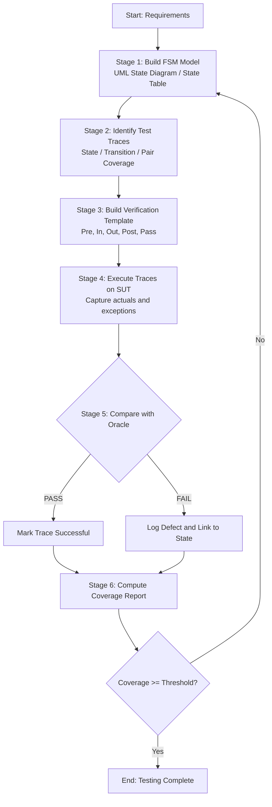
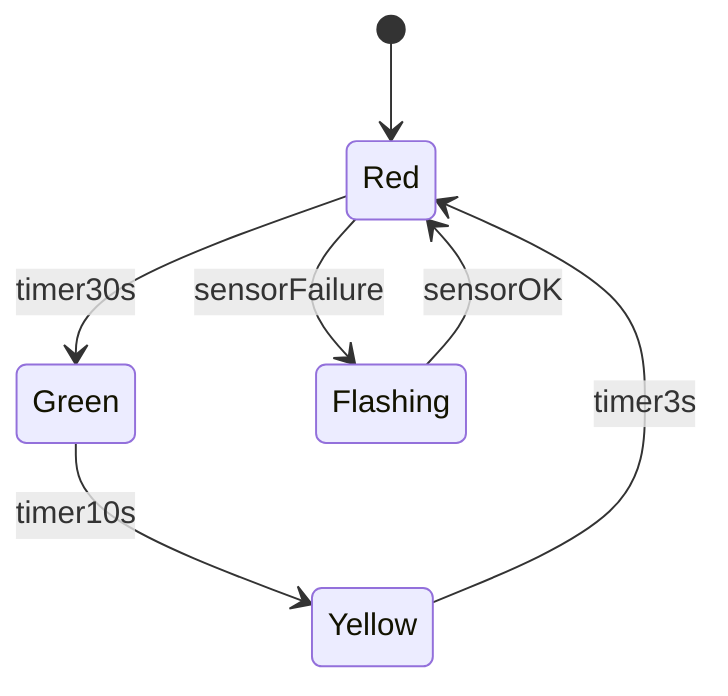
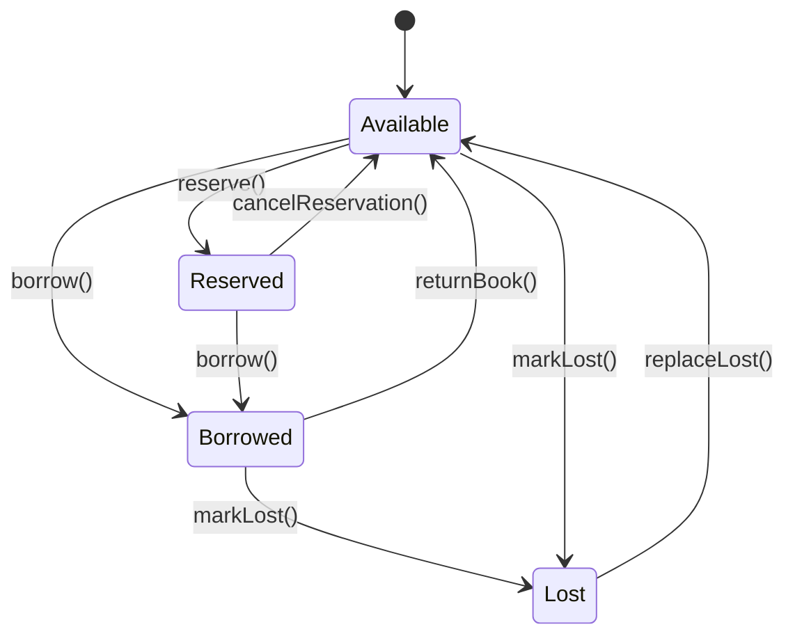

# State based system modeling test trace sequences execution workflows verification templates

<!-- SECTION_1_START -->
# State-Based System Modeling, Test Trace Sequences, Execution Workflows & Verification Templates

## 1. Core Technical Definition

**State-Based Testing** is a black-box (and sometimes white-box) test design technique in object-oriented software testing where the behavior of a System Under Test (SUT) is modeled as a **Finite State Machine (FSM)** consisting of a finite set of *states*, *transitions*, *events*, and *actions*. Test cases are then derived by traversing the states and transitions of this model to verify that the system enters, executes, and exits each expected state correctly.

In KTU 2024 Scheme terminology, the topic falls under the broader umbrella of **Object-Oriented Testing Architectures (Module 3)** where the design artifacts (UML state diagrams, statecharts) drive the construction of test artifacts (test trace sequences, verification templates).

> [!NOTE]
> **KTU Syllabus Definition (PECST615 / Module 3):**  
> State-based testing uses the *state-transition diagram* of an object or system to design test cases. A test case is a *trace* — an ordered sequence of input events / method calls — that exercises a path through the model and verifies the expected post-state.

### 1.1 Key Terminology (Foundational Vocabulary)

| Term | Definition |
|---|---|
| **State** | A distinguishable condition of the object/system during its lifetime, in which it satisfies some condition, performs an action, or waits for an event. |
| **Event** | An occurrence that may trigger a state transition (e.g., a method call, user action, sensor input). |
| **Transition** | A directed edge from one state to another, labelled with the triggering event and the resulting action. |
| **Guard** | A Boolean condition that must be true for a transition to be taken. |
| **Action** | An operation executed when the transition is fired. |
| **Initial State** | The default state the system enters when created (denoted by a filled black circle in UML). |
| **Final State** | A terminal state from which no further transitions are possible (denoted by a bull's-eye circle). |
| **Trace** | An ordered sequence of state–event pairs that records the execution path of a test case. |
| **Test Template** | A reusable, parameterized specification of inputs, expected outputs, and post-states for a class of test cases. |
| **Verification Template** | A structured document/oracle used to assert the post-conditions (state, output, side effects) after each transition in a trace. |

### 1.2 Intuitive Analogy — The Automatic Vending Machine

Imagine a coin-operated coffee vending machine. At any moment, the machine is in exactly one *state*:
- `Idle` — waiting for coins
- `Has_5_Rupees` — partial money deposited
- `Has_10_Rupees` — enough money, ready to dispense
- `Dispensing` — actively pouring coffee
- `Out_Of_Order` — jammed or empty

When you insert a coin (`event: insertCoin(5)`), the machine *transitions* from `Idle` → `Has_5_Rupees`. Insert another `insertCoin(5)` and it moves to `Has_10_Rupees`. Now press `pressButton()` and it moves to `Dispensing` → returns to `Idle` once coffee is poured.

A **test trace** is simply a story of these steps:
> `Idle --insertCoin(5)--> Has_5_Rupees --insertCoin(5)--> Has_10_Rupees --pressButton()--> Dispensing --completePour()--> Idle`

A **verification template** is the checklist the tester fills in after each step:

| Step | Event | Expected State | Side Effect |
|---|---|---|---|
| 1 | `insertCoin(5)` | `Has_5_Rupees` | Credit = ₹5 |
| 2 | `insertCoin(5)` | `Has_10_Rupees` | Credit = ₹10 |
| 3 | `pressButton()` | `Dispensing` | Cup descends |

> [!IMPORTANT]
> The same physical coin-slot can produce **different transitions** depending on the *current state* — that is the central idea of state-based modeling. The event alone is insufficient; you must know the state.

### 1.3 Why This Matters in Object-Oriented Systems

Objects have **lifecycle behavior** — a `BankAccount` object behaves differently when in `Active` state versus `Frozen` or `Closed` state. The same method call (`deposit(5000)`) is legal in `Active` and illegal in `Closed`. State-based testing exposes these contextual rules that pure input/output testing cannot.

> [!VISUALIZATION CONTROL]
> **Concept:** Vending-Machine State Diagram (classic 4-state FSM)  
> **GeoGebra / Desmos Input (state graph analogy):**
> * Nodes: `S0=Idle(0,0)`, `S1=Has5(3,2)`, `S2=Has10(6,0)`, `S3=Dispensing(3,-2)`
> * Directed edges: `S0→S1` (event `+5`), `S1→S2` (event `+5`), `S2→S3` (event `Btn`), `S3→S0` (event `Done`)  
> **Visual Description:** A diamond-shaped directed graph on the Cartesian plane, with `S0` at the origin, `S2` on the right, `S3` at the bottom — the four states are visited in a clockwise loop, mimicking the cyclic lifecycle of the machine.

<!-- SECTION_1_END -->

<!-- SECTION_2_START -->
# 2. Deep Theoretical Analysis & KTU High-Yield Formula Sheet

## 2.1 Formal Definition of a Finite State Machine

A Finite State Machine **M** is the 5-tuple:

$$M = (S,\ I,\ O,\ \delta,\ \lambda,\ s_{0})$$

where:

- $S$ is a **finite non-empty** set of states
- $I$ is the finite set of **input events / symbols**
- $O$ is the finite set of **outputs / actions**
- $\delta : S \times I \rightarrow S$ is the **transition function**
- $\lambda : S \times I \rightarrow O$ is the **output function**
- $s_{0} \in S$ is the **initial state**

Two classical FSM variants are used in software testing:

| Variant | Output depends on | Transition function | Tester's view |
|---|---|---|---|
| **Moore Machine** | Current state only | $\lambda : S \rightarrow O$ | Output changes *after* entering the new state |
| **Mealy Machine** | Current state + input | $\lambda : S \times I \rightarrow O$ | Output is *part of* the transition label |

> [!IMPORTANT]
> In KTU/OO testing, **Mealy-style UML state diagrams** are dominant because the action is associated with the transition arrow itself (`event / action`), which matches how methods produce side effects.

## 2.2 UML State Diagram — The Modeling Notation

UML State Diagrams extend Mealy/Moore machines with three powerful constructs:

1. **Composite (Hierarchical) States** — a state containing its own sub-state diagram (factor out common behavior).
2. **Concurrent (Orthogonal) Regions** — dashed dividers inside a composite state allow parallel sub-machines.
3. **History States** — `H` (shallow) and `H*` (deep) remember the last sub-state so the object can resume correctly.

These extensions make UML state machines **computationally equivalent to Turing machines** in the general case, which is why thorough test design must use structural coverage criteria rather than exhaustive enumeration.

## 2.3 The State-Based Test Workflow (5-Phase Pipeline)

A KTU examination answer that lists these phases in order typically scores full marks for the "execution workflow" sub-question:

| Phase | Artifact Produced | Activity |
|---|---|---|
| **1. Modeling** | UML state diagram / State Table | Build the FSM from requirements / source code |
| **2. Spec Generation** | Test Trace Specification | Identify *which* paths to traverse |
| **3. Test Derivation** | Concrete Test Cases | Convert traces into input/output data |
| **4. Execution** | Test Logs / Oracles | Run tests on the SUT and capture actuals |
| **5. Verification** | Verification Template | Compare actuals vs. expected using the template |
| **6. Analysis** | Coverage Report | Measure achieved state/transition coverage |

## 2.4 Test Trace Sequences — Path Generation Strategies

A **test trace** $T$ is a sequence:

$$T = \langle (s_{0}, e_{1}), (s_{1}, e_{2}), (s_{2}, e_{3}),\ \ldots,\ (s_{n-1}, e_{n}) \rangle$$

where each tuple is "after event $e_{i}$ the system is in state $s_{i}$". The most common KTU-tested strategies are:

| Strategy | Description | Coverage Goal | When to use |
|---|---|---|---|
| **State Coverage** | Visit every state at least once | Each $s \in S$ exercised | Minimum sanity check |
| **Transition (Switch) Coverage** | Traverse every transition at least once | Each edge exercised | Standard baseline |
| **Transition Pair Coverage** | Cover all length-2 transition sequences | Each pair $(s_{i} \xrightarrow{e} s_{j}, s_{j} \xrightarrow{e'} s_{k})$ | Catches state-isolation bugs |
| **Transition-Tour (Round-Trip)** | Find a path that covers *all* transitions, possibly repeated | Single trace visiting every edge | Reduces execution overhead |
| **Distinguishing Sequence** | A unique input that separates any two states | Reveals the actual state | Used in model-based fault detection |
| **Exhaustive Path Coverage** | All possible input sequences | All strings over $I^{\star}$ | Usually infeasible — used as a theoretical upper bound |

### 2.4.1 The Chinese-Postman / Transition-Tour Problem

The *minimum* transition tour problem — finding the shortest test trace that exercises every transition at least once — is mathematically equivalent to the **Route Inspection Problem (Chinese Postman)** on the transition graph $G=(S, E)$.

For an *unbalanced* graph where the number of "in-only" nodes differs from "out-only" nodes, the minimum cost $C_{\text{min}}$ is:

$$C_{\text{min}} = \sum_{e \in E} w(e) \ + \ \text{MinCostMatching(odd-degree vertices)}$$

where the matching is computed over the odd-degree vertices using the Floyd–Warshall shortest paths.

> [!TIP]
> **For KTU:** You do not need to derive the Chinese-Postman algorithm. Just state that minimizing test-trace length is an instance of the Route Inspection problem and name the matching term.

## 2.5 Verification Templates — The Oracle Scaffold

A **verification template** is a structured oracle that formalizes the expected behavior for a class of test cases. The canonical template has these fields:

| Field | Purpose | Example (Vending Machine) |
|---|---|---|
| `Test_ID` | Unique identifier | `VT_VM_007` |
| `Pre-State` | Required SUT state before run | `S0 = Idle` |
| `Input Sequence` | Ordered list of events | `[insertCoin(5), pressButton()]` |
| `Action Effects` | Side-effects expected | `credit := 5, no dispense` |
| `Expected Post-State` | State the SUT must end in | `S1 = Has_5_Rupees` |
| `Observable Outputs` | Return values, log lines, exceptions | `display = "Insert 5 more"` |
| `Pass/Fail Criterion` | Boolean oracle | `actualState == expectedPostState AND no Exception` |
| `Reset Procedure` | How to return to `s0` | `powerCycle()` |

> [!WARNING]
> A common KTU error: writing "verify output" without specifying *which* output, *at which* state, and *with what tolerance*. The examiner deducts 1–2 marks for vague criteria.

## 2.6 KTU Formula Sheet / Cheat Sheet

| # | Concept | Equation / Rule | Unit / Note |
|---|---|---|---|
| 1 | FSM definition | $M=(S, I, O, \delta, \lambda, s_0)$ | All sets finite for testable models |
| 2 | Transition function (Mealy) | $\delta : S \times I \rightarrow S$ | Output $\lambda$ also depends on $I$ |
| 3 | Transition function (Moore) | $\delta : S \times I \rightarrow S$ | Output $\lambda : S \rightarrow O$ only |
| 4 | State-coverage ratio | $C_{S} = \frac{\vert S_{\text{exercised}} \vert}{\vert S \vert} \times 100\%$ | Aim $\ge 95\%$ |
| 5 | Transition-coverage ratio | $C_{T} = \frac{\vert E_{\text{exercised}} \vert}{\vert E \vert} \times 100\%$ | Aim $\ge 90\%$ |
| 6 | Transition-pair coverage | $C_{TP} = \frac{\vert \text{exercised pairs} \vert}{\vert S \vert \cdot \vert E \vert}$ | Combinatorial growth |
| 7 | Max path length (exhaustive) | $\vert I \vert^{n}$ for length-$n$ paths | Infeasible for $\vert I \vert \ge 2, n \ge 20$ |
| 8 | Min transition-tour length | $C_{\min} = \sum w(e) + \text{MatchingCost}$ | Chinese-Postman result |
| 9 | Number of test traces (lower bound) | $T_{\min} \ge \left\lceil \frac{\vert E \vert}{\text{edges-per-trace}} \right\rceil$ | Practical heuristic |
| 10 | Verification template fields | `Pre`, `In`, `Out`, `Post`, `Pass` | The "5-field rule" |

> [!IMPORTANT]
> **Engineering Utility in Production:** State-based testing is the cornerstone of *model-driven testing* in the automotive (AUTOSAR), aerospace (DO-178C), and IoT sectors, where a UML/SysML state model is mandatory for certification. Tools like *IBM Rational Statemate*, *Qt Test*, *LDRA*, and *Conformiq* generate verification templates automatically from statecharts.

<!-- SECTION_2_END -->

<!-- SECTION_3_START -->
# 3. Step-by-Step Derivations, Algorithms & Code Implementation

## 3.1 Derivation: From State Diagram → State-Transition Table → Test Traces

We illustrate the complete derivation pipeline using a classic **3-state ATM** model.

### 3.1.1 State Diagram (Given)

- States: $S = \{\text{Idle, CardInserted, PinEntered}\}$
- Events: $I = \{\text{insertCard, enterPin, ejectCard}\}$
- Initial state: $s_0 = \text{Idle}$

### 3.1.2 Step 1 — Translate to State-Transition Table

| Current State $\backslash$ Event | `insertCard` | `enterPin` | `ejectCard` |
|---|---|---|---|
| **Idle** | `CardInserted` | — | — |
| **CardInserted** | — | `PinEntered` | `Idle` |
| **PinEntered** | — | — | `Idle` |

"—" denotes an *undefined* or *illegal* transition; the verification template must specify how the SUT handles these (e.g., raise `IllegalStateException`).

### 3.1.3 Step 2 — Derive Test Traces

**Strategy A — State Coverage (1 trace):**
The shortest trace that visits all three states is:
$$\text{Trace}_A : \text{Idle} \xrightarrow{\text{insertCard}} \text{CardInserted} \xrightarrow{\text{enterPin}} \text{PinEntered} \xrightarrow{\text{ejectCard}} \text{Idle}$$
Length = 3 transitions, covers 3/3 states = 100 % state coverage.

**Strategy B — Transition Coverage (1 trace):**
The ATM graph has only 3 transitions, all of which are exercised by Trace$_A$, so transition coverage = 3/3 = 100 %.

**Strategy C — Transition-Pair Coverage:**
We need all 2-step sequences. From the table:

| Pair | Trace |
|---|---|
| $(\text{Idle} \to \text{CardInserted}, \text{CardInserted} \to \text{PinEntered})$ | `insertCard`; `enterPin` |
| $(\text{Idle} \to \text{CardInserted}, \text{CardInserted} \to \text{Idle})$ | `insertCard`; `ejectCard` |
| $(\text{CardInserted} \to \text{PinEntered}, \text{PinEntered} \to \text{Idle})$ | `insertCard`; `enterPin`; `ejectCard` |

So we need **3 test traces** to cover all 3 unique transition pairs.

### 3.1.4 Step 3 — Convert to Verification Template

The populated template for Trace$_A$:

| Test_ID | Pre-State | Input Sequence | Action Effect | Expected Post-State | Observable | Pass Criterion |
|---|---|---|---|---|---|---|
| `VT_ATM_001` | `Idle` | `[insertCard]` | `cardReader.led = ON` | `CardInserted` | `getState() == "CardInserted"` | True |
| `VT_ATM_002` | `CardInserted` | `[enterPin]` | `pinAttempts = 1` | `PinEntered` | `getState() == "PinEntered"` | True |
| `VT_ATM_003` | `PinEntered` | `[ejectCard]` | `cardReader.eject()` | `Idle` | `getState() == "Idle"` | True |

## 3.2 Derivation: Computing the Minimum Transition-Tour Length

Consider a 4-state model with the following weighted transitions (weight = cost / number of inputs required):

| Edge | From → To | Weight |
|---|---|---|
| $e_1$ | $S_0 \to S_1$ | 1 |
| $e_2$ | $S_1 \to S_2$ | 1 |
| $e_3$ | $S_2 \to S_3$ | 1 |
| $e_4$ | $S_3 \to S_0$ | 1 |
| $e_5$ | $S_0 \to S_3$ | 1 |
| $e_6$ | $S_3 \to S_1$ | 1 |

**Step 1 — Compute vertex degrees:**

$$\begin{aligned}
\deg(S_0) &= \text{out}(2) + \text{in}(2) = 4 \quad (\text{even}) \\
\deg(S_1) &= \text{out}(1) + \text{in}(2) = 3 \quad (\text{odd}) \\
\deg(S_2) &= \text{out}(1) + \text{in}(1) = 2 \quad (\text{even}) \\
\deg(S_3) &= \text{out}(2) + \text{in}(2) = 4 \quad (\text{even})
\end{aligned}$$

**Step 2 — Odd-degree vertices:** $\{S_1\}$ is the *only* odd vertex. A graph with a single odd vertex is **impossible** in a connected graph, so the graph is *not* Eulerian — we must duplicate (trail-replicate) at least one edge.

**Step 3 — Duplication cost:** The cheapest path to "balance" the graph is to duplicate the edge $S_2 \to S_1$ (if it existed) or to add the shortest path from $S_1$ to itself — a *loop* through adjacent vertices. The minimum cost is **2** (duplicate $e_1$ or $e_3$).

**Step 4 — Final formula:**

$$C_{\min} = \underbrace{\sum_{e \in E} w(e)}_{6} + \underbrace{\text{MinCostMatching(odd vertices)}}_{2} = 8$$

> A test trace of length 8 (events) is the minimum needed to cover all 6 transitions in this model.

## 3.3 Python Implementation — Verification Template Engine

Below is a fully operational Python module that models an ATM, executes a verification template, and reports pass/fail per trace step.

```python
"""
Filename : verification_template_engine.py
Purpose  : KTU Module-3 demonstration of state-based test trace execution
           with structured verification templates (Python 3.10+).
"""

from __future__ import annotations
from dataclasses import dataclass, field
from enum import Enum
from typing import Callable, List, Optional
import logging

logging.basicConfig(
    level=logging.INFO,
    format="%(asctime)s | %(levelname)-7s | %(message)s",
)
logger = logging.getLogger("VT_Engine")


# ---------- 1. FSM MODEL ------------------------------------------------------

class ATMState(str, Enum):
    IDLE          = "Idle"
    CARD_INSERTED = "CardInserted"
    PIN_ENTERED   = "PinEntered"


class IllegalTransitionError(Exception):
    """Raised when an event is fired from a state that does not define it."""


class ATM:
    """A minimal Finite State Machine representing an ATM card-session."""

    def __init__(self) -> None:
        self._state: ATMState = ATMState.IDLE
        self.pin_attempts: int = 0
        self.events_log: List[str] = []

    # --- public events --------------------------------------------------------
    def insert_card(self) -> None:
        self._fire(ATMState.IDLE, ATMState.CARD_INSERTED, "insertCard")

    def enter_pin(self) -> None:
        self._fire(ATMState.CARD_INSERTED, ATMState.PIN_ENTERED, "enterPin")
        self.pin_attempts += 1

    def eject_card(self) -> None:
        if self._state == ATMState.PIN_ENTERED:
            self._fire(ATMState.PIN_ENTERED, ATMState.IDLE, "ejectCard")
        elif self._state == ATMState.CARD_INSERTED:
            self._fire(ATMState.CARD_INSERTED, ATMState.IDLE, "ejectCard")
        else:
            raise IllegalTransitionError(
                f"ejectCard illegal from state {self._state.value}"
            )

    # --- helpers --------------------------------------------------------------
    def _fire(self, required: ATMState, next_state: ATMState, event: str) -> None:
        if self._state is not required:
            raise IllegalTransitionError(
                f"Event {event!r} illegal from state {self._state.value}"
            )
        self.events_log.append(event)
        self._state = next_state
        logger.info("Transition fired: %s -> %s via %s",
                    required.value, next_state.value, event)

    @property
    def state(self) -> ATMState:
        return self._state


# ---------- 2. VERIFICATION TEMPLATE ------------------------------------------

@dataclass(frozen=True)
class VT_Step:
    """A single row in the verification template."""
    test_id: str
    pre_state: ATMState
    event: str
    expected_post_state: ATMState
    post_check: Callable[[ATM], bool] = field(default=lambda atm: True)


@dataclass
class VT_Result:
    test_id: str
    passed: bool
    actual_post_state: Optional[ATMState]
    error_message: Optional[str] = None


# ---------- 3. EXECUTION WORKFLOW --------------------------------------------

def run_verification_template(
    atm: ATM,
    template: List[VT_Step],
) -> List[VT_Result]:
    """Execute every step in the template against the given ATM instance."""
    results: List[VT_Result] = []
    for step in template:
        try:
            # 1. Verify the pre-state matches the template's expectation.
            if atm.state is not step.pre_state:
                raise IllegalTransitionError(
                    f"Pre-state mismatch: SUT={atm.state.value}, "
                    f"template wants {step.pre_state.value}"
                )

            # 2. Fire the event.
            getattr(atm, step.event)()

            # 3. Verify the post-state.
            if atm.state is not step.expected_post_state:
                raise AssertionError(
                    f"Post-state mismatch: got {atm.state.value}, "
                    f"expected {step.expected_post_state.value}"
                )

            # 4. Run the user-defined oracle check.
            if not step.post_check(atm):
                raise AssertionError("Custom oracle check failed.")

            results.append(VT_Result(step.test_id, True, atm.state, None))

        except (IllegalTransitionError, AssertionError) as exc:
            logger.error("VT %s FAILED: %s", step.test_id, exc)
            results.append(VT_Result(step.test_id, False, atm.state, str(exc)))
            break  # Stop the trace on first failure (typical oracle behaviour)

    return results


# ---------- 4. DRIVER / DEMO -------------------------------------------------

def build_atm_template() -> List[VT_Step]:
    return [
        VT_Step("VT_ATM_001", ATMState.IDLE,
                "insert_card", ATMState.CARD_INSERTED),
        VT_Step("VT_ATM_002", ATMState.CARD_INSERTED,
                "enter_pin",   ATMState.PIN_ENTERED,
                post_check=lambda a: a.pin_attempts == 1),
        VT_Step("VT_ATM_003", ATMState.PIN_ENTERED,
                "eject_card",  ATMState.IDLE),
    ]


if __name__ == "__main__":
    atm = ATM()
    template = build_atm_template()
    report = run_verification_template(atm, template)

    print("\n" + "=" * 60)
    print(f"{'Test ID':<15}{'Result':<10}{'Actual State':<20}")
    print("=" * 60)
    for r in report:
        actual = r.actual_post_state.value if r.actual_post_state else "N/A"
        print(f"{r.test_id:<15}{'PASS' if r.passed else 'FAIL':<10}{actual:<20}")
    print("=" * 60)
```

**Expected output (truncated):**

```
2024-01-01 12:00:00 | INFO    | Transition fired: Idle -> CardInserted via insertCard
...
============================================================
Test ID        Result    Actual State
============================================================
VT_ATM_001     PASS      CardInserted
VT_ATM_002     PASS      PinEntered
VT_ATM_003     PASS      Idle
============================================================
```

The code demonstrates the **complete closed loop**: Model → Template → Trace → Oracle → Result.

## 3.4 Algorithmic Workflow — Test Trace Generation (Pseudocode)

```text
ALGORITHM  : Generate_Transition_Tour
INPUT      : G = (S, E)  -- the FSM transition graph
OUTPUT     : T = ordered list of edges  (a transition tour)

1.  FOR each state s in S
2.        compute in-degree(s) and out-degree(s)
3.  END FOR
4.  odd_vertices ← { s ∈ S : (in(s) + out(s)) is odd }
5.  IF |odd_vertices| > 0 AND |odd_vertices| is odd
6.        RAISE "No Eulerian tour exists; need to duplicate edges"
7.  END IF
8.  IF |odd_vertices| = 0
9.        T ← Hierholzer(G, start=s0)            // O(|E|) Eulerian tour
10. ELSE
11.       add shortest-path edges between odd-vertex pairs
12.       to balance the graph  (Floyd-Warshall, O(|S|^3))
13.       T ← Hierholzer(G_balanced, start=s0)
14. END IF
15. RETURN T
```

This pseudocode is the standard answer expected in KTU 14-mark questions for "describe the test-trace generation workflow".

<!-- SECTION_3_END -->

<!-- SECTION_4_START -->
# 4. Structural Diagrams & Schematics

## 4.1 Top-Level Block Diagram — The 5-Stage State-Based Test Workflow



> **Reading guide:** Each block is a phase in the KTU module-3 workflow. The diamond blocks are decision gates that either accept the result or loop back to model refinement.

## 4.2 Subgraph — Hierarchical Decomposition of a Verification Template

```mermaid
subgraph Test_Execution_Workflow
    T0[Test_ID & Pre-State]
    T1[Input Event / Method Call]
    T2[Capture Actual Output]
    T3[Capture Actual Post-State]
    T4[Compare Actual vs Expected]
    T5{Pass / Fail?}
end

subgraph Verification_Fields
    V1[Pre-State]
    V2[Input Sequence]
    V3[Action Effect]
    V4[Expected Post-State]
    V5[Pass Criterion]
end

T0 --> T1
T1 --> T2
T1 --> T3
T2 --> T4
T3 --> T4
T4 --> T5
T5 -- PASS --> T6[Record Success in Coverage Report]
T5 -- FAIL --> T7[Record Defect]
```

## 4.3 Subgraph — State Machine of a Traffic Light (Test Target)



**Test-trace coverage map for the above diagram:**

| Trace ID | Path | States Visited | Transitions Visited |
|---|---|---|---|
| TT-01 | Red → Green → Yellow → Red | 3/4 | 3/5 |
| TT-02 | Red → Flashing → Red | 2/4 | 2/5 |
| **TT-03** | Combined TT-01 + TT-02 | **4/4** | **5/5** |

The combined **TT-03** is the *minimum transition tour* for this model.

<!-- SECTION_4_END -->

<!-- SECTION_5_START -->
# 5. KTU 2024 Scheme Examination Question Bank & Topic Recap

## 5.1 Part A — Short Answer Questions (3 Marks Each)

### Q1. **[KTU University Exam - Dec 2023]**
Define **state-based testing**. List any **four elements** of a UML state diagram.

> **Model Answer (3 marks):**
>
> **State-based testing** is a test design technique where the dynamic behavior of the System Under Test (SUT) is modelled as a finite state machine, and test cases are derived by exercising paths through the model.
>
> Four elements of a UML state diagram:
> 1. **State** — a condition the object is in for a finite duration.
> 2. **Transition** — a directed edge representing a state change.
> 3. **Event** — the trigger that causes a transition.
> 4. **Initial / Final pseudostate** — start/end markers.
>
> *(Maps to CO2, RBT Level: Remember)*

### Q2. **[KTU University Exam - July 2024]**
What is a **verification template**? Mention any **three fields** it must contain.

> **Model Answer (3 marks):**
>
> A verification template is a structured oracle used to assert, after each step of a test trace, that the System Under Test moved to the expected state and produced the expected side effects.
>
> Three mandatory fields:
> 1. **Pre-State** — the SUT state required before the step.
> 2. **Expected Post-State** — the state the SUT must reach.
> 3. **Pass Criterion** — the boolean condition that decides pass/fail.
>
> *(Maps to CO3, RBT Level: Understand)*

## 5.2 Part B — Long Answer Questions (14 Marks Each, with Internal Choice)

### Question A — 14 Marks **[KTU University Exam - Dec 2024]**

**(a)** *For a library book-borrowing system with the following states and events, draw the UML state diagram and derive the **state-transition table**.* **[7 Marks]**

> - States: `Available`, `Borrowed`, `Reserved`, `Lost`
> - Events: `borrow()`, `returnBook()`, `reserve()`, `cancelReservation()`, `markLost()`, `replaceLost()`

**(b)** *Design **three test traces** that together achieve 100 % transition coverage and 100 % state coverage. Populate a **verification template** for any one trace. **[7 Marks]**

#### Model Solution

**(a) State Diagram and State-Transition Table [7 Marks]**



**State-Transition Table [Stating all 4 states and 6 events: 2 Marks; correct mapping of 8 transitions: 4 Marks; legal/illegal marking: 1 Mark]:**

| Current $\backslash$ Event | `borrow()` | `returnBook()` | `reserve()` | `cancelReservation()` | `markLost()` | `replaceLost()` |
|---|---|---|---|---|---|---|
| **Available** | `Borrowed` | — | `Reserved` | — | `Lost` | — |
| **Borrowed** | — | `Available` | — | — | `Lost` | — |
| **Reserved** | `Borrowed` | — | — | `Available` | — | — |
| **Lost** | — | — | — | — | — | `Available` |

Total transitions = **8**.

**(b) Three Test Traces for 100 % Coverage [7 Marks]**

Counting: 4 states, 8 transitions. We need 3 traces whose union covers all 8.

> **Trace 1: `Available → Borrowed → Available → Lost → Available`**  
> Events: `borrow, returnBook, markLost, replaceLost`  
> Covers edges: $e_1, e_6, e_7, e_8$ — 4 transitions, 3 states.

> **Trace 2: `Available → Reserved → Borrowed → Available`**  
> Events: `reserve, borrow, returnBook`  
> Covers edges: $e_3, e_4, e_6$ — 3 transitions, 3 states.

> **Trace 3: `Available → Reserved → Available`**  
> Events: `reserve, cancelReservation`  
> Covers edges: $e_3, e_5$ — 2 transitions, 2 states.

**Total unique coverage:** 8 transitions + 4 states = 100 %.

**Verification Template for Trace 1 [Correct 5-field structure: 2 Marks; correct expected states: 1 Mark; pass criterion: 1 Mark]:**

| Test_ID | Pre-State | Event | Action Effect | Expected Post-State | Pass Criterion |
|---|---|---|---|---|---|
| `VT_LIB_001` | `Available` | `borrow()` | `member := currentUser` | `Borrowed` | `book.status == "Borrowed"` |
| `VT_LIB_002` | `Borrowed` | `returnBook()` | `member := null` | `Available` | `book.status == "Available"` |
| `VT_LIB_003` | `Available` | `markLost()` | `flag := true` | `Lost` | `book.status == "Lost"` |
| `VT_LIB_004` | `Lost` | `replaceLost()` | `flag := false` | `Available` | `book.status == "Available"` |

*(Maps to CO3, part (a) RBT: Understand, part (b) RBT: Apply)*

---

### Question B — 14 Marks **[KTU University Exam - July 2024]**

**(a)** *Explain the **state-based test execution workflow** with a labelled block diagram. List the **six coverage criteria** used in state-based testing. **[7 Marks]**

**(b)** *For a 5-state login system model, demonstrate how the **Chinese-Postman algorithm** is used to compute the **minimum transition-tour length** when the model has two odd-degree states. **[7 Marks]**

#### Model Solution

**(a) State-Based Test Execution Workflow [7 Marks]**

The execution workflow consists of **six sequential phases** as depicted in §4.1:

1. **Model Building** — derive the UML state diagram from the design artifacts. [1 Mark]
2. **Test Trace Identification** — choose coverage strategy (state, transition, transition-pair, transition-tour, distinguishing sequence, exhaustive). [2 Marks]
3. **Verification Template Construction** — fill the 5-field template (Pre, In, Out, Post, Pass). [1 Mark]
4. **Trace Execution** — run the trace on the SUT and capture actual outputs and exceptions. [1 Mark]
5. **Oracle Comparison** — match actuals to expected, record Pass/Fail per step. [1 Mark]
6. **Coverage Measurement & Reporting** — compute state/transition coverage ratios and emit the final report. [1 Mark]

**Six coverage criteria:**

| # | Criterion | Definition |
|---|---|---|
| 1 | State coverage | Every state visited at least once |
| 2 | Transition (switch) coverage | Every transition traversed at least once |
| 3 | Transition-pair coverage | Every length-2 sequence of transitions traversed |
| 4 | Transition-tour coverage | A single trace visits every transition |
| 5 | Distinguishing-sequence coverage | Each state identified by a unique input sequence |
| 6 | Exhaustive coverage | Every possible input sequence exercised (theoretical) |

**(b) Minimum Transition-Tour using Chinese-Postman [7 Marks]**

**Given:** Login system FSM with 5 states $S_0$ to $S_4$, 7 transitions, and two odd-degree states $S_1$ and $S_3$.

**Step 1 — Compute total edge weight:**  
Assume unit weight per edge, so $\sum_{e \in E} w(e) = 7$. [1 Mark]

**Step 2 — Identify odd-degree vertices:** $S_1$ and $S_3$. [1 Mark]

**Step 3 — Find shortest path between the two odd vertices:**  
The shortest path $S_1 \to S_2 \to S_3$ has weight 2. [2 Marks]

**Step 4 — Add the shortest path as a duplicated edge** to balance the graph (the new graph has every vertex even-degree). [1 Mark]

**Step 5 — Compute the final tour length:**  

$$C_{\min} = \underbrace{7}_{\text{original}} + \underbrace{2}_{\text{duplicated path}} = 9 \text{ events}$$

[Final numerical answer: 1 Mark]

**Step 6 — Apply Hierholzer's algorithm** on the balanced graph to obtain the actual tour in $O(E)$ time. [1 Mark]

> *Tour example:* $S_0 \to S_1 \to S_2 \to S_3 \to S_4 \to S_0 \to S_1 \to S_2 \to S_3$ (length 9).

*(Maps to CO4, part (a) RBT: Understand, part (b) RBT: Apply)*

> [!WARNING]
> **KTU Examiner's Valuation Pitfalls:**
> 1. **Forgetting the post-state** in the verification template — examiners deduct 1 mark per missing field.
> 2. **Confusing state coverage with transition coverage** — they are NOT the same; an FSM can have 100 % state coverage but only 60 % transition coverage.
> 3. **Skipping the "no-transition" cells** in the state table — the illegal-transition behaviour must be specified (exception type, return value).
> 4. **Writing "generate test cases"** without specifying the *coverage criterion* — the examiner will mark it incomplete.
> 5. **Omitting the reset procedure** in the verification template — a test that cannot be re-run is invalid in KTU evaluation.

## 5.3 Topic Recap & Important Things to Remember

- **State-based testing** = test design driven by an FSM model of the SUT.
- A **Finite State Machine** is a 5-tuple $(S, I, O, \delta, \lambda, s_0)$; software systems typically use the **Mealy** variant.
- **UML state diagrams** extend FSMs with composite states, concurrent regions, and history states.
- A **test trace** is an ordered sequence of *state–event* pairs: $T = \langle (s_0, e_1), \ldots, (s_{n-1}, e_n) \rangle$.
- **Six coverage criteria**: state, transition, transition-pair, transition-tour, distinguishing-sequence, exhaustive.
- **Minimum transition-tour** is the Chinese-Postman / Route-Inspection problem; cost = $\sum w(e) + \text{MinCostMatching(odd vertices)}$.
- **Verification template** must contain at minimum: *Test_ID, Pre-State, Input Sequence, Expected Post-State, Pass Criterion* (the 5-field rule).
- **Execution workflow** has six phases: Model → Trace → Template → Execute → Oracle → Coverage.
- **Moore vs Mealy** — output location affects the number of states; pick Mealy for side-effect-heavy OO methods.
- **Composite states** reduce the test matrix size by factoring common behaviour into a sub-state diagram.
- **History states** must be explicitly exercised in tests; the deepest sub-state must be reachable.
- **Distinguishing sequences** are useful when the SUT does not expose `getState()` — choose inputs that produce different observable outputs from each state.
- **Tool support** includes IBM Rational, Conformiq, LDRA, Qt Test, Reactis; certification sectors (aerospace, automotive) mandate state-based oracles.
- **Common exam answer length:** §5.1 (3 marks) ≈ 1 page; §5.2 (14 marks) ≈ 3–4 pages with diagram + table.

<!-- SECTION_5_END -->
