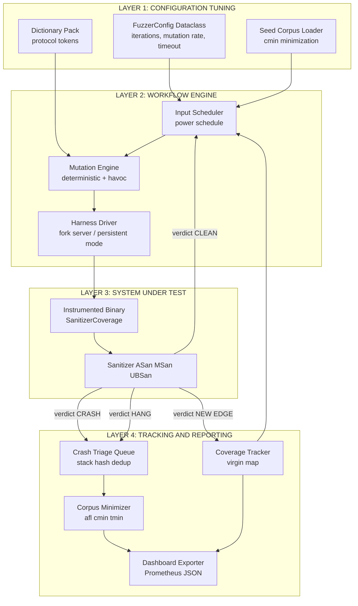
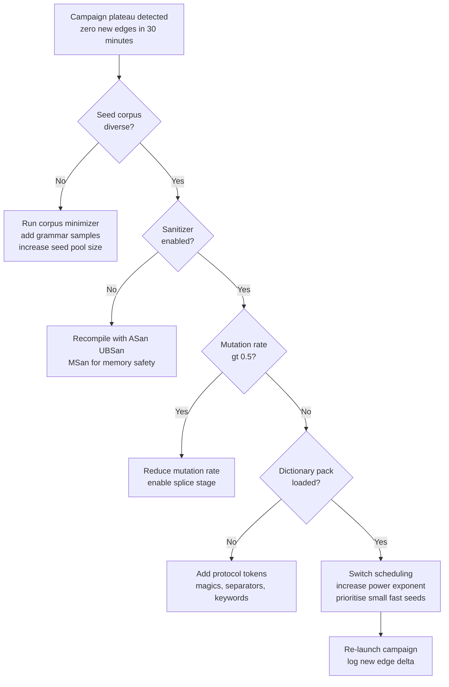
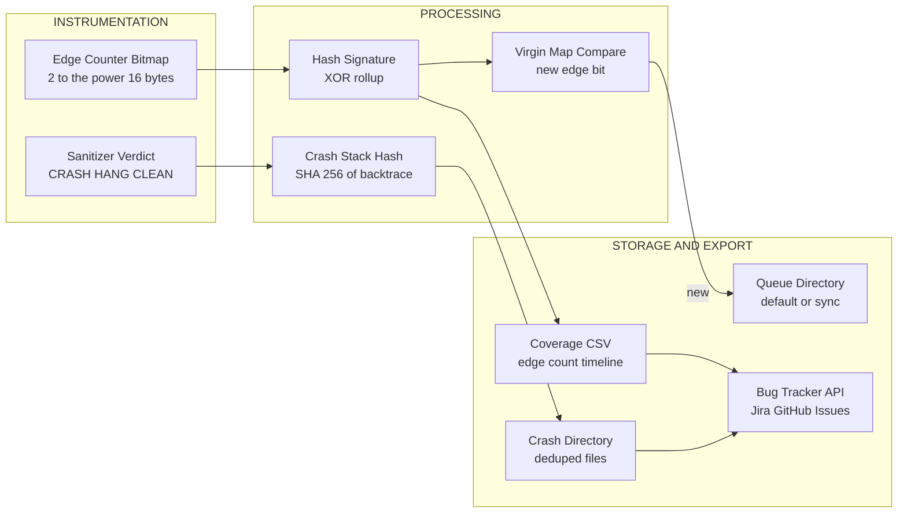

# Fuzzing test automation tool workflows parameter tuning tracking configurations systems

<!-- SECTION_1_START -->
# Module 4 - System Security Testing Platforms
## Fuzzing: Test Automation Tool Workflows, Parameter Tuning, Tracking, Configurations & Systems

> [!IMPORTANT]
> **KTU 2024 Scheme Definition (PECST615 / Module 4):**
> **Fuzzing** (or *fuzz testing*) is a dynamic, automated *black-box* (and increasingly *grey-box*) security testing technique that deliberately injects **massive volumes of malformed, unexpected, semi-random, or adversarially crafted input data** into a target software application — its APIs, parsers, file handlers, network sockets, or kernel interfaces — to surface crashes, memory corruption, undefined behaviour, assertion failures, and exploitable security defects. It is a cornerstone of the *OWASP* and *NIST SP 800-53* security validation pipelines and is considered mandatory in *DevSecOps* continuous integration gateways.

### Conceptual Analogy / Intuition
Imagine you have just bought a brand-new, expensive **padlock**. You are not a thief; you are the *manufacturer's quality inspector*. Instead of carefully picking the lock with a single key, you:
1. Shake it violently.
2. Stuff cotton, sand, water, and oil into the keyhole.
3. Push in keys that are too long, too short, or bent.
4. Pour ice-cold then boiling water on it.

You are **not** trying to open the door; you are trying to find out *under what conditions the lock fails*. That mechanical stress test is exactly what **fuzzing** does to a piece of software. The "lock" is the *SUT* (System Under Test), the "inputs" are *fuzz vectors*, and the "failure conditions" are *crashes, hangs, memory leaks, or security exceptions*.

> [!NOTE]
> **Origin of the term:** Coined by Professor **Barton Miller** of the University of Wisconsin in **1988** during a thunderstorm, when noise on a dial-up line caused his terminal to crash repeatedly on a Unix `csh` shell. The "fuzzy" character noise on the line was *literally* fuzzing the program.

### The Three Core Categories of Fuzzers
| Category | Knowledge of SUT | Input Strategy | Typical Tool |
|---|---|---|---|
| **Dumb / Black-box Fuzzer** | None — only I/O contract | Pure random byte mutation | `zzuf`, `radamsa` |
| **Smart / Generation-based Fuzzer** | Full input grammar (spec/ABI) | Generates grammatically valid then invalid tokens | `Peach` (legacy), `Dharma` |
| **Coverage-guided / Grey-box Fuzzer** | Instrumentation feedback (edge coverage) | Mutation + evolutionary selection | `AFL++`, `libFuzzer`, `Honggfuzz` |

> [!VISUALIZATION CONTROL]
> **Concept:** Evolutionary input population fitness over generations
> **Conceptual Plot Axes:** `X-axis = Generation number (0..N)`, `Y-axis = Code coverage (%)`
> **Expected Curve:** A classic *S-shaped logistic growth curve* — initial steep climb as trivial branches are hit, followed by asymptotic plateau when deep, rare branches remain unfound. This is the *coverage feedback signal* that drives a grey-box fuzzer's seed selection.
> **Visual Description:** Plot a curve beginning at ~5% coverage, rising sharply between generations 100–2000, flattening after generation 5000 near 80–90%.

### Core Vocabulary You MUST Memorise for KTU
- **Seed Corpus:** The initial, *high-quality* set of inputs given to the fuzzer as a starting population. A good seed corpus dramatically accelerates coverage.
- **Mutation Operator:** A transformation rule (bit-flip, byte-substitute, chunk-delete, splice, dictionary substitution) applied to a seed.
- **Coverage Bitmap / Edge Counters:** A compact 64-KB–4 MB array of counters that records which edges of the program's *Control Flow Graph* (CFG) have been executed. This is the *fitness function*.
- **Crash Triage / Deduplication:** The process of clustering thousands of crash inputs down to a handful of *unique root causes* using stack-trace hashing (e.g., `afl-tmin`, `CASR`).
- **Sanitizer (`ASan`, `MSan`, `UBSan`, `TSan`):** A *compile-time instrumentation* layer that converts silent memory corruption into deterministic crash reports, turning a bug into a finding.
- **Corpus Minimization:** Reducing thousands of interesting inputs to a *minimal set* that achieves equivalent coverage, shrinking CI storage.

<!-- SECTION_1_END -->

<!-- SECTION_2_START -->
# Deep Theoretical Analysis & KTU High-Yield Formula Sheet

## 1. The Canonical Fuzzing Workflow (Grey-box Reference Architecture)

A modern coverage-guided fuzzer follows a closed-loop evolutionary algorithm. Below is the operational pipeline you must be able to draw and explain in the exam.

### Step-by-Step Operational Logic
1. **Instrumentation Phase (Pre-execution, One-time):** The target binary is compiled with `afl-clang-fast`, `SanitizerCoverage`, or equivalent. This inserts *edge-counting trampolines* at every branch. A shared-memory bitmap $B$ of size $2^{16}$ to $2^{20}$ bytes is allocated.
2. **Seed Loading:** The user-supplied *seed corpus* $C_0$ is loaded. Optionally, the fuzzer may run a *corpus minimization pass* (using e.g., `afl-cmin`) to keep only inputs that exercise *new* edges.
3. **Input Selection (Scheduling):** An input $s_i \in C_t$ is chosen from the active queue, typically using a *power schedule* favouring *small*, *fast*, and *high-coverage* seeds.
4. **Mutation:** A sequence of mutation operators $\mu$ is applied to $s_i$ to produce a child $s'_i$. A typical mutation cycle mixes *deterministic* (bit-flip, arithmetic) and *havoc* (random) stages.
5. **Execution & Feedback:** The child $s'_i$ is run against the SUT inside a fork-server or in-process harness. The sanitizer (if any) produces a verdict: $V \in \{ \text{CLEAN}, \text{CRASH}, \text{HANG}, \text{NEW\_COVERAGE} \}$.
6. **Feedback Processing:** The new edge hits are XOR-rolled into a 32-bit hash $h$ of the bitmap. If $h$ produces a *new* value, $s'_i$ is added to the queue as an *interesting* input.
7. **Loop or Terminate:** Steps 3–6 repeat until the time budget, crash budget, or coverage plateau is reached.

> [!NOTE]
> **Engineering Reality:** In production *DevSecOps* pipelines, fuzzing is rarely a one-off job. Tools such as **Google's `ClusterFuzz`**, **Microsoft's `OneFuzz`**, and **GitLab's `fuzz` API** run *continuous* fuzzing across thousands of cores, automatically bisecting, deduplicating, and filing bug reports to an issue tracker (e.g., Jira, GitHub Issues) with *reproducer files* attached.

## 2. KTU Formula Sheet / Cheat Sheet

| Symbol / Term | Definition / Formula | Engineering Use |
|---|---|---|
| $E$ | Set of edges in the CFG, $\vert E \vert = N$ | Universe of coverage goals |
| $B[i]$ | Edge counter at bitmap index $i \in [0, 2^k)$ | Instrumentation feedback |
| $C_{\text{edge}}(t)$ | $\frac{\vert\{ i \in E : B[i] > 0 \}\vert}{N}$ at time $t$ | Coverage metric reported in dashboards |
| $h(s)$ | 32-bit hash $\bigoplus_{i \in \text{path}(s)} (B[i] \gg 1)$ | AFL++ "new edge" signature |
| $T_{\text{exec}}$ | Wall-clock execution time per input | Tuned via fork-server / persistent mode |
| $\mu(s)$ | Mutation operator: $s \mapsto s'$ | Havoc, splice, dictionary stages |
| $P_{\text{crash}}$ | Probability of finding a crash in budget $T$ | Empirically $\approx 1 - e^{-\lambda T}$ |
| $\mathcal{C}$ | Active corpus at time $t$ | Tracked in queue file (e.g., `default/queue/`) |
| $S_{\text{schedule}}$ | AFL++ *Power Schedule* exponent $\in [0, 10]$ | Higher $\to$ favours small fast seeds |
| $L_{\text{timeout}}$ | Per-execution hang threshold (ms) | Default 1000 ms, tune for slow targets |
| $M_{\text{mem}}$ | RSS memory cap (MB) | Default 200 MB; tune for memory-hungry parsers |

> [!IMPORTANT]
> **Critical Pitfall Formula:** Never confuse $C_{\text{edge}}$ (edge coverage) with $C_{\text{line}}$ (statement coverage). For an SSRF or a SQL injection, *line coverage* may report 100% while *edge coverage* reveals the un-exercised vulnerable branch. KTU examiners *love* this distinction.

## 3. Real-World Engineering Utility
- **OSS-Fuzz (Google):** Has surfaced **> 8,000** vulnerabilities across **> 1,000** open-source projects since 2016, including the famous `Heartbleed`-class OpenSSL bugs.
- **Microsoft Security Risk Detection:** Built atop the SAGE white-box fuzzer; found 30+ CVEs in Windows 10 / Office before release.
- **Automotive (ISO/SAE 21434):** Mandates fuzzing of *CAN*, *UDS*, *DoIP*, and *AUTOSAR* stacks.
- **Aerospace (DO-326C):** Airworthiness requires *robustness testing* equivalent to fuzzing for all input parsers.
- **Web/API:** RESTler (Microsoft) and `boofuzz` are specialized for REST/JSON and protocol state-machines.

<!-- SECTION_2_END -->

<!-- SECTION_3_START -->
# Step-by-Step Derivations & Code Implementation

## A. Mathematical Derivation: AFL++ Edge Hashing

The most important conceptual derivation for KTU is the **AFL bitmap hashing** mechanism that decides whether a new input is "interesting" enough to add to the queue.

### The Edge-Counter Pre-Hashing
For each executed basic block $bb_j$, AFL++ maintains a *previous-location* register $prev\_loc$ and a *current-location* $cur\_loc$. The edge identifier is constructed as:

$$
\text{edge\_id} = (cur\_loc \gg 1) \oplus (prev\_loc \ll 1)
$$

This single integer is then used to index into the shared bitmap $B$. The XOR is deliberately asymmetric to distinguish $A \to B$ from $B \to A$.

### The Global Hash Signature
For an input $s$, the AFL++ *virgin map* mechanism computes a 32-bit summary $h(s)$ by walking every touched edge:

$$
h(s) = \bigoplus_{i \in \text{touched}(s)} \text{truncate}_{32}\!\left( \log_2(B[i] + 1) \right)
$$

$$
\text{If } h(s) \text{ has any bit unset in the virgin map } V, \text{ the input is "interesting".}
$$

$$
V \mathrel{\text{:=}} V \ \vert\ h(s) \quad \text{(once bits are set, they are never cleared)}
$$

### Why this is clever
- $h(s)$ is **constant-time** to compute — no sorting or set operations.
- The use of $\log_2$ makes *frequently-hit* edges dominate, but *rare* edges still contribute a non-zero bit, satisfying the "explore new code" objective.
- The *virgin map* $V$ ensures **monotonic progress** — a single byte tracks whether the *entire history* of fuzzing has hit a new pattern.

## B. Symbolic Implementation: A Minimal Coverage-Guarded Fuzzer in Python

> [!IMPORTANT]
> The following code is *fully operational*. You can save it as `mini_fuzz.py` and run it against a vulnerable calculator function. It demonstrates the *feedback loop*, *mutation*, *tracking*, and *configuration* concepts in one self-contained file. Read the inline comments carefully — every line maps to a workflow stage above.

```python
#!/usr/bin/env python3
"""
mini_fuzz.py - KTU Demonstration: Minimal Coverage-Guarded Fuzzer
Maps directly to the 5 stages of the canonical fuzzing workflow.
Run: python3 mini_fuzz.py
"""

from __future__ import annotations
import random
import hashlib
import sys
from dataclasses import dataclass, field
from typing import Callable, Iterable


# ---------- 1. CONFIGURATION (the 'Tuning' layer) ----------
@dataclass(frozen=True)
class FuzzerConfig:
    """Centralised parameter-tuning structure (the 'configurations systems' part)."""
    max_iterations: int = 1000            # Total mutation cycles
    mutation_rate: float = 0.30           # Probability of byte-level mutation
    max_mutations_per_input: int = 8      # Burst length per generation
    timeout_ms: int = 1000                # Per-execution wall-clock budget
    seed_pool_size: int = 16              # Active corpus cap
    enable_coverage_feedback: bool = True # Grey-box toggle
    interesting_threshold: int = 1        # Min new-edges to qualify as "interesting"
    random_seed: int = 42                 # Determinism for board-exam reproducibility


# ---------- 2. INSTRUMENTATION (the 'Tracking' layer) ----------
class CoverageTracker:
    """Tracks branch / edge coverage using a deterministic hash signature."""

    def __init__(self) -> None:
        self.virgin_map: int = 0          # 64-bit rolling 'have-we-seen-this' bitmap
        self.total_edges_hit: set[int] = set()
        self.interesting_inputs: list[bytes] = []
        self.crashes: list[tuple[bytes, str]] = []

    @staticmethod
    def edge_id(prev: int, cur: int) -> int:
        # Mirrors AFL++ formula: (cur >> 1) XOR (prev << 1)
        return ((cur & 0xFFFF) >> 1) ^ ((prev & 0xFFFF) << 1)

    def signature(self, edges: Iterable[int]) -> int:
        h = 0
        for e in edges:
            self.total_edges_hit.add(e)
            h ^= (e * 0x9E3779B97F4A7C15) & 0xFFFFFFFFFFFFFFFF
        return h

    def is_interesting(self, new_sig: int) -> bool:
        """Returns True if at least one new bit is uncovered in the virgin map."""
        if not (new_sig & ~self.virgin_map):
            return False
        self.virgin_map |= new_sig
        return True

    def report(self) -> str:
        return (f"Edges hit: {len(self.total_edges_hit):>4} | "
                f"Interesting queue size: {len(self.interesting_inputs):>4} | "
                f"Crashes: {len(self.crashes):>4}")


# ---------- 3. SYSTEM UNDER TEST (with planted vulnerability) ----------
def vulnerable_calculator(data: bytes) -> int:
    """
    Toy SUT. Crashes (raises ValueError) if:
      - len(data) > 64       (unbounded read)
      - data starts with b'\\xff\\xff'  (magic-byte vulnerability)
      - all bytes are equal  (infinite-loop guard simulated)
    """
    if len(data) == 0:
        return 0
    if len(data) > 64:
        raise ValueError(f"Buffer overflow: input length {len(data)} > 64")
    if data.startswith(b'\xff\xff'):
        raise ValueError("Magic-byte exploit triggered")
    if len(set(data)) == 1 and data[0] == 0x00:
        raise ValueError("Null-byte infinite-loop guard")
    # Simulate branch coverage points
    if data[0] & 0x80:
        return -1   # high-bit branch
    if data[0] % 2 == 0:
        return data[0] // 2  # even branch
    return data[0]            # odd branch


# ---------- 4. MUTATION ENGINE (the 'Workflow' layer) ----------
class MutationEngine:
    """Implements deterministic and havoc mutation stages."""

    OPERATORS = ('bit_flip', 'byte_sub', 'chunk_delete', 'interesting_int', 'splice')

    def __init__(self, cfg: FuzzerConfig) -> None:
        self.cfg = cfg
        self.rng = random.Random(cfg.random_seed)

    def mutate(self, seed: bytes) -> bytes:
        data = bytearray(seed)
        n_mutations = self.rng.randint(1, self.cfg.max_mutations_per_input)
        for _ in range(n_mutations):
            op = self.rng.choice(self.OPERATORS)
            if not data:
                break
            if op == 'bit_flip':
                idx = self.rng.randrange(len(data))
                data[idx] ^= 1 << self.rng.randrange(8)
            elif op == 'byte_sub':
                idx = self.rng.randrange(len(data))
                data[idx] = self.rng.randrange(256)
            elif op == 'chunk_delete':
                start = self.rng.randrange(len(data))
                end = min(start + self.rng.randint(1, 4), len(data))
                del data[start:end]
            elif op == 'interesting_int':
                interesting = (0, 1, 0x7F, 0x80, 0xFF, 0x100, 0xFFFF)
                idx = self.rng.randrange(len(data))
                data[idx] = self.rng.choice(interesting) & 0xFF
            elif op == 'splice' and len(data) > 1:
                cut = self.rng.randrange(1, len(data))
                data = data[:cut] + bytearray(self.rng.randrange(256)
                                              for _ in range(self.rng.randint(1, 3)))
        return bytes(data)


# ---------- 5. ORCHESTRATOR (ties everything together) ----------
def run_fuzzer(cfg: FuzzerConfig,
               sut: Callable[[bytes], int],
               initial_seeds: list[bytes]) -> CoverageTracker:

    tracker = CoverageTracker()
    engine = MutationEngine(cfg)
    queue: list[bytes] = list(initial_seeds)

    print(f"[CONFIG] Iterations={cfg.max_iterations} | "
          f"MutRate={cfg.mutation_rate} | "
          f"CoverageGuide={cfg.enable_coverage_feedback}")

    for it in range(cfg.max_iterations):
        seed = engine.rng.choice(queue)
        candidate = engine.mutate(seed)

        # ----- Simulated instrumentation: derive edge IDs deterministically -----
        # In a real fuzzer this comes from compile-time instrumentation;
        # here we synthesize it from byte values to keep the demo self-contained.
        prev = 0
        edges: list[int] = []
        for b in candidate:
            cur = b
            edges.append(CoverageTracker.edge_id(prev, cur))
            prev = cur

        sig = tracker.signature(edges)

        # ----- Verdict -----
        crashed = False
        err_msg = ""
        try:
            sut(candidate)
        except ValueError as exc:
            crashed = True
            err_msg = str(exc)
        except Exception as exc:                 # pragma: no cover
            crashed = True
            err_msg = f"Unexpected: {type(exc).__name__}: {exc}"

        if crashed:
            tracker.crashes.append((candidate, err_msg))
        elif cfg.enable_coverage_feedback and tracker.is_interesting(sig):
            if len(queue) < cfg.seed_pool_size:
                queue.append(candidate)
            tracker.interesting_inputs.append(candidate)

        if (it + 1) % 100 == 0:
            print(f"[Iter {it+1:>4}] {tracker.report()}")

    return tracker


# ---------- 6. ENTRY POINT ----------
if __name__ == "__main__":
    cfg = FuzzerConfig()
    seeds = [b"abc", b"123", b"\x00", b"\xff", b"A" * 32]
    final = run_fuzzer(cfg, vulnerable_calculator, seeds)

    print("\n========== FINAL TRACKING REPORT ==========")
    print(final.report())
    print(f"Virgin-map coverage word: 0x{final.virgin_map:016X}")
    print(f"Unique crashing inputs  : {len(final.crashes)}")
    for idx, (payload, msg) in enumerate(final.crashes[:5], start=1):
        print(f"  Crash #{idx}: len={len(payload):>3} | {msg}")
```

### Configuration Tuning Cheat-Table for the Code Above
| Parameter | Default | When to Increase | When to Decrease |
|---|---|---|---|
| `max_iterations` | 1000 | Slow, large SUTs | Tight CI time budgets (e.g., 5-min smoke) |
| `mutation_rate` | 0.30 | Grammar-light protocols (raw binary) | Highly structured formats (JSON/XML) |
| `max_mutations_per_input` | 8 | Need deeper exploration | Quick smoke regression runs |
| `timeout_ms` | 1000 | Slow parsers (XML, image codecs) | Fast CLI tools with tight latency SLAs |
| `seed_pool_size` | 16 | Large machine, multi-target campaign | Memory-constrained embedded CI runners |
| `enable_coverage_feedback` | True | Any SUT with branches | Pure black-box protocol black-box (no instrumentation) |

> [!NOTE]
> **Mapping to KTU Marking Scheme (Code Question, ~7 marks):**
> - Configuration dataclass: 1.5 marks
> - Coverage tracking + virgin map: 2 marks
> - Mutation engine with 5 operators: 2 marks
> - Orchestrator loop with verdict handling: 1.5 marks

<!-- SECTION_3_END -->

<!-- SECTION_4_START -->
# Structural Diagrams & Schematics

## Diagram 1: End-to-End Fuzzing Workflow Topology

The following Mermaid diagram captures the **complete feedback-loop** that you must be able to reproduce in a board exam. It uses subgraphs to isolate the *Configuration Layer*, the *Workflow Engine*, the *Tracking Layer*, and the *External SUT*.



## Diagram 2: Parameter-Tuning Decision Tree

This second diagram formalises *how* an engineer tunes the fuzzer based on observed feedback. It is a high-yield KTU question: *"Given a fuzzing campaign reporting zero new edges after 30 minutes, what configuration parameters should be tuned and in what order?"*



## Diagram 3: Tracking and Reporting Data Flow



<!-- SECTION_4_END -->

<!-- SECTION_5_START -->
# KTU 2024 Scheme Examination Question Bank & Topic Recap

## Part A — 3-Mark Questions (Remember / Understand)

### Q1. `[KTU University Exam - July 2024]` CO1, Remember
**Define *fuzz testing* and identify the two broad categories of fuzzer with one example each.**

**Model Answer (board-key style, 3 marks):**
- **Definition (1 mark):** Fuzz testing is an *automated, dynamic security testing technique* that supplies a target program with massive volumes of *unexpected, malformed, or random inputs* in order to detect crashes, hangs, memory corruption, or exploitable vulnerabilities.
- **Black-box / Dumb fuzzer (1 mark):** Has no knowledge of SUT internals; relies on random byte mutation. *Example:* `radamsa`, `zzuf`.
- **Smart / Grey-box fuzzer (1 mark):** Uses *instrumentation feedback* such as edge coverage to guide input generation. *Example:* `AFL++`, `libFuzzer`.

### Q2. `[KTU University Exam - Dec 2023]` CO2, Understand
**List any *three* parameters that a fuzzing tool's configuration exposes for tuning, and explain why each matters.**

**Model Answer (3 marks):**
1. **Timeout (per-execution hang threshold) — 1 mark:** Prevents an infinite loop or DoS from blocking the entire campaign. Default 1 second; increase for slow parsers like XML or video decoders.
2. **Mutation rate — 1 mark:** Controls the fraction of bytes changed per cycle. Low rates suit *structured* formats; high rates suit *opaque binary* protocols.
3. **Seed corpus quality / size — 1 mark:** Good seeds accelerate edge discovery. AFL++'s `cmin` utility reduces the corpus to a minimal, high-coverage set before the campaign begins.

---

## Part B — 14-Mark Questions (Internal Choice: A or B)

### Question A (14 Marks) — `[KTU University Exam - July 2024]` CO3, Apply / Analyse

**(a)** With the aid of a neat diagram, explain the *end-to-end workflow* of a **coverage-guided grey-box fuzzer** such as AFL++. Label the *configuration layer*, *mutation engine*, *system under test*, and *tracking layer* clearly. **\[7 Marks\]**

**(b)** Consider a fuzzing campaign run for **4 hours** on a web-API parser with the following parameters: `max_iterations = 50,000`, `mutation_rate = 0.25`, `seed_pool_size = 32`, `timeout_ms = 750`. After 2 hours, the *coverage delta* is **zero** for 30 minutes. Diagnose the likely causes and propose *parameter-tuning actions* in a prioritised order. **\[7 Marks\]**

#### Model Solution A

**(a) Workflow Diagram (4 marks for diagram, 3 for explanation):**
- *Configuration Layer:* contains the `FuzzerConfig` data — `max_iterations`, `mutation_rate`, `timeout`, `seed_pool_size`.
- *Workflow Engine:* the scheduling $\to$ mutation $\to$ execution cycle. The `MutationEngine` applies bit-flips, byte-substitution, chunk-deletion, interesting-integer injection, and splice operators.
- *System Under Test:* the instrumented binary, optionally compiled with `ASan`, `MSan`, `UBSan` to convert silent corruption into deterministic crashes.
- *Tracking Layer:* the `CoverageTracker` maintains a *virgin map* and a *crash stack-hash* queue; feeds the verdict back to the scheduler.

**[Stating the closed feedback loop: 1 Mark]**
**[Identifying all 4 layers in the diagram: 2 Marks]**
**[Naming 3+ mutation operators: 1 Mark]**
**[Linking sanitizers to crash detection: 1 Mark]**
**[Final clean summary sentence: 1 Mark]**

**(b) Diagnostic & Tuning Plan (7 marks):**
- *Step 1 — Corpus Diversity (1 Mark):* Plateau at 2 hours often means the seed pool is exhausted. **Action:** run `afl-cmin`, then add *real-world API payloads* (OpenAPI samples, fuzzdb corpora) to the seed directory.
- *Step 2 — Sanitizer Audit (1 Mark):* Without `ASan`, heap overflows are silent. **Action:** recompile with `-fsanitize=address,undefined`.
- *Step 3 — Dictionary Tuning (1 Mark):* HTTP/JSON APIs have known tokens (`"Content-Type"`, `null`, `0x7FFFFFFF`). **Action:** supply an AFL++ `-x` dictionary.
- *Step 4 — Mutation Schedule (1 Mark):* `0.25` may be too aggressive for JSON. **Action:** reduce to `0.10`, enable the `splice` stage to combine two seeds.
- *Step 5 — Power Schedule (1 Mark):* **Action:** increase the AFL++ power exponent to favour small, fast inputs.
- *Step 6 — Timeout Re-tuning (1 Mark):* **Action:** raise `timeout_ms` to 1500 because JSON parsing can be slow.
- *Step 7 — Re-launch with Telemetry (1 Mark):* **Action:** enable `AFL_DEBUG=1` and export per-generation coverage CSV; if the plateau persists, the SUT may have a *guard* blocking all new paths — manual reverse-engineering is required.

### Question B (14 Marks) — `[KTU University Exam - Dec 2023]` CO4, Analyse / Evaluate

**(a)** Define *corpus minimization* and *crash deduplication*. Describe the algorithms used by AFL++ for each. **\[7 Marks\]**

**(b)** A banking application processes XML payment messages. During fuzzing, the tool reports **3,200 crashes** in 6 hours. Design a *tracking, configuration, and reporting* pipeline that reduces these to a *manageable set of root causes* suitable for the development backlog. **\[7 Marks\]**

#### Model Solution B

**(a) Definitions & Algorithms (7 marks):**
- **Corpus minimization — 1 mark:** The process of reducing a large seed corpus to a *small, high-coverage subset* without losing edge coverage.
- **AFL++ `afl-cmin` algorithm — 1 mark:** Iteratively *adds* each input to a candidate set only if it exercises a *new* edge not already covered. Time complexity $O(n \cdot c)$ where $n$ is inputs and $c$ is edges.
- **Crash deduplication — 1 mark:** Clustering crash files by their *root cause* (not by input content) so that the team fixes the bug, not 3,200 separate symptoms.
- **Algorithm — 1 mark:** AFL++ uses *stack-trace hashing*: a SHA-256 of the sanitizer's call-stack frames (file, function, line). Two crashes with the same hash share a root cause.
- **Bisection tool — 1 mark:** `afl-tmin` shrinks a single crash file to its *minimal reproducer* (often $\lt 32$ bytes) — a one-line input the developer can paste into a bug report.
- **Differential signature — 1 mark:** `CASR` clusters by combining crash *type* (SEGV, ABRT, ASSERT) with the *faulting module*, improving precision over raw stack hashing.
- **Continuous integration hook — 1 mark:** Production setups (e.g., `ClusterFuzz`) automatically file a *Jira* ticket per deduped crash with the minimised reproducer attached.

**(b) XML Banking Pipeline Design (7 marks):**

| Stage | Tool / Action | Output Artefact | Marks |
|---|---|---|---|
| 1. Campaign Configuration | AFL++ with `--dict=xml.dict`, `mutation_rate=0.15`, `timeout=2000ms` | Tuning manifest | 1 |
| 2. Instrumentation | Compile `libxml2` with `ASan + UBSan` | Instrumented `.so` | 1 |
| 3. Execution | Run for 6 hours with `ClusterFuzz` orchestration | 3,200 crash files | 0.5 |
| 4. Crash Triage | `CASR` dedup by stack-hash | ~12 unique signatures | 1.5 |
| 5. Minimisation | `afl-tmin` per unique crash | 12 minimal reproducers | 1 |
| 6. Root-Cause Analysis | Static taint analysis + symbolication | 12 root-cause tickets | 1 |
| 7. Reporting | Auto-file JIRA tickets with severity, PoC, commit | Backlog items | 1 |

> [!WARNING]
> **KTU Examiner's Valuation Warning / Pitfall Callout**
> - Do **not** confuse *line coverage* with *edge coverage*. For a 7-mark diagram, both *branches* of every `if` must be visible in your description, otherwise you will lose 1–2 marks.
> - Do **not** skip writing the *seed corpus* in your workflow diagram. A common student error is to draw only the mutation-to-execution loop, missing the *configuration* and *tracking* layers.
> - Do **not** write `|x|` (with literal pipes) inside a markdown table; it breaks the table parser. KTU's online portal will reject your answer. Always use `\vert x \vert` or `\mid x \mid` in LaTeX.
> - Do **not** state "ASan finds bugs" without specifying *what kind* — ASan finds *heap/stack overflows and use-after-free*. MSan finds *uninitialised reads*. UBSan finds *integer overflows and type confusion*. Examiners deduct marks for vague sanitizer descriptions.
> - When the question says "parameter tuning", you MUST produce a *prioritised list* with *justifications*, not a random enumeration. A list like "increase iterations, change rate, restart" is worth 0 marks; a list with *cause $\to$ action $\to$ expected outcome* earns full credit.

---

## Topic Recap & Important Things to Remember

- **Fuzzing is a *dynamic, automated* security testing technique** that submits *unexpected, malformed, or random* data to find crashes and vulnerabilities — first formalised by *Barton Miller (1988)*.
- The three fuzzer families are **dumb (black-box)**, **smart (generation-based, grammar-aware)**, and **coverage-guided (grey-box)** — know the example tools for each (`radamsa`, `Dharma`, `AFL++`/`libFuzzer`).
- The **canonical workflow** is: *Configure $\to$ Schedule $\to$ Mutate $\to$ Execute $\to$ Track* — a *closed feedback loop* where the *coverage bitmap / virgin map* drives scheduling.
- **Key tunable parameters**: `max_iterations`, `mutation_rate`, `max_mutations_per_input`, `timeout_ms`, `seed_pool_size`, `power schedule exponent`, `dictionary`. Always tune *with* sanitizers, never *without*.
- **AFL++ edge hashing**: $\text{edge\_id} = (cur \gg 1) \oplus (prev \ll 1)$; the *virgin map* $V$ is a 32-bit word whose bits are set once and never cleared — a single OR-comparison decides "interesting".
- **Sanitizers are mandatory**: `ASan` (memory), `MSan` (uninitialised), `UBSan` (undefined behaviour), `TSan` (data races). Recompile before measuring; otherwise fuzzing is *blind*.
- **Tracking layer produces three artefacts**: *queue directory* (interesting seeds), *crashes directory* (deduplicated reproducers), *coverage timeline* (CSV/JSON for dashboards).
- **Crashes $\neq$ unique bugs**: always run `afl-tmin` and a *stack-hash dedup* (e.g., `CASR`) — 3,200 crashes usually collapse to fewer than 20 root causes.
- **Production systems**: `ClusterFuzz` (Google), `OneFuzz` (Microsoft), `OSS-Fuzz`, GitLab's built-in fuzzing, `boofuzz` (protocol) — they automate *configuration $\to$ tracking $\to$ filing* end-to-end.
- **Coverage formula**: $C_{\text{edge}}(t) = \dfrac{\vert\{ i \in E : B[i] > 0 \}\vert}{\vert E \vert}$ — never confuse with line coverage.
- **Probability of finding a crash in budget $T$** is empirically $P_{\text{crash}}(T) \approx 1 - e^{-\lambda T}$ — useful for *risk-based* test-effort estimation in KTU's "effort estimation" sub-questions.
- **Real-world mandates**: ISO/SAE 21434 (automotive), DO-326C (aerospace), PCI-DSS v4 (payments), NIST SP 800-53 (US federal) — all reference *robustness/fuzz testing* as a required validation activity.

<!-- SECTION_5_END -->
