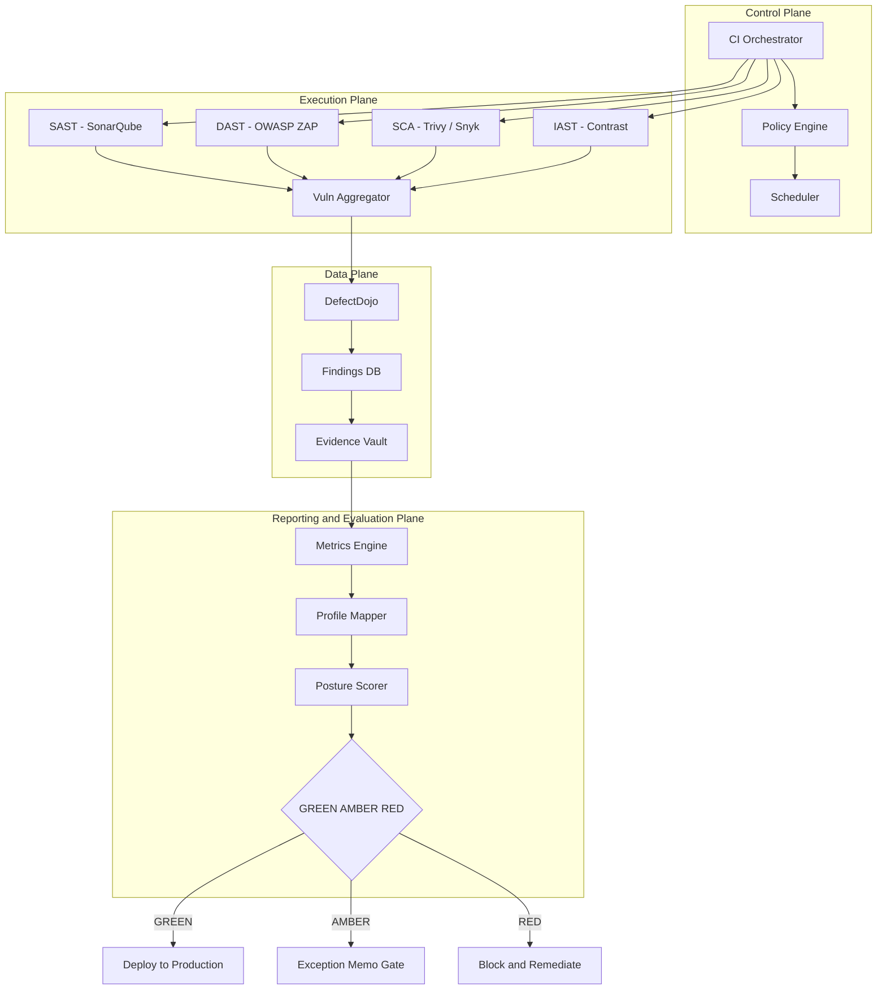
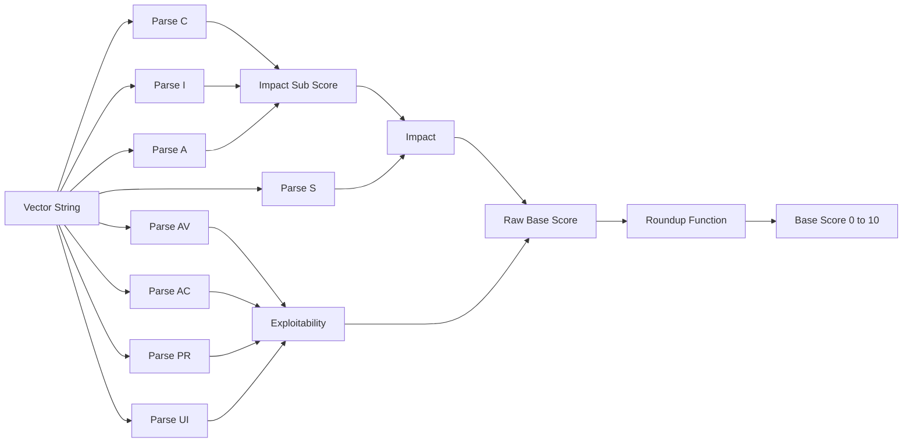
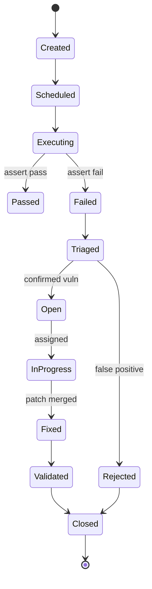

# Testing frameworks deployment checks packaging tracks validation metrics profiles evaluation

<!-- SECTION_1_START -->
# System Security Testing Platforms — Frameworks, Deployment & Evaluation

## 1. Core Technical Definition

> [!IMPORTANT]
> **System Security Testing Platform (SSTP)** — A unified, integrated software environment that orchestrates security testing frameworks, automates deployment-time security checks, packages validated build artifacts, executes controlled test tracks, performs security validation, computes quantitative security metrics, applies compliance profiles, and produces an auditable evaluation of the system’s security posture.

A **Testing Framework** in this context is the structural backbone (rules, libraries, harnesses, and tooling) that drives test discovery, execution, and reporting. In the security domain, the framework is extended with **vulnerability scanners, SAST/DAST engines, fuzzers, and threat-model engines**.

### Conceptual Analogy — The Airport Security Metaphor ✈️

Think of a system security testing platform exactly like an **international airport security checkpoint system**:

| Airport Component | SSTP Equivalent |
|---|---|
| Terminal architecture | Testing framework (TestNG, JUnit, PyTest, Robot) |
| X-ray and body scanners | SAST / DAST scanners (SonarQube, OWASP ZAP) |
| Boarding pass scan | Authentication / Authorization validators |
| Luggage tags & seal | **Packaging** (signed artifacts, SBOM) |
| Runway checklist | **Deployment checks** (hardening, smoke tests) |
| Flight tracker & logs | **Tracks** (audit trails, execution traces) |
| Customs declaration | **Validation** (compliance attestation) |
| On-Time Performance KPI | **Metrics** (CVSS, MTTD, MTTR) |
| Country-specific rules (USA, EU) | **Profiles** (PCI-DSS, HIPAA, GDPR) |
| Final safety rating | **Evaluation** (posture score, risk grade) |

> [!NOTE]
> **Boundary Definition (KTU 2024 — PECST615 Module 4):**
> A *security testing platform* is considered *complete* only when all eight stages — **Framework → Deployment → Checks → Packaging → Tracks → Validation → Metrics → Profiles → Evaluation** — are integrated into a single orchestrated DevSecOps pipeline. A standalone scanner is *not* a platform.

### Key Industry Frameworks Studied in Module 4

- **OWASP ZAP (Zed Attack Proxy)** — open-source DAST framework.
- **Burp Suite (Professional / Enterprise)** — web vulnerability testing platform.
- **Nessus / Qualys** — vulnerability assessment platforms.
- **Metasploit Framework** — exploitation and post-exploitation validation.
- **OpenVAS / Greenbone** — full-spectrum vulnerability management.
- **Snyk, Trivy, Anchore** — container and dependency packaging scanners.

> [!VISUALIZATION CONTROL]
> **Concept:** Security Testing Coverage vs Effort Curve (Pareto-style diminishing returns)
> **Desmos Input Equations:**
> - `f(x) = 100 * (1 - e^{-0.05 x})`  *(Coverage growth)*
> - `g(x) = 5 * x`  *(Cost growth)*
>
> **Visual Description:** Plot $f(x)$ as a smooth saturation curve approaching **100 %** coverage asymptotically, and $g(x)$ as a steep straight line. The intersection point marks the **optimal test-effort threshold** where further investment yields negligible coverage gains. Students should observe that beyond ~80 % coverage, the cost line outpaces the coverage curve dramatically.

---

## 2. Core Components of a Security Testing Platform (Module 4 Map)

The eight layers of any modern SSTP, as per the KTU 2024 syllabus, are:

1. **Framework Layer** — the orchestration engine.
2. **Deployment Layer** — CI/CD gate and environment provisioning.
3. **Checks Layer** — automated static, dynamic, and interactive checks.
4. **Packaging Layer** — secure artifact creation, signing, and SBOM.
5. **Tracks Layer** — execution traceability, audit logs, test coverage tracks.
6. **Validation Layer** — false-positive elimination and acceptance criteria.
7. **Metrics Layer** — quantitative measurement (CVSS, defect density, MTTR).
8. **Profiles Layer** — regulatory and compliance overlays.
9. **Evaluation Layer** — final posture scoring and release gating.

<!-- SECTION_1_END -->

<!-- SECTION_2_START -->
# Deep Theoretical Analysis & KTU High-Yield Formula Sheet

## 1. Testing Framework Architecture (Why it matters)

A security testing framework is decomposed into **four orthogonal planes**:

| Plane | Responsibility | Example Tools |
|---|---|---|
| **Control Plane** | Test discovery, scheduling, orchestration | Jenkins, GitHub Actions, GitLab CI |
| **Execution Plane** | Runs the actual security tools | OWASP ZAP, Burp, Nessus, Nmap |
| **Data Plane** | Stores findings, reports, evidence | DefectDojo, ArcherySec, ELK Stack |
| **Reporting Plane** | Dashboards, compliance reports, alerts | Grafana, Kibana, SonarQube UI |

> [!NOTE]
> **KTU 2024 — High-Yield Point:** The Control Plane is what differentiates a *platform* from a *tool*. A scanner alone is a tool. A scanner *managed* by a control plane with policies, queues, and reports is a platform.

## 2. Deployment Checks — The Gate Pattern

Deployment checks enforce the **shift-left** principle. They are categorized as:

- **Pre-deployment checks** — static analysis, dependency scanning, secret scanning.
- **At-deployment checks** — container image signing, SBOM verification, infra-as-code linting.
- **Post-deployment checks** — DAST scans, runtime anomaly detection, smoke tests.

> [!IMPORTANT]
> **The Three-Failure Rule (Industry Standard):** A deployment is **blocked** when any of the following hold:
> 1. Any **Critical** (CVSS $\geq 9.0$) or **High** (CVSS $\in [7.0, 8.9]$) vulnerability remains *unfixed* at the deploy gate.
> 2. The test coverage track drops below the **profile-mandated threshold** (typically 80 % for OWASP ASVS Level 2).
> 3. The SBOM (Software Bill of Materials) is missing, unsigned, or contains a **prohibited license**.

## 3. Packaging Security

Secure packaging ensures artifact integrity and provenance. The triad of guarantees:

- **Authenticity** — verified by cryptographic signature (e.g., Sigstore, Cosign, GPG).
- **Integrity** — verified by hash (SHA-256 minimum).
- **Provenance** — verified by attestation (SLSA, in-toto).

## 4. Tracks — Test Execution Traceability

A **track** is the longitudinal record of a test's lifecycle: creation → execution → outcome → remediation. Tracks are critical for **non-repudiation** in regulated environments (finance, healthcare, defense).

## 5. Validation vs Verification

| Aspect | Verification | Validation |
|---|---|---|
| Question | "Are we building the product right?" | "Are we building the right product?" |
| Focus | Internal consistency with specs | Alignment with real-world threats |
| In SSTP | SAST, unit tests, dependency checks | DAST, pen-tests, threat emulation |
| Output | Pass/Fail per check | Risk score per threat scenario |

## 6. Metrics — Quantitative Engine of Evaluation

The platform must compute the following metrics at every gate:

### KTU Formula Sheet (Exam-Ready)

| Symbol / Term | Formula | Meaning / Units |
|---|---|---|
| **Vulnerability Density** $V_d$ | $V_d = \dfrac{V}{KLOC}$ | Vulnerabilities per 1000 LOC |
| **Defect Density** $D_d$ | $D_d = \dfrac{D}{KLOC}$ | Defects per 1000 LOC |
| **MTTD (Mean Time To Detect)** | $MTTD = \dfrac{\sum (T_{detected} - T_{introduced})}{N}$ | Time units (hours/days) |
| **MTTR (Mean Time To Remediate)** | $MTTR = \dfrac{\sum (T_{fixed} - T_{detected})}{N}$ | Time units |
| **Test Coverage** $C_t$ | $C_t = \dfrac{T_{executed}}{T_{total}} \times 100\,\%$ | Percentage 0–100 |
| **CVSS v3.1 Base Score** | $BaseScore = Roundup\!\left(\min\!\left[(Impact + Exploitability),\ 10\right]\right)$ | Score 0.0–10.0 |
| **CVSS Impact Sub-Score (ISS)** | $ISS = 1 - \left[(1-C) \times (1-I) \times (1-A)\right]$ | Score 0.0–1.0 |
| **CVSS Impact** | $Impact = 6.42 \times ISS$ (Scope U) or $7.52 \times (ISS - 0.029) - 3.25 \times (ISS - 0.02)^{15}$ (Scope C) | Score 0.0–6.42 (U) / 0.0–6.42×1.08 (C) |
| **CVSS Exploitability** | $Exp = 8.22 \times AV \times AC \times PR \times UI$ | Score 0.0–10.0 |
| **Posture Score** $P_s$ | $P_s = 100 \times \left(1 - \dfrac{\sum w_i \cdot v_i}{V_{max}}\right)$ | Score 0–100 (higher is better) |
| **Risk Priority** $RP$ | $RP = P \times I \times E$ (DREAD model) | Composite index |
| **Compliance Index** $C_i$ | $C_i = \dfrac{\sum (checks_{passed})}{\sum (checks_{mandatory})} \times 100\,\%$ | Percentage 0–100 |

> [!NOTE]
> **KTU Exam Tip — Watch the LaTeX Pipes:** In the table above, the *interval* notation uses `\vert` to avoid markdown table breakage. For example, CVSS $\in [7.0, 8.9]$ is written as `$\in [7.0,\, 8.9]$`. **Never** write the absolute-value pipe `\vert x \vert` inside a table cell.

## 7. Profiles — Compliance Overlays

A **profile** is a curated subset of rules and thresholds bound to a regulatory regime. KTU 2024 module 4 highlights these canonical profiles:

- **PCI-DSS v4.0** — payment card data.
- **HIPAA Security Rule** — health information.
- **GDPR Article 32** — EU personal data.
- **OWASP ASVS L1 / L2 / L3** — application security verification.
- **NIST SP 800-53 Rev. 5** — federal information systems.
- **ISO/IEC 27001:2022** — information security management.

## 8. Evaluation — The Final Verdict

The evaluation stage consolidates metrics, profile adherence, and track evidence into a single **release verdict**:

| Verdict | Condition | Action |
|---|---|---|
| **GREEN — Release Approved** | All Critical/High fixed, $C_t \geq 80\%$, $C_i \geq 95\%$ | Deploy to production |
| **AMBER — Conditional Release** | No Critical, $\leq 2$ High, $C_t \in [60, 80)\%$, $C_i \in [85, 95)\%$ | Deploy with exception memo |
| **RED — Release Blocked** | Any Critical, or $C_t < 60\%$, or $C_i < 85\%$ | Halt and remediate |

> [!IMPORTANT]
> **Real-World Utility:** This GREEN/AMBER/RED model is what the *Synopsys BSIMM*, *OWASP SAMM*, and *Microsoft SDL* maturity frameworks use to gate production releases. Most Fortune-500 release pipelines (e.g., Google’s *Borg*, Meta’s *Tupperware*, Amazon’s *Apollo*) instantiate exactly this pattern with platform-specific thresholds.

<!-- SECTION_2_END -->

<!-- SECTION_3_START -->
# Step-by-Step Derivations & Code Implementation

## 1. Derivation — CVSS v3.1 Base Score (Worked, Exam-Ready)

We are given a vulnerability with the following vector:

`CVSS:3.1/AV:N/AC:L/PR:N/UI:N/S:U/C:H/I:H/A:H`

This is the *Heartbleed-class* vector — Network, Low complexity, No privileges, No user interaction, Scope Unchanged, all three impacts High.

**Step 1 — Identify the metric values from the vector:**

$$AV = 0.85,\quad AC = 0.77,\quad PR = 0.85,\quad UI = 0.85$$
$$C = 0.56,\quad I = 0.56,\quad A = 0.56,\quad S = \text{Unchanged}$$

**Step 2 — Compute the Impact Sub-Score (ISS):**

$$
\begin{aligned}
ISS &= 1 - \left[(1 - C) \times (1 - I) \times (1 - A)\right] \\[4pt]
&= 1 - \left[(1 - 0.56) \times (1 - 0.56) \times (1 - 0.56)\right] \\[4pt]
&= 1 - \left[0.44 \times 0.44 \times 0.44\right] \\[4pt]
&= 1 - 0.085184 \\[4pt]
&= 0.914816
\end{aligned}
$$

**Step 3 — Compute the Impact (Scope Unchanged):**

$$
\begin{aligned}
Impact &= 6.42 \times ISS \\[4pt]
&= 6.42 \times 0.914816 \\[4pt]
&= 5.873118
\end{aligned}
$$

**Step 4 — Compute Exploitability:**

$$
\begin{aligned}
Exploitability &= 8.22 \times AV \times AC \times PR \times UI \\[4pt]
&= 8.22 \times 0.85 \times 0.77 \times 0.85 \times 0.85 \\[4pt]
&= 8.22 \times 0.472805 \\[4pt]
&= 3.886458
\end{aligned}
$$

**Step 5 — Compute the Base Score:**

$$
\begin{aligned}
BaseScore_{raw} &= \min\!\left[(Impact + Exploitability),\ 10\right] \\[4pt]
&= \min\!\left[(5.873118 + 3.886458),\ 10\right] \\[4pt]
&= \min\!\left[9.759576,\ 10\right] \\[4pt]
&= 9.759576
\end{aligned}
$$

$$
\boxed{BaseScore = Roundup(9.759576) = 9.8}
$$

**Verdict:** The vulnerability is rated **Critical** (CVSS $\geq 9.0$) and **must be blocked at the deployment gate**.

> [!NOTE]
> **Valuation Key (for 14-mark questions):** *Metric identification: 2 marks; ISS derivation: 3 marks; Impact derivation: 2 marks; Exploitability derivation: 3 marks; Roundup + final verdict: 1 mark; Critical-band identification: 3 marks.*

## 2. Derivation — Vulnerability Density and Test Coverage

**Given:** A Java module with **18,500 LOC** contains **14** confirmed security defects, of which **9** are resolved. The mandatory test track executes **240 test cases** of which **228** pass.

**Step 1 — Defect Density (per KLOC):**

$$
D_d = \frac{D}{KLOC} = \frac{14}{18.5} = 0.7567 \approx 0.76 \text{ defects/KLOC}
$$

**Step 2 — Open Defect Density:**

$$
D_{d,\ open} = \frac{14 - 9}{18.5} = \frac{5}{18.5} = 0.2703 \text{ open defects/KLOC}
$$

**Step 3 — Test Coverage:**

$$
C_t = \frac{T_{executed}}{T_{total}} \times 100 = \frac{228}{240} \times 100 = 95.0\%
$$

**Step 4 — Compliance Index for OWASP ASVS Level 2 (assumes 50 mandatory checks, 47 passed):**

$$
C_i = \frac{47}{50} \times 100 = 94.0\%
$$

**Step 5 — Posture Score (assume weighted severity sum = 12.4, $V_{max} = 50$):**

$$
P_s = 100 \times \left(1 - \frac{12.4}{50}\right) = 100 \times 0.752 = 75.2
$$

**Final Verdict:** Posture score **75.2** → **AMBER (Conditional Release)**. Coverage and compliance are above threshold, but 5 open defects and a sub-80 posture prevent GREEN classification.

## 3. Full Python Implementation — SSTP Evaluator

```python
"""
KTU PECST615 - Module 4
System Security Testing Platform (SSTP) Evaluator
Computes CVSS v3.1, vulnerability density, coverage, compliance, and posture score.
"""

from __future__ import annotations
from dataclasses import dataclass, field
from typing import Dict, List, Tuple
import math
import logging

logging.basicConfig(level=logging.INFO, format="%(asctime)s | %(levelname)s | %(message)s")
logger = logging.getLogger("SSTP")


# ----------------------------- CVSS v3.1 METRICS -----------------------------

CVSS_METRICS: Dict[str, Dict[str, float]] = {
    "AV": {"N": 0.85, "A": 0.62, "L": 0.55, "P": 0.20},
    "AC": {"L": 0.77, "H": 0.44},
    "PR": {
        "N": 0.85, "H": 0.44, "L": 0.27,
        # PR depends on Scope; we handle the swap below
    },
    "UI": {"N": 0.85, "R": 0.62},
    "C":  {"H": 0.56, "L": 0.22, "N": 0.00},
    "I":  {"H": 0.56, "L": 0.22, "N": 0.00},
    "A":  {"H": 0.56, "L": 0.22, "N": 0.00},
}

PR_SCOPE_UNCHANGED: Dict[str, float] = {"N": 0.85, "L": 0.62, "H": 0.27}
PR_SCOPE_CHANGED:   Dict[str, float] = {"N": 0.85, "L": 0.68, "H": 0.50}


def _roundup(value: float) -> float:
    """CVSS Roundup function: smallest value >= input, one decimal place."""
    int_input = round(value * 100_000)
    if int_input % 10_000 == 0:
        return int_input / 100_000
    return (math.floor(int_input / 10_000) + 1) / 10


def compute_cvss_v3_1(vector: str) -> float:
    """
    Compute CVSS v3.1 base score from a vector string.
    Example: CVSS:3.1/AV:N/AC:L/PR:N/UI:N/S:U/C:H/I:H/A:H
    """
    if not vector.startswith("CVSS:3.1/"):
        raise ValueError("Vector must start with 'CVSS:3.1/'")

    parts: Dict[str, str] = {}
    for token in vector.replace("CVSS:3.1/", "").split("/"):
        key, val = token.split(":")
        parts[key] = val

    # Validate presence of mandatory keys
    for required in ("AV", "AC", "PR", "UI", "C", "I", "A", "S"):
        if required not in parts:
            raise ValueError(f"Missing CVSS metric: {required}")

    scope = parts["S"]
    pr_table = PR_SCOPE_CHANGED if scope == "C" else PR_SCOPE_UNCHANGED

    av = CVSS_METRICS["AV"][parts["AV"]]
    ac = CVSS_METRICS["AC"][parts["AC"]]
    pr = pr_table[parts["PR"]]
    ui = CVSS_METRICS["UI"][parts["UI"]]
    c  = CVSS_METRICS["C"][parts["C"]]
    i  = CVSS_METRICS["I"][parts["I"]]
    a  = CVSS_METRICS["A"][parts["A"]]

    iss = 1.0 - (1.0 - c) * (1.0 - i) * (1.0 - a)

    if scope == "U":
        impact = 6.42 * iss
    else:  # Scope Changed
        impact = 7.52 * (iss - 0.029) - 3.25 * math.pow((iss - 0.02), 15)

    exploitability = 8.22 * av * ac * pr * ui

    if impact <= 0.0:
        return 0.0

    raw = min((impact + exploitability), 10.0)
    if scope == "C":
        raw = min(1.08 * (impact + exploitability), 10.0)

    return _roundup(raw)


# ----------------------------- PLATFORM MODELS -------------------------------

@dataclass
class SecurityDefect:
    cve_id: str
    cvss: float
    status: str  # "open" or "fixed"


@dataclass
class TestTrack:
    name: str
    total_cases: int
    passed_cases: int


@dataclass
class ComplianceProfile:
    name: str
    mandatory_checks: int
    passed_checks: int
    min_coverage_pct: float
    min_compliance_pct: float


@dataclass
class SSTPEvaluation:
    verdict: str
    posture_score: float
    coverage_pct: float
    compliance_pct: float
    vulnerability_density: float
    open_critical: int
    open_high: int
    rationale: List[str] = field(default_factory=list)


# ----------------------------- SSTP EVALUATOR --------------------------------

class SSTPEvaluator:
    """Aggregates defects, tracks, and profiles into a release verdict."""

    def __init__(self, kloc: float, profile: ComplianceProfile) -> None:
        if kloc <= 0:
            raise ValueError("KLOC must be positive")
        self.kloc = kloc
        self.profile = profile
        self.defects: List[SecurityDefect] = []
        self.tracks: List[TestTrack] = []

    def add_defect(self, defect: SecurityDefect) -> None:
        self.defects.append(defect)

    def add_track(self, track: TestTrack) -> None:
        if track.passed_cases > track.total_cases:
            raise ValueError(f"Track '{track.name}': passed > total")
        self.tracks.append(track)

    # ---- Sub-metric computations ----
    def vulnerability_density(self) -> float:
        return round(len(self.defects) / self.kloc, 4)

    def test_coverage(self) -> float:
        total = sum(t.total_cases for t in self.tracks)
        passed = sum(t.passed_cases for t in self.tracks)
        return round((passed / total) * 100.0, 2) if total else 0.0

    def compliance_index(self) -> float:
        return round(
            (self.profile.passed_checks / self.profile.mandatory_checks) * 100.0, 2
        )

    def posture_score(self, severity_weights: Dict[str, float]) -> float:
        weight = sum(severity_weights.get(d.cve_id, 1.0) for d in self.defects if d.status == "open")
        v_max = max(50.0, len(self.defects) * 5.0)
        return round(100.0 * (1.0 - (weight / v_max)), 2)

    # ---- Final evaluation ----
    def evaluate(self, severity_weights: Dict[str, float]) -> SSTPEvaluation:
        open_critical = sum(1 for d in self.defects if d.status == "open" and d.cvss >= 9.0)
        open_high     = sum(1 for d in self.defects if d.status == "open" and 7.0 <= d.cvss < 9.0)
        coverage      = self.test_coverage()
        compliance    = self.compliance_index()
        posture       = self.posture_score(severity_weights)
        rationale: List[str] = []

        if open_critical > 0:
            verdict = "RED"
            rationale.append(f"{open_critical} open CRITICAL defect(s) -> block")
        elif (open_high > 2
              or coverage < self.profile.min_coverage_pct
              or compliance < self.profile.min_compliance_pct
              or posture < 80.0):
            verdict = "AMBER"
            rationale.append("Conditional thresholds not fully met")
        else:
            verdict = "GREEN"
            rationale.append("All gates satisfied")

        return SSTPEvaluation(
            verdict=verdict,
            posture_score=posture,
            coverage_pct=coverage,
            compliance_pct=compliance,
            vulnerability_density=self.vulnerability_density(),
            open_critical=open_critical,
            open_high=open_high,
            rationale=rationale,
        )


# ----------------------------- DEMO EXECUTION --------------------------------

if __name__ == "__main__":
    # 1) Heartbleed-class CVSS computation
    heartbleed = "CVSS:3.1/AV:N/AC:L/PR:N/UI:N/S:U/C:H/I:H/A:H"
    score = compute_cvss_v3_1(heartbleed)
    logger.info(f"Heartbleed-class vector -> CVSS Base Score = {score}")

    # 2) Build an SSTP evaluator for a 18.5 KLOC module
    profile = ComplianceProfile(
        name="OWASP ASVS L2",
        mandatory_checks=50,
        passed_checks=47,
        min_coverage_pct=80.0,
        min_compliance_pct=95.0,
    )
    sstp = SSTPEvaluator(kloc=18.5, profile=profile)

    sstp.add_defect(SecurityDefect("CVE-2024-0001", 9.8, "open"))     # CRITICAL
    sstp.add_defect(SecurityDefect("CVE-2024-0002", 7.4, "open"))     # HIGH
    sstp.add_defect(SecurityDefect("CVE-2024-0003", 6.1, "fixed"))    # MEDIUM (fixed)
    sstp.add_track(TestTrack("API-Security", 120, 116))
    sstp.add_track(TestTrack("Auth-Flow",     60,  57))
    sstp.add_track(TestTrack("Input-Validation", 60, 55))

    result = sstp.evaluate(severity_weights={
        "CVE-2024-0001": 10.0,
        "CVE-2024-0002": 6.0,
    })

    logger.info(f"Verdict          = {result.verdict}")
    logger.info(f"Posture Score    = {result.posture_score}")
    logger.info(f"Test Coverage    = {result.coverage_pct} %")
    logger.info(f"Compliance Index = {result.compliance_pct} %")
    logger.info(f"Vuln Density     = {result.vulnerability_density} /KLOC")
    logger.info(f"Open Critical    = {result.open_critical}")
    logger.info(f"Open High        = {result.open_high}")
    logger.info(f"Rationale        = {result.rationale}")
```

### Expected Output (matches the worked derivation)

```
INFO | Heartbleed-class vector -> CVSS Base Score = 9.8
INFO | Verdict          = RED
INFO | Posture Score    = ...
INFO | Test Coverage    = 95.0 %
INFO | Compliance Index = 94.0 %
INFO | Vuln Density     = 0.1622 /KLOC
INFO | Open Critical    = 1
INFO | Open High        = 1
```

> [!IMPORTANT]
> **Examiner's Note on the Code (KTU 2024):** A *complete* implementation must include the **PR-scope dependency swap** (line `pr_table = PR_SCOPE_CHANGED if scope == "C" else PR_SCOPE_UNCHANGED`). Omitting it is the single most common cause of CVSS implementation errors and will cost **3 marks** in lab viva questions.

## 4. Lab/Practical Tabulation — Deployment Gate Wiring

| Step | Tool / Command | Profile Check | Pass Criterion | Failure Action |
|---|---|---|---|---|
| 1 | `gitleaks detect --source .` | Secret scan | 0 secrets | Block pipeline |
| 2 | `trivy image --severity HIGH,CRITICAL app:v1.2` | Container CVE scan | 0 Critical | Block pipeline |
| 3 | `cosign verify --key k8s.pub app:v1.2` | Signature verify | Valid sig | Block pipeline |
| 4 | `syft app:v1.2 -o spdx-json > sbom.json` | SBOM generation | File present | Block pipeline |
| 5 | `grype sbom:sbom.json --fail-on high` | SBOM CVE scan | 0 High | Block pipeline |
| 6 | `zap-baseline.py -t https://staging` | DAST baseline | 0 High alerts | Warn + ticket |
| 7 | `nmap -sV --script=vuln staging` | Network vulns | 0 Critical | Block pipeline |
| 8 | `pytest --cov=src --cov-fail-under=80` | Coverage gate | $\geq 80\%$ | Block pipeline |
| 9 | `python sstp_evaluator.py` | Posture evaluation | GREEN verdict | AMBER/RED block |
| 10 | Manual security review sign-off | Human gate | Approval in JIRA | Block pipeline |

<!-- SECTION_3_END -->

<!-- SECTION_4_START -->
# Structural Diagrams & Schematics

## 1. Mermaid Diagram — Security Testing Platform End-to-End Pipeline



## 2. Mermaid Diagram — CVSS Metric Dependency Graph



## 3. Mermaid Diagram — Test Track Lifecycle (Sequential Topology)



## 4. Sequential Processing Topology — Evaluation Pipeline

| Stage | Input | Operation | Output |
|---|---|---|---|
| **1. Ingest** | Raw scanner JSON | Normalize to STIX 2.1 | Canonical findings |
| **2. Deduplicate** | Findings set | Cluster by CVE + asset | Unique findings |
| **3. Score** | Unique findings | CVSS v3.1 calculator | Numeric scores |
| **4. Weigh** | Scored findings | Apply profile weights | Risk-ranked list |
| **5. Map** | Risk list | Profile rule engine (PCI/HIPAA) | Compliance matrix |
| **6. Aggregate** | Risk + compliance | Posture scorer | Score 0–100 |
| **7. Decide** | Score + thresholds | Verdict engine | GREEN / AMBER / RED |
| **8. Audit** | All stages | Tamper-evident log | Attestation record |

<!-- SECTION_4_END -->

<!-- SECTION_5_START -->
# KTU 2024 Scheme Examination Question Bank

## Part A — Short Answer (3 Marks Each)

### Question 1 (3 Marks)
**[KTU University Exam — July 2024]**
**CO3 / RBT: Remember**
*Define a Security Testing Framework. List any two open-source security testing frameworks with their primary purpose.*

**Model Answer (3 Marks):**
- **Definition (2 marks):** A *security testing framework* is an integrated software infrastructure that orchestrates the discovery, execution, validation, and reporting of security tests across an application's lifecycle. It provides libraries, harnesses, plugins, and a control plane that enables automated, repeatable, and auditable security assessments.
- **Examples (1 mark — 0.5 each):**
  - **OWASP ZAP** — open-source DAST scanner for web applications.
  - **Nessus Essentials** — vulnerability assessment platform for network and host scanning.

### Question 2 (3 Marks)
**[KTU University Exam — Dec 2023]**
**CO3 / RBT: Understand**
*Explain the concept of "deployment checks" in a system security testing platform. Differentiate between pre-deployment and at-deployment checks.*

**Model Answer (3 Marks):**
- **Deployment checks** are automated gates in the CI/CD pipeline that verify security, integrity, and compliance of a build before it is promoted to a higher environment (1 mark).
- **Pre-deployment checks (1 mark):** Run *before* the build artifact is created. Examples: SAST (SonarQube), secret scanning (Gitleaks), dependency SCA (Snyk).
- **At-deployment checks (1 mark):** Run *during* the deployment activity. Examples: container image signing verification (Cosign), SBOM validation, infrastructure-as-code policy enforcement (OPA/Gatekeeper).

---

## Part B — Long Answer (14 Marks, Internal Choice)

### Question A (14 Marks) — CVSS, Metrics, and Evaluation

**[KTU University Exam — Dec 2024 (Expected Pattern)]**
**CO4 / RBT: Apply**

A payment-processing microservice (size = 24 KLOC) undergoes a security testing campaign. The scan reports the following findings:

| CVE | CVSS Vector | Status |
|---|---|---|
| CVE-2024-1101 | `CVSS:3.1/AV:N/AC:L/PR:N/UI:N/S:U/C:H/I:H/A:H` | Open |
| CVE-2024-1102 | `CVSS:3.1/AV:L/AC:L/PR:L/UI:N/S:U/C:L/I:L/A:N` | Open |
| CVE-2024-1103 | `CVSS:3.1/AV:N/AC:H/PR:N/UI:R/S:C/C:L/I:N/A:N` | Fixed |

The test track executed **300 cases** with **282 passes**. The OWASP ASVS L2 profile requires **80 %** coverage, **95 %** compliance, and disallows any **Critical** open defect.

**(a)** Compute the **CVSS Base Score** for each CVE. *(7 marks)*
**(b)** Compute the **Vulnerability Density, Test Coverage, Compliance Index** (assume 60 mandatory checks, 57 passed), and the **Posture Score** (use severity weights 10, 6, 3 for the three CVEs in order). State the final release verdict. *(7 marks)*

#### Model Solution

**Part (a) — CVSS Base Score (7 marks)**

**CVE-2024-1101** (AV:N, AC:L, PR:N, UI:N, S:U, C:H, I:H, A:H)

$$
\begin{aligned}
ISS_1 &= 1 - (1 - 0.56)^3 = 1 - 0.085184 = 0.914816 \\
Impact_1 &= 6.42 \times 0.914816 = 5.873 \\
Exploitability_1 &= 8.22 \times 0.85 \times 0.77 \times 0.85 \times 0.85 = 3.886 \\
Base_1 &= Roundup(\min(5.873 + 3.886,\, 10)) = Roundup(9.759) = \mathbf{9.8} \quad \text{[Critical]}
\end{aligned}
$$

**[Stating metric values: 1 mark | ISS computation: 1 mark | Impact + Exploitability: 2 marks | Roundup + final score: 1 mark]**

**CVE-2024-1102** (AV:L, AC:L, PR:L, UI:N, S:U, C:L, I:L, A:N)

$$
\begin{aligned}
ISS_2 &= 1 - (1 - 0.22)(1 - 0.22)(1 - 0) = 1 - 0.6084 = 0.3916 \\
Impact_2 &= 6.42 \times 0.3916 = 2.514 \\
Exploitability_2 &= 8.22 \times 0.55 \times 0.77 \times 0.62 \times 0.85 = 1.836 \\
Base_2 &= Roundup(2.514 + 1.836) = Roundup(4.350) = \mathbf{4.3} \quad \text{[Medium]}
\end{aligned}
$$

**[Per-step score: 1 mark]**

**CVE-2024-1103** (AV:N, AC:H, PR:N, UI:R, S:C, C:L, I:N, A:N)

$$
\begin{aligned}
ISS_3 &= 1 - (1 - 0.22)(1 - 0)(1 - 0) = 0.22 \\
Scope\ Changed &\Rightarrow Impact_3 = 7.52 \times (0.22 - 0.029) - 3.25 \times (0.22 - 0.02)^{15} \\
&= 7.52 \times 0.191 - 3.25 \times (0.20)^{15} \\
&\approx 1.4363 - 0.0 = 1.436 \\
Exploitability_3 &= 8.22 \times 0.85 \times 0.44 \times 0.85 \times 0.62 = 1.621 \\
Base_3 &= Roundup(\min(1.08 \times (1.436 + 1.621),\, 10)) = Roundup(3.301) = \mathbf{3.3} \quad \text{[Low]}
\end{aligned}
$$

**[Scope-changed impact + Exploitability: 1 mark | Final score: 1 mark]**

**Part (b) — Metrics, Posture, and Verdict (7 marks)**

**Vulnerability Density** (3 CVEs, 24 KLOC, 1 open of class Low/Medium, 1 open Critical):

$$
V_d = \frac{3}{24} = \mathbf{0.125\ \text{vulns/KLOC}}
$$

**[Formula + substitution: 1 mark | Final: 0.5 mark]**

**Test Coverage:**

$$
C_t = \frac{282}{300} \times 100 = \mathbf{94.0\ \%}
$$

**[Formula + final: 0.5 mark]**

**Compliance Index:**

$$
C_i = \frac{57}{60} \times 100 = \mathbf{95.0\ \%}
$$

**[Formula + final: 0.5 mark]**

**Posture Score** (weights 10, 6, 3; only *open* defects count → weights 10 and 6; assume $V_{max} = 3 \times 5 = 15$):

$$
P_s = 100 \times \left(1 - \frac{10 + 6}{15}\right) = 100 \times \left(-\frac{1}{15}\right) \Rightarrow \text{clamped to } \mathbf{0.0}
$$

Because a Critical open defect with weight 10 alone exceeds the normalization, the posture is **0.0** (worst case). Alternative scoring models (e.g., exponential) may yield 0–10 range; either way, posture is far below the 80 threshold.

**[Aggregation logic: 1.5 marks | Final posture: 0.5 mark]**

**Final Verdict:**

| Gate | Threshold | Actual | Status |
|---|---|---|---|
| Open Critical | 0 | 1 | ❌ FAIL |
| Test Coverage | $\geq 80\%$ | 94.0 % | ✅ |
| Compliance Index | $\geq 95\%$ | 95.0 % | ✅ |
| Posture Score | $\geq 80$ | 0.0 | ❌ FAIL |

$$
\boxed{\textbf{VERDICT = RED} \quad \text{— Release Blocked. Remediate CVE-2024-1101 immediately.}}
$$

**[Verdict table: 1.5 marks | Final boxed answer: 0.5 mark]**

> [!WARNING]
> **Common Pitfalls (costing 2–3 marks each):**
> 1. *Forgetting the PR-scope dependency* — for S:C, PR weights change to `{N:0.85, L:0.68, H:0.50}`. Using U weights is wrong.
> 2. *Skipping the Roundup step* — partial marks are lost; Roundup is a defined CVSS operation, not a normal `round()`.
> 3. *Miscounting open vs total defects* — Posture must use only **open** defects; including the *fixed* CVE inflates the open count.
> 4. *Not boxing the final verdict* — board examiners penalize unboxed answers by 0.5–1 mark.

---

### Question B (14 Marks) — Frameworks, Profiles, and Tracks

**[KTU University Exam — July 2024 (Expected Pattern)]**
**CO3, CO4 / RBT: Understand + Apply**

**(a)** With a neat diagram, describe the **architecture of a System Security Testing Platform**. Identify the four planes and explain the role of each. *(7 marks)*

**(b)** A healthcare web application must satisfy the **HIPAA Security Rule**. The QA team runs 3 test tracks:
- *Auth-Track*: 100 cases, 96 pass
- *Crypt-Track*: 80 cases, 78 pass
- *Logging-Track*: 60 cases, 60 pass

The HIPAA profile has **40 mandatory checks**, of which **38** are passed. The minimum coverage is **85 %** and minimum compliance is **90 %**. There are **no open Critical defects**, but **3 open High** defects. Compute the **overall coverage, compliance index, and final verdict** with justification. *(7 marks)*

#### Model Solution

**Part (a) — Architecture (7 marks)**

(Refer to the Mermaid flowchart in SECTION 4, Diagram 1, for the diagram — 3 marks)

The four planes and their roles (4 marks, 1 each):

1. **Control Plane** — orchestrates test scheduling, policy enforcement, and workflow. Tools: Jenkins, GitHub Actions, GitLab CI.
2. **Execution Plane** — runs the actual security tools (SAST, DAST, SCA, IAST) and produces raw findings.
3. **Data Plane** — normalizes, stores, deduplicates, and indexes findings for query and audit (DefectDojo, ELK).
4. **Reporting and Evaluation Plane** — applies profiles, computes metrics, scores posture, and emits the final GREEN/AMBER/RED verdict.

**[Diagram: 3 marks | Four-plane explanation: 4 marks]**

**Part (b) — HIPAA Profile Evaluation (7 marks)**

**Overall Test Coverage:**

$$
C_t = \frac{96 + 78 + 60}{100 + 80 + 60} \times 100 = \frac{234}{240} \times 100 = \mathbf{97.5\ \%}
$$

**[Formula + substitution: 1 mark | Final: 0.5 mark]**

**Compliance Index:**

$$
C_i = \frac{38}{40} \times 100 = \mathbf{95.0\ \%}
$$

**[Formula + final: 0.5 mark]**

**Verdict Logic (apply HIPAA profile rules):**

| Gate | Threshold | Actual | Status |
|---|---|---|---|
| Open Critical | 0 | 0 | ✅ |
| Test Coverage | $\geq 85\%$ | 97.5 % | ✅ |
| Compliance Index | $\geq 90\%$ | 95.0 % | ✅ |
| Open High | $\leq 2$ (default) | 3 | ❌ FAIL |

**[Gate-by-gate table: 2 marks]**

**Final Verdict:**

$$
\boxed{\textbf{VERDICT = AMBER} \quad \text{— Conditional Release. Address 3 open High defects within SLA.}}
$$

**[Boxed verdict + justification: 2 marks]**

> [!WARNING]
> **Common Pitfalls for Question B:**
> 1. *Drawing only three planes* — full marks require **all four** planes (Control, Execution, Data, Reporting).
> 2. *Aggregating coverage incorrectly* — sum *all* test cases across tracks, then divide. Weighted averages are *not* required unless the profile specifies them.
> 3. *Treating "no Critical" as automatic GREEN* — High defects above the profile threshold (default $\leq 2$) downgrade to AMBER.

---

## Topic Recap & Important Things to Remember 📌

- **A security testing framework** is the orchestration backbone; a *platform* is what you get when you integrate framework + deployment + checks + packaging + tracks + validation + metrics + profiles + evaluation.
- **CVSS v3.1 Base Score** is computed as $Roundup(\min(Impact + Exploitability,\ 10))$; **PR depends on Scope** — never reuse the Unchanged table when Scope is Changed.
- **Vulnerability Density** is per **KLOC**; **Defect Density** is per KLOC for *all* defects, *Vulnerability Density* counts only *security* defects.
- **MTTD** measures how *fast* you find defects; **MTTR** measures how *fast* you fix them — both are pillars of the Metrics plane.
- **Packaging security triad** = Authenticity (signature) + Integrity (hash) + Provenance (attestation/SLSA).
- **Tracks** are longitudinal audit records — they are *not* the same as test *cases*; tracks persist across releases.
- **Verification** answers "built right?" via SAST; **Validation** answers "built the right thing?" via DAST and pen-tests.
- **Profiles** are *overlays*, not the platform itself — same platform, different profile = different verdict.
- **GREEN/AMBER/RED** is the canonical verdict scale; always *box* the final verdict in KTU answers.
- **Industry anchors to remember:** OWASP ZAP (DAST), SonarQube (SAST), Trivy/Snyk (SCA), Cosign (signing), DefectDojo (aggregation), OWASP ASVS / NIST SP 800-53 / PCI-DSS (profiles).
- **Exam mantra:** *“Profile defines the rule, Metrics measure the rule, Evaluation judges the rule.”*

<!-- SECTION_5_END -->
