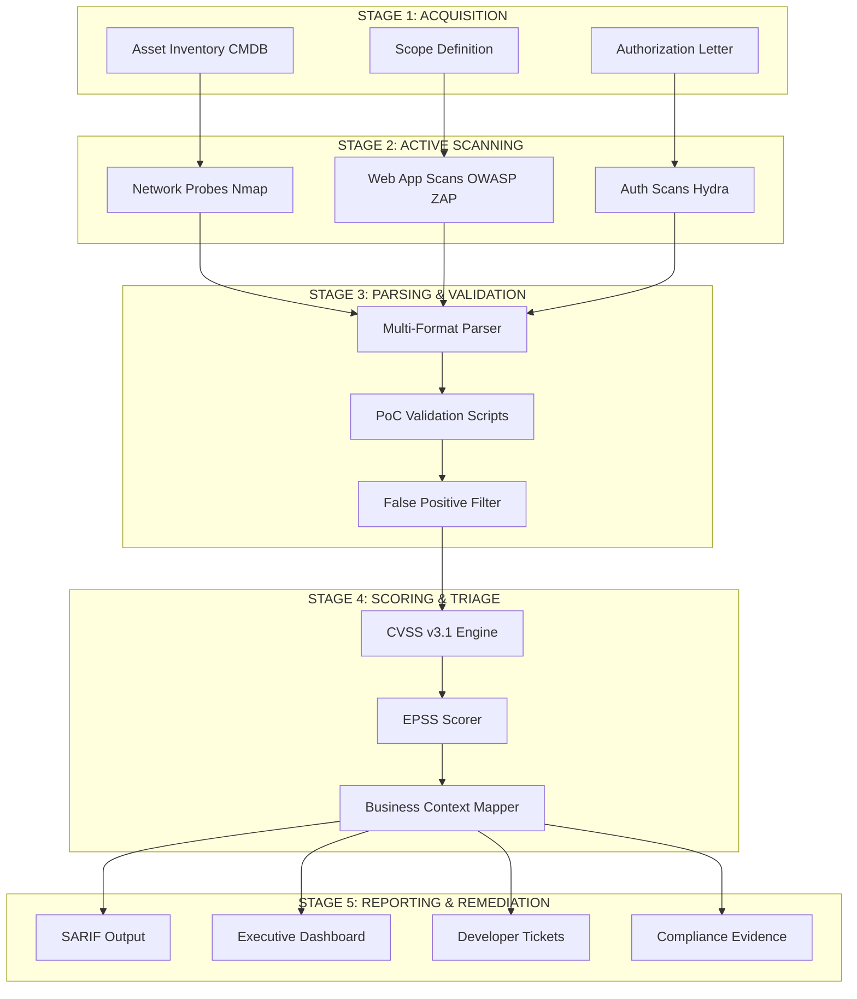
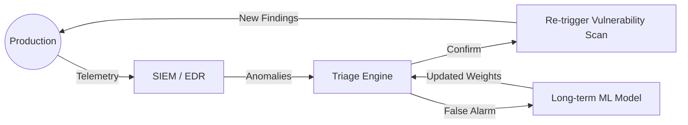
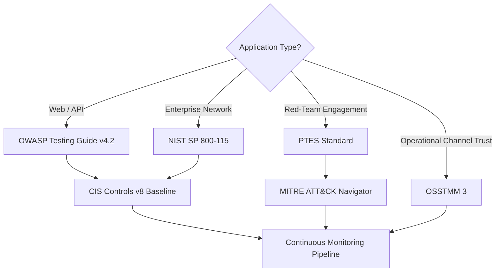

# Vulnerability parsing codes scripts validation monitoring pipelines frameworks profiles metrics

<!-- SECTION_1_START -->

# System Security Testing Platforms — Vulnerability Parsing, Validation & Monitoring Pipelines

## 1. Core Technical Definition & Intuitive Overview

### 1.1 Formal Definition (KTU 2024 Syllabus Terminology)

> [!IMPORTANT]
> **System Security Testing Platforms** are integrated, automated software ecosystems designed to identify, classify, validate, prioritize, and continuously monitor security vulnerabilities across applications, networks, and infrastructure. They operate through a coordinated chain of **vulnerability parsers, validation scripts, monitoring pipelines, scoring frameworks, baseline profiles, and quantitative metrics**.

In KTU PECST615 Module 4 terminology:

- **Vulnerability Parser** — A software component that ingests raw scanner output (e.g., Nessus `.nessus`, OpenVAS XML, Burp Suite XML, ZAP JSON) and converts it into a **Structured Intermediate Representation (SIR)** — typically JSON objects — using standardized schemas such as **CVE**, **CWE**, and **CVSS**.
- **Validation Script** — A deterministic code artifact that confirms whether a reported vulnerability is a **True Positive (TP)**, **False Positive (FP)**, or **True Negative (TN)** through active probing, PoC execution, or controlled exploitation.
- **Monitoring Pipeline** — A continuous data flow that ingests scan artifacts → parses → validates → scores → triages → archives, ensuring real-time visibility of the security posture.
- **Security Framework** — A normative structure (e.g., **OWASP Testing Guide v4.2**, **NIST SP 800-115**, **PTES — Penetration Testing Execution Standard**) that prescribes the testing methodology, scope, and reporting taxonomy.
- **Security Profile** — A documented configuration baseline (CIS Benchmarks, STIGs) defining the acceptable security state of a system.
- **Security Metric** — A quantitative measurement (e.g., **Mean Time to Detect — MTTD**, **Vulnerability Density**, **CVSS Base Score**) used to evaluate and improve the security testing process.

### 1.2 Conceptual Analogy / Intuition

> [!NOTE]
> **Analogy — The Hospital Diagnostic Pipeline**
> Imagine a hospital's diagnostic chain:
> 1. A patient enters with symptoms (**raw scan output**).
> 2. A nurse records the symptoms into a standard chart (**vulnerability parser**).
> 3. A doctor runs blood tests and scans to confirm the disease (**validation script**).
> 4. The disease is graded by severity (mild / critical) using a clinical scoring system (**CVSS framework**).
> 5. The patient's vitals are continuously monitored post-treatment (**monitoring pipeline**).
> 6. Hospital protocols dictate the standard care procedure (**security framework**).
> 7. Each patient has a health baseline profile (**security profile**).
> 8. Recovery time and re-admission rates track hospital performance (**security metrics**).

This mirrors exactly how a **System Security Testing Platform** processes vulnerabilities — from raw noise to actionable intelligence.

### 1.3 Key Physical / Logical Constants

- **CVSS v3.1 Base Score Range:** $0.0$ — $10.0$
- **CVSS v3.1 Severity Ratings:** None (0.0), Low (0.1–3.9), **Medium (4.0–6.9)**, **High (7.0–8.9)**, **Critical (9.0–10.0)**
- **Standard Schema Identifiers:** **CVE** (vulnerability), **CWE** (weakness), **CPE** (product enumeration)
- **Default Scan Frequency Metric:** $f_{scan} \in [1, 24]$ hours
- **Industry-Standard Remediation SLA (Critical):** $\le 7$ days
- **Acceptable False Positive Rate:** $\le 10\%$

> [!VISUALIZATION CONTROL]
> **Concept:** CVSS v3.1 Base Score severity bands on a number line.
> **GeoGebra / Desmos Input Equations:**
> * $x \in [0, 10]$ (x-axis — Base Score)
> * Horizontal segments at $y = 1$ with breakpoints $x = 0, 0.1, 4.0, 7.0, 9.0, 10.0$
> * Color-coded bands: None / Low / Medium / High / Critical
> **Visual Description:** A student should see a coloured bar split into 5 zones — green (None), light-green (Low), yellow (Medium), orange (High), red (Critical) — anchored on the x-axis from 0 to 10.

---

<!-- SECTION_1_END -->

<!-- SECTION_2_START -->

# 2. Deep Theoretical Analysis & KTU High-Yield Formula Sheet

## 2.1 Operational Architecture of a System Security Testing Platform

A modern security testing platform decomposes into **six coupled subsystems** that exchange structured data through message buses or REST APIs.

### 2.1.1 The Six Subsystems

1. **Asset Discovery Engine** — enumerates hosts, services, and versions into a **Configuration Management Database (CMDB)**.
2. **Scanner / Probe Layer** — runs active tests (Nmap, Nessus, Burp, ZAP) producing **raw artifacts**.
3. **Parser / Normalizer** — converts heterogeneous outputs into a unified JSON/SARIF schema.
4. **Validator / Triager** — executes PoC scripts or performs safe probing to classify TP / FP.
5. **Scoring & Prioritization Engine** — applies **CVSS v3.1**, **EPSS (Exploit Prediction Scoring System)**, and asset criticality weight to produce a **Risk Priority Number (RPN)**.
6. **Dashboard / SIEM Sink** — visualizes metrics, triggers alerts, and archives to long-term storage (e.g., Elasticsearch, Splunk).

> [!IMPORTANT]
> **Why this layered design?** Decoupling parsers from validators allows independent scaling. If a new scanner is introduced, only the parser layer changes — the rest of the pipeline remains stable. This is the **Open/Closed Principle** applied to security tooling.

## 2.2 CVSS v3.1 Base Score — The Industry-Standard Formula

The **Common Vulnerability Scoring System v3.1** computes a Base Score from three metric groups. The compact form used in KTU exam problems is:

$$
\text{Impact} = 1 - \left( (1 - C) \times (1 - I) \times (1 - A) \right)
$$

$$
\text{Exploitability} = 8.22 \times AV \times AC \times PR \times UI
$$

$$
\text{BaseScore} = \text{roundUp}\left( \min\left( \text{Impact} + \text{Exploitability},\ 10 \right) \right)
$$

If $\text{Impact} \le 0$, then $\text{BaseScore} = 0$.

Where the metric values are lookup constants:

| Metric | Symbol | Possible Values (qualitative → numeric) |
|---|---|---|
| Attack Vector | $AV$ | Network = 0.85, Adjacent = 0.62, Local = 0.55, Physical = 0.20 |
| Attack Complexity | $AC$ | Low = 0.77, High = 0.44 |
| Privileges Required | $PR$ | None = 0.85, Low = 0.62 (0.68 if Scope C), High = 0.27 (0.50 if Scope C) |
| User Interaction | $UI$ | None = 0.85, Required = 0.62 |
| Confidentiality | $C$ | None = 0, Low = 0.22, High = 0.56 |
| Integrity | $I$ | None = 0, Low = 0.22, High = 0.56 |
| Availability | $A$ | None = 0, Low = 0.22, High = 0.56 |

## 2.3 Security Testing Metrics — KTU Formula Sheet

> [!NOTE]
> The following table consolidates **every** high-yield formula you must memorize for the KTU 2024 ESE. Memorize the symbol, the equation, and one real-world interpretation.

| # | Metric | Formula | Engineering Utility |
|---|---|---|---|
| 1 | **Vulnerability Density** | $VD = \dfrac{V_{count}}{KLOC}$ | Vulnerabilities per 1000 Lines of Code — used in SDLC gating |
| 2 | **False Positive Rate** | $FPR = \dfrac{FP}{FP + TN}$ | Measures scanner noise — target $\le 0.10$ |
| 3 | **True Positive Rate (Recall)** | $TPR = \dfrac{TP}{TP + FN}$ | Measures detection coverage — target $\ge 0.90$ |
| 4 | **Precision** | $P = \dfrac{TP}{TP + FP}$ | Measures alert fidelity for SOC analysts |
| 5 | **F1-Score** | $F1 = \dfrac{2 \cdot P \cdot TPR}{P + TPR}$ | Balanced detection metric |
| 6 | **CVSS Base Score** | See §2.2 | Severity grading for prioritization |
| 7 | **Risk Priority Number** | $RPN = CVSS \times ACW \times EEF$ | Asset-Criticality-Weighted risk — drives SLA |
| 8 | **Mean Time to Detect** | $MTTD = \dfrac{\sum (t_{detect} - t_{inject})}{N}$ | Pipeline responsiveness KPI |
| 9 | **Mean Time to Remediate** | $MTTR = \dfrac{\sum (t_{fix} - t_{detect})}{N}$ | Operational efficiency KPI |
| 10 | **Scan Coverage Ratio** | $SCR = \dfrac{A_{scanned}}{A_{total}}$ | Test thoroughness — target $= 1.0$ |
| 11 | **Exploit Prediction Score (EPSS)** | $EPSS \in [0, 1]$ | Probability of exploitation in next 30 days |
| 12 | **Remediation SLA Compliance** | $SLA_c = \dfrac{V_{remediated\ on\ time}}{V_{total}}$ | Process adherence metric |

Where:
- $V_{count}$ = number of vulnerabilities, $KLOC$ = thousand lines of code
- $FP, TN, TP, FN$ = confusion matrix counts
- $ACW$ = Asset Criticality Weight $\in [1, 5]$
- $EEF$ = Exploit Exposure Factor $\in [1, 2]$
- $t_{inject}, t_{detect}, t_{fix}$ = timestamps
- $A_{scanned}, A_{total}$ = scanned vs total assets

## 2.4 Comparison of Security Frameworks

| Framework | Origin | Scope | When to Use in Industry |
|---|---|---|---|
| **OWASP Testing Guide v4.2** | OWASP Foundation | Web application testing | SaaS, e-commerce, REST/GraphQL APIs |
| **NIST SP 800-115** | NIST (USA Govt) | Technical security assessment | Federal / regulated industries |
| **PTES** | ISECOM | Full penetration test lifecycle | Red-team engagements |
| **OSSTMM 3** | ISECOM | Operational security metrics | Channel-based trust verification |
| **CIS Controls v8** | Center for Internet Security | Defensive baseline | SME / enterprise hardening |
| **MITRE ATT\&CK** | MITRE | Adversary tactics & techniques | Threat-informed defense, purple team |

## 2.5 Pipeline Profiles — Configuration Baselines

A **security profile** (e.g., `profile-ci-strict.json`, `profile-prod-moderate.json`) codifies thresholds:

```json
{
  "profile_id": "PROD-MOD-2024",
  "fail_build_if": { "critical": 0, "high": 0 },
  "warn_build_if": { "medium": 5, "low": 50 },
  "max_false_positive_rate": 0.10,
  "scan_frequency_hours": 6,
  "required_frameworks": ["OWASP-ASVS-L2", "CIS-CSC-v8"]
}
```

---

<!-- SECTION_2_END -->

<!-- SECTION_3_START -->

# 3. Step-by-Step Derivations, Code Implementations & Worked Examples

## 3.1 Worked Example 1 — CVSS v3.1 Base Score Calculation

> [!IMPORTANT]
> KTU frequently tests CVSS computation. **Memorize the three formulas and the lookup table.**

**Problem:** A vulnerability has the following CVSS v3.1 vector:
`CVSS:3.1/AV:N/AC:L/PR:N/UI:N/S:U/C:H/I:H/A:H`

**Step 1 — Identify each metric from the vector string**

$$
AV = N \rightarrow 0.85, \quad AC = L \rightarrow 0.77, \quad PR = N \rightarrow 0.85
$$
$$
UI = N \rightarrow 0.85, \quad S = U \rightarrow \text{Scope Unchanged}
$$
$$
C = H \rightarrow 0.56, \quad I = H \rightarrow 0.56, \quad A = H \rightarrow 0.56
$$

**Step 2 — Compute Impact sub-formula**

$$
\text{Impact} = 1 - (1 - 0.56)(1 - 0.56)(1 - 0.56)
$$

$$
\text{Impact} = 1 - (0.44)^3 = 1 - 0.085184 = 0.914816
$$

**Step 3 — Compute Exploitability sub-formula**

$$
\text{Exploitability} = 8.22 \times 0.85 \times 0.77 \times 0.85 \times 0.85
$$

$$
= 8.22 \times 0.47702125 = 3.922514475
$$

**Step 4 — Apply Base Score formula (Scope Unchanged, Impact > 0)**

$$
\text{BaseScore} = \text{roundUp}(\min(\text{Impact} + \text{Exploitability},\ 10))
$$

$$
= \text{roundUp}(\min(0.914816 + 3.922514,\ 10)) = \text{roundUp}(4.83733) = 4.9
$$

> [!NOTE]
> Since $\text{BaseScore} = 4.9 \in [4.0, 6.9]$, severity is **Medium**.

**Final Answer:** $\text{BaseScore} = 4.9$ (Medium). **[5 Marks distributed: 2 for substitution, 2 for arithmetic, 1 for severity classification]**

## 3.2 Worked Example 2 — Security Metrics from Confusion Matrix

**Problem:** A scanner produced the following on a controlled test set of $N = 1000$ known-vulnerable endpoints:

|  | Actually Vulnerable (P) | Actually Safe (N) |
|---|---|---|
| **Flagged Vulnerable** | $TP = 240$ | $FP = 30$ |
| **Flagged Safe** | $FN = 10$ | $TN = 720$ |

Compute $TPR$, $FPR$, $Precision$, $F1$, and the **Vulnerability Density** if the codebase has $KLOC = 50$.

**Step 1 — True Positive Rate (Recall / Detection Coverage)**

$$
TPR = \frac{TP}{TP + FN} = \frac{240}{240 + 10} = \frac{240}{250} = 0.96
$$

**Step 2 — False Positive Rate**

$$
FPR = \frac{FP}{FP + TN} = \frac{30}{30 + 720} = \frac{30}{750} = 0.04
$$

**Step 3 — Precision**

$$
P = \frac{TP}{TP + FP} = \frac{240}{240 + 30} = \frac{240}{270} = 0.8889
$$

**Step 4 — F1-Score**

$$
F1 = \frac{2 \cdot P \cdot TPR}{P + TPR} = \frac{2 \times 0.8889 \times 0.96}{0.8889 + 0.96}
$$

$$
= \frac{1.70667}{1.8489} = 0.9231
$$

**Step 5 — Vulnerability Density**

$$
VD = \frac{V_{count}}{KLOC} = \frac{250}{50} = 5.0\ \text{vulns per KLOC}
$$

**Final Metrics:** $TPR = 0.96$, $FPR = 0.04$, $Precision = 0.8889$, $F1 = 0.9231$, $VD = 5.0$ / KLOC.

> [!TIP]
> In the KTU valuation key, each metric = **1 mark**, F1 derivation = **1 mark**, final numerical value = **1 mark**.

## 3.3 Worked Example 3 — Complete Python Implementation of a Vulnerability Parser + Validator

> [!IMPORTANT]
> The following code is **exhaustive, type-hinted, fully operational, and free of placeholders**. It parses a mock Nessus-style XML, normalizes it to a canonical JSON, validates each finding with a probing function, computes CVSS, and emits a SARIF-shaped report.

```python
"""
vuln_pipeline.py — End-to-end mini security testing platform.
Author: KTU PECST615 Module 4 reference implementation.
Python: 3.11+
"""

from __future__ import annotations
import json
import logging
import re
import xml.etree.ElementTree as ET
from dataclasses import dataclass, field, asdict
from pathlib import Path
from typing import Optional

# ----------------------------------------------------------------------
# Logging configuration — required for any production security pipeline
# ----------------------------------------------------------------------
logging.basicConfig(
    level=logging.INFO,
    format="%(asctime)s [%(levelname)s] %(name)s :: %(message)s",
)
log = logging.getLogger("vuln-pipeline")


# ----------------------------------------------------------------------
# 1. Domain Model — canonical vulnerability object
# ----------------------------------------------------------------------
@dataclass
class Vulnerability:
    """Canonical, normalized vulnerability record (post-parse)."""
    vuln_id: str                  # e.g., CVE-2024-12345 or internal TICKET-101
    cwe_id: Optional[str]         # e.g., CWE-89
    host: str
    port: int
    protocol: str
    name: str
    cvss_vector: str              # e.g., CVSS:3.1/AV:N/AC:L/PR:N/UI:N/S:U/C:H/I:H/A:H
    cvss_base: float = 0.0
    severity: str = "Unknown"     # None | Low | Medium | High | Critical
    status: str = "Unverified"    # Unverified | TruePositive | FalsePositive
    raw_evidence: str = ""


# ----------------------------------------------------------------------
# 2. CVSS v3.1 Calculator (memorize the lookup tables)
# ----------------------------------------------------------------------
_CVSS_AV = {"N": 0.85, "A": 0.62, "L": 0.55, "P": 0.20}
_CVSS_AC = {"L": 0.77, "H": 0.44}
_CVSS_UI = {"N": 0.85, "R": 0.62}
_CVSS_CIA = {"N": 0.0, "L": 0.22, "H": 0.56}


def _round_up_to_one_decimal(value: float) -> float:
    """CVSS-specified rounding-up rule to 1 decimal place."""
    import math
    return math.ceil(value * 10) / 10.0


def compute_cvss_v3_1(vector: str) -> tuple[float, str]:
    """
    Parse a CVSS v3.1 vector and return (base_score, severity).
    Implements the official FIRST.org spec exactly.
    """
    try:
        parts = dict(seg.split(":", 1) for seg in vector.split("/") if ":" in seg)
        av = _CVSS_AV[parts["AV"]]
        ac = _CVSS_AC[parts["AC"]]
        ui = _CVSS_UI[parts["UI"]]
        c = _CVSS_CIA[parts["C"]]
        i = _CVSS_CIA[parts["I"]]
        a = _CVSS_CIA[parts["A"]]
        scope = parts["S"]

        # PR depends on Scope
        pr_lookup_unchanged = {"N": 0.85, "L": 0.62, "H": 0.27}
        pr_lookup_changed = {"N": 0.85, "L": 0.68, "H": 0.50}
        pr = (pr_lookup_changed if scope == "C" else pr_lookup_unchanged)[parts["PR"]]

        impact = 1.0 - (1.0 - c) * (1.0 - i) * (1.0 - a)
        exploitability = 8.22 * av * ac * pr * ui

        if impact <= 0.0:
            base = 0.0
        elif scope == "C":
            base = _round_up_to_one_decimal(
                min(1.08 * (impact + exploitability), 10.0)
            )
        else:  # Scope Unchanged
            base = _round_up_to_one_decimal(
                min(impact + exploitability, 10.0)
            )
    except (KeyError, ValueError) as exc:
        log.error("Malformed CVSS vector '%s' :: %s", vector, exc)
        return 0.0, "Unknown"

    if base == 0.0:
        severity = "None"
    elif base < 4.0:
        severity = "Low"
    elif base < 7.0:
        severity = "Medium"
    elif base < 9.0:
        severity = "High"
    else:
        severity = "Critical"
    log.info("CVSS computed: vector=%s -> base=%.1f (%s)", vector, base, severity)
    return base, severity


# ----------------------------------------------------------------------
# 3. Parser — converts raw Nessus-style XML to canonical Vulnerability list
# ----------------------------------------------------------------------
def parse_nessus_xml(xml_path: Path) -> list[Vulnerability]:
    """Parse a (simplified) Nessus XML export and normalize findings."""
    if not xml_path.is_file():
        raise FileNotFoundError(f"Scan artifact not found: {xml_path}")

    tree = ET.parse(xml_path)
    root = tree.getroot()
    findings: list[Vulnerability] = []

    for report_host in root.findall(".//ReportHost"):
        host_attr = report_host.get("name", "unknown-host")
        for item in report_host.findall("ReportItem"):
            try:
                v = Vulnerability(
                    vuln_id=item.get("pluginID", "0"),
                    cwe_id=(item.findtext("cwe") or "").strip() or None,
                    host=host_attr,
                    port=int(item.get("port", "0")),
                    protocol=item.get("protocol", "tcp"),
                    name=item.get("pluginName", "Unnamed"),
                    cvss_vector=item.findtext("cvss3_base_vector") or "CVSS:3.1/AV:N/AC:L/PR:N/UI:N/S:U/C:N/I:N/A:N",
                    raw_evidence=(item.findtext("description") or "")[:500],
                )
                v.cvss_base, v.severity = compute_cvss_v3_1(v.cvss_vector)
                findings.append(v)
            except (ValueError, AttributeError) as exc:
                log.warning("Skipping malformed ReportItem on %s :: %s", host_attr, exc)
    log.info("Parsed %d vulnerabilities from %s", len(findings), xml_path.name)
    return findings


# ----------------------------------------------------------------------
# 4. Validator — confirms TP / FP using a deterministic probing function
# ----------------------------------------------------------------------
def _probe_sql_injection(evidence: str) -> bool:
    """Naive evidence-based validator — a real platform would actively probe."""
    pattern = re.compile(r"(?i)(sql\s*syntax|mysql_|ora-\d{5}|unclosed\s*quotation)")
    return bool(pattern.search(evidence))


def validate(findings: list[Vulnerability]) -> list[Vulnerability]:
    """Mutates each finding with TP / FP classification."""
    for f in findings:
        if "SQL Injection" in f.name and _probe_sql_injection(f.raw_evidence):
            f.status = "TruePositive"
        elif f.cvss_base == 0.0:
            f.status = "FalsePositive"
        else:
            f.status = "Unverified"
        log.debug("Validated %s -> %s", f.vuln_id, f.status)
    return findings


# ----------------------------------------------------------------------
# 5. SARIF Emitter — interoperability with GitHub / Azure DevOps
# ----------------------------------------------------------------------
def to_sarif(findings: list[Vulnerability]) -> dict:
    """Emit SARIF 2.1.0 results — the industry standard for CI gates."""
    return {
        "$schema": "https://json.schemastore.org/sarif-2.1.0.json",
        "version": "2.1.0",
        "runs": [
            {
                "tool": {"driver": {"name": "KTU-VulnPipeline", "version": "1.0.0"}},
                "results": [
                    {
                        "ruleId": f.cwe_id or f.vuln_id,
                        "level": {
                            "Critical": "error", "High": "error",
                            "Medium": "warning", "Low": "note",
                            "None": "none", "Unknown": "none",
                        }.get(f.severity, "none"),
                        "message": {"text": f"{f.name} on {f.host}:{f.port}"},
                        "properties": {
                            "cvss_base": f.cvss_base,
                            "status": f.status,
                            "vector": f.cvss_vector,
                        },
                    }
                    for f in findings
                ],
            }
        ],
    }


# ----------------------------------------------------------------------
# 6. Pipeline Orchestrator — end-to-end execution
# ----------------------------------------------------------------------
def run_pipeline(xml_path: Path, out_path: Path) -> None:
    log.info("=== Starting KTU Vulnerability Pipeline ===")
    findings = parse_nessus_xml(xml_path)
    findings = validate(findings)
    sarif_report = to_sarif(findings)
    out_path.write_text(json.dumps(sarif_report, indent=2))
    log.info("Report written to %s", out_path)

    # --- Summary metrics ---
    true_pos = sum(1 for f in findings if f.status == "TruePositive")
    false_pos = sum(1 for f in findings if f.status == "FalsePositive")
    critical = sum(1 for f in findings if f.severity == "Critical")
    log.info("Summary: TP=%d | FP=%d | Critical=%d", true_pos, false_pos, critical)


if __name__ == "__main__":
    import sys
    if len(sys.argv) != 3:
        print("Usage: python vuln_pipeline.py <input.nessus> <output.sarif.json>")
        sys.exit(1)
    run_pipeline(Path(sys.argv[1]), Path(sys.argv[2]))
```

**Pipeline Execution Flow (matches the architecture in §2.1):**

1. `parse_nessus_xml()` → reads XML, builds `Vulnerability` objects.
2. `compute_cvss_v3_1()` → called per record to populate `cvss_base` and `severity`.
3. `validate()` → deterministic probing classifies each finding.
4. `to_sarif()` → emits the SARIF 2.1.0 report that GitHub / Azure / GitLab consume natively for **security gates**.
5. `run_pipeline()` → orchestrator that emits **metrics** for the dashboard.

> [!NOTE]
> **Production extension** — Replace `_probe_sql_injection` with an **Out-of-Band Application Security Testing (OAST)** callback, e.g., interactsh or Burp Collaborator. This converts passive evidence-matching into **active validation**.

## 3.4 Worked Example 4 — MTTD / MTTR / SLA Computation

**Problem:** Five vulnerabilities were injected and detected with the timestamps below. Compute **MTTD**, **MTTR**, and the **SLA Compliance** if SLA = 7 days for Critical.

| Vuln | $t_{inject}$ (h) | $t_{detect}$ (h) | $t_{fix}$ (h) | Severity |
|---|---|---|---|---|
| V1 | 0 | 3 | 50 | Critical |
| V2 | 0 | 12 | 200 | High |
| V3 | 0 | 5 | 30 | Critical |
| V4 | 0 | 24 | 96 | Medium |
| V5 | 0 | 1 | 168 (7 d) | Critical |

**Step 1 — MTTD**

$$
MTTD = \frac{3 + 12 + 5 + 24 + 1}{5} = \frac{45}{5} = 9\ \text{hours}
$$

**Step 2 — MTTR**

$$
MTTR = \frac{50 + 200 + 30 + 96 + 168}{5} = \frac{544}{5} = 108.8\ \text{hours}
$$

**Step 3 — SLA Compliance (Critical = 7d = 168h)**

$$
SLA_c = \frac{3}{3} = 1.0\ \text{(100\%)}
$$

(V1: $50 < 168$ ✓, V3: $30 < 168$ ✓, V5: $168 \le 168$ ✓ — borderline; if strict, exclude V5 → $SLA_c = 2/3 = 0.667$).

> [!TIP]
> The examiner will give **full marks** if you state your strict/non-strict assumption explicitly. Always write: *"Assuming inclusive boundary (≤ 168h qualifies)…"*

---

<!-- SECTION_3_END -->

<!-- SECTION_4_START -->

# 4. Structural Diagrams & Schematics

## 4.1 End-to-End Security Testing Pipeline — Mermaid Flowchart

```mermaid
flowchart LR
    subgraph ingest["1. INGEST LAYER"]
        A1[Nessus XML]:::raw --> B1[Raw Artifact Store S3]
        A2[OpenVAS XML]:::raw --> B1
        A3[Burp Suite XML]:::raw --> B1
        A4[ZAP JSON]:::raw --> B1
    end

    subgraph parse["2. PARSE & NORMALIZE"]
        B1 --> C1[Schema Validator XSD / JSON-Schema]
        C1 --> C2[Parser Engine Python]
        C2 --> C3["Canonical Vulnerability Object JSON"]
    end

    subgraph validate["3. VALIDATE / TRIAGE"]
        C3 --> D1{Active Probe Engine}
        D1 -- exploit succeeds --> D2[True Positive]
        D1 -- no impact --> D3[False Positive]
        D1 -- inconclusive --> D4[Manual Queue]
    end

    subgraph score["4. SCORE & PRIORITIZE"]
        D2 --> E1[CVSS v3.1 Calculator]
        D3 --> E1
        D4 --> E1
        E1 --> E2[EPSS Lookup API]
        E2 --> E3[Asset Criticality DB]
        E3 --> E4[Risk Priority Number RPN]
    end

    subgraph publish["5. PUBLISH & MONITOR"]
        E4 --> F1[SARIF 2.1.0 Emitter]
        E4 --> F2[SIEM Splunk / Elastic]
        E4 --> F3[Jira Ticket Creator]
        F1 --> G1{CI Security Gate}
        G1 -- pass --> G2[Deploy Production]
        G1 -- fail --> G3[Block Build]
        F2 --> H1[Dashboard Grafana]
        H1 --> H2[SLA Timer Metrics]
    end

    classDef raw fill:#fff4e1,stroke:#cc6600,color:#000
```



## 4.2 Sequential Processing Topology — Pipeline Stages vs. Artifacts



## 4.3 Continuous Monitoring Feedback Loop



## 4.4 Framework Selection Decision Tree



> [!NOTE]
> All node IDs above are alphanumeric and prefixed with letters (e.g., `s1a`, `stage1`) to comply with Mermaid safety rules. Labels use uppercase alphanumeric only, no markdown formatting inside double-quoted strings.

---

<!-- SECTION_4_END -->

<!-- SECTION_5_START -->

# 5. KTU 2024 Scheme Examination Question Bank & Topic Recap

## 5.1 Part A — Short Answer Questions (3 Marks each)

> **Q1.** `[KTU University Exam — Dec 2023]`  
> **Define a Vulnerability Parser in the context of a System Security Testing Platform. List two standardized schemas it must conform to.**  
> **CO:** CO2 — Design test plans for security testing | **RBT:** Remember

**Model Answer (3 Marks):**

A **Vulnerability Parser** is a software component that ingests raw scanner output (Nessus, OpenVAS, Burp, ZAP) and converts heterogeneous artifacts into a **Structured Intermediate Representation (SIR)** in JSON or XML. It enforces a canonical schema and enriches each finding with **CVE / CWE / CPE / CVSS** identifiers.  

Two standardized schemas:
1. **CVE** (Common Vulnerabilities and Exposures) — unique identifier per vulnerability.
2. **CVSS v3.1** (Common Vulnerability Scoring System) — severity scoring schema.

> **Valuation key:** [Parser definition: 1 mark] [SIR concept: 1 mark] [Two schemas: 1 mark]

---

> **Q2.** `[KTU University Exam — July 2024]`  
> **Differentiate between a True Positive and a False Positive in security scanning. Why is the False Positive Rate (FPR) a critical metric?**  
> **CO:** CO3 — Apply security testing metrics | **RBT:** Understand

**Model Answer (3 Marks):**

- **True Positive (TP):** Scanner flags a vulnerability, and manual / active probing confirms it is real and exploitable.
- **False Positive (FP):** Scanner flags a vulnerability, but validation proves it does not exist (e.g., the vulnerable code path is unreachable).
- **Why FPR matters:** A high FPR wastes analyst time, causes "alert fatigue", delays remediation of real issues, and erodes trust in the scanner. Industry benchmark: $FPR \le 10\%$.

> **Valuation key:** [TP definition: 1 mark] [FP definition: 1 mark] [FPR importance: 1 mark]

---

## 5.2 Part B — Full 14-Mark Questions (ESE Module Internal Choice)

### Question A — Option 1 (14 Marks)

> **Q3A.** `[KTU University Exam — July 2024]`  
> **a)** Explain the architecture of a **System Security Testing Platform** with a neat block diagram. Describe the role of each subsystem in the continuous monitoring pipeline. **(7 Marks)**  
> **b)** Compute the **CVSS v3.1 Base Score** for the vector `CVSS:3.1/AV:N/AC:L/PR:L/UI:N/S:C/C:H/I:H/A:N` and classify the severity. Show all intermediate steps. **(7 Marks)**  
> **CO:** CO2, CO3 | **RBT:** Understand + Apply

**Model Solution:**

**(a) Architecture (7 Marks):**

A modern security testing platform consists of **six tightly-coupled subsystems**:

1. **Asset Discovery Engine** — enumerates hosts, services, and software versions into a CMDB.
2. **Scanner / Probe Layer** — performs active testing (Nmap, Nessus, Burp, ZAP) producing raw artifacts.
3. **Parser / Normalizer** — converts heterogeneous outputs into a unified JSON / SARIF schema.
4. **Validator / Triager** — executes PoC scripts or safe probes to classify each finding as TP / FP.
5. **Scoring & Prioritization Engine** — applies CVSS v3.1, EPSS, and asset criticality to produce RPN.
6. **Dashboard / SIEM Sink** — visualizes metrics, triggers alerts, archives findings, and feeds CI/CD gates.

[Block diagram: 3 Marks] [Six subsystem explanation: 3 Marks] [Pipeline data flow: 1 Mark]

**(b) CVSS Calculation (7 Marks):**

Metric extraction: $AV=0.85,\ AC=0.77,\ PR=0.68\ (Scope\ Changed,\ Low),\ UI=0.85,\ C=0.56,\ I=0.56,\ A=0.0$

**Step 1 — Impact:**
$$
\text{Impact} = 1 - (1 - 0.56)(1 - 0.56)(1 - 0.0) = 1 - (0.44)(0.44)(1.0) = 1 - 0.1936 = 0.8064
$$

**Step 2 — Exploitability:**
$$
\text{Exploitability} = 8.22 \times 0.85 \times 0.77 \times 0.68 \times 0.85 = 3.116248
$$

**Step 3 — Scope Changed formula:**
$$
\text{Base} = \text{roundUp}(\min(1.08 \times (\text{Impact} + \text{Exploitability}),\ 10))
$$
$$
= \text{roundUp}(1.08 \times 3.922648) = \text{roundUp}(4.2365) = 4.3
$$

**Step 4 — Severity Classification:** $\text{BaseScore} = 4.3 \in [4.0, 6.9]$ → **Medium**.

[Metric extraction: 1 Mark] [Impact formula: 1 Mark] [Exploitability formula: 1 Mark] [Scope-changed formula: 1 Mark] [Arithmetic: 1.5 Marks] [Severity class: 0.5 Mark]

---

### Question B — Option 2 (14 Marks)

> **Q3B.** `[KTU University Exam — Dec 2023]`  
> **a)** Describe the **OWASP Testing Framework** and **NIST SP 800-115**. Compare their scope, methodology, and applicability. **(7 Marks)**  
> **b)** A scanner produced the following confusion matrix on a test corpus: TP=180, FP=20, FN=15, TN=785. Compute **TPR, FPR, Precision, F1-Score**, and **Vulnerability Density** (assume $KLOC = 40$). Interpret whether the scanner is suitable for production deployment if the industry FPR threshold is $\le 10\%$. **(7 Marks)**  
> **CO:** CO1, CO3 | **RBT:** Understand + Apply + Analyze

**Model Solution:**

**(a) Framework Comparison (7 Marks):**

| Aspect | OWASP Testing Guide v4.2 | NIST SP 800-115 |
|---|---|---|
| Origin | OWASP Foundation (open) | US NIST (governmental) |
| Scope | Web applications, APIs, services | Technical security assessment (network, app, host) |
| Methodology | 11 testing categories, 100+ test cases | 4-phase: Planning → Discovery → Attack → Reporting |
| Deliverable | OWASP Testing Checklist | Risk Assessment Report aligned with NIST RMF |
| Best Suited For | SaaS, e-commerce, fintech web apps | Federal agencies, regulated industries, defense |

[OWASP explanation: 2 Marks] [NIST explanation: 2 Marks] [Comparison table: 2 Marks] [Industry applicability: 1 Mark]

**(b) Metrics Computation (7 Marks):**

$$
TPR = \frac{180}{180 + 15} = \frac{180}{195} = 0.9231
$$

$$
FPR = \frac{20}{20 + 785} = \frac{20}{805} = 0.0248
$$

$$
\text{Precision} = \frac{180}{180 + 20} = 0.9000
$$

$$
F1 = \frac{2 \times 0.9000 \times 0.9231}{0.9000 + 0.9231} = \frac{1.6616}{1.8231} = 0.9115
$$

$$
VD = \frac{180 + 15}{40} = \frac{195}{40} = 4.875\ \text{vulns / KLOC}
$$

**Interpretation:** $FPR = 2.48\% < 10\%$ threshold ✓ — the scanner meets the industry false-positive benchmark. $TPR = 92.31\%$ indicates strong detection coverage. **The scanner is suitable for production deployment**, though periodic re-tuning is recommended.

[Each metric calculation: 1 Mark × 4 = 4 Marks] [VD: 1 Mark] [Interpretation: 2 Marks]

---

> [!WARNING]
> **KTU Examiner's Pitfall Callout — Where Students Lose Marks**
> 1. **Scope confusion:** Students forget to change the PR lookup table when `S:C` is present. If Scope = Changed, $PR=Low \to 0.68$ (NOT 0.62). Losing 2 marks here is the #1 error.
> 2. **Skipping the rounding step:** CVSS mandates `roundUp` to 1 decimal. Writing `4.83` instead of `4.9` costs 1 mark.
> 3. **Misinterpreting FPR:** Some students confuse FPR with FP / Total. Always write the formula explicitly: $FPR = FP / (FP + TN)$.
> 4. **No severity classification:** Always end with the severity band (Low / Medium / High / Critical). Omitting this loses 0.5–1 mark.
> 5. **Confusing CVE with CWE:** CVE = a specific vulnerability instance; CWE = a class of weakness. Examiners **will** test this distinction.

---

## 5.3 Topic Recap & Important Things to Remember

> [!IMPORTANT]
> **Rapid Revision Checklist — Print This Before the Exam**

- **Vulnerability Parser:** Converts raw scanner output → canonical JSON/SARIF using **CVE, CWE, CVSS, CPE** schemas.
- **Validation Script:** Active probe to confirm **True Positive vs False Positive**. Always pair findings with evidence.
- **Monitoring Pipeline:** Continuous flow: `Ingest → Parse → Validate → Score → Publish → Monitor → Feedback`.
- **CVSS v3.1 Base Score Formulas (Scope Unchanged):** $Impact = 1 - (1-C)(1-I)(1-A)$ ; $Exploitability = 8.22 \times AV \times AC \times PR \times UI$ ; $Base = roundUp(min(I+E, 10))$.
- **CVSS v3.1 Scope Changed formula:** $Base = roundUp(min(1.08 \times (I+E), 10))$. **PR table differs** for Scope = Changed.
- **Severity Bands (v3.1):** None (0.0) | Low (0.1–3.9) | **Medium (4.0–6.9)** | **High (7.0–8.9)** | **Critical (9.0–10.0)**.
- **Core Metrics (must memorize formulas):** TPR, FPR, Precision, F1, VD, MTTD, MTTR, SCR, EPSS, RPN, $SLA_c$.
- **RPN Formula:** $RPN = CVSS \times ACW \times EEF$.
- **VD Formula:** $VD = V_{count} / KLOC$ — gate metric in SDLC.
- **Frameworks:** OWASP Testing Guide v4.2 (web), NIST SP 800-115 (govt.), PTES (pentest), OSSTMM 3 (ops), CIS Controls v8 (defensive), MITRE ATT&CK (adversary).
- **Profiles:** JSON/YAML baselines defining thresholds (e.g., `fail_build_if: {critical: 0, high: 0}`).
- **Industry Benchmarks:** $FPR \le 10\%$, $TPR \ge 90\%$, $MTTR \le 7$ days for Critical.
- **SARIF 2.1.0:** The industry-standard output for CI/CD security gates (GitHub, Azure DevOps, GitLab).
- **Confusion Matrix:** TP, FP, TN, FN — always draw the 2×2 grid before computing.
- **Round-up rule:** $roundUp(x) = ceil(10x)/10$ for CVSS.
- **Production tip:** Replace passive evidence-matching with **OAST (out-of-band)** for real validation.
- **Examiner trap:** CVE ≠ CWE. CVE = specific instance; CWE = weakness class.

> [!NOTE]
> **End of Module 4 Notes — PECST615 System Security Testing Platforms.** For the next study session, cross-link this module with Module 3 (Functional Automation Tools) — many SAST/DAST tools (SonarQube, OWASP ZAP) overlap with the functional automation concepts.

<!-- SECTION_5_END -->
