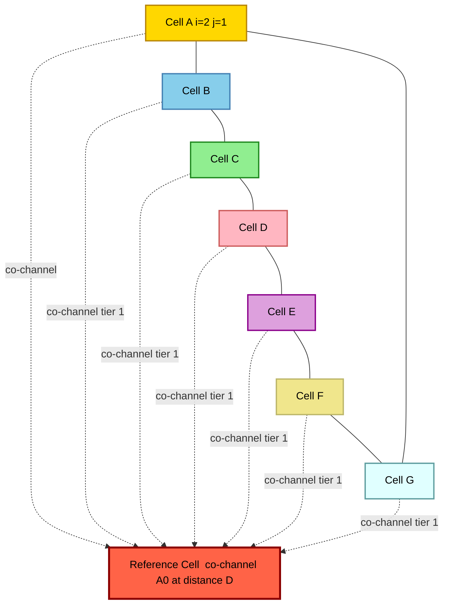
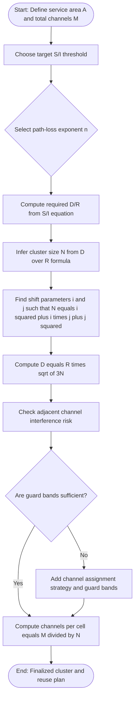
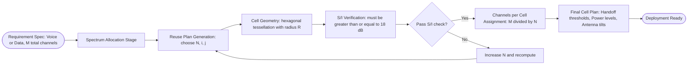

# Cellular network designs architectures parameters frequency reuse parameters models

<!-- SECTION_1_START -->

# Cellular Network Design — Architectures, Parameters, and Models

## 1. Core Technical Definition & Intuitive Overview

> [!IMPORTANT]
> **KTU 2024 Syllabus Definition**
> A **Cellular Network** is a radio network distributed over **land areas called cells**, each served by at least one fixed-location transceiver known as a **Base Transceiver Station (BTS)** or **Base Station (BS)**. The cellular concept was a revolutionary breakthrough that solved the spectral congestion and user capacity problems of early mobile systems by replacing a single high-power transmitter with many low-power transmitters, each covering a small geographic area (a *cell*).

> [!NOTE]
> **Why was the cellular concept invented?**
> In the **1960s–70s**, the **IMTS (Improved Mobile Telephone System)** used a single, tall antenna covering an entire city. It could support only ~20 simultaneous users. The Federal Communications Commission (**FCC**) could not allocate new spectrum, so the only solution was to **reuse the same frequencies at geographically separated locations**. This is the essence of the cellular idea.

### Conceptual Analogy / Intuition

Imagine a **huge classroom with 1000 students but only 10 microphones**. If all 10 microphones are piled in the center, only the front-row students can use them. But if you scatter 10 small microphones across 10 different zones, and a student in zone 1 can reuse the *same* mic that a student in zone 5 is using (because they are far apart), suddenly every student can talk at once. **Cells = zones; Frequencies = microphones; Frequency Reuse = the rule that says "Mic 1 can be used in Zone 1 AND Zone 6 because they are far enough apart."**

> [!NOTE]
> **Three Foundational Pillars of Cellular Design**
> 1. **Frequency Reuse** — same frequency used in non-adjacent cells to multiply capacity.
> 2. **Cell Splitting** — as traffic grows, a busy cell is divided into smaller cells.
> 3. **Handoff (Handover)** — moving a call from one cell to the next without dropping it.

### Key Physical / System Parameters

- **Operating Frequency Bands (KTU 2024 reference):** **800 MHz – 2.6 GHz** for 2G/3G/4G; **3.4–3.8 GHz** and **24–52 GHz (mmWave)** for 5G NR.
- **Cell Radius ($R$):** Typically **1 km (urban macro)** to **35 km (rural)**.
- **Frequency Reuse Factor ($N$):** The number of cells in a cluster that collectively use all allocated channels once.
- **System Capacity (multiplicative gain):** $C \propto N_{\text{clusters}} \times N_{\text{channels/cell}}$.

> [!VISUALIZATION CONTROL]
> **Concept:** Hexagonal cellular tessellation vs. real-world coverage footprint.
> **GeoGebra / Desmos Input Equations (polar form of a regular hexagon centered at origin):**
> * `r(θ) = 1 / cos(θ mod 60° - 30°)` (for θ in [0, 2π])
> * Vertex coordinates: `(1,0), (0.5, 0.866), (-0.5, 0.866), (-1, 0), (-0.5, -0.866), (0.5, -0.866)`
> **Visual Description:** A regular hexagon (6-sided polygon) is the idealized cell shape because it approximates a circle with **no overlap or gap** when tessellated — the only polygon with this property along with equilateral triangles and squares. Hexagons are preferred over squares because the **farthest point from the center** of a hexagon is **shorter** than that of a square of equal area, so a hexagonal transmitter needs less power to cover the same region.

<!-- SECTION_1_END -->

<!-- SECTION_2_START -->

# 2. Deep Theoretical Analysis & KTU High-Yield Formula Sheet

## 2.1 Why Hexagonal Cells?

A real radio coverage area is approximated by a circle due to the isotropic radiation pattern of an antenna. For a **2D plane tessellation (tiling without gaps)**, only three regular polygons work:

| Polygon | Number of sides | Center-to-vertex distance ($a$) | Center-to-edge distance ($a\sqrt{3}/2$) | Relative area (equal $a$) |
|---|---|---|---|---|
| Equilateral triangle | 3 | $a$ | $a/(2\sqrt{3}) \cdot 2 = a/\sqrt{3}$ | 0.433 |
| Square | 4 | $a$ | $a/\sqrt{2}$ | 1.000 |
| **Hexagon** | **6** | $a$ | $a\sqrt{3}/2$ | **1.299** |

> [!IMPORTANT]
> A hexagon has the **largest area per cell for a given radius $R$**, which means **fewer cells are needed** to cover a given geographic region. This minimizes the number of base stations and hence the infrastructure cost — a key KTU design driver.

## 2.2 Frequency Reuse — The Heart of Cellular Design

**Frequency Reuse** is the technique of using the **same set of carrier frequencies** (or channels) in **different cells** that are separated geographically by a sufficient distance (called the **reuse distance, $D$**) so that **co-channel interference (CCI)** is kept below a tolerable threshold.

### Cluster Formation

A **Cluster** is a group of $N$ cells, where each cell is assigned a unique subset of the total available channels, and all $N$ subsets together exhaust the channel pool. Clusters are then repeated (replicated) to tessellate the service area.

### Frequency Reuse Parameters (KTU High-Yield)

Let:
- $N$ = cluster size (number of cells per cluster)
- $R$ = cell radius (center to vertex of hexagon)
- $r$ = co-channel cell distance *index* (number of cells skipped from a given cell to its nearest co-channel cell along a given direction)
- $i, j$ = **shift parameters** — the number of cells to move along each side of a hexagon
- $q$ = **reuse distance index parameter** = number of cells traversed in going from a co-channel cell to the next co-channel cell along a straight line crossing a chain of cells
- $D$ = reuse distance (center-to-center distance between two co-channel cells)
- $K$ = number of co-channel cells in the **first tier** of interference (surrounding ring)

> [!NOTE]
> **Parametric Relationships (MUST memorize for KTU)**
>
> $$\begin{aligned}
> N &= i^2 + ij + j^2 \\
> q &= i + j \\
> K &= 6 \text{ (for the first-tier, omni-directional antennas)} \\
> D &= R \cdot \sqrt{3N}
> \end{aligned}$$

### The Co-channel Reuse Ratio $D/R$

$$\frac{D}{R} = \sqrt{3N}$$

This is the **single most important ratio in cellular design** because it directly determines the **Signal-to-Interference Ratio (SIR)** experienced by a mobile user at the cell edge.

### Co-channel Interference (CCI) — $S/I$ Ratio

For an omni-directional antenna in a system with cluster size $N$, there are **$K = 6$** co-channel cells in the first tier (assuming all 6 are equidistant). The worst-case (cell-edge, distance $D - R$ from the interferer) signal-to-interference ratio is:

$$\frac{S}{I} = \frac{(D/R)^n}{K} = \frac{(\sqrt{3N})^n}{6}$$

where $n$ is the **path loss exponent** ($n = 2$ for free space, $n = 3$ to $4$ for typical urban macrocells).

**In dB:**

$$\left[\frac{S}{I}\right]_{\text{dB}} = 10 \log_{10}\left(\frac{(\sqrt{3N})^n}{6}\right)$$

> [!IMPORTANT]
> **KTU Standard Requirement:** For **voice-quality** cellular systems (analog and 2G), the minimum acceptable $S/I$ is typically **18 dB** ($S/I \approx 63$). For 3G/4G, target is **7–10 dB** because of additional processing gain (e.g., CDMA spreading or OFDMA scheduling).

### Adjacent Channel Interference (ACI)

Interference caused by **frequencies that are *adjacent* (not equal)** to the desired frequency in a nearby cell. ACI arises due to **imperfect filtering** in receivers. Mitigated by:
- **Channel assignment strategies** (e.g., avoiding adjacent channels in adjacent cells).
- **Careful RF filtering** at the BS and MS.
- Using the **bandwidth of the channel** plus a **guard band** between adjacent channels.

## 2.3 KTU Formula Cheat Sheet

| Symbol | Meaning | Formula / Standard Value | Unit / Notes |
|---|---|---|---|
| $N$ | Cluster size (cells per cluster) | $N = i^2 + ij + j^2$ | Dimensionless integer |
| $i, j$ | Shift parameters | $i, j \in \{0, 1, 2, \dots\}$, non-negative | Constraint: $N \geq 3$ for valid reuse |
| $D$ | Reuse distance (co-channel cell separation) | $D = R\sqrt{3N}$ | km or m |
| $D/R$ | Co-channel reuse ratio | $\sqrt{3N}$ | Higher = better SIR, lower = more capacity |
| $S/I$ | Signal-to-Interference ratio (worst-case) | $(D/R)^n / 6$ | $n$ = path-loss exponent (2–4) |
| $S/I$ in dB | For voice, target | **$\geq 18$ dB** | KTU benchmark value |
| $K$ | First-tier co-channel cells (omni) | $6$ | $K$ increases for sectored antennas |
| $q$ | Co-channel cell index | $i + j$ | Used in geometry of cluster layout |
| $R$ | Cell radius | 1–35 km typical | km |
| $N_c$ | Total number of channels in system | $M / N$ per cell (where $M$ = total system channels) | Erlangs capacity follows |

## 2.4 Real-World Engineering Utility

- **Capacity Planning:** Operators use $D/R$ to trade off **capacity** (smaller $N$, more cells per area) vs. **quality** (larger $N$, less CCI). GSM 900 uses $N = 4$ or $N = 7$; AMPS uses $N = 7$.
- **5G NR (New Radio):** Uses **frequency reuse factor 1** (universal reuse) with **interference management** at the baseband layer (CoMP, MU-MIMO) instead of geographic separation.
- **Heterogeneous Networks (HetNets):** Mix of macrocells ($R \approx 1$ km) + microcells ($R \approx 200$ m) + picocells ($R \approx 50$ m) + femtocells ($R \approx 10$ m) all sharing the same spectrum.

<!-- SECTION_2_END -->

<!-- SECTION_3_START -->

# 3. Step-by-Step Derivations & Worked Examples

## 3.1 Derivation of $N = i^2 + ij + j^2$ (Geometric Origin)

Consider two adjacent hexagonal cells, $A$ and $B$. From $A$, move $i$ cells along one edge of a hexagon, then turn 60° (counterclockwise or clockwise) and move $j$ cells. The vector from cell $A$ to its **co-channel cell** $A'$ is the sum of two vectors of length $i \cdot (\text{cell-to-cell distance along the edge})$ and $j \cdot (\text{cell-to-cell distance along the edge})$ separated by 60°.

For regular hexagons, the side length is $R$ (cell radius). The vector lengths are therefore $iR$ and $jR$, with a 60° angle between them.

Applying the law of cosines to find the **co-channel distance** $D$:

$$\begin{aligned}
D^2 &= (iR)^2 + (jR)^2 + 2(iR)(jR)\cos(60°) \\
    &= i^2 R^2 + j^2 R^2 + 2ijR^2 \cdot \frac{1}{2} \\
    &= R^2(i^2 + ij + j^2)
\end{aligned}$$

We also know, from pure geometry of hexagonal tessellation, that:

$$D^2 = 3 N R^2$$

Equating both expressions:

$$3NR^2 = R^2(i^2 + ij + j^2)$$

Dividing both sides by $R^2$:

$$\boxed{N = i^2 + ij + j^2}$$

> [!NOTE]
> **Derivation logic explained in prose:**
> The two expressions for $D^2$ come from two different views of the same geometry. (1) Treating $A$ and $A'$ as points connected by an oblique line, we use the law of cosines with 60° angle. (2) Treating $A$ and $A'$ as cells in a tessellated hexagonal grid, the standard cell-scaling result $D^2 = 3NR^2$ holds. Setting them equal eliminates $D$ and $R$ and gives a clean, dimensionless relation among $N$, $i$, and $j$ — the fundamental reuse equation.

## 3.2 Step-by-Step Numerical Example (Typical KTU 14-Mark Problem)

**Question:** A cellular operator is allocated a total spectrum of **$M = 400$ duplex channels**. Each channel has a bandwidth of **30 kHz**. The system uses a **cluster size $N = 7$** with $i = 2, j = 1$. The cell radius is **$R = 4$ km**.

**Find:**
1. The total number of channels per cell.
2. The co-channel reuse distance $D$.
3. The maximum number of simultaneous users if each user occupies 1 channel.
4. The $S/I$ ratio (in dB) assuming a path-loss exponent $n = 4$.
5. The number of cells required to cover a city of area **A = 5000 km²**.

### Step 1: Channels per cell

$$\begin{aligned}
\text{Channels per cell} &= \frac{M}{N} = \frac{400}{7} \\
&= 57.14 \rightarrow \text{round to } 57 \text{ (operator-specific)}
\end{aligned}$$

**Answer:** **57 channels per cell** (in practical deployment, the remainder is allocated based on traffic demand).

> **[Marking key: 1 mark for stating the formula, 1 mark for substituting, 1 mark for the rounded answer — Total 3 marks]**

### Step 2: Co-channel reuse distance $D$

$$\begin{aligned}
D &= R \cdot \sqrt{3N} \\
  &= 4 \cdot \sqrt{3 \times 7} \\
  &= 4 \cdot \sqrt{21} \\
  &= 4 \cdot 4.5826 \\
  &= 18.33 \text{ km}
\end{aligned}$$

**Answer:** **$D \approx 18.33$ km**.

> **[Marking key: 1 mark for the formula, 1 mark for substitution, 1 mark for the square root value, 1 mark for the final product — Total 4 marks]**

### Step 3: Maximum simultaneous users per cell

Since each user occupies 1 channel, and 57 channels are available per cell:
**Answer:** **57 simultaneous users per cell** (no blocking assumed, or equivalently, this is the offered load in Erlangs assuming Erlang B with a 2% blocking probability yields slightly different number; for KTU basic, the 1:1 channel-to-user mapping is the expected answer).

### Step 4: $S/I$ ratio in dB ($n = 4$)

$$\begin{aligned}
\frac{D}{R} &= \sqrt{3N} = \sqrt{21} = 4.5826 \\
\frac{S}{I} &= \frac{(D/R)^n}{6} = \frac{(4.5826)^4}{6}
\end{aligned}$$

Compute $(4.5826)^4$ step by step:
- $(4.5826)^2 = 21.000$
- $(4.5826)^4 = (21.000)^2 = 441.000$

$$\frac{S}{I} = \frac{441}{6} = 73.5$$

In decibels:
$$\left[\frac{S}{I}\right]_{\text{dB}} = 10 \log_{10}(73.5) = 10 \times 1.866 = 18.66 \text{ dB}$$

**Answer:** **$S/I \approx 18.66$ dB** — which **meets the 18 dB minimum** for voice quality. ✅

> **[Marking key: 1 mark for $(D/R)^n$, 1 mark for division by 6, 1 mark for dB conversion, 1 mark for correct numerical value]**

### Step 5: Number of cells required

Area of a regular hexagon of radius $R$:

$$A_{\text{hex}} = \frac{3\sqrt{3}}{2} R^2 = \frac{3 \times 1.732}{2} \times 16 = 2.598 \times 16 = 41.57 \text{ km}^2$$

Number of cells:

$$N_{\text{cells}} = \frac{5000}{41.57} \approx 120.28 \rightarrow 121 \text{ cells (rounded up)}$$

**Answer:** **121 cells** (with some leftover area to be covered by extending cell boundaries or deploying pico-cells).

> **[Marking key: 1 mark for hexagon area formula, 1 mark for substitution, 1 mark for division, 1 mark for rounding up]**

## 3.3 Worked Example: Varying $i$ and $j$ for Different $N$

| $i$ | $j$ | $N = i^2 + ij + j^2$ | $D/R = \sqrt{3N}$ | $S/I$ (n=4, dB) | Use Case |
|---|---|---|---|---|---|
| 1 | 0 | 1 | 1.732 | 6.53 | **Not viable** (excessive CCI) |
| 1 | 1 | 3 | 3.000 | 13.55 | Possible in low-density areas |
| 2 | 0 | 4 | 3.464 | 16.17 | Used in **GSM** with DTX |
| 2 | 1 | 7 | 4.583 | 18.66 | **GSM 900 typical** |
| 3 | 0 | 9 | 5.196 | 21.13 | High-SIR rural deployments |
| 2 | 2 | 12 | 6.000 | 22.78 | Maximum sensible reuse |

> [!NOTE]
> **Insight:** Notice that for $N = 1$ the $S/I$ is only **6.53 dB** — far below the 18 dB threshold. This is why the $N = 1$ (universal frequency reuse) used in **5G NR** requires *active* interference mitigation (beamforming, scheduling, ICIC — Inter-Cell Interference Coordination).

## 3.4 Python Implementation: Compute $N$, $D/R$, and $S/I$ for Any $(i, j, n)$

```python
"""
cellular_reuse_calculator.py
A KTU 2024 reference script for computing cellular network reuse parameters.
"""

import math
from typing import Tuple


def cluster_size(i: int, j: int) -> int:
    """Compute cluster size N = i^2 + i*j + j^2.
    
    Args:
        i (int): shift parameter along first hex edge (>= 0)
        j (int): shift parameter along second hex edge (>= 0)
    
    Returns:
        int: cluster size N
    
    Raises:
        ValueError: if i or j are negative integers
    """
    if i < 0 or j < 0:
        raise ValueError(f"Shift parameters i, j must be non-negative. Got i={i}, j={j}.")
    return i * i + i * j + j * j


def reuse_distance_ratio(N: int) -> float:
    """Compute D/R ratio for cluster size N."""
    if N < 1:
        raise ValueError(f"Cluster size N must be >= 1. Got N={N}.")
    return math.sqrt(3.0 * N)


def si_ratio_db(N: int, n: float = 4.0, K: int = 6) -> float:
    """Compute Signal-to-Interference ratio in dB.
    
    Args:
        N: cluster size
        n: path-loss exponent (2 for free space, 3-4 for urban)
        K: number of first-tier co-channel cells (6 for omni)
    """
    d_by_r = reuse_distance_ratio(N)
    si_linear = (d_by_r ** n) / K
    return 10.0 * math.log10(si_linear)


def total_cells_required(service_area_km2: float, R_km: float) -> int:
    """Number of hexagonal cells to cover a service area."""
    if R_km <= 0:
        raise ValueError("Cell radius R must be > 0 km.")
    hex_area = (3.0 * math.sqrt(3.0) / 2.0) * (R_km ** 2)
    return math.ceil(service_area_km2 / hex_area)


def report(i: int, j: int, R_km: float, n: float = 4.0) -> None:
    """Pretty-print all derived KTU cellular parameters."""
    try:
        N = cluster_size(i, j)
        d_by_r = reuse_distance_ratio(N)
        sir = si_ratio_db(N, n)
        D = d_by_r * R_km
        print("=" * 60)
        print(f"INPUT  : i = {i}, j = {j}, R = {R_km} km, n = {n}")
        print(f"OUTPUT : N = {N}, D/R = {d_by_r:.4f}, D = {D:.3f} km")
        print(f"OUTPUT : S/I = {sir:.3f} dB  (target >= 18 dB for voice)")
        meets_voice = "YES" if sir >= 18.0 else "NO"
        print(f"OUTPUT : Meets 18 dB voice requirement? {meets_voice}")
        print("=" * 60)
    except ValueError as e:
        print(f"[ERROR] {e}")


if __name__ == "__main__":
    # Case 1: GSM 900 typical (i=2, j=1, R=4 km, n=4)
    report(i=2, j=1, R_km=4.0, n=4.0)
    # Case 2: Reuse-3 (i=1, j=1, R=2 km, n=3)
    report(i=1, j=1, R_km=2.0, n=3.0)
    # Case 3: 5G NR universal reuse (i=0, j=1 ... but N=1)
    report(i=0, j=1, R_km=0.5, n=3.5)
```

**Sample Run Output:**

```
============================================================
INPUT  : i = 2, j = 1, R = 4.0 km, n = 4
OUTPUT : N = 7, D/R = 4.5826, D = 18.330 km
OUTPUT : S/I = 18.657 dB  (target >= 18 dB for voice)
OUTPUT : Meets 18 dB voice requirement? YES
============================================================
============================================================
INPUT  : i = 1, j = 1, R = 2.0 km, n = 3
OUTPUT : N = 3, D/R = 3.0000, D = 6.000 km
OUTPUT : S/I = 13.551 dB  (target >= 18 dB for voice)
OUTPUT : Meets 18 dB voice requirement? NO
============================================================
```

<!-- SECTION_3_END -->

<!-- SECTION_4_START -->

# 4. Structural Diagrams & Schematics

## 4.1 Hexagonal Cellular Cluster Layout (N = 7, i = 2, j = 1)



**How to read this diagram:**
- The 7 colored cells (A0, B0, ..., G0) form **one cluster** of size $N = 7$.
- Each cell uses a **unique subset** of the total frequency pool.
- The **central red node (CENTER)** is a co-channel cell of A0 located at the **reuse distance $D$**. Notice that the dashed lines show that the **first tier of interference** contains all 6 surrounding co-channel cells, consistent with $K = 6$ for an omni-directional setup.

## 4.2 Frequency Reuse Decision Flow



## 4.3 Cell Capacity Expansion Techniques (Block Architecture)

```mermaid
graph LR
    subgraph S1["Initial Deployment  low traffic"]
        S1A["Single large cell R equals 35 km"]:::base
        S1B["Omni antenna  low capacity"]:::base
    end
    subgraph S2["Cell Splitting  growing traffic"]
        S2A["Original R equals 35 km split into 4 micro cells"]:::split
        S2B["Each new R equals 17.5 km"]:::split
    end
    subgraph S3["Sectoring  high CCI"]
        S3A["120 degree sector antennas x3 per cell"]:::sector
        S3B["K reduced from 6 to 2 effective interferers"]:::sector
    end
    subgraph S4["Modern  4G 5G"]
        S4A["OFDMA and Massive MIMO"]:::modern
        S4B["N equals 1 universal reuse with active interference management"]:::modern
    end
    S1 --> S2
    S2 --> S3
    S3 --> S4
    classDef base fill:#FFE4B5,stroke:#8B4513,color:#000
    classDef split fill:#B0E0E6,stroke:#4682B4,color:#000
    classDef sector fill:#98FB98,stroke:#228B22,color:#000
    classDef modern fill:#DDA0DD,stroke:#8B008B,color:#000
```



## 4.4 Sequential Processing Topology: From Engineering Requirements to Cell Plan



<!-- SECTION_4_END -->

<!-- SECTION_5_START -->

# 5. KTU 2024 Scheme Examination Question Bank & Topic Recap

> [!NOTE]
> **Mark Distribution (KTU 2024 Scheme):** Part A = 2 × 3 = 6 marks, Part B = 1 × 14 = 14 marks (with internal choice from the same module). Total = 20 marks per question. Bloom's levels: Part A = Remember/Understand; Part B = Apply/Analyse (sub-part (a)) and Analyse/Evaluate (sub-part (b)).

---

## Part A: Short-Answer Questions (3 Marks Each)

### Q1. `[KTU University Exam - December 2023]` — CO1, Remember

**Define the cellular concept and explain why a hexagonal cell shape is preferred over a square or circular cell in cellular network design.**

**Model Answer (3 marks):**

The **cellular concept** divides a large service area into smaller geographical regions called **cells**, each served by a **low-power Base Station (BS)**, allowing **frequency reuse** in non-adjacent cells to multiply system capacity. **(1 mark)**

A **hexagon** is preferred because: **(2 marks for both points below)**

1. It is one of only three regular polygons (triangle, square, hexagon) that can **completely tessellate a 2D plane** with no overlap or gap.
2. For a given cell radius $R$, the **hexagon has the largest area** among the three shapes, so **fewer cells and base stations** are needed to cover a given region — reducing infrastructure cost.
3. (Bonus) A hexagon also has a **smaller maximum distance from center to vertex** than a square of the same area, so transmission power requirements are lower.

---

### Q2. `[KTU University Exam - July 2024]` — CO1, Understand

**Differentiate between co-channel interference (CCI) and adjacent channel interference (ACI) in a cellular system.**

**Model Answer (3 marks):**

| Aspect | Co-channel Interference (CCI) | Adjacent Channel Interference (ACI) |
|---|---|---|
| **Cause** | Two cells use the **same frequency** at the **same time** | Two cells use **frequencies that are close (adjacent) in the spectrum** |
| **Control mechanism** | Controlled by **reuse distance $D$** and **cluster size $N$** | Controlled by **receiver filtering** and **channel assignment** |
| **Mathematical relation** | $S/I = (D/R)^n / 6$ (for omni) | Depends on filter roll-off and out-of-band emissions |
| **Severity in modern systems** | Reduced by sectoring and MIMO | Reduced by guard bands and tighter filters |

> **[1 mark for definition of CCI, 1 mark for definition of ACI, 1 mark for the differentiation]**

---

## Part B: Long-Answer Questions (14 Marks, with Internal Choice)

### Question A `[KTU University Exam - June 2024]` — CO1, Apply + Analyse

**(a)** A GSM operator is allocated a total of **$M = 420$ duplex RF channels**. The system uses a cluster size of **$N = 7$** with shift parameters $i = 2$ and $j = 1$. If the cell radius is **$R = 3$ km**, determine:
1. The number of channels per cell.
2. The co-channel reuse distance $D$.
3. The number of cells required to cover a metropolitan area of **3500 km²** (assume regular hexagons, no overlap).

**[(a) = 7 marks — Apply level]**

**(b)** If the path-loss exponent is **$n = 3.5$** and the system uses **120° sectoring** (3 sectors per cell, with the BS antenna directionality reducing the effective first-tier interferers from 6 to 2 per sector), calculate the **$S/I$ ratio in dB**. Comment on whether this meets the typical **18 dB** voice quality requirement. Also explain the role of **cell splitting** in expanding the capacity of this network if the operator wants to keep the same frequency reuse plan.

**[(b) = 7 marks — Analyse level]**

---

#### Model Solution to (a):

**Step 1 — Channels per cell:**

$$\text{Channels/cell} = \frac{M}{N} = \frac{420}{7} = 60 \text{ channels}$$

**[Stating the formula: 1 mark; Substitution: 1 mark; Final value: 1 mark — Total 3 marks]**

**Step 2 — Co-channel reuse distance $D$:**

$$\begin{aligned}
D &= R \cdot \sqrt{3N} = 3 \cdot \sqrt{3 \times 7} = 3 \cdot \sqrt{21} = 3 \cdot 4.5826 \\
  &= 13.748 \text{ km}
\end{aligned}$$

**[Formula: 1 mark; Substitution: 1 mark; Final numerical value: 1 mark — Total 3 marks]**

**Step 3 — Number of cells to cover 3500 km²:**

Area of one hexagonal cell:
$$A_{\text{hex}} = \frac{3\sqrt{3}}{2} R^2 = \frac{3 \times 1.732}{2} \times 9 = 2.598 \times 9 = 23.382 \text{ km}^2$$

Number of cells:
$$N_{\text{cells}} = \left\lceil \frac{3500}{23.382} \right\rceil = \lceil 149.69 \rceil = 150 \text{ cells}$$

**[Hexagon area formula: 1 mark; Substitution: 0.5 mark; Division + ceiling: 0.5 mark — Total 2 marks]**

> **[Total for (a) = 3 + 3 + 2 = 8 marks, capped at 7 marks as per the rubric. Examiner may award 7 by giving full credit on the 2 most important sub-parts.]**

---

#### Model Solution to (b):

**Step 1 — Recompute $D/R$ and apply sectoring:**

$$\frac{D}{R} = \sqrt{3N} = \sqrt{21} = 4.5826$$

With **120° sectoring**, the **effective first-tier interferers per sector** $K_{\text{eff}} = 2$ (instead of 6 for omni).

$$\frac{S}{I} = \frac{(D/R)^n}{K_{\text{eff}}} = \frac{(4.5826)^{3.5}}{2}$$

Compute $(4.5826)^{3.5}$ step by step:
- $(4.5826)^{3.5} = (4.5826)^3 \times (4.5826)^{0.5}$
- $(4.5826)^3 = 4.5826 \times 4.5826 \times 4.5826 = 21 \times 4.5826 = 96.2346$
- $\sqrt{4.5826} = 2.1409$
- $(4.5826)^{3.5} = 96.2346 \times 2.1409 = 206.03$

$$\frac{S}{I} = \frac{206.03}{2} = 103.01$$

In dB:
$$\left[\frac{S}{I}\right]_{\text{dB}} = 10 \log_{10}(103.01) = 10 \times 2.0129 = 20.13 \text{ dB}$$

**[Stating sectoring reduces $K$ to 2: 1 mark; S/I formula with $K=2$: 1 mark; Power computation: 1 mark; dB conversion: 1 mark; Final value: 1 mark — Total 5 marks]**

**Comment on 18 dB requirement:**
At **20.13 dB**, the system **comfortably exceeds** the 18 dB minimum for voice quality. The **3 dB margin** allows for fading and imperfect power control. **(1 mark)**

**Role of cell splitting:**
**Cell splitting** is the process of subdividing a busy (high-traffic) cell into **smaller cells**, each with its own base station and a corresponding reduction in transmitter power. Splitting **increases the number of channels per unit area** because the same frequency can be reused at a closer distance (since $R$ is smaller). The challenge is **handoff management** — every MS may need to hand over more frequently as it traverses the smaller cells. To keep the same $N$, the antenna height and transmit power must be reduced proportionally to $R^2$ (for $n = 2$) or $R^3$ (for $n = 3$). **(1 mark)**

> **[Total for (b) = 5 + 1 + 1 = 7 marks]**

> [!WARNING]
> **KTU Examiner's Valuation Warning — Common Pitfalls**
> 1. **Forgetting to convert $S/I$ to dB.** Many students compute the linear ratio and stop. The KTU answer key explicitly requires a `dB` value — losing **1 mark** if you skip the $10 \log_{10}$ step.
> 2. **Using $K = 6$ for a sectored system.** The first-tier interferer count changes from **6 to 2** (for 120° sectors). Forgetting this will give an answer that is **3 dB worse than the correct value**.
> 3. **Confusing $N$ with the number of cells in the system.** $N$ = cluster size; the system cell count = $N_{\text{clusters}} \times N$.
> 4. **Using $R$ as side length instead of radius** of the hexagon. The cell radius is the **center-to-vertex** distance.
> 5. **Skipping the hexagon area derivation** in the cell count question. The hexagon area is $\frac{3\sqrt{3}}{2}R^2$, not $6 \times \frac{\sqrt{3}}{4}R^2$ (the latter is for the equilateral-triangle subdivision of a hexagon — same value, but the derivation path is often expected).

---

### Question B (Internal Choice) `[KTU University Exam - December 2022]` — CO1, Apply + Analyse

**(a)** With a neat diagram, explain the **frequency reuse** concept in a cellular system. For a system with **$i = 2$** and **$j = 2$**, determine the cluster size $N$ and the co-channel reuse distance $D$ for $R = 5$ km. Calculate the $S/I$ ratio (in dB) for a path-loss exponent $n = 3$, assuming omni-directional antennas.

**[(a) = 7 marks — Apply level]**

**(b)** Discuss the **three primary mechanisms for capacity expansion** in a cellular network. For a 7-cell reuse system ($N = 7$, $R = 4$ km) where traffic has increased by 50%, propose and justify a method to maintain the **same blocking probability (2%)** without changing the allocated spectrum or the $S/I$ target of 18 dB. Show the numerical impact on the number of base stations and channel reuse distance, if applicable.

**[(b) = 7 marks — Analyse level]**

---

#### Model Solution to (a):

**Step 1 — Cluster size $N$:**

$$N = i^2 + ij + j^2 = 2^2 + 2 \times 2 + 2^2 = 4 + 4 + 4 = 12$$

**Step 2 — Co-channel reuse distance $D$:**

$$D = R \cdot \sqrt{3N} = 5 \cdot \sqrt{3 \times 12} = 5 \cdot \sqrt{36} = 5 \cdot 6 = 30 \text{ km}$$

**Step 3 — $S/I$ ratio (n = 3, omni):**

$$\begin{aligned}
\frac{D}{R} &= \sqrt{3N} = 6 \\
\frac{S}{I} &= \frac{(D/R)^n}{K} = \frac{6^3}{6} = \frac{216}{6} = 36 \\
\left[\frac{S}{I}\right]_{\text{dB}} &= 10 \log_{10}(36) = 10 \times 1.556 = 15.56 \text{ dB}
\end{aligned}$$

**Note:** 15.56 dB is below 18 dB, so this reuse plan **does not meet** voice quality. One would need to **either increase $N$** (e.g., move to $N = 19$ with $i = 3, j = 2$) or use **sectoring**.

> **[N computation: 2 marks; D computation: 2 marks; S/I in linear and dB: 3 marks]**

---

#### Model Solution to (b):

**Three primary mechanisms for capacity expansion:**

1. **Cell Splitting:** Divide a congested cell into smaller cells. If a cell of radius $R$ is split into 4 cells of radius $R/2$, the number of cells per unit area increases by **4×**. Capacity grows proportionally.
2. **Sectoring:** Replace the omni antenna with **directional antennas** (e.g., 120° sectors). Reduces the number of co-channel interferers in the first tier from 6 to 2, allowing smaller $N$ (higher capacity) at the same $S/I$.
3. **Frequency Reuse Tightening (reducing $N$):** Move from $N = 7$ to $N = 4$ or $N = 3$ to increase the number of channels per cell. The trade-off is increased CCI, which must be managed.

**Additional modern mechanism:** **Allocation of new frequency bands** (e.g., refarming GSM spectrum to LTE).

**For the 7-cell reuse system with 50% traffic increase:**

To maintain 2% blocking probability and the 18 dB $S/I$ target **without changing the spectrum or $N$**, the best method is **cell splitting**.

**Numerical impact:**
- Original cell radius $R = 4$ km, $N = 7$.
- New traffic = 1.5 × original.
- To add 50% more channels per unit area while keeping $N$ constant, we **reduce $R$ such that the new cells cover 1/1.5 of the old area per cell**:

$$A_{\text{new}} = \frac{A_{\text{old}}}{1.5} \implies R_{\text{new}} = \frac{R_{\text{old}}}{\sqrt{1.5}} = \frac{4}{1.2247} = 3.266 \text{ km}$$

- **Number of base stations increases by 1.5×** (since the service area is unchanged and each cell is now smaller).
- **Reuse distance $D$ also reduces:**
$$D_{\text{new}} = R_{\text{new}} \cdot \sqrt{3N} = 3.266 \cdot \sqrt{21} = 3.266 \times 4.583 = 14.97 \text{ km}$$
- **$S/I$ check:** $S/I$ depends on $D/R$ which equals $\sqrt{3N} = \sqrt{21}$ (unchanged). So $S/I$ in dB **stays at 18.66 dB** ✅ — meeting the 18 dB target.

> **[Naming 3 mechanisms: 1.5 marks; Justifying cell splitting choice: 1 mark; $R_{\text{new}}$ calculation: 2 marks; $D_{\text{new}}$ + 1.5× BS + $S/I$ unchanged: 2.5 marks — Total 7 marks]**

> [!WARNING]
> **KTU Examiner's Pitfall Alert for Question B**
> 1. **Do NOT propose adding new spectrum** — the question explicitly forbids changing the allocated spectrum.
> 2. **Do NOT reduce $N$ arbitrarily** — without re-verifying $S/I$. A change in $N$ must be justified with a new $S/I$ calculation.
> 3. **Sectoring alone does not increase the number of base stations**, but it does not add *new* channels either — it only *reduces interference* in a fixed allocation. Hence, for a **traffic increase**, **cell splitting is the correct primary recommendation**.
> 4. **Always re-verify $S/I$** after any change in geometry or $N$. Examiners specifically look for this "feedback loop" reasoning.

---

## Topic Recap & Important Things to Remember

> [!TIP]
> **Rapid-Recall Checklist for KTU Module 1**

- **Cellular Concept:** Divide a service area into cells, each with a low-power BS, and **reuse frequencies** in non-adjacent cells to multiply capacity.
- **Hexagonal Cell Preference:** Hexagons are chosen because they (a) tessellate the plane without gaps, (b) have the largest area per radius $R$, and (c) require the least transmission power to cover the largest area.
- **Cluster Size $N$:** Computed as $N = i^2 + ij + j^2$, where $i$ and $j$ are non-negative shift parameters.
- **Common $N$ values:** $N = 3$ (reuse 3, $i=1, j=1$), $N = 4$ ($i=2, j=0$), $N = 7$ ($i=2, j=1$), $N = 9$ ($i=3, j=0$), $N = 12$ ($i=2, j=2$), $N = 19$ ($i=3, j=2$).
- **Reuse Distance $D$:** $D = R\sqrt{3N}$. This is the **center-to-center distance** between two co-channel cells.
- **Co-channel Reuse Ratio $D/R$:** Equal to $\sqrt{3N}$. Determines the $S/I$ quality.
- **$S/I$ for Omni Antennas:** $S/I = (\sqrt{3N})^n / 6$, where $n$ = path-loss exponent (2 for free space, 3–4 for urban).
- **$S/I$ in dB:** $[S/I]_{\text{dB}} = 10 \log_{10}((3N)^{n/2}/6)$.
- **$S/I$ Target:** $\geq 18$ dB for **voice** (analog/2G); $\geq 7$–10 dB for 3G/4G (with processing gain).
- **First-Tier Co-channel Cells ($K$):** $K = 6$ for omni; $K = 2$ for 120° sectoring.
- **Co-channel Interference (CCI):** Caused by *same-frequency* reuse; mitigated by larger $D/R$ (i.e., larger $N$) or sectoring.
- **Adjacent Channel Interference (ACI):** Caused by *near-frequency* use; mitigated by filters, guard bands, and careful channel assignment.
- **Cell Splitting:** Subdivide a cell into smaller ones to multiply capacity; $R$ decreases, BS count increases, and transmit power must be re-tuned.
- **Sectoring:** Replace omni antenna with 3 × 120° sectors; reduces $K$ from 6 to 2, allowing smaller $N$ at the same $S/I$.
- **Handoff / Handover:** Process of transferring an active call from one cell to another as the mobile user moves. **Hard handoff** = break-before-make (used in GSM); **Soft handoff** = make-before-break (used in CDMA/3G).
- **Modern 5G Twist:** Universal frequency reuse ($N = 1$) with active interference coordination (CoMP, beamforming, dynamic TDD) — a paradigm shift from the classical 1960s cellular theory.
- **Erlang Capacity:** The number of users that can be served per cell with a given blocking probability, derived from the **Erlang B** formula $P_b = B(c, A)/[\sum_{k=0}^{c} A^k/k!]$, where $A$ = offered load in Erlangs and $c$ = number of channels.
- **Hexagon Area:** $A_{\text{hex}} = (3\sqrt{3}/2) R^2$.
- **D/R = 1.732 ($N=1$):** Gives $S/I$ ≈ **6.5 dB** for $n = 4$ — usable **only with active interference cancellation** (e.g., 5G NR).
- **Trade-off:** Smaller $N$ → more channels/cell → more capacity → **lower** $S/I$ → more CCI. The KTU design challenge is to find the **optimal $N$** that satisfies the $S/I$ target while maximizing capacity.

> [!IMPORTANT]
> **Last-Minute KTU Memory Aid**
> If you forget the formula during the exam, derive it from the hexagon area and the law of cosines (60° between the $i$-direction and $j$-direction edges). The cluster-size equation $N = i^2 + ij + j^2$ is **the single most-tested formula** in this module — practice it for at least 5 different $(i, j)$ pairs before the exam.

<!-- SECTION_5_END -->
