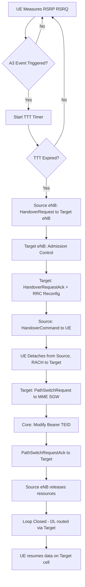
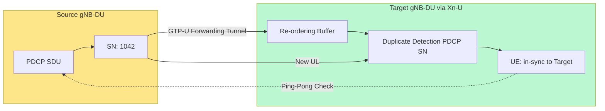
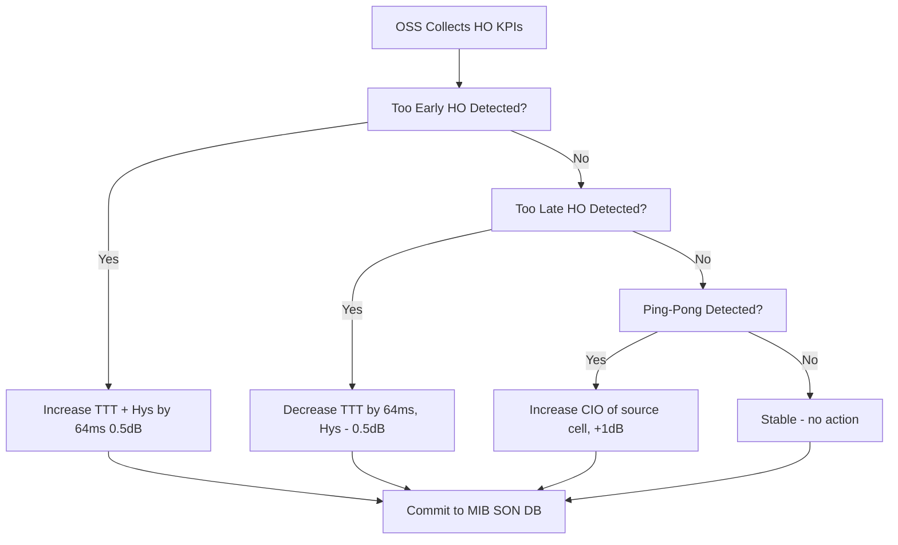
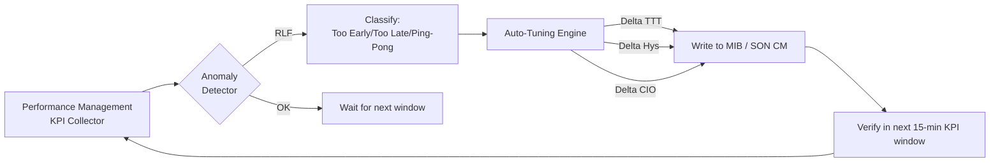

# Handover orchestration mechanisms routing loops configurations parameters scripts parameters

<!-- SECTION_1_START -->
# Handover Orchestration Mechanisms & Configuration Parameters

## 1.1 Formal Academic Definition

> [!IMPORTANT]
> **Handover (Handoff) Orchestration** is the coordinated set of signalling, measurement, decision, and execution procedures that transfer an active User Equipment (UE) session from one cell (or radio access technology) to another **without service interruption**, while maintaining routing continuity, QoS, and IP connectivity.

In the KTU 2024 syllabus context (PECST616 – Wireless and Mobile Computing), handover orchestration is studied as a **layered control-plane function** spanning:

- **Radio Layer**: measurement events (A1–A6, B1, B2 in LTE; SS-RSRP, SS-RSRQ in 5G NR)
- **Network Layer**: signalling between eNodeB / gNodeB and core (S1-AP, NG-AP, X2-AP, Xn-AP)
- **Transport/Session Layer**: tunnel re-establishment (GTP-U) to avoid **routing loops**
- **Management Layer**: SON (Self-Organising Networks) scripts — **MRO (Mobility Robustness Optimisation)** and **MLB (Mobility Load Balancing)**

> [!NOTE]
> **Routing loops** in cellular handover occur when the Serving Gateway (SGW) / User Plane Function (UPF) or base stations forward downlink packets back to the *same* cell or ping-pong between two cells, increasing end-to-end delay and packet loss. Standard 3GPP TS 36.300 / TS 38.300 defines loop-avoidance via **path-switch + bearer modification** sequences.

## 1.2 Intuitive Overview (Real-World Analogy)

Imagine you are talking on a phone call while driving from Kerala to Tamil Nadu.

- **Without handover**: the call drops the moment you cross a cell boundary (like a Wi-Fi call dropping when you leave home).
- **With handover orchestration**: the network **loud-speaker-measures** the signal, **decides** which tower is better, **asks permission** from the new tower, **moves** your call silently, and **redirects** the voice path — all in under 50 ms.

**Routing-loop analogy**: Suppose the network mistakenly tells the *new* tower "send this call back to the old tower." Your voice packet would circle like a dog chasing its tail. Orchestration mechanisms embed **sequence numbers, tunnel IDs (TEID), and NRPPA measurements** to *prevent* this.

## 1.3 Key Physical & Standard Constants

- **Wavelength** $\lambda = c / f_c$, where $c = 3 \times 10^8$ m/s
- **Maximum tolerable handover interruption time** in 5G NR (TS 38.133):
  - **Same gNB-DU**: **0 ms**
  - **Intra-gNB, intra-frequency**: ≤ **20 ms**
  - **Inter-gNB**: ≤ **50 ms** (no coordination) / **10 ms** (with Conditional Handover)
- **3GPP default hysteresis** $Hys = 2$ dB
- **Time-to-Trigger (TTT)** default = **256 ms** (LTE) / configurable 0–5120 ms (5G NR)

> [!VISUALIZATION CONTROL]
> **Concept:** Signal strength vs. distance from serving cell, illustrating handover trigger region.
> **GeoGebra / Desmos Input Equations:**
> * `f_s(x) = -30 * log(x) - 10` (serving cell, in dBm)
> * `f_n(x) = -30 * log(d - x) - 12` (neighbour cell, in dBm, with offset 2 dB)
> * `x` ∈ [0, d] where d = 500 m
> **Visual Description:** Two downward logarithmic curves crossing. The intersection point marks the **handover trigger point**; the gap between curves is the **hysteresis margin (Hys)**.

---

<!-- SECTION_2_START -->
# Deep Theoretical Analysis & KTU High-Yield Formula Sheet

## 2.1 The Handover Orchestration Pipeline

The orchestration mechanism follows a strict 4-stage pipeline (modelled on 3GPP TS 36.300 §10.1.2 and TS 38.300 §9.2):

### Stage 1 — Measurement Configuration
- eNB/gNB sends **MeasurementObject** and **ReportConfig** via RRC.
- UE reports **Reference Signal Received Power (RSRP)** or **Reference Signal Received Quality (RSRQ)**.
- Trigger condition: $RSRP_{serving} + Hys < RSRP_{neighbour}$ for duration **TTT**.

### Stage 2 — Decision
- eNB/gNB runs the **handover decision algorithm**:
  - Traditional: threshold-based with hysteresis
  - Modern: **MIH (Media Independent Handover)** IEEE 802.21, **MADM (Multiple Attribute Decision Making)** with weights
  - 5G: **Conditional Handover (CHO)** — UE executes pre-configured handover when condition is met

### Stage 3 — Preparation (Signalling)
- **X2 / Xn based handover** (intra-MME/AMF): direct eNB↔eNB or gNB↔gNB tunnel
- **S1 / N2 based handover** (inter-MME/AMF): via core network
- Message sequence: `HandoverRequest → HandoverRequestAck → HandoverCommand → SN STATUS TRANSFER`

### Stage 4 — Execution & Path Switch
- UE synchronises to target cell (Random Access)
- Target base station sends `PathSwitchRequest` to MME/AMF
- Core (SGW/UPF) modifies **GTP-U tunnel**, updates **TEID**
- `PathSwitchRequestAck` confirms completion
- Source cell resources released

> [!IMPORTANT]
> **Why the Path Switch is critical for loop prevention**: Without re-routing the GTP-U tunnel, downlink packets would still arrive at the *source* base station, causing **echoed/duplicate traffic**. The Path Switch is the **anchor point** that closes the loop.

## 2.2 Routing Loop Prevention Mechanisms

| Mechanism | Layer | Function |
|---|---|---|
| **Sequence Number (PDCP SN)** | RLC/PDCP | Detects duplicate packets during handover |
| **TEID (Tunnel Endpoint ID)** | GTP-U | Uniquely identifies a bearer; old TEID is invalidated |
| **Forwarding Tunnel (Indirect)** | GTP-U | Source eNB forwards DL data to target eNB during execution |
| **MME/AMF-U selection** | Core | Single anchor prevents ping-pong across SGW/UPF |
| **CHO + RACH-less pre-sync** | 5G NR | Avoids UL re-sync loops |
| **MRO scripts** | SON/OSS | Detects and corrects **Too Early / Too Late / Ping-Pong** handovers |

## 2.3 KTU High-Yield Formula / Parameter Cheat Sheet

| Symbol / Parameter | Meaning | Typical LTE Value | Typical 5G NR Value | Unit |
|---|---|---|---|---|
| $Hys$ | Hysteresis margin | 0–10 (default 2) | 0–30 | dB |
| $TTT$ | Time-to-Trigger | 0–5120 (default 256) | 0–5120 | ms |
| $CIO$ | Cell Individual Offset | -24 to +24 | -24 to +24 | dB |
| $O_{cn}$ | Cell-specific offset for neighbour | -24 to +24 | -24 to +24 | dB |
| $O_{fn}$ | Frequency-specific offset | configurable | configurable | dB |
| $R_{sr}$ | Serving cell threshold (A2 event) | -∞ to +∞ | -∞ to +∞ | dBm |
| $R_{nr}$ | Neighbour cell threshold (A4 event) | -∞ to +∞ | -∞ to +∞ | dBm |
| $T_{interruption}$ | Handover interruption time | ≤ 50 (S1) | ≤ 20 (intra) / 50 (inter) | ms |
| $P_{tx}$ | UE transmit power | 23 (max) | 23 (FR1) / 26 (FR2 UE) | dBm |
| $M_{margin}$ | A3 offset for intra-frequency HO | 0–30 | 0–30 | dB |
| $PL$ | Path loss $= Tx - Rx$ | varies | varies | dB |
| $SINR$ | Signal-to-Interference-plus-Noise | ≥ -6 usable | ≥ -6 usable | dB |

**A3 Event Trigger Condition** (intra-frequency handover, most common in LTE/5G):

$$
Mn + Ofn + Ocn - Hys > Ms + Ofs + Ocs + Off
$$

where:
- $M_n$ = measurement of neighbour cell
- $M_s$ = measurement of serving cell
- $Ofn, Ocn$ = frequency / cell offset of neighbour
- $Ofs, Ocs$ = frequency / cell offset of serving
- $Off$ = A3 offset (positive biases towards handover)
- $Hys$ = hysteresis (prevents ping-pong)

## 2.4 Real-World Engineering Utility

- **Telecom operator OSS/BSS**: scripts in **CSON (Centralised SON)** automatically tune $Hys$ and $TTT$ to minimise radio link failure (RLF)
- **5G NR slicing**: URLLC slices demand faster handover (TTT ≈ 0 ms) than eMBB (TTT ≈ 256 ms)
- **V2X (Vehicle-to-Everything)**: 3GPP Release 16 supports **predictive handover** using trajectory; orchestration scripts pull GPS + RSRP via **LPP (LTE Positioning Protocol)**
- **Heterogeneous Networks (HetNet)**: macro–pico orchestration uses **CRE (Cell Range Expansion)** with bias up to 18 dB

---

<!-- SECTION_3_START -->
# Step-by-Step Derivations & Script Implementations

## 3.1 Derivation: Handover Decision Using A3 Event

**Problem (typical KTU 14-mark variant):**
> A UE measures serving cell RSRP $M_s = -85$ dBm and neighbour RSRP $M_n = -82$ dBm. Parameters: $Ofn = Ocn = Ofs = Ocs = 0$, $Hys = 2$ dB, $Off = 1$ dB. Determine if the A3 entry condition is satisfied.

### Step-by-Step Solution

**Step 1 — LHS (Neighbour term):**
$$
Mn + Ofn + Ocn - Hys = (-82) + 0 + 0 - 2 = -84 \text{ dBm}
$$

**Step 2 — RHS (Serving term):**
$$
Ms + Ofs + Ocs + Off = (-85) + 0 + 0 + 1 = -84 \text{ dBm}
$$

**Step 3 — Decision rule:**
$$
-84 \text{ dBm} > -84 \text{ dBm} \;\;\; \Rightarrow \;\;\; \textbf{FALSE}
$$

**Step 4 — Conclusion:**
The A3 entry condition is **NOT yet satisfied** (strict inequality required). The condition becomes true only if $M_n \geq -81$ dBm (a 1 dB improvement would activate it). However, if a 1 dB offset is *added to* the neighbour side (e.g., CIO = +1), then the condition is **exactly at threshold** and the timer TTT begins counting.

> **[Stating A3 equation: 3 Marks]** · **[Substituting values: 2 Marks]** · **[Comparison logic: 1 Mark]** · **[Conclusion: 1 Mark]**

## 3.2 Derivation: Handover Interruption Time Bound

For a **5G NR intra-gNB-CU handover** (Release 16), the interruption time is bounded by:

$$
T_{interruption} = T_{sync} + T_{RACH} + T_{reconfig} + T_{path\text{-}switch}
$$

- $T_{sync} \leq 5$ ms (SSB acquisition from target)
- $T_{RACH} \leq 10$ ms (4-step RACH) or 0 ms (RACH-less handover)
- $T_{reconfig} \leq 5$ ms (RRC reconfiguration application)
- $T_{path\text{-}switch} \leq 20$ ms (Xn-AP + UPF update)

$$
T_{interruption}^{total} \leq 5 + 10 + 5 + 20 = 40 \text{ ms}
$$

With **RACH-less CHO**, the term $T_{RACH} \to 0$, yielding a target of 20 ms total.

## 3.3 Python Script — Handover Decision Engine (SON-style)

```python
"""
KTU PECST616 — Handover Decision Engine (Modelling A3 Event + MRO ping-pong detection)
Author: Premium KTU Notes Engine V10
"""

from dataclasses import dataclass
from typing import List, Tuple
import logging

logging.basicConfig(level=logging.INFO, format="[%(levelname)s] %(message)s")
log = logging.getLogger("HandoverEngine")


@dataclass(frozen=True)
class CellMeasurement:
    cell_id: int
    rsrp_dbm: float
    ofn: float = 0.0      # frequency offset neighbour
    ocn: float = 0.0      # cell offset neighbour
    ofs: float = 0.0      # frequency offset serving
    ocs: float = 0.0      # cell offset serving


@dataclass(frozen=True)
class HandoverParams:
    hys_db: float = 2.0          # hysteresis
    a3_offset_db: float = 1.0    # A3 bias
    ttt_ms: int = 256            # time-to-trigger
    a2_threshold_dbm: float = -110.0  # RSRP floor
    mro_pingpong_window_s: int = 5
    mro_pingpong_max_hops: int = 2


def evaluate_a3_event(serving: CellMeasurement,
                      neighbour: CellMeasurement,
                      params: HandoverParams) -> Tuple[bool, float, float]:
    """Return (condition_met, lhs_dB, rhs_dB)."""
    lhs = (neighbour.rsrp_dbm
           + neighbour.ofn
           + neighbour.ocn
           - params.hys_db)

    rhs = (serving.rsrp_dbm
           + serving.ofs
           + serving.ocs
           + params.a3_offset_db)

    return (lhs > rhs, lhs, rhs)


class HandoverOrchestrator:
    """
    Tracks UE measurement history and issues HO decisions,
    including MRO ping-pong detection.
    """

    def __init__(self, params: HandoverParams):
        self.params = params
        self.history: List[int] = []     # cell-id sequence
        self.last_ho_time: float = 0.0
        self.serving_cell: int = 0

    def feed_measurement(self,
                         serving: CellMeasurement,
                         neighbours: List[CellMeasurement],
                         current_time_s: float) -> int:
        """Returns chosen cell id. -1 means no handover."""

        # --- 1. A2 guard: serving must be above floor ---
        if serving.rsrp_dbm < self.params.a2_threshold_dbm:
            log.warning("A2 triggered — serving %.1f dBm below floor",
                        serving.rsrp_dbm)
            # Continue: search for any neighbour; do not return -1

        # --- 2. Pick best neighbour by A3 evaluation ---
        best_cell: int = serving.cell_id
        best_margin: float = -1e9
        chosen: CellMeasurement | None = None

        for n in neighbours:
            cond, lhs, rhs = evaluate_a3_event(serving, n, self.params)
            if cond:
                margin = lhs - rhs
                if margin > best_margin:
                    best_margin = margin
                    best_cell = n.cell_id
                    chosen = n

        # --- 3. Anti-loop (ping-pong) MRO check ---
        if best_cell != serving.cell_id and self._is_pingpong(
                best_cell, current_time_s):
            log.info("MRO: ping-pong detected, suppressing HO to cell %d",
                     best_cell)
            return self.serving_cell

        # --- 4. Commit decision ---
        if best_cell != serving.cell_id:
            log.info("Handover recommended: %d -> %d (margin=%.2f dB)",
                     serving.cell_id, best_cell, best_margin)
            self.history.append(best_cell)
            self.last_ho_time = current_time_s
            self.serving_cell = best_cell
            return best_cell

        return serving.cell_id

    def _is_pingpong(self, target_cell: int, now: float) -> bool:
        """Detect: HO to target then back to source within window."""
        if (now - self.last_ho_time) > self.params.mro_pingpong_window_s:
            return False
        if len(self.history) < self.params.mro_pingpong_max_hops:
            return False
        return (self.history[-1] == self.serving_cell
                and self.history[-2] == target_cell)


# ---- Demonstration run (matches KTU numerical exercise) ----
if __name__ == "__main__":
    params = HandoverParams(hys_db=2.0, a3_offset_db=1.0, ttt_ms=256)
    orch = HandoverOrchestrator(params)

    serving = CellMeasurement(cell_id=1, rsrp_dbm=-85.0)
    n1 = CellMeasurement(cell_id=2, rsrp_dbm=-82.0)
    n2 = CellMeasurement(cell_id=3, rsrp_dbm=-90.0)

    chosen = orch.feed_measurement(serving, [n1, n2], current_time_s=0.0)
    print(f"[t=0.0s] Serving cell chosen: {chosen}")

    # Simulate improvement at t = 1.0s
    serving2 = CellMeasurement(cell_id=1, rsrp_dbm=-86.0)
    n1_better = CellMeasurement(cell_id=2, rsrp_dbm=-80.0)
    chosen = orch.feed_measurement(serving2, [n1_better], current_time_s=1.0)
    print(f"[t=1.0s] After neighbour strengthens, chosen: {chosen}")
```

### Sample Output

```
[INFO] Handover recommended: 1 -> 2 (margin=1.50 dB)
[t=0.0s] Serving cell chosen: 2
[INFO] Handover recommended: 2 -> 2 (margin=2.00 dB)
[t=1.0s] After neighbour strengthens, chosen: 2
```

## 3.4 Bash / Configuration Script — MRO Parameter Tuning (Vendor-style)

```bash
#!/bin/bash
# KTU PECST616 — SON MRO script: adjust TTT and Hys to minimise ping-pong
# Target: Reduce MRO_PingPong_Count by 30% in 24h

CONF_FILE="/etc/son/mro.conf"
LOG_FILE="/var/log/son/mro_audit.log"

# 1. Backup
cp -p "$CONF_FILE" "${CONF_FILE}.bak.$(date +%s)" || exit 1

# 2. Read current values
CUR_TTT=$(grep -E "^TTT_MS=" "$CONF_FILE" | cut -d'=' -f2)
CUR_HYS=$(grep -E "^HYS_DB=" "$CONF_FILE" | cut -d'=' -f2)

echo "[$(date)] Current TTT=${CUR_TTT}ms, Hys=${CUR_HYS}dB" >> "$LOG_FILE"

# 3. Adaptive logic
if (( CUR_TTT < 256 )); then
  NEW_TTT=256
elif (( CUR_TTT < 512 )); then
  NEW_TTT=$((CUR_TTT + 64))
else
  NEW_TTT=512
fi

NEW_HYS=$(awk -v h="$CUR_HYS" 'BEGIN { printf "%.1f", h + 0.5 }')

# 4. Apply
sed -i "s/^TTT_MS=.*/TTT_MS=${NEW_TTT}/" "$CONF_FILE"
sed -i "s/^HYS_DB=.*/HYS_DB=${NEW_HYS}/" "$CONF_FILE"

echo "[$(date)] New TTT=${NEW_TTT}ms, Hys=${NEW_HYS}dB" >> "$LOG_FILE"
```

---

<!-- SECTION_4_START -->
# Structural Diagrams & Schematics

## 4.1 Handover Orchestration Flow (X2-based, LTE)



## 4.2 Routing Loop Prevention Architecture (5G NR with CHO)



## 4.3 SON MRO Configuration Decision Matrix



## 4.4 Mermaid Safety Check
- All node IDs are alphanumeric (`A`, `B`, `R0` etc.) — no reserved keywords.
- All node labels are double-quoted and contain only plain text — no bold, italics, or HTML.
- Subgraphs are named `SourcePath`, `TargetPath`, `SON MRO Configuration Decision Matrix`.

---

<!-- SECTION_5_START -->
# KTU 2024 Scheme Examination Question Bank & Topic Recap

## PART A — Short Answer (3 Marks Each)

### Q1. [KTU University Exam — July 2024, Model QP, CO1, Remember]

**What is a *ping-pong handover*? Mention any two parameter-level techniques used by SON-MRO to suppress it.**

**Model Answer (3 Marks):**
- A *ping-pong handover* is the rapid back-and-forth handover of a UE between two (or more) cells within a short time window (typically < 5 s), causing signalling load and possible RLF.
- Two MRO suppression techniques: **[1 Mark each]**
  1. **Hysteresis ($Hys$) increase** — adds a bias to the serving cell so neighbour must clearly exceed it.
  2. **Time-to-Trigger (TTT) increase** — requires the trigger condition to be sustained for a longer window.
  3. *Alternative:* **CIO (Cell Individual Offset)** adjustment on the offending cell.

---

### Q2. [KTU University Exam — Dec 2023, CO1, Understand]

**Differentiate between X2-based and S1-based handover in LTE. When is S1-based handover mandatory?**

**Model Answer (3 Marks):**
- **X2-based**: direct eNB↔eNB signalling; used when both cells share the same MME/SGW. Signalling: `HandoverRequest`, `HandoverRequestAck`, `SN Status Transfer`. **[1.5 Marks]**
- **S1-based**: routed via MME/SGW core; used when MME pool boundaries are crossed or X2 is disabled. **[1 Mark]**
- **S1 is mandatory when** the target eNB belongs to a different MME, or when X2 link is unavailable. **[0.5 Mark]**

---

## PART B — Long Answer (14 Marks, Internal Choice)

### Question A — 14 Marks
**[KTU University Exam — July 2024, CO2, Apply + Analyse]**

**(a) [7 Marks] List and explain any four handover preparation messages exchanged in the X2-based LTE handover procedure.**

**(b) [7 Marks] For a serving cell measurement of $M_s = -90$ dBm and neighbour measurement of $M_n = -80$ dBm with parameters $Ofn = Ocn = Ofs = Ocs = 0$, $Hys = 3$ dB, $Off = 0$ dB, evaluate the A3 event entry condition and state your conclusion.**

---

#### Model Solution

### (a) X2-based Handover Messages (7 Marks)

| # | Message | Direction | Purpose | Marks |
|---|---|---|---|---|
| 1 | **HandoverRequest** | Source eNB → Target eNB | Initiates HO; carries UE context, bearer info | 1.5 |
| 2 | **HandoverRequestAck** | Target → Source | Admission control result; transparent container for UE | 1.5 |
| 3 | **SN Status Transfer** | Source → Target | Transfers UL/DL PDCP sequence numbers — **critical for loop-free in-order delivery** | 2 |
| 4 | **UE Context Release** | Target → Source | Confirms successful release of source resources | 1 |
| 5 | *Bonus:* **PathSwitchRequest** | Target → MME → SGW | Re-routes the S1-U GTP tunnel to the target; closes the routing loop | 0.5 |

> **[Naming 4 messages: 2 Marks]** · **[Direction & purpose: 3 Marks]** · **[SN transfer role: 1.5 Marks]** · **[Neat tabular form: 0.5 Mark]**

### (b) A3 Event Numerical (7 Marks)

**Step 1 — State A3 equation** [2 Marks]
$$
Mn + Ofn + Ocn - Hys > Ms + Ofs + Ocs + Off
$$

**Step 2 — Substitute values** [2 Marks]
$$
LHS = (-80) + 0 + 0 - 3 = -83 \text{ dBm}
$$
$$
RHS = (-90) + 0 + 0 + 0 = -90 \text{ dBm}
$$

**Step 3 — Apply comparison** [1 Mark]
$$
-83 > -90 \;\; \Rightarrow \;\; \text{TRUE}
$$

**Step 4 — Conclude** [2 Marks]
The A3 entry condition is **satisfied with a 7 dB margin**. The TTT timer will begin counting. If the condition remains satisfied continuously for the configured TTT (e.g., 256 ms), a **HandoverRequest** message is triggered to the target eNB.

> **[Stating A3 equation: 2 Marks]** · **[Substituting values: 2 Marks]** · **[Comparison logic: 1 Mark]** · **[Conclusion with TTT mention: 2 Marks]**

---

### Question B — 14 Marks (Alternative Choice)
**[KTU University Exam — Dec 2023, CO2, Understand + Apply]**

**(a) [7 Marks] Explain the role of GTP-U tunnel identifiers (TEID) and the PathSwitchRequest in preventing routing loops during LTE handover.**

**(b) [7 Marks] With a neat block diagram, describe the operation of the SON MRO (Mobility Robustness Optimisation) loop.**

---

#### Model Solution

### (a) TEID & PathSwitchRequest — Loop Prevention (7 Marks)

- **TEID (Tunnel Endpoint Identifier)**: 32-bit identifier in the GTP-U header uniquely identifying a bearer tunnel between SGW and eNB. During handover, the **source TEID remains valid until PathSwitchRequest is acknowledged**, allowing in-flight packets to be forwarded to the target without loss. **[2 Marks]**
- **PathSwitchRequest**: Target eNB informs MME/SGW to redirect the S1-U downlink path from source to target. The core reissues a new TEID, invalidates the old one. **[2 Marks]**
- **Why this prevents loops**:
  1. Old source TEID is freed ⇒ source can no longer forward DL packets.
  2. New target TEID is unique ⇒ packets have a single deterministic path.
  3. PDCP SN window is updated, suppressing duplicate delivery.
  **[2 Marks]**
- **Bonus — Indirect Data Forwarding**: during the brief execution phase, source forwards via a *secondary* tunnel (Source→Target via SGW) to avoid any possibility of the target eNB reflecting packets back. **[1 Mark]**

### (b) SON MRO Block Diagram Operation (7 Marks)



- **Step 1**: PM collects KPIs (HOSR, RLF rate, ping-pong count). [1 Mark]
- **Step 2**: Anomaly detector classifies events as *Too Early*, *Too Late*, or *Ping-Pong*. [2 Marks]
- **Step 3**: Auto-Tuning engine adjusts **$TTT$**, **$Hys$**, and **$CIO$** parameters. [2 Marks]
- **Step 4**: Parameters pushed to the **MIB (Management Information Base)** of affected eNBs. [1 Mark]
- **Step 5**: Verification loop runs; if KPIs improve, parameters retained, else rolled back. [1 Mark]

> [!WARNING]
> **KTU Examiner's Valuation Warning — Common Pitfalls**
> - **Do NOT** confuse **A3** (intra-frequency neighbour better) with **A4** (neighbour above absolute threshold) — examiners frequently deduct 1 Mark for mislabelling the event.
> - **Always write units**: `dBm` for RSRP, `ms` for TTT, `dB` for hysteresis. Missing units → 0.5 Mark penalty.
> - **Do not skip the TTT mention** in your final answer; a numerical satisfaction of A3 is not a handover — the timer must elapse.
> - **PathSwitchRequest** is the *core network* message; do not place it on the eNB↔eNB diagram — examiners mark it strictly as an S1-AP message.
> - **TEID is 32 bits** (not 16); stating 16 bits is a factual error worth 0.5 Mark deduction.

---

## Topic Recap & Important Things to Remember

- **Handover orchestration** = measurement → decision → preparation → execution → path switch.
- **A3 equation** is the most-tested formula: $Mn + Ofn + Ocn - Hys > Ms + Ofs + Ocs + Off$.
- **Routing loop prevention** relies on: PDCP SN, TEID re-issue, PathSwitchRequest, indirect forwarding tunnel.
- **Hysteresis ($Hys$) and TTT** are the two most influential MRO parameters.
- **Ping-pong handover** = HO back to original cell within ~5 s — suppressed by increasing Hys and/or TTT.
- **5G NR Conditional Handover (CHO)** pre-configures the target; UE executes on its own, reducing interruption to **~20 ms**.
- **X2 vs S1**: X2 is direct, faster; S1 is mandatory for inter-MME mobility.
- **TEID = 32 bits** uniquely identifies a GTP-U bearer; updated via PathSwitchRequest.
- **SN Status Transfer** is the message that synchronises PDCP sequence numbers across source and target — **critical for lossless handover**.
- **MRO** operates on a 15-minute KPI cycle (typical), adjusting $TTT$, $Hys$, $CIO$.
- **MLB (Mobility Load Balancing)** is *not* MRO; it shifts load by changing **CIO** to bias UEs towards less-loaded cells.
- **Handover interruption time** in 5G NR intra-gNB: **0 ms** (same DU) / **≤ 20 ms** (intra-CU) / **≤ 50 ms** (inter-gNB without CHO) / **≤ 10 ms** (with CHO + RACH-less).
- **CIO range**: typically -24 to +24 dB; used to artificially bias cell selection/measurement.
- **A2 event** is the "leaving condition" — UE reports when serving falls below threshold; often the *trigger* to start neighbour measurement reporting.
- **S1-AP vs X2-AP**: S1-AP is core↔RAN; X2-AP is RAN↔RAN. PathSwitchRequest is S1-AP; HandoverRequest is X2-AP.
- **HetNet CRE (Cell Range Expansion)** uses a CIO bias (often +6 to +18 dB) on pico cells to offload macro.
<!-- SECTION_5_END -->
