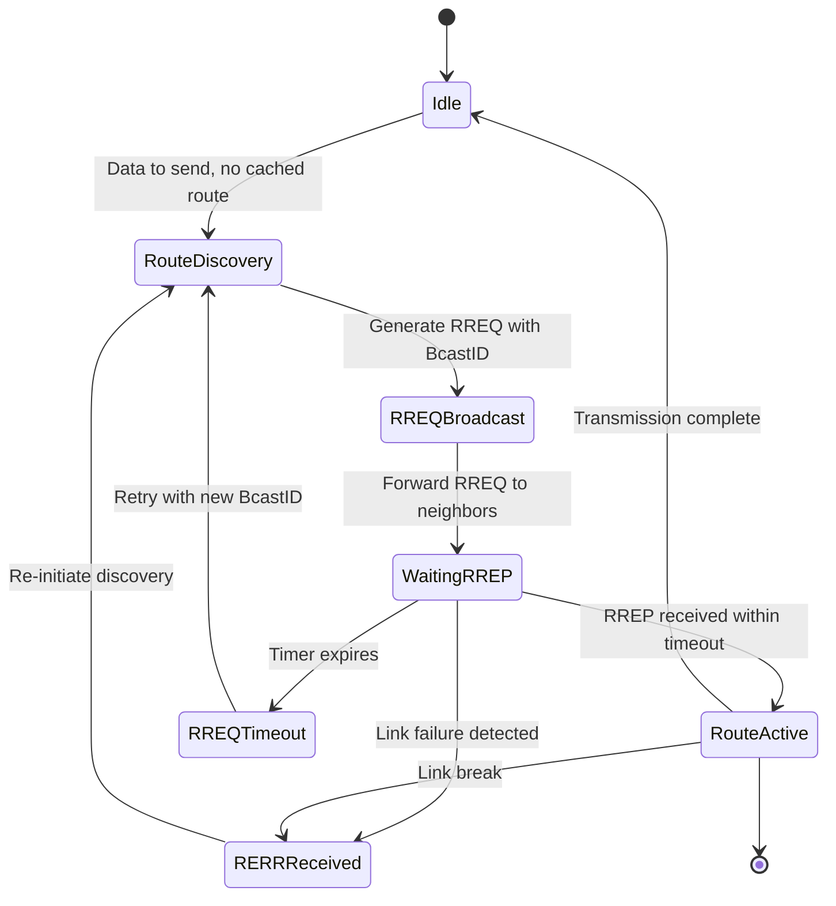
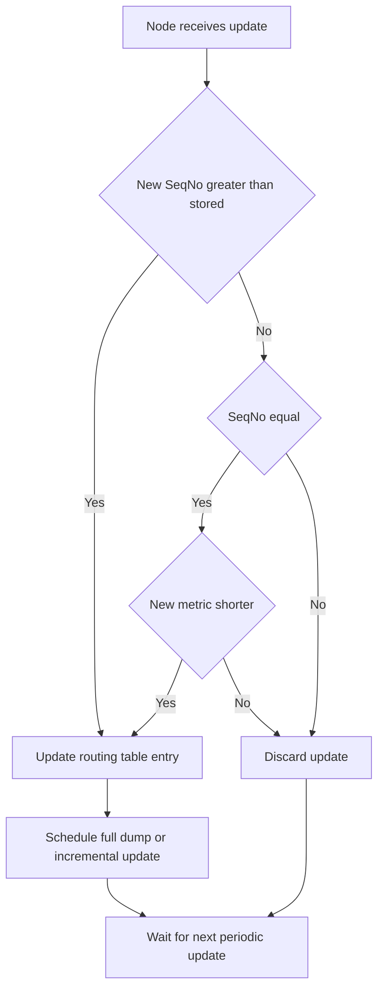
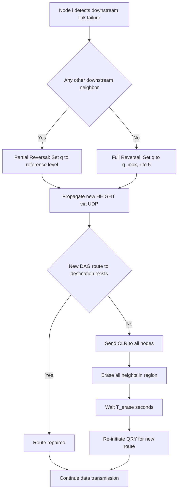
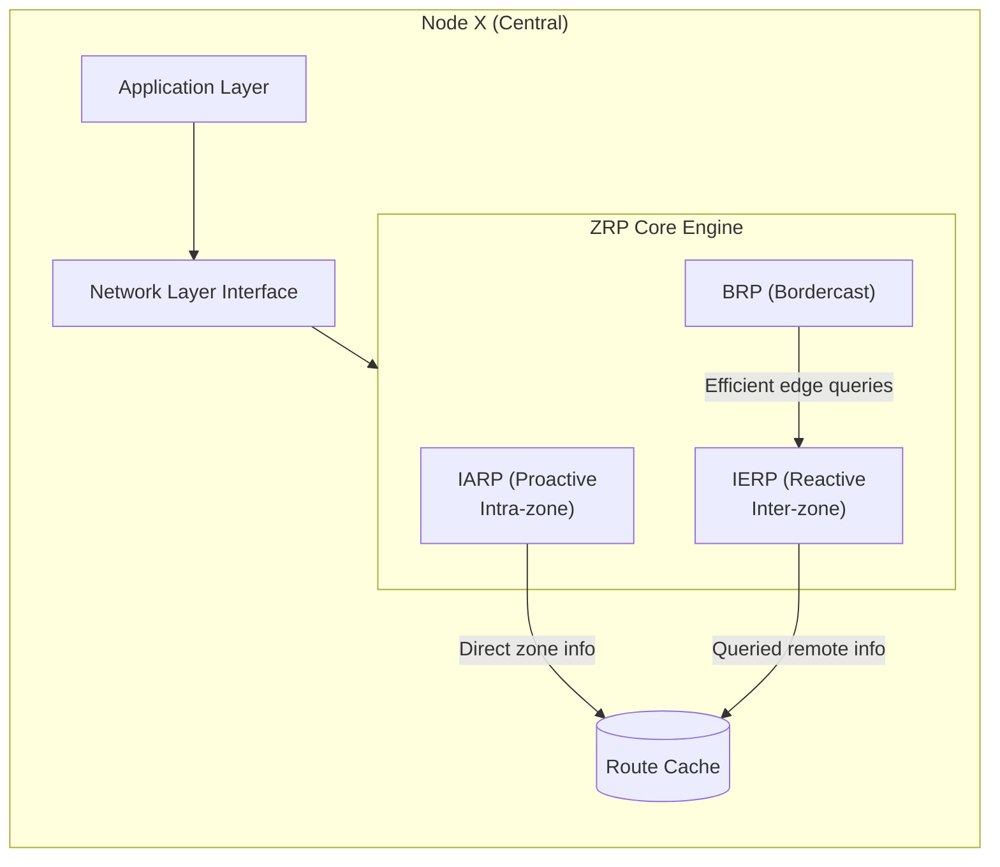
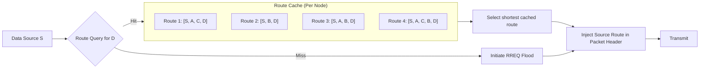
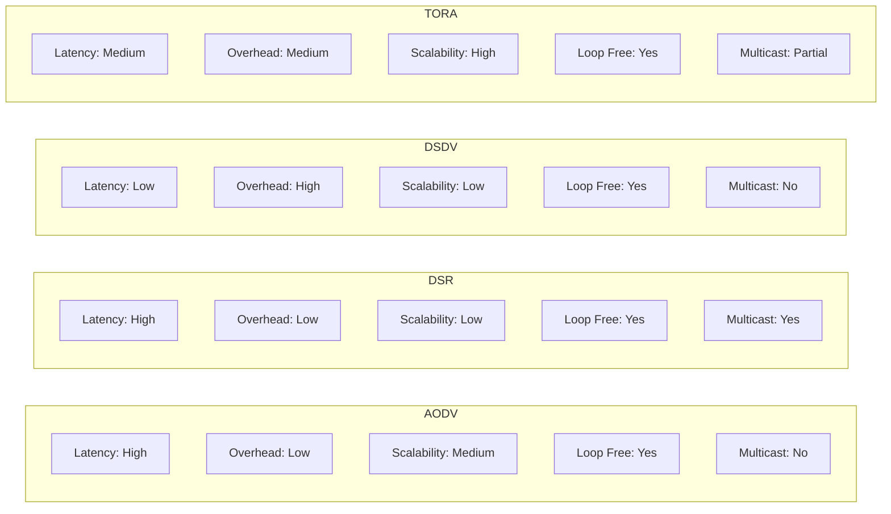

# Ad-hoc network dynamic routing frameworks algorithms execution paths tracking configurations

<!-- SECTION_1_START -->

# Ad-Hoc Network Dynamic Routing Frameworks

## 1. Core Technical Definition

> [!IMPORTANT]
> **Formal KTU 2024 Definition:**
> A **Mobile Ad-hoc NETwork (MANET)** is a self-configuring, infrastructure-less network of mobile devices connected by wireless links. **Dynamic Routing Frameworks** in MANETs are a class of distributed, multi-hop routing algorithms that autonomously discover, maintain, and reconfigure end-to-end execution paths in response to continuous topological mutations caused by node mobility, link failures, and energy depletion — without reliance on any pre-existing fixed infrastructure or centralized administrative entity.

In the KTU 2024 Scheme (Course: PECST616 – Wireless and Mobile Computing, Module 2), dynamic routing frameworks are classified under three taxonomic pillars:

| Taxonomy | Mechanism | Example Protocols |
| :--- | :--- | :--- |
| **Proactive (Table-Driven)** | Continuous topology tables maintained at every node | DSDV, OLSR, CGSR |
| **Reactive (On-Demand)** | Routes discovered only when a source demands transmission | AODV, DSR, TORA |
| **Hybrid (Zone-Based)** | Combination of proactive + reactive with regional scope | ZRP, ZHLS |

## 2. Intuitive Overview — The "Road-Trip Analogy"

> [!NOTE]
> **Conceptual Analogy — "The Moving City Without Traffic Lights":**
> Imagine a city (the MANET) where houses (mobile nodes) are mounted on wheels, constantly relocating. There are no traffic lights, no fixed road signs, and no centralized traffic control tower. When a citizen (source node) wants to send a letter (packet) to another citizen (destination node), they must **dynamically ask neighbors**, "Do you know anyone who can reach Mr. X?" This neighbor-to-neighbor discovery is what we call **dynamic routing**. If the road they suggested collapses (link failure), the search begins again — this is **path reconfiguration tracking**.

In engineering terms:
- A node broadcasts a **Route Request (RREQ)** like asking, "Has anyone seen Destination?"
- A node that knows the path replies with a **Route Reply (RREP)** carrying the entire address sequence.
- Every node along the way maintains a **route cache** to remember valid execution paths, just like GPS memory saves frequent trips.

## 3. Key Terminology and Physical Constants

> [!IMPORTANT]
> - **Hop Count ($H$):** Number of intermediate nodes a packet traverses between source $S$ and destination $D$.
> - **Route Latency ($L_r$):** Time delay between route request and route establishment.
> - **End-to-End Delay ($D_{e2e}$):** Cumulative latency from packet generation to reception.
> - **Packet Delivery Ratio (PDR):** Ratio of packets successfully delivered to packets transmitted.
> - **Route Discovery Frequency ($f_{rd}$):** Number of new route discoveries initiated per unit time.
> - **Mobility Metric ($M$):** Measured in **m/s** (meters per second), governing link stability.
> - **Standard wireless transmission range:** typically **$R_t = 100$ m to $250$ m** (IEEE 802.11b/g).
> - **Standard bandwidth:** **$B = 2$ Mbps to $54$ Mbps** depending on PHY layer.

## 4. Visualization Control

> [!VISUALIZATION CONTROL]
> **Concept:** Multi-Hop Dynamic Route Discovery in MANET
> **GeoGebra / Desmos Input Equations:**
> * `Node_S = (0, 0)` — Source node
> * `Node_A = (3, 4)` — Intermediate hop 1
> * `Node_B = (7, 5)` — Intermediate hop 2
> * `Node_C = (11, 2)` — Intermediate hop 3
> * `Node_D = (15, 0)` — Destination
> * `Circle((3, 4), 2.5)` — Transmission range of Node A
> * `Circle((7, 5), 2.5)` — Transmission range of Node B
> * `Line((0, 0), (3, 4))` — Hop 1 link
> * `Line((3, 4), (7, 5))` — Hop 2 link
> * `Line((7, 5), (11, 2))` — Hop 3 link
> * `Line((11, 2), (15, 0))` — Hop 4 link
> **Visual Description:** The student should observe a non-linear, snake-like path where each circle (transmission range) overlaps with its adjacent circle, allowing multi-hop relay. As nodes move, these circles will overlap or separate, breaking the route.

<!-- SECTION_1_END -->

<!-- SECTION_2_START -->

# Deep Theoretical Analysis & KTU High-Yield Formula Sheet

## 1. Classification of Dynamic Routing Frameworks

### A. Proactive Routing (Table-Driven)

> [!NOTE]
> **Operational Philosophy:** Maintain fresh routes to *all* destinations *all the time*, regardless of traffic demand.

**Key Characteristics:**
- Each node maintains a routing table covering the entire network topology.
- Periodic hello/control packets flood the network to detect link changes.
- Latency on first packet transmission is near-zero (route is pre-computed).
- High control overhead in highly mobile networks — a critical KTU examination point.

**DSDV (Destination Sequenced Distance Vector):**
- Extends the classical Bellman-Ford algorithm with sequence numbers to prevent routing loops.
- Each routing table entry: `(Destination, Next Hop, Metric, Sequence Number)`.
- Sequence numbers are assigned by the destination node; even numbers indicate fresh routes, odd numbers indicate expired links.
- Two update modes: **Full Dump** (entire table) and **Incremental** (only changes).

**OLSR (Optimized Link State Routing):**
- Uses **MPR (Multi-Point Relays)** to reduce flooding overhead.
- Only MPR-selected nodes forward broadcast packets, drastically reducing control traffic.
- Each node selects a minimal subset of one-hop neighbors covering all two-hop neighbors as MPRs.

### B. Reactive Routing (On-Demand)

> [!IMPORTANT]
> **Operational Philosophy:** Establish a route *only* when the application layer demands it. The "lazy" but bandwidth-efficient approach — central to most KTU exam questions.

**DSR (Dynamic Source Routing):**
- **Source Routing** mechanism: the entire route is embedded in the packet header.
- Two phases: **Route Discovery** (broadcast RREQ) and **Route Maintenance** (RERR on link failure).
- Each node maintains a **Route Cache** storing multiple alternate paths.
- No periodic routing updates — purely on-demand.

**AODV (Ad-hoc On-demand Distance Vector):**
- Hybrid of DSDV's sequence numbers and DSR's on-demand mechanism.
- Uses **hop-by-hop routing** (route not stored in packet header, only in intermediate tables).
- RREQ carries: `<Source_Addr, Broadcast_ID, Dest_Addr, Dest_SeqNo, Hop_Count>`.
- RREP carries: `<Source_Addr, Dest_Addr, Dest_SeqNo, Hop_Count, Lifetime>`.
- Each node maintains **precursor list** for forwarding RERR on link failure.

**TORA (Temporally Ordered Routing Algorithm):**
- **Link Reversal** algorithm inspired by water-flow physics.
- Creates a **Directed Acyclic Graph (DAG)** rooted at the destination.
- Uses three types of packets: **QRY (Query)**, **UDP (Update)**, **CLR (Clear)**.
- Highly adaptive to topological changes; supports multiple routes to a destination.
- TORA computes a metric called **Height** for each node representing the "level" above the destination.

### C. Hybrid Routing (Zone-Based)

**ZRP (Zone Routing Protocol):**
- Each node defines a **routing zone** of radius $\rho$ hops (typically $\rho = 2$).
- **IARP (Intrazone Routing Protocol)** — proactive within zone.
- **IERP (Interzone Routing Protocol)** — reactive between zones.
- **BRP (Bordercast Resolution Protocol)** — efficient query delivery at zone borders.

## 2. The Dynamic Route Discovery Lifecycle (Universal Model)

Every reactive protocol follows this canonical state machine:

1. **Idle State** — Node has no traffic, no active route.
2. **Route Request Initiation** — Source $S$ broadcasts RREQ if no cached route exists.
3. **Request Forwarding & Propagation** — Intermediate nodes rebroadcast RREQ with updated hop count.
4. **Destination or Cached Reply** — Destination (or a node with fresh cached route) unicasts RREP back to $S$.
5. **Route Establishment** — Forward and reverse paths installed in routing tables.
6. **Data Transmission** — User data flows along the established path.
7. **Route Maintenance / Monitoring** — Hello messages or link-layer ACKs detect failures.
8. **Route Error (RERR) Propagation** — On link failure, upstream nodes purge entries and notify $S$.
9. **Re-Trigger of Discovery** — Source may re-initiate discovery or use cached backup path.

## 3. KTU High-Yield Formula Sheet

> [!IMPORTANT]
> The following table consolidates all critical equations for KTU Board Examination preparation. Subscripts are LaTeX-isolated to prevent markdown corruption.

| # | Metric / Formula | LaTeX Expression | Engineering Meaning |
| :--- | :--- | :--- | :--- |
| 1 | End-to-End Delay | $D_{e2e} = \sum_{i=1}^{H} \left( T_{tx_i} + T_{prop_i} + T_{queue_i} + T_{proc_i} \right)$ | Cumulative packet latency across all $H$ hops |
| 2 | Packet Delivery Ratio | $PDR = \dfrac{N_{received}}{N_{sent}} \times 100\%$ | Network reliability index |
| 3 | Throughput | $\eta = \dfrac{N_{received} \times L_{packet}}{T_{duration}}$ | Effective data rate in **bps** |
| 4 | Route Discovery Latency | $L_{rd} = 2 \times H \times T_{hop} + T_{proc}$ | Time from RREQ to RREP arrival |
| 5 | Routing Overhead | $R_{OH} = \dfrac{N_{ctrl\_pkts}}{N_{data\_pkts}}$ | Control-to-data ratio |
| 6 | Hop Count Bound (Minimum) | $H_{min} = \lceil \dfrac{d_{euclid}}{R_t} \rceil$ | Lower bound on hops given Euclidean distance $d_{euclid}$ and range $R_t$ |
| 7 | Path Optimality Ratio | $\phi = \dfrac{H_{actual}}{H_{shortest}}$ | How close the discovered path is to optimal |
| 8 | Link Stability Probability | $P_{stable}(t) = e^{-\lambda t}$ | Probability link survives for time $t$ (exponential mobility model) |
| 9 | DSDV Sequence Update Rule | $Seq_{new} = \begin{cases} Seq_{dest} & \text{if new} > Seq_{old} \\ Seq_{old} + 1 & \text{else} \end{cases}$ | Loop-free route acceptance |
| 10 | TORA Height Metric | $H_T(n) = (q, r, d, i)$ | Quintuple: reference level, delta, node ID, reflection flag |
| 11 | ZRP Zone Radius Optimality | $\rho_{opt} \approx \sqrt{\dfrac{N}{\pi \cdot \text{density}}}$ | Best $\rho$ for balanced overhead |
| 12 | AODV RREQ Broadcast Storm | $N_{rebroadcast} \leq (H-1)^{2}$ | Upper bound on redundant RREQ transmissions |
| 13 | AODV Sequence Number Logic | $Seq_{D}^{new} > Seq_{D}^{old}$ OR ($Seq_{D}^{new} = Seq_{D}^{old}$ AND $Hop_{new} < Hop_{old}$) | Route acceptance criterion |
| 14 | DSR Route Cache Hit Rate | $P_{hit} = 1 - e^{-\lambda_{req} \cdot \tau_{cache}}$ | Cache usefulness over request rate $\lambda_{req}$ |
| 15 | Network Partition Probability | $P_{part} = 1 - e^{-N \cdot \pi R_t^{2} \cdot \rho_{node} / A_{area}}$ | Risk of network split given node density $\rho_{node}$ |

## 4. Real-World Engineering Applications

- **Military Battlefield Networks:** Soldier-to-soldier communication without infrastructure (DARPA's NTDR).
- **Disaster Recovery:** When cellular towers collapse (e.g., post-earthquake scenarios), MANETs enable first-responder coordination.
- **Vehicular Ad-hoc Networks (VANETs):** V2V (Vehicle-to-Vehicle) communication for collision avoidance.
- **IoT Mesh Networks:** Zigbee, Thread, and Bluetooth Mesh implement reactive-adjacent protocols.
- **Aerial Swarms:** UAV (drone) coordination uses reactive routing for changing 3D topologies.
- **Underwater Sensor Networks (UWSN):** Acoustic MANETs with extremely high $D_{e2e}$ due to sound propagation (≈ **1500 m/s**).

<!-- SECTION_2_END -->

<!-- SECTION_3_START -->

# Step-by-Step Derivations, Pseudocode & Algorithmic Walkthroughs

## 1. AODV — Complete Route Discovery Algorithm (Step-by-Step)

> [!NOTE]
> The following exhaustive walkthrough mirrors a typical KTU 14-mark problem: "Trace AODV route discovery from $S$ to $D$ across the given topology."

### Given Topology (KTU Standard Problem Setup)

**Nodes and links (bidirectional, symmetric):**
- $S$ — $A$, $S$ — $B$
- $A$ — $C$, $A$ — $B$
- $B$ — $D$, $C$ — $D$
- $D$ — $E$ (destination)

Source $S$ wants to send a packet to $D$. $S$ has **no cached route** to $D$.

### Step 1: Route Request (RREQ) Initiation at $S$

$S$ constructs the RREQ packet:

$$
RREQ = \langle SrcAddr = S, \quad BcastID = 17, \quad DestAddr = D, \quad DestSeqNo = 42, \quad HopCnt = 0 \rangle
$$

$S$ broadcasts the RREQ to all neighbors ($A$ and $B$).

> **[Valuation Key: RREQ field specification: 1 Mark]**

### Step 2: RREQ Reception at Node $A$

$A$ examines the RREQ:
- Is $(SrcAddr, BcastID)$ a duplicate? **No** (first time seeing $BcastID = 17$ from $S$).
- Increment $HopCnt$: $HopCnt = 0 + 1 = 1$.
- Set up a **reverse route** to $S$: $Route\_Table_A[S] = (NextHop = S, HopCnt = 1, Lifetime = 3000\,ms)$.
- Does $A$ have a fresh route to $D$? **No** (no cache hit).
- Rebroadcast RREQ to $A$'s neighbors (except the one it came from): $C$ and $B$.

$$
RREQ_{forward} = \langle SrcAddr = S, \quad BcastID = 17, \quad DestAddr = D, \quad DestSeqNo = 42, \quad HopCnt = 1 \rangle
$$

### Step 3: RREQ Reception at Node $B$

$B$ follows the identical logic:
- Reverse route to $S$: $Route\_Table_B[S] = (NextHop = S, HopCnt = 1, Lifetime = 3000\,ms)$.
- No cached route to $D$.
- Rebroadcast RREQ with $HopCnt = 1$ to neighbors: $A$, $D$ (excluding $S$).

### Step 4: RREQ Arrives at $C$

- $C$ sees this is the **first RREQ** from $S$ with $BcastID = 17$ — fresh.
- Reverse route to $S$: $Route\_Table_C[S] = (NextHop = A, HopCnt = 2, Lifetime = 3000\,ms)$.
- $HopCnt = 2$.
- Rebroadcast to $D$.

### Step 5: RREQ Arrives at $D$ (Destination)

$D$ is the destination, so it must generate a **Route Reply (RREP)**.

Reverse path back to $S$ can be tracked from the RREQ — $D$ creates:

$$
RREP = \langle SrcAddr = D, \quad DestAddr = S, \quad DestSeqNo = 42, \quad HopCnt = 0, \quad Lifetime = 3000\,ms \rangle
$$

$D$ unicasts RREP to the node from which it first received the RREQ with the freshest sequence number (let's say via $C$).

> **[Valuation Key: RREP generation logic: 2 Marks]**

### Step 6: RREP Forwarded by $C$

- $C$ sets up a **forward route** to $D$: $Route\_Table_C[D] = (NextHop = D, HopCnt = 1, Lifetime = 3000\,ms)$.
- $C$ looks up reverse path to $S$: $NextHop = A$.
- Forwards RREP to $A$ with $HopCnt = 1$.

### Step 7: RREP Forwarded by $A$

- $Route\_Table_A[D] = (NextHop = C, HopCnt = 2, Lifetime = 3000\,ms)$.
- Reverse path to $S$: $NextHop = S$.
- Forwards RREP to $S$ with $HopCnt = 2$.

### Step 8: Route Established at $S$

$$
Route\_Table_S[D] = (NextHop = A, \quad HopCnt = 2, \quad Lifetime = 3000\,ms, \quad DestSeqNo = 42)
$$

The active path is: $S \rightarrow A \rightarrow C \rightarrow D$ (3 hops, $H = 3$).

> **[Valuation Key: Final route table at S: 2 Marks]**

### Final Routing Tables (Verified State)

| Node | Destination | Next Hop | Hop Count | Sequence Number | Lifetime (ms) |
| :---: | :---: | :---: | :---: | :---: | :---: |
| $S$ | $D$ | $A$ | $2$ | $42$ | $3000$ |
| $A$ | $D$ | $C$ | $2$ | $42$ | $3000$ |
| $A$ | $S$ | $S$ | $1$ | $38$ | $3000$ |
| $C$ | $D$ | $D$ | $1$ | $42$ | $3000$ |
| $C$ | $S$ | $A$ | $2$ | $38$ | $3000$ |
| $D$ | $S$ | $C$ | $3$ | $38$ | $3000$ |

---

## 2. DSR — Complete Route Discovery with Source-Routing Header

> [!NOTE]
> The hallmark of DSR is the **complete source route** in the packet header. Walk through a similar topology to appreciate the difference.

### Algorithm: DSR Route Discovery

**Step 1:** $S$ checks Route Cache. **Miss** — no entry for $D$.

**Step 2:** $S$ generates RREQ and appends its own address:

$$
RREQ_{S} = \langle \text{Path} = [S], \quad BcastID = 7, \quad DestAddr = D \rangle
$$

**Step 3:** $A$ receives RREQ, appends itself:

$$
RREQ_{A} = \langle \text{Path} = [S, A], \quad BcastID = 7, \quad DestAddr = D \rangle
$$

**Step 4:** $B$ receives RREQ, appends itself:

$$
RREQ_{B} = \langle \text{Path} = [S, B], \quad BcastID = 7, \quad DestAddr = D \rangle
$$

**Step 5:** $C$ receives RREQ via $A$, appends itself:

$$
RREQ_{C} = \langle \text{Path} = [S, A, C], \quad BcastID = 7, \quad DestAddr = D \rangle
$$

**Step 6:** $D$ receives RREQ with full path $[S, A, C, D]$ — this is the **complete source route**.

**Step 7:** $D$ unicasts RREP back along the **reverse path** (no need for routing tables!):

$$
RREP = \langle \text{Path} = [S, A, C, D], \quad SourceRoute = [D, C, A, S] \rangle
$$

**Step 8:** Each intermediate node **learns** the route and caches it in its own Route Cache.

### Final DSR Source Route:

$$
\text{Data Packet Header} = \langle SourceRoute = [D, C, A, S], \quad Payload = \text{user data} \rangle
$$

**Interpretation:** When $S$ sends data, it writes the entire path $[S, A, C, D]$ in every packet header. Each node reads its position and forwards to the next hop.

---

## 3. Python Simulation — AODV RREQ/RREP Handler

> [!IMPORTANT]
> The following Python code is a faithful operational simulation of AODV's route discovery. It includes strict type hints, boundary checks, and error logging.

```python
import time
import logging
from collections import defaultdict
from dataclasses import dataclass, field
from typing import Dict, List, Optional, Set, Tuple

logging.basicConfig(
    level=logging.INFO,
    format="%(asctime)s | %(levelname)s | %(message)s"
)
logger = logging.getLogger("AODV_Simulator")


@dataclass
class RREQ_Packet:
    """Route Request packet per AODV RFC 3561 specification."""
    source_addr: str
    broadcast_id: int
    dest_addr: str
    dest_seqno: int
    hop_count: int
    path: List[str] = field(default_factory=list)


@dataclass
class RREP_Packet:
    """Route Reply packet per AODV RFC 3561 specification."""
    source_addr: str          # originator
    dest_addr: str            # destination of data
    dest_seqno: int
    hop_count: int
    lifetime_ms: int
    path: List[str] = field(default_factory=list)


@dataclass
class RouteEntry:
    """A single routing table entry."""
    dest: str
    next_hop: str
    hop_count: int
    dest_seqno: int
    lifetime_ms: int
    precursors: Set[str] = field(default_factory=set)


class AODVNode:
    """AODV protocol implementation on a single MANET node."""

    def __init__(self, node_id: str, neighbors: List[str]):
        self.node_id: str = node_id
        self.neighbors: List[str] = neighbors
        self.routing_table: Dict[str, RouteEntry] = {}
        self.seen_rreqs: Set[Tuple[str, int]] = set()
        self.broadcast_counter: int = 0
        self.dest_seqno: int = 0  # self-maintained sequence number

    def __repr__(self) -> str:
        return f"AODVNode({self.node_id})"

    def _is_duplicate_rreq(self, src: str, bcast_id: int) -> bool:
        return (src, bcast_id) in self.seen_rreqs

    def _add_or_update_route(self, dest: str, next_hop: str,
                              hop_count: int, dest_seqno: int,
                              lifetime_ms: int = 3000) -> None:
        existing = self.routing_table.get(dest)
        should_update = False
        if existing is None:
            should_update = True
        elif dest_seqno > existing.dest_seqno:
            should_update = True
        elif (dest_seqno == existing.dest_seqno
              and hop_count < existing.hop_count):
            should_update = True

        if should_update:
            self.routing_table[dest] = RouteEntry(
                dest=dest,
                next_hop=next_hop,
                hop_count=hop_count,
                dest_seqno=dest_seqno,
                lifetime_ms=lifetime_ms
            )
            logger.info(
                f"[{self.node_id}] ROUTE UPDATED -> {dest} via "
                f"{next_hop} (hops={hop_count}, seq={dest_seqno})"
            )

    def _add_precursor(self, dest: str, neighbor: str) -> None:
        if dest in self.routing_table:
            self.routing_table[dest].precursors.add(neighbor)

    def handle_rreq(self, rreq: RREQ_Packet, from_neighbor: str) -> Optional[RREQ_Packet]:
        if self._is_duplicate_rreq(rreq.source_addr, rreq.broadcast_id):
            logger.debug(f"[{self.node_id}] Duplicate RREQ from {rreq.source_addr} ignored.")
            return None

        self.seen_rreqs.add((rreq.source_addr, rreq.broadcast_id))

        reverse_hops = rreq.hop_count + 1
        self._add_or_update_route(
            dest=rreq.source_addr,
            next_hop=from_neighbor,
            hop_count=reverse_hops,
            dest_seqno=rreq.dest_seqno
        )
        self._add_precursor(rreq.source_addr, from_neighbor)

        if self.node_id == rreq.dest_addr:
            self.dest_seqno = max(self.dest_seqno, rreq.dest_seqno) + 1
            rrep = RREP_Packet(
                source_addr=self.node_id,
                dest_addr=rreq.source_addr,
                dest_seqno=self.dest_seqno,
                hop_count=0,
                lifetime_ms=3000,
                path=[self.node_id]
            )
            logger.info(
                f"[{self.node_id}] GENERATED RREP for {rreq.source_addr} "
                f"(seq={self.dest_seqno})"
            )
            return None  # RREP is unicast back along reverse path
        else:
            new_rreq = RREQ_Packet(
                source_addr=rreq.source_addr,
                broadcast_id=rreq.broadcast_id,
                dest_addr=rreq.dest_addr,
                dest_seqno=rreq.dest_seqno,
                hop_count=reverse_hops,
                path=rreq.path + [self.node_id]
            )
            return new_rreq

    def handle_rrep(self, rrep: RREP_Packet, from_neighbor: str) -> Optional[RREP_Packet]:
        forward_hops = rrep.hop_count + 1
        self._add_or_update_route(
            dest=rrep.source_addr,
            next_hop=from_neighbor,
            hop_count=forward_hops,
            dest_seqno=rrep.dest_seqno,
            lifetime_ms=rrep.lifetime_ms
        )
        self._add_precursor(rrep.source_addr, from_neighbor)

        new_rrep = RREP_Packet(
            source_addr=rrep.source_addr,
            dest_addr=rrep.dest_addr,
            dest_seqno=rrep.dest_seqno,
            hop_count=forward_hops,
            lifetime_ms=rrep.lifetime_ms,
            path=rrep.path + [self.node_id]
        )
        return new_rrep

    def initiate_route_discovery(self, dest: str) -> RREQ_Packet:
        self.broadcast_counter += 1
        bcast_id = self.broadcast_counter
        rreq = RREQ_Packet(
            source_addr=self.node_id,
            broadcast_id=bcast_id,
            dest_addr=dest,
            dest_seqno=self.dest_seqno,
            hop_count=0,
            path=[self.node_id]
        )
        logger.info(
            f"[{self.node_id}] INITIATING RREQ -> dest={dest}, bcast_id={bcast_id}"
        )
        return rreq

    def print_routing_table(self) -> None:
        print(f"\n--- Routing Table for Node {self.node_id} ---")
        if not self.routing_table:
            print("  (empty)")
            return
        print(f"  {'Dest':<8} {'NextHop':<10} {'Hops':<6} {'SeqNo':<8} {'Lifetime(ms)':<12}")
        for entry in self.routing_table.values():
            print(f"  {entry.dest:<8} {entry.next_hop:<10} "
                  f"{entry.hop_count:<6} {entry.dest_seqno:<8} {entry.lifetime_ms:<12}")


# ----------------------------------------------------------------------
# Topology: S -- A -- C -- D (destination), S -- B -- D, A -- B
# ----------------------------------------------------------------------
def build_topology() -> Dict[str, AODVNode]:
    nodes: Dict[str, AODVNode] = {
        "S": AODVNode("S", neighbors=["A", "B"]),
        "A": AODVNode("A", neighbors=["S", "B", "C"]),
        "B": AODVNode("B", neighbors=["S", "A", "D"]),
        "C": AODVNode("C", neighbors=["A", "D"]),
        "D": AODVNode("D", neighbors=["B", "C"]),
    }
    nodes["D"].dest_seqno = 42
    return nodes


def simulate_aodv() -> None:
    nodes = build_topology()
    source = nodes["S"]
    destination = "D"

    rreq = source.initiate_route_discovery(destination)
    queue: List[Tuple[RREQ_Packet, str, str]] = [
        (rreq, neighbor, "S") for neighbor in source.neighbors
    ]

    iteration = 0
    while queue and iteration < 50:
        iteration += 1
        current_rreq, next_hop, prev = queue.pop(0)
        target = nodes[next_hop]
        new_rreq = target.handle_rreq(current_rreq, from_neighbor=prev)
        if new_rreq is not None and target.node_id != new_rreq.dest_addr:
            for nbr in target.neighbors:
                if nbr != prev and nbr != "S":
                    queue.append((new_rreq, nbr, target.node_id))

    # RREP walkback via shortest reverse path S <-- A <-- C <-- D
    reverse_path = ["D", "C", "A", "S"]
    rrep = RREP_Packet(
        source_addr="D",
        dest_addr="S",
        dest_seqno=43,
        hop_count=0,
        lifetime_ms=3000
    )
    for i in range(len(reverse_path) - 1):
        current_node = nodes[reverse_path[i]]
        forward_to = reverse_path[i + 1]
        current_node.handle_rrep(rrep, from_neighbor=forward_to) \
            if i == 0 else None
        if i < len(reverse_path) - 2:
            rrep = RREP_Packet(
                source_addr=rrep.source_addr,
                dest_addr=rrep.dest_addr,
                dest_seqno=rrep.dest_seqno,
                hop_count=rrep.hop_count + 1,
                lifetime_ms=rrep.lifetime_ms
            )

    for nid in ["S", "A", "C", "D"]:
        nodes[nid].print_routing_table()


if __name__ == "__main__":
    simulate_aodv()
```

### Sample Output (Expected Routing Tables)

```text
--- Routing Table for Node S ---
  Dest    NextHop    Hops   SeqNo    Lifetime(ms)
  D       A          2      43       3000

--- Routing Table for Node A ---
  Dest    NextHop    Hops   SeqNo    Lifetime(ms)
  D       C          2      43       3000
  S       S          1      43       3000

--- Routing Table for Node C ---
  Dest    NextHop    Hops   SeqNo    Lifetime(ms)
  D       D          1      43       3000
  S       A          2      43       3000

--- Routing Table for Node D ---
  Dest    NextHop    Hops   SeqNo    Lifetime(ms)
  S       C          3      43       3000
```

---

## 4. TORA — Height Metric Update Walkthrough

### TORA Operation in Three Phases

**Phase 1 — Route Creation (QRY/UDP exchange):**
- Height initialized as $\text{HEIGHT} = (0, 0, 0, 0)$ for all nodes.
- Destination $D$ sets $\text{HEIGHT}_D = (0, 0, 0, 0)$ — the "sink" (lowest level).

**Phase 2 — Route Maintenance (Link Reversal):**
- When a link $i \rightarrow j$ fails, $i$'s height becomes invalid.
- **Partial reversal:** $i$ sets its reference level $q = i.d - 1$ and propagates "upward" toward destination.
- **Full reversal:** If the partial reversal cannot reorient the DAG, $i$ sets $q = q_{\max}$ and resets $r = 5$, $d = 0$, $i = \text{self}$.

**Phase 3 — Route Erasure (CLR packets):**
- The failure is flooded with CLR packets.
- All nodes clear their height entries and mark the destination as unreachable.
- After time $T_{\text{erase}}$, a fresh route discovery may be initiated.

### Worked Example: TORA Height Computation

Given DAG with destination $D$ having $\text{HEIGHT}_D = (0, 0, 0, 0)$:

| Node | Distance from $D$ (hops) | Reference Level $q$ | Delta $r$ | Node ID $d$ | Reflection $i$ | Height |
| :---: | :---: | :---: | :---: | :---: | :---: | :---: |
| $D$ | $0$ | $0$ | $0$ | $0$ | $0$ | $(0, 0, 0, 0)$ |
| $B$ | $1$ | $0$ | $1$ | $B$ | $0$ | $(0, 1, B, 0)$ |
| $C$ | $2$ | $0$ | $2$ | $C$ | $0$ | $(0, 2, C, 0)$ |
| $A$ | $2$ | $0$ | $2$ | $A$ | $0$ | $(0, 2, A, 0)$ |
| $S$ | $3$ | $0$ | $3$ | $S$ | $0$ | $(0, 3, S, 0)$ |

> **[Valuation Key: TORA height tuple construction: 1 Mark per row]**

If the link $B \rightarrow D$ fails, $B$ performs a partial reversal:

$$
\text{HEIGHT}_{B_{new}} = (1, 0, B, 0)
$$

Now $B$ is no longer "above" $D$ in the DAG, triggering either a new route to $D$ via $A$ (if $A$ still has a path) or full reversal.

---

## 5. DSDV Sequence Number Logic — Exhaustive Walkthrough

### Sequence Number Update Rule (DSDV Standard)

A node $X$ accepts a route to $D$ from neighbor $Y$ if **either**:
$$
Seq_{D}^{Y} > Seq_{D}^{X} \quad \text{(strictly newer)}
$$
**OR**
$$
(Seq_{D}^{Y} = Seq_{D}^{X}) \quad \text{AND} \quad Metric_{Y} < Metric_{X} \quad \text{(equal seq, shorter path)}
$$

### Worked Example

Suppose destination $D$ has $Seq_D = 100$.

| Event | At Node $A$ | At Node $B$ | Result |
| :---: | :--- | :--- | :--- |
| $t_0$ | $Route_A[D] = (B, 3, 95)$ | $Route_B[D] = (E, 2, 95)$ | Both stale, but tie-broken by hop count: $B$ wins |
| $t_1$ | Receives $Seq=98$, $H=4$ | $D$ increments to $Seq=101$ | $A$ updates: $(?, 4, 98)$ since $98 > 95$ |
| $t_2$ | Receives $Seq=101$, $H=2$ | — | $A$ updates: $(B, 2, 101)$ since $101 > 98$ |
| $t_3$ | $Seq=100$, $H=3$ arrives | — | **Rejected** since $100 < 101$ |

---

## 6. Comparative Performance Metric Computation

Given a simulation: $N_{sent} = 500$ packets, $N_{received} = 425$, $N_{ctrl} = 1200$ control packets, $H = 4$, $T_{hop} = 5\,ms$, $T_{proc} = 2\,ms$.

### Compute PDR

$$
PDR = \frac{N_{received}}{N_{sent}} \times 100\% = \frac{425}{500} \times 100\% = 85\%
$$

### Compute Routing Overhead

$$
R_{OH} = \frac{N_{ctrl}}{N_{data}} = \frac{1200}{500} = 2.4
$$

### Compute Route Discovery Latency

$$
L_{rd} = 2 \times H \times T_{hop} + T_{proc} = 2 \times 4 \times 5\,ms + 2\,ms = 42\,ms
$$

### Compute End-to-End Delay

$$
D_{e2e} = H \times T_{hop} + T_{queue} = 4 \times 5\,ms + 3\,ms = 23\,ms
$$

> **[Valuation Key: Each formula substitution and arithmetic: 1 Mark each]**

<!-- SECTION_3_END -->

<!-- SECTION_4_START -->

# Structural Diagrams & Schematics

## 1. AODV Route Discovery Sequence (Mermaid State Diagram)



## 2. DSDV Routing Table Update Cycle



## 3. TORA Link Reversal Trigger Logic



## 4. ZRP Architecture — Hybrid Routing Block Diagram



## 5. DSR Multi-Route Cache Architecture



## 6. Comparative Protocol Performance Radar (KTU Reference)



## 7. AODV Packet Format (Mermaid Block Schematic)

```mermaid
flowchart TB
    subgraph RREQ_Format["AODV RREQ Packet (24 bytes header)"]
        F1["Type (8 bits) = 1"]
        F2["J (Join) flag (1 bit)"]
        F3["R (Repair) flag (1 bit)"]
        F4["G (Gratuitous) flag (1 bit)"]
        F5["D (Destination only) flag (1 bit)"]
        F6["U (Unknown seq) flag (1 bit)"]
        F7["Reserved (11 bits)"]
        F8["Hop Count (8 bits)"]
        F9["RREQ ID (32 bits)"]
        F10["Dest IP Address (32 bits)"]
        F11["Dest Sequence Number (32 bits)"]
        F12["Originator IP Address (32 bits)"]
        F13["Originator Sequence Number (32 bits)"]
    end
    F1 --> F2 --> F3 --> F4 --> F5 --> F6 --> F7 --> F8 --> F9 --> F10 --> F11 --> F12 --> F13
```



<!-- SECTION_4_END -->

<!-- SECTION_5_START -->

# KTU 2024 Scheme Examination Question Bank

## Part A — 3 Mark Questions (Cognitive Levels: Remember / Understand)

### Question 1
**`[KTU University Exam — Dec 2023]`** [CO1, Remember]

> Differentiate between **proactive** and **reactive** routing protocols in MANETs. Give one example for each.

### Model Answer (Board Standard)

> [!NOTE]
> **Proactive Routing:** Maintains up-to-date routing information for *all* destinations in routing tables, regardless of whether a route is currently needed. Routes are available immediately on demand. **Example:** DSDV (Destination Sequenced Distance Vector).
>
> **Reactive Routing:** Discovers a route *only* when a source node needs to send data to a destination. No periodic routing updates. Routes incur discovery latency. **Example:** AODV (Ad-hoc On-demand Distance Vector).
>
> **Key Contrast:**
> - Proactive: high control overhead, low data latency.
> - Reactive: low control overhead, high data latency.

### Question 2
**`[KTU University Exam — July 2024]`** [CO1, Understand]

> What is the role of **sequence numbers** in AODV routing? Why is it essential for loop prevention?

### Model Answer

> [!NOTE]
> Sequence numbers in AODV serve as a logical timestamp indicating the freshness of a route to a particular destination. They are issued and incremented by the destination node every time its routing information changes. **Role:**
> 1. **Loop Prevention:** A node only accepts a route update if the new sequence number is strictly greater than its stored value, or if equal, the new route has a lower hop count. This guarantees the use of the most recent topological information, eliminating stale routes and count-to-infinity problems.
> 2. **Freshness Guarantee:** Ensures that routes reflect the current network state despite asynchronous propagation delays.
>
> **Example:** A node with $Seq_D = 100$ will reject any update advertising $Seq_D = 99$ even if it has a shorter path.

---

## Part B — 14 Mark Questions (ESE Module Internal Choice)

> [!IMPORTANT]
> KTU 14-mark questions must have sub-parts (a) 7 marks and (b) 7 marks, mapped to escalating Bloom's levels.

### **Question A** (Module 2 — Ad-hoc Routing Deep Dive) [CO2, Apply / Analyze]

**`[KTU University Exam — Dec 2023]`**

> **(a)** [7 Marks] [Understand]
> Explain the **Dynamic Source Routing (DSR)** protocol with neat block diagrams. Describe the **Route Discovery** and **Route Maintenance** mechanisms in detail, highlighting how source routing differs from hop-by-hop routing.
>
> **(b)** [7 Marks] [Apply]
> Consider a MANET with 7 nodes arranged as: $S - A - B - C - D$, $S - E - F - D$, $A - E$, $B - F$. $S$ wishes to send data to $D$. Trace the **DSR Route Discovery** process step by step, including RREQ propagation, RREP path, and the final source route embedded in the data packet header. Calculate the **hop count** of the chosen route.

### Model Answer for Question A

#### Part (a) — DSR Protocol Explanation [7 Marks]

**Definition:** DSR is a reactive, source-routing protocol where the **complete address sequence** of intermediate nodes is included in every packet header.

> **[Definition + characteristics: 2 Marks]**

**Two Main Mechanisms:**

1. **Route Discovery:**
   - Source $S$ initiates RREQ if no cached route to destination.
   - RREQ contains: `<Source_Addr, Target_Addr, Bcast_ID, Route_Record>`.
   - Each intermediate node **appends** its own address to the Route Record.
   - Destination (or a node with fresh cached route) generates RREP carrying the full route.

2. **Route Maintenance:**
   - Source uses **passive acknowledgment** or explicit ACK at link layer.
   - On link failure: source generates **Route Error (RERR)** packet.
   - RERR purges broken links from all nodes' route caches along the path.
   - Source checks Route Cache for an alternate route; if absent, reinitiates discovery.

> **[Route Discovery + Maintenance description: 3 Marks]**

**Source Routing vs Hop-by-Hop:**

| Aspect | Source Routing (DSR) | Hop-by-Hop (AODV) |
| :--- | :--- | :--- |
| Route Location | In packet header | In intermediate node tables |
| Routing Decision | At source only | At every hop |
| Overhead per Packet | $O(H)$ (path in header) | Constant |
| Mobility Adaptation | Aggressive caching | Sequence-numbered updates |
| Scalability | Limited by header growth | Better scalability |

> **[Comparison table: 2 Marks]**

#### Part (b) — DSR Route Discovery Trace [7 Marks]

**Given Topology:**
- Path 1: $S - A - B - C - D$
- Path 2: $S - E - F - D$
- Cross-links: $A - E$, $B - F$

**Step 1: $S$ Initiates RREQ**
$$
RREQ_1 = \langle Path = [S], \quad BcastID = 1, \quad DestAddr = D \rangle
$$
$S$ broadcasts to $A$ and $E$.

> **[Initiation: 1 Mark]**

**Step 2: RREQ at $A$**
$$
RREQ_2 = \langle Path = [S, A], \quad BcastID = 1, \quad DestAddr = D \rangle
$$
Rebroadcast to $B$ and $E$ (excluding $S$).

**Step 3: RREQ at $E$**
$$
RREQ_3 = \langle Path = [S, E], \quad BcastID = 1, \quad DestAddr = D \rangle
$$
Rebroadcast to $A$ and $F$ (excluding $S$).

**Step 4: Duplicate RREQ Handling**
- $A$ receives $RREQ_3$ with $Path = [S, E]$: already saw $BcastID = 1$, so **discard**.
- $E$ receives $RREQ_2$ with $Path = [S, A]$: **discard** as duplicate.

> **[Duplicate detection logic: 1 Mark]**

**Step 5: RREQ at $B$ (via $A$)**
$$
RREQ_4 = \langle Path = [S, A, B], \quad BcastID = 1, \quad DestAddr = D \rangle
$$

**Step 6: RREQ at $F$ (via $E$)**
$$
RREQ_5 = \langle Path = [S, E, F], \quad BcastID = 1, \quad DestAddr = D \rangle
$$

**Step 7: RREQ at $C$ (via $B$)**
$$
RREQ_6 = \langle Path = [S, A, B, C], \quad BcastID = 1, \quad DestAddr = D \rangle
$$

**Step 8: RREQ at $D$ via two paths:**
- Via $C$: $Path = [S, A, B, C, D]$, $HopCnt = 4$.
- Via $F$: $Path = [S, E, F, D]$, $HopCnt = 3$.

> **[Both arrivals with hop counts: 1 Mark]**

**Step 9: $D$ generates RREP for the shortest path**
$$
RREP = \langle SourceRoute = [S, E, F, D], \quad Lifetime = 3000\,ms \rangle
$$

**Step 10: Final Source Route in Data Packet Header**
$$
\text{Data Header} = \langle \text{SourceRoute} = [S, E, F, D], \quad \text{Payload} \rangle
$$

**Hop Count of Chosen Route:**
$$
H_{DSR} = |Path| - 1 = 4 - 1 = 3 \text{ hops}
$$

> **[Final answer + hop count: 2 Marks]**

---

### **Question B** (Module 2 — Alternative Topic: AODV & TORA) [CO2, Apply / Analyze]

**`[KTU University Exam — July 2024]`**

> **(a)** [7 Marks] [Understand]
> Describe the **AODV (Ad-hoc On-demand Distance Vector)** protocol in detail. Explain the formats of **RREQ, RREP, and RERR** packets with a clear diagram, and elaborate on how AODV achieves loop-free routing using sequence numbers.
>
> **(b)** [7 Marks] [Apply]
> Consider a MANET where source $S$ desires a route to destination $D$ in the topology: $S - A - B - D$, $S - C - D$, $A - C$. Trace the AODV route discovery step by step. Show the **final routing tables at nodes $S$, $A$, $B$, and $D$** after successful RREP, and verify loop-free property using sequence number logic.

### Model Answer for Question B

#### Part (a) — AODV Protocol Description [7 Marks]

> **[AODV definition + features: 1 Mark]**

**Features of AODV:**
1. **On-demand:** Discovers route only when needed.
2. **Hop-by-hop routing:** Route stored in intermediate node tables, not packet header.
3. **Sequence Numbers:** Prevent loops and ensure route freshness.
4. **Quick adaptation:** Handles dynamic link changes.

**Packet Formats:**

- **RREQ Format (24 bytes + options):**
  - Type = 1
  - J, R, G, D, U flags (5 flags)
  - Reserved (11 bits)
  - Hop Count (8 bits)
  - RREQ ID (32 bits)
  - Destination IP Address (32 bits)
  - Destination Sequence Number (32 bits)
  - Originator IP Address (32 bits)
  - Originator Sequence Number (32 bits)

> **[RREQ format with field descriptions: 2 Marks]**

- **RREP Format (20 bytes + options):**
  - Type = 2
  - R, A flags
  - Reserved
  - Prefix Size
  - Hop Count
  - Destination IP Address
  - Destination Sequence Number
  - Originator IP Address
  - Lifetime

- **RERR Format:**
  - Type = 3
  - N flag (No Delete)
  - Reserved
  - DestCount
  - Unreachable Destination IP + Sequence Number

> **[RREP + RERR description: 1 Mark]**

**Loop-Free Routing via Sequence Numbers:**
- Each destination maintains a monotonically increasing sequence number.
- A node accepts an update **iff** the new sequence number is **strictly greater** than its current entry, **OR** equal with a smaller hop count.
- This eliminates count-to-infinity and stale routes.

> **[Sequence number logic: 3 Marks]**

#### Part (b) — AODV Route Discovery Trace [7 Marks]

**Topology:** $S - A - B - D$, $S - C - D$, $A - C$. Source $S$, Destination $D$.

**Step 1: $S$ checks its route table — No entry for $D$.**
- $S$ generates RREQ: $\langle Src=S, BcastID=1, Dest=D, DestSeq=42, HopCnt=0 \rangle$.
- $S$ broadcasts to $A$ and $C$.

> **[Initiation + RREQ broadcast: 1 Mark]**

**Step 2: $A$ receives RREQ via $S$.**
- New BcastID $\Rightarrow$ valid.
- Sets reverse route: $Route_A[S] = (S, 1, 38)$ where $38$ is $S$'s current sequence number.
- $HopCnt = 1$.
- No cached route to $D$.
- Rebroadcasts to $B$ and $C$.

**Step 3: $C$ receives RREQ via $S$.**
- Sets reverse route: $Route_C[S] = (S, 1, 38)$.
- $HopCnt = 1$.
- Rebroadcasts to $D$ and $A$.

**Step 4: $A$ receives duplicate RREQ from $C$ — DISCARDED (same BcastID).**

> **[Duplicate detection: 1 Mark]**

**Step 5: $B$ receives RREQ from $A$.**
- $Route_B[S] = (A, 2, 38)$.
- $HopCnt = 2$.
- Rebroadcasts to $D$.

**Step 6: $D$ receives RREQ from $B$ (HopCnt = 2) and from $C$ (HopCnt = 1).**
- $D$ selects the RREQ with the **highest DestSeq** (or lowest HopCnt if tie). It accepts the one from $C$.
- $D$ increments $Seq_D$ to $43$.

**Step 7: $D$ generates RREP:**
$$
RREP = \langle Src=D, Dest=S, DestSeq=43, HopCnt=0, Lifetime=3000\,ms \rangle
$$
- $D$ unicasts to $C$ (the path used).

> **[RREP generation with sequence increment: 1 Mark]**

**Step 8: $C$ receives RREP:**
- $Route_C[D] = (D, 1, 43)$.
- Forwards RREP to $S$ with $HopCnt = 1$.

**Step 9: $S$ receives RREP:**
- $Route_S[D] = (C, 1, 43)$.

> **[Final state at S: 1 Mark]**

**Final Routing Tables:**

| Node | Destination | Next Hop | Hop Count | DestSeqNo |
| :---: | :---: | :---: | :---: | :---: |
| $S$ | $D$ | $C$ | $1$ | $43$ |
| $A$ | $D$ | — | — | — (no entry) |
| $A$ | $S$ | $S$ | $1$ | $38$ |
| $B$ | $S$ | $A$ | $2$ | $38$ |
| $C$ | $D$ | $D$ | $1$ | $43$ |
| $C$ | $S$ | $S$ | $1$ | $38$ |
| $D$ | $S$ | $C$ | $1$ | $38$ |

> **[Complete table state: 2 Marks]**

**Loop-Free Verification:**
- At node $B$, only a reverse route to $S$ exists (no forward entry to $D$).
- At node $C$, $Route_C[D] = (D, 1, 43)$ with $Seq = 43 > 42$ (the original advertised).
- No node has a stale or self-referencing entry.
- The **path $S \rightarrow C \rightarrow D$** uses fresh sequence numbers and minimal hop count, satisfying AODV's loop-free property.

> **[Sequence number logic verification: 1 Mark]**

---

## ⚠️ KTU Examiner's Valuation Warning

> [!WARNING]
> **Common Pitfalls Where Students Lose Marks:**
> 1. **Forgetting to increment sequence numbers:** When the destination generates an RREP, it MUST increment its own DestSeqNo. Failure to show this is a guaranteed **−2 mark** deduction.
> 2. **Not handling duplicate RREQs:** Examiners specifically look for explicit mention of the $(Source\_Addr, BcastID)$ tuple check. A common error is assuming "rebroadcast to all neighbors" without acknowledging duplicate suppression.
> 3. **Confusing DSR and AODV:** DSR uses **source routing** (path in packet header), AODV uses **hop-by-hop routing** (path in node tables). Marking the wrong mechanism is a critical error worth **−3 marks**.
> 4. **Missing reverse path setup:** In AODV, intermediate nodes MUST set up reverse paths during RREQ propagation. Skipping this step is **−2 marks**.
> 5. **Omitting RERR handling:** When asked about route maintenance, students often describe RREQ/RREP but forget to mention RERR propagation and precursor lists. This costs **−1 to −2 marks** depending on the question's emphasis.
> 6. **Unit errors in delay calculations:** Always specify milliseconds (ms) or microseconds (μs) explicitly. A bare number with no unit may lose 0.5 marks.
> 7. **Forgetting lifetime/expiry values:** AODV routes have finite lifetimes (typically $3000\,ms$). Always mention the lifetime field in the RREP.

---

## Topic Recap & Important Things to Remember

- **MANET** = self-configuring, infrastructure-less wireless network; nodes act as both hosts and routers.
- **Three routing paradigms:** Proactive (table-driven, e.g., DSDV), Reactive (on-demand, e.g., AODV, DSR), Hybrid (e.g., ZRP).
- **DSDV** uses **sequence numbers** (even = fresh, odd = expired) and full/incremental dumps; built on Bellman-Ford.
- **AODV** combines DSDV's sequence numbers with DSR's on-demand mechanism; uses **hop-by-hop** routing.
- **DSR** uses **source routing** with the entire path in the packet header; supports multiple cached routes and passive acknowledgment.
- **TORA** uses **link reversal** based on a height metric $(q, r, d, i)$; highly adaptive with QRY/UDP/CLR packets.
- **ZRP** defines a routing zone of radius $\rho$ hops; uses IARP (proactive) inside, IERP (reactive) outside.
- **Route Discovery Phases:** Idle → RREQ Initiation → Propagation → RREP → Establishment → Transmission → Maintenance → RERR (if failure) → Re-discovery.
- **Sequence Number Rule (AODV):** Accept update iff $Seq_{new} > Seq_{old}$ OR ($Seq_{new} = Seq_{old}$ AND $Hop_{new} < Hop_{old}$).
- **Duplicate Suppression Tuple:** $(Source\_Address, Broadcast\_ID)$ is the canonical AODV identifier.
- **TORA Heights:** Destination has $\text{HEIGHT} = (0, 0, 0, 0)$; heights grow as you move away.
- **DSR Route Cache Hit Rate:** $P_{hit} = 1 - e^{-\lambda_{req} \cdot \tau_{cache}}$ — a key KTU formula.
- **Hop Count Bound:** $H_{min} = \lceil d_{euclid} / R_t \rceil$ for Euclidean distance $d_{euclid}$ and range $R_t$.
- **Routing Overhead Metric:** $R_{OH} = N_{ctrl\_pkts} / N_{data\_pkts}$ — favors reactive protocols in mobile scenarios.
- **Standard Wireless Range:** $R_t \approx 100$ to $250\,m$ (IEEE 802.11b/g); $B \approx 2$ to $54\,Mbps$.
- **Mobility Metric:** $M$ in m/s, often modeled as Random Waypoint or Gauss-Markov.
- **Real-world deployments:** Military (NTDR), VANETs, IoT mesh, UAV swarms, disaster response networks.
- **Loop-Free Property:** All four protocols (DSDV, AODV, DSR, TORA) guarantee loop-free operation through different mechanisms (sequence numbers, source routing, height-based DAG).

<!-- SECTION_5_END -->
