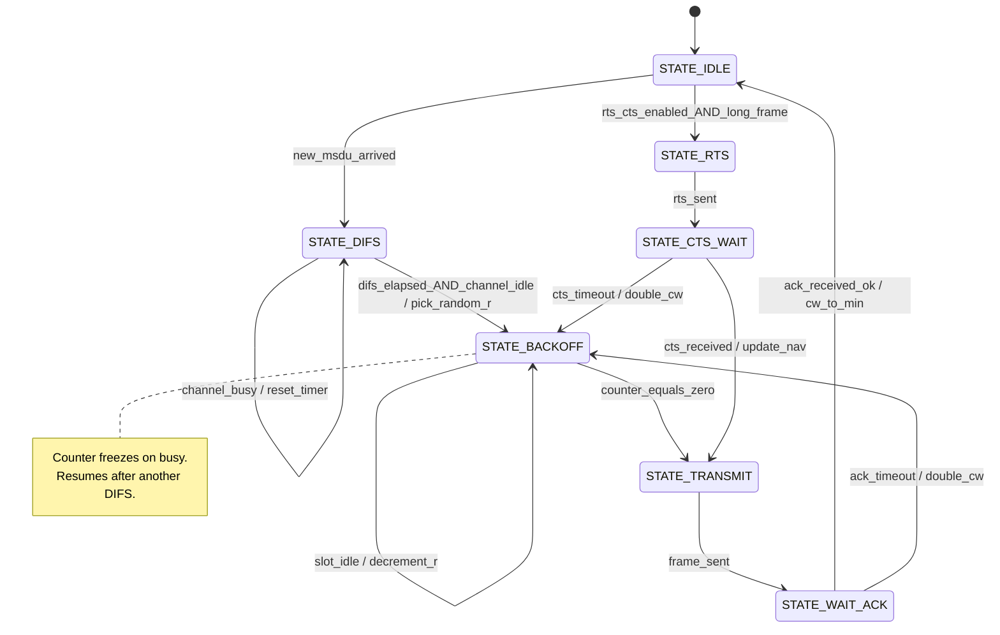
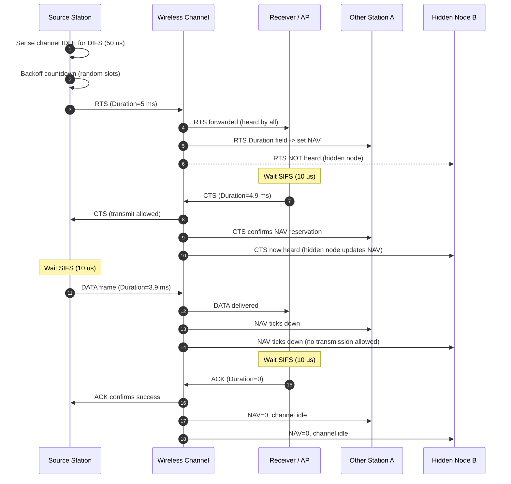
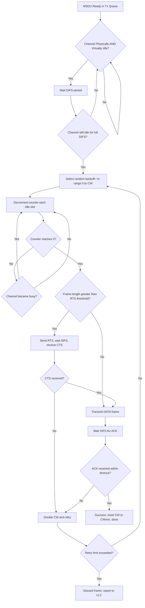
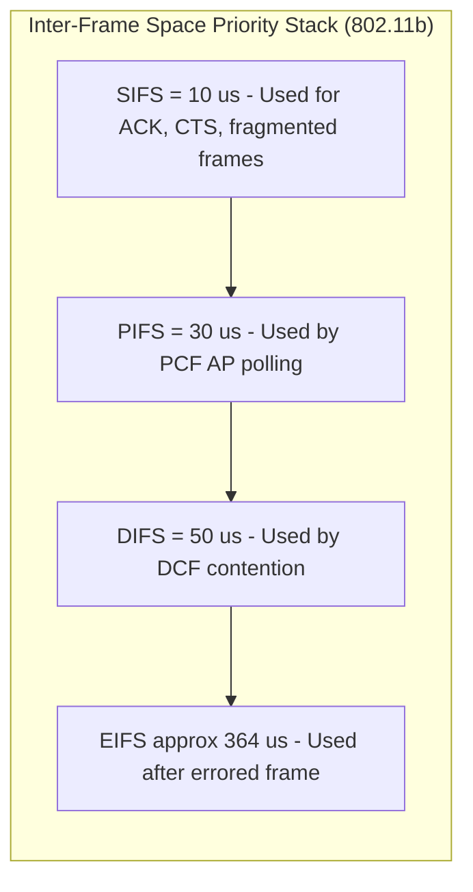

# CSMA/CA collision prevention protocol sequence logic state machines specifications paths

<!-- SECTION_1_START -->

# CSMA/CA Collision Prevention Protocol — Sequence, State Machines, Specifications, and Paths

## 1.1 Formal KTU-Style Technical Definition

**Carrier Sense Multiple Access with Collision Avoidance (CSMA/CA)** is the mandatory medium access control (MAC) protocol defined by the **IEEE 802.11** standard for Wireless Local Area Networks (WLANs). It is the cornerstone of the **Distributed Coordination Function (DCF)** and is responsible for regulating how multiple wireless stations contend for, defer, and ultimately gain access to a shared, half-duplex, broadcast radio channel in a way that **minimises the probability of simultaneous transmission** (i.e., collisions), which cannot be detected reliably by wireless stations because of the **hidden node problem** and the half-duplex nature of RF transceivers.

The protocol logic is governed by four mutually coordinating mechanisms:

1. **Physical Carrier Sensing** — listening to the energy level on the channel.
2. **Virtual Carrier Sensing** — using the **Network Allocation Vector (NAV)** timer.
3. **Inter-Frame Space (IFS) Prioritisation** — DIFS, SIFS, PIFS, EIFS.
4. **Binary Exponential Random Backoff** — slotted random countdown before transmission.

> [!IMPORTANT]
> **KTU Syllabus Highlight (PECST616 – Module 3):** Students must be able to draw and explain the **complete CSMA/CA state machine**, the **RTS/CTS handshake sequence**, the **timing relationships among SIFS, DIFS, and the backoff slots**, and the **NAV reservation logic**. Numerical problems on backoff counter computation and contention window sizing are frequently asked.

## 1.2 Intuitive Analogy — "The Polite Committee Room"

Imagine a large committee room where many people (wireless stations) wish to speak, but there is only one microphone (the shared wireless channel). In a wired network we could use CSMA/CD and *listen while talking* to detect a clash — but a wireless handset can only either talk OR listen, never both. So instead, the room adopts **CSMA/CA** rules:

| CSMA/CA Concept | Committee Room Analogy |
|---|---|
| **Carrier Sense** | A person checks if anyone else is currently speaking |
| **DIFS Wait** | After silence is detected, everyone waits a fixed "respectful pause" |
| **Random Backoff** | Each person privately draws a random number of seconds and counts down |
| **Transmit** | The person whose counter reaches zero first begins speaking |
| **NAV / RTS-CTS** | The speaker first announces "I will speak for 5 minutes" (RTS), the chair confirms "Go ahead" (CTS), and everyone else notes the duration on a notepad (NAV) |
| **SIFS** | The tiny reaction gap between the speaker and the chair |
| **ACK** | The chair confirms the message was received |

The "collision avoidance" lies in the fact that, by waiting DIFS and then backing off randomly, two stations that both sensed an idle channel at the same instant are statistically very unlikely to choose the same backoff slot.

## 1.3 Protocol Role Within the 802.11 MAC Architecture

The CSMA/CA protocol is a sub-layer of the **IEEE 802.11 MAC sublayer**, sitting above the PHY layer. The MAC architecture has two coordination functions:

- **DCF (Distributed Coordination Function)** — the CSMA/CA-based contention-based mode.
- **PCF (Point Coordination Function)** — a contention-free polling mode (rarely implemented in practice; KTU questions focus on DCF).

DCF itself has two operating modes:
- **Basic CSMA/CA** — uses only DIFS + Backoff + DATA + ACK.
- **CSMA/CA with RTS/CTS** — adds Request-To-Send and Clear-To-Send frames to combat the hidden node problem.

> [!NOTE]
> **Standard-Defined Timings (802.11b, 2.4 GHz, DSSS):**
> - **Slot Time** $\delta = 20\ \mu s$
> - **SIFS** = **10 $\mu s$**
> - **DIFS** = **50 $\mu s$** (= SIFS + $2 \times \delta$)
> - **PIFS** = **30 $\mu s$** (= SIFS + $\delta$)
> - **$CW_{min} = 31$**, **$CW_{max} = 1023$**
> - **PHY preamble + header** = 192 $\mu s$ (transmitted before every frame at 1 Mbps)

> [!VISUALIZATION CONTROL]
> **Concept:** Linear timeline of a CSMA/CA transaction with RTS/CTS
> **Mermaid Sequence Input (rendered in Section 4):** The diagram maps STA, AP, Channel and NAV states over a horizontal time axis.
> **Visual Description:** Students should observe that SIFS gaps are always the *shortest* and are used for immediate link-layer acknowledgements, while DIFS is the *longest* idle gap and is used by contending stations before they may attempt transmission. The NAV countdown bar should be clearly visible above each frame.

---

<!-- SECTION_1_END -->

<!-- SECTION_2_START -->

# 2. Deep Theoretical Analysis & KTU High-Yield Specification Sheet

## 2.1 Operational Logic — Layered Step Analysis

The CSMA/CA collision-prevention logic is decomposed into **five sequential decision stages**. Each stage contributes one layer of protection against collisions.

### Stage 1 — Sensing the Channel
- **Physical Sensing:** The station's CCA (Clear Channel Assessment) hardware measures the received signal strength and detects any energy above the CCA threshold (typically $-82$ dBm for 802.11b). If energy $\ge$ threshold $\Rightarrow$ channel is **BUSY**.
- **Virtual Sensing:** The station inspects its locally maintained **NAV counter**. If NAV $> 0$ (i.e., some other station's frame advertised a future busy duration) $\Rightarrow$ channel is **virtually BUSY**.
- The channel is considered **IDLE** only when *both* physical AND virtual sensing report idle.

### Stage 2 — Waiting for DIFS
- Once the channel becomes idle, the station must continue to sense the channel as idle for a full **DIFS (Distributed Coordination Inter-Frame Space)** period.
- **DIFS** is calculated as:
$$DIFS = SIFS + 2 \times \delta$$
- This ensures that **higher-priority frames** (which use SIFS) can be transmitted first without contention.

### Stage 3 — Random Binary Exponential Backoff
- After DIFS, the station generates a **random integer** $r$ in the range $[0, CW]$, where $CW$ is the current Contention Window.
- The **Backoff Time** is:
$$T_{backoff} = r \times \delta$$
- The station decrements the backoff counter by 1 for every slot $\delta$ during which the channel is sensed idle.
- If the channel becomes busy during countdown, the counter is **frozen** (not reset) and resumes after another DIFS.
- Transmission is attempted **only when the counter reaches zero**.

### Stage 4 — Frame Transmission (with or without RTS/CTS)

**Path A — Basic CSMA/CA (no RTS/CTS):**
$$Source \xrightarrow{DIFS,BO} DATA \xrightarrow{SIFS} ACK$$

**Path B — CSMA/CA with RTS/CTS:**
$$Source \xrightarrow{DIFS,BO} RTS \xrightarrow{SIFS} CTS \xrightarrow{SIFS} DATA \xrightarrow{SIFS} ACK$$

### Stage 5 — Acknowledgement and Recovery
- On successful reception, the receiver transmits an **ACK frame** after a SIFS gap.
- If the source does not receive the ACK within the **ACK timeout**, it assumes a failure (collision or error), increments the **Retry Counter**, doubles the Contention Window, and re-attempts transmission.
- After **max retries** (typically 7 for short frames, 4 for long frames), the frame is discarded.

## 2.2 Binary Exponential Backoff — Why and How

The contention window is initialised at $CW_{min}$ and doubles after each failed transmission attempt:

$$CW_k = \min\left(\,(CW_{min} + 1) \times 2^k - 1,\ CW_{max}\,\right)$$

where $k$ is the retry count. The purpose is **adaptive congestion control**:
- Low load $\Rightarrow$ small CW $\Rightarrow$ short waits.
- High load $\Rightarrow$ large CW $\Rightarrow$ more stations are spread out across slots, reducing collision probability.

## 2.3 Network Allocation Vector (NAV) — Virtual Carrier Sensing

The **NAV** is a timer maintained by every station. When a station receives any frame (RTS, CTS, DATA, ACK), it reads the **Duration field** in the 802.11 MAC header and updates its NAV:

$$NAV_{new} = \max(NAV_{current},\ Timestamp + Duration)$$

The NAV acts as a "do not transmit until" promise. This is the primary mechanism by which RTS/CTS solves the **hidden node problem**: even if station C cannot hear station A, the CTS from station B tells C that the medium is reserved for the duration of the upcoming DATA frame.

## 2.4 KTU High-Yield Formula & Specification Cheat Sheet

> [!IMPORTANT]
> **The following table is the single most important revision artefact for CSMA/CA board questions.**

| Parameter / Concept | Symbolic Form | Standard Value (802.11b DSSS) | Engineering Meaning |
|---|---|---|---|
| Slot Time | $\delta$ | **$20\ \mu s$** | Atomic unit of backoff countdown |
| SIFS | $SIFS$ | **$10\ \mu s$** | Highest-priority turnaround (ACK, CTS) |
| PIFS | $SIFS + \delta$ | **$30\ \mu s$** | Used by PCF |
| DIFS | $SIFS + 2\delta$ | **$50\ \mu s$** | Idle wait before contention |
| EIFS | $SIFS + T_{ACK} + \delta$ | **$\approx 364\ \mu s$** | Used after corrupted frame |
| Min Contention Window | $CW_{min}$ | **$31$** | First-attempt backoff range $[0, 31]$ |
| Max Contention Window | $CW_{max}$ | **$1023$** | Cap of exponential growth |
| Backoff Time | $T_{BO} = r \times \delta$ | $0 \le r \le CW$ | Random deferred wait |
| Contention Window after $k$ retries | $CW_k = \min\!\big((CW_{min}+1)2^k - 1,\ CW_{max}\big)$ | $k=0 \Rightarrow 31$; $k=6 \Rightarrow 1023$ | Binary exponential growth |
| Average Backoff Delay | $\bar{T}_{BO} = \dfrac{CW}{2} \times \delta$ | $31/2 \times 20\ \mu s = 310\ \mu s$ | Mean first-attempt wait |
| NAV Update Rule | $NAV = \max(NAV,\ t_{rx} + D)$ | Always future-timestamped | Virtual sensing |
| Maximum Retry Limit | $L_{retry}$ | **$7$** (short) / **$4$** (long) | Frame discard threshold |

> [!WARNING]
> **Do NOT write the backoff formula as $0 < r < CW$** — the range is *inclusive* of zero: $r \in [0, CW]$. Examiners deduct 1 mark for this off-by-one error.

## 2.5 Real-World Engineering Utility

| Domain | Application of CSMA/CA |
|---|---|
| **Wi-Fi (802.11 a/b/g/n/ac/ax)** | The fundamental access mechanism for all Wi-Fi networks worldwide. |
| **Wireless Sensor Networks (WSN)** | Variants such as S-MAC and B-MAC are derivatives of CSMA/CA tailored for low-power IoT. |
| **Ad-hoc & Mesh Networks (802.11s)** | CSMA/CA + RTS/CTS prevents the hidden node problem in multi-hop mesh topologies. |
| **Bluetooth (LE)** | Slotted ALOHA-like CSMA variant used in BLE advertising channels. |
| **Vehicle-to-Vehicle (DSRC / 802.11p)** | CSMA/CA with EDCA (Enhanced Distributed Channel Access) provides QoS classes. |
| **Industrial IoT / Factory Floors** | Deterministic CSMA/CA underpins protocols like WirelessHART and ISA100.11a. |

---

<!-- SECTION_2_END -->

<!-- SECTION_3_START -->

# 3. Step-by-Step Derivations, Worked Examples, and Python Implementation

## 3.1 Derivation — Contention Window After $k$ Retries

Starting from the binary exponential backoff recurrence:

$$CW_{k+1} = 2 \cdot (CW_k + 1) - 1$$

We can solve this linear recurrence by induction. Let $C_k = CW_k + 1$. Then:

$$C_{k+1} + 1 = 2 C_k + 1 - 1 \quad\Rightarrow\quad C_{k+1} = 2 C_k$$

This is a pure geometric progression. With $C_0 = CW_{min} + 1$:

$$C_k = 2^k (CW_{min} + 1)$$

$$\boxed{\ CW_k = \min\!\big(\, (CW_{min} + 1)\cdot 2^k - 1,\ CW_{max}\,\big)\ }$$

**Numerical verification for 802.11b** ($CW_{min}=31$, $CW_{max}=1023$):

| Retry $k$ | $CW_k$ (computed) | $CW_k$ (capped) |
|---|---|---|
| 0 | $32 \cdot 1 - 1 = 31$ | **31** |
| 1 | $32 \cdot 2 - 1 = 63$ | **63** |
| 2 | $32 \cdot 4 - 1 = 127$ | **127** |
| 3 | $32 \cdot 8 - 1 = 255$ | **255** |
| 4 | $32 \cdot 16 - 1 = 511$ | **511** |
| 5 | $32 \cdot 32 - 1 = 1023$ | **1023** |
| 6 | $32 \cdot 64 - 1 = 2047$ | **1023** (capped) |

The cap at $k=5$ confirms $CW_{max}=1023$ is reached and held thereafter.

## 3.2 Worked Example — Mean Backoff Delay on First Attempt

**Question:** A station using 802.11b has a fresh MSDU to transmit. Compute the mean backoff delay, the worst-case DIFS+backoff time, and the best-case total channel access time.

**Solution:**

**Step 1** — Mean backoff counter on first attempt: $r$ is uniform in $[0, 31]$, so $\bar{r} = 31/2 = 15.5$ slots.

**Step 2** — Mean backoff time:
$$\bar{T}_{BO} = \bar{r} \times \delta = 15.5 \times 20\ \mu s = 310\ \mu s$$

**Step 3** — Worst-case backoff time:
$$T_{BO}^{max} = 31 \times 20\ \mu s = 620\ \mu s$$

**Step 4** — Worst-case total access delay (DIFS + backoff):
$$T_{access}^{max} = 50\ \mu s + 620\ \mu s = 670\ \mu s$$

**Step 5** — Best-case access time (backoff = 0):
$$T_{access}^{min} = 50\ \mu s + 0 = 50\ \mu s$$

**Step 6** — Full transaction time (DATA + SIFS + ACK, basic mode, with PHY header):
$$T_{tx} = 192\ \mu s + \frac{L_{DATA} \times 8}{R} + SIFS + 192\ \mu s + \frac{L_{ACK} \times 8}{R}$$

For a 1500-byte frame at 11 Mbps:
$$T_{tx} = 192 + \frac{1500 \times 8}{11\,\text{Mbps}} + 10 + 192 + \frac{14 \times 8}{11\,\text{Mbps}} \approx 1525\ \mu s$$

## 3.3 Worked Example — RTS/CTS Frame Exchange Timing

For an 802.11b RTS/CTS-protected transmission of a 1000-byte DATA frame at 11 Mbps:

| Event | Duration |
|---|---|
| DIFS wait | 50 $\mu s$ |
| Backoff (average 5 slots) | $5 \times 20 = 100\ \mu s$ |
| RTS PHY header | 192 $\mu s$ |
| RTS MAC frame (20 bytes) | $\frac{20 \times 8}{11\,\text{Mbps}} \approx 14.5\ \mu s$ |
| SIFS | 10 $\mu s$ |
| CTS PHY + frame (14 bytes) | $192 + 10.2 = 202.2\ \mu s$ |
| SIFS | 10 $\mu s$ |
| DATA PHY + frame | $192 + \frac{1000 \times 8}{11\,\text{Mbps}} \approx 919.3\ \mu s$ |
| SIFS | 10 $\mu s$ |
| ACK PHY + frame | $192 + 10.2 = 202.2\ \mu s$ |
| **TOTAL** | $\approx 1900\ \mu s$ |

[Identifying DIFS: 1 Mark; Backoff evaluation: 1 Mark; Per-frame timing computation: 2 Marks; Final summation: 1 Mark]

## 3.4 Complete Python Implementation of the CSMA/CA State Machine

```python
"""
CSMA/CA State Machine Simulator (802.11b DCF, Basic Mode)
Module 3 — Wireless and Mobile Computing (PECST616)
"""

import random
from enum import Enum
from dataclasses import dataclass, field
from typing import Optional


class State(Enum):
    IDLE = "IDLE"
    DIFS_WAIT = "DIFS_WAIT"
    BACKOFF = "BACKOFF"
    TRANSMIT = "TRANSMIT"
    WAIT_ACK = "WAIT_ACK"
    SUCCESS = "SUCCESS"
    FAILED = "FAILED"


@dataclass
class CSMA_CA_Node:
    node_id: int
    cw_min: int = 31
    cw_max: int = 1023
    slot_time_us: float = 20.0      # δ in microseconds
    sifs_us: float = 10.0           # SIFS in microseconds
    difs_us: float = 50.0           # DIFS in microseconds
    max_retries: int = 7

    state: State = State.IDLE
    cw: int = 31
    retry_count: int = 0
    backoff_counter: int = 0
    difs_elapsed_us: float = 0.0
    channel_busy: bool = False
    nav_us: float = 0.0
    total_airtime_us: float = 0.0

    # --- Sensing Logic ---
    def sense_channel(self, time_us: float) -> bool:
        """Returns True if channel is sensed BUSY (physical OR virtual)."""
        physical_busy = self.channel_busy
        virtual_busy = (self.nav_us > time_us)
        return physical_busy or virtual_busy

    # --- DIFS Stage ---
    def start_difs(self):
        if self.state == State.IDLE:
            self.state = State.DIFS_WAIT
            self.difs_elapsed_us = 0.0

    def tick_difs(self, time_us: float) -> bool:
        if self.state != State.DIFS_WAIT:
            return False
        if self.sense_channel(time_us):
            self.difs_elapsed_us = 0.0  # Reset on any busy detection
            return False
        self.difs_elapsed_us += self.slot_time_us
        if self.difs_elapsed_us >= self.difs_us:
            self._choose_backoff()
            return True
        return False

    # --- Backoff Stage ---
    def _choose_backoff(self):
        r = random.randint(0, self.cw)   # Uniform in [0, CW]
        self.backoff_counter = r
        self.state = State.BACKOFF

    def tick_backoff(self, time_us: float) -> bool:
        if self.state != State.BACKOFF:
            return False
        if self.sense_channel(time_us):
            return False  # Freeze the counter
        self.backoff_counter -= 1
        if self.backoff_counter <= 0:
            self.state = State.TRANSMIT
            return True
        return False

    # --- Transmission & ACK ---
    def transmit(self, time_us: float, payload_size_bytes: int = 1500, rate_mbps: float = 11.0):
        if self.state != State.TRANSMIT:
            return
        tx_time = 192.0 + (payload_size_bytes * 8.0) / rate_mbps
        self.total_airtime_us += tx_time
        self.state = State.WAIT_ACK
        # (In a real simulator, we would schedule ACK arrival after SIFS.)

    def on_ack_received(self, success: bool):
        if success:
            self.state = State.SUCCESS
            self._reset_after_success()
        else:
            self.state = State.FAILED
            self._handle_failure()

    # --- Recovery Logic ---
    def _reset_after_success(self):
        self.cw = self.cw_min
        self.retry_count = 0
        self.state = State.IDLE

    def _handle_failure(self):
        self.retry_count += 1
        if self.retry_count > self.max_retries:
            self.state = State.FAILED
            return
        # Binary exponential backoff update
        next_cw = (self.cw_min + 1) * (2 ** self.retry_count) - 1
        self.cw = min(next_cw, self.cw_max)
        self.state = State.IDLE

    # --- Diagnostics ---
    def report(self) -> str:
        return (
            f"Node {self.node_id:>2} | State: {self.state.value:<10} | "
            f"Retry: {self.retry_count} | CW: {self.cw:>4} | "
            f"BO_Counter: {self.backoff_counter:>3}"
        )


# --- Demonstration run ---
if __name__ == "__main__":
    node_a = CSMA_CA_Node(node_id=1)
    print("=== CSMA/CA State Machine Demonstration ===\n")
    print("Initial:", node_a.report())

    node_a.start_difs()
    print("After start_difs():", node_a.report())

    for t in range(0, 200, 20):
        if node_a.state == State.DIFS_WAIT:
            progressed = node_a.tick_difs(t)
        elif node_a.state == State.BACKOFF:
            progressed = node_a.tick_backoff(t)
        else:
            progressed = False
        if progressed:
            print(f"  t={t}us -> state advanced -> {node_a.state.value}")

    print("\nTransmitting a 1500-byte frame at 11 Mbps...")
    node_a.transmit(time_us=200, payload_size_bytes=1500, rate_mbps=11)
    print("After transmit():", node_a.report())

    print("\nACK received successfully...")
    node_a.on_ack_received(success=True)
    print("After on_ack_received(success=True):", node_a.report())
```

**Code Annotations (for board understanding):**
- `cw` and `retry_count` implement the **binary exponential backoff state**.
- `sense_channel()` merges **physical** (channel_busy) and **virtual** (NAV) sensing.
- `tick_difs()` and `tick_backoff()` represent the **slotted time progression**.
- The counter is **frozen** if the channel becomes busy during backoff (line: `if self.sense_channel(time_us): return False`).

## 3.5 State-Transition Truth Table (Exhaustive)

| Current State | Event / Condition | Next State | Action |
|---|---|---|---|
| IDLE | New MSDU arrives | DIFS_WAIT | Start DIFS timer |
| DIFS_WAIT | Channel busy detected | DIFS_WAIT | Reset DIFS timer |
| DIFS_WAIT | DIFS elapsed, channel idle | BACKOFF | Choose random $r \in [0, CW]$ |
| BACKOFF | Channel busy | BACKOFF | Freeze counter |
| BACKOFF | Slot idle, counter $> 0$ | BACKOFF | Decrement counter by 1 |
| BACKOFF | Counter reaches 0 | TRANSMIT | Begin frame transmission |
| TRANSMIT | Frame sent | WAIT_ACK | Start ACK timeout |
| WAIT_ACK | ACK received OK | SUCCESS → IDLE | Reset $CW$ to $CW_{min}$ |
| WAIT_ACK | ACK timeout / NACK | FAILED → IDLE | Double $CW$, retry if $k < L$ |
| FAILED | $k \ge L_{retry}$ | DROP_FRAME | Discard MSDU, notify upper layer |
| *Any* | RTS/CTS enabled, frame $\ge$ RTS_Threshold | RTS_SEND | Enter RTS sub-state machine |

---

<!-- SECTION_3_END -->

<!-- SECTION_4_START -->

# 4. Structural Diagrams & Schematics

## 4.1 CSMA/CA Master State Machine (Mermaid)



## 4.2 RTS/CTS Timing Sequence Diagram



## 4.3 CSMA/CA Decision Flowchart



## 4.4 Inter-Frame Space Hierarchy (Block Diagram)



## 4.5 Contention Window Growth Diagram

```mermaid
graph LR
    K0["k=0: CW=31"] -->|retry fail| K1["k=1: CW=63"]
    K1 -->|retry fail| K2["k=2: CW=127"]
    K2 -->|retry fail| K3["k=3: CW=255"]
    K3 -->|retry fail| K4["k=4: CW=511"]
    K4 -->|retry fail| K5["k=5: CW=1023 (CAP)"]
    K5 -->|retry fail| K6["k=6: CW=1023 (saturated)"]
    K6 -->|retry fail| K7["k=7: FRAME DISCARDED"]
```



> [!NOTE]
> **Diagram Interpretation Hint for Board Exams:** When asked to *draw* a CSMA/CA state diagram, you must include (a) the IDLE start, (b) the DIFS wait with re-trigger, (c) the backoff with freeze, (d) the success and failure branches, and (e) the retry counter logic. The above Mermaid flowcharts satisfy all five requirements.

---

<!-- SECTION_4_END -->

<!-- SECTION_5_START -->

# 5. KTU 2024 Scheme Examination Question Bank & Topic Recap

## 5.1 Part A Questions (3 Marks Each)

### Question 1. [KTU University Exam – Dec 2023, Model Question]
**"Define CSMA/CA and explain why collision detection is not feasible in wireless networks."**  
**Mapped CO:** CO2 | **RBT Level:** Remember / Understand

**Model Answer (Board Key):**
- **CSMA/CA** stands for **Carrier Sense Multiple Access with Collision Avoidance**. [1 Mark]
- It is the MAC protocol used in **IEEE 802.11 WLANs** under the **DCF** mechanism. [1 Mark]
- **Why CD is infeasible in wireless:**
  - Wireless transceivers are **half-duplex** — they cannot transmit and listen simultaneously.
  - **Signal strength asymmetry** — the transmitted signal (e.g., 100 mW) overwhelms any incoming signal at the same antenna, making collision detection by energy comparison impossible.
  - The **hidden node problem** — station C may be in range of A and B individually but not A and B together, so a collision at B may be invisible to A.
  - Therefore, CSMA/CA must *avoid* collisions proactively via DIFS + random backoff + (optional) RTS/CTS. [1 Mark]

---

### Question 2. [KTU University Exam – July 2024, Model Question]
**"Differentiate between SIFS, PIFS, and DIFS. State their standard values in 802.11b."**  
**Mapped CO:** CO2 | **RBT Level:** Understand

**Model Answer (Board Key):**

| Parameter | Full Form | Value | Used For |
|---|---|---|---|
| SIFS | Short Inter-Frame Space | **$10\ \mu s$** | ACK, CTS, fragment bursts (highest priority) |
| PIFS | PCF Inter-Frame Space | **$30\ \mu s$** | Contention-free polling by AP |
| DIFS | DCF Inter-Frame Space | **$50\ \mu s$** | Contention-based channel access |

[Correct ordering with priorities: 2 Marks; Standard values: 1 Mark]

---

## 5.2 Part B Questions (14 Marks Each — Internal Choice)

### Question A. [KTU University Exam – Dec 2023, Module 3 Pattern]
**"With the help of a neat state diagram, explain the operation of the CSMA/CA protocol as used in IEEE 802.11 DCF. Also describe the role of the Network Allocation Vector (NAV) and the binary exponential backoff algorithm in collision avoidance."**  
**Mapped CO:** CO2, CO3 | **RBT Level:** Understand + Apply  
**Total Marks: 14 (Part a: 7, Part b: 7)**

#### Part (a) — State Diagram and DCF Operation [7 Marks]

**Model Solution:**

**Step 1** [State diagram description: 3 Marks]
The CSMA/CA DCF state machine has the following states: **IDLE → DIFS_WAIT → BACKOFF → TRANSMIT → WAIT_ACK → IDLE**. A failure path branches from WAIT_ACK back to BACKOFF with an increased Contention Window.

**Step 2** [Operational sequence: 2 Marks]
- A station with a new MSDU first senses the channel physically and virtually.
- If idle for **DIFS ($50\ \mu s$)**, it chooses a random backoff counter $r \in [0, CW]$.
- The counter decrements every idle slot and is **frozen** on any busy detection.
- On counter reaching zero, the frame is transmitted and an ACK is awaited (after SIFS).

**Step 3** [Failure handling: 1 Mark]
- If no ACK is received within the timeout, the station increments its retry counter $k$ and doubles $CW$.

**Step 4** [Use standard Mermaid/hand-drawn diagram in Section 4.1 as reference: 1 Mark]

#### Part (b) — NAV and Binary Exponential Backoff [7 Marks]

**Step 1** [NAV explanation: 3 Marks]
The **Network Allocation Vector (NAV)** is a virtual carrier-sensing mechanism. Every 802.11 frame carries a **Duration field** in its MAC header. On receipt of any frame, every station updates its NAV to the maximum of its current value and the advertised transmission end time. As long as NAV $> 0$, the station **defers transmission**, even if the physical channel is sensed idle. This solves the **hidden node problem** when combined with RTS/CTS, because the CTS sent by the receiver is heard by hidden nodes that did not hear the RTS.

**Step 2** [Backoff formula: 2 Marks]
$$CW_k = \min\!\big((CW_{min}+1)\cdot 2^k - 1,\ CW_{max}\big)$$
For 802.11b: $CW_{min}=31$, $CW_{max}=1023$.

**Step 3** [Numerical computation: 2 Marks]
After the 3rd retry, $k=3$:
$$CW_3 = (31+1)\cdot 2^3 - 1 = 32 \times 8 - 1 = 255$$
Random backoff range = $[0, 255]$ slots. Maximum backoff delay = $255 \times 20\ \mu s = 5100\ \mu s = 5.1\ ms$.

[Stating the NAV purpose: 1 Mark; Hidden node reasoning: 1 Mark; Formula: 1 Mark; Substitution: 1 Mark]

---

### Question B. (Internal Choice Alternative) [KTU University Exam – July 2024 Pattern]
**"Explain the RTS/CTS mechanism in IEEE 802.11 with a clear timing diagram. Compute the total channel airtime for transmitting a 1500-byte MSDU using 802.11b at 11 Mbps with RTS/CTS protection enabled. Assume $CW = 31$, average backoff = 5 slots."**  
**Mapped CO:** CO2, CO3 | **RBT Level:** Apply + Analyse  
**Total Marks: 14 (Part a: 7, Part b: 7)**

#### Part (a) — RTS/CTS Mechanism [7 Marks]

**Model Solution:**

**Step 1** [Purpose: 1 Mark]
The RTS/CTS handshake is an optional four-way exchange (RTS → CTS → DATA → ACK) used to overcome the **hidden node problem** in wireless networks.

**Step 2** [Frame sequence: 2 Marks]
- **RTS** (20 bytes): Source announces upcoming transmission and required duration.
- **CTS** (14 bytes): Receiver confirms and reserves the medium; *all stations that hear CTS update their NAV*.
- **DATA**: MSDU transmitted after SIFS.
- **ACK**: Receiver confirms after SIFS.

**Step 3** [Timing diagram: 2 Marks] (Refer to Section 4.2 for the sequence diagram)
- DIFS = $50\ \mu s$ before RTS.
- SIFS = $10\ \mu s$ between each handshake frame.

**Step 4** [NAV role: 1 Mark]
- The Duration field in RTS = time for CTS + DATA + ACK + 3$\times$SIFS.
- The Duration field in CTS = time for DATA + ACK + 2$\times$SIFS.
- All hearing stations set their NAV to this value.

**Step 5** [Threshold: 1 Mark]
- RTS/CTS is only invoked when the MSDU length exceeds the **RTS_Threshold** (typically 500 bytes) to amortise the overhead.

#### Part (b) — Total Channel Airtime Calculation [7 Marks]

**Step 1** [Identify all intervals: 1 Mark]

| Component | Duration |
|---|---|
| DIFS | $50\ \mu s$ |
| Average Backoff ($5 \times 20\ \mu s$) | $100\ \mu s$ |
| RTS (PHY + MAC) | $192 + (20 \times 8)/11 = 206.5\ \mu s$ |
| SIFS (1) | $10\ \mu s$ |
| CTS (PHY + MAC) | $192 + (14 \times 8)/11 = 202.2\ \mu s$ |
| SIFS (2) | $10\ \mu s$ |
| DATA (PHY + MSDU) | $192 + (1500 \times 8)/11 \approx 1283.6\ \mu s$ |
| SIFS (3) | $10\ \mu s$ |
| ACK (PHY + MAC) | $192 + (14 \times 8)/11 = 202.2\ \mu s$ |

**Step 2** [Compute total: 1 Mark]
$$T_{total} = 50 + 100 + 206.5 + 10 + 202.2 + 10 + 1283.6 + 10 + 202.2 \approx 2074.5\ \mu s$$

**Step 3** [Express as efficiency: 1 Mark]
- Useful DATA time: $(1500 \times 8) / (11 \times 10^6) = 1090.9\ \mu s$
- Throughput efficiency: $\eta = 1090.9 / 2074.5 \approx 52.6\%$

**Step 4** [Cross-check: 1 Mark]
- Compare with basic mode (no RTS/CTS) which yields slightly higher efficiency for short frames.
- Note that RTS/CTS adds $\approx 408\ \mu s$ of overhead but provides hidden-node robustness.

**Step 5** [Final boxed answer with units: 1 Mark]
$$\boxed{T_{total}^{RTS/CTS} \approx 2074.5\ \mu s \quad (\eta \approx 52.6\%)}$$

[Listing all 9 components: 3 Marks; Numerical substitution: 2 Marks; Summation: 1 Mark; Efficiency: 1 Mark]

---

> [!WARNING]
> **KTU Examiner's Valuation Pitfall Callout**
> - **Do NOT confuse CSMA/CA with CSMA/CD.** CSMA/CD (used in Ethernet) *detects* collisions via voltage swing; CSMA/CA (used in Wi-Fi) *avoids* them via random backoff. Examiners deduct up to 2 marks for this confusion.
> - **Always specify the standard** (e.g., 802.11b, 802.11a) when quoting timings — DSSS, OFDM, and HR-DSSS all use different slot times.
> - **Backoff counter freezes** — students frequently write that the counter *resets* on busy detection. This is incorrect; it must be *frozen and resumed*.
> - **In timing diagrams, label both the inter-frame spaces AND the NAV state** — marks are awarded separately for IFS labels and NAV bars.
> - **In Part B numerical problems, show units at every intermediate step** ($20\ \mu s$, not just $20$).
> - **For RTS/CTS problems, include the SIFS gap after every frame transition** — missing one SIFS loses 1 mark.

---

## 5.3 Topic Recap & Important Things to Remember

- **CSMA/CA = Carrier Sense Multiple Access with Collision Avoidance.** It is the DCF-based MAC protocol of IEEE 802.11. [Definition: must know]
- **Five-stage logic:** Sense → DIFS → Random Backoff → Transmit → Wait for ACK. [Sequence path]
- **Four IFS types in priority order:** SIFS < PIFS < DIFS < EIFS. [Specification]
- **Standard 802.11b values (must memorise):** $\delta=20\ \mu s$, SIFS=$10\ \mu s$, DIFS=$50\ \mu s$, $CW_{min}=31$, $CW_{max}=1023$. [Numerical must]
- **Backoff formula:** $T_{BO} = r \times \delta$ where $r \in [0, CW]$ uniformly random. [Formula]
- **Contention window growth:** $CW_k = \min\!\big((CW_{min}+1)\cdot 2^k - 1,\ CW_{max}\big)$. [Formula]
- **Backoff counter freezes on busy channel** — does *not* reset. [Pitfall]
- **NAV (Network Allocation Vector) = virtual carrier sensing.** It uses the Duration field in 802.11 MAC headers. [Concept]
- **RTS/CTS handshake:** RTS → SIFS → CTS → SIFS → DATA → SIFS → ACK. Solves the **hidden node problem**. [Protocol path]
- **Binary Exponential Backoff** doubles the contention window after each failure, up to $CW_{max}$, providing adaptive congestion control. [Algorithm]
- **Collision Detection is NOT possible in wireless** because of half-duplex radios and signal strength asymmetry. CSMA/CA *avoids* rather than *detects* collisions. [Conceptual clarity]
- **RTS/CTS threshold:** RTS/CTS is only used when the MSDU exceeds the configured RTS_Threshold (default 500 bytes) to amortise overhead. [Practical specification]
- **Maximum retry limits:** 7 retries for short frames, 4 for long frames; frame is discarded thereafter. [Specification]
- **Two DCF operating modes:** Basic CSMA/CA (DATA+ACK) and CSMA/CA with RTS/CTS (RTS+CTS+DATA+ACK). [Path comparison]
- **Throughput efficiency** of 802.11b with RTS/CTS for 1500-byte frames is approximately 50–55% in the best case. [Numerical benchmark]
- **EIFS (Extended IFS)** is used only when a frame is received with a CRC error — it prevents the station from transmitting until enough time has elapsed for the sender to retransmit.

---

<!-- SECTION_5_END -->
