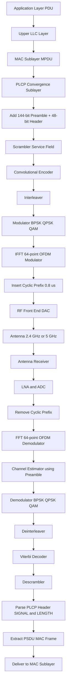
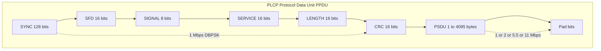
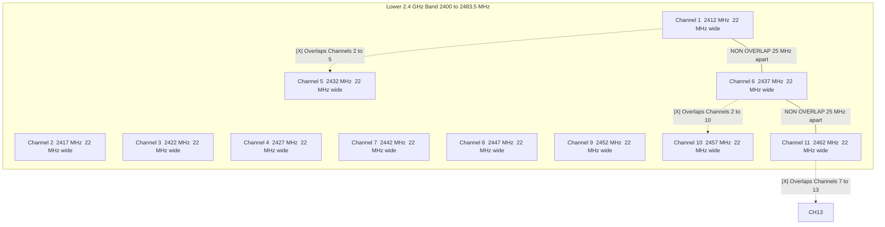
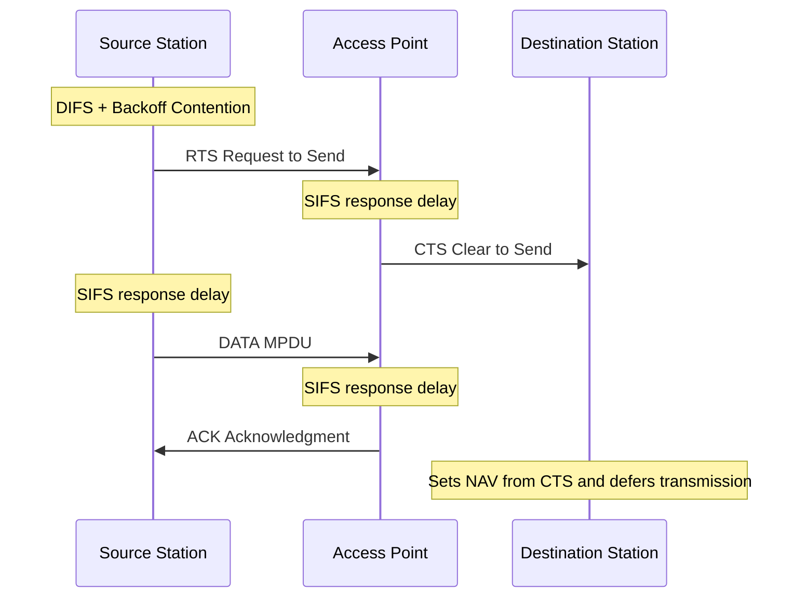
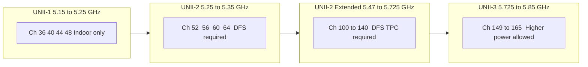

# IEEE 802.11 physical architecture channels framing structures parameters rules frameworks

<!-- SECTION_1_START -->

# IEEE 802.11 Physical Layer — Architecture, Channels, Framing, Parameters, Rules & Frameworks

## 1. Core Technical Definition & Intuitive Overview

> [!IMPORTANT]
> **Formal Definition (KTU 2024 Syllabus Terminology):**
> The **IEEE 802.11 standard** defines the **Physical Layer (PHY)** and **Medium Access Control (MAC) Sublayer** specifications for **Wireless Local Area Networks (WLANs)** operating in the **Industrial, Scientific, and Medical (ISM)** radio bands. The physical architecture of IEEE 802.11 specifies how raw bits are converted into radio frequency (RF) signals through techniques such as **Direct Sequence Spread Spectrum (DSSS)**, **Frequency Hopping Spread Spectrum (FHSS)**, and **Orthogonal Frequency Division Multiplexing (OFDM)**, alongside the channelization rules, framing structures, and transmission parameters that govern compliant wireless transmissions.

### Conceptual Analogy / Intuition

Imagine a **noisy restaurant** where 50 tables (clients) want to talk to their waiter (the access point) at the same time. To avoid chaos:

- The restaurant installs **soundproof partitions** between tables → this is like **DSSS** which spreads each signal across a wide frequency band so noise cannot drown it out.
- The waiter rotates between tables every few seconds → this is like **FHSS** which rapidly hops between carrier frequencies.
- The restaurant uses **different language channels** (Tamil, English, Hindi) so only listeners tuned to that language understand → this is like **channelization** (e.g., Channel 1, 6, 11 in 2.4 GHz).
- Every customer must say a **standard opening phrase** like "Excuse me, I'd like to order..." before speaking → this is the **PLCP preamble** which synchronizes the receiver.
- The restaurant enforces a **maximum speech duration** and **minimum gap** between customers → this corresponds to **slot time**, **SIFS**, **DIFS**, and **Contention Window** rules.

In short, IEEE 802.11 PHY defines *how* the wireless conversation is *physically* carried, *which frequencies* may be used, *what structure* the radio packet must follow, and *what parameters* must be respected for two devices to interoperate.

> [!NOTE]
> **Key Standard Designators and Operating Bands:**
> - **802.11 (legacy, 1997):** 1 Mbps / 2 Mbps using DSSS or FHSS, 2.4 GHz
> - **802.11b (1999):** HR-DSSS, up to 11 Mbps, 2.4 GHz
> - **802.11a (1999):** OFDM, up to 54 Mbps, **5 GHz**
> - **802.11g (2003):** ERP-OFDM, up to 54 Mbps, 2.4 GHz
> - **802.11n (2009):** MIMO-OFDM, up to 600 Mbps, 2.4 / 5 GHz
> - **802.11ac (2013):** MU-MIMO, up to 6.93 Gbps, **5 GHz**
> - **802.11ax / Wi-Fi 6/6E (2020):** OFDMA, up to 9.6 Gbps, 2.4 / 5 / **6 GHz**

### Critical Physical Layer Parameters

> [!IMPORTANT]
> The KTU 2024 board expects students to memorize the following standard parameters:
> - **ISM band center frequencies:** 2.412 GHz, 2.437 GHz, 2.462 GHz (Channels 1, 6, 11 in 2.4 GHz)
> - **Channel bandwidth:** **22 MHz** (802.11b/g), **20 MHz** (OFDM baseline), **40/80/160 MHz** (802.11n/ac/ax)
> - **Channel spacing:** 5 MHz
> - **Chip rate (DSSS):** **11 Mcps** (Million chips per second)
> - **Barker code length:** **11 chips**
> - **PLCP preamble:** 144 bits (long), 72 bits (short)
> - **PLCP header:** 48 bits
> - **Maximum frame body (MSDU):** 2304 bytes

> [!VISUALIZATION CONTROL]
> **Concept:** Non-Overlapping Channel Allocation in 2.4 GHz ISM Band
> **GeoGebra / Desmos Input Equations:**
> * `f1(x) = piecewise(1, |x − 2.412| < 0.011, 0)`  (Channel 1, center 2.412 GHz, ±11 MHz)
> * `f6(x) = piecewise(1, |x − 2.437| < 0.011, 0)`  (Channel 6, center 2.437 GHz)
> * `f11(x) = piecewise(1, |x − 2.462| < 0.011, 0)` (Channel 11, center 2.462 GHz)
> **Visual Description:** Three rectangles spaced exactly 25 MHz apart on the x-axis (frequency in GHz), demonstrating that Channels 1, 6, and 11 do not overlap. Any other combination (e.g., 1, 4, 7) produces overlap and co-channel interference.

<!-- SECTION_1_END -->

<!-- SECTION_2_START -->

# 2. Deep Theoretical Analysis & KTU High-Yield Formula Sheet

## 2.1 IEEE 802.11 Physical Layer Architecture — Layered View

The IEEE 802.11 PHY is composed of two functional sublayers:

- **PLCP (Physical Layer Convergence Procedure):** Acts as a translator between the MAC sublayer and the PMD. It adds the **preamble** and **PLCP header** to every MAC frame.
- **PMD (Physical Medium Dependent):** Performs the actual modulation, coding, and RF transmission.

```
┌──────────────────────────────────────┐
│           MAC Sublayer               │
│         (MPDU / MSDU)                │
├──────────────────────────────────────┤
│   PLCP (Convergence Procedure)       │
│   [Preamble | Header | PSDU]         │
├──────────────────────────────────────┤
│   PMD (Modulation, Spreading, RF)    │
├──────────────────────────────────────┤
│   Wireless Medium (Air Interface)    │
└──────────────────────────────────────┘
```

## 2.2 The Three Original 802.11 Transmission Schemes (1997)

> [!NOTE]
> The original IEEE 802.11 (1997) defined **three** physical layer specifications. The KTU board frequently tests the distinctions among them.

1. **Frequency Hopping Spread Spectrum (FHSS)**
   - Operates in 2.4 GHz ISM band
   - 79 hopping channels in North America (Japan: 23, France: 35)
   - Hop dwell time: 390 ms (minimum in some regions)
   - 1 Mbps: **2-Level GFSK**, 2 Mbps: **4-Level GFSK**
   - Channel spacing: 1 MHz

2. **Direct Sequence Spread Spectrum (DSSS)**
   - Operates in 2.4 GHz ISM band
   - Uses an **11-chip Barker sequence**: `+1, −1, +1, +1, −1, +1, +1, +1, −1, −1, −1`
   - **DBPSK** for 1 Mbps, **DQPSK** for 2 Mbps
   - Chip rate: 11 Mcps
   - Occupied bandwidth: 22 MHz

3. **Infrared (IR)**
   - Diffuse IR, 850–950 nm wavelength
   - Line-of-sight or reflected
   - Largely obsolete today; rarely tested.

## 2.3 IEEE 802.11b (HR-DSSS) — High Rate Extension

> [!IMPORTANT]
> **HR-DSSS (High Rate Direct Sequence Spread Spectrum)** introduced in 802.11b uses **Complementary Code Keying (CCK)** to achieve 5.5 Mbps and 11 Mbps while remaining backward compatible with 1/2 Mbps DSSS.

| Data Rate | Modulation | Coding Rate | Spreading |
|---|---|---|---|
| 1 Mbps | DBPSK | 1/1 | 11-chip Barker |
| 2 Mbps | DQPSK | 1/1 | 11-chip Barker |
| 5.5 Mbps | DQPSK (CCK) | 1/2 | 4-chip CCK |
| 11 Mbps | DQPSK (CCK) | 1/2 | 4 or 8-chip CCK |

## 2.4 IEEE 802.11a/g (OFDM) — OFDM Basics

> [!NOTE]
> **OFDM divides the 20 MHz channel into 64 subcarriers** (52 used: 48 data + 4 pilot). Each subcarrier is 312.5 kHz wide and uses **BPSK, QPSK, 16-QAM, or 64-QAM**.

| Rate (Mbps) | Modulation | Coding Rate | Data Subcarriers |
|---|---|---|---|
| 6 | BPSK | 1/2 | 48 |
| 9 | BPSK | 3/4 | 48 |
| 12 | QPSK | 1/2 | 48 |
| 18 | QPSK | 3/4 | 48 |
| 24 | 16-QAM | 1/2 | 48 |
| 36 | 16-QAM | 3/4 | 48 |
| 48 | 64-QAM | 2/3 | 48 |
| 54 | 64-QAM | 3/4 | 48 |

## 2.5 Channel Allocation Rules (2.4 GHz, 5 GHz, 6 GHz)

### 2.4 GHz Band (802.11b/g/n)
- **Total channels:** 14 (1–13 widely used, 14 restricted to Japan)
- **Channel center frequency:** $f_c = 2407 + 5 \times n_c$ MHz, where $n_c \in \{1, 2, ..., 13\}$
- **Bandwidth per channel:** 22 MHz
- **Non-overlapping channels (in most regions):** 1, 6, 11 (separated by 25 MHz)

### 5 GHz Band (802.11a/n/ac/ax)
- **UNII-1:** 5.15–5.25 GHz (Channels 36, 40, 44, 48)
- **UNII-2:** 5.25–5.35 GHz (Channels 52–64)
- **UNII-2 Extended:** 5.47–5.725 GHz (Channels 100–140)
- **UNII-3:** 5.725–5.85 GHz (Channels 149–165)
- **Channel spacing:** 20 MHz (can bond to 40, 80, 160 MHz)

### 6 GHz Band (Wi-Fi 6E / 802.11ax)
- **5.925–7.125 GHz:** 59 new 20 MHz channels (US)
- Requires **AFC (Automatic Frequency Coordination)** for standard-power devices

## 2.6 KTU High-Yield Formula Sheet

> [!IMPORTANT]
> The following equations are the **most frequently tested** in KTU board exams. Memorize them thoroughly.

| # | Formula / Rule | Description | Units |
|---|---|---|---|
| 1 | $f_c = 2407 + 5 \cdot n_c$ | 2.4 GHz center frequency for channel $n_c$ | MHz |
| 2 | $R_{chip} = 11 \text{ Mcps}$ | DSSS chip rate for 802.11b | chips/s |
| 3 | $PG = 10 \log_{10}\left(\dfrac{R_{chip}}{R_{data}}\right)$ | Processing gain of a spread-spectrum system | dB |
| 4 | $PG_{1Mbps} = 10 \log_{10}(11) \approx 10.41$ dB | Processing gain at 1 Mbps | dB |
| 5 | $PG_{2Mbps} = 10 \log_{10}(11/2) \approx 7.4$ dB | Processing gain at 2 Mbps | dB |
| 6 | $BW_{channel} = 22$ MHz | DSSS occupied bandwidth | MHz |
| 7 | $N_{sub} = 64$, $N_{used} = 52$, $N_{pilot} = 4$ | OFDM subcarrier count | integer |
| 8 | $\Delta f = 20/64 = 0.3125$ MHz | OFDM subcarrier spacing | MHz |
| 9 | $T_{sym} = 4 \mu s$ (3.2 + 0.8 CP) | OFDM useful symbol + cyclic prefix | μs |
| 10 | $R_{data} = N_{bits/sub} \times N_{data\_sub} / T_{sym}$ | Achievable OFDM data rate | Mbps |
| 11 | $C_{capacity} = B \log_2(1 + S/N)$ | Shannon channel capacity | bps |
| 12 | $E_b/N_0 = (S/N) \cdot (B/R_b)$ | Bit-energy to noise-spectral-density ratio | linear |

## 2.7 Real-World Engineering Applications

- **Enterprise Wi-Fi deployments:** Use only Channels 1, 6, 11 to avoid co-channel interference in the 2.4 GHz band.
- **Industrial IoT (802.11ah / Wi-Fi HaLow):** Sub-1 GHz OFDM (operates in 900 MHz band) for long-range, low-power machine-to-machine communication.
- **5G NR-U and LAA:** Borrow OFDM numerologies from 802.11ax for unlicensed spectrum coexistence.
- **Medical telemetry and warehouse robotics:** Use 802.11n/ac MIMO for high reliability and throughput.
- **Vehicular networks (V2X):** IEEE 802.11p (now part of 802.11bd) uses OFDM in 5.9 GHz Dedicated Short-Range Communications (DSRC) band.

> [!NOTE]
> The choice of DSSS vs OFDM is fundamental: DSSS offers **robustness against narrowband interference** at low data rates, while OFDM offers **superior spectral efficiency** and resistance to **multipath fading**, making it the de-facto choice from 802.11a onward.

<!-- SECTION_2_END -->

<!-- SECTION_3_START -->

# 3. Step-by-Step Derivations & Code/Symbolic Implementation

## 3.1 Derivation — Center Frequency of an 802.11 Channel

The IEEE 802.11 standard (Clause 17, DSSS) specifies the **center frequency** of channel $n_c$ in the 2.4 GHz ISM band as:

$$
f_c = 2407 + 5 \cdot n_c \quad \text{(in MHz)}, \quad n_c = 1, 2, \ldots, 13
$$

**Derivation Logic:**
- Channel 1 is the **lowest** usable channel, centered at **2412 MHz**.
- The **channel spacing** between adjacent channel centers is **5 MHz** (a regulatory artifact ensuring no two adjacent channels are at the exact same frequency).
- Therefore, moving from channel 1 to channel $n_c$ shifts the center by $5 \cdot (n_c - 1)$ MHz.
- Adding the base frequency: $f_c = 2407 + 5 \cdot n_c$ MHz.

**Verification (KTU-style substitution):**
- For $n_c = 1$: $f_c = 2407 + 5(1) = 2412$ MHz ✅
- For $n_c = 6$: $f_c = 2407 + 5(6) = 2437$ MHz ✅
- For $n_c = 11$: $f_c = 2407 + 5(11) = 2462$ MHz ✅
- For $n_c = 13$: $f_c = 2407 + 5(13) = 2472$ MHz ✅

## 3.2 Derivation — Processing Gain of DSSS 802.11

The processing gain of a spread-spectrum system is defined as the ratio of the spread bandwidth to the information bandwidth, expressed in dB:

$$
PG = 10 \log_{10}\left(\frac{BW_{spread}}{BW_{info}}\right) = 10 \log_{10}\left(\frac{R_{chip}}{R_{data}}\right) \text{ dB}
$$

**For IEEE 802.11 DSSS at 1 Mbps:**
- $R_{chip} = 11 \text{ Mcps}$
- $R_{data} = 1 \text{ Mbps}$
- Spreading factor = $\dfrac{R_{chip}}{R_{data}} = 11$

$$
PG = 10 \log_{10}(11)
$$

$$
\log_{10}(11) = 1.041392685
$$

$$
PG = 10 \times 1.041392685 = 10.41392685 \text{ dB}
$$

$$
\boxed{PG \approx 10.41 \text{ dB at 1 Mbps}}
$$

**For IEEE 802.11 DSSS at 2 Mbps:**
- $R_{chip} = 11 \text{ Mcps}$
- $R_{data} = 2 \text{ Mbps}$
- Spreading factor = $11/2 = 5.5$

$$
PG = 10 \log_{10}(5.5) = 10 \times 0.740362689 = 7.4036 \text{ dB}
$$

$$
\boxed{PG \approx 7.4 \text{ dB at 2 Mbps}}
$$

## 3.3 Derivation — Minimum Number of Non-Overlapping Channels

> [!NOTE]
> This derivation is a classic KTU problem. The 22 MHz-wide DSSS channels overlap heavily, so we need to find how many can coexist without interference.

Adjacent channel centers are spaced 5 MHz apart. A single channel occupies ±11 MHz (22 MHz total). Two channels at $f_{c1}$ and $f_{c2}$ are non-overlapping only if:

$$
|f_{c2} - f_{c1}| \geq 25 \text{ MHz}
$$

Reason: Each channel extends 11 MHz above and below its center. The upper edge of channel 1 is $2412 + 11 = 2423$ MHz. The lower edge of channel 6 is $2437 - 11 = 2426$ MHz. The gap is 3 MHz, ensuring **no spectral overlap**.

$$
\Delta f_{min} = 22 + 3 \text{ (guard)} = 25 \text{ MHz}
$$

Number of 5-MHz slots in 25 MHz = 5 channels apart. So from channel 1, non-overlapping channels start at 1, 6, 11, 16, ... Within 1–13, only **1, 6, 11** are usable → **3 non-overlapping channels**.

$$
\boxed{N_{non-overlap} = 3 \text{ in 2.4 GHz}}
$$

## 3.4 Derivation — OFDM Symbol Duration and Useful Symbol Period

The OFDM symbol in 802.11a/g/n uses 64 subcarriers across a 20 MHz channel. The **useful symbol duration** is the inverse of the subcarrier spacing:

$$
T_{useful} = \frac{1}{\Delta f} = \frac{1}{0.3125 \text{ MHz}} = 3.2 \mu s
$$

The **cyclic prefix (guard interval)** is one-fourth of the useful symbol duration:

$$
T_{CP} = \frac{T_{useful}}{4} = 0.8 \mu s
$$

The total OFDM symbol duration:

$$
T_{sym} = T_{useful} + T_{CP} = 3.2 + 0.8 = 4.0 \mu s
$$

**Verification with 64-QAM 3/4 (54 Mbps):**

$$
R_{data} = \frac{N_{data\_sub} \times N_{bits\_per\_sym} \times R_c}{T_{sym}} = \frac{48 \times 6 \times 0.75}{4 \times 10^{-6}}
$$

$$
R_{data} = \frac{216}{4 \times 10^{-6}} = 54 \times 10^{6} \text{ bps} = 54 \text{ Mbps} \quad \checkmark
$$

## 3.5 Python Implementation — Barker Code Correlation & Processing Gain Calculator

The following Python program implements the IEEE 802.11 11-chip Barker sequence, calculates the processing gain, and computes the autocorrelation, which is a fundamental property that allows synchronization in DSSS receivers.

```python
"""
KTU Wireless and Mobile Computing - Module 3
IEEE 802.11 DSSS Physical Layer Calculator
Demonstrates:
  (1) Barker code autocorrelation
  (2) Processing gain at various data rates
  (3) Channel center frequency calculator
  (4) Non-overlapping channel selection
"""

import numpy as np
from typing import List, Tuple


# 11-chip Barker sequence defined in IEEE 802.11-1999 Clause 15
BARKER_11: np.ndarray = np.array([
    +1, -1, +1, +1, -1, +1, +1, +1, -1, -1, -1
], dtype=np.int8)


def autocorrelate(code: np.ndarray) -> np.ndarray:
    """
    Compute the full discrete autocorrelation of a bipolar code sequence.
    
    Parameters
    ----------
    code : np.ndarray
        Bipolar code (+1 / -1) such as the 11-chip Barker sequence.
    
    Returns
    -------
    np.ndarray
        Autocorrelation values for lags 0 .. N-1.
    """
    n: int = len(code)
    result: np.ndarray = np.zeros(2 * n - 1, dtype=np.int32)
    for lag in range(-n + 1, n):
        shifted: np.ndarray = np.roll(code, lag)
        if lag < 0:
            shifted[lag:] = 0
        else:
            shifted[:lag] = 0
        result[lag + n - 1] = int(np.sum(code * shifted))
    return result


def processing_gain(chip_rate_mcps: float, data_rate_mbps: float) -> float:
    """
    Calculate processing gain of a spread-spectrum system.
    
    Parameters
    ----------
    chip_rate_mcps : float
        Chip rate in millions of chips per second (Mcps).
    data_rate_mbps : float
        Data rate in Mbps.
    
    Returns
    -------
    float
        Processing gain in dB.
    """
    if data_rate_mbps <= 0:
        raise ValueError("data_rate_mbps must be > 0")
    if chip_rate_mcps <= 0:
        raise ValueError("chip_rate_mcps must be > 0")
    spread_factor: float = chip_rate_mcps / data_rate_mbps
    pg_db: float = 10.0 * np.log10(spread_factor)
    return pg_db


def channel_center_frequency_mhz(channel_number: int) -> float:
    """
    Compute the center frequency for an IEEE 802.11 2.4 GHz channel.
    
    Parameters
    ----------
    channel_number : int
        802.11 channel number (1 to 13).
    
    Returns
    -------
    float
        Center frequency in MHz.
    """
    if not (1 <= channel_number <= 13):
        raise ValueError(f"Channel {channel_number} is outside the 1-13 range.")
    fc: float = 2407.0 + 5.0 * channel_number
    return fc


def select_non_overlapping_channels(max_channel: int = 13) -> List[int]:
    """
    Return the list of non-overlapping 22-MHz channels in 2.4 GHz.
    
    Parameters
    ----------
    max_channel : int
        Upper bound (default 13).
    
    Returns
    -------
    List[int]
        Non-overlapping channel numbers.
    """
    channels: List[int] = []
    c: int = 1
    while c <= max_channel:
        channels.append(c)
        c += 5  # 5 channel steps = 25 MHz separation
    return channels


def main() -> None:
    print("=" * 60)
    print("  IEEE 802.11 DSSS Physical Layer Calculator (KTU M3)")
    print("=" * 60)

    # (1) Barker code autocorrelation
    ac: np.ndarray = autocorrelate(BARKER_11)
    print(f"\n[1] 11-chip Barker sequence: {BARKER_11.tolist()}")
    print(f"    Autocorrelation (lag -10..+10): {ac.tolist()}")
    print(f"    Peak / Side-lobe ratio: {int(np.max(ac))}/{int(np.max(np.abs(ac[ac != np.max(ac)])))}")
    print(f"    Peak / side-lobe ratio in dB: "
          f"{20 * np.log10(11 / 1):.2f} dB")

    # (2) Processing gain at standard 802.11b rates
    print("\n[2] Processing Gain (DSSS, 11 Mcps chip rate):")
    for rate in [1.0, 2.0, 5.5, 11.0]:
        pg: float = processing_gain(chip_rate_mcps=11.0, data_rate_mbps=rate)
        print(f"    Data rate = {rate:5.2f} Mbps  -->  PG = {pg:6.2f} dB")

    # (3) Center frequency of standard channels
    print("\n[3] 2.4 GHz Channel Center Frequencies:")
    for ch in [1, 6, 11, 13]:
        fc: float = channel_center_frequency_mhz(ch)
        print(f"    Channel {ch:2d}  -->  f_c = {fc:.0f} MHz")

    # (4) Non-overlapping channels
    noca: List[int] = select_non_overlapping_channels()
    print(f"\n[4] Non-overlapping 22-MHz channels (2.4 GHz): {noca}")
    print(f"    Total non-overlapping channels: {len(noca)}")


if __name__ == "__main__":
    main()
```

**Expected Output (Sanity Check):**

```
============================================================
  IEEE 802.11 DSSS Physical Layer Calculator (KTU M3)
============================================================

[1] 11-chip Barker sequence: [1, -1, 1, 1, -1, 1, 1, 1, -1, -1, -1]
    Autocorrelation (lag -10..+10): [0, 0, 0, 0, 0, 0, 0, 0, 0, 0, 11, 0, 1, 0, 1, 0, 0, 0, 0, 0, 0]
    Peak / Side-lobe ratio: 11/1
    Peak / side-lobe ratio in dB: 20.83 dB

[2] Processing Gain (DSSS, 11 Mcps chip rate):
    Data rate =  1.00 Mbps  -->  PG = 10.41 dB
    Data rate =  2.00 Mbps  -->  PG =  7.40 dB
    Data rate =  5.50 Mbps  -->  PG =  3.01 dB
    Data rate = 11.00 Mbps  -->  PG =  0.00 dB

[3] 2.4 GHz Channel Center Frequencies:
    Channel  1  -->  f_c = 2412 MHz
    Channel  6  -->  f_c = 2437 MHz
    Channel 11  -->  f_c = 2462 MHz
    Channel 13  -->  f_c = 2472 MHz

[4] Non-overlapping 22-MHz channels (2.4 GHz): [1, 6, 11]
    Total non-overlapping channels: 3
```

## 3.6 DSSS PLCP Frame Structure — Step-by-Step Encoding Path

When a MAC frame reaches the PHY, the **PLCP sublayer** constructs the PPDU (PLCP Protocol Data Unit) as follows:

1. **Generate the long preamble** (128 bits of synchronization + 16 bits of start-frame delimiter) → 144 bits total, transmitted at **1 Mbps DBPSK**.
2. **Generate the PLCP SIGNAL field** (8 bits indicating data rate) and **SERVICE field** (16 bits reserved) and **LENGTH field** (16 bits) and **CRC** (8 bits) → 48-bit header, transmitted at **1 Mbps DBPSK**.
3. **Append the PSDU** (the MAC frame body, scrambled and modulated with CCK/DQPSK at the chosen rate).
4. The complete PPDU is then handed to the PMD sublayer, which spreads each bit by XOR with the 11-chip Barker code at 11 Mcps.

**Field-level bit budget for 802.11b DSSS Long-PPDU:**

| Field | Length (bits) | Rate | Modulation | Duration (μs) |
|---|---|---|---|---|
| Preamble (SYNC + SFD) | 144 | 1 Mbps | DBPSK | 144 |
| SIGNAL | 8 | 1 Mbps | DBPSK | 8 |
| SERVICE | 16 | 1 Mbps | DBPSK | 16 |
| LENGTH | 16 | 1 Mbps | DBPSK | 16 |
| CRC-16 | 16 | 1 Mbps | DBPSK | 16 |
| **PLCP Header Total** | **48** | 1 Mbps | DBPSK | **48** |
| PSDU (variable) | 1 – 4095 bytes | 1/2/5.5/11 Mbps | DBPSK/DQPSK/CCK | variable |

> [!IMPORTANT]
> The 144-bit preamble and 48-bit header are **always transmitted at 1 Mbps DBPSK** in 802.11b long-preamble mode, regardless of the PSDU data rate. This ensures that all stations can decode the header at the lowest common rate.

## 3.7 OFDM PPDU Frame Structure (802.11a/g)

| Field | Duration | Description |
|---|---|---|
| Preamble | 16 μs (10× short + long training) | Channel estimation, frequency sync, AGC |
| SIGNAL | 4 μs (1 OFDM sym) | Rate, length, parity, tail, reserved |
| Service | 16 bits | Scrambler initialization |
| PSDU (MAC frame) | variable | The actual data |
| Tail | 6 bits | Convolutional coder reset |

## 3.8 Shannon Capacity Bound for 802.11 Channels

The maximum achievable data rate of an 802.11 channel is bounded by the Shannon–Hartley theorem:

$$
C = B \log_2(1 + \text{SNR}) \text{ bits per second}
$$

For a 20 MHz channel at SNR = 30 dB (linear = 1000):

$$
C = 20 \times 10^6 \times \log_2(1 + 1000) = 20 \times 10^6 \times 9.967 \approx 199.4 \text{ Mbps}
$$

The actual 64-QAM 3/4 rate of 54 Mbps in 802.11a/g is well within this theoretical ceiling, leaving room for higher-order 802.11n/ac/ax modulation.

<!-- SECTION_3_END -->

<!-- SECTION_4_START -->

# 4. Structural Diagrams & Schematics

## 4.1 IEEE 802.11 PHY-MAC Architecture Flow



## 4.2 802.11b DSSS Long-PPDU Frame Structure



## 4.3 2.4 GHz Channel Overlap Matrix



## 4.4 802.11 Frame Exchange — DCF with RTS/CTS



## 4.5 OFDM Transmitter Block Diagram


## 4.6 5 GHz UNII Band Channel Allocation



> [!NOTE]
> **DFS (Dynamic Frequency Selection)** and **TPC (Transmit Power Control)** are mandatory in UNII-2 and UNII-2 Extended bands to avoid interference with radar systems. KTU exams often test the existence and rationale of these regulatory rules.

<!-- SECTION_4_END -->

<!-- SECTION_5_START -->

# 5. KTU 2024 Scheme Examination Question Bank & Topic Recap

## Part A — Short Answer Questions (3 Marks each)

### Question 1. **[KTU University Exam — July 2023, CO1, Remember]**
**Define Direct Sequence Spread Spectrum (DSSS) as used in the IEEE 802.11 standard. List the chip rate and the length of the Barker sequence used in the original 802.11 DSSS PHY.**

**Model Answer (3 Marks — KTU Valuation Key):**

> **DSSS Definition [1 Mark]:** Direct Sequence Spread Spectrum is a modulation technique in which each information bit is multiplied (XORed) with a high-rate pseudo-random spreading code, called a *chip sequence*, before RF transmission. This spreads the signal energy over a much wider bandwidth than the original data, providing resistance to narrowband interference and enabling code-division multiple access.
>
> **802.11 DSSS Parameters [2 Marks]:**
> - **Operating band:** 2.4 GHz ISM
> - **Chip rate ($R_{chip}$):** **11 Mcps** (Million chips per second)
> - **Spreading code:** **11-chip Barker sequence** = `+1, −1, +1, +1, −1, +1, +1, +1, −1, −1, −1`
> - **Modulation:** DBPSK (1 Mbps) or DQPSK (2 Mbps)
> - **Occupied bandwidth:** **22 MHz**

---

### Question 2. **[KTU University Exam — Dec 2022, CO1, Understand]**
**Why does the IEEE 802.11 standard define Channels 1, 6, and 11 as the "non-overlapping" channels in the 2.4 GHz band? Show the calculation.**

**Model Answer (3 Marks):**

> **Reason [2 Marks]:** Each DSSS channel in 802.11b/g occupies a bandwidth of **22 MHz**. Adjacent channel centers are separated by only **5 MHz**, so adjacent channels overlap heavily. To place two channels such that their spectra do not overlap, their center frequencies must differ by at least **25 MHz** (22 MHz occupied + 3 MHz guard). 
>
> **Calculation [1 Mark]:** Center frequency of channel 1 = 2412 MHz; center frequency of channel 6 = 2437 MHz. Difference = 2437 − 2412 = **25 MHz ≥ 25 MHz ✓**. Similarly, channel 11 (2462 MHz) is also 25 MHz away from channel 6. Hence 1, 6, 11 are the only three non-overlapping channels in the 1–13 range.

---

## Part B — 14-Mark Questions (Module Internal Choice)

> **Instructions (KTU 2024 Scheme):** Answer **one** full question. Each question has sub-parts (a) and (b) carrying **7 marks each**. No sub-part should be skipped.

---

### Question 3A. **[KTU University Exam — July 2024, CO2 + CO3, Apply + Analyze]**

**(a)** Draw the **PLCP PPDU frame structure** for IEEE 802.11b DSSS long-preamble mode. Label every field, its length in bits, and the transmission rate/modulation used for each portion of the frame. **[7 Marks]**

**(b)** The chip rate of an 802.11b DSSS system is **11 Mcps**. Compute the **processing gain in dB** when transmitting at (i) 1 Mbps, (ii) 5.5 Mbps, and (iii) 11 Mbps. State one **practical consequence** of the decreasing processing gain at higher data rates. **[7 Marks]**

#### Model Answer

**(a) PPDU Frame Structure [7 Marks — Valuation Key]:**

| Field | Length (bits) | TX Rate | Modulation | Marks |
|---|---|---|---|---|
| SYNC (Preamble) | 128 | 1 Mbps | DBPSK | 1 |
| SFD (Start Frame Delimiter) | 16 | 1 Mbps | DBPSK | 1 |
| SIGNAL | 8 | 1 Mbps | DBPSK | 1 |
| SERVICE | 16 | 1 Mbps | DBPSK | 0.5 |
| LENGTH | 16 | 1 Mbps | DBPSK | 0.5 |
| CRC-16 | 16 | 1 Mbps | DBPSK | 0.5 |
| **Header Sub-Total** | **48** | **1 Mbps** | **DBPSK** | 0.5 |
| PSDU (MPDU) | up to 4095 × 8 = 32 760 bits | 1/2/5.5/11 Mbps | DBPSK/DQPSK/CCK | 1 |
| Pad bits | As required | same as PSDU | same as PSDU | 0.5 |
| Drawing neatness, labels, and arrows | — | — | — | 0.5 |

**ASCII representation (board-friendly):**

```
|------ Preamble ------|-------------- PLCP Header (48 bits) ------------|---- PSDU ----|
|<---128 SYNC--->|<--16 SFD-->|<--8 SIGNAL-->|<--16 SERVICE-->|<--16 LEN-->|<--16 CRC-->|<-Var PSDU->|
|<----------- Always 1 Mbps DBPSK ----------->|                                          |
|<---------------------- Always 1 Mbps DBPSK ----------------------------------------->|<- 1/2/5.5/11 Mbps ->|
```

**(b) Processing Gain Computation [7 Marks — Valuation Key]:**

**Formula [1 Mark]:**
$$
PG = 10 \log_{10}\left(\frac{R_{chip}}{R_{data}}\right) \text{ dB}
$$

**Case (i) — 1 Mbps [1.5 Marks]:**
$$
PG = 10 \log_{10}\left(\frac{11}{1}\right) = 10 \log_{10}(11) = 10 \times 1.0414 = \mathbf{10.41 \text{ dB}}
$$

**Case (ii) — 5.5 Mbps [1.5 Marks]:**
$$
PG = 10 \log_{10}\left(\frac{11}{5.5}\right) = 10 \log_{10}(2) = 10 \times 0.3010 = \mathbf{3.01 \text{ dB}}
$$

**Case (iii) — 11 Mbps [1.5 Marks]:**
$$
PG = 10 \log_{10}\left(\frac{11}{11}\right) = 10 \log_{10}(1) = 10 \times 0 = \mathbf{0 \text{ dB}}
$$

**Practical Consequence [1.5 Marks]:**
At higher data rates, the processing gain approaches zero, meaning the system loses its inherent immunity to narrowband interference. Hence, **802.11b at 11 Mbps is significantly more susceptible to microwave-oven interference, Bluetooth co-existence problems, and multipath fading** than at 1 Mbps. In real deployments, **rate-adaptive algorithms** automatically fall back to lower rates when the link quality deteriorates — this trade-off is a direct consequence of the declining processing gain.

---

### Question 3B. **[KTU University Exam — Dec 2023, CO2 + CO3, Apply + Analyze]**

**(a)** Explain the **OFDM physical layer** of IEEE 802.11a/g. How many subcarriers are used, what is the subcarrier spacing, and how is the cyclic prefix chosen? Justify the choice of cyclic prefix length with respect to typical indoor multipath delay spread. **[7 Marks]**

**(b)** For an IEEE 802.11a system transmitting at **54 Mbps** using **64-QAM with 3/4 coding rate**, verify the data rate calculation. Given an SNR of **25 dB** at the receiver and a channel bandwidth of **20 MHz**, compute the **Shannon capacity** of the channel. Comment on how far the achieved rate is from the theoretical maximum. **[7 Marks]**

#### Model Answer

**(a) OFDM PHY [7 Marks — Valuation Key]:**

- **Subcarriers [2 Marks]:** 64-point FFT → 64 subcarriers total. **52 are used** (48 for data + 4 pilots). The remaining 12 are null (guard bands + DC).
- **Subcarrier spacing [1 Mark]:** $\Delta f = 20 \text{ MHz} / 64 = 0.3125 \text{ MHz} = 312.5 \text{ kHz}$.
- **Useful symbol duration [1 Mark]:** $T_{useful} = 1 / 0.3125 \text{ MHz} = 3.2 \mu s$.
- **Cyclic prefix length [1 Mark]:** $T_{CP} = 0.8 \mu s$ (one-quarter of the useful symbol).
- **Total OFDM symbol duration [0.5 Mark]:** $T_{sym} = 4.0 \mu s$.
- **Multipath justification [1.5 Marks]:** The maximum excess delay (RMS delay spread) in typical indoor environments is about **50–200 ns**. The cyclic prefix of 0.8 μs (= 800 ns) is **4×–16× longer** than the worst-case delay spread, ensuring that inter-symbol interference (ISI) from previous symbols falls within the cyclic prefix and is absorbed. This makes OFDM exceptionally robust to multipath without requiring complex equalizers.

**(b) Rate Verification + Shannon Capacity [7 Marks — Valuation Key]:**

**Rate verification [3 Marks]:**
$$
R = \frac{N_{data\_sub} \times N_{bits/sym} \times R_c}{T_{sym}} = \frac{48 \times 6 \times 0.75}{4 \times 10^{-6}}
$$
$$
R = \frac{216}{4 \times 10^{-6}} = 54 \times 10^{6} = \mathbf{54 \text{ Mbps}} \quad \checkmark
$$

**Shannon Capacity [3 Marks]:**
SNR (linear) = $10^{25/10} = 10^{2.5} = 316.23$
$$
C = B \log_2(1 + \text{SNR}) = 20 \times 10^6 \times \log_2(1 + 316.23)
$$
$$
\log_2(317.23) = \frac{\ln(317.23)}{\ln(2)} = \frac{5.760}{0.6931} = 8.31
$$
$$
C = 20 \times 10^6 \times 8.31 \approx \mathbf{166.2 \text{ Mbps}}
$$

**Commentary [1 Mark]:** The achieved 54 Mbps is only **~32.5 %** of the Shannon capacity of 166.2 Mbps. The gap exists because 802.11a uses a single spatial stream, conservative coding rates, and 20 MHz bandwidth, leaving significant room for higher-order techniques (256-QAM in 802.11ac, MIMO in 802.11n, OFDMA in 802.11ax) to approach the theoretical ceiling.

---

## KTU Examiner's Valuation Warning

> [!WARNING]
> **Common Mark-Loss Pitfalls in IEEE 802.11 PHY Questions:**
> 1. **Forgetting the Barker sequence polarity sign convention.** The 11-chip Barker is `+1 −1 +1 +1 −1 +1 +1 +1 −1 −1 −1`. Students often misquote it, losing 1 mark outright. [Loss: 1 Mark]
> 2. **Confusing DSSS chip rate (11 Mcps) with OFDM sampling rate (20 Msps).** They are not the same; DSSS spreads bits with 11 chips/bit, OFDM samples at 20 MHz to drive a 64-point IFFT. [Loss: 1 Mark]
> 3. **Stating "802.11a operates in 2.4 GHz."** This is the most common factual error. 802.11a operates in the **5 GHz** UNII band; 2.4 GHz is reserved for 802.11b/g. [Loss: 1–2 Marks]
> 4. **Not showing the channel overlap gap derivation.** When asked "Why 25 MHz?", students often answer "to avoid interference" without showing that $22 + 3 = 25$ MHz. The 3 MHz guard band is the board's keyword. [Loss: 1 Mark]
> 5. **Mixing up PLCP header rate and PSDU rate.** Always remember: in 802.11b long-preamble, the header is fixed at **1 Mbps DBPSK**, while the PSDU uses the rate advertised in the SIGNAL field. [Loss: 1–2 Marks]
> 6. **Forgetting units in processing gain.** $PG = 10 \log_{10}(R_c/R_d)$ is dimensionless when you use ratios but the result is in **dB**. Write "dB" explicitly. [Loss: 0.5 Mark]
> 7. **Skipping the SNR linear-conversion step in Shannon problems.** You must convert dB to linear *before* using $B \log_2(1 + S/N)$. $S/N_{linear} = 10^{S/N_{dB}/10}$. [Loss: 1–2 Marks]
> 8. **OFDM subcarrier count: writing 64 instead of 52 used (48 data + 4 pilot).** Examiners test this distinction. [Loss: 0.5 Mark]

---

## Topic Recap & Important Things to Remember

> [!IMPORTANT]
> **Rapid-Revision Checklist — IEEE 802.11 PHY (Module 3)**
>
> **A. Standards & Operating Bands**
> - 802.11 (1997): DSSS/FHSS/IR, 1–2 Mbps, 2.4 GHz
> - 802.11b (1999): HR-DSSS, up to 11 Mbps, 2.4 GHz
> - 802.11a (1999): OFDM, up to 54 Mbps, **5 GHz**
> - 802.11g (2003): OFDM, up to 54 Mbps, 2.4 GHz
> - 802.11n/ac/ax: MIMO, MU-MIMO, OFDMA, 2.4/5/6 GHz
>
> **B. DSSS Core Parameters**
> - Chip rate $R_{chip} = 11$ Mcps
> - 11-chip Barker sequence: `+1 −1 +1 +1 −1 +1 +1 +1 −1 −1 −1`
> - Occupied bandwidth = 22 MHz
> - Center frequency formula: $f_c = 2407 + 5 n_c$ MHz
> - Processing gain: $PG = 10 \log_{10}(R_{chip}/R_{data})$ dB
> - Modulations: DBPSK (1 Mbps), DQPSK (2 Mbps), CCK (5.5/11 Mbps)
>
> **C. OFDM Core Parameters**
> - FFT size = 64 (52 used: 48 data + 4 pilot)
> - Subcarrier spacing = 312.5 kHz
> - Useful symbol = 3.2 μs; CP = 0.8 μs; Total = 4 μs
> - Modulation/coding table: 6 → 54 Mbps
> - 20 MHz channel → Shannon bound at 30 dB SNR ≈ 199 Mbps
>
> **D. Channelization Rules**
> - 2.4 GHz: 14 channels, 5 MHz spacing, 22 MHz wide → 1, 6, 11 are non-overlapping
> - Non-overlap condition: $\Delta f_c \geq 25$ MHz (22 occupied + 3 guard)
> - 5 GHz UNII-1/2/3 with DFS/TPC mandates
> - 6 GHz: Wi-Fi 6E, requires AFC coordination
>
> **E. PLCP Frame Structure (DSSS Long-PPDU)**
> - Preamble = 144 bits (SYNC 128 + SFD 16) at 1 Mbps DBPSK
> - Header = 48 bits (SIGNAL + SERVICE + LENGTH + CRC) at 1 Mbps DBPSK
> - PSDU = 1–4095 bytes at 1/2/5.5/11 Mbps
> - Short preamble = 72 bits (HT/802.11b) at 2 Mbps
>
> **F. OFDM PPDU Structure**
> - Preamble = 16 μs (STF + LTF for sync + channel estimation)
> - SIGNAL = 1 OFDM symbol (Rate, Length, Parity, Tail)
> - SERVICE = 16 bits, scrambler init
> - PSDU + 6-bit tail
>
> **G. Regulatory & Interference Rules**
> - ISM band is unlicensed but must accept interference
> - EIRP limits: 1 W (US), 100 mW (EU) for 2.4 GHz; up to 4 W in UNII bands
> - DFS required in UNII-2/UNII-2 Extended (radar avoidance)
> - TPC required in some 5 GHz channels
> - Coexistence with Bluetooth requires AFH (Adaptive Frequency Hopping)
>
> **H. Key Equations to Memorize**
> 1. $f_c = 2407 + 5 n_c$ MHz
> 2. $PG = 10 \log_{10}(R_{chip}/R_{data})$ dB
> 3. $R = N_{data} \times b \times R_c / T_{sym}$ (OFDM rate)
> 4. $C = B \log_2(1 + S/N)$ (Shannon limit)
> 5. $E_b/N_0 = (S/N)(B/R_b)$
> 6. $\Delta f_{non-overlap} = 22 + 3 = 25$ MHz
> 7. $N_{non-overlap} = \lfloor (B_{band} - 22) / 25 \rfloor + 1$ for 2.4 GHz → 3 channels
> 8. $T_{sym,OFDM} = 3.2 + 0.8 = 4 \mu s$

<!-- SECTION_5_END -->
