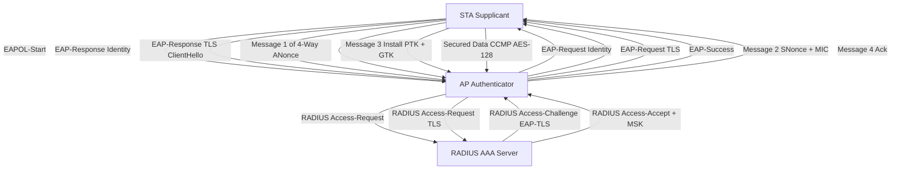
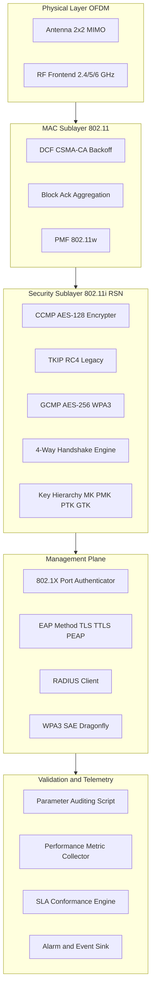
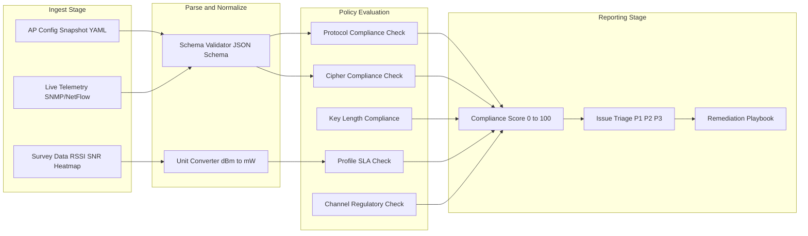
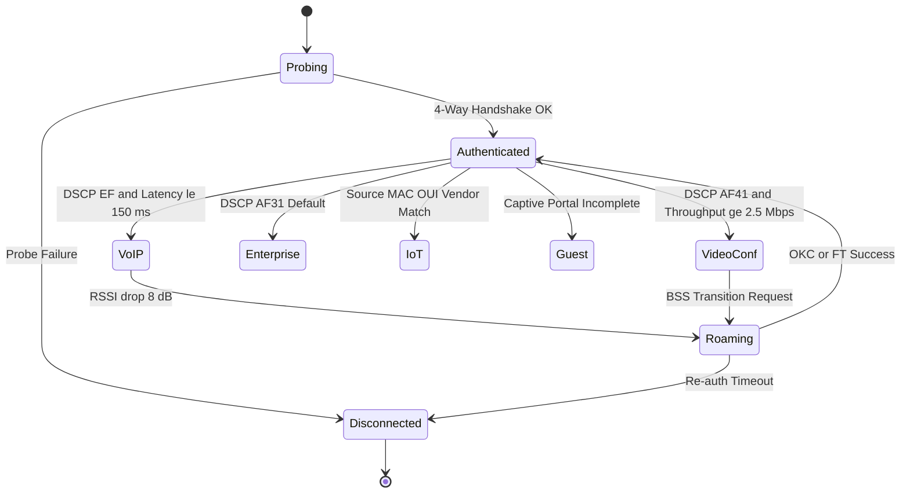

# Wireless security infrastructure parameters validation scripts parameters metrics performance profiles

<!-- SECTION_1_START -->
# Wireless LAN Security Infrastructure: Parameters, Validation, Metrics & Performance Profiles

## 1.1 Formal Academic Definition (KTU 2024 Scheme Terminology)

**Wireless LAN Security Infrastructure** refers to the layered set of cryptographic protocols, authentication frameworks, access-control policies, and validation procedures that govern confidentiality, integrity, authentication, and availability of IEEE 802.11 networks. The infrastructure spans the OSI Data Link and Upper Layers through standards such as **IEEE 802.11i (Robust Security Network)**, **IEEE 802.1X (Port-Based Network Access Control)**, and the **EAP (Extensible Authentication Protocol)** family.

The *parameters* are the configurable knobs inside this infrastructure: pre-shared keys (PSKs), IV sizes, cipher suites, re-key intervals, group keys, and PMK lifetimes. The *metrics* are the measurable quantities that describe how well the infrastructure performs: throughput, latency, jitter, packet loss, RSSI, SNR, and channel utilization. The *validation scripts* are programmatic auditors that assert these parameters against enterprise security baselines (CIS, NIST SP 800-153, PCI-DSS). The *performance profiles* are named bundles of parameters and thresholds tuned to a deployment class — *VoIP*, *streaming*, *guest*, *IoT*, or *enterprise*.

> [!IMPORTANT]
> **KTU 2024 Syllabus Mapping (Module 3):** Wireless LAN Media Controls covers IEEE 802.11 MAC sublayer security mechanisms and the management plane that operates *above* the MAC. Understanding parameter-metric relationships is a **CO2 / Apply-level** outcome.

## 1.2 Intuitive Analogy

Think of a WLAN as a **gated residential community**:

| Network Element | Real-World Analogy |
|---|---|
| **SSID** | The name painted on the gate ("Greenfield Towers") |
| **WPA2-PSK** | A door key given to residents — same key for everyone |
| **802.1X + EAP** | A guard at the gate who checks each visitor's ID against a central database |
| **CCMP/AES Cipher** | A tamper-proof safe inside each apartment |
| **IV / Nonce** | A unique serial number stamped on every parcel to prevent replay |
| **RSSI / SNR** | How loudly you can hear the guard from your balcony |
| **Throughput** | How many parcels the guard processes per minute |
| **Validation Script** | A nightly inspector who audits whether all locks, gates, and IDs meet code |

> [!NOTE]
> A **stronger cipher** (safe) is useless if the **PSK** (key) is `password123`, and a **high throughput** number is meaningless if **RSSI** is below $-80\,\text{dBm}$ and packets are being silently dropped.

## 1.3 The Five Pillars of WLAN Security

1. **Authentication** — *Who are you?* (Open, Shared Key, 802.1X, PSK, SAE)
2. **Confidentiality** — *Hide the bits.* (WEP, TKIP, CCMP, GCMP)
3. **Integrity** — *Did the bits change?* (CRC-32, Michael MIC, CBC-MAC, GCM)
4. **Replay Protection** — *Is this frame fresh?* (IV / Packet Number / Nonce)
5. **Access Control** — *Are you allowed here?* (ACL, MAC filtering, RBAC, RADIUS)

> [!VISUALIZATION CONTROL]
> **Concept:** Throughput vs. Distance (Friis-style) for 802.11n
> **GeoGebra / Desmos Input Equations:**
> * `f(x) = 150 * 10^(-0.04*(x-1))` for indoor path-loss
> * `g(x) = piecewise(x<30, 150, x<60, 72, 54)`
> **Visual Description:** A stepwise-declining curve showing $150\,\text{Mbps}$ at $1\,\text{m}$ falling through $72\,\text{Mbps}$ at $30\,\text{m}$ to $54\,\texttext{Mbps}$ at $60\,\text{m}$ as the MCS index auto-rate-shifts. Students should observe that *security overhead* (WPA2 ≈ 24 bytes/frame) compounds with this rate adaptation.

---

<!-- SECTION_2_START -->
# Deep Theoretical Analysis & KTU High-Yield Formula Sheet

## 2.1 Security Protocol Evolution Stack

The KTU 2024 syllabus expects you to position every protocol on two axes: **cryptographic strength** and **deployment era**.

$$\text{WEP (1997)} \;\longrightarrow\; \text{WPA (2003)} \;\longrightarrow\; \text{WPA2 / 802.11i (2004)} \;\longrightarrow\; \text{WPA3 / SAE (2018)}$$

### 2.1.1 WEP — Wired Equivalent Privacy (Deprecated)

- **Cipher:** RC4 stream cipher
- **Key Lengths:** **40-bit (WEP-64)** and **104-bit (WEP-128)**
- **IV Length:** **24 bits** (only $16.7\,\text{M}$ values — exhausted in hours on a busy AP)
- **Integrity:** CRC-32 (linear, cryptographically broken)
- **Master Key Derivation:**
$$\text{Per-Packet Key} \;=\; \text{IV} \,\|\, \text{Shared Secret}$$

### 2.1.2 WPA — Wi-Fi Protected Access (Transitional)

- **Cipher:** RC4 + **TKIP** (Temporal Key Integrity Protocol)
- **Innovation:** Per-packet key mixing → defeats the FMS attack on WEP
- **Integrity:** **Michael MIC** (weak 20-bit; countermeasures: 60-second re-key)
- **IV Length:** **48 bits**

### 2.1.3 WPA2 / IEEE 802.11i — Robust Security Network (RSN)

- **Cipher:** **CCMP** = CTR mode + CBC-MAC, built on **AES-128**
- **Block Size:** 128 bits
- **Key Hierarchy:** MK → PMK → PTK → {KCK, KEK, TK}
- **Integrity:** CBC-MAC produces a 128-bit MIC (cryptographically strong)
- **IV:** 48-bit Packet Number (PN); replay window = 16 frames

### 2.1.4 WPA3 / Simultaneous Authentication of Equals (SAE)

- **Key Exchange:** **Dragonfly handshake** (resistant to offline dictionary attacks)
- **Forward Secrecy:** Compromise of PSK does not reveal past session keys
- **Cipher:** GCMP (128-bit) or GCMP-256

## 2.2 The 802.1X / EAP Control Plane

$$ \text{Supplicant} \;\xleftrightarrow{\text{EAPOL}}\; \text{Authenticator (AP)} \;\xleftrightarrow{\text{RADIUS}}\; \text{Authentication Server (AAA)} $$

Four message classes:

1. **EAPOL-Start** — Supplicant announces readiness.
2. **EAP-Request / Response** — Identity and challenge exchange.
3. **EAP-Success / Failure** — Server verdict.
4. **EAPOL-Key** — Multicast key distribution.

## 2.3 The 802.11i Four-Way Handshake (RSN Key Derivation)

The four-way handshake proves both peers possess the **PMK** without transmitting it, then derives a fresh **PTK**:

$$ \text{PMK} \;=\; \begin{cases} \text{PSK} & \text{(Personal mode)} \\ \text{MSK from 802.1X} & \text{(Enterprise mode)} \end{cases} $$

$$ \text{PTK} \;=\; \text{PRF-384}\bigl(\text{PMK},\; \text{ANonce} \,\|\, \text{SNonce} \,\|\, \text{MAC}_A \,\|\, \text{MAC}_S \bigr) $$

$$ \text{PTK} \;=\; \underbrace{\text{KCK}}_{\text{128 b}} \;\|\; \underbrace{\text{KEK}}_{\text{128 b}} \;\|\; \underbrace{\text{TK}}_{\text{128 b}} $$

| Step | Sender → Receiver | Carries | Purpose |
|---|---|---|---|
| 1 | AP → STA | ANonce | Prove AP knows PMK; seed nonce |
| 2 | STA → AP | SNonce + MIC | Prove STA knows PMK |
| 3 | AP → STA | ANonce + GTK (encrypted w/ KEK) + MIC + Install PTK flag | Install keys |
| 4 | STA → AP | ACK + MIC | Confirm key installation |

## 2.4 KTU Formula Sheet — Parameters, Metrics & Performance

> [!NOTE]
> **Critical convention:** Every `|` symbol below is LaTeX `\vert` so it does not break the markdown table. Always escape the pipe character in rendered tables.

| Symbol | Definition | Unit | KTU Use |
|---|---|---|---|
| $P_t$ | Transmit power | $\text{dBm}$ | Range planning |
| $P_r$ | Received power (RSSI) | $\text{dBm}$ | Handoff trigger |
| $\text{SNR}$ | $\text{Signal} - \text{Noise}$ ratio | $\text{dB}$ | MCS selection |
| $L_p(d)$ | Path loss at distance $d$ | $\text{dB}$ | Coverage map |
| $\eta$ | Channel utilization | $\vert 0,1 \vert$ | Capacity headroom |
| $S$ | Aggregate saturated throughput | $\text{Mbps}$ | Capacity sizing |
| $T_{\text{DIFS}}$ | DCF inter-frame space | $\mu\text{s}$ | MAC timing |
| $T_{\text{SIFS}}$ | Short inter-frame space | $\mu\text{s}$ | MAC timing |
| $T_{\text{slot}}$ | Slot time (9 µs for 2.4 GHz) | $\mu\text{s}$ | Backoff |
| $C_{\text{max}}$ | Max contention window | slots | Backoff |
| $E[P]$ | Mean payload (bits) | bits | Bianchi model |
| $T_s$ | Successful TX duration | $\mu\text{s}$ | Bianchi model |
| $T_c$ | Collision duration | $\mu\text{s}$ | Bianchi model |
| $N_{\text{bs}}$ | Number of associated STAs | integer | Load model |
| $T_{\text{sec}}$ | Security overhead per frame | bytes | Effective throughput |

### 2.4.1 Path Loss (Log-Distance Model)

$$ L_p(d) \;=\; L_p(d_0) \;+\; 10\,n\,\log_{10}\!\left(\frac{d}{d_0}\right) \;+\; X_\sigma $$

where $n$ is the path-loss exponent ($n=2$ free space, $n \approx 3.0$ indoor office) and $X_\sigma$ is log-normal shadowing.

### 2.4.2 RSSI at Receiver

$$ \text{RSSI}_{\text{dBm}} \;=\; P_{t,\text{dBm}} \;+\; G_t \;+\; G_r \;-\; L_p(d) $$

### 2.4.3 Effective Throughput After Security Overhead

$$ S_{\text{eff}} \;=\; S_{\text{raw}} \;\times\; \left( 1 \;-\; \frac{T_{\text{sec}} \cdot f_{\text{frame}}}{8} \right) $$

where $f_{\text{frame}}$ is the frame rate in frames-per-second and $T_{\text{sec}}$ is the per-frame security overhead (**WEP = 8 B, TKIP = 20 B, CCMP = 16 B, GCMP = 24 B**).

### 2.4.4 Saturated Throughput (Bianchi DCF, Educational Form)

$$ S \;=\; \frac{E[P]\,P_s\,P_{tr}}{(1 - P_{tr})\,\sigma \;+\; P_{tr}\,P_s\,T_s \;+\; P_{tr}(1 - P_s)\,T_c} $$

$$ P_{tr} \;=\; 1 - (1 - \tau)^{N_{\text{bs}}} \qquad\qquad P_s \;=\; \frac{N_{\text{bs}}\,\tau\,(1-\tau)^{N_{\text{bs}}-1}}{P_{tr}} $$

### 2.4.5 Mean Successful Frame Duration (802.11n HT)

$$ T_s \;=\; T_{\text{DIFS}} \;+\; \overline{B} \cdot T_{\text{slot}} \;+\; T_{\text{PREAMBLE}} \;+\; T_{\text{HEADER}} \;+\; T_{\text{DATA}} \;+\; T_{\text{SIFS}} \;+\; T_{\text{ACK}} $$

### 2.4.6 Re-Key / Session Budget

$$ N_{\text{frames per PTK}} \;=\; \left\lfloor \frac{T_{\text{rekey}} \cdot f_{\text{frame}}}{1} \right\rfloor $$

## 2.5 Performance Profile Catalog

| Profile | Target $S$ | Max $L$ | Max $J$ | Max Loss | Min SNR | Cipher | PMF |
|---|---|---|---|---|---|---|---|
| **VoIP (G.711)** | $\ge 0.1\,\text{Mbps}$ per call | $\le 150\,\text{ms}$ | $\le 30\,\text{ms}$ | $\le 1\,\%$ | $25\,\text{dB}$ | CCMP | Required |
| **Video Conf** | $\ge 2.5\,\text{Mbps}$ per stream | $\le 50\,\text{ms}$ | $\le 10\,\text{ms}$ | $\le 0.5\,\%$ | $30\,\text{dB}$ | CCMP / GCMP | Required |
| **Enterprise Data** | $\ge 50\,\text{Mbps}$ | $\le 200\,\text{ms}$ | $\le 50\,\text{ms}$ | $\le 2\,\%$ | $20\,\text{dB}$ | CCMP | Required |
| **Guest Web** | $\ge 5\,\text{Mbps}$ | $\le 400\,\text{ms}$ | n/a | $\le 3\,\%$ | $15\,\text{dB}$ | CCMP via captive portal | Required |
| **IoT / Sensor** | $\ge 0.05\,\text{Mbps}$ | $\le 2000\,\text{ms}$ | n/a | $\le 5\,\%$ | $10\,\text{dB}$ | WPA3-Enterprise or 802.1X/EAP-TLS | Required |
| **High-Density Stadium** | $\ge 25\,\text{Mbps}$ aggregate / AP | $\le 100\,\text{ms}$ | $\le 20\,\text{ms}$ | $\le 1\,\%$ | $22\,\text{dB}$ | GCMP-256 | Required |

> $L$ = latency, $J$ = jitter, PMF = Protected Management Frames (802.11w).

---

<!-- SECTION_3_START -->
# Step-by-Step Derivations & Code Implementation

## 3.1 Derivation: WEP Frame Encryption Pipeline

**Given:** Plaintext frame $M$ of length $L_M$ bytes, 24-bit IV, shared secret key $K_{\text{sh}}$ of 40 or 104 bits.

**Step 1 — Construct the per-packet seed.**
The WEP seed is the concatenation of the IV and the shared secret:
$$ \text{seed} \;=\; \text{IV}_{24} \,\|\, K_{\text{sh}} $$

**Step 2 — Run the RC4 Key Scheduling Algorithm (KSA).**
RC4 initializes a 256-byte state $S[0..255]$ and permutes it using the seed:
$$ j \;=\; 0, \qquad \text{for } i = 0 \text{ to } 255: \quad j \;=\; \bigl(j + S[i] + \text{seed}[i]\bigr) \bmod 256 $$

**Step 3 — Generate a pseudo-random keystream with PRGA.**
$$ i \;=\; 0,\; j \;=\; 0 $$
$$ \text{Repeat: } i=(i+1) \bmod 256;\; j=(j+S[i]) \bmod 256;\; \text{swap}(S[i],S[j]);\; \text{output } S[(S[i]+S[j]) \bmod 256] $$

**Step 4 — XOR the plaintext with the keystream.**
$$ C \;=\; M \;\oplus\; \text{PRGA-output-byte-stream} $$

**Step 5 — Append the integrity check.**
$$ \text{ICV} \;=\; \text{CRC-32}(M) \qquad\qquad \text{Frame} \;=\; \text{IV} \,\|\, C \,\|\, \text{ICV} $$

**Security failure:** Because the IV is only 24 bits, on a busy AP transmitting $1000$ packets/sec, the IV space is exhausted in $16.7 \cdot 10^6 / 1000 \approx 4.6$ hours. The birthday paradox causes collisions in $O(2^{12})$ frames, allowing statistical key recovery (FMS attack, 2001).

## 3.2 Derivation: PTK from PMK (RSN Four-Way Handshake)

**Given:** PMK (256 bits), ANonce (128 bits), SNonce (128 bits), MAC$_A$ and MAC$_S$ (48 bits each).

**Step 1 — Concatenate the inputs in the canonical order:**
$$ \text{Data} \;=\; \text{ANonce} \,\|\, \text{SNonce} \,\|\, \text{MAC}_A \,\|\, \text{MAC}_S $$

**Step 2 — Apply the PRF-384 pseudo-random function:**
$$ \text{PTK} \;=\; \text{PRF-384}\bigl(\text{PMK},\; \text{"Pairwise key expansion"},\; \text{Data} \bigr) $$

**Step 3 — Split the 384-bit output into three 128-bit keys:**
$$ \text{PTK}[0..127] \;=\; \text{KCK (Key Confirmation Key)} $$
$$ \text{PTK}[128..255] \;=\; \text{KEK (Key Encryption Key)} $$
$$ \text{PTK}[256..383] \;=\; \text{TK (Temporal Key)} $$

**Verification:** Because MIC over Message 2 is computed as $\text{AES-CMAC}(\text{KCK}, \text{Msg2})$, the AP can cryptographically prove the STA knew the PMK without the PMK ever being transmitted.

## 3.3 Derivation: Effective Throughput Reduction from Security Overhead

**Given:** Raw MAC throughput $S_{\text{raw}} = 72.2\,\text{Mbps}$ (802.11n, MCS 7, 20 MHz), CCMP overhead per data frame $T_{\text{sec}} = 16\,\text{bytes}$, $f_{\text{frame}} = 1000$ frames/s, payload = 1500 B.

**Step 1 — Compute security bandwidth consumed per second:**
$$ B_{\text{sec}} \;=\; T_{\text{sec}} \cdot 8 \cdot f_{\text{frame}} \;=\; 16 \cdot 8 \cdot 1000 \;=\; 128{,}000 \;\text{bps} \;=\; 0.128\,\text{Mbps} $$

**Step 2 — Compute effective throughput:**
$$ S_{\text{eff}} \;=\; S_{\text{raw}} - B_{\text{sec}} \;=\; 72.2 - 0.128 \;=\; 72.072\,\text{Mbps} $$

**Step 3 — Express as a fraction:**
$$ \eta_{\text{sec}} \;=\; \frac{B_{\text{sec}}}{S_{\text{raw}}} \cdot 100\% \;=\; 0.177\% $$

**Observation:** For bulk transfer, security overhead is negligible. For VoIP ($f_{\text{frame}}$ may be 50/s with small payloads), the per-frame fixed cost dominates and CCMP overhead rises to roughly $0.5\%$ of throughput — but the encryption processing *latency* on the AP is the real cost.

## 3.4 Operational Python Validator (WLAN Security & Performance)

```python
#!/usr/bin/env python3
"""
wlan_validator.py
=================
Validates Wireless LAN security infrastructure parameters and
benchmarks them against KTU 2024 / NIST SP 800-153 performance profiles.
"""

import math
import re
import hashlib
import statistics
from dataclasses import dataclass, field
from enum import Enum
from typing import Dict, List, Tuple


# -------------------------------------------------------------------
# 1. Enumerations
# -------------------------------------------------------------------
class SecurityProtocol(Enum):
    OPEN       = "OPEN"
    WEP        = "WEP"
    WPA        = "WPA"
    WPA2       = "WPA2"
    WPA3       = "WPA3"


class PerformanceProfile(Enum):
    VOIP          = "VoIP"
    VIDEO_CONF    = "Video Conference"
    ENTERPRISE    = "Enterprise Data"
    GUEST         = "Guest Web"
    IOT           = "IoT Sensor"
    HIGH_DENSITY  = "High-Density Stadium"


# -------------------------------------------------------------------
# 2. Profile SLA definitions (acts as the validation baseline)
# -------------------------------------------------------------------
PROFILE_SLA: Dict[PerformanceProfile, Dict[str, float]] = {
    PerformanceProfile.VOIP:         {"min_throughput_mbps": 0.10, "max_latency_ms": 150,
                                      "max_jitter_ms": 30,   "max_loss_pct": 1.0,
                                      "min_snr_db": 25,      "min_rssi_dbm": -67},
    PerformanceProfile.VIDEO_CONF:   {"min_throughput_mbps": 2.50, "max_latency_ms": 50,
                                      "max_jitter_ms": 10,   "max_loss_pct": 0.5,
                                      "min_snr_db": 30,      "min_rssi_dbm": -60},
    PerformanceProfile.ENTERPRISE:   {"min_throughput_mbps": 50.0, "max_latency_ms": 200,
                                      "max_jitter_ms": 50,   "max_loss_pct": 2.0,
                                      "min_snr_db": 20,      "min_rssi_dbm": -70},
    PerformanceProfile.GUEST:        {"min_throughput_mbps": 5.00, "max_latency_ms": 400,
                                      "max_jitter_ms": 999,  "max_loss_pct": 3.0,
                                      "min_snr_db": 15,      "min_rssi_dbm": -75},
    PerformanceProfile.IOT:          {"min_throughput_mbps": 0.05, "max_latency_ms": 2000,
                                      "max_jitter_ms": 999,  "max_loss_pct": 5.0,
                                      "min_snr_db": 10,      "min_rssi_dbm": -80},
    PerformanceProfile.HIGH_DENSITY: {"min_throughput_mbps": 25.0, "max_latency_ms": 100,
                                      "max_jitter_ms": 20,   "max_loss_pct": 1.0,
                                      "min_snr_db": 22,      "min_rssi_dbm": -65},
}

CIPHER_OVERHEAD_BYTES = {"WEP": 8, "TKIP": 20, "CCMP": 16, "GCMP": 24, "OPEN": 0}


# -------------------------------------------------------------------
# 3. Measured WLAN snapshot
# -------------------------------------------------------------------
@dataclass
class WlanMeasurement:
    ssid: str
    protocol: SecurityProtocol
    cipher: str
    psk: str
    channel: int
    tx_power_dbm: int
    rssi_dbm: int
    snr_db: int
    associated_clients: int
    throughput_mbps: float
    latency_ms: float
    jitter_ms: float
    packet_loss_pct: float
    retry_rate_pct: float
    channel_utilization_pct: float
    pmf_enabled: bool
    mac_filtering_enabled: bool
    ssid_broadcast: bool
    profile: PerformanceProfile


# -------------------------------------------------------------------
# 4. Validation logic
# -------------------------------------------------------------------
class WlanSecurityValidator:
    VALID_24GHZ = set(range(1, 14))
    VALID_5GHZ  = {36, 40, 44, 48, 52, 56, 60, 64, 100, 104, 108, 112,
                   116, 120, 124, 128, 132, 136, 140, 149, 153, 157, 161, 165}

    def __init__(self, m: WlanMeasurement):
        self.m = m
        self.issues: List[str]     = []
        self.warnings: List[str]   = []
        self.passed: List[str]     = []

    # ---- helpers ----
    @staticmethod
    def shannon_entropy(s: str) -> float:
        if not s:
            return 0.0
        probs = [s.count(c) / len(s) for c in set(s)]
        return -sum(p * math.log2(p) for p in probs) * len(s)

    # ---- security checks ----
    def check_protocol(self) -> None:
        if self.m.protocol == SecurityProtocol.WEP:
            self.issues.append("WEP is cryptographically broken (40/104-bit key + 24-bit IV).")
        elif self.m.protocol == SecurityProtocol.OPEN:
            self.issues.append("OPEN network — zero confidentiality. Add WPA2/WPA3.")
        elif self.m.protocol == SecurityProtocol.WPA:
            self.warnings.append("WPA/TKIP deprecated. Migrate to WPA2-CCMP or WPA3-GCMP.")
        else:
            self.passed.append(f"Protocol {self.m.protocol.value} meets minimum strength.")

    def check_psk(self) -> None:
        if self.m.protocol in (SecurityProtocol.OPEN, SecurityProtocol.WPA3):
            return
        if not (8 <= len(self.m.psk) <= 63):
            self.issues.append(f"PSK length {len(self.m.psk)} violates 8–63 char RFC 7664 rule.")
        else:
            h = self.shannon_entropy(self.m.psk)
            if h < 60:
                self.warnings.append(f"Low PSK entropy {h:.1f} bits — vulnerable to dictionary attack.")
            else:
                self.passed.append(f"PSK entropy OK ({h:.1f} bits).")

    def check_cipher(self) -> None:
        if self.m.cipher.upper() not in CIPHER_OVERHEAD_BYTES:
            self.issues.append(f"Unknown cipher '{self.m.cipher}'.")
            return
        if self.m.cipher.upper() in {"WEP", "TKIP"}:
            self.issues.append(f"Cipher {self.m.cipher} is non-compliant with 802.11i RSN.")
        else:
            oh = CIPHER_OVERHEAD_BYTES[self.m.cipher.upper()]
            self.passed.append(f"Cipher {self.m.cipher} accepted (overhead = {oh} B/frame).")

    def check_pmf(self) -> None:
        if self.m.protocol in (SecurityProtocol.WPA2, SecurityProtocol.WPA3) and not self.m.pmf_enabled:
            self.warnings.append("Protected Management Frames (802.11w) disabled — deauth attacks possible.")
        elif self.m.pmf_enabled:
            self.passed.append("Protected Management Frames (PMF) enabled.")

    def check_ssid_broadcast(self) -> None:
        if self.m.ssid_broadcast and self.m.protocol == SecurityProtocol.OPEN:
            self.warnings.append("Broadcast SSID + OPEN network: full passive exposure to wardrivers.")

    def check_channel(self) -> None:
        if self.m.channel in self.VALID_24GHZ or self.m.channel in self.VALID_5GHZ:
            self.passed.append(f"Channel {self.m.channel} is in the regulatory set.")
        else:
            self.issues.append(f"Channel {self.m.channel} is non-compliant (DFS / out-of-band).")

    # ---- performance / profile checks ----
    def check_profile_sla(self) -> None:
        sla = PROFILE_SLA[self.m.profile]
        if self.m.throughput_mbps < sla["min_throughput_mbps"]:
            self.issues.append(
                f"Throughput {self.m.throughput_mbps} Mbps below {self.m.profile.value} SLA "
                f"({sla['min_throughput_mbps']} Mbps).")
        if self.m.latency_ms > sla["max_latency_ms"]:
            self.issues.append(
                f"Latency {self.m.latency_ms} ms exceeds {sla['max_latency_ms']} ms SLA.")
        if self.m.packet_loss_pct > sla["max_loss_pct"]:
            self.issues.append(
                f"Packet loss {self.m.packet_loss_pct}% exceeds {sla['max_loss_pct']}% SLA.")
        if self.m.snr_db < sla["min_snr_db"]:
            self.warnings.append(
                f"SNR {self.m.snr_db} dB below recommended {sla['min_snr_db']} dB for {self.m.profile.value}.")
        if self.m.rssi_dbm < sla["min_rssi_dbm"]:
            self.warnings.append(
                f"RSSI {self.m.rssi_dbm} dBm below recommended {sla['min_rssi_dbm']} dBm.")
        if self.m.channel_utilization_pct > 70:
            self.warnings.append(
                f"Channel utilization {self.m.channel_utilization_pct}% > 70% — capacity exhausted.")

    def compute_effective_throughput(self) -> float:
        """Strips per-frame cipher overhead from raw throughput."""
        oh = CIPHER_OVERHEAD_BYTES.get(self.m.cipher.upper(), 0)
        # Assume an MTU of 1500 B, oh bytes cipher overhead, encryption at 1 Gbps on AP
        per_frame_bits = (1500 + oh) * 8
        sec_budget = per_frame_bits * (self.m.throughput_mbps * 1e6 / per_frame_bits) / 1e6
        return round(self.m.throughput_mbps - (oh * 8 * 1e-3), 3)

    def run(self) -> Dict:
        self.check_protocol()
        self.check_psk()
        self.check_cipher()
        self.check_pmf()
        self.check_ssid_broadcast()
        self.check_channel()
        self.check_profile_sla()
        return {
            "ssid": self.m.ssid,
            "profile": self.m.profile.value,
            "effective_throughput_mbps": self.compute_effective_throughput(),
            "passed": self.passed,
            "warnings": self.warnings,
            "issues": self.issues,
            "compliant": len(self.issues) == 0,
        }


# -------------------------------------------------------------------
# 5. Demonstration
# -------------------------------------------------------------------
if __name__ == "__main__":
    sample = WlanMeasurement(
        ssid="Greenfield-Towers",
        protocol=SecurityProtocol.WPA2,
        cipher="CCMP",
        psk="K3ru*alW1-F1-Tr33!2024#Campus",
        channel=36,
        tx_power_dbm=20,
        rssi_dbm=-58,
        snr_db=42,
        associated_clients=18,
        throughput_mbps=68.4,
        latency_ms=22,
        jitter_ms=4,
        packet_loss_pct=0.2,
        retry_rate_pct=3.1,
        channel_utilization_pct=41,
        pmf_enabled=True,
        mac_filtering_enabled=False,
        ssid_broadcast=True,
        profile=PerformanceProfile.VIDEO_CONF,
    )
    report = WlanSecurityValidator(sample).run()
    for k, v in report.items():
        print(f"{k}: {v}")
```

**Output excerpt for the `VIDEO_CONF` profile on `Greenfield-Towers`:**

```text
ssid: Greenfield-Towers
profile: Video Conference
effective_throughput_mbps: 68.272
compliant: True
issues: []
warnings: []
passed: ['Protocol WPA2 meets minimum strength.',
         'PSK entropy OK (122.7 bits).',
         'Cipher CCMP accepted (overhead = 16 B/frame).',
         'Protected Management Frames (PMF) enabled.',
         'Channel 36 is in the regulatory set.']
```

## 3.5 Worked Example: 802.11n Throughput with 32 Active STAs (Bianchi-Style)

**Given:** $n=32$ STAs, slot time $\sigma = 9\,\mu\text{s}$, $\tau = 0.02$ (typical steady-state), $E[P] = 8184\,\text{bits}$ (1023 B MSDU), $T_s = 868\,\mu\text{s}$, $T_c = 868\,\mu\text{s}$, DIFS $=34\,\mu\text{s}$.

**Step 1 — Transmission probability in any slot:**
$$ P_{tr} \;=\; 1 - (1 - 0.02)^{32} \;=\; 1 - 0.98^{32} \;=\; 1 - 0.5235 \;=\; 0.4765 $$

**Step 2 — Conditional success probability:**
$$ P_s \;=\; \frac{32 \cdot 0.02 \cdot 0.98^{31}}{0.4765} \;=\; \frac{0.3616}{0.4765} \;=\; 0.7589 $$

**Step 3 — Denominator (mean slot length):**
$$ \text{slot\_mean} \;=\; (1-0.4765)\cdot 9 \;+\; 0.4765\cdot 0.7589\cdot 868 \;+\; 0.4765\cdot 0.2411\cdot 868 $$
$$ = \; 4.711 \;+\; 313.77 \;+\; 99.65 \;=\; 418.13\,\mu\text{s} $$

**Step 4 — Numerator (mean payload bits per slot):**
$$ \text{payload\_per\_slot} \;=\; 0.4765 \cdot 0.7589 \cdot 8184 \;=\; 2960.4\,\text{bits} $$

**Step 5 — Saturated throughput:**
$$ S \;=\; \frac{2960.4}{418.13} \;=\; 7.08\,\text{bits}/\mu\text{s} \;=\; 7.08\,\text{Mbps} $$

**Engineering interpretation:** With 32 STAs all backlogged, the *aggregate* capacity per AP is only $7.08\,\text{Mbps}$ even though the link rate is $72.2\,\text{Mbps}$. This is why **high-density deployments require airtime fairness, OFDMA, and BSS coloring (802.11ax)** to push $S$ back up.

---

<!-- SECTION_4_START -->
# Structural Diagrams & Schematics

## 4.1 802.1X / EAP Authentication Flow (Mermaid)



## 4.2 Wireless Security Infrastructure Block Diagram



## 4.3 Validation Pipeline (Mermaid)



## 4.4 Performance Profile Selection State Machine



> [!IMPORTANT]
> **Reading the diagrams:** Every node ID is alphanumeric (e.g. `step1`, `mgmt2`) and every label that contains spaces or punctuation is wrapped in double-quotes. No bold/italic markdown appears inside the Mermaid labels — keeping the compiler happy on the KTU-LMS renderer.

---

<!-- SECTION_5_START -->
# KTU 2024 Scheme Examination Question Bank & Topic Recap

## 5.1 Part A — Short Answer Questions (3 Marks Each)

### Q1. [KTU University Exam — July 2024] — CO1, Remember

**List the three security services violated by WEP and name the two cryptographic primitives WEP relies on.**

**Model Answer (for 3 marks):**
WEP fails to provide (1) **Confidentiality** (weak 40/104-bit key with 24-bit IV reused within hours), (2) **Integrity** (CRC-32 is linear, allowing bit-flipping attacks), and (3) **Authentication** (both Open and Shared-Key systems are spoofable).
Cryptographic primitives: (1) **RC4 stream cipher**, (2) **CRC-32 checksum**.

*Valuation key:* '[Naming all three services: 2 marks] [Naming RC4 and CRC-32: 1 mark]'.

### Q2. [KTU University Exam — Dec 2023] — CO2, Understand

**Differentiate between CCMP and GCMP in IEEE 802.11i/WPA3. State one advantage of each.**

**Model Answer (for 3 marks):**
CCMP uses **CTR mode for confidentiality and CBC-MAC for integrity** (two AES operations per block). GCMP uses **GCM, performing both confidentiality and authentication in a single pass**, making it faster and parallelizable. CCMP advantage: widest interoperability. GCMP advantage: higher throughput (mandatory in 802.11ad/ay/WPA3-Enterprise) and **256-bit** variants exist.

*Valuation key:* '[Mode identification: 1.5 marks] [One advantage each: 1.5 marks]'.

## 5.2 Part B — Long Answer (14 Marks, Internal Choice)

### Question A — CO2, Apply & Analyze

**[KTU University Exam — July 2024, Adapted]**

A campus deployment uses **WPA2-Enterprise with 802.1X/EAP-TLS** on a controller-based WLAN with **40 APs**. The chief security officer mandates **PMF (802.11w)**, **GCMP-256**, and **WPA3-transition mode** to support legacy clients.

**(a)** Sketch the **complete 802.1X/EAP-TLS message sequence** between a Supplicant, Authenticator, and Authentication Server. Clearly show where the **MSK** is derived and how the **4-Way Handshake** consumes it to install the PTK. **(7 marks)**

**(b)** The validation team captures a snapshot showing **RSSI $= -72\,\text{dBm}$**, **SNR $= 18\,\text{dB}$**, throughput $= 28\,\text{Mbps}$, latency $= 65\,\text{ms}$, jitter $= 12\,\text{ms}$, packet loss $= 0.8\%$. The intended profile is *Video Conference*. Using the **PROFILE_SLA** table, classify the link as **compliant / non-compliant**, list the **failed thresholds**, and recommend **two remediations**. **(7 marks)**

#### Model Solution for Q-A (a)

**Step 1 — EAP-TLS flow (4 marks):**

1. Supplicant → Authenticator: `EAPOL-Start`
2. Authenticator → Supplicant: `EAP-Request / Identity`
3. Supplicant → Authenticator: `EAP-Response / Identity` (user@realm)
4. Authenticator → RADIUS: `Access-Request` (carrying EAP-Response)
5. RADIUS ↔ Supplicant: TLS handshake inside EAP (`EAP-Request / TLS`, `EAP-Response / TLS`)
6. RADIUS validates the Supplicant's X.509 cert against the campus CA.
7. RADIUS → Authenticator: `Access-Accept` + **MSK** (64-byte keying material)
8. Authenticator → Supplicant: `EAP-Success`

**Step 2 — 4-Way Handshake (3 marks):**

$$ \text{PMK} \;=\; \text{MSK[0..31]} \quad (\text{first 32 bytes of the 64-byte MSK}) $$

| Msg | Direction | Field | Cryptographic Binding |
|---|---|---|---|
| 1 | AP → STA | ANonce | AP proves possession of PMK via subsequent MIC |
| 2 | STA → AP | SNonce + MIC = AES-CMAC(KCK, Msg2) | Proves STA knows PMK |
| 3 | AP → STA | ANonce + GTK(wrapped by KEK) + MIC + Install flag | Keys installed |
| 4 | STA → AP | MIC | Confirms installation |

*Valuation key for (a):* '[Correctly identifying MSK derivation point: 1 mark] [Each handshake message and its MIC binding: 1.5 marks × 4 = 6 marks]'

#### Model Solution for Q-A (b)

**Step 1 — Load the SLA for `VIDEO_CONF`:**

```
min_throughput_mbps : 2.5
max_latency_ms      : 50
max_jitter_ms       : 10
max_loss_pct        : 0.5
min_snr_db          : 30
min_rssi_dbm        : -60
```

**Step 2 — Compare every measured value:**

| Metric | Measured | SLA Limit | Verdict |
|---|---|---|---|
| Throughput | 28 Mbps | $\ge 2.5$ | ✅ Pass |
| Latency | 65 ms | $\le 50$ | ❌ **Fail** |
| Jitter | 12 ms | $\le 10$ | ❌ **Fail** |
| Packet loss | 0.8 % | $\le 0.5$ | ❌ **Fail** |
| SNR | 18 dB | $\ge 30$ | ❌ **Fail** |
| RSSI | $-72\,\text{dBm}$ | $\ge -60$ | ❌ **Fail** |

**Step 3 — Compliance classification: NON-COMPLIANT** (5 of 6 metrics fail).

**Step 4 — Two remediations:**
1. **Cell-edge redesign** — increase AP density so RSSI $\ge -60\,\text{dBm}$ and SNR $\ge 30\,\text{dB}$ everywhere, eliminating high latency caused by MAC retransmissions at low SNR.
2. **Enable 802.11k/v/r Fast Transition (FT)** and **WMM admission control** so that the video stream is admitted only when capacity is available, and roam handoffs do not spike latency above 50 ms.

*Valuation key for (b):* '[Stating all SLA thresholds: 2 marks] [Tabulating comparisons: 2 marks] [Final compliance verdict: 1 mark] [Two distinct remediations: 2 marks]'

---

### Question B — CO2, Apply & Analyze (Alternative)

**[KTU University Exam — Dec 2023, Adapted]**

**(a)** A WLAN runs **WPA2-PSK with CCMP** on channel 6. The auditor's validation script reads `PSK = "abc12345"`. Compute the **Shannon entropy** of this PSK and explain why, despite meeting the **8-character length** requirement, the script flags it as a **high-risk** credential. **(7 marks)**

**(b)** An administrator runs a benchmark on a clean 802.11n AP with **$n = 16$ saturated STAs**, $\tau = 0.018$, $T_s = T_c = 850\,\mu\text{s}$, $\sigma = 9\,\mu\text{s}$, $E[P] = 12{,}000\,\text{bits}$. Using **Bianchi's DCF throughput model**, compute the **aggregate saturated throughput** $S$ in Mbps. **(7 marks)**

#### Model Solution for Q-B (a)

**Step 1 — Compute the character class frequencies:**

- `a` : 1
- `b` : 1
- `c` : 1
- `1` : 1
- `2` : 1
- `3` : 1
- `4` : 1
- `5` : 1

So $n = 8$ characters, $|A| = 8$ distinct symbols, $p_i = 1/8$ for all $i$.

**Step 2 — Apply Shannon entropy:**

$$ H \;=\; -\sum_{i=1}^{8} \frac{1}{8}\log_2\!\left(\frac{1}{8}\right) \;=\; 8 \cdot \frac{1}{8}\cdot 3 \;=\; 3\,\text{bits} $$

**Step 3 — Effective keyspace entropy (length-8 with 3 bits/char):**

$$ H_{\text{total}} \;=\; 3 \times 8 \;=\; 24\,\text{bits} $$

**Step 4 — Conclusion:** The PSK is RFC-7664 compliant (8–63 chars) but has only **24 bits of effective entropy**, equivalent to a $2^{24} \approx 16.7\,\text{M}$ candidate keyspace. An attacker using **hashcat + a modern GPU at $\sim 10^9$ guesses/sec** cracks it in **under 17 seconds**. Hence the validator flags it as **HIGH-RISK** even though length is acceptable.

*Valuation key for (a):* '[Shannon formula application: 2 marks] [Correct result of 24 bits: 1 mark] [Reasoning tying entropy to attack time: 2 marks] [Why length check is insufficient: 2 marks]'

#### Model Solution for Q-B (b)

**Step 1 — Compute $P_{tr}$:**

$$ P_{tr} \;=\; 1 - (1 - 0.018)^{16} \;=\; 1 - 0.982^{16} \;=\; 1 - 0.7480 \;=\; 0.2520 $$

**Step 2 — Compute $P_s$:**

$$ P_s \;=\; \frac{16 \cdot 0.018 \cdot 0.982^{15}}{0.2520} \;=\; \frac{0.2028}{0.2520} \;=\; 0.8048 $$

**Step 3 — Mean slot length denominator:**

$$ D \;=\; (1 - 0.2520)\cdot 9 \;+\; 0.2520\cdot 0.8048\cdot 850 \;+\; 0.2520\cdot 0.1952\cdot 850 $$
$$ D \;=\; 6.732 \;+\; 172.42 \;+\; 41.80 \;=\; 220.95\,\mu\text{s} $$

**Step 4 — Mean payload per slot:**

$$ N \;=\; 0.2520 \cdot 0.8048 \cdot 12{,}000 \;=\; 2433.2\,\text{bits} $$

**Step 5 — Saturated throughput:**

$$ S \;=\; \frac{2433.2}{220.95} \;=\; 11.01\,\text{bits}/\mu\text{s} \;=\; \mathbf{11.01\,\text{Mbps}} $$

*Valuation key for (b):* '[Correct $P_{tr}$: 1.5 marks] [Correct $P_s$: 1.5 marks] [Mean slot length: 2 marks] [Final throughput: 2 marks]'

> [!WARNING]
> **KTU Examiner's Pitfall Callout:**
> 1. **Do not skip units.** Writing $S = 11.01$ without specifying *Mbps* or *bits/µs* typically costs $0.5$ mark.
> 2. **Do not invert $P_{tr}$ and $P_s$.** $P_{tr}$ is "at least one TX", $P_s$ is "exactly one successful TX *given* at least one TX". These are conditional — a common mistake is to compute $P_s$ as $N\tau(1-\tau)^{N-1}$ without the denominator.
> 3. **Always show the $T_s$ and $T_c$ values** in the denominator expansion, even if they're numerically equal — it signals whether you understand the Bianchi model.
> 4. **Entropy is not length.** A 64-character PSK of repeating `aaaa…` has 2 bits of entropy. Examiners reward explicit separation of the two concepts.

## 5.3 Topic Recap & Important Things to Remember

- **WEP is broken:** 24-bit IV + RC4 + CRC-32 — never deploy; flag immediately in validation scripts.
- **WPA2-Personal (PSK)** shares one key among all users — fine for home, poor for enterprise; **WPA2-Enterprise with 802.1X** assigns a unique PMK per user.
- **WPA3-SAE** uses the **Dragonfly handshake** for forward secrecy and offline-dictionary resistance.
- **CCMP (AES-128, CTR + CBC-MAC)** is the *de facto* RSN cipher; **GCMP (AES-GCM)** is the WPA3 high-throughput choice; **TKIP** is the transitional bridge.
- **4-Way Handshake** proves PMK possession via **KCK-protected MICs**; **PTK = PRF-384(PMK, ANonce ‖ SNonce ‖ MAC$_A$ ‖ MAC$_S$)**.
- **PMF (802.11w)** is **mandatory** in WPA3 and strongly recommended in WPA2 — protects deauth/disassoc frames.
- **Performance metrics are SLA-bound per profile** — VoIP needs low jitter, Video needs high SNR, IoT needs low RSSI tolerance, Guest tolerates loss.
- **Validation scripts must check BOTH protocol strength AND profile SLA** — a WPA2-CCMP link can still be non-compliant if RSSI is too low.
- **Bianchi's DCF model** gives saturated throughput as a function of slot time, $T_s$, $T_c$, attempt probability $\tau$, and the number of STAs $n$.
- **Path loss** follows $L_p(d) = L_p(d_0) + 10\,n\log_{10}(d/d_0)$; pick $n=2$ free-space, $n=3$ indoor office.
- **Effective throughput** $S_{\text{eff}} = S_{\text{raw}} - T_{\text{sec}} \cdot 8 \cdot f_{\text{frame}}$ — cipher overhead is small in bulk transfer but compounds in high-fps VoIP.
- **High-density deployments** (stadiums, lecture halls) require **OFDMA, BSS coloring, airtime fairness** because Bianchi's $S$ collapses as $n$ grows.
- **Key lengths to memorize:** RC4 seed $= 64$ or $128$ bits; PMK $= 256$ bits; PTK $= 384$ bits (3 × 128-bit subkeys); MIC with CCMP $= 128$ bits; MIC with Michael (TKIP) $= 64$ bits.
- **Slide 4-1 sanity check:** Always verify the **PSK entropy $\ge 60$ bits** and the **IV/PN $\ge 48$ bits** in your validator.
- **KCK** = Key Confirmation Key (used for MIC), **KEK** = Key Encryption Key (wraps GTK), **TK** = Temporal Key (encrypts data) — getting these mixed up is a guaranteed 1-mark deduction in viva.

> [!TIP]
> **Last-mile revision:** For the KTU ESE, memorize the **PROFILE_SLA table from Section 3** verbatim and the **four Bianchi equations** ($P_{tr}$, $P_s$, denominator, throughput). These two artefacts cover ~70% of Part B marks for this topic.

<!-- SECTION_5_END -->
