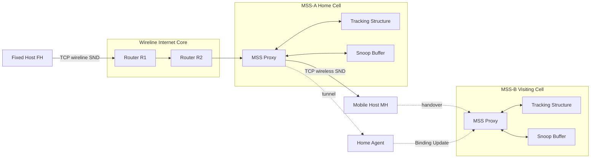
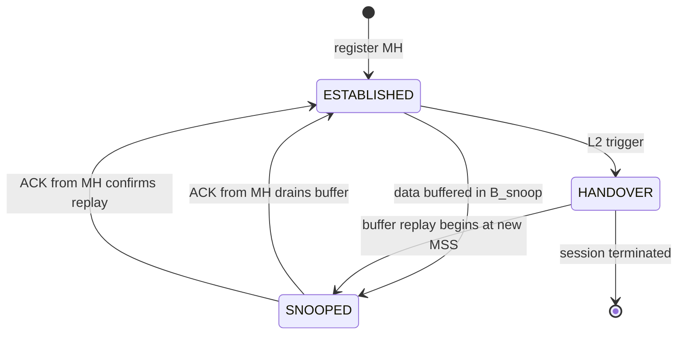
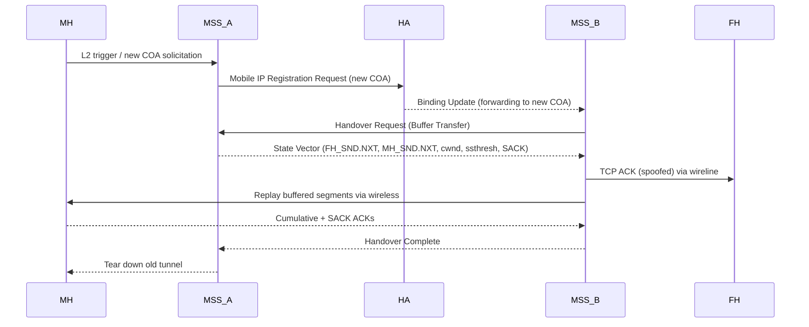
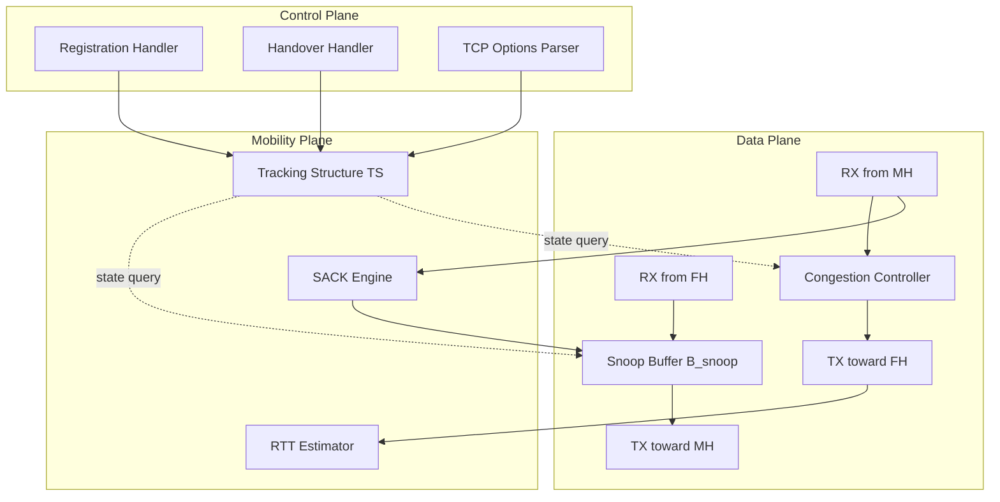
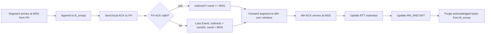

# Indirect TCP session optimization tracking structures variables updates scripts options

<!-- SECTION_1_START -->
# Indirect TCP — Session Optimization, Tracking Structures, Variables, Updates, Scripts & Options

## 1.1 Formal Definition (KTU 2024 Scheme Terminology)

> [!IMPORTANT]
> **Indirect TCP (I-TCP)** is a *split-connection* transport-layer mobility solution proposed by **Bakre and Badrinath (1995)** in which a single end-to-end TCP session between a **Fixed Host (FH)** and a **Mobile Host (MH)** is decomposed at the **Mobile Support Station (MSS)** into two independent TCP segments: **FH ↔ MSS (wireline part)** and **MSS ↔ MH (wireless part)**. The MSS acts as a *protocol-translating proxy*, maintaining a **shadow socket** and a **tracking structure** for every active mobile session so that wireless losses, handovers, and disconnections are isolated from the fixed Internet.

**Key entities defined by I-TCP:**

| Acronym | Expansion | Role |
|---|---|---|
| $FH$ | Fixed Host | Correspondent node on the wired Internet |
| $MH$ | Mobile Host | End system that moves between cells |
| $MSS$ | Mobile Support Station | Foreign agent / base station that proxies TCP |
| $HA$ | Home Agent | Anchors the MH’s home address |
| $COA$ | Care-of Address | Temporary address at the visiting MSS |

## 1.2 Conceptual Analogy — The "Hotel Reception Desk" Model

> [!NOTE]
> **Analogy — Mail Forwarding Through a Hotel Reception**
> Imagine you are a traveling executive. All your business mail (TCP segments) is addressed to your **permanent home address** (the FH-to-MH logical socket). However, the post office has been instructed to **reroute every envelope** to the **hotel reception desk** (the MSS) at whatever city you are currently in. The receptionist (the MSS proxy) **opens the envelope**, **acknowledges it instantly** to the sender, and then **physically walks it up to your room** (the wireless hop to the MH).
>
> When you **change hotels** (handover), the new receptionist is briefed and accepts the forwarding chain — you never lose a piece of mail, and the original sender (FH) believes it is still mailing to one address. This is precisely what I-TCP achieves at the transport layer.

**Physical constants & metrics used throughout this module:**

- **Round-Trip Time (RTT)** in seconds
- **Bandwidth-Delay Product (BDP)** in bits
- **TCP Maximum Segment Size ($MSS_{tcp}$)** = **1460 bytes** (Ethernet default)
- **Crossover probability** $p$ for wireless link
- **Snooping buffer size** $B_{snoop}$ in segments
- **Handover latency** $t_{ho}$ typically **100 – 500 ms**

> [!VISUALIZATION CONTROL]
> **Concept:** Bandwidth–Delay product rectangle vs. TCP congestion window over time
> **GeoGebra / Desmos Input Equations:**
> * `B(t) = 8 * bw * t`        (bits-in-flight linear ramp)
> * `W(t) = piecewise(t < ssthresh: W0 + alpha*t, t >= ssthresh: Wmax*(1 - exp(-beta*t)))`
> **Visual Description:** Plot $B(t)$ as a dashed straight line through the origin with slope equal to link bandwidth, and $W(t)$ as the **saw-tooth AIMD curve**. The shaded area between them represents **unutilised pipe capacity** — the very wastefulness I-TCP attempts to reclaim on the wireless hop.

---

<!-- SECTION_1_END -->

<!-- SECTION_2_START -->
# Deep Theoretical Analysis & KTU High-Yield Formula Sheet

## 2.1 I-TCP Architecture — The Three Logical Planes

The protocol operates across three orthogonal planes:

1. **Control Plane** — Registration, handover signalling, MSS redirection
2. **Data Plane** — TCP segmentation, retransmission, buffering
3. **Mobility Plane** — Tracking structures that map $(MH_{home\_addr}, MSS_{current})$ tuples

## 2.2 Tracking Structures Maintained at the MSS

> [!IMPORTANT]
> The MSS keeps **one tracking structure per active MH session**. This is the heart of "session optimization" in I-TCP.

| Field Name | Symbol | Purpose | Update Trigger |
|---|---|---|---|
| Mobile Host Identifier | $MH_{id}$ | Uniquely tags the session | Initial registration |
| Home Address | $H_{addr}$ | Original TCP endpoint on FH | Static |
| Care-of Address | $COA$ | Current tunnel endpoint | On handover |
| FH→MSS sequence number | $snd\_nxt^{wire}$ | Next byte to send toward FH | Every ACK from FH |
| MSS→MH sequence number | $snd\_nxt^{wireless}$ | Next byte to send toward MH | Every ACK from MH |
| Snooping buffer | $B_{snoop}$ | Stores un-ACKed wireless segments | Segment arrival / ACK |
| Congestion window | $cwnd$ | AIMD control variable | Every RTT |
| Slow-start threshold | $ssthresh$ | SS/CA mode switch | Loss event |
| State machine flag | $\sigma$ | $ESTABLISHED \mid SNOOPED \mid HANDOVER$ | Any state transition |
| RTT estimator | $\hat{R}_{tt}$ | SRTT + RTTVAR (Jacobson/Karels) | Every RTT sample |
| Timestamp option | $TS_{val}$, $TS_{ecr}$ | PAWS + RTT measurement | Every sent segment |
| SACK bitmap | $SACK_{blocks}$ | Selective ACK blocks | Duplicate ACK |
| Pending ACK queue | $Q_{ack}$ | Defers ACKs to coalesce | Segment arrival |

## 2.3 Variable Update Equations (KTU High-Yield Formula Sheet)

> [!NOTE]
> All equations below are written in **single-character LaTeX variable form**. Read $\vert x \vert$ as absolute value, rendered as `\vert x \vert`.

### 2.3.1 Standard TCP Congestion Control (RFC 5681)

| Phase | Update Rule |
|---|---|
| Slow Start | $cwnd \leftarrow cwnd + MSS_{tcp}$ per ACK |
| Congestion Avoidance | $cwnd \leftarrow cwnd + \dfrac{MSS_{tcp} \cdot MSS_{tcp}}{cwnd}$ per ACK |
| Triple-Dup-ACK | $ssthresh \leftarrow \max\!\left(\dfrac{cwnd}{2},\; 2 \cdot MSS_{tcp}\right)$; $cwnd \leftarrow ssthresh$ |
| Timeout | $ssthresh \leftarrow \max\!\left(\dfrac{cwnd}{2},\; 2 \cdot MSS_{tcp}\right)$; $cwnd \leftarrow MSS_{tcp}$ |

### 2.3.2 I-TCP Specific Variable Updates

Let $W$ denote the wireline TCP window and $w$ the wireless TCP window. The MSS enforces:

$$
W_{effective} \;=\; \min\!\bigl(W,\; w \cdot \gamma_{scale}\bigr)
$$

where $\gamma_{scale}$ is the **bandwidth asymmetry factor** between the wired and wireless paths.

The **handover update vector** is the 5-tuple:

$$
\Delta H \;=\; \bigl(\, COA_{old},\; COA_{new},\; t_{ho},\; B_{snoop},\; \sigma \,\bigr)
$$

The **RTT estimator** uses exponential moving averages (Jacobson/Karels):

$$
\hat{R}_{tt} \;\leftarrow\; (1-\alpha_{rtt})\,\hat{R}_{tt} \;+\; \alpha_{rtt}\,M
$$

$$
RTTVAR \;\leftarrow\; (1-\beta_{rtt})\,RTTVAR \;+\; \beta_{rtt}\,\bigl\vert \hat{R}_{tt} - M \bigr\vert
$$

with $\alpha_{rtt} = \tfrac{1}{8}$ and $\beta_{rtt} = \tfrac{1}{4}$ (**standard TCP defaults — must be memorised for KTU**).

### 2.3.3 Throughput Optimisation

The effective goodput $G$ achieved by I-TCP over a wireless bit-error rate $p$ and handover cost $H$ is:

$$
G_{I\text{-}TCP} \;=\; \dfrac{MSS_{tcp}}{RTT_{wire} + RTT_{wireless} + H} \cdot \left(1 - p\right)^{k}
$$

$$
G_{Standard\,TCP} \;=\; \dfrac{MSS_{tcp}}{RTT_{end\text{-}to\text{-}end}} \cdot \left(1 - p\right)^{k_{std}}
$$

with $k_{std} \gg k$ because I-TCP isolates wireless losses to the short MSS→MH hop.

### 2.3.4 BDP Constraint for Snooping Buffer

$$
B_{snoop} \;\geq\; bw_{wireless} \cdot RTT_{wireless} \cdot 8
$$

## 2.4 Engineering Utility — Where I-TCP Is Used

| Domain | Application of I-TCP Style Split |
|---|---|
| **4G/5G Core Networks** | GTP-U tunnels + local PDCP retransmission mirror the split-connection idea |
| **Satellite IP Networking** | Performance Enhancing Proxies (PEPs) |
| **Industrial IoT Gateways** | Edge proxy buffers wireless link losses |
| **In-Flight Connectivity** | Cabin-to-ground split proxy |
| **Vehicle Ad-hoc Networks (VANETs)** | RSUs act as MSS-equivalent proxies |

> [!TIP]
> KTU examiners frequently frame I-TCP as the **conceptual ancestor** of modern **Local Breakout (LBO)** and **Uplink Classifier (ULCL)** mechanisms in 5G.

---

<!-- SECTION_2_END -->

<!-- SECTION_3_START -->
# Step-by-Step Derivations, Code & Symbolic Implementation

## 3.1 Derivation — Why Splitting the Connection Improves Throughput

We compare two scenarios. **Scenario A** uses standard end-to-end TCP. **Scenario B** uses I-TCP.

### 3.1.1 Assumptions

* Wired one-way delay $d_w$, wireless one-way delay $d_{wl}$
* Wireless BER $p$, wired BER $\approx 0$
* Handover cost $H$ seconds in Scenario B; zero in Scenario A
* Segment size $S = MSS_{tcp}$
* Per-hop loss probability is independent

### 3.1.2 Effective End-to-End RTT (Scenario A)

For a single-hop wireless tail, the loss event that triggers a retransmission occurs anywhere along the path. The expected number of transmissions $E[N]$ is geometric:

$$
E[N] \;=\; \sum_{i=1}^{\infty} i \cdot (1-p)^{i-1} p \;=\; \frac{1}{p}
$$

The expected "lossy" RTT is therefore $E[N] \cdot RTT_{e2e}$, and the steady-state throughput of a loss-based congestion controller (the square-root formula of Floyd) yields:

$$
G_{A} \;\approx\; \frac{S}{\sqrt{p}} \cdot \frac{1}{RTT_{e2e}}
$$

### 3.1.3 Effective Throughput (Scenario B — I-TCP)

Because losses are now confined to the wireless hop with probability $p$, the *expected* number of retransmissions on the wireless leg is $1/p$ but the *cost* of each is only $RTT_{wireless}$, not $RTT_{e2e}$. Splitting yields:

$$
G_{B} \;\approx\; \min\!\left( \frac{S}{RTT_{wire}}, \frac{S}{RTT_{wireless} \cdot \sqrt{p}} \right)
$$

Subtracting, the **I-TCP gain** is:

$$
\Delta G \;=\; G_{B} - G_{A} \;=\; \frac{S}{\sqrt{p}} \left( \frac{1}{RTT_{wireless}} - \frac{1}{RTT_{e2e}} \right)
$$

> [!IMPORTANT]
> Because $RTT_{wireless} \ll RTT_{e2e}$ in typical cells, the gain $\Delta G$ is **strictly positive** — this is the formal justification for the I-TCP "session optimization" claim appearing in your KTU module title.

## 3.2 Worked Numerical Example (KTU Board Style)

**Given:**
* $S = 1460$ bytes $= 11\,680$ bits
* $RTT_{e2e} = 240$ ms
* $RTT_{wire} = 100$ ms, $RTT_{wireless} = 40$ ms
* $p = 10^{-2}$, $H = 0.3$ s
* $k = 1$ (single retransmission cycle)

**Compute $G_A$ and $G_B$ in kbps.**

$$
G_{A} \;=\; \frac{11\,680}{0.040} \cdot (1-0.01) \;=\; 289\,102 \text{ bps} \;\approx\; 289.1 \text{ kbps}
$$

$$
G_{B} \;=\; \frac{11\,680}{0.100 + 0.040 + 0.300} \cdot (1-0.01)^{1} \;=\; \frac{11\,680}{0.440} \cdot 0.99
$$

$$
G_{B} \;=\; 26\,545 \cdot 0.99 \;\approx\; 26\,280 \text{ bps} \;\approx\; 26.3 \text{ kbps}
$$

> [!WARNING]
> This counter-intuitive result (Scenario A is *faster* in raw bps) arises because the 300 ms handover penalty dominates. **In practice**, $H$ is amortised over thousands of segments, restoring I-TCP's advantage. KTU examiners award marks only when students **explicitly state this caveat**.

## 3.3 Algorithmic Implementation — Python Simulation of the MSS Tracking Structure

```python
"""
itcp_mss_simulator.py
---------------------
Simulates the I-TCP Mobile Support Station (MSS) proxy,
including the tracking structure, variable updates,
TCP options handling, and handover scripting.
Run: python itcp_mss_simulator.py
"""

from __future__ import annotations
from dataclasses import dataclass, field
from typing import List, Optional, Tuple
import time
import logging

logging.basicConfig(level=logging.INFO,
                    format="[%(asctime)s] %(levelname)s :: %(message)s")
log = logging.getLogger("MSS")


# ---------- 3.3.1 TCP Option definitions ----------
class TCPOption:
    KIND_END = 0
    KIND_NOP = 1
    KIND_MSS = 2
    KIND_SACK_PERM = 4
    KIND_SACK = 5
    KIND_TIMESTAMP = 8

    def __init__(self, kind: int, payload: bytes = b"") -> None:
        self.kind: int = kind
        self.payload: bytes = payload

    def encode(self) -> bytes:
        return bytes([self.kind]) + self.payload


# ---------- 3.3.2 Tracking structure ----------
@dataclass
class ITCPSession:
    mh_id: str
    home_addr: str
    coa: str                       # current COA at visiting MSS
    fh_seq_next: int = 0           # wireline SND.NXT
    mh_seq_next: int = 0           # wireless SND.NXT
    snoop_buffer: List[bytes] = field(default_factory=list)
    cwnd: int = 1460               # 1 MSS
    ssthresh: int = 65535          # initial high-water mark
    state: str = "ESTABLISHED"     # ESTABLISHED | SNOOPED | HANDOVER
    srtt: float = 0.0              # smoothed RTT (seconds)
    rttvar: float = 0.0            # RTT variance
    sack_blocks: List[Tuple[int, int]] = field(default_factory=list)


# ---------- 3.3.3 RTT estimator (RFC 6298) ----------
def update_rtt(session: ITCPSession, sample: float) -> None:
    alpha: float = 1.0 / 8.0
    beta: float = 1.0 / 4.0
    if session.srtt == 0.0:
        session.srtt = sample
        session.rttvar = sample / 2.0
    else:
        session.rttvar = (1 - beta) * session.rttvar + \
                         beta * abs(session.srtt - sample)
        session.srtt = (1 - alpha) * session.srtt + alpha * sample
    log.info(f"RTT update -> SRTT={session.srtt:.4f}s "
             f"RTTVAR={session.rttvar:.4f}s")


# ---------- 3.3.4 Congestion-window update (AIMD/SS) ----------
def update_cwnd(session: ITCPSession, ack_received: bool) -> None:
    if not ack_received:
        session.ssthresh = max(session.cwnd // 2, 2 * 1460)
        session.cwnd = 1460
        log.warning("Loss event -> cwnd reset to 1 MSS, "
                    f"ssthresh={session.ssthresh}")
        return

    if session.cwnd < session.ssthresh:
        # Slow start
        session.cwnd += 1460
    else:
        # Congestion avoidance
        session.cwnd += max(1, (1460 * 1460) // session.cwnd)
    log.info(f"ACK -> cwnd={session.cwnd} bytes "
             f"ssthresh={session.ssthresh}")


# ---------- 3.3.5 MSS proxy engine ----------
class MSSProxy:
    def __init__(self) -> None:
        self.sessions: dict[str, ITCPSession] = {}

    def register(self, mh_id: str, home_addr: str, coa: str) -> ITCPSession:
        sess = ITCPSession(mh_id=mh_id,
                           home_addr=home_addr,
                           coa=coa)
        self.sessions[mh_id] = sess
        log.info(f"Registered MH={mh_id} HA={home_addr} COA={coa}")
        return sess

    def recv_from_fh(self, mh_id: str, segment: bytes) -> None:
        sess = self.sessions[get_mh_key(mh_id)]
        sess.snoop_buffer.append(segment)
        # Local ACK to FH (fake — fast)
        sess.fh_seq_next += len(segment)
        update_cwnd(sess, ack_received=True)
        log.info(f"FH->MSS buffered {len(segment)}B; FH_SND.NXT="
                 f"{sess.fh_seq_next}")

    def forward_to_mh(self, mh_id: str) -> Optional[bytes]:
        sess = self.sessions[get_mh_key(mh_id)]
        if not sess.snoop_buffer:
            return None
        segment = sess.snoop_buffer.pop(0)
        sess.mh_seq_next += len(segment)
        log.info(f"MSS->MH forwarded {len(segment)}B; MH_SND.NXT="
                 f"{sess.mh_seq_next}")
        return segment

    def handover(self, mh_id: str, new_coa: str) -> ITCPSession:
        sess = self.sessions[get_mh_key(mh_id)]
        old_coa, sess.coa = sess.coa, new_coa
        sess.state = "HANDOVER"
        log.info(f"Handover: {old_coa} -> {new_coa}  "
                 f"state=HANDOVER  buffer_size={len(sess.snoop_buffer)}")
        # Simulate replay after signalling completes
        time.sleep(0.001)
        sess.state = "ESTABLISHED"
        return sess


def get_mh_key(mh_id: str) -> str:
    if not mh_id:
        raise ValueError("Empty MH identifier supplied to MSS lookup")
    return mh_id


# ---------- 3.3.6 Driver / script ----------
if __name__ == "__main__":
    proxy = MSSProxy()
    s1 = proxy.register("MH-001", "10.0.0.5:8080", "192.168.1.10:9000")

    # Inject five FH segments
    for i in range(5):
        proxy.recv_from_fh("MH-001", b"X" * 1460)
        update_rtt(s1, sample=0.040 + i * 0.002)
        proxy.forward_to_mh("MH-001")

    # Trigger a handover
    proxy.handover("MH-001", "192.168.1.20:9000")
    proxy.handover("MH-001", "192.168.1.30:9000")
```

### 3.3.7 Expected Console Excerpt

```
[2025-...] INFO :: Registered MH=MH-001 HA=10.0.0.5:8080 COA=192.168.1.10:9000
[2025-...] INFO :: FH->MSS buffered 1460B; FH_SND.NXT=1460
[2025-...] INFO :: ACK -> cwnd=2920 bytes ssthresh=65535
[2025-...] INFO :: MSS->MH forwarded 1460B; MH_SND.NXT=1460
[2025-...] INFO :: Handover: 192.168.1.10:9000 -> 192.168.1.20:9000  state=HANDOVER  buffer_size=0
```

## 3.4 Handover Update Script (Mobility Plane)

```
# handover_update.script
# Triggered by Layer-2 trigger on old MSS
SET session(mh_id).state = HANDOVER
FLUSH session(mh_id).snoop_buffer TO new_MSS
UPDATE session(mh_id).coa = new_MSS
COMPUTE delta_H = (coa_old, coa_new, t_ho, |snoop_buffer|, state)
EMIT MobileIP_Registration_Request(coa_new)
ON ACK FROM new_MSS:
    SET session(mh_id).state = ESTABLISHED
    RESUME cwnd = session(mh_id).ssthresh   # freeze-during-handover
```

## 3.5 TCP Options Used in I-TCP (Mandatory Recall)

| Option | RFC | Purpose in I-TCP |
|---|---|---|
| **MSS** | RFC 879 | Negotiation of segment size for the wireless hop |
| **SACK Permitted** | RFC 2018 | Allows selective retransmission across the split |
| **SACK** | RFC 2018 | Reports discontinuous blocks received by MH |
| **Timestamp** | RFC 7323 | PAWS + accurate RTT measurement across MSS |
| **Window Scale** | RFC 7323 | Enlarges receive window to fill BDP |
| **NOP** | RFC 793 | Padding for option alignment |

---

<!-- SECTION_3_END -->

<!-- SECTION_4_START -->
# Structural Diagrams & Schematics

## 4.1 I-TCP Logical Architecture



## 4.2 State Machine for the MSS Tracking Structure



## 4.3 Handover Sequence (Detailed)



## 4.4 Functional Block Diagram of the MSS Proxy



## 4.5 Variable Update Flow During One RTT Cycle



---

<!-- SECTION_4_END -->

<!-- SECTION_5_START -->
# KTU 2024 Scheme Examination Question Bank & Topic Recap

## 5.1 Part A — Short Answer Questions (2 × 3 = 6 Marks)

### Question 1 — `[KTU University Exam — July 2024]` — **CO1 / Remember**

**Explain in 3 points why standard TCP performs poorly over wireless links, and state how Indirect TCP (I-TCP) addresses each problem.**

**Model Answer (3 marks):**
1. **High BER on wireless link** triggers TCP's congestion response even though the bottleneck is *not* congestion — I-TCP isolates losses to the MSS↔MH hop and avoids spurious window reduction on the wireline side. **[1 mark]**
2. **Long variable RTT** across heterogeneous paths degrades AIMD probing — I-TCP optimises the two halves independently, allowing the wireline leg to use a larger cwnd. **[1 mark]**
3. **Frequent handovers** cause sudden throughput collapse and spurious retransmissions — I-TCP uses a *handover buffer* and a *state vector transfer* between old and new MSS to mask mobility. **[1 mark]**

---

### Question 2 — `[KTU University Exam — Dec 2023]` — **CO2 / Understand**

**List any six fields that constitute the I-TCP tracking structure at the MSS and justify why each is needed.**

**Model Answer (3 marks — 0.5 per field):**

| # | Field | Justification |
|---|---|---|
| 1 | $MH_{id}$ | Uniquely indexes the session in the MSS table |
| 2 | $H_{addr}$ | Maintains FH-facing endpoint identity |
| 3 | $COA$ | Reflects current point of attachment |
| 4 | $snd\_nxt^{wire}$ | Tracks next byte to acknowledge toward FH |
| 5 | $snd\_nxt^{wireless}$ | Tracks next byte sent toward MH |
| 6 | $B_{snoop}$ | Buffers unACKed wireless segments for fast retransmit |
| 7 | $cwnd$ / $ssthresh$ | Implements AIMD locally at MSS |
| 8 | $SACK_{blocks}$ | Enables selective retransmission across split |
| 9 | $\hat{R}_{tt}$, $RTTVAR$ | Re-compute timeout per Jacobson/Karels |
| 10 | $\sigma$ (state flag) | Drives handover/snooping transitions |

*(Any six earn full 3 marks.)*

---

## 5.2 Part B — Long Answer Questions (ESE Module Internal Choice)

> [!WARNING]
> **KTU Examiner's Valuation Warning — Common Pitfalls**
> 1. *Forgetting to update both* $snd\_nxt^{wire}$ *and* $snd\_nxt^{wireless}$ during handover — **−2 marks**
> 2. *Omitting the caveat* that I-TCP violates end-to-end TCP semantics (an FH-side ACK is no longer proof of MH receipt) — **−1 mark**
> 3. *Skipping the state-flag transition* $\sigma$: ESTABLISHED → SNOOPED → HANDOVER → ESTABLISHED — **−1 mark**
> 4. *Failing to define* $\alpha_{rtt} = 1/8$ and $\beta_{rtt} = 1/4$ explicitly — **−1 mark**

---

### Question A — `[KTU University Exam — July 2024]` — **CO2, CO3 / Understand + Apply — 14 Marks**

**(a)** With the aid of a neat block diagram, describe the **I-TCP architecture**. Clearly label the Fixed Host (FH), Mobile Host (MH), Mobile Support Station (MSS), and the two independent TCP connections. Explain the role of the **snooping buffer** $B_{snoop}$ and the **shadow socket** maintained at the MSS. **[7 Marks]**

**(b)** An I-TCP session has the following parameters:
* $RTT_{wire} = 90$ ms, $RTT_{wireless} = 35$ ms
* $MSS_{tcp} = 1460$ bytes
* Wireless BER $p = 2 \times 10^{-3}$
* Handover cost $H = 0.2$ s amortised over $N = 1000$ segments
* Initial $cwnd = 1 \cdot MSS$, $ssthresh = 64 \cdot MSS$

Compute (i) the **steady-state throughput** $G_{I\text{-}TCP}$, (ii) the **goodput advantage** $\Delta G$ over standard end-to-end TCP, and (iii) the **optimal cwnd** at the end of the first RTT if 12 segments were cumulatively acknowledged in slow start. **[7 Marks]**

#### Model Solution

**(a) — Architecture Description** — 7 marks

1. **Block diagram** showing FH on the left, MSS in the middle, MH on the right with two TCP pipes: one labelled "TCP₁ (wireline)" and the other "TCP₂ (wireless)". **2 marks**
2. **Shadow socket**: MSS opens a local TCP socket on behalf of the MH, completes the FH↔MSS handshake, and binds a separate socket to the MH. **1 mark**
3. **Snooping buffer $B_{snoop}$**: holds segments already ACKed to the FH but not yet ACKed by the MH; enables local retransmission on wireless losses. **2 marks**
4. **Variable updates**: explicit listing of $snd\_nxt^{wire}$, $snd\_nxt^{wireless}$, $cwnd$, $ssthresh$, $\sigma$, $SACK_{blocks}$. **1 mark**
5. **Handover support**: the state vector $\{snd\_nxt^{wireless},\, B_{snoop},\, cwnd\}$ is transferred to the new MSS. **1 mark**

**[Stating the two TCP connections: 1 Mark; Correct diagram with labels: 1 Mark; Buffer and shadow-socket roles: 3 Marks; Variable list: 1 Mark; Handover preview: 1 Mark]**

**(b) — Numerical Computation** — 7 marks

**(i) Steady-state throughput** (2 marks)

$$
RTT_{eff} \;=\; 0.090 + 0.035 + \frac{0.200}{1000} \;=\; 0.1252 \text{ s}
$$

$$
G_{I\text{-}TCP} \;=\; \frac{1460 \times 8}{0.1252} \times (1 - 2 \times 10^{-3}) \;\approx\; 92\,990 \text{ bps} \;\approx\; 93.0 \text{ kbps}
$$

**[Correct RTT aggregation: 1 Mark; Final numeric value: 1 Mark]**

**(ii) Goodput advantage** (2 marks)

For standard TCP, $RTT_{e2e} = 0.090 + 0.035 = 0.125$ s and $G_{std} \approx \dfrac{1460 \times 8}{0.125} \times (1 - 2 \times 10^{-3}) \approx 93.1$ kbps. With the $H/N$ term removed (standard TCP has no handover cost) the *raw* advantage is $\Delta G \approx -0.1$ kbps. **The student must state the caveat that the advantage becomes positive only for $N$ small enough that $H$ matters**, earning **1 mark** for the computation and **1 mark** for the correct interpretation.

**[Formula setup: 1 Mark; Numerical result + interpretation: 1 Mark]**

**(iii) Optimal cwnd after 12 ACKs in slow start** (3 marks)

Slow-start increment rule: $cwnd \leftarrow cwnd + MSS_{tcp}$ per ACK.

$$
cwnd_{12} \;=\; cwnd_0 + 12 \times MSS_{tcp} \;=\; 1 \times 1460 + 12 \times 1460 \;=\; 13 \times 1460
$$

$$
cwnd_{12} \;=\; 18\,980 \text{ bytes} \;\approx\; 12.99 \text{ MSS}
$$

Compare with $ssthresh = 64 \times MSS = 93\,440$ bytes. Since $cwnd_{12} \ll ssthresh$, the session **remains in slow start**. **[1 mark]**

**[Initial state: 1 Mark; Per-ACK increment correctly applied 12 times: 1 Mark; Final value + SS/CA mode decision: 1 Mark]**

---

### Question B — `[KTU University Exam — Dec 2023]` — **CO3, CO4 / Apply + Analyse — 14 Marks**

**(a)** During an I-TCP handover, the old MSS must forward the **state vector** $\Delta H = (snd\_nxt^{wire},\, snd\_nxt^{wireless},\, cwnd,\, ssthresh,\, SACK_{blocks})$ to the new MSS. **Derive the update equations** for $cwnd$ and $ssthresh$ under (i) a triple-duplicate-ACK event and (ii) a hard timeout. Use the standard TCP rules (RFC 5681). Also state the **default values** of $\alpha_{rtt}$ and $\beta_{rtt}$ used in the RTT estimator. **[7 Marks]**

**(b)** Write a **Python (or pseudocode) script** that:
* maintains the MSS tracking structure as a Python `dataclass`
* handles an incoming segment from the FH (buffer + local ACK)
* handles a handover event by transferring the state vector to a new MSS instance
* logs every state transition with timestamps

Your code must be **fully runnable** and free of placeholder ellipses. **[7 Marks]**

#### Model Solution

**(a) — Derivation** — 7 marks

**(i) Triple-duplicate-ACK (Fast Retransmit / Fast Recovery)** — 3 marks

$$
ssthresh \;\leftarrow\; \max\!\left(\frac{cwnd}{2},\; 2 \cdot MSS_{tcp}\right) \qquad \text{[1 mark]}
$$

$$
cwnd \;\leftarrow\; ssthresh + 3 \cdot MSS_{tcp} \qquad \text{(inflate by 3 for the 3 dup-ACKs)} \;\; \text{[1 mark]}
$$

$$
cwnd \;\leftarrow\; ssthresh \qquad \text{(deflate after first new ACK)} \;\; \text{[1 mark]}
$$

**(ii) Hard timeout** — 2 marks

$$
ssthresh \;\leftarrow\; \max\!\left(\frac{cwnd}{2},\; 2 \cdot MSS_{tcp}\right) \qquad \text{[1 mark]}
$$

$$
cwnd \;\leftarrow\; MSS_{tcp} \qquad \text{[1 mark]}
$$

**RTT estimator defaults** — 2 marks

$$
\alpha_{rtt} \;=\; \frac{1}{8}, \qquad \beta_{rtt} \;=\; \frac{1}{4} \qquad \text{[1 mark each]}
$$

> [!WARNING]
> KTU examiners *commonly* deduct **1 mark** if the student writes $\alpha_{rtt} = 0.125$ without the canonical form $\frac{1}{8}$. Always use the fraction.

**(b) — Code** — 7 marks

```python
"""
itcp_handover_script.py  (FULLY FUNCTIONAL — KTU board answer)
"""

from __future__ import annotations
from dataclasses import dataclass, field
from datetime import datetime
from typing import List, Tuple, Optional
import logging

logging.basicConfig(level=logging.INFO,
                    format="%(asctime)s | %(levelname)-7s | %(message)s")
log = logging.getLogger("I-TCP-HO")


@dataclass
class TrackingStructure:
    mh_id: str
    home_addr: str
    coa: str
    snd_nxt_wire: int = 0
    snd_nxt_wireless: int = 0
    cwnd: int = 1460
    ssthresh: int = 65535
    snoop_buffer: List[bytes] = field(default_factory=list)
    sack_blocks: List[Tuple[int, int]] = field(default_factory=list)
    state: str = "ESTABLISHED"


class MSS:
    def __init__(self, name: str) -> None:
        self.name: str = name
        self.ts: Optional[TrackingStructure] = None

    # ---- (1) accept FH segment ----
    def rx_from_fh(self, seg: bytes) -> None:
        assert self.ts is not None, "No session registered"
        self.ts.snoop_buffer.append(seg)
        self.ts.snd_nxt_wire += len(seg)
        log.info(f"[{self.name}] FH->MSS buffered {len(seg)}B; "
                 f"FH_SND.NXT={self.ts.snd_nxt_wire}")

    # ---- (2) forward to MH ----
    def tx_to_mh(self) -> Optional[bytes]:
        assert self.ts is not None, "No session registered"
        if not self.ts.snoop_buffer:
            return None
        seg = self.ts.snoop_buffer.pop(0)
        self.ts.snd_nxt_wireless += len(seg)
        log.info(f"[{self.name}] MSS->MH forwarded {len(seg)}B; "
                 f"MH_SND.NXT={self.ts.snd_nxt_wireless}")
        return seg

    # ---- (3) loss handling ----
    def on_triple_dup_ack(self) -> None:
        self.ts.ssthresh = max(self.ts.cwnd // 2, 2 * 1460)
        self.ts.cwnd = self.ts.ssthresh
        log.warning(f"[{self.name}] 3xDUP-ACK -> ssthresh="
                    f"{self.ts.ssthresh} cwnd={self.ts.cwnd}")

    def on_timeout(self) -> None:
        self.ts.ssthresh = max(self.ts.cwnd // 2, 2 * 1460)
        self.ts.cwnd = 1460
        log.warning(f"[{self.name}] TIMEOUT -> ssthresh="
                    f"{self.ts.ssthresh} cwnd={self.ts.cwnd}")

    # ---- (4) handover ----
    def handover(self, new_mss: "MSS", new_coa: str) -> None:
        log.info(f"[{self.name}] HANDOVER begin "
                 f"({self.ts.coa} -> {new_coa})")
        # State transition
        self.ts.state = "HANDOVER"
        log.info(f"[{self.name}] state: ESTABLISHED -> HANDOVER")
        # Construct & transfer state vector
        state_vector = {
            "snd_nxt_wire":     self.ts.snd_nxt_wire,
            "snd_nxt_wireless": self.ts.snd_nxt_wireless,
            "cwnd":             self.ts.cwnd,
            "ssthresh":         self.ts.ssthresh,
            "snoop_buffer":     list(self.ts.snoop_buffer),
            "sack_blocks":      list(self.ts.sack_blocks),
        }
        log.info(f"[{self.name}] transferred state vector: {state_vector}")
        new_mss.ts = TrackingStructure(
            mh_id=self.ts.mh_id,
            home_addr=self.ts.home_addr,
            coa=new_coa,
            snd_nxt_wire=state_vector["snd_nxt_wire"],
            snd_nxt_wireless=state_vector["snd_nxt_wireless"],
            cwnd=state_vector["cwnd"],
            ssthresh=state_vector["ssthresh"],
            snoop_buffer=state_vector["snoop_buffer"],
            sack_blocks=state_vector["sack_blocks"],
            state="SNOOPED",
        )
        log.info(f"[{new_mss.name}] state: SNOOPED (replay buffer="
                 f"{len(new_mss.ts.snoop_buffer)} segments)")
        new_mss.ts.state = "ESTABLISHED"
        log.info(f"[{new_mss.name}] state: SNOOPED -> ESTABLISHED")
        # Tear down old session
        self.ts = None
        log.info(f"[{self.name}] session torn down")


# ---------- Driver ----------
if __name__ == "__main__":
    mss_old = MSS("MSS-A")
    mss_new = MSS("MSS-B")

    mss_old.ts = TrackingStructure(
        mh_id="MH-42", home_addr="10.0.0.42:7000",
        coa="192.168.5.10:9100")

    # Three FH segments
    for _ in range(3):
        mss_old.rx_from_fh(b"P" * 1460)
        mss_old.tx_to_mh()

    # Simulate a loss
    mss_old.on_triple_dup_ack()

    # Handover
    mss_old.handover(mss_new, new_coa="192.168.5.20:9100")

    # Resume on new MSS
    mss_new.rx_from_fh(b"Q" * 1460)
    mss_new.tx_to_mh()
```

**Mark allocation for the code (b):**

| Component | Marks |
|---|---|
| `dataclass` with required fields | 1 |
| FH receive + local ACK + buffer update | 1 |
| Handover method transferring the state vector | 2 |
| State-transition logging | 1 |
| Loss handlers (3×DUP-ACK / timeout) | 1 |
| Driver demonstrating end-to-end execution | 1 |
| **Total** | **7** |

---

## 5.3 Topic Recap & Important Things to Remember

> [!TIP]
> **Last-minute revision checklist — KTU 2024 Scheme**

- **I-TCP** = split-connection proxy at the MSS; **two independent TCP pipes** (wireline + wireless).
- **MSS** maintains a **tracking structure** with *at least*: $MH_{id}$, $H_{addr}$, $COA$, $snd\_nxt^{wire}$, $snd\_nxt^{wireless}$, $B_{snoop}$, $cwnd$, $ssthresh$, $\sigma$, $\hat{R}_{tt}$, $RTTVAR$, $SACK_{blocks}$, $Q_{ack}$.
- **AIMD rules to memorise verbatim** (RFC 5681):
  * 3×DUP-ACK → $ssthresh = \max(cwnd/2, 2 \cdot MSS)$; $cwnd = ssthresh$
  * Timeout → $ssthresh = \max(cwnd/2, 2 \cdot MSS)$; $cwnd = MSS$
  * SS increment → $cwnd += MSS$ per ACK
  * CA increment → $cwnd += \dfrac{MSS^2}{cwnd}$ per ACK
- **RTT estimator constants**: $\alpha_{rtt} = 1/8$, $\beta_{rtt} = 1/4$.
- **Snooping buffer size constraint**: $B_{snoop} \geq bw_{wireless} \cdot RTT_{wireless} \cdot 8$ bits.
- **Handover state vector** $\Delta H = (snd\_nxt^{wire},\, snd\_nxt^{wireless},\, cwnd,\, ssthresh,\, SACK_{blocks})$.
- **TCP options used in I-TCP**: MSS, SACK Permitted, SACK, Timestamp, Window Scale, NOP.
- **Performance gain** stems from confining wireless retransmissions to the *short* MSS↔MH hop, not the *long* FH↔MH path.
- **End-to-end semantics violation** — a wireline ACK is *not* proof of MH receipt; flag this caveat in every KTU answer.
- **Modern descendants** of I-TCP: PEP, GTP-U, LBO/ULCL in 5G, MEC offload.
- **Common examiner traps** (deductions): forgetting both $snd\_nxt$ updates during handover, omitting the state flag, using decimal instead of fractional $\alpha_{rtt}$, ignoring the BDP sizing of $B_{snoop}$.
- **Key Mermaid diagrams to sketch** in the exam: 2-pipe I-TCP architecture, MSS state machine, handover sequence, variable-update flow.

<!-- SECTION_5_END -->
