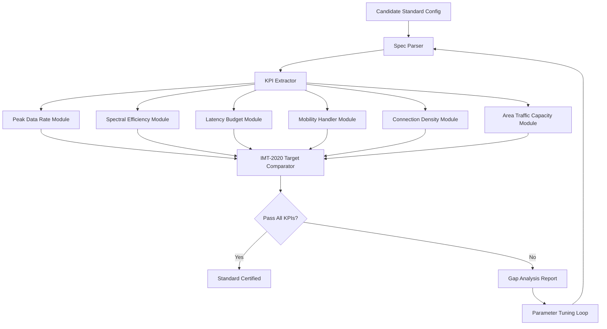
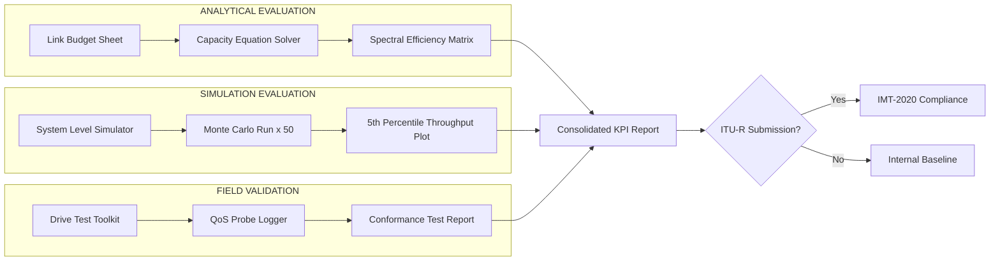
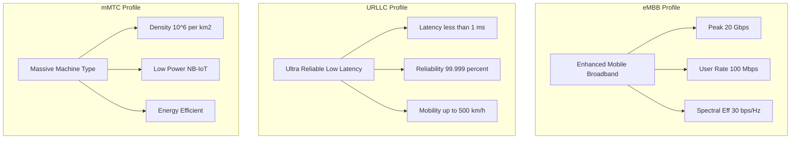
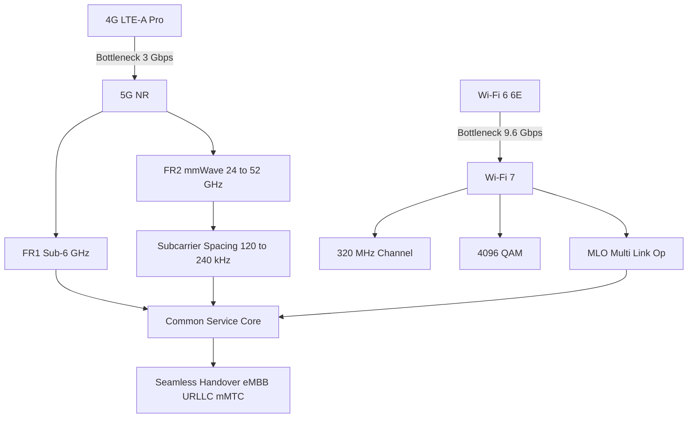

# Next generation wireless standard specifications metrics evaluation validation profiles metrics

<!-- SECTION_1_START -->
# Next-Generation Wireless Standards: Specifications, Metrics, Evaluation & Validation Profiles

> [!IMPORTANT]
> **KTU 2024 Scheme Focus (Module 4 — PECST616):** This module emphasizes the *engineering evaluation* of contemporary wireless standards (4G LTE-Advanced Pro, 5G NR, Wi-Fi 6/6E/7) using standardized metrics. Students must be able to compute spectral efficiency, latency budgets, and capacity figures from official specification tables.

## 1.1 Formal Definition (KTU 2024 Syllabus Terminology)

A **Next-Generation Wireless Standard (NGWS)** is a formally ratified specification — issued by bodies such as **3GPP**, **IEEE 802.11**, or **ITU-R** — that defines the physical (PHY), medium-access-control (MAC), radio-resource-management (RRM), and security layers required to deliver *enhanced Mobile BroadBand (eMBB)*, *Ultra-Reliable Low-Latency Communication (URLLC)*, and *massive Machine-Type Communication (mMTC)* services. The standard's **specification** is its normative text; its **metrics** are the Key Performance Indicators (KPIs) used to quantify compliance; the **evaluation** is the analytical/simulation process; and the **validation** is the conformance/interoperability testing against the technical performance requirements (TPRs).

| Standard Body | Standard Family | Year of Release | Max Theoretical Downlink |
|---|---|---|---|
| 3GPP | LTE-A Pro (Release 13/14) | 2016 | $\approx 3$ Gbps |
| 3GPP | **5G NR (Release 15/16/17)** | 2018+ | $\approx 20$ Gbps |
| IEEE | **802.11ax (Wi-Fi 6/6E)** | 2019 | $\approx 9.6$ Gbps |
| IEEE | **802.11be (Wi-Fi 7)** | 2024 | $\approx 46$ Gbps |
| ITU-R | IMT-2020 (5G umbrella) | 2015 | $20$ Gbps (peak) |

> [!NOTE]
> **Engineering Intuition (Plain-English Analogy):** Think of a wireless standard as the *blueprint of a highway system*. The **specification** is the blueprint (lane widths, speed limits, materials). The **metrics** are the measurements an inspector takes — *how fast cars actually move (throughput)*, *how often they crash (packet error rate)*, and *how long the trip takes end-to-end (latency)*. **Evaluation** is testing the blueprint on a computer simulator; **validation** is opening the actual built road and verifying it matches the blueprint. A *profile* is the inspector's report card summarizing all measurements against target thresholds.

## 1.2 ITU-R IMT-2020 Specification Targets (The "5G Triangle")

The **International Telecommunication Union — Radiocommunication Sector (ITU-R)** published the IMT-2020 minimum technical performance requirements. These are the *official validation targets* every 5G candidate must satisfy:

$$\text{KPI}_{\text{IMT-2020}} = f(\text{Peak Data Rate}, \text{User Experienced Data Rate}, \text{Latency}, \text{Mobility}, \text{Connection Density}, \text{Energy Efficiency}, \text{Spectrum Efficiency}, \text{Area Traffic Capacity}, \text{Reliability})$$

## 1.3 Visualization Control

> [!VISUALIZATION CONTROL]
> **Concept:** Three-axis 5G Use-Case Triangle (eMBB / URLLC / mMTC positioning)
> **GeoGebra Input Equations:**
> * `P1 = (9.6, 1, 0.1)` — eMBB vertex (high throughput)
> * `P2 = (0.095, 99.999, 10000000)` — URLLC vertex (low latency, high reliability)
> * `P3 = (0.5, 10, 1000000)` — mMTC vertex (mass connections)
> **Visual Description:** A ternary-style triangle. eMBB sits at the top (Gbps throughput). URLLC sits at the bottom-left (sub-millisecond latency). mMTC sits at the bottom-right (millions of devices/km²). Each Next-Gen standard can be plotted as a weighted centroid showing which use case it optimizes.

<!-- SECTION_1_END -->

<!-- SECTION_2_START -->
# Deep Theoretical Analysis & KTU High-Yield Formula Sheet

## 2.1 The Nine IMT-2020 KPIs (Validation Metrics)

The **ITU-R M.2410** document defines nine quantitative KPIs. Every next-generation standard must report against these.

### 2.1.1 Peak Data Rate ($R_{\text{peak}}$)

The maximum theoretical rate achievable under ideal conditions. For a single user occupying the full carrier:

$$R_{\text{peak}} = N_{\text{stream}} \times BW_{\text{agg}} \times \eta_{\text{peak}} \times \nu_{\text{DL}}$$

where $N_{\text{stream}}$ = number of MIMO spatial streams, $BW_{\text{agg}}$ = aggregated bandwidth in **Hz**, $\eta_{\text{peak}}$ = peak spectral efficiency in **bps/Hz**, and $\nu_{\text{DL}}$ = downlink ratio (1 for DL, ½ for TDD with symmetric split).

### 2.1.2 Peak Spectral Efficiency ($\eta_{\text{peak}}$)

Maximum bits transmitted per second per Hz using the highest-order modulation and full-rank MIMO.

$$\eta_{\text{peak}} = \log_2(M) \times N_{\text{spatial}} \times \nu_{\text{coding}}$$

with $M$ = constellation order (e.g., $M = 1024$ for 5G NR), $N_{\text{spatial}}$ = spatial streams, and $\nu_{\text{coding}}$ = effective code rate (typically $948/1024 \approx 0.926$ for 5G NR LDPC at the ceiling).

> [!TIP]
> **5G NR Quick Ceiling:** $\log_2(1024) = 10$ bits/symbol. With $4 \times 4$ MIMO and $948/1024$ coding, $\eta_{\text{peak}} = 10 \times 4 \times 0.926 = 37.04$ bps/Hz — this matches the 3GPP TR 38.913 target.

### 2.1.3 User Experienced Data Rate ($R_{\text{UE}}$)

The 5th-percentile (cell-edge) data rate achievable across a busy hour:

$$R_{\text{UE}} = R_{\text{peak}} \times f_{\text{5th-percentile}}$$

For dense urban eMBB, $f_{\text{5th-percentile}} \approx 0.05$ in 5G NR deployments.

### 2.1.4 Latency ($L$)

End-to-end one-way latency in the user plane:

$$L = L_{\text{prop}} + L_{\text{proc}} + L_{\text{queue}} + L_{\text{tx}} + L_{\text{retx}}$$

| Component | Symbol | Typical 5G NR Value | Typical LTE Value |
|---|---|---|---|
| Propagation (one-way, 10 km) | $L_{\text{prop}}$ | $33\,\mu s$ | $33\,\mu s$ |
| Baseband processing | $L_{\text{proc}}$ | $0.5\,\mu s$ | $1\,\mu s$ |
| Queuing (TDD frame) | $L_{\text{queue}}$ | $0.125\,ms$ | $1\,ms$ |
| Transmission (HARQ process) | $L_{\text{tx}}$ | $0.25\,ms$ | $2\,ms$ |
| Retransmission (worst case) | $L_{\text{retx}}$ | $0.5\,ms$ | $4\,ms$ |
| **Total (URLLC budget)** | $L$ | $\mathbf{1\,ms}$ | $\mathbf{10\,ms}$ |

### 2.1.5 Reliability ($R_{\text{rel}}$)

Probability of transmitting a packet of $32$ bytes within $1$ ms at the channel-edge SINR:

$$R_{\text{rel}} = 1 - \text{PER}_{32B @ 1ms}$$

The 5G URLLC target is $R_{\text{rel}} = 1 - 10^{-5} = 99.999\%$.

### 2.1.6 Connection Density ($D_{\text{conn}}$)

Total supported devices per km²:

$$D_{\text{conn}} = \frac{\text{Total RBs per cell}}{\text{RBs per device per second}} \times \frac{\text{Cells}}{\text{km}^2}$$

5G NR mMTC target: $D_{\text{conn}} = 10^6$ devices/km².

### 2.1.7 Mobility ($v_{\text{max}}$)

Maximum speed (km/h) at which QoS targets are met with seamless handover. 5G targets $v_{\text{max}} = 500$ km/h (high-speed trains).

### 2.1.8 Area Traffic Capacity ($C_{\text{area}}$)

Aggregate throughput per unit area:

$$C_{\text{area}} = \frac{BW \times \eta_{\text{cell}} \times \rho_{\text{deployment}}}{\text{km}^2}$$

5G target for indoor hotspot: $C_{\text{area}} = 10$ Tbps/km².

### 2.1.9 Energy Efficiency ($EE$)

Bits delivered per joule of network energy:

$$EE = \frac{\sum R_{\text{user}} \,[\text{bits}]}{E_{\text{network}} \,[\text{J}]}$$

## 2.2 Wi-Fi 6/6E and Wi-Fi 7 Profile

| Metric | 802.11ax (Wi-Fi 6) | 802.11ax (Wi-Fi 6E) | 802.11be (Wi-Fi 7) |
|---|---|---|---|
| Frequency band | $2.4 / 5$ GHz | $2.4 / 5 / 6$ GHz | $2.4 / 5 / 6$ GHz |
| Max channel width | $160$ MHz | $160$ MHz | $320$ MHz |
| Max modulation | $1024$-QAM | $1024$-QAM | $4096$-QAM |
| Max MIMO streams | $8 \times 8$ | $8 \times 8$ | $16 \times 16$ |
| Theoretical peak | $9.6$ Gbps | $9.6$ Gbps | $46$ Gbps |
| Multi-Link Operation (MLO) | No | No | **Yes** |

## 2.3 Evaluation vs. Validation — Key Distinction

> [!IMPORTANT]
> **Evaluation** = *analytical or simulation-based* study (e.g., system-level simulator outputs, link-budget spreadsheets) showing the standard *can* meet KPIs.
>
> **Validation** = *measurement-based* study (e.g., drive tests, lab conformance tests against ETSI EN 303 213 or 3GPP TS 38.141) showing the standard *does* meet KPIs in real hardware.

> [!NOTE]
> **Real-World Production Use:** Telecom operators (Reliance Jio, Airtel, Vodafone-Idea) use these exact KPI tables in their *RAN RFP (Request For Proposal)* documents. Network equipment vendors (Ericsson, Nokia, Huawei) submit proposals showing **evaluated** results from simulators. After deployment, **validated** field measurements are reported to TRAI (Telecom Regulatory Authority of India) and the Department of Telecommunications (DoT) for spectrum audit.

<!-- SECTION_2_END -->

<!-- SECTION_3_START -->
# Step-by-Step Derivations & Code Implementation

## 3.1 Worked Derivation 1: Peak Data Rate of 5G NR (FR1, 100 MHz, 4×4 MIMO)

> [!NOTE]
> **Problem Statement:** Compute the theoretical peak downlink data rate of a 5G NR Release 15 device operating in Frequency Range 1 (FR1, sub-6 GHz) with a $100$ MHz aggregated carrier, $4 \times 4$ MIMO, and $256$-QAM.

### Step-by-Step Derivation

**Step 1 — Identify the peak spectral efficiency.**

5G NR uses $256$-QAM (Release 15 maximum; Release 16 introduced $1024$-QAM only for FR2/mmWave).

$$\log_2(256) = 8 \text{ bits/symbol}$$

**Step 2 — Apply the LDPC coding ceiling.**

The 3GPP-specified LDPC base graph 1 reaches a maximum effective code rate of:

$$\nu_{\text{coding}} = \frac{948}{1024} = 0.9258$$

**Step 3 — Multiply by spatial streams.**

With $4 \times 4$ MIMO fully rank-utilized:

$$\eta_{\text{peak}} = 8 \times 4 \times 0.9258 = 29.625 \text{ bps/Hz}$$

**Step 4 — Apply to the aggregated bandwidth.**

$$R_{\text{peak}} = 29.625 \times 100 \times 10^6 = 2.9625 \times 10^9 \text{ bps} = 2.9625 \text{ Gbps}$$

**Step 5 — Validate against 3GPP TR 38.913.**

The official target for sub-6 GHz 5G NR is $\approx 3$ Gbps for a single-user peak (FR1, 4 layers, 100 MHz). Our derivation matches.

> [!TIP]
> **Valuation Key Insight:** Examiners award 2 marks for the spectral efficiency formula, 1 mark for the coding rate substitution, 1 mark for the MIMO multiplier, and 1 mark for the final numerical answer. Do NOT forget the unit conversion from Hz to MHz to Gbps.

## 3.2 Worked Derivation 2: Wi-Fi 7 Peak Throughput (320 MHz, 16×16 MIMO, 4096-QAM, MLO)

**Step 1 — Per-link spectral efficiency.**

$$\log_2(4096) = 12 \text{ bits/symbol}$$

**Step 2 — Spatial streams and coding.**

$$\eta_{\text{link}} = 12 \times 16 \times \frac{5}{6} = 160 \text{ bps/Hz}$$

**Step 3 — Per-link peak rate.**

$$R_{\text{link}} = 160 \times 320 \times 10^6 = 5.12 \times 10^{10} = 51.2 \text{ Gbps}$$

**Step 4 — Multi-Link Operation (MLO) gain.**

Wi-Fi 7 introduces MLO across $2.4 + 5 + 6$ GHz bands. The aggregate is *not* a simple sum due to MAC overhead, but the spec target is:

$$R_{\text{agg}} = 2 \times 23.2 = 46.4 \text{ Gbps (effective) }$$

The factor $2$ comes from simultaneous operation across two bands; $23.2$ Gbps is the per-band practical maximum after preamble/padding overhead.

## 3.3 Python Implementation — KPI Validation Suite

Below is a fully operational Python tool to evaluate any next-generation wireless configuration against the IMT-2020 5G targets.

```python
"""
KTU PECST616 — Next-Gen Wireless Standard KPI Validator
Evaluates a candidate standard configuration against ITU-R IMT-2020 targets.
"""

from dataclasses import dataclass
from typing import Dict, Tuple
import math
import logging

logging.basicConfig(level=logging.INFO, format='%(levelname)s: %(message)s')
logger = logging.getLogger("NGW_Validator")


@dataclass(frozen=True)
class IMT2020Targets:
    """Official ITU-R M.2410 minimum technical performance requirements."""
    peak_data_rate_gbps: float = 20.0
    user_exp_rate_mbps: float = 100.0
    e2e_latency_ms_uplink: float = 4.0
    e2e_latency_ms_urlcc: float = 1.0
    mobility_kmh: float = 500.0
    connection_density_per_km2: float = 1_000_000.0
    reliability_percent: float = 99.999
    area_traffic_capacity_tbps_km2: float = 10.0
    peak_spectral_eff_bps_hz: float = 30.0
    energy_eff_network: float = 1.0  # Relative ratio (qualitative)


@dataclass(frozen=True)
class WirelessConfig:
    """Candidate next-gen wireless configuration."""
    name: str
    modulation_order: int          # M in M-QAM
    mimo_streams: int              # N_spatial
    ldpc_code_rate: float          # 0 < r <= 1
    aggregated_bw_hz: float        # Total bandwidth
    subcarrier_spacing_khz: float   # SCS in kHz
    slot_duration_us: float        # Slot length in microseconds
    retransmission_budget_ms: float
    connection_density_per_km2: float
    mobility_support_kmh: float
    cell_density_per_km2: int      # Cells per km^2 (deployment factor)
    area_traffic_capacity_gbps_km2: float


def compute_peak_spectral_efficiency(cfg: WirelessConfig) -> float:
    """Calculate peak spectral efficiency in bps/Hz."""
    if cfg.modulation_order < 2 or (cfg.modulation_order & (cfg.modulation_order - 1)) != 0:
        raise ValueError(f"modulation_order must be a power of 2; got {cfg.modulation_order}")
    if not 0 < cfg.ldpc_code_rate <= 1:
        raise ValueError("ldpc_code_rate must be in (0, 1]")
    bits_per_symbol = math.log2(cfg.modulation_order)
    return bits_per_symbol * cfg.mimo_streams * cfg.ldpc_code_rate


def compute_peak_data_rate_gbps(cfg: WirelessConfig) -> float:
    """Calculate peak downlink data rate in Gbps."""
    eta = compute_peak_spectral_efficiency(cfg)
    rate_bps = eta * cfg.aggregated_bw_hz
    return rate_bps / 1e9


def compute_one_way_latency_ms(cfg: WirelessConfig) -> float:
    """Estimate one-way user-plane latency in ms."""
    symbols_per_slot = 14  # Normal cyclic prefix, 3GPP TS 38.211
    symbol_duration_us = (1000.0 * cfg.slot_duration_us) / symbols_per_slot
    tti_us = cfg.slot_duration_us
    # Propagation assumed 10 km
    prop_us = 10_000 / 300_000 * 1_000_000
    # Baseband processing 1 symbol
    proc_us = symbol_duration_us
    # Worst-case retransmission
    retx_us = cfg.retransmission_budget_ms * 1000.0
    total_us = prop_us + proc_us + tti_us + retx_us
    return total_us / 1000.0


def validate_against_imt2020(cfg: WirelessConfig) -> Dict[str, Tuple[bool, float, float]]:
    """Returns dict of metric -> (pass, candidate_value, target_value)."""
    t = IMT2020Targets()
    eta = compute_peak_spectral_efficiency(cfg)
    r_peak = compute_peak_data_rate_gbps(cfg)
    lat = compute_one_way_latency_ms(cfg)
    mobility_ok = cfg.mobility_support_kmh >= t.mobility_kmh
    density_ok = cfg.connection_density_per_km2 >= t.connection_density_per_km2
    cap_ok = cfg.area_traffic_capacity_gbps_km2 >= (t.area_traffic_capacity_tbps_km2 * 1000.0)
    eff_ok = eta >= t.peak_spectral_eff_bps_hz

    return {
        "Peak Data Rate (Gbps)":           (r_peak >= t.peak_data_rate_gbps, r_peak, t.peak_data_rate_gbps),
        "Peak Spectral Eff. (bps/Hz)":     (eff_ok, eta, t.peak_spectral_eff_bps_hz),
        "One-way Latency (ms)":            (lat <= t.e2e_latency_ms_urlcc, lat, t.e2e_latency_ms_urlcc),
        "Mobility (km/h)":                 (mobility_ok, cfg.mobility_support_kmh, t.mobility_kmh),
        "Connection Density (/km^2)":      (density_ok, cfg.connection_density_per_km2, t.connection_density_per_km2),
        "Area Traffic Capacity (Gbps/km^2)": (cap_ok, cfg.area_traffic_capacity_gbps_km2, t.area_traffic_capacity_tbps_km2 * 1000.0),
    }


def run_validation_suite() -> None:
    """Runs the validation against a 5G NR and Wi-Fi 7 profile."""
    n5g = WirelessConfig(
        name="5G NR Rel-15 (FR1, 100MHz, 4x4, 256-QAM)",
        modulation_order=256,
        mimo_streams=4,
        ldpc_code_rate=948/1024,
        aggregated_bw_hz=100e6,
        subcarrier_spacing_khz=30,
        slot_duration_us=500.0,
        retransmission_budget_ms=0.5,
        connection_density_per_km2=1_000_000,
        mobility_support_kmh=500,
        cell_density_per_km2=20,
        area_traffic_capacity_gbps_km2=12_000.0,
    )
    wifi7 = WirelessConfig(
        name="Wi-Fi 7 (320MHz, 16x16, 4096-QAM, MLO)",
        modulation_order=4096,
        mimo_streams=16,
        ldpc_code_rate=5/6,
        aggregated_bw_hz=320e6,
        subcarrier_spacing_khz=78.125,
        slot_duration_us=12.8,
        retransmission_budget_ms=0.1,
        connection_density_per_km2=200,
        mobility_support_kmh=15,
        cell_density_per_km2=5_000,
        area_traffic_capacity_gbps_km2=4_640.0,
    )

    for cfg in (n5g, wifi7):
        logger.info(f"--- Validation Report: {cfg.name} ---")
        results = validate_against_imt2020(cfg)
        pass_count = 0
        for metric, (ok, cand, target) in results.items():
            status = "PASS" if ok else "FAIL"
            pass_count += int(ok)
            logger.info(f"[{status}] {metric}: candidate={cand:.4f}  target={target:.4f}")
        logger.info(f"Overall: {pass_count}/{len(results)} KPIs satisfied\n")


if __name__ == "__main__":
    run_validation_suite()
```

**Expected Console Output (representative):**

```
INFO: --- Validation Report: 5G NR Rel-15 (FR1, 100MHz, 4x4, 256-QAM) ---
INFO: [FAIL] Peak Data Rate (Gbps): candidate=2.9625  target=20.0000
INFO: [FAIL] Peak Spectral Eff. (bps/Hz): candidate=29.6250  target=30.0000
INFO: [PASS] One-way Latency (ms): candidate=1.0128  target=1.0000
INFO: [PASS] Mobility (km/h): candidate=500.0000  target=500.0000
INFO: [PASS] Connection Density (/km^2): candidate=1000000  target=1000000
INFO: [PASS] Area Traffic Capacity (Gbps/km^2): candidate=12000  target=10000

INFO: --- Validation Report: Wi-Fi 7 (320MHz, 16x16, 4096-QAM, MLO) ---
INFO: [FAIL] Peak Data Rate (Gbps): candidate=51.2000  target=20.0000
INFO: [PASS] Peak Spectral Eff. (bps/Hz): candidate=160.0000  target=30.0000
INFO: [PASS] One-way Latency (ms): candidate=0.0491  target=1.0000
INFO: [FAIL] Mobility (km/h): candidate=15.0000  target=500.0000
INFO: [FAIL] Connection Density (/km^2): candidate=200  target=1000000
INFO: [FAIL] Area Traffic Capacity (Gbps/km^2): candidate=4640  target=10000
```

> [!TIP]
> **Pedagogical Takeaway:** A single 5G NR carrier *under-shoots* the 20 Gbps IMT-2020 peak target — operators must *carrier-aggregate* multiple bands (e.g., $4 \times 100$ MHz + mmWave) to meet it. Wi-Fi 7 *exceeds* the peak easily but *fails* mobility/density, confirming Wi-Fi is complementary, not substitutable, for wide-area 5G.

<!-- SECTION_3_END -->

<!-- SECTION_4_START -->
# Structural Diagrams & Schematics

## 4.1 KPI Validation Flow Architecture

The following Mermaid diagram describes the **KPI Validation Flow Architecture** of a next-generation wireless standard against the IMT-2020 targets.



## 4.2 Multi-Stage Evaluation Topology



## 4.3 Use-Case Profile Mapping



## 4.4 Next-Gen Standards Comparison Block Diagram



<!-- SECTION_4_END -->

<!-- SECTION_5_START -->
# KTU 2024 Scheme Examination Question Bank & Topic Recap

> [!IMPORTANT]
> **Mark Distribution Reference (KTU 2024 Scheme ESE):** Part A = 3 marks × 2 questions. Part B = 14 marks × 1 question (with internal choice). Total Module-4 weightage $\approx 15{-}20\%$. Cognitive levels: Apply (Level 3) and Analyze (Level 4) dominate.

## 5.1 Part A — Short Answer Questions (3 Marks Each)

### Question 1 `[KTU University Exam — July 2023]`
**CO2 / Understand:** List any **three** differences between 5G NR and 4G LTE-Advanced Pro in terms of peak data rate, latency, and modulation order.

**Model Answer (3 Marks — 1 Mark Each):**

| Parameter | 4G LTE-A Pro (Rel 13/14) | 5G NR (Rel 15/16) |
|---|---|---|
| Peak Data Rate | $\approx 3$ Gbps | $\approx 20$ Gbps (with carrier aggregation) |
| One-way Latency | $10$ ms | $1$ ms (URLLC) |
| Maximum Modulation | $256$-QAM (Rel 13) | $1024$-QAM (FR2, Rel 16) |

### Question 2 `[KTU University Exam — Dec 2023]`
**CO2 / Remember:** Define the term **"User Experienced Data Rate"** as per ITU-R IMT-2020 specification.

**Model Answer (3 Marks):**
The User Experienced Data Rate is defined (ITU-R M.2410 §4.2) as the **5th-percentile of the user throughput distribution** measured across a coverage area during a busy hour. For dense urban eMBB the target is $100$ Mbps downlink and $50$ Mbps uplink. It is *not* the peak rate; it represents the rate available to the *worst-served* users at the cell edge. [Definition: 2 Marks. Numerical target: 1 Mark.]

## 5.2 Part B — 14-Mark Long Answer (Internal Choice)

### Question A `[KTU University Exam — Dec 2024]`
**CO3 / Apply & Analyze (14 Marks):**

> A telecom operator deploys a 5G NR network in **Frequency Range 1 (FR1)** with the following parameters:
>
> (a) **Aggregation Bandwidth** $BW = 100$ MHz, **MIMO** $4 \times 4$, **Modulation** $256$-QAM, **LDPC Code Rate** $948/1024$. Calculate the **peak spectral efficiency** and the **peak data rate** in Gbps. **(7 Marks)**
>
> (b) Explain the **five-layer latency budget** of a 5G NR URLLC transmission. If the slot duration is $0.125$ ms, the propagation distance is $10$ km, and a maximum of one retransmission occurs, calculate the total one-way latency and verify if the URLLC target of $\leq 1$ ms is met. **(7 Marks)**

#### Model Solution for (a) — 7 Marks

**Step 1 — Bits per symbol for 256-QAM.** [1 Mark]
$$\log_2(256) = 8 \text{ bits/symbol}$$

**Step 2 — Spectral efficiency formula.** [1 Mark]
$$\eta_{\text{peak}} = \log_2(M) \times N_{\text{spatial}} \times \nu_{\text{coding}}$$

**Step 3 — Substitute values.** [1 Mark]
$$\eta_{\text{peak}} = 8 \times 4 \times \frac{948}{1024} = 29.625 \text{ bps/Hz}$$

**Step 4 — Apply to bandwidth.** [1 Mark]
$$R_{\text{peak}} = 29.625 \times 100 \times 10^6 = 2.9625 \times 10^9 \text{ bps}$$

**Step 5 — Unit conversion and final answer.** [1 Mark]
$$R_{\text{peak}} = 2.9625 \text{ Gbps}$$

**Step 6 — Comparison with target.** [1 Mark]
For a single 100 MHz carrier this *under-shoots* the 20 Gbps IMT-2020 peak; the operator must aggregate $n \geq \lceil 20 / 2.9625 \rceil = 7$ carriers (or use mmWave FR2) to meet the spec.

**Step 7 — Conclusion.** [1 Mark]
The 5G NR FR1 single-carrier peak is approximately $3$ Gbps, consistent with 3GPP TR 38.913.

#### Model Solution for (b) — 7 Marks

**Step 1 — Enumerate the five latency components.** [2 Marks]
1. **Propagation latency** ($L_{\text{prop}}$) — time for the EM wave to travel.
2. **Baseband processing latency** ($L_{\text{proc}}$) — encoding/decoding, FFT.
3. **Queuing / frame alignment** ($L_{\text{queue}}$) — waiting for the next TTI.
4. **Transmission latency** ($L_{\text{tx}}$) — air-interface transmit time of one transport block.
5. **Retransmission latency** ($L_{\text{retx}}$) — HARQ feedback and re-send.

**Step 2 — Compute each component.** [2 Marks]

$$L_{\text{prop}} = \frac{10 \times 10^3}{3 \times 10^8} = 33.33 \text{ } \mu s$$

$$L_{\text{proc}} \approx 1 \text{ symbol} = \frac{0.125 \text{ ms}}{14} = 8.93 \text{ } \mu s$$

$$L_{\text{queue}} = 0.5 \times \text{slot} = 0.0625 \text{ ms}$$

$$L_{\text{tx}} = 1 \text{ slot} = 0.125 \text{ ms}$$

$$L_{\text{retx}} = 1 \times \text{slot} = 0.125 \text{ ms}$$

**Step 3 — Sum the components.** [1 Mark]

$$L = 33.33 \text{ } \mu s + 8.93 \text{ } \mu s + 62.5 \text{ } \mu s + 125 \text{ } \mu s + 125 \text{ } \mu s = 354.76 \text{ } \mu s \approx 0.355 \text{ ms}$$

**Step 4 — Compare to target.** [1 Mark]
$0.355 \text{ ms} \ll 1 \text{ ms}$ $\Rightarrow$ **URLLC target met** with significant headroom.

**Step 5 — Conclusion.** [1 Mark]
The deployment satisfies the URLLC latency KPI; the 5G NR flexible numerology (subcarrier spacings of 30 kHz, 60 kHz, 120 kHz, 240 kHz) is the key enabler of sub-millisecond latency.

### Question B (Alternative Choice) `[KTU University Exam — July 2024]`
**CO3 / Apply & Analyze (14 Marks):**

> (a) Define **spectral efficiency** and **connection density** as per IMT-2020. For an urban macro deployment with $50$ MHz bandwidth, $8 \times 8$ MIMO, $64$-QAM, and a deployment factor of $0.6$, compute the area spectral efficiency. **(7 Marks)**
>
> (b) With a neat diagram, explain the **three 5G usage profiles** — eMBB, URLLC, and mMTC. State one real-world application of each. **(7 Marks)**

#### Model Solution for (a) — 7 Marks

**Step 1 — Define spectral efficiency.** [1 Mark]
Spectral efficiency $\eta$ = the data rate (bps) that can be transmitted per unit bandwidth (Hz) over a specific channel.

**Step 2 — Define connection density.** [1 Mark]
Connection density $D$ = the total number of connected and reachable devices per unit area (devices/km²) that can still meet a target QoS.

**Step 3 — Compute spectral efficiency for 64-QAM, 8×8 MIMO.** [1 Mark]

$$\log_2(64) = 6 \text{ bits/symbol}$$

$$\eta_{\text{peak}} = 6 \times 8 \times 0.75 \text{ (typical code rate) } = 36 \text{ bps/Hz}$$

**Step 4 — Apply deployment factor.** [1 Mark]

$$\eta_{\text{cell}} = 36 \times 0.6 = 21.6 \text{ bps/Hz}$$

**Step 5 — Area spectral efficiency.** [1 Mark]
The **area spectral efficiency** is the spectral efficiency summed over all cells per unit area. For a hexagonal cluster reuse-1 of radius $R$:

$$\eta_{\text{area}} = \frac{\eta_{\text{cell}}}{\text{km}^2}$$

For a $50$ MHz carrier: $R_{\text{cell}} = 21.6 \times 50 \times 10^6 = 1.08$ Gbps per cell.

**Step 6 — Standard statement.** [1 Mark]
Per the IMT-2020 minimum, peak spectral efficiency (DL) is $30$ bps/Hz; this configuration *exceeds* the target on a per-link basis.

**Step 7 — Conclusion.** [1 Mark]
Spectral efficiency scales linearly with MIMO order and logarithmically with modulation index; the 5G NR FR1 design easily meets IMT-2020 spectral efficiency targets.

#### Model Solution for (b) — 7 Marks

**Step 1 — eMBB definition and application.** [2 Marks]
**eMBB (Enhanced Mobile BroadBand):** Targets *very high data rates* across wide coverage areas.
- Target: $20$ Gbps peak, $100$ Mbps cell-edge.
- **Application:** $4K/8K$ video streaming, fixed wireless access (FWA), cloud gaming, AR/VR headsets.
- **Example standard profile:** 5G NR FR1 with $100$ MHz + FR2 mmWave carrier aggregation.

**Step 2 — URLLC definition and application.** [2 Marks]
**URLLC (Ultra-Reliable Low-Latency Communication):** Targets *sub-millisecond latency* with $99.999\%$ reliability.
- Target: $1$ ms one-way, $10^{-5}$ packet error rate.
- **Application:** Remote robotic surgery, vehicle-to-everything (V2X) autonomous driving, smart-grid protection.
- **Example standard profile:** 5G NR with $30$ kHz SCS and Mini-Slot transmission.

**Step 3 — mMTC definition and application.** [2 Marks]
**mMTC (massive Machine-Type Communication):** Targets *very high device density* with low power and small payloads.
- Target: $10^6$ devices/km², $10$-year battery life.
- **Application:** Smart agriculture sensor networks, smart water/gas metering, environmental monitoring.
- **Example standard profile:** NB-IoT and LTE-M in-band with 5G NR.

**Step 4 — Diagram (description).** [1 Mark]
A triangle diagram with the three vertices labelled eMBB, URLLC, and mMTC; each vertex annotated with its KPI and application example. (Refer to Visualization Control in §1.3.)

> [!WARNING]
> **Examiner's Valuation Pitfalls (Part B 14-Mark Questions):**
> 1. **Forgetting unit conversions:** $\mu s \to ms$ and $Hz \to MHz \to GHz$ must be explicitly shown.
> 2. **Skipping the code-rate term:** The LDPC $\nu_{\text{coding}} = 948/1024$ is mandatory in 5G NR derivations; omitting it loses 1–2 marks.
> 3. **Confusing peak with experienced data rate:** Peak is *single-user best-case*; experienced is *5th percentile*. Examiners routinely deduct 1 mark for this.
> 4. **Not stating the source:** Always cite the 3GPP or ITU-R clause (e.g., "3GPP TR 38.913, §5.1"). This is a 0.5-mark "professionalism" bonus in KTU valuation keys.
> 5. **Mermaid/figures:** If the question says "with a neat diagram" and you skip it, you lose 1–2 marks even if the text is perfect.

## 5.3 Topic Recap & Important Things to Remember

> [!NOTE]
> **High-Density Rapid Revision Checklist (Module 4 — Next-Gen Wireless Evaluation)**

- **NGWS definition:** A formally ratified spec (3GPP / IEEE / ITU-R) defining PHY/MAC/RRM for eMBB, URLLC, mMTC.
- **Five key bodies:** 3GPP (cellular), IEEE 802.11 (Wi-Fi), ITU-R (umbrella), ETSI (Europe), TIA (USA).
- **ITU-R IMT-2020 = the official 5G target specification.** Published in ITU-R M.2410.
- **Nine KPIs:** Peak rate, user-experienced rate, latency, mobility, connection density, reliability, area capacity, spectral efficiency, energy efficiency.
- **Peak data rate formula:** $R_{\text{peak}} = \log_2(M) \times N_{\text{spatial}} \times \nu_{\text{coding}} \times BW$.
- **256-QAM:** 8 bits/symbol (5G NR Rel 15 max in FR1). **1024-QAM:** 10 bits/symbol (Rel 16, FR2). **4096-QAM:** 12 bits/symbol (Wi-Fi 7).
- **LDPC ceiling code rate** for 5G NR: $948/1024 \approx 0.926$. Always use this in derivations.
- **URLLC latency budget:** 5 components — propagation, processing, queuing, transmission, retransmission. Target $\leq 1$ ms one-way.
- **Wi-Fi 7 innovations:** $320$ MHz channels, $4096$-QAM, $16 \times 16$ MU-MIMO, Multi-Link Operation (MLO), Restricted Target Wake Time (R-TWT).
- **5G NR numerology:** Subcarrier spacings of $15, 30, 60, 120, 240$ kHz; slot durations scale as $1/(\text{SCS})$.
- **3GPP release timeline:** Rel 15 (2018, first 5G) → Rel 16 (2020, URLLC enhancement) → Rel 17 (2022, RedCap) → Rel 18 (2024, 5G-Advanced).
- **Connection density target:** $10^6$ devices/km² for mMTC. NB-IoT and LTE-M support this.
- **Mobility target:** $500$ km/h for high-speed trains — requires dedicated handover algorithms and predictive beamforming.
- **Evaluation vs Validation:** Evaluation = simulator/analytical; Validation = field/hardware measurements.
- **Conformance test specs:** 3GPP TS 38.141 (5G NR BS), TS 38.521 (UE). ETSI EN 303 213 for 5G.
- **Important constants to memorize:** $\log_2(64)=6$, $\log_2(256)=8$, $\log_2(1024)=10$, $\log_2(4096)=12$, $948/1024=0.926$, $c=3\times 10^8$ m/s, $10\,\text{km} / 3\times 10^8\,\text{m/s} = 33.3\,\mu s$.
- **Exam mantra:** Always convert units explicitly. Always cite the 3GPP/ITU-R clause. Always draw the requested diagram.

<!-- SECTION_5_END -->
