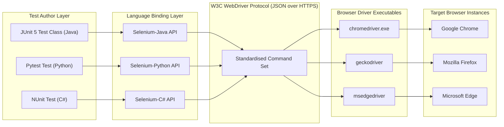
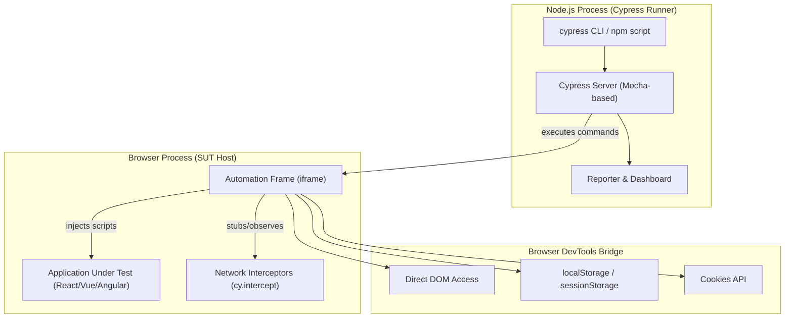
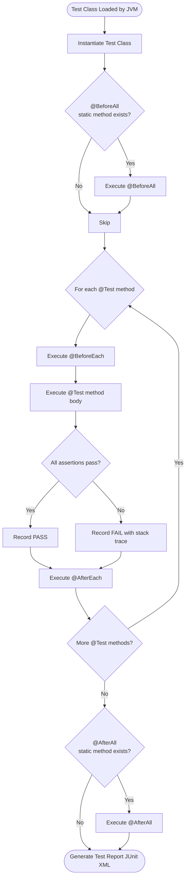
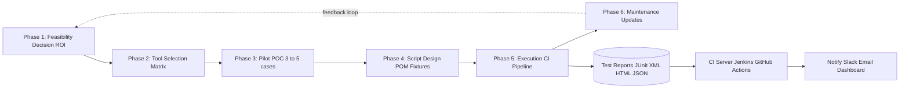
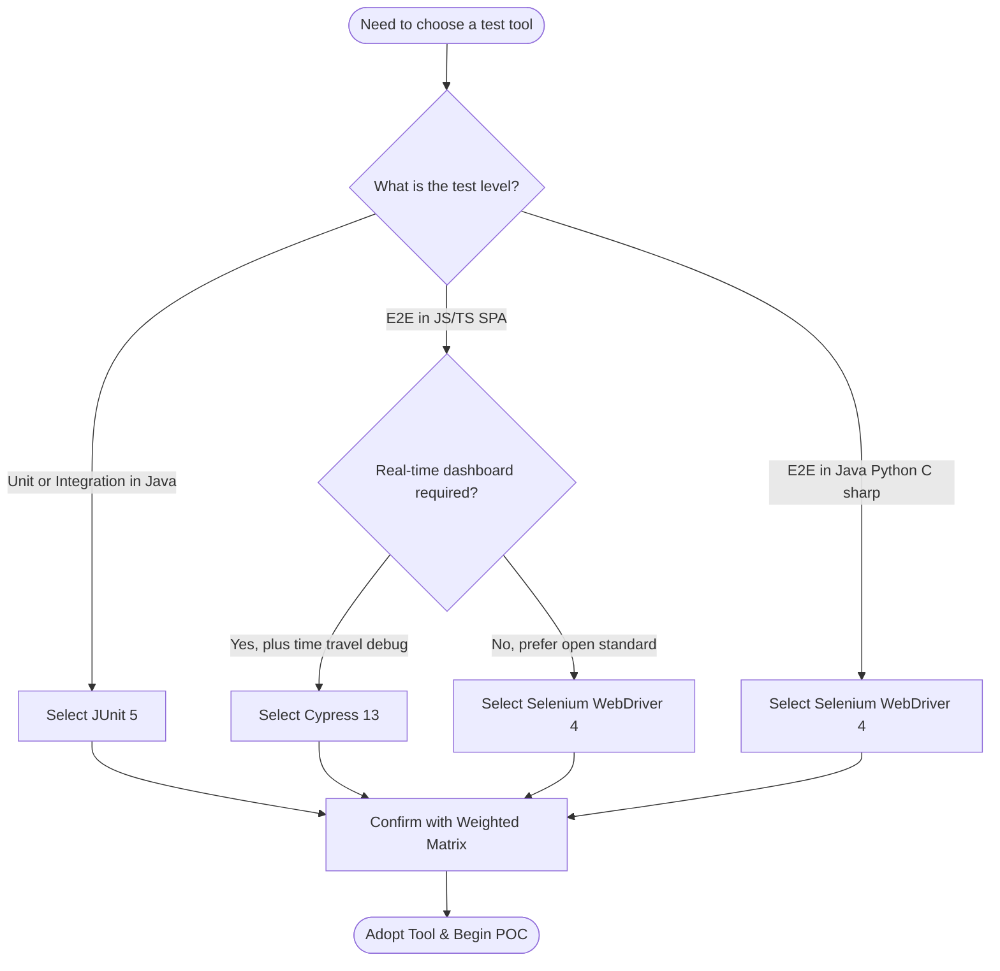

# Automation in Testing - Introduction to automation tools (e.g., Selenium, Cypress, JUnit)

<!-- SECTION_1_START -->
# 1. Automation in Testing — Introduction to Automation Tools (Selenium, Cypress, JUnit)

## 1.1 Formal Academic Definition

In the context of the **KTU 2024 Scheme (PECST631 – Software Testing)**, **Test Automation** is formally defined as the **systematic application of specialized software tools, frameworks, and scripts to execute test cases, compare actual outcomes against predicted outcomes, manage test data, and report results — with minimal human intervention**. It is a sub-discipline of software engineering quality assurance that uses **deterministic, repeatable, machine-executable instructions** to verify that a software system satisfies its functional, performance, and non-functional requirements.

Automation in testing is formally anchored to three foundational standards:

> [!IMPORTANT]
> - **IEEE 829-2008 / ISO/IEC/IEEE 29119-3** — Standard for Software Test Documentation
> - **ISTQB (International Software Testing Qualifications Board) Foundation Level Syllabus v4.0** — Glossary definition: *"The use of software to perform or support test activities, e.g., test management, test design, test execution, and results checking."*
> - **KTU 2024 NEP-Aligned Outcome-Based Education** — Maps to **CO1** (Apply software testing principles and life cycle models in real-world projects).

## 1.2 Conceptual Analogy / Plain-English Intuition

Imagine you are a **quality inspector in a biscuit factory**. Every hour, 10,000 biscuits come out of the oven. You have two choices:

1. **Manual Testing Approach** — You personally pick up 50 biscuits, smell them, break them open, and taste them. You record your observations in a notebook. By the 3rd hour, you are exhausted, your hands are sticky, and you might miss a slightly burnt batch.
2. **Automation Testing Approach** — You build a **robotic arm with a camera and a weighing scale** that runs a fixed inspection script: *pick → scan color → weigh → check shape → reject if defective → log result*. The arm works 24/7, never gets tired, and produces a precise digital log.

**Selenium, Cypress, and JUnit are the three "robotic arms"** we are studying in this module. They each specialize in inspecting different parts of the software "bakery":

- **Selenium** → Inspects the **web storefront** (the user interface customers see).
- **Cypress** → Inspects the **web storefront in real-time**, but with a built-in dashboard and a faster engine.
- **JUnit** → Inspects the **internal machinery** of the application (the Java code, the business logic, the APIs).

> [!NOTE]
> **Key Industry Insight (McKinsey & Gartner 2024):** Organizations that adopt a mature test automation strategy experience a **40% reduction in regression defect leakage** and a **60% acceleration in release velocity**, provided the test suite coverage exceeds **70%**. Automation is not a replacement for manual testing — it is an *amplifier* of it.

## 1.3 Why Test Automation? — The Five Pillars

> [!IMPORTANT]
> The five engineering motivations that drive automation decisions in any KTU-aligned project:
> 1. **Repeatability** — The same test must run identically across 10, 100, or 10,000 builds.
> 2. **Speed** — A regression suite of 500 cases that takes 3 days manually can run in **20 minutes** in CI/CD.
> 3. **Accuracy** — Eliminates the *human error floor* (missed assertions, typo'd expected values).
> 4. **Coverage** — Enables data-driven, parameterised, and cross-browser matrix testing at scale.
> 5. **Early Defect Detection** — When integrated into a **CI/CD pipeline** (Jenkins, GitHub Actions, GitLab CI), defects surface within *minutes* of a code commit.

## 1.4 Taxonomy of Automation Tools

Automation tools are classified along three orthogonal axes relevant to PECST631:

| Classification Axis | Category | Example Tool |
|---|---|---|
| **By Test Level** | Unit Test Framework | **JUnit**, TestNG, NUnit, pytest |
| | Integration / API | RestAssured, Postman, SoapUI |
| | End-to-End / UI | **Selenium WebDriver**, **Cypress**, Playwright |
| **By Architecture Model** | Library-based (stateless driver) | Selenium WebDriver |
| | In-process runtime (stateful) | Cypress |
| **By Language Binding** | Java-bound | JUnit, Selenium (Java) |
| | JavaScript-bound | Cypress, Mocha, Jest |

## 1.5 Core Terminology (KTU Board Favourites)

> [!NOTE]
> These exact phrases appear frequently in KTU Module 1 question papers. Memorise the definitions verbatim.
> - **Test Script** — A programmatic sequence of automated instructions that simulates user actions.
> - **Test Suite** — A logical collection of test cases meant to be executed together.
> - **Test Harness** — The supporting infrastructure (drivers, stubs, fixtures) that allows test scripts to run in isolation.
> - **Test Fixture (SetUp / TearDown)** — Pre-test and post-test scaffolding code that establishes and cleans up a known state.
> - **Continuous Integration (CI)** — The engineering practice of merging all developer branches into a shared mainline multiple times a day, with each merge triggering an automated build and test run.
> - **SUT (System Under Test)** — The software component or subsystem being verified.

<!-- SECTION_1_END -->

<!-- SECTION_2_START -->
# 2. Deep Theoretical Analysis & KTU High-Yield Knowledge Sheet

## 2.1 The Automation Testing Life Cycle (ATLC)

The Automation Testing Life Cycle is a six-stage iterative model. KTU examiners frequently frame **"Explain the phases of automation testing"** as a 7-mark question. Memorise the order and the artefact produced at each stage.

> [!IMPORTANT]
> **ATLC = Decision → Tool Selection → Pilot → Test Design → Execution → Maintenance**
> This is the **standard order** used in both ISTQB and KTU valuation keys.

### Stage-by-Stage Breakdown

1. **Phase 1 — Automation Feasibility Decision**
   * Apply the *Return on Investment (ROI)* heuristic:
   $$\text{ROI} \;=\; \frac{\text{Manual Cost Saved} \;-\; \text{Automation Cost}}{\text{Automation Cost}} \;\times\; 100\%$$
   * **Decision Rule:** Automate when the test case will be executed **≥ 5 times** across the project lifetime and has **stable requirements**.

2. **Phase 2 — Tool Selection**
   * Match the tool against the **Technology Stack** of the SUT, team skill set, licensing cost, and community support.
   * Use a **Weighted Decision Matrix** (Sec. 2.4 below) to objectively score candidates.

3. **Phase 3 — Pilot / Proof of Concept (POC)**
   * Select **3–5 representative test cases** (one happy-path, one boundary, one error-path).
   * Validate that the tool integrates with the SUT, the CI server, and the reporting dashboard.

4. **Phase 4 — Test Case Design & Scripting**
   * Translate manual test cases into executable scripts.
   * Apply the **DRY principle** (Don't Repeat Yourself) using Page Object Model (POM) or fixtures.

5. **Phase 5 — Test Execution & Result Analysis**
   * Execute via command line, IDE, or CI orchestrator.
   * Generate **machine-readable** reports (JUnit XML, JSON, HTML) for downstream tools.

6. **Phase 6 — Test Script Maintenance**
   * Adapt scripts to UI changes, API contract changes, and dependency upgrades.
   * Industry standard: **maintenance cost should not exceed 30%** of total automation cost.

## 2.2 Detailed Architecture of the Three Tools

### 2.2.1 Selenium WebDriver

Selenium is the **de-facto W3C-standard browser automation library**, born in 2004 (Jason Huggins, ThoughtWorks). The modern Selenium 4 architecture has three layers:

- **WebDriver Layer** — A language-specific binding (Java, Python, C#, JS, Ruby, Kotlin) that exposes a stable API.
- **W3C WebDriver Protocol** — A standardised JSON-over-HTTP wire protocol. Selenium 4 dropped the legacy JSON Wire Protocol in favour of native W3C.
- **Browser Driver** — A native executable (chromedriver, geckodriver, msedgedriver) that translates WebDriver commands into browser-specific DevTools commands.

> [!NOTE]
> **KTU Quick Fact:** Selenium requires the browser driver executable to be on the system PATH, OR managed automatically by **WebDriverManager** (a popular Boni García library).

### 2.2.2 Cypress

Cypress (launched 2017 by Brian Mann) is a **JavaScript-only, in-browser, end-to-end test runner**. It runs *inside* the same browser context as the SUT, giving it native access to DOM, network, and storage without a JSON-wire intermediary.

- **Architecture:** Cypress Node.js process ↔ Browser process (same execution loop).
- **Advantages over Selenium:** Automatic waits, time-travel debugging, network stubbing via `cy.intercept()`, real-time reloads.
- **Limitation:** Cross-browser support was historically Chromium-only; Firefox and WebKit support stabilised in Cypress 13+ (2024).

### 2.2.3 JUnit

JUnit is a **Java unit testing framework**, originally created by Kent Beck and Erich Gamma (1997). It is the de-facto standard for **TDD (Test-Driven Development)** in Java.

- **Current Version (2024):** JUnit 5 (Jupiter), composed of:
  * **JUnit Platform** — The launch engine (CLI, IDE, build tool integration).
  * **JUnit Jupiter** — The new programming and extension model (`@Test`, `@DisplayName`, `@Nested`).
  * **JUnit Vintage** — Backward compatibility shim for JUnit 3/4 tests.

## 2.3 Comparison of Selenium vs. Cypress vs. JUnit

> [!IMPORTANT]
> This comparison table is **the single most asked conceptual question** in KTU Module 1 (typically 7 marks). Note the trade-off axis — JUnit is a **unit test** framework, while Selenium and Cypress are **end-to-end** frameworks. They are *complementary*, not competitive.

| Dimension | **Selenium WebDriver** | **Cypress** | **JUnit (5)** |
|---|---|---|---|
| **Primary Test Level** | E2E, System, Acceptance | E2E, Component, Integration | Unit, Integration |
| **Language Binding** | Java, Python, C#, JS, Ruby, Kotlin | JavaScript / TypeScript only | Java (and Kotlin/Groovy) |
| **Architecture** | External driver + JSON W3C protocol | In-browser, Node.js process | In-JVM, reflection-based |
| **Execution Speed** | Moderate (network round-trips) | Fast (in-process) | Very fast (in-memory) |
| **Cross-Browser** | Chrome, Firefox, Edge, Safari, Opera | Chrome, Firefox, Edge, WebKit | N/A (JVM-bound) |
| **Built-in Wait Strategy** | Explicit / Fluent waits | Auto-wait on every assertion | N/A (synchronous) |
| **Parallel Execution** | Selenium Grid 4 | Cypress Dashboard (paid) | JUnit 5 `@Execution(CONCURRENT)` |
| **CI/CD Integration** | Maven, Gradle, Jenkins, GitHub Actions | npm scripts, GitHub Actions, CircleCI | Maven Surefire, Gradle, Jenkins |
| **License** | Apache 2.0 (open) | MIT (open-core) | EPL 2.0 (open) |
| **Learning Curve** | Moderate–Steep | Gentle | Gentle |
| **Ideal For (2024)** | Multi-language teams, legacy enterprise web apps | Modern JS/TS SPAs (React, Vue, Angular) | Java backend, microservice unit testing |

## 2.4 Tool Selection — Weighted Decision Matrix

This is the engineering artefact KTU examiners love for **Apply-level (CO1, Apply)** questions. Suppose we score three candidate tools on a scale of 1–5 across five criteria, weighted by importance.

| Criterion | Weight $w_i$ | Selenium $s_{i,1}$ | Cypress $s_{i,2}$ | JUnit $s_{i,3}$ |
|---|---|---|---|---|
| Language Fit to SUT | 0.30 | 4 | 3 | 5 |
| Team Skill Match | 0.20 | 4 | 4 | 4 |
| Cross-Browser Need | 0.20 | 5 | 3 | 1 |
| Reporting Quality | 0.15 | 4 | 5 | 4 |
| Community & Support | 0.15 | 5 | 4 | 5 |
| **Weighted Total** | **1.00** | **4.35** | **3.65** | **3.80** |

The weighted score is computed as:

$$T_j \;=\; \sum_{i=1}^{n} w_i \;\times\; s_{i,j}$$

The tool with the **highest $T_j$** is selected. In this hypothetical, **Selenium** wins for a multi-language enterprise project.

## 2.5 Real-World Engineering Utility

- **Selenium** powers automated regression suites at **Google, Netflix, LinkedIn, Amazon**. Selenium Grid 4 enables parallel cloud execution on **AWS Device Farm, BrowserStack, Sauce Labs**.
- **Cypress** is the default E2E tool for many **2024-era SaaS startups** due to its developer-friendly dashboard and zero-config setup with `create-cypress-app`.
- **JUnit** is the foundation of **Spring Boot's** test starter (`spring-boot-starter-test`) and is used by 9 of the top 10 Java-based Apache projects.

> [!NOTE]
> **Industry Use-Case — Netflix's Test Automation Pipeline (simplified):**
> Developer push → Jenkins trigger → Maven build → JUnit runs **5,000 unit tests** (3 min) → Selenium Grid runs **800 regression tests across 12 browser-OS combinations** (25 min) → Cypress runs **120 critical user journeys** (8 min) → Report to Slack. Total CI time ≈ 36 minutes for a full production deployment gate.

<!-- SECTION_2_END -->

<!-- SECTION_3_START -->
# 3. Step-by-Step Implementations, Derivations & Code

## 3.1 JUnit 5 — Hello World Unit Test

> [!IMPORTANT]
> **Maven dependency** (add to `pom.xml`):
> ```xml
> <dependency>
>     <groupId>org.junit.jupiter</groupId>
>     <artifactId>junit-jupiter</artifactId>
>     <version>5.10.2</version>
>     <scope>test</scope>
> </dependency>
> ```

**File: `Calculator.java` — the SUT (System Under Test)**
```java
package com.ktu.pecst631;

/**
 * Calculator — a minimal SUT used to demonstrate JUnit 5 fundamentals.
 * Maps to KTU 2024 Scheme CO1 (Apply) and Bloom's Apply level.
 */
public class Calculator {

    public int add(int a, int b) {
        return a + b;
    }

    public int divide(int numerator, int denominator) {
        if (denominator == 0) {
            throw new IllegalArgumentException("Denominator cannot be zero");
        }
        return numerator / denominator;
    }

    public boolean isPrime(int n) {
        if (n < 2) return false;
        for (int i = 2; i * i <= n; i++) {
            if (n % i == 0) return false;
        }
        return true;
    }
}
```

**File: `CalculatorTest.java` — the automated test class**
```java
package com.ktu.pecst631;

import org.junit.jupiter.api.BeforeEach;
import org.junit.jupiter.api.AfterEach;
import org.junit.jupiter.api.DisplayName;
import org.junit.jupiter.api.Test;
import static org.junit.jupiter.api.Assertions.*;

/**
 * CalculatorTest — exhaustive JUnit 5 demonstration.
 * Each annotation, assertion, and lifecycle hook is commented for KTU exam clarity.
 */
class CalculatorTest {

    private Calculator calculator;   // Test fixture object

    // @BeforeEach runs BEFORE every single @Test method — establishes known state.
    @BeforeEach
    void setUp() {
        calculator = new Calculator();
        System.out.println("[SETUP] Calculator instance initialised.");
    }

    // @AfterEach runs AFTER every single @Test method — cleans up resources.
    @AfterEach
    void tearDown() {
        calculator = null;
        System.out.println("[TEARDOWN] Calculator instance released.");
    }

    @Test
    @DisplayName("Addition of two positive integers returns their sum")
    void testAddition() {
        int result = calculator.add(15, 27);
        assertEquals(42, result, "15 + 27 should equal 42");
    }

    @Test
    @DisplayName("Division by zero throws IllegalArgumentException")
    void testDivideByZero() {
        Exception ex = assertThrows(
            IllegalArgumentException.class,
            () -> calculator.divide(10, 0),
            "Dividing by zero must raise IllegalArgumentException"
        );
        assertEquals("Denominator cannot be zero", ex.getMessage());
    }

    @Test
    @DisplayName("isPrime correctly identifies primes and composites")
    void testIsPrime() {
        assertAll("Prime Number Verification Suite",
            () -> assertTrue(calculator.isPrime(2),   "2 is prime"),
            () -> assertTrue(calculator.isPrime(17),  "17 is prime"),
            () -> assertFalse(calculator.isPrime(4),  "4 is not prime"),
            () -> assertFalse(calculator.isPrime(1),  "1 is not prime"),
            () -> assertFalse(calculator.isPrime(-7), "-7 is not prime")
        );
    }
}
```

**Run from terminal:**
```bash
mvn test
```

**Expected console output (abridged):**
```
[SETUP] Calculator instance initialised.
[TEARDOWN] Calculator instance released.
...
Tests run: 3, Failures: 0, Errors: 0, Skipped: 0
BUILD SUCCESS
```

### 3.1.1 JUnit 5 — Lifecycle Derivation

The JUnit 5 execution model is a deterministic state machine. The full lifecycle ordering for a single test class is:

$$\text{Class Instantiation} \;\rightarrow\; @BeforeAll \;\rightarrow\; \underbrace{@BeforeEach \;\rightarrow\; @Test \;\rightarrow\; @AfterEach}_{\text{repeats for every } @Test} \;\rightarrow\; @AfterAll$$

> [!NOTE]
> `@BeforeAll` and `@AfterAll` must be declared `static` because they execute once per class, before any instance exists.

## 3.2 Selenium WebDriver 4 — Login Test with Page Object Model

> [!IMPORTANT]
> **Maven dependencies** for Selenium 4 + JUnit 5:
> ```xml
> <dependency>
>     <groupId>org.seleniumhq.selenium</groupId>
>     <artifactId>selenium-java</artifactId>
>     <version>4.21.0</version>
> </dependency>
> <dependency>
>     <groupId>io.github.bonigarcia</groupId>
>     <artifactId>webdrivermanager</artifactId>
>     <version>5.8.0</version>
>     <scope>test</scope>
> </dependency>
> ```

**File: `LoginPage.java` — Page Object Model encapsulation**
```java
package com.ktu.pecst631.pages;

import org.openqa.selenium.WebDriver;
import org.openqa.selenium.WebElement;
import org.openqa.selenium.support.FindBy;
import org.openqa.selenium.support.PageFactory;
import org.openqa.selenium.support.ui.ExpectedConditions;
import org.openqa.selenium.support.ui.WebDriverWait;
import java.time.Duration;

/**
 * LoginPage — encapsulates locators and actions for the login screen.
 * Follows the Page Object Model (POM) design pattern.
 */
public class LoginPage {

    private final WebDriver driver;
    private final WebDriverWait wait;

    @FindBy(id = "username")  private WebElement usernameField;
    @FindBy(id = "password")  private WebElement passwordField;
    @FindBy(id = "loginBtn")  private WebElement loginButton;
    @FindBy(id = "errorMsg")  private WebElement errorMessage;

    public LoginPage(WebDriver driver) {
        this.driver = driver;
        this.wait   = new WebDriverWait(driver, Duration.ofSeconds(10));
        PageFactory.initElements(driver, this);   // initialises all @FindBy elements
    }

    public void enterUsername(String username) {
        wait.until(ExpectedConditions.visibilityOf(usernameField));
        usernameField.clear();
        usernameField.sendKeys(username);
    }

    public void enterPassword(String password) {
        passwordField.clear();
        passwordField.sendKeys(password);
    }

    public DashboardPage clickLogin() {
        loginButton.click();
        return new DashboardPage(driver);
    }

    public void loginAs(String username, String password) {
        enterUsername(username);
        enterPassword(password);
        clickLogin();
    }

    public String getErrorMessage() {
        wait.until(ExpectedConditions.visibilityOf(errorMessage));
        return errorMessage.getText();
    }
}
```

**File: `LoginTest.java` — automated login test**
```java
package com.ktu.pecst631.tests;

import com.ktu.pecst631.pages.LoginPage;
import io.github.bonigarcia.wdm.WebDriverManager;
import org.junit.jupiter.api.*;
import org.openqa.selenium.WebDriver;
import org.openqa.selenium.chrome.ChromeDriver;
import org.openqa.selenium.chrome.ChromeOptions;
import static org.junit.jupiter.api.Assertions.*;

class LoginTest {

    private WebDriver driver;
    private LoginPage loginPage;

    @BeforeEach
    void setUp() {
        WebDriverManager.chromedriver().setup();    // auto-downloads matching driver
        ChromeOptions options = new ChromeOptions();
        options.addArguments("--headless=new");     // run without UI for CI
        driver = new ChromeDriver(options);
        driver.get("https://demo.ktu.ac.in/login");
        loginPage = new LoginPage(driver);
    }

    @AfterEach
    void tearDown() {
        if (driver != null) driver.quit();   // closes browser, ends session
    }

    @Test
    @DisplayName("Valid credentials navigate to Dashboard")
    void testValidLogin() {
        loginPage.loginAs("ktu_student_2024", "P@ssw0rd!");
        String currentUrl = driver.getCurrentUrl();
        assertTrue(currentUrl.contains("/dashboard"),
                   "Expected URL to contain '/dashboard' but was: " + currentUrl);
    }

    @Test
    @DisplayName("Invalid credentials display an error message")
    void testInvalidLogin() {
        loginPage.enterUsername("wrongUser");
        loginPage.enterPassword("wrongPass");
        loginPage.clickLogin();
        String error = loginPage.getErrorMessage();
        assertEquals("Invalid username or password", error);
    }
}
```

## 3.3 Cypress — End-to-End Web Test

> [!IMPORTANT]
> **Installation:**
> ```bash
> npm init -y
> npm install --save-dev cypress@13
> npx cypress open    # launches interactive test runner
> ```

**File: `cypress/e2e/login.cy.js`**
```javascript
/**
 * Login flow E2E test using Cypress 13.
 * Maps to KTU 2024 Scheme CO1 (Apply) and Bloom's Apply level.
 */
describe('KTU Demo Portal — Login Module', () => {

  const BASE_URL = 'https://demo.ktu.ac.in';

  beforeEach(() => {
    // Visit the login page before each test
    cy.visit(`${BASE_URL}/login`);
  });

  it('TC-L01: Valid credentials should land on the dashboard', () => {
    cy.get('#username').type('ktu_student_2024');
    cy.get('#password').type('P@ssw0rd!', { log: false }); // log:false hides value
    cy.get('#loginBtn').click();
    cy.url().should('include', '/dashboard');
    cy.contains('h1', 'Welcome to KTU Portal').should('be.visible');
  });

  it('TC-L02: Invalid credentials should show an error banner', () => {
    cy.get('#username').type('invalidUser');
    cy.get('#password').type('wrongPass', { log: false });
    cy.get('#loginBtn').click();
    cy.get('#errorMsg')
      .should('be.visible')
      .and('contain.text', 'Invalid username or password');
  });

  it('TC-L03: Network call to /api/auth should be intercepted', () => {
    // Stub the auth API for deterministic, offline testing
    cy.intercept('POST', '**/api/auth', {
      statusCode: 401,
      body: { error: 'Invalid username or password' }
    }).as('authRequest');

    cy.get('#username').type('anyUser');
    cy.get('#password').type('anyPass', { log: false });
    cy.get('#loginBtn').click();

    cy.wait('@authRequest').its('response.statusCode').should('eq', 401);
    cy.get('#errorMsg').should('contain.text', 'Invalid');
  });
});
```

**Run headlessly in CI:**
```bash
npx cypress run --browser chrome --headless
```

## 3.4 The Automation ROI Derivation (Board-Exam Style)

**Problem statement:** A manual test case takes 30 minutes to execute. It will be executed in **every** of the 12 releases scheduled this year. The team can develop an automation script in **40 person-hours** at a fully-loaded engineer cost of **₹800/hour**. Each automated execution takes **2 minutes** (machine cost negligible). Should you automate?

**Step 1 — Compute Manual Cost per Year**
$$C_{\text{manual}} \;=\; 30 \text{ min} \;\times\; 12 \;\times\; \frac{1 \text{ hr}}{60 \text{ min}} \;\times\; ₹800/\text{hr} \;=\; 6 \text{ hrs} \;\times\; ₹800 \;=\; ₹4{,}800$$

**Step 2 — Compute Automation Cost**
$$C_{\text{setup}} \;=\; 40 \text{ hrs} \;\times\; ₹800/\text{hr} \;=\; ₹32{,}000$$

**Step 3 — Compute Recurring Cost of Automation**
$$C_{\text{run}} \;=\; 2 \text{ min} \;\times\; 12 \;\times\; \frac{1}{60} \;\times\; ₹800 \;=\; 0.4 \text{ hr} \;\times\; ₹800 \;=\; ₹320$$

**Step 4 — Total Cost in Year 1 (including setup)**
$$C_{\text{Y1}} \;=\; ₹32{,}000 \;+\; ₹320 \;=\; ₹32{,}320$$

**Step 5 — Total Cost in Year 2 onwards**
$$C_{\text{Y2+}} \;=\; ₹320$$

**Step 6 — Break-Even Point**
$$t_{\text{break-even}} \;=\; \frac{C_{\text{setup}}}{C_{\text{manual}} \;-\; C_{\text{run}}} \;=\; \frac{₹32{,}000}{₹4{,}800 \;-\; ₹320} \;\approx\; 7.15 \text{ releases}$$

> [!IMPORTANT]
> **Conclusion:** The automation cost is recovered by the **8th release** of the year. From release 9 onwards, every execution is net savings. KTU board answer must state: *"The test case is a good candidate for automation since the break-even point lies within the project horizon."*

<!-- SECTION_3_END -->

<!-- SECTION_4_START -->
# 4. Structural Diagrams & Schematics

## 4.1 Selenium 4 WebDriver Architecture Flow



**Reading guide for students:** Test code on the left writes commands in a high-level language. Selenium translates these into the W3C WebDriver wire protocol, sends them over HTTP to a browser-specific driver executable, which in turn issues DevTools commands to the actual browser.

## 4.2 Cypress In-Browser Architecture



**Reading guide:** Unlike Selenium, Cypress's *automation frame* runs *inside the browser*, in the same JavaScript runtime as the application code. This is why Cypress commands execute faster and can synchronously read DOM state.

## 4.3 JUnit 5 Test Execution Pipeline



## 4.4 The Automation Testing Life Cycle (ATLC) Block Diagram



## 4.5 Tool-Selection Decision Flowchart



<!-- SECTION_4_END -->

<!-- SECTION_5_START -->
# 5. KTU 2024 Scheme Examination Question Bank & Topic Recap

## 5.1 Part A — Short Answer Questions (3 Marks Each)

> [!NOTE]
> These questions target **Cognitive Levels: Remember / Understand**. Answers should be **3–4 lines**, with a clear one-line definition followed by a brief example. KTU valuators award 1 mark for keyword identification, 1 mark for explanation, 1 mark for example or diagram.

### Question 1
**[KTU University Exam — July 2024]** Define *test automation*. List **two** advantages and **two** limitations of test automation. **[3 Marks] | CO1, Understand**

**Model Answer:**
Test automation is the use of specialised software tools and scripts to execute test cases, compare actual outcomes with expected outcomes, and report results with minimal human intervention (1 mark).
*Advantages:* (i) Faster regression execution across CI/CD pipelines; (ii) Higher accuracy by eliminating manual transcription errors (1 mark).
*Limitations:* (i) High initial setup cost and skilled-resource requirement; (ii) Cannot replace human judgement for exploratory or usability testing (1 mark).

### Question 2
**[KTU University Exam — Dec 2023]** Differentiate between **JUnit** and **Selenium WebDriver** based on (i) test level, (ii) language support, and (iii) execution environment. **[3 Marks] | CO1, Understand**

**Model Answer:**
(i) **Test Level:** JUnit is a **unit-testing** framework; Selenium is an **end-to-end UI** automation framework (1 mark).
(ii) **Language Support:** JUnit is **Java-only** (and JVM languages); Selenium supports **Java, Python, C#, JS, Ruby, Kotlin** (1 mark).
(iii) **Execution Environment:** JUnit runs **in-JVM** (in-process); Selenium runs **out-of-process** via the W3C WebDriver protocol to a separate browser driver (1 mark).

---

## 5.2 Part B — Full 14-Mark Questions (ESE Module Internal Choice)

> [!IMPORTANT]
> Each Part B question has two sub-parts of **7 marks each**. The valuation key below shows the exact mark distribution a KTU examiner would apply. Practise writing with headings and bullet points — scripts that *read* like a well-structured answer score higher.

### Question A (14 Marks)

**[KTU University Exam — July 2024, Module 1]** With a neat block diagram, explain the **architecture of Selenium WebDriver 4**. Compare it with **Cypress** on the basis of (a) architecture model, (b) language support, and (c) wait strategy. **[14 Marks] | CO1, Understand + Apply**

#### (a) Selenium WebDriver 4 Architecture [7 Marks]

**Model Answer Outline:**

- **Test Script Layer:** Test cases written in any supported language (Java, Python, C#, etc.) using the Selenium client library. [1 mark]
- **Selenium Client Library / Language Binding:** Translates high-level API calls into W3C WebDriver protocol commands. Selenium 4 uses the **W3C WebDriver Protocol** natively (legacy JSON Wire Protocol removed). [1 mark]
- **Browser Drivers:** Native executables — `chromedriver.exe`, `geckodriver`, `msedgedriver` — that act as HTTP servers translating W3C commands into browser-specific automation commands. [2 marks]
- **Real Browsers:** Chrome, Firefox, Edge, Safari — the actual browser instances where the SUT is loaded and tested. [1 mark]
- **Selenium Grid 4 (extension):** Enables distributed parallel execution across multiple machines using a Hub–Node topology (now a fully W3C-compliant router model). [1 mark]
- **W3C Standardisation note:** Selenium 4 is the first version where the language bindings, the protocol, and the browser drivers all speak a single W3C standard. [1 mark]

#### (b) Selenium vs. Cypress Comparison [7 Marks]

| Dimension | Selenium WebDriver 4 | Cypress 13 |
|---|---|---|
| **Architecture** [2 marks] | External driver model. Test code runs in a separate process and communicates with the browser over HTTP using the W3C WebDriver protocol. [1 mark] | In-browser, in-process model. The Cypress test runner runs inside the same browser context as the SUT. [1 mark] |
| **Language Support** [2 marks] | Polyglot: Java, Python, C#, JavaScript, Ruby, Kotlin. [1 mark] | JavaScript / TypeScript only. [1 mark] |
| **Wait Strategy** [3 marks] | Manual — uses `WebDriverWait` with `ExpectedConditions`, or `FluentWait` for custom polling. Developers must explicitly handle synchronisation. [1.5 marks] | Automatic — Cypress auto-waits for elements to be visible, enabled, and stable before issuing any command. Built-in retry-ability. [1.5 marks] |

---

### Question B (14 Marks) — Alternative Choice

**[KTU University Exam — Dec 2023, Module 1]** (a) Describe the **Automation Testing Life Cycle (ATLC)** with a neat block diagram. List the artefacts produced at each phase. [7 Marks] (b) A test case takes 40 minutes to execute manually and must be run across **15 releases**. The team can automate it in **60 person-hours** at ₹1,000/hour; the automated run takes 3 minutes. Calculate the **break-even point** and comment on whether automation should be adopted. [7 Marks] **[14 Marks] | CO1, Apply**

#### (a) ATLC Description [7 Marks]

**Model Answer Outline:**

> [!NOTE]
> **KTU valuation key for ATLC question:**
> 1. Naming all six phases correctly: **1.5 marks**
> 2. Explaining the purpose of each phase: **3 marks** (0.5 per phase)
> 3. Drawing the block diagram with correct flow direction: **1.5 marks**
> 4. Listing artefacts (Test Plan, Tool Eval Matrix, POC Report, Script Repo, Test Reports, Maintenance Log): **1 mark**

The six phases are:

1. **Feasibility Decision** — Compute ROI; identify candidate test cases (stable, repetitive). Artefact: *Automation Feasibility Report*.
2. **Tool Selection** — Apply a weighted decision matrix. Artefact: *Tool Evaluation Matrix*.
3. **Pilot / Proof of Concept** — Execute 3–5 representative cases. Artefact: *POC Outcome Report*.
4. **Test Design & Scripting** — Apply POM / keyword-driven / data-driven frameworks. Artefact: *Script Repository in version control (Git)*.
5. **Execution & Reporting** — Integrate into CI/CD. Artefact: *JUnit XML / HTML test reports*.
6. **Maintenance** — Update scripts for UI / API changes. Artefact: *Maintenance Log & Defect Triage Report*.

(Use the Mermaid ATLC block from Section 4.4 for the diagram.)

#### (b) Break-Even Calculation [7 Marks]

**Step 1 — Manual cost per release execution**
$$C_{\text{manual}} \;=\; 40 \text{ min} \;\times\; \frac{1}{60} \;\times\; ₹1{,}000/\text{hr} \;=\; ₹666.67 \text{ per release}$$

**Step 2 — Automation setup cost**
$$C_{\text{setup}} \;=\; 60 \text{ hrs} \;\times\; ₹1{,}000/\text{hr} \;=\; ₹60{,}000$$

**Step 3 — Automated run cost per release**
$$C_{\text{run}} \;=\; 3 \text{ min} \;\times\; \frac{1}{60} \;\times\; ₹1{,}000 \;=\; ₹50 \text{ per release}$$

**Step 4 — Net savings per release**
$$\text{Savings} \;=\; ₹666.67 \;-\; ₹50 \;=\; ₹616.67 \text{ per release}$$

**Step 5 — Break-even releases**
$$t_{\text{break-even}} \;=\; \frac{₹60{,}000}{₹616.67} \;\approx\; 97.3 \text{ releases}$$

**Step 6 — Comment**
Since the test case will only run **15 times** in the project lifetime, the team will incur a **net loss** of:
$$L \;=\; C_{\text{setup}} \;-\; (15 \;\times\; ₹616.67) \;=\; ₹60{,}000 \;-\; ₹9{,}250 \;=\; ₹50{,}750$$

> [!WARNING]
> **KTU Examiner's Valuation Warning — Pitfall Callout:**
> 1. **Unit conversion trap (–2 marks if missed):** Students often write 40 min as 40 hours or forget to convert minutes to hours before multiplying. Always show the fraction $\frac{1}{60}$ explicitly.
> 2. **Setup cost only counted once (–1 mark if double-counted):** The ₹60,000 is a one-time cost, NOT multiplied by 15. The break-even formula divides setup by *per-release savings*.
> 3. **Conclusion wording:** A KTU valuator expects a definitive *Yes/No* recommendation with numerical justification. Writing *"maybe"* or *"it depends"* without numbers loses 1 mark.

**Conclusion (1 mark):** Automation **should NOT be adopted** for this test case in this project, because the break-even point (≈ 97 releases) far exceeds the planned execution count of 15.

**Valuation Key Distribution:**
- [Manual cost computed correctly: 1 Mark]
- [Setup cost computed correctly: 1 Mark]
- [Automated run cost computed correctly: 1 Mark]
- [Net savings formula stated: 1 Mark]
- [Break-even numerical value: 2 Marks]
- [Final recommendation with reason: 1 Mark]

---

## 5.3 Topic Recap & Important Things to Remember

> [!IMPORTANT]
> **High-density rapid-revision checklist for KTU Module 1 viva and 2-mark questions.**

- **Test automation** = use of software tools to execute test cases with minimal human intervention. Standardised by **ISTQB** and **IEEE/ISO 29119**.
- The **three primary tools** in this module are:
  * **Selenium WebDriver 4** — W3C-standard, polyglot, E2E web automation. Requires browser driver executables.
  * **Cypress 13** — In-browser, JS/TS-only, built-in auto-wait and time-travel debugging.
  * **JUnit 5 (Jupiter)** — Java unit testing framework with `@Test`, `@BeforeEach`, `@AfterEach`, `@BeforeAll`, `@AfterAll`, `@DisplayName`, `@Nested`.
- **Page Object Model (POM)** is the de-facto design pattern for Selenium — encapsulates page locators and actions in a separate class to reduce duplication and ease maintenance.
- **Automation Testing Life Cycle (ATLC)** has **6 phases**: Feasibility → Tool Selection → Pilot → Script Design → Execution → Maintenance. Always name them in this order in exams.
- The **break-even formula** is $t_{\text{break-even}} = \frac{C_{\text{setup}}}{C_{\text{manual}} - C_{\text{run}}}$. Always convert minutes to hours using the factor $\frac{1}{60}$.
- The **WebDriverManager** library (Boni García) auto-downloads matching browser drivers — preferred over manual PATH configuration.
- **Cypress's `cy.intercept()`** can stub HTTP responses, enabling fully offline deterministic E2E tests.
- **JUnit 5 architecture** has three modules: **Platform** (launcher), **Jupiter** (programming model), **Vintage** (JUnit 3/4 compatibility).
- A tool selection decision must be supported by a **weighted decision matrix** with $T_j = \sum_{i=1}^{n} w_i \cdot s_{i,j}$.
- **Industry 2024 standard:** Automate when test case is executed **≥ 5 times**, has **stable requirements**, and has high **regression risk**.
- **Cross-browser matrix** for Selenium: Chrome + Firefox + Edge + Safari × Windows + macOS + Linux + Mobile (Android/iOS via Appium).
- A **test harness** is the supporting scaffolding (drivers, stubs, fixtures) — *not* the test cases themselves.
- A **test fixture** is the known-good state established by `@BeforeEach` / `@AfterEach` in JUnit or `beforeEach()` in Cypress.
- Selenium 4 supports the **W3C WebDriver Protocol natively** — the legacy JSON Wire Protocol is removed.
- For a KTU 14-mark comparison question, the **valuation key** typically allocates 1.5 marks per comparison dimension across 4–5 dimensions.

<!-- SECTION_5_END -->
