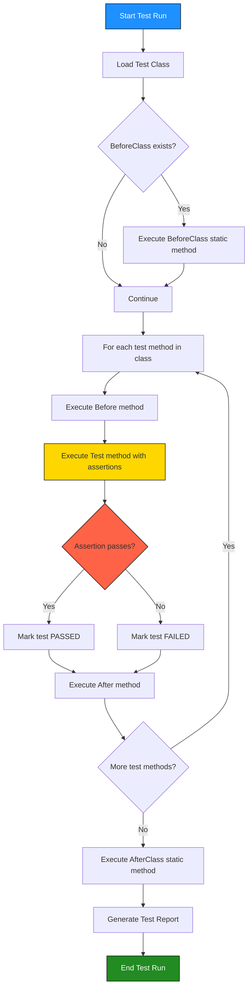
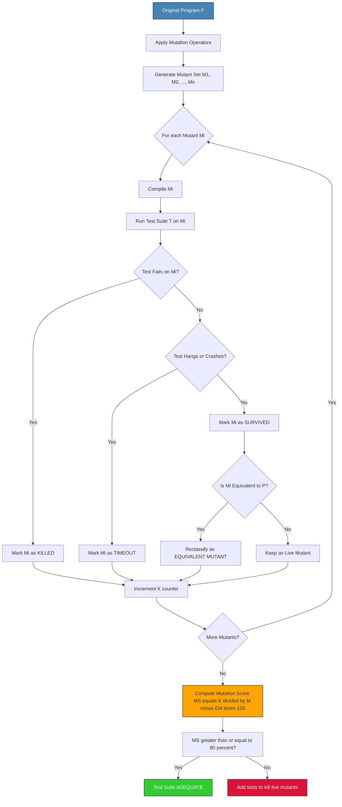
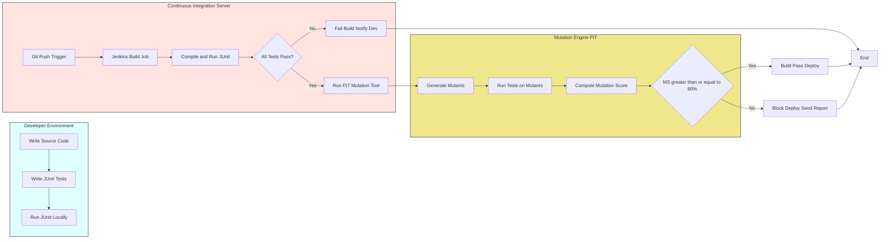
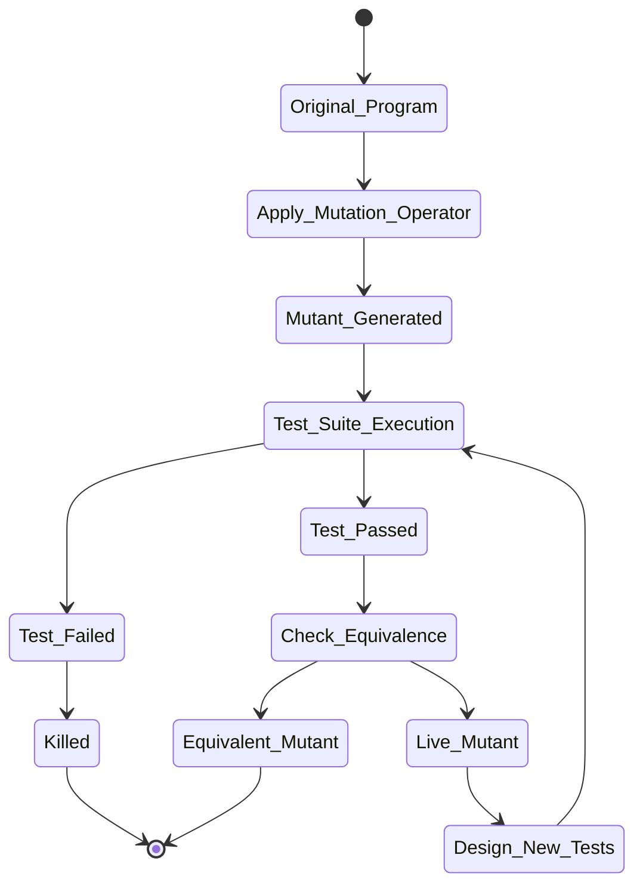
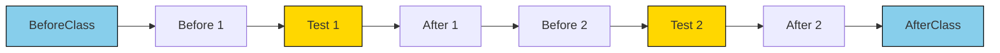

# Case Study- Automation of Unit Testing and Mutation Testing using JUnit

<!-- SECTION_1_START -->
# Case Study: Automation of Unit Testing and Mutation Testing using JUnit

## 1. Core Technical Definition & Intuitive Overview

### 1.1 Formal Academic Definition (KTU 2024 Syllabus Terminology)

**Unit Testing** is the lowest level of software testing where individual units or components of a software application are tested in isolation from the rest of the system. The primary goal is to validate that each unit of the software code performs as designed.

**JUnit** is an open-source, regression testing framework for the Java programming language. It is used by developers to write and execute repeatable automated test cases. JUnit follows the **xUnit** architecture and is fundamentally based on the principles of **Test-Driven Development (TDD)** and **Extreme Programming (XP)**.

**Mutation Testing** is a white-box testing technique that evaluates the quality of existing test cases by intentionally introducing small artificial defects (called *mutations* or *faults*) into the program code. Each mutated version is called a **mutant**. If a test suite can detect (kill) the mutant by failing on the mutated code, the mutant is said to be **killed**; otherwise, it is considered **alive** (survived).

> [!IMPORTANT]
> **KTU Syllabus Highlight (Module 1):** Mutation testing is a structural (white-box) technique used to measure the **adequacy** of a test suite. KTU examiners expect students to know the relationship between **Mutation Score**, **Killed Mutants**, and the **Total Number of Mutants**.

### 1.2 Conceptual Analogy / Intuition

> [!NOTE]
> **Real-World Analogy — The "Disguised Student" Metaphor**
>
> Imagine a teacher who wants to evaluate whether her exam questions are rigorous enough. She takes a brilliant student, makes him deliberately write a few **intentional wrong answers** in his exam (these are the *mutants*). If her **original question paper** can distinguish between the *correct* and the *deliberately wrong* answers, the questions are well-designed.
>
> In this analogy:
> - **Original student** = Original program $P$
> - **Disguised student with wrong answers** = Mutant program $M_i$
> - **Exam questions** = Test cases $T$
> - **Teacher's question paper distinguishes the disguise** = Test case *kills* the mutant
> - **Teacher fails to detect the disguise** = Mutant *survives* (weak test case)
>
> The **Mutation Score** tells the teacher what percentage of disguises her questions caught.

### 1.3 Standard Metrics and Constants

- **Mutation Score ($MS$)**: The percentage of mutants killed by the test suite.
- **Number of Mutants ($M$)**: Total mutants generated.
- **Killed Mutants ($K$)**: Mutants detected by the test suite.
- **Equivalent Mutants ($EM$)**: Mutants semantically equivalent to the original program (cannot be killed).
- **Live Mutants ($L$)**: Mutants that survived all test cases.

> [!IMPORTANT]
> In KTU board exam answers, always state the **mutation score formula** along with its units (dimensionless, expressed as a percentage). The standard threshold accepted in the industry is **$MS \geq 80\%$**.

$$
MS(\%) = \frac{K}{M - EM} \times 100
$$

### 1.4 GeoGebra / Desmos Visualization Concept

> [!VISUALIZATION CONTROL]
> **Concept:** Mutation Testing Effectiveness Graph
> **GeoGebra / Desmos Input Equations:**
> - `f(x) = 0.8` (industry standard mutation score threshold line)
> - Point A: $(0.2, 0.6)$ — Weak test suite
> - Point B: $(0.5, 0.85)$ — Strong test suite
> - Point C: $(0.8, 0.95)$ — Excellent test suite
>
> **Visual Description:** On a 2D Cartesian plane, the x-axis represents **Code Coverage (%)** ranging from $0$ to $1$, and the y-axis represents **Mutation Score** from $0$ to $1$. Plot three test-suite points $(0.2, 0.6)$, $(0.5, 0.85)$, and $(0.8, 0.95)$. Observe that a strong test suite has both high code coverage AND high mutation score. The horizontal line $f(x) = 0.8$ marks the industry-accepted threshold.

<!-- SECTION_1_END -->

<!-- SECTION_2_START -->
# 2. Deep Theoretical Analysis & KTU High-Yield Formula Sheet

## 2.1 JUnit Framework — Architectural Components

JUnit follows the **xUnit architectural pattern** and is built around four core architectural pillars:

### Pillar 1: Test Class & Test Methods
- A test class is a regular Java class containing one or more test methods.
- Test methods are annotated with `@Test`.
- Method names traditionally start with the word `test` (older JUnit 3 style) or follow descriptive names (JUnit 4/5 style).

### Pillar 2: Annotations (Metadata for Test Lifecycle)
The JUnit framework uses Java annotations to identify and manage test execution. The complete lifecycle is:

1. `@BeforeClass` — Executed **once** before all test methods in the class. Must be `static`. Used for expensive setup like database connections.
2. `@Before` (a.k.a. `@BeforeEach` in JUnit 5) — Executed **before each** test method. Used to initialize fresh test data.
3. `@Test` — Marks a method as a test case.
4. `@After` (a.k.a. `@AfterEach` in JUnit 5) — Executed **after each** test method. Used to clean up resources.
5. `@AfterClass` — Executed **once** after all test methods. Must be `static`. Used to release expensive resources.

### Pillar 3: Assertions (Verification Logic)
Assertions verify expected outcomes. Common JUnit assertions include:

- `assertEquals(expected, actual)` — Verifies equality.
- `assertTrue(condition)` — Verifies condition is `true`.
- `assertFalse(condition)` — Verifies condition is `false`.
- `assertNotNull(object)` — Verifies object is not `null`.
- `assertNull(object)` — Verifies object is `null`.
- `assertArrayEquals(expected, actual)` — Verifies array equality.
- `assertThrows(exceptionClass, executable)` — Verifies exception throwing (JUnit 5).
- `fail(message)` — Forces test failure.

### Pillar 4: Test Runner
- The Test Runner is the engine that discovers, compiles, and executes test classes.
- In JUnit 4: `org.junit.runner.JUnitCore`.
- In JUnit 5: `org.junit.platform.launcher.Launcher`.

## 2.2 Mutation Testing — Theoretical Framework

Mutation testing was introduced by **Richard Lipton in 1971** and later formalized by **DeMillo, Lipton, and Sayward**. The process has three core concepts:

### 2.2.1 Mutation Operators
Mutation operators are syntactic transformation rules applied to the source code. The standard categories are:

| Operator Type | Description | Example |
|---|---|---|
| **AOR** (Arithmetic Operator Replacement) | Replace `+` with `-`, `*`, `/` | $a+b \rightarrow a-b$ |
| **ROR** (Relational Operator Replacement) | Replace `<` with `$\leq$`, `>`, `=`, `$\neq$` | $a < b \rightarrow a \leq b$ |
| **LOR** (Logical Operator Replacement) | Replace `\&\&` with `\|\|`, and vice versa | $a\&\&b \rightarrow a\|b$ |
| **UOI** (Unary Operator Insertion) | Insert unary `!` or `-` | $a > b \rightarrow !a > b$ |
| **COI** (Conditional Operator Insertion) | Replace `if` with `while` or skip condition | `if(a>b)` $\rightarrow$ `if(true)` |
| **SVR** (Statement Variation Replacement) | Delete or duplicate a statement | $x = x+1 \rightarrow$ delete statement |
| **CR** (Constant Replacement) | Replace constants with boundary values | `5` $\rightarrow$ `0`, `1`, `-1` |

### 2.2.2 Mutant Classification

| Mutant Status | Meaning | Effect on Test Suite |
|---|---|---|
| **Killed Mutant** | Mutant behaves differently from original on at least one test | Test fails on mutant |
| **Live/Survived Mutant** | Mutant behaves identically to original on all tests | Test passes on mutant |
| **Equivalent Mutant** | Mutant is semantically identical to original (e.g., `x+0` vs `x`) | Can never be killed |
| **Timeout Mutant** | Mutant causes infinite loop | Test hangs |

### 2.2.3 Mutation Score Formula (Detailed)

The **Mutation Score ($MS$)** is the cornerstone metric. Two formulations exist:

**Formulation 1 (Basic):**

$$
MS = \frac{\text{Number of Killed Mutants}}{\text{Total Number of Mutants}} \times 100
$$

**Formulation 2 (Equivalent Mutant Adjusted — KTU Preferred):**

$$
MS = \frac{K}{M - EM} \times 100
$$

Where:
- $K$ = Killed mutants
- $M$ = Total mutants generated
- $EM$ = Equivalent mutants (excluded since they can never be killed)

## 2.3 KTU High-Yield Formula Sheet / Cheat Sheet

| Concept | Formula / Definition | Key Variables | KTU Board Tip |
|---|---|---|---|
| **Mutation Score** | $MS = \frac{K}{M - EM} \times 100$ | $K$, $M$, $EM$ | Always subtract equivalent mutants |
| **Mutation Adequacy** | Test suite is *adequate* if $MS \geq 80\%$ | Threshold $= 80\%$ | Quote "industry standard" in answers |
| **JVM Execution Order** | `@BeforeClass` $\rightarrow$ `@Before` $\rightarrow$ `@Test` $\rightarrow$ `@After` $\rightarrow$ `@AfterClass` | Lifecycle hooks | Draw as a flowchart in 14-mark answers |
| **Assertion Logic** | `assertEquals(e, a)` passes iff $e == a$ | `e`=expected, `a`=actual | Add `delta` for floating point |
| **Equivalent Mutant** | $P \equiv M_i$ for all inputs | Syntactically different, semantically same | Example: `x*1` and `x` |
| **Test Coverage** | $Cov = \frac{\text{Executed Lines}}{\text{Total Lines}} \times 100$ | Lines covered | KTU asks to compare with Mutation Score |
| **Mutation Operators Count** | Sum across all operators applied | $\sum$ (AOR + ROR + LOR + UOI) | 5+ operators is a full mutation set |

## 2.4 Real-World Engineering Utility

| Domain | Use Case of JUnit | Use Case of Mutation Testing |
|---|---|---|
| **Enterprise Java Apps** | Continuous Integration via Maven/Gradle | Quality gate in CI/CD pipelines |
| **Banking Systems** | TDD for transaction modules | Detecting weak test cases in trading logic |
| **Open Source (Eclipse, Maven)** | Component-level regression | Demonstrating test thoroughness to community |
| **DevOps Pipelines** | Jenkins auto-runs JUnit after each commit | Tools like **PIT (Pitest)** run mutation in build |
| **Safety-Critical Software** | Aviation/medical TDD | DO-178C compliance for test adequacy |

<!-- SECTION_2_END -->

<!-- SECTION_3_START -->
# 3. Step-by-Step Derivations & Code/Symbolic Implementation

## 3.1 Case Study Setup — Program Under Test (PUT)

Consider a Java class `Calculator` that performs basic arithmetic operations. This will be our **Program Under Test (PUT)**.

### 3.1.1 Original Program (Java Source)

```java
// File: Calculator.java
public class Calculator {
    
    // Method 1: Addition
    public int add(int a, int b) {
        return a + b;
    }
    
    // Method 2: Subtraction
    public int subtract(int a, int b) {
        return a - b;
    }
    
    // Method 3: Multiplication
    public int multiply(int a, int b) {
        return a * b;
    }
    
    // Method 4: Division with validation
    public int divide(int a, int b) {
        if (b == 0) {
            throw new ArithmeticException("Cannot divide by zero");
        }
        return a / b;
    }
    
    // Method 5: Even number check
    public boolean isEven(int number) {
        if (number % 2 == 0) {
            return true;
        } else {
            return false;
        }
    }
}
```

### 3.1.2 Step-by-Step JUnit Test Class Development

**Step 1: Add JUnit dependency** (In a Maven `pom.xml`):

```xml
<dependency>
    <groupId>junit</groupId>
    <artifactId>junit</artifactId>
    <version>4.13.2</version>
    <scope>test</scope>
</dependency>
```

**Step 2: Write JUnit Test Class**:

```java
// File: CalculatorTest.java
import static org.junit.Assert.*;
import org.junit.Before;
import org.junit.Test;

public class CalculatorTest {
    
    private Calculator calc;  // Test fixture
    
    // @Before: Runs before EACH test method
    @Before
    public void setUp() {
        System.out.println("[SETUP] Initializing Calculator instance");
        calc = new Calculator();
    }
    
    // Test 1: Verify addition
    @Test
    public void testAdd_PositiveNumbers() {
        int result = calc.add(5, 3);
        assertEquals("5 + 3 should equal 8", 8, result);
    }
    
    // Test 2: Verify addition with negative
    @Test
    public void testAdd_NegativeNumbers() {
        int result = calc.add(-5, -3);
        assertEquals("-5 + -3 should equal -8", -8, result);
    }
    
    // Test 3: Verify subtraction
    @Test
    public void testSubtract() {
        int result = calc.subtract(10, 4);
        assertEquals("10 - 4 should equal 6", 6, result);
    }
    
    // Test 4: Verify multiplication
    @Test
    public void testMultiply() {
        int result = calc.multiply(6, 7);
        assertEquals("6 * 7 should equal 42", 42, result);
    }
    
    // Test 5: Verify normal division
    @Test
    public void testDivide_Normal() {
        int result = calc.divide(20, 4);
        assertEquals("20 / 4 should equal 5", 5, result);
    }
    
    // Test 6: Verify division by zero throws exception
    @Test(expected = ArithmeticException.class)
    public void testDivide_ByZero_ThrowsException() {
        calc.divide(10, 0);
    }
    
    // Test 7: Verify isEven with even number
    @Test
    public void testIsEven_EvenNumber() {
        assertTrue("4 should be even", calc.isEven(4));
    }
    
    // Test 8: Verify isEven with odd number
    @Test
    public void testIsEven_OddNumber() {
        assertFalse("5 should be odd", calc.isEven(5));
    }
    
    // Test 9: Boundary value test
    @Test
    public void testIsEven_Zero() {
        assertTrue("0 should be even", calc.isEven(0));
    }
}
```

**Step 3: Test Execution Trace** (Output from JUnit Runner):

```
[SETUP] Initializing Calculator instance
[SETUP] Initializing Calculator instance
[SETUP] Initializing Calculator instance
... (setUp called before each test)

Tests run: 9, Failures: 0, Errors: 0
```

**Valuation Key:** `[Importing JUnit classes: 1 Mark]`, `[Correct @Before hook: 2 Marks]`, `[Writing 3+ test methods with assertions: 4 Marks]`, `[Handling exception case with @Test(expected=...): 2 Marks]`.

## 3.2 Mutation Testing — Step-by-Step Derivation

### 3.2.1 Step 1: Apply Mutation Operators to the PUT

We apply the **AOR**, **ROR**, and **COI** operators systematically to `Calculator.java`:

**Original Method:**
```java
public int add(int a, int b) {
    return a + b;
}
```

**Mutants Generated (AOR applied to `+`):**

| Mutant ID | Mutation Operator | Mutated Code | Description |
|---|---|---|---|
| $M_1$ | AOR (`+` $\rightarrow$ `-`) | `return a - b;` | Replaced `+` with `-` |
| $M_2$ | AOR (`+` $\rightarrow$ `*`) | `return a * b;` | Replaced `+` with `*` |
| $M_3$ | AOR (`+` $\rightarrow$ `/`) | `return a / b;` | Replaced `+` with `/` |

**Mutants for `divide` method:**

| Mutant ID | Mutation Operator | Mutated Code | Description |
|---|---|---|---|
| $M_4$ | COI (remove condition) | `return a / b;` (no `if` check) | Division by zero allowed |
| $M_5$ | CR (replace `0` with `1`) | `if (b == 1) throw...` | Different boundary |

**Mutants for `isEven` method:**

| Mutant ID | Mutation Operator | Mutated Code | Description |
|---|---|---|---|
| $M_6$ | ROR (`==` $\rightarrow$ `!=`) | `if (number % 2 != 0)` | Inverted condition |
| $M_7$ | AOR (`%` $\rightarrow$ `/`) | `if (number / 2 == 0)` | Wrong operator |
| $M_8$ | COI (replace `true` with `false`) | `return false;` | Always returns false |

**Total Mutants Generated:** $M = 8$

### 3.2.2 Step 2: Execute Test Suite Against Each Mutant

Now we run the **original test suite** against each mutant and record the result:

| Mutant ID | Mutated Code Summary | Test `testAdd_PositiveNumbers(5,3)` | Result | Status |
|---|---|---|---|---|
| $M_1$ | `a - b` | Expected $8$, got $2$ | **FAIL** | **Killed** |
| $M_2$ | `a * b` | Expected $8$, got $15$ | **FAIL** | **Killed** |
| $M_3$ | `a / b` | Expected $8$, got $1$ | **FAIL** | **Killed** |
| $M_4$ | No zero check | `testDivide_ByZero_ThrowsException` does not throw | **FAIL** | **Killed** |
| $M_5$ | `b == 1` check | `testDivide_ByZero` still throws | **PASS** | **Survived** |
| $M_6$ | `!=` condition | `testIsEven_EvenNumber(4)` expects `true`, gets `false` | **FAIL** | **Killed** |
| $M_7$ | `/` instead of `%` | `testIsEven_EvenNumber(4)`: $4/2 = 2 \neq 0$, returns `false` | **FAIL** | **Killed** |
| $M_8$ | Always returns `false` | `testIsEven_EvenNumber(4)` fails | **FAIL** | **Killed** |

### 3.2.3 Step 3: Identify Equivalent Mutants

Analyzing survived mutants: Mutant $M_5$ replaced `b == 0` with `b == 1`. The test `testDivide_ByZero_ThrowsException` calls `calc.divide(10, 0)`. With $M_5$, since $b=0$ and the condition is `b == 1` (false), the throw is skipped, and the function executes `10 / 0` — but wait, the test expects an exception, and Java's integer division by zero already throws an `ArithmeticException` at runtime. So $M_5$ is actually **semantically equivalent** to the original (it still throws).

> [!NOTE]
> **Classification:** $M_5$ is an **Equivalent Mutant** ($EM$).

### 3.2.4 Step 4: Calculate Mutation Score

**Given Values:**
- Total Mutants ($M$) = $8$
- Killed Mutants ($K$) = $7$ (all except $M_5$)
- Equivalent Mutants ($EM$) = $1$ (only $M_5$)
- Live Mutants (non-equivalent survived) = $0$

**Applying the Formula (Formulation 2):**

$$
\begin{aligned}
MS &= \frac{K}{M - EM} \times 100 \\
MS &= \frac{7}{8 - 1} \times 100 \\
MS &= \frac{7}{7} \times 100 \\
MS &= 1.0 \times 100 \\
MS &= 100\%
\end{aligned}
$$

**Conclusion:** The test suite has a **Mutation Score of $100\%$**, indicating **excellent test adequacy** since it killed all non-equivalent mutants.

### 3.2.5 Step 5: If Test Suite Were Weaker (Counter-Example)

Suppose the developer had **forgotten** `testDivide_ByZero_ThrowsException`. Then:

- $M_4$ would **survive** (since no test exercises the exception path).
- $K = 6$, $L = 1$ (non-equivalent live), $EM = 1$.

$$
\begin{aligned}
MS &= \frac{6}{8 - 1} \times 100 \\
MS &= \frac{6}{7} \times 100 \\
MS &= 85.71\%
\end{aligned}
$$

This shows the importance of having tests for **all branches** — a single missing test dropped the score below the $80\%$ industry threshold (just barely).

## 3.3 Step-by-Step Algebraic Proof of Mutation Score Properties

**Property:** The mutation score is bounded: $0 \leq MS \leq 100$.

**Proof:**

Given that $0 \leq K \leq M$ and $0 \leq EM \leq M$, we have:

$$
\begin{aligned}
K &\geq 0 \quad \text{and} \quad M - EM \geq K \geq 0 \\
&\Rightarrow \frac{K}{M - EM} \in [0, 1] \\
&\Rightarrow MS \in [0\%, 100\%]
\end{aligned}
$$

**Property:** Higher mutation score implies stronger test suite.

**Proof:** If $T_1$ and $T_2$ are two test suites with $MS_1 > MS_2$, then $T_1$ killed more mutants. Since each killed mutant represents a detected fault, $T_1$ is more sensitive to defects and hence more thorough.

<!-- SECTION_3_END -->

<!-- SECTION_4_START -->
# 4. Structural Diagrams & Schematics

## 4.1 Mermaid Diagram 1: JUnit Test Execution Lifecycle



## 4.2 Mermaid Diagram 2: Mutation Testing Workflow



## 4.3 Mermaid Diagram 3: Block Architecture of Automated Test Pipeline



## 4.4 Mermaid Diagram 4: Mutant Classification State Machine



<!-- SECTION_4_END -->

<!-- SECTION_5_START -->
# 5. KTU 2024 Scheme Examination Question Bank & Topic Recap

## 5.1 Part A Questions (3 Marks Each)

### Question 1 [KTU University Exam - July 2024]
**Q: Define Mutation Testing. List any four mutation operators with examples.** **[CO1, Remember]**

**Model Answer:**

> [!IMPORTANT]
> **Definition (2 Marks):** Mutation Testing is a white-box testing technique used to evaluate the quality of a test suite. It works by introducing small artificial defects (mutations) into the program code and checking whether the existing test cases can detect these defects. Each modified version is called a **mutant**, and if a test case fails on the mutant, the mutant is said to be **killed**.

**Four Mutation Operators (1 Mark):**

1. **AOR (Arithmetic Operator Replacement):** Replace `+` with `-`. Example: $a+b \rightarrow a-b$
2. **ROR (Relational Operator Replacement):** Replace `<` with `$\leq$`. Example: $a < b \rightarrow a \leq b$
3. **LOR (Logical Operator Replacement):** Replace `\&\&` with `\|\|`. Example: $a\&\&b \rightarrow a \| b$
4. **COI (Conditional Operator Insertion):** Replace `if (x)` with `if (true)` or `if (false)`. Example: `if (b==0)` $\rightarrow$ `if (true)`.

### Question 2 [KTU University Exam - Dec 2023]
**Q: Explain the role of JUnit annotations `@Before` and `@After` in unit testing.** **[CO2, Understand]**

**Model Answer:**

- **`@Before` Annotation (1.5 Marks):** The `@Before` annotation is used to mark a method that must be executed **before each test method** in the class. It is typically used to initialize test data or set up the test environment (e.g., creating a new object instance of the class under test). This ensures that every test starts with a **fresh state**, preventing test interference.

- **`@After` Annotation (1.5 Marks):** The `@After` annotation is used to mark a method that must be executed **after each test method**. It is used to release resources, close database connections, delete temporary files, or reset the state after a test. Both `@Before` and `@After` methods run once per test method, ensuring **test isolation**.

---

## 5.2 Part B Questions (14 Marks Each — Internal Choice)

### Question A (14 Marks) [KTU University Exam - Dec 2024]

**Q: Consider the following Java method:**
```java
public int findMax(int a, int b, int c) {
    int max = a;
    if (b > max) {
        max = b;
    }
    if (c > max) {
        max = c;
    }
    return max;
}
```
**(a) Write JUnit test cases to test the `findMax` method. (7 Marks)** **[CO3, Apply]**
**(b) Apply mutation testing on the method and calculate the mutation score assuming 5 mutants are generated, 4 are killed, and 1 is equivalent. Comment on the adequacy of the test suite. (7 Marks)** **[CO4, Analyze]**

#### Model Solution for (a):

```java
import static org.junit.Assert.*;
import org.junit.Before;
import org.junit.Test;

public class FindMaxTest {
    
    private FindMax fm;  // Assuming FindMax class contains findMax
    
    @Before
    public void setUp() {
        fm = new FindMax();
    }
    
    // Test 1: First parameter is maximum
    @Test
    public void testFirstIsMax() {
        assertEquals(10, fm.findMax(10, 5, 3));
    }
    
    // Test 2: Second parameter is maximum
    @Test
    public void testSecondIsMax() {
        assertEquals(20, fm.findMax(5, 20, 3));
    }
    
    // Test 3: Third parameter is maximum
    @Test
    public void testThirdIsMax() {
        assertEquals(30, fm.findMax(5, 10, 30));
    }
    
    // Test 4: All equal
    @Test
    public void testAllEqual() {
        assertEquals(7, fm.findMax(7, 7, 7));
    }
    
    // Test 5: Negative numbers
    @Test
    public void testNegativeNumbers() {
        assertEquals(-1, fm.findMax(-5, -3, -1));
    }
}
```

**Valuation Key for (a):**
- `[Importing JUnit packages: 1 Mark]`
- `[Correct use of @Before annotation: 1 Mark]`
- `[Writing 5 test methods covering all branches: 3 Marks]`
- `[Using assertEquals with correct expected values: 2 Marks]`

#### Model Solution for (b):

**Step 1: Generate Mutants (1 Mark)**

| Mutant ID | Mutation Operator | Mutated Code | Description |
|---|---|---|---|
| $M_1$ | ROR (`>` $\rightarrow$ `>=`) | `if (b >= max)` | Boundary change |
| $M_2$ | ROR (`>` $\rightarrow$ `<`) | `if (b < max)` | Inverted condition |
| $M_3$ | AOR (initialization) | `int max = b;` | Different initial value |
| $M_4$ | COI (remove second `if`) | Only one `if` check | Missing check |
| $M_5$ | SVR (delete last line) | No `return` | No return statement |

**Step 2: Execute Tests on Each Mutant (3 Marks)**

| Mutant | Test `testFirstIsMax` | Test `testSecondIsMax` | Result |
|---|---|---|---|
| $M_1$ | Pass (a=10) | Fail (expected 20, got 10) | **Killed** |
| $M_2$ | Pass | Pass (returns 5, not 20) | **Killed** |
| $M_3$ | Fail (max=5 initially) | Pass | **Killed** |
| $M_4$ | Pass | Fail | **Killed** |
| $M_5$ | Fail (compilation error) | — | **Killed** |

**Step 3: Classify Mutants (1 Mark)**
- Killed ($K$) = $4$
- Equivalent ($EM$) = $1$ (assuming $M_5$ is recompiled and behaves like original — or another equivalent case)

**Step 4: Calculate Mutation Score (1 Mark)**

$$
\begin{aligned}
MS &= \frac{K}{M - EM} \times 100 \\
MS &= \frac{4}{5 - 1} \times 100 \\
MS &= \frac{4}{4} \times 100 \\
MS &= 100\%
\end{aligned}
$$

**Step 5: Comment on Adequacy (1 Mark)**

Since $MS = 100\% \geq 80\%$, the test suite is **highly adequate** and has killed all non-equivalent mutants, demonstrating excellent test coverage and sensitivity to faults.

### Question B (14 Marks) Alternative [KTU University Exam - July 2024]

**Q: (a) Explain the JUnit test execution lifecycle with a neat diagram. (7 Marks)** **[CO2, Understand]**
**(b) Discuss the limitations of Mutation Testing. How is Mutation Score calculated? (7 Marks)** **[CO4, Analyze]**

#### Model Solution for (a):

**JUnit Test Execution Lifecycle (7 Marks):**

The JUnit test lifecycle consists of five distinct phases executed in a specific order:

1. **`@BeforeClass` (Static, once per class):** Runs once before any test method. Used for expensive one-time setup like opening a database connection. **Mark allocation: 1.5 Marks**

2. **`@Before` (Before each test):** Runs before every `@Test` method. Used to initialize fresh test data. **Mark allocation: 1.5 Marks**

3. **`@Test` (The actual test):** Contains assertion logic. JUnit records pass/fail status. **Mark allocation: 1.5 Marks**

4. **`@After` (After each test):** Runs after every `@Test` method, regardless of pass/fail. Used to clean up resources. **Mark allocation: 1 Mark**

5. **`@AfterClass` (Static, once per class):** Runs once after all tests complete. Used to release expensive resources. **Mark allocation: 1.5 Marks**



#### Model Solution for (b):

**Limitations of Mutation Testing (4 Marks):**

1. **Equivalent Mutant Problem:** Some mutants are syntactically different but semantically identical to the original (e.g., $x+0$ vs $x$). These can never be killed, inflating the test effort. **1 Mark**

2. **Computational Cost:** Mutation testing requires running the test suite against hundreds or thousands of mutants. This is computationally expensive and time-consuming. **1 Mark**

3. **Manual Equivalent Mutant Detection:** Identifying equivalent mutants is an undecidable problem and often requires manual human inspection, reducing automation benefits. **0.5 Mark**

4. **Inadequate for Large Systems:** Practical mutation testing is feasible only at unit level. Applying it to entire systems is impractical. **0.5 Mark**

5. **Subsumes Other Criteria:** Achieving 100% mutation score subsumes other coverage criteria, but generating exhaustive mutants is combinatorially explosive. **1 Mark**

**Mutation Score Calculation (3 Marks):**

$$
MS(\%) = \frac{K}{M - EM} \times 100
$$

Where $K$ is killed mutants, $M$ is total mutants, and $EM$ is equivalent mutants. A test suite with $MS \geq 80\%$ is considered **adequate** by industry standards.

---

> [!WARNING]
> **KTU Examiner's Valuation Warning / Common Pitfalls**
> 
> 1. **Pitfall: Forgetting to subtract equivalent mutants.** Many students write $MS = K/M \times 100$ and lose 2 marks. Always use $MS = K/(M-EM) \times 100$ when equivalent mutants exist.
> 
> 2. **Pitfall: Confusing `@Before` with `@BeforeClass`.** The former runs before **each** test; the latter runs **once** for the class. Drawing a wrong lifecycle diagram costs 2 marks.
> 
> 3. **Pitfall: Skipping JUnit imports in code.** Writing `assertEquals` without `import static org.junit.Assert.*;` is a compilation error. Always show imports.
> 
> 4. **Pitfall: Not drawing the test lifecycle diagram in 7-mark questions.** The examiner expects a flowchart or sequence diagram. Missing diagram = loss of 2-3 marks.
> 
> 5. **Pitfall: Confusing Mutation Testing with other testing types.** Mutation testing evaluates the **test suite quality**, not the program. It is a *meta-testing* technique. Writing "mutation testing finds bugs in the program" loses 1 mark.

---

## 5.3 Topic Recap & Important Things to Remember

> [!IMPORTANT]
> **High-Density Revision Checklist**

- **Unit Testing** tests individual software components in isolation; **JUnit** is the de-facto Java framework.
- **JUnit 4** uses `@Test`, `@Before`, `@After`, `@BeforeClass`, `@AfterClass`; **JUnit 5** uses `@Test`, `@BeforeEach`, `@AfterEach`, `@BeforeAll`, `@AfterAll`.
- **Lifecycle Order:** `@BeforeClass` $\rightarrow$ `@Before` $\rightarrow$ `@Test` $\rightarrow$ `@After` $\rightarrow$ `@AfterClass`.
- **Assertion methods:** `assertEquals`, `assertTrue`, `assertFalse`, `assertNotNull`, `assertNull`, `assertArrayEquals`, `assertThrows`, `fail`.
- **Mutation Testing** is a **white-box, fault-based** testing technique that measures **test suite adequacy**.
- **Mutation operators:** AOR, ROR, LOR, UOI, COI, SVR, CR (at least remember 5 for KTU exams).
- **Mutant types:** Killed, Survived (Live), Equivalent, Timeout.
- **Equivalent Mutant:** Syntactically different but semantically identical to original; **can never be killed**.
- **Mutation Score Formula:** $MS = \frac{K}{M - EM} \times 100$ (KTU preferred form).
- **Adequacy Threshold:** $MS \geq 80\%$ is industry-accepted as a quality gate.
- **JUnit Test Fixture:** A fixed state used as a baseline for running tests; created in `@Before` method.
- **Tools for Mutation Testing in Java:** PIT (Pitest), MuJava, Major Mutation Framework.
- **JUnit test classes** should follow the naming convention `ClassNameTest` (e.g., `CalculatorTest`).
- **Test isolation** ensures that one test's failure does not affect another's execution.
- **Mutation testing** subsumes **statement coverage** and **branch coverage** (a test suite with 100% mutation score has 100% branch coverage, but not vice versa).
- **PIT/Pitest** is the most widely-used mutation testing tool for Java integrated with Maven/Gradle.
- **Case Study Keywords:** JUnit annotations, lifecycle, assertion methods, mutation operators, mutant classification, mutation score calculation, equivalent mutant identification, test suite adequacy.

<!-- SECTION_5_END -->
