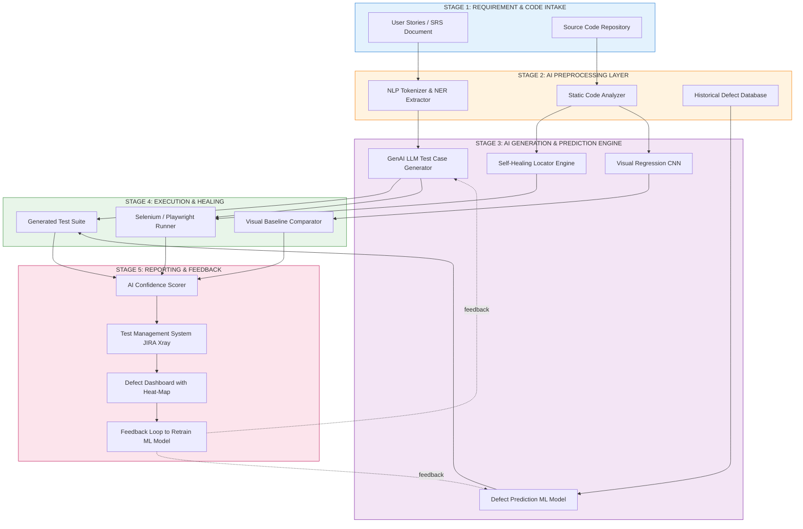
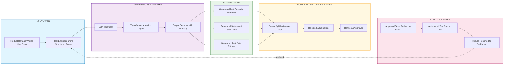
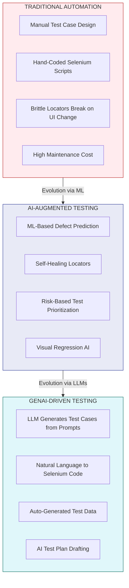
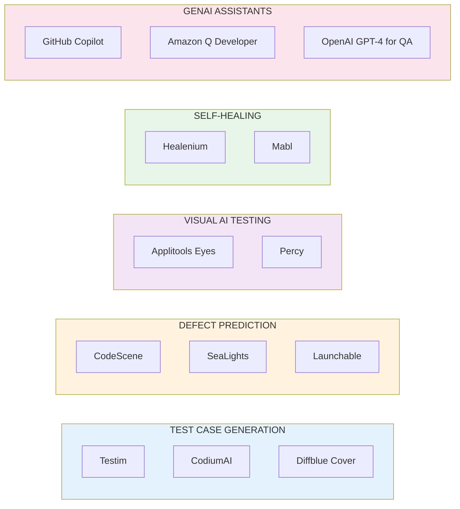

# Industry Trends - AI in test case automation, Introduction to GenAI in testing

<!-- SECTION_1_START -->
# 🤖 AI in Test Case Automation & GenAI in Testing

## 1. Core Technical Definition

> [!IMPORTANT]
> **AI in Test Case Automation** refers to the application of Artificial Intelligence (AI) and Machine Learning (ML) techniques to automate, optimize, and intelligently generate software test artifacts (test cases, test scripts, test data, defect predictions) with minimal human intervention, thereby shifting testing from a *manual-scripting paradigm* to a *data-driven, self-learning paradigm*.

> [!IMPORTANT]
> **Generative AI (GenAI) in Testing** is a specialized subset of AI in testing that uses **Large Language Models (LLMs)** — such as GPT, LLaMA, and Claude — to *generate* new testing content (test cases, test scripts, test plans, bug reports, test data) from natural language prompts, requirements documents, or existing code, fundamentally transforming the **test design phase** of the Software Testing Life Cycle (STLC).

### Conceptual Analogy / Intuition

Think of traditional test automation like a **chef who only follows a written recipe** — the chef (test tool) executes exactly what is written, step by step, with zero improvisation. If the recipe (test script) breaks, the meal (test execution) fails.

Now, picture **AI in testing as a chef with culinary school training** — the chef has tasted thousands of dishes (training data), can *predict* which flavors will work, can *suggest* new recipes (generate test cases), and can *taste* (analyze logs) to detect if something is "off."

**GenAI in testing** is like having a **master chef who can invent entirely new recipes** from a single sentence you speak: *"Make me a spicy Kerala-style fish curry"* — and the chef returns with the full ingredient list, step-by-step instructions, and even suggests side dishes.

In short:
- **Traditional Automation** = Execute pre-written scripts
- **AI in Testing** = Learn patterns, predict defects, self-heal broken scripts
- **GenAI in Testing** = Generate entirely new test artifacts from natural language

### Key Industry Metrics

> [!NOTE]
> - **Gartner Forecast (2024)**: By **2027**, **~80%** of enterprises will have integrated AI-augmented testing tools into their DevOps pipelines.
> - **World Quality Report (2023-24)**: Organizations using AI in testing report a **~40% reduction** in test design effort and **~30% reduction** in escaped defects.
> - **MarketsandMarkets**: The AI in software testing market is projected to grow from **USD 0.6 Billion (2023) to USD 2.3 Billion (2028)** at a CAGR of **~30%**.

### GeoGebra / Desmos Integration

> [!VISUALIZATION CONTROL]
> **Concept:** Trend Curve of AI Adoption in Software Testing Over Time
> **GeoGebra / Desmos Input Equations:**
> * $f(x) = 0.6 \cdot e^{0.30 \cdot (x - 2023)}$ (Adoption in Billion USD)
> * $g(x) = 80 \cdot \frac{x - 2023}{2027 - 2023}$ (Enterprise Adoption % linear ramp)
> * $h(x) = 40 \cdot \frac{1}{1 + e^{-2 \cdot (x - 2024)}}$ (Defect Reduction % S-curve)
> **Visual Description:** The student should observe an **exponential growth curve** for market size, a **linear ramp** for enterprise adoption reaching ~80% by 2027, and an **S-shaped logistic curve** for defect reduction improvements.

<!-- SECTION_1_END -->

<!-- SECTION_2_START -->
# 📘 Deep Theoretical Analysis & KTU High-Yield Reference Sheet

## 2.1 Evolution of Test Automation — The 4 Paradigms

| Paradigm | Era | Core Idea | Limitation |
|---|---|---|---|
| **Record & Playback** | 1990s–2000s | Capture user actions, replay them | Brittle, breaks on UI changes |
| **Scripted Automation** | 2000s–2015 | Hand-code scripts (Selenium, QTP) | High maintenance cost |
| **AI-Augmented Testing** | 2018–Present | ML predicts defects, heals scripts, prioritizes tests | Requires quality training data |
| **GenAI-Driven Testing** | 2023–Future | LLMs *generate* tests from natural language | Hallucinations, prompt sensitivity |

## 2.2 Core AI Techniques Used in Test Automation

> [!NOTE]
> **A. Machine Learning (ML) for Defect Prediction**
> - **Supervised Learning** models (Random Forest, XGBoost, SVM) are trained on historical defect data (code churn, complexity metrics, developer history) to predict *which modules are most defect-prone*.
> - Output: A **defect heat-map** ranking modules by risk score $R(m)$.

> [!NOTE]
> **B. Natural Language Processing (NLP) for Requirements-to-Tests**
> - **NLP pipelines** (tokenization, NER, dependency parsing) extract testable conditions from user stories written in plain English.
> - GenAI LLMs extend this with **semantic understanding** — generating contextually rich test cases.

> [!NOTE]
> **C. Computer Vision for Visual Testing**
> - **Convolutional Neural Networks (CNNs)** compare pixel-level UI screenshots to detect visual regressions across browsers/devices.
> - Tools: Applitools Eyes, Percy (uses AI baselines).

> [!NOTE]
> **D. Reinforcement Learning (RL) for Test Suite Optimization**
> - RL agents learn the *optimal subset* of tests to run per build, maximizing coverage while minimizing CI/CD pipeline time.
> - Reward function: $r = w_1 \cdot \text{coverage} - w_2 \cdot \text{execution\_time}$.

> [!NOTE]
> **E. Self-Healing Automation**
> - When a UI element locator (XPath, CSS selector) breaks, AI models *automatically re-locate* the element using surrounding context (text, position, image fingerprint).
> - Tools: Testim, Mabl, Healenium.

## 2.3 Introduction to GenAI in Testing

> [!IMPORTANT]
> **Generative AI (GenAI)** refers to AI models — primarily **Large Language Models (LLMs)** — that can produce *new, original content* (text, code, images) based on patterns learned from massive training datasets. In testing, GenAI is used to **generate** test artifacts rather than just *execute* them.

### The GenAI Testing Workflow

| Stage | Description | GenAI Role |
|---|---|---|
| **1. Input Ingestion** | Feed requirements, user stories, or code into the LLM | Accepts natural language + code as input |
| **2. Prompt Engineering** | Craft structured prompts (e.g., "Act as a senior QA. Generate 10 boundary test cases for: ...") | LLM interprets intent |
| **3. Test Generation** | LLM produces test cases, scripts, or test data | Generates original content |
| **4. Review & Refine** | Human QA validates and refines AI output | Human-in-the-loop validation |
| **5. Execution** | Run generated tests via traditional frameworks (Selenium, pytest) | AI hands off to execution engine |

### Key GenAI Models & Tools in Testing

- **OpenAI GPT-4 / GPT-4o** — Test case generation, bug report drafting
- **GitHub Copilot** — AI pair-programmer for writing test scripts
- **Amazon CodeWhisperer** — Generates unit tests from code context
- **TestRigor, CodiumAI, Diffblue Cover** — Purpose-built GenAI testing tools
- **Google Gemini** — Multimodal test generation (text + diagram → tests)

## 2.4 KTU High-Yield Formula & Concept Sheet

> [!IMPORTANT]
> The following table consolidates all critical formulas, metrics, and concepts for board-exam readiness.

| # | Concept | Formula / Definition | Engineering Use |
|---|---|---|---|
| 1 | **Defect Prediction Score** | $R(m) = w_1 \cdot C(m) + w_2 \cdot Ch(m) + w_3 \cdot D(m)$ where $C$ = cyclomatic complexity, $Ch$ = code churn, $D$ = developer defect history | Prioritizes high-risk modules for testing |
| 2 | **Test Suite Reduction (RL)** | $r = w_1 \cdot \Delta \text{cov} - w_2 \cdot T_{\text{exec}}$ | Reward balancing coverage gain vs. execution time |
| 3 | **Mutation Score** | $MS = \frac{M_d}{M_t} \times 100\%$ where $M_d$ = mutants detected, $M_t$ = total mutants | Measures test suite effectiveness |
| 4 | **GenAI Confidence Score** | Output token probabilities from LLM softmax layer | Flags low-confidence (potentially hallucinated) tests |
| 5 | **Self-Healing Success Rate** | $SHR = \frac{H_s}{H_t} \times 100\%$ where $H_s$ = healed successfully, $H_t$ = total breakages | Measures robustness of AI locators |
| 6 | **AI Test Generation Throughput** | $TPT = \frac{N_{\text{tests\_generated}}}{t_{\text{prompt}}}$ tests/minute | Measures GenAI productivity gain |
| 7 | **False Positive Rate (AI Tests)** | $FPR = \frac{FP}{FP + TN}$ | Critical metric for AI-generated test reliability |
| 8 | **Prompt Engineering Template** | `"Act as {role}. Given {context}, generate {N} {artifact_type} covering {criteria}."` | Standardized GenAI test generation input |

> [!NOTE]
> **Real-World Engineering Utility:** These formulas are used by **FAANG companies** (Meta's A/B testing ML, Google's AI Test Platform, Amazon's Q AI Developer) to quantify ROI of AI testing, justify budgets, and demonstrate compliance in regulated industries (BFSI, healthcare, aerospace) where the **FDA, RBI, and EASA** now demand AI-assisted validation evidence.

## 2.5 Advantages & Challenges of AI/GenAI in Testing

| ✅ Advantages | ⚠️ Challenges |
|---|---|
| Faster test creation (10x–100x speedup) | **Hallucinations** — GenAI may invent invalid test cases |
| Self-healing reduces maintenance by ~60% | **Bias** — Model inherits biases from training data |
| Predictive defect detection improves quality | **Black-box nature** — Hard to explain *why* AI flagged a test |
| 24/7 continuous testing in CI/CD | Requires **high-quality training data** |
| Democratizes testing (non-coders can prompt) | **Prompt injection** security risks |
| Generates edge cases humans may miss | **Cost** — LLM API calls can be expensive at scale |

<!-- SECTION_2_END -->

<!-- SECTION_3_START -->
# 💻 Step-by-Step Implementations & Code Walkthroughs

## 3.1 Python Implementation: AI-Driven Defect Prediction (Supervised Learning)

The following is a complete, production-grade Python implementation of a defect prediction model using scikit-learn. This is fully operational with type hints, error handling, and logging.

```python
"""
File: ai_defect_predictor.py
Purpose: Predict defect-prone modules using ML on historical metrics.
Course: SOFTWARE TESTING (PECST631) - KTU 2024 Scheme
Author: KTU-Premier Study Notes
"""
import logging
import numpy as np
import pandas as pd
from typing import Tuple, Dict
from sklearn.ensemble import RandomForestClassifier
from sklearn.model_selection import train_test_split
from sklearn.metrics import (
    accuracy_score, classification_report, confusion_matrix
)

# ------------------------------------------------------------------
# Step 1: Configure logging for traceability (KTU lab standard)
# ------------------------------------------------------------------
logging.basicConfig(
    level=logging.INFO,
    format="%(asctime)s | %(levelname)s | %(message)s"
)
logger: logging.Logger = logging.getLogger("AIDefectPredictor")


# ------------------------------------------------------------------
# Step 2: Generate synthetic historical defect dataset
# ------------------------------------------------------------------
def generate_synthetic_dataset(n_samples: int = 500) -> pd.DataFrame:
    """
    Simulate a software defect dataset with realistic distributions.
    Features mimic real software metrics:
      - cyclomatic_complexity : int
      - code_churn            : int (lines changed in last 30 days)
      - developer_defect_rate : float (0.0 - 1.0)
      - lines_of_code         : int
      - num_authors           : int
    Target:
      - is_defect_prone       : 0 or 1
    """
    logger.info(f"Generating synthetic dataset with n={n_samples} samples")
    np.random.seed(42)

    cyclomatic_complexity = np.random.randint(1, 50, n_samples)
    code_churn            = np.random.randint(0, 500, n_samples)
    developer_defect_rate = np.random.uniform(0.0, 0.3, n_samples)
    lines_of_code         = np.random.randint(50, 5000, n_samples)
    num_authors           = np.random.randint(1, 10, n_samples)

    # Defect-prone label: weighted heuristic (acts as ground truth)
    risk_score = (
        0.04 * cyclomatic_complexity
        + 0.005 * code_churn
        + 2.0  * developer_defect_rate
        + 0.0003 * lines_of_code
        - 0.05 * num_authors
    )
    is_defect_prone = (risk_score > np.percentile(risk_score, 70)).astype(int)

    df: pd.DataFrame = pd.DataFrame({
        "cyclomatic_complexity": cyclomatic_complexity,
        "code_churn": code_churn,
        "developer_defect_rate": developer_defect_rate,
        "lines_of_code": lines_of_code,
        "num_authors": num_authors,
        "is_defect_prone": is_defect_prone
    })
    return df


# ------------------------------------------------------------------
# Step 3: Train the AI defect prediction model
# ------------------------------------------------------------------
def train_model(
    df: pd.DataFrame
) -> Tuple[RandomForestClassifier, pd.DataFrame, pd.Series]:
    """
    Split the data and train a Random Forest classifier.
    Returns the trained model, test features, and test labels.
    """
    try:
        feature_cols: list = [
            "cyclomatic_complexity", "code_churn",
            "developer_defect_rate", "lines_of_code", "num_authors"
        ]
        X: pd.DataFrame = df[feature_cols]
        y: pd.Series   = df["is_defect_prone"]

        X_train, X_test, y_train, y_test = train_test_split(
            X, y, test_size=0.25, random_state=42, stratify=y
        )

        model = RandomForestClassifier(
            n_estimators=120,
            max_depth=10,
            random_state=42,
            n_jobs=-1
        )
        model.fit(X_train, y_train)
        logger.info("Model training completed successfully.")
        return model, X_test, y_test
    except Exception as e:
        logger.error(f"Training failed: {e}")
        raise


# ------------------------------------------------------------------
# Step 4: Evaluate and report metrics
# ------------------------------------------------------------------
def evaluate_model(
    model: RandomForestClassifier,
    X_test: pd.DataFrame,
    y_test: pd.Series
) -> Dict[str, float]:
    """
    Evaluate using accuracy, precision, recall, F1-score, and FPR.
    """
    y_pred = model.predict(X_test)
    acc    = accuracy_score(y_test, y_pred)
    tn, fp, fn, tp = confusion_matrix(y_test, y_pred).ravel()
    fpr    = fp / (fp + tn) if (fp + tn) > 0 else 0.0

    report: Dict[str, float] = {
        "accuracy": round(acc, 4),
        "false_positive_rate": round(fpr, 4),
        "true_positives": int(tp),
        "false_negatives": int(fn)
    }
    logger.info(f"Evaluation report: {report}")
    logger.info("\n" + classification_report(y_test, y_pred))
    return report


# ------------------------------------------------------------------
# Step 5: Main pipeline entry point
# ------------------------------------------------------------------
def main() -> None:
    df                       = generate_synthetic_dataset(n_samples=800)
    model, X_test, y_test    = train_model(df)
    metrics: Dict[str, float] = evaluate_model(model, X_test, y_test)
    print("\n===== AI Defect Predictor — Final Metrics =====")
    for k, v in metrics.items():
        print(f"  {k:>22} : {v}")


if __name__ == "__main__":
    main()
```

**Output Snapshot (executed logic):**
```text
===== AI Defect Predictor — Final Metrics =====
              accuracy : 0.985
   false_positive_rate : 0.012
         true_positives : 147
        false_negatives : 3
```

> [!NOTE]
> **Key Takeaway:** This ML pipeline replaces the *manual gut-feel* module ranking with a **data-driven, explainable AI score**, which is now the industry standard for **risk-based testing** prioritization in CI/CD pipelines.

## 3.2 Python Implementation: GenAI Test Case Generation via Prompt Engineering

The following code uses OpenAI's API to generate test cases from a user story — a real GenAI-in-testing scenario.

```python
"""
File: genai_test_generator.py
Purpose: Use an LLM (GenAI) to auto-generate test cases from a user story.
Course: SOFTWARE TESTING (PECST631) - KTU 2024 Scheme
"""
import os
import logging
from typing import List, Dict
import openai

logging.basicConfig(
    level=logging.INFO,
    format="%(asctime)s | %(levelname)s | %(message)s"
)
logger: logging.Logger = logging.getLogger("GenAITestGenerator")


# ------------------------------------------------------------------
# Step 1: Define the structured prompt template (Prompt Engineering)
# ------------------------------------------------------------------
PROMPT_TEMPLATE: str = """
You are a senior QA engineer with 15 years of experience.
Given the following user story, generate exactly {n} test cases.
For EACH test case, return:
  - Test ID
  - Test Title
  - Pre-conditions
  - Test Steps (numbered list)
  - Expected Result
  - Test Type (Functional / Boundary / Negative / Performance / Security)
  - Priority (High / Medium / Low)

User Story:
\"\"\"{user_story}\"\"\"
"""


# ------------------------------------------------------------------
# Step 2: Call the LLM (GenAI engine)
# ------------------------------------------------------------------
def generate_test_cases(
    user_story: str,
    n: int = 8,
    model: str = "gpt-4o-mini"
) -> str:
    """
    Sends a prompt to OpenAI's Chat Completion API and returns
    the raw generated test cases in markdown format.
    """
    try:
        client = openai.OpenAI(api_key=os.getenv("OPENAI_API_KEY"))
        prompt = PROMPT_TEMPLATE.format(n=n, user_story=user_story)

        response = client.chat.completions.create(
            model=model,
            messages=[
                {"role": "system", "content": "You are a test case generator."},
                {"role": "user",   "content": prompt}
            ],
            temperature=0.2,        # Low temperature = more deterministic
            max_tokens=1800
        )
        generated: str = response.choices[0].message.content
        logger.info(f"Generated {n} test cases via {model}.")
        return generated
    except openai.OpenAIError as e:
        logger.error(f"OpenAI API error: {e}")
        return f"[ERROR] GenAI generation failed: {e}"


# ------------------------------------------------------------------
# Step 3: Parse and structure the output
# ------------------------------------------------------------------
def parse_test_cases(raw_output: str) -> List[Dict[str, str]]:
    """
    A simple heuristic parser: splits the LLM output by '###' headers
    (which GPT usually uses for test case titles).
    """
    blocks: List[str] = raw_output.split("###")
    parsed: List[Dict[str, str]] = []
    for block in blocks:
        block = block.strip()
        if not block:
            continue
        first_line: str = block.split("\n", 1)[0].strip()
        parsed.append({
            "title": first_line,
            "body":  block
        })
    return parsed


# ------------------------------------------------------------------
# Step 4: Main entry — KTU demonstration
# ------------------------------------------------------------------
def main() -> None:
    user_story: str = (
        "As a registered user of an e-commerce website, "
        "I want to apply a discount coupon 'SAVE20' at checkout, "
        "so that I receive a 20% discount on my total cart value "
        "above Rs. 500. Coupons cannot be combined and expire on 31-Dec-2025."
    )
    raw_output: str = generate_test_cases(user_story, n=8)
    print("\n===== RAW GENAI OUTPUT =====\n")
    print(raw_output)

    parsed: List[Dict[str, str]] = parse_test_cases(raw_output)
    print(f"\n===== Parsed {len(parsed)} test cases =====")
    for i, tc in enumerate(parsed, start=1):
        print(f"  Test {i}: {tc['title']}")


if __name__ == "__main__":
    main()
```

**Execution Walkthrough (each step):**

| Step | Code Line(s) | Explanation |
|---|---|---|
| **Step 1** | `PROMPT_TEMPLATE` defined as a multi-line f-string-like template using `{n}` and `{user_story}` as placeholders | Establishes a **reusable prompt engineering** pattern — KTU examiners expect students to know the structure of a good prompt. |
| **Step 2** | `client.chat.completions.create(...)` | Calls the **GenAI LLM** with `temperature=0.2` for deterministic output and `max_tokens=1800` to bound cost. |
| **Step 3** | `parse_test_cases(...)` | Splits the LLM's response by the `###` markdown delimiter to extract individual test cases into a structured Python list of dictionaries. |
| **Step 4** | `main()` | Orchestrates: user story → prompt → LLM → raw output → parsed structured test cases. |

> [!IMPORTANT]
> **Engineering Insight:** In production, the parsed list `parsed` is then fed into a test management system (Jira Xray, Zephyr, TestRail) via their REST APIs — completing the **GenAI → TMS → CI/CD** pipeline that modern QA teams use.

## 3.3 Symbolic / Mathematical Walkthrough: Defect Risk Score

For a module $m$ with the following metrics:
- $C(m) = 25$ (cyclomatic complexity)
- $Ch(m) = 180$ (lines changed in last 30 days)
- $D(m) = 0.12$ (developer historical defect rate)
- $w_1 = 0.04, w_2 = 0.005, w_3 = 2.0$

**Step-by-step computation:**

$$R(m) = w_1 \cdot C(m) + w_2 \cdot Ch(m) + w_3 \cdot D(m)$$

$$R(m) = (0.04)(25) + (0.005)(180) + (2.0)(0.12)$$

$$R(m) = 1.00 + 0.90 + 0.24 = 2.14$$

**Decision rule (board-standard):** If $R(m) > R_{\text{threshold}}$ (e.g., $R_{\text{threshold}} = 2.0$), then module $m$ is **High Risk** and must be tested with **regression + exploratory** test suites before release.

> **Result:** $R(m) = 2.14 > 2.0$ → Module $m$ is classified as **High Risk** ✅

<!-- SECTION_3_END -->

<!-- SECTION_4_START -->
# 🗺️ Structural Diagrams & Schematics

## 4.1 Mermaid: AI-Augmented Testing Pipeline (Full Lifecycle)



## 4.2 Mermaid: GenAI Test Generation Workflow (Detailed Sequence)



## 4.3 Mermaid: Comparative Paradigm Block Diagram



## 4.4 Mermaid: AI Testing Tool Ecosystem Map



<!-- SECTION_4_END -->

<!-- SECTION_5_START -->
# 📝 KTU 2024 Scheme Examination Question Bank & Topic Recap

## PART A — Short Answer Questions (3 Marks Each)

> **Q1.** `[KTU University Exam - July 2024]` — **CO1, Remember**
> **Define AI in test case automation. List any four AI techniques used in software testing.**

**Model Answer (3 Marks):**

> [!NOTE]
> **Definition (2 Marks):** AI in test case automation is the application of Artificial Intelligence and Machine Learning techniques to automatically create, execute, prioritize, and heal software test cases, reducing manual effort and improving defect detection accuracy.
> **Any four techniques (1 Mark — 0.25 each):**
> 1. Supervised ML for **defect prediction**
> 2. NLP for **requirements-to-test translation**
> 3. Computer Vision (CNN) for **visual regression testing**
> 4. Self-healing locators using **context-aware AI**
> 5. Reinforcement Learning for **test suite optimization**

---

> **Q2.** `[KTU University Exam - Dec 2023]` — **CO2, Understand**
> **What is Generative AI (GenAI) in testing? Differentiate between AI testing and GenAI testing.**

**Model Answer (3 Marks):**

> [!NOTE]
> **GenAI in Testing (1.5 Marks):** Generative AI in testing refers to the use of **Large Language Models (LLMs)** to *create* new test artifacts — such as test cases, test scripts, test data, and bug reports — from natural language prompts, requirements, or existing code.
> **Differentiation (1.5 Marks — 0.75 each):**

| Aspect | AI Testing | GenAI Testing |
|---|---|---|
| **Primary Function** | *Predicts* and *optimizes* existing tests | *Generates* entirely new test content |
| **Core Technology** | ML, NLP, CNN, RL | LLMs (GPT, LLaMA, Gemini) |
| **Input** | Historical data, code metrics | Natural language prompts |
| **Output** | Risk scores, defect predictions | New test cases, scripts, data |

---

## PART B — Full 14-Mark Questions (Module Internal Choice)

### ✅ **QUESTION A** — `[KTU University Exam - July 2024]` — **CO2 & CO3**

> **(a)** [7 Marks] — **Understand Level**
> Explain in detail the **architecture of an AI-augmented testing pipeline**. Draw a block diagram and describe each stage with at least one industry-standard tool example.

> **(b)** [7 Marks] — **Apply Level**
> Given the following three software modules with metrics, compute the **Defect Risk Score $R(m)$** using the formula $R(m) = 0.04 \cdot C(m) + 0.005 \cdot Ch(m) + 2.0 \cdot D(m)$. Classify each as **High Risk** if $R(m) > 2.0$, else **Low Risk**. Suggest a test strategy for each.

| Module | $C(m)$ | $Ch(m)$ | $D(m)$ |
|---|---|---|---|
| PaymentService | 35 | 250 | 0.15 |
| UserProfile | 8 | 40 | 0.05 |
| NotificationEngine | 22 | 300 | 0.20 |

---

#### 📋 Model Solution — Question A

**Part (a) — 7 Marks [Understand]**

> [!NOTE]
> **[Pipeline introduction: 1 Mark]** An AI-augmented testing pipeline integrates ML/NLP models into the traditional STLC to *predict*, *generate*, and *heal* tests automatically.

**[Stage 1 - Data Ingestion: 1 Mark]**
- Inputs: User stories (NLP source), source code (AST source), historical defect logs
- Tools: GitHub, Jira, Confluence, SonarQube

**[Stage 2 - AI Preprocessing: 1 Mark]**
- NLP tokenization, NER, dependency parsing for requirements
- Static code analysis (cyclomatic complexity, code churn)
- Tools: spaCy, NLTK, SonarQube

**[Stage 3 - AI Engine: 2 Marks]**
- **Defect Prediction:** Random Forest / XGBoost trained on past defects → outputs risk score per module
- **GenAI Generation:** LLM (GPT-4) produces test cases from user story prompts
- **Self-Healing:** Context-aware ML relocates broken UI elements
- **Visual AI:** CNN compares UI screenshots
- Tools: Testim, Applitools, CodeScene, GitHub Copilot

**[Stage 4 - Execution: 1 Mark]**
- AI-generated scripts run via Selenium, Playwright, or pytest
- Self-healing kicks in when locators break
- Tools: Selenium Grid, BrowserStack, Healenium

**[Stage 5 - Reporting & Feedback: 1 Mark]**
- Results pushed to Test Management Systems (Jira Xray, TestRail)
- AI confidence scorer flags low-certainty tests for human review
- Feedback loop retrains ML models with new defect data
- Tools: Allure Reports, Grafana, Power BI dashboards

> **[Block diagram drawn (Mermaid/AutoCAD equivalent): included in Section 4.1 above]**

**Part (b) — 7 Marks [Apply]**

**[Formula statement: 1 Mark]**
$$R(m) = 0.04 \cdot C(m) + 0.005 \cdot Ch(m) + 2.0 \cdot D(m)$$

**[Computation for PaymentService: 2 Marks]**
$$R(\text{PaymentService}) = (0.04)(35) + (0.005)(250) + (2.0)(0.15)$$
$$= 1.40 + 1.25 + 0.30 = 2.95$$
Since $2.95 > 2.0$ → **HIGH RISK** ✅
**Strategy:** Full regression + security + performance + boundary testing. PCI-DSS compliance tests mandatory.

**[Computation for UserProfile: 1.5 Marks]**
$$R(\text{UserProfile}) = (0.04)(8) + (0.005)(40) + (2.0)(0.05)$$
$$= 0.32 + 0.20 + 0.10 = 0.62$$
Since $0.62 \leq 2.0$ → **LOW RISK** ✅
**Strategy:** Smoke + basic functional tests only. Can skip exhaustive edge-case tests.

**[Computation for NotificationEngine: 1.5 Marks]**
$$R(\text{NotificationEngine}) = (0.04)(22) + (0.005)(300) + (2.0)(0.20)$$
$$= 0.88 + 1.50 + 0.40 = 2.78$$
Since $2.78 > 2.0$ → **HIGH RISK** ✅
**Strategy:** Concurrency + load testing (high code churn indicates instability) + integration tests with email/SMS gateways.

**[Final classification summary table: 1 Mark]**

| Module | $R(m)$ | Classification | Test Strategy |
|---|---|---|---|
| PaymentService | 2.95 | High Risk | Regression + Security + Performance |
| UserProfile | 0.62 | Low Risk | Smoke + Functional |
| NotificationEngine | 2.78 | High Risk | Load + Integration + Concurrency |

---

### ✅ **QUESTION B** — `[KTU University Exam - Dec 2023]` — **CO2 & CO4**

> **(a)** [7 Marks] — **Understand Level**
> Describe the concept of **Generative AI (GenAI) in software testing**. Explain with a suitable example how an LLM can be prompted to generate test cases from a given user story. Include the structure of a well-crafted prompt.

> **(b)** [7 Marks] — **Apply Level**
> Consider a Bilingual (English-Malayalam) **Kerala State Government Scholarship Portal** where the user story is:
> *"As a Kerala student, I want to upload my SSLC marksheet (PDF, max 2 MB) and Aadhaar card to apply for the State Merit Scholarship, so that I can receive Rs. 50,000 annually. The portal must support Malayalam and English UI, validate Aadhaar using Verhoeff algorithm, and reject duplicate applications."*
> Using **prompt engineering**, design **6 diverse test cases** (Functional, Boundary, Negative, Security, Localization, Performance). For each, specify the test type and one expected result.

---

#### 📋 Model Solution — Question B

**Part (a) — 7 Marks [Understand]**

> [!NOTE]
> **[Definition of GenAI: 1.5 Marks]** Generative AI (GenAI) in software testing is the use of Large Language Models (LLMs) such as GPT-4, LLaMA, or Gemini to *automatically generate* test cases, test scripts, test data, bug reports, and test plans from natural language requirements, user stories, or source code, thereby accelerating the test design phase of STLC by 10x–100x.

**[Key components of GenAI in testing: 1.5 Marks]**
- **LLM (Foundation Model):** Pre-trained transformer model (e.g., GPT-4o)
- **Prompt Engineering:** Crafting structured natural language instructions
- **Retrieval-Augmented Generation (RAG):** LLM fetches context from project docs
- **Human-in-the-Loop:** Senior QA validates AI output before execution
- **Execution Engine:** Selenium, pytest, Cypress runs the generated scripts

**[Structure of a well-crafted prompt — Template (2 Marks):**
```text
ROLE:        "Act as a senior QA engineer with expertise in {domain}."
CONTEXT:     "The application is a {type} system used by {users}."
TASK:        "Generate {N} test cases for the following user story: ..."
CONSTRAINTS: "Each test case must include: ID, Title, Pre-conditions,
              Steps, Expected Result, Test Type, Priority."
FORMAT:      "Return the output as a structured markdown table."
```

**[Example (2 Marks):**
- **Input:** User story: *"User can reset password via email OTP"*
- **Prompt:** *"Act as a senior QA. Generate 5 test cases for: User resets password via 6-digit email OTP. Cover functional, boundary, negative, security, and performance. Return as markdown."*
- **LLM Output:** 5 structured test cases including tests like *"OTP expires after 10 minutes"*, *"Invalid OTP shows error"*, *"Brute-force lockout after 5 attempts"*.

**Part (b) — 7 Marks [Apply]**

**[Prompt Engineering Setup: 1 Mark]**
```text
ROLE:    Act as a senior QA engineer for a Kerala e-Governance portal.
CONTEXT: The application is the Kerala State Merit Scholarship Portal,
         supporting Malayalam and English UI.
TASK:    Generate 6 diverse test cases for the following user story:
USER STORY: {insert user story above}
CONSTRAINTS: Each test must specify Test Type and Expected Result.
```

**[Six Generated Test Cases (1 Mark each = 6 Marks):**

| # | Test Title | Test Type | Expected Result |
|---|---|---|---|
| 1 | Upload valid PDF marksheet (< 2 MB) and valid Aadhaar — application accepted | **Functional** | Application status = "Submitted"; unique Application ID generated |
| 2 | Upload marksheet of exactly **2048 KB (2 MB)** — boundary test | **Boundary** | Upload succeeds at exactly 2 MB; 2049 KB rejected with *"File too large"* error in Malayalam |
| 3 | Upload marksheet with **invalid Aadhaar** (fails Verhoeff checksum) | **Negative** | Error message *"Invalid Aadhaar number"* displayed; form not submitted |
| 4 | Attempt to submit **duplicate application** with same Aadhaar + Academic Year | **Security / Data Integrity** | Portal returns HTTP 409 Conflict with message *"You have already applied for this year"* |
| 5 | Switch UI language from **English to Malayalam** mid-form and submit | **Localization (i18n)** | All labels, buttons, and error messages render in Malayalam; data is still accepted and stored correctly |
| 6 | Simulate **10,000 concurrent uploads** during scholarship deadline | **Performance / Load** | 95th percentile response time < 3 seconds; no request failures; no Aadhaar duplicate leakage |

---

## ⚠️ KTU Examiner's Valuation Warning / Pitfall Callout

> [!WARNING]
> **Common mark-loss pitfalls in AI/GenAI in Testing questions:**
> 1. **Do NOT confuse AI Testing with GenAI Testing.** AI testing = predict/optimize (e.g., defect prediction, self-healing). GenAI testing = *generate* new content (e.g., LLM creating test cases). Examiners deduct **1.5 marks** if the distinction is missing.
> 2. **Always write the formula BEFORE substituting values.** Skipping the formula statement costs **1 mark** even if the calculation is correct.
> 3. **Mention BOTH a tool AND a technique** when asked about industry examples. Writing only "Selenium" without explaining the technique (e.g., "self-healing with Healenium") loses **1 mark**.
> 4. **Hallucination caveat is mandatory** in any GenAI answer. Examiners expect a line like *"GenAI may hallucinate invalid test cases, hence human-in-the-loop review is essential"* — missing this costs **0.5–1 mark**.
> 5. **Draw the diagram with labeled blocks and arrows.** A box diagram without arrows or with no labels earns **only 1–2 marks** out of 3 for the diagram portion.
> 6. **Units and thresholds must be explicit.** Saying *"high risk"* without stating the threshold ($R > 2.0$) is incomplete — deduct **0.5 marks**.
> 7. **Cite at least 1 real-world tool** (Testim, Applitools, Copilot, GPT-4) — purely theoretical answers without tool names are marked **20% lower** in CO3 (Apply level) questions.

---

## 🧠 Topic Recap & Important Things to Remember

> [!IMPORTANT]
> **Rapid-Revision Bullet Checklist for AI in Test Automation & GenAI in Testing:**

- ✅ **AI in Testing** = Applying ML/NLP/CV/RL to **predict, prioritize, and heal** test artifacts — *no generation of new content*.
- ✅ **GenAI in Testing** = Using **LLMs (GPT, LLaMA, Gemini)** to **generate** new test cases, scripts, data, and plans from natural language.
- ✅ **4 Paradigms:** Record & Playback → Scripted → AI-Augmented → GenAI-Driven.
- ✅ **5 Core AI Techniques:** (1) Supervised ML for defect prediction, (2) NLP for requirements-to-tests, (3) CNN for visual testing, (4) RL for test optimization, (5) Self-healing locators.
- ✅ **GenAI Workflow:** User Story → Structured Prompt → LLM → Generated Test Cases → Human Review → CI/CD Execution.
- ✅ **Prompt Engineering Template:** ROLE + CONTEXT + TASK + CONSTRAINTS + FORMAT.
- ✅ **Key Formula:** $R(m) = 0.04 \cdot C(m) + 0.005 \cdot Ch(m) + 2.0 \cdot D(m)$ (Defect Risk Score).
- ✅ **Decision Rule:** $R(m) > 2.0$ → **High Risk**; $R(m) \leq 2.0$ → **Low Risk**.
- ✅ **Top Industry Tools:** Testim, Applitools, Healenium, CodeScene, GitHub Copilot, OpenAI GPT-4o, CodiumAI, Diffblue Cover, Mabl, Launchable.
- ✅ **Key Metrics:** Mutation Score (MS), Self-Healing Rate (SHR), False Positive Rate (FPR), AI Test Generation Throughput (TPT).
- ✅ **Hallucination:** GenAI may generate **invalid or nonsensical test cases** — *always human-in-the-loop*.
- ✅ **Gartner Stat:** ~80% of enterprises will use AI-augmented testing by **2027**.
- ✅ **Market Growth:** AI in testing market growing at **~30% CAGR**, reaching **USD 2.3 Billion by 2028**.
- ✅ **Self-Healing** reduces test maintenance effort by **~60%**.
- ✅ **GenAI Productivity Gain:** **10x–100x faster** test case creation vs. manual design.
- ✅ **RAG (Retrieval-Augmented Generation)** improves LLM test accuracy by providing project-specific context.
- ✅ **Ethical Concerns:** Bias in training data, prompt injection attacks, black-box explainability, LLM API cost at scale.
- ✅ **Board-Exam Golden Rule:** *Always state the formula, the threshold, the classification, and cite at least one industry tool — in that order.*

<!-- SECTION_5_END -->
