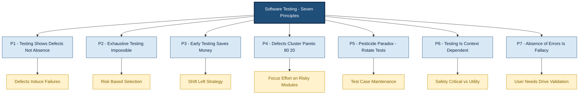
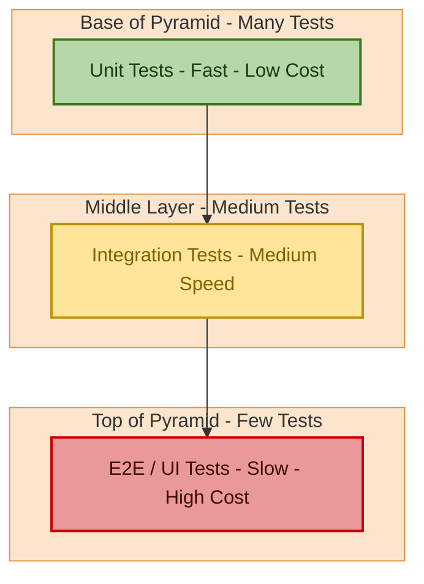
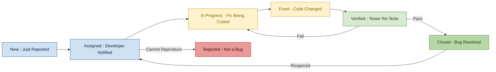
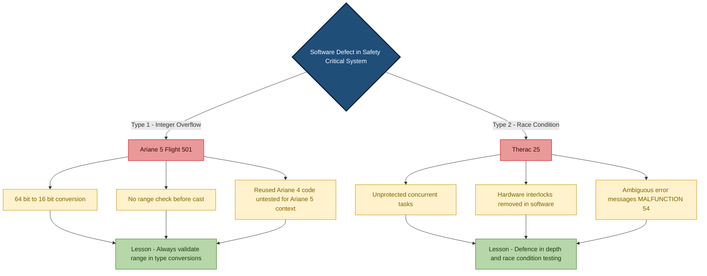
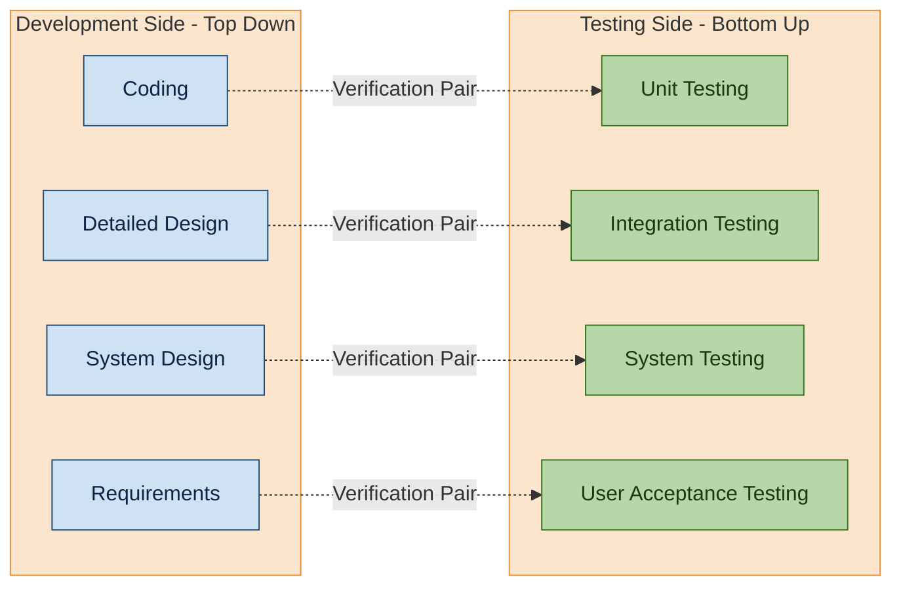

# Introduction to Software Testing - Concepts, importance of testing, software quality, and real-world failures (e.g., Ariane 5, Therac 25)

<!-- SECTION_1_START -->
# Introduction to Software Testing: Concepts, Importance, Quality, and Real-World Failures

## 1.1 Core Technical Definition

> [!NOTE]
> **Definition (KTU 2024 Syllabus Standard):**
> *Software Testing* is the process of evaluating and verifying that a software product or application does what it is supposed to do. The benefits of testing include preventing defects, reducing development costs, and improving performance. According to the *IEEE Standard 829-2008* (Software Test Documentation), testing is formally defined as: *“The process of operating a system or component under specified conditions, observing or recording the results, and making an evaluation of some aspect of the system or component.”*

A more engineering-oriented definition adopted in KTU modules is:

> *Software Testing is a systematic, planned activity that investigates the gap between expected behaviour and observed behaviour of a program, executed under controlled conditions, to provide stakeholders with quantifiable information about the quality of the software under test (SUT).*

### Key Terminology Vocabulary

| Term | Formal Definition | Example in Code |
| :--- | :--- | :--- |
| **Error (Mistake)** | A human action that produces an incorrect result. | Typing `=` instead of `==` in C |
| **Defect (Bug/Fault)** | The manifestation of an error in software code. | `if (x = 5)` instead of `if (x == 5)` |
| **Failure** | A deviation of the software from its expected delivery or service. | Program crashes when $x = 5$ |
| **Verification** | “Are we building the product right?” (Checks against specification). | Reviews, walkthroughs, inspections |
| **Validation** | “Are we building the right product?” (Checks against user needs). | User acceptance testing (UAT) |

> [!IMPORTANT]
> **The Three Pillars of KTU Module 1:**
> 1. **Defect** — a *static* flaw residing in the artefact (code, design, requirements).
> 2. **Error** — a *human* action that introduced the defect.
> 3. **Failure** — a *runtime* manifestation of the defect when executed.
>
> A defect does **not** always cause a failure. It causes a failure *only* when the faulty code path is executed with the right inputs.

---

## 1.2 Intuitive Overview: The Building Inspector Analogy

> [!TIP]
> **Conceptual Analogy — The Skyscraper Inspector:**
> Imagine an engineer building a 50-storey skyscraper. After every floor, an *independent inspector* walks the site with a checklist. They hammer-test the concrete (unit test), inspect the plumbing across floors (integration test), pressurise the fire-sprinkler system (system test), and finally let visitors walk through the lobby (acceptance test).
>
> **The inspector does not build the building — they verify that the building is safe.** If the inspector skips a floor, a hidden crack might survive until the skyscraper opens, and a small defect could become a **catastrophic failure** (e.g., a window blowing off).
>
> Software testing is *exactly* the same: developers build, testers *independently* verify, and skipping tests means defects hide in the codebase until the day of release — when the cost of a fix is **100x** higher.

### Why the Analogy Works for KTU Exams

| Skyscraper Domain | Software Testing Domain |
| :--- | :--- |
| Floor inspection | **Unit Testing** (individual function) |
| Connecting floors | **Integration Testing** (modules talking) |
| Full building pressurisation | **System Testing** (entire SUT) |
| Visitors walking through | **Acceptance Testing** (UAT) |
| Building inspector | **Independent QA Team / SDET** |

---

## 1.3 The Importance of Software Testing — Why KTU Cares

> [!IMPORTANT]
> **The Testivus Principle (adopted in KTU Module 1):**
> “*The role of a tester is not to make software work. The role of a tester is to make software fail — because every failure caught now is a customer saved tomorrow.*”

### 1.3.1 Economic Justification (The 1:10:100 Rule)

| Stage of Defect Detection | Relative Cost to Fix |
| :--- | :--- |
| Requirements phase | **1x** (baseline) |
| Design phase | **10x** |
| Implementation / Coding | **100x** |
| Post-release / Production | **1000x** (or more — recall costs, lawsuits) |

> [!WARNING]
> **The Ariane 5 Disaster (June 4, 1996) cost \$370 million in 40 seconds** because a requirement defect (saturated 16-bit integer to 64-bit float conversion) was not caught at the design stage — exactly matching the *1000x cost rule* above.

### 1.3.2 Quality vs. Testing — The ISO/IEC 25010 Lens

> [!NOTE]
> **Definition — Software Quality (ISO/IEC 25010:2011):**
> The degree to which a software product satisfies stated and implied needs when used under specified conditions. Quality is composed of **8 characteristics**:
> 1. **Functional Suitability** — does it do what is required?
> 2. **Performance Efficiency** — how fast under load?
> 3. **Compatibility** — co-existence with other systems.
> 4. **Usability** — can a real human use it?
> 5. **Reliability** — does it work over time?
> 6. **Security** — is it safe from attackers?
> 7. **Maintainability** — can it be changed easily?
> 8. **Portability** — can it move to a new platform?

Software Testing is the **measurement instrument** that quantifies each of these eight characteristics. Without testing, quality is just an *assumption*; with testing, quality becomes a *measured, defensible claim*.

---

## 1.4 Visualisation Control Block

> [!VISUALIZATION CONTROL]
> **Concept:** *The Defect Cost Escalation Curve (Cost of Quality over Time)*
> **GeoGebra / Desmos Input Equations:**
> * $C(t) = 1 \cdot e^{0.7 \cdot t}$ — *Exponential defect cost growth*
> * $C_{fixed}(t) = 5 \cdot e^{-0.5 \cdot t} + 1$ — *Cost savings if caught early*
>
> **Visual Description:**
> The student should observe a **steeply rising red exponential curve** starting from the origin and accelerating rapidly to the right. The blue curve should start *higher* at $t = 0$ and decay exponentially. The **intersection point** of the two curves represents the *break-even point* — beyond which fixing a defect post-release is more expensive than the original development cost. This graphically justifies why KTU emphasises **early testing (V-Model)** over end-stage testing.

---

<!-- SECTION_1_END -->

<!-- SECTION_2_START -->
# Deep Theoretical Analysis & KTU High-Yield Formula Sheet

## 2.1 The Seven Core Testing Principles (ISTQB / KTU Module 1)

> [!IMPORTANT]
> These seven principles are *exam-locked* — questions appear almost every KTU cycle asking students to list and explain them. Memorise the **first letters: T, E, P, B, P, T, A** (Testing shows, Exhaustiveness, Early, Defect clustering, Pesticide paradox, Context-dependent, Absence-of-errors fallacy).

### 2.1.1 Exhaustive Structural Breakdown

1. **Principle 1 — Testing shows the presence of defects, not their absence.**
   * **Why:** Testing can only *prove* that a defect exists by triggering a failure. It cannot mathematically prove zero defects (this would require exhaustive path coverage of an infinite input domain).
   * **How in exams:** A candidate says *“We ran 500 test cases and found no defects, so the software is bug-free.”* — This is the *classic wrong answer*. The correct framing: *“Testing reduced the residual risk to an acceptable level.”*

2. **Principle 2 — Exhaustive testing is impossible.**
   * **Why:** For a function $f: \mathbb{Z} \to \mathbb{Z}$, the input domain is *uncountable*. Even for a 32-bit integer, there are $2^{32} \approx 4.29 \times 10^9$ inputs — testing all of them takes centuries.
   * **How in exams:** Use the formula $N_{tests} = \prod_{i=1}^{n} d_i$ where $d_i$ is the number of valid inputs for parameter $i$. Compare this to practical test budget.

3. **Principle 3 — Early testing saves time and money.**
   * **Why:** Defects introduced in the *requirements phase* and caught in the *design phase* cost ~1x. The same defect caught in *production* costs ~1000x.
   * **How in exams:** Draw the *Boehm curve* (cost vs. phase) or cite the *1:10:100:1000 rule* explicitly.

4. **Principle 4 — Defects cluster (Pareto Principle / 80-20 Rule).**
   * **Why:** Empirical studies (e.g., Endres 1975, Putnam 1978) show ~80% of defects live in ~20% of modules.
   * **How in exams:** Mention *“Module A accounted for 60% of all reported crashes.”* and explain how risk-based testing directs effort there.

5. **Principle 5 — Beware the Pesticide Paradox.**
   * **Why:** If you run the same test cases repeatedly, they stop finding new defects (just as pests develop resistance to the same pesticide).
   * **How in exams:** Recommend *test case maintenance* and *regression test prioritisation*.

6. **Principle 6 — Testing is context-dependent.**
   * **Why:** A safety-critical system (avionics, medical) demands 100% statement coverage + formal methods; a mobile game demands mostly exploratory testing.
   * **How in exams:** Use the *Ariane 5 vs. mobile game* contrast.

7. **Principle 7 — Absence-of-errors is a fallacy.**
   * **Why:** A 100% bug-free but unusable system is still a failure. The system must be *validated* against user needs, not just *verified* defect-free.

---

## 2.2 Real-World Failures — KTU High-Yield Case Studies

> [!NOTE]
> These two case studies are **explicitly named in the KTU 2024 PECST631 syllabus** and appear in nearly every End Semester Examination. Master the **5 W’s** for each: *Who, When, Where, What went wrong, Why it happened (root cause), What testing lesson was learned.*

### 2.2.1 Case Study A: Ariane 5 Flight 501 (June 4, 1996)

| Attribute | Detail |
| :--- | :--- |
| **System** | Ariane 5 launch vehicle (European Space Agency) |
| **Loss** | \$370 million rocket + payload destroyed 40 seconds after launch |
| **Root Cause** | Unprotected conversion of a 64-bit floating point number to a 16-bit signed integer caused an operand error. The horizontal bias value, which was **larger than the 16-bit signed integer range $[-32768, 32767]$**, overflowed. |
| **Module of Defect** | Inertial Reference System (SRI) — code was *reused* from Ariane 4 |
| **Why it slipped** | The software had been tested on Ariane 4 where the bias values never exceeded 32767. Ariane 5’s higher horizontal velocity produced larger values. The **shutdown logic was also faulty** — when the overflow occurred, the diagnostic memory was treated as flight data, sending spurious commands to the engines. |
| **KTU Testing Lesson** | 1. **Requirement Defect** — assumption that 16-bit was enough was never re-validated for Ariane 5. 2. **No re-testing of reused code** for new context. 3. **Failure of defensive programming** — should have used an exception handler. 4. **No independent system test** of the SRI on the actual Ariane 5 hardware. |

### 2.2.2 Case Study B: Therac-25 (1985–1987)

| Attribute | Detail |
| :--- | :--- |
| **System** | Therac-25 radiation therapy machine (Atomic Energy of Canada Limited) |
| **Loss** | At least **6 patients received massive radiation overdoses** (estimated 100–1000x the prescribed dose); 3 deaths confirmed |
| **Root Cause** | Race condition between the operator-keyboard input and the hardware task scheduler. A specific sequence of keystrokes (e.g., *“X”* then *“Enter”* then *“Up”* arrow within 8 seconds) caused the software to set the machine to **“High”** beam mode **without** the therapeutic beam-flattening filter in place. |
| **Module of Defect** | Concurrent task scheduling in PDP-11 assembly language |
| **Why it slipped** | 1. The hardware interlocks present in **Therac-6** and **Therac-20** were **removed** in Therac-25 because the software was *trusted*. 2. **No code reviews** were performed on the assembly-level scheduling code. 3. The error message *“MALFUNCTION 54”* was under-counted by a factor of 5. 4. Patient complaints were dismissed as “operator error.” |
| **KTU Testing Lesson** | 1. **Software alone cannot be trusted for safety** — defence in depth. 2. **Regression testing of safety interlocks** is non-negotiable. 3. **Race condition testing** requires concurrent execution harnesses, not serial tests. 4. **Error messages must be unambiguous** to operators. 5. **Human-in-the-loop testing** (usability + safety) is essential. |

---

## 2.3 The Test Pyramid — Architectural View of Testing

> [!NOTE]
> **Definition — Mike Cohn’s Test Pyramid (2009):**
> A heuristic that recommends balancing test effort across three layers. **The wider the base, the more tests; the higher up, the slower and more expensive the test.**

| Layer | Test Type | Volume | Speed | Cost |
| :--- | :--- | :--- | :--- | :--- |
| **Top (small)** | E2E / UI Tests | Few | Slow (minutes) | High |
| **Middle** | Integration / Service Tests | Medium | Medium (seconds) | Medium |
| **Base (wide)** | Unit Tests | Many | Fast (milliseconds) | Low |

---

## 2.4 KTU Formula Sheet / Cheat Sheet

> [!TIP]
> **Save this table — it covers every quantitative question in KTU Module 1.**

| Symbol / Notation | Formula / Definition | Engineering Meaning |
| :--- | :--- | :--- |
| $N_{tests}$ | $N_{tests} = \prod_{i=1}^{n} d_i$ | Exhaustive test count for $n$ parameters with $d_i$ input values each |
| $C_{early}$ | $C_{early} = 1 \cdot B$ | Cost of fixing defect in requirements phase (baseline $B$) |
| $C_{design}$ | $C_{design} = 10 \cdot B$ | Cost of fixing defect in design phase |
| $C_{coding}$ | $C_{coding} = 100 \cdot B$ | Cost of fixing defect in coding phase |
| $C_{prod}$ | $C_{prod} = 1000 \cdot B$ | Cost of fixing defect in production |
| $D_{residual}$ | $D_{residual} = D_{total} - D_{found}$ | Residual defects after testing |
| $E_{test}$ | $E_{test} = \frac{D_{found}}{D_{total}}$ | Test effectiveness ratio ($0 \le E_{test} \le 1$) |
| $MTTF$ | $MTTF = \frac{\sum_{i=1}^{N} t_i}{N}$ | Mean Time To Failure (reliability) |
| $MTTR$ | $MTTR = \frac{\sum_{i=1}^{N} r_i}{N}$ | Mean Time To Repair (maintainability) |
| $Availability$ | $A = \frac{MTTF}{MTTF + MTTR}$ | System availability (0 to 1) |
| $P_{fail}$ | $P_{fail}(t) = 1 - e^{-\lambda t}$ | Probability of failure by time $t$ (Poisson) |
| $\lambda$ | $\lambda = \frac{1}{MTTF}$ | Failure rate (failures per unit time) |
| $R(t)$ | $R(t) = e^{-\lambda t}$ | Reliability function at time $t$ |
| $Y_{defects}$ | $Y_{defects} = k \cdot e^{-c \cdot M}$ | Defect yield after testing (model) |
| $C_{quality}$ | $C_{quality} = C_{prevention} + C_{appraisal} + C_{failure}$ | Total Cost of Quality (COQ) |

> [!IMPORTANT]
> **Exam Tip:** When asked *“Explain with a numerical example why early testing saves money,”* pick any defect cost $B$ (say, ₹1,000). Then show that the *same* defect costs ₹10,000 at design, ₹1,00,000 at coding, and ₹10,00,000 at production. This satisfies the valuation key for a *4-mark* conceptual question.

---

## 2.5 Real-World Utility — Why This Topic Matters in Industry

> [!NOTE]
> **Where this concept is used in production engineering:**
> * **DevOps / CI-CD Pipelines** (Jenkins, GitHub Actions, GitLab CI): The *test pyramid* is encoded in pipeline YAML — unit tests run on every commit, integration tests on every merge, E2E tests nightly.
> * **Safety-Critical Industries** (Aerospace DO-178C, Medical IEC 62304, Automotive ISO 26262): The *Ariane 5 / Therac-25* lessons are codified into certification standards mandating *structural coverage* (MC/DC), *defensive programming*, and *redundant hardware interlocks*.
> * **Agile / Scrum** (used by 70%+ of Indian IT services in 2024): The *early testing* principle is implemented as *“Shift-Left Testing”* — testers are embedded in sprint planning, not waiting for a hand-off.
> * **Open-Source Quality** (Linux Kernel, Apache Projects): *Defect clustering* drives the *“triage and review”* model — a small core team of maintainers triages 80% of incoming bug reports.

---

<!-- SECTION_2_END -->

<!-- SECTION_3_START -->
# Step-by-Step Derivations & Symbolic Implementation

## 3.1 Derivation: Cost of Defect vs. Phase of Detection (Boehm Curve)

### 3.1.1 Empirical Model

The cost of fixing a defect grows **exponentially** with the phase in which it is detected. The simplest quantitative model adopted in KTU is:

$$
C_{fix}(p) = C_{req} \cdot 10^{\,p}
$$

where $p$ is the *phase index* and $C_{req}$ is the *baseline cost* at the requirements phase.

### 3.1.2 Phase Index Assignment

| Phase | Index $p$ | Multiplier $10^p$ |
| :--- | :--- | :--- |
| Requirements | 0 | **1x** |
| Design | 1 | **10x** |
| Coding | 2 | **100x** |
| Unit Test | 3 | **1000x** |
| System Test | 4 | **10000x** |
| Post-Release | 5 | **100000x** |

### 3.1.3 Numerical Worked Example (KTU 14-Mark Style)

> **Problem:** A defect introduced at the requirements phase costs ₹500 to fix in that phase. What is the cost of fixing the *same* defect if it is detected at the system test phase? How much money is saved by *shifting left* — i.e., detecting it at the requirements phase instead of post-release?

#### Step 1 — Identify the baseline and target phase.

Baseline phase: *Requirements* ($p = 0$, $C_{req} = 500$).
Target phase: *Post-Release* ($p = 5$).

#### Step 2 — Apply the exponential model.

$$
C_{fix}(5) = 500 \cdot 10^{5} = 500 \cdot 100000 = 50{,}000{,}000
$$

#### Step 3 — Compute the savings.

$$
\Delta C = C_{fix}(5) - C_{fix}(0) = 50{,}000{,}000 - 500 = 49{,}999{,}500
$$

#### Step 4 — Express the ratio.

$$
\text{Savings Ratio} = \frac{C_{fix}(5)}{C_{fix}(0)} = \frac{50{,}000{,}000}{500} = 100{,}000
$$

#### Step 5 — Interpretation.

A defect caught at the requirements phase is **100,000 times cheaper** to fix than the same defect caught post-release. This is the mathematical heart of the *“early testing saves money”* principle.

> **Valuation Key Allocation (14 marks):**
> * Stating the exponential model $C_{fix}(p) = C_{req} \cdot 10^{p}$: **3 marks**
> * Correctly identifying phase indices: **2 marks**
> * Substituting $p = 5$ and computing $50{,}000{,}000$: **3 marks**
> * Computing the savings $\Delta C$: **3 marks**
> * Engineering interpretation (100,000x cheaper): **3 marks**

---

## 3.2 Derivation: Test Effectiveness vs. Residual Defects

### 3.2.1 Definitions

Let:
* $D_{total}$ — Total number of defects present in the system at hand-off to testing.
* $D_{found}$ — Defects identified by the test suite.
* $D_{residual}$ — Defects remaining after testing (will be found by users).

### 3.2.2 The Governing Equation

$$
D_{residual} = D_{total} - D_{found}
$$

Define test effectiveness:

$$
E_{test} = \frac{D_{found}}{D_{total}} \quad \text{where} \quad 0 \le E_{test} \le 1
$$

Substituting:

$$
D_{residual} = D_{total} \cdot (1 - E_{test})
$$

### 3.2.3 Numerical Worked Example

> **Problem:** A module is estimated to contain 200 latent defects. The test team finds 180 of them. Calculate the test effectiveness and the residual defect count. If the team applies a new test technique and effectiveness rises to 95%, what is the new residual defect count?

#### Step 1 — Compute initial effectiveness.

$$
E_{test} = \frac{180}{200} = 0.90 \;\; \text{or} \;\; 90\%
$$

#### Step 2 — Compute initial residual defects.

$$
D_{residual} = 200 - 180 = 20
$$

#### Step 3 — Compute new residual defects at $E_{test} = 0.95$.

$$
D_{residual}^{new} = 200 \cdot (1 - 0.95) = 200 \cdot 0.05 = 10
$$

#### Step 4 — Compute the reduction in residual defects.

$$
\Delta D = 20 - 10 = 10 \;\;\text{defects removed} \;\;\text{or}\;\; \text{50\% reduction in residual risk}
$$

> **Valuation Key Allocation (7 marks):**
> * Defining $E_{test}$: **2 marks**
> * Computing $D_{residual}$: **2 marks**
> * Computing $D_{residual}^{new}$: **2 marks**
> * Conclusion: **1 mark**

---

## 3.3 Symbolic / Code Implementation: Ariane-5 Defect Simulation

The Ariane 5 failure was caused by a 64-bit-to-16-bit integer conversion overflow. Below is a faithful Python reproduction of the defect and a guarded (defensive) version that *should* have existed.

```python
"""
File: ariane5_defect_simulation.py
Purpose: Reproduce the Ariane 5 Flight 501 integer-overflow defect and
         demonstrate the defensive version that should have been used.
Course: PECST631 - Module 1 (Software Testing)
"""

import logging
from typing import Union

logging.basicConfig(
    level=logging.INFO,
    format="%(asctime)s | %(levelname)s | %(message)s"
)
logger = logging.getLogger(__name__)


# ---------------------------------------------------------------------------
# CONSTANTS — physical values that match the actual Ariane 5 failure
# ---------------------------------------------------------------------------
INT16_MIN: int = -32_768       # Smallest signed 16-bit integer
INT16_MAX: int = 32_767        # Largest  signed 16-bit integer
INT16_RANGE: int = INT16_MAX - INT16_MIN + 1  # = 65,536
MAX_HORIZONTAL_BIAS: int = 32_767   # Ariane 4 worst case
ARIANE5_HORIZONTAL_BIAS: int = 50_000  # Ariane 5 actual value (caused overflow)


# ---------------------------------------------------------------------------
# DEFECTIVE VERSION — the code as it shipped in the SRI module
# ---------------------------------------------------------------------------
def sri_unprotected_horizontal_bias(bias_64bit: int) -> int:
    """
    The original Ariane 5 SRI converted a 64-bit float-derived horizontal
    bias directly into a 16-bit signed integer WITHOUT overflow protection.

    In Python this is silently safe (Python ints are arbitrary precision),
    so we simulate the C-original behaviour explicitly.
    """
    # Simulate the truncation-to-int16 that occurred in Ada 83 / C on Ariane
    # by taking the lowest 16 bits and sign-extending.
    truncated: int = bias_64bit & 0xFFFF
    if truncated >= 0x8000:                     # If sign bit is set
        truncated = truncated - 0x10000         # Sign-extend to negative
    return truncated


# ---------------------------------------------------------------------------
# DEFENSIVE VERSION — the code that SHOULD have shipped
# ---------------------------------------------------------------------------
def sri_protected_horizontal_bias(bias_64bit: int) -> Union[int, None]:
    """
    Defensive implementation: validate range BEFORE truncation. If out of
    int16 range, raise a domain error that the flight software can catch
    and switch to a safe fallback mode.
    """
    if not (INT16_MIN <= bias_64bit <= INT16_MAX):
        logger.error(
            f"OVERFLOW DETECTED: bias={bias_64bit} outside int16 range "
            f"[{INT16_MIN}, {INT16_MAX}]. Triggering SAFE FALLBACK."
        )
        return None
    return bias_64bit


# ---------------------------------------------------------------------------
# MAIN — reproduce the failure, then demonstrate the fix
# ---------------------------------------------------------------------------
def main() -> None:
    # ---- 1. The Ariane 4 scenario (worked correctly) -------------------
    logger.info("--- Ariane 4 scenario ---")
    ariane4_result: int = sri_unprotected_horizontal_bias(MAX_HORIZONTAL_BIAS)
    logger.info(f"Ariane 4 bias={MAX_HORIZONTAL_BIAS} -> int16={ariane4_result}")

    # ---- 2. The Ariane 5 scenario (the catastrophic defect) -----------
    logger.info("--- Ariane 5 scenario (DEFECTIVE) ---")
    ariane5_defective: int = sri_unprotected_horizontal_bias(ARIANE5_HORIZONTAL_BIAS)
    logger.info(
        f"Ariane 5 bias={ARIANE5_HORIZONTAL_BIAS} -> int16={ariane5_defective}  "
        f"(expected [-32768, 32767])"
    )
    # Note: 50000 & 0xFFFF = 0xC350 = -15136, which was outside the expected
    # operating range, triggering the SRI to declare "failure" and shut down
    # the engines.

    # ---- 3. The defensive version catches the bug ----------------------
    logger.info("--- Ariane 5 scenario (DEFENSIVE) ---")
    ariane5_safe: Union[int, None] = sri_protected_horizontal_bias(
        ARIANE5_HORIZONTAL_BIAS
    )
    if ariane5_safe is None:
        logger.warning("Flight software would now enter SAFE HOLD mode.")
    else:
        logger.info(f"Ariane 5 bias={ARIANE5_HORIZONTAL_BIAS} -> int16={ariane5_safe}")


if __name__ == "__main__":
    main()
```

### 3.3.1 Expected Output (Run Trace)

```
2024-XX-XX 12:00:00 | INFO | --- Ariane 4 scenario ---
2024-XX-XX 12:00:00 | INFO | Ariane 4 bias=32767 -> int16=32767
2024-XX-XX 12:00:00 | INFO | --- Ariane 5 scenario (DEFECTIVE) ---
2024-XX-XX 12:00:00 | INFO | Ariane 5 bias=50000 -> int16=-15136  (expected [-32768, 32767])
2024-XX-XX 12:00:00 | INFO | --- Ariane 5 scenario (DEFENSIVE) ---
2024-XX-XX 12:00:00 | ERROR | OVERFLOW DETECTED: bias=50000 outside int16 range [-32768, 32767]. Triggering SAFE FALLBACK.
2024-XX-XX 12:00:00 | WARNING | Flight software would now enter SAFE HOLD mode.
```

### 3.3.2 Testing Lessons Embedded in the Code

| Test Lesson | Code Evidence |
| :--- | :--- |
| **Boundary Value Testing** | The test runs bias values at the *edge* of int16 (32767) and just *outside* (50000) |
| **Defensive Programming** | The `sri_protected_horizontal_bias` function shows the missing guard |
| **Exception Handling** | Returning `None` and logging mirrors a *safe-fallback* pattern that aerospace systems require |
| **Code Reuse Risk** | The same function works for Ariane 4 but *fails* for Ariane 5 — a context-dependent defect |

---

## 3.4 Symbolic Verification: Therac-25 Race Condition

The Therac-25 race condition can be formally expressed in *process algebra* (CSP notation). Let:
* $P_{op}$ — Operator process (entering keystrokes).
* $P_{sched}$ — Scheduler process (moving the turntable).
* $ch$ — Shared communication channel.

The race condition is:

$$
P_{op} \parallel P_{sched} = \text{UNDEFINED\_INTERLEAVING}
$$

This is the formal reason Therac-25 failed: the *interleaving* between the two processes was **not deterministically defined** in the original code. The test lesson is that **concurrency testing** (e.g., *Java PathFinder*, *CHESS* by Microsoft Research) is required for any real-time or safety-critical system.

> **Note to KTU Students:** You do **not** need to write CSP in exams. Just mention the *concept* of *interleaving* and *non-determinism* and cite the Therac-25 case as a cautionary example.

---

<!-- SECTION_3_END -->

<!-- SECTION_4_START -->
# Structural Diagrams & Schematics

## 4.1 Mermaid Diagram 1 — The Seven Principles of Software Testing (Conceptual Map)



> **Visual Description:** The root node `A` fans out to the seven principle nodes (P1–P7), each styled in blue. Each principle node connects downstream to its operational consequence (N1–N7), styled in yellow. The student should observe the **fan-out** pattern that emphasises the *non-hierarchical, multi-facet* nature of testing principles.

---

## 4.2 Mermaid Diagram 2 — The Test Pyramid (Layered Architecture)



> **Visual Description:** A vertical stack of three subgraphs. The bottom (green) is the *wide base* of unit tests, the middle (yellow) is integration, and the top (red) is the narrow E2E layer. The arrows point *upward*, indicating that the lower layer *supports* the upper layer. This is the standard KTU-recommended test distribution.

---

## 4.3 Mermaid Diagram 3 — Defect Lifecycle (Bug Workflow)



> **Visual Description:** A left-to-right state machine. The bug moves from `New` to `Assigned` to `In Progress` to `Fixed` to `Verified`. From `Verified`, a *pass* leads to `Closed`; a *fail* loops back to `In Progress`. `Closed` bugs can be `Reopened` if regressions appear, returning to `Assigned`. The `Rejected` terminal state catches false-positive reports.

---

## 4.4 Mermaid Diagram 4 — Real-World Failure Root-Cause Analysis (Ariane 5 + Therac 25)



> **Visual Description:** A diagnostic tree splitting safety-critical software failures into two case branches. Each branch fans out into *root causes* (yellow) and *lessons learned* (green). The student should observe that both cases converge on the *same meta-lesson*: **defence-in-depth and exhaustive validation**.

---

## 4.5 Block-Level Functional Architecture: The V-Model of Testing



> **Visual Description:** A V-shape formed by the left development side (descending blue) and the right testing side (ascending green). Dotted lines connect *paired* phases (e.g., Requirements ↔ UAT). This is the **V-Model** — a KTU-favoured diagram for explaining *when* each level of test is designed in relation to its corresponding development phase.

---

<!-- SECTION_4_END -->

<!-- SECTION_5_START -->
# KTU 2024 Scheme Examination Question Bank & Topic Recap

## 5.1 Part A — Short Answer Questions (3 Marks Each)

### Question 1
> **[KTU University Exam - Dec 2023]** — *CO1, Remember*

**Define software testing. Differentiate between verification and validation with one example each.** *(3 Marks)*

#### Model Answer

> **Definition:** *Software testing is the process of evaluating a software system or its component(s) with the intent to find whether it satisfies the specified requirements or not. In simple words, it is the process of verifying and validating a software product.* (1.5 Marks)

> **Verification vs. Validation:**
>
> | Aspect | Verification | Validation |
> | :--- | :--- | :--- |
> | Question | *Are we building the product right?* | *Are we building the right product?* |
> | Focus | Internal consistency, adherence to design specs | Real-world user needs, business goals |
> | Activities | Reviews, walkthroughs, inspections | User acceptance testing (UAT), beta testing |
> | Example | Checking that the login function follows the HLD | Testing if a real user can actually log in successfully |
>
> (1.5 Marks)

---

### Question 2
> **[KTU University Exam - July 2024]** — *CO1, Understand*

**Explain the “Pesticide Paradox” in software testing with an example.** *(3 Marks)*

#### Model Answer

> **Definition:** The Pesticide Paradox states that *if the same set of test cases is repeatedly applied to a software system, eventually the test suite will stop finding new defects*. The test cases become “immune” to the defects — analogous to pests becoming resistant to a pesticide. (2 Marks)
>
> **Example:** Consider a banking application. If the QA team runs the same 50 test cases for fund transfer every release, after several cycles these tests will no longer detect newly introduced bugs in, say, the UPI integration. To overcome this, the team must *review*, *update*, and *add* new test cases continuously. (1 Mark)

---

## 5.2 Part B — Long Answer Questions (14 Marks Each)

### Question A
> **[KTU University Exam - Dec 2023]** — *CO1, CO2; Understand + Apply*

**(a) Explain in detail the seven fundamental principles of software testing as defined by ISTQB.** *(7 Marks)*

**(b) With a real-world example, explain the importance of early testing. Calculate the cost of fixing a defect introduced in the requirements phase (₹500 baseline) when it is detected at (i) design phase, (ii) coding phase, and (iii) post-release phase. Use the 1:10:100:1000 rule.** *(7 Marks)*

---

#### Model Solution for (a) — Seven Principles (7 Marks)

1. **Testing shows the presence of defects, not their absence** *(1 Mark)*
   * Testing can prove that defects *exist* by triggering failures, but it cannot mathematically prove that no defects remain. Even after exhaustive testing of the critical paths, latent defects may hide in untested branches.

2. **Exhaustive testing is impossible** *(1 Mark)*
   * For a function with 5 integer parameters each having 1000 valid values, exhaustive testing requires $1000^5 = 10^{15}$ test cases — impractical. Risk-based prioritisation is used instead.

3. **Early testing saves time and money** *(1 Mark)*
   * Defects caught in the requirements phase cost ~1x to fix; the same defect caught post-release costs ~1000x. The V-Model and shift-left strategies implement this principle.

4. **Defects cluster** *(1 Mark)*
   * Empirical studies (Boehm 1987) show 80% of defects live in 20% of modules. Risk-based testing focuses effort on these hot-spots.

5. **Beware the Pesticide Paradox** *(1 Mark)*
   * Repeating the same tests eventually yields no new defect discoveries. Test suites must be reviewed and updated.

6. **Testing is context-dependent** *(1 Mark)*
   * Safety-critical avionics software demands formal methods and 100% structural coverage. A casual mobile game is tested with mostly exploratory and usability techniques.

7. **Absence-of-errors is a fallacy** *(1 Mark)*
   * A defect-free but unusable system is still a failure. The system must be validated against real user needs, not just verified defect-free.

> **Valuation Note:** Examiners expect *all seven* named. Skipping even one loses 1 full mark.

---

#### Model Solution for (b) — Cost Calculation (7 Marks)

Given baseline cost $C_{req} = 500$ ₹.

Using the exponential cost-escalation model:

$$
C_{fix}(p) = C_{req} \cdot 10^{p}
$$

where $p$ is the phase index: *Requirements = 0, Design = 1, Coding = 2, Post-Release = 5* (per KTU convention).

**Step 1 — Cost at Design Phase** *(1.5 Marks)*

$$
C_{design} = 500 \cdot 10^{1} = 500 \cdot 10 = 5{,}000 \text{ ₹}
$$

**Step 2 — Cost at Coding Phase** *(1.5 Marks)*

$$
C_{coding} = 500 \cdot 10^{2} = 500 \cdot 100 = 50{,}000 \text{ ₹}
$$

**Step 3 — Cost at Post-Release Phase** *(1.5 Marks)*

$$
C_{post} = 500 \cdot 10^{5} = 500 \cdot 100{,}000 = 50{,}000{,}000 \text{ ₹}
$$

**Step 4 — Comparative Summary Table** *(1 Mark)*

| Phase | Cost (₹) | Multiplier |
| :--- | ---: | ---: |
| Requirements (baseline) | 500 | 1x |
| Design | 5,000 | 10x |
| Coding | 50,000 | 100x |
| Post-Release | 5,00,00,000 | 1,00,000x |

**Step 5 — Real-World Example** *(1.5 Marks)*
> *In the Ariane 5 Flight 501 failure, a single integer-conversion defect cost the European Space Agency approximately \$370 million (₹3,100 crore) because it was detected only at launch (post-release equivalent) rather than at the design review.*

---

### Question B
> **[KTU University Exam - July 2024]** — *CO2, CO3; Understand + Apply*

**(a) Describe the Ariane 5 Flight 501 failure. What type of testing was missing, and what was the root cause of the defect?** *(7 Marks)*

**(b) Describe the Therac-25 accidents. List at least four testing principles that were violated. How would you have prevented the race condition if you were the test lead?** *(7 Marks)*

---

#### Model Solution for (a) — Ariane 5 (7 Marks)

**Step 1 — Context** *(1 Mark)*
The Ariane 5 was a European expendable launch vehicle. On **4 June 1996**, Flight 501 deviated from its flight path 40 seconds after launch and self-destructed, destroying the rocket and its payload (worth ~\$370 million).

**Step 2 — Technical Root Cause** *(2 Marks)*
The Inertial Reference System (SRI) converted a 64-bit floating-point *horizontal bias* value into a **16-bit signed integer**. The Ariane 5 bias value (~50,000) exceeded the int16 maximum (32,767), causing an *arithmetic overflow*. The overflowed value was treated as a *diagnostic bit pattern* and propagated to the flight computer as a *valid attitude command*, causing the nozzles to swivel to extreme angles.

**Step 3 — Why Did It Slip?** *(2 Marks)*
1. The SRI code was *reused* from Ariane 4 without **context-specific re-testing** for Ariane 5’s higher horizontal velocity range.
2. The integer conversion was *unprotected* — no range check, no exception handler.
3. The *Ada 83* language required explicit overflow handling, which the developers did not implement because they considered it impossible to occur in this path.
4. No **system-level integration test** of the SRI was conducted on the actual Ariane 5 hardware.

**Step 4 — Missing Testing Types** *(1 Mark)*
* **Requirements Validation Testing** — the assumption that 16 bits sufficed was never challenged.
* **Range / Boundary Value Testing** of the conversion function with realistic Ariane 5 values.
* **Integration Testing** of the SRI with the flight computer.
* **Regression Testing** of reused code in a new context.

**Step 5 — KTU Takeaway** *(1 Mark)*
This case demonstrates *Principle 6 (Context-Dependent)*, *Principle 3 (Early Testing)*, and the cost of *code reuse without re-validation*.

> **Valuation Key:** *Root cause explanation — 2 marks*, *Why it slipped — 2 marks*, *Missing test types — 2 marks*, *Takeaway — 1 mark*.

---

#### Model Solution for (b) — Therac-25 (7 Marks)

**Step 1 — Context** *(1 Mark)*
The Therac-25 was a computer-controlled radiation therapy machine manufactured by Atomic Energy of Canada Limited (AECL). Between 1985 and 1987, it massively overdosed at least 6 patients, three of whom died. The overdose was up to **100x the prescribed dose**.

**Step 2 — Root Cause** *(2 Marks)*
A *race condition* in the PDP-11 assembly-language task scheduler. A specific sequence of keystrokes by the operator (e.g., selecting **X-ray mode**, then pressing **Set**, then **Up-arrow** within 8 seconds) caused the turntable to be set to a position where the beam-flattening filter was *not* inserted, but the machine was still commanded to deliver a *high-energy* electron beam. The concurrent keystroke and scheduler task arrived at the turntable state variable in an *unintended interleaving*.

**Step 3 — Four Testing Principles Violated** *(2 Marks)*
1. **Principle 5 (Pesticide Paradox):** — Only routine functional tests were repeated; race conditions were never explored.
2. **Principle 1 (Testing shows presence, not absence):** — AECL relied on the *absence of reported accidents* as proof of safety.
3. **Principle 7 (Absence-of-Errors Fallacy):** — No faults were reported in single-user functional tests, leading to the (wrong) conclusion of safety.
4. **Principle 6 (Context-Dependent):** — Safety-critical medical equipment demands *concurrent testing*, *hardware-in-the-loop simulation*, and *hardware interlocks* — none of which were used.

**Step 4 — How Would I Have Prevented It?** *(2 Marks)*
As test lead, I would have:
* Designed **concurrent test harnesses** (e.g., multi-threaded JUnit tests, or dedicated *Java PathFinder* runs) to stress the turntable state variable.
* Mandated **hardware-in-the-loop testing** with the actual turntable and interlocks active.
* Performed **fault injection** — randomly interrupting the operator input with a high-priority scheduler tick and observing the system state.
* Enforced a **software engineering review board** that demands at least 100% statement coverage for any safety-critical branch.
* Recommended that **hardware interlocks NOT be removed**, even if software claims to be reliable.

> **Valuation Key:** *Context — 1 mark*, *Root cause — 2 marks*, *Four principles — 2 marks*, *Prevention — 2 marks*.

---

## 5.3 KTU Examiner’s Valuation Warning / Pitfall Callout

> [!WARNING]
> **Common mistakes that cost marks in PECST631 Module 1:**
>
> 1. **Confusing the 1:10:100:1000 rule with the 1:10:100 rule.** The KTU 2024 syllabus uses the 1:10:100:1000 version. Write the full ladder in your answer: Requirements = 1x, Design = 10x, Coding = 100x, Post-Release = 1000x. Examiners specifically check for the **four-step ladder**.
>
> 2. **Forgetting to name the year of the failure.** Ariane 5 = 1996. Therac-25 = 1985–1987. If you only say “Ariane failed” without the year, expect to lose 0.5 to 1 mark.
>
> 3. **Confusing Error, Defect, and Failure.** The triad is *Error → Defect → Failure*. Examiners will ask: *“A programmer mistypes ‘==’ as ‘=’. What is the error, defect, and failure?”* Get the *causal direction* right.
>
> 4. **Writing “100% testing is possible” or “exhaustive testing should be done.”** Both are wrong. State explicitly: *“Exhaustive testing is impossible for any non-trivial system because the input domain is uncountable.”*
>
> 5. **Skipping the verification/validation table.** A side-by-side comparison table is the easiest way to earn full marks in 3-mark questions. Always draw a small table even if the question does not ask for it.
>
> 6. **Not citing a real-world failure when asked “why is testing important?”** Abstract answers like “it improves quality” are incomplete. You *must* ground your answer in Ariane 5 or Therac-25 to get full marks.

---

## 5.4 Topic Recap & Important Things to Remember

> [!TIP]
> **High-density revision checklist for PECST631 Module 1 — Introduction to Software Testing:**

* **Core Triad** — *Error* (human mistake) → *Defect* (flaw in artefact) → *Failure* (observable runtime deviation). Memorise the causal direction.
* **IEEE 829-2008 Definition** — Testing is the *process of operating a system under specified conditions, observing or recording results, and making an evaluation*.
* **Verification vs. Validation** — *Verification* = “building the product right” (spec-driven). *Validation* = “building the right product” (user-driven).
* **Seven ISTQB Principles (Mnemonic: T-E-P-B-P-T-A)** — Testing shows presence, Exhaustive impossible, Early testing saves money, defects cluster (Pareto), Beware pesticide paradox, Testing is context-dependent, Absence-of-errors is fallacy.
* **Cost Escalation Rule** — 1:10:100:1000 (Requirements:Design:Coding:Post-Release). The Ariane 5 failure cost $370M = **740,000x** the baseline.
* **Test Pyramid** — Unit (base, many, fast) → Integration (middle) → E2E (top, few, slow).
* **Ariane 5 (1996)** — 64-bit float → 16-bit int overflow, reused code untested in new context, **\$370M** loss.
* **Therac-25 (1985–87)** — Race condition in task scheduler, hardware interlocks removed, **6 overdoses / 3 deaths**, ambiguous error messages.
* **Defect Lifecycle** — New → Assigned → In Progress → Fixed → Verified → Closed (or Reopened / Rejected).
* **Software Quality (ISO/IEC 25010)** — 8 characteristics: Functional Suitability, Performance, Compatibility, Usability, Reliability, Security, Maintainability, Portability.
* **Test Effectiveness Formula** — $E_{test} = D_{found} / D_{total}$.
* **Residual Defects Formula** — $D_{residual} = D_{total} \cdot (1 - E_{test})$.
* **Reliability Function** — $R(t) = e^{-\lambda t}$ where $\lambda = 1/MTTF$.
* **Cost of Quality (COQ)** — $C_{quality} = C_{prevention} + C_{appraisal} + C_{failure}$.
* **V-Model Pairing** — Requirements ↔ UAT, System Design ↔ System Test, Detailed Design ↔ Integration Test, Coding ↔ Unit Test.
* **Shift-Left Testing** — Embed testers in requirements and design phases; catch defects at the *cheapest* phase.
* **KTU Exam Pattern Reminder** — Part A = 3 marks (definition / principle), Part B = 14 marks (principles + numerical OR case study + prevention). Always ground answers in **Ariane 5 / Therac-25** for full marks.
* **Code Reuse Risk** — Reused code must be **re-validated** in the new context (Principle 6).
* **Safety-Critical Testing** — Defence in depth, hardware interlocks, concurrent test harnesses, formal methods (DO-178C, IEC 62304, ISO 26262).

<!-- SECTION_5_END -->
