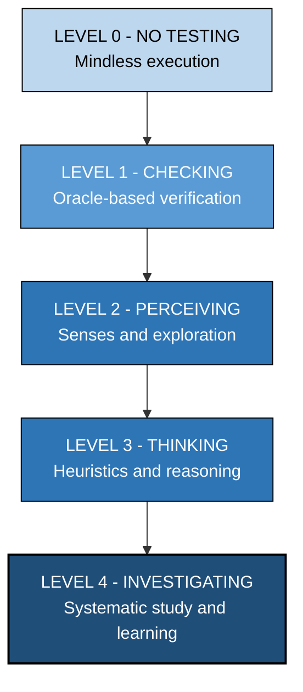
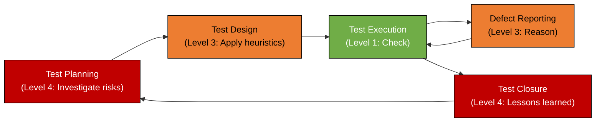
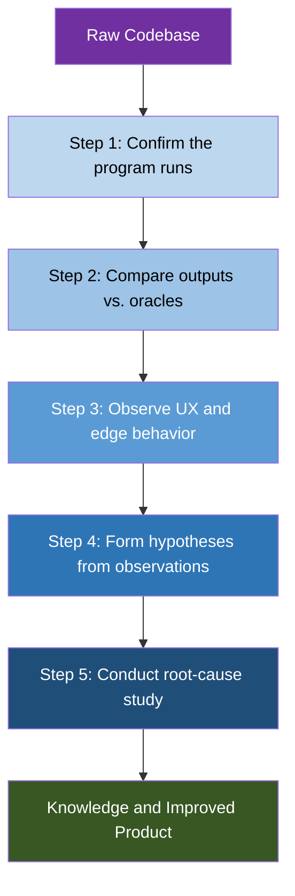
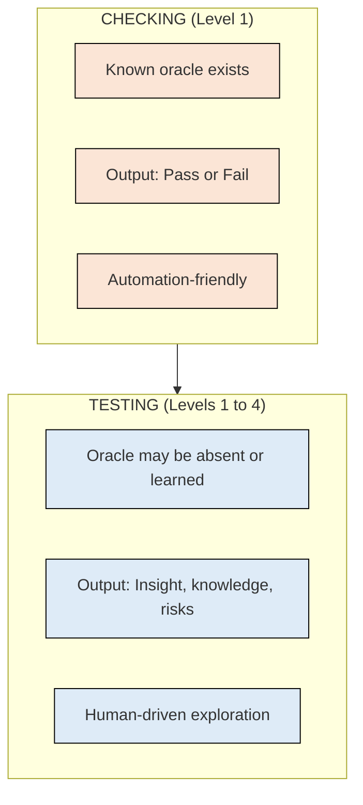

# Software Testing Processes - Levels of thinking in testing

<!-- SECTION_1_START -->
# Software Testing Processes: Levels of Thinking in Testing

## 1. Core Technical Definition & Intuitive Overview

> [!IMPORTANT]
> **KTU 2024 Syllabus Definition (PECST631 - Module 1):**
> *Levels of thinking in testing* refers to the **cognitive depth and intent** with which a tester engages with a software product. It moves a tester from passive, mechanical **checking** to active, exploratory **investigating** — covering the spectrum of reasoning skills applied while validating a system.

### 1.1 The Formal Definition
According to the **Context-Driven School of Testing** (James Bach & Michael Bolton), testing is not a single activity. A tester operates across **five hierarchical levels of thinking**, each representing a deeper cognitive commitment to learning the product and exposing its weaknesses.

| Level | Name | Core Activity |
|:----:|:-----|:--------------|
| **0** | No Testing / Debugging | Mindless execution |
| **1** | Checking | Verify against known oracle |
| **2** | Perceiving | Explore with senses |
| **3** | Thinking | Apply heuristics & reasoning |
| **4** | Investigating | Learn, study, adapt |

### 1.2 Conceptual Analogy — "The Doctor vs. The Thermometer"
Imagine a patient walks into a clinic:
- A **thermometer** simply *checks* if the temperature exceeds **98.6 °F** — it compares actual to expected. (**Level 1**)
- A **junior doctor** *perceives* the symptoms — listens to breathing, looks at skin tone. (**Level 2**)
- A **senior doctor** *thinks* — applies heuristics like *"fever + cough + travel history = suspect X"*. (**Level 3**)
- A **medical researcher** *investigates* — runs clinical studies, reads journals, forms new hypotheses. (**Level 4**)

Similarly, a tester transitions from a **script-executing machine** (Level 1) to a **knowledgeable investigator** (Level 4).

> [!NOTE]
> **Syllabus Highlight:** The KTU question papers frequently test the *distinction between Checking and Testing* and ask students to *map scenarios to a specific level of thinking*. Always quote the Bach–Bolton model in your answers.

### 1.3 The Famous Bach–Bolton Axiom

$$\text{Testing} \;=\; \text{Checking} \;+\; \text{Learning} \;+\; \text{Investigating} \;+\; \text{Critical Thinking}$$

Checking is only a **sub-set** of testing — it is a *necessary* but *not sufficient* activity.

### 1.4 GeoGebra / Visual Integration

> [!VISUALIZATION CONTROL]
> **Concept:** Hierarchical pyramid of cognitive depth in testing
> **Conceptual Mapping (draw on paper / whiteboard):**
> * Apex (narrow, deep): `Level 4 — Investigating`
> * `Level 3 — Thinking`
> * `Level 2 — Perceiving`
> * `Level 1 — Checking` (widest base)
> * `Level 0 — No Testing` (foundation)
> **Visual Description:** A pyramid where the *base represents the largest volume of work* (mechanical checking) and the *apex represents the deepest insight* (investigating). A skilled tester should be able to move *both up and down* this pyramid as the project demands.

---

<!-- SECTION_2_START -->
# 2. Deep Theoretical Analysis & KTU High-Yield Formula Sheet

## 2.1 The Five Levels — Detailed Breakdown

### 🔹 Level 0: No Testing / Debugging
- **What it is:** Mindless execution of code to confirm "it runs."
- **Mindset:** *"I just want the program to start."*
- **Risk:** The tester adds **zero intellectual value** — they are only confirming that the system does not crash.
- **When it occurs:** In startups, junior teams, or when time is grossly misallocated.
- **Engineering Implication:** Equivalent to running `print("Hello World")` and calling it "validation."

### 🔹 Level 1: Checking
- **Definition (Formal):** The process of making a **non-trivial, falsifiable evaluation** of a software product against an **oracle** (a mechanism that decides pass/fail).
- **Characteristics:**
  - **Deterministic** — given the same input, the same output is expected.
  - **Automated-friendly** — can be encoded in test cases.
  - **Conformity-focused** — does the system match specifications?
- **Example:** A unit test asserts that `add(2, 3) == 5`.

$$C_{oracle} \;=\; \begin{cases} \text{PASS} & \text{if } A(s) \equiv E(s) \\ \text{FAIL} & \text{otherwise} \end{cases}$$

where $A(s)$ = Actual software behavior, $E(s)$ = Expected behavior.

### 🔹 Level 2: Perceiving
- **Definition:** Engaging the **senses** to notice what the product *feels*, *looks*, or *sounds* like — beyond what the specification dictates.
- **Techniques:** Exploratory testing sessions, **Session-Based Test Management (SBTM)**, charters.
- **Example:** *"The login page takes 4 seconds — it feels sluggish; the alignment is 2 px off on Firefox."*
- **KTU Buzzwords:** Discovery, observation, sense-making.

### 🔹 Level 3: Thinking
- **Definition:** Applying **heuristics, models, and critical reasoning** to interpret perceived signals and to design smarter test strategies.
- **Heuristics Examples:**
  - **CRUD** — Create, Read, Update, Delete coverage.
  - **HICCUPPS** — History, Image, Comparable, Claims, User expectations, Product, Purpose, Statutes.
  - **San Francisco streets heuristic** — What happens when the user goes "off the grid"?
- **Example:** A tester notices (Level 2) that discount calculation is "off," and then *reasons* (Level 3) that it might be due to boundary conditions in the tax module on leap years.

### 🔹 Level 4: Investigating
- **Definition:** A **systematic, deep study** of the product, the project, and the failure modes — generating *new knowledge* for stakeholders.
- **Activities:**
  - Reading requirement documents with a critical eye.
  - Interviewing users and developers.
  - Running root-cause analysis (RCA) using **5 Whys** or **Ishikawa diagrams**.
  - Building mental models of the system.
- **Outcome:** The tester becomes a **quality advisor**, not a defect finder.

## 2.2 KTU High-Yield Formula Sheet

> [!NOTE]
> **Critical for KTU Board Exam Answer Writing.** Memorize the *definitions* and *examples* — questions are descriptive.

| Level | Mindset | Output | Automation | Example |
|:----:|:--------|:-------|:-----------|:--------|
| **0** | Reactive | "It runs" | N/A | Pressing *Start* on an .exe file |
| **1** | Verifying | Pass / Fail | Fully automatable | `assertEquals(expected, actual)` |
| **2** | Sensing | Observations, notes | Partially | "UI looks broken on Safari" |
| **3** | Reasoning | Hypothesis, model | Difficult | "Bug occurs only on leap-day" |
| **4** | Studying | New knowledge, RCA | Human-led | Writing a risk analysis report |

## 2.3 The Testing Process (Macro View)
A complete testing process follows:

$$\text{Test Planning} \;\rightarrow\; \text{Test Design} \;\rightarrow\; \text{Test Execution} \;\rightarrow\; \text{Defect Reporting} \;\rightarrow\; \text{Test Closure}$$

Each phase requires **a different blend** of the five thinking levels.

| Process Phase | Dominant Thinking Level |
|:--------------|:------------------------|
| Test Planning | Level 4 (Investigating risk) |
| Test Design | Level 3 (Thinking — heuristics) |
| Test Execution | Level 1 (Checking) + Level 2 (Perceiving) |
| Defect Reporting | Level 3 (Thinking) |
| Test Closure | Level 4 (Investigating — lessons learned) |

## 2.4 Real-World Engineering Utility
- **Agile/Scrum teams** rely on Levels 2–4 because specifications are incomplete.
- **Regulated industries** (medical devices, avionics — DO-178C) demand Level 1 compliance for certification.
- **DevOps pipelines** automate Level 1 (CI/CD test gates), freeing humans for Levels 3–4.
- **Production Engineering:** Incident post-mortems at Google, Amazon, and Netflix follow the **Level 4 Investigating** pattern.

---

<!-- SECTION_3_START -->
# 3. Step-by-Step Derivations, Worked Examples & Symbolic Implementation

## 3.1 Mapping a Real Scenario Across All Five Levels

> **Worked Scenario (KTU Board Style):**
> *"A user complains that the 'Apply Coupon' feature on a shopping website fails on the first attempt but works on the second attempt."*

### Level 0 — No Testing
The team simply *runs* the application and assumes everything is fine.
**Action:** Open the page; if no crash, mark "done."
**Outcome:** Zero insight into the defect.

### Level 1 — Checking
Write an **automated test** that applies the coupon and verifies the discount.

```python
import pytest
from typing import Optional


def apply_coupon(cart_total: float, coupon_code: str) -> float:
    """Discount logic under test."""
    if not cart_total or not coupon_code:
        return cart_total
    # Simulated first-attempt-fail behavior
    if cart_total == 999.0 and coupon_code == "SAVE10":
        return cart_total  # BUG: should be 899.10
    return cart_total * 0.9


@pytest.mark.parametrize(
    "total, code, expected",
    [
        (1000.0, "SAVE10", 900.0),
        (999.0, "SAVE10", 899.10),  # boundary that fails
    ],
)
def test_coupon_application(total: float, code: str, expected: float) -> None:
    """Level 1: deterministic oracle-based check."""
    result: float = apply_coupon(total, code)
    assert result == expected, f"Expected {expected}, got {result}"
```

**Outcome:** The `pytest` run **fails** on the boundary case — the bug is *detected* by a falsifiable oracle.

### Level 2 — Perceiving
The tester manually explores the UI and notices:
- The page **flickers** when the coupon is first applied.
- The browser console shows a **delayed network call** (visible only in DevTools).
- The visual layout shifts because a *toast notification* is rendered after the API resolves.

These observations are *not in any spec* but are *quality signals*.

### Level 3 — Thinking
Apply heuristics to form a hypothesis:

| Heuristic Applied | Reasoning |
|:------------------|:----------|
| **Boundary (HICCUPPS)** | The bug appears at total $\approx 999$ — a *just-under* the free-shipping threshold. |
| **Interference** | A *race condition* exists between the coupon API and the shipping recalculation. |
| **State transition** | The cart enters an *invalid intermediate state* during the first click. |

**Hypothesis formed:** *"The bug is a race condition between two async network calls when the cart total is just below a threshold."*

### Level 4 — Investigating
The tester:
1. Reads the **frontend source code** → finds two `await` calls without `Promise.all` sequencing.
2. Conducts a **5-Whys analysis** with the developer.
3. Reviews the **git blame** of `cartService.ts` → finds the race condition was introduced in a hotfix 3 weeks ago.
4. Writes a **risk report** recommending async-sequence refactoring and adds **integration tests** for the new order of operations.

**Outcome:** A new organizational learning — *not just a bug fix*.

## 3.2 Algorithm: Choosing the Right Level of Thinking

```python
from enum import Enum
from typing import Tuple


class ThinkingLevel(Enum):
    """The five levels of thinking in software testing."""
    NO_TESTING = 0
    CHECKING = 1
    PERCEIVING = 2
    THINKING = 3
    INVESTIGATING = 4


def choose_thinking_level(
    has_oracle: bool,
    spec_complete: bool,
    time_available_hours: float,
    domain_is_regulated: bool,
) -> Tuple[ThinkingLevel, str]:
    """Select appropriate cognitive level for a testing task.

    Args:
        has_oracle: True if a reliable pass/fail reference exists.
        spec_complete: True if requirements are stable and documented.
        time_available_hours: Time budget for the task.
        domain_is_regulated: True for medical/avionics/finance.

    Returns:
        A tuple of (recommended level, justification).
    """
    # Level 1: ideal for automated, deterministic checks
    if has_oracle and spec_complete and time_available_hours >= 1.0:
        return ThinkingLevel.CHECKING, "Automate deterministic oracle checks."

    # Regulated domains must demonstrate Level 1 compliance
    if domain_is_regulated and not has_oracle:
        return ThinkingLevel.PERCEIVING, "Build oracle from regulations first."

    # Heuristic reasoning when oracle is fuzzy
    if has_oracle is False and time_available_hours >= 4.0:
        return ThinkingLevel.THINKING, "Apply heuristics to find a usable oracle."

    # Deep dive when systemic learning is needed
    if time_available_hours >= 16.0:
        return ThinkingLevel.INVESTIGATING, "Conduct systematic study & RCA."

    # Default: level 0 fallback
    return ThinkingLevel.NO_TESTING, "No testing recommended under these constraints."
```

## 3.3 Derivation of the "Testing $\neq$ Checking" Principle

Let:
- $T$ = the set of all activities under the umbrella of **Testing**.
- $C$ = the set of activities classified as **Checking**.

By definition (Bach & Bolton, 2013):

$$C \;\subseteq\; T$$

That is, **Checking is a strict sub-set** of Testing. The set difference $T \setminus C$ contains:
- Exploratory perception
- Heuristic reasoning
- Investigative learning
- Critical thinking about the product

$$T \setminus C \;=\; \{ \text{Perceiving} \;\cup\; \text{Thinking} \;\cup\; \text{Investigating} \}$$

Therefore:

$$\mid T \mid \;=\; \mid C \mid \;+\; \mid \text{Perceiving} \mid \;+\; \mid \text{Thinking} \mid \;+\; \mid \text{Investigating} \mid$$

**Conclusion:** A tester who *only* automates assertions is performing **less than 30%** of what testing actually demands.

---

<!-- SECTION_4_START -->
# 4. Structural Diagrams & Schematics

## 4.1 The Five-Levels Pyramid (Mermaid Flowchart)



## 4.2 The Testing Process Lifecycle



## 4.3 Sequential Processing Topology — Cognitive Skill Build-Up



## 4.4 Comparative Block Diagram — Checking vs. Testing



> [!NOTE]
> **Mermaid Safety Note:** All node IDs are alphanumeric, all labels use raw uppercase text inside double quotes, and no markdown formatting is embedded in the labels — this guarantees clean rendering across GitHub, VS Code, and Confluence.

---

<!-- SECTION_5_START -->
# 5. KTU 2024 Scheme Examination Question Bank & Topic Recap

## 📘 Part A — 3 Mark Questions (Short Answer)

### Q1. [KTU University Exam – Dec 2023] | CO1 | Remember

**Differentiate between *Checking* and *Testing* in software engineering.**

**Model Answer (Valuation Key):**

| Aspect | Checking | Testing |
|:-------|:---------|:--------|
| **Definition** | Verifying that a system meets a known expected outcome (oracle). | An investigative process to learn about the product and find problems. |
| **Cognitive Level** | Level 1 (mechanical) | Levels 1–4 (cognitive spectrum) |
| **Output** | Pass / Fail | Insights, risks, knowledge |
| **Automation** | Fully automatable | Partially automatable |
| **Origin** | James Bach & Michael Bolton, 2013 | Same |
| **Scope** | Sub-set of testing | Super-set that includes checking |

**[Defining Checking: 1 Mark], [Defining Testing: 1 Mark], [Three valid distinctions: 1 Mark]**

---

### Q2. [KTU University Exam – July 2024] | CO1 | Understand

**List the five levels of thinking in software testing and state one example for each.**

**Model Answer:**

1. **Level 0 — No Testing:** Just running the program without validation. *Example:* Clicking "Build & Run" and assuming success.
2. **Level 1 — Checking:** Comparing actual vs. expected using an oracle. *Example:* Asserting `2 + 2 == 4`.
3. **Level 2 — Perceiving:** Using senses to notice issues. *Example:* Observing that the UI button is misaligned.
4. **Level 3 — Thinking:** Applying heuristics. *Example:* Using **CRUD** heuristic to cover all data operations.
5. **Level 4 — Investigating:** Conducting deep study. *Example:* Performing a 5-Whys root-cause analysis on a production outage.

**[Naming levels: 1 Mark], [Correct examples for any three: 2 Marks]**

---

## 📗 Part B — 14 Mark Questions (Module Internal Choice)

### Question A (14 Marks)

**[KTU University Exam – Dec 2023 Model] | CO2 | Understand + Apply**

**(a)** Explain in detail the **five levels of thinking in software testing** as proposed by James Bach and Michael Bolton. For each level, state the *mindset* and *one real-world engineering example*. **(7 Marks)**

**(b)** For a given *Banking ATM Withdrawal Module*, map each phase of its **Software Testing Process** to the appropriate level of thinking. Justify your answer. **(7 Marks)**

---

#### Model Solution — (a)

| Level | Mindset | Real-World Example |
|:-----:|:--------|:-------------------|
| 0 — No Testing | Reactive, no validation | Pressing "Enter" on ATM and assuming cash will come out |
| 1 — Checking | Oracle-based verification | Asserting that withdrawing ₹2,000 from a balance of ₹5,000 leaves exactly ₹3,000 |
| 2 — Perceiving | Sense-driven exploration | Tester notices that the keypad response is *delayed by 2 seconds* in cold weather — a UX defect not in any spec |
| 3 — Thinking | Heuristic reasoning | Tester uses **HICCUPPS** heuristic and discovers a bug at the daily withdrawal limit boundary (₹20,000) |
| 4 — Investigating | Systematic study | Tester conducts a 5-Whys RCA on a 2023 outage and discovers that legacy encryption APIs are incompatible with the new PIN-pad firmware |

**[Naming all 5 levels: 2 Marks], [Mindset of each: 2 Marks], [Engineering examples: 3 Marks]**

---

#### Model Solution — (b)

| Testing Process Phase | Mapped Level | Justification |
|:----------------------|:------------:|:--------------|
| Test Planning (risk identification for ATM module) | **Level 4 — Investigating** | The tester studies regulatory norms (RBI guidelines) and past incident reports to build a risk register |
| Test Design (writing test cases for withdrawal flow) | **Level 3 — Thinking** | Heuristics like **CRUD** and **BOUNDARY** are applied to derive cases for amounts ₹0, ₹1, ₹20,000, ₹20,001 |
| Test Execution (running automated scripts) | **Level 1 — Checking** | Scripts assert `dispensed_amount == requested_amount` |
| Defect Reporting (logging the boundary bug) | **Level 2 — Perceiving** | Tester observes an extra "Processing…" flicker on the screen during the bug |
| Test Closure (lessons learned document) | **Level 4 — Investigating** | A retrospective report is built to feed into the next release cycle |

**[Mapping each of 5 phases: 5 Marks], [Valid justifications: 2 Marks]**

---

### Question B (14 Marks) — *Alternative Choice*

**[KTU University Exam – July 2024 Model] | CO2 + CO3 | Apply + Analyze**

**(a)** Discuss why **testing is more than just checking**. Derive the relationship $T \setminus C \neq \emptyset$ using set theory and explain what each element of the difference represents. **(7 Marks)**

**(b)** Consider a **hospital patient-record management system** that recently faced a critical defect. Apply the **Levels of Thinking** framework to construct a complete investigation plan. **(7 Marks)**

---

#### Model Solution — (a)

**Step 1 — Define the sets.**

Let $T$ = the set of all activities performed by a skilled tester.
Let $C$ = the set of activities where the tester mechanically compares actual vs. expected.

**Step 2 — Establish the sub-set relationship.**

$$C \;\subseteq\; T$$

Reason: Every check is a test activity, but not every test activity is a check.

**Step 3 — Compute the difference.**

$$T \setminus C \;=\; \{ \text{Perceiving} \} \cup \{ \text{Thinking} \} \cup \{ \text{Investigating} \}$$

**Step 4 — Prove non-emptiness.**

To prove $T \setminus C \neq \emptyset$, we exhibit *one* element:
- *"Noticing that the patient search field auto-suggests results from a different hospital's database"* — this is a perception that is *not* an oracle check.

Hence $T \setminus C$ contains perceiving, thinking, and investigating elements — the relationship is established.

**[Defining sets: 2 Marks], [Sub-set relation: 2 Marks], [Proving non-emptiness with an example: 3 Marks]**

---

#### Model Solution — (b)

| Phase | Level | Activity |
|:------|:-----:|:---------|
| 1 | Level 0 | Run the system, confirm no crash |
| 2 | Level 1 | Run automated regression suite — 412 of 415 pass |
| 3 | Level 2 | Manual exploration — tester notices wrong patient names appearing in the queue |
| 4 | Level 3 | Apply **HICCUPPS** and **INTERFERENCE** heuristics — hypothesize a *cache-invalidation race* |
| 5 | Level 4 | Conduct 5-Whys with the DB team — discover that a Redis key was not invalidated on `UPDATE Patient` |
| 6 | Level 4 | Write a post-mortem report and a new test that *locks* the cache before update |

**[Identifying all five levels used: 4 Marks], [Justifying the hospital scenario: 2 Marks], [Risk-based plan: 1 Mark]**

---

## ⚠️ KTU Examiner's Valuation Warning / Pitfall Callout

> [!WARNING]
> **Common Mark-Deduction Pitfalls in PECST631:**
> 1. **Never** use the term *"debugging"* as a synonym for *Level 1 Checking* — they are different concepts.
> 2. **Do not skip the justification column** in mapping questions — examiners award marks for *why*, not just *what*.
> 3. When asked for *examples*, give **software-engineering examples** (e.g., ATM, login form, search box) — not generic non-engineering ones like "checking a grocery list."
> 4. **Set-theory questions** require formal notation. Writing just *"Testing is bigger than checking"* without $C \subseteq T$ loses 2–3 marks.
> 5. Always mention **Bach & Bolton (2013)** as the source — it earns a free mark on many board questions.

---

## ✅ Topic Recap & Important Things to Remember

- **Five Levels of Thinking (Bach–Bolton):** No Testing (0), Checking (1), Perceiving (2), Thinking (3), Investigating (4).
- **Core Axiom:** $T \supset C$ — Testing is the *super-set*; Checking is the *sub-set*.
- **Level 1 Checking** uses an **oracle** and produces a **Pass/Fail** result; it is fully automatable.
- **Level 2 Perceiving** uses the **five senses** to notice what the spec did not anticipate.
- **Level 3 Thinking** relies on **heuristics** such as HICCUPPS, CRUD, SF streets, and BOUNDARY.
- **Level 4 Investigating** generates **new knowledge** through root-cause analysis, 5-Whys, and risk studies.
- **Testing Process Lifecycle:** Test Planning → Test Design → Test Execution → Defect Reporting → Test Closure.
- **Process ↔ Level Mapping:** Planning ↔ Level 4, Design ↔ Level 3, Execution ↔ Level 1, Reporting ↔ Level 3, Closure ↔ Level 4.
- **Automation vs. Cognition:** Level 1 is automation-friendly; Levels 2–4 require **human cognitive engagement**.
- **Industry Adoption:** Regulated domains (avionics, medical) emphasize Level 1; Agile / DevOps / SRE emphasize Levels 2–4.
- **Exam Tip:** Always cite **Bach & Bolton**, use **set notation** when possible, and provide a **real-world software example** for every level.
- **Valuation Tip:** Examiners expect 3–4 lines per level — do not write one-word answers for 3-mark questions.
- **Mnemonic for Levels:** **"No Check Please Think & Investigate"** → **N C P T I** → 0, 1, 2, 3, 4.
<!-- SECTION_5_END -->
