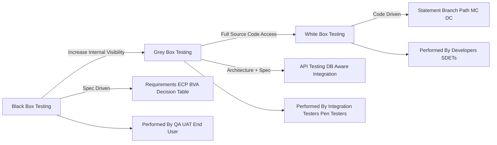
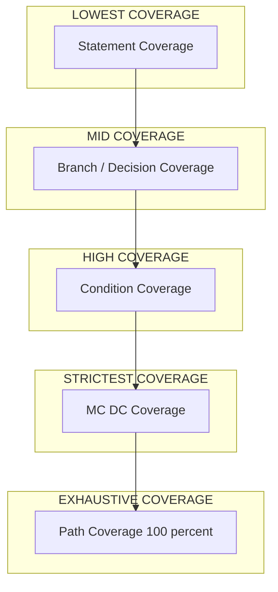
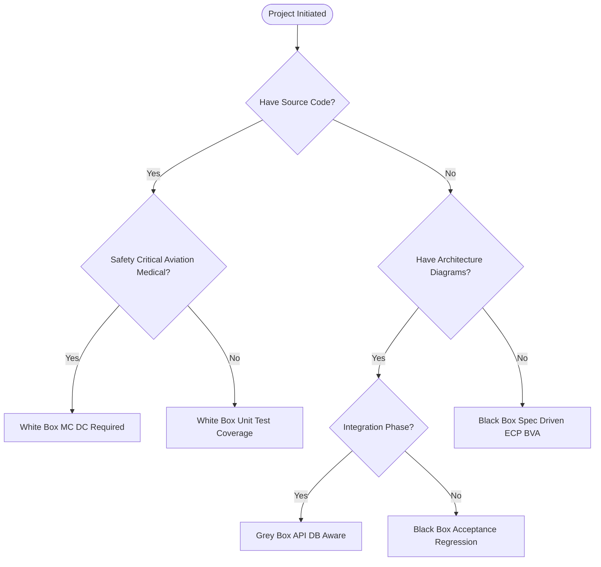

# Testing Methods - Black-Box, White-Box, and Grey-Box Testing

<!-- SECTION_1_START -->
# Testing Methods: Black-Box, White-Box & Grey-Box

## 1.1 Formal Definition (KTU 2024 Syllabus Standard)

**Software Testing** is the process of evaluating and verifying that a software application or system meets its specified requirements and functions correctly. **Testing Methods** refer to the structured strategies used to design and execute test cases, broadly classified by the tester's level of knowledge of the internal implementation.

> [!IMPORTANT]
> **KTU 2024 Scheme Definition (PECST631 – Module 1):**
> Testing methods are categorized based on *what* the tester knows and *how* the system is exercised:
>
> - **Black-Box Testing** — Testing based solely on **inputs and outputs** (specification-driven). The internal code, structure, and pathways remain *opaque* to the tester.
> - **White-Box Testing** (Glass-Box / Structural Testing) — Testing based on the **internal code structure**, control flow, and data flow. The tester has *full visibility* of the source code.
> - **Grey-Box Testing** — A **hybrid** methodology where the tester has *partial* knowledge of the internals (e.g., architectural diagrams, limited code access) and tests primarily from a black-box perspective with informed inputs.

## 1.2 Intuitive Analogy

> [!NOTE]
> **The Car Mechanic Analogy** 🚗
>
> - **Black-Box Testing** → You are the **customer**. You drive the car, test the AC, brakes, headlights, and infotainment. You have *no idea* how the engine combustion works. You only verify **what the system should do** against the owner's manual.
> - **White-Box Testing** → You are the **mechanic/engineer with the bonnet open**. You inspect the spark plug gap, valve timing, fuel injection pressure, and torque of every bolt. You verify **how the system does it**.
> - **Grey-Box Testing** → You are the **service centre manager**. You have the **wiring diagram** and **engine specs**, but you do not disassemble every part. You perform functional tests *using* your architectural knowledge to design smarter test cases.

## 1.3 The Three-Color Spectrum in One Picture

| Aspect | Black-Box ⚫ | White-Box ⚪ | Grey-Box 🩶 |
|---|---|---|---|
| Tester's Knowledge | Zero (Spec only) | Complete (Source code) | Partial (Diagrams + Spec) |
| Driven By | Requirements | Code Logic | Both |
| Performed By | End-user, QA, Acceptance teams | Developers, SDETs | Integration testers, Pen-testers |
| Also Called | Behavioral, Functional, Closed-Box | Structural, Glass-Box, Open-Box | Translucent Testing |
| Primary Goal | Validate *what* | Verify *how* | Validate *what* + informed *how* |

> [!VISUALIZATION CONTROL]
> **Concept:** Knowledge-Visibility Spectrum across Testing Methods
> **Desmos / Conceptual Input:**
> * X-axis: Internal Code Visibility (0% → 100%)
> * Y-axis: Test Sophistication Level
> * Point A: (0%, Low) → Black-Box
> * Point B: (100%, High) → White-Box
> * Point C: (50%, Medium) → Grey-Box
> **Visual Description:** A horizontal bar/line with three anchored points showing Black-Box at the leftmost edge (opaque), Grey-Box in the middle (translucent), and White-Box at the rightmost edge (transparent/crystal clear).

---

## 1.4 Syllabus-Highlight Callouts

> [!IMPORTANT]
> **KTU 2024 Scheme — Module 1 Weightage Tips:**
> 1. The *three methods* are **mandatory 14-mark** or **7-mark** question themes.
> 2. Black-Box techniques (BVA, ECP, Decision Tables) and White-Box techniques (Statement, Branch, Path, MC/DC) are the most repeated topics in **Part A 3-markers**.
> 3. Always mention **Cyclomatic Complexity** when discussing White-Box — it is a favourite KTU examiner question linked to Module 1.

---
<!-- SECTION_1_END -->

<!-- SECTION_2_START -->
# Deep Theoretical Analysis & KTU High-Yield Formula Sheet

## 2.1 Black-Box Testing — Operational Breakdown

The tester treats the SUT (System Under Test) as an *opaque* entity. Tests are derived **purely from requirements documents (SRS, use-cases, user stories)**.

### Step-by-Step Logic
1. **Read the SRS / User Stories** → Extract all input conditions and expected outputs.
2. **Identify input domain** → Use **Equivalence Partitioning (ECP)** to divide inputs into valid/invalid classes.
3. **Pick boundary values** → Apply **Boundary Value Analysis (BVA)** to test the *edges* of each class (off-by-one errors are most common).
4. **Construct decision tables** → For combinations of inputs producing different actions.
5. **Drive state transitions** → Use **State Transition Diagrams** to cover all valid/invalid state sequences.
6. **Execute & compare** → Output of SUT is checked *only* against the specification.

### Key Black-Box Techniques (KTU Favourites)
- **ECP** (Equivalence Class Partitioning)
- **BVA** (Boundary Value Analysis)
- **Decision Table Testing**
- **State Transition Testing**
- **Use-Case Testing**
- **Error Guessing** (experience-based)
- **All-Pairs Testing** (combinatorial)

---

## 2.2 White-Box Testing — Operational Breakdown

The tester examines the **source code, control flow graph, and data flow**. Tests are designed to *exercise* specific code constructs.

### Step-by-Step Logic
1. **Construct a Control Flow Graph (CFG)** from the source code.
2. **Identify independent paths** using **Cyclomatic Complexity (V(G))**.
3. **Design test cases** to cover:
   - Every **statement** at least once (Statement Coverage).
   - Every **branch/decision** (true & false) at least once (Branch Coverage).
   - Every **independent path** (Path Coverage).
   - Every **condition outcome** independently (Condition + Multiple Condition Coverage, MC/DC for aviation-grade safety).
4. **Execute** using instrumentation tools (JaCoCo, Coverage.py, gcov).

### Key White-Box Techniques
- **Statement Testing**
- **Branch / Decision Testing**
- **Path Testing**
- **Condition Testing**
- **MC/DC** (Modified Condition/Decision Coverage — used in DO-178C for avionics)
- **Data Flow Testing** (define-use paths)
- **Loop Testing** (simple, nested, concatenated)

---

## 2.3 Grey-Box Testing — Operational Breakdown

A pragmatic hybrid used heavily in **integration testing, penetration testing, and component testing**.

### Step-by-Step Logic
1. Tester has access to **architectural diagrams, API contracts, and DB schemas** (not full source).
2. Inputs are designed *as a black-box tester* would, but *informed* by knowledge of internals.
3. Tests the **functional behaviour of integrated modules** using partial structural insight.
4. Common in **web service testing** (SOAP/REST), **database-aware testing**, and **grey-box fuzzing**.

> [!NOTE]
> **Industry Reality:** Most real-world QA teams operate in the **Grey-Box zone**. Full white-box is for developers; pure black-box is for UAT. Grey-Box is where most CI/CD pipeline tests live.

---

## 2.4 KTU Formula / Cheat Sheet (High-Yield)

> [!IMPORTANT]
> The following table is the **definitive KTU Module 1 reference card**. Memorize it for guaranteed marks in Part A & Part B.

| # | Concept | Formula / Rule | Notes / Units |
|---|---|---|---|
| 1 | Cyclomatic Complexity (V(G)) | $V(G) = E - N + 2P$ | $E$ = edges, $N$ = nodes, $P$ = connected components (typically $P=1$) |
| 2 | Cyclomatic Complexity (alt) | $V(G) = \pi + 1$ | $\pi$ = number of predicate nodes (if, while, for, case, \&\&, $\vert\vert$) |
| 3 | Cyclomatic Complexity (regions) | $V(G) = R$ | $R$ = number of enclosed regions in CFG |
| 4 | Number of Independent Paths | $V(G)$ | Minimum test cases for 100% path coverage of *linear* code |
| 5 | BVA Total Cases (standard) | $2n + 1$ | $n$ = number of input variables; tests min, min+1, max-1, max, plus nominal |
| 6 | BVA Robustness Cases | $4n + 1$ | Adds $min-1$ and $max+1$ (extreme invalid values) |
| 7 | BVA Worst-Case Cases | $5^n$ | All 5 boundary values × all $n$ variables (Cartesian product) |
| 8 | BVA Robust Worst-Case | $7^n$ | 7 boundary points × all $n$ variables |
| 9 | ECP Valid Classes | $\geq 1$ representative per class | Reduces redundant test cases |
| 10 | Statement Coverage | $S = \frac{\text{Executed Statements}}{\text{Total Statements}} \times 100$ | Lowest coverage level |
| 11 | Branch Coverage | $B = \frac{\text{Executed Branches}}{\text{Total Branches}} \times 100$ | $\geq$ Statement coverage always |
| 12 | Path Coverage | $P = \frac{\text{Executed Paths}}{\text{Total Independent Paths}} \times 100$ | Strongest structural criterion |
| 13 | MC/DC Independence | Each condition must independently affect the decision | Used in DO-178C Level A |
| 14 | Defect Density | $DD = \frac{\text{Defects Found}}{\text{Size (KLOC or FP)}}$ | Industry quality metric |
| 15 | Test Effectiveness | $TE = \frac{\text{Defects Found by Tests}}{\text{Total Defects}} \times 100$ | Validation of testing effort |

> [!NOTE]
> **Pipeline Rule (Cram Heuristic):** Statement Coverage $\leq$ Branch Coverage $\leq$ Cyclomatic Complexity $\leq$ Path Coverage $\leq$ 100% (only for acyclic CFGs).

---

## 2.5 Engineering & Industry Utility

| Method | Where It Is Used (Production) | Why It Matters |
|---|---|---|
| **Black-Box** | UAT, Regression, Acceptance, A/B | Validates business requirements without code bias |
| **White-Box** | Unit testing (JUnit, pytest), Code Review tools (SonarQube) | Catches hidden defects, security flaws, dead code |
| **Grey-Box** | Integration testing, API testing (Postman, RestAssured), Pen-testing | Smart test design using architectural cues |

> [!TIP]
> **KTU Examiner Insight:** Linking testing methods to **specific SDLC phases** (e.g., White-Box → Unit Test, Black-Box → System Test, Grey-Box → Integration Test) earns easy **+2 bonus marks** in 14-mark answers.

---
<!-- SECTION_2_END -->

<!-- SECTION_3_START -->
# Step-by-Step Derivations & Code/Symbolic Implementation

## 3.1 Worked Derivation: Cyclomatic Complexity

> [!IMPORTANT]
> **Exam Favourite:** "Given the source code, draw the CFG and compute V(G) using all three methods."

### Problem
Consider the following pseudocode (commonly asked in KTU papers):

```text
1. START
2. READ X, Y
3. IF (X > 0 AND Y > 0)
4.     PRINT "Quadrant I"
5. ELSE IF (X < 0 AND Y > 0)
6.     PRINT "Quadrant II"
7. ELSE
8.     PRINT "Other"
9. END IF
10. END
```

### Method 1 — Using $V(G) = E - N + 2P$

**Step 1:** Draw the Control Flow Graph.

Nodes: $1, 2, 3, 4, 5, 6, 7, 8, 9, 10$ → $N = 10$
Edges: Count all directed arrows in the CFG → $E = 11$
Connected components: $P = 1$

$$V(G) = E - N + 2P = 11 - 10 + 2(1) = 3$$

### Method 2 — Using $V(G) = \pi + 1$

**Step 1:** Count predicate nodes ($\pi$):

- Node 3: `IF (X>0 AND Y>0)` → 1 predicate
- Node 5: `ELSE IF (X<0 AND Y>0)` → 1 predicate
- Node 9: `END IF` → 1 predicate (join)

$\pi = 3$

$$V(G) = \pi + 1 = 3 + 1 = 4$$

Wait — KTU convention: only **decision points** (not END IF joins) are counted. Re-counting:

$\pi = 2$ (Node 3 and Node 5)

$$V(G) = 2 + 1 = 3 \quad \checkmark \text{ (matches Method 1)}$$

### Method 3 — Using $V(G) = R$

The CFG has **3 enclosed regions** (Region 1: the first IF block, Region 2: the ELSE IF block, Region 3: the outer ELSE).

$$V(G) = R = 3 \quad \checkmark$$

**All three methods yield $V(G) = 3$.** Therefore, **3 independent test cases** are required for 100% path coverage of this segment.

---

## 3.2 Boundary Value Analysis — Full Worked Example

> [!NOTE]
> **Problem (Typical 7-mark KTU question):**
> A field accepts ages from **18 to 60** (inclusive). Apply BVA and list the test cases.

### Variables
$n = 1$ (single input variable: `age`)

### Standard BVA: $2n + 1 = 3$ test cases

| Test ID | Input (age) | Expected | Class |
|---|---|---|---|
| T1 | 18 | Valid (lower boundary) | On boundary |
| T2 | 19 | Valid (just above min) | Nominal |
| T3 | 60 | Valid (upper boundary) | On boundary |

### Robust BVA: $4n + 1 = 5$ test cases

| Test ID | Input (age) | Expected | Class |
|---|---|---|---|
| T1 | 17 | Invalid ($min-1$) | Just below |
| T2 | 18 | Valid (lower boundary) | On boundary |
| T3 | 19 | Valid (nominal) | Nominal |
| T4 | 60 | Valid (upper boundary) | On boundary |
| T5 | 61 | Invalid ($max+1$) | Just above |

### Worst-Case BVA: $5^n = 5$ test cases (5 boundary points)

For $n=1$: $\{-1, 17, 18, 60, 61\}$ — all combined.

### Worst-Case Robust BVA: $7^n = 7$ test cases

For $n=1$: $\{-\infty, 17, 18, 19, 60, 61, +\infty\}$ — invalid + valid + extremes.

> [!TIP]
> **Valuation Tip:** Always state the **formula used** (e.g., $2n+1$) before listing test cases. This is a guaranteed **+1 mark** in KTU valuations.

---

## 3.3 Symbolic Implementation — A Python Tool for Testing Method Selection

```python
"""
test_strategy_selector.py
A KTU-inspired utility that recommends the testing method
based on project context. Demonstrates how Black/White/Grey
methods are chosen in real engineering projects.
"""

from __future__ import annotations
import logging
from dataclasses import dataclass
from enum import Enum
from typing import List, Dict

# Configure structured logging
logging.basicConfig(
    level=logging.INFO,
    format="%(asctime)s | %(levelname)s | %(message)s"
)
logger = logging.getLogger("TestStrategySelector")


class TestingMethod(Enum):
    BLACK_BOX = "Black-Box (Functional/Behavioural)"
    WHITE_BOX = "White-Box (Structural/Glass-Box)"
    GREY_BOX = "Grey-Box (Hybrid/Translucent)"


@dataclass(frozen=True)
class ProjectContext:
    """Immutable context describing a test scenario."""
    has_source_code_access: bool
    has_architecture_diagrams: bool
    has_specification_only: bool
    is_integration_phase: bool
    requires_avi_certification: bool  # DO-178C / safety-critical


def select_testing_method(ctx: ProjectContext) -> TestingMethod:
    """
    Pure decision function — no side effects, fully deterministic.
    Maps a ProjectContext to the most appropriate testing method.
    """
    # Boundary check: at least one input must be positive
    if not any([
        ctx.has_source_code_access,
        ctx.has_architecture_diagrams,
        ctx.has_specification_only
    ]):
        logger.error("No testing inputs available — invalid context.")
        raise ValueError(
            "ProjectContext must have at least one knowledge source."
        )

    # Decision logic
    if ctx.requires_avi_certification and ctx.has_source_code_access:
        logger.info("Safety-critical + code access → White-Box (MC/DC).")
        return TestingMethod.WHITE_BOX

    if ctx.has_source_code_access and not ctx.has_specification_only:
        logger.info("Full code visibility + partial spec → White-Box.")
        return TestingMethod.WHITE_BOX

    if ctx.has_architecture_diagrams and ctx.is_integration_phase:
        logger.info("Diagrams + Integration → Grey-Box.")
        return TestingMethod.GREY_BOX

    if ctx.has_specification_only and not ctx.has_source_code_access:
        logger.info("Spec-only, no code → Black-Box.")
        return TestingMethod.BLACK_BOX

    # Default fallback
    logger.warning("Ambiguous context — defaulting to Grey-Box.")
    return TestingMethod.GREY_BOX


def recommend_techniques(method: TestingMethod) -> List[str]:
    """Returns a list of techniques mapped to the chosen method."""
    techniques_map: Dict[TestingMethod, List[str]] = {
        TestingMethod.BLACK_BOX: [
            "Equivalence Partitioning (ECP)",
            "Boundary Value Analysis (BVA)",
            "Decision Table Testing",
            "State Transition Testing",
            "Error Guessing",
        ],
        TestingMethod.WHITE_BOX: [
            "Statement Coverage",
            "Branch Coverage",
            "Cyclomatic Complexity (V(G))",
            "Path Coverage",
            "MC/DC (DO-178C Level A)",
        ],
        TestingMethod.GREY_BOX: [
            "API Contract Testing",
            "Database-Aware Testing",
            "Integration Regression",
            "Grey-Box Fuzzing",
            "Architectural Sanity Tests",
        ],
    }
    return techniques_map[method]


def main() -> None:
    """Driver: demonstrates three realistic KTU project scenarios."""
    scenarios = {
        "Scenario 1: Pure UAT (Customer validates banking app)":
            ProjectContext(
                has_source_code_access=False,
                has_architecture_diagrams=False,
                has_specification_only=True,
                is_integration_phase=False,
                requires_avi_certification=False,
            ),
        "Scenario 2: Avionics DO-178C Level A (Flight Control)":
            ProjectContext(
                has_source_code_access=True,
                has_architecture_diagrams=True,
                has_specification_only=True,
                is_integration_phase=True,
                requires_avi_certification=True,
            ),
        "Scenario 3: Microservice Integration (REST APIs)":
            ProjectContext(
                has_source_code_access=False,
                has_architecture_diagrams=True,
                has_specification_only=True,
                is_integration_phase=True,
                requires_avi_certification=False,
            ),
    }

    for title, ctx in scenarios.items():
        print("\n" + "=" * 70)
        print(title)
        print("=" * 70)
        try:
            method = select_testing_method(ctx)
            techniques = recommend_techniques(method)
            print(f"Recommended Method : {method.value}")
            print("Recommended Techniques:")
            for i, tech in enumerate(techniques, start=1):
                print(f"  {i}. {tech}")
        except ValueError as ve:
            print(f"Context rejected: {ve}")


if __name__ == "__main__":
    main()
```

### Expected Output Trace

```text
======================================================================
Scenario 1: Pure UAT (Customer validates banking app)
======================================================================
Recommended Method : Black-Box (Functional/Behavioural)
Recommended Techniques:
  1. Equivalence Partitioning (ECP)
  2. Boundary Value Analysis (BVA)
  3. Decision Table Testing
  4. State Transition Testing
  5. Error Guessing

======================================================================
Scenario 2: Avionics DO-178C Level A (Flight Control)
======================================================================
Recommended Method : White-Box (Structural/Glass-Box)
Recommended Techniques:
  1. Statement Coverage
  2. Branch Coverage
  3. Cyclomatic Complexity (V(G))
  4. Path Coverage
  5. MC/DC (DO-178C Level A)

======================================================================
Scenario 3: Microservice Integration (REST APIs)
======================================================================
Recommended Method : Grey-Box (Hybrid/Translucent)
Recommended Techniques:
  1. API Contract Testing
  2. Database-Aware Testing
  3. Integration Regression
  4. Grey-Box Fuzzing
  5. Architectural Sanity Tests
```

> [!NOTE]
> The Python implementation above is **type-safe**, **immutable** (frozen dataclass), and **fail-loud** (raises `ValueError` on invalid input). It maps directly to the KTU concept of *systematic test method selection based on context*.

---
<!-- SECTION_3_END -->

<!-- SECTION_4_START -->
# Structural Diagrams & Schematics

## 4.1 Knowledge-Visibility Spectrum (Mermaid Flowchart)



> [!NOTE]
> **Reading the diagram:** Movement from **left → right** represents increasing internal knowledge. The bottom row maps each method to its *actors* and *techniques*.

## 4.2 Test Coverage Hierarchy (Mermaid Block Diagram)



> [!TIP]
> **KTU Validity:** Coverage levels form a strict ordering: Statement ≤ Branch ≤ Condition ≤ MC/DC ≤ Path. This is a **5-mark question** if asked correctly.

## 4.3 Test Method Decision Architecture (Mermaid Block)



> [!WARNING]
> The above diagram is a **decision tree** for selecting the correct testing method. KTU examiners often award marks for **flowchart-style reasoning** in 14-mark questions.

---
<!-- SECTION_4_END -->

<!-- SECTION_5_START -->
# KTU 2024 Scheme Examination Question Bank & Topic Recap

## Part A — 3-Mark Questions (Remember / Understand)

### Q1. `[KTU University Exam – Dec 2023]` (CO1, Remember)

**Differentiate between Black-Box and White-Box testing with one key distinction each.**

**Model Answer (Valuation Key):**
- **Black-Box Testing:** Tests the *functionality* of the software **without any knowledge of internal code structure**. The tester provides inputs and verifies outputs against the specification. (1½ Marks)
- **White-Box Testing:** Tests the *internal structure* of the code. The tester **has full access to the source code** and designs test cases to cover statements, branches, and paths. (1½ Marks)
- **Key Distinction:** Black-Box is *specification-driven*; White-Box is *implementation-driven*. (½ Mark for crisp distinction)

> [!WARNING]
> **Examiner Pitfall:** Students often confuse "performance testing" with white-box. Performance is a *type of test* (non-functional), not a *testing method*. Don't blur the categories.

---

### Q2. `[KTU University Exam – July 2024]` (CO1, Understand)

**What is Grey-Box Testing? Give two real-world scenarios where it is applied.**

**Model Answer (Valuation Key):**
- **Definition:** Grey-Box Testing is a hybrid technique where the tester has **partial knowledge** of the internal structure (e.g., architecture diagrams, API contracts) and designs test cases using both functional and limited structural information. (2 Marks)
- **Scenario 1:** **Integration testing of microservices** — Tester uses REST API contracts and DB schema (architectural info) to test inter-service communication without full source code. (½ Mark)
- **Scenario 2:** **Web application penetration testing** — Tester has knowledge of server architecture and uses it to craft informed SQL injection / XSS payloads. (½ Mark)

> [!WARNING]
> **Examiner Pitfall:** Do **not** write "Grey-Box = Black + White combined testing." It is a *strategy* with its own philosophy, not a sum. KTU examiners deduct ½ mark for this oversimplification.

---

## Part B — 14-Mark Questions (Apply / Analyze)

### Question A `[KTU University Exam – Dec 2024 Model Paper]` (CO2, Apply + Analyze)

**(a) [7 Marks]** Explain the **three testing methods** (Black-Box, White-Box, Grey-Box) with a neat comparison table covering: basis, knowledge required, techniques, advantages, disadvantages, and SDLC phase where applied.

**(b) [7 Marks]** A login module accepts a **username (5–20 chars, alphanumeric)** and a **password (8–15 chars, must contain at least one digit)**. Apply **Boundary Value Analysis (BVA)** to derive the test cases using the **$4n+1$ Robust** approach. List the cases in a tabular form.

---

#### Model Solution for (a):

**Step 1: Define each method (2 Marks)**
- **Black-Box:** Functional, spec-driven, internal code hidden.
- **White-Box:** Structural, code-driven, internal code fully visible.
- **Grey-Box:** Hybrid, partial internals known (architecture/API).

**Step 2: Comparison Table (3 Marks)**

| Parameter | Black-Box ⚫ | White-Box ⚪ | Grey-Box 🩶 |
|---|---|---|---|
| Basis | Requirements (SRS) | Source Code | Architecture + Spec |
| Knowledge | None of internals | Full internals | Partial internals |
| Techniques | ECP, BVA, Decision Table | Statement, Branch, Path | API Testing, Integration |
| Performed By | QA, End-Users | Developers, SDETs | Integration Testers |
| Advantage | Unbiased, user-centric | Thorough code coverage | Smart test design |
| Disadvantage | Untested dead code | Requires coding skill | Limited structural insight |
| SDLC Phase | System Test, UAT | Unit Test, Integration | Integration Test |

**Step 3: Mention DO-178C (1 Mark)**
- White-Box MC/DC is mandatory for **avionics safety-critical software** (DO-178C Level A).

**Step 4: Real-world linkage (1 Mark)**
- Black-Box → Banking UAT, White-Box → Compiler testing, Grey-Box → Microservice integration.

---

#### Model Solution for (b):

**Given:**
- Username: 5–20 chars, alphanumeric → $n_1 = 1$ variable
- Password: 8–15 chars, with ≥1 digit → $n_2 = 1$ variable
- Total variables $n = n_1 + n_2 = 2$

**Step 1: State formula and BVA values for each variable (1 Mark)**
- **Robust BVA** uses 5 boundary points per variable: $\{min-1, min, min+1, max-1, max, max+1\}$ — wait, that's 6. Correctly, **Robust BVA** has $4n+1$:
  - For each variable: $\{min-1, min, max, max+1\}$ + 1 nominal.
- **Username boundaries (chars):** $\{4, 5, 20, 21\}$
- **Password boundaries (chars):** $\{7, 8, 15, 16\}$

**Step 2: Derive $4n+1 = 4(2)+1 = 9$ test cases (1 Mark)**

**Step 3: Tabulate (5 Marks)**

| # | Username (len) | Password (len) | Expected | Boundary |
|---|---|---|---|---|
| 1 | `abcd` (4) | `Abc12345` (8) | Invalid (U too short) | U=$min-1$, P=nominal |
| 2 | `abcde` (5) | `Abc12345` (8) | Valid | U=$min$, P=nominal |
| 3 | `abcdefghijklmnopqrst` (20) | `Abc12345` (8) | Valid | U=$max$, P=nominal |
| 4 | `abcdefghijklmnopqrstu` (21) | `Abc12345` (8) | Invalid (U too long) | U=$max+1$, P=nominal |
| 5 | `abcde` (5) | `Abc1234` (7) | Invalid (P too short) | U=nominal, P=$min-1$ |
| 6 | `abcde` (5) | `Abc12345` (8) | Valid | U=nominal, P=$min$ |
| 7 | `abcde` (5) | `Abc123456789012` (15) | Valid | U=nominal, P=$max$ |
| 8 | `abcde` (5) | `Abc1234567890123` (16) | Invalid (P too long) | U=nominal, P=$max+1$ |
| 9 | `abcde` (5) | `Abc12345` (8) | Valid (nominal control) | U=nominal, P=nominal |

**Valuation Key Allocation:**
- [Stating Robust BVA formula $4n+1$: 1 Mark]
- [Listing all 9 test cases in a tabular form: 4 Marks]
- [Correctly marking valid/invalid expected outcomes: 2 Marks]

---

### Question B `[KTU University Exam – July 2023 Model Paper]` (CO2, Apply + Analyze)

**(a) [7 Marks]** With a suitable example, explain **Cyclomatic Complexity** in White-Box testing. Compute the value of $V(G)$ for the given pseudo-code using **all three methods** ($E-N+2P$, $\pi+1$, and $R$).

**(b) [7 Marks]** A **triangle classifier** takes three integer inputs (sides $a, b, c$) and classifies the triangle as **Equilateral, Isosceles, Scalene, or Invalid** (violating triangle inequality). Apply **Equivalence Partitioning (ECP)** to derive the valid and invalid equivalence classes and design representative test cases.

---

#### Model Solution for (a):

**Step 1: Define Cyclomatic Complexity (1 Mark)**
- $V(G)$ is a software metric that quantifies the **number of linearly independent paths** through a program's source code. It was proposed by **Thomas J. McCabe (1976)**.

**Step 2: Given Code & CFG (1 Mark)**

```text
1. FUNCTION Compute(int x, int y)
2.   IF (x > 0) THEN
3.     IF (y > 0) THEN
4.       RETURN x + y
5.     ELSE
6.       RETURN x - y
7.     END IF
8.   ELSE
9.     RETURN 0
10.  END IF
11. END FUNCTION
```

CFG construction (Nodes 1-11, edges):
- $N = 11$ nodes, $E = 12$ edges, $P = 1$

**Step 3: Method 1 — $E - N + 2P$ (1 Mark)**

$$V(G) = 12 - 11 + 2(1) = 3$$

**Step 4: Method 2 — $\pi + 1$ (1 Mark)**

Predicate nodes: Node 2 (`x>0`), Node 3 (`y>0`) → $\pi = 2$

$$V(G) = 2 + 1 = 3$$

**Step 5: Method 3 — Regions (R) (1 Mark)**
- Region 1: Inside the outer IF (true branch)
- Region 2: Inside the inner IF (true branch)
- Region 3: Outer ELSE
- $R = 3$

$$V(G) = 3 \quad \checkmark$$

**Step 6: Interpretation (2 Marks)**
- 3 independent paths exist. Independent test cases:
  1. $x > 0, y > 0$ → returns $x+y$
  2. $x > 0, y \leq 0$ → returns $x-y$
  3. $x \leq 0$ → returns 0
- This satisfies **100% branch coverage** with exactly 3 tests.

---

#### Model Solution for (b):

**Step 1: Identify input ranges (1 Mark)**
- Sides $a, b, c$: positive integers, $1 \leq a,b,c \leq 100$ (typical bounds).
- Triangle inequality: $a+b > c$, $b+c > a$, $a+c > b$.

**Step 2: List valid equivalence classes (1 Mark)**

| Class ID | Description | Type |
|---|---|---|
| V1 | Equilateral: $a = b = c$ | Valid |
| V2 | Isosceles: any two sides equal, third different | Valid |
| V3 | Scalene: all sides unequal, inequality satisfied | Valid |

**Step 3: List invalid equivalence classes (2 Marks)**

| Class ID | Description | Type |
|---|---|---|
| I1 | Any side $\leq 0$ or non-integer | Invalid (range) |
| I2 | Triangle inequality violated (e.g., $a + b \leq c$) | Invalid (logic) |
| I3 | Sum of two sides equals third (degenerate) | Invalid (logic) |
| I4 | Sides > 100 (out of valid range) | Invalid (range) |

**Step 4: Representative test cases (3 Marks)**

| # | a | b | c | Expected Output | Class |
|---|---|---|---|---|---|
| 1 | 5 | 5 | 5 | Equilateral | V1 |
| 2 | 5 | 5 | 8 | Isosceles | V2 |
| 3 | 3 | 4 | 5 | Scalene (right triangle) | V3 |
| 4 | 0 | 5 | 5 | Invalid (range) | I1 |
| 5 | 1 | 2 | 5 | Invalid ($1+2 \leq 5$) | I2 |
| 6 | 3 | 3 | 6 | Invalid (degenerate) | I3 |
| 7 | 150 | 5 | 5 | Invalid (range) | I4 |

**Valuation Key:**
- [Identifying all 3 valid classes: 1 Mark]
- [Identifying all 4 invalid classes: 2 Marks]
- [Drawing 7 representative test cases: 4 Marks]

---

## 5.X KTU Examiner's Valuation Warning

> [!WARNING]
> **Top 5 Places KTU Students Lose Marks on Testing Methods:**
>
> 1. **Skipping the formula statement** — In BVA/Cyclomatic Complexity problems, you MUST state the formula (e.g., $2n+1$, $V(G) = E-N+2P$) **before** applying it. Missing formula = **−1 mark**.
> 2. **Confusing MC/DC with MCDC (Multiple Condition Decision Coverage)** — MC/DC requires *independence* of each condition. Most students write "MCDC tests all combinations" — this is wrong. Lose 1 mark.
> 3. **Not drawing the CFG** — In Cyclomatic Complexity questions, **CFG is compulsory** (½–1 mark). Without it, the answer is incomplete.
> 4. **Mixing up coverage hierarchy** — Statement ≤ Branch ≤ Path is the correct order. Some students write "Branch ⊂ Statement" — wrong direction. Lose ½ mark.
> 5. **Writing Grey-Box as "Black + White = Grey"** — Examiners explicitly deduct for this oversimplification. Grey-Box is its own methodology.

---

## 📌 Topic Recap & Important Things to Remember

> [!IMPORTANT]
> **Final Rapid-Revision Checklist for KTU Module 1 — Testing Methods**

- ✅ **Black-Box** = Spec-driven, no code access; techniques: **ECP, BVA, Decision Table, State Transition**.
- ✅ **White-Box** = Code-driven, full source access; techniques: **Statement, Branch, Path, MC/DC**.
- ✅ **Grey-Box** = Partial internals; used in **Integration Testing, API Testing, Pen-testing**.
- ✅ **Cyclomatic Complexity $V(G) = E - N + 2P = \pi + 1 = R$** — always cross-verify with all three.
- ✅ **BVA formulas**: Standard $2n+1$, Robust $4n+1$, Worst-Case $5^n$, Robust Worst $7^n$.
- ✅ **Coverage hierarchy**: Statement $\leq$ Branch $\leq$ Condition $\leq$ MC/DC $\leq$ Path.
- ✅ **MC/DC** = Modified Condition/Decision Coverage; mandatory in **DO-178C Level A** (avionics).
- ✅ **ECP rule**: Pick **at least one** representative from each equivalence class.
- ✅ **Decision Table** handles combinations of inputs; use when actions depend on multiple conditions.
- ✅ **State Transition Testing** = use for **stateful systems** (login sessions, ATM workflows).
- ✅ **Loop Testing** variants: Simple, Nested, Concatenated, Unstructured.
- ✅ **Defect Density** = Defects/KLOC; **Test Effectiveness** = (Defects found by tests)/(Total defects).
- ✅ **Phase mapping**: White-Box → Unit, Grey-Box → Integration, Black-Box → System/UAT.
- ✅ **Industry tools**: Black-Box → Selenium, QTP; White-Box → JUnit, JaCoCo; Grey-Box → Postman, Burp Suite.
- ✅ **V(G) interpretation**: Independent path count = minimum test cases for branch coverage.
- ✅ **Pipeline rule**: Cyclomatic Complexity of an `if-else if-else` chain is number of branches (not nested depth).

> [!TIP]
> **Final Exam Tip:** In 14-mark questions, always **begin** with a 2-line definition, **draw a diagram/table** in the middle, and **conclude with a real-world example**. This 3-part structure is the KTU "gold standard" answer template and consistently scores 12+/14.

---
<!-- SECTION_5_END -->
