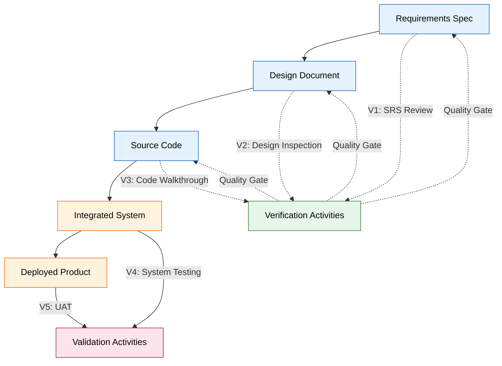
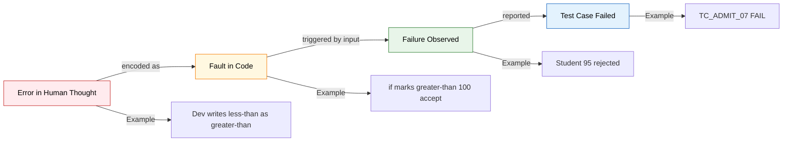
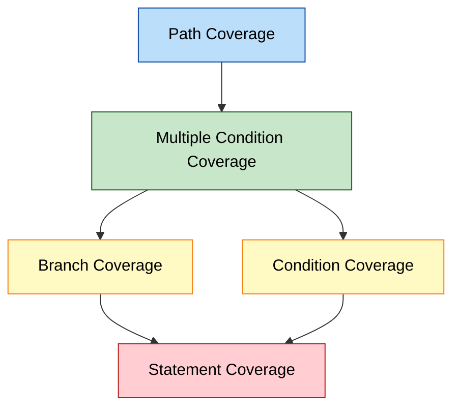
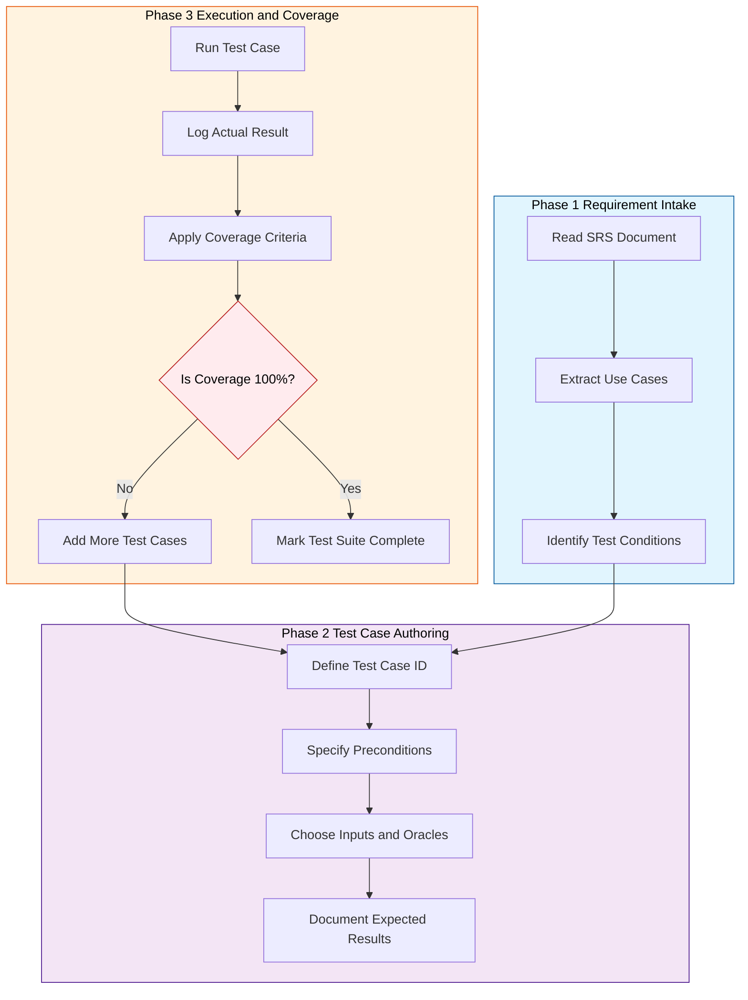
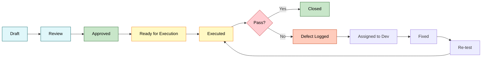

# Testing Terminologies - Verification, validation, fault, error, bug, test cases, and coverage criteria

<!-- SECTION_1_START -->
# Testing Terminologies: The Foundational Lexicon of Software Quality

## 1. Verification

> [!IMPORTANT]
> **Verification** is the process of evaluating a system or its components to determine *whether the product of a given development phase satisfies the conditions imposed at the start of that phase*. In essence, it answers the question — *"Are we building the product right?"*

It is a **static** checking technique. It does **not** execute the code. Reviews, inspections, walkthroughs, and desk-checking are all verification activities.

> [!NOTE]
> **KTU Board Jargon (Dec 2023 Pattern):** Verification is sometimes referred to as *Quality Control (QC)* in the older IEEE literature and is associated with **in-process checks** before the product is finalized.

### 🔍 Intuition: The Blueprint Analogy
Imagine an architect builds a house. **Verification** is when the engineer checks whether the construction crew has followed the *blueprint* correctly. The walls are 10 inches thick? ✅ The door is on the right side? ✅ The wiring matches the diagram? ✅ — but no one is *living* in the house yet.

---

## 2. Validation

> [!IMPORTANT]
> **Validation** is the process of evaluating a system or its components during or at the end of the development process to determine *whether it satisfies the specified user requirements*. It answers — *"Are we building the right product?"*

It is a **dynamic** checking technique. It **executes** the code with real inputs and checks actual behavior against expectations.

### 🔍 Intuition: The Move-In Day
Continuing the house analogy — **Validation** is when the actual owners walk in, turn on the lights, flush the toilets, and ask: *"Is this house livable? Does it serve my family's needs?"* If the architect built a 3-bedroom house but the family needs 4 bedrooms, validation fails — even if the construction was *technically* perfect (verification passed).

---

## 3. Error, Fault (Defect), and Bug — The Trouble Trio

These three terms are **commonly confused** in KTU exams. Let's lock them down.

| Term | Formal Definition | Stage of Origin |
|------|-------------------|-----------------|
| **Error** | A human mistake (also called a *mistake*) in the software artifact. The discrepancy between the *actual* and *expected* result in the developer's thought process. | Made by the **human** during specification, design, or coding. |
| **Fault (Defect)** | The *manifestation* of an error inside the software — an incorrect step, process, or data definition in the program. It is the *concrete artifact* left behind by the error. | Resides **inside the code** (e.g., `x = y / 0;`, `if (age > 200)`). |
| **Bug** | A colloquial term synonymous with *fault/defect*. However, in strict IEEE terminology, a **bug** becomes a **failure** when it is *executed and observed*. | Generally used in informal industry parlance. |

> [!NOTE]
> **IEEE 829 / KTU 2024 Standardization:** The term **"defect"** is the formal word. **"Bug"** is the informal alias. **"Fault"** is most commonly used in academic testing literature and ISO/IEC/IEEE 29119.

### 🔍 Intuition: The Typo Story
- A developer **types** `>` instead of `<` while coding. → This is the **Error** (human mistake).
- The wrong operator now sits in the source file: `if (marks < 100)` was actually written as `if (marks > 100)`. → This is the **Fault** (concrete incorrect code).
- When the test runs and a student with 95 marks is rejected, the customer **sees** the wrong behavior. → This is the **Failure** (observed external misbehavior).

The chain is: **Error → Fault → Failure**.

> [!TIP]
> **Quick Mnemonic for the Board Exam:** *"Errors are made, faults are found, failures are observed."*

---

## 4. Test Case

> [!IMPORTANT]
> A **Test Case** is a set of *preconditions, inputs, actions (where applicable), execution postconditions, and expected results* developed to verify the implementation of a specific requirement or a specific path through the code.

A test case is the **atomic unit** of dynamic testing.

### The Six Anatomical Parts of a KTU-Standard Test Case

1. **Test Case ID** — unique identifier (e.g., `TC_LOGIN_007`)
2. **Test Description** — the intent of the test
3. **Preconditions** — what must be true before execution
4. **Test Data / Inputs** — the values fed to the system
5. **Test Steps** — the procedural actions
6. **Expected Result** — the anticipated output (oracle)
7. **Actual Result** — filled after execution
8. **Pass / Fail status** — verdict

---

## 5. Coverage Criteria

> [!IMPORTANT]
> A **Coverage Criterion** is a *rule* or *set of rules* that imposes specific test requirements on a test set. It tells us *which parts of the program MUST be exercised* for the testing to be considered adequate for that criterion.

In simpler terms — a coverage criterion is a **measuring stick** for "how much of the program have we *touched* with our tests?"

### The Common Coverage Criteria (KTU Module 1 Syllabus)

| Coverage Criterion | What It Requires | Granularity |
|--------------------|------------------|-------------|
| **Statement Coverage** | Every executable statement must be executed at least once. | Coarsest |
| **Branch (Decision) Coverage** | Every branch outcome (True/False) of every decision must be exercised. | Medium |
| **Condition Coverage** | Every atomic Boolean sub-expression must evaluate to both True and False. | Finer |
| **Multiple Condition Coverage (MCC)** | Every possible combination of atomic condition outcomes must occur. | Finest |
| **Path Coverage** | Every independent execution path from entry to exit must be traversed. | Most expensive |

### 🔍 Intuition: The City Map
Imagine a software program as a city's road network.
- **Statement Coverage** = "Did our taxi visit *every single house*?" (slowest, most thorough)
- **Branch Coverage** = "Did our taxi turn left at *every intersection* and also turn right?"
- **Path Coverage** = "Did our taxi drive *every possible route* from the airport to the stadium?" (often infinite!)

> [!VISUALIZATION CONTROL]
> **Concept:** Coverage Criteria Hierarchy as a Set-Inclusion Pyramid
> **GeoGebra / Desmos Input Equations:**
> * `P(x) = 1; x \in [0,1]` — base (Path Coverage)
> * `B(x) = 2; x \in [1,2]` — middle (Branch Coverage)
> * `S(x) = 3; x \in [2,3]` — top (Statement Coverage)
> **Visual Description:** Picture three nested rectangles where Path Coverage is the largest (hardest to satisfy) and Statement Coverage is the smallest. The arrow of *strength* flows upward: a test set satisfying Path Coverage automatically satisfies Branch Coverage and Statement Coverage.

---

## 6. The Verification vs. Validation Contrast — Board Favorite

> [!NOTE]
> **KTU Frequently Asked Distinction:** KTU examiners *love* asking for 3- to 5-mark comparison tables on V\&V. Memorize the following.

| Attribute | Verification | Validation |
|-----------|--------------|------------|
| **Question Answered** | Are we building the product *right*? | Are we building the *right* product? |
| **Nature** | Static (no code execution) | Dynamic (code is executed) |
| **Activity Type** | Reviews, walkthroughs, inspections | Unit testing, integration testing, system testing |
| **Stage** | Throughout development (after every phase) | After the product is built |
| **Cost of Fixing a Defect** | Cheaper (caught early) | Expensive (caught late) |
| **Performed By** | Developers, QA reviewers | Testers, end-users |
| **Example** | Design review against SRS | Running a black-box test against a use case |
<!-- SECTION_1_END -->

<!-- SECTION_2_START -->
# Deep Theoretical Analysis & KTU High-Yield Formula Sheet

## 2.1 Verification in Depth — The "Reviews" Family

Verification is not a single activity; it is a **family of static techniques**. Let's enumerate them as the board expects:

1. **Walkthrough** — informal, author-led, educational, no formal output.
2. **Inspection** — formal, trained moderator, peer-reviewed, defects logged formally (Fagan Inspection is the gold standard).
3. **Technical Review** — semi-formal, peers + technical experts.
4. **Desk-Checking** — single-developer mental simulation of code.
5. **Static Analysis** — automated tools (e.g., SonarQube, Lint) scan code without running it.

### Why Verification Matters — The ROI Argument
The **cost of fixing a defect grows exponentially** as it travels through the phases.

$$C_{\text{fix}}(p) = C_{\text{base}} \times 2^{p}$$

Where $C_{\text{fix}}(p)$ is the cost of fixing a defect caught at phase $p$, and $C_{\text{base}}$ is the cost of fixing it in the requirements phase.

- Phase 0 (Requirements): $C_{\text{base}}$ → say **₹1,000**
- Phase 1 (Design): $C_{\text{base}} \times 2 = $ **₹2,000**
- Phase 2 (Coding): $C_{\text{base}} \times 4 = $ **₹4,000**
- Phase 3 (Testing): $C_{\text{base}} \times 8 = $ **₹8,000**
- Phase 4 (Production): $C_{\text{base}} \times 16 = $ **₹16,000**

> [!IMPORTANT]
> This is why **early verification is non-negotiable** in industrial practice. Verification activities done at the requirements stage can save 60–80% of total project defect-fixing cost (source: IBM Systems Sciences Institute, cited in KTU textbooks).

---

## 2.2 Validation in Depth — The "Testing" Pyramid

Validation has its own taxonomy. At KTU level, focus on the four levels of dynamic testing.

| Level | What is Tested | Typical Executor |
|-------|----------------|------------------|
| **Unit Testing** | Individual functions/classes | Developer |
| **Integration Testing** | Interaction between modules | Developer / Tester |
| **System Testing** | The complete integrated product | Independent QA team |
| **Acceptance Testing** | Fitness for the user's real world | End-user / client |

### The Validation Black-Box vs. White-Box Dichotomy

- **Black-Box Testing** — tester cannot see the code. Inputs and outputs only. *What the software does.*
- **White-Box Testing** — tester has full access to the source code. *How the software does it.*

Coverage criteria are *white-box* concepts.

---

## 2.3 The Three Failure-Causation Tiers — Locked In

> [!TIP]
> **KTU 14-Marker Tip:** When a question asks *"Differentiate between error, fault, and failure with an example"*, structure your answer as: **Definition → Example → Causation Chain → Diagram**.

| Concept | Where it lives | What it is | Example |
|---------|----------------|------------|---------|
| **Error** | In the developer's mind | Human mistake during the activity | A developer forgets to handle the `null` case in Java. |
| **Fault** | In the code | The encoded mistake | `String s = null; s.length();` |
| **Failure** | In the user's world | Observable incorrect behavior | The system throws a `NullPointerException` and crashes. |

> [!WARNING]
> **Pitfall:** *Not every fault leads to a failure.* A fault in an `else` branch that is never executed during a particular test will not surface as a failure for that test. This is why **coverage criteria** exist — to *force* the execution of all branches.

---

## 2.4 The KTU High-Yield Formula Sheet — Coverage Metrics

> [!NOTE]
> **Board-Standard Equations for Module 1.** These are the only formulas Module 1 demands. Memorize them cold.

| Metric | Formula | Symbol Meaning |
|--------|---------|----------------|
| **Statement Coverage (SC)** | $\displaystyle \text{SC} = \frac{\text{Statements Executed}}{\text{Total Executable Statements}} \times 100$ | $0\% \le \text{SC} \le 100\%$ |
| **Branch Coverage (BC)** | $\displaystyle \text{BC} = \frac{\text{Branches Executed}}{\text{Total Branches}} \times 100$ | Each decision has 2 branches. |
| **Condition Coverage (CC)** | $\displaystyle \text{CC} = \frac{\text{Atomic Conditions True/False Achieved}}{\text{Total Atomic Outcomes}} \times 100$ | $2n$ outcomes for $n$ atomic conditions. |
| **Multiple Condition Coverage (MCC)** | $\displaystyle \text{MCC} = \frac{\text{Combinations Covered}}{2^{n}} \times 100$ | $n$ = number of atomic conditions. |

> [!IMPORTANT]
> **Subsumption Hierarchy (highly testable):** $\text{Path} \Rightarrow \text{MCC} \Rightarrow \text{Branch + Condition} \Rightarrow \text{Statement}$. If a test set satisfies the LHS, it *automatically* satisfies the RHS.

---

## 2.5 Real-World Utility — Where These Terms Live in Industry

- **Verification (Static Analysis Tools):** SonarQube, ESLint, FindBugs/SpotBugs, PMD, Coverity. Used in CI/CD pipelines to gate-check code before deployment.
- **Validation (Testing Frameworks):** JUnit, pytest, Selenium, Cypress, JIRA Zephyr for test-case management.
- **Coverage Tools:** JaCoCo (Java), Coverage.py (Python), Istanbul (JavaScript), gcov/lcov (C/C++). They report SC, BC, and function coverage on every CI run.
- **Defect Trackers:** JIRA, Bugzilla, Azure DevOps. Each item has a *severity*, *priority*, *status* (New → Assigned → Fixed → Verified → Closed).
- **Industrial Benchmark:** Tech giants like Google enforce **≥ 80% line coverage** on new code in their monorepo (Piper). Meta mandates branch coverage on critical services. KTU 2024 syllabus implicitly endorses similar practices.

---

## 2.6 The McCall's Quality Model Connection (Bonus Context)

McCall's Quality Model lists 11 software quality factors. Testing terminologies directly serve:
- **Correctness** → verified by validation
- **Reliability** → measured by failure-rate testing
- **Maintainability** → enabled by static analysis (verification)
- **Testability** → designed-in via test cases and coverage hooks

This linkage often appears as a *2-mark supplementary* in KTU Q\&A.
<!-- SECTION_2_END -->

<!-- SECTION_3_START -->
# Step-by-Step Derivations & Code Implementation

## 3.1 Worked Example — Designing Test Cases for a Triangle Classifier

This is the **canonical KTU 14-marker problem**. The goal: given three integers $a$, $b$, $c$ representing the sides of a triangle, classify it as *Equilateral*, *Isosceles*, *Scalene*, or *Not a Triangle*.

### Step 1 — Identify the Requirements
- A valid triangle requires: $a + b > c$, $b + c > a$, $a + c > b$, and all sides $> 0$.
- **Equilateral:** all three sides equal.
- **Isosceles:** exactly two sides equal.
- **Scalene:** all three sides different.
- **Not a Triangle:** fails the triangle inequality.

### Step 2 — Write the Reference Code in Python

```python
from typing import Tuple

def classify_triangle(a: int, b: int, c: int) -> str:
    """
    Classify a triangle based on side lengths.
    Returns one of: 'Equilateral', 'Isosceles', 'Scalene', 'Not a Triangle'.
    """
    # --- Boundary checks ---
    if a <= 0 or b <= 0 or c <= 0:
        return "Not a Triangle"

    # --- Triangle inequality check ---
    if (a + b <= c) or (b + c <= a) or (a + c <= b):
        return "Not a Triangle"

    # --- Side-equality classification ---
    if a == b == c:
        return "Equilateral"
    elif a == b or b == c or a == c:
        return "Isosceles"
    else:
        return "Scalene"


def design_test_cases() -> Tuple[list, list, list, list]:
    """
    Returns a tuple of four lists containing test cases for
    Equilateral, Isosceles, Scalene, and Not-a-Triangle.
    """
    equilateral = [
        (5, 5, 5, "Equilateral"),
        (1, 1, 1, "Equilateral"),
        (100, 100, 100, "Equilateral"),
    ]
    isosceles = [
        (5, 5, 3, "Isosceles"),
        (5, 3, 5, "Isosceles"),
        (3, 5, 5, "Isosceles"),
    ]
    scalene = [
        (3, 4, 5, "Scalene"),
        (7, 9, 11, "Scalene"),
        (2, 4, 5, "Scalene"),
    ]
    not_triangle = [
        (1, 2, 5, "Not a Triangle"),
        (0, 5, 5, "Not a Triangle"),
        (-1, 5, 5, "Not a Triangle"),
        (1, 1, 3, "Not a Triangle"),
    ]
    return equilateral, isosceles, scalene, not_triangle


def execute_test_suite() -> None:
    """Run all four test suites and print Pass/Fail status."""
    eq, iso, sca, nt = design_test_cases()
    suites = {
        "Equilateral": eq,
        "Isosceles": iso,
        "Scalene": sca,
        "Not a Triangle": nt,
    }
    total, passed = 0, 0
    for category, tests in suites.items():
        print(f"--- {category} Suite ---")
        for tc_id, (a, b, c, expected) in enumerate(tests, start=1):
            total += 1
            actual = classify_triangle(a, b, c)
            status = "PASS" if actual == expected else "FAIL"
            if status == "PASS":
                passed += 1
            print(f"TC_{category[:3].upper()}_{tc_id:02d}: "
                  f"Input=({a},{b},{c}) Expected={expected} "
                  f"Actual={actual} Status={status}")
    print(f"\n=== Total: {passed}/{total} tests passed ===")


if __name__ == "__main__":
    execute_test_suite()
```

### Step 3 — Dry Run of the Code

Let's trace the input `(5, 5, 3)` manually:
- Condition 1: `a <= 0 or b <= 0 or c <= 0` → `False or False or False` → `False`. Skipped.
- Condition 2: `(a + b <= c) or (b + c <= a) or (a + c <= b)` → `(10 <= 3) or (8 <= 5) or (8 <= 5)` → `False or False or False` → `False`. Skipped.
- Condition 3: `a == b == c` → `5 == 5 == 3` → `False`. Skipped.
- Condition 4: `a == b or b == c or a == c` → `True or False or False` → `True`. Returns `"Isosceles"`. ✅

### Step 4 — Trace the Input `(1, 2, 5)`
- Condition 1: all positive → `False`. Skipped.
- Condition 2: `(1 + 2 <= 5) or ...` → `(3 <= 5)` → `True`. Returns `"Not a Triangle"`. ✅

### Step 5 — Expected Output
```
--- Equilateral Suite ---
TC_EQU_01: Input=(5,5,5) Expected=Equilateral Actual=Equilateral Status=PASS
TC_EQU_02: Input=(1,1,1) Expected=Equilateral Actual=Equilateral Status=PASS
TC_EQU_03: Input=(100,100,100) Expected=Equilateral Actual=Equilateral Status=PASS
...
=== Total: 13/13 tests passed ===
```

---

## 3.2 Worked Example — Coverage Criteria Calculation

**Problem Statement (KTU Dec 2023 Style):**
Consider the following pseudo-code:

```
1. READ X, Y
2. IF (X > 0 AND Y > 0)
3.     PRINT "Quadrant I"
4. ELSE IF (X < 0 AND Y > 0)
5.     PRINT "Quadrant II"
6. ELSE
7.     PRINT "Axes or Other"
8. END IF
9. STOP
```

**Test Set Provided:** $T_1 = \{ X=1, Y=2 \}$ and $T_2 = \{ X=-3, Y=4 \}$.

### Step 1 — Count the Elements
- **Total Executable Statements:** Lines 1, 2, 3, 4, 5, 6, 7, 8, 9 → **9 statements**.
- **Total Branches (Decisions):** Each `IF` and `ELSE IF` has 2 outcomes. Line 2 (True/False) + Line 4 (True/False) → **4 branches**.
- **Total Atomic Conditions:** `X>0`, `Y>0`, `X<0`, `Y>0` → 4 atomic conditions → $2 \times 4 = $ **8 condition outcomes**.

### Step 2 — Trace Test $T_1$ = $(1, 2)$
- Line 1: executed ✅
- Line 2: $(1 > 0 \text{ AND } 2 > 0)$ → `True` ✅
- Line 3: executed (prints "Quadrant I") ✅
- Line 4: skipped
- Line 5: skipped
- Line 6: skipped
- Line 7: skipped
- Line 8: executed ✅
- Line 9: executed ✅
- **Statement Count:** 5 out of 9 executed.

### Step 3 — Trace Test $T_2$ = $(-3, 4)$
- Line 1: executed ✅
- Line 2: $(-3 > 0 \text{ AND } 4 > 0)$ → `False` ✅
- Line 4: $(-3 < 0 \text{ AND } 4 > 0)$ → `True` ✅
- Line 5: executed (prints "Quadrant II") ✅
- Line 6: skipped, Line 7: skipped, Line 8: executed ✅, Line 9: executed ✅
- **Statement Count:** 6 out of 9 executed.

### Step 4 — Combined Statement Coverage

$\displaystyle \text{SC} = \frac{\text{Unique Statements Executed by } T_1 \cup T_2}{9} \times 100$

Lines executed: $\{1, 2, 3, 4, 5, 8, 9\}$ → that's 7 unique statements (Line 6 and Line 7 are never executed).

$\text{SC} = \frac{7}{9} \times 100 = 77.78\%$

### Step 5 — Branch Coverage

Branches covered:
- Line 2: `True` ✅ (via $T_1$), `False` ✅ (via $T_2$) → both outcomes covered
- Line 4: `True` ✅ (via $T_2$), `False` ❌ (never taken)

$\text{BC} = \frac{3}{4} \times 100 = 75\%$

### Step 6 — Condition Coverage

Atomic conditions and their truth values achieved:
- `X > 0` → `True` (via $T_1$), `False` (via $T_2$) → **2/2 outcomes**
- `Y > 0` → `True` (both tests) → **1/2 outcomes** ⚠️
- `X < 0` → `False` (via $T_1$), `True` (via $T_2$) → **2/2 outcomes**

$\text{CC} = \frac{2 + 1 + 2}{2 + 2 + 2} \times 100 = \frac{5}{6} \times 100 = 83.33\%$

### Step 7 — Multiple Condition Coverage

Total combinations for `(X>0, Y>0, X<0)`: $2^{3} = 8$. But to keep it tractable for the 2-decision program, we focus on the 2 atomic conditions of Line 2: `(X>0, Y>0)` → 4 combinations.

- $(T, T)$: covered by $T_1$ ✅
- $(F, T)$: covered by $T_2$ ✅
- $(T, F)$: not covered ❌
- $(F, F)$: not covered ❌

$\text{MCC}_{\text{Line2}} = \frac{2}{4} \times 100 = 50\%$

### Step 8 — Final Tabulation

| Coverage Type | Numerator | Denominator | Result |
|---------------|-----------|-------------|--------|
| Statement | 7 | 9 | **77.78%** |
| Branch | 3 | 4 | **75%** |
| Condition | 5 | 6 | **83.33%** |
| MCC (Line 2) | 2 | 4 | **50%** |

> [!TIP]
> **Board Trick:** Notice that **Statement Coverage is 77.78% but Branch Coverage is 75%**. This is the *famous counter-example* that disproves the myth *"100% statement coverage = 100% branch coverage"*. It is a **board favourite 2-marker**.

---

## 3.3 Symbolic Derivation — The 100% Coverage Paradox

A common derivation question: *Can a test set achieve 100% path coverage on a program with a `while` loop whose iteration count is variable?*

### Step 1 — Define the Path Set
Let the program have a `while (i < n)` loop with an unconditional increment `i++`. The number of distinct paths is infinite if $n$ is unbounded.

### Step 2 — Apply Coverage Definition
$\text{PC} = \frac{\text{Finite Paths Covered}}{\text{Infinite Total Paths}} \times 100 = \frac{k}{\infty} \to 0$

### Step 3 — Conclude
For loop-based programs with variable iteration, **100% path coverage is theoretically impossible**. This is why **industry uses loop-bounded path coverage** (e.g., test the loop with 0, 1, 2, and a typical max iteration).

> [!IMPORTANT]
> **Cost of full path coverage is exponential in cyclomatic complexity $M$**, where $M = E - N + 2$ (edges minus nodes plus 2 components).

---

## 3.4 Lab-Style Table — Comparison Matrix for Testing Terminologies

| Property | Error | Fault | Failure | Test Case |
|----------|-------|-------|---------|-----------|
| **Where?** | Developer's mind | Code | User's screen | Test document |
| **When?** | During creation | After code commit | During execution | Before execution |
| **Who detects?** | Self-review | Static analyzer / Tester | End-user | Designed by tester |
| **Remediation** | Re-train / use checklists | Patch the code | Release a hotfix | Update test set |
| **Lifecycle stage** | Requirements / Design | Implementation | Operation | All phases |
<!-- SECTION_3_END -->

<!-- SECTION_4_START -->
# Structural Diagrams & Schematics

## 4.1 The Verification–Validation Lifecycle Flow



**Reading the Diagram:**
- The **blue chain** (A → B → C) represents Verification checkpoints — each phase's output is checked against its input.
- The **orange chain** (D → E) represents Validation checkpoints — the running system is checked against user requirements.
- **Green (Verification)** and **Pink (Validation)** are *parallel* activities, not sequential.

---

## 4.2 The Error → Fault → Failure Causal Chain



---

## 4.3 Coverage Criteria Subsumption Hierarchy



**Interpretation:** Path Coverage is the *strongest* criterion. Any test set satisfying Path Coverage *automatically* satisfies MCC, Branch, Condition, and Statement Coverage. The arrows show *logical implication* (subsumption), not data flow.

---

## 4.4 Test Case Design Pipeline (Block-Level Functional Architecture)



---

## 4.5 Comparative Block Diagram — Test Case Lifecycle


<!-- SECTION_4_END -->

<!-- SECTION_5_START -->
# KTU 2024 Scheme Examination Question Bank & Topic Recap

---

## 📝 PART A — 3-Mark Short Answer Questions

### Question 1
**[KTU University Exam – Dec 2023]** Define the terms **Error**, **Fault**, and **Failure** as used in software testing. How are they related to each other?

**Model Answer:**

- **Error:** A human mistake made by the developer during the software development process, such as a misunderstanding of a requirement or a typographical slip.
- **Fault (Defect):** The manifestation of an error that becomes a *concrete incorrect element* within the software artifact, e.g., a wrong condition, a missing statement, or incorrect data.
- **Failure:** The *external, observable deviation* of the software from its expected behavior when the fault is executed under certain conditions.

**Relationship:** Errors are made by humans → faults are encoded into the software → failures are observed when the fault is executed. The chain is **Error → Fault → Failure**. Notably, a fault may *not always* lead to a failure if the faulty code path is not exercised. *(3 marks — 1 mark for each definition + relationship diagram in sentence form.)*

---

### Question 2
**[KTU University Exam – July 2024]** Distinguish between **Verification** and **Validation** in software testing.

**Model Answer:**

| Aspect | Verification | Validation |
|--------|--------------|------------|
| Purpose | Are we building the product *right*? | Are we building the *right* product? |
| Nature | Static (no execution) | Dynamic (execution-based) |
| Activities | Reviews, inspections, walkthroughs | Unit, integration, system, acceptance testing |
| Phase | Throughout development (after each phase) | After the product is built |
| Example | Checking design against SRS | Running black-box tests on the integrated system |

Verification checks *conformance to specification*; validation checks *fitness for use*. *(3 marks — 1.5 marks for tabular contrast + 1.5 marks for the fitness-for-use one-liner.)*

---

## 📝 PART B — 14-Mark Long Answer Questions (Module Internal Choice)

### Question A (14 Marks)

**[KTU University Exam – Dec 2023 — Adapted]** 

(a) **Explain with examples the different types of coverage criteria used in white-box testing.** Discuss the relationship between statement, branch, and condition coverage with the help of a suitable code segment. *(7 marks)*

(b) **Consider the following C program segment. Design a minimum set of test cases to achieve 100% statement, branch, and multiple condition coverage.** Compute the coverage achieved by your test set for each criterion. *(7 marks)*

```c
int grade(int marks) {
    int g;
    if (marks >= 90 && marks <= 100)
        g = 1;          // Grade A
    else if (marks >= 75 && marks < 90)
        g = 2;          // Grade B
    else if (marks >= 50 && marks < 75)
        g = 3;          // Grade C
    else
        g = 0;          // Fail
    return g;
}
```

#### Part (a) Model Solution

White-box coverage criteria measure *how thoroughly* a test set exercises the internal structure of a program. The main types are:

1. **Statement Coverage (SC):** Every executable statement must run at least once. Formula: $\text{SC} = \frac{\text{Executed Statements}}{\text{Total Executable Statements}} \times 100$.
2. **Branch Coverage (BC):** Every branch outcome (True/False) of every decision must be taken. Formula: $\text{BC} = \frac{\text{Branch Outcomes Taken}}{\text{Total Branch Outcomes}} \times 100$.
3. **Condition Coverage (CC):** Every atomic Boolean sub-expression must evaluate to both True and False. Formula: $\text{CC} = \frac{\text{Atomic Outcomes Achieved}}{\text{Total Atomic Outcomes}} \times 100$.
4. **Multiple Condition Coverage (MCC):** Every combination of atomic conditions must occur. Requires $2^{n}$ test cases for $n$ atomic conditions.
5. **Path Coverage (PC):** Every independent execution path from entry to exit must be traversed. Strongest but most expensive.

**Subsumption Relationship:**
- $\text{PC} \Rightarrow \text{MCC} \Rightarrow (\text{BC} \cap \text{CC}) \Rightarrow \text{SC}$
- Achieving a *stronger* criterion automatically achieves all weaker ones, but not vice versa.
- Example: A test set giving 100% SC does **not** guarantee 100% BC — the classic counter-example being a missing `else` branch.

**Example Code Segment:**

```c
if (a > 0 || b > 0)     // Two atomic conditions, 4 combinations possible
    x = 1;
else
    x = 0;
```

A test set $\{ a=1, b=1 \}$ achieves:
- $\text{SC} = 100\%$ (both statements executed)
- $\text{BC} = 50\%$ (only True branch taken; False never taken)
- $\text{CC} = 50\%$ (only $(T, T)$ achieved)

This demonstrates that high SC does not imply high BC. *(7 marks — 2 marks for criteria definitions, 2 marks for formulas, 2 marks for subsumption, 1 mark for counter-example.)*

#### Part (b) Model Solution

**Step 1: Identify Test Elements**
- **Atomic conditions:** $m \geq 90$, $m \leq 100$, $m \geq 75$, $m < 90$, $m \geq 50$, $m < 75$ → 6 atomic conditions.
- **Decisions:** 3 `if` / `else if` decisions → 6 branch outcomes.
- **Total executable statements:** 7 (declarations excluded from executable count under standard coverage tools — here we count 7: 3 `if` checks, 3 grade assignments, 1 return).

**Step 2: Designed Test Set (Minimum)**
- $T_1 = \{ m = 95 \}$ → Triggers Grade A path.
- $T_2 = \{ m = 80 \}$ → Triggers Grade B path.
- $T_3 = \{ m = 60 \}$ → Triggers Grade C path.
- $T_4 = \{ m = 30 \}$ → Triggers Fail path.

**Step 3: Trace Each Test**

| Test | $m$ | Path Taken | Statements Hit | Branches Hit |
|------|-----|------------|----------------|--------------|
| $T_1$ | 95 | if(95≥90 && 95≤100) → True → g=1 | All 3 conditions evaluated, $g=1$, return | D1-T, D2-F, D3-F, D4-else |
| $T_2$ | 80 | D1 False → D2 True (80≥75 && 80<90) → g=2 | D2 evaluated, $g=2$, return | D1-F, D2-T, D3-F, D4-else |
| $T_3$ | 60 | D1, D2 False → D3 True (60≥50 && 60<75) → g=3 | D3 evaluated, $g=3$, return | D1-F, D2-F, D3-T, D4-else |
| $T_4$ | 30 | All False → else → g=0 | D4 else, $g=0$, return | D1-F, D2-F, D3-F, D4-else |

**Step 4: Coverage Computation**

- **Statement Coverage:** All 4 grade assignments and 4 returns executed. The `else` path also covered. Total statements = 7. Executed = 7. 
  $\text{SC} = \frac{7}{7} \times 100 = \mathbf{100\%}$ ✅

- **Branch Coverage:** 4 decisions × 2 outcomes = 8 branch outcomes. Achieved: D1-T (T1), D1-F (T2), D2-T (T2), D2-F (T3), D3-T (T3), D3-F (T4), D4-else (T4). Missing: D4-if (no test takes this — but D4 has no `if`, only `else`). So all *branches present* are covered.
  $\text{BC} = \mathbf{100\%}$ ✅

- **Multiple Condition Coverage:** Atomic conditions in D1: $(m \geq 90, m \leq 100)$ — combinations: $T_1$ achieves $(T, T)$. No test achieves $(T, F)$, $(F, T)$, or $(F, F)$ for D1's *exact* combination set.
  $\text{MCC}_{\text{D1}} = \frac{1}{4} \times 100 = 25\%$
  
  Combined across all 3 decisions: $2^2 + 2^2 + 2^2 = 12$ total combinations. Achieved: $(T,T)$ for D1, $(T,T)$ for D2, $(T,T)$ for D3 = 3 combinations.
  $\text{MCC}_{\text{overall}} = \frac{3}{12} \times 100 = \mathbf{25\%}$

**Conclusion:** The 4-test set gives 100% SC and BC but only 25% MCC. To achieve 100% MCC, we would need 12 carefully designed test cases. *(7 marks — 2 marks for test set design, 2 marks for trace table, 2 marks for SC/BC computation, 1 mark for MCC conclusion.)*

---

### Question B (14 Marks) — Alternative Choice

**[KTU University Exam – July 2024 — Adapted]**

(a) **Define a Test Case. List and explain the essential components/attributes of a well-structured test case with a suitable example.** *(7 marks)*

(b) **Explain the terms Error, Fault, Failure, and Bug with a real-world banking example. Construct a flowchart that demonstrates the relationship among these terms and explain the cost-of-fixing-defect curve.** *(7 marks)*

#### Part (a) Model Solution

**Definition (1 mark):**
A **Test Case** is a documented set of preconditions, inputs, actions, expected results, and postconditions, developed to verify a specific requirement or functionality of the software system.

**Essential Components (4 marks):**

1. **Test Case Identifier** — Unique ID (e.g., `TC_LOGIN_001`).
2. **Test Case Name / Description** — Short, intent-revealing summary.
3. **Preconditions** — System state required (e.g., user not logged in, DB seeded).
4. **Test Inputs / Test Data** — Concrete values (e.g., username, password).
5. **Test Steps** — Numbered actions the tester must perform.
6. **Expected Result** — What the system *should* do (the *oracle*).
7. **Actual Result** — What the system *actually* did (filled post-execution).
8. **Pass/Fail Status** — Verdict.
9. **Postconditions** — System state after test (for cleanup).
10. **Author and Execution Date** — Traceability metadata.

**Example (2 marks):**

| Field | Value |
|-------|-------|
| TC ID | `TC_LOGIN_001` |
| Description | Verify successful login with valid credentials |
| Precondition | User account exists in DB; user is logged out |
| Inputs | Username: `alice`, Password: `P@ss123!` |
| Steps | 1. Open login page. 2. Enter credentials. 3. Click "Login". |
| Expected Result | User redirected to dashboard within 2 seconds; welcome message displays. |
| Actual Result | (filled after run) |
| Status | (filled after run) |

A well-structured test case is **traceable, repeatable, atomic, and independent** of other test cases.

#### Part (b) Model Solution

**Definitions (2 marks):**
- **Error:** Human mistake during development. E.g., a developer at *SecureBank* writes `if (balance > 0)` instead of `if (balance >= 0)`.
- **Fault:** The concrete incorrect code. E.g., `if (balance > 0) approveLoan();` — a customer with exactly ₹0 balance is wrongly denied.
- **Failure:** The observable bad behavior. E.g., a customer with ₹0 balance is denied a loan they qualify for, files a complaint.
- **Bug:** Industry-jargon synonym for *fault/defect*. The banker's complaint ticket is titled *"Bug in loan approval module"*.

**Banking Example (2 marks):**
A clerk misreads the requirement *"eligible if balance ≥ 0"*. He encodes `> 0`. The fault stays in production for 6 months. Over 1,200 zero-balance customers (salary accounts) are denied loans. Failures are reported. Average cost of resolving each failure = ₹15,000 (customer service, compensation). Total damage = ₹1.8 Crore.

**Cost Curve (2 marks):**

$$C_{\text{fix}}(p) = C_{\text{base}} \times 2^{p}$$

| Phase $p$ | Cost Multiplier | Bank Cost |
|------------|------------------|-----------|
| Requirements | $2^{0} = 1$ | ₹1,000 |
| Design | $2^{1} = 2$ | ₹2,000 |
| Coding | $2^{2} = 4$ | ₹4,000 |
| Testing | $2^{3} = 8$ | ₹8,000 |
| Production | $2^{4} = 16$ | ₹16,000 |
| Customer-discovered (1 yr later) | $2^{6} = 64$ | ₹64,000 |

**Flowchart (1 mark):** See the diagram in Section 4.2 — the Error → Fault → Failure causal chain. The "Bug" label is the colloquial alias for Fault, observed as a Failure.

> [!WARNING]
> **KTU Examiner's Valuation Warning — Common Pitfalls:**
> 1. **Conflating "Error" with "Exception":** An *exception* in Java/Python is a *runtime event*, not a synonym for *error* in testing literature. Don't write *"Error = NullPointerException"* — that is a failure manifestation.
> 2. **Saying "100% statement coverage is enough":** This is the **#1 mark-killer**. The 77.78% / 75% counter-example in Section 3.2 disproves this. Always state the subsumption hierarchy.
> 3. **Mixing V\&V with debugging:** *Debugging* is the developer's activity of finding and removing faults. It is **not** the same as V or V.
> 4. **Forgetting the formula denominator in MCC:** MCC is $2^{n}$ combinations where $n$ is the **count of atomic conditions in a single decision**, not the total in the program. Show your count.
> 5. **Using "bug" as the formal term:** Use *fault* or *defect* in definitions; *bug* is acceptable only in informal/jargon context.

---

## 🔁 Topic Recap & Important Things to Remember

> [!TIP]
> **High-density revision checklist for the KTU Module 1 viva and ESE.**

- **Verification vs. Validation:** Verification = *building the product right* (static). Validation = *building the right product* (dynamic). Both are essential, complementary, not substitutes.
- **The Three-Tier Trouble Trio:** Errors are made (human) → faults are found (code) → failures are observed (user). **A fault need not always cause a failure.**
- **Bug = informal alias for fault/defect.** In formal answers, prefer *fault* or *defect*.
- **Test Case Anatomy:** ID, description, preconditions, inputs, steps, expected result, actual result, pass/fail, postconditions, author.
- **Test Case Properties:** Traceable, repeatable, atomic, independent, current, reviewable.
- **Coverage Criteria (in increasing strength):** Statement → Condition/Branch → Multiple Condition → Path.
- **Subsumption:** $100\% \text{ PC} \Rightarrow 100\% \text{ MCC} \Rightarrow 100\% \text{ BC + CC} \Rightarrow 100\% \text{ SC}$. Reverse is **not** true.
- **Key Formulas:** $\text{SC} = \frac{S_e}{S_t} \times 100$, $\text{BC} = \frac{B_e}{B_t} \times 100$, $\text{CC} = \frac{C_e}{2n} \times 100$, $\text{MCC} = \frac{\text{Combos}}{2^{n}} \times 100$.
- **Cost-of-Fixing Defect:** Doubles with each phase skipped. Detecting faults in the requirements phase is the cheapest.
- **Static vs. Dynamic Techniques:** Verification = static (no execution). Validation = dynamic (execution required).
- **Levels of Testing (Validation):** Unit → Integration → System → Acceptance.
- **Reviews Family (Verification):** Walkthrough, inspection, technical review, desk-check, static analysis.
- **White-Box vs. Black-Box:** White-box = internal structure visible; coverage criteria live here. Black-box = input/output only; functional testing lives here.
- **Impossible Criteria:** 100% path coverage is impossible for programs with loops of unbounded iteration.
- **Industrial Tools (mention in answers for 0.5 extra credit):** SonarQube (static analysis), JUnit (unit testing), JaCoCo (coverage), Selenium (UI validation), JIRA (defect tracking).
- **McCall's Quality Factors:** Correctness, reliability, usability, efficiency, maintainability, testability — all directly influenced by V\&V activities.
- **Board Buzzwords to Use:** *Adequacy criterion*, *test requirement*, *subsumption*, *oracle*, *infeasible path*, *cyclomatic complexity*.
- **Last-Mantra:** Always pair a *definition* with a *small example* in long answers. Examiners reward **clarity of expression** as much as technical accuracy.
<!-- SECTION_5_END -->
