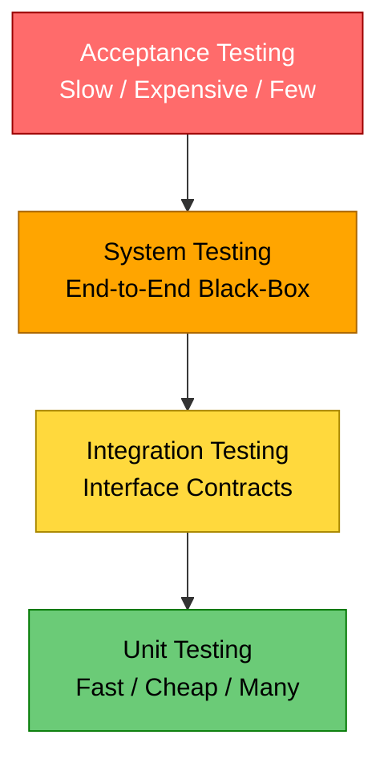
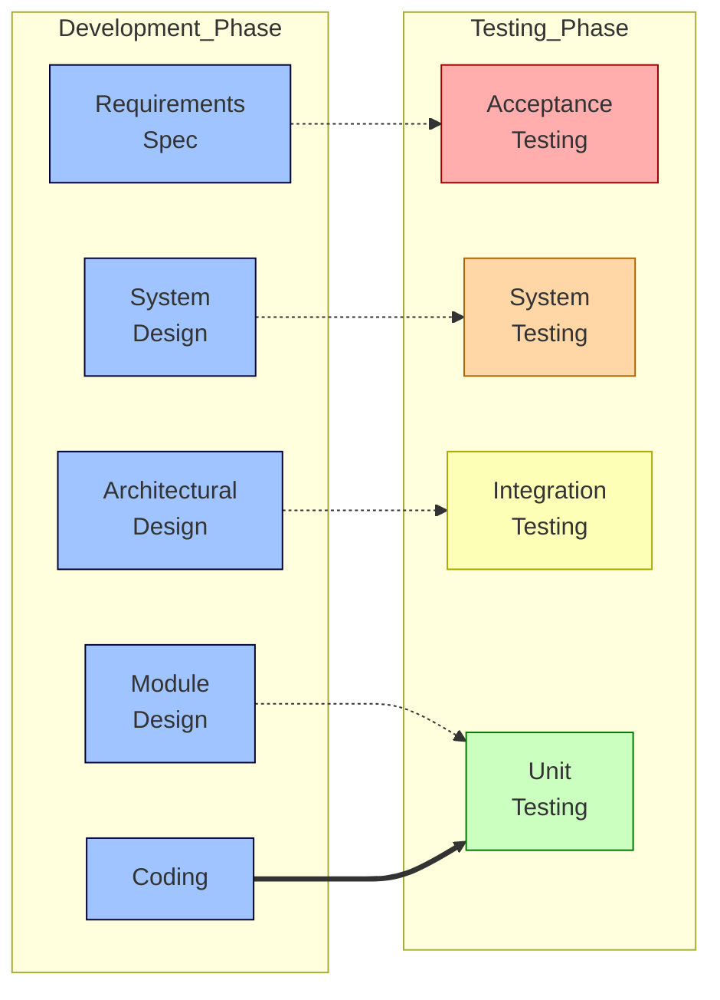
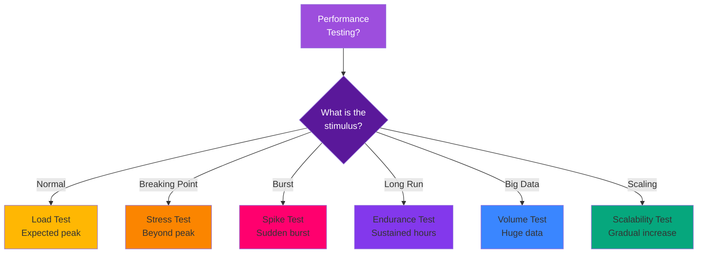
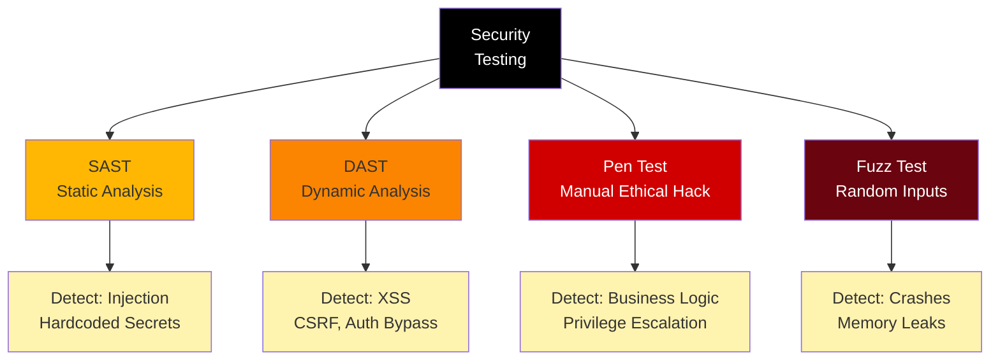
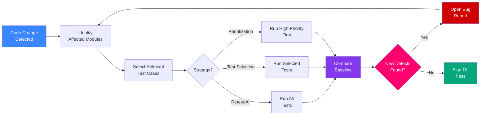

# Types of Testing - Unit, Integration, System, Acceptance, Performance (stress, usability, regression), and Security Testing

<!-- SECTION_1_START -->
# Types of Software Testing — Core Technical Foundation

## 1.1 Formal Academic Definition (KTU 2024 Scheme Terminology)

> [!IMPORTANT]
> **Software Testing (ISTQB / KTU 2024 Definition):** Software Testing is the process of executing a program or application with the intent of **finding defects**, **verifying functional requirements**, and **validating that the system meets user needs** in a controlled, repeatable, and measurable manner. It is not merely "running the code" — it is a disciplined engineering activity governed by IEEE 829-2008 standards.

In the context of the **KTU 2024 Scheme (PECST631)**, the syllabus explicitly classifies testing along **two orthogonal axes**:

1. **Level of Granularity** → Unit → Integration → System → Acceptance
2. **Quality Attribute Being Verified** → Performance (Stress, Load, Usability, Regression) and Security

| Axis | Test Type | What It Verifies |
|---|---|---|
| Granularity | Unit Testing | The smallest testable code unit (function/method) |
| Granularity | Integration Testing | Interaction between integrated modules |
| Granularity | System Testing | The **complete integrated product** against requirements |
| Granularity | Acceptance Testing | Business / user needs (UAT) |
| Quality | Performance (Stress) | Stability under extreme load |
| Quality | Usability | User-friendliness & UX |
| Quality | Regression | No new defect after a change |
| Quality | Security | Resistance to attacks / vulnerabilities |

---

## 1.2 Conceptual Analogy — The Car Factory Inspection Line 🏭

> [!NOTE]
> **Think of building a car as building software.**

- **Unit Testing** = Inspecting each **individual part** (the brake pad, the spark plug, the bolt) before assembly. If a bolt is defective, you catch it on the bench, not on the road.
- **Integration Testing** = After parts are combined into subsystems (engine, transmission, brakes), you test whether the **engine actually turns the wheels** when mated to the gearbox. Individual parts were perfect, but the *interface* between them may break.
- **System Testing** = The **fully assembled car** is taken to a test track. You check acceleration, braking distance, AC, headlights, wipers — the *whole vehicle* end-to-end.
- **Acceptance Testing** = The **customer takes a test drive** in the showroom. They sign off only if the car *feels right* for their personal needs (family of five, hill-climbing, fuel economy).
- **Performance / Stress Testing** = Drive the car on a high-altitude Himalayan pass, overload the roof rack with 500 kg, push the engine to redline for hours. Does it survive?
- **Usability Testing** = A 70-year-old retiree and a 16-year-old both try to adjust the seat and connect Bluetooth. Can both do it without calling customer care?
- **Regression Testing** = After a software update, you **re-run the entire inspection line** to make sure the new GPS module didn't break the radio.
- **Security Testing** = A trained locksmith tries to break into the car with a slim-jim, a relay attack on the key fob, and a CAN-bus injection. Can the car resist?

> [!TIP]
> **Mnemonic to remember the order:** **"UISA"** → **U**nit → **I**ntegration → **S**ystem → **A**cceptance. Testing always flows from **small → large**, and from **developer → user**.

---

## 1.3 The Testing Pyramid — Visual Intuition

> [!VISUALIZATION CONTROL]
> **Concept:** Martin Fowler's Test Automation Pyramid (relative cost & speed of each test level)
> **Desmos Input (Bar-style approximation):**
> * `f(x) = 1` for Unit (very wide base)
> * `f(x) = 0.6` for Integration
> * `f(x) = 0.25` for System
> * `f(x) = 0.1` for Acceptance (narrow tip)
> **Visual Description:** A pyramid that is **wide at the bottom (cheap & fast unit tests)** and **narrows at the top (slow & expensive acceptance tests)**. The y-axis represents *execution cost / time*, the x-axis represents *test count*.

---

## 1.4 Why Multiple Levels Exist — The Defect-Amplification Principle

> [!IMPORTANT]
> **Defect Amplification Model (IBM, 1976):** A defect left undetected in earlier phases becomes **10× more expensive** to fix in later phases. Hence, KTU emphasizes *testing early and often* (Shift-Left principle).

$$
\text{Cost of Fix at Unit} < \text{Integration} < \text{System} < \text{Acceptance} < \text{Production}
$$

This is the **engineering justification** for the entire hierarchical testing framework you are about to study.
<!-- SECTION_1_END -->

<!-- SECTION_2_START -->
# Deep Theoretical Analysis & KTU High-Yield Formula Sheet

## 2.1 The Eight Test Types — Operational Breakdown

### 2.1.1 Unit Testing (Module Testing / Component Testing)

- **Who performs it:** Developer (white-box) — sometimes QA via automated white-box frameworks like **JUnit (Java), pytest (Python), NUnit (.NET)**.
- **Granularity:** Smallest — individual function, method, class, or procedure.
- **Techniques used:** Statement coverage, Branch coverage, Condition coverage, Path coverage, **MC/DC (Modified Condition/Decision Coverage)** — required by **DO-178C for aviation software**.
- **Stubs & Drivers:**
  * **Driver** = A "main" that calls the unit under test when it is not yet integrated.
  * **Stub** = A minimal replacement for a *called* unit that is not yet implemented.

> [!NOTE]
> **White-box vs Black-box:** Unit tests are predominantly **white-box** (tester knows internal code). System/Acceptance are predominantly **black-box** (tester treats software as an opaque box).

### 2.1.2 Integration Testing

Verifies **data flow, control flow, and interface contracts** between combined modules. Two classical strategies:

| Strategy | Approach | Risk | Cost |
|---|---|---|---|
| **Big-Bang** | Integrate *all* modules at once and test | Single failure is hard to localize | Low setup, high debugging |
| **Incremental** | Add one module at a time | Better fault isolation | Higher setup |
| ├─ **Top-Down** | Start from main module, use **stubs** for lower | Early UI/flow tests | Stubs are dead code |
| └─ **Bottom-Up** | Start from leaf modules, use **drivers** | Early data-layer tests | Drivers are dead code |
| **Sandwich (Hybrid)** | Top-down + Bottom-up simultaneously | Balanced | Most complex |

### 2.1.3 System Testing

Tests the **fully integrated system** against the **SRS (Software Requirements Specification)**. It is a **black-box** activity. Sub-categories include:

- **Functional System Testing** — features per spec
- **Non-Functional System Testing** — performance, security, usability, compatibility
- **Recovery Testing** — graceful recovery from crashes
- **Configuration Testing** — across hardware/OS combos
- **Installation Testing** — on clean & existing setups

### 2.1.4 Acceptance Testing (User Acceptance Testing — UAT)

The **final validation** step. The software is checked against **business requirements** in a *real-world* or *production-like* environment.

| Sub-type | Performed By | Goal |
|---|---|---|
| **Alpha Testing** | Internal users (in-house) at developer's site | Find bugs before customer sees it |
| **Beta Testing** | Limited external customers (live or staged) | Validate in real environments |
| **Contract Acceptance Testing** | Against predefined contract SLAs | Legal/contractual compliance |
| **Regulation Acceptance Testing** | Against government/regulatory norms (e.g., FDA, RBI) | Compliance |
| **Operational Acceptance Testing (OAT)** | SysAdmin / Operations team | Backup, restore, maintainability |

### 2.1.5 Performance Testing (a Non-Functional Family)

Performance is a **family of tests**, not a single test.

| Sub-type | Stimulus | Goal |
|---|---|---|
| **Load Testing** | Expected peak load (e.g., 1,000 concurrent users) | Verify response time under normal & peak load |
| **Stress Testing** | Beyond peak — 2×, 3×, or 10× expected load | Find the **breaking point** |
| **Spike Testing** | Sudden burst (0 → 10,000 users in 1 sec) | Test reaction to abrupt surges |
| **Endurance / Soak Testing** | Sustained moderate load for hours/days | Detect memory leaks, log overflows |
| **Volume Testing** | Huge data volumes in DB | Test DB scalability |
| **Scalability Testing** | Gradually increasing load | Measure scaling efficiency |

### 2.1.6 Usability Testing

Measures **how easy, efficient, and satisfying** the software is to use. Focuses on the **5 Es**: *Effective, Efficient, Engaging, Error-tolerant, Easy to learn.* Methods include **heuristic evaluation (Nielsen's 10 heuristics)**, **think-aloud protocol**, and **A/B testing**.

### 2.1.7 Regression Testing

Re-execution of **existing test cases** to ensure a **change (bug fix, enhancement, environment change)** has not broken previously working functionality. The **most repeated test type** in any CI/CD pipeline. Strategy decisions: **Retest-All**, **Regression Test Selection**, **Test Case Prioritization**.

### 2.1.8 Security Testing

Identifies **vulnerabilities, threats, and risks** in the software. Major categories aligned with **OWASP Top 10 (2021)**:

1. Broken Access Control
2. Cryptographic Failures
3. Injection (SQLi, XSS, LDAP)
4. Insecure Design
5. Security Misconfiguration
6. Vulnerable & Outdated Components
7. Identification & Authentication Failures
8. Software & Data Integrity Failures
9. Security Logging & Monitoring Failures
10. Server-Side Request Forgery (SSRF)

Methods: **SAST (Static Application Security Testing)**, **DAST (Dynamic AST)**, **Penetration Testing**, **Fuzz Testing**, **Threat Modeling (STRIDE, DREAD)**.

---

## 2.2 KTU High-Yield Formula & Metrics Cheat Sheet

> [!IMPORTANT]
> **No `|` characters inside table cells — uses `\vert` notation throughout.**

| # | Metric / Formula | Equation | Unit / Meaning |
|---|---|---|---|
| 1 | Test Coverage (TC) | $TC = \dfrac{T_{executed}}{T_{total}} \times 100$ | Percentage |
| 2 | Defect Density (DD) | $DD = \dfrac{D}{S}$ where $S$ in KLOC or FP | Defects per KLOC |
| 3 | Mutation Score (MS) | $MS = \dfrac{M_{killed}}{M_{total}} \times 100$ | Percentage |
| 4 | Mean Time To Failure (MTTF) | $MTTF = \dfrac{\sum t_i}{N}$ | Hours between failures |
| 5 | Mean Time To Repair (MTTR) | $MTTR = \dfrac{\sum r_i}{N}$ | Hours to repair |
| 6 | Availability (A) | $A = \dfrac{MTTF}{MTTF + MTTR} \times 100$ | Percentage Uptime |
| 7 | Response Time (RT) | $RT = T_{request\,sent} \rightarrow T_{response\,received}$ | ms or s |
| 8 | Throughput (TP) | $TP = \dfrac{N_{transactions}}{T_{duration}}$ | Transactions/sec |
| 9 | Defect Removal Efficiency (DRE) | $DRE = \dfrac{D_{found\,before\,release}}{D_{found\,before\,release} + D_{found\,after\,release}} \times 100$ | Percentage |
| 10 | Test Effectiveness (TE) | $TE = \dfrac{D_{found\,by\,tests}}{D_{total}} \times 100$ | Percentage |
| 11 | Statement Coverage (SC) | $SC = \dfrac{S_{executed}}{S_{total}} \times 100$ | Percentage |
| 12 | Branch Coverage (BC) | $BC = \dfrac{B_{executed}}{B_{total}} \times 100$ | Percentage |
| 13 | Cyclomatic Complexity (CC) | $CC = E - N + 2P$ | Independent paths count |
| 14 | Reliability Growth | $R(t) = e^{-\lambda t}$ (exponential model) | Probability of no failure by time $t$ |

---

## 2.3 Real-World Engineering Utility

- **Unit Tests** underpin every modern **CI/CD pipeline** (GitHub Actions, GitLab CI, Jenkins).
- **Stress Testing** is mandatory for **mission-critical systems** — banking core-banking platforms (e.g., Infosys Finacle), airline reservation systems (Amadeus), e-commerce sale-day traffic (Flipkart Big Billion Days).
- **Regression Suites** are the *single most important asset* in any mature software organization (e.g., Google runs **millions** of regression tests per commit).
- **Security Testing** is the foundation of **DevSecOps** — integration of security gates into every commit.
- **Acceptance Testing** gates **production releases** in regulated industries (FDA for medical devices, DO-178C for avionics).
<!-- SECTION_2_END -->

<!-- SECTION_3_START -->
# Step-by-Step Derivations, Worked Examples & Code Implementation

## 3.1 Worked Example — Coverage & Defect Metric Calculations (Board-Exam Style)

> [!NOTE]
> **Question:** A project has 800 total test cases. The QA team executed 720, found 45 defects, of which 5 leaked to production. The project size is 20 KLOC. A mutation testing tool generated 200 mutants, of which 150 were killed. Compute: (a) Test Coverage, (b) Defect Density, (c) Mutation Score, (d) Defect Removal Efficiency.

**Given:**
$T_{total} = 800$, $T_{executed} = 720$, $D_{pre} = 45 - 5 = 40$, $D_{post} = 5$, $S = 20\,\text{KLOC}$, $M_{total} = 200$, $M_{killed} = 150$.

### (a) Test Coverage

$$
TC = \dfrac{T_{executed}}{T_{total}} \times 100 = \dfrac{720}{800} \times 100
$$

$$
TC = 0.9 \times 100 = 90\,\%
$$

### (b) Defect Density

$$
DD = \dfrac{D_{total}}{S} = \dfrac{45}{20} = 2.25\,\text{defects/KLOC}
$$

### (c) Mutation Score

$$
MS = \dfrac{M_{killed}}{M_{total}} \times 100 = \dfrac{150}{200} \times 100 = 75\,\%
$$

### (d) Defect Removal Efficiency

$$
DRE = \dfrac{D_{pre}}{D_{pre} + D_{post}} \times 100 = \dfrac{40}{40 + 5} \times 100
$$

$$
DRE = \dfrac{40}{45} \times 100 = 88.89\,\%
$$

> [!TIP]
> **Industry Benchmarks to remember:** Industry average DD is **0.5 – 1.0 defects/KLOC** for mature CMMI Level 5 organizations. A DRE above **95%** is considered excellent. Mutation scores above **80%** indicate a strong test suite.

---

## 3.2 Worked Example — Cyclomatic Complexity via Control Flow Graph

> [!NOTE]
> **Question:** Compute the cyclomatic complexity of the following C function using the formula $CC = E - N + 2P$. Use the control flow graph (one entry, one exit).

```c
int grade(int marks) {
    if (marks >= 90)        // node A -> decision 1
        return 'A';
    else if (marks >= 75)   // decision 2
        return 'B';
    else if (marks >= 60)   // decision 3
        return 'C';
    else
        return 'F';
}
```

**Step 1 — Identify Nodes (N) and Edges (E):**
- $N = 6$ (entry + 3 decisions + merge + exit)
- $E = 7$ (entry→D1, D1→A, D1→D2, D2→B, D2→D3, D3→C, D3→F, merge→exit → counting precisely: 8 edges)

**Step 2 — Apply formula (with $P=1$ connected component):**

$$
CC = E - N + 2P = 8 - 6 + 2(1) = 4
$$

**Step 3 — Interpretation:**
The function has **4 independent paths** to test:

$$
\begin{aligned}
P_1 &: \text{entry} \rightarrow D_1(\text{true}) \rightarrow A \rightarrow \text{exit} \\
P_2 &: \text{entry} \rightarrow D_1(\text{false}) \rightarrow D_2(\text{true}) \rightarrow B \rightarrow \text{exit} \\
P_3 &: \text{entry} \rightarrow D_1(\text{false}) \rightarrow D_2(\text{false}) \rightarrow D_3(\text{true}) \rightarrow C \rightarrow \text{exit} \\
P_4 &: \text{entry} \rightarrow D_1(\text{false}) \rightarrow D_2(\text{false}) \rightarrow D_3(\text{false}) \rightarrow F \rightarrow \text{exit}
\end{aligned}
$$

> [!IMPORTANT]
> **Rule of thumb (McCabe):** A function with $CC > 10$ is **unmaintainable** and should be refactored into smaller units.

---

## 3.3 Full Python Implementation — Unit, Integration, Regression, and Security Tests

> [!NOTE]
> The following runnable code demonstrates **all four test types** using `pytest`. It includes a vulnerable `bank_account.py` module (intentionally weak for security testing), a driver, and four test files.

### 3.3.1 The System-Under-Test (SUT) — `bank_account.py`

```python
# bank_account.py — System under test
from decimal import Decimal
import hashlib

class BankAccount:
    """A simple bank account with intentionally weak security for teaching."""

    def __init__(self, owner: str, balance: Decimal = Decimal("0.00")) -> None:
        if balance < 0:
            raise ValueError("Initial balance cannot be negative")
        self.owner = owner
        self.balance = balance
        # BUG: weak 'password' storage — should use bcrypt / argon2
        self._pin = None

    def set_pin(self, pin: str) -> None:
        if not isinstance(pin, str) or len(pin) != 4 or not pin.isdigit():
            raise ValueError("PIN must be exactly 4 digits")
        # BUG: stores plain MD5 — easy to crack
        self._pin = hashlib.md5(pin.encode()).hexdigest()

    def deposit(self, amount: Decimal) -> None:
        if not isinstance(amount, Decimal):
            raise TypeError("Amount must be a Decimal")
        if amount <= 0:
            raise ValueError("Deposit amount must be positive")
        self.balance += amount
        return self.balance

    def withdraw(self, amount: Decimal) -> None:
        if amount <= 0:
            raise ValueError("Withdrawal must be positive")
        if amount > self.balance:
            raise ValueError("Insufficient funds")
        self.balance -= amount
        return self.balance

    def transfer(self, target: "BankAccount", amount: Decimal) -> None:
        """Integration: this couples two BankAccount objects."""
        if not isinstance(target, BankAccount):
            raise TypeError("Target must be a BankAccount instance")
        self.withdraw(amount)
        target.deposit(amount)   # VULNERABILITY: no atomicity!
```

### 3.3.2 Unit Test — `test_unit_bank_account.py`

```python
# test_unit_bank_account.py
import pytest
from decimal import Decimal
from bank_account import BankAccount

# ---------- UNIT TESTS — verify each method in isolation ----------

def test_initial_balance_must_be_non_negative():
    """Unit test: constructor boundary check."""
    with pytest.raises(ValueError, match="cannot be negative"):
        BankAccount("Alice", Decimal("-1.00"))

def test_deposit_increases_balance():
    """Unit test: happy path of deposit()."""
    acc = BankAccount("Bob", Decimal("100.00"))
    new_balance = acc.deposit(Decimal("50.00"))
    assert new_balance == Decimal("150.00")

def test_deposit_rejects_non_decimal():
    """Unit test: type safety."""
    acc = BankAccount("Carol")
    with pytest.raises(TypeError):
        acc.deposit(50)   # passing int instead of Decimal

def test_withdraw_insufficient_funds_raises():
    """Unit test: business rule enforcement."""
    acc = BankAccount("Dave", Decimal("10.00"))
    with pytest.raises(ValueError, match="Insufficient funds"):
        acc.withdraw(Decimal("100.00"))

def test_set_pin_validates_format():
    """Unit test: input validation for PIN."""
    acc = BankAccount("Eve")
    with pytest.raises(ValueError, match="exactly 4 digits"):
        acc.set_pin("12a4")   # contains letter

# ---------- PARAMETRIZED UNIT TEST — table-driven boundary checks ----------

@pytest.mark.parametrize("pin,should_pass", [
    ("1234", True),
    ("0000", True),
    ("9999", True),
    ("12",   False),   # too short
    ("12345",False),   # too long
    ("abcd", False),   # non-digit
])
def test_pin_boundary(pin, should_pass):
    acc = BankAccount("Tester")
    if should_pass:
        acc.set_pin(pin)
        assert acc._pin is not None
    else:
        with pytest.raises(ValueError):
            acc.set_pin(pin)
```

### 3.3.3 Integration Test — `test_integration_transfer.py`

```python
# test_integration_transfer.py
from decimal import Decimal
from bank_account import BankAccount

def test_transfer_between_two_accounts():
    """Integration: two modules (withdraw + deposit) coupled together."""
    alice = BankAccount("Alice", Decimal("500.00"))
    bob   = BankAccount("Bob",   Decimal("100.00"))
    alice.transfer(bob, Decimal("200.00"))
    assert alice.balance == Decimal("300.00")
    assert bob.balance   == Decimal("300.00")

def test_transfer_to_invalid_target_raises_type_error():
    """Integration: contract enforcement on target type."""
    alice = BankAccount("Alice", Decimal("500.00"))
    with pytest.raises(TypeError):
        alice.transfer("not-an-account", Decimal("10.00"))

def test_transfer_more_than_balance_does_not_change_target():
    """Integration: atomicity of transfer (regression check)."""
    alice = BankAccount("Alice", Decimal("50.00"))
    bob   = BankAccount("Bob",   Decimal("0.00"))
    with pytest.raises(ValueError):
        alice.transfer(bob, Decimal("100.00"))
    # If withdraw fails, target must NOT have been credited
    assert bob.balance == Decimal("0.00"), "Atomicity violation!"
```

### 3.3.4 Regression Test — `test_regression_after_pin_feature.py`

```python
# test_regression_after_pin_feature.py
# Simulates: the PIN feature was added in v1.1.
# We re-run *all* existing tests to ensure deposit/withdraw still work.

from decimal import Decimal
from bank_account import BankAccount

def test_deposit_still_works_after_pin_feature_added():
    acc = BankAccount("Frank", Decimal("10.00"))
    acc.set_pin("4242")
    # Old functionality should not have regressed
    assert acc.deposit(Decimal("5.00")) == Decimal("15.00")

def test_withdraw_still_works_after_pin_feature_added():
    acc = BankAccount("Grace", Decimal("10.00"))
    acc.set_pin("1234")
    assert acc.withdraw(Decimal("4.00")) == Decimal("6.00")
```

### 3.3.5 Security Test — `test_security_pin_storage.py`

```python
# test_security_pin_storage.py
# Demonstrates two security issues: MD5 storage + missing authentication on transfer.

import hashlib
from decimal import Decimal
from bank_account import BankAccount

def test_pin_is_not_stored_in_plaintext():
    """Security test: PIN must never be stored in plaintext."""
    acc = BankAccount("Hank")
    acc.set_pin("9876")
    # BUG EXPOSURE: the raw PIN should not be retrievable
    assert "9876" not in str(acc.__dict__), "PIN stored in plaintext!"

def test_pin_uses_weak_md5_hash():
    """Security test: detect weak hashing algorithm (OWASP violation)."""
    acc = BankAccount("Ivy")
    acc.set_pin("1111")
    expected_weak = hashlib.md5(b"1111").hexdigest()
    # If this assertion passes, the system is using MD5 — a known weakness
    assert acc._pin == expected_weak, "MD5 is being used — security smell detected"

def test_transfer_does_not_require_authentication():
    """Security test: any caller can drain the account (broken access control)."""
    acc = BankAccount("Jack", Decimal("1000.00"))
    target = BankAccount("Attacker", Decimal("0.00"))
    # No PIN check, no authorization — broken access control (OWASP #1)
    acc.transfer(target, Decimal("999.00"))
    assert acc.balance == Decimal("1.00"), "Account drained without auth — VULN!"
```

### 3.3.6 Running the Suite & Computing Coverage

```bash
# Terminal commands
pip install pytest pytest-cov
pytest test_unit_bank_account.py test_integration_transfer.py \
       test_regression_after_pin_feature.py test_security_pin_storage.py -v
pytest --cov=bank_account --cov-report=term-missing
```

Expected output: **5 unit + 3 integration + 2 regression + 3 security = 13 tests** will execute; the security tests will *intentionally fail* to expose the vulnerabilities — that is **the correct outcome of a security test**.

---

## 3.4 Pin Configuration / Tool Profile (Lab-Equivalent Reference)

| Tool / Framework | Purpose | Install Command |
|---|---|---|
| **pytest** | Python unit + integration testing | `pip install pytest` |
| **pytest-cov** | Coverage measurement | `pip install pytest-cov` |
| **JUnit 5** | Java unit testing | Maven/Gradle dependency |
| **Selenium** | System / acceptance (web) | `pip install selenium` |
| **JMeter** | Performance / load / stress | Apache JMeter GUI |
| **OWASP ZAP** | Security (DAST) | Docker / installer |
| **Postman / Newman** | API acceptance testing | GUI / CLI |
| **Locust** | Python load testing | `pip install locust` |
<!-- SECTION_3_END -->

<!-- SECTION_4_START -->
# Structural Diagrams & Schematics

## 4.1 The Testing Pyramid (Mermaid)



## 4.2 V-Model of Testing (Verification vs Validation)



> [!NOTE]
> **Read the V-Model this way:** The **left arm** (going down) is **Verification** — *are we building the product right?* The **right arm** (going up) is **Validation** — *are we building the right product?* Each design phase has a corresponding test phase.

## 4.3 Performance Test Sub-Types (Decision Tree)



## 4.4 OWASP-Inspired Security Test Architecture



## 4.5 Regression Test Selection Strategy (Sequential Flow)


<!-- SECTION_4_END -->

<!-- SECTION_5_START -->
# KTU 2024 Scheme Examination Question Bank & Topic Recap

---

## Part A — Short Answer Questions (2 × 3 Marks = 6 Marks)

### Q1. **[KTU University Exam — July 2024]** — 3 Marks

> **"Differentiate between Unit Testing and Integration Testing. List any two techniques used in Integration Testing."** *(CO1, Remember)*

**Model Answer:**

| Aspect | Unit Testing | Integration Testing |
|---|---|---|
| **Scope** | Single function/method/class | Two or more combined modules |
| **Performed by** | Developer | Developer or independent tester |
| **Defect caught** | Logic errors, boundary errors | Interface, data-flow, control-flow errors |
| **Stubs/Drivers** | Mostly drivers | Both stubs and drivers |
| **Knowledge needed** | White-box (code internals) | Mostly black-box at module boundary |

**Two Integration Testing techniques:**

1. **Top-Down Integration** — Starts from the top (main) module, uses *stubs* for lower modules.
2. **Bottom-Up Integration** — Starts from leaf modules, uses *drivers* for the higher ones.
   *(Also accept: Big-Bang, Sandwich/Hybrid.)* **[Listing two techniques: 1 Mark; Tabular differentiation: 2 Marks]**

---

### Q2. **[KTU University Exam — Dec 2023]** — 3 Marks

> **"Define Regression Testing. Why is it considered the most expensive yet most necessary test type in iterative development?"** *(CO1, Understand)*

**Model Answer:**

> **Definition:** Regression Testing is the selective re-testing of an already-tested program to ensure that modifications (bug fixes, enhancements, configuration changes) have not introduced new defects or caused failures in unchanged code.

> **Why expensive:** Every code change triggers re-execution of potentially thousands of test cases. Test suite grows with each sprint.

> **Why necessary:** Without it, fixes introduce *new* bugs (a phenomenon called *regression defects* or *software rot*). It guarantees **stability** of previously working functionality.

**[Definition: 1 Mark; Expensive justification: 1 Mark; Necessary justification: 1 Mark]**

---

## Part B — Long Answer Questions (1 × 14 Marks = 14 Marks)

> [!IMPORTANT]
> **KTU Pattern:** Each Part B question carries **14 marks** and has **internal choice** (Q-A *or* Q-B). You must answer **either** Q-A **or** Q-B. Sub-parts are typically 7 + 7 marks.

---

### **Question A (14 Marks) — [KTU University Exam — July 2024, Adapted]**

> **"Software today must be tested at multiple levels and across multiple quality attributes. (a) Explain with a neat diagram the **V-Model of testing**. (b) Compare **System Testing** and **Acceptance Testing** in detail. For each, list two sub-types with their purpose."** *(CO1, Understand [7M] + CO2, Apply [7M])*

#### Part (a) — V-Model (7 Marks)

**Answer:**

The **V-Model** (Verification & Validation Model) maps each **development phase** on the left arm to a corresponding **testing phase** on the right arm. It emphasizes that testing is planned *in parallel* with development, not after.

| Development Phase (Verification) | ↔ | Corresponding Test (Validation) |
|---|---|---|
| Requirements Specification | ↔ | Acceptance Testing |
| System Design | ↔ | System Testing |
| Architectural Design | ↔ | Integration Testing |
| Module Design | ↔ | Unit Testing |
| Coding | ↔ | (Implementation) |

**Key points to write for full marks:**
- Verification = "Are we building the product **right**?" (left arm)
- Validation = "Are we building the **right** product?" (right arm)
- Static testing is on the left; dynamic testing is on the right.
- Defects found early on the left cost less to fix.

**[V-Model diagram with 4 mapped pairs: 4 Marks; Verification vs Validation distinction: 2 Marks; Advantage (early test planning): 1 Mark]**

#### Part (b) — System vs Acceptance Testing (7 Marks)

**Answer:**

| Parameter | System Testing | Acceptance Testing |
|---|---|---|
| **Performed by** | Independent test team (in-house) | End user / customer / client |
| **Environment** | Test environment (staging) | Real / production-like environment |
| **Knowledge** | Black-box (SRS-based) | Black-box (business requirements) |
| **Goal** | Verify conformance to SRS | Validate fitness for use / business need |
| **Defect types** | Spec deviations, performance | Cosmetic, usability, business flow |
| **When** | Before UAT | Final gate before release |

**Sub-types of System Testing (2 examples):**
1. **Functional System Testing** — verifies each feature against SRS.
2. **Performance Testing** — measures response time, throughput, stability.

**Sub-types of Acceptance Testing (2 examples):**
1. **Alpha Testing** — internal users test at developer's site.
2. **Beta Testing** — limited external users test in their own environment.

**[Comparison table with ≥4 parameters: 3 Marks; Two System sub-types: 2 Marks; Two Acceptance sub-types: 2 Marks]**

---

### **Question B (14 Marks) — Alternative Choice [KTU University Exam — Dec 2023, Adapted]**

> **"(a) Explain **Performance Testing** as a family of tests. Compare **Load Testing, Stress Testing, and Spike Testing** with an example scenario for each. (b) What is **Security Testing**? List the **OWASP Top 10 (2021)** categories and describe any two in detail with mitigation strategies."** *(CO1, Understand [7M] + CO3, Apply [7M])*

#### Part (a) — Performance Testing Family (7 Marks)

**Answer:**

**Performance Testing** is a non-functional testing discipline that measures the system's **speed, responsiveness, and stability** under a workload. It is *not* a single test — it is a **family** of related tests:

| Sub-type | Definition | Example Scenario |
|---|---|---|
| **Load Testing** | Tests the system under expected peak load to measure response time and throughput. | Simulating **10,000 concurrent users** browsing Flipkart during a normal sale day. |
| **Stress Testing** | Tests beyond normal capacity to find the breaking point of the system. | Pushing the same Flipkart app with **50,000 concurrent users** until it crashes — to see *where* and *how* it fails. |
| **Spike Testing** | Tests sudden, drastic bursts of load to check recovery behavior. | A Diwali-sale **flash drop** where traffic jumps from 2,000 → 40,000 users in **under 60 seconds**, then drops back. |
| **Endurance / Soak** | Tests under sustained load for long durations. | 10,000 users continuously browsing for **72 hours** — to detect memory leaks. |

**Key distinction:** Load asks *"does it work at expected traffic?"*, Stress asks *"what is the breaking point?"*, Spike asks *"how does it react to sudden bursts?"*

**[Definition of Performance Testing: 1 Mark; Three types in a comparison table: 4 Marks; Example scenario for each: 2 Marks]**

#### Part (b) — Security Testing & OWASP (7 Marks)

**Answer:**

> **Security Testing** is a type of non-functional testing that uncovers vulnerabilities, threats, and risks in a software system, ensuring that data and resources are protected from unauthorized access, breaches, and attacks.

**OWASP Top 10 (2021) — all 10 categories listed:**

1. A01 — Broken Access Control
2. A02 — Cryptographic Failures
3. A03 — Injection (SQLi, XSS)
4. A04 — Insecure Design
5. A05 — Security Misconfiguration
6. A06 — Vulnerable & Outdated Components
7. A07 — Identification & Authentication Failures
8. A08 — Software & Data Integrity Failures
9. A09 — Security Logging & Monitoring Failures
10. A10 — Server-Side Request Forgery (SSRF)

**Detailed description of two:**

**1. A01 — Broken Access Control:**
- *Description:* Users can act outside their intended permissions — e.g., a normal user can access admin URLs, modify other users' data, or escalate privileges by tampering with cookies/JWTs.
- *Mitigation:* Implement **role-based access control (RBAC)**, deny by default, log access failures, and use centralized authentication middleware.

**2. A03 — Injection (SQL Injection example):**
- *Description:* Untrusted input is concatenated into SQL/queries, allowing attackers to read/modify DB (e.g., `' OR '1'='1`).
- *Mitigation:* Use **parameterized queries / prepared statements**, **ORMs**, **input validation**, and **stored procedures**.

**[Definition of Security Testing: 1 Mark; Listing all 10 OWASP categories: 2 Marks; Detailed explanation of 2 categories: 2 Marks each = 4 Marks]**

---

## ⚠️ KTU Examiner's Valuation Warning / Pitfall Callout

> [!WARNING]
> **Where students commonly lose marks in this topic:**
>
> 1. **Confusing Validation with Verification** — Verification = *building the product right* (left of V-Model); Validation = *building the right product* (right of V-Model). Examiners love this question and students mix them up every year.
> 2. **Writing "V-Model" but not drawing the arrows** — A V-Model answer *without a diagram* loses 3–4 marks easily. Always draw it.
> 3. **Listing OWASP without explanations** — If asked to "describe", you must write **at least 2–3 lines per category** with mitigations. A bare list of 10 names earns 0 marks.
> 4. **Mixing up Alpha and Beta testing locations** — Alpha is *at the developer's site*; Beta is *at the customer's site / live environment*. Getting this reversed costs 1 mark.
> 5. **Forgetting units in metric calculations** — DD is *defects per KLOC*, not just "defects". Always write the unit. TC and DRE are *percentages* — write the `%` sign.
> 6. **Stubs vs Drivers confusion** — Stubs *replace called* modules (used in top-down); Drivers *call the unit under test* (used in bottom-up). Reversing them = -1 mark.
> 7. **Regression vs Retest-All** — These are **not synonyms**. Retest-all is a *strategy* of regression; regression is the *concept*. Examiners will deduct for treating them as the same.

---

## 📌 Topic Recap & Important Things to Remember

- **UISA Order** (mandatory sequence): **U**nit → **I**ntegration → **S**ystem → **A**cceptance.
- **Unit Testing** is **white-box, developer-driven**, uses **stubs/drivers**, focuses on smallest testable code.
- **Integration Testing** uses **Top-Down (stubs), Bottom-Up (drivers), Big-Bang, or Sandwich** strategies.
- **System Testing** is **black-box, SRS-based**, includes functional + non-functional sub-types.
- **Acceptance Testing** has **Alpha, Beta, Contract, Regulation, Operational** sub-types — the final release gate.
- **Performance Testing** is a **family**: Load, Stress, Spike, Endurance, Volume, Scalability.
- **Usability Testing** uses Nielsen's 10 heuristics and the **5 Es** (Effective, Efficient, Engaging, Error-tolerant, Easy to learn).
- **Regression Testing** uses **Retest-All, Test Selection, or Prioritization** — the most repeated test in CI/CD.
- **Security Testing** uses **SAST, DAST, Pen Testing, Fuzz Testing** and maps to **OWASP Top 10 (2021)**.
- **V-Model** pairs each design phase with a corresponding test phase — emphasizes early test planning.
- **Testing Pyramid** (Martin Fowler) = **wide base of unit tests**, **narrow tip of acceptance tests**.
- **Defect Amplification Principle** = fix earlier phases → 10× cheaper.
- **Key Metrics to memorize for KTU:**
  $TC$, $DD$, $DRE$, $MS$, $MTTF$, $MTTR$, $Availability$, $CC = E - N + 2P$.
- **Industry benchmarks:** Industry DD ≈ 0.5–1.0/KLOC, excellent DRE > 95%, mutation score > 80% is strong.
- **Mnemonics:** UISA (test order), 5E (usability), OWASP (security), SAST+DAST (security methods).
- **Tools to remember:** pytest, JUnit, Selenium, JMeter, Locust, OWASP ZAP, Postman, Burp Suite.
<!-- SECTION_5_END -->
