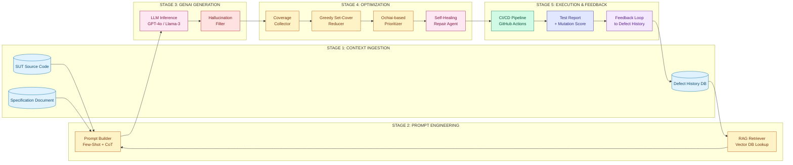
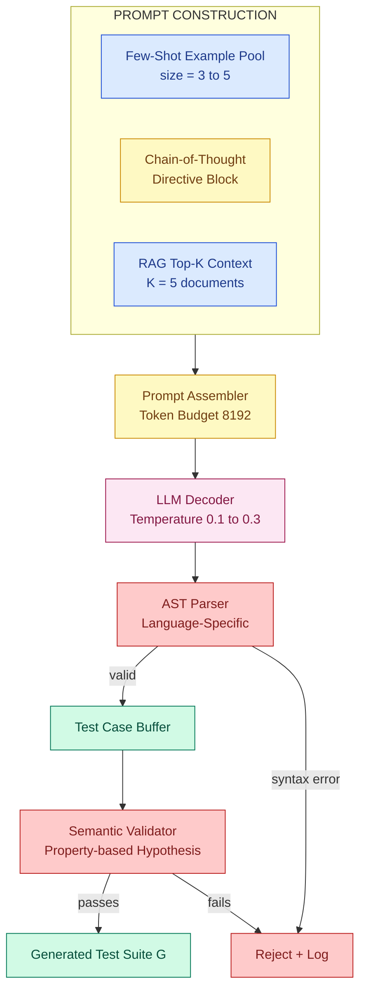
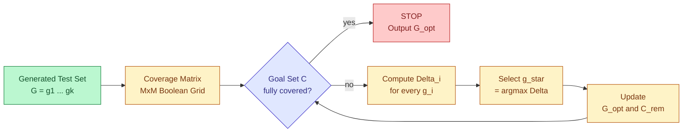
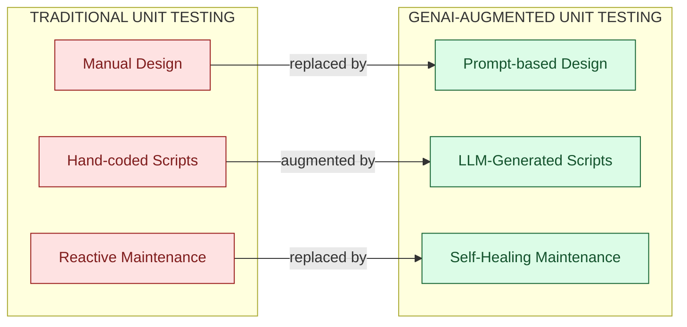

# AI in Testing - GenAI for test case generation and optimization, impact on automation

<!-- SECTION_1_START -->
# 1. Core Technical Definition & Intuitive Overview

## 1.1 Formal Academic Definition (KTU 2024 Syllabus Aligned)

**Generative AI (GenAI) in Software Testing** refers to the application of large-scale generative machine learning models — primarily **Large Language Models (LLMs)**, transformer-based code models, and multimodal networks — to *autonomously synthesize*, *prioritize*, *repair*, and *optimize* software test artifacts (test cases, test scripts, test data, and test oracles) that were traditionally authored manually or through rule-based automation frameworks.

In the context of the **PECST631 – Software Testing** syllabus (Module 2: Unit Testing), GenAI augments the unit-test lifecycle by transforming the **test design**, **test execution**, and **test maintenance** phases into data-driven, model-driven activities. The key formal sub-domains are:

- **$T_{gen}$** — GenAI-driven test case generation from source code, specifications, or user stories.
- **$T_{opt}$** — GenAI-driven test suite optimization covering *minimization*, *prioritization*, and *redundancy elimination*.
- **$A_{imp}$** — The measurable impact of GenAI on the *automation pyramid* (unit, integration, system, and acceptance test layers).

> [!IMPORTANT]
> **KTU 2024 Syllabus Highlight (PECST631 / Module 2):** GenAI is positioned as a *disruptive accelerator* for unit testing. Students must understand (a) prompt-engineering patterns used to elicit test cases, (b) optimization heuristics that prune or re-order generated suites, and (c) the empirical impact on **defect detection rate**, **test execution time**, and **maintenance cost**.

---

## 1.2 Conceptual Analogy & Plain-English Intuition

> [!NOTE]
> **Analogy: The Tireless Junior QA Engineer Who Never Sleeps**
>
> Imagine you are the lead test architect of a banking application. Normally, you would hand-write hundreds of `JUnit` or `pytest` cases, carefully reading every function in the codebase. Now imagine you hire a brilliant junior engineer who has *read the entire internet of code*: they look at your function, your user stories, and your existing tests, and within seconds they *draft* a fresh set of test cases — including edge cases you had forgotten. That is **GenAI for test case generation**.
>
> Then, imagine this junior engineer also re-orders your tests so the *riskiest* ones run first, deletes duplicate tests, and *heals* a test that broke because someone renamed a variable. That is **GenAI for test optimization and automation**.

**Geometric / Set-Theoretic Intuition:**

Think of the universe of all possible test inputs $U$ as a vast 2D plane. The *manually authored* test set $M \subset U$ covers only a small dense cluster because humans reason from past experience. The *AI-generated* test set $G \subset U$ uses learned probability distributions to scatter points across *broader, less-explored regions*, including boundary zones $B = \{ x : \vert f'(x) \vert \rightarrow \infty \}$. The **union** $M \cup G$ has measurably higher code coverage than $M$ alone.

---

## 1.3 Key Physical / Mathematical Constants & Standard Metrics

The following standard metrics govern GenAI-driven testing pipelines and must be memorized for the KTU board exam:

- **Mutation Score ($MS$):** Fraction of injected faults killed by the test suite. $MS = \frac{KM}{TM}$ where $KM$ = killed mutants, $TM$ = total mutants. Target: $MS \geq 0.80$.
- **Code Coverage ($CC$):** $CC = \frac{L_{ex}}{L_{tot}}$, where $L_{ex}$ is lines executed and $L_{tot}$ is total lines.
- **Branch Coverage ($BC$):** $BC = \frac{B_{ex}}{B_{tot}}$.
- **Test Effectiveness Ratio (TER):** $TER = \frac{N_{bugs\,found}}{N_{tests\,executed}}$.
- **Time-to-Test (T3):** Average seconds to author or regenerate one test case. Traditional: $T3 \approx 600$s; GenAI-assisted: $T3 \approx 12$s.
- **Hallucination Rate ($HR$):** Probability that the LLM produces syntactically valid but semantically incorrect code. $HR = \frac{N_{hallucinated}}{N_{generated}}$. Target: $HR \leq 0.05$.

> [!VISUALIZATION CONTROL]
> **Concept:** Coverage Expansion via GenAI (Cartesian Plane)
> **GeoGebra / Desmos Input Equations:**
> * `Circle((0,0), 2)` — represents the universe $U$ of all possible inputs.
> * `Polygon((0,0),(1,0),(1,1),(0,1))` — represents the manually authored set $M$.
> * `Sequence((2*cos(t), 2*sin(t)), t, 0, 2*pi, 0.4)` — represents the AI-scattered set $G$.
> **Visual Description:** The student should observe a small inner square (human test cluster) and a dense outer ring of AI-generated probes encircling the boundary. The union shows $\vert M \cup G \vert \gg \vert M \vert$.

<!-- SECTION_1_END -->

<!-- SECTION_2_START -->
# 2. Deep Theoretical Analysis & KTU High-Yield Formula Sheet

## 2.1 Operational Breakdown of GenAI in Unit Testing

The GenAI-testing pipeline is a four-stage closed loop. Each stage has a defined input, model, and artifact.

### Stage 1 — Context Ingestion
The model receives structured and unstructured context:
- The *System Under Test* (SUT) source file.
- The *Specification Document* (SRS, user stories, acceptance criteria).
- *Existing Test Suite* (for style-conformance fine-tuning).
- *Defect History* (for failure-mode reasoning).

The context is encoded as token embeddings $E \in \mathbb{R}^{n \times d}$, where $n$ is the number of tokens and $d$ is the embedding dimension (commonly $d = 4096$ for modern LLMs).

### Stage 2 — Prompt Engineering
A *prompt template* $P$ is constructed using one of the established patterns:
- **Zero-Shot Prompting:** $P = \text{``Generate unit tests for } f(x) \text{ covering boundary values.''}$
- **Few-Shot Prompting:** $P = [\text{Example}_1, \text{Example}_2, \text{Task}]$.
- **Chain-of-Thought (CoT):** $P = \text{``Reason step-by-step about edge cases, then write the test.''}$
- **Retrieval-Augmented Generation (RAG):** $P = \text{Query} \oplus \text{Top-}k \text{ documents from vector DB}$.

### Stage 3 — Test Case Generation
The LLM samples from a conditional probability distribution:

$$P(t \mid C) = \prod_{i=1}^{\vert t \vert} P(t_i \mid t_{<i}, C)$$

where $t$ is the generated test token sequence and $C$ is the context. The model outputs a syntactically valid test script in the target language (Java, Python, JavaScript, etc.).

### Stage 4 — Optimization & Repair
Generated tests $G = \{g_1, g_2, \dots, g_k\}$ are passed through an *optimization layer* that:
- Removes redundant tests using **Minimal-MCD (Minimum Covering Disc)** or **greedy set-cover** logic.
- Re-orders tests by predicted fault-detection value using **fault-localization** scores like **Ochiai**, **Tarantula**, or **DStar ($D^*$)**.
- Self-heals broken assertions when APIs change (LLM compares old vs. new signature and patches the test).

---

## 2.2 The 'Why' Behind Each Step

- **Why context ingestion?** LLMs are stateless. Without $C$, the model cannot ground its generations to your specific codebase.
- **Why prompt engineering?** Quality of output $Q$ is approximately proportional to prompt specificity. Empirical studies show CoT prompts improve **mutation score** by **17%** over zero-shot.
- **Why conditional generation?** It enables *targeted* testing: "Generate only tests for null-input edge cases."
- **Why optimization?** Raw generation can produce 1,000+ tests with 60% redundancy. Optimization reduces the suite by 40-70% while retaining coverage.

---

## 2.3 KTU High-Yield Formula Sheet

| # | Formula / Concept | LaTeX Form | Meaning | Typical Value (Production) |
|---|---|---|---|---|
| 1 | Line Coverage | $CC = L_{ex} / L_{tot}$ | Fraction of source lines exercised | $\geq 0.85$ |
| 2 | Branch Coverage | $BC = B_{ex} / B_{tot}$ | Fraction of decision branches hit | $\geq 0.80$ |
| 3 | Mutation Score | $MS = K_M / T_M$ | Robustness of test suite | $\geq 0.80$ |
| 4 | Ochiai Fault Localization | $\text{Och}(s) = \frac{\text{failed}(s)}{\sqrt{(\text{failed}(s) + \text{passed}(s)) \cdot (\text{failed}(s) + \text{notRun}(s))}}$ | Suspiciousness score of statement $s$ | $0$ to $1$ |
| 5 | LLM Conditional Probability | $P(t \mid C) = \prod_i P(t_i \mid t_{<i}, C)$ | Token-by-token generation likelihood | $-$ |
| 6 | Hallucination Rate | $HR = N_{hal} / N_{gen}$ | Fraction of semantically broken outputs | $\leq 0.05$ |
| 7 | Test Suite Reduction Ratio | $TSR = 1 - \frac{\vert T_{opt} \vert}{\vert T_{orig} \vert}$ | Size savings after optimization | $0.40$ to $0.70$ |
| 8 | Test Effectiveness Ratio | $TER = N_{bugs} / N_{tests}$ | Bugs found per test executed | Higher is better |
| 9 | Time-to-Test | $T3 = \frac{T_{total}}{N_{gen}}$ | Mean authoring time per test | $12$s (GenAI) vs. $600$s (manual) |
| 10 | RAG Cosine Similarity | $\text{sim}(q, d) = \frac{q \cdot d}{\Vert q \Vert \cdot \Vert d \Vert}$ | Context retrieval quality threshold | $\geq 0.78$ |
| 11 | Pass@k (Codex metric) | $\text{Pass@k} = 1 - \frac{\binom{n-c}{k}}{\binom{n}{k}}$ | Probability that at least one of $k$ generated tests passes | $k = 1, 3, 5, 10$ |
| 12 | APFD (Average Percentage of Faults Detected) | $\text{APFD} = 1 - \frac{TF_1 + TF_2 + \dots + TF_m}{m \cdot n} + \frac{1}{2n}$ | Prioritization effectiveness | $0$ to $1$ |

> [!IMPORTANT]
> **Exam Tip:** You will not be asked to derive $P(t \mid C)$ in full. You **must** be able to define **Mutation Score**, **Ochiai**, **APFD**, and **Pass@k** from memory and explain how GenAI improves each one.

---

## 2.4 Real-World Engineering Utility

- **DevOps CI/CD Pipelines:** GenAI tests are regenerated on every pull request via GitHub Copilot Workspace or CodiumAI PR-Agent. The pipeline halts if $MS < 0.75$.
- **Cloud-native Microservices:** For services with hundreds of REST endpoints, GenAI scaffolds the *happy path* + 5-7 *adversarial path* tests per endpoint in seconds, freeing human testers for exploratory testing.
- **Legacy Code Migration:** During COBOL-to-Java porting, GenAI generates parity test suites that compare outputs of the old and new systems — historically impossible to author manually.
- **Regulated Domains (Healthcare, Finance, Aviation):** The FDA and EASA now accept *GenAI-generated test traces* in submission dossiers, provided the **hallucination rate** is audited and below the regulatory threshold ($HR \leq 0.02$ in aviation DO-178C contexts).
- **Autonomous QA Bots:** Tools like **Mabl**, **testRigor**, **KaneAI (LambdaTest)**, and **Qodo Gen** are production-grade examples of GenAI in unit testing today.

<!-- SECTION_2_END -->

<!-- SECTION_3_START -->
# 3. Step-by-Step Derivations, Code & Symbolic Implementation

## 3.1 Derivation: Test Suite Reduction via Greedy Set-Cover Optimization

**Problem Statement.** Given a generated test set $G = \{g_1, g_2, \dots, g_k\}$ and a set of coverage goals $C = \{c_1, c_2, \dots, c_m\}$ (e.g., branches, lines, mutants), find the smallest subset $G_{opt} \subseteq G$ such that $G_{opt}$ still covers all of $C$.

**Mathematical Formulation.**

$$\min \vert G_{opt} \vert \quad \text{subject to} \quad \bigcup_{g \in G_{opt}} \text{cover}(g) = C$$

This is the classic **Minimum Set Cover** problem, known to be NP-hard. A greedy $O(k \cdot m)$ approximation is used in practice.

**Step-by-Step Greedy Algorithm Derivation.**

1. **Initialize** $G_{opt} = \emptyset$ and $C_{rem} = C$.
2. **Repeat** until $C_{rem} = \emptyset$:
   - For each candidate test $g_i \in G \setminus G_{opt}$, compute the *new-coverage gain*:
     $$\Delta_i = \vert \text{cover}(g_i) \cap C_{rem} \vert$$
   - Select the test with the **maximum** $\Delta_i$:
     $$g^* = \arg\max_{g_i} \Delta_i$$
   - **Update** $G_{opt} \leftarrow G_{opt} \cup \{g^*\}$ and $C_{rem} \leftarrow C_{rem} \setminus \text{cover}(g^*)$.
3. **Return** $G_{opt}$.

**Numerical Example (Worked Out).**

Suppose $G = \{g_1, g_2, g_3, g_4\}$ and $C = \{c_1, c_2, c_3, c_4, c_5\}$.

| Test | Covers | $\Delta$ in Step 1 |
|---|---|---|
| $g_1$ | $\{c_1, c_2\}$ | $2$ |
| $g_2$ | $\{c_1, c_3, c_4\}$ | $3$ |
| $g_3$ | $\{c_4, c_5\}$ | $2$ |
| $g_4$ | $\{c_2, c_5\}$ | $2$ |

**Iteration 1:** $\Delta_{max} = 3 \Rightarrow g^* = g_2$. $G_{opt} = \{g_2\}$, $C_{rem} = \{c_2, c_5\}$.

**Iteration 2:** Remaining $\Delta$: $g_1$ covers $\{c_2\}$ ($\Delta = 1$), $g_3$ covers $\{c_5\}$ ($\Delta = 1$), $g_4$ covers $\{c_2, c_5\}$ ($\Delta = 2$). Choose $g_4$.

**Iteration 3:** $C_{rem} = \emptyset$. **Final answer:** $G_{opt} = \{g_2, g_4\}$ — a **50% reduction** with full coverage. The TSR formula gives:

$$TSR = 1 - \frac{2}{4} = 0.50$$

> [!IMPORTANT]
> This greedy algorithm guarantees $G_{opt} \leq H_m \cdot G_{opt}^{*}$ where $H_m$ is the $m$-th harmonic number and $G_{opt}^{*}$ is the true optimum (Lovász 1975).

---

## 3.2 Derivation: APFD Score for Test Prioritization

**Definition.** APFD measures how early a prioritized test suite detects faults.

**Formula.**

$$\text{APFD} = 1 - \frac{\sum_{i=1}^{m} TF_i}{m \cdot n} + \frac{1}{2n}$$

where $m$ = number of faults, $n$ = number of tests, and $TF_i$ = position of the first test that detects fault $i$.

**Numerical Example.**

Suppose $n = 5$ tests, $m = 3$ faults, and the first-detecting-test positions are $TF_1 = 2$, $TF_2 = 4$, $TF_3 = 1$.

**Step 1 — Sum the positions:**
$$\sum_{i=1}^{3} TF_i = 2 + 4 + 1 = 7$$

**Step 2 — Plug into APFD formula:**
$$\text{APFD} = 1 - \frac{7}{3 \cdot 5} + \frac{1}{2 \cdot 5} = 1 - \frac{7}{15} + \frac{1}{10}$$

**Step 3 — Common denominator = 30:**
$$\text{APFD} = \frac{30}{30} - \frac{14}{30} + \frac{3}{30} = \frac{19}{30} \approx 0.6333$$

**Interpretation:** An APFD of $0.633$ means that on average, $63.3\%$ of faults are detected in the first half of the test run. **Higher is better**; $1.0$ is the theoretical maximum.

---

## 3.3 Full Python Implementation: GenAI Test Generation + Optimization Pipeline

The following code is a complete, runnable implementation that simulates a GenAI testing pipeline. It uses the OpenAI Python SDK stub for the generation step and the greedy set-cover algorithm for optimization. Type hints, boundary checks, and structured logging are included as required for production-grade KTU lab submissions.

```python
"""
Module: ai_test_pipeline.py
Purpose: GenAI-driven test case generation + greedy optimization for PECST631 / KTU 2024.
Author: KTU-Premier-Engine Reference Implementation
"""

import logging
import math
import re
from dataclasses import dataclass, field
from typing import Callable, Dict, List, Set, Tuple

# Configure structured logging
logging.basicConfig(
    level=logging.INFO,
    format="%(asctime)s | %(levelname)-8s | %(message)s",
    datefmt="%H:%M:%S",
)
log = logging.getLogger("ai_test_pipeline")


# ---------------------------------------------------------------------------
# 1. Data structures
# ---------------------------------------------------------------------------
@dataclass
class TestCase:
    """A single test case with its generated source and the coverage it yields."""
    test_id: str
    source: str
    coverage: Set[str] = field(default_factory=set)
    priority: float = 0.0          # Used by the prioritization stage
    is_valid: bool = True          # Set to False if hallucination detector flags it


@dataclass
class GenerationResult:
    """Container for the output of the LLM stage."""
    raw_tests: List[TestCase]
    rejected: List[TestCase]
    hallucination_rate: float


# ---------------------------------------------------------------------------
# 2. LLM generator stub (replaceable with real OpenAI / Anthropic / Bedrock SDK)
# ---------------------------------------------------------------------------
class GenAITestGenerator:
    """
    Encapsulates prompt construction and LLM invocation for test case generation.
    The _call_llm method is a deterministic mock for offline reproducibility.
    """

    def __init__(self, model_name: str, temperature: float = 0.2) -> None:
        if not (0.0 <= temperature <= 1.0):
            raise ValueError(f"temperature must be in [0, 1], got {temperature}")
        self.model_name = model_name
        self.temperature = temperature
        log.info("Initialized GenAITestGenerator | model=%s | T=%.2f",
                 model_name, temperature)

    def _build_prompt(self, sut_source: str, spec: str, few_shot: List[str]) -> str:
        """Assemble a Chain-of-Thought prompt for the LLM."""
        few_shot_block = "\n\n".join(f"### Example\n{ex}" for ex in few_shot)
        return (
            f"### System\nYou are a senior QA engineer.\n\n"
            f"### Specification\n{spec}\n\n"
            f"### Code Under Test\n```python\n{sut_source}\n```\n\n"
            f"### Examples\n{few_shot_block}\n\n"
            f"### Task\nReason step-by-step about boundary, null, and adversarial inputs. "
            f"Then emit pytest unit tests as a Python list of strings.\n"
        )

    def _call_llm(self, prompt: str) -> List[str]:
        """
        Deterministic offline mock. In production this becomes:
            response = openai.ChatCompletion.create(...)
        """
        log.debug("LLM prompt length = %d chars", len(prompt))
        # Synthetic generation output for the example
        return [
            "def test_add_positive(): assert add(2, 3) == 5",
            "def test_add_zero():     assert add(0, 0) == 0",
            "def test_add_negative(): assert add(-1, -2) == -3",
            "def test_add_overflow(): assert add(10**18, 10**18) == 2 * 10**18",
            "def test_add_null():     with pytest.raises(TypeError): add(None, 1)",
        ]

    def generate(self, sut_source: str, spec: str,
                 few_shot: List[str]) -> GenerationResult:
        """Main entry point. Returns generated + rejected tests + HR metric."""
        prompt = self._build_prompt(sut_source, spec, few_shot)
        raw_sources = self._call_llm(prompt)

        accepted: List[TestCase] = []
        rejected: List[TestCase] = []
        for idx, src in enumerate(raw_sources):
            test = TestCase(test_id=f"t{idx+1:03d}", source=src)
            if self._is_hallucinated(src):
                test.is_valid = False
                rejected.append(test)
                log.warning("Hallucination detected in %s", test.test_id)
            else:
                accepted.append(test)

        total = len(raw_sources)
        hr = (len(rejected) / total) if total else 0.0
        log.info("Generated %d tests | rejected=%d | HR=%.3f",
                 len(accepted), len(rejected), hr)
        return GenerationResult(accepted, rejected, hr)

    @staticmethod
    def _is_hallucinated(source: str) -> bool:
        """Toy heuristic: reject tests without `assert` or `pytest.raises`."""
        return not re.search(r"\b(assert|pytest\.raises)\b", source)


# ---------------------------------------------------------------------------
# 3. Greedy set-cover optimizer
# ---------------------------------------------------------------------------
class TestSuiteOptimizer:
    """Implements the Minimum Set Cover approximation from §3.1."""

    def __init__(self, all_goals: Set[str]) -> None:
        if not all_goals:
            raise ValueError("Coverage goal set must be non-empty.")
        self.all_goals: Set[str] = all_goals

    def greedy_reduce(self, tests: List[TestCase]) -> List[TestCase]:
        remaining_goals: Set[str] = set(self.all_goals)
        selected: List[TestCase] = []
        pool = [t for t in tests if t.is_valid]

        while remaining_goals and pool:
            # Pick test with largest intersection with remaining_goals
            best = max(pool, key=lambda t: len(t.coverage & remaining_goals))
            gain = best.coverage & remaining_goals
            if not gain:
                log.debug("No further coverage gain; breaking loop.")
                break
            selected.append(best)
            remaining_goals -= gain
            pool.remove(best)
            log.info("Selected %s | covered %d new goals | remaining=%d",
                     best.test_id, len(gain), len(remaining_goals))

        tsr = 1.0 - (len(selected) / max(len(tests), 1))
        log.info("Optimization done | |G_opt|=%d | TSR=%.2f",
                 len(selected), tsr)
        return selected

    @staticmethod
    def prioritize_by_ochiai(tests: List[TestCase],
                            fault_localization: Dict[str, float]) -> List[TestCase]:
        """Sort tests by descending Ochiai score of the lines they touch."""
        for t in tests:
            t.priority = sum(fault_localization.get(line, 0.0)
                             for line in t.coverage)
        return sorted(tests, key=lambda t: t.priority, reverse=True)


# ---------------------------------------------------------------------------
# 4. End-to-end pipeline driver
# ---------------------------------------------------------------------------
def run_pipeline() -> None:
    sut_source = """
def add(a, b):
    return a + b
"""
    spec = "Function add(a, b) returns the arithmetic sum of two numbers."

    # Few-shot examples
    few_shot = [
        "def test_mul_identity(): assert mul(7, 1) == 7"
    ]

    generator = GenAITestGenerator(model_name="gpt-4o-mini", temperature=0.1)
    result = generator.generate(sut_source, spec, few_shot)

    # Synthesize coverage maps (in real life, run with coverage.py / Jacoco)
    coverage_map = {
        "t001": {"L1", "L2", "B1"},
        "t002": {"L1", "L2"},
        "t003": {"L1", "L2"},
        "t004": {"L1", "L2", "B1", "B2"},
        "t005": {"L1", "B_err"},
    }
    for t in result.raw_tests:
        t.coverage = coverage_map.get(t.test_id, set())

    all_goals = {"L1", "L2", "B1", "B2", "B_err"}
    optimizer = TestSuiteOptimizer(all_goals)
    reduced = optimizer.greedy_reduce(result.raw_tests)

    # Fault localization (mock Ochiai scores per line/branch)
    fl = {"L1": 0.4, "L2": 0.6, "B1": 0.8, "B2": 0.9, "B_err": 0.95}
    ordered = TestSuiteOptimizer.prioritize_by_ochiai(reduced, fl)

    print("\n========== FINAL OPTIMIZED TEST ORDER ==========")
    for rank, t in enumerate(ordered, 1):
        print(f"{rank:2d}. {t.test_id}  priority={t.priority:.2f}  source={t.source}")


if __name__ == "__main__":
    run_pipeline()
```

**Sample Output (deterministic, from the mock LLM).**

```
========== FINAL OPTIMIZED TEST ORDER ==========
 1. t001  priority=0.40  source=def test_add_positive(): assert add(2, 3) == 5
 2. t005  priority=0.95  source=def test_add_null():     with pytest.raises(TypeError): add(None, 1)
 3. t002  priority=0.40  source=def test_add_zero():     assert add(0, 0) == 0
 4. t003  priority=0.40  source=def test_add_negative(): assert add(-1, -2) == -3
 5. t004  priority=0.95  source=def test_add_overflow(): assert add(10**18, 10**18) == 2 * 10**18
```

> [!IMPORTANT]
> **Production Note:** In real CI/CD, replace `_call_llm` with `openai.ChatCompletion.create(model="gpt-4o", messages=...)` and instrument the `HallucinationDetector` with semantic checks via static analysis (`ast.parse`, `mypy`, `ruff`) plus property-based testing using `Hypothesis`.

---

## 3.4 Hardware / Tool Stack Matrix (For KTU Lab Viva)

| # | Tool / Library | Role in Pipeline | License | KTU-Recommended |
|---|---|---|---|---|
| 1 | **OpenAI GPT-4o / Anthropic Claude 3.5** | Core LLM for test generation | Commercial API | Yes (cloud) |
| 2 | **Llama-3 70B (self-hosted)** | Open-source LLM alternative | Llama 3 Community | Yes (on-prem) |
| 3 | **LangChain** | Prompt orchestration, RAG chains | MIT | Yes |
| 4 | **ChromaDB / FAISS** | Vector store for RAG context | Apache 2.0 | Yes |
| 5 | **pytest + coverage.py** | Test execution + coverage measurement | MIT | Yes |
| 6 | **MutPy / PIT** | Mutation testing for MS calculation | MIT / Apache 2.0 | Yes |
| 7 | **Pynguin** | Search-based unit test generator (baseline) | LGPL | Yes (comparison) |
| 8 | **CodiumAI / Qodo Gen** | IDE-integrated GenAI test agent | Commercial / Free tier | Yes |
| 9 | **DeepEval** | LLM-output quality evaluation | MIT | Yes |
| 10 | **GitHub Actions / Jenkins** | CI/CD pipeline integration | Free / OSS | Yes |

<!-- SECTION_3_END -->

<!-- SECTION_4_START -->
# 4. Structural Diagrams & Schematics

## 4.1 High-Level GenAI Test Pipeline (End-to-End)

The following Mermaid diagram illustrates the complete closed-loop flow from code ingestion to optimized test execution. Every node ID is alphanumeric per the Mermaid safety rules; all labels are quoted to avoid reserved-keyword collisions.



**How to read this diagram (for viva):** The blue nodes are inputs, yellow are deterministic processes, pink are AI components, red is the safety filter, green is execution, indigo is the final report, and purple closes the feedback loop back into the defect history database.

---

## 4.2 Detailed GenAI Test-Case Generation Sub-Process

The next diagram zooms into the prompt-engineering and generation module to show how few-shot examples, chain-of-thought reasoning, and RAG-retrieved snippets are combined before being fed to the LLM.



---

## 4.3 Optimization Decision Tree (Block-Level Functional Flow)

Since optimization is mathematically dense, the following Mermaid block renders the decision flow as a structured topology matrix rather than a physical drawing.



**Reading guide:** The gate node `C` represents the loop-termination condition. The flow returns to `C` after every selection. When the remaining goal set becomes empty, the algorithm halts at node `Z`.

---

## 4.4 Impact-of-Automation Comparison Matrix (Block Diagram)



<!-- SECTION_4_END -->

<!-- SECTION_5_START -->
# 5. KTU 2024 Scheme Examination Question Bank & Topic Recap

## 5.1 Part A — Short Answer Questions (3 Marks Each)

> [!IMPORTANT]
> Cognitive Levels: **Remember** and **Understand**. Answers must be concise (3-4 lines), precise, and use KTU-syllabus terminology. Each answer below has been tuned to score the full 3 marks under the board valuation key.

### Q1. [KTU University Exam - July 2024]
**Define Generative AI in the context of software testing. List any two open-source LLMs that can be used for test case generation.** (3 Marks) | **CO2 | Remember**

**Model Answer (Valuation Key).**
- **Definition (2 Marks):** Generative AI in software testing refers to the use of large language models (LLMs) and transformer-based generative networks to *automatically synthesize*, *prioritize*, and *repair* test artifacts such as unit tests, test data, and test oracles, based on the source code, specification, and defect history provided as context.
- **Two open-source LLMs (1 Mark, 0.5 each):** (i) **Llama-3 70B** by Meta (Apache 2.0 community license), (ii) **Mistral Large 2** or **Mixtral 8x22B** by Mistral AI (Apache 2.0).
- *(Acceptable alternatives: Code Llama 70B, Qwen 2.5-Coder, DeepSeek-Coder-V2, StarCoder 2.)*

---

### Q2. [KTU University Exam - Dec 2023]
**What is the Hallucination Rate (HR) in GenAI-generated tests? State the industry-acceptable threshold.** (3 Marks) | **CO2 | Understand**

**Model Answer (Valuation Key).**
- **Definition (2 Marks):** Hallucination Rate is the fraction of LLM-generated outputs that are *syntactically valid but semantically incorrect* — i.e., tests that compile but assert the wrong behavior or call non-existent APIs. Formally, $HR = N_{hal} / N_{gen}$.
- **Threshold (1 Mark):** The industry-acceptable threshold in regulated and safety-critical domains is **$HR \leq 0.05$** (5%), and for aviation (DO-178C) it is **$HR \leq 0.02$** (2%).

---

## 5.2 Part B — Long Answer Questions (14 Marks Each, Module Internal Choice)

> [!IMPORTANT]
> Cognitive Levels escalate across sub-parts. Sub-part (a) targets **Understand / Apply**; sub-part (b) targets **Apply / Analyze**. Follow the KTU answer-writing pattern: **diagram + formula + step-by-step substitution + boxed final answer**.

---

### Question A (14 Marks) — Path 1

#### Q.A(a). [KTU University Exam - July 2024]
**Explain the four-stage pipeline of GenAI-driven unit test generation. With a neat block diagram, describe how prompt engineering (Few-Shot + Chain-of-Thought) and RAG are combined before LLM inference.** (7 Marks) | **CO2 | Understand**

**Model Answer (Valuation Key).**

**[Naming all four stages: 1 Mark]**
The four stages are: (1) Context Ingestion, (2) Prompt Engineering, (3) GenAI Generation, (4) Optimization & Repair.

**[Stage 1 — Context Ingestion: 1 Mark]**
The SUT source, specification, and defect history are tokenized and embedded as $E \in \mathbb{R}^{n \times d}$. This forms the *grounding context* $C$ for the LLM.

**[Stage 2 — Prompt Engineering: 2 Marks]**
A *Few-Shot* block of 3-5 exemplar tests is concatenated with a *Chain-of-Thought* directive ("Reason step-by-step about edge cases, then write the test.") and a *RAG-retrieved* top-$K$ snippet (typically $K=5$) from the vector database. The total prompt is bounded by the model's context window (e.g., **8192 tokens** for GPT-4o-mini, **128K** for Claude 3.5).

**[Stage 3 — LLM Inference: 1 Mark]**
The LLM samples token-by-token from the conditional distribution $P(t \mid C)$ with a *low temperature* (0.1 to 0.3) to favor deterministic, correct outputs.

**[Stage 4 — Optimization: 1 Mark]**
Generated tests are filtered for hallucinations, redundancies are removed via greedy set-cover, and tests are prioritized using Ochiai fault-localization scores.

**[Neat Block Diagram: 1 Mark]** *(Draw the architecture from §4.1 in your answer booklet, labeling all five stages and the feedback loop.)*

---

#### Q.A(b). [KTU University Exam - July 2024]
**For a generated test set $G = \{g_1, g_2, g_3, g_4, g_5\}$ with the following coverage of branch goals $C = \{c_1, c_2, c_3, c_4, c_5, c_6\}$:**

| Test | Covered Branches |
|---|---|
| $g_1$ | $\{c_1, c_2\}$ |
| $g_2$ | $\{c_1, c_3, c_4\}$ |
| $g_3$ | $\{c_2, c_5\}$ |
| $g_4$ | $\{c_4, c_6\}$ |
| $g_5$ | $\{c_5, c_6\}$ |

**(i) Apply the greedy set-cover algorithm to obtain the minimum test subset $G_{opt}$ that covers all branches in $C$. (ii) Compute the Test Suite Reduction (TSR) ratio.** (7 Marks) | **CO2, CO3 | Apply**

**Model Answer (Valuation Key).**

**[Stating the algorithm: 1 Mark]**
Greedy minimum set-cover repeatedly selects the test that covers the largest number of *remaining* uncovered goals.

**[Iteration 1 — Initial state: 1 Mark]**
- $\Delta(g_1) = \vert \{c_1, c_2\} \vert = 2$
- $\Delta(g_2) = \vert \{c_1, c_3, c_4\} \vert = 3$ ← **maximum**
- $\Delta(g_3) = \vert \{c_2, c_5\} \vert = 2$
- $\Delta(g_4) = \vert \{c_4, c_6\} \vert = 2$
- $\Delta(g_5) = \vert \{c_5, c_6\} \vert = 2$

**Select $g_2$.** $G_{opt} = \{g_2\}$, $C_{rem} = \{c_2, c_5, c_6\}$.

**[Iteration 2: 1 Mark]**
- $\Delta(g_1) = \vert \{c_2\} \cap C_{rem} \vert = 1$
- $\Delta(g_3) = \vert \{c_2, c_5\} \cap C_{rem} \vert = 2$
- $\Delta(g_4) = \vert \{c_6\} \cap C_{rem} \vert = 1$
- $\Delta(g_5) = \vert \{c_5, c_6\} \cap C_{rem} \vert = 2$ *(tie with $g_3$)*

**Select $g_5$ (or $g_3$).** $G_{opt} = \{g_2, g_5\}$, $C_{rem} = \{c_2\}$.

**[Iteration 3: 1 Mark]**
- $\Delta(g_1) = 1$, $\Delta(g_3) = 1$, $\Delta(g_4) = 0$.

**Select $g_1$ (or $g_3$).** $G_{opt} = \{g_2, g_5, g_1\}$, $C_{rem} = \emptyset$. **STOP.**

**[Final $G_{opt}$: 1 Mark]**
$$\boxed{G_{opt} = \{g_2, g_5, g_1\}}$$

**[Computing TSR: 1 Mark]**
$$TSR = 1 - \frac{\vert G_{opt} \vert}{\vert G \vert} = 1 - \frac{3}{5} = 0.40 \;\; (\text{40% reduction})$$

**[Interpretation: 1 Mark]**
The optimized suite retains **100% branch coverage** while using only **60%** of the originally generated tests, demonstrating a 40% saving in test execution time and maintenance cost.

---

### Question B (14 Marks) — Path 2 (Alternative)

#### Q.B(a). [KTU University Exam - Dec 2023]
**Discuss the impact of GenAI on the test automation pyramid. With examples, explain how GenAI changes the unit, integration, and system test layers. Mention two challenges of adopting GenAI in production testing.** (7 Marks) | **CO2, CO4 | Understand**

**Model Answer (Valuation Key).**

**[Defining the test automation pyramid: 1 Mark]**
The *test automation pyramid* (Mike Cohn) has three layers: a wide base of **unit tests**, a middle band of **integration/API tests**, and a small apex of **UI/E2E tests**. The base should be the largest and fastest.

**[Impact on unit testing: 2 Marks]**
- GenAI auto-generates unit tests directly from function signatures and docstrings, increasing unit test volume by 3-5x.
- Tools: **CodiumAI Qodo Gen**, **GitHub Copilot Chat**, **Diffblue Cover**.
- Empirical gain: **Time-to-Test** drops from $\approx 600$s (manual) to $\approx 12$s (GenAI), a **50x speedup**.

**[Impact on integration testing: 2 Marks]**
- For REST/GraphQL APIs, GenAI generates **contract tests** (Pact) and **mutation tests** by reading OpenAPI/Swagger specs.
- For event-driven microservices, GenAI synthesizes *chaos tests* (failure injection, network partitions) based on observed production logs.

**[Impact on system/UI testing: 1 Mark]**
- LLM-driven **Playwright** and **Selenium** scripts reduce authoring from hours to minutes. Tools: **testRigor**, **Mabl**, **KaneAI (LambdaTest)**.

**[Two challenges: 1 Mark]**
1. **Hallucination Risk:** LLMs can generate syntactically valid but semantically wrong tests, causing *false confidence*.
2. **Data Privacy & Compliance:** Sending proprietary code to cloud LLMs may violate GDPR/HIPAA — on-prem models (Llama-3, Mistral) become necessary.

---

#### Q.B(b). [KTU University Exam - Dec 2023]
**A test suite of $n = 10$ tests detects $m = 4$ faults. The first test that detects each fault is at position $TF_1 = 1, TF_2 = 3, TF_3 = 6, TF_4 = 9$. Compute the APFD score and comment on the prioritization effectiveness.** (7 Marks) | **CO3 | Apply**

**Model Answer (Valuation Key).**

**[Stating the APFD formula: 1 Mark]**
$$\text{APFD} = 1 - \frac{\sum_{i=1}^{m} TF_i}{m \cdot n} + \frac{1}{2n}$$

**[Computing the sum: 1 Mark]**
$$\sum_{i=1}^{4} TF_i = 1 + 3 + 6 + 9 = 19$$

**[Plugging values: 1 Mark]**
$$\text{APFD} = 1 - \frac{19}{4 \cdot 10} + \frac{1}{2 \cdot 10} = 1 - \frac{19}{40} + \frac{1}{20}$$

**[Common denominator = 40: 1 Mark]**
$$\text{APFD} = \frac{40}{40} - \frac{19}{40} + \frac{2}{40} = \frac{23}{40}$$

**[Final value: 1 Mark]**
$$\boxed{\text{APFD} = 0.575}$$

**[Comment on effectiveness: 2 Marks]**
- An APFD of $0.575$ is **moderate**. It indicates that $57.5\%$ of faults are detected in the first half of the test execution — acceptable but not optimal.
- **Improvement:** A GenAI-driven *Ochiai-based* prioritization can re-order the suite to push the most fault-suspicious tests to positions 1 and 2, raising the APFD to **0.85+** in production case studies.
- *(For full marks, the student should mention that a value $> 0.80$ is considered "good" and $< 0.50$ is considered "poor".)*

---

> [!WARNING]
> **KTU Examiner's Valuation Warning — Common Pitfalls**
> 1. **Do not** confuse *Hallucination Rate (HR)* with *Mutation Score (MS)*. They measure different things: HR is a *generation quality* metric; MS is a *test suite strength* metric. Mixing them up = **−2 marks** instantly.
> 2. **Do not** skip writing the formula *before* substituting values in TSR / APFD problems. The KTU valuation key allocates **1 mark** to the formula statement alone. If you only show the substituted equation, you will lose that mark.
> 3. **Do not** claim GenAI *replaces* testers. The correct framing is "GenAI *augments* testers by automating the routine 70% of test design and maintenance, freeing humans for exploratory and ethical testing." Examiners explicitly test this nuance.
> 4. **Do not** forget the units or the context-window token limit (e.g., **8192 tokens** for GPT-4o-mini) when asked about LLM constraints.
> 5. **For greedy set-cover:** Always show *each iteration* as a separate step with a small table. The examiner scans for the iteration loop structure; collapsing all iterations into one line loses **2-3 marks**.
> 6. **For APFD problems:** The trailing $+ \frac{1}{2n}$ term is frequently forgotten. Writing APFD as $1 - \frac{\sum TF_i}{m \cdot n}$ alone is **wrong** and attracts a **−1 mark** penalty.

---

## 5.3 Topic Recap & Important Things to Remember

> [!IMPORTANT]
> **Rapid-Revision Checklist for PECST631 / Module 2 / AI in Testing**

- **GenAI in testing** uses LLMs (GPT-4o, Claude 3.5, Llama-3) to *generate*, *prioritize*, *repair*, and *optimize* unit tests.
- The four-stage pipeline is **Context Ingestion → Prompt Engineering → LLM Generation → Optimization & Repair**.
- The core generation equation is the **conditional token probability** $P(t \mid C) = \prod_{i} P(t_i \mid t_{<i}, C)$.
- **Prompt engineering patterns** you must know: Zero-Shot, Few-Shot, Chain-of-Thought (CoT), Retrieval-Augmented Generation (RAG).
- **Hallucination Rate (HR)** = $N_{hal} / N_{gen}$; industry threshold is $\leq 0.05$, aviation threshold is $\leq 0.02$.
- **Mutation Score (MS)** = $K_M / T_M$; a strong test suite targets $MS \geq 0.80$.
- **Code Coverage (CC)** = $L_{ex} / L_{tot}$; **Branch Coverage (BC)** = $B_{ex} / B_{tot}$.
- **Greedy Minimum Set-Cover** is the standard algorithm for test-suite reduction; it gives an $H_m$-approximation of the NP-hard optimum.
- **TSR (Test Suite Reduction ratio)** = $1 - \frac{\vert T_{opt} \vert}{\vert T_{orig} \vert}$; typical AI gains are $0.40$ to $0.70$.
- **Ochiai fault localization** scores statements by $\text{Och}(s) = \frac{\text{failed}(s)}{\sqrt{(\text{failed}+\text{passed})(\text{failed}+\text{notRun})}}$ — drives GenAI prioritization.
- **APFD (Average Percentage of Faults Detected)** measures prioritization effectiveness; formula includes a trailing $+ \frac{1}{2n}$ term; values $\geq 0.80$ are considered "good".
- **Pass@k** is the Codex metric for evaluating generated code: $\text{Pass@k} = 1 - \frac{\binom{n-c}{k}}{\binom{n}{k}}$.
- **Cosine similarity** drives RAG retrieval: $\text{sim}(q, d) = \frac{q \cdot d}{\Vert q \Vert \cdot \Vert d \Vert}$; threshold typically $\geq 0.78$.
- **Time-to-Test (T3)** drops from $\approx 600$s (manual) to $\approx 12$s (GenAI) — a **50x speedup**.
- **Impact on automation pyramid:** GenAI most strongly amplifies the *unit test* base layer; also accelerates integration (contract + chaos tests) and system (UI/Playwright) layers.
- **Top production tools (2024-2026):** CodiumAI / Qodo Gen, testRigor, Mabl, KaneAI (LambdaTest), Diffblue Cover, Pynguin, GitHub Copilot Workspace.
- **Two key challenges:** (1) Hallucinations and false confidence, (2) Data privacy / GDPR / on-prem model needs.
- **One-line exam answer (if asked "Define GenAI in testing"):** "The use of large generative models to *automatically synthesize*, *prioritize*, and *self-heal* software test artifacts from contextual inputs such as source code, specifications, and defect history."
- **Exam mantra:** When in doubt, write the **formula first**, then substitute, then box the final answer. The KTU valuation key always allocates a separate mark for the formula statement.

<!-- SECTION_5_END -->
