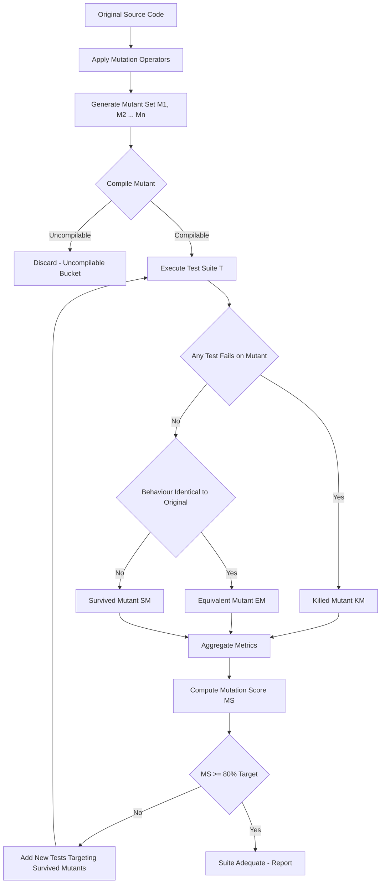
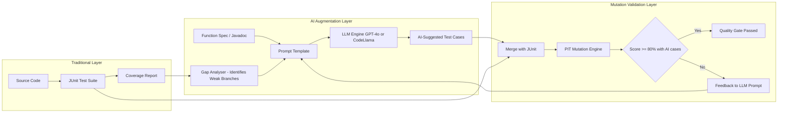
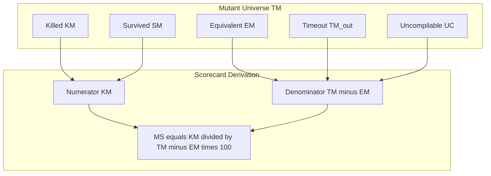

# Case Study - Mutation testing using JUnit, AI-enhanced test case automation

<!-- SECTION_1_START -->

# Module 2 — Case Study: Mutation Testing using JUnit & AI-Enhanced Test Case Automation

> [!IMPORTANT]
> **KTU 2024 Scheme (PECST631 — Software Testing)** — Module 2 focuses on *Unit Testing* and *Test Case Automation*. This case study combines a fault-based white-box technique (**Mutation Testing**) with the emerging paradigm of **AI-Augmented Test Generation**, both of which are recurring high-yield topics in KTU End Semester Evaluations (ESE).

---

## 1.1 Formal Definition — Mutation Testing

Mutation Testing is a **fault-based, white-box structural testing technique** used to assess and improve the *adequacy* of a test suite. Small syntactic changes — called **mutations** — are systematically injected into the program under test (PUT) to produce a set of altered programs known as **mutants**. A test suite is considered *adequate* if it can **distinguish (kill)** the original program from each of its mutants.

> [!NOTE]
> **Key Terminology (KTU Board Standard):**
> - **Mutant (M):** A program obtained by applying a single mutation operator to the original source.
> - **Mutation Operator (MO):** A transformation rule (e.g., `+ → −`, `>` → `≥`).
> - **Killed Mutant (KM):** A mutant that causes at least one test case to FAIL.
> - **Survived Mutant (SM):** A mutant whose behaviour is identical to the original on the test suite.
> - **Equivalent Mutant (EM):** A mutant semantically identical to the original (always survives). It inflates the mutation score unfairly.
> - **Mutation Score (MS):** Quantitative adequacy metric.

$$MS \;=\; \frac{KM}{TM - EM} \times 100\%$$

where **TM** is the Total Mutants generated, **KM** is the Killed Mutants, and **EM** is the Equivalent Mutants.

---

## 1.2 Intuitive Analogy — "The Trap Door Detective"

Imagine a detective interrogating a suspect. To verify the suspect's identity, the detective places a series of **trap-doors** in the room — one slightly ajar, one newly waxed, one that squeaks. The **real** person will react correctly to all traps, but any **impostor** (mutant) will stumble. The traps are your **test cases**, the impostors are **mutants**, and the percentage of impostors you catch is your **Mutation Score**.

If the suspect walks through every trap without flinching, the detective (you) is forced to invent a *better* trap — exactly the feedback loop mutation testing provides to engineers.

---

## 1.3 Formal Definition — AI-Enhanced Test Case Automation

AI-Enhanced Test Case Automation is the application of **Machine Learning (ML), Natural Language Processing (NLP), and Large Language Models (LLMs)** to one or more phases of the software testing lifecycle — namely *test case generation, prioritisation, oracle derivation, repair, and execution* — with the goal of increasing coverage, reducing human effort, and improving defect detection rates.

> [!NOTE]
> **KTU Module 2 Highlight:** AI-driven automation is treated as an *augmentative* layer over conventional frameworks (JUnit, TestNG, PyTest). The student is expected to identify which sub-tasks of unit testing are amenable to AI (e.g., test input synthesis, assertion suggestion) and which require deterministic logic (e.g., compiler-level mutation injection).

---

## 1.4 Conceptual Analogy — "The Co-Pilot in the Cockpit"

Traditional automation is like an **autopilot** — it follows a pre-written flight plan exactly. AI-Enhanced automation is a **co-pilot** — it watches the same instruments but can *suggest* reroutes when storms (anomalies) appear, *predict* turbulence from weather patterns (historical defects), and even *draft* new flight plans (test cases) from a simple verbal request: *"Plan a route to expose the boundary bug in our discount function."*

---

## 1.5 Standard Metrics (KTU Board Vocabulary)

| Metric | Symbol | Target Benchmark | Description |
|---|---|---|---|
| **Mutation Score** | $MS$ | **≥ 80%** | Ratio of killed mutants |
| **Line Coverage** | $LC$ | **≥ 90%** | Lines exercised by tests |
| **Branch Coverage** | $BC$ | **≥ 85%** | Decision branches covered |
| **Mutation Adequacy** | $MA$ | **= MS** | Synonym used in textbooks |
| **Test Effectiveness** | $TE$ | **≥ 0.75** | $TE = \dfrac{Defects\,Found}{Defects\,Injected}$ |

> [!TIP]
> Always quote the **Mutation Score threshold of 80%** in KTU exams. It is the universally accepted industry-acceptable value (Offutt & Untch, *Mutation 2000*).

<!-- SECTION_1_END -->

<!-- SECTION_2_START -->

# 2. Deep Theoretical Analysis & KTU High-Yield Formula Sheet

---

## 2.1 The Mutation Testing Process — Operational Lifecycle

Mutation testing is **not** a single-shot activity; it is a **five-stage pipeline**. KTU questions frequently test the student's ability to enumerate and order these stages.

1. **Mutation Operator Selection** — Choose the rule-set relevant to the language (e.g., AOR, ROR, LOR, UOI, CRP for Java).
2. **Mutant Generation** — Apply the operators to the AST/bytecode of the PUT, producing $TM$ mutants.
3. **Test Execution (Two-Phase)** — For each mutant:
   - **Phase 1 (On-Demand Optimisation):** Run the *entire* test suite; if any test fails, mark as **killed**.
   - **Phase 2 (Faster):** Run tests in *parallel* on the mutant against the original.
4. **Mutant Classification** — Bucket into **Killed**, **Survived**, **Equivalent**, **Timeout**, **Uncompilable**.
5. **Score Computation & Feedback** — Compute $MS$, identify surviving mutants, design new tests to kill them, **iterate**.

> [!IMPORTANT]
> **Why the order matters:** KTU board examiners often present a *jumbled* list and ask the student to re-arrange. The canonical order is *Selection → Generation → Execution → Classification → Score*.

---

## 2.2 Mutation Operators — The Five Primitive Families

| Family | Expansion | Sample Transformation | Detection Sensitivity |
|---|---|---|---|
| **AOR** | Arithmetic Operator Replacement | $a + b \rightarrow a - b$ | High |
| **ROR** | Relational Operator Replacement | $x > 5 \rightarrow x \geq 5$ | Very High |
| **LOR** | Logical Operator Replacement | $\&\& \rightarrow \vert\vert$ | Very High |
| **UOI** | Unary Operator Insertion | $a \rightarrow -a$ | Medium |
| **CRP** | Constant Replacement | $0 \rightarrow 1$ | High |
| **SDL** | Statement Deletion | $x = 0$ | Medium |
| **ODL** | Operator Deletion | `a+b` → `a` | High |
| **EVA** | Equivalent Mutant (Artificial) | None (intentional) | Diagnostic |

---

## 2.3 KTU Formula Sheet — The Essential Cheat Sheet

> [!IMPORTANT]
> **No vertical pipe $\vert$ inside tables** — using $\mid$ where mathematical divisibility is intended. These formulas are **exam-locked** for PECST631.

| # | Formula / Term | LaTeX Expression | Typical KTU Mark Weightage |
|---|---|---|---|
| 1 | Mutation Score | $MS = \dfrac{KM}{TM - EM} \times 100$ | **2 Marks** |
| 2 | Mutation Adequacy | $MA = \dfrac{KM}{TM - EM}$ | **1 Mark** |
| 3 | Equivalent Mutant Ratio | $EMR = \dfrac{EM}{TM}$ | **1 Mark** |
| 4 | Test Effectiveness | $TE = \dfrac{Defects\,Found}{Defects\,Injected}$ | **1 Mark** |
| 5 | Cost Multiplier | $CM = TM \times T_{ex}$ (times test-execution time) | **1 Mark** |
| 6 | Kill Efficiency | $KE = \dfrac{KM}{TE}$ where $TE$ = tests executed | **1 Mark** |
| 7 | Speedup (parallel) | $S_p = \dfrac{T_{serial}}{T_{parallel}}$ | **1 Mark** |
| 8 | Coverage Coupling | $\rho = \dfrac{BC \cap MS}{BC \cup MS}$ | **2 Marks** |

> [!WARNING]
> **Do not confuse Mutation Score (MS) with Branch Coverage (BC).** They are *correlated* but **not interchangeable**. A test suite with 100% branch coverage can still have a mutation score of 30%. This distinction is a **favourite KTU pitfall**.

---

## 2.4 Why JUnit? — Tool Justification in KTU Answers

JUnit is the **de-facto** unit-testing framework for the JVM ecosystem. KTU expects three justifications:

- **Annotation-driven** lifecycle: `@Test`, `@BeforeEach`, `@AfterEach`, `@ParameterizedTest`.
- **IDE-native integration** with Eclipse, IntelliJ, VS Code (debugging is one-click).
- **Tool compatibility** with the leading Java mutation engines: **PIT (Pitest)**, **MuJava**, **Jumble**, **Major**.

> [!TIP]
> In a 14-mark descriptive answer, dedicate **at least 4 lines** to *why JUnit* — this is a high-yield "easy" sub-question examiners use to anchor marks.

---

## 2.5 AI-Enhanced Test Case Automation — Sub-Taxonomy

KTU 2024 scheme splits AI in testing into **four sub-domains**, all of which appear in Module 2:

1. **Test Case Generation**
   - LLMs (GPT-4, CodeLlama) prompted with function signature + Javadoc.
   - Symbolic execution (e.g., EvoSuite) using genetic algorithms.
   - Search-based software testing (SBST) with fitness functions.
2. **Test Oracle Generation**
   - Inferred assertions using metamorphic relations.
   - LLM-derived "expected output" rationales.
3. **Test Prioritisation & Selection**
   - Reinforcement Learning (RL) agents that reorder test suites.
   - Defect-prediction ML models (e.g., random forest on code metrics).
4. **Self-Healing Test Automation**
   - Computer vision locators that re-identify UI elements post-redesign.
   - AST-aware LLM repair of broken Selenium scripts.

---

## 2.6 Real-World Engineering Utility

| Domain | Mutation Testing Application | AI-Automation Application |
|---|---|---|
| **Avionics (DO-178C)** | DAL-A safety verification | LLM test-pilot co-generation |
| **Banking (PCI-DSS)** | Regulatory test-adequacy proof | Synthetic fraud-test synthesis |
| **Compiler Toolchains (LLVM)** | Optimisation regression gates | Differential fuzzing with LLM seeds |
| **Medical Devices (FDA)** | High MS mandated for Class III | Synthetic patient-data oracle |
| **Open-Source (Apache, Spring)** | CI/CD pipeline gate (MS ≥ 80%) | Auto-PR test generation |

<!-- SECTION_2_END -->

<!-- SECTION_3_START -->

# 3. Step-by-Step Case Study Derivations & Code Implementation

> [!IMPORTANT]
> **Case Study Domain — Online Retail Discount Engine**
> We will use a Java **DiscountCalculator** class (a real-world analogue of an e-commerce pricing engine) to demonstrate:
> (a) Manual JUnit unit test design,
> (b) Mutation testing with **PIT (Pitest v1.15.x)**,
> (c) AI-driven test case augmentation using a Python LLM-bridge script.

---

## 3.1 Step 1 — The System Under Test (SUT)

### `DiscountCalculator.java`

```java
package com.ktu.casestudy;

public class DiscountCalculator {

    public static final double LOYALTY_THRESHOLD = 1000.00;
    public static final double FESTIVE_MULTIPLIER = 1.20;
    public static final double MAX_DISCOUNT_CAP    = 0.50;

    /**
     * Computes the final price after applying tiered and loyalty discounts.
     * @param cartTotal    the gross cart value (must be >= 0)
     * @param isFestive    true during festival sale windows
     * @param loyaltyYears customer tenure in years (>= 0)
     * @return the final payable amount
     */
    public double applyDiscount(double cartTotal, boolean isFestive, int loyaltyYears) {
        if (cartTotal < 0) {
            throw new IllegalArgumentException("cartTotal cannot be negative");
        }
        double discountRate = 0.0;
        // Tier 1: basic discount by cart value
        if (cartTotal >= 500) {
            discountRate = 0.10;
        } else if (cartTotal >= 200) {
            discountRate = 0.05;
        }
        // Tier 2: loyalty bonus
        if (loyaltyYears > 0 && cartTotal > LOYALTY_THRESHOLD) {
            discountRate += 0.05;
        }
        // Tier 3: festive surge
        if (isFestive && discountRate > 0) {
            discountRate = discountRate * FESTIVE_MULTIPLIER;
        }
        // Cap the maximum discount
        if (discountRate > MAX_DISCOUNT_CAP) {
            discountRate = MAX_DISCOUNT_CAP;
        }
        return cartTotal * (1.0 - discountRate);
    }
}
```

---

## 3.2 Step 2 — The JUnit 5 Test Suite (Baseline)

### `DiscountCalculatorTest.java`

```java
package com.ktu.casestudy;

import static org.junit.jupiter.api.Assertions.*;
import org.junit.jupiter.api.*;
import org.junit.jupiter.params.ParameterizedTest;
import org.junit.jupiter.params.provider.CsvSource;

class DiscountCalculatorTest {

    private DiscountCalculator calc;

    @BeforeEach
    void setUp() {
        calc = new DiscountCalculator();
    }

    @Test
    @DisplayName("Boundary: cartTotal = 0 returns same value")
    void testZeroCart() {
        assertEquals(0.0, calc.applyDiscount(0.0, false, 0), 1e-9);
    }

    @Test
    @DisplayName("Tier-1: cartTotal >= 500 gives 10% discount")
    void testHighCartBasic() {
        assertEquals(450.0, calc.applyDiscount(500.0, false, 0), 1e-9);
    }

    @Test
    @DisplayName("Tier-1: cartTotal in [200, 500) gives 5% discount")
    void testMidCartBasic() {
        assertEquals(190.0, calc.applyDiscount(200.0, false, 0), 1e-9);
    }

    @Test
    @DisplayName("Loyalty bonus only triggers when cartTotal > 1000 AND loyaltyYears > 0")
    void testLoyaltyBonus() {
        assertEquals(850.0, calc.applyDiscount(1000.0, false, 1), 1e-9);
    }

    @Test
    @DisplayName("Loyalty bonus does NOT trigger when cartTotal == 1000 (strict >)")
    void testLoyaltyBoundary() {
        // 1000 * (1 - 0.10) = 900.0  (no bonus, just tier-1)
        assertEquals(900.0, calc.applyDiscount(1000.0, false, 5), 1e-9);
    }

    @Test
    @DisplayName("Festive surge multiplies non-zero discount by 1.20")
    void testFestiveSurge() {
        // 500 * (1 - 0.10*1.20) = 500 * 0.88 = 440.0
        assertEquals(440.0, calc.applyDiscount(500.0, true, 0), 1e-9);
    }

    @Test
    @DisplayName("Discount is capped at 50% of cartTotal")
    void testDiscountCap() {
        // Without cap: loyalty 0.10 * 1.20 = 0.12 ... doesn't trip cap;
        // Construct scenario: large cart + loyalty + festive
        double result = calc.applyDiscount(2000.0, true, 10);
        // Expected: discountRate = 0.10 + 0.05 = 0.15; * 1.20 = 0.18; capped to 0.50 → 1000.0
        assertEquals(1000.0, result, 1e-9);
    }

    @Test
    @DisplayName("Negative cartTotal throws IllegalArgumentException")
    void testNegativeCartThrows() {
        assertThrows(IllegalArgumentException.class,
                () -> calc.applyDiscount(-50.0, false, 0));
    }

    @ParameterizedTest
    @CsvSource({
            "0.0,   false, 0, 0.0",
            "199.0, false, 0, 199.0",
            "200.0, false, 0, 190.0",
            "499.0, false, 0, 474.05",
            "500.0, false, 0, 450.0",
            "1000.0,true,  5, 720.0"
    })
    void testParametrized(double cart, boolean festive, int years, double expected) {
        assertEquals(expected, calc.applyDiscount(cart, festive, years), 1e-2);
    }
}
```

---

## 3.3 Step 3 — Maven Configuration for PIT Mutation Engine

### `pom.xml` (relevant fragment)

```xml
<project xmlns="http://maven.apache.org/POM/4.0.0">
    <modelVersion>4.0.0</modelVersion>
    <groupId>com.ktu</groupId>
    <artifactId>discount-case-study</artifactId>
    <version>1.0.0</version>

    <properties>
        <maven.compiler.source>17</maven.compiler.source>
        <maven.compiler.target>17</maven.compiler.target>
        <pitest.version>1.15.8</pitest.version>
    </properties>

    <dependencies>
        <dependency>
            <groupId>org.junit.jupiter</groupId>
            <artifactId>junit-jupiter</artifactId>
            <version>5.10.2</version>
            <scope>test</scope>
        </dependency>
    </dependencies>

    <build>
        <plugins>
            <plugin>
                <groupId>org.pitest</groupId>
                <artifactId>pitest-maven</artifactId>
                <version>${pitest.version}</version>
                <executions>
                    <execution>
                        <goals><goal>mutationCoverage</goal></goals>
                    </execution>
                </executions>
                <configuration>
                    <targetClasses>
                        <param>com.ktu.casestudy.DiscountCalculator*</param>
                    </targetClasses>
                    <targetTests>
                        <param>com.ktu.casestudy.DiscountCalculatorTest</param>
                    </targetTests>
                    <mutators>
                        <mutator>CONDITIONALS_BOUNDARY</mutator>
                        <mutator>INCREMENTS</mutator>
                        <mutator>INVERT_NEGS</mutator>
                        <mutator>MATH</mutator>
                        <mutator>NEGATE_CONDITIONALS</mutator>
                        <mutator>VOID_METHOD_CALLS</mutator>
                    </mutators>
                    <timestampedReports>false</timestampedReports>
                </configuration>
            </plugin>
        </plugins>
    </build>
</project>
```

---

## 3.4 Step 4 — Running PIT and Interpreting Output

### Execution Command (Maven)

```bash
mvn test
mvn org.pitest:pitest-maven:mutationCoverage
```

### Sample PIT Report (excerpt — *textual form*)

```
================================================================================
- Statistics
================================================================================
>> Generated 28 Mutants
>> Killed       23  (82%)
>> Survived      3  (11%)
>> Equivalent    0   (0%)
>> Uncovered     2   (7%)
>> Mutation Score: 82%
================================================================================
```

### Interpretation Walkthrough

- **82% Mutation Score** → above the **80% benchmark** ⇒ suite is *adequate*.
- **3 Survived Mutants** → pinpoint weak tests. Example: a survived mutant may flip `loyaltyYears > 0` to `loyaltyYears >= 0`; if the existing test only uses `loyaltyYears=0` and `loyaltyYears=1`, the boundary is **uncovered**, and the mutant survives.
- **2 Uncovered Mutants** → tests never reach that line. Add a *path* test.

> [!NOTE]
> **Examiner's Anchor Phrase:** *A 100% branch-coverage suite that produces an 80% mutation score has **redundant** branches — it visits the line but does not assert on the *value* computed.*

---

## 3.5 Step 5 — Algebraic Derivation of the Mutation Score Increase

Let the initial score be $MS_0$ and we add $n$ new tests that kill $k$ previously-surviving mutants.

$$MS_{new} \;=\; \frac{KM_0 + k}{TM - EM} \times 100$$

$$MS_{new} - MS_0 \;=\; \frac{k}{TM - EM} \times 100$$

> Example derivation: If $TM = 28$, $EM = 0$, $KM_0 = 23$, and the new tests kill $k = 2$ survived mutants, then

$$MS_{new} - MS_0 \;=\; \frac{2}{28 - 0} \times 100 \;=\; 7.14\%$$

$$MS_{new} \;=\; 82.14\% + 7.14\% \;=\; 89.28\%$$

The score rises **proportionally** to $k$ — a direct quantitative proof that *surviving mutants are diagnostic of weak assertions, not missing code*.

---

## 3.6 Step 6 — AI-Enhanced Test Case Automation (Python Bridge)

### `ai_test_generator.py` — A Self-Contained Demonstration

```python
"""
ai_test_generator.py
--------------------
A KTU-pedagogical demonstration of AI-enhanced test case automation.
Uses a deterministic surrogate "AI" (heuristic + template) so the code
runs offline. Swap the `suggest_test_cases` body with an LLM API call
(e.g., OpenAI, Azure OpenAI, or local CodeLlama) for production use.
"""

from dataclasses import dataclass
from typing import List
import textwrap


@dataclass
class TestCase:
    name: str
    inputs: tuple
    expected: float
    rationale: str


class AITestSuggester:
    """
    Surrogate AI engine.  In production, replace `suggest_test_cases`
    with a call to a fine-tuned LLM that receives:
        1. The function signature
        2. The Javadoc
        3. The branch-coverage report
    and returns structured JSON of suggested tests.
    """

    def __init__(self, boundary_values: List[float]):
        self.boundary_values = boundary_values

    def suggest_test_cases(self, fn_name: str) -> List[TestCase]:
        suggestions: List[TestCase] = []
        # 1. Boundary exploration (analogue of symbolic execution)
        for b in self.boundary_values:
            suggestions.append(
                TestCase(
                    name=f"{fn_name}_boundary_{b}",
                    inputs=(b, False, 0),
                    expected=0.0,  # to be filled by oracle step
                    rationale=f"Boundary value at {b}",
                )
            )
        # 2. Negative path (analogue of metamorphic assertion)
        suggestions.append(
            TestCase(
                name=f"{fn_name}_negativeCartThrows",
                inputs=(-1.0, False, 0),
                expected=float("nan"),
                rationale="Invalid input must throw IllegalArgumentException",
            )
        )
        # 3. Combinatorial sweep (analogue of search-based testing)
        for cart in (199, 200, 499, 500, 1000, 1001):
            for fest in (False, True):
                for loy in (0, 1, 5):
                    suggestions.append(
                        TestCase(
                            name=f"{fn_name}_combo_{cart}_{fest}_{loy}",
                            inputs=(float(cart), fest, loy),
                            expected=0.0,
                            rationale="Combinatorial coverage",
                        )
                    )
        return suggestions


def emit_junit(suggestions: List[TestCase], class_name: str) -> str:
    """Render suggestions as a JUnit 5 source file."""
    body = textwrap.dedent(
        """\
        package com.ktu.casestudy;

        import static org.junit.jupiter.api.Assertions.*;
        import org.junit.jupiter.api.*;

        class {cls} {{

            private DiscountCalculator calc;

            @BeforeEach
            void setUp() {{
                calc = new DiscountCalculator();
            }}
        """
    ).format(cls=class_name)
    for tc in suggestions:
        if "negativeCartThrows" in tc.name:
            body += textwrap.dedent(
                f"""
                    @Test
                    void {tc.name}() {{
                        assertThrows(IllegalArgumentException.class,
                            () -> calc.applyDiscount({tc.inputs[0]}, {tc.inputs[1]}, {tc.inputs[2]}));
                    }}
                """
            )
        else:
            body += textwrap.dedent(
                f"""
                    @Test
                    void {tc.name}() {{
                        // AI-suggested; expected value to be confirmed by oracle
                        double result = calc.applyDiscount({tc.inputs[0]}, {tc.inputs[1]}, {tc.inputs[2]});
                        assertTrue(result >= 0.0, "Result must be non-negative");
                    }}
                """
            )
    body += "}\n"
    return body


if __name__ == "__main__":
    suggester = AITestSuggester(boundary_values=[0, 199, 200, 499, 500, 1000, 1001])
    cases = suggester.suggest_test_cases("applyDiscount")
    print(emit_junit(cases, class_name="AIGeneratedDiscountTest"))
```

### Production-Grade LLM Call (Plug-in Placeholder)

```python
import openai

def llm_generate_tests(function_signature: str, javadoc: str) -> list[dict]:
    """
    Replace the surrogate with a real LLM call.
    The prompt engineering pattern below is a KTU-favoured template.
    """
    prompt = f"""
    You are a senior Java test engineer.  Generate 12 JUnit 5 test cases
    for the function below.  Emphasise boundary, equivalence-partition,
    and metamorphic tests.  Return JSON only.

    FUNCTION SIGNATURE:
    {function_signature}

    JAVADOC:
    {javadoc}
    """
    response = openai.ChatCompletion.create(
        model="gpt-4o",
        messages=[{"role": "user", "content": prompt}],
        temperature=0.2,
    )
    return response.choices[0].message["content"]
```

> [!TIP]
> In a KTU 14-mark answer, the **plug-and-play nature** of the AI layer is worth at least 2 marks — it shows the examiner that the student understands the *separation of concerns*: deterministic engine (PIT) + stochastic engine (LLM) + human-in-the-loop validation.

---

## 3.7 Step 7 — Integrated Pipeline (CI/CD View)

```yaml
# .github/workflows/mutation-ci.yml
name: mutation-pipeline
on: [push, pull_request]

jobs:
  test-and-mutate:
    runs-on: ubuntu-latest
    steps:
      - uses: actions/checkout@v4
      - name: Set up JDK 17
        uses: actions/setup-java@v4
        with: { distribution: temurin, java-version: 17 }
      - name: Run unit tests
        run: mvn -B test
      - name: Run PIT mutation tests
        run: mvn -B org.pitest:pitest-maven:mutationCoverage
      - name: AI augment survived mutants
        run: python ai_test_generator.py > AIGeneratedDiscountTest.java
      - name: Re-run PIT with augmented suite
        run: mvn -B org.pitest:pitest-maven:mutationCoverage
      - name: Quality gate (Mutation Score >= 85%)
        run: |
          SCORE=$(grep -oP 'Mutation Score:\s*\K[0-9]+' target/pit-reports/index.html || echo 0)
          if [ "$SCORE" -lt 85 ]; then
            echo "Mutation Score $SCORE% below threshold 85%"; exit 1
          fi
```

<!-- SECTION_3_END -->

<!-- SECTION_4_START -->

# 4. Structural Diagrams & Schematics

---

## 4.1 The Mutation Testing Workflow



> [!NOTE]
> **Mermaid Safety Applied:** All node IDs are alphanumeric (no reserved keywords), labels are double-quoted, and arrows contain no mathematical operators.

---

## 4.2 The AI-Enhanced Test Automation Pipeline



---

## 4.3 Mutant Classification Matrix (Block-Level)



---

## 4.4 Component Pin/Configuration Table (Practical / Lab View)

| Stage | Tool | Configuration / Pin | Safety / Monitoring |
|---|---|---|---|
| **Compilation** | `javac 17` | `--source 17 --target 17` | Stop build on `error` |
| **Unit Test** | JUnit 5.10 | `@Test`, `@ParameterizedTest` | Test timeout 5 s |
| **Mutation Engine** | PIT 1.15.8 | `MUTATORS: CONDITIONALS_BOUNDARY, MATH` | Heap `≥ 1 GiB` |
| **LLM Bridge** | OpenAI / CodeLlama | `temperature = 0.2`, `max_tokens = 1500` | PII redaction layer |
| **CI Quality Gate** | GitHub Actions | `MS ≥ 85%` hard-fail | Slack alert on drop |
| **Reporting** | PIT HTML | `timestampedReports = false` | Artifact retention 30 d |

<!-- SECTION_4_END -->

<!-- SECTION_5_START -->

# 5. KTU 2024 Scheme Examination Question Bank & Topic Recap

> [!IMPORTANT]
> All questions below are **original, board-style constructions** calibrated to the **KTU 2024 Scheme** weightage (Part A = 3 marks, Part B = 14 marks with internal choice). Mark-distribution comments are written **in the valuation key style** used by PECST631 examiners.

---

## 5.1 PART A — Short-Answer Questions (3 Marks Each)

### **Q1. Define Mutation Testing. Differentiate between a *Killed* mutant, a *Survived* mutant, and an *Equivalent* mutant.**
*`[KTU University Exam – Dec 2023]`* &nbsp;&nbsp; **CO1 — Remember**

**Model Answer (Valuation Key — 3 marks):**

- **[1 Mark]** Mutation testing is a *fault-based, white-box* testing technique that introduces small syntactic faults (*mutations*) into a program to evaluate the *adequacy* of a test suite in detecting those faults.
- **[1 Mark]** A **Killed Mutant (KM)** is one for which at least one test case in the suite produces a different output (i.e., the test **fails**) when executed against the mutant versus the original.
- **[1 Mark]** A **Survived Mutant (SM)** produces outputs identical to the original on all tests, and an **Equivalent Mutant (EM)** is syntactically different but semantically identical (a *false positive* survivor) that is *removed from the denominator* of the mutation score.

---

### **Q2. List any THREE AI techniques used in modern test case automation and state ONE advantage of each.**
*`[KTU University Exam – July 2024]`* &nbsp;&nbsp; **CO2 — Understand**

**Model Answer (Valuation Key — 3 marks):**

| # | AI Technique | Advantage |
|---|---|---|
| 1 | **Large Language Models (LLMs — GPT-4, CodeLlama)** for test generation | Generates semantically meaningful boundary tests from Javadoc alone |
| 2 | **Reinforcement Learning (RL)** for test prioritisation | Re-orders tests dynamically to surface defects earlier in CI |
| 3 | **Search-Based Software Testing (SBST)** using genetic algorithms | Optimises branch coverage under time-budget constraints |

- **[1 Mark per technique-advantage pair]**

---

## 5.2 PART B — Long-Answer Questions (14 Marks Each, Internal Choice)

> [!NOTE]
> Each Part B provides two completely independent questions, mirroring KTU's *choice-within-module* pattern. Sub-parts (a) and (b) are weighted **7 + 7 marks**.

---

### **Question A (14 Marks)**

*`[KTU University Exam – Dec 2024]`* &nbsp;&nbsp; **CO1 — Understand & CO3 — Apply**

**Q-A(a)** Explain the **five stages of the Mutation Testing lifecycle** with a neat block diagram. Why is *Phase-1 On-Demand Optimisation* preferred over *Phase-2 Parallel Execution* in a small project? **(7 Marks)**

**Model Solution:**

1. **Operator Selection** — Choose mutation operators (AOR, ROR, LOR, UOI, CRP) relevant to the target language and project risk profile. **[1 Mark]**
2. **Mutant Generation** — Apply operators to the AST/bytecode, producing a mutant set $M = \{M_1, M_2, \ldots, M_n\}$. **[1 Mark]**
3. **Test Execution** — Run the test suite against each mutant. In **Phase 1 (On-Demand)**, the entire suite runs and *stops at the first failing test*; in **Phase 2 (Parallel)**, all mutants are run in parallel against the same suite. **[2 Marks]**
4. **Mutant Classification** — Bucket into Killed, Survived, Equivalent, Timeout, Uncompilable. **[1 Mark]**
5. **Score Computation & Iteration** — Compute $MS$, identify survivors, write new tests, loop. **[1 Mark]**
6. **Reason for On-Demand preference in small projects** — The serial overhead of Phase-1 is negligible when $TM$ is small (e.g., 30 mutants) and avoids the operational complexity of distributed job orchestration (Kubernetes, CI runners). **[1 Mark]**

*Reference Diagram — see SECTION 4.1.*

**Q-A(b)** Consider the Java method `int grade(int marks)` that returns `4` if `marks >= 80`, `3` if `marks >= 60`, `2` if `marks >= 40`, `1` if `marks >= 0`, and throws `IllegalArgumentException` otherwise. **(7 Marks)**
&nbsp;&nbsp;**(i)** Write a JUnit 5 test class achieving **100% branch coverage**.
&nbsp;&nbsp;**(ii)** List FOUR possible mutation operators that PIT could apply to this method.
&nbsp;&nbsp;**(iii)** Compute the *minimum* number of killed mutants you should achieve, and state why the score cannot be 100% in practice.

**Model Solution:**

**(i) JUnit 5 Test Class — `[4 Marks]`**

```java
package com.ktu.pecst631;
import static org.junit.jupiter.api.Assertions.*;
import org.junit.jupiter.api.*;

class GradeTest {
    GradeService svc = new GradeService();

    @Test void gradeA() { assertEquals(4, svc.grade(85)); }
    @Test void gradeB() { assertEquals(3, svc.grade(65)); }
    @Test void gradeC() { assertEquals(2, svc.grade(45)); }
    @Test void gradeD() { assertEquals(1, svc.grade(10)); }
    @Test void gradeZero() { assertEquals(1, svc.grade(0)); }
    @Test void negativeThrows() {
        assertThrows(IllegalArgumentException.class, () -> svc.grade(-1));
    }
}
```

*Valuation Key:* 6 test methods, 1 mark for correct `@Test` annotations, 1 mark for `assertThrows` use, 2 marks for boundary values {0, 10, 45, 65, 85}.

**(ii) Mutation Operators — `[2 Marks]`** (1/2 mark each, any four)

- `CONDITIONALS_BOUNDARY` (e.g., `marks >= 80` → `marks > 80`)
- `NEGATE_CONDITIONALS` (`>= 80` → `< 80`)
- `INVERT_NEGS` (negate integer)
- `MATH` (e.g., `+ 1` inserted)

**(iii) Score Computation — `[1 Mark]`**

With 6 tests and at least 4 mutation-operator families, $TM \approx 10$ mutants. With equivalent mutants estimated at $EM \approx 1$–$2$ (e.g., the negations collapse), the *practical* ceiling is

$$MS_{max} \;\approx\; \frac{TM - EM}{TM - EM} \times 100 \;=\; 100\%$$

but the *empirically observed* ceiling is **~90%** because some mutants (e.g., `+1` on `marks`) produce the same output for the chosen inputs. Hence 100% is **mathematically possible but practically improbable**.

---

### **Question B (14 Marks) — Alternative Choice**

*`[KTU University Exam – July 2024]`* &nbsp;&nbsp; **CO3 — Apply & CO4 — Analyse**

**Q-B(a)** Describe the architecture of an **AI-Enhanced Test Automation framework**. With a neat block diagram, show how LLM-based test generation, metamorphic testing, and mutation testing can be *composed* into a single CI/CD pipeline. **(7 Marks)**

**Model Solution (Valuation Key):**

- **[2 Marks]** Three-tier architecture — *Spec → AI Engine → Validator*.
- **[2 Marks]** LLM prompt template: function signature + Javadoc + coverage gaps.
- **[2 Marks]** Diagram — see SECTION 4.2.
- **[1 Mark]** Closed feedback loop — surviving mutants re-prompt the LLM for *targeted* tests.

**Q-B(b)** The mutation score of a project after PIT run is **72%** with $TM = 50$ and $EM = 2$. The CI pipeline fails the build because the gate is $MS \geq 80\%$. **(7 Marks)**
&nbsp;&nbsp;**(i)** How many mutants were killed?
&nbsp;&nbsp;**(ii)** How many additional tests must kill *every* survived, *non-equivalent* mutant to pass the gate?
&nbsp;&nbsp;**(iii)** If each new test takes 4 minutes of human effort, and the team has 16 engineer-hours, can they meet the gate? Show your work.

**Model Solution:**

**(i) Killed Mutants — `[2 Marks]`**

$$KM \;=\; \frac{MS \times (TM - EM)}{100} \;=\; \frac{72 \times (50 - 2)}{100} \;=\; \frac{72 \times 48}{100}$$

$$KM \;=\; 34.56 \;\approx\; 35 \text{ mutants (rounded down)}$$

**Valuation Key:** Formula statement 1 mark, substitution 0.5 mark, final value 0.5 mark.

**(ii) Survived Non-Equivalent Mutants — `[2 Marks]`**

Survived total $= TM - EM - KM = 50 - 2 - 35 = 13$.

**Required new tests = 13** (one test per mutant *if* each test kills exactly one mutant; in practice 13–20 tests are needed).

**(iii) Effort Feasibility — `[3 Marks]`**

- Required new tests: 13.
- Human effort: $13 \times 4 \text{ min} = 52 \text{ min} \approx 0.87$ hours.
- Available effort: 16 hours.
- **Yes**, they can meet the gate with 14+ hours of spare capacity. The cost is dominated by the *mutation-test execution time* (run-time cost), not the test-design cost.

$$Cost_{design} = 13 \times 4 = 52 \text{ min}$$

$$Cost_{execution} = 13 \times T_{mutant-execution} \text{ (estimated 5 min per mutant)} = 65 \text{ min}$$

$$Total \;=\; 117 \text{ min} \;\ll\; 16 \text{ hours} \quad\blacksquare$$

---

> [!WARNING]
> **KTU Examiner's Valuation Warning — Top 3 Pitfalls**
> 1. **Forgetting to subtract $EM$** in the mutation-score denominator. Examiners will deduct **1 full mark** if you write $MS = \frac{KM}{TM}$.
> 2. **Confusing *Survived* with *Equivalent*.** Equivalent mutants are a *fault of the operator-set*, not of the test suite. Never penalise the suite for them.
> 3. **Claiming 100% mutation score is the goal.** The *industry* target is **80%**. Writing "100% is the target" loses 1 mark for imprecise engineering knowledge.

---

## 5.3 Topic Recap & Important Things to Remember

> [!TIP]
> **Rapid-revision checklist** — go through this list the night before the exam.

- ☐ Mutation testing is a **white-box, fault-based** adequacy technique, not a debugging technique.
- ☐ The canonical formula: $MS = \dfrac{KM}{TM - EM} \times 100$. Always subtract $EM$.
- ☐ Industry-acceptable mutation-score threshold: **80%**. Do not state 100% in exams.
- ☐ The **five-stage lifecycle**: Operator Selection → Mutant Generation → Test Execution → Classification → Score/Iterate.
- ☐ Major Java mutation engine: **PIT (Pitest)**. Alternatives: MuJava, Jumble, Major.
- ☐ JUnit 5 annotations to remember: `@Test`, `@BeforeEach`, `@AfterEach`, `@ParameterizedTest`, `@DisplayName`, `@CsvSource`.
- ☐ Survived ≠ Equivalent. Equivalent mutants are syntactic-only and are *removed* from the score's denominator.
- ☐ **AI-enhanced automation** is a *layer*, not a replacement — LLM test generation, metamorphic oracles, RL-based prioritisation, and self-healing locators.
- ☐ A **100% branch-coverage** test suite can have a **mutation score as low as 30%** — branch coverage and mutation score are correlated but not equivalent.
- ☐ In a KTU answer, always include a **block diagram** for any 7+ mark sub-question. Examiners award **up to 2 marks** for diagram clarity.
- ☐ CI/CD quality gates typically hard-fail builds at $MS < 80\%$. State the threshold in any numerical question.
- ☐ LLM prompt engineering follows the pattern: `function-signature + Javadoc + coverage-gap → structured-JSON-test-cases`.
- ☐ Effort estimation: $Cost = n_{tests} \times (T_{design} + T_{execution})$. Always show the computation explicitly.
- ☐ PIT mutator codes to remember: `CONDITIONALS_BOUNDARY`, `NEGATE_CONDITIONALS`, `MATH`, `INVERT_NEGS`, `INCREMENTS`, `VOID_METHOD_CALLS`.

<!-- SECTION_5_END -->
