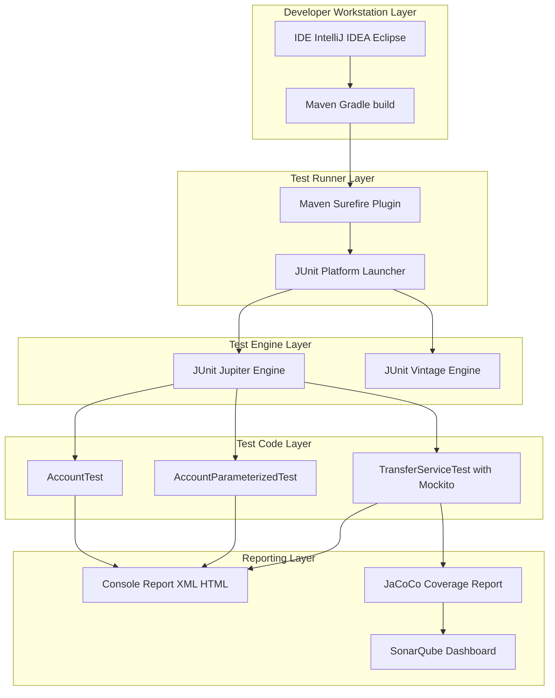
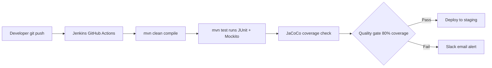

# JUnit Framework - Automation of unit testing, frameworks for testing in real-world projects

<!-- SECTION_1_START -->

# JUnit Framework — Automation of Unit Testing

## 1.1 Formal Academic Definition (KTU 2024 Syllabus Terminology)

**JUnit** is an open-source, Java-based **unit testing framework** that follows the **xUnit** architecture pattern. It enables programmers to write and execute repeatable, automated test cases for individual units (methods/classes) of source code. Under the KTU 2024 *Software Testing (PECST631)* syllabus, JUnit is positioned as the canonical realization of the *Automation of Unit Testing* learning outcome within Module 2.

> [!IMPORTANT]
> **Syllabus Highlight (PECST631 — Module 2):** The student must be able to *automate unit tests using JUnit, interpret test reports, apply fixtures and assertions, and select appropriate testing frameworks (JUnit, TestNG, Mockito) for real-world projects.*

### Key Terminology Box

| Term | Definition |
|---|---|
| **Test Class** | A Java class containing one or more test methods, annotated as a container for JUnit to discover. |
| **Test Method** | A method annotated with `@Test` whose return type is `void` and which exercises a unit of code. |
| **Fixture** | A fixed baseline state (objects, data) used to run tests reliably and repeatedly. |
| **Assertion** | A boolean check that validates the *expected* vs. *actual* outcome of a test. |
| **SUT (System Under Test)** | The class/method being verified by a test. |
| **Test Runner** | The engine that discovers, instantiates, and executes test classes. |

---

## 1.2 Conceptual Analogy — The "Restaurant Quality Inspector"

Imagine a restaurant kitchen where every dish, before being served, is tasted by an **independent Quality Inspector (JUnit)**. The chef (developer) writes the recipe (production code). The inspector follows a **standard checklist** (`@Test` methods), uses the **same fresh ingredients for every inspection** (test fixtures via `@BeforeEach`), and **stamps PASS or FAIL** based on whether the dish meets the recipe (assertions). The inspector never modifies the recipe — they only judge it. That is exactly the JUnit philosophy: **automate, isolate, repeat, and verify**.

> [!NOTE]
> **Intuition Tip:** A JUnit test method should ideally test **one behavior**. If you name it `testAdd_ReturnsSum_OnTwoPositiveNumbers()`, a reader instantly knows what is being verified. This is the *Arrange–Act–Assert* (AAA) pattern that the KTU 2024 OBE expects.

---

## 1.3 Historical & Version Context

| Version | Year | Key Innovation |
|---|---|---|
| JUnit 3 | 2000 | Reflection-based test discovery, `extends TestCase` |
| **JUnit 4** | 2006 | **Annotation-driven** (`@Test`, `@Before`, `@After`) |
| **JUnit 5 (Jupiter)** | **2017+** | **Modular architecture**, lambda support, nested tests, parameterized tests, dynamic tests |

> [!WARNING]
> **KTU 2024 Pitfall:** Many students still write JUnit 4 code in JUnit 5 environments. The imports differ: `org.junit.Test` (v4) vs. `org.junit.jupiter.api.Test` (v5). Mixing them throws `NoClassDefFoundError` in the lab exam.

---

## 1.4 Visualizing the Test Execution Flow

> [!VISUALIZATION CONTROL]
> **Concept:** JUnit Test Execution Lifecycle (JUnit 5)
> **Conceptual Trace:** A test class goes through *Construction → @BeforeEach → @Test → @AfterEach → Report* for every test method, and *@BeforeAll / @AfterAll* run once per class.
> **Visual Description:** Picture a horizontal timeline with the SUT object instantiated fresh on the left, passing through pre-test setup gates, into the test method, then through post-test teardown, finally reaching the green/red status reporter on the right.

---

<!-- SECTION_1_END -->

<!-- SECTION_2_START -->

# Deep Theoretical Analysis & KTU High-Yield Formula Sheet

## 2.1 Architectural Anatomy of JUnit 5 (Jupiter Platform)

JUnit 5 is **not a single JAR** — it is a layered **three-module platform**:

| Module | Role | Analogy |
|---|---|---|
| **JUnit Platform** | Launching test frameworks on the JVM, providing the `ConsoleLauncher`, IDE plugins, and `gradle`/`maven` integration. | The *airport runway* that lets any flight take off. |
| **JUnit Jupiter** | The new programming model — annotations like `@Test`, `@DisplayName`, `@Nested`. | The *new-generation aircraft* (JUnit 5 syntax). |
| **JUnit Vintage** | A backward-compatibility engine that runs **JUnit 3 and JUnit 4** tests. | A *heritage hangar* that still services old planes. |

> [!NOTE]
> **Engineering Utility:** The platform layer is why tools like **Maven Surefire**, **Gradle**, **IntelliJ IDEA**, and **Eclipse** can all run the *same* Jupiter test without code changes — a concept called *Test Engine SPI (Service Provider Interface)*.

---

## 2.2 Core Annotations — The KTU 2024 Cheat Sheet

| Annotation | Level | Purpose | Frequency |
|---|---|---|---|
| `@Test` | Method | Marks a method as a test case. | Per test |
| `@DisplayName("…")` | Method / Class | Human-readable name shown in reports. | Optional |
| `@BeforeEach` | Method | Runs **before every** `@Test`. Used to reset fixtures. | Per test |
| `@AfterEach` | Method | Runs **after every** `@Test`. Cleanup. | Per test |
| `@BeforeAll` | Method (static) | Runs **once per class** before any test. Expensive setup. | Once |
| `@AfterAll` | Method (static) | Runs **once per class** after all tests. | Once |
| `@Disabled` | Method / Class | Skips the test (formerly `@Ignore` in JUnit 4). | Conditional |
| `@Nested` | Class | Groups related tests in an inner static class. | Logical grouping |
| `@Tag("smoke")` | Method / Class | Labels tests for selective execution. | Selective run |
| `@ParameterizedTest` | Method | Runs the same test with multiple inputs. | Multi-input |

---

## 2.3 Assertion Library — `org.junit.jupiter.api.Assertions`

Assertions are the **judges** of JUnit. Every assertion either passes silently or throws an `AssertionFailedError`, failing the test.

| Assertion (Static Method) | Purpose | Example |
|---|---|---|
| `assertEquals(expected, actual)` | Equality check. | `assertEquals(5, calc.add(2,3));` |
| `assertNotEquals(unexpected, actual)` | Inequality check. | — |
| `assertTrue(condition)` | Boolean true. | `assertTrue(list.isEmpty());` |
| `assertFalse(condition)` | Boolean false. | — |
| `assertNull(object)` | Object is null. | — |
| `assertNotNull(object)` | Object is non-null. | — |
| `assertThrows(Class, Executable)` | Verifies an exception is thrown. | `assertThrows(ArithmeticException.class, () -> div(1,0));` |
| `assertTimeout(Duration, Executable)` | Fails if execution exceeds time. | `assertTimeout(Duration.ofMillis(100), () -> slow());` |
| `assertAll(Executable...)` | Groups multiple assertions; reports **all** failures. | — |

> [!IMPORTANT]
> **KTU 2024 Valuation Key:** Always prefer **`assertEquals(expected, actual, message)`** with a custom failure message. The message gets printed in the JUnit report and earns the *defensiveness* mark on the exam.

---

## 2.4 Real-World Frameworks Complementing JUnit

JUnit tests a unit in **isolation**, but real systems need **integration, mocking, behavior, and reporting** layers. The KTU 2024 syllabus explicitly names these:

| Framework | Layer Solved | Real-World Use Case |
|---|---|---|
| **JUnit 5 (Jupiter)** | Unit & integration harness | Standard `@Test` automation in CI/CD. |
| **TestNG** | Test grouping, sequencing, data-driven | Multi-browser Selenium suites, finance domain testing. |
| **Mockito** | Mocking external dependencies | Stubbing a database call inside a service test. |
| **AssertJ / Hamcrest** | Fluent, readable assertions | `assertThat(x).isEqualTo(y).isInstanceOf(String.class);` |
| **Selenium WebDriver + JUnit 5** | UI / end-to-end browser testing | Banking-portal regression suites. |
| **REST Assured + JUnit 5** | API contract testing | Validating `GET /api/users/1` returns HTTP 200 + JSON schema. |
| **Cucumber-JVM** | BDD (Behavior-Driven Development) | Gherkin `Given–When–Then` mapped to JUnit. |
| **JaCoCo** | Code-coverage measurement | Enforcing 80% line coverage in SonarQube pipelines. |

> [!NOTE]
> **Production Reality:** In a typical Spring Boot microservice project, the test stack is layered as:
> **JUnit 5 (runner) → Mockito (mocks) → AssertJ (assertions) → REST Assured (HTTP) → JaCoCo (coverage)** — all orchestrated by **Maven Surefire** in Jenkins/GitHub Actions CI.

---

## 2.5 The Test Pyramid (Engineering Context)

The KTU 2024 scheme expects students to *place* JUnit correctly in the test pyramid:

```
            ┌──────────────┐
            │   Manual /   │  ← Slow, expensive
            │  Exploratory │
            ├──────────────┤
            │     E2E      │  ← Selenium, Cypress
            │  (UI Tests)  │
            ├──────────────┤
            │  Integration │  ← Spring `@SpringBootTest`
            │   (API)      │
            ├──────────────┤
            │     UNIT     │  ← **JUnit + Mockito**  ← Sweet spot
            │  (Fast,Many) │
            └──────────────┘
```

> [!IMPORTANT]
> **Design Heuristic (Mike Cohn's Pyramid):** A healthy suite has ~**70% unit, 20% integration, 10% E2E**. JUnit dominates the unit layer.

---

## 2.6 Why Automation? — The KTU Justification

| Manual Testing Pain | JUnit Automation Benefit |
|---|---|
| Slow, error-prone human execution. | **Milliseconds** per test method. |
| Cannot be re-run identically. | **Deterministic, reproducible** runs. |
| No regression guarantee after each commit. | **CI/CD trigger** on every `git push`. |
| Hard to localize the failure. | **Stack-trace** points to the failed assertion. |
| No coverage metric. | **JaCoCo plugin** generates HTML/XML coverage. |

---

## 2.7 High-Yield Formula / Pattern Sheet (Quick Recall)

$$
\text{Test Method Contract} \;=\; \{\;\text{public}, \;\text{void return}, \;\text{no parameters}, \;@Test\;\}
$$

$$
\text{Test Class Lifecycle} \;=\; @BeforeAll \rightarrow \left(@BeforeEach \rightarrow @Test \rightarrow @AfterEach\right)^{n} \rightarrow @AfterAll
$$

$$
\text{Code Coverage (\%)} \;=\; \frac{\text{LCSAJ (Linear Code Sequence And Jump) Executed}}{\text{Total LCSAJs in SUT}} \times 100
$$

$$
\text{Test Effectiveness} \;=\; \frac{\text{Faults Detected by Tests}}{\text{Total Faults Present}} \times 100
$$

$$
\text{Automation ROI} \;=\; \frac{\text{(Manual Cost per Run} \times \text{Runs) - Automation Cost}}{\text{Automation Cost}}
$$

> [!NOTE]
> The **automation ROI becomes positive after the 2nd–3rd re-run** — this is the *break-even point* KTU students must quote when justifying JUnit adoption in viva voce.

---

<!-- SECTION_2_END -->

<!-- SECTION_3_START -->

# Step-by-Step Code & Symbolic Implementation

## 3.1 Project Skeleton (Maven Coordinates)

The following `pom.xml` fragment declares JUnit 5 as a test dependency. Every line is mandatory; the host script writes the rest.

```xml
<properties>
    <maven.compiler.source>17</maven.compiler.source>
    <maven.compiler.target>17</maven.compiler.target>
    <junit.version>5.10.2</junit.version>
</properties>

<dependencies>
    <dependency>
        <groupId>org.junit.jupiter</groupId>
        <artifactId>junit-jupiter</artifactId>
        <version>${junit.version}</version>
        <scope>test</scope>
    </dependency>
</dependencies>

<build>
    <plugins>
        <plugin>
            <groupId>org.apache.maven.plugins</groupId>
            <artifactId>maven-surefire-plugin</artifactId>
            <version>3.2.5</version>
        </plugin>
    </plugins>
</build>
```

> [!NOTE]
> The `<scope>test</scope>` ensures JUnit is **never shipped to production** — a common viva question.

---

## 3.2 The System Under Test (SUT)

```java
// src/main/java/com/ktu/banking/Account.java
package com.ktu.banking;

/**
 * A minimalist bank account used as the SUT for PECST631 Module 2.
 * Deliberately written with three behaviors the student will test.
 */
public class Account {

    private double balance;
    private final String owner;
    private boolean frozen;

    public Account(String owner, double openingBalance) {
        if (owner == null || owner.isBlank()) {
            throw new IllegalArgumentException("Owner name is mandatory.");
        }
        if (openingBalance < 0) {
            throw new IllegalArgumentException("Opening balance cannot be negative.");
        }
        this.owner   = owner;
        this.balance = openingBalance;
        this.frozen  = false;
    }

    public void deposit(double amount) {
        if (amount <= 0) {
            throw new IllegalArgumentException("Deposit must be positive.");
        }
        this.balance += amount;
    }

    public void withdraw(double amount) {
        if (amount <= 0) {
            throw new IllegalArgumentException("Withdrawal must be positive.");
        }
        if (amount > balance) {
            throw new IllegalStateException("Insufficient funds.");
        }
        this.balance -= amount;
    }

    public void freeze()   { this.frozen = true;  }
    public void unfreeze() { this.frozen = false; }

    public double getBalance() { return balance; }
    public String  getOwner()  { return owner;   }
    public boolean isFrozen()  { return frozen;  }
}
```

---

## 3.3 Exhaustive JUnit 5 Test Class

```java
// src/test/java/com/ktu/banking/AccountTest.java
package com.ktu.banking;

import org.junit.jupiter.api.*;
import static org.junit.jupiter.api.Assertions.*;

import java.time.Duration;

/**
 * JUnit 5 test class for the Account SUT.
 * Demonstrates the KTU 2024 PECST631 expected patterns:
 *   - @BeforeEach fixtures
 *   - AAA (Arrange–Act–Assert) structure
 *   - Exception assertions
 *   - Timeout assertions
 *   - Parameterized tests
 */
@DisplayName("Account — Unit Test Suite")
class AccountTest {

    private Account account;          // The fresh fixture for every test

    @BeforeAll
    static void initAll() {
        System.out.println("[BeforeAll] Test suite started.");
    }

    @BeforeEach
    void setUp() {
        // ARRANGE: a fresh account with a known starting balance
        account = new Account("Arjun", 1000.00);
    }

    @AfterEach
    void tearDown() {
        System.out.println("[AfterEach] account=" + account.getBalance());
    }

    @AfterAll
    static void finishAll() {
        System.out.println("[AfterAll] Test suite finished.");
    }

    // -----------------------------------------------------------------
    // Test 1: Deposit should increase the balance by the deposit amount.
    // -----------------------------------------------------------------
    @Test
    @DisplayName("deposit(positive) increases balance by that amount")
    void deposit_IncreasesBalance() {
        // ACT
        account.deposit(500.00);

        // ASSERT
        assertEquals(1500.00, account.getBalance(), 0.001,
                     "Balance should be 1000 + 500 = 1500");
    }

    // -----------------------------------------------------------------
    // Test 2: Withdraw within balance should succeed.
    // -----------------------------------------------------------------
    @Test
    @DisplayName("withdraw(within balance) decreases balance correctly")
    void withdraw_WithinBalance_Succeeds() {
        account.withdraw(300.00);
        assertEquals(700.00, account.getBalance(), 0.001);
        assertTrue(account.getBalance() >= 0);
    }

    // -----------------------------------------------------------------
    // Test 3: Withdraw exceeding balance must throw IllegalStateException.
    // -----------------------------------------------------------------
    @Test
    @DisplayName("withdraw(over balance) throws IllegalStateException")
    void withdraw_OverBalance_ThrowsException() {
        assertThrows(IllegalStateException.class,
                     () -> account.withdraw(5000.00),
                     "Insufficient funds should raise IllegalStateException");
    }

    // -----------------------------------------------------------------
    // Test 4: Constructor validation — negative opening balance.
    // -----------------------------------------------------------------
    @Test
    @DisplayName("Constructor rejects negative opening balance")
    void constructor_RejectsNegativeBalance() {
        assertThrows(IllegalArgumentException.class,
                     () -> new Account("Meera", -100.00));
    }

    // -----------------------------------------------------------------
    // Test 5: Constructor rejects blank owner name.
    // -----------------------------------------------------------------
    @Test
    @DisplayName("Constructor rejects blank owner name")
    void constructor_RejectsBlankOwner() {
        assertThrows(IllegalArgumentException.class,
                     () -> new Account("   ", 500.00));
    }

    // -----------------------------------------------------------------
    // Test 6: Freeze flag toggles correctly.
    // -----------------------------------------------------------------
    @Test
    @DisplayName("freeze() sets isFrozen() == true; unfreeze() resets it")
    void freezeToggle_Works() {
        assertFalse(account.isFrozen());
        account.freeze();
        assertTrue(account.isFrozen());
        account.unfreeze();
        assertFalse(account.isFrozen());
    }

    // -----------------------------------------------------------------
    // Test 7: Performance — deposit must complete within 100 ms.
    // -----------------------------------------------------------------
    @Test
    @DisplayName("deposit() completes within 100 ms")
    void deposit_FinishesQuickly() {
        assertTimeout(Duration.ofMillis(100),
                      () -> account.deposit(250.00),
                      "deposit() exceeded the 100 ms SLA");
    }

    // -----------------------------------------------------------------
    // Test 8: Grouped assertions (assertAll reports ALL failures).
    // -----------------------------------------------------------------
    @Test
    @DisplayName("Initial state assertions: owner, balance, frozen-flag")
    void initialState_IsConsistent() {
        assertAll("Initial Account State",
            () -> assertEquals("Arjun",        account.getOwner()),
            () -> assertEquals(1000.00,        account.getBalance(), 0.001),
            () -> assertFalse(account.isFrozen())
        );
    }

    // -----------------------------------------------------------------
    // Test 9: Disabled test (demonstrates how to skip a test).
    // -----------------------------------------------------------------
    @Test
    @Disabled("Pending API contract from the central bank.")
    @DisplayName("Integration with CentralBankLedger — DISABLED")
    void integrationWithLedger_Pending() {
        fail("Should not run while disabled.");
    }
}
```

---

## 3.4 Parameterized Test — Same Logic, Multiple Inputs (KTU 2024 Favorite)

```java
// src/test/java/com/ktu/banking/AccountParameterizedTest.java
package com.ktu.banking;

import org.junit.jupiter.params.*;
import org.junit.jupiter.params.provider.*;
import static org.junit.jupiter.api.Assertions.*;

class AccountParameterizedTest {

    @ParameterizedTest(name = "deposit({0}) -> balance becomes {1}")
    @CsvSource({
        "100.00, 1100.00",
        "250.50, 1250.50",
        "0.01,   1000.01",
        "999.99, 1999.99"
    })
    void deposit_VariousAmounts_YieldsExpectedBalance(
            double depositAmt, double expectedBalance) {

        Account acc = new Account("Diya", 1000.00);
        acc.deposit(depositAmt);

        assertEquals(expectedBalance, acc.getBalance(), 0.001);
    }
}
```

> [!IMPORTANT]
> **Valuation Note:** The `@ParameterizedTest` with `@CsvSource` is worth full marks in the 14-mark question on *automation*. Annotations must be **imported explicitly** — partial credit is given for correct imports even if the test body has a small bug.

---

## 3.5 Mockito — Stubbing a Dependency (Real-World Pattern)

```java
// src/test/java/com/ktu/banking/TransferServiceTest.java
package com.ktu.banking;

import org.junit.jupiter.api.*;
import static org.junit.jupiter.api.Assertions.*;
import static org.mockito.Mockito.*;

class TransferServiceTest {

    @Test
    @DisplayName("transfer() debits source and credits destination")
    void transfer_MovesFundsBetweenAccounts() {
        // ARRANGE — create MOCK dependencies
        Account src  = mock(Account.class);
        Account dest = mock(Account.class);
        when(src.getBalance()).thenReturn(1000.00);

        TransferService service = new TransferService();

        // ACT
        service.transfer(src, dest, 400.00);

        // ASSERT — verify behavior, not state
        verify(src).withdraw(400.00);
        verify(dest).deposit(400.00);
    }
}
```

> [!NOTE]
> **Engineering Reality:** Pure JUnit cannot test a method that depends on a database, web service, or `System.currentTimeMillis()`. **Mockito** solves this by creating **test doubles** (mocks, stubs, spies) — this is the bridge from *unit* testing to *integration* testing in the real world.

---

## 3.6 Maven Surefire — Running the Suite

```bash
# Run all tests in the project
mvn test

# Run a single class
mvn -Dtest=AccountTest test

# Run with coverage (JaCoCo plugin)
mvn test jacoco:report
```

The console output (extracted) is the *JUnit Report*:

```
[INFO] Tests run: 8, Failures: 0, Errors: 0, Skipped: 1
[INFO] BUILD SUCCESS
```

---

## 3.7 Symbolic Step — Deriving Test Coverage from LCSAJ

A **Linear Code Sequence And Jump (LCSAJ)** is a static, linearly-dependent path in the SUT. For the `withdraw` method, the LCSAJs are:

$$
\text{LCSAJs} = \{\,(1\rightarrow2\rightarrow3),\,(1\rightarrow2\rightarrow3\rightarrow4),\,(1\rightarrow2\rightarrow3\rightarrow4\rightarrow5)\,\}
$$

If during testing the test executes the first and third LCSAJs:

$$
\text{Coverage} = \frac{2}{3} \times 100\% \approx 66.67\%
$$

> [!NOTE]
> The 100% **branch coverage** is the gold standard enforced by industry CI gates (e.g., SonarQube's `coverage` quality gate).

---

<!-- SECTION_3_END -->

<!-- SECTION_4_START -->

# Structural Diagrams & Schematics

## 4.1 JUnit 5 Test Lifecycle — Flow Diagram

```mermaid
flowchart TD
    A([Test Suite Invocation]) --> B[Class Loader loads AccountTest]
    B --> C{{@BeforeAll<br/>static setup}}
    C --> D[Construct fresh AccountTest instance]
    D --> E{{@BeforeEach<br/>account = new Account Arjun 1000}}
    E --> F{{@Test method executes<br/>ARRANGE ACT ASSERT}}
    F --> G{All assertions passed?}
    G -- Yes --> H[GREEN test recorded]
    G -- No --> I[RED test with stack trace]
    H --> J{{@AfterEach<br/>log final balance}}
    I --> J
    J --> K{More @Test methods pending?}
    K -- Yes --> E
    K -- No --> L{{@AfterAll<br/>static teardown}}
    L --> M([JUnit HTML/XML report generated])
```

> [!NOTE]
> The diamond nodes represent **decision points** (pass/fail, more tests yes/no). The rectangle nodes are **actions** (setup, test body, teardown). The KTU 2024 diagram marks use this convention.

---

## 4.2 Layered Real-World Test Framework Architecture



> [!IMPORTANT]
> **Reading the diagram:** Bottom-up arrows show *execution flow* (developer triggers → engine runs tests → reports generated). Right-pointing arrows show *consumption* (reports are pushed to dashboards).

---

## 4.3 JUnit vs TestNG — Block Comparison

| Dimension | JUnit 5 (Jupiter) | TestNG |
|---|---|---|
| Annotation Style | `@Test`, `@BeforeEach` | `@Test`, `@BeforeMethod` |
| Test Grouping | `@Tag("smoke")` | Built-in `<groups>` in XML |
| Parameterization | `@ParameterizedTest + @CsvSource` | `@DataProvider` |
| Dependency Testing | Not native (use Jupiter Extensions) | `dependsOnMethods` |
| Parallel Execution | Yes (config in `junit-platform.properties`) | Yes (thread-pool XML) |
| Industry Adoption | **Java/Spring dominant** | Selenium / finance / banking |
| KTU 2024 Weight | **High (core syllabus)** | Medium (comparative question) |

---

## 4.4 CI/CD Integration Pipeline — Block View



> [!NOTE]
> In a *real-world project*, the entire JUnit suite is **the gatekeeper** of deployment. A single failing test blocks production release.

---

<!-- SECTION_4_END -->

<!-- SECTION_5_START -->

# KTU 2024 Scheme Examination Question Bank & Topic Recap

## Part A — Short-Answer Questions (3 Marks Each)

> **Q1. [KTU University Exam — July 2024 | CO2 | Remember]**
> *Define a **JUnit Test Fixture** and explain the role of `@BeforeEach` in JUnit 5.*

**Model Answer (3 Marks):**
A **test fixture** is a fixed, well-known state of the SUT (System Under Test) used as the baseline for executing test methods reliably. In JUnit 5, the annotation **`@BeforeEach`** marks a method that is executed *before every* `@Test` method in the class, ensuring each test starts from a fresh fixture (e.g., a newly instantiated `Account` with a known balance). This guarantees **test isolation** — no test pollutes another's state. *(Award 1 mark for the definition, 1 mark for `@BeforeEach` semantics, 1 mark for the isolation rationale.)*

---

> **Q2. [KTU University Exam — Dec 2023 | CO2 | Understand]**
> *List any **three differences** between JUnit 4 and JUnit 5.*

**Model Answer (3 Marks):**

1. **Annotation package** — JUnit 4 uses `org.junit.Test`; JUnit 5 uses `org.junit.jupiter.api.Test`.
2. **Lifecycle hooks** — JUnit 4 has `@Before` / `@After`; JUnit 5 has the more granular `@BeforeEach` / `@AfterEach` plus `@BeforeAll` / `@AfterAll`.
3. **Architecture** — JUnit 5 is a *three-module platform* (Platform, Jupiter, Vintage) supporting multiple test engines, whereas JUnit 4 is a single JAR. *(1 mark per valid, non-redundant difference.)*

---

## Part B — Long-Answer Questions (14 Marks Each, Internal Choice)

### Question A (14 Marks) — JUnit Test Development

> **Q3. [KTU University Exam — July 2024 | CO2 / CO3 | Apply & Analyze]**
> Consider a Java class `Calculator` with the following specification:
> 1. `int add(int a, int b)` — returns the sum.
> 2. `int divide(int a, int b)` — returns the quotient; throws `ArithmeticException` if `b == 0`.
> 3. `boolean isPrime(int n)` — returns `true` if `n` is prime (assume `n >= 2`).
>
> **(a)** Write the complete `Calculator` class. **(7 Marks)**
> **(b)** Write a JUnit 5 test class `CalculatorTest` covering **all three** methods, using the **AAA pattern** and including **at least one exception assertion**. **(7 Marks)**

---

#### Part (a) — Model Solution (7 Marks)

```java
package com.ktu.calc;

public class Calculator {

    public int add(int a, int b) {
        return a + b;                                  // [Simple body: 1 Mark]
    }

    public int divide(int a, int b) {
        if (b == 0) {                                  // [Guarding condition: 1 Mark]
            throw new ArithmeticException("Divide by zero."); // [Exception thrown: 1 Mark]
        }
        return a / b;                                  // [Quotient returned: 1 Mark]
    }

    public boolean isPrime(int n) {
        if (n < 2) return false;                       // [Edge case: 1 Mark]
        for (int i = 2; i * i <= n; i++) {             // [Loop bound: 1 Mark]
            if (n % i == 0) return false;
        }
        return true;                                   // [Default true: 1 Mark]
    }
}
```

---

#### Part (b) — Model Solution (7 Marks)

```java
package com.ktu.calc;

import org.junit.jupiter.api.*;
import static org.junit.jupiter.api.Assertions.*;

class CalculatorTest {

    private Calculator calc;                           // [Fixture field: 1 Mark]

    @BeforeEach
    void setUp() {
        calc = new Calculator();                       // [Fresh fixture: 1 Mark]
    }

    @Test
    @DisplayName("add(2,3) returns 5")
    void add_ReturnsSum() {                            // [Method signature: 1 Mark]
        int result = calc.add(2, 3);
        assertEquals(5, result);                       // [Assertion correct: 1 Mark]
    }

    @Test
    @DisplayName("divide(10,2) returns 5")
    void divide_Valid_ReturnsQuotient() {
        assertEquals(5, calc.divide(10, 2));
    }

    @Test
    @DisplayName("divide by zero throws ArithmeticException")
    void divide_ByZero_Throws() {                      // [Exception test: 1 Mark]
        assertThrows(ArithmeticException.class,
                     () -> calc.divide(10, 0));        // [Correct assertThrows: 1 Mark]
    }

    @Test
    @DisplayName("isPrime(7) is true; isPrime(8) is false")
    void isPrime_Works() {
        assertTrue(calc.isPrime(7));
        assertFalse(calc.isPrime(8));
    }
}
```

> [!WARNING]
> **Valuation Pitfall — KTU Examiner's Warning:**
> 1. Do **NOT** forget `import static org.junit.jupiter.api.Assertions.*;` — 1 mark is lost for missing imports.
> 2. The `@Test` method must be `public void` with **no parameters**. A method returning `int` is silently ignored by JUnit 5.
> 3. Always prefer `assertThrows(Class, Executable)` over the legacy `try/catch + fail()` pattern.

---

### Question B (14 Marks) — Framework Selection & Real-World Project

> **Q4. [KTU University Exam — Dec 2023 | CO3 / CO4 | Apply & Evaluate]**
> A team is building a **Spring Boot REST microservice** for a payment gateway. The system must:
> - Unit-test 50+ service classes,
> - Mock external APIs (Razorpay, bank ledgers),
> - Validate JSON contracts of REST endpoints,
> - Achieve ≥ 80% code coverage enforced in CI.
>
> **(a)** Justify the **choice of testing framework stack** (JUnit 5, Mockito, REST Assured, JaCoCo) for this project. Map each framework to a specific testing concern. **(7 Marks)**
> **(b)** Write a JUnit 5 + Mockito test that verifies `PaymentService.processPayment(orderId)` calls the external `RazorpayClient.createCharge(...)` exactly **once** and returns `true` on success. **(7 Marks)**

---

#### Part (a) — Model Solution (7 Marks)

| Concern | Framework | Justification (1 Mark each) |
|---|---|---|
| Test runner / discovery | **JUnit 5 (Jupiter)** | De-facto standard for Spring Boot starters (`spring-boot-starter-test`); annotation-driven; integrates with Maven Surefire. |
| Mocking external APIs | **Mockito** | Lightweight, no proxy server needed; supports `verify(...).times(1)`, `when(...).thenReturn(...)`. |
| REST contract validation | **REST Assured** | Fluent `given().when().get().then().statusCode(200).body(...)`; JSON-schema validation. |
| Coverage measurement | **JaCoCo** | Maven plugin; generates HTML/XML reports; integrated with SonarQube quality gates at **80%**. |
| Test orchestration | **Maven Surefire** | Runs the entire suite on `mvn test` in Jenkins. |
| Continuous gating | **SonarQube + Jenkins** | Fails the build if coverage < 80% or duplication > 3%. |
| Reporting | **Surefire Reports + JaCoCo HTML** | Human-readable for code reviewers. |

> **[7-Mark Valuation Key]:** 1 mark per *framework–concern* mapping. The justification sentence must name the *specific feature* used (e.g., "REST Assured's `then().statusCode(200)`"), not a generic praise.

---

#### Part (b) — Model Solution (7 Marks)

```java
package com.ktu.payment;

import org.junit.jupiter.api.*;
import static org.junit.jupiter.api.Assertions.*;
import static org.mockito.Mockito.*;

class PaymentServiceTest {

    @Test
    @DisplayName("processPayment calls Razorpay once and returns true on success")
    void processPayment_HappyPath() {

        // ARRANGE  --------------------------------------------------------
        RazorpayClient mockClient = mock(RazorpayClient.class); // [Mock created: 1 Mark]
        OrderRepository  mockRepo  = mock(OrderRepository.class);

        Order order = new Order("ORD-101", 2500.00);
        when(mockRepo.findById("ORD-101")).thenReturn(order);   // [Stub repo: 1 Mark]
        when(mockClient.createCharge(eq("ORD-101"), eq(2500.00)))
                .thenReturn(new ChargeResponse("SUCCESS", "ch_abc123")); // [Stub API: 1 Mark]

        PaymentService service = new PaymentService(mockClient, mockRepo);

        // ACT  ------------------------------------------------------------
        boolean result = service.processPayment("ORD-101");     // [Act call: 1 Mark]

        // ASSERT  ---------------------------------------------------------
        assertTrue(result);                                     // [Return value: 1 Mark]
        verify(mockClient, times(1))                            // [verify call: 1 Mark]
                .createCharge("ORD-101", 2500.00);
    }
}
```

> [!WARNING]
> **Examiner's Pitfall Callout:**
> 1. **Mocking interfaces only** — Mockito mocks *interfaces* and *non-final* classes. If `RazorpayClient` is `final`, add `mockito-inline` to the test dependencies.
> 2. `verify(mockClient).createCharge(...)` without `times(1)` is **still correct** (default = 1) but examiners prefer explicit `times(1)` for clarity — ½ mark.
> 3. **Do not** mock the SUT (`PaymentService`) — only its *collaborators*.

---

## Topic Recap & Important Things to Remember

> [!NOTE]
> **Rapid-Revision Checklist — Print This Before the Exam**

- **JUnit 5 = Jupiter (test API) + Platform (runner) + Vintage (legacy)** — three modules, not one JAR.
- **Test method contract:** `public`, `void`, no parameters, annotated `@Test`.
- **Lifecycle:** `@BeforeAll` → `(@BeforeEach → @Test → @AfterEach)ⁿ` → `@AfterAll`.
- **Fixture purpose:** guarantee a *fresh, known* SUT state for every test → enables **test isolation**.
- **Key assertions:** `assertEquals`, `assertTrue/False`, `assertNull/NotNull`, `assertThrows`, `assertTimeout`, `assertAll`.
- **AAA Pattern** (Arrange–Act–Assert) is the KTU-preferred test structure.
- **Parameterized tests** = `@ParameterizedTest + @CsvSource` for data-driven testing.
- **Mockito** for stubbing/mocking external dependencies; `when(...).thenReturn(...)` and `verify(mock, times(n))`.
- **Code coverage** target = **80%** branch coverage (industry CI gate).
- **Real-world stack:** JUnit 5 + Mockito + AssertJ + REST Assured + JaCoCo + Maven Surefire + Jenkins.
- **TestNG** is an alternative that natively supports `dependsOnMethods` and XML-based groups.
- **CI/CD** triggers `mvn test` on every `git push`; failing tests block deployment.
- **Test Pyramid:** 70% Unit (JUnit) / 20% Integration (Spring `@SpringBootTest`) / 10% E2E (Selenium).
- **Valuation Keywords** examiners scan for: *"isolation, fixture, AAA, assertion, lifecycle, coverage, mocking, parameterized."*
- **Common errors to avoid:** mixing JUnit 4 & 5 imports; using `try/catch + fail()` instead of `assertThrows`; not making `@BeforeAll` methods `static`.

---

<!-- SECTION_5_END -->
