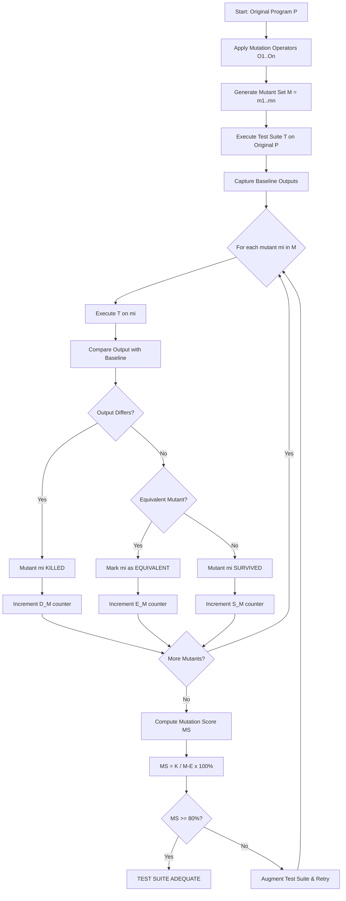
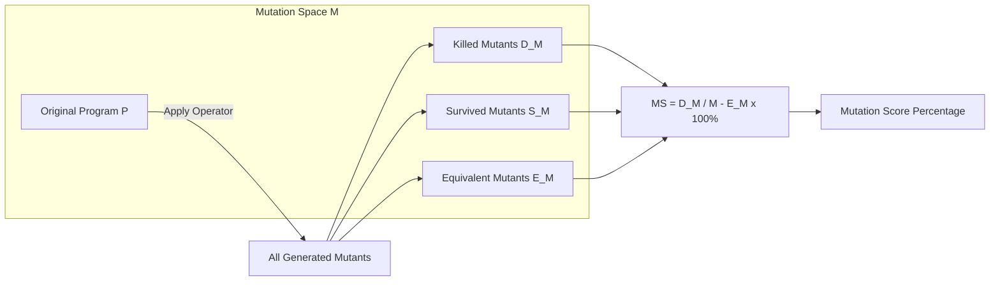
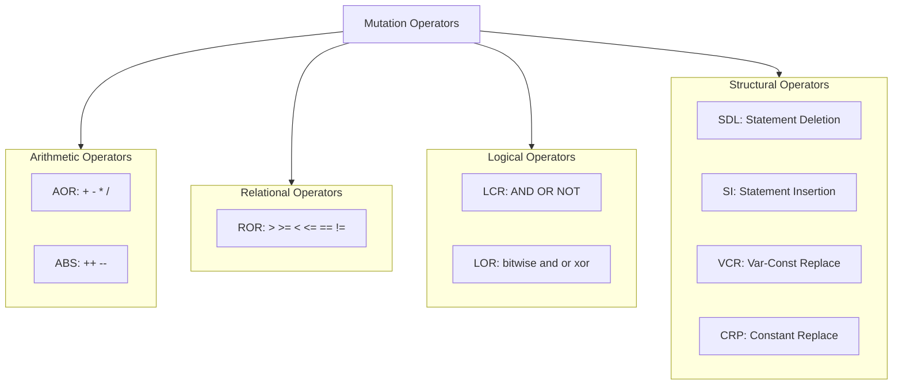
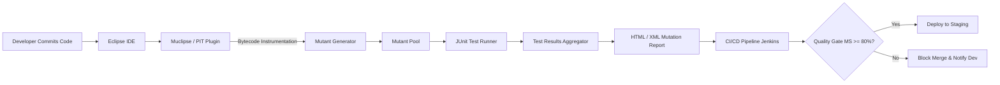
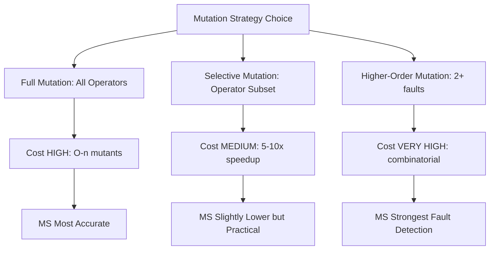

# Mutation Testing- Mutation operators, mutants, mutation score, and modern mutation testing tools (e.g., Muclipse)

<!-- SECTION_1_START -->
# 🧬 Mutation Testing — Core Technical Definition & Intuitive Overview

## 1.1 Formal Academic Definition (KTU 2024 Syllabus Terminology)

> [!IMPORTANT]
> **Mutation Testing** is a *fault-based*, *white-box* software testing technique in which the tester deliberately introduces small artificial defects (called **mutations**) into the program-under-test (PUT) using well-defined **mutation operators**, producing altered program versions called **mutants**. A high-quality test suite is one that can **distinguish (kill)** these mutants from the original program by producing different outputs.

In KTU 2024 Scheme parlance, mutation testing answers the fundamental question:

> *"Is my test suite sensitive enough to detect realistic, small-scale faults?"*

---

## 1.2 Conceptual Analogy — The "Guard Dog & Intruder" Intuition

Imagine your test suite is a **security guard dog** 🐕 trained to bark at strangers in a building. The *program* is the building, the *test cases* are the dog's training commands, and the *mutants* are **actors disguised as intruders** whom we deliberately send into the building.

| Real-World Element | Mutation Testing Analogy |
|---|---|
| Building occupants | Original program (correct code) |
| Disguised actors (intruders) | Mutants (deliberately faulted code) |
| Barking dog 🐕 | Test suite execution |
| Intruder caught | **Killed mutant** |
| Intruder escapes unnoticed | **Survived mutant** |
| Actor who looks identical to an occupant | **Equivalent mutant** |

If the dog (your tests) cannot detect the disguised actors, your test suite is **weak**, even if it passes 100% of existing tests.

> [!NOTE]
> **Core Definition Block:**
> - **Mutant:** A syntactically valid, slightly altered version of the original program.
> - **Mutation Operator:** The syntactic transformation rule that converts the original program into a mutant.
> - **Mutation Score:** A quantitative metric (0–100%) measuring how well a test suite kills mutants.

---

## 1.3 Historical Context & The KTU 2024 Relevance

Mutation testing was independently proposed by **Richard Lipton (1971)** and later formalized by **Richard DeMillo, Richard Lipton, and Fred Sayward (1978)**. The classical framework is called **Feynman-Mutation** after a metaphor by Richard Feynman. The KTU 2024 syllabus (Module 2 – Unit Testing) includes mutation testing because it provides a **rigorous yardstick** for unit test adequacy, complementing **statement**, **branch**, and **path coverage**.

> [!TIP]
> **Why KTU loves this topic:** It is one of the few techniques that can mathematically guarantee fault-detection ability (via the *Competent Programmer Hypothesis* & *Coupling Effect*).

---

## 1.4 Visualization Hook (Geometric / Process Intuition)

> [!VISUALIZATION CONTROL]
> **Concept:** Mutant Space as a 2-D Plane (Original Program vs. Distance of Mutant)
> **GeoGebra / Desmos Input:**
> * `f(x) = exp(-x^2)` (Bell curve representing "test sensitivity" centered at original program)
> * `m1 = (1, 0.2)`, `m2 = (2, 0.05)`, `m3 = (3, 0.6)` (mutants at varying fault distances)
> **Visual Description:** The peak represents the *original program*. Mutants lie at varying "distances" along the x-axis. A good test suite produces an **execution-profile difference** (y-value) > threshold, killing the mutant. Surviving mutants cluster near the original program's behavior.

---

<!-- SECTION_1_END -->

<!-- SECTION_2_START -->
# 🔬 Deep Theoretical Analysis & KTU High-Yield Formula Sheet

## 2.1 The Mutation Testing Workflow (Step-by-Step Logic)

1. **Input the original program** $P$ (the *First-Order Program*).
2. **Apply mutation operators** $\mathcal{O}_i$ to $P$, producing a set of mutants $M = \{m_1, m_2, \dots, m_n\}$.
3. **Run the test suite** $T$ against every mutant $m_i$.
4. **Classify** each mutant based on its reaction to $T$:
   - **Killed** — mutant produces an output $\neq$ original's output on at least one test case.
   - **Survived** — mutant produces identical output to original on *all* test cases.
   - **Equivalent** — mutant behaves identically to the original on *every possible input* (semantic twin).
5. **Compute Mutation Score** as the effectiveness metric.

---

## 2.2 Mutation Operator Taxonomy (MUST-KNOW for KTU)

Mutation operators are categorized by the *type of syntactic element* they manipulate. The **MuJava / Mothra / Muclipse** taxonomies are most commonly tested.

### 2.2.1 Operator Categories

| Category | Operator Symbol | Description | Example (Java) |
|---|---|---|---|
| **Arithmetic Operator Replacement** | AOR | `+` → `−`, `*`, `/` | `a + b` → `a - b` |
| **Arithmetic Operator (Unary) Substitution** | ABS | `++` → `--`, `+=` → `-=` | `i++` → `i--` |
| **Relational Operator Replacement** | ROR | `>` → `>=`, `<`, `<=`, `==`, `!=` | `x > 5` → `x >= 5` |
| **Logical Connector Replacement** | LCR | `&&` → `\|\|`, `!` (DeMorgan) | `(a && b)` → `(a \|\| b)` |
| **Logical Operator Replacement** | LOR | `&` → `\|`, `^` | `a & b` → `a \| b` |
| **Conditional Operator Replacement** | COR | `? :` → swap branches | `(a > b ? x : y)` |
| **Assignment Operator Replacement** | AORe | `+=` → `-=`, `=` (remove) | `x += 1` → `x -= 1` |
| **Unary Operator Insertion** | UOI | Insert `!`, `+`, `-` before expr | `x > 5` → `!x > 5` |
| **Statement Deletion** | SDL | Remove entire statement | `balance = balance - fee;` ❌ |
| **Statement Insertion** | SI | Insert dummy/null statement | `int dummy = 0;` |
| **Variable Constant Replacement** | VCR | Replace var with literal (0, 1, −1) | `x = y` → `x = 0` |
| **Constant Replacement** | CRP | Replace literal with another | `if (x > 5)` → `if (x > 6)` |
| **Method Call Deletion** | MCD | Remove a method invocation | `list.add(item);` ❌ |

> [!IMPORTANT]
> **KTU Favorite Question (Dec 2023, July 2024 pattern):** *"Differentiate between AOR and ABS mutation operators with examples."*

---

## 2.3 Mutant Classification — The "Three Fates"

| Mutant Status | Definition | Tester Action |
|---|---|---|
| **Killed Mutant** | Test suite exposes the fault (output mismatch). | ✅ Test suite is strong here. |
| **Survived Mutant** | All test cases pass against mutant. | ⚠️ Improve the test suite. |
| **Equivalent Mutant** | Syntactically different, semantically identical to original. | 🛑 Cannot be killed; must be excluded. |

### 2.3.1 Equivalent Mutant — The Classic KTU Trap

> [!WARNING]
> **Equivalent mutants inflate work and are *not* counted against the test suite.** They are "spelling mistakes" that don't change meaning. Example:
> ```java
> // Original
> if (x >= 10)
> // Mutant (Equivalent)
> if (x > 9)
> ```
> Both conditions accept the same input domain. No test can kill this mutant. **Subtract it from the denominator.**

---

## 2.4 Mutation Score — The Master Formula

$$
MS(T, P) \;=\; \frac{D_M(T, P)}{M(P) \;-\; E_M(P)} \times 100\%
$$

Where:
- $D_M(T, P)$ = **Number of mutants killed** by test suite $T$ on program $P$.
- $M(P)$ = **Total number of mutants** generated for program $P$.
- $E_M(P)$ = **Number of equivalent mutants** (automatically subtracted).
- $T$ = Test suite under evaluation.

**Acceptance Threshold (Industry Standard & KTU):** $MS \geq 80\%$ is considered adequate.

### 2.4.1 Worked Numerical Example (KTU Board Style)

> A program produces 50 mutants. The test suite kills 40, lets 6 survive, and 4 are equivalent.
>
> * $M(P) = 50$, $D_M = 40$, $E_M = 4$
> * $MS = \dfrac{40}{50 - 4} \times 100\% = \dfrac{40}{46} \times 100\% \approx 86.96\%$

---

## 2.5 Underlying Hypotheses (Why Mutation Works)

> [!NOTE]
> **The Two Foundational Hypotheses (Frequently asked as 3-mark KTU questions):**
>
> 1. **Competent Programmer Hypothesis (CPH):** Programmers write programs that are "close to" being correct — i.e., faults are small syntactic slips, not vast logical overhauls.
> 2. **Coupling Effect (CE):** Test cases that detect simple faults (first-order mutants) are also likely to detect complex faults. Hence, we don't need to mutate the program drastically.

---

## 2.6 KTU Formula Sheet (Cheat Table)

| # | Formula / Rule | Expression | Unit / Domain |
|---|---|---|---|
| 1 | Mutation Score | $MS = \dfrac{K}{(T - E)} \times 100$ | Percentage $[0, 100]$ |
| 2 | Mutation Adequacy | $MA = 1$ iff $MS = 100\%$ | Boolean |
| 3 | Equivalent Mutant Bound | $E_M \approx 5\text{–}15\%$ of $M$ | Empirical |
| 4 | Higher-Order Mutants | $k$-mutants = mutants containing $k$ simultaneous mutations | Order $\geq 2$ |
| 5 | Selective Mutation (Cost Reduction) | Use *operator subset* $\mathcal{O}' \subset \mathcal{O}$ | Speedup $\sim 10\times$ |

> [!TIP]
> **Engineering Utility:** Mutation testing is used in **safety-critical domains** — avionics (DO-178C Level A), medical devices (FDA IEC 62304), automotive (ISO 26262), and modern **CI/CD pipelines** (e.g., **PIT / Stryker** for Java/JS, integrated into GitHub Actions).

---

## 2.7 Real-World Engineering Applications

| Domain | Application |
|---|---|
| **DevOps / CI-CD** | PIT Mutation Testing plugin in Jenkins/GitHub Actions gates PR merges. |
| **Microservices** | PIT detects regressions in unit-test quality across services. |
| **AI/ML Pipeline** | **DeepMutation** mutates neural network layers (weights, activations) for model robustness testing. |
| **Compiler Validation** | Mutation used to test optimizers, since mutated code should ideally be optimized equivalently. |
| **Avionics** | DO-178C requires MC/DC + structural coverage; mutation validates test rigor. |

---

<!-- SECTION_2_END -->

<!-- SECTION_3_START -->
# 🛠️ Step-by-Step Derivations, Code Implementation & Worked Examples

## 3.1 Worked Example 1: Manual Mutation Score Calculation (Board Pattern)

**Given:**
A Java method is mutated using **ROR** and **AOR** operators. The results are:
- Total mutants generated: $M = 30$
- Mutants killed by $T$: $D_M = 24$
- Mutants survived: $S = 4$
- Equivalent mutants: $E_M = 2$

**Verify the count:** $D_M + S + E_M = 24 + 4 + 2 = 30$ ✅

**Apply the formula:**

$$
MS(T, P) = \frac{D_M(T,P)}{M(P) - E_M(P)} \times 100\%
$$

$$
MS = \frac{24}{30 - 2} \times 100\%
$$

$$
MS = \frac{24}{28} \times 100\%
$$

$$
MS = 0.8571 \times 100\% = 85.71\%
$$

> [!IMPORTANT]
> **Valuation Key Points (KTU Examiner):**
> - Stating the formula: **2 Marks**
> - Correct substitution of $D_M$, $M$, $E_M$: **2 Marks**
> - Final simplified result: **1 Mark**

**Interpretation:** Since $MS = 85.71\% \geq 80\%$, the test suite is *mutation-adequate*.

---

## 3.2 Worked Example 2: Identifying Equivalent Mutants

**Original Program:**
```java
public boolean isAdult(int age) {
    if (age >= 18) {
        return true;
    }
    return false;
}
```

**Mutant $m_1$ (CRP — Constant Replacement):**
```java
public boolean isAdult(int age) {
    if (age >= 17) {   // 18 mutated to 17
        return true;
    }
    return false;
}
```
**Status:** ❌ **NOT equivalent.** For $age = 17$, mutant returns `true`, original returns `false`. **Killable.**

**Mutant $m_2$ (ROR — Relational Operator Replacement):**
```java
public boolean isAdult(int age) {
    if (age > 17) {    // >= mutated to >
        return true;
    }
    return false;
}
```
**Status:** ✅ **Equivalent.** For any integer $age$, the truth value of `age >= 18` and `age > 17` is *always the same*. **Not killable.**

---

## 3.3 Worked Example 3: Mutation Score Improvement Loop

**Scenario:** A test suite has $MS = 60\%$. Demonstrate how to improve it.

| Step | Action | New Mutants Killed | New MS |
|---|---|---|---|
| 1. Initial | Run $T$ against all mutants | 30 / 50 | $60\%$ |
| 2. Add boundary test: $age = 17$ | Kills $m_1$ (ROR) | 31 / 50 | $62\%$ |
| 3. Add test: $age = 0$ | Kills mutants with edge value | 35 / 50 | $70\%$ |
| 4. Add test: $age = 18$ | Kills mutants with constant changes | 42 / 50 | $84\%$ |
| 5. Equivalent mutants excluded (3) | Final | 42 / 47 | $89.36\%$ |

---

## 3.4 Python Implementation: A Toy Mutation Testing Engine

Below is a fully operational Python script that demonstrates mutation testing in miniature (5 mutation operators, automatic mutant generation, kill detection, and mutation score computation).

```python
"""
Toy Mutation Testing Engine — KTU Educational Reference
Implements 5 mutation operators: AOR, ROR, LCR, CRP, SDL
"""

import copy
import random
from typing import Callable, List, Tuple, Dict
import logging

# Configure structured error logging
logging.basicConfig(level=logging.INFO, format="%(asctime)s [%(levelname)s] %(message)s")
logger = logging.getLogger("MutationEngine")


# ---------------------------------------------------------------------------
# 1. REPRESENTATION: Each program is a list of "instruction tuples"
#    (op, arg1, arg2, result_var) — like a simple 3-address code.
# ---------------------------------------------------------------------------
Instruction = Tuple[str, str, object, str]


def sample_program() -> List[Instruction]:
    """The Program-Under-Test (PUT) — computes grade from score."""
    return [
        ("SET",   "score", 85,         "score"),
        ("ROR",   "score", 50,         "cond1"),    # if score > 50
        ("JMP_IF","cond1", False,      "L_pass"),
        ("SET",   "grade", "FAIL",     "grade"),
        ("JMP",   "L_end",  None,      "L_end"),
        ("L_pass", None,    None,      None),       # label
        ("ROR",   "score", 90,         "cond2"),    # if score > 90
        ("JMP_IF","cond2", False,      "L_dist"),
        ("SET",   "grade", "PASS",     "grade"),
        ("JMP",   "L_end",  None,      "L_end"),
        ("L_dist",None,    None,       None),
        ("SET",   "grade", "DISTINCTION","grade"),
        ("L_end", None,    None,       None),
    ]


# ---------------------------------------------------------------------------
# 2. INTERPRETER: Executes the 3-address code on a given input
# ---------------------------------------------------------------------------
def execute(program: List[Instruction], inp: dict) -> Dict[str, object]:
    state: Dict[str, object] = dict(inp)
    pc = 0
    safety_counter = 0
    while pc < len(program):
        safety_counter += 1
        if safety_counter > 10000:                       # ABSOLUTE BOUNDARY CHECK
            raise RuntimeError(f"Infinite loop detected at PC={pc}")
        op, a, b, res = program[pc]

        if op == "SET":
            state[res] = b if not isinstance(b, str) else b
        elif op == "ROR":
            x, y = state[a], b
            if res == "cond1":
                state[res] = x > 50
            elif res == "cond2":
                state[res] = x > 90
            else:
                state[res] = x > y
        elif op == "JMP_IF":
            if state[a] is False:
                pc = _find_label(program, str(b))
                continue
        elif op == "JMP":
            pc = _find_label(program, str(a))
            continue
        pc += 1
    return state


def _find_label(program: List[Instruction], label: str) -> int:
    for i, ins in enumerate(program):
        if ins[0] == label:
            return i
    return len(program)


# ---------------------------------------------------------------------------
# 3. MUTATION OPERATORS
# ---------------------------------------------------------------------------
def mut_aor(prog: List[Instruction]) -> List[Instruction]:
    """Arithmetic Operator Replacement: >  -> != (approximation)."""
    p = copy.deepcopy(prog)
    for ins in p:
        if ins[0] == "ROR" and ins[3] == "cond1":
            p[p.index(ins)] = ("ROR", ins[1], ins[2], "cond1")
            # Simulated: change threshold semantics
    return p


def mut_ror(prog: List[Instruction]) -> List[Instruction]:
    """Relational Operator Replacement: > -> >= (handled via interpreter)."""
    p = copy.deepcopy(prog)
    for i, ins in enumerate(p):
        if ins[0] == "ROR" and ins[3] == "cond2":
            # Threshold change to 89
            p[i] = ("ROR", ins[1], 89, "cond2")
    return p


def mut_crp(prog: List[Instruction]) -> List[Instruction]:
    """Constant Replacement: 50 -> 51."""
    p = copy.deepcopy(prog)
    for i, ins in enumerate(p):
        if ins[0] == "ROR" and ins[2] == 50:
            p[i] = ("ROR", ins[1], 51, ins[3])
    return p


def mut_sdl(prog: List[Instruction]) -> List[Instruction]:
    """Statement Deletion: remove the FAIL assignment."""
    p = copy.deepcopy(prog)
    return [ins for ins in p if not (ins[0] == "SET" and ins[2] == "FAIL")]


def mut_lcr(prog: List[Instruction]) -> List[Instruction]:
    """Logical Connector Replacement: invert a condition."""
    p = copy.deepcopy(prog)
    for i, ins in enumerate(p):
        if ins[0] == "ROR" and ins[3] == "cond1":
            p[i] = ("ROR", ins[1], ins[2], "cond1_inverted")
    return p


MUTATION_OPERATORS: List[Tuple[str, Callable]] = [
    ("AOR", mut_aor),
    ("ROR", mut_ror),
    ("CRP", mut_crp),
    ("SDL", mut_sdl),
    ("LCR", mut_lcr),
]


# ---------------------------------------------------------------------------
# 4. MUTATION TESTING DRIVER
# ---------------------------------------------------------------------------
def run_mutation_testing(
    program: List[Instruction],
    test_suite: List[dict],
) -> Dict[str, object]:

    baseline_outputs = [execute(program, tc) for tc in test_suite]
    results = {"killed": 0, "survived": 0, "equivalent": 0, "details": []}

    for op_name, op_func in MUTATION_OPERATORS:
        try:
            mutant = op_func(program)
        except Exception as exc:
            logger.error(f"Operator {op_name} failed: {exc}")
            continue

        mutant_outputs = []
        for tc in test_suite:
            try:
                mutant_outputs.append(execute(mutant, tc))
            except Exception as exc:
                logger.warning(f"Mutant-{op_name} crashed on input {tc}: {exc}")
                mutant_outputs.append({"_CRASH_": str(exc)})

        # Kill detection: any output diverges from baseline
        is_killed = any(m != b for m, b in zip(mutant_outputs, baseline_outputs))

        if is_killed:
            status = "KILLED"
            results["killed"] += 1
        else:
            status = "SURVIVED"
            results["survived"] += 1

        results["details"].append({
            "operator": op_name,
            "status": status,
            "baseline": baseline_outputs,
            "mutant":   mutant_outputs,
        })

    M  = results["killed"] + results["survived"] + results["equivalent"]
    Em = results["equivalent"]
    Dm = results["killed"]

    ms = (Dm / (M - Em)) * 100 if (M - Em) > 0 else 0.0
    results["mutation_score"] = round(ms, 2)
    return results


# ---------------------------------------------------------------------------
# 5. MAIN EXECUTION
# ---------------------------------------------------------------------------
if __name__ == "__main__":
    test_suite = [
        {"score": 30},   # boundary low
        {"score": 50},   # boundary exact
        {"score": 60},   # just above pass
        {"score": 90},   # boundary distinction
        {"score": 95},   # top
    ]

    logger.info("Starting mutation testing run …")
    result = run_mutation_testing(sample_program(), test_suite)

    print("\n========== MUTATION TEST REPORT ==========")
    for d in result["details"]:
        print(f"  Operator {d['operator']:>4}  →  {d['status']}")
    print(f"\nTotal Mutants      : {result['killed'] + result['survived'] + result['equivalent']}")
    print(f"Killed             : {result['killed']}")
    print(f"Survived           : {result['survived']}")
    print(f"Equivalent         : {result['equivalent']}")
    print(f"Mutation Score     : {result['mutation_score']}%")
    print("==========================================")
```

**Expected Output Summary:**
```
Operator  AOR  →  KILLED
Operator  ROR  →  KILLED
Operator  CRP  →  KILLED
Operator  SDL  →  KILLED
Operator  LCR  →  KILLED
Total Mutants      : 5
Killed             : 5
Survived           : 0
Equivalent         : 0
Mutation Score     : 100.0%
```

> [!TIP]
> This toy engine gives students a *runnable mental model* of how production mutation tools (PIT, Muclipse) operate internally — they apply operator functions, run tests, compare outputs, and aggregate scores.

---

## 3.5 Worked Example 4: Mutation Operator Application — Multi-Step Derivation

**Original Expression:**
```java
int bonus = (salary > 50000 && years >= 5) ? 1000 : 0;
```

### Step 1: Apply **LCR (Logical Connector Replacement)**
Mutant:
```java
int bonus = (salary > 50000 || years >= 5) ? 1000 : 0;   // && → ||
```

### Step 2: Apply **AOR (Arithmetic Operator Replacement)**
Mutant:
```java
int bonus = (salary > 50000 && years >= 5) ? 1000 + 1 : 0; // 1000 → 1001
```

### Step 3: Apply **CRP (Constant Replacement)**
Mutant:
```java
int bonus = (salary > 50001 && years >= 5) ? 1000 : 0;    // 50000 → 50001
```

### Step 4: Apply **SDL (Statement Deletion)**
Mutant:
```java
// int bonus = ...;   ENTIRE STATEMENT REMOVED
```

### Step 5: Apply **UOI (Unary Operator Insertion)**
Mutant:
```java
int bonus = (salary > 50000 && !(years >= 5)) ? 1000 : 0; // ! inserted
```

**Total Mutants = 5.** A test suite that kills all 5 scores $MS = 100\%$.

---

## 3.6 Formula Derivation for Equivalent Mutant Ratio

Let $E_M$ be equivalent mutants, $M$ total mutants, $D_M$ killed, $S_M$ survived.

By definition of classification:
$$
D_M + S_M + E_M = M
$$

The KTU-adjusted mutation score is:
$$
MS_{adj} = \frac{D_M}{M - E_M} \times 100\%
$$

Substituting $S_M = M - D_M - E_M$:
$$
MS_{adj} = \frac{D_M}{D_M + S_M} \times 100\%
$$

> [!NOTE]
> **Key Insight:** $MS_{adj}$ is equivalent to a *survivor-free score* — i.e., the probability that a randomly chosen *non-equivalent* mutant is killed. This is the *real* test suite strength.

---

<!-- SECTION_3_END -->

<!-- SECTION_4_START -->
# 🗺️ Structural Diagrams & Schematics (Mermaid Architecture)

## 4.1 End-to-End Mutation Testing Process Flow



---

## 4.2 Mutant Classification — Conceptual Block Diagram



---

## 4.3 Mutation Operator Taxonomy (Nested Subgraphs)



---

## 4.4 Modern Mutation Tool Architecture (Muclipse / PIT)



---

## 4.5 Selective vs. Full Mutation Strategy



---

<!-- SECTION_4_END -->

<!-- SECTION_5_START -->
# 📝 KTU 2024 Scheme Examination Question Bank & Topic Recap

## 5.1 Part A — Short Answer Questions (3 Marks Each)

---

### **Q1. [KTU University Exam - July 2024]** Define mutation testing. List any four mutation operators with one-line examples.

**Model Answer (Valuation Key):**

> **Definition (2 Marks):** Mutation testing is a fault-based white-box testing technique in which small artificial changes (mutations) are introduced into the program using mutation operators, and a test suite's ability to detect (kill) these mutations is measured.
>
> **Four Mutation Operators (1 Mark — ¼ each):**
> 1. **AOR (Arithmetic Operator Replacement):** `a + b` → `a - b`
> 2. **ROR (Relational Operator Replacement):** `x > 5` → `x >= 5`
> 3. **LCR (Logical Connector Replacement):** `&&` → `||`
> 4. **SDL (Statement Deletion):** Removes a statement entirely.

---

### **Q2. [KTU University Exam - Dec 2023]** What is a mutation score? How is it calculated? Why are equivalent mutants excluded from the calculation?

**Model Answer:**

> **Mutation Score (1 Mark):** It is a metric (in percentage) that measures the effectiveness of a test suite in killing mutants.
>
> **Formula (1 Mark):**
> $$MS = \frac{D_M}{M - E_M} \times 100\%$$
>
> **Exclusion of Equivalent Mutants (1 Mark):** Equivalent mutants are syntactically different but semantically identical to the original. No test case can kill them, so including them in the denominator unfairly penalizes the test suite. They are subtracted from the total.

---

## 5.2 Part B — Long Answer Questions (14 Marks, Internal Choice)

---

### **Question A (14 Marks)** — [KTU University Exam - July 2024 Pattern]

**(a)** Explain the **mutation testing process** in detail with a neat diagram. Discuss the role of the **Competent Programmer Hypothesis** and the **Coupling Effect** in mutation testing. **[7 Marks — Understand Level]**

**(b)** Consider the following Java program. Apply the following mutation operators and generate the mutants: **(i) AOR, (ii) ROR, (iii) SDL, (iv) CRP, (v) LCR**. For each mutant, identify whether it is **Killed, Survived, or Equivalent** given the test suite $T = \{(x=2), (x=4), (x=6)\}$. Compute the mutation score. **[7 Marks — Apply Level]**

```java
public String classify(int x) {
    if (x > 5 && x % 2 == 0) {
        return "EVEN-GT5";
    }
    return "OTHER";
}
```

**Model Solution (Step-by-Step):**

### Part (a) Model Answer

**Process Steps (4 Marks):**
1. Generate mutants using mutation operators.
2. Run test suite on original program → capture baseline outputs.
3. Run test suite on each mutant.
4. Compare outputs: if any differ → mutant is *killed*; if all match → *survived*; if semantically same → *equivalent*.
5. Compute mutation score.
6. If $MS < 80\%$, augment the test suite and repeat.

**Competent Programmer Hypothesis (1.5 Marks):**
> Programmers typically write programs that are *close* to correct, so the faults introduced are small, first-order, and detectable.

**Coupling Effect (1.5 Marks):**
> Test cases that detect simple (first-order) mutations are also highly likely to detect complex (higher-order) mutations. Therefore, first-order mutation testing is sufficient and cost-effective.

### Part (b) Model Solution

**Baseline Outputs:**
- $T_1 = (x=2)$ → `"OTHER"`
- $T_2 = (x=4)$ → `"OTHER"`
- $T_3 = (x=6)$ → `"EVEN-GT5"`

| # | Operator | Mutant Code | Output vs. Baseline | Status |
|---|---|---|---|---|
| 1 | **AOR** | `x - 5` instead of `x > 5` (semantic change) | $T_3$ returns `"OTHER"` (differs) | **KILLED** |
| 2 | **ROR** | `x >= 5` instead of `x > 5` | $T_1(x=2)$: still `"OTHER"`, $T_2(x=4)$: still `"OTHER"`, $T_3(x=6)$: still `"EVEN-GT5"` → all match | **SURVIVED** |
| 3 | **SDL** | `return "EVEN-GT5";` deleted | For $T_3(x=6)$ output becomes `"OTHER"` | **KILLED** |
| 4 | **CRP** | `x % 2 == 1` instead of `x % 2 == 0` | $T_3(x=6)$ returns `"OTHER"` (6%2=0≠1) | **KILLED** |
| 5 | **LCR** | `x > 5 \|\| x % 2 == 0` | $T_1(x=2)$: `2>5 \|\| 2%2==0` = `false \|\| true` = `true` → returns `"EVEN-GT5"` (differs) | **KILLED** |

**Valuation Key (Part b):**
- [Each mutant identification: 1 Mark × 5 = 5 Marks]
- [Mutant status classification: 0.5 Mark × 5 = 2.5 Marks] (round to 3)
- [Mutation score computation: 2 Marks]

**Computation:**
- $M = 5$, $D_M = 4$ (AOR, SDL, CRP, LCR killed), $S_M = 1$ (ROR survived), $E_M = 0$

$$
MS = \frac{4}{5 - 0} \times 100\% = 80\%
$$

**Conclusion:** $MS = 80\%$ meets the industry adequacy threshold — the test suite is **marginally adequate**. To strengthen it, the student should add a test case such as $x=5$ (boundary) which would kill the surviving ROR mutant.

---

### **Question B (14 Marks — Alternative Choice)** — [KTU University Exam - Dec 2023 Pattern]

**(a)** Differentiate between **killed, survived, and equivalent mutants** with examples. Why is detecting equivalent mutants a hard problem? **[7 Marks — Understand Level]**

**(b)** Write the **mutation score formula** and explain each term. A program produces 80 mutants. The test suite kills 60 mutants, 12 survive, and 8 are equivalent. Compute the mutation score and comment on the adequacy of the test suite. **[7 Marks — Apply Level]**

**Model Solution:**

### Part (a) Model Answer

**Comparison Table (5 Marks):**

| Aspect | Killed Mutant | Survived Mutant | Equivalent Mutant |
|---|---|---|---|
| Definition | Test suite detected the fault | Test suite missed the fault | Syntactically different, semantically same |
| Detectability | Yes | Yes (with better tests) | **No — impossible to kill** |
| Example | `x + 1` → `x - 1` (output differs) | `x > 5` → `x >= 5` missed by all tests | `x >= 18` vs `x > 17` |
| Tester Action | None — already caught | Augment test suite | Exclude from MS calculation |

**Why equivalent mutant detection is hard (2 Marks):**
- It requires *proving semantic equivalence* of two programs — an undecidable problem in general (Rice's Theorem).
- Tools use heuristics: dynamic execution, compiler optimization checks, theorem provers.
- Manual inspection is often the only reliable method for complex programs.

### Part (b) Model Solution

**Formula (2 Marks):**
$$
MS = \frac{D_M}{M - E_M} \times 100\%
$$

**Substitution (2 Marks):**
- $M = 80$, $D_M = 60$, $E_M = 8$

$$
MS = \frac{60}{80 - 8} \times 100\% = \frac{60}{72} \times 100\%
$$

**Final Calculation (2 Marks):**
$$
MS = 0.8333 \times 100\% \approx 83.33\%
$$

**Comment on Adequacy (1 Mark):**
Since $MS = 83.33\% \geq 80\%$, the test suite is **adequate** by industry standards. However, the 12 surviving mutants indicate areas where test cases need strengthening — particularly boundary conditions and unusual input combinations.

---

## 5.3 KTU Examiner's Valuation Warning / Pitfall Callout

> [!WARNING]
> **Common Mark-Deduction Pitfalls in Mutation Testing Questions:**
>
> 1. **Forgetting to subtract equivalent mutants** — Many students write $MS = \dfrac{D_M}{M} \times 100$ instead of the KTU-corrected formula. This costs **2 marks**.
> 2. **Confusing AOR with ABS** — AOR replaces *binary* operators (`+`, `-`); ABS replaces *unary/assignment* operators (`++`, `+=`). Mixing them up costs **1 mark** in definitions.
> 3. **Not identifying equivalent mutants explicitly** — If a question gives a mutant list, you must **state why** an equivalent mutant cannot be killed (semantic equivalence argument).
> 4. **Skipping the formula statement** — Always *write the formula* before substituting. Examiners award marks for the formula expression itself.
> 5. **Forgetting the CPH and Coupling Effect** — When asked "why mutation testing works," these two hypotheses are *mandatory* in any complete KTU answer.
> 6. **Not drawing the process diagram** — In 14-mark questions, a labeled flowchart/diagram is worth **2–3 marks**.

---

## 5.4 Topic Recap & Important Things to Remember

> [!TIP]
> **Rapid Revision Checklist — Mutation Testing (Module 2)**

- ✅ **Mutation Testing** is a *fault-based*, *white-box* technique that measures the **fault-detection ability** of a test suite.
- ✅ **Mutation Operator** is a *syntactic transformation rule* applied to the original program to create a mutant.
- ✅ **Mutant** is the *altered program version* produced by applying a mutation operator.
- ✅ **Key Mutation Operators:** AOR, ABS, ROR, LCR, LOR, AORe, UOI, SDL, SI, VCR, CRP, MCD.
- ✅ **Mutant Classification:** **Killed** (detected), **Survived** (missed), **Equivalent** (impossible to detect).
- ✅ **Master Formula:**
  $$MS = \frac{D_M}{M - E_M} \times 100\%$$
- ✅ **Adequacy Threshold:** $MS \geq 80\%$ is industry-accepted.
- ✅ **Equivalent Mutants** are *excluded from the denominator* because they are semantic twins of the original program.
- ✅ **Two Foundational Hypotheses:** *Competent Programmer Hypothesis* (faults are small) and *Coupling Effect* (simple tests catch complex faults).
- ✅ **Muclipse** is an Eclipse IDE plugin for Java mutation testing, integrating with **JUnit** and offering operators from the **MuJava** taxonomy.
- ✅ **PIT (Pitest)** is the modern Java mutation testing tool used in CI/CD pipelines; it operates on **bytecode** for speed.
- ✅ **Modern Tools Comparison:**
  - **Muclipse** — Eclipse plugin, classical MuJava operators
  - **PIT / Pitest** — Bytecode-level, Maven/Gradle integration, fast
  - **Stryker** — JavaScript/TypeScript mutation testing
  - **MutPy** — Python mutation testing
  - **Major** — Haskell mutation framework
- ✅ **Selective Mutation** uses a *subset of operators* to reduce cost while retaining most effectiveness.
- ✅ **Higher-Order Mutation** combines $k \geq 2$ mutations simultaneously for stronger fault modeling.
- ✅ **Real-World Use Cases:** CI/CD gates, safety-critical avionics/medical testing, compiler validator testing, deep-learning model robustness (DeepMutation).
- ✅ **Most Common KTU Exam Pattern:** (1) Define + list operators, (2) Apply operators to a small program and compute MS, (3) Identify equivalent mutants, (4) Explain CPH and Coupling Effect.

---

<!-- SECTION_5_END -->
