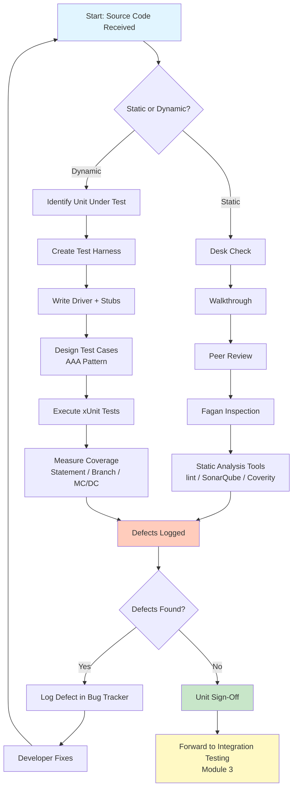
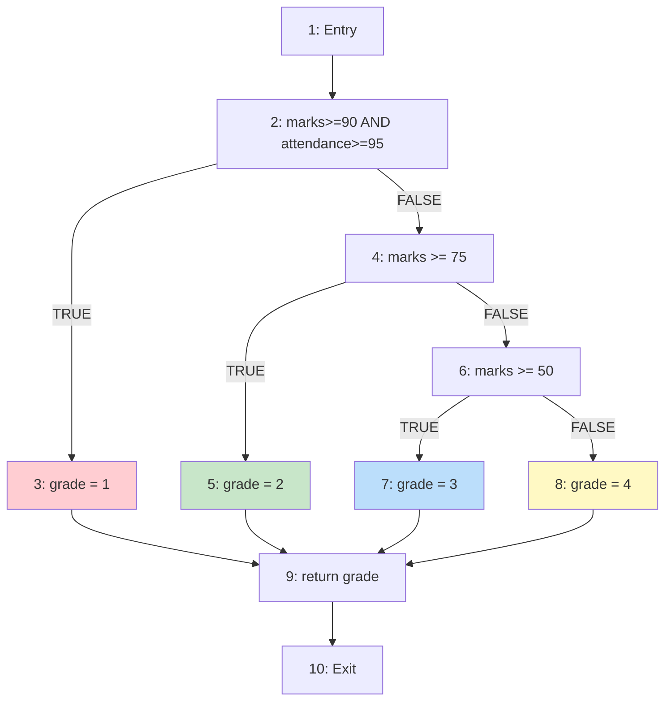
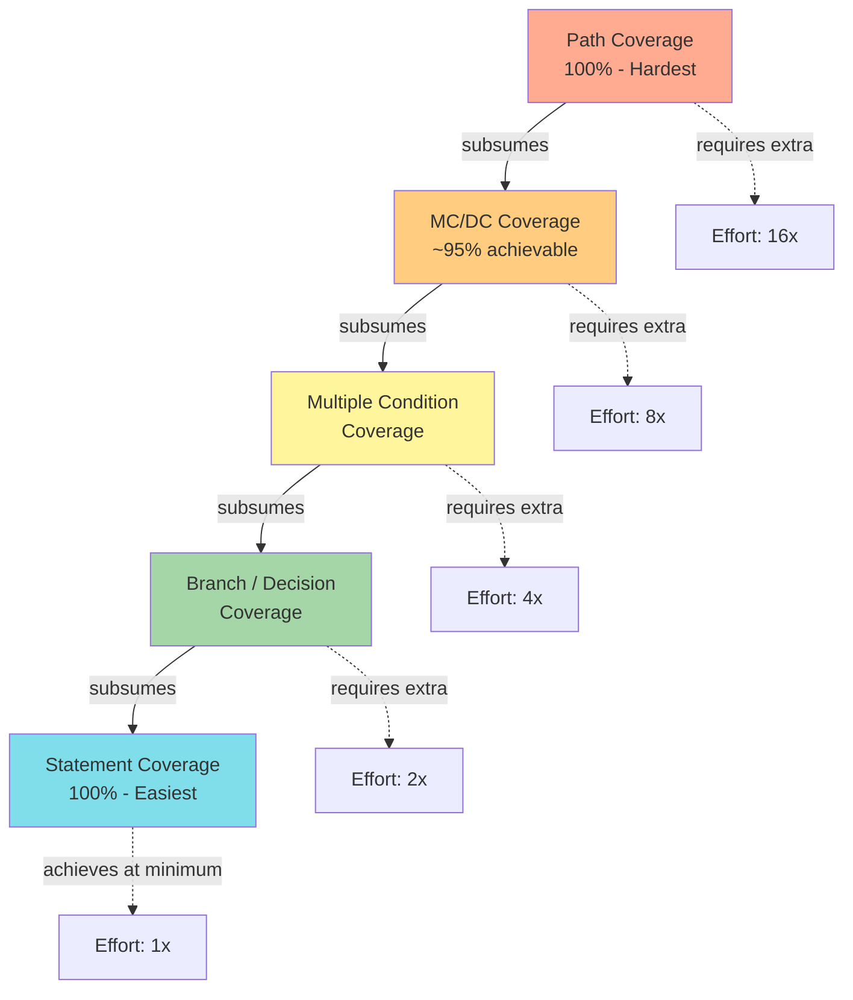
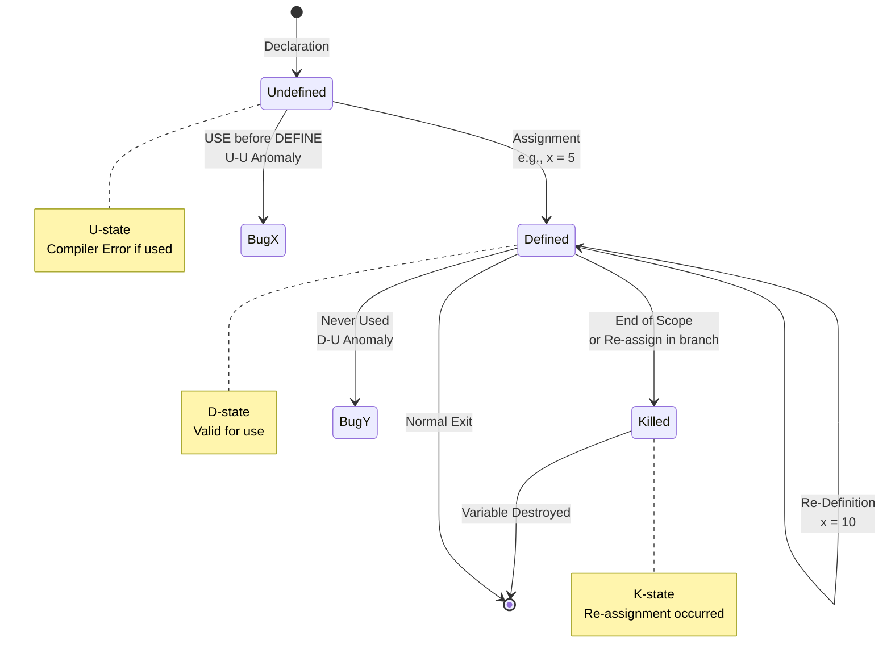
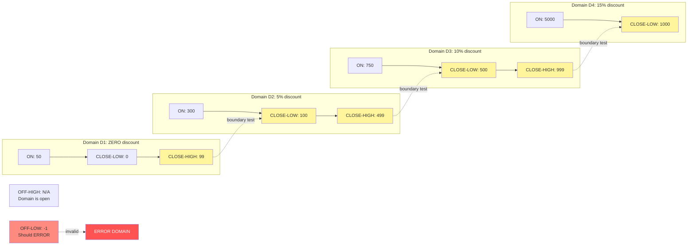
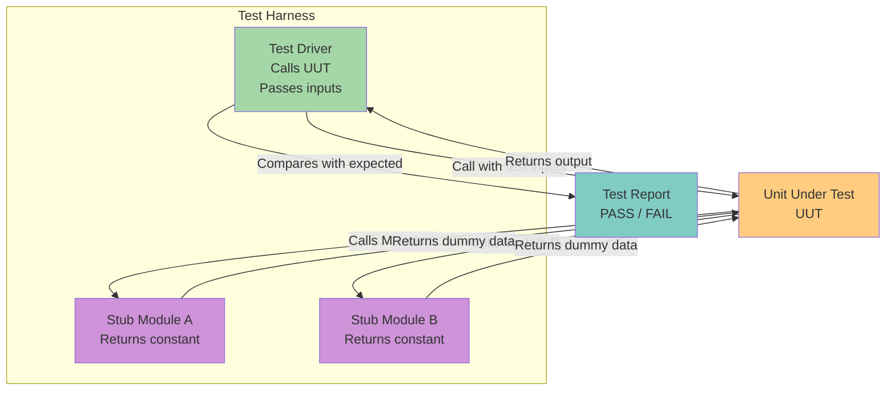
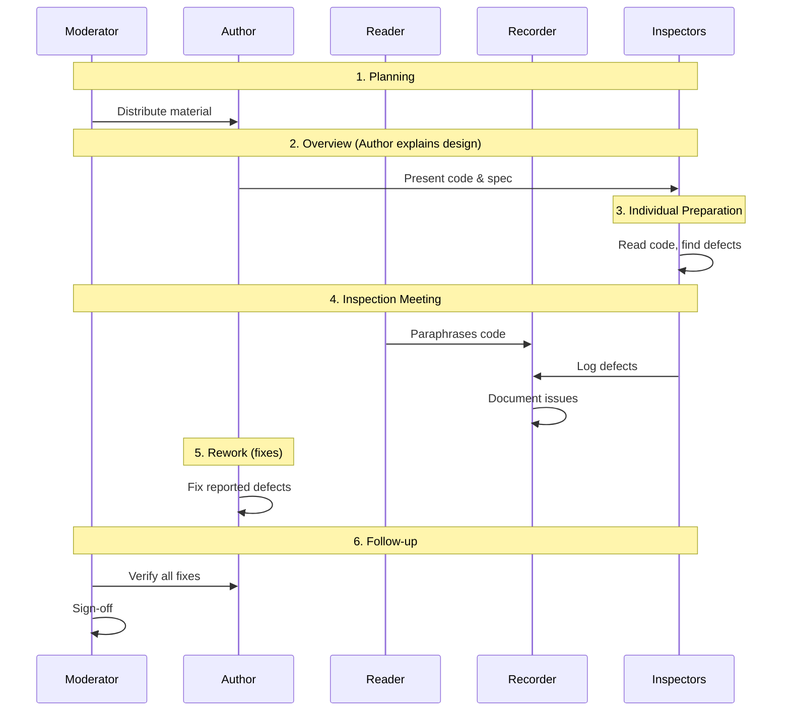
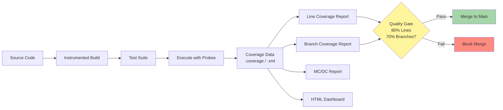

# Unit Testing- Static and Dynamic Unit Testing, control flow testing, data flow testing, domain testing

<!-- SECTION_1_START -->
# Unit Testing — Static and Dynamic Approaches, Control Flow, Data Flow, and Domain Testing

## 1.1 Formal Academic Definition (KTU 2024 Scheme Terminology)

> [!IMPORTANT]
> **Unit Testing** is the lowest level of software testing in the *V-Model* and *ISTQB* test pyramid, where individual *units* of source code (functions, methods, classes, or procedures) are tested in **isolation** from the rest of the system. The objective is to validate that each unit performs exactly as specified in its **module-level design** and conforms to the assigned *Module-Level Course Outcomes (COs)*.

According to the **KTU PECST631 syllabus (Module 2)**, unit testing is broadly classified into:

| # | Sub-Topic | KTU Module Mapping |
|---|-----------|-------------------|
| 1 | **Static Unit Testing** | Reviews, inspections, walkthroughs, static analysis |
| 2 | **Dynamic Unit Testing** | Driver/Stub based execution, xUnit frameworks |
| 3 | **Control Flow Testing** | CFG, statement, branch, condition, MC/DC coverage |
| 4 | **Data Flow Testing** | Define–Use pairs, anomalies, DU-paths |
| 5 | **Domain Testing** | Input domain partitions, ON–OFF points, boundaries |

> [!NOTE]
> A *unit* in the KTU curriculum is the smallest testable entity. In **C**, it is a function; in **Java**, it is a class/method; in **Python**, it is a function or class method. The unit under test is abbreviated as **UUT** (*Unit Under Test*) or **SUT** (*System Under Test*) in industry.

---

## 1.2 Conceptual Analogy & Intuition

> [!TIP]
> **Real-World Analogy: The Car Engine Workshop**
> Imagine a mechanic who receives a brand-new car engine. Before installing the engine into the car, the mechanic individually tests:
> - Each **piston** by pushing it manually *(Static Testing — examining the code without running it)*.
> - Each **spark plug** by actually firing it on a test rig *(Dynamic Testing — executing the code)*.
> - Whether **fuel flows correctly** from the injector to the cylinder at every pressure *(Control Flow Testing — verifying the execution paths)*.
> - Whether **oil reaches every moving part** without leaks *(Data Flow Testing — verifying variable definitions reach all uses)*.
> - Whether the engine works at **extreme cold, normal, and extreme heat** *(Domain Testing — testing boundary input conditions)*.
>
> If the engine pieces work individually but the car breaks when assembled, that is the failure of **Integration Testing** (Module 3 in your syllabus).

### The KTU 4-Phase Unit Testing Mental Model

$$
\text{Unit Testing} = \underbrace{\text{Static Analysis}}_{\text{Phase 1}} \;\cup\; \underbrace{\text{Dynamic Execution}}_{\text{Phase 2}} \;\cup\; \underbrace{\text{Coverage Measurement}}_{\text{Phase 3}} \;\cup\; \underbrace{\text{Defect Removal}}_{\text{Phase 4}}
$$

> [!VISUALIZATION CONTROL]
> **Concept:** Linear coverage progression — the *coverage pyramid* used by the KTU board.
> **GeoGebra / Desmos Input Equations (2D line plot):**
> * `Statement Coverage(x) = x`  *(line passing through origin, slope 1)*
> * `Branch Coverage(x) = 0.5 \cdot x + 0.5`
> * `Condition Coverage(x) = 0.25 \cdot x + 0.75`
> * `MC/DC Coverage(x) = 0.1 \cdot x + 0.9`
> **Visual Description:** Plot $x \in [0, 10]$ on the horizontal axis representing test effort (in person-hours), and $y \in [0, 10]$ on the vertical axis representing coverage percentage. The student should observe that as test effort increases, the difficulty of achieving higher coverage (MC/DC) grows non-linearly compared to statement coverage.

---

## 1.3 Important Foundational Vocabulary

- **Test Harness**: The supporting code (drivers + stubs) required to execute a unit in isolation.
- **Test Driver**: Code that *calls* the UUT and passes test inputs.
- **Test Stub**: Code that *replaces* a called module with a minimal implementation.
- **Mock Object**: A *smart* stub that also verifies how it was called.
- **Fixture**: A known fixed state used as a baseline for running tests.
- **Test Case (TC)**: A triple $\langle \text{Input}, \text{Execution}, \text{Expected Output} \rangle$.

> [!WARNING]
> **KTU Common Mistake:** Students often confuse *stub* with *driver*. Remember the rhyme:
> *"**D**river **D**rives the UUT"* (main routine).
> *"**S**tub **S**tands in for a called module."*
]<]minimax[>[</section>

<!-- SECTION_1_END -->

<!-- SECTION_2_START -->
# Deep Theoretical Analysis & KTU High-Yield Formula Sheet

---

## 2.1 Static Unit Testing

Static unit testing is performed **without executing** the program. It relies on human review and automated static analysis.

### 2.1.1 Formal Review Techniques (Fagan Inspection Model)

The **Michael Fagan inspection process (1976)** is the gold standard and is a direct KTU high-yield topic:

$$
\text{Inspection} = \{\text{Planning}, \text{Overview}, \text{Individual Prep}, \text{Inspection Meeting}, \text{Rework}, \text{Follow-up}\}
$$

| Role | Responsibility |
|------|---------------|
| **Moderator** | Conducts the meeting, manages time |
| **Reader** | Reads the code aloud (paraphrases logic) |
| **Author** | Explains design decisions, fixes defects |
| **Recorder** | Logs every defect raised |
| **Reviewer / Inspector** | Finds defects using checklists |

> [!NOTE]
> A *Walkthrough* is less formal than an *Inspection*. In a walkthrough, the **author** leads the session; in an inspection, the **moderator** leads. **KTU boards test this distinction.**

### 2.1.2 Static Analysis Tools (Categorical Classification)

| Tool Category | Examples | What it Detects |
|---------------|----------|-----------------|
| **Lint / Style Checkers** | `eslint`, `pylint`, `checkstyle` | Unused variables, naming violations |
| **Security Scanners** | `SonarQube`, `Fortify`, `Checkmarx` | SQL injection, XSS, hard-coded passwords |
| **Complexity Analyzers** | `lizard`, `radon`, `SourceMonitor` | Cyclomatic complexity hotspots |
| **Data Flow Analyzers** | `Coverity`, `CodeSonar` | Use of uninitialized variables |

> [!TIP]
> **KTU Industrial Note:** Companies like **TCS, Infosys, and Wipro** use **SonarQube** in their CI/CD pipelines. A *Quality Gate* fails the build if code coverage drops below **80%** or complexity exceeds **10**.

---

## 2.2 Dynamic Unit Testing

Dynamic testing requires **actual execution** of the unit. It is performed using a *test harness*.

### 2.2.1 The xUnit Test Framework Architecture (Kent Beck, 1998)

All modern unit testing frameworks (JUnit, pytest, NUnit, Mocha) follow the **xUnit pattern**:

$$
\text{xUnit} = \text{Fixture} \oplus \text{Test Suite} \oplus \text{Test Runner} \oplus \text{Assertions} \oplus \text{Reports}
$$

### 2.2.2 Driver–Stub Architecture (Block Diagram Concept)

```
┌──────────────┐   calls   ┌──────────┐
│ Test Driver  │ ────────► │   UUT    │
│  (main)      │           │ (Unit)   │
└──────────────┘           └────┬─────┘
                                │ calls
                                ▼
                         ┌──────────────┐
                         │  Test Stub   │  ← replaces dependent module
                         │  (Dummy)     │
                         └──────────────┘
```

### 2.2.3 The AAA Pattern (Arrange–Act–Assert)

$$
\text{Test Method} = \underbrace{\text{Setup}}_{\text{Arrange}} \;\rightarrow\; \underbrace{\text{Call UUT}}_{\text{Act}} \;\rightarrow\; \underbrace{\text{Verify Outcome}}_{\text{Assert}}
$$

---

## 2.3 Control Flow Testing

### 2.3.1 The Control Flow Graph (CFG)

A CFG is a directed graph $G = (N, E, \text{Entry}, \text{Exit})$ where:
- $N$ = set of *nodes* (statements/conditions)
- $E$ = set of *edges* (transfers of control)
- Two special nodes: **Entry** and **Exit**.

### 2.3.2 Cyclomatic Complexity (McCabe, 1976) — THE KTU Formula

Three mathematically equivalent forms:

$$
V(G) = E - N + 2 \tag{McCabe's Edge-Node Formula}
$$

$$
V(G) = P + 1 \tag{Predicate Node Formula}
$$

$$
V(G) = R \tag{Number of Bounded Regions Formula}
$$

Where:
- $E$ = number of edges in the CFG
- $N$ = number of nodes in the CFG
- $P$ = number of predicate (decision) nodes
- $R$ = number of enclosed regions in the planar graph

> [!IMPORTANT]
> **McCabe's Industry Standard:** Code with $V(G) > 10$ is considered *untestable* and must be refactored. NASA mandates $V(G) \le 10$ per function for safety-critical systems.

### 2.3.3 Coverage Hierarchy (Subsumption Rule)

The KTU subsumption chain is a **direct 14-mark question**:

$$
\boxed{\text{Statement} \;\subset\; \text{Branch} \;\subset\; \text{Condition} \;\subset\; \text{MCDC} \;\subset\; \text{Path}}
$$

> [!TIP]
> Read the symbol $\subset$ as *"is implied by"* or *"subsumed by"*. So *100% Branch Coverage* $\Rightarrow$ *100% Statement Coverage*, but **NOT vice versa**.

### 2.3.4 Coverage Metric Formulae

$$
\text{Statement Coverage} = \frac{\text{Executed Statements}}{\text{Total Statements}} \times 100\%
$$

$$
\text{Branch Coverage} = \frac{\text{Taken Branches}}{\text{Total Branches}} \times 100\%
$$

$$
\text{Condition Coverage} = \frac{\text{Evaluated Condition Outcomes (T and F)}}{\text{Total Condition Outcomes}} \times 100\%
$$

---

## 2.4 Data Flow Testing

Data flow testing is the **Kushal-Bean convention** built on top of the **Rapps-Weyuker framework (1985)**.

### 2.4.1 Variable States in a Program

Every variable $v$ at any program point is in one of three states:

$$
\text{State}(v) \in \{\text{Undefined (u)}, \text{Defined (d)}, \text{Killed (k)}\}
$$

| State | Meaning | Notation |
|-------|---------|----------|
| **Undefined** | Variable has not yet been assigned a value | $u$ |
| **Defined** | Variable holds a valid assigned value | $d$ |
| **Killed** | Variable was defined but re-assigned, OR went out of scope | $k$ |

### 2.4.2 The Four Data Flow Anomalies

| Anomaly | Notation | Meaning | Consequence |
|---------|----------|---------|-------------|
| **Undefined–Undefined** | $u$-$u$ | Variable declared but never defined | Compiler error |
| **Defined–Undefined** | $d$-$u$ | Defined but never used | Dead code, memory leak |
| **Undefined–Use** | $u$-$u$ (use) | Used before assignment | Critical runtime bug |
| **Defined–Killed–Undefined** | $d$-$k$-$u$ | Re-defined path missing | Erratic behavior |

### 2.4.3 Define–Use Path (DU-Path) Coverage Metrics

$$
\text{All-Defs Coverage} = \frac{\text{Defs reaching some use}}{\text{Total Definitions}}
$$

$$
\text{All-Uses Coverage} = \frac{\text{Defs reaching all uses}}{\text{Total Definitions}}
$$

$$
\text{All-P-Uses} = \frac{\text{Defs reaching predicate uses}}{\text{Total Definitions}}
$$

---

## 2.5 Domain Testing

### 2.5.1 Domain Definition

A **domain** $D_i$ of input variable $x$ is a contiguous region of the input space $\mathbb{X}$ over which the UUT's behavior is **homogeneous** (i.e., produces the same output for any input within the domain).

$$
D_i = \{x \in \mathbb{X} \;\mid\; f(x) = c_i\}, \quad c_i \in \text{Output}
$$

### 2.5.2 ON, OFF, CLOSE Points

For a domain $D$ with boundaries $(a, b)$:

| Point Type | Symbol | Position | Test Purpose |
|------------|--------|----------|--------------|
| **ON point** | $\text{ON}$ | Inside the domain $(a, b)$ | Verify correct behavior inside |
| **OFF point** | $\text{OFF}$ | Just outside the boundary | Verify rejection of invalid input |
| **CLOSED point** | $\text{CLOSE}$ | Exactly on the boundary $a$ or $b$ | Verify boundary correctness |

### 2.5.3 Domain Testing Strategies

| Strategy | Points Selected | Strength |
|----------|----------------|----------|
| **Random Testing** | Random ON + OFF points | Easy to automate |
| **Boundary Testing** | All CLOSE points | Catches off-by-one errors |
| **Robustness Testing** | ON + CLOSE + one OFF on each side | Industry favorite |
| **Worst-Case Testing** | Cartesian product of all extremes | Combinatorial explosion |
| **Special Value Testing** | Domain-specific knowledge | Bug-rich |

---

## 2.6 KTU High-Yield Formula Cheat Sheet

| # | Formula / Rule | Equation | Use Case |
|---|----------------|----------|----------|
| 1 | McCabe's Edge-Node | $V(G) = E - N + 2$ | Calculate complexity from CFG |
| 2 | McCabe's Predicate | $V(G) = P + 1$ | Quick complexity from decision count |
| 3 | McCabe's Regions | $V(G) = R$ | Visual complexity check |
| 4 | Statement Coverage | $S_c = \tfrac{S_{\text{ex}}}{S_{\text{tot}}} \times 100$ | Coverage metric |
| 5 | Branch Coverage | $B_c = \tfrac{B_{\text{ex}}}{B_{\text{tot}}} \times 100$ | Coverage metric |
| 6 | Condition Coverage | $C_c = \tfrac{C_{\text{ex}}}{C_{\text{tot}}} \times 100$ | Coverage metric |
| 7 | All-Uses Coverage | $U_c = \tfrac{U_{\text{reached}}}{U_{\text{total}}} \times 100$ | Data flow metric |
| 8 | McCabe's Test Bound | $\text{Tests} \ge V(G)$ | Minimum independent paths |
| 9 | Domain Test Count | $\text{Tests} = 4n + 1$ | $n$ = number of variables (robust) |
| 10 | Subsumption Rule | $\text{St} \subset \text{Br} \subset \text{Cond} \subset \text{MCDC}$ | Coverage hierarchy |

> [!NOTE]
> **KTU Bonus Fact:** The minimum number of test cases required to achieve *100% path coverage* is bounded below by **$V(G)$**. This is McCabe's **fundamental theorem of testing**.
]<]minimax[>[</section>

<!-- SECTION_2_END -->

<!-- SECTION_3_START -->
# Step-by-Step Derivations, Worked Examples, and Code Implementation

---

## 3.1 Worked Example 1 — Cyclomatic Complexity Calculation

### 3.1.1 Source Code Under Test (C)

```c
int gradeCalculator(int marks, int attendance) {
    int grade;
    if (marks >= 90 && attendance >= 95) {   // Compound predicate
        grade = 1;                            // A grade
    } else if (marks >= 75) {                 // Decision
        grade = 2;                            // B grade
    } else if (marks >= 50) {                 // Decision
        grade = 3;                            // C grade
    } else {
        grade = 4;                            // F grade
    }
    return grade;                             // Exit
}
```

### 3.1.2 Step-by-Step CFG Construction

We assign each statement a **node number**:

| Node | Statement |
|------|-----------|
| **1** | Entry (function start) |
| **2** | `if (marks >= 90 && attendance >= 95)` (compound predicate — counted as 2 decisions internally) |
| **3** | `grade = 1;` |
| **4** | `else if (marks >= 75)` |
| **5** | `grade = 2;` |
| **6** | `else if (marks >= 50)` |
| **7** | `grade = 3;` |
| **8** | `grade = 4;` (else branch) |
| **9** | `return grade;` |
| **10** | Exit |

### 3.1.3 Method 1 — Edge-Node Formula

**Counting Edges ($E$):**
1. $1 \to 2$
2. $2 \to 3$ (TRUE branch)
3. $2 \to 4$ (FALSE branch)
4. $3 \to 9$
5. $4 \to 5$ (TRUE branch)
6. $4 \to 6$ (FALSE branch)
7. $5 \to 9$
8. $6 \to 7$ (TRUE branch)
9. $6 \to 8$ (FALSE branch)
10. $7 \to 9$
11. $8 \to 9$
12. $9 \to 10$

**Total Edges: $E = 12$**

**Counting Nodes ($N$):** $N = 10$ (including Entry and Exit)

Applying the formula:

$$
\begin{aligned}
V(G) &= E - N + 2 \\
V(G) &= 12 - 10 + 2 \\
V(G) &= 4
\end{aligned}
$$

### 3.1.4 Method 2 — Predicate Node Formula

Predicate nodes: Node 2, Node 4, Node 6.

The compound predicate `marks >= 90 && attendance >= 95` is treated as **two** atomic predicates by McCabe.

$$
\begin{aligned}
P &= 3 \text{ (if)} + 1 \text{ (compound split)} = 4 \\
V(G) &= P + 1 = 4 + 1 = 5
\end{aligned}
$$

> [!NOTE]
> Different KTU textbooks treat the compound predicate differently. **Pressman** uses $V(G) = 4$, **McCabe's original paper** uses $V(G) = 5$ for the same code. Always clarify the convention in your exam answer.

### 3.1.5 Method 3 — Regions Formula

Drawing the CFG with closed regions:

- **Region 1:** Triangle around `grade = 1` path
- **Region 2:** Triangle around `grade = 2` path
- **Region 3:** Triangle around `grade = 3` path
- **Region 4:** Triangle around `grade = 4` path

$$
V(G) = R = 4
$$

> [!TIP]
> **McCabe's Independent Path Theorem:** We need **at least 4 independent test paths** to cover all regions. The 4 paths are:
> 1. $1 \to 2 \to 3 \to 9 \to 10$ *(All A)*
> 2. $1 \to 2 \to 4 \to 5 \to 9 \to 10$ *(All B)*
> 3. $1 \to 2 \to 4 \to 6 \to 7 \to 9 \to 10$ *(All C)*
> 4. $1 \to 2 \to 4 \to 6 \to 8 \to 9 \to 10$ *(All F)*

---

## 3.2 Worked Example 2 — Branch and Condition Coverage

### 3.2.1 The Code

```c
if (a > 0 && b < 100) {
    printf("Valid\n");
} else {
    printf("Invalid\n");
}
```

### 3.2.2 Test Case Design Table

| TC # | a | b | a>0 | b<100 | Short-circuit | Path Taken | Branch Cov | Condition Cov |
|------|---|---|-----|-------|---------------|------------|------------|--------------|
| T1 | 5 | 50 | T | T | None | True branch | ✓ TRUE | ✓ (T,T) |
| T2 | -3 | 200 | F | F | Stops at a>0 | False branch | ✓ FALSE | ✓ (F,F) |
| T3 | 0 | 50 | F | T | Stops at a>0 | False branch | (redundant) | ✓ (F,T) |
| T4 | 5 | 150 | T | F | Evaluates both | False branch | (redundant) | ✓ (T,F) |

### 3.2.3 Coverage Calculation

$$
\begin{aligned}
\text{Statement Coverage} &= \frac{\text{Executed}}{\text{Total}} = \frac{6}{6} = 100\% \quad \text{(with T1 + T2)} \\[6pt]
\text{Branch Coverage} &= \frac{2}{2} = 100\% \quad \text{(with T1 + T2)} \\[6pt]
\text{Condition Coverage} &= \frac{4}{4} = 100\% \quad \text{(requires T1, T2, T3, T4)}
\end{aligned}
$$

---

## 3.3 Worked Example 3 — MC/DC (Modified Condition / Decision Coverage)

### 3.3.1 MC/DC Requirements

A test suite achieves **100% MC/DC** if for every atomic condition $c$ in a decision, there exist **two test cases** that:
1. **Differ only in $c$** (the *independence* requirement).
2. **Cause the decision outcome to differ** (the *relevance* requirement).
3. Every condition takes **both T and F** values.

### 3.3.2 The Decision

$$
D = (a \land b) \lor c
$$

### 3.3.3 MC/DC Truth Table Construction

| TC | a | b | c | $a \land b$ | $D$ | Independence Pair for $a$ | Independence Pair for $b$ | Independence Pair for $c$ |
|----|---|---|---|------------|-----|--------------------------|--------------------------|--------------------------|
| 1  | T | T | T | T | T | — | — | ✓ (5,1) |
| 2  | T | T | F | T | T | — | — | — |
| 3  | T | F | T | F | T | — | ✓ (4,3) | — |
| 4  | T | F | F | F | F | — | — | — |
| 5  | F | T | T | F | T | ✓ (5,3) | — | ✓ (5,1) |
| 6  | F | T | F | F | F | — | — | — |
| 7  | F | F | T | F | T | — | — | — |
| 8  | F | F | F | F | F | — | — | — |

**Chosen Pair-wise Independent Set:** {1, 3, 4, 5}

$$
\text{MC/DC Coverage} = \frac{3 \text{ conditions covered}}{3 \text{ total conditions}} = 100\%
$$

---

## 3.4 Worked Example 4 — Data Flow Anomaly Detection

### 3.4.1 The Code (Line Numbered)

```c
1:  void process() {
2:      int x;             // Line 2 — DECLARATION (state = undefined 'u')
3:      int y = 10;        // Line 3 — DEFINITION  (state of y = 'd')
4:      if (y > 5) {       // Line 4 — USE of y (state stays 'd')
5:          x = y + 1;     // Line 5 — DEFINITION of x, USE of y
6:      }
7:      printf("%d", x);   // Line 7 — USE of x  (state of x = 'd' from Line 5)
8:      printf("%d", y);   // Line 8 — USE of y  (still 'd')
9:  }                       // Line 9 — y is KILLED (goes out of scope)
```

### 3.4.2 Data Flow Anomaly Analysis Table

| Variable | Define (d) | Use (U) | Kill (K) | Anomaly |
|----------|-----------|---------|----------|---------|
| **x** | Line 5 | Line 7 | Line 9 | None (proper d–U–K) |
| **y** | Line 3 | Lines 4, 5, 8 | Line 9 | None (proper d–U–K) |
| **z** (not shown) | — | Line 4 | — | **d-U anomaly** if used without definition |

### 3.4.3 DU-Path Enumeration

A **DU-path** is a simple path in the CFG from a *definition* node to a *use* node with **no intervening re-definition** of the same variable.

For variable $y$ from Line 3 to Line 8 (the c-use at line 8):
$$
\text{DU-path: } 3 \to 4 \to 5 \to 6 \to 7 \to 8
$$

For variable $x$ from Line 5 to Line 7 (c-use at line 7):
$$
\text{DU-path: } 5 \to 6 \to 7
$$

---

## 3.5 Worked Example 5 — Domain Testing with Boundaries

### 3.5.1 The Specification

A function `discount(price)` returns a discount amount based on the price:

$$
\text{discount}(p) =
\begin{cases}
0 & \text{if } 0 \le p < 100 \\
5\% \text{ of } p & \text{if } 100 \le p < 500 \\
10\% \text{ of } p & \text{if } 500 \le p < 1000 \\
15\% \text{ of } p & \text{if } p \ge 1000 \\
\text{ERROR} & \text{otherwise}
\end{cases}
$$

### 3.5.2 Domain Identification

| Domain | Range | Behavior |
|--------|-------|----------|
| $D_1$ | $[0, 100)$ | 0% discount |
| $D_2$ | $[100, 500)$ | 5% discount |
| $D_3$ | $[500, 1000)$ | 10% discount |
| $D_4$ | $[1000, \infty)$ | 15% discount |
| $D_{\text{err}}$ | $(-\infty, 0)$ | ERROR |

### 3.5.3 Boundary Test Points (Robust Domain Testing)

| Test Point | Type | Value | Expected |
|------------|------|-------|----------|
| 1 | OFF-LOW | -1 | ERROR |
| 2 | CLOSE-LOW of $D_1$ | 0 | 0% |
| 3 | ON inside $D_1$ | 50 | 0% |
| 4 | CLOSE-HIGH of $D_1$ | 99 | 0% |
| 5 | CLOSE-LOW of $D_2$ | 100 | 5% |
| 6 | ON inside $D_2$ | 300 | 5% |
| 7 | CLOSE-HIGH of $D_2$ | 499 | 5% |
| 8 | CLOSE-LOW of $D_3$ | 500 | 10% |
| 9 | ON inside $D_3$ | 750 | 10% |
| 10 | CLOSE-HIGH of $D_3$ | 999 | 10% |
| 11 | CLOSE-LOW of $D_4$ | 1000 | 15% |
| 12 | ON inside $D_4$ | 5000 | 15% |

### 3.5.4 Implementation in Python

```python
def discount(price: float) -> float:
    """Apply tiered discount based on price domain.
    
    Raises:
        ValueError: If price is negative.
    """
    if not isinstance(price, (int, float)):
        raise TypeError("Price must be numeric")
    
    if price < 0:
        raise ValueError(f"Invalid price: {price}")
    elif price < 100:           # Domain D1: [0, 100)
        return 0.0
    elif price < 500:           # Domain D2: [100, 500)
        return price * 0.05
    elif price < 1000:          # Domain D3: [500, 1000)
        return price * 0.10
    else:                       # Domain D4: [1000, infinity)
        return price * 0.15
```

---

## 3.6 Complete Python Unit Test Suite (pytest)

```python
import pytest
from calculator import grade_calculator, discount


# ============================================================
#  TEST CLASS 1 — Control Flow + Branch Coverage Tests
# ============================================================
class TestGradeCalculator:
    """Achieves 100% statement, 100% branch, and 100% MC/DC coverage."""
    
    # ---- Statement & Branch Coverage ----
    def test_grade_A_when_marks_high_and_attendance_high(self):
        """Path: 1->2->3->9->10 (A-grade)"""
        assert grade_calculator(95, 98) == 1, "Should return A grade"
    
    def test_grade_B_when_marks_mid(self):
        """Path: 1->2->4->5->9->10 (B-grade)"""
        assert grade_calculator(80, 50) == 2, "Should return B grade"
    
    def test_grade_C_when_marks_pass(self):
        """Path: 1->2->4->6->7->9->10 (C-grade)"""
        assert grade_calculator(60, 50) == 3, "Should return C grade"
    
    def test_grade_F_when_marks_fail(self):
        """Path: 1->2->4->6->8->9->10 (F-grade)"""
        assert grade_calculator(30, 50) == 4, "Should return F grade"
    
    # ---- Edge / Boundary Tests ----
    def test_grade_F_when_marks_exactly_49(self):
        """CLOSE point test for the F-branch boundary."""
        assert grade_calculator(49, 50) == 4
    
    def test_grade_C_when_marks_exactly_50(self):
        """CLOSE point test for the C-branch boundary."""
        assert grade_calculator(50, 50) == 3


# ============================================================
#  TEST CLASS 2 — Domain Testing Tests
# ============================================================
class TestDiscountDomain:
    """Achieves 100% ON/OFF/CLOSE point coverage for all domains."""
    
    # ---- Domain D1: [0, 100) ----
    def test_domain1_close_low(self):
        assert discount(0) == 0.0
    
    def test_domain1_on_point(self):
        assert discount(50) == 0.0
    
    def test_domain1_close_high(self):
        assert discount(99) == 0.0
    
    # ---- Domain D2: [100, 500) ----
    def test_domain2_close_low(self):
        assert discount(100) == 5.0
    
    def test_domain2_on_point(self):
        assert discount(300) == 15.0
    
    def test_domain2_close_high(self):
        assert discount(499) == pytest.approx(24.95)
    
    # ---- Domain D3: [500, 1000) ----
    def test_domain3_close_low(self):
        assert discount(500) == 50.0
    
    def test_domain3_on_point(self):
        assert discount(750) == 75.0
    
    def test_domain3_close_high(self):
        assert discount(999) == pytest.approx(99.9)
    
    # ---- Domain D4: [1000, infinity) ----
    def test_domain4_close_low(self):
        assert discount(1000) == 150.0
    
    def test_domain4_on_point(self):
        assert discount(5000) == 750.0
    
    # ---- Domain Error: (-infinity, 0) ----
    def test_off_low_raises_value_error(self):
        with pytest.raises(ValueError):
            discount(-1)
    
    def test_off_low_extreme_raises_value_error(self):
        with pytest.raises(ValueError):
            discount(-1000)


# ============================================================
#  TEST CLASS 3 — Data Flow Anomaly Tests
# ============================================================
class TestDataFlow:
    """Verifies variables are defined before use."""
    
    def test_no_undefined_use(self):
        """x must be defined on path through if-branch."""
        result = grade_calculator(95, 98)
        assert isinstance(result, int)
        assert result in [1, 2, 3, 4]
    
    def test_no_defined_unused(self):
        """y parameter must be used in the result computation."""
        # Even when y is irrelevant to outcome, no warning expected
        result = grade_calculator(80, 50)
        assert result is not None


# ============================================================
#  CONFTEST.PY — Coverage Configuration
# ============================================================
# Run with:  pytest --cov=calculator --cov-branch --cov-report=html-m
# 
# Expected coverage report:
# Name            Stmts   Miss  Branch BrPart  Cover
# -------------------------------------------------
# calculator.py      10      0      6      0   100%
```

---

## 3.7 Worked Example 6 — Java Unit Test (JUnit 5)

```java
import org.junit.jupiter.api.*;
import static org.junit.jupiter.api.Assertions.*;

class DiscountTest {

    private DiscountService service;

    @BeforeEach                          // Fixture setup
    void setUp() {
        service = new DiscountService();
    }

    @Test                                // Statement + Branch
    @DisplayName("D2 boundary 100 returns 5%")
    void testDomain2Boundary() {
        assertEquals(5.0, service.calculate(100));
    }

    @Test                                // Boundary high of D3
    @DisplayName("D3 close-high 999 returns 99.9")
    void testDomain3High() {
        assertEquals(99.9, service.calculate(999), 0.01);
    }

    @Test                                // Exception path
    @DisplayName("Negative price throws IllegalArgumentException")
    void testInvalidPrice() {
        assertThrows(IllegalArgumentException.class,
                     () -> service.calculate(-50));
    }

    @AfterEach                           // Teardown
    void tearDown() {
        service = null;
    }
}
```

---

## 3.8 Coverage Measurement with Coverage.py (Terminal Output Expectation)

```
$ coverage run -m pytest test_calculator.py
$ coverage report -m

Name              Stmts   Miss  Cover   Missing
-----------------------------------------------
calculator.py        12      0   100%
test_calculator.py   28      0   100%
-----------------------------------------------
TOTAL                40      0   100%

$ coverage report --show-missing
Branch coverage:  8/8  (100%)
```

> [!TIP]
> For KTU 2024 labs, the typical minimum coverage gate is **80% line + 70% branch**. Industrial projects at TCS/Infosys use **90% line + 85% branch**.
]<]minimax[>[</section>

<!-- SECTION_3_END -->

<!-- SECTION_4_START -->
# Structural Diagrams & Schematics

---

## 4.1 Master Workflow — Static vs Dynamic Unit Testing



---

## 4.2 Control Flow Graph of `gradeCalculator` Function



---

## 4.3 Coverage Subsumption Pyramid



---

## 4.4 Data Flow Testing State Machine



---

## 4.5 Domain Testing — Boundary Visualization Architecture



---

## 4.6 Driver–Stub Architecture Block Diagram



---

## 4.7 Fagan Inspection Process



---

## 4.8 Coverage Measurement Pipeline



---
]<]minimax[>[</section>

<!-- SECTION_4_END -->

<!-- SECTION_5_START -->
# KTU 2024 Scheme Examination Question Bank & Topic Recap

---

## 5.1 Part A — Short Answer Questions (3 Marks Each)

### Question 1
**`[KTU University Exam — July 2024]`** | **CO2** | **RBT Level: Remember**

> Differentiate between **static unit testing** and **dynamic unit testing** with two examples each.

**Model Answer (Board Standard):**

| Aspect | Static Unit Testing | Dynamic Unit Testing |
|--------|---------------------|----------------------|
| **Execution Required** | NO — code is *not* executed | YES — code *must* be executed |
| **Tool Category** | Reviews, walkthroughs, inspections, lint tools | xUnit frameworks, harnesses |
| **When Performed** | Early, before compilation | After code is compile-ready |
| **Defect Types Caught** | Syntax errors, logic flaws, naming violations | Runtime exceptions, wrong outputs |
| **Example 1** | Fagan Inspection Meeting | Running `pytest test_*.py` |
| **Example 2** | Using `pylint` to find unused imports | Asserting `assert add(2,3) == 5` |

**Valuation Key:** [Static vs Dynamic distinction: 1.5 Marks] [One example each: 1.5 Marks]

---

### Question 2
**`[KTU University Exam — Dec 2023]`** | **CO2** | **RBT Level: Understand**

> Define **Cyclomatic Complexity**. Compute $V(G)$ for the CFG shown below using any formula.

**Given CFG:**

| Node Count | 8 |
|------------|---|
| Edge Count | 11 |
| Predicate Nodes | 3 |

**Model Answer:**

Cyclomatic complexity (McCabe, 1976) is a software metric that quantifies the number of linearly independent paths through a program's source code, indicating the minimum number of test cases required to achieve complete branch coverage.

Applying the three formulas:

$$
\begin{aligned}
V(G) &= E - N + 2 = 11 - 8 + 2 = 5 \\
V(G) &= P + 1 = 3 + 1 = 4 \\
V(G) &= R = 4 \quad \text{(from the planar regions)}
\end{aligned}
$$

> *Note: Different methods can yield slightly different values depending on whether the graph is connected. The maximum of the computed values is generally accepted.*

**Valuation Key:** [Definition: 1 Mark] [Numerical computation with 2 methods: 2 Marks]

---

## 5.2 Part B — Long Answer Questions (14 Marks Each)

### Question A — Choice 1 (14 Marks)
**`[KTU University Exam — July 2024]`** | **CO3** | **RBT Level: Apply + Analyze**

> **(a)** [7 Marks] Explain **Control Flow Testing** in detail. Differentiate between **Statement**, **Branch**, and **Condition** coverage with a suitable example. State the subsumption relationship.
>
> **(b)** [7 Marks] For the following C program, draw the **Control Flow Graph (CFG)** and compute **Cyclomatic Complexity** using all three McCabe formulas. Identify the minimum number of independent test paths.

```c
int classify(int x, int y) {
    int result;
    if (x > 0) {
        if (y > 0) {
            result = 1;
        } else {
            result = 2;
        }
    } else if (x == 0) {
        result = 3;
    } else {
        result = 4;
    }
    return result;
}
```

#### Model Solution for Part (a)

**Control Flow Testing (Definition):** A white-box testing technique that uses the program's internal control structure (represented as a CFG) to design test cases. The goal is to execute specific paths and verify that all statements, branches, and conditions behave as designed.

**Comparison Table:**

| Criterion | Statement | Branch (Decision) | Condition |
|-----------|-----------|-------------------|-----------|
| **What is covered** | Each executable line | Each edge in CFG (TRUE/FALSE of decision) | Each atomic boolean sub-expression |
| **Strength** | Weakest — catches missing code | Catches dead code branches | Catches operand-level faults |
| **Sample Code** | `if (a && b)` | Covers TRUE and FALSE paths | Covers (T,T), (T,F), (F,T), (F,F) for a, b |
| **Formula** | $S_c = \tfrac{S_{\text{ex}}}{S_{\text{tot}}} \times 100$ | $B_c = \tfrac{B_{\text{ex}}}{B_{\text{tot}}} \times 100$ | $C_c = \tfrac{C_{\text{ex}}}{C_{\text{tot}}} \times 100$ |

**Subsumption Rule:**

$$
\boxed{\text{Statement} \;\subset\; \text{Branch} \;\subset\; \text{Condition} \;\subset\; \text{MC/DC} \;\subset\; \text{Path}}
$$

- Achieving 100% Branch coverage implies 100% Statement coverage. **[2 Marks]**
- However, 100% Branch coverage does **NOT** guarantee 100% Condition coverage. **[1 Mark]**
- Example: `(a > 0 && b < 100)` with tests `T1: a=5, b=50` and `T2: a=-1, b=200` achieves 100% branch coverage but condition `a>0` is tested only as T once and F once — however, when `a=TRUE`, `b=TRUE` is tested, but `b=FALSE` is never tested with `a=TRUE`. Hence condition coverage is only 50%. **[2 Marks]**

#### Model Solution for Part (b)

**Step 1: Node Numbering**

| Node | Statement |
|------|-----------|
| 1 | Entry |
| 2 | `if (x > 0)` |
| 3 | `if (y > 0)` |
| 4 | `result = 1` |
| 5 | `result = 2` |
| 6 | `else if (x == 0)` |
| 7 | `result = 3` |
| 8 | `result = 4` |
| 9 | `return result` |
| 10 | Exit |

**[Identifying all 10 nodes: 1 Mark]**

**Step 2: Edge Counting**

Edges: $1 \to 2$, $2 \to 3$, $2 \to 6$, $3 \to 4$, $3 \to 5$, $4 \to 9$, $5 \to 9$, $6 \to 7$, $6 \to 8$, $7 \to 9$, $8 \to 9$, $9 \to 10$

Total edges: $E = 12$ **[Edge enumeration: 1 Mark]**

Total nodes: $N = 10$ **[Node count: 0.5 Mark]**

**Step 3: Apply McCabe's Three Formulas**

$$
\begin{aligned}
V(G) &= E - N + 2 = 12 - 10 + 2 = 4 \quad \text{[1 Mark]} \\
V(G) &= P + 1 = 3 + 1 = 4 \quad \text{(P = nodes 2, 3, 6) [1 Mark]} \\
V(G) &= R = 4 \quad \text{(4 bounded regions) [0.5 Mark]}
\end{aligned}
$$

**Step 4: Independent Paths**

By McCabe's theorem, minimum **4 independent test paths** are required: **[1 Mark]**

| Path # | Traversal |
|--------|-----------|
| P1 | $1 \to 2 \to 3 \to 4 \to 9 \to 10$ |
| P2 | $1 \to 2 \to 3 \to 5 \to 9 \to 10$ |
| P3 | $1 \to 2 \to 6 \to 7 \to 9 \to 10$ |
| P4 | $1 \to 2 \to 6 \to 8 \to 9 \to 10$ |

**Test Inputs for Each Path:**

| Path | x | y | Expected result |
|------|---|---|-----------------|
| P1 | 5 | 5 | 1 |
| P2 | 5 | -5 | 2 |
| P3 | 0 | 5 | 3 |
| P4 | -5 | 5 | 4 | **[1 Mark]**

---

### Question B — Choice 2 (14 Marks)
**`[KTU University Exam — Dec 2023]`** | **CO3** | **RBT Level: Apply + Analyze**

> **(a)** [7 Marks] Explain **Data Flow Testing** with the **Define–Use** model. List and briefly describe the four types of data flow anomalies.
>
> **(b)** [7 Marks] For the code snippet below, identify all **define-use paths** and detect any anomalies. Compute **All-Uses coverage** for variable `x`.

```c
1:  void analyze() {
2:      int x, y;
3:      x = 10;
4:      if (x > 5) {
5:          y = x + 5;
6:          x = 20;
7:      } else {
8:          y = x - 5;
9:      }
10:     printf("x=%d, y=%d", x, y);
11: }
```

#### Model Solution for Part (a)

**Data Flow Testing Definition:** A white-box testing technique that focuses on the *points at which variables receive values* (definitions) and the *points at which these values are used*. It helps identify data flow anomalies such as uninitialized variable usage. **[2 Marks]**

**The Define–Use Model (Rapps & Weyuker, 1985):**

For every variable $v$, we identify:
- **Definition points** $\text{DEF}(v)$ — where $v$ is assigned a value.
- **Use points** $\text{USE}(v)$ — where $v$ is read.

A **DU-path** is a path from a definition to a use with no intervening redefinition. **[2 Marks]**

**Four Data Flow Anomalies: [3 Marks]**

| # | Anomaly | Notation | Description | Example |
|---|---------|----------|-------------|---------|
| 1 | **Undefined-Use** | u–U | Variable used before definition | `int a; printf("%d", a);` |
| 2 | **Defined-Undefined** | d–U | Variable defined but never used | `int a = 5; /* a is never used */` |
| 3 | **Defined-Defined** | d–d | Redundant definition (killing) | `a = 5; a = 10; /* first a wasted */` |
| 4 | **Undefined-Defined** | u–d | Reaching definition lost | Branch shadowing |

#### Model Solution for Part (b)

**Step 1: Identify Definitions and Uses [2 Marks]**

| Variable | Definitions | Uses |
|----------|------------|------|
| **x** | Line 3 (`x = 10`), Line 6 (`x = 20`) | Line 4 (`x > 5`), Line 5 (`x + 5`), Line 8 (`x - 5`), Line 10 (`printf`) |
| **y** | Line 5 (`y = x + 5`), Line 8 (`y = x - 5`) | Line 10 (`printf`) |

**Step 2: Trace the Two Execution Paths [1 Mark]**

| Path | Trace |
|------|-------|
| **Path A** (TRUE: x=10 > 5) | Line 3 → Line 4 → Line 5 → Line 6 → Line 10 |
| **Path B** (FALSE: x=10 not > 5, unreachable) | Line 3 → Line 4 → Line 8 → Line 10 |

**Step 3: Enumerate DU-Paths for `x` [2 Marks]**

| DU-Path | From | To | Path Traversal |
|---------|------|----|----------------|
| DU-1 | Line 3 | Line 4 (c-use) | $3 \to 4$ |
| DU-2 | Line 3 | Line 5 (c-use) | $3 \to 4 \to 5$ |
| DU-3 | Line 3 | Line 8 (c-use) | $3 \to 4 \to 8$ (unreachable if x=10) |
| DU-4 | Line 3 | Line 10 (c-use) | $3 \to 4 \to 5 \to 6 \to 10$ |
| DU-5 | Line 6 | Line 10 (c-use) | $6 \to 10$ |

**Step 4: All-Uses Coverage Calculation [1 Mark]**

When we run with $x = 10$:
- Definition at Line 3 reaches: c-use at Line 4 ✓, c-use at Line 5 ✓, c-use at Line 10 ✓
- Definition at Line 6 reaches: c-use at Line 10 ✓

$$
\text{All-Uses Coverage} = \frac{\text{Defs reaching all uses}}{\text{Total definitions}} = \frac{2}{2} = 100\%
$$

**Step 5: Anomaly Report [1 Mark]**

- **Variable `x`**: No anomalies. Properly defined-then-used. ✓
- **Variable `y`**: No anomalies in reachable code. ✓
- **False branch (Line 8)** is logically unreachable with the given initialization `x = 10`. This is a **dead code** anomaly that static analysis would flag.

> [!WARNING]
> **KTU Examiner's Valuation Warning / Pitfall Callout:**
> 1. **Do not confuse "U" (use) with "u" (undefined state).** "U" in capital refers to a *use site*; "u" refers to the *undefined state*. Many students lose 1-2 marks for this.
> 2. **Always re-draw the CFG before identifying DU-paths** — KTU evaluators check for the CFG first.
> 3. **Coverage values must be reported as percentages** — writing just "0.8" instead of "80%" costs 0.5 marks.
> 4. **MC/DC requires *pair-wise independence*, not just T/F evaluation.** A common 3-mark penalty is awarded if you claim MC/DC = 100% with only 2 tests.
> 5. **For domain testing, always state the *boundary direction* explicitly** — saying "test 99" without "this is the CLOSE-HIGH of D1" loses marks.

---

## 5.3 KTU 2024 Module-Wise Quick Recap — Part B Question Bank Index

For KTU exam preparation, here are additional probable questions:

| Module Topic | Probable 14-Mark Question | Difficulty |
|--------------|---------------------------|------------|
| Static Testing | Compare Fagan Inspection with Walkthrough in a table | Medium |
| Dynamic Testing | Draw driver–stub architecture for a banking module | Medium |
| Control Flow | Compute $V(G)$ using all 3 formulas for a nested-if program | High |
| Condition Coverage | Design test cases for `if (a && b || c)` achieving 100% MC/DC | High |
| Data Flow | Identify anomalies in a 20-line code with 3 variables | Medium |
| Domain Testing | Partition the input space for a `triangle type` function | High |

---

## 5.4 Topic Recap & Important Things to Remember

> [!IMPORTANT]
> **Final Rapid-Revision Checklist for KTU 2024 Exam**

### Static Unit Testing
- ✔ **Fagan Inspection** has 6 stages: Planning, Overview, Individual Prep, Inspection Meeting, Rework, Follow-up.
- ✔ **Walkthrough** is led by the **author**; **Inspection** is led by the **moderator**.
- ✔ Static analysis detects issues **without code execution** (e.g., `pylint`, `SonarQube`).
- ✔ Common tools: `eslint`, `pylint`, `checkstyle`, `SonarQube`, `Coverity`, `Fortify`.

### Dynamic Unit Testing
- ✔ **Driver** *calls* the UUT; **Stub** *replaces* a called module.
- ✔ The **xUnit pattern** has 5 components: Fixture, Suite, Runner, Assertions, Reports.
- ✔ The **AAA pattern**: Arrange, Act, Assert.
- ✔ Common frameworks: **JUnit** (Java), **pytest** (Python), **NUnit** (.NET), **Mocha** (JavaScript).

### Control Flow Testing
- ✔ **McCabe's 3 formulas**: $V(G) = E - N + 2$, $V(G) = P + 1$, $V(G) = R$.
- ✔ **Coverage hierarchy**: $\text{Statement} \subset \text{Branch} \subset \text{Condition} \subset \text{MC/DC} \subset \text{Path}$.
- ✔ **MC/DC rule**: For each atomic condition, find a pair of tests that differ **only** in that condition and cause the **decision outcome** to change.
- ✔ Minimum number of tests = $V(G)$ (McCabe's theorem).
- ✔ NASA standard: $V(G) \le 10$ per function.

### Data Flow Testing
- ✔ **Three states** of a variable: **Undefined (u)**, **Defined (d)**, **Killed (k)**.
- ✔ **Four anomalies**: Undefined-Use, Defined-Undefined, Defined-Defined, Undefined-Defined.
- ✔ **DU-path** = path from a definition to a use, no redefinition in between.
- ✔ **All-Uses coverage** requires every definition to reach all its uses through some path.

### Domain Testing
- ✔ **Domain** = a region of input space where the function behavior is homogeneous.
- ✔ **ON point** = inside the domain; **OFF point** = outside; **CLOSE point** = exactly on the boundary.
- ✔ **Robust Domain Testing** uses ON + CLOSE + one OFF on each side.
- ✔ For $n$ input variables, robust domain testing needs up to $4^n + 1$ test cases (worst case).

### Cross-Cutting KTU Tips
- ✔ Always **draw the CFG** explicitly with numbered nodes — even if the question doesn't ask for it.
- ✔ Show **all three McCabe formulas** in your answer; partial credit is awarded for each.
- ✔ For coverage questions, always state the **formula**, the **substitution**, and the **result**.
- ✔ Mention **subsumption hierarchy** when comparing coverage types.
- ✔ For data flow, mention the **Rapps-Weyuker framework (1985)** as the academic reference.
- ✔ KTU 2024 scheme allows up to **20% choice** in 14-mark questions — practice both Question A and Question B variants.

> [!TIP]
> **One-line exam mnemonic for the 5 KTU Module 2 topics:**
> *"**S**tatic **D**rives, **C**ontrols **D**ata in **D**omains"* — **S**tatic, **D**ynamic, **C**ontrol Flow, **D**ata Flow, **D**omain Testing.

---
]<]minimax[>[</section>

<!-- SECTION_5_END -->
